cola Report for Consensus Partitioning
==================

**Date**: 2019-12-03 17:59:04 CET, **cola version**: 1.3.2

----------------------------------------------------------------

<style type='text/css'>

body, td, th {
   font-family: Arial,Helvetica,sans-serif;
   background-color: white;
   font-size: 13px;
  max-width: 800px;
  margin: auto;
  margin-left:210px;
  padding: 0px 10px 0px 10px;
  border-left: 1px solid #EEEEEE;
  line-height: 150%;
}

tt, code, pre {
   font-family: 'DejaVu Sans Mono', 'Droid Sans Mono', 'Lucida Console', Consolas, Monaco, 

monospace;
}

h1 {
   font-size:2.2em;
}

h2 {
   font-size:1.8em;
}

h3 {
   font-size:1.4em;
}

h4 {
   font-size:1.0em;
}

h5 {
   font-size:0.9em;
}

h6 {
   font-size:0.8em;
}

a {
  text-decoration: none;
  color: #0366d6;
}

a:hover {
  text-decoration: underline;
}

a:visited {
   color: #0366d6;
}

pre, img {
  max-width: 100%;
}
pre {
  overflow-x: auto;
}
pre code {
   display: block; padding: 0.5em;
}

code {
  font-size: 92%;
  border: 1px solid #ccc;
}

code[class] {
  background-color: #F8F8F8;
}

table, td, th {
  border: 1px solid #ccc;
}

blockquote {
   color:#666666;
   margin:0;
   padding-left: 1em;
   border-left: 0.5em #EEE solid;
}

hr {
   height: 0px;
   border-bottom: none;
   border-top-width: thin;
   border-top-style: dotted;
   border-top-color: #999999;
}

@media print {
   * {
      background: transparent !important;
      color: black !important;
      filter:none !important;
      -ms-filter: none !important;
   }

   body {
      font-size:12pt;
      max-width:100%;
   }

   a, a:visited {
      text-decoration: underline;
   }

   hr {
      visibility: hidden;
      page-break-before: always;
   }

   pre, blockquote {
      padding-right: 1em;
      page-break-inside: avoid;
   }

   tr, img {
      page-break-inside: avoid;
   }

   img {
      max-width: 100% !important;
   }

   @page :left {
      margin: 15mm 20mm 15mm 10mm;
   }

   @page :right {
      margin: 15mm 10mm 15mm 20mm;
   }

   p, h2, h3 {
      orphans: 3; widows: 3;
   }

   h2, h3 {
      page-break-after: avoid;
   }
}
</style>


## Summary


All available functions which can be applied to this `res_list` object:


```r
res_list
```

```
#> A 'ConsensusPartitionList' object with 24 methods.
#>   On a matrix with 51941 rows and 154 columns.
#>   Top rows are extracted by 'SD, CV, MAD, ATC' methods.
#>   Subgroups are detected by 'hclust, kmeans, skmeans, pam, mclust, NMF' method.
#>   Number of partitions are tried for k = 2, 3, 4, 5, 6.
#>   Performed in total 30000 partitions by row resampling.
#> 
#> Following methods can be applied to this 'ConsensusPartitionList' object:
#>  [1] "cola_report"           "collect_classes"       "collect_plots"         "collect_stats"        
#>  [5] "colnames"              "functional_enrichment" "get_anno_col"          "get_anno"             
#>  [9] "get_classes"           "get_matrix"            "get_membership"        "get_stats"            
#> [13] "is_best_k"             "is_stable_k"           "ncol"                  "nrow"                 
#> [17] "rownames"              "show"                  "suggest_best_k"        "test_to_known_factors"
#> [21] "top_rows_heatmap"      "top_rows_overlap"     
#> 
#> You can get result for a single method by, e.g. object["SD", "hclust"] or object["SD:hclust"]
#> or a subset of methods by object[c("SD", "CV")], c("hclust", "kmeans")]
```

The call of `run_all_consensus_partition_methods()` was:


```
#> run_all_consensus_partition_methods(data = mat, mc.cores = 4, anno = anno)
```

Dimension of the input matrix:


```r
mat = get_matrix(res_list)
dim(mat)
```

```
#> [1] 51941   154
```

### Density distribution

The density distribution for each sample is visualized as in one column in the
following heatmap. The clustering is based on the distance which is the
Kolmogorov-Smirnov statistic between two distributions.


```r
library(ComplexHeatmap)
densityHeatmap(mat, top_annotation = HeatmapAnnotation(df = get_anno(res_list), 
    col = get_anno_col(res_list)), ylab = "value", cluster_columns = TRUE, show_column_names = FALSE,
    mc.cores = 4)
```


### Suggest the best k


Folowing table shows the best `k` (number of partitions) for each combination
of top-value methods and partition methods. Clicking on the method name in
the table goes to the section for a single combination of methods.

[The cola vignette](http://bioconductor.org/packages/devel/bioc/vignettes/cola/inst/doc/cola.html#toc_13)
explains the definition of the metrics used for determining the best
number of partitions.


```r
suggest_best_k(res_list)
```


|                            | The best k| 1-PAC| Mean silhouette| Concordance|   |Optional k |
|:---------------------------|----------:|-----:|---------------:|-----------:|:--|:----------|
|[MAD:pam](#MAD-pam)         |          2| 1.000|           0.972|       0.987|** |           |
|[ATC:skmeans](#ATC-skmeans) |          3| 0.955|           0.937|       0.974|** |2          |
|[ATC:NMF](#ATC-NMF)         |          3| 0.880|           0.916|       0.962|   |           |
|[CV:skmeans](#CV-skmeans)   |          4| 0.873|           0.887|       0.949|   |           |
|[ATC:pam](#ATC-pam)         |          3| 0.863|           0.864|       0.946|   |           |
|[MAD:NMF](#MAD-NMF)         |          3| 0.858|           0.897|       0.956|   |           |
|[CV:kmeans](#CV-kmeans)     |          4| 0.847|           0.865|       0.912|   |           |
|[CV:NMF](#CV-NMF)           |          4| 0.810|           0.835|       0.926|   |           |
|[CV:hclust](#CV-hclust)     |          4| 0.795|           0.843|       0.918|   |           |
|[ATC:mclust](#ATC-mclust)   |          2| 0.793|           0.880|       0.944|   |           |
|[CV:mclust](#CV-mclust)     |          2| 0.775|           0.884|       0.945|   |           |
|[MAD:skmeans](#MAD-skmeans) |          2| 0.760|           0.933|       0.966|   |           |
|[SD:pam](#SD-pam)           |          6| 0.703|           0.688|       0.825|   |           |
|[MAD:kmeans](#MAD-kmeans)   |          2| 0.689|           0.870|       0.938|   |           |
|[MAD:mclust](#MAD-mclust)   |          4| 0.689|           0.728|       0.822|   |           |
|[CV:pam](#CV-pam)           |          5| 0.660|           0.685|       0.854|   |           |
|[ATC:kmeans](#ATC-kmeans)   |          3| 0.629|           0.859|       0.900|   |           |
|[SD:NMF](#SD-NMF)           |          3| 0.603|           0.797|       0.877|   |           |
|[SD:skmeans](#SD-skmeans)   |          3| 0.594|           0.823|       0.873|   |           |
|[SD:kmeans](#SD-kmeans)     |          3| 0.554|           0.781|       0.861|   |           |
|[SD:mclust](#SD-mclust)     |          2| 0.494|           0.752|       0.877|   |           |
|[ATC:hclust](#ATC-hclust)   |          5| 0.476|           0.560|       0.763|   |           |
|[MAD:hclust](#MAD-hclust)   |          3| 0.164|           0.574|       0.758|   |           |
|[SD:hclust](#SD-hclust)     |          3| 0.151|           0.554|       0.714|   |           |

\*\*: 1-PAC > 0.95, \*: 1-PAC > 0.9


### CDF of consensus matrices

Cumulative distribution function curves of consensus matrix for all methods.


```r
collect_plots(res_list, fun = plot_ecdf)
```


### Consensus heatmap

Consensus heatmaps for all methods. ([What is a consensus heatmap?](http://bioconductor.org/packages/devel/bioc/vignettes/cola/inst/doc/cola.html#toc_9))


<style type='text/css'>


.ui-helper-hidden {
	display: none;
}
.ui-helper-hidden-accessible {
	border: 0;
	clip: rect(0 0 0 0);
	height: 1px;
	margin: -1px;
	overflow: hidden;
	padding: 0;
	position: absolute;
	width: 1px;
}
.ui-helper-reset {
	margin: 0;
	padding: 0;
	border: 0;
	outline: 0;
	line-height: 1.3;
	text-decoration: none;
	font-size: 100%;
	list-style: none;
}
.ui-helper-clearfix:before,
.ui-helper-clearfix:after {
	content: "";
	display: table;
	border-collapse: collapse;
}
.ui-helper-clearfix:after {
	clear: both;
}
.ui-helper-zfix {
	width: 100%;
	height: 100%;
	top: 0;
	left: 0;
	position: absolute;
	opacity: 0;
	filter:Alpha(Opacity=0); 
}

.ui-front {
	z-index: 100;
}


.ui-state-disabled {
	cursor: default !important;
	pointer-events: none;
}


.ui-icon {
	display: inline-block;
	vertical-align: middle;
	margin-top: -.25em;
	position: relative;
	text-indent: -99999px;
	overflow: hidden;
	background-repeat: no-repeat;
}

.ui-widget-icon-block {
	left: 50%;
	margin-left: -8px;
	display: block;
}


.ui-widget-overlay {
	position: fixed;
	top: 0;
	left: 0;
	width: 100%;
	height: 100%;
}
.ui-accordion .ui-accordion-header {
	display: block;
	cursor: pointer;
	position: relative;
	margin: 2px 0 0 0;
	padding: .5em .5em .5em .7em;
	font-size: 100%;
}
.ui-accordion .ui-accordion-content {
	padding: 1em 2.2em;
	border-top: 0;
	overflow: auto;
}
.ui-autocomplete {
	position: absolute;
	top: 0;
	left: 0;
	cursor: default;
}
.ui-menu {
	list-style: none;
	padding: 0;
	margin: 0;
	display: block;
	outline: 0;
}
.ui-menu .ui-menu {
	position: absolute;
}
.ui-menu .ui-menu-item {
	margin: 0;
	cursor: pointer;
	
	list-style-image: url("data:image/gif;base64,R0lGODlhAQABAIAAAAAAAP///yH5BAEAAAAALAAAAAABAAEAAAIBRAA7");
}
.ui-menu .ui-menu-item-wrapper {
	position: relative;
	padding: 3px 1em 3px .4em;
}
.ui-menu .ui-menu-divider {
	margin: 5px 0;
	height: 0;
	font-size: 0;
	line-height: 0;
	border-width: 1px 0 0 0;
}
.ui-menu .ui-state-focus,
.ui-menu .ui-state-active {
	margin: -1px;
}


.ui-menu-icons {
	position: relative;
}
.ui-menu-icons .ui-menu-item-wrapper {
	padding-left: 2em;
}


.ui-menu .ui-icon {
	position: absolute;
	top: 0;
	bottom: 0;
	left: .2em;
	margin: auto 0;
}


.ui-menu .ui-menu-icon {
	left: auto;
	right: 0;
}
.ui-button {
	padding: .4em 1em;
	display: inline-block;
	position: relative;
	line-height: normal;
	margin-right: .1em;
	cursor: pointer;
	vertical-align: middle;
	text-align: center;
	-webkit-user-select: none;
	-moz-user-select: none;
	-ms-user-select: none;
	user-select: none;

	
	overflow: visible;
}

.ui-button,
.ui-button:link,
.ui-button:visited,
.ui-button:hover,
.ui-button:active {
	text-decoration: none;
}


.ui-button-icon-only {
	width: 2em;
	box-sizing: border-box;
	text-indent: -9999px;
	white-space: nowrap;
}


input.ui-button.ui-button-icon-only {
	text-indent: 0;
}


.ui-button-icon-only .ui-icon {
	position: absolute;
	top: 50%;
	left: 50%;
	margin-top: -8px;
	margin-left: -8px;
}

.ui-button.ui-icon-notext .ui-icon {
	padding: 0;
	width: 2.1em;
	height: 2.1em;
	text-indent: -9999px;
	white-space: nowrap;

}

input.ui-button.ui-icon-notext .ui-icon {
	width: auto;
	height: auto;
	text-indent: 0;
	white-space: normal;
	padding: .4em 1em;
}


input.ui-button::-moz-focus-inner,
button.ui-button::-moz-focus-inner {
	border: 0;
	padding: 0;
}
.ui-controlgroup {
	vertical-align: middle;
	display: inline-block;
}
.ui-controlgroup > .ui-controlgroup-item {
	float: left;
	margin-left: 0;
	margin-right: 0;
}
.ui-controlgroup > .ui-controlgroup-item:focus,
.ui-controlgroup > .ui-controlgroup-item.ui-visual-focus {
	z-index: 9999;
}
.ui-controlgroup-vertical > .ui-controlgroup-item {
	display: block;
	float: none;
	width: 100%;
	margin-top: 0;
	margin-bottom: 0;
	text-align: left;
}
.ui-controlgroup-vertical .ui-controlgroup-item {
	box-sizing: border-box;
}
.ui-controlgroup .ui-controlgroup-label {
	padding: .4em 1em;
}
.ui-controlgroup .ui-controlgroup-label span {
	font-size: 80%;
}
.ui-controlgroup-horizontal .ui-controlgroup-label + .ui-controlgroup-item {
	border-left: none;
}
.ui-controlgroup-vertical .ui-controlgroup-label + .ui-controlgroup-item {
	border-top: none;
}
.ui-controlgroup-horizontal .ui-controlgroup-label.ui-widget-content {
	border-right: none;
}
.ui-controlgroup-vertical .ui-controlgroup-label.ui-widget-content {
	border-bottom: none;
}


.ui-controlgroup-vertical .ui-spinner-input {

	
	width: 75%;
	width: calc( 100% - 2.4em );
}
.ui-controlgroup-vertical .ui-spinner .ui-spinner-up {
	border-top-style: solid;
}

.ui-checkboxradio-label .ui-icon-background {
	box-shadow: inset 1px 1px 1px #ccc;
	border-radius: .12em;
	border: none;
}
.ui-checkboxradio-radio-label .ui-icon-background {
	width: 16px;
	height: 16px;
	border-radius: 1em;
	overflow: visible;
	border: none;
}
.ui-checkboxradio-radio-label.ui-checkboxradio-checked .ui-icon,
.ui-checkboxradio-radio-label.ui-checkboxradio-checked:hover .ui-icon {
	background-image: none;
	width: 8px;
	height: 8px;
	border-width: 4px;
	border-style: solid;
}
.ui-checkboxradio-disabled {
	pointer-events: none;
}
.ui-datepicker {
	width: 17em;
	padding: .2em .2em 0;
	display: none;
}
.ui-datepicker .ui-datepicker-header {
	position: relative;
	padding: .2em 0;
}
.ui-datepicker .ui-datepicker-prev,
.ui-datepicker .ui-datepicker-next {
	position: absolute;
	top: 2px;
	width: 1.8em;
	height: 1.8em;
}
.ui-datepicker .ui-datepicker-prev-hover,
.ui-datepicker .ui-datepicker-next-hover {
	top: 1px;
}
.ui-datepicker .ui-datepicker-prev {
	left: 2px;
}
.ui-datepicker .ui-datepicker-next {
	right: 2px;
}
.ui-datepicker .ui-datepicker-prev-hover {
	left: 1px;
}
.ui-datepicker .ui-datepicker-next-hover {
	right: 1px;
}
.ui-datepicker .ui-datepicker-prev span,
.ui-datepicker .ui-datepicker-next span {
	display: block;
	position: absolute;
	left: 50%;
	margin-left: -8px;
	top: 50%;
	margin-top: -8px;
}
.ui-datepicker .ui-datepicker-title {
	margin: 0 2.3em;
	line-height: 1.8em;
	text-align: center;
}
.ui-datepicker .ui-datepicker-title select {
	font-size: 1em;
	margin: 1px 0;
}
.ui-datepicker select.ui-datepicker-month,
.ui-datepicker select.ui-datepicker-year {
	width: 45%;
}
.ui-datepicker table {
	width: 100%;
	font-size: .9em;
	border-collapse: collapse;
	margin: 0 0 .4em;
}
.ui-datepicker th {
	padding: .7em .3em;
	text-align: center;
	font-weight: bold;
	border: 0;
}
.ui-datepicker td {
	border: 0;
	padding: 1px;
}
.ui-datepicker td span,
.ui-datepicker td a {
	display: block;
	padding: .2em;
	text-align: right;
	text-decoration: none;
}
.ui-datepicker .ui-datepicker-buttonpane {
	background-image: none;
	margin: .7em 0 0 0;
	padding: 0 .2em;
	border-left: 0;
	border-right: 0;
	border-bottom: 0;
}
.ui-datepicker .ui-datepicker-buttonpane button {
	float: right;
	margin: .5em .2em .4em;
	cursor: pointer;
	padding: .2em .6em .3em .6em;
	width: auto;
	overflow: visible;
}
.ui-datepicker .ui-datepicker-buttonpane button.ui-datepicker-current {
	float: left;
}


.ui-datepicker.ui-datepicker-multi {
	width: auto;
}
.ui-datepicker-multi .ui-datepicker-group {
	float: left;
}
.ui-datepicker-multi .ui-datepicker-group table {
	width: 95%;
	margin: 0 auto .4em;
}
.ui-datepicker-multi-2 .ui-datepicker-group {
	width: 50%;
}
.ui-datepicker-multi-3 .ui-datepicker-group {
	width: 33.3%;
}
.ui-datepicker-multi-4 .ui-datepicker-group {
	width: 25%;
}
.ui-datepicker-multi .ui-datepicker-group-last .ui-datepicker-header,
.ui-datepicker-multi .ui-datepicker-group-middle .ui-datepicker-header {
	border-left-width: 0;
}
.ui-datepicker-multi .ui-datepicker-buttonpane {
	clear: left;
}
.ui-datepicker-row-break {
	clear: both;
	width: 100%;
	font-size: 0;
}


.ui-datepicker-rtl {
	direction: rtl;
}
.ui-datepicker-rtl .ui-datepicker-prev {
	right: 2px;
	left: auto;
}
.ui-datepicker-rtl .ui-datepicker-next {
	left: 2px;
	right: auto;
}
.ui-datepicker-rtl .ui-datepicker-prev:hover {
	right: 1px;
	left: auto;
}
.ui-datepicker-rtl .ui-datepicker-next:hover {
	left: 1px;
	right: auto;
}
.ui-datepicker-rtl .ui-datepicker-buttonpane {
	clear: right;
}
.ui-datepicker-rtl .ui-datepicker-buttonpane button {
	float: left;
}
.ui-datepicker-rtl .ui-datepicker-buttonpane button.ui-datepicker-current,
.ui-datepicker-rtl .ui-datepicker-group {
	float: right;
}
.ui-datepicker-rtl .ui-datepicker-group-last .ui-datepicker-header,
.ui-datepicker-rtl .ui-datepicker-group-middle .ui-datepicker-header {
	border-right-width: 0;
	border-left-width: 1px;
}


.ui-datepicker .ui-icon {
	display: block;
	text-indent: -99999px;
	overflow: hidden;
	background-repeat: no-repeat;
	left: .5em;
	top: .3em;
}
.ui-dialog {
	position: absolute;
	top: 0;
	left: 0;
	padding: .2em;
	outline: 0;
}
.ui-dialog .ui-dialog-titlebar {
	padding: .4em 1em;
	position: relative;
}
.ui-dialog .ui-dialog-title {
	float: left;
	margin: .1em 0;
	white-space: nowrap;
	width: 90%;
	overflow: hidden;
	text-overflow: ellipsis;
}
.ui-dialog .ui-dialog-titlebar-close {
	position: absolute;
	right: .3em;
	top: 50%;
	width: 20px;
	margin: -10px 0 0 0;
	padding: 1px;
	height: 20px;
}
.ui-dialog .ui-dialog-content {
	position: relative;
	border: 0;
	padding: .5em 1em;
	background: none;
	overflow: auto;
}
.ui-dialog .ui-dialog-buttonpane {
	text-align: left;
	border-width: 1px 0 0 0;
	background-image: none;
	margin-top: .5em;
	padding: .3em 1em .5em .4em;
}
.ui-dialog .ui-dialog-buttonpane .ui-dialog-buttonset {
	float: right;
}
.ui-dialog .ui-dialog-buttonpane button {
	margin: .5em .4em .5em 0;
	cursor: pointer;
}
.ui-dialog .ui-resizable-n {
	height: 2px;
	top: 0;
}
.ui-dialog .ui-resizable-e {
	width: 2px;
	right: 0;
}
.ui-dialog .ui-resizable-s {
	height: 2px;
	bottom: 0;
}
.ui-dialog .ui-resizable-w {
	width: 2px;
	left: 0;
}
.ui-dialog .ui-resizable-se,
.ui-dialog .ui-resizable-sw,
.ui-dialog .ui-resizable-ne,
.ui-dialog .ui-resizable-nw {
	width: 7px;
	height: 7px;
}
.ui-dialog .ui-resizable-se {
	right: 0;
	bottom: 0;
}
.ui-dialog .ui-resizable-sw {
	left: 0;
	bottom: 0;
}
.ui-dialog .ui-resizable-ne {
	right: 0;
	top: 0;
}
.ui-dialog .ui-resizable-nw {
	left: 0;
	top: 0;
}
.ui-draggable .ui-dialog-titlebar {
	cursor: move;
}
.ui-draggable-handle {
	-ms-touch-action: none;
	touch-action: none;
}
.ui-resizable {
	position: relative;
}
.ui-resizable-handle {
	position: absolute;
	font-size: 0.1px;
	display: block;
	-ms-touch-action: none;
	touch-action: none;
}
.ui-resizable-disabled .ui-resizable-handle,
.ui-resizable-autohide .ui-resizable-handle {
	display: none;
}
.ui-resizable-n {
	cursor: n-resize;
	height: 7px;
	width: 100%;
	top: -5px;
	left: 0;
}
.ui-resizable-s {
	cursor: s-resize;
	height: 7px;
	width: 100%;
	bottom: -5px;
	left: 0;
}
.ui-resizable-e {
	cursor: e-resize;
	width: 7px;
	right: -5px;
	top: 0;
	height: 100%;
}
.ui-resizable-w {
	cursor: w-resize;
	width: 7px;
	left: -5px;
	top: 0;
	height: 100%;
}
.ui-resizable-se {
	cursor: se-resize;
	width: 12px;
	height: 12px;
	right: 1px;
	bottom: 1px;
}
.ui-resizable-sw {
	cursor: sw-resize;
	width: 9px;
	height: 9px;
	left: -5px;
	bottom: -5px;
}
.ui-resizable-nw {
	cursor: nw-resize;
	width: 9px;
	height: 9px;
	left: -5px;
	top: -5px;
}
.ui-resizable-ne {
	cursor: ne-resize;
	width: 9px;
	height: 9px;
	right: -5px;
	top: -5px;
}
.ui-progressbar {
	height: 2em;
	text-align: left;
	overflow: hidden;
}
.ui-progressbar .ui-progressbar-value {
	margin: -1px;
	height: 100%;
}
.ui-progressbar .ui-progressbar-overlay {
	background: url("data:image/gif;base64,R0lGODlhKAAoAIABAAAAAP///yH/C05FVFNDQVBFMi4wAwEAAAAh+QQJAQABACwAAAAAKAAoAAACkYwNqXrdC52DS06a7MFZI+4FHBCKoDeWKXqymPqGqxvJrXZbMx7Ttc+w9XgU2FB3lOyQRWET2IFGiU9m1frDVpxZZc6bfHwv4c1YXP6k1Vdy292Fb6UkuvFtXpvWSzA+HycXJHUXiGYIiMg2R6W459gnWGfHNdjIqDWVqemH2ekpObkpOlppWUqZiqr6edqqWQAAIfkECQEAAQAsAAAAACgAKAAAApSMgZnGfaqcg1E2uuzDmmHUBR8Qil95hiPKqWn3aqtLsS18y7G1SzNeowWBENtQd+T1JktP05nzPTdJZlR6vUxNWWjV+vUWhWNkWFwxl9VpZRedYcflIOLafaa28XdsH/ynlcc1uPVDZxQIR0K25+cICCmoqCe5mGhZOfeYSUh5yJcJyrkZWWpaR8doJ2o4NYq62lAAACH5BAkBAAEALAAAAAAoACgAAAKVDI4Yy22ZnINRNqosw0Bv7i1gyHUkFj7oSaWlu3ovC8GxNso5fluz3qLVhBVeT/Lz7ZTHyxL5dDalQWPVOsQWtRnuwXaFTj9jVVh8pma9JjZ4zYSj5ZOyma7uuolffh+IR5aW97cHuBUXKGKXlKjn+DiHWMcYJah4N0lYCMlJOXipGRr5qdgoSTrqWSq6WFl2ypoaUAAAIfkECQEAAQAsAAAAACgAKAAAApaEb6HLgd/iO7FNWtcFWe+ufODGjRfoiJ2akShbueb0wtI50zm02pbvwfWEMWBQ1zKGlLIhskiEPm9R6vRXxV4ZzWT2yHOGpWMyorblKlNp8HmHEb/lCXjcW7bmtXP8Xt229OVWR1fod2eWqNfHuMjXCPkIGNileOiImVmCOEmoSfn3yXlJWmoHGhqp6ilYuWYpmTqKUgAAIfkECQEAAQAsAAAAACgAKAAAApiEH6kb58biQ3FNWtMFWW3eNVcojuFGfqnZqSebuS06w5V80/X02pKe8zFwP6EFWOT1lDFk8rGERh1TTNOocQ61Hm4Xm2VexUHpzjymViHrFbiELsefVrn6XKfnt2Q9G/+Xdie499XHd2g4h7ioOGhXGJboGAnXSBnoBwKYyfioubZJ2Hn0RuRZaflZOil56Zp6iioKSXpUAAAh+QQJAQABACwAAAAAKAAoAAACkoQRqRvnxuI7kU1a1UU5bd5tnSeOZXhmn5lWK3qNTWvRdQxP8qvaC+/yaYQzXO7BMvaUEmJRd3TsiMAgswmNYrSgZdYrTX6tSHGZO73ezuAw2uxuQ+BbeZfMxsexY35+/Qe4J1inV0g4x3WHuMhIl2jXOKT2Q+VU5fgoSUI52VfZyfkJGkha6jmY+aaYdirq+lQAACH5BAkBAAEALAAAAAAoACgAAAKWBIKpYe0L3YNKToqswUlvznigd4wiR4KhZrKt9Upqip61i9E3vMvxRdHlbEFiEXfk9YARYxOZZD6VQ2pUunBmtRXo1Lf8hMVVcNl8JafV38aM2/Fu5V16Bn63r6xt97j09+MXSFi4BniGFae3hzbH9+hYBzkpuUh5aZmHuanZOZgIuvbGiNeomCnaxxap2upaCZsq+1kAACH5BAkBAAEALAAAAAAoACgAAAKXjI8By5zf4kOxTVrXNVlv1X0d8IGZGKLnNpYtm8Lr9cqVeuOSvfOW79D9aDHizNhDJidFZhNydEahOaDH6nomtJjp1tutKoNWkvA6JqfRVLHU/QUfau9l2x7G54d1fl995xcIGAdXqMfBNadoYrhH+Mg2KBlpVpbluCiXmMnZ2Sh4GBqJ+ckIOqqJ6LmKSllZmsoq6wpQAAAh+QQJAQABACwAAAAAKAAoAAAClYx/oLvoxuJDkU1a1YUZbJ59nSd2ZXhWqbRa2/gF8Gu2DY3iqs7yrq+xBYEkYvFSM8aSSObE+ZgRl1BHFZNr7pRCavZ5BW2142hY3AN/zWtsmf12p9XxxFl2lpLn1rseztfXZjdIWIf2s5dItwjYKBgo9yg5pHgzJXTEeGlZuenpyPmpGQoKOWkYmSpaSnqKileI2FAAACH5BAkBAAEALAAAAAAoACgAAAKVjB+gu+jG4kORTVrVhRlsnn2dJ3ZleFaptFrb+CXmO9OozeL5VfP99HvAWhpiUdcwkpBH3825AwYdU8xTqlLGhtCosArKMpvfa1mMRae9VvWZfeB2XfPkeLmm18lUcBj+p5dnN8jXZ3YIGEhYuOUn45aoCDkp16hl5IjYJvjWKcnoGQpqyPlpOhr3aElaqrq56Bq7VAAAOw==");
	height: 100%;
	filter: alpha(opacity=25); 
	opacity: 0.25;
}
.ui-progressbar-indeterminate .ui-progressbar-value {
	background-image: none;
}
.ui-selectable {
	-ms-touch-action: none;
	touch-action: none;
}
.ui-selectable-helper {
	position: absolute;
	z-index: 100;
	border: 1px dotted black;
}
.ui-selectmenu-menu {
	padding: 0;
	margin: 0;
	position: absolute;
	top: 0;
	left: 0;
	display: none;
}
.ui-selectmenu-menu .ui-menu {
	overflow: auto;
	overflow-x: hidden;
	padding-bottom: 1px;
}
.ui-selectmenu-menu .ui-menu .ui-selectmenu-optgroup {
	font-size: 1em;
	font-weight: bold;
	line-height: 1.5;
	padding: 2px 0.4em;
	margin: 0.5em 0 0 0;
	height: auto;
	border: 0;
}
.ui-selectmenu-open {
	display: block;
}
.ui-selectmenu-text {
	display: block;
	margin-right: 20px;
	overflow: hidden;
	text-overflow: ellipsis;
}
.ui-selectmenu-button.ui-button {
	text-align: left;
	white-space: nowrap;
	width: 14em;
}
.ui-selectmenu-icon.ui-icon {
	float: right;
	margin-top: 0;
}
.ui-slider {
	position: relative;
	text-align: left;
}
.ui-slider .ui-slider-handle {
	position: absolute;
	z-index: 2;
	width: 1.2em;
	height: 1.2em;
	cursor: default;
	-ms-touch-action: none;
	touch-action: none;
}
.ui-slider .ui-slider-range {
	position: absolute;
	z-index: 1;
	font-size: .7em;
	display: block;
	border: 0;
	background-position: 0 0;
}


.ui-slider.ui-state-disabled .ui-slider-handle,
.ui-slider.ui-state-disabled .ui-slider-range {
	filter: inherit;
}

.ui-slider-horizontal {
	height: .8em;
}
.ui-slider-horizontal .ui-slider-handle {
	top: -.3em;
	margin-left: -.6em;
}
.ui-slider-horizontal .ui-slider-range {
	top: 0;
	height: 100%;
}
.ui-slider-horizontal .ui-slider-range-min {
	left: 0;
}
.ui-slider-horizontal .ui-slider-range-max {
	right: 0;
}

.ui-slider-vertical {
	width: .8em;
	height: 100px;
}
.ui-slider-vertical .ui-slider-handle {
	left: -.3em;
	margin-left: 0;
	margin-bottom: -.6em;
}
.ui-slider-vertical .ui-slider-range {
	left: 0;
	width: 100%;
}
.ui-slider-vertical .ui-slider-range-min {
	bottom: 0;
}
.ui-slider-vertical .ui-slider-range-max {
	top: 0;
}
.ui-sortable-handle {
	-ms-touch-action: none;
	touch-action: none;
}
.ui-spinner {
	position: relative;
	display: inline-block;
	overflow: hidden;
	padding: 0;
	vertical-align: middle;
}
.ui-spinner-input {
	border: none;
	background: none;
	color: inherit;
	padding: .222em 0;
	margin: .2em 0;
	vertical-align: middle;
	margin-left: .4em;
	margin-right: 2em;
}
.ui-spinner-button {
	width: 1.6em;
	height: 50%;
	font-size: .5em;
	padding: 0;
	margin: 0;
	text-align: center;
	position: absolute;
	cursor: default;
	display: block;
	overflow: hidden;
	right: 0;
}

.ui-spinner a.ui-spinner-button {
	border-top-style: none;
	border-bottom-style: none;
	border-right-style: none;
}
.ui-spinner-up {
	top: 0;
}
.ui-spinner-down {
	bottom: 0;
}
.ui-tabs {
	position: relative;
	padding: .2em;
}
.ui-tabs .ui-tabs-nav {
	margin: 0;
	padding: .2em .2em 0;
}
.ui-tabs .ui-tabs-nav li {
	list-style: none;
	float: left;
	position: relative;
	top: 0;
	margin: 1px .2em 0 0;
	border-bottom-width: 0;
	padding: 0;
	white-space: nowrap;
}
.ui-tabs .ui-tabs-nav .ui-tabs-anchor {
	float: left;
	padding: .5em 1em;
	text-decoration: none;
}
.ui-tabs .ui-tabs-nav li.ui-tabs-active {
	margin-bottom: -1px;
	padding-bottom: 1px;
}
.ui-tabs .ui-tabs-nav li.ui-tabs-active .ui-tabs-anchor,
.ui-tabs .ui-tabs-nav li.ui-state-disabled .ui-tabs-anchor,
.ui-tabs .ui-tabs-nav li.ui-tabs-loading .ui-tabs-anchor {
	cursor: text;
}
.ui-tabs-collapsible .ui-tabs-nav li.ui-tabs-active .ui-tabs-anchor {
	cursor: pointer;
}
.ui-tabs .ui-tabs-panel {
	display: block;
	border-width: 0;
	padding: 1em 1.4em;
	background: none;
}
.ui-tooltip {
	padding: 8px;
	position: absolute;
	z-index: 9999;
	max-width: 300px;
}
body .ui-tooltip {
	border-width: 2px;
}

.ui-widget {
	font-family: Arial,Helvetica,sans-serif;
	font-size: 1em;
}
.ui-widget .ui-widget {
	font-size: 1em;
}
.ui-widget input,
.ui-widget select,
.ui-widget textarea,
.ui-widget button {
	font-family: Arial,Helvetica,sans-serif;
	font-size: 1em;
}
.ui-widget.ui-widget-content {
	border: 1px solid #c5c5c5;
}
.ui-widget-content {
	border: 1px solid #dddddd;
	background: #ffffff;
	color: #333333;
}
.ui-widget-content a {
	color: #333333;
}
.ui-widget-header {
	border: 1px solid #dddddd;
	background: #e9e9e9;
	color: #333333;
	font-weight: bold;
}
.ui-widget-header a {
	color: #333333;
}


.ui-state-default,
.ui-widget-content .ui-state-default,
.ui-widget-header .ui-state-default,
.ui-button,


html .ui-button.ui-state-disabled:hover,
html .ui-button.ui-state-disabled:active {
	border: 1px solid #c5c5c5;
	background: #f6f6f6;
	font-weight: normal;
	color: #454545;
}
.ui-state-default a,
.ui-state-default a:link,
.ui-state-default a:visited,
a.ui-button,
a:link.ui-button,
a:visited.ui-button,
.ui-button {
	color: #454545;
	text-decoration: none;
}
.ui-state-hover,
.ui-widget-content .ui-state-hover,
.ui-widget-header .ui-state-hover,
.ui-state-focus,
.ui-widget-content .ui-state-focus,
.ui-widget-header .ui-state-focus,
.ui-button:hover,
.ui-button:focus {
	border: 1px solid #cccccc;
	background: #ededed;
	font-weight: normal;
	color: #2b2b2b;
}
.ui-state-hover a,
.ui-state-hover a:hover,
.ui-state-hover a:link,
.ui-state-hover a:visited,
.ui-state-focus a,
.ui-state-focus a:hover,
.ui-state-focus a:link,
.ui-state-focus a:visited,
a.ui-button:hover,
a.ui-button:focus {
	color: #2b2b2b;
	text-decoration: none;
}

.ui-visual-focus {
	box-shadow: 0 0 3px 1px rgb(94, 158, 214);
}
.ui-state-active,
.ui-widget-content .ui-state-active,
.ui-widget-header .ui-state-active,
a.ui-button:active,
.ui-button:active,
.ui-button.ui-state-active:hover {
	border: 1px solid #003eff;
	background: #007fff;
	font-weight: normal;
	color: #ffffff;
}
.ui-icon-background,
.ui-state-active .ui-icon-background {
	border: #003eff;
	background-color: #ffffff;
}
.ui-state-active a,
.ui-state-active a:link,
.ui-state-active a:visited {
	color: #ffffff;
	text-decoration: none;
}


.ui-state-highlight,
.ui-widget-content .ui-state-highlight,
.ui-widget-header .ui-state-highlight {
	border: 1px solid #dad55e;
	background: #fffa90;
	color: #777620;
}
.ui-state-checked {
	border: 1px solid #dad55e;
	background: #fffa90;
}
.ui-state-highlight a,
.ui-widget-content .ui-state-highlight a,
.ui-widget-header .ui-state-highlight a {
	color: #777620;
}
.ui-state-error,
.ui-widget-content .ui-state-error,
.ui-widget-header .ui-state-error {
	border: 1px solid #f1a899;
	background: #fddfdf;
	color: #5f3f3f;
}
.ui-state-error a,
.ui-widget-content .ui-state-error a,
.ui-widget-header .ui-state-error a {
	color: #5f3f3f;
}
.ui-state-error-text,
.ui-widget-content .ui-state-error-text,
.ui-widget-header .ui-state-error-text {
	color: #5f3f3f;
}
.ui-priority-primary,
.ui-widget-content .ui-priority-primary,
.ui-widget-header .ui-priority-primary {
	font-weight: bold;
}
.ui-priority-secondary,
.ui-widget-content .ui-priority-secondary,
.ui-widget-header .ui-priority-secondary {
	opacity: .7;
	filter:Alpha(Opacity=70); 
	font-weight: normal;
}
.ui-state-disabled,
.ui-widget-content .ui-state-disabled,
.ui-widget-header .ui-state-disabled {
	opacity: .35;
	filter:Alpha(Opacity=35); 
	background-image: none;
}
.ui-state-disabled .ui-icon {
	filter:Alpha(Opacity=35); 
}


.ui-icon {
	width: 16px;
	height: 16px;
}
.ui-icon,
.ui-widget-content .ui-icon {
	background-image: url("images/ui-icons_444444_256x240.png");
}
.ui-widget-header .ui-icon {
	background-image: url("images/ui-icons_444444_256x240.png");
}
.ui-state-hover .ui-icon,
.ui-state-focus .ui-icon,
.ui-button:hover .ui-icon,
.ui-button:focus .ui-icon {
	background-image: url("images/ui-icons_555555_256x240.png");
}
.ui-state-active .ui-icon,
.ui-button:active .ui-icon {
	background-image: url("images/ui-icons_ffffff_256x240.png");
}
.ui-state-highlight .ui-icon,
.ui-button .ui-state-highlight.ui-icon {
	background-image: url("images/ui-icons_777620_256x240.png");
}
.ui-state-error .ui-icon,
.ui-state-error-text .ui-icon {
	background-image: url("images/ui-icons_cc0000_256x240.png");
}
.ui-button .ui-icon {
	background-image: url("images/ui-icons_777777_256x240.png");
}


.ui-icon-blank { background-position: 16px 16px; }
.ui-icon-caret-1-n { background-position: 0 0; }
.ui-icon-caret-1-ne { background-position: -16px 0; }
.ui-icon-caret-1-e { background-position: -32px 0; }
.ui-icon-caret-1-se { background-position: -48px 0; }
.ui-icon-caret-1-s { background-position: -65px 0; }
.ui-icon-caret-1-sw { background-position: -80px 0; }
.ui-icon-caret-1-w { background-position: -96px 0; }
.ui-icon-caret-1-nw { background-position: -112px 0; }
.ui-icon-caret-2-n-s { background-position: -128px 0; }
.ui-icon-caret-2-e-w { background-position: -144px 0; }
.ui-icon-triangle-1-n { background-position: 0 -16px; }
.ui-icon-triangle-1-ne { background-position: -16px -16px; }
.ui-icon-triangle-1-e { background-position: -32px -16px; }
.ui-icon-triangle-1-se { background-position: -48px -16px; }
.ui-icon-triangle-1-s { background-position: -65px -16px; }
.ui-icon-triangle-1-sw { background-position: -80px -16px; }
.ui-icon-triangle-1-w { background-position: -96px -16px; }
.ui-icon-triangle-1-nw { background-position: -112px -16px; }
.ui-icon-triangle-2-n-s { background-position: -128px -16px; }
.ui-icon-triangle-2-e-w { background-position: -144px -16px; }
.ui-icon-arrow-1-n { background-position: 0 -32px; }
.ui-icon-arrow-1-ne { background-position: -16px -32px; }
.ui-icon-arrow-1-e { background-position: -32px -32px; }
.ui-icon-arrow-1-se { background-position: -48px -32px; }
.ui-icon-arrow-1-s { background-position: -65px -32px; }
.ui-icon-arrow-1-sw { background-position: -80px -32px; }
.ui-icon-arrow-1-w { background-position: -96px -32px; }
.ui-icon-arrow-1-nw { background-position: -112px -32px; }
.ui-icon-arrow-2-n-s { background-position: -128px -32px; }
.ui-icon-arrow-2-ne-sw { background-position: -144px -32px; }
.ui-icon-arrow-2-e-w { background-position: -160px -32px; }
.ui-icon-arrow-2-se-nw { background-position: -176px -32px; }
.ui-icon-arrowstop-1-n { background-position: -192px -32px; }
.ui-icon-arrowstop-1-e { background-position: -208px -32px; }
.ui-icon-arrowstop-1-s { background-position: -224px -32px; }
.ui-icon-arrowstop-1-w { background-position: -240px -32px; }
.ui-icon-arrowthick-1-n { background-position: 1px -48px; }
.ui-icon-arrowthick-1-ne { background-position: -16px -48px; }
.ui-icon-arrowthick-1-e { background-position: -32px -48px; }
.ui-icon-arrowthick-1-se { background-position: -48px -48px; }
.ui-icon-arrowthick-1-s { background-position: -64px -48px; }
.ui-icon-arrowthick-1-sw { background-position: -80px -48px; }
.ui-icon-arrowthick-1-w { background-position: -96px -48px; }
.ui-icon-arrowthick-1-nw { background-position: -112px -48px; }
.ui-icon-arrowthick-2-n-s { background-position: -128px -48px; }
.ui-icon-arrowthick-2-ne-sw { background-position: -144px -48px; }
.ui-icon-arrowthick-2-e-w { background-position: -160px -48px; }
.ui-icon-arrowthick-2-se-nw { background-position: -176px -48px; }
.ui-icon-arrowthickstop-1-n { background-position: -192px -48px; }
.ui-icon-arrowthickstop-1-e { background-position: -208px -48px; }
.ui-icon-arrowthickstop-1-s { background-position: -224px -48px; }
.ui-icon-arrowthickstop-1-w { background-position: -240px -48px; }
.ui-icon-arrowreturnthick-1-w { background-position: 0 -64px; }
.ui-icon-arrowreturnthick-1-n { background-position: -16px -64px; }
.ui-icon-arrowreturnthick-1-e { background-position: -32px -64px; }
.ui-icon-arrowreturnthick-1-s { background-position: -48px -64px; }
.ui-icon-arrowreturn-1-w { background-position: -64px -64px; }
.ui-icon-arrowreturn-1-n { background-position: -80px -64px; }
.ui-icon-arrowreturn-1-e { background-position: -96px -64px; }
.ui-icon-arrowreturn-1-s { background-position: -112px -64px; }
.ui-icon-arrowrefresh-1-w { background-position: -128px -64px; }
.ui-icon-arrowrefresh-1-n { background-position: -144px -64px; }
.ui-icon-arrowrefresh-1-e { background-position: -160px -64px; }
.ui-icon-arrowrefresh-1-s { background-position: -176px -64px; }
.ui-icon-arrow-4 { background-position: 0 -80px; }
.ui-icon-arrow-4-diag { background-position: -16px -80px; }
.ui-icon-extlink { background-position: -32px -80px; }
.ui-icon-newwin { background-position: -48px -80px; }
.ui-icon-refresh { background-position: -64px -80px; }
.ui-icon-shuffle { background-position: -80px -80px; }
.ui-icon-transfer-e-w { background-position: -96px -80px; }
.ui-icon-transferthick-e-w { background-position: -112px -80px; }
.ui-icon-folder-collapsed { background-position: 0 -96px; }
.ui-icon-folder-open { background-position: -16px -96px; }
.ui-icon-document { background-position: -32px -96px; }
.ui-icon-document-b { background-position: -48px -96px; }
.ui-icon-note { background-position: -64px -96px; }
.ui-icon-mail-closed { background-position: -80px -96px; }
.ui-icon-mail-open { background-position: -96px -96px; }
.ui-icon-suitcase { background-position: -112px -96px; }
.ui-icon-comment { background-position: -128px -96px; }
.ui-icon-person { background-position: -144px -96px; }
.ui-icon-print { background-position: -160px -96px; }
.ui-icon-trash { background-position: -176px -96px; }
.ui-icon-locked { background-position: -192px -96px; }
.ui-icon-unlocked { background-position: -208px -96px; }
.ui-icon-bookmark { background-position: -224px -96px; }
.ui-icon-tag { background-position: -240px -96px; }
.ui-icon-home { background-position: 0 -112px; }
.ui-icon-flag { background-position: -16px -112px; }
.ui-icon-calendar { background-position: -32px -112px; }
.ui-icon-cart { background-position: -48px -112px; }
.ui-icon-pencil { background-position: -64px -112px; }
.ui-icon-clock { background-position: -80px -112px; }
.ui-icon-disk { background-position: -96px -112px; }
.ui-icon-calculator { background-position: -112px -112px; }
.ui-icon-zoomin { background-position: -128px -112px; }
.ui-icon-zoomout { background-position: -144px -112px; }
.ui-icon-search { background-position: -160px -112px; }
.ui-icon-wrench { background-position: -176px -112px; }
.ui-icon-gear { background-position: -192px -112px; }
.ui-icon-heart { background-position: -208px -112px; }
.ui-icon-star { background-position: -224px -112px; }
.ui-icon-link { background-position: -240px -112px; }
.ui-icon-cancel { background-position: 0 -128px; }
.ui-icon-plus { background-position: -16px -128px; }
.ui-icon-plusthick { background-position: -32px -128px; }
.ui-icon-minus { background-position: -48px -128px; }
.ui-icon-minusthick { background-position: -64px -128px; }
.ui-icon-close { background-position: -80px -128px; }
.ui-icon-closethick { background-position: -96px -128px; }
.ui-icon-key { background-position: -112px -128px; }
.ui-icon-lightbulb { background-position: -128px -128px; }
.ui-icon-scissors { background-position: -144px -128px; }
.ui-icon-clipboard { background-position: -160px -128px; }
.ui-icon-copy { background-position: -176px -128px; }
.ui-icon-contact { background-position: -192px -128px; }
.ui-icon-image { background-position: -208px -128px; }
.ui-icon-video { background-position: -224px -128px; }
.ui-icon-script { background-position: -240px -128px; }
.ui-icon-alert { background-position: 0 -144px; }
.ui-icon-info { background-position: -16px -144px; }
.ui-icon-notice { background-position: -32px -144px; }
.ui-icon-help { background-position: -48px -144px; }
.ui-icon-check { background-position: -64px -144px; }
.ui-icon-bullet { background-position: -80px -144px; }
.ui-icon-radio-on { background-position: -96px -144px; }
.ui-icon-radio-off { background-position: -112px -144px; }
.ui-icon-pin-w { background-position: -128px -144px; }
.ui-icon-pin-s { background-position: -144px -144px; }
.ui-icon-play { background-position: 0 -160px; }
.ui-icon-pause { background-position: -16px -160px; }
.ui-icon-seek-next { background-position: -32px -160px; }
.ui-icon-seek-prev { background-position: -48px -160px; }
.ui-icon-seek-end { background-position: -64px -160px; }
.ui-icon-seek-start { background-position: -80px -160px; }

.ui-icon-seek-first { background-position: -80px -160px; }
.ui-icon-stop { background-position: -96px -160px; }
.ui-icon-eject { background-position: -112px -160px; }
.ui-icon-volume-off { background-position: -128px -160px; }
.ui-icon-volume-on { background-position: -144px -160px; }
.ui-icon-power { background-position: 0 -176px; }
.ui-icon-signal-diag { background-position: -16px -176px; }
.ui-icon-signal { background-position: -32px -176px; }
.ui-icon-battery-0 { background-position: -48px -176px; }
.ui-icon-battery-1 { background-position: -64px -176px; }
.ui-icon-battery-2 { background-position: -80px -176px; }
.ui-icon-battery-3 { background-position: -96px -176px; }
.ui-icon-circle-plus { background-position: 0 -192px; }
.ui-icon-circle-minus { background-position: -16px -192px; }
.ui-icon-circle-close { background-position: -32px -192px; }
.ui-icon-circle-triangle-e { background-position: -48px -192px; }
.ui-icon-circle-triangle-s { background-position: -64px -192px; }
.ui-icon-circle-triangle-w { background-position: -80px -192px; }
.ui-icon-circle-triangle-n { background-position: -96px -192px; }
.ui-icon-circle-arrow-e { background-position: -112px -192px; }
.ui-icon-circle-arrow-s { background-position: -128px -192px; }
.ui-icon-circle-arrow-w { background-position: -144px -192px; }
.ui-icon-circle-arrow-n { background-position: -160px -192px; }
.ui-icon-circle-zoomin { background-position: -176px -192px; }
.ui-icon-circle-zoomout { background-position: -192px -192px; }
.ui-icon-circle-check { background-position: -208px -192px; }
.ui-icon-circlesmall-plus { background-position: 0 -208px; }
.ui-icon-circlesmall-minus { background-position: -16px -208px; }
.ui-icon-circlesmall-close { background-position: -32px -208px; }
.ui-icon-squaresmall-plus { background-position: -48px -208px; }
.ui-icon-squaresmall-minus { background-position: -64px -208px; }
.ui-icon-squaresmall-close { background-position: -80px -208px; }
.ui-icon-grip-dotted-vertical { background-position: 0 -224px; }
.ui-icon-grip-dotted-horizontal { background-position: -16px -224px; }
.ui-icon-grip-solid-vertical { background-position: -32px -224px; }
.ui-icon-grip-solid-horizontal { background-position: -48px -224px; }
.ui-icon-gripsmall-diagonal-se { background-position: -64px -224px; }
.ui-icon-grip-diagonal-se { background-position: -80px -224px; }


.ui-corner-all,
.ui-corner-top,
.ui-corner-left,
.ui-corner-tl {
	border-top-left-radius: 3px;
}
.ui-corner-all,
.ui-corner-top,
.ui-corner-right,
.ui-corner-tr {
	border-top-right-radius: 3px;
}
.ui-corner-all,
.ui-corner-bottom,
.ui-corner-left,
.ui-corner-bl {
	border-bottom-left-radius: 3px;
}
.ui-corner-all,
.ui-corner-bottom,
.ui-corner-right,
.ui-corner-br {
	border-bottom-right-radius: 3px;
}


.ui-widget-overlay {
	background: #aaaaaa;
	opacity: .3;
	filter: Alpha(Opacity=30); 
}
.ui-widget-shadow {
	-webkit-box-shadow: 0px 0px 5px #666666;
	box-shadow: 0px 0px 5px #666666;
} 
</style>
<script src='js/jquery-1.12.4.js'></script>
<script src='js/jquery-ui.js'></script>

<script>
$( function() {
	$( '#tabs-collect-consensus-heatmap' ).tabs();
} );
</script>
<div id='tabs-collect-consensus-heatmap'>
<ul>
<li><a href='#tab-collect-consensus-heatmap-1'>k = 2</a></li>
<li><a href='#tab-collect-consensus-heatmap-2'>k = 3</a></li>
<li><a href='#tab-collect-consensus-heatmap-3'>k = 4</a></li>
<li><a href='#tab-collect-consensus-heatmap-4'>k = 5</a></li>
<li><a href='#tab-collect-consensus-heatmap-5'>k = 6</a></li>
</ul>
<div id='tab-collect-consensus-heatmap-1'>
<pre><code class="r">collect_plots(res_list, k = 2, fun = consensus_heatmap, mc.cores = 4)
</code></pre>

<p></p>

</div>
<div id='tab-collect-consensus-heatmap-2'>
<pre><code class="r">collect_plots(res_list, k = 3, fun = consensus_heatmap, mc.cores = 4)
</code></pre>

<p></p>

</div>
<div id='tab-collect-consensus-heatmap-3'>
<pre><code class="r">collect_plots(res_list, k = 4, fun = consensus_heatmap, mc.cores = 4)
</code></pre>

<p></p>

</div>
<div id='tab-collect-consensus-heatmap-4'>
<pre><code class="r">collect_plots(res_list, k = 5, fun = consensus_heatmap, mc.cores = 4)
</code></pre>

<p></p>

</div>
<div id='tab-collect-consensus-heatmap-5'>
<pre><code class="r">collect_plots(res_list, k = 6, fun = consensus_heatmap, mc.cores = 4)
</code></pre>

<p></p>

</div>
</div>


### Membership heatmap

Membership heatmaps for all methods. ([What is a membership heatmap?](http://bioconductor.org/packages/devel/bioc/vignettes/cola/inst/doc/cola.html#toc_12))


<script>
$( function() {
	$( '#tabs-collect-membership-heatmap' ).tabs();
} );
</script>
<div id='tabs-collect-membership-heatmap'>
<ul>
<li><a href='#tab-collect-membership-heatmap-1'>k = 2</a></li>
<li><a href='#tab-collect-membership-heatmap-2'>k = 3</a></li>
<li><a href='#tab-collect-membership-heatmap-3'>k = 4</a></li>
<li><a href='#tab-collect-membership-heatmap-4'>k = 5</a></li>
<li><a href='#tab-collect-membership-heatmap-5'>k = 6</a></li>
</ul>
<div id='tab-collect-membership-heatmap-1'>
<pre><code class="r">collect_plots(res_list, k = 2, fun = membership_heatmap, mc.cores = 4)
</code></pre>

<p></p>

</div>
<div id='tab-collect-membership-heatmap-2'>
<pre><code class="r">collect_plots(res_list, k = 3, fun = membership_heatmap, mc.cores = 4)
</code></pre>

<p></p>

</div>
<div id='tab-collect-membership-heatmap-3'>
<pre><code class="r">collect_plots(res_list, k = 4, fun = membership_heatmap, mc.cores = 4)
</code></pre>

<p></p>

</div>
<div id='tab-collect-membership-heatmap-4'>
<pre><code class="r">collect_plots(res_list, k = 5, fun = membership_heatmap, mc.cores = 4)
</code></pre>

<p></p>

</div>
<div id='tab-collect-membership-heatmap-5'>
<pre><code class="r">collect_plots(res_list, k = 6, fun = membership_heatmap, mc.cores = 4)
</code></pre>

<p></p>

</div>
</div>


### Signature heatmap

Signature heatmaps for all methods. ([What is a signature heatmap?](http://bioconductor.org/packages/devel/bioc/vignettes/cola/inst/doc/cola.html#toc_22))


Note in following heatmaps, rows are scaled.


<script>
$( function() {
	$( '#tabs-collect-get-signatures' ).tabs();
} );
</script>
<div id='tabs-collect-get-signatures'>
<ul>
<li><a href='#tab-collect-get-signatures-1'>k = 2</a></li>
<li><a href='#tab-collect-get-signatures-2'>k = 3</a></li>
<li><a href='#tab-collect-get-signatures-3'>k = 4</a></li>
<li><a href='#tab-collect-get-signatures-4'>k = 5</a></li>
<li><a href='#tab-collect-get-signatures-5'>k = 6</a></li>
</ul>
<div id='tab-collect-get-signatures-1'>
<pre><code class="r">collect_plots(res_list, k = 2, fun = get_signatures, mc.cores = 4)
</code></pre>

<p></p>

</div>
<div id='tab-collect-get-signatures-2'>
<pre><code class="r">collect_plots(res_list, k = 3, fun = get_signatures, mc.cores = 4)
</code></pre>

<p></p>

</div>
<div id='tab-collect-get-signatures-3'>
<pre><code class="r">collect_plots(res_list, k = 4, fun = get_signatures, mc.cores = 4)
</code></pre>

<p></p>

</div>
<div id='tab-collect-get-signatures-4'>
<pre><code class="r">collect_plots(res_list, k = 5, fun = get_signatures, mc.cores = 4)
</code></pre>

<p></p>

</div>
<div id='tab-collect-get-signatures-5'>
<pre><code class="r">collect_plots(res_list, k = 6, fun = get_signatures, mc.cores = 4)
</code></pre>

<p></p>

</div>
</div>


### Statistics table

The statistics used for measuring the stability of consensus partitioning.
([How are they
defined?](http://bioconductor.org/packages/devel/bioc/vignettes/cola/inst/doc/cola.html#toc_13))


<script>
$( function() {
	$( '#tabs-get-stats-from-consensus-partition-list' ).tabs();
} );
</script>
<div id='tabs-get-stats-from-consensus-partition-list'>
<ul>
<li><a href='#tab-get-stats-from-consensus-partition-list-1'>k = 2</a></li>
<li><a href='#tab-get-stats-from-consensus-partition-list-2'>k = 3</a></li>
<li><a href='#tab-get-stats-from-consensus-partition-list-3'>k = 4</a></li>
<li><a href='#tab-get-stats-from-consensus-partition-list-4'>k = 5</a></li>
<li><a href='#tab-get-stats-from-consensus-partition-list-5'>k = 6</a></li>
</ul>
<div id='tab-get-stats-from-consensus-partition-list-1'>
<pre><code class="r">get_stats(res_list, k = 2)
</code></pre>

<pre><code>#&gt;             k 1-PAC mean_silhouette concordance area_increased  Rand Jaccard
#&gt; SD:NMF      2 0.328           0.751       0.806          0.486 0.521   0.521
#&gt; CV:NMF      2 0.383           0.829       0.893          0.480 0.527   0.527
#&gt; MAD:NMF     2 0.455           0.764       0.877          0.493 0.502   0.502
#&gt; ATC:NMF     2 0.612           0.851       0.917          0.490 0.502   0.502
#&gt; SD:skmeans  2 0.249           0.546       0.781          0.498 0.501   0.501
#&gt; CV:skmeans  2 0.348           0.708       0.828          0.478 0.513   0.513
#&gt; MAD:skmeans 2 0.760           0.933       0.966          0.498 0.501   0.501
#&gt; ATC:skmeans 2 1.000           0.983       0.989          0.438 0.563   0.563
#&gt; SD:mclust   2 0.494           0.752       0.877          0.477 0.501   0.501
#&gt; CV:mclust   2 0.775           0.884       0.945          0.495 0.497   0.497
#&gt; MAD:mclust  2 0.462           0.783       0.829          0.410 0.607   0.607
#&gt; ATC:mclust  2 0.793           0.880       0.944          0.490 0.513   0.513
#&gt; SD:kmeans   2 0.287           0.679       0.793          0.413 0.646   0.646
#&gt; CV:kmeans   2 0.382           0.824       0.866          0.334 0.661   0.661
#&gt; MAD:kmeans  2 0.689           0.870       0.938          0.477 0.524   0.524
#&gt; ATC:kmeans  2 0.616           0.922       0.938          0.397 0.613   0.613
#&gt; SD:pam      2 0.287           0.548       0.747          0.440 0.595   0.595
#&gt; CV:pam      2 0.578           0.877       0.922          0.308 0.684   0.684
#&gt; MAD:pam     2 1.000           0.972       0.987          0.455 0.546   0.546
#&gt; ATC:pam     2 0.548           0.929       0.948          0.365 0.646   0.646
#&gt; SD:hclust   2 0.208           0.811       0.862          0.324 0.726   0.726
#&gt; CV:hclust   2 0.600           0.899       0.936          0.266 0.744   0.744
#&gt; MAD:hclust  2 0.254           0.608       0.831          0.298 0.735   0.735
#&gt; ATC:hclust  2 0.890           0.937       0.969          0.309 0.684   0.684
</code></pre>

</div>
<div id='tab-get-stats-from-consensus-partition-list-2'>
<pre><code class="r">get_stats(res_list, k = 3)
</code></pre>

<pre><code>#&gt;             k 1-PAC mean_silhouette concordance area_increased  Rand Jaccard
#&gt; SD:NMF      3 0.603           0.797       0.877          0.354 0.673   0.449
#&gt; CV:NMF      3 0.418           0.703       0.819          0.330 0.728   0.541
#&gt; MAD:NMF     3 0.858           0.897       0.956          0.347 0.687   0.456
#&gt; ATC:NMF     3 0.880           0.916       0.962          0.360 0.743   0.529
#&gt; SD:skmeans  3 0.594           0.823       0.873          0.324 0.719   0.500
#&gt; CV:skmeans  3 0.785           0.857       0.919          0.326 0.637   0.418
#&gt; MAD:skmeans 3 0.804           0.821       0.931          0.327 0.749   0.542
#&gt; ATC:skmeans 3 0.955           0.937       0.974          0.507 0.728   0.537
#&gt; SD:mclust   3 0.335           0.568       0.763          0.249 0.765   0.569
#&gt; CV:mclust   3 0.618           0.668       0.832          0.190 0.745   0.561
#&gt; MAD:mclust  3 0.417           0.715       0.816          0.488 0.733   0.565
#&gt; ATC:mclust  3 0.652           0.772       0.876          0.337 0.750   0.545
#&gt; SD:kmeans   3 0.554           0.781       0.861          0.479 0.680   0.526
#&gt; CV:kmeans   3 0.393           0.816       0.855          0.641 0.753   0.632
#&gt; MAD:kmeans  3 0.713           0.839       0.898          0.346 0.777   0.601
#&gt; ATC:kmeans  3 0.629           0.859       0.900          0.533 0.677   0.504
#&gt; SD:pam      3 0.526           0.741       0.820          0.428 0.646   0.461
#&gt; CV:pam      3 0.487           0.348       0.697          0.751 0.653   0.505
#&gt; MAD:pam     3 0.824           0.902       0.943          0.179 0.921   0.856
#&gt; ATC:pam     3 0.863           0.864       0.946          0.672 0.733   0.594
#&gt; SD:hclust   3 0.151           0.554       0.714          0.797 0.634   0.500
#&gt; CV:hclust   3 0.468           0.717       0.837          0.772 0.855   0.806
#&gt; MAD:hclust  3 0.164           0.574       0.758          0.664 0.760   0.682
#&gt; ATC:hclust  3 0.410           0.514       0.751          0.718 0.931   0.900
</code></pre>

</div>
<div id='tab-get-stats-from-consensus-partition-list-3'>
<pre><code class="r">get_stats(res_list, k = 4)
</code></pre>

<pre><code>#&gt;             k 1-PAC mean_silhouette concordance area_increased  Rand Jaccard
#&gt; SD:NMF      4 0.609           0.697       0.824         0.1348 0.817   0.531
#&gt; CV:NMF      4 0.810           0.835       0.926         0.1475 0.776   0.488
#&gt; MAD:NMF     4 0.654           0.594       0.769         0.1238 0.891   0.693
#&gt; ATC:NMF     4 0.755           0.792       0.874         0.1177 0.866   0.627
#&gt; SD:skmeans  4 0.734           0.712       0.851         0.1321 0.832   0.556
#&gt; CV:skmeans  4 0.873           0.887       0.949         0.1712 0.829   0.573
#&gt; MAD:skmeans 4 0.781           0.816       0.898         0.1370 0.852   0.598
#&gt; ATC:skmeans 4 0.883           0.866       0.942         0.1235 0.848   0.594
#&gt; SD:mclust   4 0.527           0.646       0.796         0.1653 0.746   0.427
#&gt; CV:mclust   4 0.554           0.708       0.758         0.1525 0.887   0.737
#&gt; MAD:mclust  4 0.689           0.728       0.822         0.2033 0.813   0.527
#&gt; ATC:mclust  4 0.482           0.576       0.751         0.0788 0.844   0.588
#&gt; SD:kmeans   4 0.633           0.631       0.780         0.1922 0.799   0.518
#&gt; CV:kmeans   4 0.847           0.865       0.912         0.2108 0.916   0.812
#&gt; MAD:kmeans  4 0.647           0.739       0.781         0.1443 0.874   0.661
#&gt; ATC:kmeans  4 0.714           0.741       0.839         0.1375 0.807   0.542
#&gt; SD:pam      4 0.566           0.671       0.816         0.1692 0.789   0.496
#&gt; CV:pam      4 0.548           0.705       0.831         0.2142 0.674   0.393
#&gt; MAD:pam     4 0.822           0.862       0.938         0.1664 0.848   0.699
#&gt; ATC:pam     4 0.728           0.807       0.883         0.1403 0.882   0.709
#&gt; SD:hclust   4 0.281           0.432       0.664         0.1895 0.838   0.588
#&gt; CV:hclust   4 0.795           0.843       0.918         0.3312 0.774   0.629
#&gt; MAD:hclust  4 0.235           0.464       0.684         0.2246 0.829   0.689
#&gt; ATC:hclust  4 0.426           0.598       0.751         0.0575 0.746   0.614
</code></pre>

</div>
<div id='tab-get-stats-from-consensus-partition-list-4'>
<pre><code class="r">get_stats(res_list, k = 5)
</code></pre>

<pre><code>#&gt;             k 1-PAC mean_silhouette concordance area_increased  Rand Jaccard
#&gt; SD:NMF      5 0.594           0.466       0.708         0.0690 0.893   0.618
#&gt; CV:NMF      5 0.739           0.750       0.845         0.0870 0.882   0.595
#&gt; MAD:NMF     5 0.672           0.677       0.812         0.0639 0.844   0.502
#&gt; ATC:NMF     5 0.776           0.721       0.850         0.0636 0.897   0.628
#&gt; SD:skmeans  5 0.686           0.685       0.806         0.0690 0.888   0.600
#&gt; CV:skmeans  5 0.776           0.728       0.849         0.0771 0.871   0.557
#&gt; MAD:skmeans 5 0.677           0.583       0.746         0.0588 0.895   0.625
#&gt; ATC:skmeans 5 0.809           0.813       0.894         0.0639 0.911   0.677
#&gt; SD:mclust   5 0.575           0.501       0.742         0.0864 0.906   0.687
#&gt; CV:mclust   5 0.594           0.566       0.749         0.0521 0.842   0.555
#&gt; MAD:mclust  5 0.603           0.614       0.738         0.0499 0.903   0.676
#&gt; ATC:mclust  5 0.615           0.641       0.792         0.0934 0.859   0.542
#&gt; SD:kmeans   5 0.623           0.598       0.714         0.0768 0.869   0.550
#&gt; CV:kmeans   5 0.713           0.569       0.744         0.1344 0.872   0.655
#&gt; MAD:kmeans  5 0.630           0.560       0.726         0.0661 0.942   0.783
#&gt; ATC:kmeans  5 0.681           0.737       0.830         0.0756 0.950   0.831
#&gt; SD:pam      5 0.606           0.621       0.785         0.0658 0.914   0.696
#&gt; CV:pam      5 0.660           0.685       0.854         0.1772 0.805   0.512
#&gt; MAD:pam     5 0.726           0.785       0.895         0.1567 0.871   0.676
#&gt; ATC:pam     5 0.786           0.861       0.912         0.0692 0.914   0.727
#&gt; SD:hclust   5 0.391           0.374       0.614         0.0943 0.924   0.723
#&gt; CV:hclust   5 0.619           0.537       0.763         0.1674 0.965   0.910
#&gt; MAD:hclust  5 0.291           0.412       0.634         0.1245 0.893   0.744
#&gt; ATC:hclust  5 0.476           0.560       0.763         0.1567 0.711   0.489
</code></pre>

</div>
<div id='tab-get-stats-from-consensus-partition-list-5'>
<pre><code class="r">get_stats(res_list, k = 6)
</code></pre>

<pre><code>#&gt;             k 1-PAC mean_silhouette concordance area_increased  Rand Jaccard
#&gt; SD:NMF      6 0.661           0.535       0.699         0.0438 0.869   0.474
#&gt; CV:NMF      6 0.793           0.779       0.873         0.0454 0.920   0.643
#&gt; MAD:NMF     6 0.675           0.430       0.703         0.0398 0.903   0.599
#&gt; ATC:NMF     6 0.743           0.742       0.822         0.0322 0.971   0.864
#&gt; SD:skmeans  6 0.699           0.635       0.790         0.0451 0.931   0.677
#&gt; CV:skmeans  6 0.775           0.640       0.811         0.0383 0.934   0.690
#&gt; MAD:skmeans 6 0.660           0.567       0.725         0.0390 0.920   0.659
#&gt; ATC:skmeans 6 0.838           0.807       0.870         0.0339 0.943   0.737
#&gt; SD:mclust   6 0.593           0.422       0.651         0.0644 0.873   0.525
#&gt; CV:mclust   6 0.662           0.465       0.709         0.0492 0.916   0.665
#&gt; MAD:mclust  6 0.713           0.647       0.797         0.0528 0.877   0.559
#&gt; ATC:mclust  6 0.679           0.646       0.776         0.0467 0.875   0.515
#&gt; SD:kmeans   6 0.650           0.618       0.755         0.0493 0.922   0.656
#&gt; CV:kmeans   6 0.689           0.654       0.747         0.0684 0.886   0.575
#&gt; MAD:kmeans  6 0.628           0.468       0.650         0.0405 0.853   0.472
#&gt; ATC:kmeans  6 0.681           0.541       0.761         0.0502 0.919   0.722
#&gt; SD:pam      6 0.703           0.688       0.825         0.0492 0.924   0.681
#&gt; CV:pam      6 0.715           0.678       0.829         0.0510 0.899   0.602
#&gt; MAD:pam     6 0.699           0.631       0.794         0.0562 0.921   0.735
#&gt; ATC:pam     6 0.847           0.824       0.885         0.0541 0.958   0.838
#&gt; SD:hclust   6 0.481           0.361       0.591         0.0565 0.936   0.725
#&gt; CV:hclust   6 0.613           0.550       0.695         0.0742 0.840   0.549
#&gt; MAD:hclust  6 0.375           0.423       0.659         0.0634 0.920   0.771
#&gt; ATC:hclust  6 0.474           0.552       0.740         0.0528 0.888   0.724
</code></pre>

</div>
</div>

Following heatmap plots the partition for each combination of methods and the
lightness correspond to the silhouette scores for samples in each method. On
top the consensus subgroup is inferred from all methods by taking the mean
silhouette scores as weight.


<script>
$( function() {
	$( '#tabs-collect-stats-from-consensus-partition-list' ).tabs();
} );
</script>
<div id='tabs-collect-stats-from-consensus-partition-list'>
<ul>
<li><a href='#tab-collect-stats-from-consensus-partition-list-1'>k = 2</a></li>
<li><a href='#tab-collect-stats-from-consensus-partition-list-2'>k = 3</a></li>
<li><a href='#tab-collect-stats-from-consensus-partition-list-3'>k = 4</a></li>
<li><a href='#tab-collect-stats-from-consensus-partition-list-4'>k = 5</a></li>
<li><a href='#tab-collect-stats-from-consensus-partition-list-5'>k = 6</a></li>
</ul>
<div id='tab-collect-stats-from-consensus-partition-list-1'>
<pre><code class="r">collect_stats(res_list, k = 2)
</code></pre>

<p></p>

</div>
<div id='tab-collect-stats-from-consensus-partition-list-2'>
<pre><code class="r">collect_stats(res_list, k = 3)
</code></pre>

<p></p>

</div>
<div id='tab-collect-stats-from-consensus-partition-list-3'>
<pre><code class="r">collect_stats(res_list, k = 4)
</code></pre>

<p></p>

</div>
<div id='tab-collect-stats-from-consensus-partition-list-4'>
<pre><code class="r">collect_stats(res_list, k = 5)
</code></pre>

<p></p>

</div>
<div id='tab-collect-stats-from-consensus-partition-list-5'>
<pre><code class="r">collect_stats(res_list, k = 6)
</code></pre>

<p></p>

</div>
</div>

### Partition from all methods


Collect partitions from all methods:


<script>
$( function() {
	$( '#tabs-collect-classes-from-consensus-partition-list' ).tabs();
} );
</script>
<div id='tabs-collect-classes-from-consensus-partition-list'>
<ul>
<li><a href='#tab-collect-classes-from-consensus-partition-list-1'>k = 2</a></li>
<li><a href='#tab-collect-classes-from-consensus-partition-list-2'>k = 3</a></li>
<li><a href='#tab-collect-classes-from-consensus-partition-list-3'>k = 4</a></li>
<li><a href='#tab-collect-classes-from-consensus-partition-list-4'>k = 5</a></li>
<li><a href='#tab-collect-classes-from-consensus-partition-list-5'>k = 6</a></li>
</ul>
<div id='tab-collect-classes-from-consensus-partition-list-1'>
<pre><code class="r">collect_classes(res_list, k = 2)
</code></pre>

<p></p>

</div>
<div id='tab-collect-classes-from-consensus-partition-list-2'>
<pre><code class="r">collect_classes(res_list, k = 3)
</code></pre>

<p></p>

</div>
<div id='tab-collect-classes-from-consensus-partition-list-3'>
<pre><code class="r">collect_classes(res_list, k = 4)
</code></pre>

<p></p>

</div>
<div id='tab-collect-classes-from-consensus-partition-list-4'>
<pre><code class="r">collect_classes(res_list, k = 5)
</code></pre>

<p></p>

</div>
<div id='tab-collect-classes-from-consensus-partition-list-5'>
<pre><code class="r">collect_classes(res_list, k = 6)
</code></pre>

<p></p>

</div>
</div>


### Top rows overlap


Overlap of top rows from different top-row methods:


<script>
$( function() {
	$( '#tabs-top-rows-overlap-by-euler' ).tabs();
} );
</script>
<div id='tabs-top-rows-overlap-by-euler'>
<ul>
<li><a href='#tab-top-rows-overlap-by-euler-1'>top_n = 1000</a></li>
<li><a href='#tab-top-rows-overlap-by-euler-2'>top_n = 2000</a></li>
<li><a href='#tab-top-rows-overlap-by-euler-3'>top_n = 3000</a></li>
<li><a href='#tab-top-rows-overlap-by-euler-4'>top_n = 4000</a></li>
<li><a href='#tab-top-rows-overlap-by-euler-5'>top_n = 5000</a></li>
</ul>
<div id='tab-top-rows-overlap-by-euler-1'>
<pre><code class="r">top_rows_overlap(res_list, top_n = 1000, method = &quot;euler&quot;)
</code></pre>

<p></p>

</div>
<div id='tab-top-rows-overlap-by-euler-2'>
<pre><code class="r">top_rows_overlap(res_list, top_n = 2000, method = &quot;euler&quot;)
</code></pre>

<p></p>

</div>
<div id='tab-top-rows-overlap-by-euler-3'>
<pre><code class="r">top_rows_overlap(res_list, top_n = 3000, method = &quot;euler&quot;)
</code></pre>

<p></p>

</div>
<div id='tab-top-rows-overlap-by-euler-4'>
<pre><code class="r">top_rows_overlap(res_list, top_n = 4000, method = &quot;euler&quot;)
</code></pre>

<p></p>

</div>
<div id='tab-top-rows-overlap-by-euler-5'>
<pre><code class="r">top_rows_overlap(res_list, top_n = 5000, method = &quot;euler&quot;)
</code></pre>

<p></p>

</div>
</div>

Also visualize the correspondance of rankings between different top-row methods:


<script>
$( function() {
	$( '#tabs-top-rows-overlap-by-correspondance' ).tabs();
} );
</script>
<div id='tabs-top-rows-overlap-by-correspondance'>
<ul>
<li><a href='#tab-top-rows-overlap-by-correspondance-1'>top_n = 1000</a></li>
<li><a href='#tab-top-rows-overlap-by-correspondance-2'>top_n = 2000</a></li>
<li><a href='#tab-top-rows-overlap-by-correspondance-3'>top_n = 3000</a></li>
<li><a href='#tab-top-rows-overlap-by-correspondance-4'>top_n = 4000</a></li>
<li><a href='#tab-top-rows-overlap-by-correspondance-5'>top_n = 5000</a></li>
</ul>
<div id='tab-top-rows-overlap-by-correspondance-1'>
<pre><code class="r">top_rows_overlap(res_list, top_n = 1000, method = &quot;correspondance&quot;)
</code></pre>

<p></p>

</div>
<div id='tab-top-rows-overlap-by-correspondance-2'>
<pre><code class="r">top_rows_overlap(res_list, top_n = 2000, method = &quot;correspondance&quot;)
</code></pre>

<p></p>

</div>
<div id='tab-top-rows-overlap-by-correspondance-3'>
<pre><code class="r">top_rows_overlap(res_list, top_n = 3000, method = &quot;correspondance&quot;)
</code></pre>

<p></p>

</div>
<div id='tab-top-rows-overlap-by-correspondance-4'>
<pre><code class="r">top_rows_overlap(res_list, top_n = 4000, method = &quot;correspondance&quot;)
</code></pre>

<p>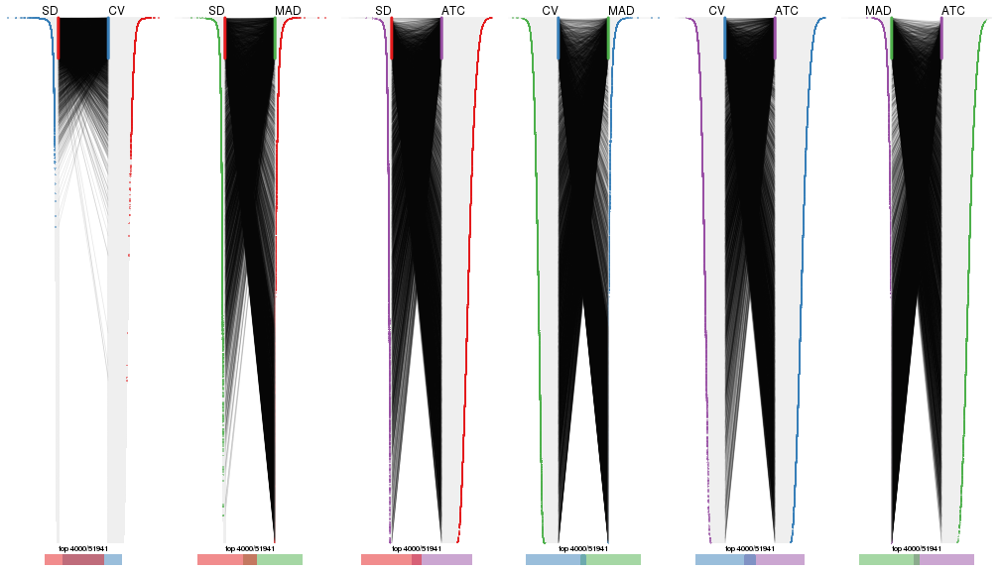</p>

</div>
<div id='tab-top-rows-overlap-by-correspondance-5'>
<pre><code class="r">top_rows_overlap(res_list, top_n = 5000, method = &quot;correspondance&quot;)
</code></pre>

<p></p>

</div>
</div>


Heatmaps of the top rows:


<script>
$( function() {
	$( '#tabs-top-rows-heatmap' ).tabs();
} );
</script>
<div id='tabs-top-rows-heatmap'>
<ul>
<li><a href='#tab-top-rows-heatmap-1'>top_n = 1000</a></li>
<li><a href='#tab-top-rows-heatmap-2'>top_n = 2000</a></li>
<li><a href='#tab-top-rows-heatmap-3'>top_n = 3000</a></li>
<li><a href='#tab-top-rows-heatmap-4'>top_n = 4000</a></li>
<li><a href='#tab-top-rows-heatmap-5'>top_n = 5000</a></li>
</ul>
<div id='tab-top-rows-heatmap-1'>
<pre><code class="r">top_rows_heatmap(res_list, top_n = 1000)
</code></pre>

<p></p>

</div>
<div id='tab-top-rows-heatmap-2'>
<pre><code class="r">top_rows_heatmap(res_list, top_n = 2000)
</code></pre>

<p></p>

</div>
<div id='tab-top-rows-heatmap-3'>
<pre><code class="r">top_rows_heatmap(res_list, top_n = 3000)
</code></pre>

<p></p>

</div>
<div id='tab-top-rows-heatmap-4'>
<pre><code class="r">top_rows_heatmap(res_list, top_n = 4000)
</code></pre>

<p></p>

</div>
<div id='tab-top-rows-heatmap-5'>
<pre><code class="r">top_rows_heatmap(res_list, top_n = 5000)
</code></pre>

<p></p>

</div>
</div>


### Test to known annotations


Test correlation between subgroups and known annotations. If the known
annotation is numeric, one-way ANOVA test is applied, and if the known
annotation is discrete, chi-squared contingency table test is applied.


<script>
$( function() {
	$( '#tabs-test-to-known-factors-from-consensus-partition-list' ).tabs();
} );
</script>
<div id='tabs-test-to-known-factors-from-consensus-partition-list'>
<ul>
<li><a href='#tab-test-to-known-factors-from-consensus-partition-list-1'>k = 2</a></li>
<li><a href='#tab-test-to-known-factors-from-consensus-partition-list-2'>k = 3</a></li>
<li><a href='#tab-test-to-known-factors-from-consensus-partition-list-3'>k = 4</a></li>
<li><a href='#tab-test-to-known-factors-from-consensus-partition-list-4'>k = 5</a></li>
<li><a href='#tab-test-to-known-factors-from-consensus-partition-list-5'>k = 6</a></li>
</ul>
<div id='tab-test-to-known-factors-from-consensus-partition-list-1'>
<pre><code class="r">test_to_known_factors(res_list, k = 2)
</code></pre>

<pre><code>#&gt;               n disease.state(p) other(p) k
#&gt; SD:NMF      151         7.41e-02 1.41e-02 2
#&gt; CV:NMF      148         1.41e-01 7.12e-03 2
#&gt; MAD:NMF     140         1.41e-02 2.47e-02 2
#&gt; ATC:NMF     145         1.47e-01 1.41e-01 2
#&gt; SD:skmeans  115         7.89e-05 1.22e-05 2
#&gt; CV:skmeans  147         2.29e-01 2.69e-02 2
#&gt; MAD:skmeans 154         1.26e-02 1.18e-01 2
#&gt; ATC:skmeans 154         7.08e-01 5.13e-01 2
#&gt; SD:mclust   143         6.94e-03 1.44e-03 2
#&gt; CV:mclust   145         5.55e-01 3.18e-01 2
#&gt; MAD:mclust  148         2.75e-01 2.51e-01 2
#&gt; ATC:mclust  141         8.66e-01 5.76e-01 2
#&gt; SD:kmeans   128         8.26e-01 2.79e-03 2
#&gt; CV:kmeans   153         5.39e-01 3.06e-03 2
#&gt; MAD:kmeans  145         9.33e-03 6.33e-02 2
#&gt; ATC:kmeans  153         6.36e-01 6.76e-01 2
#&gt; SD:pam      127         5.17e-08 4.34e-08 2
#&gt; CV:pam      149         5.45e-01 8.17e-02 2
#&gt; MAD:pam     154         1.54e-03 8.37e-03 2
#&gt; ATC:pam     154         8.05e-01 5.10e-01 2
#&gt; SD:hclust   147         6.47e-01 7.14e-03 2
#&gt; CV:hclust   150         6.27e-01 8.62e-03 2
#&gt; MAD:hclust  125         1.43e-03 8.22e-03 2
#&gt; ATC:hclust  151         2.93e-01 2.48e-01 2
</code></pre>

</div>
<div id='tab-test-to-known-factors-from-consensus-partition-list-2'>
<pre><code class="r">test_to_known_factors(res_list, k = 3)
</code></pre>

<pre><code>#&gt;               n disease.state(p) other(p) k
#&gt; SD:NMF      145         1.87e-04 5.09e-05 3
#&gt; CV:NMF      133         5.11e-01 6.63e-02 3
#&gt; MAD:NMF     147         1.34e-03 1.51e-03 3
#&gt; ATC:NMF     149         6.58e-01 1.61e-01 3
#&gt; SD:skmeans  151         1.26e-03 8.13e-04 3
#&gt; CV:skmeans  150         7.34e-01 3.65e-02 3
#&gt; MAD:skmeans 135         7.16e-04 3.17e-04 3
#&gt; ATC:skmeans 149         2.83e-01 2.09e-01 3
#&gt; SD:mclust    99         7.39e-02 6.46e-04 3
#&gt; CV:mclust   122         2.68e-03 3.34e-02 3
#&gt; MAD:mclust  130         2.00e-04 9.30e-05 3
#&gt; ATC:mclust  141         6.44e-01 3.06e-01 3
#&gt; SD:kmeans   139         2.34e-04 1.38e-06 3
#&gt; CV:kmeans   138         9.11e-01 4.81e-02 3
#&gt; MAD:kmeans  144         5.33e-04 3.77e-05 3
#&gt; ATC:kmeans  144         1.54e-01 9.12e-02 3
#&gt; SD:pam      137         5.81e-06 3.16e-07 3
#&gt; CV:pam       82         1.83e-01 1.72e-02 3
#&gt; MAD:pam     152         1.10e-03 1.09e-03 3
#&gt; ATC:pam     140         8.79e-02 1.08e-01 3
#&gt; SD:hclust   115         6.62e-04 1.20e-05 3
#&gt; CV:hclust   125         1.32e-10 2.23e-09 3
#&gt; MAD:hclust  107         1.06e-04 1.13e-02 3
#&gt; ATC:hclust   85         4.22e-01 6.16e-01 3
</code></pre>

</div>
<div id='tab-test-to-known-factors-from-consensus-partition-list-3'>
<pre><code class="r">test_to_known_factors(res_list, k = 4)
</code></pre>

<pre><code>#&gt;               n disease.state(p) other(p) k
#&gt; SD:NMF      135         7.85e-03 2.62e-05 4
#&gt; CV:NMF      143         2.11e-06 1.85e-07 4
#&gt; MAD:NMF     106         8.33e-03 1.62e-02 4
#&gt; ATC:NMF     139         4.46e-01 4.05e-02 4
#&gt; SD:skmeans  131         4.85e-04 5.69e-05 4
#&gt; CV:skmeans  145         7.36e-06 2.64e-07 4
#&gt; MAD:skmeans 144         3.18e-03 4.02e-03 4
#&gt; ATC:skmeans 141         1.37e-01 3.84e-02 4
#&gt; SD:mclust   130         5.91e-04 1.16e-06 4
#&gt; CV:mclust   138         4.89e-13 2.88e-12 4
#&gt; MAD:mclust  140         4.61e-03 3.05e-03 4
#&gt; ATC:mclust  118         6.96e-01 6.98e-01 4
#&gt; SD:kmeans   122         3.84e-05 1.47e-06 4
#&gt; CV:kmeans   142         4.96e-14 1.05e-12 4
#&gt; MAD:kmeans  142         1.84e-03 6.96e-04 4
#&gt; ATC:kmeans  136         1.90e-01 6.79e-02 4
#&gt; SD:pam      131         4.86e-06 4.06e-07 4
#&gt; CV:pam      131         2.26e-13 2.90e-10 4
#&gt; MAD:pam     148         1.79e-03 1.68e-03 4
#&gt; ATC:pam     139         5.77e-02 3.20e-02 4
#&gt; SD:hclust    62         3.10e-03 3.52e-04 4
#&gt; CV:hclust   145         1.27e-11 5.99e-10 4
#&gt; MAD:hclust   83         1.07e-04 1.09e-03 4
#&gt; ATC:hclust  127         3.30e-01 7.50e-02 4
</code></pre>

</div>
<div id='tab-test-to-known-factors-from-consensus-partition-list-4'>
<pre><code class="r">test_to_known_factors(res_list, k = 5)
</code></pre>

<pre><code>#&gt;               n disease.state(p) other(p) k
#&gt; SD:NMF       86         6.91e-03 8.15e-03 5
#&gt; CV:NMF      140         8.07e-06 1.72e-07 5
#&gt; MAD:NMF     129         1.18e-02 3.48e-03 5
#&gt; ATC:NMF     131         5.21e-01 2.72e-02 5
#&gt; SD:skmeans  138         2.34e-04 1.34e-06 5
#&gt; CV:skmeans  131         2.44e-05 1.85e-06 5
#&gt; MAD:skmeans 103         2.78e-02 5.40e-02 5
#&gt; ATC:skmeans 142         3.87e-01 1.40e-01 5
#&gt; SD:mclust    93         1.09e-03 2.48e-04 5
#&gt; CV:mclust   126         2.66e-13 1.92e-11 5
#&gt; MAD:mclust  128         3.78e-03 5.96e-04 5
#&gt; ATC:mclust  112         5.57e-01 4.00e-01 5
#&gt; SD:kmeans   116         3.25e-05 1.58e-05 5
#&gt; CV:kmeans    71         1.73e-09 1.14e-08 5
#&gt; MAD:kmeans  120         1.26e-03 5.25e-04 5
#&gt; ATC:kmeans  136         6.20e-01 4.18e-01 5
#&gt; SD:pam      122         1.43e-10 7.63e-12 5
#&gt; CV:pam      125         1.18e-11 2.44e-09 5
#&gt; MAD:pam     142         1.34e-03 9.55e-05 5
#&gt; ATC:pam     152         1.67e-01 1.34e-01 5
#&gt; SD:hclust    54         3.23e-04 2.08e-03 5
#&gt; CV:hclust    79         8.52e-09 7.72e-09 5
#&gt; MAD:hclust   65         1.16e-04 5.73e-04 5
#&gt; ATC:hclust  107         2.99e-02 2.79e-01 5
</code></pre>

</div>
<div id='tab-test-to-known-factors-from-consensus-partition-list-5'>
<pre><code class="r">test_to_known_factors(res_list, k = 6)
</code></pre>

<pre><code>#&gt;               n disease.state(p) other(p) k
#&gt; SD:NMF       89         8.83e-05 2.72e-04 6
#&gt; CV:NMF      141         3.11e-09 1.78e-10 6
#&gt; MAD:NMF      75         2.11e-01 4.16e-02 6
#&gt; ATC:NMF     136         3.08e-01 2.61e-02 6
#&gt; SD:skmeans  123         2.73e-06 2.27e-08 6
#&gt; CV:skmeans  117         1.08e-09 8.66e-09 6
#&gt; MAD:skmeans 120         7.32e-03 5.29e-04 6
#&gt; ATC:skmeans 140         2.63e-01 2.42e-01 6
#&gt; SD:mclust    84         2.67e-07 6.13e-08 6
#&gt; CV:mclust    78         2.15e-08 1.05e-06 6
#&gt; MAD:mclust  112         4.38e-04 2.57e-04 6
#&gt; ATC:mclust  121         4.24e-01 1.09e-01 6
#&gt; SD:kmeans   119         1.46e-10 3.73e-12 6
#&gt; CV:kmeans   125         3.47e-12 9.34e-14 6
#&gt; MAD:kmeans   87         3.67e-04 5.17e-04 6
#&gt; ATC:kmeans  104         1.82e-01 1.80e-01 6
#&gt; SD:pam      129         2.62e-09 1.01e-09 6
#&gt; CV:pam      120         3.16e-10 3.42e-08 6
#&gt; MAD:pam     119         2.01e-03 6.29e-03 6
#&gt; ATC:pam     143         6.79e-02 7.83e-02 6
#&gt; SD:hclust    48         3.29e-03 2.78e-03 6
#&gt; CV:hclust    81         5.98e-08 5.69e-08 6
#&gt; MAD:hclust   63         1.35e-03 8.56e-04 6
#&gt; ATC:hclust  114         1.11e-01 3.32e-01 6
</code></pre>

</div>
</div>


 
## Results for each method


---------------------------------------------------


### SD:hclust


The object with results only for a single top-value method and a single partition method 
can be extracted as:

```r
res = res_list["SD", "hclust"]
# you can also extract it by
# res = res_list["SD:hclust"]
```

A summary of `res` and all the functions that can be applied to it:

```r
res
```

```
#> A 'ConsensusPartition' object with k = 2, 3, 4, 5, 6.
#>   On a matrix with 51941 rows and 154 columns.
#>   Top rows (1000, 2000, 3000, 4000, 5000) are extracted by 'SD' method.
#>   Subgroups are detected by 'hclust' method.
#>   Performed in total 1250 partitions by row resampling.
#>   Best k for subgroups seems to be 3.
#> 
#> Following methods can be applied to this 'ConsensusPartition' object:
#>  [1] "cola_report"             "collect_classes"         "collect_plots"          
#>  [4] "collect_stats"           "colnames"                "compare_signatures"     
#>  [7] "consensus_heatmap"       "dimension_reduction"     "functional_enrichment"  
#> [10] "get_anno_col"            "get_anno"                "get_classes"            
#> [13] "get_consensus"           "get_matrix"              "get_membership"         
#> [16] "get_param"               "get_signatures"          "get_stats"              
#> [19] "is_best_k"               "is_stable_k"             "membership_heatmap"     
#> [22] "ncol"                    "nrow"                    "plot_ecdf"              
#> [25] "rownames"                "select_partition_number" "show"                   
#> [28] "suggest_best_k"          "test_to_known_factors"
```

`collect_plots()` function collects all the plots made from `res` for all `k` (number of partitions)
into one single page to provide an easy and fast comparison between different `k`.

```r
collect_plots(res)
```


The plots are:

- The first row: a plot of the ECDF (Empirical cumulative distribution
  function) curves of the consensus matrix for each `k` and the heatmap of
  predicted classes for each `k`.
- The second row: heatmaps of the consensus matrix for each `k`.
- The third row: heatmaps of the membership matrix for each `k`.
- The fouth row: heatmaps of the signatures for each `k`.

All the plots in panels can be made by individual functions and they are
plotted later in this section.

`select_partition_number()` produces several plots showing different
statistics for choosing "optimized" `k`. There are following statistics:

- ECDF curves of the consensus matrix for each `k`;
- 1-PAC. [The PAC
  score](https://en.wikipedia.org/wiki/Consensus_clustering#Over-interpretation_potential_of_consensus_clustering)
  measures the proportion of the ambiguous subgrouping.
- Mean silhouette score.
- Concordance. The mean probability of fiting the consensus class ids in all
  partitions.
- Area increased. Denote $A_k$ as the area under the ECDF curve for current
  `k`, the area increased is defined as $A_k - A_{k-1}$.
- Rand index. The percent of pairs of samples that are both in a same cluster
  or both are not in a same cluster in the partition of k and k-1.
- Jaccard index. The ratio of pairs of samples are both in a same cluster in
  the partition of k and k-1 and the pairs of samples are both in a same
  cluster in the partition k or k-1.

The detailed explanations of these statistics can be found in [the cola
vignette](http://bioconductor.org/packages/devel/bioc/vignettes/cola/inst/doc/cola.html#toc_13).

Generally speaking, lower PAC score, higher mean silhouette score or higher
concordance corresponds to better partition. Rand index and Jaccard index
measure how similar the current partition is compared to partition with `k-1`.
If they are too similar, we won't accept `k` is better than `k-1`.

```r
select_partition_number(res)
```


The numeric values for all these statistics can be obtained by `get_stats()`.

```r
get_stats(res)
```

```
#>   k 1-PAC mean_silhouette concordance area_increased  Rand Jaccard
#> 2 2 0.208           0.811       0.862         0.3245 0.726   0.726
#> 3 3 0.151           0.554       0.714         0.7965 0.634   0.500
#> 4 4 0.281           0.432       0.664         0.1895 0.838   0.588
#> 5 5 0.391           0.374       0.614         0.0943 0.924   0.723
#> 6 6 0.481           0.361       0.591         0.0565 0.936   0.725
```

`suggest_best_k()` suggests the best $k$ based on these statistics. The rules are as follows:

- All $k$ with Jaccard index larger than 0.95 are removed because the increase of
  the partition number does not provides enough extra information. If all $k$ are removed,
  the best $k$ is assigned by `NA`.
- For $k$ with 1-PAC larger than 0.9, the maximal $k$ is taken as the "best k". Other $k$ is called "optional k".
- If it does not fit the second rule. The $k$ with the highest vote of highest
  1-PAC, mean silhouette and concordance is taken as the "best k".

```r
suggest_best_k(res)
```

```
#> [1] 3
```


Following shows the table of the partitions (You need to click the **show/hide
code output** link to see it). The membership matrix (columns with name `p*`)
is inferred by
[`clue::cl_consensus()`](https://www.rdocumentation.org/link/cl_consensus?package=clue)
function with the `SE` method. Basically the value in the membership matrix
represents the probability to belong to a certain group. The finall class
label for an item is determined with the group with highest probability it
belongs to.

In `get_classes()` function, the entropy is calculated from the membership
matrix and the silhouette score is calculated from the consensus matrix.


<script>
$( function() {
	$( '#tabs-SD-hclust-get-classes' ).tabs();
} );
</script>
<div id='tabs-SD-hclust-get-classes'>
<ul>
<li><a href='#tab-SD-hclust-get-classes-1'>k = 2</a></li>
<li><a href='#tab-SD-hclust-get-classes-2'>k = 3</a></li>
<li><a href='#tab-SD-hclust-get-classes-3'>k = 4</a></li>
<li><a href='#tab-SD-hclust-get-classes-4'>k = 5</a></li>
<li><a href='#tab-SD-hclust-get-classes-5'>k = 6</a></li>
</ul>

<div id='tab-SD-hclust-get-classes-1'>
<p><a id='tab-SD-hclust-get-classes-1-a' style='color:#0366d6' href='#'>show/hide code output</a></p>
<pre><code class="r">cbind(get_classes(res, k = 2), get_membership(res, k = 2))
</code></pre>

<pre><code>#&gt;           class entropy silhouette    p1    p2
#&gt; GSM340358     1  0.5629     0.8317 0.868 0.132
#&gt; GSM340359     1  0.5629     0.8317 0.868 0.132
#&gt; GSM340361     1  0.5629     0.8308 0.868 0.132
#&gt; GSM340362     1  0.0938     0.8686 0.988 0.012
#&gt; GSM340363     1  0.7815     0.7206 0.768 0.232
#&gt; GSM340364     1  0.5629     0.8317 0.868 0.132
#&gt; GSM340365     1  0.4690     0.8431 0.900 0.100
#&gt; GSM340366     1  0.5408     0.8162 0.876 0.124
#&gt; GSM340367     1  0.5629     0.8317 0.868 0.132
#&gt; GSM340368     2  0.7453     0.8469 0.212 0.788
#&gt; GSM340369     2  0.7745     0.8361 0.228 0.772
#&gt; GSM340370     1  0.5629     0.8317 0.868 0.132
#&gt; GSM340371     1  0.2043     0.8699 0.968 0.032
#&gt; GSM340372     1  0.5629     0.8317 0.868 0.132
#&gt; GSM340373     1  0.5629     0.8317 0.868 0.132
#&gt; GSM340375     1  0.5629     0.8317 0.868 0.132
#&gt; GSM340376     1  0.5629     0.8317 0.868 0.132
#&gt; GSM340378     1  0.5629     0.8317 0.868 0.132
#&gt; GSM340243     1  0.5842     0.8223 0.860 0.140
#&gt; GSM340244     1  0.2603     0.8727 0.956 0.044
#&gt; GSM340246     1  0.2603     0.8721 0.956 0.044
#&gt; GSM340247     2  0.6801     0.8798 0.180 0.820
#&gt; GSM340248     1  0.4431     0.8617 0.908 0.092
#&gt; GSM340249     1  0.9710     0.0297 0.600 0.400
#&gt; GSM340250     1  0.8016     0.7292 0.756 0.244
#&gt; GSM340251     1  0.6887     0.7573 0.816 0.184
#&gt; GSM340252     1  0.9833    -0.0599 0.576 0.424
#&gt; GSM340253     1  0.1184     0.8676 0.984 0.016
#&gt; GSM340254     1  0.2043     0.8687 0.968 0.032
#&gt; GSM340256     1  0.2603     0.8701 0.956 0.044
#&gt; GSM340258     1  0.3431     0.8653 0.936 0.064
#&gt; GSM340259     1  0.2423     0.8689 0.960 0.040
#&gt; GSM340260     1  0.2948     0.8732 0.948 0.052
#&gt; GSM340261     1  0.4939     0.8614 0.892 0.108
#&gt; GSM340262     1  0.1633     0.8709 0.976 0.024
#&gt; GSM340263     1  0.2423     0.8690 0.960 0.040
#&gt; GSM340264     1  0.1414     0.8701 0.980 0.020
#&gt; GSM340265     1  0.2236     0.8657 0.964 0.036
#&gt; GSM340266     1  0.3879     0.8631 0.924 0.076
#&gt; GSM340267     1  0.4161     0.8583 0.916 0.084
#&gt; GSM340268     1  0.5178     0.8247 0.884 0.116
#&gt; GSM340269     1  0.2043     0.8706 0.968 0.032
#&gt; GSM340270     1  0.2948     0.8700 0.948 0.052
#&gt; GSM537574     1  0.2603     0.8686 0.956 0.044
#&gt; GSM537580     1  0.2043     0.8699 0.968 0.032
#&gt; GSM537581     1  0.8081     0.7198 0.752 0.248
#&gt; GSM340272     1  0.5059     0.8179 0.888 0.112
#&gt; GSM340273     1  0.6148     0.8167 0.848 0.152
#&gt; GSM340275     2  0.8555     0.8476 0.280 0.720
#&gt; GSM340276     1  0.2423     0.8689 0.960 0.040
#&gt; GSM340277     1  0.5178     0.8175 0.884 0.116
#&gt; GSM340278     1  0.4298     0.8622 0.912 0.088
#&gt; GSM340279     1  0.5059     0.8594 0.888 0.112
#&gt; GSM340282     1  0.5059     0.8179 0.888 0.112
#&gt; GSM340284     1  0.5294     0.8304 0.880 0.120
#&gt; GSM340285     1  0.5059     0.8492 0.888 0.112
#&gt; GSM340286     1  0.1633     0.8707 0.976 0.024
#&gt; GSM340287     1  0.4939     0.8614 0.892 0.108
#&gt; GSM340288     1  0.6148     0.8167 0.848 0.152
#&gt; GSM340289     1  0.2778     0.8704 0.952 0.048
#&gt; GSM340290     2  0.9983     0.4792 0.476 0.524
#&gt; GSM340291     1  0.2043     0.8738 0.968 0.032
#&gt; GSM340293     1  0.8861     0.6223 0.696 0.304
#&gt; GSM340294     1  0.4939     0.8614 0.892 0.108
#&gt; GSM340296     1  0.5519     0.8157 0.872 0.128
#&gt; GSM340297     1  0.8386     0.7003 0.732 0.268
#&gt; GSM340298     1  0.5519     0.8157 0.872 0.128
#&gt; GSM340299     1  0.1414     0.8688 0.980 0.020
#&gt; GSM340301     1  0.1414     0.8692 0.980 0.020
#&gt; GSM340303     1  0.4939     0.8274 0.892 0.108
#&gt; GSM340304     1  0.4298     0.8459 0.912 0.088
#&gt; GSM340306     2  0.6801     0.8486 0.180 0.820
#&gt; GSM340307     1  0.6148     0.8049 0.848 0.152
#&gt; GSM340310     1  0.5737     0.8309 0.864 0.136
#&gt; GSM340314     1  0.8327     0.5814 0.736 0.264
#&gt; GSM340315     1  0.8081     0.7198 0.752 0.248
#&gt; GSM340317     1  0.9393     0.3975 0.644 0.356
#&gt; GSM340318     2  0.6973     0.8810 0.188 0.812
#&gt; GSM340319     2  0.6973     0.8810 0.188 0.812
#&gt; GSM340320     2  0.8713     0.7593 0.292 0.708
#&gt; GSM340321     1  0.3733     0.8716 0.928 0.072
#&gt; GSM340322     2  0.6973     0.8810 0.188 0.812
#&gt; GSM340324     1  0.3431     0.8733 0.936 0.064
#&gt; GSM340328     1  0.5737     0.8309 0.864 0.136
#&gt; GSM340330     1  0.5519     0.8240 0.872 0.128
#&gt; GSM340332     2  0.8608     0.8447 0.284 0.716
#&gt; GSM340333     1  0.1184     0.8676 0.984 0.016
#&gt; GSM340336     2  0.6973     0.8810 0.188 0.812
#&gt; GSM340337     2  0.6531     0.8679 0.168 0.832
#&gt; GSM340338     1  0.3584     0.8636 0.932 0.068
#&gt; GSM340339     2  0.8661     0.7611 0.288 0.712
#&gt; GSM340340     2  0.9710     0.5500 0.400 0.600
#&gt; GSM340341     2  0.7453     0.8708 0.212 0.788
#&gt; GSM340343     2  0.9977     0.4941 0.472 0.528
#&gt; GSM340344     1  0.0938     0.8686 0.988 0.012
#&gt; GSM340346     1  0.5408     0.8165 0.876 0.124
#&gt; GSM340347     2  0.6801     0.8798 0.180 0.820
#&gt; GSM340348     2  0.7376     0.8658 0.208 0.792
#&gt; GSM340349     1  0.4939     0.8310 0.892 0.108
#&gt; GSM340350     1  0.5059     0.8179 0.888 0.112
#&gt; GSM340351     1  0.5629     0.8308 0.868 0.132
#&gt; GSM340354     1  0.2948     0.8706 0.948 0.052
#&gt; GSM340356     1  0.6148     0.8167 0.848 0.152
#&gt; GSM340357     1  0.7453     0.8027 0.788 0.212
#&gt; GSM348183     1  0.6623     0.7788 0.828 0.172
#&gt; GSM348191     1  0.2603     0.8709 0.956 0.044
#&gt; GSM348193     1  0.6531     0.8047 0.832 0.168
#&gt; GSM537578     1  0.6048     0.8285 0.852 0.148
#&gt; GSM348181     1  0.2948     0.8689 0.948 0.052
#&gt; GSM348182     1  0.2043     0.8713 0.968 0.032
#&gt; GSM348184     1  0.6343     0.8044 0.840 0.160
#&gt; GSM348185     1  0.9635     0.2950 0.612 0.388
#&gt; GSM348186     1  0.2603     0.8722 0.956 0.044
#&gt; GSM348187     1  0.6148     0.8167 0.848 0.152
#&gt; GSM348188     1  0.9608     0.2897 0.616 0.384
#&gt; GSM348189     1  0.2043     0.8699 0.968 0.032
#&gt; GSM348190     1  0.4431     0.8598 0.908 0.092
#&gt; GSM348194     1  0.6148     0.8167 0.848 0.152
#&gt; GSM348195     1  0.5737     0.8277 0.864 0.136
#&gt; GSM348196     1  0.6148     0.8167 0.848 0.152
#&gt; GSM537585     1  0.5519     0.8515 0.872 0.128
#&gt; GSM537594     1  0.4815     0.8549 0.896 0.104
#&gt; GSM537596     1  0.4939     0.8541 0.892 0.108
#&gt; GSM537597     1  0.4690     0.8510 0.900 0.100
#&gt; GSM537602     1  0.4939     0.8310 0.892 0.108
#&gt; GSM340184     1  0.5519     0.8240 0.872 0.128
#&gt; GSM340185     1  0.6531     0.7940 0.832 0.168
#&gt; GSM340186     1  0.4939     0.8344 0.892 0.108
#&gt; GSM340187     2  0.8861     0.8238 0.304 0.696
#&gt; GSM340189     2  0.8081     0.8664 0.248 0.752
#&gt; GSM340190     1  0.6887     0.7810 0.816 0.184
#&gt; GSM340191     1  0.5294     0.8212 0.880 0.120
#&gt; GSM340192     1  0.5519     0.8157 0.872 0.128
#&gt; GSM340193     1  0.4431     0.8598 0.908 0.092
#&gt; GSM340194     1  0.0938     0.8686 0.988 0.012
#&gt; GSM340195     1  0.1414     0.8693 0.980 0.020
#&gt; GSM340196     2  0.6973     0.8810 0.188 0.812
#&gt; GSM340197     1  0.1184     0.8689 0.984 0.016
#&gt; GSM340198     1  0.5178     0.8390 0.884 0.116
#&gt; GSM340199     1  0.5408     0.8165 0.876 0.124
#&gt; GSM340200     1  0.6148     0.8049 0.848 0.152
#&gt; GSM340201     2  0.6801     0.8798 0.180 0.820
#&gt; GSM340202     2  0.6973     0.8810 0.188 0.812
#&gt; GSM340203     2  0.7219     0.8825 0.200 0.800
#&gt; GSM340204     1  0.3114     0.8684 0.944 0.056
#&gt; GSM340205     1  0.3114     0.8691 0.944 0.056
#&gt; GSM340206     1  0.5842     0.8160 0.860 0.140
#&gt; GSM340207     1  0.3584     0.8636 0.932 0.068
#&gt; GSM340237     1  0.4161     0.8536 0.916 0.084
#&gt; GSM340238     1  0.5629     0.8206 0.868 0.132
#&gt; GSM340239     1  0.1414     0.8701 0.980 0.020
#&gt; GSM340240     1  0.5178     0.8175 0.884 0.116
#&gt; GSM340241     1  0.3114     0.8654 0.944 0.056
#&gt; GSM340242     1  0.2043     0.8710 0.968 0.032
</code></pre>

<script>
$('#tab-SD-hclust-get-classes-1-a').parent().next().next().hide();
$('#tab-SD-hclust-get-classes-1-a').click(function(){
  $('#tab-SD-hclust-get-classes-1-a').parent().next().next().toggle();
  return(false);
});
</script>
</div>

<div id='tab-SD-hclust-get-classes-2'>
<p><a id='tab-SD-hclust-get-classes-2-a' style='color:#0366d6' href='#'>show/hide code output</a></p>
<pre><code class="r">cbind(get_classes(res, k = 3), get_membership(res, k = 3))
</code></pre>

<pre><code>#&gt;           class entropy silhouette    p1    p2    p3
#&gt; GSM340358     1   0.127     0.6882 0.972 0.004 0.024
#&gt; GSM340359     1   0.127     0.6882 0.972 0.004 0.024
#&gt; GSM340361     1   0.134     0.6850 0.972 0.012 0.016
#&gt; GSM340362     3   0.835     0.6128 0.288 0.116 0.596
#&gt; GSM340363     1   0.384     0.6070 0.872 0.116 0.012
#&gt; GSM340364     1   0.127     0.6882 0.972 0.004 0.024
#&gt; GSM340365     3   0.724     0.4342 0.392 0.032 0.576
#&gt; GSM340366     3   0.504     0.6378 0.172 0.020 0.808
#&gt; GSM340367     1   0.127     0.6882 0.972 0.004 0.024
#&gt; GSM340368     2   0.571     0.6593 0.320 0.680 0.000
#&gt; GSM340369     2   0.603     0.6383 0.336 0.660 0.004
#&gt; GSM340370     1   0.127     0.6882 0.972 0.004 0.024
#&gt; GSM340371     3   0.787     0.6642 0.216 0.124 0.660
#&gt; GSM340372     1   0.127     0.6882 0.972 0.004 0.024
#&gt; GSM340373     1   0.127     0.6882 0.972 0.004 0.024
#&gt; GSM340375     1   0.127     0.6882 0.972 0.004 0.024
#&gt; GSM340376     1   0.127     0.6882 0.972 0.004 0.024
#&gt; GSM340378     1   0.127     0.6882 0.972 0.004 0.024
#&gt; GSM340243     3   0.560     0.6140 0.216 0.020 0.764
#&gt; GSM340244     1   0.796     0.4775 0.648 0.120 0.232
#&gt; GSM340246     1   0.890    -0.0767 0.480 0.124 0.396
#&gt; GSM340247     2   0.238     0.7927 0.044 0.940 0.016
#&gt; GSM340248     1   0.800     0.3874 0.620 0.096 0.284
#&gt; GSM340249     2   0.923     0.1485 0.176 0.508 0.316
#&gt; GSM340250     1   0.917     0.0362 0.460 0.148 0.392
#&gt; GSM340251     3   0.792     0.5864 0.108 0.248 0.644
#&gt; GSM340252     2   0.921     0.1844 0.188 0.524 0.288
#&gt; GSM340253     3   0.807     0.6230 0.284 0.100 0.616
#&gt; GSM340254     3   0.856     0.2741 0.420 0.096 0.484
#&gt; GSM340256     1   0.838     0.3424 0.600 0.124 0.276
#&gt; GSM340258     3   0.846     0.6285 0.264 0.136 0.600
#&gt; GSM340259     1   0.796     0.4353 0.648 0.120 0.232
#&gt; GSM340260     1   0.857     0.1924 0.548 0.112 0.340
#&gt; GSM340261     3   0.835     0.6113 0.280 0.120 0.600
#&gt; GSM340262     3   0.855     0.5909 0.312 0.120 0.568
#&gt; GSM340263     1   0.657     0.5733 0.756 0.104 0.140
#&gt; GSM340264     3   0.855     0.5615 0.336 0.112 0.552
#&gt; GSM340265     3   0.668     0.6901 0.168 0.088 0.744
#&gt; GSM340266     1   0.856     0.3683 0.596 0.148 0.256
#&gt; GSM340267     3   0.858     0.2583 0.444 0.096 0.460
#&gt; GSM340268     3   0.816     0.6338 0.196 0.160 0.644
#&gt; GSM340269     3   0.882     0.4895 0.364 0.124 0.512
#&gt; GSM340270     1   0.696     0.5673 0.728 0.100 0.172
#&gt; GSM537574     1   0.893    -0.0505 0.488 0.128 0.384
#&gt; GSM537580     3   0.787     0.6642 0.216 0.124 0.660
#&gt; GSM537581     1   0.755     0.4755 0.684 0.112 0.204
#&gt; GSM340272     3   0.421     0.6425 0.128 0.016 0.856
#&gt; GSM340273     1   0.200     0.6675 0.952 0.036 0.012
#&gt; GSM340275     2   0.533     0.7452 0.076 0.824 0.100
#&gt; GSM340276     1   0.796     0.4353 0.648 0.120 0.232
#&gt; GSM340277     3   0.353     0.6424 0.092 0.016 0.892
#&gt; GSM340278     3   0.912     0.5072 0.328 0.160 0.512
#&gt; GSM340279     3   0.841     0.6092 0.280 0.124 0.596
#&gt; GSM340282     3   0.435     0.6411 0.128 0.020 0.852
#&gt; GSM340284     3   0.777     0.6515 0.172 0.152 0.676
#&gt; GSM340285     3   0.716     0.5249 0.316 0.044 0.640
#&gt; GSM340286     3   0.876     0.5161 0.360 0.120 0.520
#&gt; GSM340287     3   0.835     0.6113 0.280 0.120 0.600
#&gt; GSM340288     1   0.200     0.6675 0.952 0.036 0.012
#&gt; GSM340289     1   0.664     0.5734 0.752 0.108 0.140
#&gt; GSM340290     2   0.839     0.4237 0.316 0.576 0.108
#&gt; GSM340291     1   0.816     0.3219 0.588 0.092 0.320
#&gt; GSM340293     3   0.563     0.5220 0.044 0.164 0.792
#&gt; GSM340294     3   0.835     0.6113 0.280 0.120 0.600
#&gt; GSM340296     3   0.468     0.6405 0.148 0.020 0.832
#&gt; GSM340297     1   0.902     0.0984 0.480 0.136 0.384
#&gt; GSM340298     3   0.468     0.6405 0.148 0.020 0.832
#&gt; GSM340299     3   0.826     0.6201 0.284 0.112 0.604
#&gt; GSM340301     3   0.877     0.5345 0.348 0.124 0.528
#&gt; GSM340303     3   0.398     0.6595 0.144 0.004 0.852
#&gt; GSM340304     3   0.690     0.5597 0.292 0.040 0.668
#&gt; GSM340306     2   0.550     0.6511 0.292 0.708 0.000
#&gt; GSM340307     3   0.217     0.6340 0.048 0.008 0.944
#&gt; GSM340310     1   0.117     0.6856 0.976 0.008 0.016
#&gt; GSM340314     3   0.881     0.5119 0.140 0.312 0.548
#&gt; GSM340315     1   0.755     0.4755 0.684 0.112 0.204
#&gt; GSM340317     1   0.679     0.3401 0.648 0.324 0.028
#&gt; GSM340318     2   0.230     0.7927 0.036 0.944 0.020
#&gt; GSM340319     2   0.230     0.7927 0.036 0.944 0.020
#&gt; GSM340320     2   0.775     0.5697 0.340 0.596 0.064
#&gt; GSM340321     1   0.865     0.0856 0.512 0.108 0.380
#&gt; GSM340322     2   0.230     0.7927 0.036 0.944 0.020
#&gt; GSM340324     1   0.706     0.5587 0.708 0.080 0.212
#&gt; GSM340328     1   0.145     0.6877 0.968 0.008 0.024
#&gt; GSM340330     3   0.788     0.6455 0.160 0.172 0.668
#&gt; GSM340332     2   0.636     0.7412 0.096 0.768 0.136
#&gt; GSM340333     3   0.807     0.6230 0.284 0.100 0.616
#&gt; GSM340336     2   0.230     0.7927 0.036 0.944 0.020
#&gt; GSM340337     2   0.411     0.7668 0.152 0.844 0.004
#&gt; GSM340338     3   0.819     0.6477 0.232 0.136 0.632
#&gt; GSM340339     2   0.783     0.5753 0.340 0.592 0.068
#&gt; GSM340340     2   0.683     0.3441 0.492 0.496 0.012
#&gt; GSM340341     2   0.527     0.7442 0.200 0.784 0.016
#&gt; GSM340343     2   0.795     0.4604 0.308 0.608 0.084
#&gt; GSM340344     3   0.831     0.6105 0.292 0.112 0.596
#&gt; GSM340346     3   0.353     0.6345 0.092 0.016 0.892
#&gt; GSM340347     2   0.238     0.7927 0.044 0.940 0.016
#&gt; GSM340348     2   0.574     0.7108 0.256 0.732 0.012
#&gt; GSM340349     3   0.613     0.5786 0.268 0.020 0.712
#&gt; GSM340350     3   0.421     0.6430 0.128 0.016 0.856
#&gt; GSM340351     1   0.134     0.6850 0.972 0.012 0.016
#&gt; GSM340354     3   0.898     0.4668 0.368 0.136 0.496
#&gt; GSM340356     1   0.200     0.6675 0.952 0.036 0.012
#&gt; GSM340357     1   0.823     0.1210 0.512 0.076 0.412
#&gt; GSM348183     1   0.737     0.5658 0.688 0.220 0.092
#&gt; GSM348191     1   0.860     0.2532 0.576 0.132 0.292
#&gt; GSM348193     1   0.245     0.6736 0.936 0.052 0.012
#&gt; GSM537578     3   0.561     0.6193 0.196 0.028 0.776
#&gt; GSM348181     1   0.653     0.5832 0.760 0.112 0.128
#&gt; GSM348182     1   0.884    -0.1821 0.488 0.120 0.392
#&gt; GSM348184     3   0.542     0.6514 0.080 0.100 0.820
#&gt; GSM348185     1   0.665     0.2610 0.640 0.340 0.020
#&gt; GSM348186     3   0.869     0.1590 0.444 0.104 0.452
#&gt; GSM348187     1   0.200     0.6675 0.952 0.036 0.012
#&gt; GSM348188     1   0.714     0.2030 0.576 0.396 0.028
#&gt; GSM348189     3   0.787     0.6642 0.216 0.124 0.660
#&gt; GSM348190     1   0.804     0.3146 0.600 0.088 0.312
#&gt; GSM348194     1   0.200     0.6675 0.952 0.036 0.012
#&gt; GSM348195     1   0.164     0.6801 0.964 0.020 0.016
#&gt; GSM348196     1   0.200     0.6675 0.952 0.036 0.012
#&gt; GSM537585     3   0.728     0.1920 0.460 0.028 0.512
#&gt; GSM537594     1   0.678     0.5998 0.732 0.080 0.188
#&gt; GSM537596     1   0.694     0.5797 0.724 0.088 0.188
#&gt; GSM537597     1   0.355     0.6750 0.896 0.080 0.024
#&gt; GSM537602     3   0.629     0.5491 0.288 0.020 0.692
#&gt; GSM340184     3   0.783     0.6454 0.156 0.172 0.672
#&gt; GSM340185     3   0.257     0.6174 0.032 0.032 0.936
#&gt; GSM340186     3   0.704     0.6579 0.128 0.144 0.728
#&gt; GSM340187     2   0.576     0.7061 0.056 0.792 0.152
#&gt; GSM340189     2   0.434     0.7679 0.048 0.868 0.084
#&gt; GSM340190     3   0.288     0.6176 0.024 0.052 0.924
#&gt; GSM340191     3   0.825     0.6313 0.200 0.164 0.636
#&gt; GSM340192     3   0.440     0.6500 0.116 0.028 0.856
#&gt; GSM340193     1   0.698     0.5751 0.720 0.088 0.192
#&gt; GSM340194     3   0.835     0.6128 0.288 0.116 0.596
#&gt; GSM340195     3   0.880     0.4450 0.396 0.116 0.488
#&gt; GSM340196     2   0.230     0.7927 0.036 0.944 0.020
#&gt; GSM340197     3   0.851     0.5889 0.316 0.116 0.568
#&gt; GSM340198     3   0.933     0.2662 0.372 0.168 0.460
#&gt; GSM340199     3   0.344     0.6342 0.088 0.016 0.896
#&gt; GSM340200     3   0.253     0.6243 0.044 0.020 0.936
#&gt; GSM340201     2   0.238     0.7927 0.044 0.940 0.016
#&gt; GSM340202     2   0.230     0.7927 0.036 0.944 0.020
#&gt; GSM340203     2   0.374     0.7915 0.072 0.892 0.036
#&gt; GSM340204     1   0.835     0.3675 0.608 0.128 0.264
#&gt; GSM340205     1   0.666     0.5727 0.752 0.116 0.132
#&gt; GSM340206     3   0.792     0.6431 0.156 0.180 0.664
#&gt; GSM340207     3   0.819     0.6477 0.232 0.136 0.632
#&gt; GSM340237     1   0.760     0.2145 0.540 0.044 0.416
#&gt; GSM340238     3   0.793     0.6436 0.160 0.176 0.664
#&gt; GSM340239     3   0.846     0.6121 0.288 0.124 0.588
#&gt; GSM340240     3   0.361     0.6419 0.096 0.016 0.888
#&gt; GSM340241     3   0.845     0.2044 0.428 0.088 0.484
#&gt; GSM340242     3   0.782     0.6651 0.224 0.116 0.660
</code></pre>

<script>
$('#tab-SD-hclust-get-classes-2-a').parent().next().next().hide();
$('#tab-SD-hclust-get-classes-2-a').click(function(){
  $('#tab-SD-hclust-get-classes-2-a').parent().next().next().toggle();
  return(false);
});
</script>
</div>

<div id='tab-SD-hclust-get-classes-3'>
<p><a id='tab-SD-hclust-get-classes-3-a' style='color:#0366d6' href='#'>show/hide code output</a></p>
<pre><code class="r">cbind(get_classes(res, k = 4), get_membership(res, k = 4))
</code></pre>

<pre><code>#&gt;           class entropy silhouette    p1    p2    p3    p4
#&gt; GSM340358     1   0.196     0.6813 0.944 0.024 0.024 0.008
#&gt; GSM340359     1   0.236     0.6784 0.928 0.028 0.036 0.008
#&gt; GSM340361     1   0.250     0.6810 0.920 0.004 0.040 0.036
#&gt; GSM340362     3   0.219     0.5059 0.032 0.020 0.936 0.012
#&gt; GSM340363     1   0.436     0.6272 0.816 0.012 0.032 0.140
#&gt; GSM340364     1   0.207     0.6814 0.940 0.028 0.024 0.008
#&gt; GSM340365     3   0.698     0.3057 0.212 0.156 0.620 0.012
#&gt; GSM340366     2   0.662     0.4537 0.096 0.596 0.304 0.004
#&gt; GSM340367     1   0.207     0.6814 0.940 0.028 0.024 0.008
#&gt; GSM340368     4   0.505     0.6194 0.304 0.004 0.012 0.680
#&gt; GSM340369     4   0.527     0.5928 0.320 0.008 0.012 0.660
#&gt; GSM340370     1   0.196     0.6813 0.944 0.024 0.024 0.008
#&gt; GSM340371     3   0.357     0.4064 0.004 0.132 0.848 0.016
#&gt; GSM340372     1   0.207     0.6814 0.940 0.028 0.024 0.008
#&gt; GSM340373     1   0.207     0.6814 0.940 0.028 0.024 0.008
#&gt; GSM340375     1   0.196     0.6813 0.944 0.024 0.024 0.008
#&gt; GSM340376     1   0.196     0.6813 0.944 0.024 0.024 0.008
#&gt; GSM340378     1   0.207     0.6814 0.940 0.028 0.024 0.008
#&gt; GSM340243     2   0.694     0.4561 0.164 0.616 0.212 0.008
#&gt; GSM340244     1   0.755     0.3065 0.536 0.136 0.308 0.020
#&gt; GSM340246     3   0.797     0.1664 0.388 0.216 0.388 0.008
#&gt; GSM340247     4   0.259     0.7667 0.004 0.000 0.104 0.892
#&gt; GSM340248     1   0.770     0.2441 0.528 0.144 0.304 0.024
#&gt; GSM340249     4   0.939     0.1496 0.120 0.200 0.288 0.392
#&gt; GSM340250     2   0.901     0.0450 0.364 0.376 0.176 0.084
#&gt; GSM340251     2   0.786     0.3012 0.044 0.524 0.316 0.116
#&gt; GSM340252     4   0.880     0.1509 0.100 0.124 0.352 0.424
#&gt; GSM340253     3   0.325     0.4885 0.044 0.060 0.888 0.008
#&gt; GSM340254     3   0.759     0.3148 0.280 0.212 0.504 0.004
#&gt; GSM340256     3   0.715     0.0127 0.428 0.084 0.472 0.016
#&gt; GSM340258     3   0.655     0.1313 0.080 0.308 0.604 0.008
#&gt; GSM340259     1   0.683     0.1410 0.500 0.068 0.420 0.012
#&gt; GSM340260     3   0.740     0.1097 0.416 0.116 0.456 0.012
#&gt; GSM340261     2   0.793     0.2174 0.172 0.436 0.376 0.016
#&gt; GSM340262     3   0.302     0.5089 0.056 0.044 0.896 0.004
#&gt; GSM340263     1   0.543     0.4853 0.668 0.028 0.300 0.004
#&gt; GSM340264     3   0.564     0.4391 0.112 0.140 0.740 0.008
#&gt; GSM340265     3   0.602    -0.1672 0.032 0.384 0.576 0.008
#&gt; GSM340266     1   0.752     0.0398 0.448 0.108 0.424 0.020
#&gt; GSM340267     3   0.759     0.3107 0.288 0.140 0.548 0.024
#&gt; GSM340268     2   0.697     0.2424 0.064 0.492 0.424 0.020
#&gt; GSM340269     3   0.719     0.2984 0.192 0.212 0.588 0.008
#&gt; GSM340270     1   0.595     0.4654 0.652 0.036 0.296 0.016
#&gt; GSM537574     3   0.738     0.2555 0.368 0.132 0.492 0.008
#&gt; GSM537580     3   0.357     0.4064 0.004 0.132 0.848 0.016
#&gt; GSM537581     1   0.786     0.4260 0.576 0.248 0.076 0.100
#&gt; GSM340272     2   0.606     0.3807 0.024 0.536 0.428 0.012
#&gt; GSM340273     1   0.433     0.6576 0.844 0.060 0.036 0.060
#&gt; GSM340275     4   0.617     0.6783 0.032 0.064 0.200 0.704
#&gt; GSM340276     1   0.683     0.1281 0.496 0.068 0.424 0.012
#&gt; GSM340277     2   0.517     0.4609 0.012 0.656 0.328 0.004
#&gt; GSM340278     2   0.879     0.0839 0.228 0.364 0.360 0.048
#&gt; GSM340279     2   0.801     0.2218 0.172 0.436 0.372 0.020
#&gt; GSM340282     2   0.627     0.3719 0.024 0.524 0.432 0.020
#&gt; GSM340284     2   0.692     0.3063 0.072 0.532 0.380 0.016
#&gt; GSM340285     2   0.805     0.3036 0.256 0.476 0.252 0.016
#&gt; GSM340286     3   0.298     0.5191 0.108 0.004 0.880 0.008
#&gt; GSM340287     2   0.793     0.2174 0.172 0.436 0.376 0.016
#&gt; GSM340288     1   0.441     0.6567 0.840 0.060 0.036 0.064
#&gt; GSM340289     1   0.557     0.4860 0.668 0.024 0.296 0.012
#&gt; GSM340290     4   0.889     0.4013 0.232 0.080 0.224 0.464
#&gt; GSM340291     1   0.773     0.2097 0.512 0.196 0.280 0.012
#&gt; GSM340293     2   0.493     0.4650 0.008 0.792 0.100 0.100
#&gt; GSM340294     2   0.793     0.2174 0.172 0.436 0.376 0.016
#&gt; GSM340296     2   0.600     0.5037 0.084 0.680 0.232 0.004
#&gt; GSM340297     2   0.863     0.0250 0.372 0.424 0.092 0.112
#&gt; GSM340298     2   0.600     0.5037 0.084 0.680 0.232 0.004
#&gt; GSM340299     3   0.240     0.5011 0.032 0.028 0.928 0.012
#&gt; GSM340301     3   0.390     0.5224 0.136 0.016 0.836 0.012
#&gt; GSM340303     2   0.624     0.3732 0.044 0.504 0.448 0.004
#&gt; GSM340304     2   0.779     0.3248 0.232 0.492 0.268 0.008
#&gt; GSM340306     4   0.566     0.6366 0.204 0.036 0.032 0.728
#&gt; GSM340307     2   0.402     0.5161 0.004 0.772 0.224 0.000
#&gt; GSM340310     1   0.175     0.6805 0.952 0.012 0.024 0.012
#&gt; GSM340314     2   0.830     0.2127 0.040 0.452 0.344 0.164
#&gt; GSM340315     1   0.786     0.4260 0.576 0.248 0.076 0.100
#&gt; GSM340317     1   0.745     0.3801 0.576 0.044 0.092 0.288
#&gt; GSM340318     4   0.253     0.7660 0.000 0.000 0.112 0.888
#&gt; GSM340319     4   0.253     0.7660 0.000 0.000 0.112 0.888
#&gt; GSM340320     4   0.755     0.5382 0.252 0.116 0.044 0.588
#&gt; GSM340321     1   0.821    -0.0788 0.408 0.208 0.364 0.020
#&gt; GSM340322     4   0.253     0.7649 0.000 0.000 0.112 0.888
#&gt; GSM340324     1   0.721     0.4441 0.600 0.120 0.256 0.024
#&gt; GSM340328     1   0.209     0.6806 0.940 0.024 0.024 0.012
#&gt; GSM340330     2   0.695     0.2922 0.048 0.516 0.404 0.032
#&gt; GSM340332     4   0.660     0.6907 0.040 0.124 0.140 0.696
#&gt; GSM340333     3   0.325     0.4885 0.044 0.060 0.888 0.008
#&gt; GSM340336     4   0.253     0.7660 0.000 0.000 0.112 0.888
#&gt; GSM340337     4   0.462     0.7408 0.128 0.000 0.076 0.796
#&gt; GSM340338     3   0.665     0.0017 0.072 0.364 0.556 0.008
#&gt; GSM340339     4   0.757     0.5448 0.248 0.120 0.044 0.588
#&gt; GSM340340     4   0.599     0.2659 0.476 0.008 0.024 0.492
#&gt; GSM340341     4   0.578     0.7184 0.156 0.016 0.092 0.736
#&gt; GSM340343     4   0.843     0.4593 0.228 0.056 0.208 0.508
#&gt; GSM340344     3   0.248     0.5071 0.040 0.024 0.924 0.012
#&gt; GSM340346     2   0.545     0.4978 0.020 0.676 0.292 0.012
#&gt; GSM340347     4   0.259     0.7667 0.004 0.000 0.104 0.892
#&gt; GSM340348     4   0.641     0.6913 0.176 0.036 0.088 0.700
#&gt; GSM340349     2   0.744     0.3925 0.212 0.536 0.248 0.004
#&gt; GSM340350     2   0.619     0.4053 0.032 0.548 0.408 0.012
#&gt; GSM340351     1   0.250     0.6810 0.920 0.004 0.040 0.036
#&gt; GSM340354     3   0.804     0.1784 0.228 0.284 0.472 0.016
#&gt; GSM340356     1   0.433     0.6576 0.844 0.060 0.036 0.060
#&gt; GSM340357     1   0.828     0.1461 0.468 0.348 0.128 0.056
#&gt; GSM348183     1   0.695     0.4941 0.620 0.016 0.240 0.124
#&gt; GSM348191     1   0.752    -0.0739 0.444 0.108 0.428 0.020
#&gt; GSM348193     1   0.352     0.6731 0.876 0.016 0.032 0.076
#&gt; GSM537578     2   0.682     0.4914 0.120 0.636 0.228 0.016
#&gt; GSM348181     1   0.552     0.4980 0.676 0.024 0.288 0.012
#&gt; GSM348182     3   0.494     0.4612 0.284 0.008 0.700 0.008
#&gt; GSM348184     2   0.557     0.4712 0.036 0.708 0.240 0.016
#&gt; GSM348185     1   0.714     0.3174 0.568 0.036 0.068 0.328
#&gt; GSM348186     3   0.814     0.2568 0.320 0.248 0.420 0.012
#&gt; GSM348187     1   0.441     0.6567 0.840 0.060 0.036 0.064
#&gt; GSM348188     1   0.714     0.2480 0.536 0.012 0.104 0.348
#&gt; GSM348189     3   0.357     0.4064 0.004 0.132 0.848 0.016
#&gt; GSM348190     3   0.723     0.0857 0.400 0.040 0.504 0.056
#&gt; GSM348194     1   0.441     0.6567 0.840 0.060 0.036 0.064
#&gt; GSM348195     1   0.231     0.6806 0.928 0.004 0.028 0.040
#&gt; GSM348196     1   0.441     0.6567 0.840 0.060 0.036 0.064
#&gt; GSM537585     3   0.840     0.1564 0.312 0.200 0.452 0.036
#&gt; GSM537594     1   0.729     0.5130 0.632 0.128 0.196 0.044
#&gt; GSM537596     1   0.742     0.3982 0.568 0.060 0.308 0.064
#&gt; GSM537597     1   0.496     0.6426 0.796 0.060 0.124 0.020
#&gt; GSM537602     2   0.754     0.3502 0.236 0.520 0.240 0.004
#&gt; GSM340184     2   0.696     0.2854 0.048 0.512 0.408 0.032
#&gt; GSM340185     2   0.376     0.5085 0.004 0.812 0.180 0.004
#&gt; GSM340186     2   0.626     0.3562 0.044 0.592 0.352 0.012
#&gt; GSM340187     4   0.624     0.6535 0.004 0.124 0.196 0.676
#&gt; GSM340189     4   0.489     0.7275 0.000 0.096 0.124 0.780
#&gt; GSM340190     2   0.381     0.5063 0.000 0.812 0.176 0.012
#&gt; GSM340191     2   0.704     0.2317 0.068 0.484 0.428 0.020
#&gt; GSM340192     2   0.603     0.3825 0.028 0.540 0.424 0.008
#&gt; GSM340193     1   0.737     0.3696 0.556 0.060 0.328 0.056
#&gt; GSM340194     3   0.219     0.5059 0.032 0.020 0.936 0.012
#&gt; GSM340195     3   0.358     0.5107 0.152 0.008 0.836 0.004
#&gt; GSM340196     4   0.253     0.7660 0.000 0.000 0.112 0.888
#&gt; GSM340197     3   0.275     0.5113 0.056 0.032 0.908 0.004
#&gt; GSM340198     3   0.911     0.2189 0.252 0.256 0.412 0.080
#&gt; GSM340199     2   0.545     0.4978 0.020 0.676 0.292 0.012
#&gt; GSM340200     2   0.409     0.5139 0.004 0.780 0.212 0.004
#&gt; GSM340201     4   0.259     0.7667 0.004 0.000 0.104 0.892
#&gt; GSM340202     4   0.253     0.7660 0.000 0.000 0.112 0.888
#&gt; GSM340203     4   0.431     0.7565 0.028 0.012 0.144 0.816
#&gt; GSM340204     3   0.688    -0.0509 0.456 0.056 0.468 0.020
#&gt; GSM340205     1   0.575     0.4798 0.660 0.032 0.296 0.012
#&gt; GSM340206     2   0.707     0.3050 0.048 0.524 0.388 0.040
#&gt; GSM340207     3   0.665     0.0017 0.072 0.364 0.556 0.008
#&gt; GSM340237     1   0.781     0.2018 0.492 0.300 0.196 0.012
#&gt; GSM340238     2   0.709     0.2961 0.048 0.516 0.396 0.040
#&gt; GSM340239     3   0.281     0.4996 0.036 0.036 0.912 0.016
#&gt; GSM340240     2   0.552     0.4029 0.004 0.556 0.428 0.012
#&gt; GSM340241     3   0.823     0.2127 0.304 0.288 0.396 0.012
#&gt; GSM340242     3   0.352     0.4094 0.008 0.136 0.848 0.008
</code></pre>

<script>
$('#tab-SD-hclust-get-classes-3-a').parent().next().next().hide();
$('#tab-SD-hclust-get-classes-3-a').click(function(){
  $('#tab-SD-hclust-get-classes-3-a').parent().next().next().toggle();
  return(false);
});
</script>
</div>

<div id='tab-SD-hclust-get-classes-4'>
<p><a id='tab-SD-hclust-get-classes-4-a' style='color:#0366d6' href='#'>show/hide code output</a></p>
<pre><code class="r">cbind(get_classes(res, k = 5), get_membership(res, k = 5))
</code></pre>

<pre><code>#&gt;           class entropy silhouette    p1    p2    p3    p4    p5
#&gt; GSM340358     1  0.0579    0.64109 0.984 0.008 0.000 0.000 0.008
#&gt; GSM340359     1  0.0932    0.63416 0.972 0.004 0.000 0.004 0.020
#&gt; GSM340361     1  0.4173    0.60293 0.760 0.204 0.000 0.008 0.028
#&gt; GSM340362     5  0.1805    0.51369 0.012 0.008 0.020 0.016 0.944
#&gt; GSM340363     1  0.5906    0.54865 0.652 0.216 0.004 0.108 0.020
#&gt; GSM340364     1  0.0613    0.63945 0.984 0.004 0.000 0.004 0.008
#&gt; GSM340365     5  0.7173    0.30103 0.148 0.076 0.180 0.012 0.584
#&gt; GSM340366     3  0.5638    0.49001 0.072 0.052 0.716 0.008 0.152
#&gt; GSM340367     1  0.0613    0.63945 0.984 0.004 0.000 0.004 0.008
#&gt; GSM340368     4  0.4220    0.59125 0.300 0.008 0.000 0.688 0.004
#&gt; GSM340369     4  0.4270    0.55899 0.336 0.004 0.000 0.656 0.004
#&gt; GSM340370     1  0.0451    0.63975 0.988 0.000 0.000 0.004 0.008
#&gt; GSM340371     5  0.4262    0.44064 0.004 0.020 0.140 0.040 0.796
#&gt; GSM340372     1  0.0693    0.64123 0.980 0.012 0.000 0.000 0.008
#&gt; GSM340373     1  0.0613    0.63945 0.984 0.004 0.000 0.004 0.008
#&gt; GSM340375     1  0.0579    0.64109 0.984 0.008 0.000 0.000 0.008
#&gt; GSM340376     1  0.0451    0.63975 0.988 0.000 0.000 0.004 0.008
#&gt; GSM340378     1  0.0613    0.63945 0.984 0.004 0.000 0.004 0.008
#&gt; GSM340243     3  0.5937    0.45548 0.136 0.084 0.704 0.012 0.064
#&gt; GSM340244     2  0.8126    0.34146 0.268 0.400 0.056 0.020 0.256
#&gt; GSM340246     2  0.8611    0.11278 0.168 0.324 0.172 0.012 0.324
#&gt; GSM340247     4  0.1430    0.75241 0.000 0.004 0.000 0.944 0.052
#&gt; GSM340248     2  0.8286    0.34269 0.220 0.428 0.100 0.016 0.236
#&gt; GSM340249     4  0.9007    0.16568 0.056 0.148 0.168 0.396 0.232
#&gt; GSM340250     2  0.8311    0.18189 0.156 0.428 0.280 0.020 0.116
#&gt; GSM340251     3  0.7764    0.29030 0.000 0.172 0.476 0.120 0.232
#&gt; GSM340252     4  0.8145    0.17364 0.012 0.156 0.108 0.416 0.308
#&gt; GSM340253     5  0.2860    0.49839 0.016 0.036 0.044 0.008 0.896
#&gt; GSM340254     5  0.7601    0.11057 0.076 0.288 0.144 0.008 0.484
#&gt; GSM340256     5  0.7496   -0.09891 0.204 0.320 0.024 0.016 0.436
#&gt; GSM340258     5  0.6956    0.16767 0.024 0.128 0.284 0.020 0.544
#&gt; GSM340259     5  0.7844   -0.16654 0.268 0.328 0.032 0.016 0.356
#&gt; GSM340260     5  0.8059   -0.04158 0.220 0.284 0.080 0.008 0.408
#&gt; GSM340261     3  0.8190    0.21216 0.088 0.204 0.400 0.012 0.296
#&gt; GSM340262     5  0.3884    0.51750 0.016 0.060 0.060 0.020 0.844
#&gt; GSM340263     1  0.6732    0.20692 0.556 0.168 0.004 0.024 0.248
#&gt; GSM340264     5  0.6314    0.43850 0.052 0.100 0.164 0.016 0.668
#&gt; GSM340265     5  0.5630   -0.18245 0.004 0.032 0.472 0.016 0.476
#&gt; GSM340266     5  0.8297   -0.15333 0.240 0.316 0.068 0.020 0.356
#&gt; GSM340267     5  0.8109    0.18299 0.132 0.204 0.152 0.020 0.492
#&gt; GSM340268     3  0.7435    0.19555 0.012 0.200 0.416 0.024 0.348
#&gt; GSM340269     5  0.7915    0.26669 0.104 0.172 0.204 0.016 0.504
#&gt; GSM340270     1  0.7346    0.17562 0.528 0.168 0.024 0.032 0.248
#&gt; GSM537574     5  0.8243    0.02847 0.172 0.284 0.096 0.020 0.428
#&gt; GSM537580     5  0.4262    0.44064 0.004 0.020 0.140 0.040 0.796
#&gt; GSM537581     2  0.6964    0.08482 0.328 0.504 0.132 0.012 0.024
#&gt; GSM340272     3  0.5049    0.39500 0.012 0.012 0.636 0.012 0.328
#&gt; GSM340273     1  0.4734    0.47410 0.632 0.344 0.000 0.008 0.016
#&gt; GSM340275     4  0.5649    0.64621 0.012 0.060 0.048 0.712 0.168
#&gt; GSM340276     5  0.7837   -0.16046 0.264 0.328 0.032 0.016 0.360
#&gt; GSM340277     3  0.4766    0.46801 0.000 0.072 0.708 0.000 0.220
#&gt; GSM340278     3  0.8917    0.14098 0.136 0.168 0.420 0.060 0.216
#&gt; GSM340279     3  0.8199    0.21608 0.088 0.208 0.400 0.012 0.292
#&gt; GSM340282     3  0.5249    0.38687 0.012 0.020 0.624 0.012 0.332
#&gt; GSM340284     3  0.7281    0.27895 0.024 0.160 0.492 0.020 0.304
#&gt; GSM340285     3  0.7628    0.31425 0.172 0.140 0.560 0.024 0.104
#&gt; GSM340286     5  0.3974    0.50053 0.072 0.044 0.016 0.028 0.840
#&gt; GSM340287     3  0.8190    0.21216 0.088 0.204 0.400 0.012 0.296
#&gt; GSM340288     1  0.4763    0.46783 0.624 0.352 0.000 0.008 0.016
#&gt; GSM340289     1  0.6869    0.24901 0.556 0.160 0.004 0.036 0.244
#&gt; GSM340290     4  0.8598    0.28995 0.120 0.204 0.044 0.452 0.180
#&gt; GSM340291     2  0.8688    0.34190 0.248 0.372 0.136 0.020 0.224
#&gt; GSM340293     3  0.4354    0.46066 0.000 0.108 0.788 0.092 0.012
#&gt; GSM340294     3  0.8190    0.21216 0.088 0.204 0.400 0.012 0.296
#&gt; GSM340296     3  0.4687    0.51131 0.072 0.060 0.796 0.008 0.064
#&gt; GSM340297     2  0.7349    0.14671 0.148 0.492 0.308 0.020 0.032
#&gt; GSM340298     3  0.4687    0.51131 0.072 0.060 0.796 0.008 0.064
#&gt; GSM340299     5  0.1988    0.51008 0.012 0.008 0.028 0.016 0.936
#&gt; GSM340301     5  0.4357    0.49857 0.072 0.072 0.020 0.020 0.816
#&gt; GSM340303     3  0.5362    0.38753 0.016 0.032 0.616 0.004 0.332
#&gt; GSM340304     3  0.7317    0.34298 0.148 0.136 0.588 0.016 0.112
#&gt; GSM340306     4  0.5188    0.58393 0.048 0.308 0.000 0.636 0.008
#&gt; GSM340307     3  0.3970    0.52752 0.000 0.104 0.800 0.000 0.096
#&gt; GSM340310     1  0.1704    0.63189 0.928 0.068 0.000 0.000 0.004
#&gt; GSM340314     3  0.8422    0.17966 0.004 0.172 0.372 0.180 0.272
#&gt; GSM340315     2  0.6964    0.08482 0.328 0.504 0.132 0.012 0.024
#&gt; GSM340317     1  0.7978    0.24886 0.432 0.216 0.004 0.256 0.092
#&gt; GSM340318     4  0.1341    0.75309 0.000 0.000 0.000 0.944 0.056
#&gt; GSM340319     4  0.1341    0.75309 0.000 0.000 0.000 0.944 0.056
#&gt; GSM340320     4  0.6504    0.43801 0.064 0.400 0.020 0.496 0.020
#&gt; GSM340321     2  0.8324    0.21165 0.176 0.372 0.148 0.004 0.300
#&gt; GSM340322     4  0.1571    0.75260 0.000 0.004 0.000 0.936 0.060
#&gt; GSM340324     1  0.7989   -0.33761 0.360 0.344 0.048 0.016 0.232
#&gt; GSM340328     1  0.0693    0.64088 0.980 0.012 0.000 0.000 0.008
#&gt; GSM340330     3  0.7627    0.26087 0.008 0.176 0.452 0.056 0.308
#&gt; GSM340332     4  0.5960    0.66361 0.004 0.124 0.076 0.696 0.100
#&gt; GSM340333     5  0.2860    0.49839 0.016 0.036 0.044 0.008 0.896
#&gt; GSM340336     4  0.1341    0.75309 0.000 0.000 0.000 0.944 0.056
#&gt; GSM340337     4  0.4060    0.70803 0.104 0.016 0.000 0.812 0.068
#&gt; GSM340338     5  0.7107    0.05298 0.024 0.124 0.344 0.020 0.488
#&gt; GSM340339     4  0.6446    0.44592 0.060 0.396 0.020 0.504 0.020
#&gt; GSM340340     4  0.5444    0.24066 0.464 0.032 0.004 0.492 0.008
#&gt; GSM340341     4  0.5691    0.68359 0.084 0.104 0.004 0.720 0.088
#&gt; GSM340343     4  0.7810    0.41399 0.116 0.204 0.020 0.528 0.132
#&gt; GSM340344     5  0.2225    0.51793 0.016 0.020 0.020 0.016 0.928
#&gt; GSM340346     3  0.4166    0.50892 0.020 0.016 0.788 0.008 0.168
#&gt; GSM340347     4  0.1430    0.75241 0.000 0.004 0.000 0.944 0.052
#&gt; GSM340348     4  0.6066    0.63843 0.080 0.208 0.000 0.652 0.060
#&gt; GSM340349     3  0.6540    0.40554 0.136 0.116 0.652 0.008 0.088
#&gt; GSM340350     3  0.5242    0.41376 0.020 0.016 0.644 0.012 0.308
#&gt; GSM340351     1  0.4173    0.60293 0.760 0.204 0.000 0.008 0.028
#&gt; GSM340354     5  0.8454    0.16123 0.148 0.128 0.292 0.024 0.408
#&gt; GSM340356     1  0.4749    0.47015 0.628 0.348 0.000 0.008 0.016
#&gt; GSM340357     3  0.7922   -0.23578 0.336 0.248 0.360 0.016 0.040
#&gt; GSM348183     1  0.7710    0.31304 0.512 0.148 0.004 0.136 0.200
#&gt; GSM348191     5  0.8475   -0.07972 0.244 0.272 0.092 0.020 0.372
#&gt; GSM348193     1  0.4925    0.59253 0.712 0.224 0.000 0.044 0.020
#&gt; GSM537578     3  0.5259    0.50665 0.060 0.092 0.756 0.008 0.084
#&gt; GSM348181     1  0.6818    0.25667 0.560 0.168 0.004 0.032 0.236
#&gt; GSM348182     5  0.6221    0.32245 0.212 0.096 0.016 0.028 0.648
#&gt; GSM348184     3  0.5872    0.45326 0.000 0.184 0.648 0.016 0.152
#&gt; GSM348185     1  0.7795    0.24283 0.412 0.232 0.004 0.292 0.060
#&gt; GSM348186     5  0.8119   -0.04962 0.108 0.324 0.184 0.004 0.380
#&gt; GSM348187     1  0.4777    0.46473 0.620 0.356 0.000 0.008 0.016
#&gt; GSM348188     1  0.7419    0.20846 0.448 0.096 0.004 0.360 0.092
#&gt; GSM348189     5  0.4262    0.44064 0.004 0.020 0.140 0.040 0.796
#&gt; GSM348190     5  0.6961    0.01553 0.180 0.328 0.008 0.012 0.472
#&gt; GSM348194     1  0.4777    0.46473 0.620 0.356 0.000 0.008 0.016
#&gt; GSM348195     1  0.3912    0.59753 0.752 0.228 0.000 0.000 0.020
#&gt; GSM348196     1  0.4777    0.46473 0.620 0.356 0.000 0.008 0.016
#&gt; GSM537585     5  0.8431    0.06903 0.136 0.240 0.204 0.012 0.408
#&gt; GSM537594     2  0.7746    0.32870 0.340 0.432 0.048 0.020 0.160
#&gt; GSM537596     2  0.7954    0.28444 0.284 0.404 0.024 0.036 0.252
#&gt; GSM537597     1  0.5903    0.39847 0.608 0.280 0.000 0.016 0.096
#&gt; GSM537602     3  0.6898    0.35926 0.152 0.132 0.616 0.008 0.092
#&gt; GSM340184     3  0.7636    0.25402 0.008 0.176 0.448 0.056 0.312
#&gt; GSM340185     3  0.3719    0.51455 0.000 0.116 0.816 0.000 0.068
#&gt; GSM340186     3  0.6531    0.33517 0.000 0.168 0.544 0.016 0.272
#&gt; GSM340187     4  0.5647    0.64339 0.000 0.072 0.076 0.708 0.144
#&gt; GSM340189     4  0.4090    0.71715 0.000 0.056 0.056 0.824 0.064
#&gt; GSM340190     3  0.4031    0.51306 0.000 0.124 0.804 0.008 0.064
#&gt; GSM340191     3  0.7457    0.18565 0.012 0.204 0.408 0.024 0.352
#&gt; GSM340192     3  0.4921    0.39673 0.000 0.036 0.640 0.004 0.320
#&gt; GSM340193     2  0.7526    0.25652 0.288 0.404 0.020 0.012 0.276
#&gt; GSM340194     5  0.1805    0.51369 0.012 0.008 0.020 0.016 0.944
#&gt; GSM340195     5  0.4304    0.47288 0.092 0.064 0.008 0.024 0.812
#&gt; GSM340196     4  0.1341    0.75309 0.000 0.000 0.000 0.944 0.056
#&gt; GSM340197     5  0.3682    0.51942 0.016 0.052 0.056 0.020 0.856
#&gt; GSM340198     5  0.8666    0.00587 0.056 0.304 0.188 0.072 0.380
#&gt; GSM340199     3  0.4312    0.50716 0.020 0.016 0.780 0.012 0.172
#&gt; GSM340200     3  0.3476    0.52765 0.000 0.076 0.836 0.000 0.088
#&gt; GSM340201     4  0.1430    0.75241 0.000 0.004 0.000 0.944 0.052
#&gt; GSM340202     4  0.1341    0.75309 0.000 0.000 0.000 0.944 0.056
#&gt; GSM340203     4  0.3338    0.73269 0.020 0.008 0.008 0.852 0.112
#&gt; GSM340204     5  0.7622   -0.07962 0.248 0.296 0.016 0.024 0.416
#&gt; GSM340205     1  0.7065    0.17565 0.536 0.184 0.008 0.032 0.240
#&gt; GSM340206     3  0.7709    0.27389 0.008 0.180 0.456 0.064 0.292
#&gt; GSM340207     5  0.7107    0.05298 0.024 0.124 0.344 0.020 0.488
#&gt; GSM340237     2  0.8309    0.32043 0.244 0.368 0.240 0.000 0.148
#&gt; GSM340238     3  0.7707    0.26487 0.008 0.176 0.452 0.064 0.300
#&gt; GSM340239     5  0.3545    0.51130 0.012 0.032 0.056 0.036 0.864
#&gt; GSM340240     3  0.4235    0.40173 0.000 0.000 0.656 0.008 0.336
#&gt; GSM340241     5  0.8085   -0.07373 0.088 0.340 0.216 0.004 0.352
#&gt; GSM340242     5  0.4159    0.44562 0.004 0.024 0.144 0.028 0.800
</code></pre>

<script>
$('#tab-SD-hclust-get-classes-4-a').parent().next().next().hide();
$('#tab-SD-hclust-get-classes-4-a').click(function(){
  $('#tab-SD-hclust-get-classes-4-a').parent().next().next().toggle();
  return(false);
});
</script>
</div>

<div id='tab-SD-hclust-get-classes-5'>
<p><a id='tab-SD-hclust-get-classes-5-a' style='color:#0366d6' href='#'>show/hide code output</a></p>
<pre><code class="r">cbind(get_classes(res, k = 6), get_membership(res, k = 6))
</code></pre>

<pre><code>#&gt;           class entropy silhouette    p1    p2    p3    p4    p5    p6
#&gt; GSM340358     1  0.0862    0.63585 0.972 0.004 0.000 0.000 0.008 0.016
#&gt; GSM340359     1  0.0692    0.62936 0.976 0.004 0.000 0.000 0.020 0.000
#&gt; GSM340361     1  0.5465    0.56847 0.600 0.108 0.000 0.000 0.020 0.272
#&gt; GSM340362     5  0.1121    0.52825 0.000 0.016 0.008 0.008 0.964 0.004
#&gt; GSM340363     1  0.6893    0.48970 0.492 0.100 0.000 0.100 0.016 0.292
#&gt; GSM340364     1  0.0405    0.63522 0.988 0.004 0.000 0.000 0.008 0.000
#&gt; GSM340365     5  0.7037    0.26342 0.084 0.156 0.172 0.004 0.552 0.032
#&gt; GSM340366     3  0.4942    0.47093 0.044 0.100 0.744 0.000 0.092 0.020
#&gt; GSM340367     1  0.0405    0.63522 0.988 0.004 0.000 0.000 0.008 0.000
#&gt; GSM340368     4  0.4153    0.57735 0.292 0.020 0.000 0.680 0.004 0.004
#&gt; GSM340369     4  0.3850    0.53977 0.340 0.000 0.000 0.652 0.004 0.004
#&gt; GSM340370     1  0.0551    0.63517 0.984 0.004 0.000 0.000 0.008 0.004
#&gt; GSM340371     5  0.4425    0.50551 0.004 0.044 0.104 0.028 0.788 0.032
#&gt; GSM340372     1  0.0767    0.63630 0.976 0.004 0.000 0.000 0.008 0.012
#&gt; GSM340373     1  0.0405    0.63522 0.988 0.004 0.000 0.000 0.008 0.000
#&gt; GSM340375     1  0.0862    0.63585 0.972 0.004 0.000 0.000 0.008 0.016
#&gt; GSM340376     1  0.0551    0.63517 0.984 0.004 0.000 0.000 0.008 0.004
#&gt; GSM340378     1  0.0405    0.63522 0.988 0.004 0.000 0.000 0.008 0.000
#&gt; GSM340243     3  0.4945    0.44320 0.072 0.156 0.724 0.004 0.004 0.040
#&gt; GSM340244     2  0.6448    0.54014 0.156 0.608 0.016 0.016 0.160 0.044
#&gt; GSM340246     2  0.7415    0.43425 0.080 0.516 0.116 0.008 0.224 0.056
#&gt; GSM340247     4  0.0806    0.69998 0.000 0.000 0.000 0.972 0.020 0.008
#&gt; GSM340248     2  0.7761    0.46283 0.088 0.472 0.052 0.008 0.176 0.204
#&gt; GSM340249     4  0.8608    0.08028 0.044 0.252 0.080 0.392 0.152 0.080
#&gt; GSM340250     6  0.7075    0.32887 0.104 0.048 0.192 0.008 0.084 0.564
#&gt; GSM340251     3  0.8645    0.12376 0.000 0.252 0.308 0.116 0.152 0.172
#&gt; GSM340252     4  0.7493    0.08460 0.004 0.272 0.052 0.412 0.228 0.032
#&gt; GSM340253     5  0.2504    0.49392 0.000 0.104 0.012 0.004 0.876 0.004
#&gt; GSM340254     2  0.6054    0.29044 0.024 0.500 0.072 0.008 0.384 0.012
#&gt; GSM340256     2  0.7012    0.32653 0.120 0.428 0.012 0.004 0.360 0.076
#&gt; GSM340258     5  0.7230    0.26622 0.012 0.080 0.252 0.016 0.496 0.144
#&gt; GSM340259     2  0.8030    0.26754 0.156 0.356 0.024 0.012 0.312 0.140
#&gt; GSM340260     5  0.7952   -0.25769 0.132 0.340 0.068 0.000 0.352 0.108
#&gt; GSM340261     3  0.8511    0.09256 0.056 0.168 0.304 0.004 0.232 0.236
#&gt; GSM340262     5  0.3805    0.51328 0.004 0.080 0.048 0.016 0.828 0.024
#&gt; GSM340263     1  0.7498    0.14053 0.416 0.232 0.000 0.008 0.200 0.144
#&gt; GSM340264     5  0.6666    0.36614 0.048 0.136 0.180 0.008 0.592 0.036
#&gt; GSM340265     3  0.5347    0.17296 0.000 0.072 0.516 0.008 0.400 0.004
#&gt; GSM340266     5  0.8390   -0.29479 0.152 0.312 0.044 0.012 0.312 0.168
#&gt; GSM340267     5  0.8146    0.15179 0.084 0.088 0.172 0.008 0.428 0.220
#&gt; GSM340268     6  0.8030   -0.07450 0.012 0.112 0.288 0.016 0.280 0.292
#&gt; GSM340269     5  0.7828    0.13576 0.048 0.208 0.152 0.008 0.468 0.116
#&gt; GSM340270     1  0.8156    0.12180 0.384 0.200 0.020 0.016 0.216 0.164
#&gt; GSM537574     5  0.7975   -0.22593 0.096 0.344 0.064 0.008 0.368 0.120
#&gt; GSM537580     5  0.4425    0.50551 0.004 0.044 0.104 0.028 0.788 0.032
#&gt; GSM537581     6  0.4776    0.19227 0.240 0.024 0.056 0.000 0.000 0.680
#&gt; GSM340272     3  0.4426    0.40935 0.008 0.036 0.684 0.004 0.268 0.000
#&gt; GSM340273     1  0.4767    0.40172 0.528 0.032 0.000 0.004 0.004 0.432
#&gt; GSM340275     4  0.5620    0.57143 0.008 0.088 0.028 0.700 0.132 0.044
#&gt; GSM340276     2  0.8033    0.26601 0.156 0.352 0.024 0.012 0.316 0.140
#&gt; GSM340277     3  0.4706    0.46554 0.000 0.156 0.696 0.000 0.144 0.004
#&gt; GSM340278     3  0.8487    0.10829 0.068 0.216 0.428 0.048 0.156 0.084
#&gt; GSM340279     3  0.8501    0.09023 0.056 0.164 0.304 0.004 0.228 0.244
#&gt; GSM340282     3  0.4679    0.40125 0.008 0.044 0.668 0.008 0.272 0.000
#&gt; GSM340284     3  0.8203    0.09040 0.012 0.180 0.356 0.020 0.216 0.216
#&gt; GSM340285     3  0.7033    0.33885 0.096 0.196 0.572 0.012 0.052 0.072
#&gt; GSM340286     5  0.3631    0.49820 0.036 0.068 0.008 0.016 0.844 0.028
#&gt; GSM340287     3  0.8511    0.09256 0.056 0.168 0.304 0.004 0.232 0.236
#&gt; GSM340288     1  0.4711    0.39697 0.524 0.028 0.000 0.004 0.004 0.440
#&gt; GSM340289     1  0.7643    0.19443 0.412 0.228 0.000 0.016 0.200 0.144
#&gt; GSM340290     4  0.8419    0.24366 0.056 0.204 0.032 0.428 0.152 0.128
#&gt; GSM340291     2  0.6862    0.54222 0.156 0.584 0.092 0.008 0.132 0.028
#&gt; GSM340293     3  0.5557    0.31615 0.004 0.048 0.652 0.076 0.004 0.216
#&gt; GSM340294     3  0.8511    0.09256 0.056 0.168 0.304 0.004 0.232 0.236
#&gt; GSM340296     3  0.3876    0.46803 0.044 0.100 0.816 0.004 0.008 0.028
#&gt; GSM340297     6  0.5319    0.34611 0.084 0.032 0.208 0.000 0.008 0.668
#&gt; GSM340298     3  0.3876    0.46803 0.044 0.100 0.816 0.004 0.008 0.028
#&gt; GSM340299     5  0.1406    0.52869 0.000 0.020 0.016 0.008 0.952 0.004
#&gt; GSM340301     5  0.3561    0.48975 0.028 0.100 0.008 0.012 0.836 0.016
#&gt; GSM340303     3  0.5344    0.39882 0.012 0.080 0.632 0.004 0.264 0.008
#&gt; GSM340304     3  0.6610    0.35291 0.088 0.196 0.600 0.004 0.052 0.060
#&gt; GSM340306     4  0.4384    0.48860 0.000 0.036 0.000 0.616 0.000 0.348
#&gt; GSM340307     3  0.5095    0.44784 0.004 0.164 0.700 0.000 0.036 0.096
#&gt; GSM340310     1  0.3337    0.59956 0.824 0.064 0.000 0.000 0.004 0.108
#&gt; GSM340314     6  0.8671   -0.04136 0.004 0.072 0.260 0.172 0.232 0.260
#&gt; GSM340315     6  0.4776    0.19227 0.240 0.024 0.056 0.000 0.000 0.680
#&gt; GSM340317     1  0.8421    0.07603 0.288 0.212 0.000 0.248 0.052 0.200
#&gt; GSM340318     4  0.0632    0.70047 0.000 0.000 0.000 0.976 0.024 0.000
#&gt; GSM340319     4  0.0632    0.70047 0.000 0.000 0.000 0.976 0.024 0.000
#&gt; GSM340320     6  0.4586   -0.37368 0.004 0.008 0.008 0.484 0.004 0.492
#&gt; GSM340321     2  0.7166    0.48205 0.084 0.552 0.084 0.004 0.200 0.076
#&gt; GSM340322     4  0.1003    0.70020 0.000 0.004 0.000 0.964 0.028 0.004
#&gt; GSM340324     2  0.6148    0.43953 0.244 0.580 0.028 0.000 0.128 0.020
#&gt; GSM340328     1  0.1078    0.63470 0.964 0.012 0.000 0.000 0.008 0.016
#&gt; GSM340330     3  0.8062    0.00826 0.008 0.080 0.316 0.040 0.264 0.292
#&gt; GSM340332     4  0.5389    0.58652 0.000 0.016 0.056 0.696 0.076 0.156
#&gt; GSM340333     5  0.2504    0.49392 0.000 0.104 0.012 0.004 0.876 0.004
#&gt; GSM340336     4  0.0632    0.70047 0.000 0.000 0.000 0.976 0.024 0.000
#&gt; GSM340337     4  0.4364    0.66561 0.072 0.068 0.000 0.788 0.060 0.012
#&gt; GSM340338     5  0.7419    0.13375 0.012 0.080 0.324 0.016 0.424 0.144
#&gt; GSM340339     4  0.4771    0.28088 0.008 0.012 0.008 0.488 0.004 0.480
#&gt; GSM340340     4  0.5691    0.29440 0.420 0.024 0.000 0.484 0.008 0.064
#&gt; GSM340341     4  0.5648    0.63299 0.052 0.076 0.000 0.704 0.076 0.092
#&gt; GSM340343     4  0.7446    0.41242 0.056 0.188 0.008 0.528 0.092 0.128
#&gt; GSM340344     5  0.1621    0.52349 0.000 0.048 0.008 0.004 0.936 0.004
#&gt; GSM340346     3  0.3435    0.48297 0.016 0.016 0.836 0.004 0.112 0.016
#&gt; GSM340347     4  0.0806    0.69998 0.000 0.000 0.000 0.972 0.020 0.008
#&gt; GSM340348     4  0.6040    0.56384 0.040 0.060 0.000 0.628 0.056 0.216
#&gt; GSM340349     3  0.5954    0.41203 0.084 0.160 0.664 0.004 0.032 0.056
#&gt; GSM340350     3  0.4568    0.42796 0.016 0.032 0.696 0.004 0.248 0.004
#&gt; GSM340351     1  0.5465    0.56847 0.600 0.108 0.000 0.000 0.020 0.272
#&gt; GSM340354     5  0.8538    0.04437 0.084 0.140 0.260 0.012 0.364 0.140
#&gt; GSM340356     1  0.4771    0.39753 0.524 0.032 0.000 0.004 0.004 0.436
#&gt; GSM340357     6  0.7769    0.15405 0.292 0.092 0.292 0.008 0.012 0.304
#&gt; GSM348183     1  0.8524    0.24682 0.368 0.176 0.000 0.120 0.172 0.164
#&gt; GSM348191     5  0.8520   -0.22591 0.132 0.268 0.076 0.012 0.356 0.156
#&gt; GSM348193     1  0.6301    0.54010 0.544 0.120 0.000 0.036 0.016 0.284
#&gt; GSM537578     3  0.4542    0.44087 0.048 0.056 0.788 0.008 0.020 0.080
#&gt; GSM348181     1  0.7640    0.19226 0.412 0.232 0.000 0.016 0.196 0.144
#&gt; GSM348182     5  0.6063    0.31321 0.124 0.140 0.004 0.016 0.648 0.068
#&gt; GSM348184     3  0.7057    0.30210 0.000 0.260 0.476 0.012 0.084 0.168
#&gt; GSM348185     4  0.8219   -0.06385 0.272 0.192 0.000 0.280 0.032 0.224
#&gt; GSM348186     2  0.6258    0.42652 0.036 0.584 0.104 0.008 0.252 0.016
#&gt; GSM348187     1  0.4715    0.39349 0.520 0.028 0.000 0.004 0.004 0.444
#&gt; GSM348188     4  0.8266    0.01161 0.296 0.144 0.000 0.340 0.076 0.144
#&gt; GSM348189     5  0.4425    0.50551 0.004 0.044 0.104 0.028 0.788 0.032
#&gt; GSM348190     5  0.7238   -0.07721 0.076 0.272 0.008 0.004 0.436 0.204
#&gt; GSM348194     1  0.4715    0.39349 0.520 0.028 0.000 0.004 0.004 0.444
#&gt; GSM348195     1  0.5329    0.55959 0.584 0.096 0.000 0.000 0.012 0.308
#&gt; GSM348196     1  0.4715    0.39349 0.520 0.028 0.000 0.004 0.004 0.444
#&gt; GSM537585     5  0.8439    0.08988 0.092 0.104 0.208 0.004 0.356 0.236
#&gt; GSM537594     2  0.6390    0.48770 0.200 0.608 0.012 0.012 0.072 0.096
#&gt; GSM537596     2  0.8297    0.31898 0.164 0.332 0.020 0.016 0.228 0.240
#&gt; GSM537597     1  0.6147    0.35402 0.520 0.052 0.000 0.004 0.092 0.332
#&gt; GSM537602     3  0.6296    0.37571 0.088 0.184 0.628 0.004 0.036 0.060
#&gt; GSM340184     3  0.8064    0.00800 0.008 0.080 0.316 0.040 0.268 0.288
#&gt; GSM340185     3  0.5098    0.41632 0.000 0.172 0.680 0.000 0.024 0.124
#&gt; GSM340186     3  0.7626    0.20316 0.000 0.256 0.384 0.008 0.180 0.172
#&gt; GSM340187     4  0.5167    0.57699 0.000 0.012 0.056 0.720 0.116 0.096
#&gt; GSM340189     4  0.3307    0.65470 0.000 0.008 0.028 0.848 0.028 0.088
#&gt; GSM340190     3  0.5417    0.40000 0.000 0.168 0.656 0.004 0.024 0.148
#&gt; GSM340191     6  0.8051   -0.07287 0.012 0.116 0.284 0.016 0.284 0.288
#&gt; GSM340192     3  0.4602    0.40881 0.000 0.068 0.668 0.000 0.260 0.004
#&gt; GSM340193     2  0.7993    0.29959 0.152 0.332 0.016 0.004 0.244 0.252
#&gt; GSM340194     5  0.1121    0.52825 0.000 0.016 0.008 0.008 0.964 0.004
#&gt; GSM340195     5  0.3984    0.46829 0.036 0.100 0.004 0.012 0.812 0.036
#&gt; GSM340196     4  0.0632    0.70047 0.000 0.000 0.000 0.976 0.024 0.000
#&gt; GSM340197     5  0.3574    0.51484 0.004 0.080 0.044 0.016 0.840 0.016
#&gt; GSM340198     2  0.7143    0.36320 0.012 0.520 0.116 0.072 0.252 0.028
#&gt; GSM340199     3  0.3646    0.48148 0.016 0.024 0.824 0.004 0.116 0.016
#&gt; GSM340200     3  0.4516    0.45965 0.000 0.116 0.756 0.000 0.048 0.080
#&gt; GSM340201     4  0.0806    0.69998 0.000 0.000 0.000 0.972 0.020 0.008
#&gt; GSM340202     4  0.0632    0.70047 0.000 0.000 0.000 0.976 0.024 0.000
#&gt; GSM340203     4  0.3153    0.66957 0.012 0.008 0.004 0.848 0.112 0.016
#&gt; GSM340204     5  0.7655   -0.27058 0.148 0.336 0.016 0.008 0.376 0.116
#&gt; GSM340205     1  0.7693    0.11160 0.408 0.244 0.004 0.012 0.188 0.144
#&gt; GSM340206     3  0.8133    0.01205 0.008 0.080 0.320 0.048 0.248 0.296
#&gt; GSM340207     5  0.7419    0.13375 0.012 0.080 0.324 0.016 0.424 0.144
#&gt; GSM340237     2  0.6357    0.46916 0.148 0.596 0.176 0.000 0.064 0.016
#&gt; GSM340238     3  0.8141    0.00794 0.008 0.080 0.316 0.048 0.256 0.292
#&gt; GSM340239     5  0.2899    0.53560 0.004 0.036 0.044 0.020 0.884 0.012
#&gt; GSM340240     3  0.3808    0.41274 0.000 0.012 0.700 0.004 0.284 0.000
#&gt; GSM340241     2  0.6156    0.43062 0.028 0.592 0.132 0.004 0.228 0.016
#&gt; GSM340242     5  0.4324    0.50558 0.004 0.056 0.108 0.012 0.788 0.032
</code></pre>

<script>
$('#tab-SD-hclust-get-classes-5-a').parent().next().next().hide();
$('#tab-SD-hclust-get-classes-5-a').click(function(){
  $('#tab-SD-hclust-get-classes-5-a').parent().next().next().toggle();
  return(false);
});
</script>
</div>
</div>

Heatmaps for the consensus matrix. It visualizes the probability of two
samples to be in a same group.


<script>
$( function() {
	$( '#tabs-SD-hclust-consensus-heatmap' ).tabs();
} );
</script>
<div id='tabs-SD-hclust-consensus-heatmap'>
<ul>
<li><a href='#tab-SD-hclust-consensus-heatmap-1'>k = 2</a></li>
<li><a href='#tab-SD-hclust-consensus-heatmap-2'>k = 3</a></li>
<li><a href='#tab-SD-hclust-consensus-heatmap-3'>k = 4</a></li>
<li><a href='#tab-SD-hclust-consensus-heatmap-4'>k = 5</a></li>
<li><a href='#tab-SD-hclust-consensus-heatmap-5'>k = 6</a></li>
</ul>
<div id='tab-SD-hclust-consensus-heatmap-1'>
<pre><code class="r">consensus_heatmap(res, k = 2)
</code></pre>

<p></p>

</div>
<div id='tab-SD-hclust-consensus-heatmap-2'>
<pre><code class="r">consensus_heatmap(res, k = 3)
</code></pre>

<p></p>

</div>
<div id='tab-SD-hclust-consensus-heatmap-3'>
<pre><code class="r">consensus_heatmap(res, k = 4)
</code></pre>

<p></p>

</div>
<div id='tab-SD-hclust-consensus-heatmap-4'>
<pre><code class="r">consensus_heatmap(res, k = 5)
</code></pre>

<p></p>

</div>
<div id='tab-SD-hclust-consensus-heatmap-5'>
<pre><code class="r">consensus_heatmap(res, k = 6)
</code></pre>

<p></p>

</div>
</div>

Heatmaps for the membership of samples in all partitions to see how consistent they are:


<script>
$( function() {
	$( '#tabs-SD-hclust-membership-heatmap' ).tabs();
} );
</script>
<div id='tabs-SD-hclust-membership-heatmap'>
<ul>
<li><a href='#tab-SD-hclust-membership-heatmap-1'>k = 2</a></li>
<li><a href='#tab-SD-hclust-membership-heatmap-2'>k = 3</a></li>
<li><a href='#tab-SD-hclust-membership-heatmap-3'>k = 4</a></li>
<li><a href='#tab-SD-hclust-membership-heatmap-4'>k = 5</a></li>
<li><a href='#tab-SD-hclust-membership-heatmap-5'>k = 6</a></li>
</ul>
<div id='tab-SD-hclust-membership-heatmap-1'>
<pre><code class="r">membership_heatmap(res, k = 2)
</code></pre>

<p></p>

</div>
<div id='tab-SD-hclust-membership-heatmap-2'>
<pre><code class="r">membership_heatmap(res, k = 3)
</code></pre>

<p></p>

</div>
<div id='tab-SD-hclust-membership-heatmap-3'>
<pre><code class="r">membership_heatmap(res, k = 4)
</code></pre>

<p></p>

</div>
<div id='tab-SD-hclust-membership-heatmap-4'>
<pre><code class="r">membership_heatmap(res, k = 5)
</code></pre>

<p></p>

</div>
<div id='tab-SD-hclust-membership-heatmap-5'>
<pre><code class="r">membership_heatmap(res, k = 6)
</code></pre>

<p></p>

</div>
</div>

As soon as we have had the classes for columns, we can look for signatures
which are significantly different between classes which can be candidate marks
for certain classes. Following are the heatmaps for signatures.


Signature heatmaps where rows are scaled:


<script>
$( function() {
	$( '#tabs-SD-hclust-get-signatures' ).tabs();
} );
</script>
<div id='tabs-SD-hclust-get-signatures'>
<ul>
<li><a href='#tab-SD-hclust-get-signatures-1'>k = 2</a></li>
<li><a href='#tab-SD-hclust-get-signatures-2'>k = 3</a></li>
<li><a href='#tab-SD-hclust-get-signatures-3'>k = 4</a></li>
<li><a href='#tab-SD-hclust-get-signatures-4'>k = 5</a></li>
<li><a href='#tab-SD-hclust-get-signatures-5'>k = 6</a></li>
</ul>
<div id='tab-SD-hclust-get-signatures-1'>
<pre><code class="r">get_signatures(res, k = 2)
</code></pre>

<p></p>

</div>
<div id='tab-SD-hclust-get-signatures-2'>
<pre><code class="r">get_signatures(res, k = 3)
</code></pre>

<p></p>

</div>
<div id='tab-SD-hclust-get-signatures-3'>
<pre><code class="r">get_signatures(res, k = 4)
</code></pre>

<p></p>

</div>
<div id='tab-SD-hclust-get-signatures-4'>
<pre><code class="r">get_signatures(res, k = 5)
</code></pre>

<p></p>

</div>
<div id='tab-SD-hclust-get-signatures-5'>
<pre><code class="r">get_signatures(res, k = 6)
</code></pre>

<p></p>

</div>
</div>


Signature heatmaps where rows are not scaled:


<script>
$( function() {
	$( '#tabs-SD-hclust-get-signatures-no-scale' ).tabs();
} );
</script>
<div id='tabs-SD-hclust-get-signatures-no-scale'>
<ul>
<li><a href='#tab-SD-hclust-get-signatures-no-scale-1'>k = 2</a></li>
<li><a href='#tab-SD-hclust-get-signatures-no-scale-2'>k = 3</a></li>
<li><a href='#tab-SD-hclust-get-signatures-no-scale-3'>k = 4</a></li>
<li><a href='#tab-SD-hclust-get-signatures-no-scale-4'>k = 5</a></li>
<li><a href='#tab-SD-hclust-get-signatures-no-scale-5'>k = 6</a></li>
</ul>
<div id='tab-SD-hclust-get-signatures-no-scale-1'>
<pre><code class="r">get_signatures(res, k = 2, scale_rows = FALSE)
</code></pre>

<p></p>

</div>
<div id='tab-SD-hclust-get-signatures-no-scale-2'>
<pre><code class="r">get_signatures(res, k = 3, scale_rows = FALSE)
</code></pre>

<p></p>

</div>
<div id='tab-SD-hclust-get-signatures-no-scale-3'>
<pre><code class="r">get_signatures(res, k = 4, scale_rows = FALSE)
</code></pre>

<p></p>

</div>
<div id='tab-SD-hclust-get-signatures-no-scale-4'>
<pre><code class="r">get_signatures(res, k = 5, scale_rows = FALSE)
</code></pre>

<p></p>

</div>
<div id='tab-SD-hclust-get-signatures-no-scale-5'>
<pre><code class="r">get_signatures(res, k = 6, scale_rows = FALSE)
</code></pre>

<p></p>

</div>
</div>


Compare the overlap of signatures from different k:

```r
compare_signatures(res)
```


`get_signature()` returns a data frame invisibly. TO get the list of signatures, the function
call should be assigned to a variable explicitly. In following code, if `plot` argument is set
to `FALSE`, no heatmap is plotted while only the differential analysis is performed.

```r
# code only for demonstration
tb = get_signature(res, k = ..., plot = FALSE)
```

An example of the output of `tb` is:

```
#>   which_row         fdr    mean_1    mean_2 scaled_mean_1 scaled_mean_2 km
#> 1        38 0.042760348  8.373488  9.131774    -0.5533452     0.5164555  1
#> 2        40 0.018707592  7.106213  8.469186    -0.6173731     0.5762149  1
#> 3        55 0.019134737 10.221463 11.207825    -0.6159697     0.5749050  1
#> 4        59 0.006059896  5.921854  7.869574    -0.6899429     0.6439467  1
#> 5        60 0.018055526  8.928898 10.211722    -0.6204761     0.5791110  1
#> 6        98 0.009384629 15.714769 14.887706     0.6635654    -0.6193277  2
...
```

The columns in `tb` are:

1. `which_row`: row indices corresponding to the input matrix.
2. `fdr`: FDR for the differential test. 
3. `mean_x`: The mean value in group x.
4. `scaled_mean_x`: The mean value in group x after rows are scaled.
5. `km`: Row groups if k-means clustering is applied to rows.


UMAP plot which shows how samples are separated.


<script>
$( function() {
	$( '#tabs-SD-hclust-dimension-reduction' ).tabs();
} );
</script>
<div id='tabs-SD-hclust-dimension-reduction'>
<ul>
<li><a href='#tab-SD-hclust-dimension-reduction-1'>k = 2</a></li>
<li><a href='#tab-SD-hclust-dimension-reduction-2'>k = 3</a></li>
<li><a href='#tab-SD-hclust-dimension-reduction-3'>k = 4</a></li>
<li><a href='#tab-SD-hclust-dimension-reduction-4'>k = 5</a></li>
<li><a href='#tab-SD-hclust-dimension-reduction-5'>k = 6</a></li>
</ul>
<div id='tab-SD-hclust-dimension-reduction-1'>
<pre><code class="r">dimension_reduction(res, k = 2, method = &quot;UMAP&quot;)
</code></pre>

<p></p>

</div>
<div id='tab-SD-hclust-dimension-reduction-2'>
<pre><code class="r">dimension_reduction(res, k = 3, method = &quot;UMAP&quot;)
</code></pre>

<p></p>

</div>
<div id='tab-SD-hclust-dimension-reduction-3'>
<pre><code class="r">dimension_reduction(res, k = 4, method = &quot;UMAP&quot;)
</code></pre>

<p></p>

</div>
<div id='tab-SD-hclust-dimension-reduction-4'>
<pre><code class="r">dimension_reduction(res, k = 5, method = &quot;UMAP&quot;)
</code></pre>

<p></p>

</div>
<div id='tab-SD-hclust-dimension-reduction-5'>
<pre><code class="r">dimension_reduction(res, k = 6, method = &quot;UMAP&quot;)
</code></pre>

<p></p>

</div>
</div>


Following heatmap shows how subgroups are split when increasing `k`:

```r
collect_classes(res)
```


Test correlation between subgroups and known annotations. If the known
annotation is numeric, one-way ANOVA test is applied, and if the known
annotation is discrete, chi-squared contingency table test is applied.

```r
test_to_known_factors(res)
```

```
#>             n disease.state(p) other(p) k
#> SD:hclust 147         0.646927 0.007140 2
#> SD:hclust 115         0.000662 0.000012 3
#> SD:hclust  62         0.003100 0.000352 4
#> SD:hclust  54         0.000323 0.002080 5
#> SD:hclust  48         0.003285 0.002778 6
```


If matrix rows can be associated to genes, consider to use `GO_Enrichment(res,
...)` to perform function enrichment for the signature genes.


 

---------------------------------------------------


### SD:kmeans


The object with results only for a single top-value method and a single partition method 
can be extracted as:

```r
res = res_list["SD", "kmeans"]
# you can also extract it by
# res = res_list["SD:kmeans"]
```

A summary of `res` and all the functions that can be applied to it:

```r
res
```

```
#> A 'ConsensusPartition' object with k = 2, 3, 4, 5, 6.
#>   On a matrix with 51941 rows and 154 columns.
#>   Top rows (1000, 2000, 3000, 4000, 5000) are extracted by 'SD' method.
#>   Subgroups are detected by 'kmeans' method.
#>   Performed in total 1250 partitions by row resampling.
#>   Best k for subgroups seems to be 3.
#> 
#> Following methods can be applied to this 'ConsensusPartition' object:
#>  [1] "cola_report"             "collect_classes"         "collect_plots"          
#>  [4] "collect_stats"           "colnames"                "compare_signatures"     
#>  [7] "consensus_heatmap"       "dimension_reduction"     "functional_enrichment"  
#> [10] "get_anno_col"            "get_anno"                "get_classes"            
#> [13] "get_consensus"           "get_matrix"              "get_membership"         
#> [16] "get_param"               "get_signatures"          "get_stats"              
#> [19] "is_best_k"               "is_stable_k"             "membership_heatmap"     
#> [22] "ncol"                    "nrow"                    "plot_ecdf"              
#> [25] "rownames"                "select_partition_number" "show"                   
#> [28] "suggest_best_k"          "test_to_known_factors"
```

`collect_plots()` function collects all the plots made from `res` for all `k` (number of partitions)
into one single page to provide an easy and fast comparison between different `k`.

```r
collect_plots(res)
```


The plots are:

- The first row: a plot of the ECDF (Empirical cumulative distribution
  function) curves of the consensus matrix for each `k` and the heatmap of
  predicted classes for each `k`.
- The second row: heatmaps of the consensus matrix for each `k`.
- The third row: heatmaps of the membership matrix for each `k`.
- The fouth row: heatmaps of the signatures for each `k`.

All the plots in panels can be made by individual functions and they are
plotted later in this section.

`select_partition_number()` produces several plots showing different
statistics for choosing "optimized" `k`. There are following statistics:

- ECDF curves of the consensus matrix for each `k`;
- 1-PAC. [The PAC
  score](https://en.wikipedia.org/wiki/Consensus_clustering#Over-interpretation_potential_of_consensus_clustering)
  measures the proportion of the ambiguous subgrouping.
- Mean silhouette score.
- Concordance. The mean probability of fiting the consensus class ids in all
  partitions.
- Area increased. Denote $A_k$ as the area under the ECDF curve for current
  `k`, the area increased is defined as $A_k - A_{k-1}$.
- Rand index. The percent of pairs of samples that are both in a same cluster
  or both are not in a same cluster in the partition of k and k-1.
- Jaccard index. The ratio of pairs of samples are both in a same cluster in
  the partition of k and k-1 and the pairs of samples are both in a same
  cluster in the partition k or k-1.

The detailed explanations of these statistics can be found in [the cola
vignette](http://bioconductor.org/packages/devel/bioc/vignettes/cola/inst/doc/cola.html#toc_13).

Generally speaking, lower PAC score, higher mean silhouette score or higher
concordance corresponds to better partition. Rand index and Jaccard index
measure how similar the current partition is compared to partition with `k-1`.
If they are too similar, we won't accept `k` is better than `k-1`.

```r
select_partition_number(res)
```


The numeric values for all these statistics can be obtained by `get_stats()`.

```r
get_stats(res)
```

```
#>   k 1-PAC mean_silhouette concordance area_increased  Rand Jaccard
#> 2 2 0.287           0.679       0.793         0.4125 0.646   0.646
#> 3 3 0.554           0.781       0.861         0.4786 0.680   0.526
#> 4 4 0.633           0.631       0.780         0.1922 0.799   0.518
#> 5 5 0.623           0.598       0.714         0.0768 0.869   0.550
#> 6 6 0.650           0.618       0.755         0.0493 0.922   0.656
```

`suggest_best_k()` suggests the best $k$ based on these statistics. The rules are as follows:

- All $k$ with Jaccard index larger than 0.95 are removed because the increase of
  the partition number does not provides enough extra information. If all $k$ are removed,
  the best $k$ is assigned by `NA`.
- For $k$ with 1-PAC larger than 0.9, the maximal $k$ is taken as the "best k". Other $k$ is called "optional k".
- If it does not fit the second rule. The $k$ with the highest vote of highest
  1-PAC, mean silhouette and concordance is taken as the "best k".

```r
suggest_best_k(res)
```

```
#> [1] 3
```


Following shows the table of the partitions (You need to click the **show/hide
code output** link to see it). The membership matrix (columns with name `p*`)
is inferred by
[`clue::cl_consensus()`](https://www.rdocumentation.org/link/cl_consensus?package=clue)
function with the `SE` method. Basically the value in the membership matrix
represents the probability to belong to a certain group. The finall class
label for an item is determined with the group with highest probability it
belongs to.

In `get_classes()` function, the entropy is calculated from the membership
matrix and the silhouette score is calculated from the consensus matrix.


<script>
$( function() {
	$( '#tabs-SD-kmeans-get-classes' ).tabs();
} );
</script>
<div id='tabs-SD-kmeans-get-classes'>
<ul>
<li><a href='#tab-SD-kmeans-get-classes-1'>k = 2</a></li>
<li><a href='#tab-SD-kmeans-get-classes-2'>k = 3</a></li>
<li><a href='#tab-SD-kmeans-get-classes-3'>k = 4</a></li>
<li><a href='#tab-SD-kmeans-get-classes-4'>k = 5</a></li>
<li><a href='#tab-SD-kmeans-get-classes-5'>k = 6</a></li>
</ul>

<div id='tab-SD-kmeans-get-classes-1'>
<p><a id='tab-SD-kmeans-get-classes-1-a' style='color:#0366d6' href='#'>show/hide code output</a></p>
<pre><code class="r">cbind(get_classes(res, k = 2), get_membership(res, k = 2))
</code></pre>

<pre><code>#&gt;           class entropy silhouette    p1    p2
#&gt; GSM340358     2  0.8386      0.411 0.268 0.732
#&gt; GSM340359     1  0.9323      0.550 0.652 0.348
#&gt; GSM340361     1  0.9795      0.478 0.584 0.416
#&gt; GSM340362     1  0.6531      0.696 0.832 0.168
#&gt; GSM340363     2  0.6148      0.619 0.152 0.848
#&gt; GSM340364     1  0.9358      0.560 0.648 0.352
#&gt; GSM340365     1  0.4815      0.753 0.896 0.104
#&gt; GSM340366     1  0.2423      0.772 0.960 0.040
#&gt; GSM340367     1  0.9580      0.535 0.620 0.380
#&gt; GSM340368     2  0.2043      0.706 0.032 0.968
#&gt; GSM340369     2  0.2423      0.718 0.040 0.960
#&gt; GSM340370     1  0.9881      0.451 0.564 0.436
#&gt; GSM340371     1  0.2236      0.769 0.964 0.036
#&gt; GSM340372     1  0.9954      0.441 0.540 0.460
#&gt; GSM340373     1  0.9580      0.535 0.620 0.380
#&gt; GSM340375     1  0.9881      0.451 0.564 0.436
#&gt; GSM340376     1  0.9881      0.451 0.564 0.436
#&gt; GSM340378     1  0.9580      0.535 0.620 0.380
#&gt; GSM340243     1  0.3431      0.773 0.936 0.064
#&gt; GSM340244     1  0.6712      0.696 0.824 0.176
#&gt; GSM340246     1  0.1843      0.772 0.972 0.028
#&gt; GSM340247     2  0.8813      0.791 0.300 0.700
#&gt; GSM340248     1  0.6712      0.711 0.824 0.176
#&gt; GSM340249     2  0.9087      0.770 0.324 0.676
#&gt; GSM340250     1  0.9732      0.498 0.596 0.404
#&gt; GSM340251     1  0.9754     -0.168 0.592 0.408
#&gt; GSM340252     2  0.9248      0.751 0.340 0.660
#&gt; GSM340253     1  0.0672      0.779 0.992 0.008
#&gt; GSM340254     1  0.1184      0.778 0.984 0.016
#&gt; GSM340256     1  0.0938      0.779 0.988 0.012
#&gt; GSM340258     1  0.2236      0.769 0.964 0.036
#&gt; GSM340259     1  0.1414      0.778 0.980 0.020
#&gt; GSM340260     1  0.0672      0.779 0.992 0.008
#&gt; GSM340261     1  0.2236      0.769 0.964 0.036
#&gt; GSM340262     1  0.2043      0.771 0.968 0.032
#&gt; GSM340263     1  0.7745      0.657 0.772 0.228
#&gt; GSM340264     1  0.1184      0.776 0.984 0.016
#&gt; GSM340265     1  0.2236      0.773 0.964 0.036
#&gt; GSM340266     1  0.7299      0.633 0.796 0.204
#&gt; GSM340267     1  0.2423      0.780 0.960 0.040
#&gt; GSM340268     1  0.4939      0.711 0.892 0.108
#&gt; GSM340269     1  0.2236      0.769 0.964 0.036
#&gt; GSM340270     1  0.8861      0.606 0.696 0.304
#&gt; GSM537574     1  0.1633      0.776 0.976 0.024
#&gt; GSM537580     1  0.4815      0.715 0.896 0.104
#&gt; GSM537581     2  0.2423      0.707 0.040 0.960
#&gt; GSM340272     1  0.2778      0.772 0.952 0.048
#&gt; GSM340273     1  0.9866      0.452 0.568 0.432
#&gt; GSM340275     2  0.9087      0.770 0.324 0.676
#&gt; GSM340276     1  0.3431      0.766 0.936 0.064
#&gt; GSM340277     1  0.2236      0.772 0.964 0.036
#&gt; GSM340278     1  0.6247      0.695 0.844 0.156
#&gt; GSM340279     1  0.5737      0.698 0.864 0.136
#&gt; GSM340282     1  0.2236      0.772 0.964 0.036
#&gt; GSM340284     1  0.5408      0.700 0.876 0.124
#&gt; GSM340285     1  0.7745      0.571 0.772 0.228
#&gt; GSM340286     1  0.1843      0.775 0.972 0.028
#&gt; GSM340287     1  0.1414      0.775 0.980 0.020
#&gt; GSM340288     1  0.9866      0.452 0.568 0.432
#&gt; GSM340289     1  0.2603      0.773 0.956 0.044
#&gt; GSM340290     1  0.5294      0.705 0.880 0.120
#&gt; GSM340291     1  0.5629      0.730 0.868 0.132
#&gt; GSM340293     2  0.9944      0.472 0.456 0.544
#&gt; GSM340294     1  0.2236      0.769 0.964 0.036
#&gt; GSM340296     1  0.2778      0.772 0.952 0.048
#&gt; GSM340297     1  0.9970      0.416 0.532 0.468
#&gt; GSM340298     1  0.3274      0.771 0.940 0.060
#&gt; GSM340299     1  0.2236      0.774 0.964 0.036
#&gt; GSM340301     1  0.0938      0.778 0.988 0.012
#&gt; GSM340303     1  0.2778      0.772 0.952 0.048
#&gt; GSM340304     1  0.4022      0.769 0.920 0.080
#&gt; GSM340306     2  0.2948      0.704 0.052 0.948
#&gt; GSM340307     1  0.2948      0.771 0.948 0.052
#&gt; GSM340310     1  0.9881      0.451 0.564 0.436
#&gt; GSM340314     1  0.9732     -0.134 0.596 0.404
#&gt; GSM340315     1  0.9795      0.496 0.584 0.416
#&gt; GSM340317     2  0.7219      0.772 0.200 0.800
#&gt; GSM340318     2  0.9000      0.778 0.316 0.684
#&gt; GSM340319     2  0.8813      0.791 0.300 0.700
#&gt; GSM340320     2  0.2778      0.714 0.048 0.952
#&gt; GSM340321     1  0.1843      0.772 0.972 0.028
#&gt; GSM340322     2  0.9248      0.751 0.340 0.660
#&gt; GSM340324     1  0.9358      0.547 0.648 0.352
#&gt; GSM340328     2  0.5629      0.617 0.132 0.868
#&gt; GSM340330     1  0.4939      0.711 0.892 0.108
#&gt; GSM340332     2  0.8813      0.791 0.300 0.700
#&gt; GSM340333     1  0.0672      0.779 0.992 0.008
#&gt; GSM340336     2  0.8813      0.791 0.300 0.700
#&gt; GSM340337     2  0.6623      0.777 0.172 0.828
#&gt; GSM340338     1  0.4939      0.711 0.892 0.108
#&gt; GSM340339     2  0.8386      0.792 0.268 0.732
#&gt; GSM340340     2  0.6247      0.772 0.156 0.844
#&gt; GSM340341     2  0.8713      0.792 0.292 0.708
#&gt; GSM340343     2  0.9087      0.770 0.324 0.676
#&gt; GSM340344     1  0.0938      0.779 0.988 0.012
#&gt; GSM340346     1  0.3114      0.770 0.944 0.056
#&gt; GSM340347     2  0.8813      0.791 0.300 0.700
#&gt; GSM340348     2  0.7376      0.787 0.208 0.792
#&gt; GSM340349     1  0.3431      0.769 0.936 0.064
#&gt; GSM340350     1  0.4022      0.764 0.920 0.080
#&gt; GSM340351     1  0.9881      0.451 0.564 0.436
#&gt; GSM340354     1  0.2236      0.769 0.964 0.036
#&gt; GSM340356     1  0.9866      0.452 0.568 0.432
#&gt; GSM340357     1  0.9850      0.486 0.572 0.428
#&gt; GSM348183     1  0.9896      0.436 0.560 0.440
#&gt; GSM348191     1  0.4939      0.711 0.892 0.108
#&gt; GSM348193     2  0.3584      0.690 0.068 0.932
#&gt; GSM537578     1  0.3584      0.768 0.932 0.068
#&gt; GSM348181     1  0.4298      0.759 0.912 0.088
#&gt; GSM348182     1  0.1633      0.777 0.976 0.024
#&gt; GSM348184     1  0.5059      0.706 0.888 0.112
#&gt; GSM348185     2  0.3114      0.696 0.056 0.944
#&gt; GSM348186     1  0.0672      0.779 0.992 0.008
#&gt; GSM348187     1  0.9881      0.451 0.564 0.436
#&gt; GSM348188     2  0.6887      0.778 0.184 0.816
#&gt; GSM348189     1  0.2236      0.769 0.964 0.036
#&gt; GSM348190     1  0.2423      0.776 0.960 0.040
#&gt; GSM348194     1  0.9866      0.452 0.568 0.432
#&gt; GSM348195     1  0.9881      0.451 0.564 0.436
#&gt; GSM348196     1  0.9881      0.451 0.564 0.436
#&gt; GSM537585     1  0.8909      0.590 0.692 0.308
#&gt; GSM537594     1  0.9795      0.472 0.584 0.416
#&gt; GSM537596     1  0.9881      0.448 0.564 0.436
#&gt; GSM537597     1  0.9608      0.509 0.616 0.384
#&gt; GSM537602     1  0.4562      0.757 0.904 0.096
#&gt; GSM340184     1  0.4939      0.711 0.892 0.108
#&gt; GSM340185     1  0.3733      0.766 0.928 0.072
#&gt; GSM340186     1  0.4939      0.711 0.892 0.108
#&gt; GSM340187     2  0.9522      0.701 0.372 0.628
#&gt; GSM340189     2  0.9552      0.694 0.376 0.624
#&gt; GSM340190     1  0.5946      0.706 0.856 0.144
#&gt; GSM340191     1  0.5294      0.705 0.880 0.120
#&gt; GSM340192     1  0.2236      0.772 0.964 0.036
#&gt; GSM340193     1  0.9427      0.534 0.640 0.360
#&gt; GSM340194     1  0.0376      0.778 0.996 0.004
#&gt; GSM340195     1  0.0672      0.779 0.992 0.008
#&gt; GSM340196     2  0.8813      0.791 0.300 0.700
#&gt; GSM340197     1  0.1414      0.778 0.980 0.020
#&gt; GSM340198     1  0.2236      0.769 0.964 0.036
#&gt; GSM340199     1  0.5519      0.720 0.872 0.128
#&gt; GSM340200     1  0.3114      0.770 0.944 0.056
#&gt; GSM340201     2  0.4690      0.743 0.100 0.900
#&gt; GSM340202     2  0.8813      0.791 0.300 0.700
#&gt; GSM340203     2  0.9286      0.745 0.344 0.656
#&gt; GSM340204     1  0.0938      0.779 0.988 0.012
#&gt; GSM340205     1  0.9815      0.479 0.580 0.420
#&gt; GSM340206     1  0.4939      0.711 0.892 0.108
#&gt; GSM340207     1  0.2236      0.769 0.964 0.036
#&gt; GSM340237     1  0.6048      0.727 0.852 0.148
#&gt; GSM340238     1  0.5408      0.700 0.876 0.124
#&gt; GSM340239     1  0.0376      0.778 0.996 0.004
#&gt; GSM340240     1  0.2778      0.772 0.952 0.048
#&gt; GSM340241     1  0.1843      0.772 0.972 0.028
#&gt; GSM340242     1  0.2236      0.769 0.964 0.036
</code></pre>

<script>
$('#tab-SD-kmeans-get-classes-1-a').parent().next().next().hide();
$('#tab-SD-kmeans-get-classes-1-a').click(function(){
  $('#tab-SD-kmeans-get-classes-1-a').parent().next().next().toggle();
  return(false);
});
</script>
</div>

<div id='tab-SD-kmeans-get-classes-2'>
<p><a id='tab-SD-kmeans-get-classes-2-a' style='color:#0366d6' href='#'>show/hide code output</a></p>
<pre><code class="r">cbind(get_classes(res, k = 3), get_membership(res, k = 3))
</code></pre>

<pre><code>#&gt;           class entropy silhouette    p1    p2    p3
#&gt; GSM340358     1  0.1711     0.7776 0.960 0.032 0.008
#&gt; GSM340359     1  0.1482     0.7823 0.968 0.012 0.020
#&gt; GSM340361     1  0.1482     0.7853 0.968 0.012 0.020
#&gt; GSM340362     3  0.4059     0.8183 0.128 0.012 0.860
#&gt; GSM340363     1  0.2584     0.7727 0.928 0.064 0.008
#&gt; GSM340364     1  0.1289     0.7709 0.968 0.032 0.000
#&gt; GSM340365     1  0.9014     0.2119 0.484 0.136 0.380
#&gt; GSM340366     3  0.5571     0.8162 0.056 0.140 0.804
#&gt; GSM340367     1  0.1267     0.7733 0.972 0.024 0.004
#&gt; GSM340368     2  0.4555     0.7650 0.200 0.800 0.000
#&gt; GSM340369     2  0.4555     0.7488 0.200 0.800 0.000
#&gt; GSM340370     1  0.1636     0.7851 0.964 0.016 0.020
#&gt; GSM340371     3  0.1182     0.8995 0.012 0.012 0.976
#&gt; GSM340372     1  0.1015     0.7813 0.980 0.012 0.008
#&gt; GSM340373     1  0.1267     0.7733 0.972 0.024 0.004
#&gt; GSM340375     1  0.1636     0.7851 0.964 0.016 0.020
#&gt; GSM340376     1  0.1636     0.7851 0.964 0.016 0.020
#&gt; GSM340378     1  0.1163     0.7717 0.972 0.028 0.000
#&gt; GSM340243     1  0.9043     0.1934 0.468 0.136 0.396
#&gt; GSM340244     1  0.6647     0.4835 0.592 0.012 0.396
#&gt; GSM340246     3  0.1170     0.8981 0.008 0.016 0.976
#&gt; GSM340247     2  0.4345     0.9248 0.016 0.848 0.136
#&gt; GSM340248     3  0.6730     0.4381 0.284 0.036 0.680
#&gt; GSM340249     2  0.4531     0.8995 0.008 0.824 0.168
#&gt; GSM340250     1  0.7601     0.2795 0.540 0.044 0.416
#&gt; GSM340251     3  0.0983     0.8976 0.004 0.016 0.980
#&gt; GSM340252     2  0.4409     0.8895 0.004 0.824 0.172
#&gt; GSM340253     3  0.2031     0.8918 0.032 0.016 0.952
#&gt; GSM340254     3  0.1337     0.8968 0.016 0.012 0.972
#&gt; GSM340256     3  0.2152     0.8920 0.036 0.016 0.948
#&gt; GSM340258     3  0.0747     0.8992 0.000 0.016 0.984
#&gt; GSM340259     3  0.4531     0.7377 0.168 0.008 0.824
#&gt; GSM340260     3  0.0592     0.8987 0.012 0.000 0.988
#&gt; GSM340261     3  0.0237     0.8980 0.004 0.000 0.996
#&gt; GSM340262     3  0.0848     0.8976 0.008 0.008 0.984
#&gt; GSM340263     1  0.6155     0.5850 0.664 0.008 0.328
#&gt; GSM340264     3  0.1015     0.8991 0.008 0.012 0.980
#&gt; GSM340265     3  0.5047     0.8297 0.036 0.140 0.824
#&gt; GSM340266     3  0.1182     0.8929 0.012 0.012 0.976
#&gt; GSM340267     3  0.3554     0.8608 0.064 0.036 0.900
#&gt; GSM340268     3  0.0661     0.8981 0.004 0.008 0.988
#&gt; GSM340269     3  0.0237     0.8980 0.004 0.000 0.996
#&gt; GSM340270     1  0.5109     0.6895 0.780 0.008 0.212
#&gt; GSM537574     3  0.0237     0.8980 0.004 0.000 0.996
#&gt; GSM537580     3  0.0661     0.8981 0.008 0.004 0.988
#&gt; GSM537581     2  0.5859     0.5274 0.344 0.656 0.000
#&gt; GSM340272     3  0.5730     0.8148 0.060 0.144 0.796
#&gt; GSM340273     1  0.2636     0.7810 0.932 0.048 0.020
#&gt; GSM340275     2  0.4326     0.9209 0.012 0.844 0.144
#&gt; GSM340276     3  0.5285     0.5696 0.244 0.004 0.752
#&gt; GSM340277     3  0.5497     0.8229 0.048 0.148 0.804
#&gt; GSM340278     3  0.3765     0.8622 0.028 0.084 0.888
#&gt; GSM340279     3  0.2564     0.8734 0.028 0.036 0.936
#&gt; GSM340282     3  0.5330     0.8247 0.044 0.144 0.812
#&gt; GSM340284     3  0.1015     0.8978 0.008 0.012 0.980
#&gt; GSM340285     3  0.6899     0.1812 0.364 0.024 0.612
#&gt; GSM340286     3  0.1315     0.8950 0.020 0.008 0.972
#&gt; GSM340287     3  0.1453     0.8898 0.008 0.024 0.968
#&gt; GSM340288     1  0.2636     0.7819 0.932 0.048 0.020
#&gt; GSM340289     1  0.6359     0.4590 0.592 0.004 0.404
#&gt; GSM340290     3  0.0661     0.8981 0.004 0.008 0.988
#&gt; GSM340291     1  0.6506     0.6607 0.720 0.044 0.236
#&gt; GSM340293     3  0.6108     0.7559 0.028 0.240 0.732
#&gt; GSM340294     3  0.0237     0.8980 0.004 0.000 0.996
#&gt; GSM340296     3  0.5307     0.8180 0.048 0.136 0.816
#&gt; GSM340297     3  0.7489    -0.0622 0.468 0.036 0.496
#&gt; GSM340298     3  0.5307     0.8180 0.048 0.136 0.816
#&gt; GSM340299     3  0.5202     0.8285 0.044 0.136 0.820
#&gt; GSM340301     3  0.1015     0.8970 0.012 0.008 0.980
#&gt; GSM340303     3  0.5094     0.8277 0.040 0.136 0.824
#&gt; GSM340304     1  0.9102     0.1406 0.452 0.140 0.408
#&gt; GSM340306     2  0.4399     0.7556 0.188 0.812 0.000
#&gt; GSM340307     3  0.4931     0.8273 0.032 0.140 0.828
#&gt; GSM340310     1  0.1636     0.7851 0.964 0.016 0.020
#&gt; GSM340314     3  0.0983     0.8972 0.004 0.016 0.980
#&gt; GSM340315     1  0.7378     0.3226 0.560 0.036 0.404
#&gt; GSM340317     1  0.8890     0.2503 0.532 0.328 0.140
#&gt; GSM340318     2  0.4345     0.9248 0.016 0.848 0.136
#&gt; GSM340319     2  0.4345     0.9248 0.016 0.848 0.136
#&gt; GSM340320     2  0.4399     0.7556 0.188 0.812 0.000
#&gt; GSM340321     3  0.0848     0.8984 0.008 0.008 0.984
#&gt; GSM340322     2  0.4164     0.9207 0.008 0.848 0.144
#&gt; GSM340324     1  0.1620     0.7847 0.964 0.012 0.024
#&gt; GSM340328     1  0.1529     0.7714 0.960 0.040 0.000
#&gt; GSM340330     3  0.0424     0.8984 0.000 0.008 0.992
#&gt; GSM340332     2  0.4475     0.9214 0.016 0.840 0.144
#&gt; GSM340333     3  0.1774     0.8952 0.024 0.016 0.960
#&gt; GSM340336     2  0.4345     0.9248 0.016 0.848 0.136
#&gt; GSM340337     2  0.4636     0.9132 0.036 0.848 0.116
#&gt; GSM340338     3  0.0424     0.8984 0.000 0.008 0.992
#&gt; GSM340339     2  0.4413     0.9112 0.036 0.860 0.104
#&gt; GSM340340     2  0.5492     0.8722 0.104 0.816 0.080
#&gt; GSM340341     2  0.4591     0.9155 0.032 0.848 0.120
#&gt; GSM340343     2  0.4261     0.9230 0.012 0.848 0.140
#&gt; GSM340344     3  0.2176     0.8904 0.032 0.020 0.948
#&gt; GSM340346     3  0.4744     0.8286 0.028 0.136 0.836
#&gt; GSM340347     2  0.4345     0.9248 0.016 0.848 0.136
#&gt; GSM340348     2  0.4563     0.9102 0.036 0.852 0.112
#&gt; GSM340349     3  0.7785     0.6485 0.192 0.136 0.672
#&gt; GSM340350     1  0.9065     0.0716 0.448 0.136 0.416
#&gt; GSM340351     1  0.2527     0.7825 0.936 0.044 0.020
#&gt; GSM340354     3  0.0000     0.8984 0.000 0.000 1.000
#&gt; GSM340356     1  0.2636     0.7810 0.932 0.048 0.020
#&gt; GSM340357     1  0.1999     0.7774 0.952 0.036 0.012
#&gt; GSM348183     1  0.3683     0.7699 0.896 0.044 0.060
#&gt; GSM348191     3  0.0237     0.8980 0.004 0.000 0.996
#&gt; GSM348193     1  0.2448     0.7627 0.924 0.076 0.000
#&gt; GSM537578     3  0.5119     0.8204 0.032 0.152 0.816
#&gt; GSM348181     1  0.6468     0.3919 0.552 0.004 0.444
#&gt; GSM348182     3  0.6205     0.3556 0.336 0.008 0.656
#&gt; GSM348184     3  0.1337     0.8980 0.012 0.016 0.972
#&gt; GSM348185     1  0.6204     0.2082 0.576 0.424 0.000
#&gt; GSM348186     3  0.1491     0.8973 0.016 0.016 0.968
#&gt; GSM348187     1  0.2663     0.7824 0.932 0.044 0.024
#&gt; GSM348188     2  0.4662     0.9175 0.032 0.844 0.124
#&gt; GSM348189     3  0.0661     0.8981 0.008 0.004 0.988
#&gt; GSM348190     3  0.3155     0.8693 0.044 0.040 0.916
#&gt; GSM348194     1  0.2636     0.7819 0.932 0.048 0.020
#&gt; GSM348195     1  0.2050     0.7851 0.952 0.028 0.020
#&gt; GSM348196     1  0.2773     0.7817 0.928 0.048 0.024
#&gt; GSM537585     1  0.4295     0.7546 0.864 0.032 0.104
#&gt; GSM537594     1  0.3009     0.7819 0.920 0.052 0.028
#&gt; GSM537596     1  0.4423     0.7560 0.864 0.048 0.088
#&gt; GSM537597     1  0.2773     0.7817 0.928 0.048 0.024
#&gt; GSM537602     1  0.8349     0.5063 0.608 0.128 0.264
#&gt; GSM340184     3  0.0661     0.8981 0.004 0.008 0.988
#&gt; GSM340185     3  0.5047     0.8269 0.036 0.140 0.824
#&gt; GSM340186     3  0.0983     0.8985 0.004 0.016 0.980
#&gt; GSM340187     2  0.4399     0.8838 0.000 0.812 0.188
#&gt; GSM340189     2  0.4346     0.8883 0.000 0.816 0.184
#&gt; GSM340190     3  0.4931     0.8294 0.032 0.140 0.828
#&gt; GSM340191     3  0.0237     0.8980 0.004 0.000 0.996
#&gt; GSM340192     3  0.5267     0.8265 0.044 0.140 0.816
#&gt; GSM340193     1  0.6142     0.6728 0.748 0.040 0.212
#&gt; GSM340194     3  0.1315     0.8950 0.020 0.008 0.972
#&gt; GSM340195     3  0.1585     0.8917 0.028 0.008 0.964
#&gt; GSM340196     2  0.4345     0.9248 0.016 0.848 0.136
#&gt; GSM340197     3  0.1315     0.8950 0.020 0.008 0.972
#&gt; GSM340198     3  0.1774     0.8980 0.016 0.024 0.960
#&gt; GSM340199     3  0.4865     0.8282 0.032 0.136 0.832
#&gt; GSM340200     3  0.5047     0.8269 0.036 0.140 0.824
#&gt; GSM340201     2  0.4540     0.9195 0.028 0.848 0.124
#&gt; GSM340202     2  0.4345     0.9248 0.016 0.848 0.136
#&gt; GSM340203     2  0.4121     0.9087 0.000 0.832 0.168
#&gt; GSM340204     3  0.1585     0.8917 0.028 0.008 0.964
#&gt; GSM340205     1  0.2945     0.7706 0.908 0.004 0.088
#&gt; GSM340206     3  0.0661     0.8981 0.004 0.008 0.988
#&gt; GSM340207     3  0.1170     0.8987 0.008 0.016 0.976
#&gt; GSM340237     1  0.8176     0.5637 0.636 0.140 0.224
#&gt; GSM340238     3  0.0661     0.8981 0.004 0.008 0.988
#&gt; GSM340239     3  0.1015     0.8970 0.012 0.008 0.980
#&gt; GSM340240     3  0.5111     0.8296 0.036 0.144 0.820
#&gt; GSM340241     3  0.1129     0.8992 0.004 0.020 0.976
#&gt; GSM340242     3  0.1015     0.8991 0.008 0.012 0.980
</code></pre>

<script>
$('#tab-SD-kmeans-get-classes-2-a').parent().next().next().hide();
$('#tab-SD-kmeans-get-classes-2-a').click(function(){
  $('#tab-SD-kmeans-get-classes-2-a').parent().next().next().toggle();
  return(false);
});
</script>
</div>

<div id='tab-SD-kmeans-get-classes-3'>
<p><a id='tab-SD-kmeans-get-classes-3-a' style='color:#0366d6' href='#'>show/hide code output</a></p>
<pre><code class="r">cbind(get_classes(res, k = 4), get_membership(res, k = 4))
</code></pre>

<pre><code>#&gt;           class entropy silhouette    p1    p2    p3    p4
#&gt; GSM340358     1  0.0336     0.8350 0.992 0.000 0.008 0.000
#&gt; GSM340359     1  0.1388     0.8225 0.960 0.028 0.012 0.000
#&gt; GSM340361     1  0.0000     0.8359 1.000 0.000 0.000 0.000
#&gt; GSM340362     2  0.1471     0.7015 0.024 0.960 0.012 0.004
#&gt; GSM340363     1  0.3508     0.8262 0.872 0.004 0.060 0.064
#&gt; GSM340364     1  0.0469     0.8344 0.988 0.000 0.012 0.000
#&gt; GSM340365     2  0.5746     0.4720 0.040 0.612 0.348 0.000
#&gt; GSM340366     2  0.5125     0.4610 0.008 0.604 0.388 0.000
#&gt; GSM340367     1  0.0469     0.8344 0.988 0.000 0.012 0.000
#&gt; GSM340368     4  0.2921     0.8330 0.140 0.000 0.000 0.860
#&gt; GSM340369     4  0.3528     0.7880 0.192 0.000 0.000 0.808
#&gt; GSM340370     1  0.0469     0.8344 0.988 0.000 0.012 0.000
#&gt; GSM340371     2  0.2179     0.6793 0.000 0.924 0.064 0.012
#&gt; GSM340372     1  0.0469     0.8344 0.988 0.000 0.012 0.000
#&gt; GSM340373     1  0.0469     0.8344 0.988 0.000 0.012 0.000
#&gt; GSM340375     1  0.0188     0.8354 0.996 0.000 0.004 0.000
#&gt; GSM340376     1  0.0469     0.8344 0.988 0.000 0.012 0.000
#&gt; GSM340378     1  0.0469     0.8344 0.988 0.000 0.012 0.000
#&gt; GSM340243     3  0.4989     0.4166 0.164 0.072 0.764 0.000
#&gt; GSM340244     2  0.8130    -0.1692 0.356 0.368 0.268 0.008
#&gt; GSM340246     3  0.5365     0.6271 0.004 0.412 0.576 0.008
#&gt; GSM340247     4  0.1389     0.9124 0.000 0.048 0.000 0.952
#&gt; GSM340248     3  0.6582     0.5611 0.024 0.320 0.604 0.052
#&gt; GSM340249     4  0.1824     0.9027 0.000 0.060 0.004 0.936
#&gt; GSM340250     3  0.7401     0.2492 0.356 0.060 0.532 0.052
#&gt; GSM340251     3  0.5476     0.6270 0.000 0.396 0.584 0.020
#&gt; GSM340252     4  0.2053     0.8961 0.000 0.072 0.004 0.924
#&gt; GSM340253     2  0.1767     0.6940 0.012 0.944 0.044 0.000
#&gt; GSM340254     2  0.1389     0.6928 0.000 0.952 0.048 0.000
#&gt; GSM340256     2  0.3219     0.6440 0.020 0.868 0.112 0.000
#&gt; GSM340258     2  0.5575    -0.5624 0.004 0.504 0.480 0.012
#&gt; GSM340259     2  0.4475     0.5210 0.100 0.816 0.080 0.004
#&gt; GSM340260     2  0.3764     0.3299 0.000 0.784 0.216 0.000
#&gt; GSM340261     3  0.5112     0.6286 0.000 0.436 0.560 0.004
#&gt; GSM340262     2  0.1124     0.6969 0.004 0.972 0.012 0.012
#&gt; GSM340263     1  0.7561     0.1196 0.468 0.372 0.152 0.008
#&gt; GSM340264     2  0.1484     0.6926 0.004 0.960 0.020 0.016
#&gt; GSM340265     2  0.4804     0.4697 0.000 0.616 0.384 0.000
#&gt; GSM340266     3  0.5515     0.5904 0.008 0.420 0.564 0.008
#&gt; GSM340267     3  0.6591     0.6131 0.020 0.328 0.596 0.056
#&gt; GSM340268     3  0.5630     0.6283 0.004 0.432 0.548 0.016
#&gt; GSM340269     3  0.5155     0.5966 0.000 0.468 0.528 0.004
#&gt; GSM340270     1  0.7505     0.1795 0.524 0.296 0.172 0.008
#&gt; GSM537574     3  0.5155     0.5966 0.000 0.468 0.528 0.004
#&gt; GSM537580     2  0.1174     0.6934 0.000 0.968 0.020 0.012
#&gt; GSM537581     4  0.5517     0.4705 0.316 0.000 0.036 0.648
#&gt; GSM340272     2  0.5231     0.4618 0.012 0.604 0.384 0.000
#&gt; GSM340273     1  0.3728     0.8242 0.864 0.008 0.064 0.064
#&gt; GSM340275     4  0.1576     0.9106 0.000 0.048 0.004 0.948
#&gt; GSM340276     2  0.7477    -0.4406 0.152 0.428 0.416 0.004
#&gt; GSM340277     2  0.4877     0.4580 0.000 0.592 0.408 0.000
#&gt; GSM340278     3  0.2999     0.5523 0.000 0.132 0.864 0.004
#&gt; GSM340279     3  0.6123     0.6039 0.000 0.336 0.600 0.064
#&gt; GSM340282     2  0.4817     0.4677 0.000 0.612 0.388 0.000
#&gt; GSM340284     3  0.5398     0.6312 0.000 0.404 0.580 0.016
#&gt; GSM340285     3  0.7424     0.5321 0.108 0.360 0.512 0.020
#&gt; GSM340286     2  0.1007     0.6981 0.008 0.976 0.008 0.008
#&gt; GSM340287     3  0.6014     0.6141 0.000 0.360 0.588 0.052
#&gt; GSM340288     1  0.3584     0.8248 0.868 0.004 0.064 0.064
#&gt; GSM340289     1  0.6188     0.2177 0.532 0.424 0.036 0.008
#&gt; GSM340290     3  0.5112     0.6286 0.000 0.436 0.560 0.004
#&gt; GSM340291     1  0.8277     0.2062 0.472 0.168 0.320 0.040
#&gt; GSM340293     3  0.2924     0.5268 0.000 0.100 0.884 0.016
#&gt; GSM340294     3  0.5112     0.6286 0.000 0.436 0.560 0.004
#&gt; GSM340296     3  0.2737     0.5212 0.008 0.104 0.888 0.000
#&gt; GSM340297     3  0.7346     0.4248 0.272 0.080 0.596 0.052
#&gt; GSM340298     3  0.2737     0.5212 0.008 0.104 0.888 0.000
#&gt; GSM340299     2  0.4792     0.5141 0.008 0.680 0.312 0.000
#&gt; GSM340301     2  0.0469     0.6968 0.000 0.988 0.012 0.000
#&gt; GSM340303     2  0.4830     0.4622 0.000 0.608 0.392 0.000
#&gt; GSM340304     3  0.6413     0.1231 0.320 0.076 0.600 0.004
#&gt; GSM340306     4  0.3266     0.8186 0.064 0.004 0.048 0.884
#&gt; GSM340307     3  0.2216     0.5205 0.000 0.092 0.908 0.000
#&gt; GSM340310     1  0.0188     0.8354 0.996 0.000 0.004 0.000
#&gt; GSM340314     3  0.5800     0.6303 0.000 0.420 0.548 0.032
#&gt; GSM340315     3  0.7130     0.2503 0.356 0.044 0.548 0.052
#&gt; GSM340317     4  0.7389     0.2839 0.352 0.060 0.052 0.536
#&gt; GSM340318     4  0.1389     0.9124 0.000 0.048 0.000 0.952
#&gt; GSM340319     4  0.1389     0.9124 0.000 0.048 0.000 0.952
#&gt; GSM340320     4  0.3274     0.8199 0.056 0.004 0.056 0.884
#&gt; GSM340321     3  0.4888     0.6279 0.000 0.412 0.588 0.000
#&gt; GSM340322     4  0.1389     0.9124 0.000 0.048 0.000 0.952
#&gt; GSM340324     1  0.1489     0.8333 0.952 0.004 0.044 0.000
#&gt; GSM340328     1  0.0188     0.8354 0.996 0.000 0.004 0.000
#&gt; GSM340330     3  0.5636     0.6265 0.004 0.436 0.544 0.016
#&gt; GSM340332     4  0.1389     0.9124 0.000 0.048 0.000 0.952
#&gt; GSM340333     2  0.1767     0.6940 0.012 0.944 0.044 0.000
#&gt; GSM340336     4  0.1389     0.9124 0.000 0.048 0.000 0.952
#&gt; GSM340337     4  0.1389     0.9088 0.000 0.048 0.000 0.952
#&gt; GSM340338     3  0.5524     0.6217 0.004 0.432 0.552 0.012
#&gt; GSM340339     4  0.0188     0.8805 0.000 0.000 0.004 0.996
#&gt; GSM340340     4  0.2589     0.8510 0.116 0.000 0.000 0.884
#&gt; GSM340341     4  0.2214     0.8722 0.000 0.028 0.044 0.928
#&gt; GSM340343     4  0.1389     0.9124 0.000 0.048 0.000 0.952
#&gt; GSM340344     2  0.1998     0.6946 0.016 0.944 0.020 0.020
#&gt; GSM340346     3  0.2647     0.5224 0.000 0.120 0.880 0.000
#&gt; GSM340347     4  0.1389     0.9124 0.000 0.048 0.000 0.952
#&gt; GSM340348     4  0.2485     0.8474 0.004 0.016 0.064 0.916
#&gt; GSM340349     3  0.5325     0.4055 0.160 0.096 0.744 0.000
#&gt; GSM340350     3  0.6453     0.0553 0.360 0.080 0.560 0.000
#&gt; GSM340351     1  0.2670     0.8321 0.908 0.000 0.040 0.052
#&gt; GSM340354     3  0.4967     0.6263 0.000 0.452 0.548 0.000
#&gt; GSM340356     1  0.3728     0.8242 0.864 0.008 0.064 0.064
#&gt; GSM340357     1  0.2408     0.8366 0.920 0.000 0.044 0.036
#&gt; GSM348183     1  0.3900     0.7864 0.860 0.060 0.016 0.064
#&gt; GSM348191     3  0.5119     0.6257 0.000 0.440 0.556 0.004
#&gt; GSM348193     1  0.3349     0.8280 0.880 0.004 0.052 0.064
#&gt; GSM537578     3  0.1978     0.5213 0.000 0.068 0.928 0.004
#&gt; GSM348181     2  0.7833    -0.1414 0.368 0.432 0.192 0.008
#&gt; GSM348182     2  0.1356     0.6952 0.032 0.960 0.000 0.008
#&gt; GSM348184     3  0.5300     0.6213 0.000 0.408 0.580 0.012
#&gt; GSM348185     4  0.6763     0.2349 0.348 0.016 0.068 0.568
#&gt; GSM348186     2  0.1762     0.6926 0.004 0.944 0.048 0.004
#&gt; GSM348187     1  0.2928     0.8296 0.896 0.000 0.052 0.052
#&gt; GSM348188     4  0.1557     0.9099 0.000 0.056 0.000 0.944
#&gt; GSM348189     2  0.0992     0.6991 0.004 0.976 0.008 0.012
#&gt; GSM348190     2  0.3888     0.6136 0.016 0.860 0.072 0.052
#&gt; GSM348194     1  0.3584     0.8248 0.868 0.004 0.064 0.064
#&gt; GSM348195     1  0.1913     0.8354 0.940 0.000 0.020 0.040
#&gt; GSM348196     1  0.3584     0.8248 0.868 0.004 0.064 0.064
#&gt; GSM537585     1  0.7463     0.2743 0.504 0.384 0.064 0.048
#&gt; GSM537594     1  0.5058     0.8027 0.804 0.044 0.092 0.060
#&gt; GSM537596     1  0.6124     0.7454 0.740 0.120 0.076 0.064
#&gt; GSM537597     1  0.3728     0.8241 0.864 0.008 0.064 0.064
#&gt; GSM537602     1  0.6206     0.4130 0.540 0.056 0.404 0.000
#&gt; GSM340184     3  0.5643     0.6230 0.004 0.440 0.540 0.016
#&gt; GSM340185     3  0.2281     0.5192 0.000 0.096 0.904 0.000
#&gt; GSM340186     3  0.5473     0.6204 0.004 0.408 0.576 0.012
#&gt; GSM340187     4  0.1716     0.9021 0.000 0.064 0.000 0.936
#&gt; GSM340189     4  0.1890     0.9052 0.000 0.056 0.008 0.936
#&gt; GSM340190     3  0.2216     0.5205 0.000 0.092 0.908 0.000
#&gt; GSM340191     3  0.5648     0.6149 0.004 0.444 0.536 0.016
#&gt; GSM340192     2  0.4830     0.4677 0.000 0.608 0.392 0.000
#&gt; GSM340193     1  0.7781     0.3994 0.520 0.340 0.076 0.064
#&gt; GSM340194     2  0.1042     0.7010 0.008 0.972 0.020 0.000
#&gt; GSM340195     2  0.0779     0.6977 0.016 0.980 0.004 0.000
#&gt; GSM340196     4  0.1389     0.9124 0.000 0.048 0.000 0.952
#&gt; GSM340197     2  0.1139     0.6991 0.012 0.972 0.008 0.008
#&gt; GSM340198     2  0.1909     0.6916 0.004 0.940 0.048 0.008
#&gt; GSM340199     3  0.2647     0.5246 0.000 0.120 0.880 0.000
#&gt; GSM340200     3  0.2216     0.5205 0.000 0.092 0.908 0.000
#&gt; GSM340201     4  0.1302     0.9113 0.000 0.044 0.000 0.956
#&gt; GSM340202     4  0.1389     0.9124 0.000 0.048 0.000 0.952
#&gt; GSM340203     4  0.1743     0.9091 0.000 0.056 0.004 0.940
#&gt; GSM340204     2  0.1388     0.6847 0.012 0.960 0.028 0.000
#&gt; GSM340205     1  0.3638     0.7473 0.848 0.120 0.032 0.000
#&gt; GSM340206     3  0.5459     0.6294 0.000 0.432 0.552 0.016
#&gt; GSM340207     2  0.2125     0.6820 0.004 0.932 0.052 0.012
#&gt; GSM340237     3  0.5649     0.0689 0.344 0.036 0.620 0.000
#&gt; GSM340238     3  0.5630     0.6283 0.004 0.432 0.548 0.016
#&gt; GSM340239     2  0.0992     0.6978 0.004 0.976 0.012 0.008
#&gt; GSM340240     2  0.4804     0.4697 0.000 0.616 0.384 0.000
#&gt; GSM340241     3  0.5303     0.5882 0.004 0.448 0.544 0.004
#&gt; GSM340242     2  0.1593     0.6916 0.004 0.956 0.024 0.016
</code></pre>

<script>
$('#tab-SD-kmeans-get-classes-3-a').parent().next().next().hide();
$('#tab-SD-kmeans-get-classes-3-a').click(function(){
  $('#tab-SD-kmeans-get-classes-3-a').parent().next().next().toggle();
  return(false);
});
</script>
</div>

<div id='tab-SD-kmeans-get-classes-4'>
<p><a id='tab-SD-kmeans-get-classes-4-a' style='color:#0366d6' href='#'>show/hide code output</a></p>
<pre><code class="r">cbind(get_classes(res, k = 5), get_membership(res, k = 5))
</code></pre>

<pre><code>#&gt;           class entropy silhouette    p1    p2    p3    p4    p5
#&gt; GSM340358     1  0.0290    0.73555 0.992 0.008 0.000 0.000 0.000
#&gt; GSM340359     1  0.1310    0.71652 0.956 0.024 0.000 0.000 0.020
#&gt; GSM340361     1  0.1209    0.74019 0.964 0.012 0.012 0.000 0.012
#&gt; GSM340362     5  0.1488    0.75488 0.016 0.008 0.012 0.008 0.956
#&gt; GSM340363     1  0.6673    0.69226 0.528 0.232 0.228 0.004 0.008
#&gt; GSM340364     1  0.0771    0.72939 0.976 0.020 0.000 0.000 0.004
#&gt; GSM340365     5  0.4610   -0.03314 0.016 0.388 0.000 0.000 0.596
#&gt; GSM340366     2  0.4937    0.45373 0.004 0.580 0.024 0.000 0.392
#&gt; GSM340367     1  0.0771    0.72939 0.976 0.020 0.000 0.000 0.004
#&gt; GSM340368     4  0.2848    0.78048 0.156 0.000 0.004 0.840 0.000
#&gt; GSM340369     4  0.3300    0.73461 0.204 0.004 0.000 0.792 0.000
#&gt; GSM340370     1  0.0671    0.73100 0.980 0.016 0.000 0.000 0.004
#&gt; GSM340371     5  0.3959    0.69622 0.000 0.068 0.104 0.012 0.816
#&gt; GSM340372     1  0.0671    0.73100 0.980 0.016 0.000 0.000 0.004
#&gt; GSM340373     1  0.0771    0.72939 0.976 0.020 0.000 0.000 0.004
#&gt; GSM340375     1  0.0324    0.73397 0.992 0.004 0.000 0.000 0.004
#&gt; GSM340376     1  0.0671    0.73100 0.980 0.016 0.000 0.000 0.004
#&gt; GSM340378     1  0.0771    0.72939 0.976 0.020 0.000 0.000 0.004
#&gt; GSM340243     2  0.5597    0.45287 0.056 0.616 0.308 0.000 0.020
#&gt; GSM340244     3  0.8063    0.33425 0.084 0.344 0.348 0.004 0.220
#&gt; GSM340246     3  0.5691    0.59814 0.000 0.128 0.632 0.004 0.236
#&gt; GSM340247     4  0.0000    0.87058 0.000 0.000 0.000 1.000 0.000
#&gt; GSM340248     3  0.4168    0.47744 0.000 0.184 0.764 0.000 0.052
#&gt; GSM340249     4  0.1668    0.84406 0.000 0.000 0.032 0.940 0.028
#&gt; GSM340250     3  0.4986    0.36095 0.180 0.064 0.732 0.000 0.024
#&gt; GSM340251     3  0.6276    0.53515 0.000 0.204 0.560 0.004 0.232
#&gt; GSM340252     4  0.2972    0.80258 0.000 0.004 0.040 0.872 0.084
#&gt; GSM340253     5  0.2125    0.73694 0.004 0.024 0.052 0.000 0.920
#&gt; GSM340254     5  0.3051    0.71593 0.000 0.076 0.060 0.000 0.864
#&gt; GSM340256     5  0.6557   -0.00929 0.000 0.340 0.212 0.000 0.448
#&gt; GSM340258     3  0.4520    0.61562 0.000 0.008 0.644 0.008 0.340
#&gt; GSM340259     5  0.6342   -0.15519 0.000 0.128 0.380 0.008 0.484
#&gt; GSM340260     5  0.5710   -0.27416 0.000 0.060 0.464 0.008 0.468
#&gt; GSM340261     3  0.4083    0.66245 0.000 0.008 0.728 0.008 0.256
#&gt; GSM340262     5  0.2305    0.73776 0.000 0.000 0.092 0.012 0.896
#&gt; GSM340263     3  0.8596    0.32473 0.216 0.196 0.340 0.004 0.244
#&gt; GSM340264     5  0.4048    0.58397 0.000 0.016 0.208 0.012 0.764
#&gt; GSM340265     2  0.5083    0.39135 0.000 0.532 0.036 0.000 0.432
#&gt; GSM340266     3  0.6355    0.58759 0.000 0.164 0.564 0.012 0.260
#&gt; GSM340267     3  0.4122    0.40504 0.008 0.132 0.796 0.000 0.064
#&gt; GSM340268     3  0.4444    0.65830 0.000 0.016 0.708 0.012 0.264
#&gt; GSM340269     3  0.4870    0.64765 0.000 0.040 0.680 0.008 0.272
#&gt; GSM340270     3  0.8437    0.41233 0.180 0.140 0.396 0.012 0.272
#&gt; GSM537574     3  0.5047    0.63673 0.000 0.064 0.652 0.000 0.284
#&gt; GSM537580     5  0.4036    0.67510 0.000 0.052 0.132 0.012 0.804
#&gt; GSM537581     4  0.6504    0.43238 0.196 0.024 0.200 0.580 0.000
#&gt; GSM340272     2  0.4814    0.43506 0.004 0.568 0.016 0.000 0.412
#&gt; GSM340273     1  0.6785    0.67970 0.504 0.256 0.228 0.004 0.008
#&gt; GSM340275     4  0.0451    0.86740 0.000 0.000 0.004 0.988 0.008
#&gt; GSM340276     3  0.7184    0.47043 0.016 0.256 0.468 0.008 0.252
#&gt; GSM340277     2  0.4638    0.46977 0.000 0.648 0.028 0.000 0.324
#&gt; GSM340278     3  0.5088    0.10819 0.004 0.392 0.572 0.000 0.032
#&gt; GSM340279     3  0.1788    0.52709 0.000 0.008 0.932 0.004 0.056
#&gt; GSM340282     2  0.4833    0.44236 0.000 0.564 0.024 0.000 0.412
#&gt; GSM340284     3  0.4479    0.65856 0.000 0.036 0.720 0.004 0.240
#&gt; GSM340285     3  0.7084    0.47593 0.016 0.284 0.484 0.008 0.208
#&gt; GSM340286     5  0.1444    0.75592 0.000 0.000 0.040 0.012 0.948
#&gt; GSM340287     3  0.2971    0.62811 0.000 0.008 0.836 0.000 0.156
#&gt; GSM340288     1  0.6609    0.69573 0.540 0.220 0.228 0.004 0.008
#&gt; GSM340289     5  0.8633   -0.33275 0.228 0.156 0.300 0.008 0.308
#&gt; GSM340290     3  0.4751    0.65618 0.000 0.036 0.692 0.008 0.264
#&gt; GSM340291     3  0.7487    0.35616 0.080 0.360 0.424 0.000 0.136
#&gt; GSM340293     2  0.4995    0.53783 0.000 0.552 0.420 0.004 0.024
#&gt; GSM340294     3  0.4183    0.66126 0.000 0.008 0.712 0.008 0.272
#&gt; GSM340296     2  0.4726    0.56181 0.000 0.580 0.400 0.000 0.020
#&gt; GSM340297     3  0.3182    0.45338 0.096 0.028 0.864 0.004 0.008
#&gt; GSM340298     2  0.4726    0.56181 0.000 0.580 0.400 0.000 0.020
#&gt; GSM340299     5  0.3675    0.40321 0.004 0.216 0.008 0.000 0.772
#&gt; GSM340301     5  0.1168    0.75632 0.000 0.000 0.032 0.008 0.960
#&gt; GSM340303     2  0.4909    0.43988 0.000 0.560 0.028 0.000 0.412
#&gt; GSM340304     2  0.5005    0.40285 0.060 0.720 0.200 0.000 0.020
#&gt; GSM340306     4  0.6451    0.53415 0.056 0.104 0.232 0.608 0.000
#&gt; GSM340307     2  0.4356    0.57517 0.000 0.648 0.340 0.000 0.012
#&gt; GSM340310     1  0.0290    0.73713 0.992 0.008 0.000 0.000 0.000
#&gt; GSM340314     3  0.4469    0.65989 0.000 0.016 0.704 0.012 0.268
#&gt; GSM340315     3  0.4462    0.31952 0.184 0.044 0.760 0.004 0.008
#&gt; GSM340317     4  0.7034    0.41246 0.084 0.288 0.068 0.548 0.012
#&gt; GSM340318     4  0.0000    0.87058 0.000 0.000 0.000 1.000 0.000
#&gt; GSM340319     4  0.0000    0.87058 0.000 0.000 0.000 1.000 0.000
#&gt; GSM340320     4  0.6814    0.48161 0.052 0.148 0.232 0.568 0.000
#&gt; GSM340321     3  0.5450    0.61633 0.000 0.124 0.648 0.000 0.228
#&gt; GSM340322     4  0.0000    0.87058 0.000 0.000 0.000 1.000 0.000
#&gt; GSM340324     1  0.5027    0.69488 0.724 0.196 0.048 0.000 0.032
#&gt; GSM340328     1  0.1043    0.73743 0.960 0.040 0.000 0.000 0.000
#&gt; GSM340330     3  0.4493    0.65902 0.000 0.016 0.700 0.012 0.272
#&gt; GSM340332     4  0.0290    0.86874 0.000 0.000 0.008 0.992 0.000
#&gt; GSM340333     5  0.2125    0.73694 0.004 0.024 0.052 0.000 0.920
#&gt; GSM340336     4  0.0000    0.87058 0.000 0.000 0.000 1.000 0.000
#&gt; GSM340337     4  0.0771    0.86557 0.000 0.000 0.020 0.976 0.004
#&gt; GSM340338     3  0.5923    0.60398 0.000 0.108 0.604 0.012 0.276
#&gt; GSM340339     4  0.0404    0.86627 0.000 0.000 0.012 0.988 0.000
#&gt; GSM340340     4  0.2629    0.79554 0.136 0.000 0.004 0.860 0.000
#&gt; GSM340341     4  0.4201    0.74421 0.004 0.136 0.064 0.792 0.004
#&gt; GSM340343     4  0.0000    0.87058 0.000 0.000 0.000 1.000 0.000
#&gt; GSM340344     5  0.1644    0.74642 0.004 0.008 0.048 0.000 0.940
#&gt; GSM340346     2  0.4982    0.55285 0.000 0.556 0.412 0.000 0.032
#&gt; GSM340347     4  0.0000    0.87058 0.000 0.000 0.000 1.000 0.000
#&gt; GSM340348     4  0.6437    0.52614 0.020 0.152 0.232 0.592 0.004
#&gt; GSM340349     2  0.4660    0.56794 0.024 0.724 0.228 0.000 0.024
#&gt; GSM340350     2  0.5799    0.55270 0.168 0.676 0.124 0.000 0.032
#&gt; GSM340351     1  0.5759    0.71957 0.648 0.116 0.224 0.004 0.008
#&gt; GSM340354     3  0.5295    0.64011 0.000 0.064 0.648 0.008 0.280
#&gt; GSM340356     1  0.6801    0.67780 0.500 0.260 0.228 0.004 0.008
#&gt; GSM340357     1  0.5913    0.71465 0.636 0.164 0.188 0.000 0.012
#&gt; GSM348183     1  0.6837    0.63880 0.652 0.116 0.036 0.080 0.116
#&gt; GSM348191     3  0.4524    0.65705 0.000 0.020 0.692 0.008 0.280
#&gt; GSM348193     1  0.6463    0.70551 0.564 0.196 0.228 0.004 0.008
#&gt; GSM537578     2  0.4707    0.56307 0.000 0.588 0.392 0.000 0.020
#&gt; GSM348181     3  0.8386    0.40451 0.148 0.152 0.392 0.012 0.296
#&gt; GSM348182     5  0.1812    0.75495 0.004 0.008 0.036 0.012 0.940
#&gt; GSM348184     3  0.6231    0.53113 0.000 0.204 0.568 0.004 0.224
#&gt; GSM348185     4  0.8053    0.10781 0.104 0.268 0.236 0.392 0.000
#&gt; GSM348186     5  0.3439    0.70319 0.004 0.092 0.060 0.000 0.844
#&gt; GSM348187     1  0.6587    0.69707 0.544 0.220 0.224 0.004 0.008
#&gt; GSM348188     4  0.0771    0.86557 0.000 0.000 0.020 0.976 0.004
#&gt; GSM348189     5  0.3576    0.70928 0.000 0.048 0.100 0.012 0.840
#&gt; GSM348190     5  0.3815    0.52201 0.004 0.012 0.220 0.000 0.764
#&gt; GSM348194     1  0.6609    0.69573 0.540 0.220 0.228 0.004 0.008
#&gt; GSM348195     1  0.4519    0.73141 0.752 0.048 0.188 0.000 0.012
#&gt; GSM348196     1  0.6609    0.69573 0.540 0.220 0.228 0.004 0.008
#&gt; GSM537585     1  0.7938    0.32332 0.352 0.084 0.224 0.000 0.340
#&gt; GSM537594     1  0.7483    0.58247 0.388 0.320 0.260 0.004 0.028
#&gt; GSM537596     3  0.7301   -0.08914 0.156 0.280 0.504 0.004 0.056
#&gt; GSM537597     1  0.7000    0.65652 0.472 0.268 0.244 0.004 0.012
#&gt; GSM537602     2  0.4993    0.28554 0.184 0.728 0.068 0.000 0.020
#&gt; GSM340184     3  0.4194    0.65945 0.000 0.004 0.708 0.012 0.276
#&gt; GSM340185     2  0.4356    0.57329 0.000 0.648 0.340 0.000 0.012
#&gt; GSM340186     3  0.6267    0.54080 0.000 0.196 0.560 0.004 0.240
#&gt; GSM340187     4  0.0451    0.86671 0.000 0.000 0.008 0.988 0.004
#&gt; GSM340189     4  0.0290    0.86868 0.000 0.000 0.008 0.992 0.000
#&gt; GSM340190     2  0.4327    0.55603 0.000 0.632 0.360 0.000 0.008
#&gt; GSM340191     3  0.4419    0.65792 0.000 0.012 0.700 0.012 0.276
#&gt; GSM340192     2  0.4757    0.45661 0.000 0.596 0.024 0.000 0.380
#&gt; GSM340193     3  0.7042    0.13456 0.072 0.276 0.544 0.004 0.104
#&gt; GSM340194     5  0.1143    0.75591 0.004 0.008 0.012 0.008 0.968
#&gt; GSM340195     5  0.1059    0.75630 0.004 0.000 0.020 0.008 0.968
#&gt; GSM340196     4  0.0000    0.87058 0.000 0.000 0.000 1.000 0.000
#&gt; GSM340197     5  0.1597    0.75611 0.000 0.000 0.048 0.012 0.940
#&gt; GSM340198     5  0.3559    0.69897 0.000 0.096 0.064 0.004 0.836
#&gt; GSM340199     2  0.4909    0.54927 0.000 0.560 0.412 0.000 0.028
#&gt; GSM340200     2  0.4339    0.57819 0.000 0.652 0.336 0.000 0.012
#&gt; GSM340201     4  0.0000    0.87058 0.000 0.000 0.000 1.000 0.000
#&gt; GSM340202     4  0.0000    0.87058 0.000 0.000 0.000 1.000 0.000
#&gt; GSM340203     4  0.1117    0.85830 0.000 0.000 0.020 0.964 0.016
#&gt; GSM340204     5  0.2300    0.73431 0.000 0.052 0.040 0.000 0.908
#&gt; GSM340205     1  0.7600    0.04952 0.476 0.144 0.276 0.000 0.104
#&gt; GSM340206     3  0.4493    0.65902 0.000 0.016 0.700 0.012 0.272
#&gt; GSM340207     5  0.3658    0.69980 0.000 0.044 0.112 0.012 0.832
#&gt; GSM340237     2  0.4334    0.54371 0.140 0.768 0.092 0.000 0.000
#&gt; GSM340238     3  0.4493    0.65902 0.000 0.016 0.700 0.012 0.272
#&gt; GSM340239     5  0.1522    0.75548 0.000 0.000 0.044 0.012 0.944
#&gt; GSM340240     2  0.4774    0.42067 0.000 0.556 0.020 0.000 0.424
#&gt; GSM340241     3  0.6335    0.52225 0.000 0.176 0.536 0.004 0.284
#&gt; GSM340242     5  0.4208    0.67627 0.000 0.052 0.148 0.012 0.788
</code></pre>

<script>
$('#tab-SD-kmeans-get-classes-4-a').parent().next().next().hide();
$('#tab-SD-kmeans-get-classes-4-a').click(function(){
  $('#tab-SD-kmeans-get-classes-4-a').parent().next().next().toggle();
  return(false);
});
</script>
</div>

<div id='tab-SD-kmeans-get-classes-5'>
<p><a id='tab-SD-kmeans-get-classes-5-a' style='color:#0366d6' href='#'>show/hide code output</a></p>
<pre><code class="r">cbind(get_classes(res, k = 6), get_membership(res, k = 6))
</code></pre>

<pre><code>#&gt;           class entropy silhouette    p1    p2    p3    p4    p5    p6
#&gt; GSM340358     1  0.0260     0.8499 0.992 0.000 0.000 0.000 0.000 0.008
#&gt; GSM340359     1  0.0937     0.8143 0.960 0.000 0.000 0.000 0.040 0.000
#&gt; GSM340361     1  0.2357     0.7426 0.872 0.012 0.000 0.000 0.000 0.116
#&gt; GSM340362     5  0.2631     0.7872 0.008 0.000 0.152 0.000 0.840 0.000
#&gt; GSM340363     6  0.4479     0.5342 0.260 0.020 0.012 0.000 0.016 0.692
#&gt; GSM340364     1  0.0260     0.8458 0.992 0.008 0.000 0.000 0.000 0.000
#&gt; GSM340365     5  0.4241     0.2893 0.012 0.316 0.000 0.000 0.656 0.016
#&gt; GSM340366     2  0.3698     0.7161 0.008 0.764 0.008 0.000 0.208 0.012
#&gt; GSM340367     1  0.0000     0.8523 1.000 0.000 0.000 0.000 0.000 0.000
#&gt; GSM340368     4  0.2562     0.7854 0.172 0.000 0.000 0.828 0.000 0.000
#&gt; GSM340369     4  0.3265     0.6969 0.248 0.004 0.000 0.748 0.000 0.000
#&gt; GSM340370     1  0.0000     0.8523 1.000 0.000 0.000 0.000 0.000 0.000
#&gt; GSM340371     5  0.5790     0.6091 0.000 0.068 0.324 0.000 0.552 0.056
#&gt; GSM340372     1  0.0000     0.8523 1.000 0.000 0.000 0.000 0.000 0.000
#&gt; GSM340373     1  0.0000     0.8523 1.000 0.000 0.000 0.000 0.000 0.000
#&gt; GSM340375     1  0.0363     0.8478 0.988 0.000 0.000 0.000 0.000 0.012
#&gt; GSM340376     1  0.0000     0.8523 1.000 0.000 0.000 0.000 0.000 0.000
#&gt; GSM340378     1  0.0000     0.8523 1.000 0.000 0.000 0.000 0.000 0.000
#&gt; GSM340243     2  0.5536     0.5891 0.008 0.632 0.224 0.000 0.020 0.116
#&gt; GSM340244     6  0.6951    -0.1044 0.012 0.080 0.308 0.000 0.136 0.464
#&gt; GSM340246     3  0.5526     0.5648 0.000 0.108 0.672 0.000 0.128 0.092
#&gt; GSM340247     4  0.0000     0.9005 0.000 0.000 0.000 1.000 0.000 0.000
#&gt; GSM340248     3  0.5764     0.4326 0.000 0.044 0.540 0.000 0.076 0.340
#&gt; GSM340249     4  0.3420     0.7913 0.000 0.004 0.032 0.844 0.064 0.056
#&gt; GSM340250     3  0.5347     0.3427 0.088 0.008 0.600 0.000 0.008 0.296
#&gt; GSM340251     3  0.6188     0.5118 0.000 0.196 0.588 0.000 0.128 0.088
#&gt; GSM340252     4  0.4662     0.6362 0.000 0.004 0.032 0.696 0.236 0.032
#&gt; GSM340253     5  0.2044     0.7629 0.004 0.008 0.068 0.000 0.912 0.008
#&gt; GSM340254     5  0.3113     0.7378 0.000 0.048 0.072 0.000 0.856 0.024
#&gt; GSM340256     6  0.7042     0.0170 0.000 0.092 0.180 0.000 0.336 0.392
#&gt; GSM340258     3  0.2051     0.6520 0.000 0.004 0.896 0.000 0.096 0.004
#&gt; GSM340259     3  0.6069     0.4280 0.000 0.052 0.584 0.000 0.172 0.192
#&gt; GSM340260     3  0.4920     0.5461 0.000 0.048 0.720 0.000 0.124 0.108
#&gt; GSM340261     3  0.2007     0.6815 0.000 0.032 0.920 0.000 0.012 0.036
#&gt; GSM340262     5  0.3601     0.6949 0.000 0.004 0.312 0.000 0.684 0.000
#&gt; GSM340263     3  0.7690     0.3215 0.080 0.076 0.432 0.000 0.124 0.288
#&gt; GSM340264     5  0.5008     0.3498 0.000 0.028 0.468 0.000 0.480 0.024
#&gt; GSM340265     2  0.3807     0.6844 0.000 0.740 0.028 0.000 0.228 0.004
#&gt; GSM340266     3  0.4069     0.6423 0.000 0.032 0.780 0.000 0.052 0.136
#&gt; GSM340267     3  0.6189     0.3623 0.012 0.168 0.512 0.000 0.012 0.296
#&gt; GSM340268     3  0.1995     0.6666 0.000 0.036 0.912 0.000 0.052 0.000
#&gt; GSM340269     3  0.2332     0.6736 0.000 0.036 0.904 0.000 0.020 0.040
#&gt; GSM340270     3  0.6436     0.5365 0.088 0.052 0.620 0.000 0.072 0.168
#&gt; GSM537574     3  0.3833     0.6461 0.000 0.044 0.804 0.000 0.040 0.112
#&gt; GSM537580     5  0.5945     0.5920 0.000 0.072 0.328 0.000 0.536 0.064
#&gt; GSM537581     4  0.5852     0.1539 0.112 0.008 0.004 0.528 0.008 0.340
#&gt; GSM340272     2  0.3678     0.7014 0.000 0.748 0.008 0.000 0.228 0.016
#&gt; GSM340273     6  0.3136     0.5614 0.228 0.004 0.000 0.000 0.000 0.768
#&gt; GSM340275     4  0.0893     0.8960 0.000 0.004 0.004 0.972 0.004 0.016
#&gt; GSM340276     3  0.5334     0.2922 0.000 0.032 0.512 0.000 0.044 0.412
#&gt; GSM340277     2  0.3492     0.7034 0.000 0.788 0.004 0.000 0.176 0.032
#&gt; GSM340278     3  0.6419     0.1538 0.000 0.324 0.444 0.000 0.028 0.204
#&gt; GSM340279     3  0.4111     0.5910 0.000 0.048 0.736 0.000 0.008 0.208
#&gt; GSM340282     2  0.3398     0.7027 0.000 0.768 0.012 0.000 0.216 0.004
#&gt; GSM340284     3  0.3219     0.6620 0.000 0.040 0.840 0.000 0.104 0.016
#&gt; GSM340285     3  0.5860     0.2512 0.000 0.060 0.472 0.000 0.056 0.412
#&gt; GSM340286     5  0.2845     0.7833 0.000 0.004 0.172 0.000 0.820 0.004
#&gt; GSM340287     3  0.3031     0.6775 0.000 0.032 0.852 0.000 0.016 0.100
#&gt; GSM340288     6  0.3508     0.5268 0.292 0.004 0.000 0.000 0.000 0.704
#&gt; GSM340289     3  0.7284     0.4064 0.100 0.052 0.520 0.000 0.120 0.208
#&gt; GSM340290     3  0.3064     0.6738 0.000 0.036 0.860 0.000 0.032 0.072
#&gt; GSM340291     6  0.7603    -0.1014 0.020 0.176 0.260 0.000 0.128 0.416
#&gt; GSM340293     2  0.3390     0.6473 0.000 0.704 0.296 0.000 0.000 0.000
#&gt; GSM340294     3  0.2271     0.6797 0.000 0.032 0.908 0.000 0.024 0.036
#&gt; GSM340296     2  0.3579     0.7579 0.008 0.788 0.180 0.000 0.012 0.012
#&gt; GSM340297     3  0.5312     0.4738 0.056 0.040 0.652 0.000 0.008 0.244
#&gt; GSM340298     2  0.3611     0.7566 0.008 0.784 0.184 0.000 0.012 0.012
#&gt; GSM340299     5  0.3213     0.6875 0.004 0.124 0.036 0.000 0.832 0.004
#&gt; GSM340301     5  0.2378     0.7874 0.000 0.000 0.152 0.000 0.848 0.000
#&gt; GSM340303     2  0.3837     0.7135 0.000 0.744 0.016 0.000 0.224 0.016
#&gt; GSM340304     2  0.5825     0.3019 0.008 0.492 0.072 0.000 0.028 0.400
#&gt; GSM340306     6  0.4561     0.2122 0.024 0.008 0.000 0.404 0.000 0.564
#&gt; GSM340307     2  0.2488     0.7588 0.000 0.864 0.124 0.000 0.004 0.008
#&gt; GSM340310     1  0.0777     0.8408 0.972 0.004 0.000 0.000 0.000 0.024
#&gt; GSM340314     3  0.2152     0.6743 0.000 0.040 0.912 0.012 0.036 0.000
#&gt; GSM340315     3  0.5980     0.1649 0.092 0.028 0.504 0.000 0.008 0.368
#&gt; GSM340317     6  0.7316     0.3175 0.016 0.068 0.044 0.272 0.096 0.504
#&gt; GSM340318     4  0.0000     0.9005 0.000 0.000 0.000 1.000 0.000 0.000
#&gt; GSM340319     4  0.0000     0.9005 0.000 0.000 0.000 1.000 0.000 0.000
#&gt; GSM340320     6  0.4711     0.3620 0.024 0.012 0.000 0.336 0.008 0.620
#&gt; GSM340321     3  0.5703     0.5802 0.000 0.088 0.648 0.000 0.100 0.164
#&gt; GSM340322     4  0.0146     0.9000 0.000 0.004 0.000 0.996 0.000 0.000
#&gt; GSM340324     1  0.7155     0.1803 0.460 0.076 0.024 0.000 0.144 0.296
#&gt; GSM340328     1  0.1501     0.8023 0.924 0.000 0.000 0.000 0.000 0.076
#&gt; GSM340330     3  0.2058     0.6672 0.000 0.036 0.908 0.000 0.056 0.000
#&gt; GSM340332     4  0.0777     0.8934 0.000 0.004 0.024 0.972 0.000 0.000
#&gt; GSM340333     5  0.2144     0.7617 0.004 0.008 0.068 0.000 0.908 0.012
#&gt; GSM340336     4  0.0000     0.9005 0.000 0.000 0.000 1.000 0.000 0.000
#&gt; GSM340337     4  0.1282     0.8878 0.000 0.004 0.004 0.956 0.012 0.024
#&gt; GSM340338     3  0.4115     0.5950 0.000 0.148 0.764 0.000 0.076 0.012
#&gt; GSM340339     4  0.0551     0.8985 0.000 0.004 0.004 0.984 0.000 0.008
#&gt; GSM340340     4  0.2833     0.8006 0.148 0.000 0.004 0.836 0.012 0.000
#&gt; GSM340341     4  0.5281     0.3437 0.000 0.008 0.040 0.588 0.028 0.336
#&gt; GSM340343     4  0.0458     0.8978 0.000 0.000 0.000 0.984 0.000 0.016
#&gt; GSM340344     5  0.1897     0.7690 0.004 0.004 0.084 0.000 0.908 0.000
#&gt; GSM340346     2  0.2631     0.7587 0.000 0.820 0.180 0.000 0.000 0.000
#&gt; GSM340347     4  0.0000     0.9005 0.000 0.000 0.000 1.000 0.000 0.000
#&gt; GSM340348     6  0.4796     0.3507 0.000 0.012 0.036 0.332 0.004 0.616
#&gt; GSM340349     2  0.4239     0.7547 0.012 0.784 0.104 0.000 0.020 0.080
#&gt; GSM340350     2  0.4026     0.7665 0.032 0.816 0.072 0.000 0.032 0.048
#&gt; GSM340351     6  0.4488     0.1811 0.468 0.016 0.000 0.000 0.008 0.508
#&gt; GSM340354     3  0.2791     0.6622 0.000 0.096 0.864 0.000 0.032 0.008
#&gt; GSM340356     6  0.3545     0.5573 0.236 0.008 0.000 0.000 0.008 0.748
#&gt; GSM340357     6  0.5813     0.2600 0.412 0.024 0.076 0.000 0.008 0.480
#&gt; GSM348183     1  0.8263     0.0547 0.416 0.052 0.092 0.052 0.100 0.288
#&gt; GSM348191     3  0.2038     0.6777 0.000 0.028 0.920 0.000 0.032 0.020
#&gt; GSM348193     6  0.4130     0.4911 0.300 0.024 0.000 0.004 0.000 0.672
#&gt; GSM537578     2  0.3582     0.7595 0.004 0.792 0.172 0.000 0.016 0.016
#&gt; GSM348181     3  0.6090     0.5277 0.056 0.052 0.636 0.000 0.060 0.196
#&gt; GSM348182     5  0.4130     0.7600 0.000 0.036 0.180 0.000 0.756 0.028
#&gt; GSM348184     3  0.6239     0.5045 0.000 0.212 0.576 0.000 0.128 0.084
#&gt; GSM348185     6  0.3475     0.5576 0.032 0.012 0.000 0.136 0.004 0.816
#&gt; GSM348186     5  0.3903     0.6911 0.000 0.072 0.060 0.000 0.808 0.060
#&gt; GSM348187     6  0.3897     0.5165 0.300 0.008 0.000 0.000 0.008 0.684
#&gt; GSM348188     4  0.1963     0.8740 0.000 0.012 0.012 0.928 0.016 0.032
#&gt; GSM348189     5  0.5803     0.6206 0.000 0.068 0.312 0.000 0.560 0.060
#&gt; GSM348190     5  0.4068     0.6477 0.000 0.004 0.080 0.000 0.756 0.160
#&gt; GSM348194     6  0.3508     0.5268 0.292 0.004 0.000 0.000 0.000 0.704
#&gt; GSM348195     1  0.4336     0.0598 0.572 0.012 0.000 0.000 0.008 0.408
#&gt; GSM348196     6  0.3508     0.5268 0.292 0.004 0.000 0.000 0.000 0.704
#&gt; GSM537585     6  0.6850     0.2931 0.176 0.056 0.008 0.000 0.308 0.452
#&gt; GSM537594     6  0.5523     0.4832 0.092 0.056 0.040 0.000 0.104 0.708
#&gt; GSM537596     6  0.4108     0.5149 0.020 0.020 0.160 0.000 0.024 0.776
#&gt; GSM537597     6  0.3698     0.5672 0.208 0.012 0.008 0.000 0.008 0.764
#&gt; GSM537602     2  0.5827     0.3751 0.048 0.544 0.032 0.000 0.024 0.352
#&gt; GSM340184     3  0.1563     0.6700 0.000 0.012 0.932 0.000 0.056 0.000
#&gt; GSM340185     2  0.3720     0.7177 0.000 0.788 0.152 0.000 0.008 0.052
#&gt; GSM340186     3  0.6243     0.5007 0.000 0.196 0.580 0.000 0.140 0.084
#&gt; GSM340187     4  0.0777     0.8925 0.000 0.004 0.024 0.972 0.000 0.000
#&gt; GSM340189     4  0.0508     0.8969 0.000 0.004 0.012 0.984 0.000 0.000
#&gt; GSM340190     2  0.4178     0.6165 0.000 0.708 0.248 0.000 0.008 0.036
#&gt; GSM340191     3  0.1655     0.6723 0.000 0.008 0.932 0.000 0.052 0.008
#&gt; GSM340192     2  0.3161     0.7041 0.000 0.776 0.008 0.000 0.216 0.000
#&gt; GSM340193     6  0.4346     0.4508 0.004 0.024 0.200 0.000 0.036 0.736
#&gt; GSM340194     5  0.2340     0.7879 0.000 0.000 0.148 0.000 0.852 0.000
#&gt; GSM340195     5  0.2482     0.7872 0.004 0.000 0.148 0.000 0.848 0.000
#&gt; GSM340196     4  0.0000     0.9005 0.000 0.000 0.000 1.000 0.000 0.000
#&gt; GSM340197     5  0.2772     0.7846 0.000 0.004 0.180 0.000 0.816 0.000
#&gt; GSM340198     5  0.4070     0.6948 0.000 0.072 0.072 0.000 0.796 0.060
#&gt; GSM340199     2  0.3426     0.7532 0.000 0.784 0.192 0.000 0.012 0.012
#&gt; GSM340200     2  0.2333     0.7614 0.000 0.872 0.120 0.000 0.004 0.004
#&gt; GSM340201     4  0.0000     0.9005 0.000 0.000 0.000 1.000 0.000 0.000
#&gt; GSM340202     4  0.0000     0.9005 0.000 0.000 0.000 1.000 0.000 0.000
#&gt; GSM340203     4  0.2183     0.8627 0.000 0.004 0.052 0.912 0.020 0.012
#&gt; GSM340204     5  0.4367     0.6932 0.000 0.024 0.180 0.000 0.740 0.056
#&gt; GSM340205     3  0.7006     0.1681 0.352 0.052 0.396 0.000 0.012 0.188
#&gt; GSM340206     3  0.2058     0.6672 0.000 0.036 0.908 0.000 0.056 0.000
#&gt; GSM340207     5  0.4943     0.5369 0.000 0.044 0.392 0.000 0.552 0.012
#&gt; GSM340237     2  0.3945     0.6999 0.024 0.800 0.048 0.000 0.008 0.120
#&gt; GSM340238     3  0.2129     0.6675 0.000 0.040 0.904 0.000 0.056 0.000
#&gt; GSM340239     5  0.2738     0.7828 0.000 0.000 0.176 0.000 0.820 0.004
#&gt; GSM340240     2  0.3329     0.6997 0.000 0.768 0.008 0.000 0.220 0.004
#&gt; GSM340241     3  0.6445     0.4571 0.000 0.152 0.552 0.000 0.208 0.088
#&gt; GSM340242     5  0.5938     0.5849 0.000 0.072 0.344 0.000 0.524 0.060
</code></pre>

<script>
$('#tab-SD-kmeans-get-classes-5-a').parent().next().next().hide();
$('#tab-SD-kmeans-get-classes-5-a').click(function(){
  $('#tab-SD-kmeans-get-classes-5-a').parent().next().next().toggle();
  return(false);
});
</script>
</div>
</div>

Heatmaps for the consensus matrix. It visualizes the probability of two
samples to be in a same group.


<script>
$( function() {
	$( '#tabs-SD-kmeans-consensus-heatmap' ).tabs();
} );
</script>
<div id='tabs-SD-kmeans-consensus-heatmap'>
<ul>
<li><a href='#tab-SD-kmeans-consensus-heatmap-1'>k = 2</a></li>
<li><a href='#tab-SD-kmeans-consensus-heatmap-2'>k = 3</a></li>
<li><a href='#tab-SD-kmeans-consensus-heatmap-3'>k = 4</a></li>
<li><a href='#tab-SD-kmeans-consensus-heatmap-4'>k = 5</a></li>
<li><a href='#tab-SD-kmeans-consensus-heatmap-5'>k = 6</a></li>
</ul>
<div id='tab-SD-kmeans-consensus-heatmap-1'>
<pre><code class="r">consensus_heatmap(res, k = 2)
</code></pre>

<p></p>

</div>
<div id='tab-SD-kmeans-consensus-heatmap-2'>
<pre><code class="r">consensus_heatmap(res, k = 3)
</code></pre>

<p></p>

</div>
<div id='tab-SD-kmeans-consensus-heatmap-3'>
<pre><code class="r">consensus_heatmap(res, k = 4)
</code></pre>

<p></p>

</div>
<div id='tab-SD-kmeans-consensus-heatmap-4'>
<pre><code class="r">consensus_heatmap(res, k = 5)
</code></pre>

<p></p>

</div>
<div id='tab-SD-kmeans-consensus-heatmap-5'>
<pre><code class="r">consensus_heatmap(res, k = 6)
</code></pre>

<p></p>

</div>
</div>

Heatmaps for the membership of samples in all partitions to see how consistent they are:


<script>
$( function() {
	$( '#tabs-SD-kmeans-membership-heatmap' ).tabs();
} );
</script>
<div id='tabs-SD-kmeans-membership-heatmap'>
<ul>
<li><a href='#tab-SD-kmeans-membership-heatmap-1'>k = 2</a></li>
<li><a href='#tab-SD-kmeans-membership-heatmap-2'>k = 3</a></li>
<li><a href='#tab-SD-kmeans-membership-heatmap-3'>k = 4</a></li>
<li><a href='#tab-SD-kmeans-membership-heatmap-4'>k = 5</a></li>
<li><a href='#tab-SD-kmeans-membership-heatmap-5'>k = 6</a></li>
</ul>
<div id='tab-SD-kmeans-membership-heatmap-1'>
<pre><code class="r">membership_heatmap(res, k = 2)
</code></pre>

<p></p>

</div>
<div id='tab-SD-kmeans-membership-heatmap-2'>
<pre><code class="r">membership_heatmap(res, k = 3)
</code></pre>

<p></p>

</div>
<div id='tab-SD-kmeans-membership-heatmap-3'>
<pre><code class="r">membership_heatmap(res, k = 4)
</code></pre>

<p></p>

</div>
<div id='tab-SD-kmeans-membership-heatmap-4'>
<pre><code class="r">membership_heatmap(res, k = 5)
</code></pre>

<p></p>

</div>
<div id='tab-SD-kmeans-membership-heatmap-5'>
<pre><code class="r">membership_heatmap(res, k = 6)
</code></pre>

<p></p>

</div>
</div>

As soon as we have had the classes for columns, we can look for signatures
which are significantly different between classes which can be candidate marks
for certain classes. Following are the heatmaps for signatures.


Signature heatmaps where rows are scaled:


<script>
$( function() {
	$( '#tabs-SD-kmeans-get-signatures' ).tabs();
} );
</script>
<div id='tabs-SD-kmeans-get-signatures'>
<ul>
<li><a href='#tab-SD-kmeans-get-signatures-1'>k = 2</a></li>
<li><a href='#tab-SD-kmeans-get-signatures-2'>k = 3</a></li>
<li><a href='#tab-SD-kmeans-get-signatures-3'>k = 4</a></li>
<li><a href='#tab-SD-kmeans-get-signatures-4'>k = 5</a></li>
<li><a href='#tab-SD-kmeans-get-signatures-5'>k = 6</a></li>
</ul>
<div id='tab-SD-kmeans-get-signatures-1'>
<pre><code class="r">get_signatures(res, k = 2)
</code></pre>

<p></p>

</div>
<div id='tab-SD-kmeans-get-signatures-2'>
<pre><code class="r">get_signatures(res, k = 3)
</code></pre>

<p></p>

</div>
<div id='tab-SD-kmeans-get-signatures-3'>
<pre><code class="r">get_signatures(res, k = 4)
</code></pre>

<p></p>

</div>
<div id='tab-SD-kmeans-get-signatures-4'>
<pre><code class="r">get_signatures(res, k = 5)
</code></pre>

<p></p>

</div>
<div id='tab-SD-kmeans-get-signatures-5'>
<pre><code class="r">get_signatures(res, k = 6)
</code></pre>

<p></p>

</div>
</div>


Signature heatmaps where rows are not scaled:


<script>
$( function() {
	$( '#tabs-SD-kmeans-get-signatures-no-scale' ).tabs();
} );
</script>
<div id='tabs-SD-kmeans-get-signatures-no-scale'>
<ul>
<li><a href='#tab-SD-kmeans-get-signatures-no-scale-1'>k = 2</a></li>
<li><a href='#tab-SD-kmeans-get-signatures-no-scale-2'>k = 3</a></li>
<li><a href='#tab-SD-kmeans-get-signatures-no-scale-3'>k = 4</a></li>
<li><a href='#tab-SD-kmeans-get-signatures-no-scale-4'>k = 5</a></li>
<li><a href='#tab-SD-kmeans-get-signatures-no-scale-5'>k = 6</a></li>
</ul>
<div id='tab-SD-kmeans-get-signatures-no-scale-1'>
<pre><code class="r">get_signatures(res, k = 2, scale_rows = FALSE)
</code></pre>

<p></p>

</div>
<div id='tab-SD-kmeans-get-signatures-no-scale-2'>
<pre><code class="r">get_signatures(res, k = 3, scale_rows = FALSE)
</code></pre>

<p></p>

</div>
<div id='tab-SD-kmeans-get-signatures-no-scale-3'>
<pre><code class="r">get_signatures(res, k = 4, scale_rows = FALSE)
</code></pre>

<p></p>

</div>
<div id='tab-SD-kmeans-get-signatures-no-scale-4'>
<pre><code class="r">get_signatures(res, k = 5, scale_rows = FALSE)
</code></pre>

<p></p>

</div>
<div id='tab-SD-kmeans-get-signatures-no-scale-5'>
<pre><code class="r">get_signatures(res, k = 6, scale_rows = FALSE)
</code></pre>

<p></p>

</div>
</div>


Compare the overlap of signatures from different k:

```r
compare_signatures(res)
```


`get_signature()` returns a data frame invisibly. TO get the list of signatures, the function
call should be assigned to a variable explicitly. In following code, if `plot` argument is set
to `FALSE`, no heatmap is plotted while only the differential analysis is performed.

```r
# code only for demonstration
tb = get_signature(res, k = ..., plot = FALSE)
```

An example of the output of `tb` is:

```
#>   which_row         fdr    mean_1    mean_2 scaled_mean_1 scaled_mean_2 km
#> 1        38 0.042760348  8.373488  9.131774    -0.5533452     0.5164555  1
#> 2        40 0.018707592  7.106213  8.469186    -0.6173731     0.5762149  1
#> 3        55 0.019134737 10.221463 11.207825    -0.6159697     0.5749050  1
#> 4        59 0.006059896  5.921854  7.869574    -0.6899429     0.6439467  1
#> 5        60 0.018055526  8.928898 10.211722    -0.6204761     0.5791110  1
#> 6        98 0.009384629 15.714769 14.887706     0.6635654    -0.6193277  2
...
```

The columns in `tb` are:

1. `which_row`: row indices corresponding to the input matrix.
2. `fdr`: FDR for the differential test. 
3. `mean_x`: The mean value in group x.
4. `scaled_mean_x`: The mean value in group x after rows are scaled.
5. `km`: Row groups if k-means clustering is applied to rows.


UMAP plot which shows how samples are separated.


<script>
$( function() {
	$( '#tabs-SD-kmeans-dimension-reduction' ).tabs();
} );
</script>
<div id='tabs-SD-kmeans-dimension-reduction'>
<ul>
<li><a href='#tab-SD-kmeans-dimension-reduction-1'>k = 2</a></li>
<li><a href='#tab-SD-kmeans-dimension-reduction-2'>k = 3</a></li>
<li><a href='#tab-SD-kmeans-dimension-reduction-3'>k = 4</a></li>
<li><a href='#tab-SD-kmeans-dimension-reduction-4'>k = 5</a></li>
<li><a href='#tab-SD-kmeans-dimension-reduction-5'>k = 6</a></li>
</ul>
<div id='tab-SD-kmeans-dimension-reduction-1'>
<pre><code class="r">dimension_reduction(res, k = 2, method = &quot;UMAP&quot;)
</code></pre>

<p></p>

</div>
<div id='tab-SD-kmeans-dimension-reduction-2'>
<pre><code class="r">dimension_reduction(res, k = 3, method = &quot;UMAP&quot;)
</code></pre>

<p></p>

</div>
<div id='tab-SD-kmeans-dimension-reduction-3'>
<pre><code class="r">dimension_reduction(res, k = 4, method = &quot;UMAP&quot;)
</code></pre>

<p></p>

</div>
<div id='tab-SD-kmeans-dimension-reduction-4'>
<pre><code class="r">dimension_reduction(res, k = 5, method = &quot;UMAP&quot;)
</code></pre>

<p></p>

</div>
<div id='tab-SD-kmeans-dimension-reduction-5'>
<pre><code class="r">dimension_reduction(res, k = 6, method = &quot;UMAP&quot;)
</code></pre>

<p></p>

</div>
</div>


Following heatmap shows how subgroups are split when increasing `k`:

```r
collect_classes(res)
```


Test correlation between subgroups and known annotations. If the known
annotation is numeric, one-way ANOVA test is applied, and if the known
annotation is discrete, chi-squared contingency table test is applied.

```r
test_to_known_factors(res)
```

```
#>             n disease.state(p) other(p) k
#> SD:kmeans 128         8.26e-01 2.79e-03 2
#> SD:kmeans 139         2.34e-04 1.38e-06 3
#> SD:kmeans 122         3.84e-05 1.47e-06 4
#> SD:kmeans 116         3.25e-05 1.58e-05 5
#> SD:kmeans 119         1.46e-10 3.73e-12 6
```


If matrix rows can be associated to genes, consider to use `GO_Enrichment(res,
...)` to perform function enrichment for the signature genes.


 

---------------------------------------------------


### SD:skmeans


The object with results only for a single top-value method and a single partition method 
can be extracted as:

```r
res = res_list["SD", "skmeans"]
# you can also extract it by
# res = res_list["SD:skmeans"]
```

A summary of `res` and all the functions that can be applied to it:

```r
res
```

```
#> A 'ConsensusPartition' object with k = 2, 3, 4, 5, 6.
#>   On a matrix with 51941 rows and 154 columns.
#>   Top rows (1000, 2000, 3000, 4000, 5000) are extracted by 'SD' method.
#>   Subgroups are detected by 'skmeans' method.
#>   Performed in total 1250 partitions by row resampling.
#>   Best k for subgroups seems to be 3.
#> 
#> Following methods can be applied to this 'ConsensusPartition' object:
#>  [1] "cola_report"             "collect_classes"         "collect_plots"          
#>  [4] "collect_stats"           "colnames"                "compare_signatures"     
#>  [7] "consensus_heatmap"       "dimension_reduction"     "functional_enrichment"  
#> [10] "get_anno_col"            "get_anno"                "get_classes"            
#> [13] "get_consensus"           "get_matrix"              "get_membership"         
#> [16] "get_param"               "get_signatures"          "get_stats"              
#> [19] "is_best_k"               "is_stable_k"             "membership_heatmap"     
#> [22] "ncol"                    "nrow"                    "plot_ecdf"              
#> [25] "rownames"                "select_partition_number" "show"                   
#> [28] "suggest_best_k"          "test_to_known_factors"
```

`collect_plots()` function collects all the plots made from `res` for all `k` (number of partitions)
into one single page to provide an easy and fast comparison between different `k`.

```r
collect_plots(res)
```


The plots are:

- The first row: a plot of the ECDF (Empirical cumulative distribution
  function) curves of the consensus matrix for each `k` and the heatmap of
  predicted classes for each `k`.
- The second row: heatmaps of the consensus matrix for each `k`.
- The third row: heatmaps of the membership matrix for each `k`.
- The fouth row: heatmaps of the signatures for each `k`.

All the plots in panels can be made by individual functions and they are
plotted later in this section.

`select_partition_number()` produces several plots showing different
statistics for choosing "optimized" `k`. There are following statistics:

- ECDF curves of the consensus matrix for each `k`;
- 1-PAC. [The PAC
  score](https://en.wikipedia.org/wiki/Consensus_clustering#Over-interpretation_potential_of_consensus_clustering)
  measures the proportion of the ambiguous subgrouping.
- Mean silhouette score.
- Concordance. The mean probability of fiting the consensus class ids in all
  partitions.
- Area increased. Denote $A_k$ as the area under the ECDF curve for current
  `k`, the area increased is defined as $A_k - A_{k-1}$.
- Rand index. The percent of pairs of samples that are both in a same cluster
  or both are not in a same cluster in the partition of k and k-1.
- Jaccard index. The ratio of pairs of samples are both in a same cluster in
  the partition of k and k-1 and the pairs of samples are both in a same
  cluster in the partition k or k-1.

The detailed explanations of these statistics can be found in [the cola
vignette](http://bioconductor.org/packages/devel/bioc/vignettes/cola/inst/doc/cola.html#toc_13).

Generally speaking, lower PAC score, higher mean silhouette score or higher
concordance corresponds to better partition. Rand index and Jaccard index
measure how similar the current partition is compared to partition with `k-1`.
If they are too similar, we won't accept `k` is better than `k-1`.

```r
select_partition_number(res)
```


The numeric values for all these statistics can be obtained by `get_stats()`.

```r
get_stats(res)
```

```
#>   k 1-PAC mean_silhouette concordance area_increased  Rand Jaccard
#> 2 2 0.249           0.546       0.781         0.4985 0.501   0.501
#> 3 3 0.594           0.823       0.873         0.3240 0.719   0.500
#> 4 4 0.734           0.712       0.851         0.1321 0.832   0.556
#> 5 5 0.686           0.685       0.806         0.0690 0.888   0.600
#> 6 6 0.699           0.635       0.790         0.0451 0.931   0.677
```

`suggest_best_k()` suggests the best $k$ based on these statistics. The rules are as follows:

- All $k$ with Jaccard index larger than 0.95 are removed because the increase of
  the partition number does not provides enough extra information. If all $k$ are removed,
  the best $k$ is assigned by `NA`.
- For $k$ with 1-PAC larger than 0.9, the maximal $k$ is taken as the "best k". Other $k$ is called "optional k".
- If it does not fit the second rule. The $k$ with the highest vote of highest
  1-PAC, mean silhouette and concordance is taken as the "best k".

```r
suggest_best_k(res)
```

```
#> [1] 3
```


Following shows the table of the partitions (You need to click the **show/hide
code output** link to see it). The membership matrix (columns with name `p*`)
is inferred by
[`clue::cl_consensus()`](https://www.rdocumentation.org/link/cl_consensus?package=clue)
function with the `SE` method. Basically the value in the membership matrix
represents the probability to belong to a certain group. The finall class
label for an item is determined with the group with highest probability it
belongs to.

In `get_classes()` function, the entropy is calculated from the membership
matrix and the silhouette score is calculated from the consensus matrix.


<script>
$( function() {
	$( '#tabs-SD-skmeans-get-classes' ).tabs();
} );
</script>
<div id='tabs-SD-skmeans-get-classes'>
<ul>
<li><a href='#tab-SD-skmeans-get-classes-1'>k = 2</a></li>
<li><a href='#tab-SD-skmeans-get-classes-2'>k = 3</a></li>
<li><a href='#tab-SD-skmeans-get-classes-3'>k = 4</a></li>
<li><a href='#tab-SD-skmeans-get-classes-4'>k = 5</a></li>
<li><a href='#tab-SD-skmeans-get-classes-5'>k = 6</a></li>
</ul>

<div id='tab-SD-skmeans-get-classes-1'>
<p><a id='tab-SD-skmeans-get-classes-1-a' style='color:#0366d6' href='#'>show/hide code output</a></p>
<pre><code class="r">cbind(get_classes(res, k = 2), get_membership(res, k = 2))
</code></pre>

<pre><code>#&gt;           class entropy silhouette    p1    p2
#&gt; GSM340358     2  0.7602    0.60897 0.220 0.780
#&gt; GSM340359     1  0.9815   -0.13821 0.580 0.420
#&gt; GSM340361     2  0.9686    0.55275 0.396 0.604
#&gt; GSM340362     1  0.7376    0.46054 0.792 0.208
#&gt; GSM340363     2  0.7453    0.61025 0.212 0.788
#&gt; GSM340364     1  0.9427    0.07797 0.640 0.360
#&gt; GSM340365     1  0.6973    0.49057 0.812 0.188
#&gt; GSM340366     1  0.1843    0.66163 0.972 0.028
#&gt; GSM340367     2  0.9686    0.55275 0.396 0.604
#&gt; GSM340368     2  0.0000    0.61712 0.000 1.000
#&gt; GSM340369     2  0.0000    0.61712 0.000 1.000
#&gt; GSM340370     2  0.9686    0.55275 0.396 0.604
#&gt; GSM340371     1  0.7453    0.63273 0.788 0.212
#&gt; GSM340372     2  0.9686    0.55275 0.396 0.604
#&gt; GSM340373     2  0.9710    0.54734 0.400 0.600
#&gt; GSM340375     2  0.9686    0.55275 0.396 0.604
#&gt; GSM340376     2  0.9686    0.55275 0.396 0.604
#&gt; GSM340378     2  0.9710    0.54734 0.400 0.600
#&gt; GSM340243     2  0.9944    0.30427 0.456 0.544
#&gt; GSM340244     2  0.9608    0.50498 0.384 0.616
#&gt; GSM340246     1  0.3431    0.67664 0.936 0.064
#&gt; GSM340247     2  0.6973    0.49526 0.188 0.812
#&gt; GSM340248     1  0.9833   -0.22433 0.576 0.424
#&gt; GSM340249     2  0.7299    0.47315 0.204 0.796
#&gt; GSM340250     2  0.9552    0.56181 0.376 0.624
#&gt; GSM340251     1  0.9686    0.50487 0.604 0.396
#&gt; GSM340252     2  0.7453    0.46121 0.212 0.788
#&gt; GSM340253     1  0.0000    0.68047 1.000 0.000
#&gt; GSM340254     1  0.0000    0.68047 1.000 0.000
#&gt; GSM340256     1  0.0000    0.68047 1.000 0.000
#&gt; GSM340258     1  0.4939    0.66858 0.892 0.108
#&gt; GSM340259     1  0.0000    0.68047 1.000 0.000
#&gt; GSM340260     1  0.3733    0.62443 0.928 0.072
#&gt; GSM340261     1  0.9635    0.51149 0.612 0.388
#&gt; GSM340262     1  0.0000    0.68047 1.000 0.000
#&gt; GSM340263     2  0.9608    0.52545 0.384 0.616
#&gt; GSM340264     1  0.0000    0.68047 1.000 0.000
#&gt; GSM340265     1  0.0000    0.68047 1.000 0.000
#&gt; GSM340266     2  0.6973    0.49526 0.188 0.812
#&gt; GSM340267     1  0.6531    0.60913 0.832 0.168
#&gt; GSM340268     1  0.9686    0.50487 0.604 0.396
#&gt; GSM340269     1  0.4298    0.67308 0.912 0.088
#&gt; GSM340270     2  0.8661    0.59272 0.288 0.712
#&gt; GSM537574     1  0.0000    0.68047 1.000 0.000
#&gt; GSM537580     1  0.9686    0.50487 0.604 0.396
#&gt; GSM537581     2  0.0000    0.61712 0.000 1.000
#&gt; GSM340272     1  0.4939    0.58759 0.892 0.108
#&gt; GSM340273     2  0.9686    0.55275 0.396 0.604
#&gt; GSM340275     2  0.6973    0.49526 0.188 0.812
#&gt; GSM340276     1  0.8813    0.28375 0.700 0.300
#&gt; GSM340277     1  0.0000    0.68047 1.000 0.000
#&gt; GSM340278     1  0.9686    0.50487 0.604 0.396
#&gt; GSM340279     2  0.6712    0.41955 0.176 0.824
#&gt; GSM340282     1  0.0376    0.67831 0.996 0.004
#&gt; GSM340284     1  0.9686    0.50487 0.604 0.396
#&gt; GSM340285     2  0.7056    0.44068 0.192 0.808
#&gt; GSM340286     1  0.0000    0.68047 1.000 0.000
#&gt; GSM340287     1  0.8207    0.51937 0.744 0.256
#&gt; GSM340288     2  0.9686    0.55275 0.396 0.604
#&gt; GSM340289     1  0.7139    0.48047 0.804 0.196
#&gt; GSM340290     1  0.9732    0.49375 0.596 0.404
#&gt; GSM340291     1  0.8327    0.35006 0.736 0.264
#&gt; GSM340293     1  0.9686    0.50487 0.604 0.396
#&gt; GSM340294     1  0.9580    0.51786 0.620 0.380
#&gt; GSM340296     1  0.8909    0.58798 0.692 0.308
#&gt; GSM340297     2  0.0000    0.61712 0.000 1.000
#&gt; GSM340298     1  0.9866    0.49512 0.568 0.432
#&gt; GSM340299     1  0.0000    0.68047 1.000 0.000
#&gt; GSM340301     1  0.0000    0.68047 1.000 0.000
#&gt; GSM340303     1  0.0376    0.67843 0.996 0.004
#&gt; GSM340304     1  0.9732    0.00616 0.596 0.404
#&gt; GSM340306     2  0.0000    0.61712 0.000 1.000
#&gt; GSM340307     1  0.7376    0.63466 0.792 0.208
#&gt; GSM340310     2  0.9686    0.55275 0.396 0.604
#&gt; GSM340314     1  0.9710    0.49939 0.600 0.400
#&gt; GSM340315     2  0.1633    0.61947 0.024 0.976
#&gt; GSM340317     2  0.1184    0.61263 0.016 0.984
#&gt; GSM340318     2  0.6973    0.49526 0.188 0.812
#&gt; GSM340319     2  0.6973    0.49526 0.188 0.812
#&gt; GSM340320     2  0.0000    0.61712 0.000 1.000
#&gt; GSM340321     1  0.3733    0.67560 0.928 0.072
#&gt; GSM340322     2  0.7453    0.46121 0.212 0.788
#&gt; GSM340324     2  0.9732    0.54156 0.404 0.596
#&gt; GSM340328     2  0.7453    0.61025 0.212 0.788
#&gt; GSM340330     1  0.9686    0.50487 0.604 0.396
#&gt; GSM340332     2  0.6048    0.53073 0.148 0.852
#&gt; GSM340333     1  0.0000    0.68047 1.000 0.000
#&gt; GSM340336     2  0.6973    0.49526 0.188 0.812
#&gt; GSM340337     2  0.0000    0.61712 0.000 1.000
#&gt; GSM340338     1  0.9686    0.50487 0.604 0.396
#&gt; GSM340339     2  0.2603    0.60069 0.044 0.956
#&gt; GSM340340     2  0.0000    0.61712 0.000 1.000
#&gt; GSM340341     2  0.1843    0.60811 0.028 0.972
#&gt; GSM340343     2  0.6973    0.49526 0.188 0.812
#&gt; GSM340344     1  0.1184    0.67051 0.984 0.016
#&gt; GSM340346     1  0.7453    0.63273 0.788 0.212
#&gt; GSM340347     2  0.6973    0.49526 0.188 0.812
#&gt; GSM340348     2  0.0000    0.61712 0.000 1.000
#&gt; GSM340349     1  0.6973    0.49057 0.812 0.188
#&gt; GSM340350     1  0.6973    0.49057 0.812 0.188
#&gt; GSM340351     2  0.9686    0.55275 0.396 0.604
#&gt; GSM340354     1  0.7376    0.63466 0.792 0.208
#&gt; GSM340356     2  0.9686    0.55275 0.396 0.604
#&gt; GSM340357     2  0.9686    0.55275 0.396 0.604
#&gt; GSM348183     2  0.9635    0.55653 0.388 0.612
#&gt; GSM348191     1  0.9686    0.50487 0.604 0.396
#&gt; GSM348193     2  0.7376    0.61094 0.208 0.792
#&gt; GSM537578     1  0.7139    0.47928 0.804 0.196
#&gt; GSM348181     2  0.9933    0.40289 0.452 0.548
#&gt; GSM348182     1  0.0672    0.67582 0.992 0.008
#&gt; GSM348184     1  0.9686    0.50487 0.604 0.396
#&gt; GSM348185     2  0.0000    0.61712 0.000 1.000
#&gt; GSM348186     1  0.0000    0.68047 1.000 0.000
#&gt; GSM348187     2  0.9686    0.55275 0.396 0.604
#&gt; GSM348188     2  0.3584    0.62249 0.068 0.932
#&gt; GSM348189     1  0.7453    0.63273 0.788 0.212
#&gt; GSM348190     1  0.7376    0.46054 0.792 0.208
#&gt; GSM348194     2  0.9686    0.55275 0.396 0.604
#&gt; GSM348195     2  0.9686    0.55275 0.396 0.604
#&gt; GSM348196     2  0.9686    0.55275 0.396 0.604
#&gt; GSM537585     1  0.7453    0.45372 0.788 0.212
#&gt; GSM537594     2  0.9686    0.55275 0.396 0.604
#&gt; GSM537596     2  0.9286    0.57387 0.344 0.656
#&gt; GSM537597     2  0.9686    0.55275 0.396 0.604
#&gt; GSM537602     1  0.6973    0.49057 0.812 0.188
#&gt; GSM340184     1  0.9686    0.50487 0.604 0.396
#&gt; GSM340185     1  0.9580    0.51778 0.620 0.380
#&gt; GSM340186     1  0.9686    0.50487 0.604 0.396
#&gt; GSM340187     2  0.8555    0.32803 0.280 0.720
#&gt; GSM340189     2  0.9087    0.21568 0.324 0.676
#&gt; GSM340190     1  0.9686    0.50487 0.604 0.396
#&gt; GSM340191     1  0.9686    0.50487 0.604 0.396
#&gt; GSM340192     1  0.0000    0.68047 1.000 0.000
#&gt; GSM340193     2  0.9686    0.55275 0.396 0.604
#&gt; GSM340194     1  0.0000    0.68047 1.000 0.000
#&gt; GSM340195     1  0.0000    0.68047 1.000 0.000
#&gt; GSM340196     2  0.6887    0.49919 0.184 0.816
#&gt; GSM340197     1  0.0000    0.68047 1.000 0.000
#&gt; GSM340198     1  0.7453    0.63273 0.788 0.212
#&gt; GSM340199     1  0.9686    0.50487 0.604 0.396
#&gt; GSM340200     1  0.7950    0.61616 0.760 0.240
#&gt; GSM340201     2  0.2423    0.60299 0.040 0.960
#&gt; GSM340202     2  0.6973    0.49526 0.188 0.812
#&gt; GSM340203     2  0.7453    0.46121 0.212 0.788
#&gt; GSM340204     1  0.0000    0.68047 1.000 0.000
#&gt; GSM340205     2  0.9686    0.55275 0.396 0.604
#&gt; GSM340206     1  0.9686    0.50487 0.604 0.396
#&gt; GSM340207     1  0.7376    0.63466 0.792 0.208
#&gt; GSM340237     1  0.7056    0.48522 0.808 0.192
#&gt; GSM340238     1  0.9686    0.50487 0.604 0.396
#&gt; GSM340239     1  0.0000    0.68047 1.000 0.000
#&gt; GSM340240     1  0.0000    0.68047 1.000 0.000
#&gt; GSM340241     1  0.6343    0.65295 0.840 0.160
#&gt; GSM340242     1  0.7453    0.63273 0.788 0.212
</code></pre>

<script>
$('#tab-SD-skmeans-get-classes-1-a').parent().next().next().hide();
$('#tab-SD-skmeans-get-classes-1-a').click(function(){
  $('#tab-SD-skmeans-get-classes-1-a').parent().next().next().toggle();
  return(false);
});
</script>
</div>

<div id='tab-SD-skmeans-get-classes-2'>
<p><a id='tab-SD-skmeans-get-classes-2-a' style='color:#0366d6' href='#'>show/hide code output</a></p>
<pre><code class="r">cbind(get_classes(res, k = 3), get_membership(res, k = 3))
</code></pre>

<pre><code>#&gt;           class entropy silhouette    p1    p2    p3
#&gt; GSM340358     1  0.0000      0.908 1.000 0.000 0.000
#&gt; GSM340359     1  0.0000      0.908 1.000 0.000 0.000
#&gt; GSM340361     1  0.0000      0.908 1.000 0.000 0.000
#&gt; GSM340362     3  0.4504      0.762 0.196 0.000 0.804
#&gt; GSM340363     1  0.0000      0.908 1.000 0.000 0.000
#&gt; GSM340364     1  0.2537      0.875 0.920 0.080 0.000
#&gt; GSM340365     3  0.8896      0.512 0.264 0.172 0.564
#&gt; GSM340366     3  0.4589      0.830 0.008 0.172 0.820
#&gt; GSM340367     1  0.2066      0.886 0.940 0.060 0.000
#&gt; GSM340368     2  0.4452      0.798 0.192 0.808 0.000
#&gt; GSM340369     2  0.3551      0.804 0.132 0.868 0.000
#&gt; GSM340370     1  0.0000      0.908 1.000 0.000 0.000
#&gt; GSM340371     3  0.0424      0.877 0.000 0.008 0.992
#&gt; GSM340372     1  0.0000      0.908 1.000 0.000 0.000
#&gt; GSM340373     1  0.2066      0.886 0.940 0.060 0.000
#&gt; GSM340375     1  0.0000      0.908 1.000 0.000 0.000
#&gt; GSM340376     1  0.0000      0.908 1.000 0.000 0.000
#&gt; GSM340378     1  0.2066      0.886 0.940 0.060 0.000
#&gt; GSM340243     1  0.4953      0.797 0.808 0.176 0.016
#&gt; GSM340244     1  0.8263      0.519 0.636 0.188 0.176
#&gt; GSM340246     3  0.0237      0.876 0.000 0.004 0.996
#&gt; GSM340247     2  0.4575      0.874 0.012 0.828 0.160
#&gt; GSM340248     1  0.3619      0.812 0.864 0.000 0.136
#&gt; GSM340249     2  0.4178      0.868 0.000 0.828 0.172
#&gt; GSM340250     1  0.0000      0.908 1.000 0.000 0.000
#&gt; GSM340251     2  0.4605      0.847 0.000 0.796 0.204
#&gt; GSM340252     2  0.4178      0.868 0.000 0.828 0.172
#&gt; GSM340253     3  0.0237      0.876 0.000 0.004 0.996
#&gt; GSM340254     3  0.0237      0.876 0.000 0.004 0.996
#&gt; GSM340256     3  0.0892      0.876 0.000 0.020 0.980
#&gt; GSM340258     3  0.0237      0.876 0.000 0.004 0.996
#&gt; GSM340259     3  0.5070      0.670 0.224 0.004 0.772
#&gt; GSM340260     3  0.2682      0.866 0.004 0.076 0.920
#&gt; GSM340261     3  0.2165      0.871 0.000 0.064 0.936
#&gt; GSM340262     3  0.0237      0.876 0.000 0.004 0.996
#&gt; GSM340263     1  0.5521      0.728 0.788 0.032 0.180
#&gt; GSM340264     3  0.3038      0.861 0.000 0.104 0.896
#&gt; GSM340265     3  0.4178      0.833 0.000 0.172 0.828
#&gt; GSM340266     2  0.4178      0.868 0.000 0.828 0.172
#&gt; GSM340267     3  0.7082      0.748 0.156 0.120 0.724
#&gt; GSM340268     3  0.4235      0.701 0.000 0.176 0.824
#&gt; GSM340269     3  0.0237      0.876 0.000 0.004 0.996
#&gt; GSM340270     1  0.1411      0.897 0.964 0.036 0.000
#&gt; GSM537574     3  0.0237      0.876 0.000 0.004 0.996
#&gt; GSM537580     3  0.0237      0.876 0.000 0.004 0.996
#&gt; GSM537581     2  0.6008      0.545 0.372 0.628 0.000
#&gt; GSM340272     3  0.4749      0.828 0.012 0.172 0.816
#&gt; GSM340273     1  0.0000      0.908 1.000 0.000 0.000
#&gt; GSM340275     2  0.4575      0.874 0.012 0.828 0.160
#&gt; GSM340276     1  0.9045      0.335 0.552 0.256 0.192
#&gt; GSM340277     3  0.4178      0.833 0.000 0.172 0.828
#&gt; GSM340278     2  0.1860      0.779 0.000 0.948 0.052
#&gt; GSM340279     2  0.4228      0.812 0.148 0.844 0.008
#&gt; GSM340282     3  0.4178      0.833 0.000 0.172 0.828
#&gt; GSM340284     2  0.5835      0.675 0.000 0.660 0.340
#&gt; GSM340285     2  0.0983      0.802 0.016 0.980 0.004
#&gt; GSM340286     3  0.0237      0.876 0.000 0.004 0.996
#&gt; GSM340287     3  0.6126      0.670 0.268 0.020 0.712
#&gt; GSM340288     1  0.0000      0.908 1.000 0.000 0.000
#&gt; GSM340289     1  0.4228      0.789 0.844 0.008 0.148
#&gt; GSM340290     2  0.2165      0.798 0.000 0.936 0.064
#&gt; GSM340291     1  0.3619      0.838 0.864 0.136 0.000
#&gt; GSM340293     2  0.0892      0.791 0.000 0.980 0.020
#&gt; GSM340294     3  0.2066      0.870 0.000 0.060 0.940
#&gt; GSM340296     3  0.4749      0.828 0.012 0.172 0.816
#&gt; GSM340297     1  0.6111      0.170 0.604 0.396 0.000
#&gt; GSM340298     3  0.4749      0.828 0.012 0.172 0.816
#&gt; GSM340299     3  0.4178      0.833 0.000 0.172 0.828
#&gt; GSM340301     3  0.0237      0.876 0.000 0.004 0.996
#&gt; GSM340303     3  0.4178      0.833 0.000 0.172 0.828
#&gt; GSM340304     1  0.7328      0.591 0.612 0.344 0.044
#&gt; GSM340306     2  0.4555      0.790 0.200 0.800 0.000
#&gt; GSM340307     3  0.4178      0.833 0.000 0.172 0.828
#&gt; GSM340310     1  0.0000      0.908 1.000 0.000 0.000
#&gt; GSM340314     2  0.4178      0.868 0.000 0.828 0.172
#&gt; GSM340315     1  0.0000      0.908 1.000 0.000 0.000
#&gt; GSM340317     2  0.7624      0.725 0.224 0.672 0.104
#&gt; GSM340318     2  0.4575      0.874 0.012 0.828 0.160
#&gt; GSM340319     2  0.4575      0.874 0.012 0.828 0.160
#&gt; GSM340320     2  0.4504      0.793 0.196 0.804 0.000
#&gt; GSM340321     3  0.1860      0.872 0.000 0.052 0.948
#&gt; GSM340322     2  0.4473      0.873 0.008 0.828 0.164
#&gt; GSM340324     1  0.0000      0.908 1.000 0.000 0.000
#&gt; GSM340328     1  0.0000      0.908 1.000 0.000 0.000
#&gt; GSM340330     3  0.0237      0.876 0.000 0.004 0.996
#&gt; GSM340332     2  0.4931      0.874 0.032 0.828 0.140
#&gt; GSM340333     3  0.0237      0.876 0.000 0.004 0.996
#&gt; GSM340336     2  0.4575      0.874 0.012 0.828 0.160
#&gt; GSM340337     2  0.4473      0.818 0.164 0.828 0.008
#&gt; GSM340338     3  0.0237      0.876 0.000 0.004 0.996
#&gt; GSM340339     2  0.4741      0.828 0.152 0.828 0.020
#&gt; GSM340340     2  0.4749      0.817 0.172 0.816 0.012
#&gt; GSM340341     2  0.5069      0.843 0.128 0.828 0.044
#&gt; GSM340343     2  0.4473      0.873 0.008 0.828 0.164
#&gt; GSM340344     3  0.2356      0.854 0.072 0.000 0.928
#&gt; GSM340346     3  0.4178      0.833 0.000 0.172 0.828
#&gt; GSM340347     2  0.4575      0.874 0.012 0.828 0.160
#&gt; GSM340348     2  0.4121      0.811 0.168 0.832 0.000
#&gt; GSM340349     1  0.5847      0.775 0.780 0.172 0.048
#&gt; GSM340350     1  0.7661      0.663 0.684 0.172 0.144
#&gt; GSM340351     1  0.0000      0.908 1.000 0.000 0.000
#&gt; GSM340354     3  0.0747      0.876 0.000 0.016 0.984
#&gt; GSM340356     1  0.0000      0.908 1.000 0.000 0.000
#&gt; GSM340357     1  0.2165      0.884 0.936 0.064 0.000
#&gt; GSM348183     1  0.0892      0.899 0.980 0.020 0.000
#&gt; GSM348191     3  0.3941      0.731 0.000 0.156 0.844
#&gt; GSM348193     1  0.0424      0.905 0.992 0.008 0.000
#&gt; GSM537578     3  0.8976      0.490 0.276 0.172 0.552
#&gt; GSM348181     1  0.6646      0.679 0.740 0.076 0.184
#&gt; GSM348182     3  0.4963      0.695 0.200 0.008 0.792
#&gt; GSM348184     3  0.4452      0.675 0.000 0.192 0.808
#&gt; GSM348185     2  0.5650      0.642 0.312 0.688 0.000
#&gt; GSM348186     3  0.0237      0.876 0.000 0.004 0.996
#&gt; GSM348187     1  0.0000      0.908 1.000 0.000 0.000
#&gt; GSM348188     2  0.4811      0.831 0.148 0.828 0.024
#&gt; GSM348189     3  0.0237      0.876 0.000 0.004 0.996
#&gt; GSM348190     3  0.5443      0.683 0.260 0.004 0.736
#&gt; GSM348194     1  0.0000      0.908 1.000 0.000 0.000
#&gt; GSM348195     1  0.0000      0.908 1.000 0.000 0.000
#&gt; GSM348196     1  0.0000      0.908 1.000 0.000 0.000
#&gt; GSM537585     1  0.2031      0.894 0.952 0.032 0.016
#&gt; GSM537594     1  0.0000      0.908 1.000 0.000 0.000
#&gt; GSM537596     1  0.0592      0.903 0.988 0.012 0.000
#&gt; GSM537597     1  0.0000      0.908 1.000 0.000 0.000
#&gt; GSM537602     1  0.5412      0.787 0.796 0.172 0.032
#&gt; GSM340184     3  0.1643      0.851 0.000 0.044 0.956
#&gt; GSM340185     3  0.4178      0.833 0.000 0.172 0.828
#&gt; GSM340186     3  0.0237      0.876 0.000 0.004 0.996
#&gt; GSM340187     2  0.4178      0.868 0.000 0.828 0.172
#&gt; GSM340189     2  0.3038      0.860 0.000 0.896 0.104
#&gt; GSM340190     3  0.5882      0.685 0.000 0.348 0.652
#&gt; GSM340191     2  0.5988      0.623 0.000 0.632 0.368
#&gt; GSM340192     3  0.4178      0.833 0.000 0.172 0.828
#&gt; GSM340193     1  0.0829      0.901 0.984 0.012 0.004
#&gt; GSM340194     3  0.0237      0.876 0.000 0.004 0.996
#&gt; GSM340195     3  0.0237      0.876 0.000 0.004 0.996
#&gt; GSM340196     2  0.4874      0.875 0.028 0.828 0.144
#&gt; GSM340197     3  0.0237      0.876 0.000 0.004 0.996
#&gt; GSM340198     3  0.0237      0.876 0.000 0.004 0.996
#&gt; GSM340199     3  0.5882      0.685 0.000 0.348 0.652
#&gt; GSM340200     3  0.4178      0.833 0.000 0.172 0.828
#&gt; GSM340201     2  0.5260      0.858 0.092 0.828 0.080
#&gt; GSM340202     2  0.4575      0.874 0.012 0.828 0.160
#&gt; GSM340203     2  0.4178      0.868 0.000 0.828 0.172
#&gt; GSM340204     3  0.0892      0.876 0.000 0.020 0.980
#&gt; GSM340205     1  0.0237      0.907 0.996 0.000 0.004
#&gt; GSM340206     3  0.4002      0.724 0.000 0.160 0.840
#&gt; GSM340207     3  0.0237      0.876 0.000 0.004 0.996
#&gt; GSM340237     1  0.4589      0.805 0.820 0.172 0.008
#&gt; GSM340238     2  0.5706      0.708 0.000 0.680 0.320
#&gt; GSM340239     3  0.0237      0.876 0.000 0.004 0.996
#&gt; GSM340240     3  0.4178      0.833 0.000 0.172 0.828
#&gt; GSM340241     3  0.0237      0.876 0.000 0.004 0.996
#&gt; GSM340242     3  0.0592      0.877 0.000 0.012 0.988
</code></pre>

<script>
$('#tab-SD-skmeans-get-classes-2-a').parent().next().next().hide();
$('#tab-SD-skmeans-get-classes-2-a').click(function(){
  $('#tab-SD-skmeans-get-classes-2-a').parent().next().next().toggle();
  return(false);
});
</script>
</div>

<div id='tab-SD-skmeans-get-classes-3'>
<p><a id='tab-SD-skmeans-get-classes-3-a' style='color:#0366d6' href='#'>show/hide code output</a></p>
<pre><code class="r">cbind(get_classes(res, k = 4), get_membership(res, k = 4))
</code></pre>

<pre><code>#&gt;           class entropy silhouette    p1    p2    p3    p4
#&gt; GSM340358     1  0.0000      0.876 1.000 0.000 0.000 0.000
#&gt; GSM340359     1  0.0000      0.876 1.000 0.000 0.000 0.000
#&gt; GSM340361     1  0.0000      0.876 1.000 0.000 0.000 0.000
#&gt; GSM340362     3  0.3751      0.605 0.196 0.004 0.800 0.000
#&gt; GSM340363     1  0.0469      0.875 0.988 0.000 0.000 0.012
#&gt; GSM340364     1  0.0592      0.870 0.984 0.016 0.000 0.000
#&gt; GSM340365     3  0.4830      0.513 0.000 0.392 0.608 0.000
#&gt; GSM340366     3  0.4907      0.495 0.000 0.420 0.580 0.000
#&gt; GSM340367     1  0.0336      0.874 0.992 0.008 0.000 0.000
#&gt; GSM340368     4  0.2281      0.892 0.096 0.000 0.000 0.904
#&gt; GSM340369     4  0.3672      0.813 0.164 0.012 0.000 0.824
#&gt; GSM340370     1  0.0000      0.876 1.000 0.000 0.000 0.000
#&gt; GSM340371     3  0.1118      0.751 0.000 0.036 0.964 0.000
#&gt; GSM340372     1  0.0000      0.876 1.000 0.000 0.000 0.000
#&gt; GSM340373     1  0.0000      0.876 1.000 0.000 0.000 0.000
#&gt; GSM340375     1  0.0000      0.876 1.000 0.000 0.000 0.000
#&gt; GSM340376     1  0.0000      0.876 1.000 0.000 0.000 0.000
#&gt; GSM340378     1  0.0000      0.876 1.000 0.000 0.000 0.000
#&gt; GSM340243     2  0.4961     -0.249 0.448 0.552 0.000 0.000
#&gt; GSM340244     1  0.6439      0.566 0.656 0.008 0.228 0.108
#&gt; GSM340246     2  0.4790      0.654 0.000 0.620 0.380 0.000
#&gt; GSM340247     4  0.0336      0.956 0.000 0.000 0.008 0.992
#&gt; GSM340248     2  0.7195      0.611 0.132 0.572 0.284 0.012
#&gt; GSM340249     4  0.0707      0.949 0.000 0.000 0.020 0.980
#&gt; GSM340250     1  0.4713      0.306 0.640 0.360 0.000 0.000
#&gt; GSM340251     2  0.6785      0.606 0.000 0.608 0.208 0.184
#&gt; GSM340252     4  0.0707      0.949 0.000 0.000 0.020 0.980
#&gt; GSM340253     3  0.0188      0.765 0.000 0.004 0.996 0.000
#&gt; GSM340254     3  0.0188      0.765 0.000 0.004 0.996 0.000
#&gt; GSM340256     3  0.0524      0.763 0.000 0.004 0.988 0.008
#&gt; GSM340258     3  0.4406      0.158 0.000 0.300 0.700 0.000
#&gt; GSM340259     3  0.0000      0.764 0.000 0.000 1.000 0.000
#&gt; GSM340260     3  0.0844      0.760 0.004 0.012 0.980 0.004
#&gt; GSM340261     2  0.4905      0.661 0.000 0.632 0.364 0.004
#&gt; GSM340262     3  0.0000      0.764 0.000 0.000 1.000 0.000
#&gt; GSM340263     1  0.4220      0.632 0.748 0.000 0.248 0.004
#&gt; GSM340264     3  0.3024      0.683 0.000 0.148 0.852 0.000
#&gt; GSM340265     3  0.4907      0.495 0.000 0.420 0.580 0.000
#&gt; GSM340266     3  0.7879     -0.339 0.000 0.332 0.380 0.288
#&gt; GSM340267     2  0.3157      0.602 0.144 0.852 0.000 0.004
#&gt; GSM340268     2  0.4830      0.646 0.000 0.608 0.392 0.000
#&gt; GSM340269     3  0.4454      0.129 0.000 0.308 0.692 0.000
#&gt; GSM340270     1  0.0188      0.875 0.996 0.000 0.000 0.004
#&gt; GSM537574     2  0.4948      0.585 0.000 0.560 0.440 0.000
#&gt; GSM537580     3  0.0188      0.763 0.000 0.000 0.996 0.004
#&gt; GSM537581     4  0.4830      0.426 0.392 0.000 0.000 0.608
#&gt; GSM340272     3  0.4888      0.501 0.000 0.412 0.588 0.000
#&gt; GSM340273     1  0.0469      0.875 0.988 0.000 0.000 0.012
#&gt; GSM340275     4  0.0336      0.956 0.000 0.000 0.008 0.992
#&gt; GSM340276     3  0.7886     -0.137 0.376 0.200 0.416 0.008
#&gt; GSM340277     3  0.4907      0.495 0.000 0.420 0.580 0.000
#&gt; GSM340278     2  0.0188      0.620 0.000 0.996 0.004 0.000
#&gt; GSM340279     2  0.6496      0.581 0.088 0.680 0.028 0.204
#&gt; GSM340282     3  0.4907      0.495 0.000 0.420 0.580 0.000
#&gt; GSM340284     2  0.5189      0.658 0.000 0.616 0.372 0.012
#&gt; GSM340285     4  0.3982      0.733 0.000 0.220 0.004 0.776
#&gt; GSM340286     3  0.0188      0.763 0.000 0.000 0.996 0.004
#&gt; GSM340287     2  0.6127      0.658 0.044 0.624 0.320 0.012
#&gt; GSM340288     1  0.0469      0.875 0.988 0.000 0.000 0.012
#&gt; GSM340289     1  0.4661      0.475 0.652 0.000 0.348 0.000
#&gt; GSM340290     2  0.3037      0.635 0.000 0.880 0.100 0.020
#&gt; GSM340291     1  0.2777      0.813 0.888 0.104 0.004 0.004
#&gt; GSM340293     2  0.0188      0.619 0.000 0.996 0.000 0.004
#&gt; GSM340294     2  0.5127      0.663 0.000 0.632 0.356 0.012
#&gt; GSM340296     2  0.0000      0.619 0.000 1.000 0.000 0.000
#&gt; GSM340297     2  0.4843      0.373 0.396 0.604 0.000 0.000
#&gt; GSM340298     2  0.0000      0.619 0.000 1.000 0.000 0.000
#&gt; GSM340299     3  0.4522      0.565 0.000 0.320 0.680 0.000
#&gt; GSM340301     3  0.0000      0.764 0.000 0.000 1.000 0.000
#&gt; GSM340303     3  0.4907      0.495 0.000 0.420 0.580 0.000
#&gt; GSM340304     1  0.5408      0.490 0.576 0.408 0.000 0.016
#&gt; GSM340306     4  0.2345      0.882 0.100 0.000 0.000 0.900
#&gt; GSM340307     2  0.0000      0.619 0.000 1.000 0.000 0.000
#&gt; GSM340310     1  0.0000      0.876 1.000 0.000 0.000 0.000
#&gt; GSM340314     2  0.6215      0.487 0.000 0.600 0.072 0.328
#&gt; GSM340315     2  0.4977      0.229 0.460 0.540 0.000 0.000
#&gt; GSM340317     4  0.0000      0.954 0.000 0.000 0.000 1.000
#&gt; GSM340318     4  0.0336      0.956 0.000 0.000 0.008 0.992
#&gt; GSM340319     4  0.0336      0.956 0.000 0.000 0.008 0.992
#&gt; GSM340320     4  0.1716      0.913 0.064 0.000 0.000 0.936
#&gt; GSM340321     2  0.4950      0.656 0.000 0.620 0.376 0.004
#&gt; GSM340322     4  0.0336      0.956 0.000 0.000 0.008 0.992
#&gt; GSM340324     1  0.0000      0.876 1.000 0.000 0.000 0.000
#&gt; GSM340328     1  0.0000      0.876 1.000 0.000 0.000 0.000
#&gt; GSM340330     2  0.4991      0.648 0.000 0.608 0.388 0.004
#&gt; GSM340332     4  0.0336      0.956 0.000 0.000 0.008 0.992
#&gt; GSM340333     3  0.0188      0.765 0.000 0.004 0.996 0.000
#&gt; GSM340336     4  0.0336      0.956 0.000 0.000 0.008 0.992
#&gt; GSM340337     4  0.0000      0.954 0.000 0.000 0.000 1.000
#&gt; GSM340338     2  0.4661      0.664 0.000 0.652 0.348 0.000
#&gt; GSM340339     4  0.0000      0.954 0.000 0.000 0.000 1.000
#&gt; GSM340340     4  0.1302      0.933 0.044 0.000 0.000 0.956
#&gt; GSM340341     4  0.0000      0.954 0.000 0.000 0.000 1.000
#&gt; GSM340343     4  0.0336      0.956 0.000 0.000 0.008 0.992
#&gt; GSM340344     3  0.0524      0.763 0.000 0.004 0.988 0.008
#&gt; GSM340346     2  0.0000      0.619 0.000 1.000 0.000 0.000
#&gt; GSM340347     4  0.0336      0.956 0.000 0.000 0.008 0.992
#&gt; GSM340348     4  0.0000      0.954 0.000 0.000 0.000 1.000
#&gt; GSM340349     1  0.5105      0.463 0.564 0.432 0.004 0.000
#&gt; GSM340350     1  0.5212      0.477 0.572 0.420 0.008 0.000
#&gt; GSM340351     1  0.0188      0.876 0.996 0.000 0.000 0.004
#&gt; GSM340354     2  0.4817      0.650 0.000 0.612 0.388 0.000
#&gt; GSM340356     1  0.0469      0.875 0.988 0.000 0.000 0.012
#&gt; GSM340357     1  0.0336      0.874 0.992 0.008 0.000 0.000
#&gt; GSM348183     1  0.2345      0.812 0.900 0.000 0.000 0.100
#&gt; GSM348191     2  0.5004      0.644 0.000 0.604 0.392 0.004
#&gt; GSM348193     1  0.0817      0.869 0.976 0.000 0.000 0.024
#&gt; GSM537578     2  0.0000      0.619 0.000 1.000 0.000 0.000
#&gt; GSM348181     1  0.5428      0.388 0.600 0.000 0.380 0.020
#&gt; GSM348182     3  0.0188      0.763 0.000 0.000 0.996 0.004
#&gt; GSM348184     2  0.4483      0.666 0.000 0.712 0.284 0.004
#&gt; GSM348185     4  0.1302      0.928 0.044 0.000 0.000 0.956
#&gt; GSM348186     3  0.0188      0.765 0.000 0.004 0.996 0.000
#&gt; GSM348187     1  0.0188      0.876 0.996 0.000 0.000 0.004
#&gt; GSM348188     4  0.0000      0.954 0.000 0.000 0.000 1.000
#&gt; GSM348189     3  0.0188      0.763 0.000 0.000 0.996 0.004
#&gt; GSM348190     3  0.1938      0.726 0.052 0.000 0.936 0.012
#&gt; GSM348194     1  0.0469      0.875 0.988 0.000 0.000 0.012
#&gt; GSM348195     1  0.0000      0.876 1.000 0.000 0.000 0.000
#&gt; GSM348196     1  0.0469      0.875 0.988 0.000 0.000 0.012
#&gt; GSM537585     1  0.6179      0.395 0.612 0.060 0.324 0.004
#&gt; GSM537594     1  0.0469      0.875 0.988 0.000 0.000 0.012
#&gt; GSM537596     1  0.0707      0.872 0.980 0.000 0.000 0.020
#&gt; GSM537597     1  0.0469      0.875 0.988 0.000 0.000 0.012
#&gt; GSM537602     1  0.4843      0.520 0.604 0.396 0.000 0.000
#&gt; GSM340184     2  0.4991      0.648 0.000 0.608 0.388 0.004
#&gt; GSM340185     2  0.0000      0.619 0.000 1.000 0.000 0.000
#&gt; GSM340186     2  0.4804      0.651 0.000 0.616 0.384 0.000
#&gt; GSM340187     4  0.0469      0.953 0.000 0.000 0.012 0.988
#&gt; GSM340189     4  0.0524      0.954 0.000 0.004 0.008 0.988
#&gt; GSM340190     2  0.0000      0.619 0.000 1.000 0.000 0.000
#&gt; GSM340191     2  0.4843      0.642 0.000 0.604 0.396 0.000
#&gt; GSM340192     3  0.4888      0.501 0.000 0.412 0.588 0.000
#&gt; GSM340193     1  0.4420      0.648 0.748 0.000 0.240 0.012
#&gt; GSM340194     3  0.0188      0.765 0.000 0.004 0.996 0.000
#&gt; GSM340195     3  0.0000      0.764 0.000 0.000 1.000 0.000
#&gt; GSM340196     4  0.0336      0.956 0.000 0.000 0.008 0.992
#&gt; GSM340197     3  0.0000      0.764 0.000 0.000 1.000 0.000
#&gt; GSM340198     3  0.0188      0.765 0.000 0.004 0.996 0.000
#&gt; GSM340199     2  0.0000      0.619 0.000 1.000 0.000 0.000
#&gt; GSM340200     2  0.0000      0.619 0.000 1.000 0.000 0.000
#&gt; GSM340201     4  0.0336      0.956 0.000 0.000 0.008 0.992
#&gt; GSM340202     4  0.0336      0.956 0.000 0.000 0.008 0.992
#&gt; GSM340203     4  0.0188      0.955 0.000 0.000 0.004 0.996
#&gt; GSM340204     3  0.0376      0.763 0.000 0.004 0.992 0.004
#&gt; GSM340205     1  0.0000      0.876 1.000 0.000 0.000 0.000
#&gt; GSM340206     2  0.4920      0.661 0.000 0.628 0.368 0.004
#&gt; GSM340207     3  0.0469      0.761 0.000 0.012 0.988 0.000
#&gt; GSM340237     1  0.4898      0.493 0.584 0.416 0.000 0.000
#&gt; GSM340238     2  0.5371      0.659 0.000 0.616 0.364 0.020
#&gt; GSM340239     3  0.0000      0.764 0.000 0.000 1.000 0.000
#&gt; GSM340240     3  0.4907      0.495 0.000 0.420 0.580 0.000
#&gt; GSM340241     2  0.4967      0.559 0.000 0.548 0.452 0.000
#&gt; GSM340242     3  0.0000      0.764 0.000 0.000 1.000 0.000
</code></pre>

<script>
$('#tab-SD-skmeans-get-classes-3-a').parent().next().next().hide();
$('#tab-SD-skmeans-get-classes-3-a').click(function(){
  $('#tab-SD-skmeans-get-classes-3-a').parent().next().next().toggle();
  return(false);
});
</script>
</div>

<div id='tab-SD-skmeans-get-classes-4'>
<p><a id='tab-SD-skmeans-get-classes-4-a' style='color:#0366d6' href='#'>show/hide code output</a></p>
<pre><code class="r">cbind(get_classes(res, k = 5), get_membership(res, k = 5))
</code></pre>

<pre><code>#&gt;           class entropy silhouette    p1    p2    p3    p4    p5
#&gt; GSM340358     1  0.0162     0.7938 0.996 0.004 0.000 0.000 0.000
#&gt; GSM340359     1  0.0566     0.7899 0.984 0.004 0.000 0.000 0.012
#&gt; GSM340361     1  0.0000     0.7939 1.000 0.000 0.000 0.000 0.000
#&gt; GSM340362     5  0.3039     0.6753 0.192 0.000 0.000 0.000 0.808
#&gt; GSM340363     1  0.5084     0.7244 0.712 0.144 0.140 0.004 0.000
#&gt; GSM340364     1  0.0162     0.7938 0.996 0.004 0.000 0.000 0.000
#&gt; GSM340365     5  0.4640     0.1379 0.016 0.400 0.000 0.000 0.584
#&gt; GSM340366     2  0.3790     0.6255 0.004 0.724 0.000 0.000 0.272
#&gt; GSM340367     1  0.0162     0.7938 0.996 0.004 0.000 0.000 0.000
#&gt; GSM340368     4  0.2966     0.8012 0.184 0.000 0.000 0.816 0.000
#&gt; GSM340369     4  0.3109     0.7846 0.200 0.000 0.000 0.800 0.000
#&gt; GSM340370     1  0.0162     0.7938 0.996 0.004 0.000 0.000 0.000
#&gt; GSM340371     5  0.2166     0.8212 0.000 0.012 0.072 0.004 0.912
#&gt; GSM340372     1  0.0162     0.7938 0.996 0.004 0.000 0.000 0.000
#&gt; GSM340373     1  0.0162     0.7938 0.996 0.004 0.000 0.000 0.000
#&gt; GSM340375     1  0.0162     0.7938 0.996 0.004 0.000 0.000 0.000
#&gt; GSM340376     1  0.0162     0.7938 0.996 0.004 0.000 0.000 0.000
#&gt; GSM340378     1  0.0162     0.7938 0.996 0.004 0.000 0.000 0.000
#&gt; GSM340243     2  0.4303     0.6407 0.192 0.752 0.056 0.000 0.000
#&gt; GSM340244     1  0.8804    -0.0595 0.308 0.236 0.284 0.016 0.156
#&gt; GSM340246     3  0.5016     0.7224 0.000 0.120 0.704 0.000 0.176
#&gt; GSM340247     4  0.0000     0.9240 0.000 0.000 0.000 1.000 0.000
#&gt; GSM340248     3  0.2707     0.6155 0.000 0.132 0.860 0.000 0.008
#&gt; GSM340249     4  0.1106     0.9071 0.000 0.000 0.024 0.964 0.012
#&gt; GSM340250     1  0.5313     0.3142 0.556 0.056 0.388 0.000 0.000
#&gt; GSM340251     3  0.6719     0.6367 0.000 0.148 0.616 0.096 0.140
#&gt; GSM340252     4  0.1310     0.9031 0.000 0.000 0.024 0.956 0.020
#&gt; GSM340253     5  0.0880     0.8417 0.000 0.000 0.032 0.000 0.968
#&gt; GSM340254     5  0.1579     0.8358 0.000 0.024 0.032 0.000 0.944
#&gt; GSM340256     5  0.4879     0.6133 0.004 0.200 0.080 0.000 0.716
#&gt; GSM340258     5  0.4278    -0.1187 0.000 0.000 0.452 0.000 0.548
#&gt; GSM340259     5  0.4294     0.6590 0.004 0.072 0.148 0.000 0.776
#&gt; GSM340260     5  0.3992     0.5611 0.000 0.012 0.268 0.000 0.720
#&gt; GSM340261     3  0.3246     0.7512 0.000 0.008 0.808 0.000 0.184
#&gt; GSM340262     5  0.1410     0.8306 0.000 0.000 0.060 0.000 0.940
#&gt; GSM340263     1  0.7304     0.2122 0.516 0.068 0.228 0.000 0.188
#&gt; GSM340264     5  0.3115     0.7720 0.000 0.112 0.036 0.000 0.852
#&gt; GSM340265     2  0.3707     0.6151 0.000 0.716 0.000 0.000 0.284
#&gt; GSM340266     3  0.6669     0.6110 0.000 0.184 0.592 0.048 0.176
#&gt; GSM340267     3  0.5540    -0.1673 0.044 0.412 0.532 0.000 0.012
#&gt; GSM340268     3  0.3530     0.7499 0.000 0.012 0.784 0.000 0.204
#&gt; GSM340269     3  0.4651     0.5443 0.000 0.020 0.608 0.000 0.372
#&gt; GSM340270     1  0.1117     0.7864 0.964 0.020 0.016 0.000 0.000
#&gt; GSM537574     3  0.5192     0.6767 0.000 0.092 0.664 0.000 0.244
#&gt; GSM537580     5  0.2349     0.8144 0.000 0.004 0.084 0.012 0.900
#&gt; GSM537581     4  0.5505     0.4627 0.304 0.000 0.092 0.604 0.000
#&gt; GSM340272     2  0.3684     0.6194 0.000 0.720 0.000 0.000 0.280
#&gt; GSM340273     1  0.5693     0.6953 0.644 0.188 0.164 0.004 0.000
#&gt; GSM340275     4  0.0162     0.9225 0.000 0.000 0.004 0.996 0.000
#&gt; GSM340276     3  0.6964     0.5359 0.032 0.252 0.516 0.000 0.200
#&gt; GSM340277     2  0.3480     0.6340 0.000 0.752 0.000 0.000 0.248
#&gt; GSM340278     2  0.2773     0.6325 0.000 0.836 0.164 0.000 0.000
#&gt; GSM340279     3  0.1299     0.6623 0.000 0.008 0.960 0.012 0.020
#&gt; GSM340282     2  0.3684     0.6194 0.000 0.720 0.000 0.000 0.280
#&gt; GSM340284     3  0.3280     0.7497 0.000 0.012 0.812 0.000 0.176
#&gt; GSM340285     2  0.6512     0.0589 0.000 0.484 0.180 0.332 0.004
#&gt; GSM340286     5  0.0451     0.8468 0.000 0.000 0.008 0.004 0.988
#&gt; GSM340287     3  0.1168     0.6685 0.000 0.008 0.960 0.000 0.032
#&gt; GSM340288     1  0.5630     0.6976 0.652 0.180 0.164 0.004 0.000
#&gt; GSM340289     1  0.6016     0.3933 0.592 0.028 0.076 0.000 0.304
#&gt; GSM340290     3  0.4268     0.5303 0.000 0.244 0.728 0.004 0.024
#&gt; GSM340291     2  0.6532    -0.2982 0.388 0.452 0.152 0.000 0.008
#&gt; GSM340293     2  0.3636     0.6482 0.000 0.728 0.272 0.000 0.000
#&gt; GSM340294     3  0.3132     0.7537 0.000 0.008 0.820 0.000 0.172
#&gt; GSM340296     2  0.3586     0.6522 0.000 0.736 0.264 0.000 0.000
#&gt; GSM340297     3  0.4329     0.3905 0.312 0.016 0.672 0.000 0.000
#&gt; GSM340298     2  0.3636     0.6482 0.000 0.728 0.272 0.000 0.000
#&gt; GSM340299     5  0.3109     0.6193 0.000 0.200 0.000 0.000 0.800
#&gt; GSM340301     5  0.0510     0.8467 0.000 0.000 0.016 0.000 0.984
#&gt; GSM340303     2  0.3707     0.6151 0.000 0.716 0.000 0.000 0.284
#&gt; GSM340304     2  0.2843     0.5785 0.144 0.848 0.008 0.000 0.000
#&gt; GSM340306     4  0.3403     0.8157 0.008 0.012 0.160 0.820 0.000
#&gt; GSM340307     2  0.3424     0.6537 0.000 0.760 0.240 0.000 0.000
#&gt; GSM340310     1  0.0000     0.7939 1.000 0.000 0.000 0.000 0.000
#&gt; GSM340314     3  0.4181     0.6683 0.000 0.008 0.784 0.156 0.052
#&gt; GSM340315     3  0.4787     0.1502 0.324 0.036 0.640 0.000 0.000
#&gt; GSM340317     4  0.2158     0.8888 0.008 0.052 0.020 0.920 0.000
#&gt; GSM340318     4  0.0000     0.9240 0.000 0.000 0.000 1.000 0.000
#&gt; GSM340319     4  0.0000     0.9240 0.000 0.000 0.000 1.000 0.000
#&gt; GSM340320     4  0.3558     0.8126 0.008 0.020 0.156 0.816 0.000
#&gt; GSM340321     3  0.4159     0.7419 0.000 0.068 0.776 0.000 0.156
#&gt; GSM340322     4  0.0000     0.9240 0.000 0.000 0.000 1.000 0.000
#&gt; GSM340324     1  0.1492     0.7785 0.948 0.040 0.008 0.000 0.004
#&gt; GSM340328     1  0.0290     0.7942 0.992 0.008 0.000 0.000 0.000
#&gt; GSM340330     3  0.3618     0.7504 0.000 0.012 0.788 0.004 0.196
#&gt; GSM340332     4  0.0000     0.9240 0.000 0.000 0.000 1.000 0.000
#&gt; GSM340333     5  0.0880     0.8417 0.000 0.000 0.032 0.000 0.968
#&gt; GSM340336     4  0.0000     0.9240 0.000 0.000 0.000 1.000 0.000
#&gt; GSM340337     4  0.0162     0.9232 0.000 0.000 0.004 0.996 0.000
#&gt; GSM340338     3  0.5811     0.6450 0.000 0.140 0.596 0.000 0.264
#&gt; GSM340339     4  0.0404     0.9205 0.000 0.000 0.012 0.988 0.000
#&gt; GSM340340     4  0.2891     0.8089 0.176 0.000 0.000 0.824 0.000
#&gt; GSM340341     4  0.2054     0.8896 0.000 0.028 0.052 0.920 0.000
#&gt; GSM340343     4  0.0000     0.9240 0.000 0.000 0.000 1.000 0.000
#&gt; GSM340344     5  0.2329     0.7880 0.000 0.000 0.124 0.000 0.876
#&gt; GSM340346     2  0.3636     0.6482 0.000 0.728 0.272 0.000 0.000
#&gt; GSM340347     4  0.0000     0.9240 0.000 0.000 0.000 1.000 0.000
#&gt; GSM340348     4  0.4772     0.7338 0.000 0.108 0.164 0.728 0.000
#&gt; GSM340349     2  0.2818     0.6605 0.132 0.856 0.012 0.000 0.000
#&gt; GSM340350     2  0.3636     0.6133 0.272 0.728 0.000 0.000 0.000
#&gt; GSM340351     1  0.2886     0.7603 0.844 0.008 0.148 0.000 0.000
#&gt; GSM340354     3  0.4757     0.7340 0.000 0.080 0.716 0.000 0.204
#&gt; GSM340356     1  0.5810     0.6870 0.628 0.204 0.164 0.004 0.000
#&gt; GSM340357     1  0.0794     0.7918 0.972 0.028 0.000 0.000 0.000
#&gt; GSM348183     1  0.1530     0.7828 0.952 0.008 0.004 0.028 0.008
#&gt; GSM348191     3  0.4160     0.7467 0.000 0.036 0.772 0.008 0.184
#&gt; GSM348193     1  0.4370     0.7487 0.784 0.032 0.148 0.036 0.000
#&gt; GSM537578     2  0.3395     0.6618 0.000 0.764 0.236 0.000 0.000
#&gt; GSM348181     1  0.7886    -0.2653 0.364 0.052 0.364 0.012 0.208
#&gt; GSM348182     5  0.0451     0.8468 0.000 0.000 0.008 0.004 0.988
#&gt; GSM348184     3  0.5939     0.6511 0.000 0.188 0.640 0.016 0.156
#&gt; GSM348185     4  0.5496     0.6635 0.004 0.164 0.164 0.668 0.000
#&gt; GSM348186     5  0.1753     0.8321 0.000 0.032 0.032 0.000 0.936
#&gt; GSM348187     1  0.5408     0.7028 0.664 0.180 0.156 0.000 0.000
#&gt; GSM348188     4  0.0162     0.9232 0.000 0.000 0.004 0.996 0.000
#&gt; GSM348189     5  0.1502     0.8342 0.000 0.000 0.056 0.004 0.940
#&gt; GSM348190     5  0.3086     0.7054 0.000 0.000 0.180 0.004 0.816
#&gt; GSM348194     1  0.5630     0.6976 0.652 0.180 0.164 0.004 0.000
#&gt; GSM348195     1  0.1121     0.7899 0.956 0.000 0.044 0.000 0.000
#&gt; GSM348196     1  0.5630     0.6976 0.652 0.180 0.164 0.004 0.000
#&gt; GSM537585     1  0.7142     0.5031 0.536 0.068 0.156 0.000 0.240
#&gt; GSM537594     1  0.5928     0.6700 0.596 0.212 0.192 0.000 0.000
#&gt; GSM537596     1  0.6883     0.6052 0.528 0.220 0.228 0.020 0.004
#&gt; GSM537597     1  0.5630     0.6976 0.652 0.180 0.164 0.004 0.000
#&gt; GSM537602     2  0.3300     0.5426 0.204 0.792 0.004 0.000 0.000
#&gt; GSM340184     3  0.3670     0.7524 0.000 0.008 0.792 0.012 0.188
#&gt; GSM340185     2  0.3480     0.6473 0.000 0.752 0.248 0.000 0.000
#&gt; GSM340186     3  0.5854     0.6356 0.000 0.152 0.596 0.000 0.252
#&gt; GSM340187     4  0.0162     0.9225 0.000 0.000 0.000 0.996 0.004
#&gt; GSM340189     4  0.0162     0.9225 0.000 0.000 0.000 0.996 0.004
#&gt; GSM340190     2  0.4101     0.4696 0.000 0.628 0.372 0.000 0.000
#&gt; GSM340191     3  0.3897     0.7473 0.000 0.028 0.768 0.000 0.204
#&gt; GSM340192     2  0.3837     0.5800 0.000 0.692 0.000 0.000 0.308
#&gt; GSM340193     3  0.8698    -0.2544 0.260 0.228 0.292 0.004 0.216
#&gt; GSM340194     5  0.0510     0.8467 0.000 0.000 0.016 0.000 0.984
#&gt; GSM340195     5  0.0404     0.8470 0.000 0.000 0.012 0.000 0.988
#&gt; GSM340196     4  0.0000     0.9240 0.000 0.000 0.000 1.000 0.000
#&gt; GSM340197     5  0.0000     0.8467 0.000 0.000 0.000 0.000 1.000
#&gt; GSM340198     5  0.1753     0.8321 0.000 0.032 0.032 0.000 0.936
#&gt; GSM340199     2  0.3636     0.6482 0.000 0.728 0.272 0.000 0.000
#&gt; GSM340200     2  0.3395     0.6560 0.000 0.764 0.236 0.000 0.000
#&gt; GSM340201     4  0.0000     0.9240 0.000 0.000 0.000 1.000 0.000
#&gt; GSM340202     4  0.0000     0.9240 0.000 0.000 0.000 1.000 0.000
#&gt; GSM340203     4  0.0324     0.9211 0.000 0.000 0.004 0.992 0.004
#&gt; GSM340204     5  0.1818     0.8371 0.000 0.024 0.044 0.000 0.932
#&gt; GSM340205     1  0.0771     0.7897 0.976 0.020 0.004 0.000 0.000
#&gt; GSM340206     3  0.3778     0.7525 0.000 0.012 0.788 0.012 0.188
#&gt; GSM340207     5  0.2574     0.7814 0.000 0.012 0.112 0.000 0.876
#&gt; GSM340237     2  0.3336     0.6356 0.228 0.772 0.000 0.000 0.000
#&gt; GSM340238     3  0.3900     0.7537 0.000 0.012 0.788 0.020 0.180
#&gt; GSM340239     5  0.0290     0.8468 0.000 0.000 0.008 0.000 0.992
#&gt; GSM340240     2  0.3796     0.5946 0.000 0.700 0.000 0.000 0.300
#&gt; GSM340241     3  0.6047     0.4803 0.000 0.124 0.500 0.000 0.376
#&gt; GSM340242     5  0.1892     0.8153 0.000 0.004 0.080 0.000 0.916
</code></pre>

<script>
$('#tab-SD-skmeans-get-classes-4-a').parent().next().next().hide();
$('#tab-SD-skmeans-get-classes-4-a').click(function(){
  $('#tab-SD-skmeans-get-classes-4-a').parent().next().next().toggle();
  return(false);
});
</script>
</div>

<div id='tab-SD-skmeans-get-classes-5'>
<p><a id='tab-SD-skmeans-get-classes-5-a' style='color:#0366d6' href='#'>show/hide code output</a></p>
<pre><code class="r">cbind(get_classes(res, k = 6), get_membership(res, k = 6))
</code></pre>

<pre><code>#&gt;           class entropy silhouette    p1    p2    p3    p4    p5    p6
#&gt; GSM340358     1  0.0000     0.8265 1.000 0.000 0.000 0.000 0.000 0.000
#&gt; GSM340359     1  0.0363     0.8208 0.988 0.000 0.000 0.000 0.012 0.000
#&gt; GSM340361     1  0.0508     0.8219 0.984 0.004 0.000 0.000 0.000 0.012
#&gt; GSM340362     5  0.3124     0.6791 0.164 0.004 0.012 0.000 0.816 0.004
#&gt; GSM340363     6  0.4039     0.2733 0.424 0.008 0.000 0.000 0.000 0.568
#&gt; GSM340364     1  0.0000     0.8265 1.000 0.000 0.000 0.000 0.000 0.000
#&gt; GSM340365     5  0.5112    -0.0491 0.080 0.444 0.000 0.000 0.476 0.000
#&gt; GSM340366     2  0.1863     0.8292 0.000 0.896 0.000 0.000 0.104 0.000
#&gt; GSM340367     1  0.0000     0.8265 1.000 0.000 0.000 0.000 0.000 0.000
#&gt; GSM340368     4  0.2730     0.7513 0.192 0.000 0.000 0.808 0.000 0.000
#&gt; GSM340369     4  0.2969     0.7141 0.224 0.000 0.000 0.776 0.000 0.000
#&gt; GSM340370     1  0.0000     0.8265 1.000 0.000 0.000 0.000 0.000 0.000
#&gt; GSM340371     5  0.4401     0.6425 0.000 0.040 0.300 0.004 0.656 0.000
#&gt; GSM340372     1  0.0000     0.8265 1.000 0.000 0.000 0.000 0.000 0.000
#&gt; GSM340373     1  0.0000     0.8265 1.000 0.000 0.000 0.000 0.000 0.000
#&gt; GSM340375     1  0.0000     0.8265 1.000 0.000 0.000 0.000 0.000 0.000
#&gt; GSM340376     1  0.0000     0.8265 1.000 0.000 0.000 0.000 0.000 0.000
#&gt; GSM340378     1  0.0000     0.8265 1.000 0.000 0.000 0.000 0.000 0.000
#&gt; GSM340243     2  0.3622     0.7820 0.100 0.820 0.032 0.000 0.000 0.048
#&gt; GSM340244     6  0.6414     0.2420 0.028 0.060 0.120 0.012 0.148 0.632
#&gt; GSM340246     3  0.6609     0.5468 0.000 0.120 0.544 0.000 0.156 0.180
#&gt; GSM340247     4  0.0000     0.9063 0.000 0.000 0.000 1.000 0.000 0.000
#&gt; GSM340248     6  0.5725     0.0628 0.000 0.068 0.304 0.000 0.056 0.572
#&gt; GSM340249     4  0.2592     0.8266 0.000 0.004 0.020 0.884 0.080 0.012
#&gt; GSM340250     1  0.6180    -0.0344 0.420 0.004 0.356 0.000 0.004 0.216
#&gt; GSM340251     3  0.7786     0.5033 0.000 0.164 0.480 0.076 0.144 0.136
#&gt; GSM340252     4  0.2815     0.8052 0.000 0.000 0.028 0.864 0.096 0.012
#&gt; GSM340253     5  0.1442     0.7209 0.000 0.004 0.040 0.000 0.944 0.012
#&gt; GSM340254     5  0.3160     0.6693 0.000 0.036 0.044 0.000 0.856 0.064
#&gt; GSM340256     5  0.6295     0.1652 0.000 0.068 0.092 0.000 0.456 0.384
#&gt; GSM340258     3  0.4366     0.1751 0.000 0.004 0.540 0.000 0.440 0.016
#&gt; GSM340259     5  0.5563     0.4826 0.000 0.016 0.288 0.000 0.576 0.120
#&gt; GSM340260     5  0.5410     0.3936 0.004 0.020 0.404 0.000 0.516 0.056
#&gt; GSM340261     3  0.1616     0.6932 0.000 0.012 0.940 0.000 0.028 0.020
#&gt; GSM340262     5  0.2793     0.7318 0.000 0.000 0.200 0.000 0.800 0.000
#&gt; GSM340263     1  0.7546     0.1805 0.436 0.024 0.136 0.000 0.144 0.260
#&gt; GSM340264     5  0.4467     0.7039 0.000 0.112 0.164 0.000 0.720 0.004
#&gt; GSM340265     2  0.2520     0.7991 0.000 0.844 0.004 0.000 0.152 0.000
#&gt; GSM340266     3  0.5310     0.4517 0.000 0.004 0.596 0.004 0.108 0.288
#&gt; GSM340267     6  0.6525     0.2120 0.020 0.344 0.200 0.000 0.008 0.428
#&gt; GSM340268     3  0.2152     0.6897 0.000 0.024 0.904 0.000 0.068 0.004
#&gt; GSM340269     3  0.4136     0.4753 0.000 0.004 0.708 0.000 0.248 0.040
#&gt; GSM340270     1  0.2208     0.7880 0.912 0.008 0.016 0.000 0.012 0.052
#&gt; GSM537574     3  0.4733     0.6052 0.000 0.012 0.704 0.000 0.172 0.112
#&gt; GSM537580     5  0.4078     0.6525 0.000 0.016 0.300 0.008 0.676 0.000
#&gt; GSM537581     4  0.5051     0.3443 0.104 0.000 0.000 0.596 0.000 0.300
#&gt; GSM340272     2  0.2135     0.8165 0.000 0.872 0.000 0.000 0.128 0.000
#&gt; GSM340273     6  0.2996     0.5655 0.228 0.000 0.000 0.000 0.000 0.772
#&gt; GSM340275     4  0.0146     0.9045 0.000 0.000 0.004 0.996 0.000 0.000
#&gt; GSM340276     6  0.5523    -0.0259 0.000 0.012 0.384 0.000 0.096 0.508
#&gt; GSM340277     2  0.3017     0.7986 0.000 0.844 0.000 0.000 0.072 0.084
#&gt; GSM340278     2  0.4500     0.6681 0.000 0.688 0.088 0.000 0.000 0.224
#&gt; GSM340279     3  0.4139     0.3342 0.000 0.024 0.640 0.000 0.000 0.336
#&gt; GSM340282     2  0.1957     0.8261 0.000 0.888 0.000 0.000 0.112 0.000
#&gt; GSM340284     3  0.4084     0.6614 0.000 0.032 0.776 0.000 0.144 0.048
#&gt; GSM340285     6  0.7589     0.0376 0.000 0.288 0.200 0.156 0.004 0.352
#&gt; GSM340286     5  0.2442     0.7521 0.000 0.000 0.144 0.004 0.852 0.000
#&gt; GSM340287     3  0.3259     0.5538 0.000 0.012 0.772 0.000 0.000 0.216
#&gt; GSM340288     6  0.3330     0.5350 0.284 0.000 0.000 0.000 0.000 0.716
#&gt; GSM340289     1  0.6855     0.3404 0.528 0.008 0.208 0.000 0.136 0.120
#&gt; GSM340290     3  0.4601     0.5856 0.000 0.176 0.728 0.008 0.012 0.076
#&gt; GSM340291     6  0.6974     0.2596 0.060 0.188 0.060 0.000 0.136 0.556
#&gt; GSM340293     2  0.2841     0.7663 0.000 0.824 0.164 0.012 0.000 0.000
#&gt; GSM340294     3  0.2016     0.6844 0.000 0.016 0.920 0.000 0.040 0.024
#&gt; GSM340296     2  0.1501     0.8317 0.000 0.924 0.076 0.000 0.000 0.000
#&gt; GSM340297     3  0.6060     0.2402 0.180 0.028 0.544 0.000 0.000 0.248
#&gt; GSM340298     2  0.1556     0.8307 0.000 0.920 0.080 0.000 0.000 0.000
#&gt; GSM340299     5  0.2706     0.6874 0.000 0.160 0.008 0.000 0.832 0.000
#&gt; GSM340301     5  0.2219     0.7548 0.000 0.000 0.136 0.000 0.864 0.000
#&gt; GSM340303     2  0.2135     0.8169 0.000 0.872 0.000 0.000 0.128 0.000
#&gt; GSM340304     2  0.4375     0.6175 0.028 0.680 0.016 0.000 0.000 0.276
#&gt; GSM340306     4  0.3955     0.1926 0.004 0.000 0.000 0.560 0.000 0.436
#&gt; GSM340307     2  0.1498     0.8265 0.000 0.940 0.028 0.000 0.000 0.032
#&gt; GSM340310     1  0.0260     0.8240 0.992 0.000 0.000 0.000 0.000 0.008
#&gt; GSM340314     3  0.2507     0.6828 0.000 0.020 0.892 0.060 0.028 0.000
#&gt; GSM340315     6  0.5866     0.1617 0.136 0.012 0.412 0.000 0.000 0.440
#&gt; GSM340317     4  0.4166     0.6845 0.012 0.020 0.000 0.756 0.024 0.188
#&gt; GSM340318     4  0.0000     0.9063 0.000 0.000 0.000 1.000 0.000 0.000
#&gt; GSM340319     4  0.0000     0.9063 0.000 0.000 0.000 1.000 0.000 0.000
#&gt; GSM340320     6  0.4091     0.0228 0.008 0.000 0.000 0.472 0.000 0.520
#&gt; GSM340321     3  0.6448     0.5476 0.000 0.096 0.552 0.000 0.136 0.216
#&gt; GSM340322     4  0.0000     0.9063 0.000 0.000 0.000 1.000 0.000 0.000
#&gt; GSM340324     1  0.3888     0.6531 0.788 0.036 0.000 0.000 0.032 0.144
#&gt; GSM340328     1  0.0937     0.8041 0.960 0.000 0.000 0.000 0.000 0.040
#&gt; GSM340330     3  0.2094     0.6793 0.000 0.024 0.908 0.004 0.064 0.000
#&gt; GSM340332     4  0.0146     0.9046 0.000 0.000 0.004 0.996 0.000 0.000
#&gt; GSM340333     5  0.1464     0.7202 0.000 0.004 0.036 0.000 0.944 0.016
#&gt; GSM340336     4  0.0000     0.9063 0.000 0.000 0.000 1.000 0.000 0.000
#&gt; GSM340337     4  0.0146     0.9052 0.000 0.000 0.000 0.996 0.004 0.000
#&gt; GSM340338     3  0.5279     0.5774 0.000 0.180 0.648 0.000 0.156 0.016
#&gt; GSM340339     4  0.0260     0.9023 0.000 0.000 0.000 0.992 0.000 0.008
#&gt; GSM340340     4  0.2838     0.7534 0.188 0.000 0.000 0.808 0.004 0.000
#&gt; GSM340341     4  0.2278     0.8026 0.000 0.000 0.004 0.868 0.000 0.128
#&gt; GSM340343     4  0.0000     0.9063 0.000 0.000 0.000 1.000 0.000 0.000
#&gt; GSM340344     5  0.1565     0.7279 0.000 0.004 0.028 0.000 0.940 0.028
#&gt; GSM340346     2  0.1501     0.8317 0.000 0.924 0.076 0.000 0.000 0.000
#&gt; GSM340347     4  0.0000     0.9063 0.000 0.000 0.000 1.000 0.000 0.000
#&gt; GSM340348     6  0.3950     0.1301 0.000 0.000 0.004 0.432 0.000 0.564
#&gt; GSM340349     2  0.2645     0.8173 0.020 0.880 0.012 0.000 0.004 0.084
#&gt; GSM340350     2  0.2163     0.8138 0.096 0.892 0.000 0.000 0.008 0.004
#&gt; GSM340351     1  0.3841     0.2148 0.616 0.004 0.000 0.000 0.000 0.380
#&gt; GSM340354     3  0.4062     0.6418 0.000 0.144 0.772 0.000 0.068 0.016
#&gt; GSM340356     6  0.3394     0.5622 0.236 0.012 0.000 0.000 0.000 0.752
#&gt; GSM340357     1  0.1411     0.7913 0.936 0.004 0.000 0.000 0.000 0.060
#&gt; GSM348183     1  0.2379     0.7880 0.904 0.008 0.000 0.024 0.012 0.052
#&gt; GSM348191     3  0.2394     0.6758 0.000 0.008 0.900 0.004 0.052 0.036
#&gt; GSM348193     1  0.4300     0.0292 0.540 0.008 0.000 0.008 0.000 0.444
#&gt; GSM537578     2  0.1745     0.8360 0.000 0.924 0.056 0.000 0.000 0.020
#&gt; GSM348181     3  0.7032    -0.0199 0.388 0.012 0.404 0.008 0.064 0.124
#&gt; GSM348182     5  0.2837     0.7517 0.000 0.004 0.144 0.008 0.840 0.004
#&gt; GSM348184     3  0.6705     0.5422 0.000 0.184 0.532 0.000 0.148 0.136
#&gt; GSM348185     6  0.3468     0.4421 0.004 0.000 0.000 0.284 0.000 0.712
#&gt; GSM348186     5  0.3470     0.6378 0.000 0.048 0.024 0.000 0.828 0.100
#&gt; GSM348187     6  0.3351     0.5308 0.288 0.000 0.000 0.000 0.000 0.712
#&gt; GSM348188     4  0.0146     0.9052 0.000 0.000 0.000 0.996 0.004 0.000
#&gt; GSM348189     5  0.4002     0.6687 0.000 0.016 0.284 0.008 0.692 0.000
#&gt; GSM348190     5  0.3589     0.6109 0.000 0.008 0.012 0.000 0.752 0.228
#&gt; GSM348194     6  0.3330     0.5350 0.284 0.000 0.000 0.000 0.000 0.716
#&gt; GSM348195     1  0.2703     0.6528 0.824 0.004 0.000 0.000 0.000 0.172
#&gt; GSM348196     6  0.3330     0.5350 0.284 0.000 0.000 0.000 0.000 0.716
#&gt; GSM537585     6  0.6968     0.3834 0.240 0.100 0.000 0.000 0.196 0.464
#&gt; GSM537594     6  0.3869     0.5430 0.104 0.040 0.000 0.000 0.052 0.804
#&gt; GSM537596     6  0.3377     0.5788 0.136 0.000 0.056 0.000 0.000 0.808
#&gt; GSM537597     6  0.3151     0.5558 0.252 0.000 0.000 0.000 0.000 0.748
#&gt; GSM537602     2  0.4280     0.6689 0.044 0.716 0.012 0.000 0.000 0.228
#&gt; GSM340184     3  0.2014     0.6820 0.000 0.012 0.920 0.008 0.052 0.008
#&gt; GSM340185     2  0.3141     0.7571 0.000 0.836 0.048 0.000 0.004 0.112
#&gt; GSM340186     3  0.6953     0.5117 0.000 0.168 0.492 0.000 0.200 0.140
#&gt; GSM340187     4  0.0405     0.9013 0.000 0.000 0.008 0.988 0.004 0.000
#&gt; GSM340189     4  0.0000     0.9063 0.000 0.000 0.000 1.000 0.000 0.000
#&gt; GSM340190     2  0.4799     0.3335 0.000 0.592 0.340 0.000 0.000 0.068
#&gt; GSM340191     3  0.2573     0.6889 0.000 0.008 0.884 0.000 0.064 0.044
#&gt; GSM340192     2  0.3231     0.7469 0.000 0.784 0.000 0.000 0.200 0.016
#&gt; GSM340193     6  0.4258     0.5265 0.024 0.008 0.076 0.000 0.112 0.780
#&gt; GSM340194     5  0.2362     0.7545 0.000 0.004 0.136 0.000 0.860 0.000
#&gt; GSM340195     5  0.2504     0.7539 0.000 0.004 0.136 0.000 0.856 0.004
#&gt; GSM340196     4  0.0000     0.9063 0.000 0.000 0.000 1.000 0.000 0.000
#&gt; GSM340197     5  0.2092     0.7549 0.000 0.000 0.124 0.000 0.876 0.000
#&gt; GSM340198     5  0.3953     0.6221 0.000 0.052 0.048 0.000 0.800 0.100
#&gt; GSM340199     2  0.1610     0.8292 0.000 0.916 0.084 0.000 0.000 0.000
#&gt; GSM340200     2  0.1074     0.8321 0.000 0.960 0.028 0.000 0.000 0.012
#&gt; GSM340201     4  0.0000     0.9063 0.000 0.000 0.000 1.000 0.000 0.000
#&gt; GSM340202     4  0.0000     0.9063 0.000 0.000 0.000 1.000 0.000 0.000
#&gt; GSM340203     4  0.0603     0.8970 0.000 0.000 0.016 0.980 0.004 0.000
#&gt; GSM340204     5  0.3646     0.7185 0.000 0.008 0.132 0.000 0.800 0.060
#&gt; GSM340205     1  0.1845     0.7849 0.916 0.008 0.004 0.000 0.000 0.072
#&gt; GSM340206     3  0.2101     0.6836 0.000 0.028 0.912 0.008 0.052 0.000
#&gt; GSM340207     5  0.4234     0.6091 0.000 0.044 0.280 0.000 0.676 0.000
#&gt; GSM340237     2  0.3885     0.7255 0.100 0.780 0.004 0.000 0.000 0.116
#&gt; GSM340238     3  0.1938     0.6829 0.000 0.020 0.920 0.008 0.052 0.000
#&gt; GSM340239     5  0.2491     0.7509 0.000 0.000 0.164 0.000 0.836 0.000
#&gt; GSM340240     2  0.2491     0.7895 0.000 0.836 0.000 0.000 0.164 0.000
#&gt; GSM340241     3  0.7260     0.3090 0.000 0.128 0.352 0.000 0.348 0.172
#&gt; GSM340242     5  0.3888     0.6525 0.000 0.016 0.312 0.000 0.672 0.000
</code></pre>

<script>
$('#tab-SD-skmeans-get-classes-5-a').parent().next().next().hide();
$('#tab-SD-skmeans-get-classes-5-a').click(function(){
  $('#tab-SD-skmeans-get-classes-5-a').parent().next().next().toggle();
  return(false);
});
</script>
</div>
</div>

Heatmaps for the consensus matrix. It visualizes the probability of two
samples to be in a same group.


<script>
$( function() {
	$( '#tabs-SD-skmeans-consensus-heatmap' ).tabs();
} );
</script>
<div id='tabs-SD-skmeans-consensus-heatmap'>
<ul>
<li><a href='#tab-SD-skmeans-consensus-heatmap-1'>k = 2</a></li>
<li><a href='#tab-SD-skmeans-consensus-heatmap-2'>k = 3</a></li>
<li><a href='#tab-SD-skmeans-consensus-heatmap-3'>k = 4</a></li>
<li><a href='#tab-SD-skmeans-consensus-heatmap-4'>k = 5</a></li>
<li><a href='#tab-SD-skmeans-consensus-heatmap-5'>k = 6</a></li>
</ul>
<div id='tab-SD-skmeans-consensus-heatmap-1'>
<pre><code class="r">consensus_heatmap(res, k = 2)
</code></pre>

<p></p>

</div>
<div id='tab-SD-skmeans-consensus-heatmap-2'>
<pre><code class="r">consensus_heatmap(res, k = 3)
</code></pre>

<p></p>

</div>
<div id='tab-SD-skmeans-consensus-heatmap-3'>
<pre><code class="r">consensus_heatmap(res, k = 4)
</code></pre>

<p></p>

</div>
<div id='tab-SD-skmeans-consensus-heatmap-4'>
<pre><code class="r">consensus_heatmap(res, k = 5)
</code></pre>

<p></p>

</div>
<div id='tab-SD-skmeans-consensus-heatmap-5'>
<pre><code class="r">consensus_heatmap(res, k = 6)
</code></pre>

<p></p>

</div>
</div>

Heatmaps for the membership of samples in all partitions to see how consistent they are:


<script>
$( function() {
	$( '#tabs-SD-skmeans-membership-heatmap' ).tabs();
} );
</script>
<div id='tabs-SD-skmeans-membership-heatmap'>
<ul>
<li><a href='#tab-SD-skmeans-membership-heatmap-1'>k = 2</a></li>
<li><a href='#tab-SD-skmeans-membership-heatmap-2'>k = 3</a></li>
<li><a href='#tab-SD-skmeans-membership-heatmap-3'>k = 4</a></li>
<li><a href='#tab-SD-skmeans-membership-heatmap-4'>k = 5</a></li>
<li><a href='#tab-SD-skmeans-membership-heatmap-5'>k = 6</a></li>
</ul>
<div id='tab-SD-skmeans-membership-heatmap-1'>
<pre><code class="r">membership_heatmap(res, k = 2)
</code></pre>

<p></p>

</div>
<div id='tab-SD-skmeans-membership-heatmap-2'>
<pre><code class="r">membership_heatmap(res, k = 3)
</code></pre>

<p>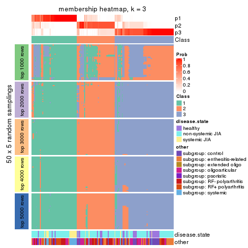</p>

</div>
<div id='tab-SD-skmeans-membership-heatmap-3'>
<pre><code class="r">membership_heatmap(res, k = 4)
</code></pre>

<p></p>

</div>
<div id='tab-SD-skmeans-membership-heatmap-4'>
<pre><code class="r">membership_heatmap(res, k = 5)
</code></pre>

<p></p>

</div>
<div id='tab-SD-skmeans-membership-heatmap-5'>
<pre><code class="r">membership_heatmap(res, k = 6)
</code></pre>

<p></p>

</div>
</div>

As soon as we have had the classes for columns, we can look for signatures
which are significantly different between classes which can be candidate marks
for certain classes. Following are the heatmaps for signatures.


Signature heatmaps where rows are scaled:


<script>
$( function() {
	$( '#tabs-SD-skmeans-get-signatures' ).tabs();
} );
</script>
<div id='tabs-SD-skmeans-get-signatures'>
<ul>
<li><a href='#tab-SD-skmeans-get-signatures-1'>k = 2</a></li>
<li><a href='#tab-SD-skmeans-get-signatures-2'>k = 3</a></li>
<li><a href='#tab-SD-skmeans-get-signatures-3'>k = 4</a></li>
<li><a href='#tab-SD-skmeans-get-signatures-4'>k = 5</a></li>
<li><a href='#tab-SD-skmeans-get-signatures-5'>k = 6</a></li>
</ul>
<div id='tab-SD-skmeans-get-signatures-1'>
<pre><code class="r">get_signatures(res, k = 2)
</code></pre>

<p></p>

</div>
<div id='tab-SD-skmeans-get-signatures-2'>
<pre><code class="r">get_signatures(res, k = 3)
</code></pre>

<p></p>

</div>
<div id='tab-SD-skmeans-get-signatures-3'>
<pre><code class="r">get_signatures(res, k = 4)
</code></pre>

<p></p>

</div>
<div id='tab-SD-skmeans-get-signatures-4'>
<pre><code class="r">get_signatures(res, k = 5)
</code></pre>

<p></p>

</div>
<div id='tab-SD-skmeans-get-signatures-5'>
<pre><code class="r">get_signatures(res, k = 6)
</code></pre>

<p>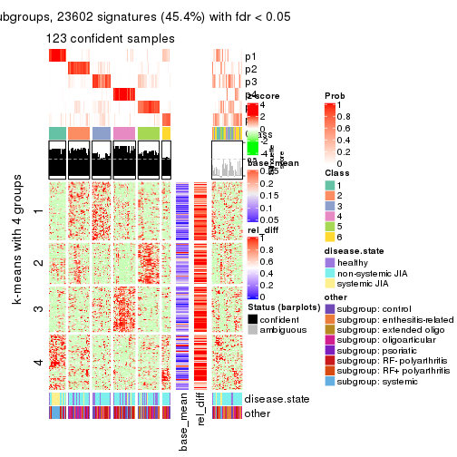</p>

</div>
</div>


Signature heatmaps where rows are not scaled:


<script>
$( function() {
	$( '#tabs-SD-skmeans-get-signatures-no-scale' ).tabs();
} );
</script>
<div id='tabs-SD-skmeans-get-signatures-no-scale'>
<ul>
<li><a href='#tab-SD-skmeans-get-signatures-no-scale-1'>k = 2</a></li>
<li><a href='#tab-SD-skmeans-get-signatures-no-scale-2'>k = 3</a></li>
<li><a href='#tab-SD-skmeans-get-signatures-no-scale-3'>k = 4</a></li>
<li><a href='#tab-SD-skmeans-get-signatures-no-scale-4'>k = 5</a></li>
<li><a href='#tab-SD-skmeans-get-signatures-no-scale-5'>k = 6</a></li>
</ul>
<div id='tab-SD-skmeans-get-signatures-no-scale-1'>
<pre><code class="r">get_signatures(res, k = 2, scale_rows = FALSE)
</code></pre>

<p></p>

</div>
<div id='tab-SD-skmeans-get-signatures-no-scale-2'>
<pre><code class="r">get_signatures(res, k = 3, scale_rows = FALSE)
</code></pre>

<p></p>

</div>
<div id='tab-SD-skmeans-get-signatures-no-scale-3'>
<pre><code class="r">get_signatures(res, k = 4, scale_rows = FALSE)
</code></pre>

<p></p>

</div>
<div id='tab-SD-skmeans-get-signatures-no-scale-4'>
<pre><code class="r">get_signatures(res, k = 5, scale_rows = FALSE)
</code></pre>

<p></p>

</div>
<div id='tab-SD-skmeans-get-signatures-no-scale-5'>
<pre><code class="r">get_signatures(res, k = 6, scale_rows = FALSE)
</code></pre>

<p></p>

</div>
</div>


Compare the overlap of signatures from different k:

```r
compare_signatures(res)
```


`get_signature()` returns a data frame invisibly. TO get the list of signatures, the function
call should be assigned to a variable explicitly. In following code, if `plot` argument is set
to `FALSE`, no heatmap is plotted while only the differential analysis is performed.

```r
# code only for demonstration
tb = get_signature(res, k = ..., plot = FALSE)
```

An example of the output of `tb` is:

```
#>   which_row         fdr    mean_1    mean_2 scaled_mean_1 scaled_mean_2 km
#> 1        38 0.042760348  8.373488  9.131774    -0.5533452     0.5164555  1
#> 2        40 0.018707592  7.106213  8.469186    -0.6173731     0.5762149  1
#> 3        55 0.019134737 10.221463 11.207825    -0.6159697     0.5749050  1
#> 4        59 0.006059896  5.921854  7.869574    -0.6899429     0.6439467  1
#> 5        60 0.018055526  8.928898 10.211722    -0.6204761     0.5791110  1
#> 6        98 0.009384629 15.714769 14.887706     0.6635654    -0.6193277  2
...
```

The columns in `tb` are:

1. `which_row`: row indices corresponding to the input matrix.
2. `fdr`: FDR for the differential test. 
3. `mean_x`: The mean value in group x.
4. `scaled_mean_x`: The mean value in group x after rows are scaled.
5. `km`: Row groups if k-means clustering is applied to rows.


UMAP plot which shows how samples are separated.


<script>
$( function() {
	$( '#tabs-SD-skmeans-dimension-reduction' ).tabs();
} );
</script>
<div id='tabs-SD-skmeans-dimension-reduction'>
<ul>
<li><a href='#tab-SD-skmeans-dimension-reduction-1'>k = 2</a></li>
<li><a href='#tab-SD-skmeans-dimension-reduction-2'>k = 3</a></li>
<li><a href='#tab-SD-skmeans-dimension-reduction-3'>k = 4</a></li>
<li><a href='#tab-SD-skmeans-dimension-reduction-4'>k = 5</a></li>
<li><a href='#tab-SD-skmeans-dimension-reduction-5'>k = 6</a></li>
</ul>
<div id='tab-SD-skmeans-dimension-reduction-1'>
<pre><code class="r">dimension_reduction(res, k = 2, method = &quot;UMAP&quot;)
</code></pre>

<p></p>

</div>
<div id='tab-SD-skmeans-dimension-reduction-2'>
<pre><code class="r">dimension_reduction(res, k = 3, method = &quot;UMAP&quot;)
</code></pre>

<p></p>

</div>
<div id='tab-SD-skmeans-dimension-reduction-3'>
<pre><code class="r">dimension_reduction(res, k = 4, method = &quot;UMAP&quot;)
</code></pre>

<p></p>

</div>
<div id='tab-SD-skmeans-dimension-reduction-4'>
<pre><code class="r">dimension_reduction(res, k = 5, method = &quot;UMAP&quot;)
</code></pre>

<p></p>

</div>
<div id='tab-SD-skmeans-dimension-reduction-5'>
<pre><code class="r">dimension_reduction(res, k = 6, method = &quot;UMAP&quot;)
</code></pre>

<p></p>

</div>
</div>


Following heatmap shows how subgroups are split when increasing `k`:

```r
collect_classes(res)
```


Test correlation between subgroups and known annotations. If the known
annotation is numeric, one-way ANOVA test is applied, and if the known
annotation is discrete, chi-squared contingency table test is applied.

```r
test_to_known_factors(res)
```

```
#>              n disease.state(p) other(p) k
#> SD:skmeans 115         7.89e-05 1.22e-05 2
#> SD:skmeans 151         1.26e-03 8.13e-04 3
#> SD:skmeans 131         4.85e-04 5.69e-05 4
#> SD:skmeans 138         2.34e-04 1.34e-06 5
#> SD:skmeans 123         2.73e-06 2.27e-08 6
```


If matrix rows can be associated to genes, consider to use `GO_Enrichment(res,
...)` to perform function enrichment for the signature genes.


 

---------------------------------------------------


### SD:pam


The object with results only for a single top-value method and a single partition method 
can be extracted as:

```r
res = res_list["SD", "pam"]
# you can also extract it by
# res = res_list["SD:pam"]
```

A summary of `res` and all the functions that can be applied to it:

```r
res
```

```
#> A 'ConsensusPartition' object with k = 2, 3, 4, 5, 6.
#>   On a matrix with 51941 rows and 154 columns.
#>   Top rows (1000, 2000, 3000, 4000, 5000) are extracted by 'SD' method.
#>   Subgroups are detected by 'pam' method.
#>   Performed in total 1250 partitions by row resampling.
#>   Best k for subgroups seems to be 6.
#> 
#> Following methods can be applied to this 'ConsensusPartition' object:
#>  [1] "cola_report"             "collect_classes"         "collect_plots"          
#>  [4] "collect_stats"           "colnames"                "compare_signatures"     
#>  [7] "consensus_heatmap"       "dimension_reduction"     "functional_enrichment"  
#> [10] "get_anno_col"            "get_anno"                "get_classes"            
#> [13] "get_consensus"           "get_matrix"              "get_membership"         
#> [16] "get_param"               "get_signatures"          "get_stats"              
#> [19] "is_best_k"               "is_stable_k"             "membership_heatmap"     
#> [22] "ncol"                    "nrow"                    "plot_ecdf"              
#> [25] "rownames"                "select_partition_number" "show"                   
#> [28] "suggest_best_k"          "test_to_known_factors"
```

`collect_plots()` function collects all the plots made from `res` for all `k` (number of partitions)
into one single page to provide an easy and fast comparison between different `k`.

```r
collect_plots(res)
```


The plots are:

- The first row: a plot of the ECDF (Empirical cumulative distribution
  function) curves of the consensus matrix for each `k` and the heatmap of
  predicted classes for each `k`.
- The second row: heatmaps of the consensus matrix for each `k`.
- The third row: heatmaps of the membership matrix for each `k`.
- The fouth row: heatmaps of the signatures for each `k`.

All the plots in panels can be made by individual functions and they are
plotted later in this section.

`select_partition_number()` produces several plots showing different
statistics for choosing "optimized" `k`. There are following statistics:

- ECDF curves of the consensus matrix for each `k`;
- 1-PAC. [The PAC
  score](https://en.wikipedia.org/wiki/Consensus_clustering#Over-interpretation_potential_of_consensus_clustering)
  measures the proportion of the ambiguous subgrouping.
- Mean silhouette score.
- Concordance. The mean probability of fiting the consensus class ids in all
  partitions.
- Area increased. Denote $A_k$ as the area under the ECDF curve for current
  `k`, the area increased is defined as $A_k - A_{k-1}$.
- Rand index. The percent of pairs of samples that are both in a same cluster
  or both are not in a same cluster in the partition of k and k-1.
- Jaccard index. The ratio of pairs of samples are both in a same cluster in
  the partition of k and k-1 and the pairs of samples are both in a same
  cluster in the partition k or k-1.

The detailed explanations of these statistics can be found in [the cola
vignette](http://bioconductor.org/packages/devel/bioc/vignettes/cola/inst/doc/cola.html#toc_13).

Generally speaking, lower PAC score, higher mean silhouette score or higher
concordance corresponds to better partition. Rand index and Jaccard index
measure how similar the current partition is compared to partition with `k-1`.
If they are too similar, we won't accept `k` is better than `k-1`.

```r
select_partition_number(res)
```


The numeric values for all these statistics can be obtained by `get_stats()`.

```r
get_stats(res)
```

```
#>   k 1-PAC mean_silhouette concordance area_increased  Rand Jaccard
#> 2 2 0.287           0.548       0.747         0.4400 0.595   0.595
#> 3 3 0.526           0.741       0.820         0.4279 0.646   0.461
#> 4 4 0.566           0.671       0.816         0.1692 0.789   0.496
#> 5 5 0.606           0.621       0.785         0.0658 0.914   0.696
#> 6 6 0.703           0.688       0.825         0.0492 0.924   0.681
```

`suggest_best_k()` suggests the best $k$ based on these statistics. The rules are as follows:

- All $k$ with Jaccard index larger than 0.95 are removed because the increase of
  the partition number does not provides enough extra information. If all $k$ are removed,
  the best $k$ is assigned by `NA`.
- For $k$ with 1-PAC larger than 0.9, the maximal $k$ is taken as the "best k". Other $k$ is called "optional k".
- If it does not fit the second rule. The $k$ with the highest vote of highest
  1-PAC, mean silhouette and concordance is taken as the "best k".

```r
suggest_best_k(res)
```

```
#> [1] 6
```


Following shows the table of the partitions (You need to click the **show/hide
code output** link to see it). The membership matrix (columns with name `p*`)
is inferred by
[`clue::cl_consensus()`](https://www.rdocumentation.org/link/cl_consensus?package=clue)
function with the `SE` method. Basically the value in the membership matrix
represents the probability to belong to a certain group. The finall class
label for an item is determined with the group with highest probability it
belongs to.

In `get_classes()` function, the entropy is calculated from the membership
matrix and the silhouette score is calculated from the consensus matrix.


<script>
$( function() {
	$( '#tabs-SD-pam-get-classes' ).tabs();
} );
</script>
<div id='tabs-SD-pam-get-classes'>
<ul>
<li><a href='#tab-SD-pam-get-classes-1'>k = 2</a></li>
<li><a href='#tab-SD-pam-get-classes-2'>k = 3</a></li>
<li><a href='#tab-SD-pam-get-classes-3'>k = 4</a></li>
<li><a href='#tab-SD-pam-get-classes-4'>k = 5</a></li>
<li><a href='#tab-SD-pam-get-classes-5'>k = 6</a></li>
</ul>

<div id='tab-SD-pam-get-classes-1'>
<p><a id='tab-SD-pam-get-classes-1-a' style='color:#0366d6' href='#'>show/hide code output</a></p>
<pre><code class="r">cbind(get_classes(res, k = 2), get_membership(res, k = 2))
</code></pre>

<pre><code>#&gt;           class entropy silhouette    p1    p2
#&gt; GSM340358     2  0.8813   0.726531 0.300 0.700
#&gt; GSM340359     2  0.9460   0.763424 0.364 0.636
#&gt; GSM340361     2  0.9460   0.763424 0.364 0.636
#&gt; GSM340362     1  0.5294   0.568988 0.880 0.120
#&gt; GSM340363     2  0.9580   0.742864 0.380 0.620
#&gt; GSM340364     2  0.9460   0.763424 0.364 0.636
#&gt; GSM340365     2  1.0000   0.554535 0.496 0.504
#&gt; GSM340366     1  0.6048   0.504981 0.852 0.148
#&gt; GSM340367     2  0.9460   0.763424 0.364 0.636
#&gt; GSM340368     2  0.0000   0.494008 0.000 1.000
#&gt; GSM340369     2  0.3274   0.457620 0.060 0.940
#&gt; GSM340370     2  0.9460   0.763424 0.364 0.636
#&gt; GSM340371     1  0.7815   0.636855 0.768 0.232
#&gt; GSM340372     2  0.9460   0.763424 0.364 0.636
#&gt; GSM340373     2  0.9460   0.763424 0.364 0.636
#&gt; GSM340375     2  0.9460   0.763424 0.364 0.636
#&gt; GSM340376     2  0.9460   0.763424 0.364 0.636
#&gt; GSM340378     2  0.9460   0.763424 0.364 0.636
#&gt; GSM340243     2  0.9944   0.673518 0.456 0.544
#&gt; GSM340244     1  0.1843   0.666193 0.972 0.028
#&gt; GSM340246     1  0.0000   0.677386 1.000 0.000
#&gt; GSM340247     1  0.9580   0.555236 0.620 0.380
#&gt; GSM340248     1  0.2423   0.658629 0.960 0.040
#&gt; GSM340249     1  0.9580   0.555236 0.620 0.380
#&gt; GSM340250     1  0.9977  -0.549381 0.528 0.472
#&gt; GSM340251     1  0.9460   0.563628 0.636 0.364
#&gt; GSM340252     1  0.9815   0.538606 0.580 0.420
#&gt; GSM340253     1  0.3274   0.637078 0.940 0.060
#&gt; GSM340254     1  0.0376   0.676447 0.996 0.004
#&gt; GSM340256     1  0.3274   0.638056 0.940 0.060
#&gt; GSM340258     1  0.0000   0.677386 1.000 0.000
#&gt; GSM340259     1  0.2603   0.653948 0.956 0.044
#&gt; GSM340260     1  0.0376   0.676569 0.996 0.004
#&gt; GSM340261     1  0.0000   0.677386 1.000 0.000
#&gt; GSM340262     1  0.0376   0.676447 0.996 0.004
#&gt; GSM340263     1  0.5737   0.550889 0.864 0.136
#&gt; GSM340264     1  0.1843   0.665917 0.972 0.028
#&gt; GSM340265     1  0.0000   0.677386 1.000 0.000
#&gt; GSM340266     1  0.8763   0.616638 0.704 0.296
#&gt; GSM340267     1  0.0376   0.676666 0.996 0.004
#&gt; GSM340268     1  0.8499   0.622380 0.724 0.276
#&gt; GSM340269     1  0.0000   0.677386 1.000 0.000
#&gt; GSM340270     1  0.9963  -0.515716 0.536 0.464
#&gt; GSM537574     1  0.0000   0.677386 1.000 0.000
#&gt; GSM537580     1  0.8499   0.622380 0.724 0.276
#&gt; GSM537581     2  0.3274   0.457620 0.060 0.940
#&gt; GSM340272     1  0.7528   0.374839 0.784 0.216
#&gt; GSM340273     2  0.9710   0.740011 0.400 0.600
#&gt; GSM340275     1  0.9754   0.539291 0.592 0.408
#&gt; GSM340276     1  0.6531   0.654169 0.832 0.168
#&gt; GSM340277     1  0.2043   0.659489 0.968 0.032
#&gt; GSM340278     1  0.5408   0.665473 0.876 0.124
#&gt; GSM340279     1  0.8499   0.622380 0.724 0.276
#&gt; GSM340282     1  0.2043   0.659489 0.968 0.032
#&gt; GSM340284     1  0.8763   0.611752 0.704 0.296
#&gt; GSM340285     1  0.9044   0.607712 0.680 0.320
#&gt; GSM340286     1  0.1633   0.668411 0.976 0.024
#&gt; GSM340287     1  0.0938   0.673651 0.988 0.012
#&gt; GSM340288     2  0.9732   0.735887 0.404 0.596
#&gt; GSM340289     1  0.5408   0.568544 0.876 0.124
#&gt; GSM340290     1  0.9087   0.601138 0.676 0.324
#&gt; GSM340291     1  0.5178   0.577202 0.884 0.116
#&gt; GSM340293     1  0.9460   0.563628 0.636 0.364
#&gt; GSM340294     1  0.0000   0.677386 1.000 0.000
#&gt; GSM340296     1  0.8661   0.137061 0.712 0.288
#&gt; GSM340297     1  0.9686  -0.257241 0.604 0.396
#&gt; GSM340298     1  0.2778   0.669221 0.952 0.048
#&gt; GSM340299     1  0.3274   0.637078 0.940 0.060
#&gt; GSM340301     1  0.0376   0.676447 0.996 0.004
#&gt; GSM340303     1  0.1633   0.666652 0.976 0.024
#&gt; GSM340304     1  0.2948   0.648003 0.948 0.052
#&gt; GSM340306     2  0.4562   0.437463 0.096 0.904
#&gt; GSM340307     1  0.0000   0.677386 1.000 0.000
#&gt; GSM340310     2  0.9460   0.763424 0.364 0.636
#&gt; GSM340314     1  0.9358   0.573383 0.648 0.352
#&gt; GSM340315     1  0.9833  -0.424669 0.576 0.424
#&gt; GSM340317     2  0.6887   0.324365 0.184 0.816
#&gt; GSM340318     1  0.9522   0.559795 0.628 0.372
#&gt; GSM340319     1  0.9580   0.555236 0.620 0.380
#&gt; GSM340320     2  0.8144   0.205693 0.252 0.748
#&gt; GSM340321     1  0.0000   0.677386 1.000 0.000
#&gt; GSM340322     1  0.9460   0.563628 0.636 0.364
#&gt; GSM340324     2  0.9460   0.763424 0.364 0.636
#&gt; GSM340328     2  0.8499   0.708335 0.276 0.724
#&gt; GSM340330     1  0.8499   0.622380 0.724 0.276
#&gt; GSM340332     1  0.9635   0.550117 0.612 0.388
#&gt; GSM340333     1  0.3274   0.637078 0.940 0.060
#&gt; GSM340336     1  0.9580   0.555236 0.620 0.380
#&gt; GSM340337     1  0.9996   0.473515 0.512 0.488
#&gt; GSM340338     1  0.8327   0.627273 0.736 0.264
#&gt; GSM340339     1  0.9460   0.563628 0.636 0.364
#&gt; GSM340340     2  0.8386   0.094026 0.268 0.732
#&gt; GSM340341     1  0.9286   0.579350 0.656 0.344
#&gt; GSM340343     1  0.9983   0.459373 0.524 0.476
#&gt; GSM340344     1  0.4562   0.597064 0.904 0.096
#&gt; GSM340346     1  0.0000   0.677386 1.000 0.000
#&gt; GSM340347     1  0.9795   0.527648 0.584 0.416
#&gt; GSM340348     2  0.7219   0.296812 0.200 0.800
#&gt; GSM340349     1  0.9881  -0.419099 0.564 0.436
#&gt; GSM340350     1  0.9323  -0.078025 0.652 0.348
#&gt; GSM340351     2  0.9491   0.761968 0.368 0.632
#&gt; GSM340354     1  0.0000   0.677386 1.000 0.000
#&gt; GSM340356     2  0.9491   0.761985 0.368 0.632
#&gt; GSM340357     2  0.9460   0.763424 0.364 0.636
#&gt; GSM348183     2  0.9686   0.743476 0.396 0.604
#&gt; GSM348191     1  0.8499   0.622380 0.724 0.276
#&gt; GSM348193     2  0.2948   0.499213 0.052 0.948
#&gt; GSM537578     1  0.3584   0.628927 0.932 0.068
#&gt; GSM348181     1  0.3879   0.627559 0.924 0.076
#&gt; GSM348182     1  0.5059   0.585437 0.888 0.112
#&gt; GSM348184     1  0.8713   0.614454 0.708 0.292
#&gt; GSM348185     2  0.5737   0.394323 0.136 0.864
#&gt; GSM348186     1  0.2778   0.648386 0.952 0.048
#&gt; GSM348187     2  0.9460   0.763424 0.364 0.636
#&gt; GSM348188     2  0.8608   0.133453 0.284 0.716
#&gt; GSM348189     1  0.7528   0.642306 0.784 0.216
#&gt; GSM348190     1  0.9775  -0.365319 0.588 0.412
#&gt; GSM348194     2  0.9686   0.743476 0.396 0.604
#&gt; GSM348195     2  0.9460   0.763424 0.364 0.636
#&gt; GSM348196     2  0.9491   0.761968 0.368 0.632
#&gt; GSM537585     2  0.9710   0.736271 0.400 0.600
#&gt; GSM537594     2  0.9795   0.717696 0.416 0.584
#&gt; GSM537596     1  0.9866  -0.421626 0.568 0.432
#&gt; GSM537597     1  0.9970  -0.511112 0.532 0.468
#&gt; GSM537602     1  0.9087   0.000927 0.676 0.324
#&gt; GSM340184     1  0.8386   0.625803 0.732 0.268
#&gt; GSM340185     1  0.2778   0.669215 0.952 0.048
#&gt; GSM340186     1  0.6973   0.650358 0.812 0.188
#&gt; GSM340187     1  0.9460   0.563628 0.636 0.364
#&gt; GSM340189     1  0.9460   0.563628 0.636 0.364
#&gt; GSM340190     1  0.8813   0.609298 0.700 0.300
#&gt; GSM340191     1  0.8499   0.622380 0.724 0.276
#&gt; GSM340192     1  0.1414   0.668103 0.980 0.020
#&gt; GSM340193     1  0.9881  -0.430357 0.564 0.436
#&gt; GSM340194     1  0.3274   0.637078 0.940 0.060
#&gt; GSM340195     1  0.4431   0.606052 0.908 0.092
#&gt; GSM340196     1  0.9710   0.544147 0.600 0.400
#&gt; GSM340197     1  0.2948   0.644960 0.948 0.052
#&gt; GSM340198     1  0.0376   0.676447 0.996 0.004
#&gt; GSM340199     1  0.3114   0.677589 0.944 0.056
#&gt; GSM340200     1  0.2236   0.675620 0.964 0.036
#&gt; GSM340201     2  0.7883   0.241315 0.236 0.764
#&gt; GSM340202     1  0.9580   0.555236 0.620 0.380
#&gt; GSM340203     1  0.9460   0.563628 0.636 0.364
#&gt; GSM340204     1  0.5294   0.567887 0.880 0.120
#&gt; GSM340205     2  0.9963   0.630977 0.464 0.536
#&gt; GSM340206     1  0.8443   0.624229 0.728 0.272
#&gt; GSM340207     1  0.0376   0.678475 0.996 0.004
#&gt; GSM340237     2  0.9710   0.735584 0.400 0.600
#&gt; GSM340238     1  0.8555   0.620395 0.720 0.280
#&gt; GSM340239     1  0.1184   0.672035 0.984 0.016
#&gt; GSM340240     1  0.0376   0.676313 0.996 0.004
#&gt; GSM340241     1  0.0000   0.677386 1.000 0.000
#&gt; GSM340242     1  0.1414   0.680378 0.980 0.020
</code></pre>

<script>
$('#tab-SD-pam-get-classes-1-a').parent().next().next().hide();
$('#tab-SD-pam-get-classes-1-a').click(function(){
  $('#tab-SD-pam-get-classes-1-a').parent().next().next().toggle();
  return(false);
});
</script>
</div>

<div id='tab-SD-pam-get-classes-2'>
<p><a id='tab-SD-pam-get-classes-2-a' style='color:#0366d6' href='#'>show/hide code output</a></p>
<pre><code class="r">cbind(get_classes(res, k = 3), get_membership(res, k = 3))
</code></pre>

<pre><code>#&gt;           class entropy silhouette    p1    p2    p3
#&gt; GSM340358     1  0.0000     0.7859 1.000 0.000 0.000
#&gt; GSM340359     1  0.1411     0.7789 0.964 0.000 0.036
#&gt; GSM340361     1  0.0592     0.7843 0.988 0.012 0.000
#&gt; GSM340362     3  0.3941     0.7368 0.156 0.000 0.844
#&gt; GSM340363     1  0.5667     0.7250 0.800 0.060 0.140
#&gt; GSM340364     1  0.0000     0.7859 1.000 0.000 0.000
#&gt; GSM340365     1  0.3983     0.7494 0.852 0.004 0.144
#&gt; GSM340366     1  0.6008     0.5756 0.664 0.004 0.332
#&gt; GSM340367     1  0.0000     0.7859 1.000 0.000 0.000
#&gt; GSM340368     2  0.2356     0.8589 0.072 0.928 0.000
#&gt; GSM340369     2  0.4842     0.7141 0.224 0.776 0.000
#&gt; GSM340370     1  0.0000     0.7859 1.000 0.000 0.000
#&gt; GSM340371     3  0.0237     0.8650 0.000 0.004 0.996
#&gt; GSM340372     1  0.0000     0.7859 1.000 0.000 0.000
#&gt; GSM340373     1  0.0000     0.7859 1.000 0.000 0.000
#&gt; GSM340375     1  0.0000     0.7859 1.000 0.000 0.000
#&gt; GSM340376     1  0.0000     0.7859 1.000 0.000 0.000
#&gt; GSM340378     1  0.0000     0.7859 1.000 0.000 0.000
#&gt; GSM340243     1  0.1878     0.7874 0.952 0.004 0.044
#&gt; GSM340244     3  0.4094     0.8008 0.100 0.028 0.872
#&gt; GSM340246     3  0.0000     0.8649 0.000 0.000 1.000
#&gt; GSM340247     2  0.0747     0.8898 0.000 0.984 0.016
#&gt; GSM340248     3  0.4346     0.7047 0.184 0.000 0.816
#&gt; GSM340249     2  0.2356     0.8628 0.000 0.928 0.072
#&gt; GSM340250     1  0.5397     0.6182 0.720 0.000 0.280
#&gt; GSM340251     2  0.5363     0.6038 0.000 0.724 0.276
#&gt; GSM340252     2  0.5859     0.4762 0.000 0.656 0.344
#&gt; GSM340253     3  0.0424     0.8651 0.008 0.000 0.992
#&gt; GSM340254     3  0.0000     0.8649 0.000 0.000 1.000
#&gt; GSM340256     3  0.0237     0.8653 0.004 0.000 0.996
#&gt; GSM340258     3  0.0000     0.8649 0.000 0.000 1.000
#&gt; GSM340259     3  0.1529     0.8528 0.040 0.000 0.960
#&gt; GSM340260     3  0.0237     0.8654 0.004 0.000 0.996
#&gt; GSM340261     3  0.2711     0.8207 0.088 0.000 0.912
#&gt; GSM340262     3  0.0237     0.8653 0.004 0.000 0.996
#&gt; GSM340263     3  0.5178     0.6070 0.256 0.000 0.744
#&gt; GSM340264     3  0.0424     0.8651 0.008 0.000 0.992
#&gt; GSM340265     3  0.0237     0.8644 0.000 0.004 0.996
#&gt; GSM340266     3  0.7391     0.5036 0.056 0.308 0.636
#&gt; GSM340267     3  0.3340     0.7978 0.000 0.120 0.880
#&gt; GSM340268     3  0.3816     0.7828 0.000 0.148 0.852
#&gt; GSM340269     3  0.0000     0.8649 0.000 0.000 1.000
#&gt; GSM340270     1  0.5431     0.6051 0.716 0.000 0.284
#&gt; GSM537574     3  0.0237     0.8653 0.004 0.000 0.996
#&gt; GSM537580     3  0.6154     0.3624 0.000 0.408 0.592
#&gt; GSM537581     2  0.5058     0.6955 0.244 0.756 0.000
#&gt; GSM340272     1  0.5480     0.6683 0.732 0.004 0.264
#&gt; GSM340273     1  0.5159     0.7365 0.820 0.040 0.140
#&gt; GSM340275     2  0.0747     0.8898 0.000 0.984 0.016
#&gt; GSM340276     3  0.2383     0.8486 0.044 0.016 0.940
#&gt; GSM340277     3  0.4834     0.6511 0.204 0.004 0.792
#&gt; GSM340278     3  0.6026     0.4318 0.000 0.376 0.624
#&gt; GSM340279     3  0.5968     0.4569 0.000 0.364 0.636
#&gt; GSM340282     3  0.3983     0.7431 0.144 0.004 0.852
#&gt; GSM340284     3  0.5591     0.5752 0.000 0.304 0.696
#&gt; GSM340285     3  0.6286     0.1815 0.000 0.464 0.536
#&gt; GSM340286     3  0.0424     0.8651 0.008 0.000 0.992
#&gt; GSM340287     3  0.2711     0.8207 0.088 0.000 0.912
#&gt; GSM340288     1  0.4261     0.7504 0.848 0.012 0.140
#&gt; GSM340289     1  0.6302     0.1745 0.520 0.000 0.480
#&gt; GSM340290     3  0.7159     0.1848 0.024 0.448 0.528
#&gt; GSM340291     3  0.4291     0.7695 0.152 0.008 0.840
#&gt; GSM340293     2  0.4399     0.7471 0.000 0.812 0.188
#&gt; GSM340294     3  0.1411     0.8523 0.036 0.000 0.964
#&gt; GSM340296     1  0.4629     0.7330 0.808 0.004 0.188
#&gt; GSM340297     1  0.7318     0.5866 0.668 0.068 0.264
#&gt; GSM340298     1  0.6345     0.4212 0.596 0.004 0.400
#&gt; GSM340299     3  0.0424     0.8651 0.008 0.000 0.992
#&gt; GSM340301     3  0.0424     0.8651 0.008 0.000 0.992
#&gt; GSM340303     3  0.0475     0.8643 0.004 0.004 0.992
#&gt; GSM340304     3  0.6386     0.1381 0.412 0.004 0.584
#&gt; GSM340306     2  0.1031     0.8782 0.024 0.976 0.000
#&gt; GSM340307     3  0.0237     0.8644 0.000 0.004 0.996
#&gt; GSM340310     1  0.0000     0.7859 1.000 0.000 0.000
#&gt; GSM340314     2  0.5591     0.5456 0.000 0.696 0.304
#&gt; GSM340315     1  0.6126     0.4916 0.644 0.004 0.352
#&gt; GSM340317     2  0.3771     0.8217 0.112 0.876 0.012
#&gt; GSM340318     2  0.0747     0.8898 0.000 0.984 0.016
#&gt; GSM340319     2  0.0747     0.8898 0.000 0.984 0.016
#&gt; GSM340320     2  0.1411     0.8730 0.036 0.964 0.000
#&gt; GSM340321     3  0.0000     0.8649 0.000 0.000 1.000
#&gt; GSM340322     2  0.0747     0.8898 0.000 0.984 0.016
#&gt; GSM340324     1  0.4842     0.6893 0.776 0.000 0.224
#&gt; GSM340328     1  0.0000     0.7859 1.000 0.000 0.000
#&gt; GSM340330     3  0.0237     0.8653 0.000 0.004 0.996
#&gt; GSM340332     2  0.4654     0.7150 0.000 0.792 0.208
#&gt; GSM340333     3  0.0424     0.8651 0.008 0.000 0.992
#&gt; GSM340336     2  0.0747     0.8898 0.000 0.984 0.016
#&gt; GSM340337     2  0.0237     0.8835 0.000 0.996 0.004
#&gt; GSM340338     3  0.2711     0.8222 0.000 0.088 0.912
#&gt; GSM340339     2  0.0747     0.8898 0.000 0.984 0.016
#&gt; GSM340340     2  0.4110     0.7940 0.152 0.844 0.004
#&gt; GSM340341     2  0.4178     0.7674 0.000 0.828 0.172
#&gt; GSM340343     2  0.0747     0.8898 0.000 0.984 0.016
#&gt; GSM340344     3  0.1015     0.8608 0.008 0.012 0.980
#&gt; GSM340346     3  0.0237     0.8644 0.000 0.004 0.996
#&gt; GSM340347     2  0.0747     0.8898 0.000 0.984 0.016
#&gt; GSM340348     2  0.1765     0.8765 0.004 0.956 0.040
#&gt; GSM340349     1  0.4521     0.7387 0.816 0.004 0.180
#&gt; GSM340350     1  0.4351     0.7390 0.828 0.004 0.168
#&gt; GSM340351     1  0.0829     0.7853 0.984 0.012 0.004
#&gt; GSM340354     3  0.0000     0.8649 0.000 0.000 1.000
#&gt; GSM340356     1  0.6979     0.6627 0.732 0.140 0.128
#&gt; GSM340357     1  0.0000     0.7859 1.000 0.000 0.000
#&gt; GSM348183     1  0.5722     0.7122 0.804 0.112 0.084
#&gt; GSM348191     3  0.2301     0.8437 0.004 0.060 0.936
#&gt; GSM348193     2  0.5397     0.5907 0.280 0.720 0.000
#&gt; GSM537578     1  0.6451     0.3702 0.560 0.004 0.436
#&gt; GSM348181     1  0.6302     0.1745 0.520 0.000 0.480
#&gt; GSM348182     3  0.4805     0.7178 0.176 0.012 0.812
#&gt; GSM348184     3  0.4121     0.7776 0.000 0.168 0.832
#&gt; GSM348185     2  0.3116     0.8226 0.108 0.892 0.000
#&gt; GSM348186     3  0.0000     0.8649 0.000 0.000 1.000
#&gt; GSM348187     1  0.0592     0.7843 0.988 0.012 0.000
#&gt; GSM348188     2  0.0475     0.8841 0.004 0.992 0.004
#&gt; GSM348189     3  0.0237     0.8653 0.004 0.000 0.996
#&gt; GSM348190     3  0.3031     0.8184 0.076 0.012 0.912
#&gt; GSM348194     1  0.2446     0.7818 0.936 0.012 0.052
#&gt; GSM348195     1  0.0592     0.7843 0.988 0.012 0.000
#&gt; GSM348196     1  0.0829     0.7853 0.984 0.012 0.004
#&gt; GSM537585     1  0.5986     0.6576 0.704 0.012 0.284
#&gt; GSM537594     1  0.7759     0.1532 0.480 0.048 0.472
#&gt; GSM537596     1  0.6825     0.1377 0.496 0.012 0.492
#&gt; GSM537597     3  0.6799     0.0098 0.456 0.012 0.532
#&gt; GSM537602     1  0.6062     0.6607 0.708 0.016 0.276
#&gt; GSM340184     3  0.2636     0.8458 0.020 0.048 0.932
#&gt; GSM340185     3  0.2689     0.8394 0.032 0.036 0.932
#&gt; GSM340186     3  0.1411     0.8544 0.000 0.036 0.964
#&gt; GSM340187     2  0.1860     0.8766 0.000 0.948 0.052
#&gt; GSM340189     2  0.0592     0.8883 0.000 0.988 0.012
#&gt; GSM340190     3  0.4291     0.7637 0.000 0.180 0.820
#&gt; GSM340191     3  0.4178     0.7630 0.000 0.172 0.828
#&gt; GSM340192     3  0.3644     0.7671 0.124 0.004 0.872
#&gt; GSM340193     3  0.5171     0.6672 0.204 0.012 0.784
#&gt; GSM340194     3  0.0424     0.8651 0.008 0.000 0.992
#&gt; GSM340195     3  0.0424     0.8651 0.008 0.000 0.992
#&gt; GSM340196     2  0.0747     0.8898 0.000 0.984 0.016
#&gt; GSM340197     3  0.0424     0.8651 0.008 0.000 0.992
#&gt; GSM340198     3  0.0000     0.8649 0.000 0.000 1.000
#&gt; GSM340199     3  0.5968     0.4541 0.000 0.364 0.636
#&gt; GSM340200     3  0.2564     0.8427 0.028 0.036 0.936
#&gt; GSM340201     2  0.0829     0.8884 0.004 0.984 0.012
#&gt; GSM340202     2  0.0747     0.8898 0.000 0.984 0.016
#&gt; GSM340203     2  0.3551     0.8187 0.000 0.868 0.132
#&gt; GSM340204     3  0.0424     0.8651 0.008 0.000 0.992
#&gt; GSM340205     1  0.4796     0.6906 0.780 0.000 0.220
#&gt; GSM340206     3  0.2711     0.8274 0.000 0.088 0.912
#&gt; GSM340207     3  0.0424     0.8644 0.000 0.008 0.992
#&gt; GSM340237     1  0.0983     0.7853 0.980 0.004 0.016
#&gt; GSM340238     3  0.6291     0.1810 0.000 0.468 0.532
#&gt; GSM340239     3  0.0424     0.8651 0.008 0.000 0.992
#&gt; GSM340240     3  0.1399     0.8536 0.028 0.004 0.968
#&gt; GSM340241     3  0.0237     0.8644 0.000 0.004 0.996
#&gt; GSM340242     3  0.0000     0.8649 0.000 0.000 1.000
</code></pre>

<script>
$('#tab-SD-pam-get-classes-2-a').parent().next().next().hide();
$('#tab-SD-pam-get-classes-2-a').click(function(){
  $('#tab-SD-pam-get-classes-2-a').parent().next().next().toggle();
  return(false);
});
</script>
</div>

<div id='tab-SD-pam-get-classes-3'>
<p><a id='tab-SD-pam-get-classes-3-a' style='color:#0366d6' href='#'>show/hide code output</a></p>
<pre><code class="r">cbind(get_classes(res, k = 4), get_membership(res, k = 4))
</code></pre>

<pre><code>#&gt;           class entropy silhouette    p1    p2    p3    p4
#&gt; GSM340358     1  0.0000     0.8256 1.000 0.000 0.000 0.000
#&gt; GSM340359     1  0.2530     0.7378 0.888 0.112 0.000 0.000
#&gt; GSM340361     1  0.0188     0.8249 0.996 0.004 0.000 0.000
#&gt; GSM340362     2  0.5897     0.6959 0.136 0.700 0.164 0.000
#&gt; GSM340363     1  0.2224     0.8037 0.928 0.032 0.040 0.000
#&gt; GSM340364     1  0.0000     0.8256 1.000 0.000 0.000 0.000
#&gt; GSM340365     1  0.5288     0.5942 0.720 0.224 0.056 0.000
#&gt; GSM340366     1  0.7390     0.4414 0.512 0.284 0.204 0.000
#&gt; GSM340367     1  0.0000     0.8256 1.000 0.000 0.000 0.000
#&gt; GSM340368     4  0.3356     0.7946 0.176 0.000 0.000 0.824
#&gt; GSM340369     4  0.3649     0.7679 0.204 0.000 0.000 0.796
#&gt; GSM340370     1  0.0000     0.8256 1.000 0.000 0.000 0.000
#&gt; GSM340371     3  0.3908     0.6509 0.000 0.212 0.784 0.004
#&gt; GSM340372     1  0.0000     0.8256 1.000 0.000 0.000 0.000
#&gt; GSM340373     1  0.0000     0.8256 1.000 0.000 0.000 0.000
#&gt; GSM340375     1  0.0000     0.8256 1.000 0.000 0.000 0.000
#&gt; GSM340376     1  0.0000     0.8256 1.000 0.000 0.000 0.000
#&gt; GSM340378     1  0.0000     0.8256 1.000 0.000 0.000 0.000
#&gt; GSM340243     1  0.5939     0.6324 0.668 0.248 0.084 0.000
#&gt; GSM340244     3  0.6452     0.4202 0.112 0.208 0.668 0.012
#&gt; GSM340246     3  0.3610     0.6301 0.000 0.200 0.800 0.000
#&gt; GSM340247     4  0.0000     0.9121 0.000 0.000 0.000 1.000
#&gt; GSM340248     3  0.3962     0.6449 0.124 0.044 0.832 0.000
#&gt; GSM340249     4  0.1389     0.8832 0.000 0.000 0.048 0.952
#&gt; GSM340250     3  0.5229     0.3207 0.428 0.008 0.564 0.000
#&gt; GSM340251     3  0.5929     0.5243 0.000 0.064 0.640 0.296
#&gt; GSM340252     2  0.5152     0.4873 0.000 0.664 0.020 0.316
#&gt; GSM340253     2  0.4304     0.7314 0.000 0.716 0.284 0.000
#&gt; GSM340254     2  0.4331     0.7305 0.000 0.712 0.288 0.000
#&gt; GSM340256     2  0.4382     0.7291 0.000 0.704 0.296 0.000
#&gt; GSM340258     3  0.3726     0.5622 0.000 0.212 0.788 0.000
#&gt; GSM340259     3  0.5792    -0.2059 0.032 0.416 0.552 0.000
#&gt; GSM340260     3  0.4304     0.3722 0.000 0.284 0.716 0.000
#&gt; GSM340261     3  0.0188     0.7254 0.000 0.004 0.996 0.000
#&gt; GSM340262     3  0.3528     0.5770 0.000 0.192 0.808 0.000
#&gt; GSM340263     3  0.3946     0.6323 0.168 0.020 0.812 0.000
#&gt; GSM340264     3  0.3873     0.5359 0.000 0.228 0.772 0.000
#&gt; GSM340265     2  0.3837     0.4668 0.000 0.776 0.224 0.000
#&gt; GSM340266     3  0.2224     0.7122 0.040 0.000 0.928 0.032
#&gt; GSM340267     3  0.4728     0.6402 0.000 0.216 0.752 0.032
#&gt; GSM340268     3  0.0188     0.7254 0.000 0.004 0.996 0.000
#&gt; GSM340269     3  0.0921     0.7166 0.000 0.028 0.972 0.000
#&gt; GSM340270     3  0.4730     0.4573 0.364 0.000 0.636 0.000
#&gt; GSM537574     3  0.2345     0.6678 0.000 0.100 0.900 0.000
#&gt; GSM537580     3  0.3710     0.6440 0.000 0.004 0.804 0.192
#&gt; GSM537581     4  0.4692     0.7306 0.212 0.032 0.000 0.756
#&gt; GSM340272     2  0.5280     0.4710 0.124 0.752 0.124 0.000
#&gt; GSM340273     1  0.1488     0.8171 0.956 0.032 0.012 0.000
#&gt; GSM340275     4  0.0000     0.9121 0.000 0.000 0.000 1.000
#&gt; GSM340276     3  0.2654     0.6787 0.108 0.004 0.888 0.000
#&gt; GSM340277     2  0.1022     0.6269 0.032 0.968 0.000 0.000
#&gt; GSM340278     3  0.3494     0.6745 0.000 0.172 0.824 0.004
#&gt; GSM340279     3  0.1488     0.7273 0.000 0.012 0.956 0.032
#&gt; GSM340282     2  0.3991     0.5040 0.020 0.808 0.172 0.000
#&gt; GSM340284     3  0.2480     0.7146 0.000 0.088 0.904 0.008
#&gt; GSM340285     3  0.1545     0.7265 0.000 0.008 0.952 0.040
#&gt; GSM340286     2  0.4855     0.6125 0.000 0.600 0.400 0.000
#&gt; GSM340287     3  0.0000     0.7245 0.000 0.000 1.000 0.000
#&gt; GSM340288     1  0.1936     0.8106 0.940 0.032 0.028 0.000
#&gt; GSM340289     1  0.4830     0.3311 0.608 0.000 0.392 0.000
#&gt; GSM340290     3  0.7037     0.0721 0.000 0.120 0.464 0.416
#&gt; GSM340291     2  0.4401     0.5989 0.112 0.812 0.076 0.000
#&gt; GSM340293     3  0.7147     0.4827 0.000 0.224 0.560 0.216
#&gt; GSM340294     3  0.0188     0.7254 0.000 0.004 0.996 0.000
#&gt; GSM340296     1  0.7868     0.1049 0.372 0.276 0.352 0.000
#&gt; GSM340297     3  0.4277     0.5511 0.280 0.000 0.720 0.000
#&gt; GSM340298     3  0.5393     0.5825 0.044 0.268 0.688 0.000
#&gt; GSM340299     2  0.4134     0.7332 0.000 0.740 0.260 0.000
#&gt; GSM340301     2  0.4477     0.7194 0.000 0.688 0.312 0.000
#&gt; GSM340303     2  0.3486     0.5314 0.000 0.812 0.188 0.000
#&gt; GSM340304     3  0.7359     0.1687 0.312 0.184 0.504 0.000
#&gt; GSM340306     4  0.2224     0.8849 0.040 0.032 0.000 0.928
#&gt; GSM340307     3  0.4304     0.6033 0.000 0.284 0.716 0.000
#&gt; GSM340310     1  0.0000     0.8256 1.000 0.000 0.000 0.000
#&gt; GSM340314     3  0.3306     0.6788 0.000 0.004 0.840 0.156
#&gt; GSM340315     3  0.5431     0.5237 0.300 0.028 0.668 0.004
#&gt; GSM340317     4  0.3160     0.8250 0.120 0.004 0.008 0.868
#&gt; GSM340318     4  0.0000     0.9121 0.000 0.000 0.000 1.000
#&gt; GSM340319     4  0.0000     0.9121 0.000 0.000 0.000 1.000
#&gt; GSM340320     4  0.0336     0.9097 0.008 0.000 0.000 0.992
#&gt; GSM340321     3  0.4776     0.2858 0.000 0.376 0.624 0.000
#&gt; GSM340322     4  0.0000     0.9121 0.000 0.000 0.000 1.000
#&gt; GSM340324     2  0.4643     0.4770 0.344 0.656 0.000 0.000
#&gt; GSM340328     1  0.0000     0.8256 1.000 0.000 0.000 0.000
#&gt; GSM340330     3  0.0336     0.7256 0.000 0.008 0.992 0.000
#&gt; GSM340332     4  0.4500     0.4455 0.000 0.000 0.316 0.684
#&gt; GSM340333     2  0.4304     0.7314 0.000 0.716 0.284 0.000
#&gt; GSM340336     4  0.0000     0.9121 0.000 0.000 0.000 1.000
#&gt; GSM340337     4  0.0000     0.9121 0.000 0.000 0.000 1.000
#&gt; GSM340338     3  0.3966     0.6969 0.000 0.072 0.840 0.088
#&gt; GSM340339     4  0.0000     0.9121 0.000 0.000 0.000 1.000
#&gt; GSM340340     4  0.3448     0.8021 0.168 0.004 0.000 0.828
#&gt; GSM340341     4  0.3402     0.7556 0.000 0.004 0.164 0.832
#&gt; GSM340343     4  0.0000     0.9121 0.000 0.000 0.000 1.000
#&gt; GSM340344     2  0.4331     0.7317 0.000 0.712 0.288 0.000
#&gt; GSM340346     3  0.4304     0.6033 0.000 0.284 0.716 0.000
#&gt; GSM340347     4  0.0000     0.9121 0.000 0.000 0.000 1.000
#&gt; GSM340348     4  0.2036     0.8888 0.000 0.032 0.032 0.936
#&gt; GSM340349     1  0.6833     0.5477 0.584 0.272 0.144 0.000
#&gt; GSM340350     1  0.6461     0.5734 0.632 0.240 0.128 0.000
#&gt; GSM340351     1  0.1209     0.8187 0.964 0.032 0.004 0.000
#&gt; GSM340354     3  0.0592     0.7267 0.000 0.016 0.984 0.000
#&gt; GSM340356     2  0.4950     0.3606 0.376 0.620 0.004 0.000
#&gt; GSM340357     1  0.0000     0.8256 1.000 0.000 0.000 0.000
#&gt; GSM348183     1  0.2635     0.7851 0.908 0.004 0.072 0.016
#&gt; GSM348191     3  0.0000     0.7245 0.000 0.000 1.000 0.000
#&gt; GSM348193     4  0.5271     0.5333 0.320 0.024 0.000 0.656
#&gt; GSM537578     1  0.7671     0.3786 0.456 0.300 0.244 0.000
#&gt; GSM348181     3  0.2704     0.6662 0.124 0.000 0.876 0.000
#&gt; GSM348182     2  0.6818     0.5343 0.076 0.504 0.412 0.008
#&gt; GSM348184     3  0.4638     0.6625 0.000 0.180 0.776 0.044
#&gt; GSM348185     4  0.4057     0.7842 0.152 0.032 0.000 0.816
#&gt; GSM348186     2  0.4331     0.7303 0.000 0.712 0.288 0.000
#&gt; GSM348187     1  0.1022     0.8196 0.968 0.032 0.000 0.000
#&gt; GSM348188     4  0.0000     0.9121 0.000 0.000 0.000 1.000
#&gt; GSM348189     3  0.4328     0.4971 0.000 0.244 0.748 0.008
#&gt; GSM348190     2  0.5025     0.7216 0.032 0.716 0.252 0.000
#&gt; GSM348194     1  0.1022     0.8196 0.968 0.032 0.000 0.000
#&gt; GSM348195     1  0.1022     0.8196 0.968 0.032 0.000 0.000
#&gt; GSM348196     1  0.1022     0.8196 0.968 0.032 0.000 0.000
#&gt; GSM537585     2  0.6158     0.5202 0.292 0.628 0.080 0.000
#&gt; GSM537594     2  0.6587     0.5465 0.292 0.596 0.112 0.000
#&gt; GSM537596     1  0.5792     0.2898 0.552 0.032 0.416 0.000
#&gt; GSM537597     1  0.5746     0.4301 0.612 0.040 0.348 0.000
#&gt; GSM537602     1  0.5050     0.6716 0.704 0.268 0.028 0.000
#&gt; GSM340184     3  0.0188     0.7254 0.000 0.004 0.996 0.000
#&gt; GSM340185     3  0.5284     0.5340 0.016 0.368 0.616 0.000
#&gt; GSM340186     3  0.5411     0.5699 0.000 0.312 0.656 0.032
#&gt; GSM340187     4  0.1389     0.8861 0.000 0.000 0.048 0.952
#&gt; GSM340189     4  0.0000     0.9121 0.000 0.000 0.000 1.000
#&gt; GSM340190     3  0.4193     0.6152 0.000 0.268 0.732 0.000
#&gt; GSM340191     3  0.0188     0.7254 0.000 0.004 0.996 0.000
#&gt; GSM340192     2  0.1388     0.6322 0.028 0.960 0.012 0.000
#&gt; GSM340193     2  0.7301     0.4600 0.152 0.452 0.396 0.000
#&gt; GSM340194     2  0.4477     0.7194 0.000 0.688 0.312 0.000
#&gt; GSM340195     2  0.4477     0.7194 0.000 0.688 0.312 0.000
#&gt; GSM340196     4  0.0000     0.9121 0.000 0.000 0.000 1.000
#&gt; GSM340197     2  0.4898     0.5813 0.000 0.584 0.416 0.000
#&gt; GSM340198     2  0.4331     0.7303 0.000 0.712 0.288 0.000
#&gt; GSM340199     3  0.4313     0.6152 0.004 0.260 0.736 0.000
#&gt; GSM340200     3  0.4744     0.5954 0.012 0.284 0.704 0.000
#&gt; GSM340201     4  0.0000     0.9121 0.000 0.000 0.000 1.000
#&gt; GSM340202     4  0.0000     0.9121 0.000 0.000 0.000 1.000
#&gt; GSM340203     4  0.2345     0.8386 0.000 0.000 0.100 0.900
#&gt; GSM340204     2  0.4406     0.7261 0.000 0.700 0.300 0.000
#&gt; GSM340205     1  0.3074     0.7152 0.848 0.000 0.152 0.000
#&gt; GSM340206     3  0.0469     0.7265 0.000 0.012 0.988 0.000
#&gt; GSM340207     3  0.4516     0.5035 0.000 0.252 0.736 0.012
#&gt; GSM340237     1  0.4372     0.6634 0.728 0.268 0.004 0.000
#&gt; GSM340238     3  0.1902     0.7211 0.000 0.004 0.932 0.064
#&gt; GSM340239     2  0.4866     0.6032 0.000 0.596 0.404 0.000
#&gt; GSM340240     2  0.1211     0.6354 0.000 0.960 0.040 0.000
#&gt; GSM340241     2  0.3400     0.7102 0.000 0.820 0.180 0.000
#&gt; GSM340242     3  0.1474     0.7119 0.000 0.052 0.948 0.000
</code></pre>

<script>
$('#tab-SD-pam-get-classes-3-a').parent().next().next().hide();
$('#tab-SD-pam-get-classes-3-a').click(function(){
  $('#tab-SD-pam-get-classes-3-a').parent().next().next().toggle();
  return(false);
});
</script>
</div>

<div id='tab-SD-pam-get-classes-4'>
<p><a id='tab-SD-pam-get-classes-4-a' style='color:#0366d6' href='#'>show/hide code output</a></p>
<pre><code class="r">cbind(get_classes(res, k = 5), get_membership(res, k = 5))
</code></pre>

<pre><code>#&gt;           class entropy silhouette    p1    p2    p3    p4    p5
#&gt; GSM340358     1  0.2127     0.7701 0.892 0.108 0.000 0.000 0.000
#&gt; GSM340359     1  0.2569     0.7255 0.892 0.040 0.000 0.000 0.068
#&gt; GSM340361     1  0.2648     0.7359 0.848 0.152 0.000 0.000 0.000
#&gt; GSM340362     5  0.3885     0.6542 0.176 0.000 0.040 0.000 0.784
#&gt; GSM340363     2  0.2891     0.6170 0.176 0.824 0.000 0.000 0.000
#&gt; GSM340364     1  0.2127     0.7701 0.892 0.108 0.000 0.000 0.000
#&gt; GSM340365     1  0.3943     0.6143 0.796 0.020 0.020 0.000 0.164
#&gt; GSM340366     1  0.7284     0.3686 0.536 0.088 0.160 0.000 0.216
#&gt; GSM340367     1  0.2127     0.7701 0.892 0.108 0.000 0.000 0.000
#&gt; GSM340368     4  0.3438     0.7254 0.172 0.020 0.000 0.808 0.000
#&gt; GSM340369     4  0.4029     0.6539 0.232 0.024 0.000 0.744 0.000
#&gt; GSM340370     1  0.2127     0.7701 0.892 0.108 0.000 0.000 0.000
#&gt; GSM340371     3  0.3691     0.6997 0.040 0.000 0.804 0.000 0.156
#&gt; GSM340372     1  0.2127     0.7701 0.892 0.108 0.000 0.000 0.000
#&gt; GSM340373     1  0.2127     0.7701 0.892 0.108 0.000 0.000 0.000
#&gt; GSM340375     1  0.2127     0.7701 0.892 0.108 0.000 0.000 0.000
#&gt; GSM340376     1  0.2127     0.7701 0.892 0.108 0.000 0.000 0.000
#&gt; GSM340378     1  0.2127     0.7701 0.892 0.108 0.000 0.000 0.000
#&gt; GSM340243     1  0.6561     0.4847 0.616 0.132 0.064 0.000 0.188
#&gt; GSM340244     3  0.5497     0.5084 0.000 0.196 0.664 0.004 0.136
#&gt; GSM340246     3  0.3849     0.6849 0.004 0.052 0.808 0.000 0.136
#&gt; GSM340247     4  0.0000     0.8919 0.000 0.000 0.000 1.000 0.000
#&gt; GSM340248     2  0.4659     0.0341 0.000 0.500 0.488 0.000 0.012
#&gt; GSM340249     4  0.1764     0.8330 0.000 0.008 0.064 0.928 0.000
#&gt; GSM340250     3  0.7081     0.0282 0.364 0.168 0.436 0.000 0.032
#&gt; GSM340251     3  0.5089     0.6245 0.004 0.040 0.716 0.212 0.028
#&gt; GSM340252     5  0.3671     0.6062 0.000 0.000 0.008 0.236 0.756
#&gt; GSM340253     5  0.3003     0.7610 0.000 0.000 0.188 0.000 0.812
#&gt; GSM340254     5  0.3039     0.7597 0.000 0.000 0.192 0.000 0.808
#&gt; GSM340256     5  0.3954     0.7520 0.000 0.036 0.192 0.000 0.772
#&gt; GSM340258     3  0.3196     0.6335 0.000 0.004 0.804 0.000 0.192
#&gt; GSM340259     3  0.4781    -0.0625 0.000 0.020 0.552 0.000 0.428
#&gt; GSM340260     3  0.4435     0.2985 0.016 0.000 0.648 0.000 0.336
#&gt; GSM340261     3  0.0162     0.7364 0.000 0.000 0.996 0.000 0.004
#&gt; GSM340262     3  0.2852     0.6347 0.000 0.000 0.828 0.000 0.172
#&gt; GSM340263     3  0.5201     0.6174 0.088 0.176 0.716 0.000 0.020
#&gt; GSM340264     3  0.3455     0.5904 0.008 0.000 0.784 0.000 0.208
#&gt; GSM340265     5  0.6014     0.4510 0.064 0.088 0.180 0.000 0.668
#&gt; GSM340266     3  0.2075     0.7304 0.000 0.032 0.924 0.040 0.004
#&gt; GSM340267     3  0.4947     0.6568 0.012 0.068 0.756 0.016 0.148
#&gt; GSM340268     3  0.0290     0.7370 0.000 0.000 0.992 0.000 0.008
#&gt; GSM340269     3  0.1121     0.7282 0.000 0.000 0.956 0.000 0.044
#&gt; GSM340270     3  0.5840     0.3603 0.296 0.112 0.588 0.000 0.004
#&gt; GSM537574     3  0.2722     0.6853 0.000 0.020 0.872 0.000 0.108
#&gt; GSM537580     3  0.3590     0.6865 0.036 0.000 0.828 0.128 0.008
#&gt; GSM537581     2  0.5840     0.1618 0.096 0.488 0.000 0.416 0.000
#&gt; GSM340272     5  0.5799     0.4738 0.132 0.044 0.136 0.000 0.688
#&gt; GSM340273     2  0.1851     0.6668 0.088 0.912 0.000 0.000 0.000
#&gt; GSM340275     4  0.0000     0.8919 0.000 0.000 0.000 1.000 0.000
#&gt; GSM340276     2  0.4420     0.1797 0.000 0.548 0.448 0.000 0.004
#&gt; GSM340277     5  0.1830     0.6603 0.028 0.040 0.000 0.000 0.932
#&gt; GSM340278     3  0.3536     0.6851 0.008 0.016 0.824 0.004 0.148
#&gt; GSM340279     3  0.2890     0.6898 0.000 0.160 0.836 0.000 0.004
#&gt; GSM340282     5  0.6012     0.4618 0.076 0.088 0.160 0.000 0.676
#&gt; GSM340284     3  0.2036     0.7343 0.000 0.036 0.928 0.008 0.028
#&gt; GSM340285     3  0.3962     0.5568 0.000 0.240 0.744 0.012 0.004
#&gt; GSM340286     5  0.3949     0.6319 0.000 0.000 0.332 0.000 0.668
#&gt; GSM340287     3  0.2763     0.6860 0.000 0.148 0.848 0.000 0.004
#&gt; GSM340288     2  0.1965     0.6649 0.096 0.904 0.000 0.000 0.000
#&gt; GSM340289     1  0.5234     0.0604 0.496 0.044 0.460 0.000 0.000
#&gt; GSM340290     3  0.7570     0.2001 0.032 0.036 0.456 0.348 0.128
#&gt; GSM340291     5  0.6001     0.4686 0.052 0.224 0.076 0.000 0.648
#&gt; GSM340293     3  0.7428     0.5005 0.024 0.068 0.568 0.180 0.160
#&gt; GSM340294     3  0.0324     0.7373 0.000 0.004 0.992 0.000 0.004
#&gt; GSM340296     1  0.7858     0.1198 0.404 0.088 0.308 0.000 0.200
#&gt; GSM340297     3  0.4732     0.5570 0.208 0.076 0.716 0.000 0.000
#&gt; GSM340298     3  0.7024     0.4690 0.140 0.088 0.572 0.000 0.200
#&gt; GSM340299     5  0.2970     0.7642 0.004 0.000 0.168 0.000 0.828
#&gt; GSM340301     5  0.3242     0.7518 0.000 0.000 0.216 0.000 0.784
#&gt; GSM340303     5  0.5858     0.5043 0.072 0.092 0.144 0.000 0.692
#&gt; GSM340304     2  0.6550     0.4790 0.064 0.620 0.144 0.000 0.172
#&gt; GSM340306     2  0.3796     0.4821 0.000 0.700 0.000 0.300 0.000
#&gt; GSM340307     3  0.6413     0.5331 0.072 0.092 0.624 0.000 0.212
#&gt; GSM340310     1  0.2127     0.7701 0.892 0.108 0.000 0.000 0.000
#&gt; GSM340314     3  0.2233     0.7197 0.000 0.004 0.892 0.104 0.000
#&gt; GSM340315     2  0.3496     0.6057 0.012 0.788 0.200 0.000 0.000
#&gt; GSM340317     4  0.4432     0.5343 0.008 0.268 0.008 0.708 0.008
#&gt; GSM340318     4  0.0000     0.8919 0.000 0.000 0.000 1.000 0.000
#&gt; GSM340319     4  0.0000     0.8919 0.000 0.000 0.000 1.000 0.000
#&gt; GSM340320     4  0.4307    -0.1042 0.000 0.500 0.000 0.500 0.000
#&gt; GSM340321     3  0.6203     0.2941 0.004 0.152 0.548 0.000 0.296
#&gt; GSM340322     4  0.0000     0.8919 0.000 0.000 0.000 1.000 0.000
#&gt; GSM340324     5  0.4169     0.5609 0.240 0.028 0.000 0.000 0.732
#&gt; GSM340328     1  0.2127     0.7701 0.892 0.108 0.000 0.000 0.000
#&gt; GSM340330     3  0.0404     0.7373 0.000 0.000 0.988 0.000 0.012
#&gt; GSM340332     4  0.4114     0.2809 0.000 0.000 0.376 0.624 0.000
#&gt; GSM340333     5  0.2966     0.7625 0.000 0.000 0.184 0.000 0.816
#&gt; GSM340336     4  0.0000     0.8919 0.000 0.000 0.000 1.000 0.000
#&gt; GSM340337     4  0.0000     0.8919 0.000 0.000 0.000 1.000 0.000
#&gt; GSM340338     3  0.2675     0.7344 0.004 0.020 0.904 0.040 0.032
#&gt; GSM340339     4  0.0000     0.8919 0.000 0.000 0.000 1.000 0.000
#&gt; GSM340340     4  0.3086     0.7361 0.180 0.004 0.000 0.816 0.000
#&gt; GSM340341     2  0.5751     0.2277 0.000 0.516 0.076 0.404 0.004
#&gt; GSM340343     4  0.0000     0.8919 0.000 0.000 0.000 1.000 0.000
#&gt; GSM340344     5  0.3906     0.7433 0.000 0.068 0.132 0.000 0.800
#&gt; GSM340346     3  0.6337     0.5347 0.072 0.088 0.632 0.000 0.208
#&gt; GSM340347     4  0.0000     0.8919 0.000 0.000 0.000 1.000 0.000
#&gt; GSM340348     2  0.3966     0.4256 0.000 0.664 0.000 0.336 0.000
#&gt; GSM340349     2  0.7938     0.2052 0.228 0.452 0.132 0.000 0.188
#&gt; GSM340350     1  0.5926     0.4730 0.664 0.032 0.140 0.000 0.164
#&gt; GSM340351     2  0.3932     0.3748 0.328 0.672 0.000 0.000 0.000
#&gt; GSM340354     3  0.0613     0.7384 0.004 0.004 0.984 0.000 0.008
#&gt; GSM340356     2  0.2208     0.6697 0.020 0.908 0.000 0.000 0.072
#&gt; GSM340357     2  0.4161     0.2987 0.392 0.608 0.000 0.000 0.000
#&gt; GSM348183     1  0.3837     0.7183 0.808 0.156 0.008 0.008 0.020
#&gt; GSM348191     3  0.0162     0.7364 0.000 0.000 0.996 0.000 0.004
#&gt; GSM348193     2  0.3691     0.6438 0.104 0.820 0.000 0.076 0.000
#&gt; GSM537578     2  0.7561     0.3043 0.172 0.520 0.136 0.000 0.172
#&gt; GSM348181     3  0.3497     0.6824 0.108 0.044 0.840 0.000 0.008
#&gt; GSM348182     5  0.5291     0.5168 0.024 0.012 0.388 0.004 0.572
#&gt; GSM348184     3  0.3534     0.7089 0.004 0.040 0.848 0.012 0.096
#&gt; GSM348185     2  0.1851     0.6683 0.000 0.912 0.000 0.088 0.000
#&gt; GSM348186     5  0.2966     0.7626 0.000 0.000 0.184 0.000 0.816
#&gt; GSM348187     2  0.1965     0.6649 0.096 0.904 0.000 0.000 0.000
#&gt; GSM348188     4  0.0162     0.8895 0.000 0.004 0.000 0.996 0.000
#&gt; GSM348189     3  0.3883     0.6081 0.036 0.000 0.780 0.000 0.184
#&gt; GSM348190     5  0.3958     0.6411 0.000 0.184 0.040 0.000 0.776
#&gt; GSM348194     2  0.1965     0.6649 0.096 0.904 0.000 0.000 0.000
#&gt; GSM348195     1  0.4015     0.4870 0.652 0.348 0.000 0.000 0.000
#&gt; GSM348196     2  0.1965     0.6649 0.096 0.904 0.000 0.000 0.000
#&gt; GSM537585     2  0.5864     0.2771 0.092 0.536 0.004 0.000 0.368
#&gt; GSM537594     2  0.5444     0.5778 0.048 0.700 0.056 0.000 0.196
#&gt; GSM537596     2  0.2484     0.6720 0.028 0.900 0.068 0.000 0.004
#&gt; GSM537597     2  0.1907     0.6764 0.028 0.928 0.044 0.000 0.000
#&gt; GSM537602     2  0.5327     0.5380 0.120 0.712 0.020 0.000 0.148
#&gt; GSM340184     3  0.0740     0.7379 0.008 0.004 0.980 0.000 0.008
#&gt; GSM340185     3  0.6563     0.5170 0.072 0.092 0.600 0.000 0.236
#&gt; GSM340186     3  0.4085     0.6765 0.004 0.036 0.784 0.004 0.172
#&gt; GSM340187     4  0.1197     0.8557 0.000 0.000 0.048 0.952 0.000
#&gt; GSM340189     4  0.0000     0.8919 0.000 0.000 0.000 1.000 0.000
#&gt; GSM340190     3  0.5229     0.6092 0.028 0.068 0.712 0.000 0.192
#&gt; GSM340191     3  0.0451     0.7374 0.000 0.004 0.988 0.000 0.008
#&gt; GSM340192     5  0.3479     0.6113 0.080 0.084 0.000 0.000 0.836
#&gt; GSM340193     2  0.3387     0.6492 0.004 0.836 0.128 0.000 0.032
#&gt; GSM340194     5  0.3210     0.7535 0.000 0.000 0.212 0.000 0.788
#&gt; GSM340195     5  0.3242     0.7534 0.000 0.000 0.216 0.000 0.784
#&gt; GSM340196     4  0.0000     0.8919 0.000 0.000 0.000 1.000 0.000
#&gt; GSM340197     5  0.4114     0.5560 0.000 0.000 0.376 0.000 0.624
#&gt; GSM340198     5  0.3003     0.7610 0.000 0.000 0.188 0.000 0.812
#&gt; GSM340199     3  0.6251     0.5400 0.072 0.088 0.644 0.000 0.196
#&gt; GSM340200     3  0.6413     0.5331 0.072 0.092 0.624 0.000 0.212
#&gt; GSM340201     4  0.0000     0.8919 0.000 0.000 0.000 1.000 0.000
#&gt; GSM340202     4  0.0000     0.8919 0.000 0.000 0.000 1.000 0.000
#&gt; GSM340203     4  0.1410     0.8436 0.000 0.000 0.060 0.940 0.000
#&gt; GSM340204     5  0.3003     0.7625 0.000 0.000 0.188 0.000 0.812
#&gt; GSM340205     1  0.4410     0.6577 0.764 0.112 0.124 0.000 0.000
#&gt; GSM340206     3  0.0324     0.7373 0.000 0.004 0.992 0.000 0.004
#&gt; GSM340207     3  0.3424     0.5740 0.000 0.000 0.760 0.000 0.240
#&gt; GSM340237     1  0.5998     0.4462 0.604 0.192 0.004 0.000 0.200
#&gt; GSM340238     3  0.1168     0.7382 0.000 0.000 0.960 0.032 0.008
#&gt; GSM340239     5  0.3999     0.5987 0.000 0.000 0.344 0.000 0.656
#&gt; GSM340240     5  0.3574     0.6109 0.072 0.088 0.004 0.000 0.836
#&gt; GSM340241     5  0.2127     0.7476 0.000 0.000 0.108 0.000 0.892
#&gt; GSM340242     3  0.2291     0.7164 0.036 0.000 0.908 0.000 0.056
</code></pre>

<script>
$('#tab-SD-pam-get-classes-4-a').parent().next().next().hide();
$('#tab-SD-pam-get-classes-4-a').click(function(){
  $('#tab-SD-pam-get-classes-4-a').parent().next().next().toggle();
  return(false);
});
</script>
</div>

<div id='tab-SD-pam-get-classes-5'>
<p><a id='tab-SD-pam-get-classes-5-a' style='color:#0366d6' href='#'>show/hide code output</a></p>
<pre><code class="r">cbind(get_classes(res, k = 6), get_membership(res, k = 6))
</code></pre>

<pre><code>#&gt;           class entropy silhouette    p1    p2    p3    p4    p5    p6
#&gt; GSM340358     1  0.0000     0.8675 1.000 0.000 0.000 0.000 0.000 0.000
#&gt; GSM340359     1  0.0000     0.8675 1.000 0.000 0.000 0.000 0.000 0.000
#&gt; GSM340361     1  0.1327     0.8234 0.936 0.000 0.000 0.000 0.000 0.064
#&gt; GSM340362     2  0.1863     0.7865 0.104 0.896 0.000 0.000 0.000 0.000
#&gt; GSM340363     6  0.1858     0.7520 0.092 0.000 0.004 0.000 0.000 0.904
#&gt; GSM340364     1  0.0000     0.8675 1.000 0.000 0.000 0.000 0.000 0.000
#&gt; GSM340365     1  0.5071     0.1675 0.540 0.084 0.000 0.000 0.376 0.000
#&gt; GSM340366     5  0.3650     0.7785 0.092 0.000 0.116 0.000 0.792 0.000
#&gt; GSM340367     1  0.0000     0.8675 1.000 0.000 0.000 0.000 0.000 0.000
#&gt; GSM340368     4  0.2996     0.6984 0.228 0.000 0.000 0.772 0.000 0.000
#&gt; GSM340369     4  0.2996     0.6987 0.228 0.000 0.000 0.772 0.000 0.000
#&gt; GSM340370     1  0.0000     0.8675 1.000 0.000 0.000 0.000 0.000 0.000
#&gt; GSM340371     3  0.4220     0.7343 0.000 0.096 0.732 0.000 0.172 0.000
#&gt; GSM340372     1  0.0000     0.8675 1.000 0.000 0.000 0.000 0.000 0.000
#&gt; GSM340373     1  0.0000     0.8675 1.000 0.000 0.000 0.000 0.000 0.000
#&gt; GSM340375     1  0.0000     0.8675 1.000 0.000 0.000 0.000 0.000 0.000
#&gt; GSM340376     1  0.0000     0.8675 1.000 0.000 0.000 0.000 0.000 0.000
#&gt; GSM340378     1  0.0000     0.8675 1.000 0.000 0.000 0.000 0.000 0.000
#&gt; GSM340243     5  0.3655     0.7252 0.136 0.000 0.076 0.000 0.788 0.000
#&gt; GSM340244     3  0.5907     0.6525 0.000 0.084 0.640 0.004 0.136 0.136
#&gt; GSM340246     3  0.4297     0.7306 0.000 0.100 0.724 0.000 0.176 0.000
#&gt; GSM340247     4  0.0000     0.9096 0.000 0.000 0.000 1.000 0.000 0.000
#&gt; GSM340248     3  0.5590     0.1580 0.000 0.032 0.484 0.000 0.064 0.420
#&gt; GSM340249     4  0.2164     0.8418 0.000 0.000 0.032 0.900 0.068 0.000
#&gt; GSM340250     1  0.6118     0.1323 0.480 0.048 0.372 0.000 0.000 0.100
#&gt; GSM340251     3  0.4447     0.6531 0.000 0.012 0.736 0.148 0.104 0.000
#&gt; GSM340252     2  0.1204     0.8148 0.000 0.944 0.000 0.056 0.000 0.000
#&gt; GSM340253     2  0.0146     0.8418 0.000 0.996 0.004 0.000 0.000 0.000
#&gt; GSM340254     2  0.0547     0.8417 0.000 0.980 0.020 0.000 0.000 0.000
#&gt; GSM340256     2  0.0713     0.8419 0.000 0.972 0.028 0.000 0.000 0.000
#&gt; GSM340258     3  0.3037     0.7231 0.000 0.176 0.808 0.000 0.016 0.000
#&gt; GSM340259     3  0.4687     0.5377 0.000 0.296 0.632 0.000 0.072 0.000
#&gt; GSM340260     3  0.4507     0.5650 0.004 0.284 0.660 0.000 0.052 0.000
#&gt; GSM340261     3  0.1176     0.7604 0.000 0.024 0.956 0.000 0.020 0.000
#&gt; GSM340262     3  0.2823     0.7011 0.000 0.204 0.796 0.000 0.000 0.000
#&gt; GSM340263     3  0.7499     0.3559 0.248 0.032 0.460 0.000 0.132 0.128
#&gt; GSM340264     3  0.3076     0.6657 0.000 0.240 0.760 0.000 0.000 0.000
#&gt; GSM340265     5  0.4990     0.6987 0.000 0.204 0.152 0.000 0.644 0.000
#&gt; GSM340266     3  0.2842     0.7636 0.000 0.028 0.880 0.040 0.048 0.004
#&gt; GSM340267     3  0.4073     0.5795 0.000 0.012 0.724 0.020 0.240 0.004
#&gt; GSM340268     3  0.0547     0.7635 0.000 0.020 0.980 0.000 0.000 0.000
#&gt; GSM340269     3  0.1501     0.7687 0.000 0.076 0.924 0.000 0.000 0.000
#&gt; GSM340270     3  0.5364     0.3211 0.360 0.004 0.532 0.000 0.104 0.000
#&gt; GSM537574     3  0.3023     0.7423 0.000 0.120 0.836 0.000 0.044 0.000
#&gt; GSM537580     3  0.3904     0.7494 0.000 0.044 0.792 0.032 0.132 0.000
#&gt; GSM537581     6  0.5077     0.3466 0.088 0.000 0.000 0.360 0.000 0.552
#&gt; GSM340272     5  0.5915     0.6344 0.036 0.264 0.132 0.000 0.568 0.000
#&gt; GSM340273     6  0.0000     0.7881 0.000 0.000 0.000 0.000 0.000 1.000
#&gt; GSM340275     4  0.0000     0.9096 0.000 0.000 0.000 1.000 0.000 0.000
#&gt; GSM340276     6  0.4343     0.2062 0.000 0.028 0.380 0.000 0.000 0.592
#&gt; GSM340277     2  0.3547     0.4834 0.000 0.696 0.004 0.000 0.300 0.000
#&gt; GSM340278     3  0.2362     0.6827 0.000 0.004 0.860 0.000 0.136 0.000
#&gt; GSM340279     3  0.3358     0.7085 0.000 0.024 0.824 0.000 0.024 0.128
#&gt; GSM340282     5  0.3508     0.7943 0.000 0.068 0.132 0.000 0.800 0.000
#&gt; GSM340284     3  0.1151     0.7634 0.000 0.012 0.956 0.000 0.032 0.000
#&gt; GSM340285     3  0.5296     0.5611 0.000 0.028 0.680 0.008 0.112 0.172
#&gt; GSM340286     2  0.2664     0.7132 0.000 0.816 0.184 0.000 0.000 0.000
#&gt; GSM340287     3  0.3318     0.7120 0.000 0.032 0.796 0.000 0.000 0.172
#&gt; GSM340288     6  0.0000     0.7881 0.000 0.000 0.000 0.000 0.000 1.000
#&gt; GSM340289     1  0.5080     0.1221 0.544 0.016 0.392 0.000 0.048 0.000
#&gt; GSM340290     3  0.6636    -0.1703 0.000 0.028 0.372 0.320 0.280 0.000
#&gt; GSM340291     2  0.7023     0.0835 0.060 0.416 0.024 0.000 0.368 0.132
#&gt; GSM340293     3  0.5784    -0.0667 0.000 0.000 0.460 0.184 0.356 0.000
#&gt; GSM340294     3  0.1713     0.7568 0.000 0.028 0.928 0.000 0.044 0.000
#&gt; GSM340296     5  0.2706     0.7962 0.008 0.000 0.160 0.000 0.832 0.000
#&gt; GSM340297     3  0.4112     0.5881 0.224 0.000 0.724 0.000 0.048 0.004
#&gt; GSM340298     5  0.2631     0.7915 0.000 0.000 0.180 0.000 0.820 0.000
#&gt; GSM340299     2  0.0806     0.8352 0.000 0.972 0.008 0.000 0.020 0.000
#&gt; GSM340301     2  0.0865     0.8381 0.000 0.964 0.036 0.000 0.000 0.000
#&gt; GSM340303     5  0.4810     0.6860 0.000 0.220 0.120 0.000 0.660 0.000
#&gt; GSM340304     6  0.4455     0.2026 0.000 0.008 0.020 0.000 0.388 0.584
#&gt; GSM340306     6  0.2527     0.7074 0.000 0.000 0.000 0.168 0.000 0.832
#&gt; GSM340307     5  0.2340     0.7947 0.000 0.000 0.148 0.000 0.852 0.000
#&gt; GSM340310     1  0.0000     0.8675 1.000 0.000 0.000 0.000 0.000 0.000
#&gt; GSM340314     3  0.1053     0.7610 0.000 0.004 0.964 0.020 0.012 0.000
#&gt; GSM340315     6  0.2730     0.6858 0.012 0.000 0.152 0.000 0.000 0.836
#&gt; GSM340317     4  0.5423     0.5206 0.024 0.000 0.012 0.664 0.108 0.192
#&gt; GSM340318     4  0.0000     0.9096 0.000 0.000 0.000 1.000 0.000 0.000
#&gt; GSM340319     4  0.0000     0.9096 0.000 0.000 0.000 1.000 0.000 0.000
#&gt; GSM340320     6  0.3789     0.3352 0.000 0.000 0.000 0.416 0.000 0.584
#&gt; GSM340321     3  0.6908     0.4672 0.000 0.224 0.492 0.000 0.152 0.132
#&gt; GSM340322     4  0.0000     0.9096 0.000 0.000 0.000 1.000 0.000 0.000
#&gt; GSM340324     2  0.3076     0.6537 0.240 0.760 0.000 0.000 0.000 0.000
#&gt; GSM340328     1  0.0000     0.8675 1.000 0.000 0.000 0.000 0.000 0.000
#&gt; GSM340330     3  0.1088     0.7627 0.000 0.024 0.960 0.000 0.016 0.000
#&gt; GSM340332     4  0.3737     0.2226 0.000 0.000 0.392 0.608 0.000 0.000
#&gt; GSM340333     2  0.0458     0.8415 0.000 0.984 0.016 0.000 0.000 0.000
#&gt; GSM340336     4  0.0000     0.9096 0.000 0.000 0.000 1.000 0.000 0.000
#&gt; GSM340337     4  0.0000     0.9096 0.000 0.000 0.000 1.000 0.000 0.000
#&gt; GSM340338     3  0.2052     0.7579 0.000 0.028 0.912 0.004 0.056 0.000
#&gt; GSM340339     4  0.0000     0.9096 0.000 0.000 0.000 1.000 0.000 0.000
#&gt; GSM340340     4  0.3023     0.6927 0.232 0.000 0.000 0.768 0.000 0.000
#&gt; GSM340341     6  0.4680     0.5280 0.000 0.028 0.028 0.292 0.000 0.652
#&gt; GSM340343     4  0.0000     0.9096 0.000 0.000 0.000 1.000 0.000 0.000
#&gt; GSM340344     2  0.0632     0.8407 0.000 0.976 0.024 0.000 0.000 0.000
#&gt; GSM340346     5  0.2941     0.7674 0.000 0.000 0.220 0.000 0.780 0.000
#&gt; GSM340347     4  0.0000     0.9096 0.000 0.000 0.000 1.000 0.000 0.000
#&gt; GSM340348     6  0.2416     0.7180 0.000 0.000 0.000 0.156 0.000 0.844
#&gt; GSM340349     5  0.4059     0.7280 0.000 0.000 0.100 0.000 0.752 0.148
#&gt; GSM340350     5  0.4354     0.7368 0.144 0.000 0.132 0.000 0.724 0.000
#&gt; GSM340351     6  0.3409     0.4947 0.300 0.000 0.000 0.000 0.000 0.700
#&gt; GSM340354     3  0.2309     0.7529 0.000 0.028 0.888 0.000 0.084 0.000
#&gt; GSM340356     6  0.0000     0.7881 0.000 0.000 0.000 0.000 0.000 1.000
#&gt; GSM340357     6  0.3371     0.5472 0.292 0.000 0.000 0.000 0.000 0.708
#&gt; GSM348183     1  0.2279     0.8142 0.900 0.004 0.000 0.000 0.048 0.048
#&gt; GSM348191     3  0.0713     0.7614 0.000 0.028 0.972 0.000 0.000 0.000
#&gt; GSM348193     6  0.3065     0.7370 0.088 0.000 0.000 0.012 0.048 0.852
#&gt; GSM537578     5  0.5472     0.4122 0.000 0.000 0.132 0.000 0.504 0.364
#&gt; GSM348181     3  0.3565     0.7292 0.096 0.004 0.808 0.000 0.092 0.000
#&gt; GSM348182     2  0.5404     0.4702 0.004 0.588 0.284 0.004 0.120 0.000
#&gt; GSM348184     3  0.2218     0.7419 0.000 0.012 0.884 0.000 0.104 0.000
#&gt; GSM348185     6  0.0000     0.7881 0.000 0.000 0.000 0.000 0.000 1.000
#&gt; GSM348186     2  0.0146     0.8418 0.000 0.996 0.004 0.000 0.000 0.000
#&gt; GSM348187     6  0.0000     0.7881 0.000 0.000 0.000 0.000 0.000 1.000
#&gt; GSM348188     4  0.0713     0.8938 0.000 0.028 0.000 0.972 0.000 0.000
#&gt; GSM348189     3  0.5314     0.3756 0.000 0.336 0.544 0.000 0.120 0.000
#&gt; GSM348190     2  0.3349     0.6429 0.000 0.748 0.008 0.000 0.000 0.244
#&gt; GSM348194     6  0.0000     0.7881 0.000 0.000 0.000 0.000 0.000 1.000
#&gt; GSM348195     1  0.3446     0.4893 0.692 0.000 0.000 0.000 0.000 0.308
#&gt; GSM348196     6  0.0000     0.7881 0.000 0.000 0.000 0.000 0.000 1.000
#&gt; GSM537585     6  0.3629     0.5480 0.016 0.260 0.000 0.000 0.000 0.724
#&gt; GSM537594     6  0.7139     0.3102 0.104 0.292 0.024 0.000 0.108 0.472
#&gt; GSM537596     6  0.0000     0.7881 0.000 0.000 0.000 0.000 0.000 1.000
#&gt; GSM537597     6  0.0000     0.7881 0.000 0.000 0.000 0.000 0.000 1.000
#&gt; GSM537602     5  0.3979     0.1906 0.004 0.000 0.000 0.000 0.540 0.456
#&gt; GSM340184     3  0.1549     0.7681 0.000 0.020 0.936 0.000 0.044 0.000
#&gt; GSM340185     5  0.3037     0.7792 0.000 0.016 0.176 0.000 0.808 0.000
#&gt; GSM340186     3  0.3928     0.7319 0.000 0.160 0.760 0.000 0.080 0.000
#&gt; GSM340187     4  0.1267     0.8633 0.000 0.000 0.060 0.940 0.000 0.000
#&gt; GSM340189     4  0.0000     0.9096 0.000 0.000 0.000 1.000 0.000 0.000
#&gt; GSM340190     3  0.3898     0.3928 0.000 0.012 0.652 0.000 0.336 0.000
#&gt; GSM340191     3  0.1461     0.7678 0.000 0.016 0.940 0.000 0.044 0.000
#&gt; GSM340192     5  0.3727     0.3801 0.000 0.388 0.000 0.000 0.612 0.000
#&gt; GSM340193     6  0.1421     0.7685 0.000 0.028 0.028 0.000 0.000 0.944
#&gt; GSM340194     2  0.0363     0.8425 0.000 0.988 0.012 0.000 0.000 0.000
#&gt; GSM340195     2  0.0363     0.8425 0.000 0.988 0.012 0.000 0.000 0.000
#&gt; GSM340196     4  0.0000     0.9096 0.000 0.000 0.000 1.000 0.000 0.000
#&gt; GSM340197     2  0.3409     0.5390 0.000 0.700 0.300 0.000 0.000 0.000
#&gt; GSM340198     2  0.0547     0.8362 0.000 0.980 0.020 0.000 0.000 0.000
#&gt; GSM340199     5  0.3023     0.7626 0.000 0.000 0.232 0.000 0.768 0.000
#&gt; GSM340200     5  0.2300     0.7951 0.000 0.000 0.144 0.000 0.856 0.000
#&gt; GSM340201     4  0.0000     0.9096 0.000 0.000 0.000 1.000 0.000 0.000
#&gt; GSM340202     4  0.0000     0.9096 0.000 0.000 0.000 1.000 0.000 0.000
#&gt; GSM340203     4  0.1320     0.8764 0.000 0.016 0.036 0.948 0.000 0.000
#&gt; GSM340204     2  0.0713     0.8402 0.000 0.972 0.028 0.000 0.000 0.000
#&gt; GSM340205     1  0.3563     0.7177 0.800 0.000 0.092 0.000 0.108 0.000
#&gt; GSM340206     3  0.0725     0.7609 0.000 0.012 0.976 0.000 0.012 0.000
#&gt; GSM340207     3  0.3566     0.6886 0.000 0.224 0.752 0.000 0.024 0.000
#&gt; GSM340237     5  0.4143     0.5746 0.196 0.000 0.008 0.000 0.740 0.056
#&gt; GSM340238     3  0.0692     0.7640 0.000 0.020 0.976 0.004 0.000 0.000
#&gt; GSM340239     2  0.3409     0.5379 0.000 0.700 0.300 0.000 0.000 0.000
#&gt; GSM340240     5  0.3508     0.5592 0.000 0.292 0.004 0.000 0.704 0.000
#&gt; GSM340241     2  0.1418     0.8251 0.000 0.944 0.024 0.000 0.032 0.000
#&gt; GSM340242     3  0.3595     0.7459 0.000 0.084 0.796 0.000 0.120 0.000
</code></pre>

<script>
$('#tab-SD-pam-get-classes-5-a').parent().next().next().hide();
$('#tab-SD-pam-get-classes-5-a').click(function(){
  $('#tab-SD-pam-get-classes-5-a').parent().next().next().toggle();
  return(false);
});
</script>
</div>
</div>

Heatmaps for the consensus matrix. It visualizes the probability of two
samples to be in a same group.


<script>
$( function() {
	$( '#tabs-SD-pam-consensus-heatmap' ).tabs();
} );
</script>
<div id='tabs-SD-pam-consensus-heatmap'>
<ul>
<li><a href='#tab-SD-pam-consensus-heatmap-1'>k = 2</a></li>
<li><a href='#tab-SD-pam-consensus-heatmap-2'>k = 3</a></li>
<li><a href='#tab-SD-pam-consensus-heatmap-3'>k = 4</a></li>
<li><a href='#tab-SD-pam-consensus-heatmap-4'>k = 5</a></li>
<li><a href='#tab-SD-pam-consensus-heatmap-5'>k = 6</a></li>
</ul>
<div id='tab-SD-pam-consensus-heatmap-1'>
<pre><code class="r">consensus_heatmap(res, k = 2)
</code></pre>

<p></p>

</div>
<div id='tab-SD-pam-consensus-heatmap-2'>
<pre><code class="r">consensus_heatmap(res, k = 3)
</code></pre>

<p></p>

</div>
<div id='tab-SD-pam-consensus-heatmap-3'>
<pre><code class="r">consensus_heatmap(res, k = 4)
</code></pre>

<p></p>

</div>
<div id='tab-SD-pam-consensus-heatmap-4'>
<pre><code class="r">consensus_heatmap(res, k = 5)
</code></pre>

<p></p>

</div>
<div id='tab-SD-pam-consensus-heatmap-5'>
<pre><code class="r">consensus_heatmap(res, k = 6)
</code></pre>

<p></p>

</div>
</div>

Heatmaps for the membership of samples in all partitions to see how consistent they are:


<script>
$( function() {
	$( '#tabs-SD-pam-membership-heatmap' ).tabs();
} );
</script>
<div id='tabs-SD-pam-membership-heatmap'>
<ul>
<li><a href='#tab-SD-pam-membership-heatmap-1'>k = 2</a></li>
<li><a href='#tab-SD-pam-membership-heatmap-2'>k = 3</a></li>
<li><a href='#tab-SD-pam-membership-heatmap-3'>k = 4</a></li>
<li><a href='#tab-SD-pam-membership-heatmap-4'>k = 5</a></li>
<li><a href='#tab-SD-pam-membership-heatmap-5'>k = 6</a></li>
</ul>
<div id='tab-SD-pam-membership-heatmap-1'>
<pre><code class="r">membership_heatmap(res, k = 2)
</code></pre>

<p></p>

</div>
<div id='tab-SD-pam-membership-heatmap-2'>
<pre><code class="r">membership_heatmap(res, k = 3)
</code></pre>

<p></p>

</div>
<div id='tab-SD-pam-membership-heatmap-3'>
<pre><code class="r">membership_heatmap(res, k = 4)
</code></pre>

<p></p>

</div>
<div id='tab-SD-pam-membership-heatmap-4'>
<pre><code class="r">membership_heatmap(res, k = 5)
</code></pre>

<p></p>

</div>
<div id='tab-SD-pam-membership-heatmap-5'>
<pre><code class="r">membership_heatmap(res, k = 6)
</code></pre>

<p></p>

</div>
</div>

As soon as we have had the classes for columns, we can look for signatures
which are significantly different between classes which can be candidate marks
for certain classes. Following are the heatmaps for signatures.


Signature heatmaps where rows are scaled:


<script>
$( function() {
	$( '#tabs-SD-pam-get-signatures' ).tabs();
} );
</script>
<div id='tabs-SD-pam-get-signatures'>
<ul>
<li><a href='#tab-SD-pam-get-signatures-1'>k = 2</a></li>
<li><a href='#tab-SD-pam-get-signatures-2'>k = 3</a></li>
<li><a href='#tab-SD-pam-get-signatures-3'>k = 4</a></li>
<li><a href='#tab-SD-pam-get-signatures-4'>k = 5</a></li>
<li><a href='#tab-SD-pam-get-signatures-5'>k = 6</a></li>
</ul>
<div id='tab-SD-pam-get-signatures-1'>
<pre><code class="r">get_signatures(res, k = 2)
</code></pre>

<p></p>

</div>
<div id='tab-SD-pam-get-signatures-2'>
<pre><code class="r">get_signatures(res, k = 3)
</code></pre>

<p></p>

</div>
<div id='tab-SD-pam-get-signatures-3'>
<pre><code class="r">get_signatures(res, k = 4)
</code></pre>

<p></p>

</div>
<div id='tab-SD-pam-get-signatures-4'>
<pre><code class="r">get_signatures(res, k = 5)
</code></pre>

<p></p>

</div>
<div id='tab-SD-pam-get-signatures-5'>
<pre><code class="r">get_signatures(res, k = 6)
</code></pre>

<p></p>

</div>
</div>


Signature heatmaps where rows are not scaled:


<script>
$( function() {
	$( '#tabs-SD-pam-get-signatures-no-scale' ).tabs();
} );
</script>
<div id='tabs-SD-pam-get-signatures-no-scale'>
<ul>
<li><a href='#tab-SD-pam-get-signatures-no-scale-1'>k = 2</a></li>
<li><a href='#tab-SD-pam-get-signatures-no-scale-2'>k = 3</a></li>
<li><a href='#tab-SD-pam-get-signatures-no-scale-3'>k = 4</a></li>
<li><a href='#tab-SD-pam-get-signatures-no-scale-4'>k = 5</a></li>
<li><a href='#tab-SD-pam-get-signatures-no-scale-5'>k = 6</a></li>
</ul>
<div id='tab-SD-pam-get-signatures-no-scale-1'>
<pre><code class="r">get_signatures(res, k = 2, scale_rows = FALSE)
</code></pre>

<p></p>

</div>
<div id='tab-SD-pam-get-signatures-no-scale-2'>
<pre><code class="r">get_signatures(res, k = 3, scale_rows = FALSE)
</code></pre>

<p></p>

</div>
<div id='tab-SD-pam-get-signatures-no-scale-3'>
<pre><code class="r">get_signatures(res, k = 4, scale_rows = FALSE)
</code></pre>

<p></p>

</div>
<div id='tab-SD-pam-get-signatures-no-scale-4'>
<pre><code class="r">get_signatures(res, k = 5, scale_rows = FALSE)
</code></pre>

<p></p>

</div>
<div id='tab-SD-pam-get-signatures-no-scale-5'>
<pre><code class="r">get_signatures(res, k = 6, scale_rows = FALSE)
</code></pre>

<p></p>

</div>
</div>


Compare the overlap of signatures from different k:

```r
compare_signatures(res)
```


`get_signature()` returns a data frame invisibly. TO get the list of signatures, the function
call should be assigned to a variable explicitly. In following code, if `plot` argument is set
to `FALSE`, no heatmap is plotted while only the differential analysis is performed.

```r
# code only for demonstration
tb = get_signature(res, k = ..., plot = FALSE)
```

An example of the output of `tb` is:

```
#>   which_row         fdr    mean_1    mean_2 scaled_mean_1 scaled_mean_2 km
#> 1        38 0.042760348  8.373488  9.131774    -0.5533452     0.5164555  1
#> 2        40 0.018707592  7.106213  8.469186    -0.6173731     0.5762149  1
#> 3        55 0.019134737 10.221463 11.207825    -0.6159697     0.5749050  1
#> 4        59 0.006059896  5.921854  7.869574    -0.6899429     0.6439467  1
#> 5        60 0.018055526  8.928898 10.211722    -0.6204761     0.5791110  1
#> 6        98 0.009384629 15.714769 14.887706     0.6635654    -0.6193277  2
...
```

The columns in `tb` are:

1. `which_row`: row indices corresponding to the input matrix.
2. `fdr`: FDR for the differential test. 
3. `mean_x`: The mean value in group x.
4. `scaled_mean_x`: The mean value in group x after rows are scaled.
5. `km`: Row groups if k-means clustering is applied to rows.


UMAP plot which shows how samples are separated.


<script>
$( function() {
	$( '#tabs-SD-pam-dimension-reduction' ).tabs();
} );
</script>
<div id='tabs-SD-pam-dimension-reduction'>
<ul>
<li><a href='#tab-SD-pam-dimension-reduction-1'>k = 2</a></li>
<li><a href='#tab-SD-pam-dimension-reduction-2'>k = 3</a></li>
<li><a href='#tab-SD-pam-dimension-reduction-3'>k = 4</a></li>
<li><a href='#tab-SD-pam-dimension-reduction-4'>k = 5</a></li>
<li><a href='#tab-SD-pam-dimension-reduction-5'>k = 6</a></li>
</ul>
<div id='tab-SD-pam-dimension-reduction-1'>
<pre><code class="r">dimension_reduction(res, k = 2, method = &quot;UMAP&quot;)
</code></pre>

<p></p>

</div>
<div id='tab-SD-pam-dimension-reduction-2'>
<pre><code class="r">dimension_reduction(res, k = 3, method = &quot;UMAP&quot;)
</code></pre>

<p></p>

</div>
<div id='tab-SD-pam-dimension-reduction-3'>
<pre><code class="r">dimension_reduction(res, k = 4, method = &quot;UMAP&quot;)
</code></pre>

<p></p>

</div>
<div id='tab-SD-pam-dimension-reduction-4'>
<pre><code class="r">dimension_reduction(res, k = 5, method = &quot;UMAP&quot;)
</code></pre>

<p></p>

</div>
<div id='tab-SD-pam-dimension-reduction-5'>
<pre><code class="r">dimension_reduction(res, k = 6, method = &quot;UMAP&quot;)
</code></pre>

<p></p>

</div>
</div>


Following heatmap shows how subgroups are split when increasing `k`:

```r
collect_classes(res)
```


Test correlation between subgroups and known annotations. If the known
annotation is numeric, one-way ANOVA test is applied, and if the known
annotation is discrete, chi-squared contingency table test is applied.

```r
test_to_known_factors(res)
```

```
#>          n disease.state(p) other(p) k
#> SD:pam 127         5.17e-08 4.34e-08 2
#> SD:pam 137         5.81e-06 3.16e-07 3
#> SD:pam 131         4.86e-06 4.06e-07 4
#> SD:pam 122         1.43e-10 7.63e-12 5
#> SD:pam 129         2.62e-09 1.01e-09 6
```


If matrix rows can be associated to genes, consider to use `GO_Enrichment(res,
...)` to perform function enrichment for the signature genes.


 

---------------------------------------------------


### SD:mclust


The object with results only for a single top-value method and a single partition method 
can be extracted as:

```r
res = res_list["SD", "mclust"]
# you can also extract it by
# res = res_list["SD:mclust"]
```

A summary of `res` and all the functions that can be applied to it:

```r
res
```

```
#> A 'ConsensusPartition' object with k = 2, 3, 4, 5, 6.
#>   On a matrix with 51941 rows and 154 columns.
#>   Top rows (1000, 2000, 3000, 4000, 5000) are extracted by 'SD' method.
#>   Subgroups are detected by 'mclust' method.
#>   Performed in total 1250 partitions by row resampling.
#>   Best k for subgroups seems to be 2.
#> 
#> Following methods can be applied to this 'ConsensusPartition' object:
#>  [1] "cola_report"             "collect_classes"         "collect_plots"          
#>  [4] "collect_stats"           "colnames"                "compare_signatures"     
#>  [7] "consensus_heatmap"       "dimension_reduction"     "functional_enrichment"  
#> [10] "get_anno_col"            "get_anno"                "get_classes"            
#> [13] "get_consensus"           "get_matrix"              "get_membership"         
#> [16] "get_param"               "get_signatures"          "get_stats"              
#> [19] "is_best_k"               "is_stable_k"             "membership_heatmap"     
#> [22] "ncol"                    "nrow"                    "plot_ecdf"              
#> [25] "rownames"                "select_partition_number" "show"                   
#> [28] "suggest_best_k"          "test_to_known_factors"
```

`collect_plots()` function collects all the plots made from `res` for all `k` (number of partitions)
into one single page to provide an easy and fast comparison between different `k`.

```r
collect_plots(res)
```


The plots are:

- The first row: a plot of the ECDF (Empirical cumulative distribution
  function) curves of the consensus matrix for each `k` and the heatmap of
  predicted classes for each `k`.
- The second row: heatmaps of the consensus matrix for each `k`.
- The third row: heatmaps of the membership matrix for each `k`.
- The fouth row: heatmaps of the signatures for each `k`.

All the plots in panels can be made by individual functions and they are
plotted later in this section.

`select_partition_number()` produces several plots showing different
statistics for choosing "optimized" `k`. There are following statistics:

- ECDF curves of the consensus matrix for each `k`;
- 1-PAC. [The PAC
  score](https://en.wikipedia.org/wiki/Consensus_clustering#Over-interpretation_potential_of_consensus_clustering)
  measures the proportion of the ambiguous subgrouping.
- Mean silhouette score.
- Concordance. The mean probability of fiting the consensus class ids in all
  partitions.
- Area increased. Denote $A_k$ as the area under the ECDF curve for current
  `k`, the area increased is defined as $A_k - A_{k-1}$.
- Rand index. The percent of pairs of samples that are both in a same cluster
  or both are not in a same cluster in the partition of k and k-1.
- Jaccard index. The ratio of pairs of samples are both in a same cluster in
  the partition of k and k-1 and the pairs of samples are both in a same
  cluster in the partition k or k-1.

The detailed explanations of these statistics can be found in [the cola
vignette](http://bioconductor.org/packages/devel/bioc/vignettes/cola/inst/doc/cola.html#toc_13).

Generally speaking, lower PAC score, higher mean silhouette score or higher
concordance corresponds to better partition. Rand index and Jaccard index
measure how similar the current partition is compared to partition with `k-1`.
If they are too similar, we won't accept `k` is better than `k-1`.

```r
select_partition_number(res)
```


The numeric values for all these statistics can be obtained by `get_stats()`.

```r
get_stats(res)
```

```
#>   k 1-PAC mean_silhouette concordance area_increased  Rand Jaccard
#> 2 2 0.494           0.752       0.877         0.4766 0.501   0.501
#> 3 3 0.335           0.568       0.763         0.2494 0.765   0.569
#> 4 4 0.527           0.646       0.796         0.1653 0.746   0.427
#> 5 5 0.575           0.501       0.742         0.0864 0.906   0.687
#> 6 6 0.593           0.422       0.651         0.0644 0.873   0.525
```

`suggest_best_k()` suggests the best $k$ based on these statistics. The rules are as follows:

- All $k$ with Jaccard index larger than 0.95 are removed because the increase of
  the partition number does not provides enough extra information. If all $k$ are removed,
  the best $k$ is assigned by `NA`.
- For $k$ with 1-PAC larger than 0.9, the maximal $k$ is taken as the "best k". Other $k$ is called "optional k".
- If it does not fit the second rule. The $k$ with the highest vote of highest
  1-PAC, mean silhouette and concordance is taken as the "best k".

```r
suggest_best_k(res)
```

```
#> [1] 2
```


Following shows the table of the partitions (You need to click the **show/hide
code output** link to see it). The membership matrix (columns with name `p*`)
is inferred by
[`clue::cl_consensus()`](https://www.rdocumentation.org/link/cl_consensus?package=clue)
function with the `SE` method. Basically the value in the membership matrix
represents the probability to belong to a certain group. The finall class
label for an item is determined with the group with highest probability it
belongs to.

In `get_classes()` function, the entropy is calculated from the membership
matrix and the silhouette score is calculated from the consensus matrix.


<script>
$( function() {
	$( '#tabs-SD-mclust-get-classes' ).tabs();
} );
</script>
<div id='tabs-SD-mclust-get-classes'>
<ul>
<li><a href='#tab-SD-mclust-get-classes-1'>k = 2</a></li>
<li><a href='#tab-SD-mclust-get-classes-2'>k = 3</a></li>
<li><a href='#tab-SD-mclust-get-classes-3'>k = 4</a></li>
<li><a href='#tab-SD-mclust-get-classes-4'>k = 5</a></li>
<li><a href='#tab-SD-mclust-get-classes-5'>k = 6</a></li>
</ul>

<div id='tab-SD-mclust-get-classes-1'>
<p><a id='tab-SD-mclust-get-classes-1-a' style='color:#0366d6' href='#'>show/hide code output</a></p>
<pre><code class="r">cbind(get_classes(res, k = 2), get_membership(res, k = 2))
</code></pre>

<pre><code>#&gt;           class entropy silhouette    p1    p2
#&gt; GSM340358     2  0.1414    0.88185 0.020 0.980
#&gt; GSM340359     2  0.2948    0.86795 0.052 0.948
#&gt; GSM340361     2  0.1414    0.88185 0.020 0.980
#&gt; GSM340362     1  0.6973    0.75827 0.812 0.188
#&gt; GSM340363     2  0.0672    0.88134 0.008 0.992
#&gt; GSM340364     2  0.2043    0.87910 0.032 0.968
#&gt; GSM340365     1  0.9460    0.58998 0.636 0.364
#&gt; GSM340366     1  0.9522    0.58568 0.628 0.372
#&gt; GSM340367     2  0.1843    0.88049 0.028 0.972
#&gt; GSM340368     2  0.0672    0.87977 0.008 0.992
#&gt; GSM340369     2  0.1414    0.88183 0.020 0.980
#&gt; GSM340370     2  0.1414    0.88185 0.020 0.980
#&gt; GSM340371     1  0.5737    0.78552 0.864 0.136
#&gt; GSM340372     2  0.1414    0.88185 0.020 0.980
#&gt; GSM340373     2  0.1843    0.88049 0.028 0.972
#&gt; GSM340375     2  0.1414    0.88185 0.020 0.980
#&gt; GSM340376     2  0.1414    0.88185 0.020 0.980
#&gt; GSM340378     2  0.1843    0.88049 0.028 0.972
#&gt; GSM340243     2  0.6048    0.77134 0.148 0.852
#&gt; GSM340244     2  0.8763    0.57897 0.296 0.704
#&gt; GSM340246     1  0.1184    0.82170 0.984 0.016
#&gt; GSM340247     2  0.1633    0.88054 0.024 0.976
#&gt; GSM340248     2  1.0000    0.00678 0.496 0.504
#&gt; GSM340249     2  0.1633    0.88054 0.024 0.976
#&gt; GSM340250     2  0.6531    0.74455 0.168 0.832
#&gt; GSM340251     1  0.8386    0.70474 0.732 0.268
#&gt; GSM340252     2  0.9795    0.29842 0.416 0.584
#&gt; GSM340253     1  0.1184    0.82482 0.984 0.016
#&gt; GSM340254     1  0.0000    0.82265 1.000 0.000
#&gt; GSM340256     1  0.3584    0.81269 0.932 0.068
#&gt; GSM340258     1  0.0000    0.82265 1.000 0.000
#&gt; GSM340259     1  0.0000    0.82265 1.000 0.000
#&gt; GSM340260     1  0.7376    0.74547 0.792 0.208
#&gt; GSM340261     1  0.2423    0.82286 0.960 0.040
#&gt; GSM340262     1  0.0000    0.82265 1.000 0.000
#&gt; GSM340263     2  0.7376    0.71932 0.208 0.792
#&gt; GSM340264     1  0.0672    0.82410 0.992 0.008
#&gt; GSM340265     1  0.9358    0.60729 0.648 0.352
#&gt; GSM340266     2  0.7453    0.69910 0.212 0.788
#&gt; GSM340267     1  0.9323    0.61830 0.652 0.348
#&gt; GSM340268     1  0.1414    0.82064 0.980 0.020
#&gt; GSM340269     1  0.0376    0.82371 0.996 0.004
#&gt; GSM340270     2  0.2043    0.87910 0.032 0.968
#&gt; GSM537574     1  0.0938    0.82316 0.988 0.012
#&gt; GSM537580     1  0.0000    0.82265 1.000 0.000
#&gt; GSM537581     2  0.0672    0.87977 0.008 0.992
#&gt; GSM340272     1  0.9460    0.58998 0.636 0.364
#&gt; GSM340273     2  0.1633    0.88255 0.024 0.976
#&gt; GSM340275     2  0.1633    0.88054 0.024 0.976
#&gt; GSM340276     2  0.9608    0.42841 0.384 0.616
#&gt; GSM340277     1  0.9460    0.58998 0.636 0.364
#&gt; GSM340278     2  0.9970    0.01051 0.468 0.532
#&gt; GSM340279     2  0.9977   -0.09627 0.472 0.528
#&gt; GSM340282     1  0.9460    0.58998 0.636 0.364
#&gt; GSM340284     1  0.1633    0.81913 0.976 0.024
#&gt; GSM340285     2  0.5842    0.79028 0.140 0.860
#&gt; GSM340286     1  0.0000    0.82265 1.000 0.000
#&gt; GSM340287     1  0.8081    0.69028 0.752 0.248
#&gt; GSM340288     2  0.1633    0.88255 0.024 0.976
#&gt; GSM340289     2  0.9286    0.50899 0.344 0.656
#&gt; GSM340290     1  0.8499    0.54069 0.724 0.276
#&gt; GSM340291     2  0.7674    0.65660 0.224 0.776
#&gt; GSM340293     1  0.9661    0.57798 0.608 0.392
#&gt; GSM340294     1  0.2236    0.82346 0.964 0.036
#&gt; GSM340296     1  0.9608    0.58399 0.616 0.384
#&gt; GSM340297     2  0.9608    0.20458 0.384 0.616
#&gt; GSM340298     1  0.9608    0.58399 0.616 0.384
#&gt; GSM340299     1  0.6887    0.76346 0.816 0.184
#&gt; GSM340301     1  0.0376    0.82371 0.996 0.004
#&gt; GSM340303     1  0.9286    0.61617 0.656 0.344
#&gt; GSM340304     2  0.3114    0.86560 0.056 0.944
#&gt; GSM340306     2  0.0938    0.88064 0.012 0.988
#&gt; GSM340307     1  0.9608    0.58399 0.616 0.384
#&gt; GSM340310     2  0.1414    0.88185 0.020 0.980
#&gt; GSM340314     1  0.9754    0.47312 0.592 0.408
#&gt; GSM340315     2  0.7674    0.63362 0.224 0.776
#&gt; GSM340317     2  0.1184    0.88024 0.016 0.984
#&gt; GSM340318     2  0.1633    0.88054 0.024 0.976
#&gt; GSM340319     2  0.1633    0.88054 0.024 0.976
#&gt; GSM340320     2  0.1414    0.88091 0.020 0.980
#&gt; GSM340321     1  0.2043    0.82338 0.968 0.032
#&gt; GSM340322     2  0.1633    0.88054 0.024 0.976
#&gt; GSM340324     2  0.1843    0.88049 0.028 0.972
#&gt; GSM340328     2  0.0376    0.88027 0.004 0.996
#&gt; GSM340330     1  0.0938    0.82221 0.988 0.012
#&gt; GSM340332     2  0.1633    0.88054 0.024 0.976
#&gt; GSM340333     1  0.0938    0.82475 0.988 0.012
#&gt; GSM340336     2  0.1633    0.88054 0.024 0.976
#&gt; GSM340337     2  0.1633    0.88054 0.024 0.976
#&gt; GSM340338     1  0.7219    0.75766 0.800 0.200
#&gt; GSM340339     2  0.1633    0.88054 0.024 0.976
#&gt; GSM340340     2  0.0672    0.87977 0.008 0.992
#&gt; GSM340341     2  0.1633    0.88054 0.024 0.976
#&gt; GSM340343     2  0.1633    0.88054 0.024 0.976
#&gt; GSM340344     1  0.5842    0.78289 0.860 0.140
#&gt; GSM340346     1  0.9608    0.58399 0.616 0.384
#&gt; GSM340347     2  0.1633    0.88054 0.024 0.976
#&gt; GSM340348     2  0.1184    0.88111 0.016 0.984
#&gt; GSM340349     2  0.9427    0.33205 0.360 0.640
#&gt; GSM340350     2  0.9552    0.28000 0.376 0.624
#&gt; GSM340351     2  0.1414    0.88185 0.020 0.980
#&gt; GSM340354     1  0.0672    0.82191 0.992 0.008
#&gt; GSM340356     2  0.1633    0.88255 0.024 0.976
#&gt; GSM340357     2  0.1843    0.88049 0.028 0.972
#&gt; GSM348183     2  0.1414    0.88269 0.020 0.980
#&gt; GSM348191     1  0.4022    0.81446 0.920 0.080
#&gt; GSM348193     2  0.0672    0.88134 0.008 0.992
#&gt; GSM537578     2  0.9998   -0.20750 0.492 0.508
#&gt; GSM348181     2  0.9000    0.54815 0.316 0.684
#&gt; GSM348182     1  0.0000    0.82265 1.000 0.000
#&gt; GSM348184     1  0.8861    0.66659 0.696 0.304
#&gt; GSM348185     2  0.0376    0.88027 0.004 0.996
#&gt; GSM348186     1  0.0376    0.82371 0.996 0.004
#&gt; GSM348187     2  0.1414    0.88185 0.020 0.980
#&gt; GSM348188     2  0.1414    0.88103 0.020 0.980
#&gt; GSM348189     1  0.0000    0.82265 1.000 0.000
#&gt; GSM348190     1  0.6712    0.76385 0.824 0.176
#&gt; GSM348194     2  0.1633    0.88255 0.024 0.976
#&gt; GSM348195     2  0.1414    0.88185 0.020 0.980
#&gt; GSM348196     2  0.1414    0.88185 0.020 0.980
#&gt; GSM537585     2  0.9608    0.24795 0.384 0.616
#&gt; GSM537594     2  0.2423    0.87911 0.040 0.960
#&gt; GSM537596     2  0.2236    0.88174 0.036 0.964
#&gt; GSM537597     2  0.2236    0.87979 0.036 0.964
#&gt; GSM537602     2  0.3733    0.85224 0.072 0.928
#&gt; GSM340184     1  0.1414    0.82064 0.980 0.020
#&gt; GSM340185     1  0.9608    0.58399 0.616 0.384
#&gt; GSM340186     1  0.1633    0.82209 0.976 0.024
#&gt; GSM340187     2  0.1633    0.88054 0.024 0.976
#&gt; GSM340189     2  0.2236    0.87734 0.036 0.964
#&gt; GSM340190     1  0.9608    0.58399 0.616 0.384
#&gt; GSM340191     1  0.1633    0.81913 0.976 0.024
#&gt; GSM340192     1  0.9460    0.58998 0.636 0.364
#&gt; GSM340193     2  0.7453    0.70599 0.212 0.788
#&gt; GSM340194     1  0.1414    0.82409 0.980 0.020
#&gt; GSM340195     1  0.0672    0.82431 0.992 0.008
#&gt; GSM340196     2  0.1633    0.88054 0.024 0.976
#&gt; GSM340197     1  0.0000    0.82265 1.000 0.000
#&gt; GSM340198     1  0.1414    0.82478 0.980 0.020
#&gt; GSM340199     1  0.9608    0.58399 0.616 0.384
#&gt; GSM340200     1  0.9608    0.58399 0.616 0.384
#&gt; GSM340201     2  0.1633    0.88054 0.024 0.976
#&gt; GSM340202     2  0.1633    0.88054 0.024 0.976
#&gt; GSM340203     2  0.1843    0.88026 0.028 0.972
#&gt; GSM340204     1  0.2948    0.81727 0.948 0.052
#&gt; GSM340205     2  0.1843    0.88049 0.028 0.972
#&gt; GSM340206     1  0.1414    0.82064 0.980 0.020
#&gt; GSM340207     1  0.0000    0.82265 1.000 0.000
#&gt; GSM340237     2  0.7528    0.66921 0.216 0.784
#&gt; GSM340238     1  0.4161    0.81040 0.916 0.084
#&gt; GSM340239     1  0.0000    0.82265 1.000 0.000
#&gt; GSM340240     1  0.9460    0.58998 0.636 0.364
#&gt; GSM340241     1  0.0000    0.82265 1.000 0.000
#&gt; GSM340242     1  0.0000    0.82265 1.000 0.000
</code></pre>

<script>
$('#tab-SD-mclust-get-classes-1-a').parent().next().next().hide();
$('#tab-SD-mclust-get-classes-1-a').click(function(){
  $('#tab-SD-mclust-get-classes-1-a').parent().next().next().toggle();
  return(false);
});
</script>
</div>

<div id='tab-SD-mclust-get-classes-2'>
<p><a id='tab-SD-mclust-get-classes-2-a' style='color:#0366d6' href='#'>show/hide code output</a></p>
<pre><code class="r">cbind(get_classes(res, k = 3), get_membership(res, k = 3))
</code></pre>

<pre><code>#&gt;           class entropy silhouette    p1    p2    p3
#&gt; GSM340358     1  0.6274     -0.349 0.544 0.456 0.000
#&gt; GSM340359     1  0.4636      0.499 0.848 0.116 0.036
#&gt; GSM340361     1  0.4862      0.484 0.820 0.160 0.020
#&gt; GSM340362     3  0.5588      0.669 0.124 0.068 0.808
#&gt; GSM340363     1  0.6513     -0.463 0.520 0.476 0.004
#&gt; GSM340364     1  0.3112      0.523 0.900 0.096 0.004
#&gt; GSM340365     3  0.5831      0.567 0.284 0.008 0.708
#&gt; GSM340366     3  0.6522      0.581 0.272 0.032 0.696
#&gt; GSM340367     1  0.2878      0.522 0.904 0.096 0.000
#&gt; GSM340368     2  0.3340      0.894 0.120 0.880 0.000
#&gt; GSM340369     2  0.4099      0.877 0.140 0.852 0.008
#&gt; GSM340370     1  0.3879      0.499 0.848 0.152 0.000
#&gt; GSM340371     3  0.1999      0.743 0.036 0.012 0.952
#&gt; GSM340372     1  0.3038      0.519 0.896 0.104 0.000
#&gt; GSM340373     1  0.2878      0.522 0.904 0.096 0.000
#&gt; GSM340375     1  0.3879      0.499 0.848 0.152 0.000
#&gt; GSM340376     1  0.3879      0.499 0.848 0.152 0.000
#&gt; GSM340378     1  0.2878      0.522 0.904 0.096 0.000
#&gt; GSM340243     1  0.6521      0.413 0.644 0.016 0.340
#&gt; GSM340244     1  0.7578      0.190 0.500 0.040 0.460
#&gt; GSM340246     3  0.3349      0.706 0.108 0.004 0.888
#&gt; GSM340247     2  0.2955      0.907 0.080 0.912 0.008
#&gt; GSM340248     1  0.7940      0.312 0.524 0.060 0.416
#&gt; GSM340249     2  0.3377      0.907 0.092 0.896 0.012
#&gt; GSM340250     1  0.8924      0.465 0.524 0.140 0.336
#&gt; GSM340251     3  0.6247      0.266 0.376 0.004 0.620
#&gt; GSM340252     3  0.6677      0.573 0.080 0.180 0.740
#&gt; GSM340253     3  0.2492      0.742 0.016 0.048 0.936
#&gt; GSM340254     3  0.1753      0.740 0.000 0.048 0.952
#&gt; GSM340256     3  0.3375      0.744 0.048 0.044 0.908
#&gt; GSM340258     3  0.1453      0.743 0.024 0.008 0.968
#&gt; GSM340259     3  0.4399      0.716 0.092 0.044 0.864
#&gt; GSM340260     3  0.4963      0.661 0.200 0.008 0.792
#&gt; GSM340261     3  0.7050      0.243 0.372 0.028 0.600
#&gt; GSM340262     3  0.1289      0.741 0.000 0.032 0.968
#&gt; GSM340263     1  0.8125      0.443 0.576 0.084 0.340
#&gt; GSM340264     3  0.1711      0.746 0.032 0.008 0.960
#&gt; GSM340265     3  0.6303      0.597 0.248 0.032 0.720
#&gt; GSM340266     1  0.8643      0.380 0.516 0.108 0.376
#&gt; GSM340267     1  0.7169      0.345 0.568 0.028 0.404
#&gt; GSM340268     3  0.5335      0.564 0.232 0.008 0.760
#&gt; GSM340269     3  0.2313      0.745 0.032 0.024 0.944
#&gt; GSM340270     1  0.8666      0.461 0.544 0.120 0.336
#&gt; GSM537574     3  0.5581      0.651 0.168 0.040 0.792
#&gt; GSM537580     3  0.0747      0.740 0.000 0.016 0.984
#&gt; GSM537581     2  0.4887      0.816 0.228 0.772 0.000
#&gt; GSM340272     3  0.6341      0.590 0.252 0.032 0.716
#&gt; GSM340273     1  0.3500      0.528 0.880 0.116 0.004
#&gt; GSM340275     2  0.3207      0.908 0.084 0.904 0.012
#&gt; GSM340276     3  0.7389      0.111 0.408 0.036 0.556
#&gt; GSM340277     3  0.6452      0.589 0.252 0.036 0.712
#&gt; GSM340278     3  0.6676     -0.078 0.476 0.008 0.516
#&gt; GSM340279     1  0.7901      0.340 0.540 0.060 0.400
#&gt; GSM340282     3  0.6562      0.584 0.264 0.036 0.700
#&gt; GSM340284     3  0.6298      0.226 0.388 0.004 0.608
#&gt; GSM340285     1  0.8173      0.277 0.508 0.072 0.420
#&gt; GSM340286     3  0.1163      0.741 0.000 0.028 0.972
#&gt; GSM340287     1  0.7377      0.204 0.516 0.032 0.452
#&gt; GSM340288     1  0.3784      0.512 0.864 0.132 0.004
#&gt; GSM340289     1  0.7159      0.252 0.528 0.024 0.448
#&gt; GSM340290     3  0.6298      0.211 0.388 0.004 0.608
#&gt; GSM340291     1  0.6566      0.414 0.636 0.016 0.348
#&gt; GSM340293     1  0.7828      0.202 0.500 0.052 0.448
#&gt; GSM340294     3  0.6601      0.445 0.296 0.028 0.676
#&gt; GSM340296     1  0.7023      0.350 0.624 0.032 0.344
#&gt; GSM340297     1  0.8971      0.456 0.520 0.144 0.336
#&gt; GSM340298     1  0.7044      0.341 0.620 0.032 0.348
#&gt; GSM340299     3  0.5384      0.663 0.188 0.024 0.788
#&gt; GSM340301     3  0.1753      0.740 0.000 0.048 0.952
#&gt; GSM340303     3  0.6066      0.601 0.248 0.024 0.728
#&gt; GSM340304     1  0.6717      0.406 0.628 0.020 0.352
#&gt; GSM340306     2  0.4692      0.869 0.168 0.820 0.012
#&gt; GSM340307     3  0.6653      0.571 0.288 0.032 0.680
#&gt; GSM340310     1  0.4178      0.474 0.828 0.172 0.000
#&gt; GSM340314     3  0.7030      0.158 0.396 0.024 0.580
#&gt; GSM340315     1  0.8756      0.466 0.540 0.128 0.332
#&gt; GSM340317     2  0.6673      0.777 0.200 0.732 0.068
#&gt; GSM340318     2  0.2955      0.907 0.080 0.912 0.008
#&gt; GSM340319     2  0.2955      0.907 0.080 0.912 0.008
#&gt; GSM340320     2  0.3918      0.899 0.120 0.868 0.012
#&gt; GSM340321     3  0.6226      0.533 0.252 0.028 0.720
#&gt; GSM340322     2  0.3183      0.903 0.076 0.908 0.016
#&gt; GSM340324     1  0.3967      0.571 0.884 0.072 0.044
#&gt; GSM340328     2  0.6309      0.439 0.500 0.500 0.000
#&gt; GSM340330     3  0.1585      0.742 0.028 0.008 0.964
#&gt; GSM340332     2  0.3129      0.908 0.088 0.904 0.008
#&gt; GSM340333     3  0.1989      0.741 0.004 0.048 0.948
#&gt; GSM340336     2  0.2955      0.907 0.080 0.912 0.008
#&gt; GSM340337     2  0.3618      0.903 0.104 0.884 0.012
#&gt; GSM340338     3  0.4228      0.703 0.148 0.008 0.844
#&gt; GSM340339     2  0.3213      0.908 0.092 0.900 0.008
#&gt; GSM340340     2  0.6031      0.789 0.116 0.788 0.096
#&gt; GSM340341     2  0.6754      0.751 0.168 0.740 0.092
#&gt; GSM340343     2  0.3293      0.908 0.088 0.900 0.012
#&gt; GSM340344     3  0.3356      0.734 0.056 0.036 0.908
#&gt; GSM340346     3  0.6653      0.571 0.288 0.032 0.680
#&gt; GSM340347     2  0.2955      0.907 0.080 0.912 0.008
#&gt; GSM340348     2  0.4575      0.868 0.160 0.828 0.012
#&gt; GSM340349     1  0.6229      0.403 0.652 0.008 0.340
#&gt; GSM340350     1  0.6229      0.403 0.652 0.008 0.340
#&gt; GSM340351     1  0.3500      0.526 0.880 0.116 0.004
#&gt; GSM340354     3  0.2318      0.744 0.028 0.028 0.944
#&gt; GSM340356     1  0.3112      0.542 0.900 0.096 0.004
#&gt; GSM340357     1  0.3272      0.527 0.892 0.104 0.004
#&gt; GSM348183     1  0.6783     -0.251 0.588 0.396 0.016
#&gt; GSM348191     3  0.6082      0.460 0.296 0.012 0.692
#&gt; GSM348193     2  0.6819      0.494 0.476 0.512 0.012
#&gt; GSM537578     1  0.6381      0.405 0.648 0.012 0.340
#&gt; GSM348181     1  0.7647      0.258 0.516 0.044 0.440
#&gt; GSM348182     3  0.1411      0.741 0.000 0.036 0.964
#&gt; GSM348184     3  0.6018      0.436 0.308 0.008 0.684
#&gt; GSM348185     2  0.6754      0.585 0.432 0.556 0.012
#&gt; GSM348186     3  0.1950      0.743 0.008 0.040 0.952
#&gt; GSM348187     1  0.3619      0.514 0.864 0.136 0.000
#&gt; GSM348188     2  0.4411      0.883 0.140 0.844 0.016
#&gt; GSM348189     3  0.0747      0.740 0.000 0.016 0.984
#&gt; GSM348190     3  0.5191      0.690 0.112 0.060 0.828
#&gt; GSM348194     1  0.3500      0.526 0.880 0.116 0.004
#&gt; GSM348195     1  0.4062      0.488 0.836 0.164 0.000
#&gt; GSM348196     1  0.3644      0.518 0.872 0.124 0.004
#&gt; GSM537585     1  0.7400      0.308 0.552 0.036 0.412
#&gt; GSM537594     1  0.4056      0.555 0.876 0.092 0.032
#&gt; GSM537596     1  0.5889      0.579 0.796 0.108 0.096
#&gt; GSM537597     1  0.4316      0.572 0.868 0.088 0.044
#&gt; GSM537602     1  0.6255      0.462 0.684 0.016 0.300
#&gt; GSM340184     3  0.4353      0.664 0.156 0.008 0.836
#&gt; GSM340185     3  0.7141      0.453 0.368 0.032 0.600
#&gt; GSM340186     3  0.1950      0.740 0.040 0.008 0.952
#&gt; GSM340187     2  0.3129      0.908 0.088 0.904 0.008
#&gt; GSM340189     2  0.4925      0.859 0.080 0.844 0.076
#&gt; GSM340190     1  0.7382     -0.037 0.512 0.032 0.456
#&gt; GSM340191     3  0.6359      0.273 0.364 0.008 0.628
#&gt; GSM340192     3  0.6452      0.586 0.264 0.032 0.704
#&gt; GSM340193     1  0.8716      0.424 0.532 0.120 0.348
#&gt; GSM340194     3  0.1989      0.741 0.004 0.048 0.948
#&gt; GSM340195     3  0.1753      0.740 0.000 0.048 0.952
#&gt; GSM340196     2  0.2955      0.907 0.080 0.912 0.008
#&gt; GSM340197     3  0.1411      0.741 0.000 0.036 0.964
#&gt; GSM340198     3  0.1751      0.744 0.028 0.012 0.960
#&gt; GSM340199     1  0.7190      0.328 0.608 0.036 0.356
#&gt; GSM340200     3  0.7353      0.285 0.436 0.032 0.532
#&gt; GSM340201     2  0.2955      0.907 0.080 0.912 0.008
#&gt; GSM340202     2  0.2955      0.907 0.080 0.912 0.008
#&gt; GSM340203     2  0.4418      0.885 0.132 0.848 0.020
#&gt; GSM340204     3  0.2173      0.742 0.008 0.048 0.944
#&gt; GSM340205     1  0.8600      0.513 0.580 0.136 0.284
#&gt; GSM340206     3  0.5244      0.562 0.240 0.004 0.756
#&gt; GSM340207     3  0.0424      0.740 0.000 0.008 0.992
#&gt; GSM340237     1  0.6229      0.403 0.652 0.008 0.340
#&gt; GSM340238     3  0.6416      0.259 0.376 0.008 0.616
#&gt; GSM340239     3  0.1031      0.741 0.000 0.024 0.976
#&gt; GSM340240     3  0.6452      0.589 0.252 0.036 0.712
#&gt; GSM340241     3  0.1453      0.743 0.024 0.008 0.968
#&gt; GSM340242     3  0.0661      0.742 0.004 0.008 0.988
</code></pre>

<script>
$('#tab-SD-mclust-get-classes-2-a').parent().next().next().hide();
$('#tab-SD-mclust-get-classes-2-a').click(function(){
  $('#tab-SD-mclust-get-classes-2-a').parent().next().next().toggle();
  return(false);
});
</script>
</div>

<div id='tab-SD-mclust-get-classes-3'>
<p><a id='tab-SD-mclust-get-classes-3-a' style='color:#0366d6' href='#'>show/hide code output</a></p>
<pre><code class="r">cbind(get_classes(res, k = 4), get_membership(res, k = 4))
</code></pre>

<pre><code>#&gt;           class entropy silhouette    p1    p2    p3    p4
#&gt; GSM340358     1  0.0707     0.8842 0.980 0.020 0.000 0.000
#&gt; GSM340359     1  0.0707     0.8842 0.980 0.020 0.000 0.000
#&gt; GSM340361     1  0.0188     0.8848 0.996 0.004 0.000 0.000
#&gt; GSM340362     2  0.6745     0.6217 0.176 0.612 0.212 0.000
#&gt; GSM340363     1  0.0188     0.8854 0.996 0.000 0.004 0.000
#&gt; GSM340364     1  0.1118     0.8791 0.964 0.036 0.000 0.000
#&gt; GSM340365     2  0.6723     0.5993 0.188 0.616 0.196 0.000
#&gt; GSM340366     3  0.6581     0.5118 0.036 0.312 0.612 0.040
#&gt; GSM340367     1  0.1022     0.8809 0.968 0.032 0.000 0.000
#&gt; GSM340368     4  0.4284     0.8452 0.200 0.020 0.000 0.780
#&gt; GSM340369     4  0.4446     0.8451 0.196 0.028 0.000 0.776
#&gt; GSM340370     1  0.0707     0.8842 0.980 0.020 0.000 0.000
#&gt; GSM340371     3  0.4843    -0.3457 0.000 0.396 0.604 0.000
#&gt; GSM340372     1  0.0921     0.8828 0.972 0.028 0.000 0.000
#&gt; GSM340373     1  0.1022     0.8809 0.968 0.032 0.000 0.000
#&gt; GSM340375     1  0.0707     0.8842 0.980 0.020 0.000 0.000
#&gt; GSM340376     1  0.0707     0.8842 0.980 0.020 0.000 0.000
#&gt; GSM340378     1  0.1022     0.8809 0.968 0.032 0.000 0.000
#&gt; GSM340243     3  0.6669     0.4480 0.332 0.104 0.564 0.000
#&gt; GSM340244     3  0.5256     0.2825 0.392 0.012 0.596 0.000
#&gt; GSM340246     3  0.0336     0.6538 0.000 0.008 0.992 0.000
#&gt; GSM340247     4  0.1211     0.8774 0.040 0.000 0.000 0.960
#&gt; GSM340248     3  0.3591     0.6130 0.168 0.008 0.824 0.000
#&gt; GSM340249     4  0.2882     0.8865 0.084 0.000 0.024 0.892
#&gt; GSM340250     3  0.4188     0.5660 0.244 0.004 0.752 0.000
#&gt; GSM340251     3  0.0469     0.6588 0.012 0.000 0.988 0.000
#&gt; GSM340252     2  0.8448     0.5781 0.044 0.428 0.356 0.172
#&gt; GSM340253     2  0.4522     0.7566 0.000 0.680 0.320 0.000
#&gt; GSM340254     2  0.4543     0.7569 0.000 0.676 0.324 0.000
#&gt; GSM340256     2  0.4564     0.7538 0.000 0.672 0.328 0.000
#&gt; GSM340258     3  0.0000     0.6540 0.000 0.000 1.000 0.000
#&gt; GSM340259     2  0.5619     0.7323 0.040 0.640 0.320 0.000
#&gt; GSM340260     3  0.5397     0.3525 0.064 0.220 0.716 0.000
#&gt; GSM340261     3  0.1637     0.6479 0.000 0.060 0.940 0.000
#&gt; GSM340262     2  0.4746     0.7497 0.000 0.632 0.368 0.000
#&gt; GSM340263     1  0.4605     0.4538 0.664 0.000 0.336 0.000
#&gt; GSM340264     3  0.4866    -0.3690 0.000 0.404 0.596 0.000
#&gt; GSM340265     3  0.6383     0.3417 0.036 0.276 0.648 0.040
#&gt; GSM340266     3  0.2149     0.6505 0.088 0.000 0.912 0.000
#&gt; GSM340267     3  0.2408     0.6472 0.104 0.000 0.896 0.000
#&gt; GSM340268     3  0.0000     0.6540 0.000 0.000 1.000 0.000
#&gt; GSM340269     3  0.1637     0.6479 0.000 0.060 0.940 0.000
#&gt; GSM340270     3  0.4898     0.3670 0.416 0.000 0.584 0.000
#&gt; GSM537574     3  0.2198     0.6464 0.008 0.072 0.920 0.000
#&gt; GSM537580     2  0.4994     0.6290 0.000 0.520 0.480 0.000
#&gt; GSM537581     4  0.5323     0.6501 0.352 0.020 0.000 0.628
#&gt; GSM340272     2  0.6043     0.1798 0.036 0.696 0.228 0.040
#&gt; GSM340273     1  0.0188     0.8854 0.996 0.000 0.004 0.000
#&gt; GSM340275     4  0.3881     0.8633 0.172 0.000 0.016 0.812
#&gt; GSM340276     3  0.5636     0.4100 0.260 0.060 0.680 0.000
#&gt; GSM340277     2  0.6823    -0.1900 0.036 0.548 0.376 0.040
#&gt; GSM340278     3  0.1174     0.6623 0.020 0.012 0.968 0.000
#&gt; GSM340279     3  0.2542     0.6550 0.084 0.012 0.904 0.000
#&gt; GSM340282     2  0.6921    -0.2984 0.036 0.496 0.428 0.040
#&gt; GSM340284     3  0.0000     0.6540 0.000 0.000 1.000 0.000
#&gt; GSM340285     3  0.4072     0.6004 0.120 0.052 0.828 0.000
#&gt; GSM340286     2  0.4790     0.7441 0.000 0.620 0.380 0.000
#&gt; GSM340287     3  0.2483     0.6592 0.052 0.032 0.916 0.000
#&gt; GSM340288     1  0.0188     0.8854 0.996 0.000 0.004 0.000
#&gt; GSM340289     1  0.6023     0.3609 0.612 0.060 0.328 0.000
#&gt; GSM340290     3  0.0817     0.6542 0.000 0.024 0.976 0.000
#&gt; GSM340291     3  0.4072     0.5571 0.252 0.000 0.748 0.000
#&gt; GSM340293     3  0.6515     0.5348 0.128 0.248 0.624 0.000
#&gt; GSM340294     3  0.1637     0.6479 0.000 0.060 0.940 0.000
#&gt; GSM340296     3  0.6520     0.5191 0.036 0.300 0.624 0.040
#&gt; GSM340297     3  0.4323     0.5905 0.204 0.020 0.776 0.000
#&gt; GSM340298     3  0.6520     0.5191 0.036 0.300 0.624 0.040
#&gt; GSM340299     2  0.5993     0.7183 0.064 0.628 0.308 0.000
#&gt; GSM340301     2  0.4522     0.7566 0.000 0.680 0.320 0.000
#&gt; GSM340303     3  0.6302     0.1219 0.068 0.368 0.564 0.000
#&gt; GSM340304     3  0.5404     0.1277 0.476 0.012 0.512 0.000
#&gt; GSM340306     4  0.3801     0.8440 0.220 0.000 0.000 0.780
#&gt; GSM340307     3  0.6520     0.5191 0.036 0.300 0.624 0.040
#&gt; GSM340310     1  0.0707     0.8842 0.980 0.020 0.000 0.000
#&gt; GSM340314     3  0.0817     0.6617 0.024 0.000 0.976 0.000
#&gt; GSM340315     3  0.4164     0.5604 0.264 0.000 0.736 0.000
#&gt; GSM340317     1  0.6766     0.1202 0.520 0.000 0.100 0.380
#&gt; GSM340318     4  0.1211     0.8774 0.040 0.000 0.000 0.960
#&gt; GSM340319     4  0.1211     0.8774 0.040 0.000 0.000 0.960
#&gt; GSM340320     4  0.3801     0.8440 0.220 0.000 0.000 0.780
#&gt; GSM340321     3  0.1637     0.6479 0.000 0.060 0.940 0.000
#&gt; GSM340322     4  0.1792     0.8884 0.068 0.000 0.000 0.932
#&gt; GSM340324     1  0.0469     0.8828 0.988 0.000 0.012 0.000
#&gt; GSM340328     1  0.0707     0.8842 0.980 0.020 0.000 0.000
#&gt; GSM340330     3  0.0000     0.6540 0.000 0.000 1.000 0.000
#&gt; GSM340332     4  0.2149     0.8905 0.088 0.000 0.000 0.912
#&gt; GSM340333     2  0.4522     0.7566 0.000 0.680 0.320 0.000
#&gt; GSM340336     4  0.1211     0.8774 0.040 0.000 0.000 0.960
#&gt; GSM340337     4  0.3908     0.8490 0.212 0.000 0.004 0.784
#&gt; GSM340338     3  0.1807     0.6629 0.052 0.008 0.940 0.000
#&gt; GSM340339     4  0.2593     0.8890 0.104 0.000 0.004 0.892
#&gt; GSM340340     4  0.4584     0.8450 0.196 0.016 0.012 0.776
#&gt; GSM340341     4  0.6595     0.6274 0.212 0.000 0.160 0.628
#&gt; GSM340343     4  0.2412     0.8904 0.084 0.000 0.008 0.908
#&gt; GSM340344     2  0.6714     0.6239 0.176 0.616 0.208 0.000
#&gt; GSM340346     3  0.6520     0.5191 0.036 0.300 0.624 0.040
#&gt; GSM340347     4  0.1211     0.8774 0.040 0.000 0.000 0.960
#&gt; GSM340348     4  0.4175     0.8436 0.212 0.000 0.012 0.776
#&gt; GSM340349     3  0.6719     0.5294 0.180 0.204 0.616 0.000
#&gt; GSM340350     3  0.7882     0.3987 0.264 0.288 0.444 0.004
#&gt; GSM340351     1  0.0188     0.8854 0.996 0.000 0.004 0.000
#&gt; GSM340354     3  0.1557     0.6490 0.000 0.056 0.944 0.000
#&gt; GSM340356     1  0.0188     0.8854 0.996 0.000 0.004 0.000
#&gt; GSM340357     1  0.0921     0.8818 0.972 0.028 0.000 0.000
#&gt; GSM348183     1  0.2281     0.8221 0.904 0.000 0.096 0.000
#&gt; GSM348191     3  0.1837     0.6600 0.028 0.028 0.944 0.000
#&gt; GSM348193     1  0.0188     0.8854 0.996 0.000 0.004 0.000
#&gt; GSM537578     3  0.6621     0.5332 0.184 0.188 0.628 0.000
#&gt; GSM348181     3  0.4981     0.1628 0.464 0.000 0.536 0.000
#&gt; GSM348182     2  0.5269     0.7476 0.016 0.620 0.364 0.000
#&gt; GSM348184     3  0.2522     0.6460 0.016 0.076 0.908 0.000
#&gt; GSM348185     1  0.4677     0.4187 0.680 0.000 0.004 0.316
#&gt; GSM348186     2  0.4564     0.7568 0.000 0.672 0.328 0.000
#&gt; GSM348187     1  0.0000     0.8843 1.000 0.000 0.000 0.000
#&gt; GSM348188     4  0.4327     0.8386 0.216 0.000 0.016 0.768
#&gt; GSM348189     2  0.4866     0.7326 0.000 0.596 0.404 0.000
#&gt; GSM348190     2  0.6790     0.6081 0.196 0.608 0.196 0.000
#&gt; GSM348194     1  0.0188     0.8854 0.996 0.000 0.004 0.000
#&gt; GSM348195     1  0.0188     0.8848 0.996 0.004 0.000 0.000
#&gt; GSM348196     1  0.0000     0.8843 1.000 0.000 0.000 0.000
#&gt; GSM537585     1  0.4485     0.6771 0.772 0.028 0.200 0.000
#&gt; GSM537594     1  0.2081     0.8326 0.916 0.000 0.084 0.000
#&gt; GSM537596     1  0.3444     0.7249 0.816 0.000 0.184 0.000
#&gt; GSM537597     1  0.1302     0.8634 0.956 0.000 0.044 0.000
#&gt; GSM537602     1  0.4406     0.7032 0.780 0.028 0.192 0.000
#&gt; GSM340184     3  0.0000     0.6540 0.000 0.000 1.000 0.000
#&gt; GSM340185     3  0.6520     0.5191 0.036 0.300 0.624 0.040
#&gt; GSM340186     3  0.0000     0.6540 0.000 0.000 1.000 0.000
#&gt; GSM340187     4  0.1940     0.8899 0.076 0.000 0.000 0.924
#&gt; GSM340189     4  0.2670     0.8868 0.072 0.000 0.024 0.904
#&gt; GSM340190     3  0.6520     0.5191 0.036 0.300 0.624 0.040
#&gt; GSM340191     3  0.0000     0.6540 0.000 0.000 1.000 0.000
#&gt; GSM340192     2  0.6911    -0.2832 0.036 0.504 0.420 0.040
#&gt; GSM340193     1  0.4459     0.6898 0.780 0.032 0.188 0.000
#&gt; GSM340194     2  0.4522     0.7566 0.000 0.680 0.320 0.000
#&gt; GSM340195     2  0.4522     0.7566 0.000 0.680 0.320 0.000
#&gt; GSM340196     4  0.1211     0.8774 0.040 0.000 0.000 0.960
#&gt; GSM340197     2  0.4713     0.7516 0.000 0.640 0.360 0.000
#&gt; GSM340198     2  0.4888     0.7265 0.000 0.588 0.412 0.000
#&gt; GSM340199     3  0.6520     0.5191 0.036 0.300 0.624 0.040
#&gt; GSM340200     3  0.6520     0.5191 0.036 0.300 0.624 0.040
#&gt; GSM340201     4  0.1474     0.8831 0.052 0.000 0.000 0.948
#&gt; GSM340202     4  0.1211     0.8774 0.040 0.000 0.000 0.960
#&gt; GSM340203     4  0.4591     0.8047 0.084 0.000 0.116 0.800
#&gt; GSM340204     2  0.4522     0.7566 0.000 0.680 0.320 0.000
#&gt; GSM340205     1  0.3852     0.7152 0.800 0.008 0.192 0.000
#&gt; GSM340206     3  0.0188     0.6550 0.000 0.004 0.996 0.000
#&gt; GSM340207     3  0.4222     0.1148 0.000 0.272 0.728 0.000
#&gt; GSM340237     3  0.7617     0.4495 0.208 0.292 0.496 0.004
#&gt; GSM340238     3  0.0469     0.6591 0.012 0.000 0.988 0.000
#&gt; GSM340239     2  0.4776     0.7461 0.000 0.624 0.376 0.000
#&gt; GSM340240     2  0.6306     0.0986 0.036 0.660 0.264 0.040
#&gt; GSM340241     3  0.0000     0.6540 0.000 0.000 1.000 0.000
#&gt; GSM340242     3  0.4933    -0.4481 0.000 0.432 0.568 0.000
</code></pre>

<script>
$('#tab-SD-mclust-get-classes-3-a').parent().next().next().hide();
$('#tab-SD-mclust-get-classes-3-a').click(function(){
  $('#tab-SD-mclust-get-classes-3-a').parent().next().next().toggle();
  return(false);
});
</script>
</div>

<div id='tab-SD-mclust-get-classes-4'>
<p><a id='tab-SD-mclust-get-classes-4-a' style='color:#0366d6' href='#'>show/hide code output</a></p>
<pre><code class="r">cbind(get_classes(res, k = 5), get_membership(res, k = 5))
</code></pre>

<pre><code>#&gt;           class entropy silhouette    p1    p2    p3    p4    p5
#&gt; GSM340358     1  0.1851     0.7983 0.912 0.000 0.000 0.000 0.088
#&gt; GSM340359     1  0.2712     0.7998 0.880 0.032 0.000 0.000 0.088
#&gt; GSM340361     1  0.0963     0.8038 0.964 0.000 0.000 0.000 0.036
#&gt; GSM340362     5  0.4685     0.7320 0.140 0.028 0.064 0.000 0.768
#&gt; GSM340363     1  0.0963     0.7922 0.964 0.036 0.000 0.000 0.000
#&gt; GSM340364     1  0.3019     0.7968 0.864 0.048 0.000 0.000 0.088
#&gt; GSM340365     5  0.5887     0.1466 0.404 0.088 0.004 0.000 0.504
#&gt; GSM340366     2  0.6059     0.0507 0.000 0.468 0.412 0.000 0.120
#&gt; GSM340367     1  0.2871     0.7979 0.872 0.040 0.000 0.000 0.088
#&gt; GSM340368     4  0.6498     0.4806 0.316 0.048 0.000 0.552 0.084
#&gt; GSM340369     4  0.5691     0.5067 0.308 0.008 0.000 0.600 0.084
#&gt; GSM340370     1  0.1851     0.7983 0.912 0.000 0.000 0.000 0.088
#&gt; GSM340371     3  0.4779     0.1474 0.000 0.032 0.628 0.000 0.340
#&gt; GSM340372     1  0.2011     0.7961 0.908 0.004 0.000 0.000 0.088
#&gt; GSM340373     1  0.2248     0.7979 0.900 0.012 0.000 0.000 0.088
#&gt; GSM340375     1  0.1851     0.7983 0.912 0.000 0.000 0.000 0.088
#&gt; GSM340376     1  0.1851     0.7983 0.912 0.000 0.000 0.000 0.088
#&gt; GSM340378     1  0.3226     0.7940 0.852 0.060 0.000 0.000 0.088
#&gt; GSM340243     2  0.6826     0.2387 0.328 0.336 0.336 0.000 0.000
#&gt; GSM340244     2  0.7631     0.2702 0.236 0.440 0.260 0.000 0.064
#&gt; GSM340246     3  0.0880     0.5669 0.000 0.000 0.968 0.000 0.032
#&gt; GSM340247     4  0.0000     0.7690 0.000 0.000 0.000 1.000 0.000
#&gt; GSM340248     3  0.7585    -0.2966 0.308 0.304 0.348 0.000 0.040
#&gt; GSM340249     4  0.1200     0.7682 0.008 0.012 0.016 0.964 0.000
#&gt; GSM340250     1  0.6596    -0.0350 0.416 0.372 0.212 0.000 0.000
#&gt; GSM340251     3  0.0609     0.5639 0.000 0.020 0.980 0.000 0.000
#&gt; GSM340252     3  0.8319    -0.2460 0.072 0.016 0.332 0.304 0.276
#&gt; GSM340253     5  0.2729     0.8435 0.004 0.028 0.084 0.000 0.884
#&gt; GSM340254     5  0.1851     0.8459 0.000 0.000 0.088 0.000 0.912
#&gt; GSM340256     5  0.4655     0.7349 0.016 0.080 0.140 0.000 0.764
#&gt; GSM340258     3  0.0963     0.5614 0.000 0.000 0.964 0.000 0.036
#&gt; GSM340259     5  0.4296     0.7860 0.028 0.080 0.088 0.000 0.804
#&gt; GSM340260     3  0.8287    -0.1712 0.180 0.168 0.368 0.000 0.284
#&gt; GSM340261     3  0.1952     0.5449 0.004 0.000 0.912 0.000 0.084
#&gt; GSM340262     5  0.3535     0.8059 0.000 0.028 0.164 0.000 0.808
#&gt; GSM340263     1  0.6661     0.2754 0.468 0.396 0.100 0.000 0.036
#&gt; GSM340264     3  0.5091     0.0423 0.000 0.044 0.584 0.000 0.372
#&gt; GSM340265     2  0.6796     0.1730 0.000 0.360 0.352 0.000 0.288
#&gt; GSM340266     3  0.7544    -0.2412 0.280 0.272 0.404 0.000 0.044
#&gt; GSM340267     3  0.4674     0.2452 0.244 0.016 0.712 0.000 0.028
#&gt; GSM340268     3  0.0162     0.5696 0.000 0.004 0.996 0.000 0.000
#&gt; GSM340269     3  0.3760     0.4596 0.000 0.028 0.784 0.000 0.188
#&gt; GSM340270     2  0.6405    -0.0797 0.384 0.444 0.172 0.000 0.000
#&gt; GSM537574     3  0.5656     0.2791 0.000 0.140 0.624 0.000 0.236
#&gt; GSM537580     3  0.4718    -0.1647 0.000 0.016 0.540 0.000 0.444
#&gt; GSM537581     4  0.6510     0.4698 0.328 0.056 0.000 0.544 0.072
#&gt; GSM340272     2  0.6564     0.2483 0.000 0.444 0.212 0.000 0.344
#&gt; GSM340273     1  0.0162     0.8018 0.996 0.004 0.000 0.000 0.000
#&gt; GSM340275     4  0.3735     0.7186 0.100 0.008 0.064 0.828 0.000
#&gt; GSM340276     2  0.7855     0.2429 0.160 0.424 0.304 0.000 0.112
#&gt; GSM340277     2  0.6680     0.2675 0.000 0.436 0.268 0.000 0.296
#&gt; GSM340278     3  0.0727     0.5684 0.004 0.004 0.980 0.000 0.012
#&gt; GSM340279     3  0.4396     0.3755 0.160 0.012 0.772 0.000 0.056
#&gt; GSM340282     2  0.6690     0.2402 0.000 0.432 0.300 0.000 0.268
#&gt; GSM340284     3  0.0000     0.5698 0.000 0.000 1.000 0.000 0.000
#&gt; GSM340285     3  0.7829    -0.1466 0.172 0.284 0.460 0.012 0.072
#&gt; GSM340286     5  0.3561     0.7416 0.000 0.000 0.260 0.000 0.740
#&gt; GSM340287     3  0.5450     0.3518 0.112 0.096 0.728 0.000 0.064
#&gt; GSM340288     1  0.0000     0.8012 1.000 0.000 0.000 0.000 0.000
#&gt; GSM340289     1  0.6729     0.4598 0.592 0.224 0.104 0.000 0.080
#&gt; GSM340290     3  0.0510     0.5693 0.000 0.000 0.984 0.000 0.016
#&gt; GSM340291     1  0.6779    -0.2299 0.364 0.276 0.360 0.000 0.000
#&gt; GSM340293     3  0.4599     0.2543 0.020 0.356 0.624 0.000 0.000
#&gt; GSM340294     3  0.2416     0.5337 0.012 0.000 0.888 0.000 0.100
#&gt; GSM340296     3  0.4256     0.1932 0.000 0.436 0.564 0.000 0.000
#&gt; GSM340297     3  0.5356     0.0627 0.328 0.020 0.616 0.000 0.036
#&gt; GSM340298     3  0.4256     0.1940 0.000 0.436 0.564 0.000 0.000
#&gt; GSM340299     5  0.4507     0.8005 0.028 0.104 0.080 0.000 0.788
#&gt; GSM340301     5  0.1851     0.8459 0.000 0.000 0.088 0.000 0.912
#&gt; GSM340303     3  0.7410    -0.1180 0.036 0.236 0.400 0.000 0.328
#&gt; GSM340304     2  0.6826    -0.0121 0.356 0.452 0.176 0.000 0.016
#&gt; GSM340306     4  0.5250     0.4548 0.416 0.048 0.000 0.536 0.000
#&gt; GSM340307     3  0.4256     0.1940 0.000 0.436 0.564 0.000 0.000
#&gt; GSM340310     1  0.1851     0.7983 0.912 0.000 0.000 0.000 0.088
#&gt; GSM340314     3  0.0162     0.5696 0.000 0.004 0.996 0.000 0.000
#&gt; GSM340315     3  0.6939    -0.2654 0.376 0.240 0.376 0.000 0.008
#&gt; GSM340317     1  0.7136     0.0707 0.476 0.112 0.068 0.344 0.000
#&gt; GSM340318     4  0.0000     0.7690 0.000 0.000 0.000 1.000 0.000
#&gt; GSM340319     4  0.0000     0.7690 0.000 0.000 0.000 1.000 0.000
#&gt; GSM340320     4  0.5338     0.4670 0.400 0.056 0.000 0.544 0.000
#&gt; GSM340321     3  0.2462     0.5290 0.008 0.000 0.880 0.000 0.112
#&gt; GSM340322     4  0.0404     0.7728 0.012 0.000 0.000 0.988 0.000
#&gt; GSM340324     1  0.1121     0.7988 0.956 0.044 0.000 0.000 0.000
#&gt; GSM340328     1  0.1792     0.7992 0.916 0.000 0.000 0.000 0.084
#&gt; GSM340330     3  0.0000     0.5698 0.000 0.000 1.000 0.000 0.000
#&gt; GSM340332     4  0.0794     0.7732 0.028 0.000 0.000 0.972 0.000
#&gt; GSM340333     5  0.2795     0.8431 0.008 0.028 0.080 0.000 0.884
#&gt; GSM340336     4  0.0000     0.7690 0.000 0.000 0.000 1.000 0.000
#&gt; GSM340337     4  0.4990     0.5862 0.324 0.048 0.000 0.628 0.000
#&gt; GSM340338     3  0.0162     0.5694 0.004 0.000 0.996 0.000 0.000
#&gt; GSM340339     4  0.1809     0.7645 0.060 0.000 0.012 0.928 0.000
#&gt; GSM340340     4  0.6540     0.4807 0.324 0.056 0.004 0.552 0.064
#&gt; GSM340341     4  0.5774     0.4744 0.380 0.052 0.020 0.548 0.000
#&gt; GSM340343     4  0.0981     0.7714 0.008 0.012 0.008 0.972 0.000
#&gt; GSM340344     5  0.4390     0.7746 0.104 0.028 0.072 0.000 0.796
#&gt; GSM340346     3  0.4256     0.1940 0.000 0.436 0.564 0.000 0.000
#&gt; GSM340347     4  0.0000     0.7690 0.000 0.000 0.000 1.000 0.000
#&gt; GSM340348     4  0.5338     0.4670 0.400 0.056 0.000 0.544 0.000
#&gt; GSM340349     2  0.6779     0.2712 0.308 0.392 0.300 0.000 0.000
#&gt; GSM340350     2  0.5096     0.2783 0.072 0.656 0.272 0.000 0.000
#&gt; GSM340351     1  0.0000     0.8012 1.000 0.000 0.000 0.000 0.000
#&gt; GSM340354     3  0.1341     0.5593 0.000 0.000 0.944 0.000 0.056
#&gt; GSM340356     1  0.2127     0.7706 0.892 0.108 0.000 0.000 0.000
#&gt; GSM340357     1  0.5260     0.6506 0.648 0.264 0.000 0.000 0.088
#&gt; GSM348183     1  0.0963     0.7922 0.964 0.036 0.000 0.000 0.000
#&gt; GSM348191     3  0.1197     0.5619 0.000 0.000 0.952 0.000 0.048
#&gt; GSM348193     1  0.1800     0.7754 0.932 0.048 0.000 0.020 0.000
#&gt; GSM537578     3  0.6410    -0.0688 0.200 0.304 0.496 0.000 0.000
#&gt; GSM348181     2  0.7218     0.2605 0.240 0.444 0.288 0.000 0.028
#&gt; GSM348182     5  0.3757     0.7822 0.020 0.000 0.208 0.000 0.772
#&gt; GSM348184     3  0.1043     0.5532 0.000 0.040 0.960 0.000 0.000
#&gt; GSM348185     1  0.5131     0.0528 0.588 0.048 0.000 0.364 0.000
#&gt; GSM348186     5  0.1908     0.8460 0.000 0.000 0.092 0.000 0.908
#&gt; GSM348187     1  0.1281     0.8080 0.956 0.012 0.000 0.000 0.032
#&gt; GSM348188     4  0.5360     0.4804 0.396 0.048 0.004 0.552 0.000
#&gt; GSM348189     5  0.4138     0.5547 0.000 0.000 0.384 0.000 0.616
#&gt; GSM348190     5  0.3649     0.7329 0.152 0.000 0.040 0.000 0.808
#&gt; GSM348194     1  0.0000     0.8012 1.000 0.000 0.000 0.000 0.000
#&gt; GSM348195     1  0.1270     0.8054 0.948 0.000 0.000 0.000 0.052
#&gt; GSM348196     1  0.0000     0.8012 1.000 0.000 0.000 0.000 0.000
#&gt; GSM537585     1  0.6595     0.4666 0.600 0.232 0.088 0.000 0.080
#&gt; GSM537594     1  0.0794     0.8018 0.972 0.028 0.000 0.000 0.000
#&gt; GSM537596     1  0.3424     0.6871 0.760 0.240 0.000 0.000 0.000
#&gt; GSM537597     1  0.3561     0.6519 0.740 0.260 0.000 0.000 0.000
#&gt; GSM537602     1  0.4433     0.6709 0.740 0.200 0.060 0.000 0.000
#&gt; GSM340184     3  0.0000     0.5698 0.000 0.000 1.000 0.000 0.000
#&gt; GSM340185     3  0.4256     0.1940 0.000 0.436 0.564 0.000 0.000
#&gt; GSM340186     3  0.0000     0.5698 0.000 0.000 1.000 0.000 0.000
#&gt; GSM340187     4  0.0162     0.7704 0.004 0.000 0.000 0.996 0.000
#&gt; GSM340189     4  0.1800     0.7539 0.020 0.000 0.048 0.932 0.000
#&gt; GSM340190     3  0.4256     0.1940 0.000 0.436 0.564 0.000 0.000
#&gt; GSM340191     3  0.0000     0.5698 0.000 0.000 1.000 0.000 0.000
#&gt; GSM340192     2  0.6703     0.2644 0.000 0.428 0.276 0.000 0.296
#&gt; GSM340193     1  0.3954     0.6963 0.772 0.192 0.000 0.000 0.036
#&gt; GSM340194     5  0.2354     0.8455 0.012 0.008 0.076 0.000 0.904
#&gt; GSM340195     5  0.2795     0.8431 0.008 0.028 0.080 0.000 0.884
#&gt; GSM340196     4  0.0000     0.7690 0.000 0.000 0.000 1.000 0.000
#&gt; GSM340197     5  0.2230     0.8414 0.000 0.000 0.116 0.000 0.884
#&gt; GSM340198     3  0.4561    -0.2900 0.000 0.008 0.504 0.000 0.488
#&gt; GSM340199     3  0.4242     0.2006 0.000 0.428 0.572 0.000 0.000
#&gt; GSM340200     3  0.4249     0.1963 0.000 0.432 0.568 0.000 0.000
#&gt; GSM340201     4  0.0404     0.7728 0.012 0.000 0.000 0.988 0.000
#&gt; GSM340202     4  0.0000     0.7690 0.000 0.000 0.000 1.000 0.000
#&gt; GSM340203     4  0.3301     0.7192 0.080 0.000 0.072 0.848 0.000
#&gt; GSM340204     5  0.2069     0.8452 0.012 0.000 0.076 0.000 0.912
#&gt; GSM340205     1  0.5412     0.5724 0.632 0.300 0.052 0.000 0.016
#&gt; GSM340206     3  0.0162     0.5696 0.000 0.004 0.996 0.000 0.000
#&gt; GSM340207     3  0.4718     0.2042 0.000 0.028 0.628 0.000 0.344
#&gt; GSM340237     2  0.5290     0.2719 0.072 0.644 0.280 0.000 0.004
#&gt; GSM340238     3  0.0162     0.5696 0.000 0.004 0.996 0.000 0.000
#&gt; GSM340239     5  0.2891     0.8113 0.000 0.000 0.176 0.000 0.824
#&gt; GSM340240     2  0.6646     0.2742 0.000 0.436 0.240 0.000 0.324
#&gt; GSM340241     3  0.0404     0.5699 0.000 0.000 0.988 0.000 0.012
#&gt; GSM340242     3  0.4835     0.0325 0.000 0.028 0.592 0.000 0.380
</code></pre>

<script>
$('#tab-SD-mclust-get-classes-4-a').parent().next().next().hide();
$('#tab-SD-mclust-get-classes-4-a').click(function(){
  $('#tab-SD-mclust-get-classes-4-a').parent().next().next().toggle();
  return(false);
});
</script>
</div>

<div id='tab-SD-mclust-get-classes-5'>
<p><a id='tab-SD-mclust-get-classes-5-a' style='color:#0366d6' href='#'>show/hide code output</a></p>
<pre><code class="r">cbind(get_classes(res, k = 6), get_membership(res, k = 6))
</code></pre>

<pre><code>#&gt;           class entropy silhouette    p1    p2    p3    p4    p5    p6
#&gt; GSM340358     1  0.0713    0.75861 0.972 0.000 0.000 0.000 0.000 0.028
#&gt; GSM340359     1  0.1845    0.76152 0.916 0.004 0.000 0.008 0.000 0.072
#&gt; GSM340361     1  0.2260    0.75525 0.860 0.000 0.000 0.000 0.000 0.140
#&gt; GSM340362     5  0.5646    0.41998 0.000 0.000 0.000 0.264 0.532 0.204
#&gt; GSM340363     1  0.4905    0.44252 0.528 0.064 0.000 0.000 0.000 0.408
#&gt; GSM340364     1  0.1453    0.73893 0.944 0.008 0.000 0.008 0.000 0.040
#&gt; GSM340365     5  0.7763    0.33901 0.164 0.184 0.044 0.020 0.496 0.092
#&gt; GSM340366     2  0.7563   -0.16501 0.000 0.420 0.172 0.068 0.292 0.048
#&gt; GSM340367     1  0.1065    0.74341 0.964 0.008 0.000 0.008 0.000 0.020
#&gt; GSM340368     2  0.5860   -0.12165 0.252 0.560 0.000 0.020 0.000 0.168
#&gt; GSM340369     2  0.6848   -0.30863 0.272 0.476 0.000 0.144 0.000 0.108
#&gt; GSM340370     1  0.0632    0.75713 0.976 0.000 0.000 0.000 0.000 0.024
#&gt; GSM340371     3  0.5686    0.01642 0.000 0.004 0.552 0.080 0.336 0.028
#&gt; GSM340372     1  0.0891    0.75677 0.968 0.008 0.000 0.000 0.000 0.024
#&gt; GSM340373     1  0.0881    0.74265 0.972 0.008 0.000 0.008 0.000 0.012
#&gt; GSM340375     1  0.0632    0.75713 0.976 0.000 0.000 0.000 0.000 0.024
#&gt; GSM340376     1  0.0632    0.75713 0.976 0.000 0.000 0.000 0.000 0.024
#&gt; GSM340378     1  0.1307    0.74080 0.952 0.008 0.000 0.008 0.000 0.032
#&gt; GSM340243     6  0.6844    0.38974 0.052 0.228 0.240 0.000 0.008 0.472
#&gt; GSM340244     6  0.3031    0.63178 0.020 0.000 0.072 0.000 0.048 0.860
#&gt; GSM340246     3  0.1708    0.65062 0.000 0.004 0.932 0.000 0.040 0.024
#&gt; GSM340247     4  0.3847    0.96297 0.000 0.456 0.000 0.544 0.000 0.000
#&gt; GSM340248     6  0.3798    0.63569 0.004 0.000 0.216 0.000 0.032 0.748
#&gt; GSM340249     2  0.5054   -0.81370 0.000 0.504 0.000 0.420 0.000 0.076
#&gt; GSM340250     6  0.2706    0.64136 0.036 0.000 0.104 0.000 0.000 0.860
#&gt; GSM340251     3  0.1942    0.63861 0.000 0.012 0.916 0.064 0.000 0.008
#&gt; GSM340252     2  0.7382   -0.02779 0.000 0.444 0.212 0.008 0.140 0.196
#&gt; GSM340253     5  0.3606    0.58547 0.000 0.000 0.004 0.264 0.724 0.008
#&gt; GSM340254     5  0.0951    0.69676 0.000 0.000 0.020 0.008 0.968 0.004
#&gt; GSM340256     5  0.3579    0.61806 0.000 0.000 0.060 0.016 0.816 0.108
#&gt; GSM340258     3  0.5264    0.24187 0.000 0.008 0.644 0.068 0.256 0.024
#&gt; GSM340259     5  0.2515    0.66214 0.012 0.000 0.012 0.012 0.892 0.072
#&gt; GSM340260     6  0.6432    0.16919 0.004 0.012 0.148 0.016 0.376 0.444
#&gt; GSM340261     3  0.2831    0.61947 0.000 0.000 0.840 0.000 0.136 0.024
#&gt; GSM340262     5  0.3621    0.64779 0.000 0.000 0.160 0.048 0.788 0.004
#&gt; GSM340263     6  0.2915    0.63132 0.044 0.000 0.048 0.000 0.036 0.872
#&gt; GSM340264     3  0.5303   -0.12380 0.000 0.008 0.508 0.016 0.424 0.044
#&gt; GSM340265     2  0.7572   -0.21802 0.000 0.384 0.160 0.100 0.328 0.028
#&gt; GSM340266     6  0.4853    0.59995 0.000 0.032 0.272 0.000 0.040 0.656
#&gt; GSM340267     3  0.4993    0.09302 0.004 0.016 0.592 0.000 0.040 0.348
#&gt; GSM340268     3  0.1267    0.64437 0.000 0.000 0.940 0.060 0.000 0.000
#&gt; GSM340269     5  0.5895    0.01152 0.000 0.004 0.436 0.044 0.452 0.064
#&gt; GSM340270     6  0.2401    0.62578 0.044 0.000 0.060 0.000 0.004 0.892
#&gt; GSM537574     5  0.6143    0.26788 0.000 0.004 0.264 0.020 0.528 0.184
#&gt; GSM537580     3  0.4596   -0.21011 0.000 0.000 0.508 0.028 0.460 0.004
#&gt; GSM537581     2  0.5461    0.00258 0.168 0.560 0.000 0.000 0.000 0.272
#&gt; GSM340272     2  0.7406   -0.20667 0.000 0.416 0.116 0.084 0.340 0.044
#&gt; GSM340273     1  0.3428    0.65483 0.696 0.000 0.000 0.000 0.000 0.304
#&gt; GSM340275     2  0.5643   -0.60639 0.000 0.496 0.000 0.340 0.000 0.164
#&gt; GSM340276     6  0.4659    0.52185 0.008 0.000 0.108 0.000 0.180 0.704
#&gt; GSM340277     2  0.7302   -0.18751 0.000 0.428 0.120 0.096 0.328 0.028
#&gt; GSM340278     3  0.1500    0.64388 0.000 0.000 0.936 0.000 0.012 0.052
#&gt; GSM340279     3  0.4384    0.13558 0.000 0.000 0.616 0.000 0.036 0.348
#&gt; GSM340282     2  0.7302   -0.18751 0.000 0.428 0.120 0.096 0.328 0.028
#&gt; GSM340284     3  0.1411    0.64565 0.000 0.000 0.936 0.060 0.000 0.004
#&gt; GSM340285     6  0.5762    0.61749 0.028 0.040 0.224 0.000 0.068 0.640
#&gt; GSM340286     5  0.3190    0.62611 0.000 0.000 0.220 0.008 0.772 0.000
#&gt; GSM340287     6  0.4774    0.35627 0.000 0.000 0.420 0.000 0.052 0.528
#&gt; GSM340288     1  0.3266    0.68684 0.728 0.000 0.000 0.000 0.000 0.272
#&gt; GSM340289     6  0.5996    0.19661 0.372 0.000 0.064 0.000 0.068 0.496
#&gt; GSM340290     3  0.1890    0.64663 0.000 0.000 0.916 0.000 0.060 0.024
#&gt; GSM340291     6  0.5839    0.59775 0.104 0.016 0.272 0.000 0.020 0.588
#&gt; GSM340293     3  0.5194    0.48077 0.000 0.384 0.544 0.052 0.000 0.020
#&gt; GSM340294     3  0.3202    0.59592 0.000 0.000 0.800 0.000 0.176 0.024
#&gt; GSM340296     3  0.4692    0.47183 0.000 0.428 0.532 0.036 0.000 0.004
#&gt; GSM340297     3  0.5553   -0.01878 0.068 0.000 0.540 0.024 0.004 0.364
#&gt; GSM340298     3  0.4565    0.47146 0.000 0.432 0.532 0.036 0.000 0.000
#&gt; GSM340299     5  0.5885    0.54050 0.000 0.168 0.012 0.264 0.552 0.004
#&gt; GSM340301     5  0.0146    0.69379 0.000 0.000 0.004 0.000 0.996 0.000
#&gt; GSM340303     5  0.7902    0.12792 0.000 0.308 0.200 0.080 0.356 0.056
#&gt; GSM340304     6  0.3577    0.62441 0.012 0.048 0.064 0.000 0.036 0.840
#&gt; GSM340306     2  0.4136    0.13546 0.012 0.560 0.000 0.000 0.000 0.428
#&gt; GSM340307     3  0.4561    0.47231 0.000 0.428 0.536 0.036 0.000 0.000
#&gt; GSM340310     1  0.1075    0.76353 0.952 0.000 0.000 0.000 0.000 0.048
#&gt; GSM340314     3  0.2231    0.63635 0.000 0.004 0.900 0.068 0.000 0.028
#&gt; GSM340315     6  0.4146    0.60061 0.028 0.000 0.288 0.000 0.004 0.680
#&gt; GSM340317     2  0.4521    0.15646 0.024 0.524 0.004 0.000 0.000 0.448
#&gt; GSM340318     4  0.3847    0.96297 0.000 0.456 0.000 0.544 0.000 0.000
#&gt; GSM340319     4  0.3847    0.96297 0.000 0.456 0.000 0.544 0.000 0.000
#&gt; GSM340320     2  0.4357    0.12801 0.012 0.560 0.000 0.008 0.000 0.420
#&gt; GSM340321     3  0.3333    0.58548 0.000 0.000 0.784 0.000 0.192 0.024
#&gt; GSM340322     4  0.4401    0.95220 0.000 0.464 0.000 0.512 0.000 0.024
#&gt; GSM340324     1  0.3668    0.62475 0.668 0.000 0.000 0.000 0.004 0.328
#&gt; GSM340328     1  0.1327    0.76511 0.936 0.000 0.000 0.000 0.000 0.064
#&gt; GSM340330     3  0.0806    0.65349 0.000 0.000 0.972 0.008 0.000 0.020
#&gt; GSM340332     4  0.4884    0.91159 0.000 0.460 0.004 0.488 0.000 0.048
#&gt; GSM340333     5  0.3476    0.58918 0.000 0.000 0.004 0.260 0.732 0.004
#&gt; GSM340336     4  0.3847    0.96297 0.000 0.456 0.000 0.544 0.000 0.000
#&gt; GSM340337     2  0.4468    0.09301 0.000 0.560 0.000 0.032 0.000 0.408
#&gt; GSM340338     3  0.1364    0.65714 0.000 0.012 0.952 0.016 0.000 0.020
#&gt; GSM340339     2  0.5153   -0.83558 0.000 0.464 0.000 0.452 0.000 0.084
#&gt; GSM340340     2  0.5763    0.05270 0.108 0.560 0.016 0.008 0.000 0.308
#&gt; GSM340341     2  0.4262    0.13562 0.004 0.560 0.012 0.000 0.000 0.424
#&gt; GSM340343     2  0.4529   -0.89657 0.000 0.508 0.000 0.460 0.000 0.032
#&gt; GSM340344     5  0.5561    0.45825 0.000 0.000 0.004 0.264 0.564 0.168
#&gt; GSM340346     3  0.4565    0.47146 0.000 0.432 0.532 0.036 0.000 0.000
#&gt; GSM340347     4  0.4256    0.95913 0.000 0.464 0.000 0.520 0.000 0.016
#&gt; GSM340348     2  0.4178    0.13232 0.008 0.560 0.000 0.004 0.000 0.428
#&gt; GSM340349     6  0.6671    0.19258 0.028 0.344 0.232 0.000 0.004 0.392
#&gt; GSM340350     2  0.6914   -0.29002 0.072 0.412 0.196 0.000 0.000 0.320
#&gt; GSM340351     1  0.3151    0.70170 0.748 0.000 0.000 0.000 0.000 0.252
#&gt; GSM340354     3  0.2622    0.63315 0.000 0.000 0.868 0.004 0.104 0.024
#&gt; GSM340356     1  0.3810    0.48434 0.572 0.000 0.000 0.000 0.000 0.428
#&gt; GSM340357     1  0.4109    0.30170 0.596 0.008 0.000 0.000 0.004 0.392
#&gt; GSM348183     1  0.4787    0.41085 0.516 0.052 0.000 0.000 0.000 0.432
#&gt; GSM348191     3  0.2106    0.64149 0.000 0.000 0.904 0.000 0.064 0.032
#&gt; GSM348193     1  0.5372    0.37341 0.484 0.112 0.000 0.000 0.000 0.404
#&gt; GSM537578     3  0.6827   -0.07565 0.020 0.288 0.348 0.000 0.012 0.332
#&gt; GSM348181     6  0.3251    0.61931 0.008 0.000 0.124 0.000 0.040 0.828
#&gt; GSM348182     5  0.4309    0.62568 0.000 0.000 0.176 0.008 0.736 0.080
#&gt; GSM348184     3  0.2249    0.64107 0.000 0.032 0.900 0.064 0.000 0.004
#&gt; GSM348185     2  0.4565    0.14965 0.036 0.532 0.000 0.000 0.000 0.432
#&gt; GSM348186     5  0.0777    0.69770 0.000 0.000 0.024 0.000 0.972 0.004
#&gt; GSM348187     1  0.1863    0.76397 0.896 0.000 0.000 0.000 0.000 0.104
#&gt; GSM348188     2  0.4051    0.13572 0.008 0.560 0.000 0.000 0.000 0.432
#&gt; GSM348189     5  0.4015    0.42763 0.000 0.000 0.372 0.012 0.616 0.000
#&gt; GSM348190     5  0.3012    0.56416 0.000 0.000 0.000 0.008 0.796 0.196
#&gt; GSM348194     1  0.3221    0.69416 0.736 0.000 0.000 0.000 0.000 0.264
#&gt; GSM348195     1  0.1814    0.76507 0.900 0.000 0.000 0.000 0.000 0.100
#&gt; GSM348196     1  0.3101    0.71117 0.756 0.000 0.000 0.000 0.000 0.244
#&gt; GSM537585     6  0.6753    0.24169 0.300 0.000 0.060 0.000 0.196 0.444
#&gt; GSM537594     1  0.3756    0.51919 0.600 0.000 0.000 0.000 0.000 0.400
#&gt; GSM537596     6  0.3499    0.19447 0.320 0.000 0.000 0.000 0.000 0.680
#&gt; GSM537597     6  0.3607    0.14004 0.348 0.000 0.000 0.000 0.000 0.652
#&gt; GSM537602     1  0.5768    0.45032 0.576 0.108 0.020 0.000 0.008 0.288
#&gt; GSM340184     3  0.0891    0.65249 0.000 0.000 0.968 0.008 0.000 0.024
#&gt; GSM340185     3  0.4620    0.47409 0.000 0.428 0.532 0.040 0.000 0.000
#&gt; GSM340186     3  0.1036    0.65385 0.000 0.004 0.964 0.024 0.000 0.008
#&gt; GSM340187     4  0.4529    0.95209 0.000 0.460 0.004 0.512 0.000 0.024
#&gt; GSM340189     4  0.5134    0.91583 0.000 0.464 0.032 0.476 0.000 0.028
#&gt; GSM340190     3  0.4731    0.47385 0.000 0.428 0.524 0.048 0.000 0.000
#&gt; GSM340191     3  0.0777    0.65198 0.000 0.000 0.972 0.004 0.000 0.024
#&gt; GSM340192     2  0.7389   -0.19317 0.000 0.416 0.128 0.100 0.328 0.028
#&gt; GSM340193     6  0.4863   -0.15310 0.412 0.000 0.000 0.000 0.060 0.528
#&gt; GSM340194     5  0.1753    0.68093 0.000 0.000 0.004 0.084 0.912 0.000
#&gt; GSM340195     5  0.3499    0.58633 0.000 0.000 0.004 0.264 0.728 0.004
#&gt; GSM340196     4  0.3847    0.96297 0.000 0.456 0.000 0.544 0.000 0.000
#&gt; GSM340197     5  0.1858    0.69592 0.000 0.000 0.076 0.012 0.912 0.000
#&gt; GSM340198     5  0.4602    0.22144 0.000 0.000 0.484 0.028 0.484 0.004
#&gt; GSM340199     3  0.4561    0.47604 0.000 0.428 0.536 0.036 0.000 0.000
#&gt; GSM340200     3  0.4565    0.47146 0.000 0.432 0.532 0.036 0.000 0.000
#&gt; GSM340201     4  0.4256    0.95913 0.000 0.464 0.000 0.520 0.000 0.016
#&gt; GSM340202     4  0.3847    0.96297 0.000 0.456 0.000 0.544 0.000 0.000
#&gt; GSM340203     2  0.6061   -0.54777 0.000 0.464 0.004 0.332 0.004 0.196
#&gt; GSM340204     5  0.0405    0.69352 0.000 0.000 0.004 0.008 0.988 0.000
#&gt; GSM340205     6  0.3627    0.46092 0.224 0.000 0.020 0.000 0.004 0.752
#&gt; GSM340206     3  0.1411    0.64277 0.000 0.004 0.936 0.060 0.000 0.000
#&gt; GSM340207     3  0.5894   -0.02723 0.000 0.008 0.516 0.084 0.364 0.028
#&gt; GSM340237     2  0.7237   -0.27199 0.120 0.412 0.208 0.000 0.000 0.260
#&gt; GSM340238     3  0.1841    0.64046 0.000 0.008 0.920 0.064 0.000 0.008
#&gt; GSM340239     5  0.2738    0.65134 0.000 0.000 0.176 0.000 0.820 0.004
#&gt; GSM340240     2  0.7306   -0.18962 0.000 0.428 0.116 0.100 0.328 0.028
#&gt; GSM340241     3  0.3891    0.53897 0.000 0.008 0.808 0.056 0.104 0.024
#&gt; GSM340242     3  0.5137   -0.08972 0.000 0.004 0.536 0.036 0.404 0.020
</code></pre>

<script>
$('#tab-SD-mclust-get-classes-5-a').parent().next().next().hide();
$('#tab-SD-mclust-get-classes-5-a').click(function(){
  $('#tab-SD-mclust-get-classes-5-a').parent().next().next().toggle();
  return(false);
});
</script>
</div>
</div>

Heatmaps for the consensus matrix. It visualizes the probability of two
samples to be in a same group.


<script>
$( function() {
	$( '#tabs-SD-mclust-consensus-heatmap' ).tabs();
} );
</script>
<div id='tabs-SD-mclust-consensus-heatmap'>
<ul>
<li><a href='#tab-SD-mclust-consensus-heatmap-1'>k = 2</a></li>
<li><a href='#tab-SD-mclust-consensus-heatmap-2'>k = 3</a></li>
<li><a href='#tab-SD-mclust-consensus-heatmap-3'>k = 4</a></li>
<li><a href='#tab-SD-mclust-consensus-heatmap-4'>k = 5</a></li>
<li><a href='#tab-SD-mclust-consensus-heatmap-5'>k = 6</a></li>
</ul>
<div id='tab-SD-mclust-consensus-heatmap-1'>
<pre><code class="r">consensus_heatmap(res, k = 2)
</code></pre>

<p></p>

</div>
<div id='tab-SD-mclust-consensus-heatmap-2'>
<pre><code class="r">consensus_heatmap(res, k = 3)
</code></pre>

<p></p>

</div>
<div id='tab-SD-mclust-consensus-heatmap-3'>
<pre><code class="r">consensus_heatmap(res, k = 4)
</code></pre>

<p>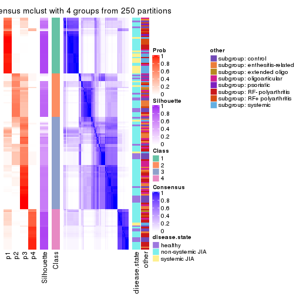</p>

</div>
<div id='tab-SD-mclust-consensus-heatmap-4'>
<pre><code class="r">consensus_heatmap(res, k = 5)
</code></pre>

<p></p>

</div>
<div id='tab-SD-mclust-consensus-heatmap-5'>
<pre><code class="r">consensus_heatmap(res, k = 6)
</code></pre>

<p></p>

</div>
</div>

Heatmaps for the membership of samples in all partitions to see how consistent they are:


<script>
$( function() {
	$( '#tabs-SD-mclust-membership-heatmap' ).tabs();
} );
</script>
<div id='tabs-SD-mclust-membership-heatmap'>
<ul>
<li><a href='#tab-SD-mclust-membership-heatmap-1'>k = 2</a></li>
<li><a href='#tab-SD-mclust-membership-heatmap-2'>k = 3</a></li>
<li><a href='#tab-SD-mclust-membership-heatmap-3'>k = 4</a></li>
<li><a href='#tab-SD-mclust-membership-heatmap-4'>k = 5</a></li>
<li><a href='#tab-SD-mclust-membership-heatmap-5'>k = 6</a></li>
</ul>
<div id='tab-SD-mclust-membership-heatmap-1'>
<pre><code class="r">membership_heatmap(res, k = 2)
</code></pre>

<p></p>

</div>
<div id='tab-SD-mclust-membership-heatmap-2'>
<pre><code class="r">membership_heatmap(res, k = 3)
</code></pre>

<p></p>

</div>
<div id='tab-SD-mclust-membership-heatmap-3'>
<pre><code class="r">membership_heatmap(res, k = 4)
</code></pre>

<p></p>

</div>
<div id='tab-SD-mclust-membership-heatmap-4'>
<pre><code class="r">membership_heatmap(res, k = 5)
</code></pre>

<p></p>

</div>
<div id='tab-SD-mclust-membership-heatmap-5'>
<pre><code class="r">membership_heatmap(res, k = 6)
</code></pre>

<p></p>

</div>
</div>

As soon as we have had the classes for columns, we can look for signatures
which are significantly different between classes which can be candidate marks
for certain classes. Following are the heatmaps for signatures.


Signature heatmaps where rows are scaled:


<script>
$( function() {
	$( '#tabs-SD-mclust-get-signatures' ).tabs();
} );
</script>
<div id='tabs-SD-mclust-get-signatures'>
<ul>
<li><a href='#tab-SD-mclust-get-signatures-1'>k = 2</a></li>
<li><a href='#tab-SD-mclust-get-signatures-2'>k = 3</a></li>
<li><a href='#tab-SD-mclust-get-signatures-3'>k = 4</a></li>
<li><a href='#tab-SD-mclust-get-signatures-4'>k = 5</a></li>
<li><a href='#tab-SD-mclust-get-signatures-5'>k = 6</a></li>
</ul>
<div id='tab-SD-mclust-get-signatures-1'>
<pre><code class="r">get_signatures(res, k = 2)
</code></pre>

<p></p>

</div>
<div id='tab-SD-mclust-get-signatures-2'>
<pre><code class="r">get_signatures(res, k = 3)
</code></pre>

<p></p>

</div>
<div id='tab-SD-mclust-get-signatures-3'>
<pre><code class="r">get_signatures(res, k = 4)
</code></pre>

<p></p>

</div>
<div id='tab-SD-mclust-get-signatures-4'>
<pre><code class="r">get_signatures(res, k = 5)
</code></pre>

<p></p>

</div>
<div id='tab-SD-mclust-get-signatures-5'>
<pre><code class="r">get_signatures(res, k = 6)
</code></pre>

<p></p>

</div>
</div>


Signature heatmaps where rows are not scaled:


<script>
$( function() {
	$( '#tabs-SD-mclust-get-signatures-no-scale' ).tabs();
} );
</script>
<div id='tabs-SD-mclust-get-signatures-no-scale'>
<ul>
<li><a href='#tab-SD-mclust-get-signatures-no-scale-1'>k = 2</a></li>
<li><a href='#tab-SD-mclust-get-signatures-no-scale-2'>k = 3</a></li>
<li><a href='#tab-SD-mclust-get-signatures-no-scale-3'>k = 4</a></li>
<li><a href='#tab-SD-mclust-get-signatures-no-scale-4'>k = 5</a></li>
<li><a href='#tab-SD-mclust-get-signatures-no-scale-5'>k = 6</a></li>
</ul>
<div id='tab-SD-mclust-get-signatures-no-scale-1'>
<pre><code class="r">get_signatures(res, k = 2, scale_rows = FALSE)
</code></pre>

<p></p>

</div>
<div id='tab-SD-mclust-get-signatures-no-scale-2'>
<pre><code class="r">get_signatures(res, k = 3, scale_rows = FALSE)
</code></pre>

<p></p>

</div>
<div id='tab-SD-mclust-get-signatures-no-scale-3'>
<pre><code class="r">get_signatures(res, k = 4, scale_rows = FALSE)
</code></pre>

<p></p>

</div>
<div id='tab-SD-mclust-get-signatures-no-scale-4'>
<pre><code class="r">get_signatures(res, k = 5, scale_rows = FALSE)
</code></pre>

<p></p>

</div>
<div id='tab-SD-mclust-get-signatures-no-scale-5'>
<pre><code class="r">get_signatures(res, k = 6, scale_rows = FALSE)
</code></pre>

<p></p>

</div>
</div>


Compare the overlap of signatures from different k:

```r
compare_signatures(res)
```


`get_signature()` returns a data frame invisibly. TO get the list of signatures, the function
call should be assigned to a variable explicitly. In following code, if `plot` argument is set
to `FALSE`, no heatmap is plotted while only the differential analysis is performed.

```r
# code only for demonstration
tb = get_signature(res, k = ..., plot = FALSE)
```

An example of the output of `tb` is:

```
#>   which_row         fdr    mean_1    mean_2 scaled_mean_1 scaled_mean_2 km
#> 1        38 0.042760348  8.373488  9.131774    -0.5533452     0.5164555  1
#> 2        40 0.018707592  7.106213  8.469186    -0.6173731     0.5762149  1
#> 3        55 0.019134737 10.221463 11.207825    -0.6159697     0.5749050  1
#> 4        59 0.006059896  5.921854  7.869574    -0.6899429     0.6439467  1
#> 5        60 0.018055526  8.928898 10.211722    -0.6204761     0.5791110  1
#> 6        98 0.009384629 15.714769 14.887706     0.6635654    -0.6193277  2
...
```

The columns in `tb` are:

1. `which_row`: row indices corresponding to the input matrix.
2. `fdr`: FDR for the differential test. 
3. `mean_x`: The mean value in group x.
4. `scaled_mean_x`: The mean value in group x after rows are scaled.
5. `km`: Row groups if k-means clustering is applied to rows.


UMAP plot which shows how samples are separated.


<script>
$( function() {
	$( '#tabs-SD-mclust-dimension-reduction' ).tabs();
} );
</script>
<div id='tabs-SD-mclust-dimension-reduction'>
<ul>
<li><a href='#tab-SD-mclust-dimension-reduction-1'>k = 2</a></li>
<li><a href='#tab-SD-mclust-dimension-reduction-2'>k = 3</a></li>
<li><a href='#tab-SD-mclust-dimension-reduction-3'>k = 4</a></li>
<li><a href='#tab-SD-mclust-dimension-reduction-4'>k = 5</a></li>
<li><a href='#tab-SD-mclust-dimension-reduction-5'>k = 6</a></li>
</ul>
<div id='tab-SD-mclust-dimension-reduction-1'>
<pre><code class="r">dimension_reduction(res, k = 2, method = &quot;UMAP&quot;)
</code></pre>

<p></p>

</div>
<div id='tab-SD-mclust-dimension-reduction-2'>
<pre><code class="r">dimension_reduction(res, k = 3, method = &quot;UMAP&quot;)
</code></pre>

<p></p>

</div>
<div id='tab-SD-mclust-dimension-reduction-3'>
<pre><code class="r">dimension_reduction(res, k = 4, method = &quot;UMAP&quot;)
</code></pre>

<p></p>

</div>
<div id='tab-SD-mclust-dimension-reduction-4'>
<pre><code class="r">dimension_reduction(res, k = 5, method = &quot;UMAP&quot;)
</code></pre>

<p></p>

</div>
<div id='tab-SD-mclust-dimension-reduction-5'>
<pre><code class="r">dimension_reduction(res, k = 6, method = &quot;UMAP&quot;)
</code></pre>

<p></p>

</div>
</div>


Following heatmap shows how subgroups are split when increasing `k`:

```r
collect_classes(res)
```


Test correlation between subgroups and known annotations. If the known
annotation is numeric, one-way ANOVA test is applied, and if the known
annotation is discrete, chi-squared contingency table test is applied.

```r
test_to_known_factors(res)
```

```
#>             n disease.state(p) other(p) k
#> SD:mclust 143         6.94e-03 1.44e-03 2
#> SD:mclust  99         7.39e-02 6.46e-04 3
#> SD:mclust 130         5.91e-04 1.16e-06 4
#> SD:mclust  93         1.09e-03 2.48e-04 5
#> SD:mclust  84         2.67e-07 6.13e-08 6
```


If matrix rows can be associated to genes, consider to use `GO_Enrichment(res,
...)` to perform function enrichment for the signature genes.


 

---------------------------------------------------


### SD:NMF


The object with results only for a single top-value method and a single partition method 
can be extracted as:

```r
res = res_list["SD", "NMF"]
# you can also extract it by
# res = res_list["SD:NMF"]
```

A summary of `res` and all the functions that can be applied to it:

```r
res
```

```
#> A 'ConsensusPartition' object with k = 2, 3, 4, 5, 6.
#>   On a matrix with 51941 rows and 154 columns.
#>   Top rows (1000, 2000, 3000, 4000, 5000) are extracted by 'SD' method.
#>   Subgroups are detected by 'NMF' method.
#>   Performed in total 1250 partitions by row resampling.
#>   Best k for subgroups seems to be 3.
#> 
#> Following methods can be applied to this 'ConsensusPartition' object:
#>  [1] "cola_report"             "collect_classes"         "collect_plots"          
#>  [4] "collect_stats"           "colnames"                "compare_signatures"     
#>  [7] "consensus_heatmap"       "dimension_reduction"     "functional_enrichment"  
#> [10] "get_anno_col"            "get_anno"                "get_classes"            
#> [13] "get_consensus"           "get_matrix"              "get_membership"         
#> [16] "get_param"               "get_signatures"          "get_stats"              
#> [19] "is_best_k"               "is_stable_k"             "membership_heatmap"     
#> [22] "ncol"                    "nrow"                    "plot_ecdf"              
#> [25] "rownames"                "select_partition_number" "show"                   
#> [28] "suggest_best_k"          "test_to_known_factors"
```

`collect_plots()` function collects all the plots made from `res` for all `k` (number of partitions)
into one single page to provide an easy and fast comparison between different `k`.

```r
collect_plots(res)
```

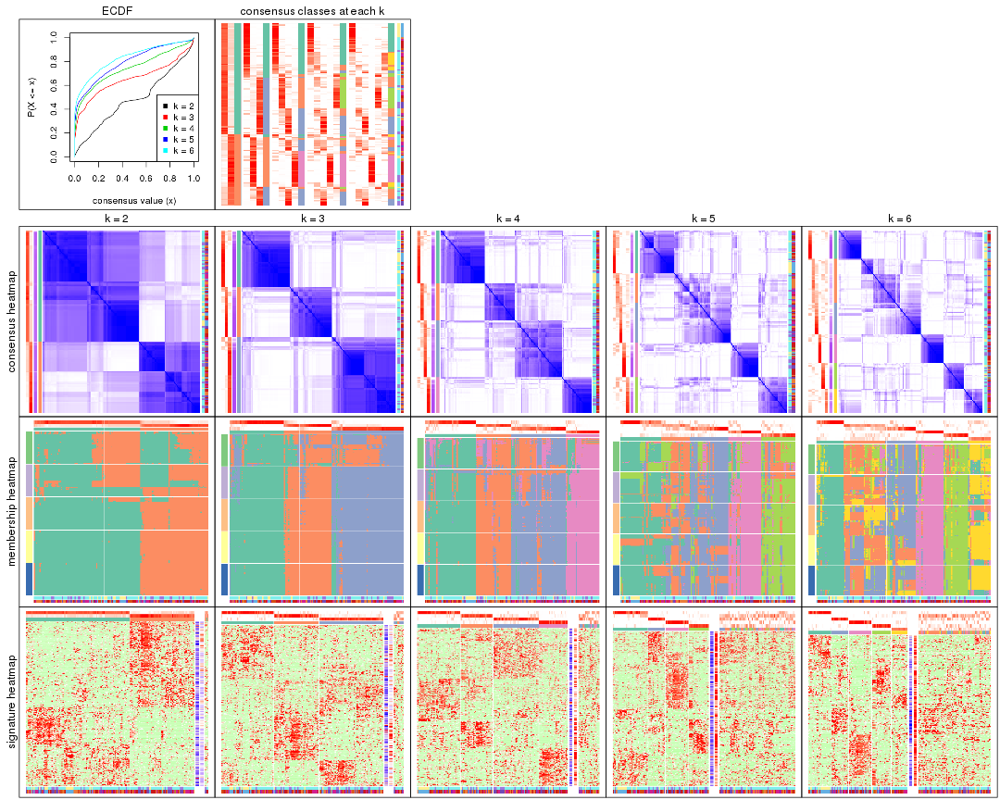

The plots are:

- The first row: a plot of the ECDF (Empirical cumulative distribution
  function) curves of the consensus matrix for each `k` and the heatmap of
  predicted classes for each `k`.
- The second row: heatmaps of the consensus matrix for each `k`.
- The third row: heatmaps of the membership matrix for each `k`.
- The fouth row: heatmaps of the signatures for each `k`.

All the plots in panels can be made by individual functions and they are
plotted later in this section.

`select_partition_number()` produces several plots showing different
statistics for choosing "optimized" `k`. There are following statistics:

- ECDF curves of the consensus matrix for each `k`;
- 1-PAC. [The PAC
  score](https://en.wikipedia.org/wiki/Consensus_clustering#Over-interpretation_potential_of_consensus_clustering)
  measures the proportion of the ambiguous subgrouping.
- Mean silhouette score.
- Concordance. The mean probability of fiting the consensus class ids in all
  partitions.
- Area increased. Denote $A_k$ as the area under the ECDF curve for current
  `k`, the area increased is defined as $A_k - A_{k-1}$.
- Rand index. The percent of pairs of samples that are both in a same cluster
  or both are not in a same cluster in the partition of k and k-1.
- Jaccard index. The ratio of pairs of samples are both in a same cluster in
  the partition of k and k-1 and the pairs of samples are both in a same
  cluster in the partition k or k-1.

The detailed explanations of these statistics can be found in [the cola
vignette](http://bioconductor.org/packages/devel/bioc/vignettes/cola/inst/doc/cola.html#toc_13).

Generally speaking, lower PAC score, higher mean silhouette score or higher
concordance corresponds to better partition. Rand index and Jaccard index
measure how similar the current partition is compared to partition with `k-1`.
If they are too similar, we won't accept `k` is better than `k-1`.

```r
select_partition_number(res)
```


The numeric values for all these statistics can be obtained by `get_stats()`.

```r
get_stats(res)
```

```
#>   k 1-PAC mean_silhouette concordance area_increased  Rand Jaccard
#> 2 2 0.328           0.751       0.806         0.4856 0.521   0.521
#> 3 3 0.603           0.797       0.877         0.3539 0.673   0.449
#> 4 4 0.609           0.697       0.824         0.1348 0.817   0.531
#> 5 5 0.594           0.466       0.708         0.0690 0.893   0.618
#> 6 6 0.661           0.535       0.699         0.0438 0.869   0.474
```

`suggest_best_k()` suggests the best $k$ based on these statistics. The rules are as follows:

- All $k$ with Jaccard index larger than 0.95 are removed because the increase of
  the partition number does not provides enough extra information. If all $k$ are removed,
  the best $k$ is assigned by `NA`.
- For $k$ with 1-PAC larger than 0.9, the maximal $k$ is taken as the "best k". Other $k$ is called "optional k".
- If it does not fit the second rule. The $k$ with the highest vote of highest
  1-PAC, mean silhouette and concordance is taken as the "best k".

```r
suggest_best_k(res)
```

```
#> [1] 3
```


Following shows the table of the partitions (You need to click the **show/hide
code output** link to see it). The membership matrix (columns with name `p*`)
is inferred by
[`clue::cl_consensus()`](https://www.rdocumentation.org/link/cl_consensus?package=clue)
function with the `SE` method. Basically the value in the membership matrix
represents the probability to belong to a certain group. The finall class
label for an item is determined with the group with highest probability it
belongs to.

In `get_classes()` function, the entropy is calculated from the membership
matrix and the silhouette score is calculated from the consensus matrix.


<script>
$( function() {
	$( '#tabs-SD-NMF-get-classes' ).tabs();
} );
</script>
<div id='tabs-SD-NMF-get-classes'>
<ul>
<li><a href='#tab-SD-NMF-get-classes-1'>k = 2</a></li>
<li><a href='#tab-SD-NMF-get-classes-2'>k = 3</a></li>
<li><a href='#tab-SD-NMF-get-classes-3'>k = 4</a></li>
<li><a href='#tab-SD-NMF-get-classes-4'>k = 5</a></li>
<li><a href='#tab-SD-NMF-get-classes-5'>k = 6</a></li>
</ul>

<div id='tab-SD-NMF-get-classes-1'>
<p><a id='tab-SD-NMF-get-classes-1-a' style='color:#0366d6' href='#'>show/hide code output</a></p>
<pre><code class="r">cbind(get_classes(res, k = 2), get_membership(res, k = 2))
</code></pre>

<pre><code>#&gt;           class entropy silhouette    p1    p2
#&gt; GSM340358     1  0.7883      0.734 0.764 0.236
#&gt; GSM340359     1  0.6973      0.753 0.812 0.188
#&gt; GSM340361     1  0.7815      0.736 0.768 0.232
#&gt; GSM340362     1  0.5059      0.773 0.888 0.112
#&gt; GSM340363     1  0.7950      0.734 0.760 0.240
#&gt; GSM340364     1  0.4161      0.778 0.916 0.084
#&gt; GSM340365     1  0.2603      0.783 0.956 0.044
#&gt; GSM340366     1  0.5519      0.767 0.872 0.128
#&gt; GSM340367     1  0.7815      0.736 0.768 0.232
#&gt; GSM340368     2  0.5629      0.717 0.132 0.868
#&gt; GSM340369     2  0.4431      0.752 0.092 0.908
#&gt; GSM340370     1  0.7883      0.734 0.764 0.236
#&gt; GSM340371     2  0.8443      0.738 0.272 0.728
#&gt; GSM340372     1  0.7883      0.734 0.764 0.236
#&gt; GSM340373     1  0.7453      0.744 0.788 0.212
#&gt; GSM340375     1  0.7883      0.734 0.764 0.236
#&gt; GSM340376     1  0.7883      0.734 0.764 0.236
#&gt; GSM340378     1  0.7376      0.746 0.792 0.208
#&gt; GSM340243     1  0.4815      0.788 0.896 0.104
#&gt; GSM340244     1  0.8813      0.709 0.700 0.300
#&gt; GSM340246     1  0.5737      0.764 0.864 0.136
#&gt; GSM340247     2  0.0376      0.802 0.004 0.996
#&gt; GSM340248     1  0.7139      0.772 0.804 0.196
#&gt; GSM340249     2  0.4690      0.803 0.100 0.900
#&gt; GSM340250     1  0.7950      0.734 0.760 0.240
#&gt; GSM340251     2  0.7815      0.768 0.232 0.768
#&gt; GSM340252     2  0.5294      0.802 0.120 0.880
#&gt; GSM340253     1  0.4815      0.783 0.896 0.104
#&gt; GSM340254     1  0.5629      0.766 0.868 0.132
#&gt; GSM340256     1  0.4815      0.782 0.896 0.104
#&gt; GSM340258     1  0.8144      0.611 0.748 0.252
#&gt; GSM340259     1  0.5408      0.778 0.876 0.124
#&gt; GSM340260     1  0.2778      0.788 0.952 0.048
#&gt; GSM340261     2  0.8016      0.762 0.244 0.756
#&gt; GSM340262     1  0.6048      0.764 0.852 0.148
#&gt; GSM340263     1  0.7674      0.763 0.776 0.224
#&gt; GSM340264     1  0.5737      0.764 0.864 0.136
#&gt; GSM340265     1  0.5629      0.764 0.868 0.132
#&gt; GSM340266     2  0.4298      0.804 0.088 0.912
#&gt; GSM340267     1  0.5842      0.772 0.860 0.140
#&gt; GSM340268     2  0.7745      0.770 0.228 0.772
#&gt; GSM340269     1  0.6973      0.731 0.812 0.188
#&gt; GSM340270     1  0.7815      0.737 0.768 0.232
#&gt; GSM537574     1  0.5842      0.772 0.860 0.140
#&gt; GSM537580     2  0.7883      0.766 0.236 0.764
#&gt; GSM537581     2  0.5629      0.715 0.132 0.868
#&gt; GSM340272     1  0.4562      0.779 0.904 0.096
#&gt; GSM340273     1  0.7950      0.734 0.760 0.240
#&gt; GSM340275     2  0.3114      0.807 0.056 0.944
#&gt; GSM340276     1  0.8081      0.753 0.752 0.248
#&gt; GSM340277     1  0.5519      0.767 0.872 0.128
#&gt; GSM340278     2  0.7528      0.777 0.216 0.784
#&gt; GSM340279     2  0.4022      0.780 0.080 0.920
#&gt; GSM340282     1  0.5519      0.767 0.872 0.128
#&gt; GSM340284     2  0.7674      0.771 0.224 0.776
#&gt; GSM340285     2  0.4815      0.760 0.104 0.896
#&gt; GSM340286     1  0.5946      0.758 0.856 0.144
#&gt; GSM340287     1  0.7056      0.752 0.808 0.192
#&gt; GSM340288     1  0.7950      0.734 0.760 0.240
#&gt; GSM340289     1  0.6712      0.759 0.824 0.176
#&gt; GSM340290     2  0.7528      0.777 0.216 0.784
#&gt; GSM340291     1  0.4298      0.785 0.912 0.088
#&gt; GSM340293     2  0.7602      0.777 0.220 0.780
#&gt; GSM340294     2  0.8861      0.709 0.304 0.696
#&gt; GSM340296     1  0.5519      0.767 0.872 0.128
#&gt; GSM340297     2  0.6148      0.706 0.152 0.848
#&gt; GSM340298     2  0.9286      0.653 0.344 0.656
#&gt; GSM340299     1  0.5519      0.767 0.872 0.128
#&gt; GSM340301     1  0.5629      0.766 0.868 0.132
#&gt; GSM340303     1  0.5519      0.767 0.872 0.128
#&gt; GSM340304     1  0.4690      0.790 0.900 0.100
#&gt; GSM340306     2  0.5737      0.713 0.136 0.864
#&gt; GSM340307     1  0.5629      0.764 0.868 0.132
#&gt; GSM340310     1  0.7883      0.734 0.764 0.236
#&gt; GSM340314     2  0.7376      0.780 0.208 0.792
#&gt; GSM340315     2  0.8713      0.488 0.292 0.708
#&gt; GSM340317     2  0.4431      0.751 0.092 0.908
#&gt; GSM340318     2  0.0000      0.801 0.000 1.000
#&gt; GSM340319     2  0.0000      0.801 0.000 1.000
#&gt; GSM340320     2  0.5519      0.719 0.128 0.872
#&gt; GSM340321     1  0.5737      0.764 0.864 0.136
#&gt; GSM340322     2  0.1843      0.806 0.028 0.972
#&gt; GSM340324     1  0.7376      0.746 0.792 0.208
#&gt; GSM340328     1  0.7883      0.734 0.764 0.236
#&gt; GSM340330     2  0.7883      0.766 0.236 0.764
#&gt; GSM340332     2  0.0000      0.801 0.000 1.000
#&gt; GSM340333     1  0.4939      0.776 0.892 0.108
#&gt; GSM340336     2  0.0000      0.801 0.000 1.000
#&gt; GSM340337     2  0.4298      0.753 0.088 0.912
#&gt; GSM340338     2  0.7950      0.765 0.240 0.760
#&gt; GSM340339     2  0.1843      0.789 0.028 0.972
#&gt; GSM340340     2  0.4562      0.748 0.096 0.904
#&gt; GSM340341     2  0.4298      0.753 0.088 0.912
#&gt; GSM340343     2  0.2603      0.807 0.044 0.956
#&gt; GSM340344     1  0.4431      0.785 0.908 0.092
#&gt; GSM340346     1  0.9732      0.161 0.596 0.404
#&gt; GSM340347     2  0.0376      0.800 0.004 0.996
#&gt; GSM340348     2  0.5294      0.726 0.120 0.880
#&gt; GSM340349     1  0.3584      0.780 0.932 0.068
#&gt; GSM340350     1  0.0938      0.784 0.988 0.012
#&gt; GSM340351     1  0.7950      0.734 0.760 0.240
#&gt; GSM340354     1  0.6247      0.748 0.844 0.156
#&gt; GSM340356     1  0.7950      0.734 0.760 0.240
#&gt; GSM340357     1  0.7815      0.735 0.768 0.232
#&gt; GSM348183     1  0.7950      0.734 0.760 0.240
#&gt; GSM348191     2  0.7883      0.766 0.236 0.764
#&gt; GSM348193     1  0.8443      0.704 0.728 0.272
#&gt; GSM537578     1  0.2423      0.786 0.960 0.040
#&gt; GSM348181     1  0.8499      0.728 0.724 0.276
#&gt; GSM348182     1  0.5519      0.782 0.872 0.128
#&gt; GSM348184     2  0.7883      0.766 0.236 0.764
#&gt; GSM348185     2  0.5946      0.706 0.144 0.856
#&gt; GSM348186     1  0.5629      0.766 0.868 0.132
#&gt; GSM348187     1  0.7883      0.734 0.764 0.236
#&gt; GSM348188     2  0.5946      0.707 0.144 0.856
#&gt; GSM348189     1  0.7056      0.709 0.808 0.192
#&gt; GSM348190     1  0.4815      0.775 0.896 0.104
#&gt; GSM348194     1  0.7950      0.734 0.760 0.240
#&gt; GSM348195     1  0.7883      0.734 0.764 0.236
#&gt; GSM348196     1  0.7950      0.734 0.760 0.240
#&gt; GSM537585     1  0.4562      0.774 0.904 0.096
#&gt; GSM537594     1  0.7950      0.734 0.760 0.240
#&gt; GSM537596     1  0.7950      0.734 0.760 0.240
#&gt; GSM537597     1  0.7950      0.734 0.760 0.240
#&gt; GSM537602     1  0.3733      0.779 0.928 0.072
#&gt; GSM340184     2  0.7883      0.766 0.236 0.764
#&gt; GSM340185     2  0.8207      0.755 0.256 0.744
#&gt; GSM340186     2  0.7883      0.766 0.236 0.764
#&gt; GSM340187     2  0.4815      0.803 0.104 0.896
#&gt; GSM340189     2  0.5059      0.802 0.112 0.888
#&gt; GSM340190     2  0.7950      0.765 0.240 0.760
#&gt; GSM340191     2  0.7376      0.781 0.208 0.792
#&gt; GSM340192     1  0.5519      0.767 0.872 0.128
#&gt; GSM340193     1  0.7950      0.734 0.760 0.240
#&gt; GSM340194     1  0.5629      0.766 0.868 0.132
#&gt; GSM340195     1  0.4431      0.780 0.908 0.092
#&gt; GSM340196     2  0.0000      0.801 0.000 1.000
#&gt; GSM340197     1  0.5737      0.771 0.864 0.136
#&gt; GSM340198     1  0.6048      0.755 0.852 0.148
#&gt; GSM340199     2  0.8327      0.748 0.264 0.736
#&gt; GSM340200     2  0.9922      0.403 0.448 0.552
#&gt; GSM340201     2  0.3431      0.769 0.064 0.936
#&gt; GSM340202     2  0.0000      0.801 0.000 1.000
#&gt; GSM340203     2  0.1843      0.806 0.028 0.972
#&gt; GSM340204     1  0.4562      0.780 0.904 0.096
#&gt; GSM340205     1  0.7815      0.736 0.768 0.232
#&gt; GSM340206     2  0.7883      0.766 0.236 0.764
#&gt; GSM340207     1  0.6148      0.751 0.848 0.152
#&gt; GSM340237     1  0.4161      0.781 0.916 0.084
#&gt; GSM340238     2  0.7376      0.780 0.208 0.792
#&gt; GSM340239     1  0.5629      0.766 0.868 0.132
#&gt; GSM340240     1  0.5629      0.764 0.868 0.132
#&gt; GSM340241     1  0.5842      0.761 0.860 0.140
#&gt; GSM340242     1  0.7056      0.709 0.808 0.192
</code></pre>

<script>
$('#tab-SD-NMF-get-classes-1-a').parent().next().next().hide();
$('#tab-SD-NMF-get-classes-1-a').click(function(){
  $('#tab-SD-NMF-get-classes-1-a').parent().next().next().toggle();
  return(false);
});
</script>
</div>

<div id='tab-SD-NMF-get-classes-2'>
<p><a id='tab-SD-NMF-get-classes-2-a' style='color:#0366d6' href='#'>show/hide code output</a></p>
<pre><code class="r">cbind(get_classes(res, k = 3), get_membership(res, k = 3))
</code></pre>

<pre><code>#&gt;           class entropy silhouette    p1    p2    p3
#&gt; GSM340358     1  0.0424     0.8992 0.992 0.008 0.000
#&gt; GSM340359     1  0.0000     0.8979 1.000 0.000 0.000
#&gt; GSM340361     1  0.0592     0.8991 0.988 0.012 0.000
#&gt; GSM340362     3  0.4654     0.7417 0.208 0.000 0.792
#&gt; GSM340363     1  0.0892     0.8987 0.980 0.020 0.000
#&gt; GSM340364     1  0.0592     0.8947 0.988 0.000 0.012
#&gt; GSM340365     1  0.5835     0.5514 0.660 0.000 0.340
#&gt; GSM340366     3  0.1620     0.8591 0.012 0.024 0.964
#&gt; GSM340367     1  0.0237     0.8968 0.996 0.000 0.004
#&gt; GSM340368     2  0.4452     0.7604 0.192 0.808 0.000
#&gt; GSM340369     2  0.4575     0.7775 0.184 0.812 0.004
#&gt; GSM340370     1  0.0000     0.8979 1.000 0.000 0.000
#&gt; GSM340371     3  0.1529     0.8658 0.000 0.040 0.960
#&gt; GSM340372     1  0.0000     0.8979 1.000 0.000 0.000
#&gt; GSM340373     1  0.0237     0.8968 0.996 0.000 0.004
#&gt; GSM340375     1  0.0592     0.8991 0.988 0.012 0.000
#&gt; GSM340376     1  0.0000     0.8979 1.000 0.000 0.000
#&gt; GSM340378     1  0.0237     0.8968 0.996 0.000 0.004
#&gt; GSM340243     1  0.5951     0.7349 0.764 0.040 0.196
#&gt; GSM340244     1  0.7205     0.6438 0.708 0.100 0.192
#&gt; GSM340246     3  0.3213     0.8705 0.008 0.092 0.900
#&gt; GSM340247     2  0.0237     0.8689 0.000 0.996 0.004
#&gt; GSM340248     3  0.7199     0.7003 0.204 0.092 0.704
#&gt; GSM340249     2  0.2486     0.8493 0.008 0.932 0.060
#&gt; GSM340250     1  0.1337     0.8934 0.972 0.012 0.016
#&gt; GSM340251     2  0.4121     0.7728 0.000 0.832 0.168
#&gt; GSM340252     2  0.3213     0.8311 0.008 0.900 0.092
#&gt; GSM340253     3  0.3377     0.8697 0.012 0.092 0.896
#&gt; GSM340254     3  0.3112     0.8701 0.004 0.096 0.900
#&gt; GSM340256     3  0.3377     0.8697 0.012 0.092 0.896
#&gt; GSM340258     3  0.2878     0.8703 0.000 0.096 0.904
#&gt; GSM340259     3  0.8720     0.1918 0.412 0.108 0.480
#&gt; GSM340260     3  0.3832     0.8575 0.076 0.036 0.888
#&gt; GSM340261     3  0.3500     0.8700 0.004 0.116 0.880
#&gt; GSM340262     3  0.3375     0.8682 0.008 0.100 0.892
#&gt; GSM340263     1  0.5505     0.7598 0.816 0.096 0.088
#&gt; GSM340264     3  0.2878     0.8715 0.000 0.096 0.904
#&gt; GSM340265     3  0.0237     0.8631 0.000 0.004 0.996
#&gt; GSM340266     2  0.1643     0.8572 0.000 0.956 0.044
#&gt; GSM340267     3  0.2689     0.8669 0.036 0.032 0.932
#&gt; GSM340268     2  0.5465     0.5954 0.000 0.712 0.288
#&gt; GSM340269     3  0.4110     0.8497 0.004 0.152 0.844
#&gt; GSM340270     1  0.1015     0.8962 0.980 0.008 0.012
#&gt; GSM537574     3  0.3112     0.8701 0.004 0.096 0.900
#&gt; GSM537580     3  0.4291     0.8391 0.000 0.180 0.820
#&gt; GSM537581     2  0.6026     0.5061 0.376 0.624 0.000
#&gt; GSM340272     3  0.1620     0.8591 0.012 0.024 0.964
#&gt; GSM340273     1  0.0892     0.8987 0.980 0.020 0.000
#&gt; GSM340275     2  0.1399     0.8615 0.004 0.968 0.028
#&gt; GSM340276     1  0.8532     0.5109 0.608 0.168 0.224
#&gt; GSM340277     3  0.1337     0.8592 0.012 0.016 0.972
#&gt; GSM340278     2  0.5873     0.5598 0.004 0.684 0.312
#&gt; GSM340279     2  0.5884     0.7845 0.064 0.788 0.148
#&gt; GSM340282     3  0.1620     0.8591 0.012 0.024 0.964
#&gt; GSM340284     2  0.5431     0.6026 0.000 0.716 0.284
#&gt; GSM340285     2  0.3295     0.8232 0.008 0.896 0.096
#&gt; GSM340286     3  0.4062     0.8494 0.000 0.164 0.836
#&gt; GSM340287     1  0.8070    -0.0388 0.472 0.064 0.464
#&gt; GSM340288     1  0.0892     0.8987 0.980 0.020 0.000
#&gt; GSM340289     1  0.0661     0.8996 0.988 0.008 0.004
#&gt; GSM340290     2  0.5497     0.5572 0.000 0.708 0.292
#&gt; GSM340291     3  0.6879     0.3963 0.360 0.024 0.616
#&gt; GSM340293     2  0.5122     0.7658 0.012 0.788 0.200
#&gt; GSM340294     3  0.3030     0.8413 0.004 0.092 0.904
#&gt; GSM340296     3  0.1620     0.8591 0.012 0.024 0.964
#&gt; GSM340297     2  0.7069     0.2569 0.472 0.508 0.020
#&gt; GSM340298     3  0.1620     0.8591 0.012 0.024 0.964
#&gt; GSM340299     3  0.1620     0.8591 0.012 0.024 0.964
#&gt; GSM340301     3  0.3619     0.8578 0.000 0.136 0.864
#&gt; GSM340303     3  0.2116     0.8567 0.012 0.040 0.948
#&gt; GSM340304     1  0.6441     0.6480 0.696 0.028 0.276
#&gt; GSM340306     2  0.5678     0.6050 0.316 0.684 0.000
#&gt; GSM340307     3  0.1620     0.8591 0.012 0.024 0.964
#&gt; GSM340310     1  0.0592     0.8991 0.988 0.012 0.000
#&gt; GSM340314     2  0.1031     0.8628 0.000 0.976 0.024
#&gt; GSM340315     1  0.0892     0.8987 0.980 0.020 0.000
#&gt; GSM340317     2  0.5760     0.4628 0.328 0.672 0.000
#&gt; GSM340318     2  0.0237     0.8708 0.004 0.996 0.000
#&gt; GSM340319     2  0.0237     0.8708 0.004 0.996 0.000
#&gt; GSM340320     2  0.3752     0.7955 0.144 0.856 0.000
#&gt; GSM340321     3  0.1529     0.8669 0.000 0.040 0.960
#&gt; GSM340322     2  0.0237     0.8708 0.004 0.996 0.000
#&gt; GSM340324     1  0.0424     0.8992 0.992 0.008 0.000
#&gt; GSM340328     1  0.0892     0.8987 0.980 0.020 0.000
#&gt; GSM340330     3  0.3941     0.8557 0.000 0.156 0.844
#&gt; GSM340332     2  0.0237     0.8708 0.004 0.996 0.000
#&gt; GSM340333     3  0.3377     0.8697 0.012 0.092 0.896
#&gt; GSM340336     2  0.0237     0.8708 0.004 0.996 0.000
#&gt; GSM340337     2  0.2625     0.8355 0.084 0.916 0.000
#&gt; GSM340338     3  0.2878     0.8703 0.000 0.096 0.904
#&gt; GSM340339     2  0.0424     0.8699 0.008 0.992 0.000
#&gt; GSM340340     2  0.4235     0.7845 0.176 0.824 0.000
#&gt; GSM340341     2  0.2711     0.8336 0.088 0.912 0.000
#&gt; GSM340343     2  0.0237     0.8696 0.000 0.996 0.004
#&gt; GSM340344     3  0.3445     0.8700 0.016 0.088 0.896
#&gt; GSM340346     3  0.1620     0.8591 0.012 0.024 0.964
#&gt; GSM340347     2  0.0000     0.8699 0.000 1.000 0.000
#&gt; GSM340348     2  0.3116     0.8169 0.108 0.892 0.000
#&gt; GSM340349     1  0.6570     0.5808 0.668 0.024 0.308
#&gt; GSM340350     3  0.7152     0.0654 0.444 0.024 0.532
#&gt; GSM340351     1  0.0592     0.8991 0.988 0.012 0.000
#&gt; GSM340354     3  0.3412     0.8548 0.000 0.124 0.876
#&gt; GSM340356     1  0.0892     0.8987 0.980 0.020 0.000
#&gt; GSM340357     1  0.2261     0.8641 0.932 0.000 0.068
#&gt; GSM348183     1  0.1163     0.8958 0.972 0.028 0.000
#&gt; GSM348191     3  0.6274     0.3501 0.000 0.456 0.544
#&gt; GSM348193     1  0.0892     0.8987 0.980 0.020 0.000
#&gt; GSM537578     3  0.1620     0.8591 0.012 0.024 0.964
#&gt; GSM348181     1  0.5200     0.7453 0.796 0.184 0.020
#&gt; GSM348182     1  0.8229     0.5317 0.620 0.256 0.124
#&gt; GSM348184     3  0.5138     0.7242 0.000 0.252 0.748
#&gt; GSM348185     1  0.3340     0.8250 0.880 0.120 0.000
#&gt; GSM348186     3  0.3030     0.8710 0.004 0.092 0.904
#&gt; GSM348187     1  0.0892     0.8987 0.980 0.020 0.000
#&gt; GSM348188     2  0.5058     0.6852 0.244 0.756 0.000
#&gt; GSM348189     3  0.4178     0.8483 0.000 0.172 0.828
#&gt; GSM348190     3  0.8196     0.5221 0.284 0.108 0.608
#&gt; GSM348194     1  0.0892     0.8987 0.980 0.020 0.000
#&gt; GSM348195     1  0.0747     0.8990 0.984 0.016 0.000
#&gt; GSM348196     1  0.0892     0.8987 0.980 0.020 0.000
#&gt; GSM537585     1  0.5365     0.7060 0.744 0.004 0.252
#&gt; GSM537594     1  0.0892     0.8987 0.980 0.020 0.000
#&gt; GSM537596     1  0.2356     0.8666 0.928 0.072 0.000
#&gt; GSM537597     1  0.0892     0.8987 0.980 0.020 0.000
#&gt; GSM537602     1  0.3921     0.8223 0.872 0.016 0.112
#&gt; GSM340184     3  0.5497     0.7149 0.000 0.292 0.708
#&gt; GSM340185     3  0.1620     0.8591 0.012 0.024 0.964
#&gt; GSM340186     3  0.3213     0.8705 0.008 0.092 0.900
#&gt; GSM340187     2  0.0592     0.8658 0.000 0.988 0.012
#&gt; GSM340189     2  0.0747     0.8671 0.000 0.984 0.016
#&gt; GSM340190     3  0.1585     0.8601 0.008 0.028 0.964
#&gt; GSM340191     2  0.3682     0.8159 0.008 0.876 0.116
#&gt; GSM340192     3  0.1620     0.8591 0.012 0.024 0.964
#&gt; GSM340193     1  0.2537     0.8613 0.920 0.080 0.000
#&gt; GSM340194     3  0.3879     0.8504 0.000 0.152 0.848
#&gt; GSM340195     3  0.3816     0.8531 0.000 0.148 0.852
#&gt; GSM340196     2  0.0237     0.8708 0.004 0.996 0.000
#&gt; GSM340197     3  0.3295     0.8695 0.008 0.096 0.896
#&gt; GSM340198     3  0.3295     0.8695 0.008 0.096 0.896
#&gt; GSM340199     3  0.1620     0.8591 0.012 0.024 0.964
#&gt; GSM340200     3  0.1453     0.8602 0.008 0.024 0.968
#&gt; GSM340201     2  0.1163     0.8633 0.028 0.972 0.000
#&gt; GSM340202     2  0.0237     0.8708 0.004 0.996 0.000
#&gt; GSM340203     2  0.0237     0.8708 0.004 0.996 0.000
#&gt; GSM340204     3  0.4110     0.8501 0.004 0.152 0.844
#&gt; GSM340205     1  0.0661     0.8960 0.988 0.004 0.008
#&gt; GSM340206     3  0.6095     0.4983 0.000 0.392 0.608
#&gt; GSM340207     3  0.2878     0.8703 0.000 0.096 0.904
#&gt; GSM340237     3  0.6675     0.2141 0.404 0.012 0.584
#&gt; GSM340238     2  0.1031     0.8628 0.000 0.976 0.024
#&gt; GSM340239     3  0.2959     0.8711 0.000 0.100 0.900
#&gt; GSM340240     3  0.1620     0.8591 0.012 0.024 0.964
#&gt; GSM340241     3  0.2796     0.8710 0.000 0.092 0.908
#&gt; GSM340242     3  0.2796     0.8719 0.000 0.092 0.908
</code></pre>

<script>
$('#tab-SD-NMF-get-classes-2-a').parent().next().next().hide();
$('#tab-SD-NMF-get-classes-2-a').click(function(){
  $('#tab-SD-NMF-get-classes-2-a').parent().next().next().toggle();
  return(false);
});
</script>
</div>

<div id='tab-SD-NMF-get-classes-3'>
<p><a id='tab-SD-NMF-get-classes-3-a' style='color:#0366d6' href='#'>show/hide code output</a></p>
<pre><code class="r">cbind(get_classes(res, k = 4), get_membership(res, k = 4))
</code></pre>

<pre><code>#&gt;           class entropy silhouette    p1    p2    p3    p4
#&gt; GSM340358     1  0.0188     0.8518 0.996 0.004 0.000 0.000
#&gt; GSM340359     1  0.4776     0.3403 0.624 0.376 0.000 0.000
#&gt; GSM340361     1  0.0336     0.8513 0.992 0.008 0.000 0.000
#&gt; GSM340362     2  0.3328     0.7811 0.100 0.872 0.024 0.004
#&gt; GSM340363     1  0.1510     0.8486 0.956 0.028 0.000 0.016
#&gt; GSM340364     1  0.0188     0.8518 0.996 0.004 0.000 0.000
#&gt; GSM340365     2  0.5274     0.6475 0.036 0.724 0.232 0.008
#&gt; GSM340366     3  0.1305     0.7330 0.004 0.036 0.960 0.000
#&gt; GSM340367     1  0.0188     0.8518 0.996 0.004 0.000 0.000
#&gt; GSM340368     4  0.4222     0.6616 0.272 0.000 0.000 0.728
#&gt; GSM340369     4  0.4378     0.7623 0.164 0.000 0.040 0.796
#&gt; GSM340370     1  0.0188     0.8518 0.996 0.004 0.000 0.000
#&gt; GSM340371     2  0.5478     0.5517 0.000 0.628 0.344 0.028
#&gt; GSM340372     1  0.0188     0.8518 0.996 0.004 0.000 0.000
#&gt; GSM340373     1  0.0188     0.8518 0.996 0.004 0.000 0.000
#&gt; GSM340375     1  0.0188     0.8518 0.996 0.004 0.000 0.000
#&gt; GSM340376     1  0.0188     0.8518 0.996 0.004 0.000 0.000
#&gt; GSM340378     1  0.0188     0.8518 0.996 0.004 0.000 0.000
#&gt; GSM340243     1  0.6158     0.3750 0.548 0.036 0.408 0.008
#&gt; GSM340244     1  0.7310     0.4455 0.568 0.292 0.120 0.020
#&gt; GSM340246     3  0.4797     0.6508 0.000 0.260 0.720 0.020
#&gt; GSM340247     4  0.0564     0.8702 0.004 0.004 0.004 0.988
#&gt; GSM340248     3  0.7160     0.5673 0.104 0.300 0.576 0.020
#&gt; GSM340249     4  0.3172     0.7369 0.000 0.160 0.000 0.840
#&gt; GSM340250     1  0.5809     0.5543 0.692 0.092 0.216 0.000
#&gt; GSM340251     3  0.6469     0.6281 0.000 0.164 0.644 0.192
#&gt; GSM340252     2  0.4644     0.6544 0.000 0.748 0.024 0.228
#&gt; GSM340253     2  0.1968     0.8122 0.008 0.940 0.044 0.008
#&gt; GSM340254     2  0.2021     0.8086 0.000 0.932 0.056 0.012
#&gt; GSM340256     2  0.3123     0.7053 0.000 0.844 0.156 0.000
#&gt; GSM340258     3  0.5371     0.5254 0.000 0.364 0.616 0.020
#&gt; GSM340259     2  0.4017     0.7247 0.128 0.828 0.044 0.000
#&gt; GSM340260     2  0.4980     0.5082 0.012 0.708 0.272 0.008
#&gt; GSM340261     3  0.3166     0.7455 0.000 0.116 0.868 0.016
#&gt; GSM340262     2  0.2413     0.8030 0.000 0.916 0.064 0.020
#&gt; GSM340263     1  0.5512     0.5843 0.692 0.268 0.020 0.020
#&gt; GSM340264     2  0.2256     0.8091 0.000 0.924 0.056 0.020
#&gt; GSM340265     3  0.3444     0.7206 0.000 0.184 0.816 0.000
#&gt; GSM340266     4  0.6083     0.4593 0.028 0.336 0.020 0.616
#&gt; GSM340267     3  0.3584     0.7269 0.004 0.152 0.836 0.008
#&gt; GSM340268     3  0.6236     0.6498 0.000 0.180 0.668 0.152
#&gt; GSM340269     2  0.5384     0.3673 0.000 0.648 0.324 0.028
#&gt; GSM340270     1  0.0672     0.8515 0.984 0.008 0.008 0.000
#&gt; GSM537574     3  0.5055     0.5426 0.000 0.368 0.624 0.008
#&gt; GSM537580     2  0.4644     0.7010 0.000 0.748 0.024 0.228
#&gt; GSM537581     4  0.5386     0.4538 0.368 0.020 0.000 0.612
#&gt; GSM340272     2  0.5412     0.5148 0.016 0.624 0.356 0.004
#&gt; GSM340273     1  0.1488     0.8464 0.956 0.032 0.000 0.012
#&gt; GSM340275     4  0.0817     0.8618 0.000 0.024 0.000 0.976
#&gt; GSM340276     1  0.6455     0.5019 0.596 0.336 0.016 0.052
#&gt; GSM340277     3  0.4072     0.4972 0.000 0.252 0.748 0.000
#&gt; GSM340278     3  0.1296     0.7449 0.004 0.004 0.964 0.028
#&gt; GSM340279     3  0.4990     0.7137 0.032 0.064 0.804 0.100
#&gt; GSM340282     3  0.4431     0.3622 0.000 0.304 0.696 0.000
#&gt; GSM340284     3  0.5417     0.6887 0.000 0.180 0.732 0.088
#&gt; GSM340285     4  0.8522    -0.1009 0.392 0.056 0.152 0.400
#&gt; GSM340286     2  0.3789     0.7832 0.004 0.836 0.020 0.140
#&gt; GSM340287     3  0.6334     0.6331 0.192 0.068 0.700 0.040
#&gt; GSM340288     1  0.2256     0.8411 0.924 0.056 0.000 0.020
#&gt; GSM340289     1  0.3401     0.7687 0.840 0.152 0.000 0.008
#&gt; GSM340290     3  0.5265     0.6890 0.000 0.092 0.748 0.160
#&gt; GSM340291     3  0.6855     0.5961 0.152 0.216 0.624 0.008
#&gt; GSM340293     3  0.1211     0.7402 0.000 0.000 0.960 0.040
#&gt; GSM340294     3  0.3320     0.7344 0.000 0.056 0.876 0.068
#&gt; GSM340296     3  0.0524     0.7379 0.004 0.008 0.988 0.000
#&gt; GSM340297     3  0.5114     0.5905 0.280 0.020 0.696 0.004
#&gt; GSM340298     3  0.0672     0.7375 0.008 0.008 0.984 0.000
#&gt; GSM340299     2  0.3810     0.7393 0.000 0.804 0.188 0.008
#&gt; GSM340301     2  0.3037     0.8141 0.000 0.888 0.036 0.076
#&gt; GSM340303     3  0.5105    -0.0186 0.000 0.432 0.564 0.004
#&gt; GSM340304     1  0.6280     0.5269 0.604 0.056 0.332 0.008
#&gt; GSM340306     4  0.5169     0.6156 0.272 0.032 0.000 0.696
#&gt; GSM340307     3  0.0469     0.7377 0.000 0.012 0.988 0.000
#&gt; GSM340310     1  0.0188     0.8518 0.996 0.004 0.000 0.000
#&gt; GSM340314     4  0.5300     0.0888 0.000 0.012 0.408 0.580
#&gt; GSM340315     3  0.6186     0.1558 0.468 0.028 0.492 0.012
#&gt; GSM340317     1  0.5682     0.2066 0.520 0.024 0.000 0.456
#&gt; GSM340318     4  0.0564     0.8702 0.004 0.004 0.004 0.988
#&gt; GSM340319     4  0.0564     0.8702 0.004 0.004 0.004 0.988
#&gt; GSM340320     4  0.3803     0.7872 0.132 0.032 0.000 0.836
#&gt; GSM340321     3  0.4576     0.6759 0.000 0.260 0.728 0.012
#&gt; GSM340322     4  0.0524     0.8678 0.000 0.008 0.004 0.988
#&gt; GSM340324     1  0.1743     0.8375 0.940 0.056 0.000 0.004
#&gt; GSM340328     1  0.0376     0.8516 0.992 0.004 0.000 0.004
#&gt; GSM340330     3  0.5204     0.6893 0.000 0.088 0.752 0.160
#&gt; GSM340332     4  0.0712     0.8682 0.004 0.008 0.004 0.984
#&gt; GSM340333     2  0.1489     0.8127 0.000 0.952 0.044 0.004
#&gt; GSM340336     4  0.0564     0.8702 0.004 0.004 0.004 0.988
#&gt; GSM340337     4  0.0707     0.8584 0.000 0.020 0.000 0.980
#&gt; GSM340338     3  0.3946     0.7174 0.000 0.168 0.812 0.020
#&gt; GSM340339     4  0.0376     0.8693 0.004 0.000 0.004 0.992
#&gt; GSM340340     4  0.2760     0.8100 0.128 0.000 0.000 0.872
#&gt; GSM340341     4  0.2101     0.8397 0.012 0.060 0.000 0.928
#&gt; GSM340343     4  0.0564     0.8702 0.004 0.004 0.004 0.988
#&gt; GSM340344     2  0.0817     0.8144 0.000 0.976 0.024 0.000
#&gt; GSM340346     3  0.0336     0.7381 0.000 0.008 0.992 0.000
#&gt; GSM340347     4  0.0564     0.8702 0.004 0.004 0.004 0.988
#&gt; GSM340348     4  0.1902     0.8396 0.004 0.064 0.000 0.932
#&gt; GSM340349     1  0.5946     0.2324 0.496 0.028 0.472 0.004
#&gt; GSM340350     3  0.5279     0.1238 0.400 0.012 0.588 0.000
#&gt; GSM340351     1  0.1004     0.8492 0.972 0.024 0.000 0.004
#&gt; GSM340354     3  0.4621     0.7081 0.000 0.128 0.796 0.076
#&gt; GSM340356     1  0.1488     0.8464 0.956 0.032 0.000 0.012
#&gt; GSM340357     1  0.2011     0.8245 0.920 0.000 0.080 0.000
#&gt; GSM348183     1  0.2256     0.8361 0.924 0.056 0.000 0.020
#&gt; GSM348191     3  0.6620     0.5822 0.000 0.180 0.628 0.192
#&gt; GSM348193     1  0.1256     0.8477 0.964 0.028 0.000 0.008
#&gt; GSM537578     3  0.0707     0.7379 0.000 0.020 0.980 0.000
#&gt; GSM348181     1  0.6435     0.6114 0.672 0.164 0.008 0.156
#&gt; GSM348182     2  0.3945     0.7711 0.024 0.828 0.004 0.144
#&gt; GSM348184     3  0.3625     0.7232 0.000 0.160 0.828 0.012
#&gt; GSM348185     1  0.2840     0.8286 0.900 0.044 0.000 0.056
#&gt; GSM348186     2  0.1305     0.8138 0.000 0.960 0.036 0.004
#&gt; GSM348187     1  0.1575     0.8465 0.956 0.028 0.004 0.012
#&gt; GSM348188     4  0.1211     0.8489 0.000 0.040 0.000 0.960
#&gt; GSM348189     2  0.3940     0.7740 0.004 0.824 0.020 0.152
#&gt; GSM348190     2  0.3853     0.7740 0.040 0.852 0.008 0.100
#&gt; GSM348194     1  0.1584     0.8466 0.952 0.036 0.000 0.012
#&gt; GSM348195     1  0.0524     0.8516 0.988 0.004 0.000 0.008
#&gt; GSM348196     1  0.1488     0.8464 0.956 0.032 0.000 0.012
#&gt; GSM537585     1  0.7472     0.1081 0.444 0.412 0.136 0.008
#&gt; GSM537594     1  0.1888     0.8461 0.940 0.044 0.000 0.016
#&gt; GSM537596     1  0.4068     0.7899 0.840 0.064 0.004 0.092
#&gt; GSM537597     1  0.2207     0.8424 0.928 0.056 0.004 0.012
#&gt; GSM537602     1  0.5670     0.6581 0.704 0.056 0.232 0.008
#&gt; GSM340184     3  0.5783     0.6468 0.000 0.088 0.692 0.220
#&gt; GSM340185     3  0.0336     0.7405 0.000 0.008 0.992 0.000
#&gt; GSM340186     3  0.5062     0.6141 0.000 0.300 0.680 0.020
#&gt; GSM340187     4  0.0804     0.8645 0.000 0.012 0.008 0.980
#&gt; GSM340189     4  0.0804     0.8652 0.000 0.008 0.012 0.980
#&gt; GSM340190     3  0.0336     0.7410 0.000 0.008 0.992 0.000
#&gt; GSM340191     3  0.6160     0.5674 0.000 0.316 0.612 0.072
#&gt; GSM340192     3  0.1118     0.7345 0.000 0.036 0.964 0.000
#&gt; GSM340193     1  0.5888     0.6770 0.704 0.192 0.004 0.100
#&gt; GSM340194     2  0.3080     0.8055 0.000 0.880 0.024 0.096
#&gt; GSM340195     2  0.3060     0.8077 0.008 0.888 0.016 0.088
#&gt; GSM340196     4  0.0564     0.8702 0.004 0.004 0.004 0.988
#&gt; GSM340197     2  0.1584     0.8140 0.000 0.952 0.036 0.012
#&gt; GSM340198     2  0.2256     0.8058 0.000 0.924 0.056 0.020
#&gt; GSM340199     3  0.0336     0.7381 0.000 0.008 0.992 0.000
#&gt; GSM340200     3  0.0469     0.7377 0.000 0.012 0.988 0.000
#&gt; GSM340201     4  0.0657     0.8689 0.012 0.004 0.000 0.984
#&gt; GSM340202     4  0.0564     0.8702 0.004 0.004 0.004 0.988
#&gt; GSM340203     4  0.0469     0.8650 0.000 0.012 0.000 0.988
#&gt; GSM340204     2  0.3027     0.8072 0.004 0.888 0.020 0.088
#&gt; GSM340205     1  0.0188     0.8518 0.996 0.004 0.000 0.000
#&gt; GSM340206     3  0.3764     0.7072 0.000 0.012 0.816 0.172
#&gt; GSM340207     2  0.5440     0.1663 0.000 0.596 0.384 0.020
#&gt; GSM340237     3  0.4059     0.6033 0.200 0.012 0.788 0.000
#&gt; GSM340238     3  0.5294     0.2313 0.000 0.008 0.508 0.484
#&gt; GSM340239     2  0.3168     0.8183 0.000 0.884 0.056 0.060
#&gt; GSM340240     3  0.4008     0.4954 0.000 0.244 0.756 0.000
#&gt; GSM340241     3  0.4699     0.5999 0.000 0.320 0.676 0.004
#&gt; GSM340242     2  0.2413     0.8059 0.000 0.916 0.064 0.020
</code></pre>

<script>
$('#tab-SD-NMF-get-classes-3-a').parent().next().next().hide();
$('#tab-SD-NMF-get-classes-3-a').click(function(){
  $('#tab-SD-NMF-get-classes-3-a').parent().next().next().toggle();
  return(false);
});
</script>
</div>

<div id='tab-SD-NMF-get-classes-4'>
<p><a id='tab-SD-NMF-get-classes-4-a' style='color:#0366d6' href='#'>show/hide code output</a></p>
<pre><code class="r">cbind(get_classes(res, k = 5), get_membership(res, k = 5))
</code></pre>

<pre><code>#&gt;           class entropy silhouette    p1    p2    p3    p4    p5
#&gt; GSM340358     1  0.0162   0.758309 0.996 0.004 0.000 0.000 0.000
#&gt; GSM340359     1  0.2930   0.630474 0.832 0.004 0.000 0.000 0.164
#&gt; GSM340361     1  0.0162   0.758253 0.996 0.000 0.000 0.000 0.004
#&gt; GSM340362     5  0.3023   0.637127 0.112 0.024 0.004 0.000 0.860
#&gt; GSM340363     1  0.4442   0.635001 0.676 0.304 0.000 0.004 0.016
#&gt; GSM340364     1  0.0162   0.758309 0.996 0.004 0.000 0.000 0.000
#&gt; GSM340365     5  0.5026   0.468539 0.244 0.004 0.068 0.000 0.684
#&gt; GSM340366     3  0.0000   0.608915 0.000 0.000 1.000 0.000 0.000
#&gt; GSM340367     1  0.0162   0.758309 0.996 0.004 0.000 0.000 0.000
#&gt; GSM340368     4  0.3796   0.585632 0.300 0.000 0.000 0.700 0.000
#&gt; GSM340369     4  0.3845   0.677254 0.208 0.000 0.024 0.768 0.000
#&gt; GSM340370     1  0.0162   0.758309 0.996 0.004 0.000 0.000 0.000
#&gt; GSM340371     5  0.4895   0.363575 0.000 0.004 0.376 0.024 0.596
#&gt; GSM340372     1  0.0162   0.758309 0.996 0.004 0.000 0.000 0.000
#&gt; GSM340373     1  0.0162   0.758309 0.996 0.004 0.000 0.000 0.000
#&gt; GSM340375     1  0.0324   0.758256 0.992 0.004 0.000 0.004 0.000
#&gt; GSM340376     1  0.0162   0.758309 0.996 0.004 0.000 0.000 0.000
#&gt; GSM340378     1  0.0162   0.758309 0.996 0.004 0.000 0.000 0.000
#&gt; GSM340243     3  0.5456   0.137086 0.428 0.032 0.524 0.000 0.016
#&gt; GSM340244     2  0.7779   0.285149 0.204 0.512 0.144 0.008 0.132
#&gt; GSM340246     2  0.6413   0.119518 0.004 0.444 0.420 0.004 0.128
#&gt; GSM340247     4  0.0000   0.805462 0.000 0.000 0.000 1.000 0.000
#&gt; GSM340248     2  0.2264   0.409987 0.004 0.912 0.024 0.000 0.060
#&gt; GSM340249     4  0.4946   0.456764 0.000 0.300 0.000 0.648 0.052
#&gt; GSM340250     2  0.6432   0.349157 0.188 0.632 0.128 0.004 0.048
#&gt; GSM340251     2  0.7469   0.123398 0.000 0.416 0.372 0.132 0.080
#&gt; GSM340252     5  0.6160   0.131332 0.000 0.132 0.000 0.420 0.448
#&gt; GSM340253     5  0.2629   0.649708 0.004 0.136 0.000 0.000 0.860
#&gt; GSM340254     5  0.4210   0.375439 0.000 0.412 0.000 0.000 0.588
#&gt; GSM340256     2  0.6380   0.166988 0.004 0.524 0.176 0.000 0.296
#&gt; GSM340258     2  0.6322   0.197645 0.000 0.508 0.352 0.008 0.132
#&gt; GSM340259     2  0.4930   0.107374 0.032 0.580 0.000 0.000 0.388
#&gt; GSM340260     5  0.6617  -0.113818 0.004 0.328 0.200 0.000 0.468
#&gt; GSM340261     3  0.6220   0.132714 0.000 0.308 0.524 0.000 0.168
#&gt; GSM340262     5  0.4907   0.206135 0.000 0.468 0.012 0.008 0.512
#&gt; GSM340263     1  0.6169  -0.071188 0.464 0.436 0.004 0.008 0.088
#&gt; GSM340264     5  0.3734   0.634404 0.000 0.184 0.016 0.008 0.792
#&gt; GSM340265     3  0.4054   0.506166 0.000 0.072 0.788 0.000 0.140
#&gt; GSM340266     2  0.4464   0.399012 0.004 0.800 0.096 0.032 0.068
#&gt; GSM340267     3  0.4358   0.400360 0.000 0.284 0.696 0.012 0.008
#&gt; GSM340268     2  0.6411   0.126867 0.000 0.484 0.400 0.028 0.088
#&gt; GSM340269     5  0.6443  -0.180268 0.000 0.376 0.180 0.000 0.444
#&gt; GSM340270     1  0.1041   0.744084 0.964 0.032 0.000 0.004 0.000
#&gt; GSM537574     2  0.5394   0.346715 0.000 0.660 0.208 0.000 0.132
#&gt; GSM537580     5  0.2787   0.626372 0.000 0.004 0.004 0.136 0.856
#&gt; GSM537581     4  0.5556   0.456424 0.276 0.108 0.000 0.616 0.000
#&gt; GSM340272     5  0.4697   0.342789 0.020 0.000 0.388 0.000 0.592
#&gt; GSM340273     1  0.4430   0.592630 0.628 0.360 0.000 0.012 0.000
#&gt; GSM340275     4  0.1329   0.782430 0.004 0.032 0.000 0.956 0.008
#&gt; GSM340276     2  0.5519   0.333236 0.148 0.648 0.000 0.000 0.204
#&gt; GSM340277     3  0.4746   0.418793 0.004 0.120 0.744 0.000 0.132
#&gt; GSM340278     3  0.4392   0.296432 0.000 0.380 0.612 0.008 0.000
#&gt; GSM340279     2  0.6516   0.028852 0.000 0.460 0.400 0.016 0.124
#&gt; GSM340282     3  0.0162   0.608234 0.000 0.000 0.996 0.000 0.004
#&gt; GSM340284     2  0.6077   0.151699 0.000 0.508 0.392 0.012 0.088
#&gt; GSM340285     2  0.8922  -0.139171 0.280 0.380 0.052 0.140 0.148
#&gt; GSM340286     5  0.1518   0.669941 0.000 0.004 0.004 0.048 0.944
#&gt; GSM340287     2  0.6691   0.237645 0.028 0.580 0.256 0.012 0.124
#&gt; GSM340288     1  0.5455   0.549472 0.576 0.364 0.000 0.008 0.052
#&gt; GSM340289     1  0.3863   0.561716 0.740 0.012 0.000 0.000 0.248
#&gt; GSM340290     2  0.7002   0.150660 0.000 0.460 0.340 0.028 0.172
#&gt; GSM340291     2  0.7334   0.144202 0.056 0.416 0.376 0.000 0.152
#&gt; GSM340293     3  0.1965   0.572837 0.000 0.000 0.904 0.096 0.000
#&gt; GSM340294     3  0.6326   0.153850 0.000 0.328 0.524 0.008 0.140
#&gt; GSM340296     3  0.0000   0.608915 0.000 0.000 1.000 0.000 0.000
#&gt; GSM340297     3  0.6598   0.149117 0.256 0.220 0.516 0.008 0.000
#&gt; GSM340298     3  0.0000   0.608915 0.000 0.000 1.000 0.000 0.000
#&gt; GSM340299     5  0.1671   0.657570 0.000 0.000 0.076 0.000 0.924
#&gt; GSM340301     5  0.1408   0.670057 0.000 0.044 0.000 0.008 0.948
#&gt; GSM340303     3  0.4196   0.268606 0.000 0.004 0.640 0.000 0.356
#&gt; GSM340304     1  0.8231   0.195519 0.356 0.284 0.236 0.000 0.124
#&gt; GSM340306     4  0.6709   0.129419 0.248 0.352 0.000 0.400 0.000
#&gt; GSM340307     3  0.0000   0.608915 0.000 0.000 1.000 0.000 0.000
#&gt; GSM340310     1  0.0162   0.758522 0.996 0.004 0.000 0.000 0.000
#&gt; GSM340314     4  0.7001  -0.172993 0.000 0.220 0.328 0.436 0.016
#&gt; GSM340315     2  0.6933   0.056280 0.328 0.436 0.224 0.012 0.000
#&gt; GSM340317     4  0.6381   0.155887 0.376 0.112 0.000 0.496 0.016
#&gt; GSM340318     4  0.0000   0.805462 0.000 0.000 0.000 1.000 0.000
#&gt; GSM340319     4  0.0000   0.805462 0.000 0.000 0.000 1.000 0.000
#&gt; GSM340320     4  0.6194   0.357828 0.148 0.352 0.000 0.500 0.000
#&gt; GSM340321     3  0.6756  -0.192759 0.000 0.368 0.368 0.000 0.264
#&gt; GSM340322     4  0.0290   0.802243 0.000 0.000 0.000 0.992 0.008
#&gt; GSM340324     1  0.3437   0.654383 0.832 0.120 0.000 0.000 0.048
#&gt; GSM340328     1  0.0324   0.758449 0.992 0.004 0.000 0.004 0.000
#&gt; GSM340330     3  0.7254   0.176345 0.000 0.284 0.504 0.140 0.072
#&gt; GSM340332     4  0.0000   0.805462 0.000 0.000 0.000 1.000 0.000
#&gt; GSM340333     5  0.2329   0.653742 0.000 0.124 0.000 0.000 0.876
#&gt; GSM340336     4  0.0000   0.805462 0.000 0.000 0.000 1.000 0.000
#&gt; GSM340337     4  0.0510   0.799353 0.000 0.000 0.000 0.984 0.016
#&gt; GSM340338     3  0.5589   0.248141 0.000 0.296 0.616 0.008 0.080
#&gt; GSM340339     4  0.0290   0.803082 0.000 0.008 0.000 0.992 0.000
#&gt; GSM340340     4  0.2813   0.717948 0.168 0.000 0.000 0.832 0.000
#&gt; GSM340341     4  0.5901   0.395567 0.000 0.344 0.000 0.540 0.116
#&gt; GSM340343     4  0.0000   0.805462 0.000 0.000 0.000 1.000 0.000
#&gt; GSM340344     5  0.2338   0.664937 0.000 0.112 0.004 0.000 0.884
#&gt; GSM340346     3  0.0000   0.608915 0.000 0.000 1.000 0.000 0.000
#&gt; GSM340347     4  0.0000   0.805462 0.000 0.000 0.000 1.000 0.000
#&gt; GSM340348     4  0.6020   0.369078 0.004 0.364 0.000 0.524 0.108
#&gt; GSM340349     3  0.3310   0.521376 0.136 0.024 0.836 0.000 0.004
#&gt; GSM340350     3  0.3730   0.370342 0.288 0.000 0.712 0.000 0.000
#&gt; GSM340351     1  0.2389   0.734335 0.880 0.116 0.000 0.004 0.000
#&gt; GSM340354     3  0.6678   0.201546 0.000 0.244 0.548 0.024 0.184
#&gt; GSM340356     1  0.4604   0.538240 0.560 0.428 0.000 0.012 0.000
#&gt; GSM340357     1  0.5027   0.641195 0.700 0.188 0.112 0.000 0.000
#&gt; GSM348183     1  0.3366   0.601045 0.784 0.004 0.000 0.000 0.212
#&gt; GSM348191     2  0.7467   0.232517 0.000 0.484 0.248 0.068 0.200
#&gt; GSM348193     1  0.2470   0.735599 0.884 0.104 0.000 0.012 0.000
#&gt; GSM537578     3  0.1341   0.584052 0.000 0.056 0.944 0.000 0.000
#&gt; GSM348181     1  0.7164   0.012175 0.460 0.320 0.000 0.036 0.184
#&gt; GSM348182     5  0.2284   0.657003 0.028 0.004 0.000 0.056 0.912
#&gt; GSM348184     3  0.5911   0.081607 0.000 0.360 0.552 0.016 0.072
#&gt; GSM348185     1  0.5247   0.566111 0.592 0.364 0.000 0.028 0.016
#&gt; GSM348186     5  0.2471   0.638507 0.000 0.136 0.000 0.000 0.864
#&gt; GSM348187     1  0.4402   0.597456 0.636 0.352 0.000 0.012 0.000
#&gt; GSM348188     4  0.3160   0.666735 0.000 0.004 0.000 0.808 0.188
#&gt; GSM348189     5  0.1662   0.666212 0.000 0.004 0.004 0.056 0.936
#&gt; GSM348190     5  0.4288   0.292656 0.000 0.384 0.000 0.004 0.612
#&gt; GSM348194     1  0.4567   0.592765 0.628 0.356 0.000 0.012 0.004
#&gt; GSM348195     1  0.0451   0.758315 0.988 0.008 0.000 0.004 0.000
#&gt; GSM348196     1  0.4402   0.597456 0.636 0.352 0.000 0.012 0.000
#&gt; GSM537585     5  0.7611   0.186840 0.244 0.204 0.080 0.000 0.472
#&gt; GSM537594     1  0.4775   0.625992 0.660 0.304 0.000 0.004 0.032
#&gt; GSM537596     2  0.6557  -0.253804 0.376 0.468 0.000 0.012 0.144
#&gt; GSM537597     1  0.4402   0.597456 0.636 0.352 0.000 0.012 0.000
#&gt; GSM537602     1  0.7038   0.402103 0.560 0.076 0.220 0.000 0.144
#&gt; GSM340184     3  0.7638   0.009160 0.000 0.336 0.408 0.188 0.068
#&gt; GSM340185     3  0.2583   0.516324 0.000 0.132 0.864 0.000 0.004
#&gt; GSM340186     2  0.6676   0.138607 0.000 0.404 0.396 0.004 0.196
#&gt; GSM340187     4  0.0290   0.801948 0.000 0.000 0.000 0.992 0.008
#&gt; GSM340189     4  0.0451   0.800364 0.000 0.000 0.008 0.988 0.004
#&gt; GSM340190     3  0.0000   0.608915 0.000 0.000 1.000 0.000 0.000
#&gt; GSM340191     2  0.6340   0.195692 0.000 0.516 0.356 0.016 0.112
#&gt; GSM340192     3  0.1197   0.592083 0.000 0.000 0.952 0.000 0.048
#&gt; GSM340193     2  0.6519  -0.089406 0.304 0.512 0.000 0.008 0.176
#&gt; GSM340194     5  0.1179   0.675328 0.000 0.016 0.004 0.016 0.964
#&gt; GSM340195     5  0.1016   0.675092 0.004 0.008 0.004 0.012 0.972
#&gt; GSM340196     4  0.0000   0.805462 0.000 0.000 0.000 1.000 0.000
#&gt; GSM340197     5  0.2377   0.652838 0.000 0.128 0.000 0.000 0.872
#&gt; GSM340198     5  0.4655   0.420917 0.004 0.368 0.004 0.008 0.616
#&gt; GSM340199     3  0.0609   0.604278 0.000 0.020 0.980 0.000 0.000
#&gt; GSM340200     3  0.0000   0.608915 0.000 0.000 1.000 0.000 0.000
#&gt; GSM340201     4  0.0000   0.805462 0.000 0.000 0.000 1.000 0.000
#&gt; GSM340202     4  0.0000   0.805462 0.000 0.000 0.000 1.000 0.000
#&gt; GSM340203     4  0.0404   0.801181 0.000 0.000 0.000 0.988 0.012
#&gt; GSM340204     5  0.1267   0.672407 0.004 0.024 0.000 0.012 0.960
#&gt; GSM340205     1  0.0290   0.756895 0.992 0.008 0.000 0.000 0.000
#&gt; GSM340206     3  0.6447   0.307458 0.000 0.232 0.588 0.152 0.028
#&gt; GSM340207     5  0.6922   0.000572 0.000 0.284 0.276 0.008 0.432
#&gt; GSM340237     3  0.5968   0.252834 0.268 0.156 0.576 0.000 0.000
#&gt; GSM340238     3  0.7106   0.071282 0.000 0.244 0.400 0.340 0.016
#&gt; GSM340239     5  0.1484   0.679526 0.000 0.048 0.000 0.008 0.944
#&gt; GSM340240     3  0.3366   0.459154 0.000 0.000 0.768 0.000 0.232
#&gt; GSM340241     2  0.6630   0.151440 0.000 0.404 0.376 0.000 0.220
#&gt; GSM340242     5  0.4199   0.617935 0.000 0.180 0.040 0.008 0.772
</code></pre>

<script>
$('#tab-SD-NMF-get-classes-4-a').parent().next().next().hide();
$('#tab-SD-NMF-get-classes-4-a').click(function(){
  $('#tab-SD-NMF-get-classes-4-a').parent().next().next().toggle();
  return(false);
});
</script>
</div>

<div id='tab-SD-NMF-get-classes-5'>
<p><a id='tab-SD-NMF-get-classes-5-a' style='color:#0366d6' href='#'>show/hide code output</a></p>
<pre><code class="r">cbind(get_classes(res, k = 6), get_membership(res, k = 6))
</code></pre>

<pre><code>#&gt;           class entropy silhouette    p1    p2    p3    p4    p5    p6
#&gt; GSM340358     1  0.0146    0.85304 0.996 0.000 0.000 0.000 0.000 0.004
#&gt; GSM340359     1  0.0790    0.83495 0.968 0.000 0.000 0.000 0.032 0.000
#&gt; GSM340361     1  0.0000    0.85262 1.000 0.000 0.000 0.000 0.000 0.000
#&gt; GSM340362     5  0.2462    0.76460 0.096 0.028 0.000 0.000 0.876 0.000
#&gt; GSM340363     1  0.4491    0.25817 0.604 0.016 0.000 0.000 0.016 0.364
#&gt; GSM340364     1  0.0146    0.85149 0.996 0.000 0.004 0.000 0.000 0.000
#&gt; GSM340365     5  0.5217    0.28506 0.380 0.000 0.028 0.000 0.548 0.044
#&gt; GSM340366     3  0.1088    0.65315 0.024 0.000 0.960 0.000 0.016 0.000
#&gt; GSM340367     1  0.0146    0.85149 0.996 0.000 0.004 0.000 0.000 0.000
#&gt; GSM340368     4  0.3563    0.56201 0.336 0.000 0.000 0.664 0.000 0.000
#&gt; GSM340369     4  0.3748    0.60836 0.300 0.000 0.012 0.688 0.000 0.000
#&gt; GSM340370     1  0.0146    0.85304 0.996 0.000 0.000 0.000 0.000 0.004
#&gt; GSM340371     5  0.2838    0.67283 0.000 0.000 0.188 0.000 0.808 0.004
#&gt; GSM340372     1  0.0000    0.85262 1.000 0.000 0.000 0.000 0.000 0.000
#&gt; GSM340373     1  0.0146    0.85304 0.996 0.000 0.000 0.000 0.000 0.004
#&gt; GSM340375     1  0.0146    0.85304 0.996 0.000 0.000 0.000 0.000 0.004
#&gt; GSM340376     1  0.0146    0.85304 0.996 0.000 0.000 0.000 0.000 0.004
#&gt; GSM340378     1  0.0146    0.85304 0.996 0.000 0.000 0.000 0.000 0.004
#&gt; GSM340243     3  0.5846    0.18592 0.388 0.004 0.492 0.000 0.024 0.092
#&gt; GSM340244     2  0.5984    0.27674 0.004 0.564 0.192 0.004 0.012 0.224
#&gt; GSM340246     2  0.6091    0.28163 0.000 0.564 0.204 0.004 0.028 0.200
#&gt; GSM340247     4  0.0000    0.87989 0.000 0.000 0.000 1.000 0.000 0.000
#&gt; GSM340248     2  0.2553    0.37349 0.000 0.848 0.000 0.000 0.008 0.144
#&gt; GSM340249     2  0.5742    0.06135 0.000 0.484 0.000 0.332 0.000 0.184
#&gt; GSM340250     2  0.6858    0.19184 0.116 0.524 0.104 0.004 0.008 0.244
#&gt; GSM340251     2  0.5999    0.27234 0.000 0.568 0.208 0.032 0.000 0.192
#&gt; GSM340252     4  0.5717    0.47506 0.000 0.184 0.000 0.600 0.192 0.024
#&gt; GSM340253     5  0.2673    0.73546 0.000 0.132 0.000 0.004 0.852 0.012
#&gt; GSM340254     2  0.5767    0.06833 0.000 0.484 0.000 0.000 0.324 0.192
#&gt; GSM340256     2  0.6957    0.27066 0.004 0.496 0.164 0.004 0.088 0.244
#&gt; GSM340258     2  0.4171    0.40892 0.000 0.732 0.208 0.000 0.052 0.008
#&gt; GSM340259     2  0.6160    0.28971 0.044 0.556 0.000 0.000 0.228 0.172
#&gt; GSM340260     2  0.7439    0.28435 0.024 0.424 0.120 0.000 0.304 0.128
#&gt; GSM340261     2  0.6121    0.29116 0.000 0.532 0.312 0.000 0.072 0.084
#&gt; GSM340262     2  0.3717    0.15113 0.000 0.616 0.000 0.000 0.384 0.000
#&gt; GSM340263     2  0.5572    0.01549 0.388 0.504 0.000 0.004 0.008 0.096
#&gt; GSM340264     5  0.3650    0.64010 0.000 0.272 0.008 0.004 0.716 0.000
#&gt; GSM340265     3  0.3158    0.57733 0.000 0.020 0.812 0.000 0.164 0.004
#&gt; GSM340266     2  0.3713    0.25696 0.000 0.704 0.000 0.004 0.008 0.284
#&gt; GSM340267     3  0.5585    0.28106 0.024 0.076 0.556 0.004 0.000 0.340
#&gt; GSM340268     2  0.3795    0.37959 0.000 0.724 0.256 0.004 0.012 0.004
#&gt; GSM340269     2  0.5619    0.41868 0.000 0.640 0.108 0.000 0.196 0.056
#&gt; GSM340270     1  0.1649    0.81049 0.932 0.036 0.000 0.000 0.032 0.000
#&gt; GSM537574     2  0.4231    0.37951 0.000 0.752 0.028 0.004 0.032 0.184
#&gt; GSM537580     5  0.1713    0.78971 0.000 0.000 0.000 0.044 0.928 0.028
#&gt; GSM537581     4  0.5423    0.31457 0.184 0.000 0.000 0.576 0.000 0.240
#&gt; GSM340272     3  0.4264   -0.00499 0.016 0.000 0.496 0.000 0.488 0.000
#&gt; GSM340273     6  0.3330    0.62950 0.284 0.000 0.000 0.000 0.000 0.716
#&gt; GSM340275     4  0.1267    0.84484 0.000 0.060 0.000 0.940 0.000 0.000
#&gt; GSM340276     6  0.5044    0.34997 0.000 0.320 0.000 0.000 0.096 0.584
#&gt; GSM340277     3  0.5681    0.34646 0.000 0.188 0.636 0.000 0.056 0.120
#&gt; GSM340278     3  0.6082    0.14468 0.000 0.232 0.432 0.004 0.000 0.332
#&gt; GSM340279     2  0.7178    0.20995 0.000 0.344 0.284 0.000 0.080 0.292
#&gt; GSM340282     3  0.0000    0.65364 0.000 0.000 1.000 0.000 0.000 0.000
#&gt; GSM340284     2  0.3679    0.40791 0.000 0.764 0.208 0.004 0.016 0.008
#&gt; GSM340285     6  0.6236    0.62317 0.080 0.048 0.008 0.112 0.088 0.664
#&gt; GSM340286     5  0.0146    0.80407 0.000 0.000 0.000 0.000 0.996 0.004
#&gt; GSM340287     2  0.7018    0.22653 0.000 0.428 0.172 0.000 0.100 0.300
#&gt; GSM340288     6  0.3630    0.66111 0.196 0.012 0.000 0.000 0.020 0.772
#&gt; GSM340289     1  0.4677    0.50979 0.664 0.008 0.000 0.000 0.264 0.064
#&gt; GSM340290     2  0.6251    0.29678 0.000 0.528 0.300 0.000 0.092 0.080
#&gt; GSM340291     2  0.6499    0.25398 0.004 0.524 0.216 0.004 0.036 0.216
#&gt; GSM340293     3  0.2605    0.59287 0.000 0.028 0.864 0.108 0.000 0.000
#&gt; GSM340294     2  0.6814    0.24475 0.000 0.444 0.328 0.000 0.108 0.120
#&gt; GSM340296     3  0.0146    0.65332 0.000 0.004 0.996 0.000 0.000 0.000
#&gt; GSM340297     3  0.7184   -0.11442 0.160 0.348 0.368 0.000 0.000 0.124
#&gt; GSM340298     3  0.0865    0.64251 0.000 0.036 0.964 0.000 0.000 0.000
#&gt; GSM340299     5  0.0603    0.80316 0.000 0.000 0.016 0.000 0.980 0.004
#&gt; GSM340301     5  0.0603    0.80217 0.000 0.016 0.000 0.000 0.980 0.004
#&gt; GSM340303     3  0.3885    0.45539 0.000 0.004 0.684 0.000 0.300 0.012
#&gt; GSM340304     6  0.6408    0.58105 0.124 0.028 0.148 0.000 0.084 0.616
#&gt; GSM340306     6  0.4890    0.60887 0.160 0.000 0.000 0.180 0.000 0.660
#&gt; GSM340307     3  0.0000    0.65364 0.000 0.000 1.000 0.000 0.000 0.000
#&gt; GSM340310     1  0.0146    0.85304 0.996 0.000 0.000 0.000 0.000 0.004
#&gt; GSM340314     2  0.6502    0.23254 0.000 0.420 0.268 0.292 0.016 0.004
#&gt; GSM340315     6  0.7586    0.17458 0.208 0.280 0.152 0.004 0.000 0.356
#&gt; GSM340317     4  0.6643    0.31391 0.056 0.252 0.000 0.524 0.012 0.156
#&gt; GSM340318     4  0.0000    0.87989 0.000 0.000 0.000 1.000 0.000 0.000
#&gt; GSM340319     4  0.0000    0.87989 0.000 0.000 0.000 1.000 0.000 0.000
#&gt; GSM340320     6  0.4586    0.55020 0.076 0.000 0.000 0.264 0.000 0.660
#&gt; GSM340321     2  0.6934    0.25839 0.000 0.484 0.208 0.000 0.112 0.196
#&gt; GSM340322     4  0.0146    0.87883 0.000 0.000 0.000 0.996 0.004 0.000
#&gt; GSM340324     1  0.2976    0.73700 0.844 0.016 0.004 0.000 0.008 0.128
#&gt; GSM340328     1  0.0000    0.85262 1.000 0.000 0.000 0.000 0.000 0.000
#&gt; GSM340330     2  0.6607    0.24602 0.000 0.460 0.348 0.068 0.120 0.004
#&gt; GSM340332     4  0.1036    0.86013 0.000 0.024 0.000 0.964 0.004 0.008
#&gt; GSM340333     5  0.2199    0.76283 0.000 0.088 0.000 0.000 0.892 0.020
#&gt; GSM340336     4  0.0000    0.87989 0.000 0.000 0.000 1.000 0.000 0.000
#&gt; GSM340337     4  0.0291    0.87733 0.000 0.004 0.000 0.992 0.004 0.000
#&gt; GSM340338     3  0.5156    0.02253 0.000 0.400 0.528 0.004 0.064 0.004
#&gt; GSM340339     4  0.0260    0.87711 0.000 0.000 0.000 0.992 0.000 0.008
#&gt; GSM340340     4  0.2969    0.70220 0.224 0.000 0.000 0.776 0.000 0.000
#&gt; GSM340341     6  0.4888    0.56892 0.000 0.020 0.000 0.228 0.076 0.676
#&gt; GSM340343     4  0.0000    0.87989 0.000 0.000 0.000 1.000 0.000 0.000
#&gt; GSM340344     5  0.1075    0.79761 0.000 0.048 0.000 0.000 0.952 0.000
#&gt; GSM340346     3  0.0000    0.65364 0.000 0.000 1.000 0.000 0.000 0.000
#&gt; GSM340347     4  0.0000    0.87989 0.000 0.000 0.000 1.000 0.000 0.000
#&gt; GSM340348     6  0.4754    0.58302 0.000 0.020 0.000 0.200 0.080 0.700
#&gt; GSM340349     3  0.2575    0.62116 0.024 0.004 0.872 0.000 0.000 0.100
#&gt; GSM340350     3  0.3547    0.40659 0.332 0.000 0.668 0.000 0.000 0.000
#&gt; GSM340351     1  0.2912    0.62242 0.784 0.000 0.000 0.000 0.000 0.216
#&gt; GSM340354     3  0.6106   -0.20592 0.000 0.388 0.404 0.000 0.200 0.008
#&gt; GSM340356     6  0.3699    0.57891 0.336 0.000 0.000 0.004 0.000 0.660
#&gt; GSM340357     1  0.4895    0.42584 0.648 0.000 0.124 0.000 0.000 0.228
#&gt; GSM348183     1  0.3328    0.69758 0.816 0.000 0.000 0.000 0.120 0.064
#&gt; GSM348191     2  0.6864    0.31650 0.000 0.472 0.260 0.000 0.176 0.092
#&gt; GSM348193     1  0.3081    0.61150 0.776 0.000 0.000 0.004 0.000 0.220
#&gt; GSM537578     3  0.1556    0.63383 0.000 0.000 0.920 0.000 0.000 0.080
#&gt; GSM348181     1  0.6630    0.21822 0.500 0.268 0.000 0.000 0.152 0.080
#&gt; GSM348182     5  0.1261    0.79478 0.024 0.000 0.000 0.000 0.952 0.024
#&gt; GSM348184     2  0.6568    0.19112 0.000 0.452 0.296 0.000 0.040 0.212
#&gt; GSM348185     6  0.3998    0.66407 0.200 0.016 0.000 0.008 0.020 0.756
#&gt; GSM348186     5  0.5046    0.44790 0.000 0.256 0.000 0.000 0.620 0.124
#&gt; GSM348187     6  0.3699    0.57891 0.336 0.000 0.000 0.004 0.000 0.660
#&gt; GSM348188     4  0.3495    0.72511 0.000 0.004 0.000 0.808 0.128 0.060
#&gt; GSM348189     5  0.0260    0.80419 0.000 0.000 0.000 0.000 0.992 0.008
#&gt; GSM348190     5  0.4933    0.15122 0.000 0.068 0.000 0.000 0.536 0.396
#&gt; GSM348194     6  0.3713    0.62790 0.284 0.008 0.000 0.000 0.004 0.704
#&gt; GSM348195     1  0.1387    0.80851 0.932 0.000 0.000 0.000 0.000 0.068
#&gt; GSM348196     6  0.3652    0.59310 0.324 0.000 0.000 0.004 0.000 0.672
#&gt; GSM537585     5  0.6502    0.15300 0.160 0.000 0.056 0.000 0.488 0.296
#&gt; GSM537594     6  0.5335    0.29027 0.080 0.276 0.000 0.000 0.028 0.616
#&gt; GSM537596     6  0.5082    0.56896 0.052 0.160 0.000 0.000 0.088 0.700
#&gt; GSM537597     6  0.3972    0.59424 0.320 0.012 0.000 0.004 0.000 0.664
#&gt; GSM537602     6  0.7529    0.19794 0.340 0.020 0.212 0.000 0.084 0.344
#&gt; GSM340184     2  0.6672    0.31582 0.000 0.508 0.288 0.088 0.108 0.008
#&gt; GSM340185     3  0.4977    0.33917 0.000 0.188 0.648 0.000 0.000 0.164
#&gt; GSM340186     2  0.6687    0.25286 0.000 0.504 0.220 0.004 0.060 0.212
#&gt; GSM340187     4  0.0260    0.87719 0.000 0.000 0.000 0.992 0.008 0.000
#&gt; GSM340189     4  0.0146    0.87883 0.000 0.000 0.000 0.996 0.004 0.000
#&gt; GSM340190     3  0.0146    0.65293 0.000 0.000 0.996 0.000 0.000 0.004
#&gt; GSM340191     2  0.3327    0.41785 0.000 0.792 0.188 0.004 0.012 0.004
#&gt; GSM340192     3  0.2378    0.59329 0.000 0.000 0.848 0.000 0.152 0.000
#&gt; GSM340193     6  0.4792    0.48787 0.004 0.208 0.000 0.000 0.112 0.676
#&gt; GSM340194     5  0.0000    0.80417 0.000 0.000 0.000 0.000 1.000 0.000
#&gt; GSM340195     5  0.0713    0.79855 0.000 0.000 0.000 0.000 0.972 0.028
#&gt; GSM340196     4  0.0146    0.87850 0.000 0.000 0.000 0.996 0.000 0.004
#&gt; GSM340197     5  0.2048    0.76215 0.000 0.120 0.000 0.000 0.880 0.000
#&gt; GSM340198     2  0.5918    0.07894 0.000 0.484 0.000 0.004 0.308 0.204
#&gt; GSM340199     3  0.0632    0.64789 0.000 0.024 0.976 0.000 0.000 0.000
#&gt; GSM340200     3  0.0000    0.65364 0.000 0.000 1.000 0.000 0.000 0.000
#&gt; GSM340201     4  0.0000    0.87989 0.000 0.000 0.000 1.000 0.000 0.000
#&gt; GSM340202     4  0.0000    0.87989 0.000 0.000 0.000 1.000 0.000 0.000
#&gt; GSM340203     4  0.0363    0.87586 0.000 0.000 0.000 0.988 0.012 0.000
#&gt; GSM340204     5  0.2526    0.74429 0.004 0.024 0.000 0.000 0.876 0.096
#&gt; GSM340205     1  0.1007    0.82653 0.956 0.044 0.000 0.000 0.000 0.000
#&gt; GSM340206     2  0.6611    0.17043 0.000 0.420 0.396 0.076 0.104 0.004
#&gt; GSM340207     2  0.6037    0.28663 0.000 0.444 0.220 0.000 0.332 0.004
#&gt; GSM340237     3  0.6633    0.18841 0.332 0.080 0.460 0.000 0.000 0.128
#&gt; GSM340238     2  0.6772    0.22757 0.000 0.428 0.316 0.208 0.044 0.004
#&gt; GSM340239     5  0.0935    0.79969 0.000 0.032 0.000 0.000 0.964 0.004
#&gt; GSM340240     3  0.3081    0.55070 0.000 0.000 0.776 0.000 0.220 0.004
#&gt; GSM340241     2  0.6828    0.25250 0.000 0.496 0.216 0.004 0.076 0.208
#&gt; GSM340242     5  0.3819    0.48213 0.000 0.340 0.008 0.000 0.652 0.000
</code></pre>

<script>
$('#tab-SD-NMF-get-classes-5-a').parent().next().next().hide();
$('#tab-SD-NMF-get-classes-5-a').click(function(){
  $('#tab-SD-NMF-get-classes-5-a').parent().next().next().toggle();
  return(false);
});
</script>
</div>
</div>

Heatmaps for the consensus matrix. It visualizes the probability of two
samples to be in a same group.


<script>
$( function() {
	$( '#tabs-SD-NMF-consensus-heatmap' ).tabs();
} );
</script>
<div id='tabs-SD-NMF-consensus-heatmap'>
<ul>
<li><a href='#tab-SD-NMF-consensus-heatmap-1'>k = 2</a></li>
<li><a href='#tab-SD-NMF-consensus-heatmap-2'>k = 3</a></li>
<li><a href='#tab-SD-NMF-consensus-heatmap-3'>k = 4</a></li>
<li><a href='#tab-SD-NMF-consensus-heatmap-4'>k = 5</a></li>
<li><a href='#tab-SD-NMF-consensus-heatmap-5'>k = 6</a></li>
</ul>
<div id='tab-SD-NMF-consensus-heatmap-1'>
<pre><code class="r">consensus_heatmap(res, k = 2)
</code></pre>

<p></p>

</div>
<div id='tab-SD-NMF-consensus-heatmap-2'>
<pre><code class="r">consensus_heatmap(res, k = 3)
</code></pre>

<p></p>

</div>
<div id='tab-SD-NMF-consensus-heatmap-3'>
<pre><code class="r">consensus_heatmap(res, k = 4)
</code></pre>

<p></p>

</div>
<div id='tab-SD-NMF-consensus-heatmap-4'>
<pre><code class="r">consensus_heatmap(res, k = 5)
</code></pre>

<p></p>

</div>
<div id='tab-SD-NMF-consensus-heatmap-5'>
<pre><code class="r">consensus_heatmap(res, k = 6)
</code></pre>

<p></p>

</div>
</div>

Heatmaps for the membership of samples in all partitions to see how consistent they are:


<script>
$( function() {
	$( '#tabs-SD-NMF-membership-heatmap' ).tabs();
} );
</script>
<div id='tabs-SD-NMF-membership-heatmap'>
<ul>
<li><a href='#tab-SD-NMF-membership-heatmap-1'>k = 2</a></li>
<li><a href='#tab-SD-NMF-membership-heatmap-2'>k = 3</a></li>
<li><a href='#tab-SD-NMF-membership-heatmap-3'>k = 4</a></li>
<li><a href='#tab-SD-NMF-membership-heatmap-4'>k = 5</a></li>
<li><a href='#tab-SD-NMF-membership-heatmap-5'>k = 6</a></li>
</ul>
<div id='tab-SD-NMF-membership-heatmap-1'>
<pre><code class="r">membership_heatmap(res, k = 2)
</code></pre>

<p></p>

</div>
<div id='tab-SD-NMF-membership-heatmap-2'>
<pre><code class="r">membership_heatmap(res, k = 3)
</code></pre>

<p></p>

</div>
<div id='tab-SD-NMF-membership-heatmap-3'>
<pre><code class="r">membership_heatmap(res, k = 4)
</code></pre>

<p>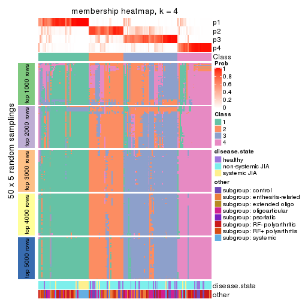</p>

</div>
<div id='tab-SD-NMF-membership-heatmap-4'>
<pre><code class="r">membership_heatmap(res, k = 5)
</code></pre>

<p></p>

</div>
<div id='tab-SD-NMF-membership-heatmap-5'>
<pre><code class="r">membership_heatmap(res, k = 6)
</code></pre>

<p></p>

</div>
</div>

As soon as we have had the classes for columns, we can look for signatures
which are significantly different between classes which can be candidate marks
for certain classes. Following are the heatmaps for signatures.


Signature heatmaps where rows are scaled:


<script>
$( function() {
	$( '#tabs-SD-NMF-get-signatures' ).tabs();
} );
</script>
<div id='tabs-SD-NMF-get-signatures'>
<ul>
<li><a href='#tab-SD-NMF-get-signatures-1'>k = 2</a></li>
<li><a href='#tab-SD-NMF-get-signatures-2'>k = 3</a></li>
<li><a href='#tab-SD-NMF-get-signatures-3'>k = 4</a></li>
<li><a href='#tab-SD-NMF-get-signatures-4'>k = 5</a></li>
<li><a href='#tab-SD-NMF-get-signatures-5'>k = 6</a></li>
</ul>
<div id='tab-SD-NMF-get-signatures-1'>
<pre><code class="r">get_signatures(res, k = 2)
</code></pre>

<p></p>

</div>
<div id='tab-SD-NMF-get-signatures-2'>
<pre><code class="r">get_signatures(res, k = 3)
</code></pre>

<p></p>

</div>
<div id='tab-SD-NMF-get-signatures-3'>
<pre><code class="r">get_signatures(res, k = 4)
</code></pre>

<p></p>

</div>
<div id='tab-SD-NMF-get-signatures-4'>
<pre><code class="r">get_signatures(res, k = 5)
</code></pre>

<p></p>

</div>
<div id='tab-SD-NMF-get-signatures-5'>
<pre><code class="r">get_signatures(res, k = 6)
</code></pre>

<p></p>

</div>
</div>


Signature heatmaps where rows are not scaled:


<script>
$( function() {
	$( '#tabs-SD-NMF-get-signatures-no-scale' ).tabs();
} );
</script>
<div id='tabs-SD-NMF-get-signatures-no-scale'>
<ul>
<li><a href='#tab-SD-NMF-get-signatures-no-scale-1'>k = 2</a></li>
<li><a href='#tab-SD-NMF-get-signatures-no-scale-2'>k = 3</a></li>
<li><a href='#tab-SD-NMF-get-signatures-no-scale-3'>k = 4</a></li>
<li><a href='#tab-SD-NMF-get-signatures-no-scale-4'>k = 5</a></li>
<li><a href='#tab-SD-NMF-get-signatures-no-scale-5'>k = 6</a></li>
</ul>
<div id='tab-SD-NMF-get-signatures-no-scale-1'>
<pre><code class="r">get_signatures(res, k = 2, scale_rows = FALSE)
</code></pre>

<p></p>

</div>
<div id='tab-SD-NMF-get-signatures-no-scale-2'>
<pre><code class="r">get_signatures(res, k = 3, scale_rows = FALSE)
</code></pre>

<p></p>

</div>
<div id='tab-SD-NMF-get-signatures-no-scale-3'>
<pre><code class="r">get_signatures(res, k = 4, scale_rows = FALSE)
</code></pre>

<p></p>

</div>
<div id='tab-SD-NMF-get-signatures-no-scale-4'>
<pre><code class="r">get_signatures(res, k = 5, scale_rows = FALSE)
</code></pre>

<p></p>

</div>
<div id='tab-SD-NMF-get-signatures-no-scale-5'>
<pre><code class="r">get_signatures(res, k = 6, scale_rows = FALSE)
</code></pre>

<p></p>

</div>
</div>


Compare the overlap of signatures from different k:

```r
compare_signatures(res)
```


`get_signature()` returns a data frame invisibly. TO get the list of signatures, the function
call should be assigned to a variable explicitly. In following code, if `plot` argument is set
to `FALSE`, no heatmap is plotted while only the differential analysis is performed.

```r
# code only for demonstration
tb = get_signature(res, k = ..., plot = FALSE)
```

An example of the output of `tb` is:

```
#>   which_row         fdr    mean_1    mean_2 scaled_mean_1 scaled_mean_2 km
#> 1        38 0.042760348  8.373488  9.131774    -0.5533452     0.5164555  1
#> 2        40 0.018707592  7.106213  8.469186    -0.6173731     0.5762149  1
#> 3        55 0.019134737 10.221463 11.207825    -0.6159697     0.5749050  1
#> 4        59 0.006059896  5.921854  7.869574    -0.6899429     0.6439467  1
#> 5        60 0.018055526  8.928898 10.211722    -0.6204761     0.5791110  1
#> 6        98 0.009384629 15.714769 14.887706     0.6635654    -0.6193277  2
...
```

The columns in `tb` are:

1. `which_row`: row indices corresponding to the input matrix.
2. `fdr`: FDR for the differential test. 
3. `mean_x`: The mean value in group x.
4. `scaled_mean_x`: The mean value in group x after rows are scaled.
5. `km`: Row groups if k-means clustering is applied to rows.


UMAP plot which shows how samples are separated.


<script>
$( function() {
	$( '#tabs-SD-NMF-dimension-reduction' ).tabs();
} );
</script>
<div id='tabs-SD-NMF-dimension-reduction'>
<ul>
<li><a href='#tab-SD-NMF-dimension-reduction-1'>k = 2</a></li>
<li><a href='#tab-SD-NMF-dimension-reduction-2'>k = 3</a></li>
<li><a href='#tab-SD-NMF-dimension-reduction-3'>k = 4</a></li>
<li><a href='#tab-SD-NMF-dimension-reduction-4'>k = 5</a></li>
<li><a href='#tab-SD-NMF-dimension-reduction-5'>k = 6</a></li>
</ul>
<div id='tab-SD-NMF-dimension-reduction-1'>
<pre><code class="r">dimension_reduction(res, k = 2, method = &quot;UMAP&quot;)
</code></pre>

<p></p>

</div>
<div id='tab-SD-NMF-dimension-reduction-2'>
<pre><code class="r">dimension_reduction(res, k = 3, method = &quot;UMAP&quot;)
</code></pre>

<p></p>

</div>
<div id='tab-SD-NMF-dimension-reduction-3'>
<pre><code class="r">dimension_reduction(res, k = 4, method = &quot;UMAP&quot;)
</code></pre>

<p></p>

</div>
<div id='tab-SD-NMF-dimension-reduction-4'>
<pre><code class="r">dimension_reduction(res, k = 5, method = &quot;UMAP&quot;)
</code></pre>

<p></p>

</div>
<div id='tab-SD-NMF-dimension-reduction-5'>
<pre><code class="r">dimension_reduction(res, k = 6, method = &quot;UMAP&quot;)
</code></pre>

<p></p>

</div>
</div>


Following heatmap shows how subgroups are split when increasing `k`:

```r
collect_classes(res)
```

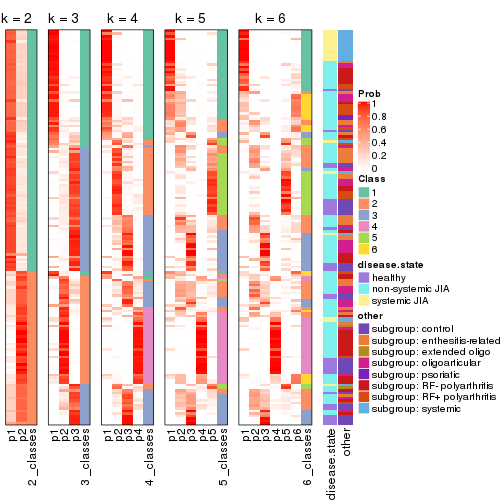


Test correlation between subgroups and known annotations. If the known
annotation is numeric, one-way ANOVA test is applied, and if the known
annotation is discrete, chi-squared contingency table test is applied.

```r
test_to_known_factors(res)
```

```
#>          n disease.state(p) other(p) k
#> SD:NMF 151         7.41e-02 1.41e-02 2
#> SD:NMF 145         1.87e-04 5.09e-05 3
#> SD:NMF 135         7.85e-03 2.62e-05 4
#> SD:NMF  86         6.91e-03 8.15e-03 5
#> SD:NMF  89         8.83e-05 2.72e-04 6
```


If matrix rows can be associated to genes, consider to use `GO_Enrichment(res,
...)` to perform function enrichment for the signature genes.


 

---------------------------------------------------


### CV:hclust


The object with results only for a single top-value method and a single partition method 
can be extracted as:

```r
res = res_list["CV", "hclust"]
# you can also extract it by
# res = res_list["CV:hclust"]
```

A summary of `res` and all the functions that can be applied to it:

```r
res
```

```
#> A 'ConsensusPartition' object with k = 2, 3, 4, 5, 6.
#>   On a matrix with 51941 rows and 154 columns.
#>   Top rows (1000, 2000, 3000, 4000, 5000) are extracted by 'CV' method.
#>   Subgroups are detected by 'hclust' method.
#>   Performed in total 1250 partitions by row resampling.
#>   Best k for subgroups seems to be 4.
#> 
#> Following methods can be applied to this 'ConsensusPartition' object:
#>  [1] "cola_report"             "collect_classes"         "collect_plots"          
#>  [4] "collect_stats"           "colnames"                "compare_signatures"     
#>  [7] "consensus_heatmap"       "dimension_reduction"     "functional_enrichment"  
#> [10] "get_anno_col"            "get_anno"                "get_classes"            
#> [13] "get_consensus"           "get_matrix"              "get_membership"         
#> [16] "get_param"               "get_signatures"          "get_stats"              
#> [19] "is_best_k"               "is_stable_k"             "membership_heatmap"     
#> [22] "ncol"                    "nrow"                    "plot_ecdf"              
#> [25] "rownames"                "select_partition_number" "show"                   
#> [28] "suggest_best_k"          "test_to_known_factors"
```

`collect_plots()` function collects all the plots made from `res` for all `k` (number of partitions)
into one single page to provide an easy and fast comparison between different `k`.

```r
collect_plots(res)
```


The plots are:

- The first row: a plot of the ECDF (Empirical cumulative distribution
  function) curves of the consensus matrix for each `k` and the heatmap of
  predicted classes for each `k`.
- The second row: heatmaps of the consensus matrix for each `k`.
- The third row: heatmaps of the membership matrix for each `k`.
- The fouth row: heatmaps of the signatures for each `k`.

All the plots in panels can be made by individual functions and they are
plotted later in this section.

`select_partition_number()` produces several plots showing different
statistics for choosing "optimized" `k`. There are following statistics:

- ECDF curves of the consensus matrix for each `k`;
- 1-PAC. [The PAC
  score](https://en.wikipedia.org/wiki/Consensus_clustering#Over-interpretation_potential_of_consensus_clustering)
  measures the proportion of the ambiguous subgrouping.
- Mean silhouette score.
- Concordance. The mean probability of fiting the consensus class ids in all
  partitions.
- Area increased. Denote $A_k$ as the area under the ECDF curve for current
  `k`, the area increased is defined as $A_k - A_{k-1}$.
- Rand index. The percent of pairs of samples that are both in a same cluster
  or both are not in a same cluster in the partition of k and k-1.
- Jaccard index. The ratio of pairs of samples are both in a same cluster in
  the partition of k and k-1 and the pairs of samples are both in a same
  cluster in the partition k or k-1.

The detailed explanations of these statistics can be found in [the cola
vignette](http://bioconductor.org/packages/devel/bioc/vignettes/cola/inst/doc/cola.html#toc_13).

Generally speaking, lower PAC score, higher mean silhouette score or higher
concordance corresponds to better partition. Rand index and Jaccard index
measure how similar the current partition is compared to partition with `k-1`.
If they are too similar, we won't accept `k` is better than `k-1`.

```r
select_partition_number(res)
```


The numeric values for all these statistics can be obtained by `get_stats()`.

```r
get_stats(res)
```

```
#>   k 1-PAC mean_silhouette concordance area_increased  Rand Jaccard
#> 2 2 0.600           0.899       0.936         0.2665 0.744   0.744
#> 3 3 0.468           0.717       0.837         0.7715 0.855   0.806
#> 4 4 0.795           0.843       0.918         0.3312 0.774   0.629
#> 5 5 0.619           0.537       0.763         0.1674 0.965   0.910
#> 6 6 0.613           0.550       0.695         0.0742 0.840   0.549
```

`suggest_best_k()` suggests the best $k$ based on these statistics. The rules are as follows:

- All $k$ with Jaccard index larger than 0.95 are removed because the increase of
  the partition number does not provides enough extra information. If all $k$ are removed,
  the best $k$ is assigned by `NA`.
- For $k$ with 1-PAC larger than 0.9, the maximal $k$ is taken as the "best k". Other $k$ is called "optional k".
- If it does not fit the second rule. The $k$ with the highest vote of highest
  1-PAC, mean silhouette and concordance is taken as the "best k".

```r
suggest_best_k(res)
```

```
#> [1] 4
```


Following shows the table of the partitions (You need to click the **show/hide
code output** link to see it). The membership matrix (columns with name `p*`)
is inferred by
[`clue::cl_consensus()`](https://www.rdocumentation.org/link/cl_consensus?package=clue)
function with the `SE` method. Basically the value in the membership matrix
represents the probability to belong to a certain group. The finall class
label for an item is determined with the group with highest probability it
belongs to.

In `get_classes()` function, the entropy is calculated from the membership
matrix and the silhouette score is calculated from the consensus matrix.


<script>
$( function() {
	$( '#tabs-CV-hclust-get-classes' ).tabs();
} );
</script>
<div id='tabs-CV-hclust-get-classes'>
<ul>
<li><a href='#tab-CV-hclust-get-classes-1'>k = 2</a></li>
<li><a href='#tab-CV-hclust-get-classes-2'>k = 3</a></li>
<li><a href='#tab-CV-hclust-get-classes-3'>k = 4</a></li>
<li><a href='#tab-CV-hclust-get-classes-4'>k = 5</a></li>
<li><a href='#tab-CV-hclust-get-classes-5'>k = 6</a></li>
</ul>

<div id='tab-CV-hclust-get-classes-1'>
<p><a id='tab-CV-hclust-get-classes-1-a' style='color:#0366d6' href='#'>show/hide code output</a></p>
<pre><code class="r">cbind(get_classes(res, k = 2), get_membership(res, k = 2))
</code></pre>

<pre><code>#&gt;           class entropy silhouette    p1    p2
#&gt; GSM340358     1  0.7950     0.6938 0.760 0.240
#&gt; GSM340359     1  0.6531     0.7791 0.832 0.168
#&gt; GSM340361     1  0.0000     0.9467 1.000 0.000
#&gt; GSM340362     1  0.0000     0.9467 1.000 0.000
#&gt; GSM340363     1  0.4562     0.8565 0.904 0.096
#&gt; GSM340364     1  0.6531     0.7791 0.832 0.168
#&gt; GSM340365     1  0.0000     0.9467 1.000 0.000
#&gt; GSM340366     1  0.0000     0.9467 1.000 0.000
#&gt; GSM340367     1  0.6531     0.7791 0.832 0.168
#&gt; GSM340368     2  0.7299     0.8577 0.204 0.796
#&gt; GSM340369     2  0.6148     0.8039 0.152 0.848
#&gt; GSM340370     1  0.6531     0.7791 0.832 0.168
#&gt; GSM340371     1  0.0000     0.9467 1.000 0.000
#&gt; GSM340372     1  0.6531     0.7791 0.832 0.168
#&gt; GSM340373     1  0.6531     0.7791 0.832 0.168
#&gt; GSM340375     1  0.6531     0.7791 0.832 0.168
#&gt; GSM340376     1  0.6531     0.7791 0.832 0.168
#&gt; GSM340378     1  0.6531     0.7791 0.832 0.168
#&gt; GSM340243     1  0.0376     0.9451 0.996 0.004
#&gt; GSM340244     1  0.1184     0.9413 0.984 0.016
#&gt; GSM340246     1  0.1184     0.9413 0.984 0.016
#&gt; GSM340247     2  0.6531     0.9637 0.168 0.832
#&gt; GSM340248     1  0.1184     0.9413 0.984 0.016
#&gt; GSM340249     1  0.9087     0.4201 0.676 0.324
#&gt; GSM340250     1  0.0672     0.9428 0.992 0.008
#&gt; GSM340251     1  0.6531     0.7618 0.832 0.168
#&gt; GSM340252     1  0.7453     0.6875 0.788 0.212
#&gt; GSM340253     1  0.1184     0.9413 0.984 0.016
#&gt; GSM340254     1  0.1184     0.9413 0.984 0.016
#&gt; GSM340256     1  0.1184     0.9413 0.984 0.016
#&gt; GSM340258     1  0.0000     0.9467 1.000 0.000
#&gt; GSM340259     1  0.0000     0.9467 1.000 0.000
#&gt; GSM340260     1  0.0000     0.9467 1.000 0.000
#&gt; GSM340261     1  0.0000     0.9467 1.000 0.000
#&gt; GSM340262     1  0.0000     0.9467 1.000 0.000
#&gt; GSM340263     1  0.2603     0.9190 0.956 0.044
#&gt; GSM340264     1  0.0000     0.9467 1.000 0.000
#&gt; GSM340265     1  0.0000     0.9467 1.000 0.000
#&gt; GSM340266     1  0.0672     0.9427 0.992 0.008
#&gt; GSM340267     1  0.0000     0.9467 1.000 0.000
#&gt; GSM340268     1  0.0000     0.9467 1.000 0.000
#&gt; GSM340269     1  0.0000     0.9467 1.000 0.000
#&gt; GSM340270     1  0.0672     0.9430 0.992 0.008
#&gt; GSM537574     1  0.0000     0.9467 1.000 0.000
#&gt; GSM537580     1  0.0000     0.9467 1.000 0.000
#&gt; GSM537581     1  0.0000     0.9467 1.000 0.000
#&gt; GSM340272     1  0.0000     0.9467 1.000 0.000
#&gt; GSM340273     1  0.1414     0.9397 0.980 0.020
#&gt; GSM340275     1  0.9954    -0.1436 0.540 0.460
#&gt; GSM340276     1  0.0000     0.9467 1.000 0.000
#&gt; GSM340277     1  0.1184     0.9413 0.984 0.016
#&gt; GSM340278     1  0.0000     0.9467 1.000 0.000
#&gt; GSM340279     1  0.0000     0.9467 1.000 0.000
#&gt; GSM340282     1  0.0000     0.9467 1.000 0.000
#&gt; GSM340284     1  0.1414     0.9394 0.980 0.020
#&gt; GSM340285     1  0.0000     0.9467 1.000 0.000
#&gt; GSM340286     1  0.0000     0.9467 1.000 0.000
#&gt; GSM340287     1  0.0000     0.9467 1.000 0.000
#&gt; GSM340288     1  0.0376     0.9451 0.996 0.004
#&gt; GSM340289     1  0.0376     0.9451 0.996 0.004
#&gt; GSM340290     1  0.8081     0.5915 0.752 0.248
#&gt; GSM340291     1  0.1184     0.9413 0.984 0.016
#&gt; GSM340293     1  0.6531     0.7450 0.832 0.168
#&gt; GSM340294     1  0.0000     0.9467 1.000 0.000
#&gt; GSM340296     1  0.0000     0.9467 1.000 0.000
#&gt; GSM340297     1  0.0000     0.9467 1.000 0.000
#&gt; GSM340298     1  0.0000     0.9467 1.000 0.000
#&gt; GSM340299     1  0.0000     0.9467 1.000 0.000
#&gt; GSM340301     1  0.0000     0.9467 1.000 0.000
#&gt; GSM340303     1  0.0000     0.9467 1.000 0.000
#&gt; GSM340304     1  0.0000     0.9467 1.000 0.000
#&gt; GSM340306     2  0.6973     0.9615 0.188 0.812
#&gt; GSM340307     1  0.1184     0.9413 0.984 0.016
#&gt; GSM340310     1  0.6712     0.7757 0.824 0.176
#&gt; GSM340314     1  0.4161     0.8668 0.916 0.084
#&gt; GSM340315     1  0.0000     0.9467 1.000 0.000
#&gt; GSM340317     1  0.8861     0.4768 0.696 0.304
#&gt; GSM340318     2  0.6531     0.9637 0.168 0.832
#&gt; GSM340319     2  0.6531     0.9637 0.168 0.832
#&gt; GSM340320     2  0.7056     0.9590 0.192 0.808
#&gt; GSM340321     1  0.1184     0.9413 0.984 0.016
#&gt; GSM340322     2  0.6531     0.9637 0.168 0.832
#&gt; GSM340324     1  0.1184     0.9413 0.984 0.016
#&gt; GSM340328     1  0.7883     0.6999 0.764 0.236
#&gt; GSM340330     1  0.0000     0.9467 1.000 0.000
#&gt; GSM340332     2  0.6973     0.9620 0.188 0.812
#&gt; GSM340333     1  0.1184     0.9413 0.984 0.016
#&gt; GSM340336     2  0.6531     0.9637 0.168 0.832
#&gt; GSM340337     2  0.6623     0.9641 0.172 0.828
#&gt; GSM340338     1  0.0000     0.9467 1.000 0.000
#&gt; GSM340339     2  0.6973     0.9615 0.188 0.812
#&gt; GSM340340     2  0.7815     0.8307 0.232 0.768
#&gt; GSM340341     2  0.6973     0.9614 0.188 0.812
#&gt; GSM340343     1  0.8499     0.5304 0.724 0.276
#&gt; GSM340344     1  0.0672     0.9443 0.992 0.008
#&gt; GSM340346     1  0.0000     0.9467 1.000 0.000
#&gt; GSM340347     2  0.6531     0.9637 0.168 0.832
#&gt; GSM340348     2  0.7056     0.9590 0.192 0.808
#&gt; GSM340349     1  0.0000     0.9467 1.000 0.000
#&gt; GSM340350     1  0.0000     0.9467 1.000 0.000
#&gt; GSM340351     1  0.0000     0.9467 1.000 0.000
#&gt; GSM340354     1  0.0000     0.9467 1.000 0.000
#&gt; GSM340356     1  0.1414     0.9397 0.980 0.020
#&gt; GSM340357     1  0.0000     0.9467 1.000 0.000
#&gt; GSM348183     1  0.4562     0.8565 0.904 0.096
#&gt; GSM348191     1  0.0000     0.9467 1.000 0.000
#&gt; GSM348193     1  0.4161     0.8713 0.916 0.084
#&gt; GSM537578     1  0.0000     0.9467 1.000 0.000
#&gt; GSM348181     1  0.1843     0.9275 0.972 0.028
#&gt; GSM348182     1  0.0000     0.9467 1.000 0.000
#&gt; GSM348184     1  0.1184     0.9413 0.984 0.016
#&gt; GSM348185     1  0.9909    -0.0711 0.556 0.444
#&gt; GSM348186     1  0.1184     0.9413 0.984 0.016
#&gt; GSM348187     1  0.0376     0.9451 0.996 0.004
#&gt; GSM348188     2  0.7528     0.9322 0.216 0.784
#&gt; GSM348189     1  0.0000     0.9467 1.000 0.000
#&gt; GSM348190     1  0.0000     0.9467 1.000 0.000
#&gt; GSM348194     1  0.0376     0.9451 0.996 0.004
#&gt; GSM348195     1  0.0000     0.9467 1.000 0.000
#&gt; GSM348196     1  0.0376     0.9451 0.996 0.004
#&gt; GSM537585     1  0.0000     0.9467 1.000 0.000
#&gt; GSM537594     1  0.1184     0.9413 0.984 0.016
#&gt; GSM537596     1  0.0000     0.9467 1.000 0.000
#&gt; GSM537597     1  0.0376     0.9451 0.996 0.004
#&gt; GSM537602     1  0.0000     0.9467 1.000 0.000
#&gt; GSM340184     1  0.0000     0.9467 1.000 0.000
#&gt; GSM340185     1  0.1184     0.9413 0.984 0.016
#&gt; GSM340186     1  0.1184     0.9413 0.984 0.016
#&gt; GSM340187     2  0.6973     0.9620 0.188 0.812
#&gt; GSM340189     2  0.6712     0.9640 0.176 0.824
#&gt; GSM340190     1  0.1184     0.9413 0.984 0.016
#&gt; GSM340191     1  0.0000     0.9467 1.000 0.000
#&gt; GSM340192     1  0.0672     0.9435 0.992 0.008
#&gt; GSM340193     1  0.0000     0.9467 1.000 0.000
#&gt; GSM340194     1  0.0000     0.9467 1.000 0.000
#&gt; GSM340195     1  0.0000     0.9467 1.000 0.000
#&gt; GSM340196     2  0.6531     0.9637 0.168 0.832
#&gt; GSM340197     1  0.0000     0.9467 1.000 0.000
#&gt; GSM340198     1  0.2236     0.9285 0.964 0.036
#&gt; GSM340199     1  0.0000     0.9467 1.000 0.000
#&gt; GSM340200     1  0.0672     0.9435 0.992 0.008
#&gt; GSM340201     2  0.6531     0.9637 0.168 0.832
#&gt; GSM340202     2  0.6531     0.9637 0.168 0.832
#&gt; GSM340203     2  0.7139     0.9569 0.196 0.804
#&gt; GSM340204     1  0.0376     0.9453 0.996 0.004
#&gt; GSM340205     1  0.1843     0.9275 0.972 0.028
#&gt; GSM340206     1  0.0000     0.9467 1.000 0.000
#&gt; GSM340207     1  0.0000     0.9467 1.000 0.000
#&gt; GSM340237     1  0.1184     0.9413 0.984 0.016
#&gt; GSM340238     1  0.0000     0.9467 1.000 0.000
#&gt; GSM340239     1  0.0000     0.9467 1.000 0.000
#&gt; GSM340240     1  0.0000     0.9467 1.000 0.000
#&gt; GSM340241     1  0.1184     0.9413 0.984 0.016
#&gt; GSM340242     1  0.0000     0.9467 1.000 0.000
</code></pre>

<script>
$('#tab-CV-hclust-get-classes-1-a').parent().next().next().hide();
$('#tab-CV-hclust-get-classes-1-a').click(function(){
  $('#tab-CV-hclust-get-classes-1-a').parent().next().next().toggle();
  return(false);
});
</script>
</div>

<div id='tab-CV-hclust-get-classes-2'>
<p><a id='tab-CV-hclust-get-classes-2-a' style='color:#0366d6' href='#'>show/hide code output</a></p>
<pre><code class="r">cbind(get_classes(res, k = 3), get_membership(res, k = 3))
</code></pre>

<pre><code>#&gt;           class entropy silhouette    p1    p2    p3
#&gt; GSM340358     1  0.8304     0.8765 0.624 0.144 0.232
#&gt; GSM340359     1  0.6895     0.9453 0.716 0.072 0.212
#&gt; GSM340361     3  0.1860     0.7936 0.052 0.000 0.948
#&gt; GSM340362     3  0.1753     0.7937 0.048 0.000 0.952
#&gt; GSM340363     3  0.5153     0.6768 0.068 0.100 0.832
#&gt; GSM340364     1  0.6939     0.9515 0.712 0.072 0.216
#&gt; GSM340365     3  0.1163     0.7992 0.028 0.000 0.972
#&gt; GSM340366     3  0.1031     0.8014 0.024 0.000 0.976
#&gt; GSM340367     1  0.6939     0.9515 0.712 0.072 0.216
#&gt; GSM340368     2  0.6062     0.6941 0.148 0.780 0.072
#&gt; GSM340369     2  0.6096     0.5595 0.208 0.752 0.040
#&gt; GSM340370     1  0.6939     0.9515 0.712 0.072 0.216
#&gt; GSM340371     3  0.1529     0.7953 0.040 0.000 0.960
#&gt; GSM340372     1  0.6939     0.9515 0.712 0.072 0.216
#&gt; GSM340373     1  0.6939     0.9515 0.712 0.072 0.216
#&gt; GSM340375     1  0.6982     0.9478 0.708 0.072 0.220
#&gt; GSM340376     1  0.6939     0.9515 0.712 0.072 0.216
#&gt; GSM340378     1  0.6939     0.9515 0.712 0.072 0.216
#&gt; GSM340243     3  0.1399     0.8036 0.028 0.004 0.968
#&gt; GSM340244     3  0.6260     0.4349 0.448 0.000 0.552
#&gt; GSM340246     3  0.6252     0.4395 0.444 0.000 0.556
#&gt; GSM340247     2  0.2356     0.8707 0.000 0.928 0.072
#&gt; GSM340248     3  0.6235     0.4454 0.436 0.000 0.564
#&gt; GSM340249     3  0.9886     0.0392 0.276 0.320 0.404
#&gt; GSM340250     3  0.0829     0.8013 0.012 0.004 0.984
#&gt; GSM340251     3  0.9293     0.1905 0.400 0.160 0.440
#&gt; GSM340252     3  0.9621     0.1396 0.360 0.208 0.432
#&gt; GSM340253     3  0.6204     0.4654 0.424 0.000 0.576
#&gt; GSM340254     3  0.6235     0.4516 0.436 0.000 0.564
#&gt; GSM340256     3  0.6235     0.4494 0.436 0.000 0.564
#&gt; GSM340258     3  0.0592     0.8020 0.012 0.000 0.988
#&gt; GSM340259     3  0.1031     0.8012 0.024 0.000 0.976
#&gt; GSM340260     3  0.0747     0.8025 0.016 0.000 0.984
#&gt; GSM340261     3  0.0747     0.8026 0.016 0.000 0.984
#&gt; GSM340262     3  0.1643     0.7949 0.044 0.000 0.956
#&gt; GSM340263     3  0.5467     0.6921 0.176 0.032 0.792
#&gt; GSM340264     3  0.1529     0.7989 0.040 0.000 0.960
#&gt; GSM340265     3  0.1643     0.7984 0.044 0.000 0.956
#&gt; GSM340266     3  0.1015     0.8029 0.012 0.008 0.980
#&gt; GSM340267     3  0.2066     0.7979 0.060 0.000 0.940
#&gt; GSM340268     3  0.0424     0.8008 0.008 0.000 0.992
#&gt; GSM340269     3  0.0892     0.8035 0.020 0.000 0.980
#&gt; GSM340270     3  0.1832     0.7979 0.036 0.008 0.956
#&gt; GSM537574     3  0.0747     0.8025 0.016 0.000 0.984
#&gt; GSM537580     3  0.1529     0.7953 0.040 0.000 0.960
#&gt; GSM537581     3  0.1163     0.8020 0.028 0.000 0.972
#&gt; GSM340272     3  0.0892     0.8005 0.020 0.000 0.980
#&gt; GSM340273     3  0.6228     0.5121 0.372 0.004 0.624
#&gt; GSM340275     2  0.9350     0.1802 0.184 0.488 0.328
#&gt; GSM340276     3  0.0892     0.8002 0.020 0.000 0.980
#&gt; GSM340277     3  0.6260     0.4349 0.448 0.000 0.552
#&gt; GSM340278     3  0.1163     0.7996 0.028 0.000 0.972
#&gt; GSM340279     3  0.0747     0.8026 0.016 0.000 0.984
#&gt; GSM340282     3  0.0892     0.8005 0.020 0.000 0.980
#&gt; GSM340284     3  0.6386     0.4657 0.412 0.004 0.584
#&gt; GSM340285     3  0.1163     0.7996 0.028 0.000 0.972
#&gt; GSM340286     3  0.2063     0.7908 0.044 0.008 0.948
#&gt; GSM340287     3  0.0747     0.8026 0.016 0.000 0.984
#&gt; GSM340288     3  0.3851     0.7380 0.136 0.004 0.860
#&gt; GSM340289     3  0.1765     0.7978 0.040 0.004 0.956
#&gt; GSM340290     3  0.5541     0.5178 0.008 0.252 0.740
#&gt; GSM340291     3  0.6260     0.4349 0.448 0.000 0.552
#&gt; GSM340293     3  0.4178     0.6563 0.000 0.172 0.828
#&gt; GSM340294     3  0.0747     0.8026 0.016 0.000 0.984
#&gt; GSM340296     3  0.0892     0.8025 0.020 0.000 0.980
#&gt; GSM340297     3  0.0424     0.8011 0.008 0.000 0.992
#&gt; GSM340298     3  0.0892     0.8025 0.020 0.000 0.980
#&gt; GSM340299     3  0.1753     0.7937 0.048 0.000 0.952
#&gt; GSM340301     3  0.1289     0.7997 0.032 0.000 0.968
#&gt; GSM340303     3  0.1860     0.7963 0.052 0.000 0.948
#&gt; GSM340304     3  0.1411     0.7988 0.036 0.000 0.964
#&gt; GSM340306     2  0.3267     0.8650 0.000 0.884 0.116
#&gt; GSM340307     3  0.6192     0.4668 0.420 0.000 0.580
#&gt; GSM340310     1  0.8271     0.7188 0.520 0.080 0.400
#&gt; GSM340314     3  0.3043     0.7525 0.008 0.084 0.908
#&gt; GSM340315     3  0.1163     0.8020 0.028 0.000 0.972
#&gt; GSM340317     3  0.9901     0.0470 0.296 0.300 0.404
#&gt; GSM340318     2  0.2356     0.8707 0.000 0.928 0.072
#&gt; GSM340319     2  0.2356     0.8707 0.000 0.928 0.072
#&gt; GSM340320     2  0.3619     0.8420 0.000 0.864 0.136
#&gt; GSM340321     3  0.6260     0.4349 0.448 0.000 0.552
#&gt; GSM340322     2  0.2356     0.8707 0.000 0.928 0.072
#&gt; GSM340324     3  0.6260     0.4349 0.448 0.000 0.552
#&gt; GSM340328     1  0.8513     0.8662 0.596 0.140 0.264
#&gt; GSM340330     3  0.0424     0.8008 0.008 0.000 0.992
#&gt; GSM340332     2  0.3116     0.8687 0.000 0.892 0.108
#&gt; GSM340333     3  0.6204     0.4654 0.424 0.000 0.576
#&gt; GSM340336     2  0.2356     0.8707 0.000 0.928 0.072
#&gt; GSM340337     2  0.2796     0.8726 0.000 0.908 0.092
#&gt; GSM340338     3  0.0592     0.8020 0.012 0.000 0.988
#&gt; GSM340339     2  0.3267     0.8650 0.000 0.884 0.116
#&gt; GSM340340     2  0.6518     0.6730 0.168 0.752 0.080
#&gt; GSM340341     2  0.3267     0.8641 0.000 0.884 0.116
#&gt; GSM340343     3  0.6252     0.3062 0.008 0.344 0.648
#&gt; GSM340344     3  0.5859     0.5581 0.344 0.000 0.656
#&gt; GSM340346     3  0.0592     0.8018 0.012 0.000 0.988
#&gt; GSM340347     2  0.2356     0.8707 0.000 0.928 0.072
#&gt; GSM340348     2  0.3412     0.8574 0.000 0.876 0.124
#&gt; GSM340349     3  0.0747     0.8015 0.016 0.000 0.984
#&gt; GSM340350     3  0.1163     0.8005 0.028 0.000 0.972
#&gt; GSM340351     3  0.1860     0.7936 0.052 0.000 0.948
#&gt; GSM340354     3  0.0747     0.8026 0.016 0.000 0.984
#&gt; GSM340356     3  0.6228     0.5121 0.372 0.004 0.624
#&gt; GSM340357     3  0.1643     0.7987 0.044 0.000 0.956
#&gt; GSM348183     3  0.5153     0.6768 0.068 0.100 0.832
#&gt; GSM348191     3  0.0747     0.8013 0.016 0.000 0.984
#&gt; GSM348193     3  0.5744     0.6189 0.072 0.128 0.800
#&gt; GSM537578     3  0.1031     0.8041 0.024 0.000 0.976
#&gt; GSM348181     3  0.2793     0.7787 0.044 0.028 0.928
#&gt; GSM348182     3  0.1950     0.7959 0.040 0.008 0.952
#&gt; GSM348184     3  0.6260     0.4349 0.448 0.000 0.552
#&gt; GSM348185     2  0.9560     0.1213 0.204 0.452 0.344
#&gt; GSM348186     3  0.6260     0.4349 0.448 0.000 0.552
#&gt; GSM348187     3  0.3851     0.7380 0.136 0.004 0.860
#&gt; GSM348188     2  0.3896     0.8482 0.008 0.864 0.128
#&gt; GSM348189     3  0.1529     0.7953 0.040 0.000 0.960
#&gt; GSM348190     3  0.1031     0.8025 0.024 0.000 0.976
#&gt; GSM348194     3  0.3851     0.7380 0.136 0.004 0.860
#&gt; GSM348195     3  0.1753     0.7951 0.048 0.000 0.952
#&gt; GSM348196     3  0.3851     0.7380 0.136 0.004 0.860
#&gt; GSM537585     3  0.1964     0.7966 0.056 0.000 0.944
#&gt; GSM537594     3  0.6260     0.4349 0.448 0.000 0.552
#&gt; GSM537596     3  0.0892     0.8002 0.020 0.000 0.980
#&gt; GSM537597     3  0.3715     0.7449 0.128 0.004 0.868
#&gt; GSM537602     3  0.1411     0.7988 0.036 0.000 0.964
#&gt; GSM340184     3  0.0424     0.8008 0.008 0.000 0.992
#&gt; GSM340185     3  0.6260     0.4349 0.448 0.000 0.552
#&gt; GSM340186     3  0.6260     0.4349 0.448 0.000 0.552
#&gt; GSM340187     2  0.3116     0.8687 0.000 0.892 0.108
#&gt; GSM340189     2  0.2711     0.8728 0.000 0.912 0.088
#&gt; GSM340190     3  0.6260     0.4349 0.448 0.000 0.552
#&gt; GSM340191     3  0.0424     0.8008 0.008 0.000 0.992
#&gt; GSM340192     3  0.4654     0.6914 0.208 0.000 0.792
#&gt; GSM340193     3  0.1031     0.8012 0.024 0.000 0.976
#&gt; GSM340194     3  0.1753     0.7937 0.048 0.000 0.952
#&gt; GSM340195     3  0.1753     0.7937 0.048 0.000 0.952
#&gt; GSM340196     2  0.2356     0.8707 0.000 0.928 0.072
#&gt; GSM340197     3  0.1643     0.7949 0.044 0.000 0.956
#&gt; GSM340198     3  0.6973     0.4470 0.416 0.020 0.564
#&gt; GSM340199     3  0.0592     0.8018 0.012 0.000 0.988
#&gt; GSM340200     3  0.5678     0.5786 0.316 0.000 0.684
#&gt; GSM340201     2  0.2356     0.8707 0.000 0.928 0.072
#&gt; GSM340202     2  0.2356     0.8707 0.000 0.928 0.072
#&gt; GSM340203     2  0.3619     0.8417 0.000 0.864 0.136
#&gt; GSM340204     3  0.1411     0.8026 0.036 0.000 0.964
#&gt; GSM340205     3  0.2793     0.7787 0.044 0.028 0.928
#&gt; GSM340206     3  0.0424     0.8008 0.008 0.000 0.992
#&gt; GSM340207     3  0.0592     0.8020 0.012 0.000 0.988
#&gt; GSM340237     3  0.6260     0.4349 0.448 0.000 0.552
#&gt; GSM340238     3  0.0424     0.8008 0.008 0.000 0.992
#&gt; GSM340239     3  0.1411     0.7984 0.036 0.000 0.964
#&gt; GSM340240     3  0.1031     0.8009 0.024 0.000 0.976
#&gt; GSM340241     3  0.6260     0.4349 0.448 0.000 0.552
#&gt; GSM340242     3  0.1529     0.7953 0.040 0.000 0.960
</code></pre>

<script>
$('#tab-CV-hclust-get-classes-2-a').parent().next().next().hide();
$('#tab-CV-hclust-get-classes-2-a').click(function(){
  $('#tab-CV-hclust-get-classes-2-a').parent().next().next().toggle();
  return(false);
});
</script>
</div>

<div id='tab-CV-hclust-get-classes-3'>
<p><a id='tab-CV-hclust-get-classes-3-a' style='color:#0366d6' href='#'>show/hide code output</a></p>
<pre><code class="r">cbind(get_classes(res, k = 4), get_membership(res, k = 4))
</code></pre>

<pre><code>#&gt;           class entropy silhouette    p1    p2    p3    p4
#&gt; GSM340358     1  0.2965     0.8651 0.892 0.000 0.036 0.072
#&gt; GSM340359     1  0.0524     0.9288 0.988 0.004 0.008 0.000
#&gt; GSM340361     3  0.1637     0.9210 0.060 0.000 0.940 0.000
#&gt; GSM340362     3  0.1637     0.9214 0.060 0.000 0.940 0.000
#&gt; GSM340363     3  0.5012     0.7606 0.116 0.000 0.772 0.112
#&gt; GSM340364     1  0.0469     0.9342 0.988 0.000 0.012 0.000
#&gt; GSM340365     3  0.1022     0.9309 0.032 0.000 0.968 0.000
#&gt; GSM340366     3  0.0921     0.9326 0.028 0.000 0.972 0.000
#&gt; GSM340367     1  0.0469     0.9342 0.988 0.000 0.012 0.000
#&gt; GSM340368     4  0.3945     0.7111 0.216 0.000 0.004 0.780
#&gt; GSM340369     4  0.4677     0.5700 0.316 0.000 0.004 0.680
#&gt; GSM340370     1  0.0469     0.9342 0.988 0.000 0.012 0.000
#&gt; GSM340371     3  0.1302     0.9267 0.044 0.000 0.956 0.000
#&gt; GSM340372     1  0.0469     0.9342 0.988 0.000 0.012 0.000
#&gt; GSM340373     1  0.0469     0.9342 0.988 0.000 0.012 0.000
#&gt; GSM340375     1  0.0592     0.9310 0.984 0.000 0.016 0.000
#&gt; GSM340376     1  0.0469     0.9342 0.988 0.000 0.012 0.000
#&gt; GSM340378     1  0.0469     0.9342 0.988 0.000 0.012 0.000
#&gt; GSM340243     3  0.1109     0.9347 0.028 0.000 0.968 0.004
#&gt; GSM340244     2  0.0336     0.8364 0.000 0.992 0.008 0.000
#&gt; GSM340246     2  0.0592     0.8343 0.000 0.984 0.016 0.000
#&gt; GSM340247     4  0.0000     0.8886 0.000 0.000 0.000 1.000
#&gt; GSM340248     2  0.1022     0.8276 0.000 0.968 0.032 0.000
#&gt; GSM340249     2  0.6292     0.4382 0.016 0.608 0.044 0.332
#&gt; GSM340250     3  0.0592     0.9348 0.016 0.000 0.984 0.000
#&gt; GSM340251     2  0.4149     0.7173 0.000 0.804 0.028 0.168
#&gt; GSM340252     2  0.5496     0.6475 0.016 0.724 0.040 0.220
#&gt; GSM340253     2  0.2830     0.7961 0.060 0.900 0.040 0.000
#&gt; GSM340254     2  0.2408     0.8079 0.044 0.920 0.036 0.000
#&gt; GSM340256     2  0.0524     0.8355 0.004 0.988 0.008 0.000
#&gt; GSM340258     3  0.0707     0.9330 0.020 0.000 0.980 0.000
#&gt; GSM340259     3  0.1022     0.9318 0.032 0.000 0.968 0.000
#&gt; GSM340260     3  0.0707     0.9335 0.020 0.000 0.980 0.000
#&gt; GSM340261     3  0.0707     0.9341 0.020 0.000 0.980 0.000
#&gt; GSM340262     3  0.1557     0.9224 0.056 0.000 0.944 0.000
#&gt; GSM340263     3  0.7172     0.3725 0.076 0.308 0.580 0.036
#&gt; GSM340264     3  0.1302     0.9295 0.044 0.000 0.956 0.000
#&gt; GSM340265     3  0.1389     0.9297 0.048 0.000 0.952 0.000
#&gt; GSM340266     3  0.0927     0.9341 0.016 0.000 0.976 0.008
#&gt; GSM340267     3  0.1792     0.9279 0.068 0.000 0.932 0.000
#&gt; GSM340268     3  0.0336     0.9313 0.008 0.000 0.992 0.000
#&gt; GSM340269     3  0.0921     0.9350 0.028 0.000 0.972 0.000
#&gt; GSM340270     3  0.1970     0.9178 0.060 0.000 0.932 0.008
#&gt; GSM537574     3  0.0707     0.9335 0.020 0.000 0.980 0.000
#&gt; GSM537580     3  0.1302     0.9267 0.044 0.000 0.956 0.000
#&gt; GSM537581     3  0.1302     0.9327 0.044 0.000 0.956 0.000
#&gt; GSM340272     3  0.0817     0.9310 0.024 0.000 0.976 0.000
#&gt; GSM340273     2  0.6370     0.5185 0.180 0.668 0.148 0.004
#&gt; GSM340275     4  0.6353     0.0436 0.008 0.436 0.044 0.512
#&gt; GSM340276     3  0.0921     0.9313 0.028 0.000 0.972 0.000
#&gt; GSM340277     2  0.0000     0.8367 0.000 1.000 0.000 0.000
#&gt; GSM340278     3  0.1118     0.9304 0.036 0.000 0.964 0.000
#&gt; GSM340279     3  0.0707     0.9341 0.020 0.000 0.980 0.000
#&gt; GSM340282     3  0.0817     0.9310 0.024 0.000 0.976 0.000
#&gt; GSM340284     2  0.2999     0.7405 0.000 0.864 0.132 0.004
#&gt; GSM340285     3  0.1305     0.9308 0.036 0.000 0.960 0.004
#&gt; GSM340286     3  0.1970     0.9190 0.060 0.000 0.932 0.008
#&gt; GSM340287     3  0.0707     0.9341 0.020 0.000 0.980 0.000
#&gt; GSM340288     3  0.3710     0.7969 0.192 0.000 0.804 0.004
#&gt; GSM340289     3  0.1743     0.9225 0.056 0.000 0.940 0.004
#&gt; GSM340290     3  0.4663     0.6358 0.012 0.000 0.716 0.272
#&gt; GSM340291     2  0.0000     0.8367 0.000 1.000 0.000 0.000
#&gt; GSM340293     3  0.3311     0.7915 0.000 0.000 0.828 0.172
#&gt; GSM340294     3  0.0707     0.9341 0.020 0.000 0.980 0.000
#&gt; GSM340296     3  0.0707     0.9343 0.020 0.000 0.980 0.000
#&gt; GSM340297     3  0.0336     0.9332 0.008 0.000 0.992 0.000
#&gt; GSM340298     3  0.0707     0.9343 0.020 0.000 0.980 0.000
#&gt; GSM340299     3  0.1637     0.9214 0.060 0.000 0.940 0.000
#&gt; GSM340301     3  0.1211     0.9299 0.040 0.000 0.960 0.000
#&gt; GSM340303     3  0.1661     0.9275 0.052 0.004 0.944 0.000
#&gt; GSM340304     3  0.1302     0.9290 0.044 0.000 0.956 0.000
#&gt; GSM340306     4  0.1637     0.8793 0.000 0.000 0.060 0.940
#&gt; GSM340307     2  0.2281     0.7751 0.000 0.904 0.096 0.000
#&gt; GSM340310     1  0.4663     0.5880 0.716 0.000 0.272 0.012
#&gt; GSM340314     3  0.2480     0.8810 0.008 0.000 0.904 0.088
#&gt; GSM340315     3  0.1302     0.9327 0.044 0.000 0.956 0.000
#&gt; GSM340317     2  0.6471     0.4663 0.024 0.616 0.048 0.312
#&gt; GSM340318     4  0.0000     0.8886 0.000 0.000 0.000 1.000
#&gt; GSM340319     4  0.0000     0.8886 0.000 0.000 0.000 1.000
#&gt; GSM340320     4  0.2345     0.8307 0.000 0.000 0.100 0.900
#&gt; GSM340321     2  0.0000     0.8367 0.000 1.000 0.000 0.000
#&gt; GSM340322     4  0.0000     0.8886 0.000 0.000 0.000 1.000
#&gt; GSM340324     2  0.0000     0.8367 0.000 1.000 0.000 0.000
#&gt; GSM340328     1  0.4215     0.7975 0.824 0.000 0.104 0.072
#&gt; GSM340330     3  0.0336     0.9313 0.008 0.000 0.992 0.000
#&gt; GSM340332     4  0.1792     0.8699 0.000 0.000 0.068 0.932
#&gt; GSM340333     2  0.2830     0.7961 0.060 0.900 0.040 0.000
#&gt; GSM340336     4  0.0000     0.8886 0.000 0.000 0.000 1.000
#&gt; GSM340337     4  0.1022     0.8893 0.000 0.000 0.032 0.968
#&gt; GSM340338     3  0.0707     0.9330 0.020 0.000 0.980 0.000
#&gt; GSM340339     4  0.1637     0.8793 0.000 0.000 0.060 0.940
#&gt; GSM340340     4  0.4815     0.6946 0.216 0.028 0.004 0.752
#&gt; GSM340341     4  0.1661     0.8832 0.000 0.004 0.052 0.944
#&gt; GSM340343     3  0.5268     0.3642 0.012 0.000 0.592 0.396
#&gt; GSM340344     2  0.5690     0.4700 0.060 0.672 0.268 0.000
#&gt; GSM340346     3  0.0469     0.9331 0.012 0.000 0.988 0.000
#&gt; GSM340347     4  0.0000     0.8886 0.000 0.000 0.000 1.000
#&gt; GSM340348     4  0.1940     0.8645 0.000 0.000 0.076 0.924
#&gt; GSM340349     3  0.0592     0.9347 0.016 0.000 0.984 0.000
#&gt; GSM340350     3  0.0921     0.9330 0.028 0.000 0.972 0.000
#&gt; GSM340351     3  0.1637     0.9210 0.060 0.000 0.940 0.000
#&gt; GSM340354     3  0.0592     0.9354 0.016 0.000 0.984 0.000
#&gt; GSM340356     2  0.6370     0.5185 0.180 0.668 0.148 0.004
#&gt; GSM340357     3  0.1389     0.9285 0.048 0.000 0.952 0.000
#&gt; GSM348183     3  0.5012     0.7606 0.116 0.000 0.772 0.112
#&gt; GSM348191     3  0.0817     0.9325 0.024 0.000 0.976 0.000
#&gt; GSM348193     3  0.5664     0.6819 0.124 0.000 0.720 0.156
#&gt; GSM537578     3  0.0817     0.9348 0.024 0.000 0.976 0.000
#&gt; GSM348181     3  0.2773     0.8950 0.072 0.000 0.900 0.028
#&gt; GSM348182     3  0.1970     0.9232 0.060 0.000 0.932 0.008
#&gt; GSM348184     2  0.0000     0.8367 0.000 1.000 0.000 0.000
#&gt; GSM348185     2  0.6375     0.0509 0.008 0.480 0.044 0.468
#&gt; GSM348186     2  0.0000     0.8367 0.000 1.000 0.000 0.000
#&gt; GSM348187     3  0.3710     0.7969 0.192 0.000 0.804 0.004
#&gt; GSM348188     4  0.2179     0.8679 0.012 0.000 0.064 0.924
#&gt; GSM348189     3  0.1302     0.9267 0.044 0.000 0.956 0.000
#&gt; GSM348190     3  0.1022     0.9331 0.032 0.000 0.968 0.000
#&gt; GSM348194     3  0.3710     0.7969 0.192 0.000 0.804 0.004
#&gt; GSM348195     3  0.1557     0.9225 0.056 0.000 0.944 0.000
#&gt; GSM348196     3  0.3710     0.7969 0.192 0.000 0.804 0.004
#&gt; GSM537585     3  0.1716     0.9254 0.064 0.000 0.936 0.000
#&gt; GSM537594     2  0.0000     0.8367 0.000 1.000 0.000 0.000
#&gt; GSM537596     3  0.1022     0.9316 0.032 0.000 0.968 0.000
#&gt; GSM537597     3  0.3626     0.8063 0.184 0.000 0.812 0.004
#&gt; GSM537602     3  0.1302     0.9290 0.044 0.000 0.956 0.000
#&gt; GSM340184     3  0.0336     0.9313 0.008 0.000 0.992 0.000
#&gt; GSM340185     2  0.0000     0.8367 0.000 1.000 0.000 0.000
#&gt; GSM340186     2  0.0000     0.8367 0.000 1.000 0.000 0.000
#&gt; GSM340187     4  0.1792     0.8699 0.000 0.000 0.068 0.932
#&gt; GSM340189     4  0.0817     0.8900 0.000 0.000 0.024 0.976
#&gt; GSM340190     2  0.0000     0.8367 0.000 1.000 0.000 0.000
#&gt; GSM340191     3  0.0336     0.9313 0.008 0.000 0.992 0.000
#&gt; GSM340192     3  0.5713     0.4159 0.040 0.340 0.620 0.000
#&gt; GSM340193     3  0.1022     0.9318 0.032 0.000 0.968 0.000
#&gt; GSM340194     3  0.1637     0.9214 0.060 0.000 0.940 0.000
#&gt; GSM340195     3  0.1637     0.9214 0.060 0.000 0.940 0.000
#&gt; GSM340196     4  0.0000     0.8886 0.000 0.000 0.000 1.000
#&gt; GSM340197     3  0.1557     0.9224 0.056 0.000 0.944 0.000
#&gt; GSM340198     2  0.2107     0.8247 0.016 0.940 0.024 0.020
#&gt; GSM340199     3  0.0469     0.9331 0.012 0.000 0.988 0.000
#&gt; GSM340200     2  0.5268     0.1610 0.008 0.540 0.452 0.000
#&gt; GSM340201     4  0.0000     0.8886 0.000 0.000 0.000 1.000
#&gt; GSM340202     4  0.0000     0.8886 0.000 0.000 0.000 1.000
#&gt; GSM340203     4  0.1940     0.8645 0.000 0.000 0.076 0.924
#&gt; GSM340204     3  0.1724     0.9283 0.032 0.020 0.948 0.000
#&gt; GSM340205     3  0.2699     0.8982 0.068 0.000 0.904 0.028
#&gt; GSM340206     3  0.0336     0.9313 0.008 0.000 0.992 0.000
#&gt; GSM340207     3  0.0707     0.9330 0.020 0.000 0.980 0.000
#&gt; GSM340237     2  0.0000     0.8367 0.000 1.000 0.000 0.000
#&gt; GSM340238     3  0.0336     0.9313 0.008 0.000 0.992 0.000
#&gt; GSM340239     3  0.1389     0.9269 0.048 0.000 0.952 0.000
#&gt; GSM340240     3  0.0921     0.9309 0.028 0.000 0.972 0.000
#&gt; GSM340241     2  0.0000     0.8367 0.000 1.000 0.000 0.000
#&gt; GSM340242     3  0.1302     0.9267 0.044 0.000 0.956 0.000
</code></pre>

<script>
$('#tab-CV-hclust-get-classes-3-a').parent().next().next().hide();
$('#tab-CV-hclust-get-classes-3-a').click(function(){
  $('#tab-CV-hclust-get-classes-3-a').parent().next().next().toggle();
  return(false);
});
</script>
</div>

<div id='tab-CV-hclust-get-classes-4'>
<p><a id='tab-CV-hclust-get-classes-4-a' style='color:#0366d6' href='#'>show/hide code output</a></p>
<pre><code class="r">cbind(get_classes(res, k = 5), get_membership(res, k = 5))
</code></pre>

<pre><code>#&gt;           class entropy silhouette    p1    p2    p3    p4    p5
#&gt; GSM340358     1  0.2672    0.88325 0.896 0.000 0.016 0.064 0.024
#&gt; GSM340359     1  0.0324    0.94457 0.992 0.004 0.004 0.000 0.000
#&gt; GSM340361     3  0.3691    0.39545 0.040 0.000 0.804 0.000 0.156
#&gt; GSM340362     3  0.4675    0.43745 0.020 0.000 0.600 0.000 0.380
#&gt; GSM340363     3  0.6487   -0.06526 0.076 0.000 0.600 0.076 0.248
#&gt; GSM340364     1  0.0162    0.94887 0.996 0.000 0.004 0.000 0.000
#&gt; GSM340365     3  0.4415    0.28769 0.008 0.000 0.604 0.000 0.388
#&gt; GSM340366     5  0.4574    0.38518 0.012 0.000 0.412 0.000 0.576
#&gt; GSM340367     1  0.0162    0.94887 0.996 0.000 0.004 0.000 0.000
#&gt; GSM340368     4  0.3628    0.70472 0.216 0.000 0.000 0.772 0.012
#&gt; GSM340369     4  0.4251    0.55710 0.316 0.000 0.000 0.672 0.012
#&gt; GSM340370     1  0.0162    0.94887 0.996 0.000 0.004 0.000 0.000
#&gt; GSM340371     3  0.4455    0.43857 0.008 0.000 0.588 0.000 0.404
#&gt; GSM340372     1  0.0162    0.94887 0.996 0.000 0.004 0.000 0.000
#&gt; GSM340373     1  0.0162    0.94887 0.996 0.000 0.004 0.000 0.000
#&gt; GSM340375     1  0.0290    0.94651 0.992 0.000 0.008 0.000 0.000
#&gt; GSM340376     1  0.0162    0.94887 0.996 0.000 0.004 0.000 0.000
#&gt; GSM340378     1  0.0162    0.94887 0.996 0.000 0.004 0.000 0.000
#&gt; GSM340243     5  0.4659    0.57258 0.012 0.000 0.492 0.000 0.496
#&gt; GSM340244     2  0.0324    0.85704 0.000 0.992 0.004 0.000 0.004
#&gt; GSM340246     2  0.0693    0.85448 0.000 0.980 0.012 0.000 0.008
#&gt; GSM340247     4  0.0000    0.89286 0.000 0.000 0.000 1.000 0.000
#&gt; GSM340248     2  0.0955    0.84877 0.000 0.968 0.028 0.000 0.004
#&gt; GSM340249     2  0.6054    0.47275 0.008 0.596 0.012 0.296 0.088
#&gt; GSM340250     3  0.4138    0.49823 0.016 0.000 0.708 0.000 0.276
#&gt; GSM340251     2  0.3936    0.74227 0.000 0.800 0.004 0.144 0.052
#&gt; GSM340252     2  0.5141    0.67316 0.004 0.712 0.008 0.192 0.084
#&gt; GSM340253     2  0.2547    0.81950 0.016 0.900 0.016 0.000 0.068
#&gt; GSM340254     2  0.2095    0.83034 0.008 0.920 0.012 0.000 0.060
#&gt; GSM340256     2  0.0451    0.85584 0.000 0.988 0.004 0.000 0.008
#&gt; GSM340258     3  0.3861    0.51269 0.008 0.000 0.728 0.000 0.264
#&gt; GSM340259     3  0.1764    0.46189 0.008 0.000 0.928 0.000 0.064
#&gt; GSM340260     3  0.1764    0.49800 0.008 0.000 0.928 0.000 0.064
#&gt; GSM340261     3  0.3160    0.51806 0.004 0.000 0.808 0.000 0.188
#&gt; GSM340262     3  0.4639    0.44562 0.020 0.000 0.612 0.000 0.368
#&gt; GSM340263     3  0.7485   -0.33221 0.044 0.308 0.444 0.004 0.200
#&gt; GSM340264     3  0.4232    0.49451 0.012 0.000 0.676 0.000 0.312
#&gt; GSM340265     3  0.4213    0.48903 0.012 0.000 0.680 0.000 0.308
#&gt; GSM340266     3  0.2408    0.49305 0.004 0.000 0.892 0.008 0.096
#&gt; GSM340267     3  0.4000    0.51056 0.024 0.000 0.748 0.000 0.228
#&gt; GSM340268     3  0.3790    0.51110 0.004 0.000 0.724 0.000 0.272
#&gt; GSM340269     3  0.2411    0.51669 0.008 0.000 0.884 0.000 0.108
#&gt; GSM340270     3  0.3988    0.44577 0.036 0.000 0.768 0.000 0.196
#&gt; GSM537574     3  0.1764    0.49307 0.008 0.000 0.928 0.000 0.064
#&gt; GSM537580     3  0.4455    0.43857 0.008 0.000 0.588 0.000 0.404
#&gt; GSM537581     3  0.4252    0.47280 0.020 0.000 0.700 0.000 0.280
#&gt; GSM340272     3  0.4331    0.29231 0.004 0.000 0.596 0.000 0.400
#&gt; GSM340273     2  0.6129    0.57125 0.140 0.668 0.124 0.000 0.068
#&gt; GSM340275     4  0.5869    0.00471 0.000 0.428 0.004 0.484 0.084
#&gt; GSM340276     3  0.1831    0.44708 0.004 0.000 0.920 0.000 0.076
#&gt; GSM340277     2  0.0000    0.85741 0.000 1.000 0.000 0.000 0.000
#&gt; GSM340278     3  0.2389    0.41764 0.004 0.000 0.880 0.000 0.116
#&gt; GSM340279     3  0.3160    0.51806 0.004 0.000 0.808 0.000 0.188
#&gt; GSM340282     3  0.4276    0.34815 0.004 0.000 0.616 0.000 0.380
#&gt; GSM340284     2  0.3161    0.77184 0.000 0.860 0.092 0.004 0.044
#&gt; GSM340285     3  0.2877    0.36991 0.004 0.000 0.848 0.004 0.144
#&gt; GSM340286     3  0.4817    0.43640 0.016 0.000 0.608 0.008 0.368
#&gt; GSM340287     3  0.3123    0.51974 0.004 0.000 0.812 0.000 0.184
#&gt; GSM340288     3  0.4929    0.24150 0.148 0.000 0.716 0.000 0.136
#&gt; GSM340289     3  0.3988    0.36746 0.036 0.000 0.768 0.000 0.196
#&gt; GSM340290     3  0.6587   -0.20003 0.004 0.000 0.500 0.244 0.252
#&gt; GSM340291     2  0.0000    0.85741 0.000 1.000 0.000 0.000 0.000
#&gt; GSM340293     3  0.6401   -0.47867 0.000 0.000 0.448 0.172 0.380
#&gt; GSM340294     3  0.3160    0.51806 0.004 0.000 0.808 0.000 0.188
#&gt; GSM340296     5  0.4562    0.61603 0.008 0.000 0.496 0.000 0.496
#&gt; GSM340297     3  0.3934    0.50228 0.008 0.000 0.716 0.000 0.276
#&gt; GSM340298     5  0.4562    0.61415 0.008 0.000 0.492 0.000 0.500
#&gt; GSM340299     3  0.4675    0.43745 0.020 0.000 0.600 0.000 0.380
#&gt; GSM340301     3  0.4540    0.47216 0.020 0.000 0.640 0.000 0.340
#&gt; GSM340303     3  0.4794    0.09192 0.012 0.004 0.520 0.000 0.464
#&gt; GSM340304     3  0.3835    0.00814 0.008 0.000 0.732 0.000 0.260
#&gt; GSM340306     4  0.2054    0.88039 0.000 0.000 0.052 0.920 0.028
#&gt; GSM340307     2  0.2438    0.81189 0.000 0.900 0.060 0.000 0.040
#&gt; GSM340310     1  0.4918    0.60046 0.708 0.000 0.192 0.000 0.100
#&gt; GSM340314     3  0.5412    0.45043 0.004 0.000 0.644 0.088 0.264
#&gt; GSM340315     3  0.4252    0.47280 0.020 0.000 0.700 0.000 0.280
#&gt; GSM340317     2  0.6055    0.50121 0.008 0.608 0.012 0.276 0.096
#&gt; GSM340318     4  0.0000    0.89286 0.000 0.000 0.000 1.000 0.000
#&gt; GSM340319     4  0.0000    0.89286 0.000 0.000 0.000 1.000 0.000
#&gt; GSM340320     4  0.2685    0.83830 0.000 0.000 0.092 0.880 0.028
#&gt; GSM340321     2  0.0000    0.85741 0.000 1.000 0.000 0.000 0.000
#&gt; GSM340322     4  0.0162    0.89222 0.000 0.000 0.000 0.996 0.004
#&gt; GSM340324     2  0.0000    0.85741 0.000 1.000 0.000 0.000 0.000
#&gt; GSM340328     1  0.4045    0.84270 0.824 0.000 0.036 0.064 0.076
#&gt; GSM340330     3  0.3949    0.49905 0.004 0.000 0.696 0.000 0.300
#&gt; GSM340332     4  0.1697    0.87369 0.000 0.000 0.060 0.932 0.008
#&gt; GSM340333     2  0.2547    0.81950 0.016 0.900 0.016 0.000 0.068
#&gt; GSM340336     4  0.0000    0.89286 0.000 0.000 0.000 1.000 0.000
#&gt; GSM340337     4  0.1082    0.89233 0.000 0.000 0.028 0.964 0.008
#&gt; GSM340338     3  0.3957    0.51069 0.008 0.000 0.712 0.000 0.280
#&gt; GSM340339     4  0.2054    0.88066 0.000 0.000 0.052 0.920 0.028
#&gt; GSM340340     4  0.4308    0.69420 0.212 0.024 0.008 0.752 0.004
#&gt; GSM340341     4  0.1978    0.88461 0.000 0.004 0.044 0.928 0.024
#&gt; GSM340343     3  0.6821   -0.26187 0.004 0.000 0.392 0.368 0.236
#&gt; GSM340344     2  0.5482    0.43505 0.016 0.672 0.224 0.000 0.088
#&gt; GSM340346     3  0.4350   -0.28347 0.004 0.000 0.588 0.000 0.408
#&gt; GSM340347     4  0.0000    0.89286 0.000 0.000 0.000 1.000 0.000
#&gt; GSM340348     4  0.2344    0.87013 0.000 0.000 0.064 0.904 0.032
#&gt; GSM340349     3  0.4182   -0.07996 0.004 0.000 0.644 0.000 0.352
#&gt; GSM340350     3  0.3890    0.31153 0.012 0.000 0.736 0.000 0.252
#&gt; GSM340351     3  0.3691    0.39545 0.040 0.000 0.804 0.000 0.156
#&gt; GSM340354     3  0.2462    0.51203 0.008 0.000 0.880 0.000 0.112
#&gt; GSM340356     2  0.6129    0.57125 0.140 0.668 0.124 0.000 0.068
#&gt; GSM340357     3  0.4193    0.21325 0.024 0.000 0.720 0.000 0.256
#&gt; GSM348183     3  0.6487   -0.06526 0.076 0.000 0.600 0.076 0.248
#&gt; GSM348191     3  0.1952    0.47401 0.004 0.000 0.912 0.000 0.084
#&gt; GSM348193     3  0.7090   -0.17994 0.084 0.000 0.544 0.120 0.252
#&gt; GSM537578     3  0.4367   -0.42206 0.004 0.000 0.580 0.000 0.416
#&gt; GSM348181     3  0.4201    0.23793 0.044 0.000 0.752 0.000 0.204
#&gt; GSM348182     3  0.4804    0.44320 0.016 0.000 0.612 0.008 0.364
#&gt; GSM348184     2  0.0162    0.85711 0.000 0.996 0.000 0.000 0.004
#&gt; GSM348185     2  0.5956    0.10467 0.000 0.472 0.004 0.432 0.092
#&gt; GSM348186     2  0.0000    0.85741 0.000 1.000 0.000 0.000 0.000
#&gt; GSM348187     3  0.4970    0.24520 0.148 0.000 0.712 0.000 0.140
#&gt; GSM348188     4  0.2433    0.87081 0.012 0.000 0.056 0.908 0.024
#&gt; GSM348189     3  0.4455    0.43857 0.008 0.000 0.588 0.000 0.404
#&gt; GSM348190     3  0.2006    0.48308 0.012 0.000 0.916 0.000 0.072
#&gt; GSM348194     3  0.5010    0.23727 0.148 0.000 0.708 0.000 0.144
#&gt; GSM348195     3  0.3531    0.40921 0.036 0.000 0.816 0.000 0.148
#&gt; GSM348196     3  0.5010    0.23727 0.148 0.000 0.708 0.000 0.144
#&gt; GSM537585     3  0.3769    0.44699 0.032 0.000 0.788 0.000 0.180
#&gt; GSM537594     2  0.0000    0.85741 0.000 1.000 0.000 0.000 0.000
#&gt; GSM537596     3  0.1956    0.44427 0.008 0.000 0.916 0.000 0.076
#&gt; GSM537597     3  0.4805    0.27093 0.144 0.000 0.728 0.000 0.128
#&gt; GSM537602     3  0.3835    0.00814 0.008 0.000 0.732 0.000 0.260
#&gt; GSM340184     3  0.3884    0.50357 0.004 0.000 0.708 0.000 0.288
#&gt; GSM340185     2  0.0162    0.85711 0.000 0.996 0.000 0.000 0.004
#&gt; GSM340186     2  0.0162    0.85711 0.000 0.996 0.000 0.000 0.004
#&gt; GSM340187     4  0.1697    0.87369 0.000 0.000 0.060 0.932 0.008
#&gt; GSM340189     4  0.0798    0.89307 0.000 0.000 0.016 0.976 0.008
#&gt; GSM340190     2  0.0162    0.85711 0.000 0.996 0.000 0.000 0.004
#&gt; GSM340191     3  0.3838    0.50686 0.004 0.000 0.716 0.000 0.280
#&gt; GSM340192     5  0.7047    0.35964 0.008 0.340 0.300 0.000 0.352
#&gt; GSM340193     3  0.1830    0.46883 0.008 0.000 0.924 0.000 0.068
#&gt; GSM340194     3  0.4675    0.43745 0.020 0.000 0.600 0.000 0.380
#&gt; GSM340195     3  0.4686    0.43457 0.020 0.000 0.596 0.000 0.384
#&gt; GSM340196     4  0.0000    0.89286 0.000 0.000 0.000 1.000 0.000
#&gt; GSM340197     3  0.4639    0.44562 0.020 0.000 0.612 0.000 0.368
#&gt; GSM340198     2  0.1948    0.84297 0.004 0.928 0.004 0.008 0.056
#&gt; GSM340199     3  0.4084    0.11967 0.004 0.000 0.668 0.000 0.328
#&gt; GSM340200     2  0.6402    0.12696 0.004 0.536 0.208 0.000 0.252
#&gt; GSM340201     4  0.0000    0.89286 0.000 0.000 0.000 1.000 0.000
#&gt; GSM340202     4  0.0000    0.89286 0.000 0.000 0.000 1.000 0.000
#&gt; GSM340203     4  0.2110    0.86785 0.000 0.000 0.072 0.912 0.016
#&gt; GSM340204     3  0.2554    0.44722 0.008 0.020 0.896 0.000 0.076
#&gt; GSM340205     3  0.4193    0.24216 0.040 0.000 0.748 0.000 0.212
#&gt; GSM340206     3  0.3949    0.49905 0.004 0.000 0.696 0.000 0.300
#&gt; GSM340207     3  0.3910    0.51054 0.008 0.000 0.720 0.000 0.272
#&gt; GSM340237     2  0.0000    0.85741 0.000 1.000 0.000 0.000 0.000
#&gt; GSM340238     3  0.3949    0.49905 0.004 0.000 0.696 0.000 0.300
#&gt; GSM340239     3  0.4227    0.49634 0.016 0.000 0.692 0.000 0.292
#&gt; GSM340240     3  0.4517    0.16832 0.008 0.000 0.556 0.000 0.436
#&gt; GSM340241     2  0.0000    0.85741 0.000 1.000 0.000 0.000 0.000
#&gt; GSM340242     3  0.4455    0.43857 0.008 0.000 0.588 0.000 0.404
</code></pre>

<script>
$('#tab-CV-hclust-get-classes-4-a').parent().next().next().hide();
$('#tab-CV-hclust-get-classes-4-a').click(function(){
  $('#tab-CV-hclust-get-classes-4-a').parent().next().next().toggle();
  return(false);
});
</script>
</div>

<div id='tab-CV-hclust-get-classes-5'>
<p><a id='tab-CV-hclust-get-classes-5-a' style='color:#0366d6' href='#'>show/hide code output</a></p>
<pre><code class="r">cbind(get_classes(res, k = 6), get_membership(res, k = 6))
</code></pre>

<pre><code>#&gt;           class entropy silhouette    p1    p2    p3    p4    p5    p6
#&gt; GSM340358     1  0.2559     0.8846 0.896 0.000 0.020 0.052 0.008 0.024
#&gt; GSM340359     1  0.0146     0.9434 0.996 0.000 0.000 0.000 0.004 0.000
#&gt; GSM340361     3  0.3757     0.4868 0.032 0.000 0.804 0.000 0.124 0.040
#&gt; GSM340362     5  0.3653     0.6046 0.008 0.000 0.300 0.000 0.692 0.000
#&gt; GSM340363     3  0.6005     0.3110 0.052 0.000 0.672 0.072 0.100 0.104
#&gt; GSM340364     1  0.0291     0.9473 0.992 0.000 0.004 0.000 0.004 0.000
#&gt; GSM340365     5  0.6197     0.2486 0.004 0.000 0.352 0.000 0.376 0.268
#&gt; GSM340366     6  0.5807     0.4587 0.004 0.000 0.204 0.000 0.272 0.520
#&gt; GSM340367     1  0.0291     0.9473 0.992 0.000 0.004 0.000 0.004 0.000
#&gt; GSM340368     4  0.3859     0.6867 0.204 0.000 0.000 0.756 0.016 0.024
#&gt; GSM340369     4  0.4347     0.5479 0.304 0.000 0.000 0.660 0.012 0.024
#&gt; GSM340370     1  0.0291     0.9473 0.992 0.000 0.004 0.000 0.004 0.000
#&gt; GSM340371     5  0.3404     0.6039 0.000 0.000 0.224 0.000 0.760 0.016
#&gt; GSM340372     1  0.0291     0.9473 0.992 0.000 0.004 0.000 0.004 0.000
#&gt; GSM340373     1  0.0291     0.9473 0.992 0.000 0.004 0.000 0.004 0.000
#&gt; GSM340375     1  0.0405     0.9445 0.988 0.000 0.008 0.000 0.004 0.000
#&gt; GSM340376     1  0.0291     0.9473 0.992 0.000 0.004 0.000 0.004 0.000
#&gt; GSM340378     1  0.0291     0.9473 0.992 0.000 0.004 0.000 0.004 0.000
#&gt; GSM340243     6  0.4287     0.5702 0.008 0.000 0.312 0.000 0.024 0.656
#&gt; GSM340244     2  0.0291     0.8562 0.000 0.992 0.004 0.000 0.004 0.000
#&gt; GSM340246     2  0.0870     0.8550 0.000 0.972 0.012 0.000 0.004 0.012
#&gt; GSM340247     4  0.0000     0.8732 0.000 0.000 0.000 1.000 0.000 0.000
#&gt; GSM340248     2  0.1053     0.8501 0.000 0.964 0.020 0.000 0.004 0.012
#&gt; GSM340249     2  0.6970     0.3552 0.000 0.484 0.020 0.272 0.060 0.164
#&gt; GSM340250     3  0.6235    -0.2576 0.012 0.000 0.412 0.000 0.360 0.216
#&gt; GSM340251     2  0.5104     0.7122 0.000 0.724 0.012 0.120 0.052 0.092
#&gt; GSM340252     2  0.6529     0.5967 0.004 0.596 0.016 0.168 0.080 0.136
#&gt; GSM340253     2  0.2370     0.8171 0.008 0.896 0.012 0.000 0.076 0.008
#&gt; GSM340254     2  0.1900     0.8283 0.000 0.916 0.008 0.000 0.068 0.008
#&gt; GSM340256     2  0.0551     0.8547 0.000 0.984 0.004 0.000 0.008 0.004
#&gt; GSM340258     5  0.5686     0.4431 0.004 0.000 0.416 0.000 0.444 0.136
#&gt; GSM340259     3  0.3481     0.4435 0.000 0.000 0.792 0.000 0.160 0.048
#&gt; GSM340260     3  0.4392     0.3682 0.004 0.000 0.708 0.000 0.216 0.072
#&gt; GSM340261     3  0.5492    -0.0549 0.000 0.000 0.536 0.000 0.312 0.152
#&gt; GSM340262     5  0.3967     0.6046 0.008 0.000 0.316 0.000 0.668 0.008
#&gt; GSM340263     3  0.6925     0.0196 0.036 0.308 0.500 0.004 0.064 0.088
#&gt; GSM340264     5  0.5063     0.4717 0.004 0.000 0.432 0.000 0.500 0.064
#&gt; GSM340265     5  0.5345     0.4591 0.004 0.000 0.424 0.000 0.480 0.092
#&gt; GSM340266     3  0.4771     0.3619 0.000 0.000 0.692 0.008 0.184 0.116
#&gt; GSM340267     3  0.4927     0.1611 0.020 0.000 0.640 0.000 0.284 0.056
#&gt; GSM340268     5  0.5812     0.4322 0.000 0.000 0.348 0.000 0.460 0.192
#&gt; GSM340269     3  0.4796     0.2279 0.004 0.000 0.652 0.000 0.260 0.084
#&gt; GSM340270     3  0.5254     0.3551 0.024 0.000 0.628 0.000 0.264 0.084
#&gt; GSM537574     3  0.4416     0.3466 0.004 0.000 0.708 0.000 0.212 0.076
#&gt; GSM537580     5  0.3404     0.6039 0.000 0.000 0.224 0.000 0.760 0.016
#&gt; GSM537581     3  0.6003    -0.0245 0.016 0.000 0.496 0.000 0.324 0.164
#&gt; GSM340272     5  0.6104     0.2326 0.000 0.000 0.336 0.000 0.372 0.292
#&gt; GSM340273     2  0.5347     0.5816 0.140 0.668 0.164 0.000 0.008 0.020
#&gt; GSM340275     4  0.6879     0.1794 0.000 0.324 0.016 0.460 0.060 0.140
#&gt; GSM340276     3  0.3285     0.4722 0.000 0.000 0.820 0.000 0.116 0.064
#&gt; GSM340277     2  0.0000     0.8552 0.000 1.000 0.000 0.000 0.000 0.000
#&gt; GSM340278     3  0.4352     0.4378 0.000 0.000 0.724 0.000 0.128 0.148
#&gt; GSM340279     3  0.5492    -0.0549 0.000 0.000 0.536 0.000 0.312 0.152
#&gt; GSM340282     5  0.6044     0.3660 0.000 0.000 0.328 0.000 0.408 0.264
#&gt; GSM340284     2  0.4030     0.7738 0.000 0.804 0.060 0.004 0.052 0.080
#&gt; GSM340285     3  0.4513     0.4388 0.000 0.000 0.704 0.000 0.124 0.172
#&gt; GSM340286     5  0.4187     0.5285 0.004 0.000 0.356 0.000 0.624 0.016
#&gt; GSM340287     3  0.5463    -0.0579 0.000 0.000 0.540 0.000 0.312 0.148
#&gt; GSM340288     3  0.3806     0.4616 0.144 0.000 0.792 0.000 0.024 0.040
#&gt; GSM340289     3  0.5388     0.4184 0.028 0.000 0.648 0.000 0.192 0.132
#&gt; GSM340290     3  0.6622     0.0740 0.000 0.000 0.524 0.224 0.092 0.160
#&gt; GSM340291     2  0.0260     0.8559 0.000 0.992 0.000 0.000 0.008 0.000
#&gt; GSM340293     6  0.6235     0.5409 0.000 0.000 0.192 0.160 0.072 0.576
#&gt; GSM340294     3  0.5492    -0.0549 0.000 0.000 0.536 0.000 0.312 0.152
#&gt; GSM340296     6  0.4013     0.6540 0.008 0.000 0.212 0.000 0.040 0.740
#&gt; GSM340297     3  0.6082    -0.2894 0.004 0.000 0.392 0.000 0.384 0.220
#&gt; GSM340298     6  0.4077     0.6555 0.008 0.000 0.212 0.000 0.044 0.736
#&gt; GSM340299     5  0.3653     0.6046 0.008 0.000 0.300 0.000 0.692 0.000
#&gt; GSM340301     5  0.4079     0.5623 0.004 0.000 0.380 0.000 0.608 0.008
#&gt; GSM340303     5  0.6324     0.1339 0.004 0.004 0.344 0.000 0.376 0.272
#&gt; GSM340304     3  0.4928     0.1784 0.004 0.000 0.624 0.000 0.084 0.288
#&gt; GSM340306     4  0.2994     0.8533 0.004 0.000 0.044 0.872 0.040 0.040
#&gt; GSM340307     2  0.2883     0.8134 0.000 0.864 0.016 0.000 0.032 0.088
#&gt; GSM340310     1  0.4847     0.6355 0.680 0.000 0.236 0.000 0.036 0.048
#&gt; GSM340314     5  0.6673     0.3870 0.000 0.000 0.248 0.084 0.504 0.164
#&gt; GSM340315     3  0.6003    -0.0245 0.016 0.000 0.496 0.000 0.324 0.164
#&gt; GSM340317     2  0.6961     0.3868 0.000 0.496 0.024 0.256 0.056 0.168
#&gt; GSM340318     4  0.0000     0.8732 0.000 0.000 0.000 1.000 0.000 0.000
#&gt; GSM340319     4  0.0000     0.8732 0.000 0.000 0.000 1.000 0.000 0.000
#&gt; GSM340320     4  0.3591     0.8248 0.004 0.000 0.080 0.832 0.044 0.040
#&gt; GSM340321     2  0.0000     0.8552 0.000 1.000 0.000 0.000 0.000 0.000
#&gt; GSM340322     4  0.1245     0.8701 0.000 0.000 0.000 0.952 0.032 0.016
#&gt; GSM340324     2  0.0146     0.8556 0.004 0.996 0.000 0.000 0.000 0.000
#&gt; GSM340328     1  0.4175     0.8326 0.808 0.000 0.068 0.052 0.036 0.036
#&gt; GSM340330     5  0.5492     0.4856 0.000 0.000 0.244 0.000 0.564 0.192
#&gt; GSM340332     4  0.1682     0.8588 0.000 0.000 0.020 0.928 0.052 0.000
#&gt; GSM340333     2  0.2370     0.8171 0.008 0.896 0.012 0.000 0.076 0.008
#&gt; GSM340336     4  0.0000     0.8732 0.000 0.000 0.000 1.000 0.000 0.000
#&gt; GSM340337     4  0.2016     0.8679 0.000 0.000 0.024 0.920 0.040 0.016
#&gt; GSM340338     5  0.5712     0.4188 0.004 0.000 0.416 0.000 0.440 0.140
#&gt; GSM340339     4  0.3062     0.8530 0.004 0.000 0.044 0.868 0.044 0.040
#&gt; GSM340340     4  0.4347     0.6865 0.192 0.012 0.008 0.748 0.012 0.028
#&gt; GSM340341     4  0.2776     0.8576 0.000 0.004 0.040 0.884 0.044 0.028
#&gt; GSM340343     3  0.6638    -0.0655 0.000 0.000 0.444 0.344 0.068 0.144
#&gt; GSM340344     2  0.5178     0.4775 0.008 0.668 0.140 0.000 0.176 0.008
#&gt; GSM340346     6  0.5190     0.5811 0.000 0.000 0.280 0.000 0.128 0.592
#&gt; GSM340347     4  0.0000     0.8732 0.000 0.000 0.000 1.000 0.000 0.000
#&gt; GSM340348     4  0.3253     0.8465 0.004 0.000 0.056 0.856 0.040 0.044
#&gt; GSM340349     6  0.5657     0.3162 0.004 0.000 0.412 0.000 0.132 0.452
#&gt; GSM340350     3  0.5869     0.1288 0.012 0.000 0.528 0.000 0.172 0.288
#&gt; GSM340351     3  0.3757     0.4868 0.032 0.000 0.804 0.000 0.124 0.040
#&gt; GSM340354     3  0.5176     0.1855 0.004 0.000 0.620 0.000 0.248 0.128
#&gt; GSM340356     2  0.5347     0.5816 0.140 0.668 0.164 0.000 0.008 0.020
#&gt; GSM340357     3  0.5842     0.1482 0.024 0.000 0.548 0.000 0.132 0.296
#&gt; GSM348183     3  0.6047     0.3156 0.052 0.000 0.668 0.072 0.104 0.104
#&gt; GSM348191     3  0.3786     0.4381 0.000 0.000 0.768 0.000 0.168 0.064
#&gt; GSM348193     3  0.6536     0.2284 0.056 0.000 0.624 0.112 0.096 0.112
#&gt; GSM537578     6  0.4976     0.5908 0.004 0.000 0.324 0.000 0.076 0.596
#&gt; GSM348181     3  0.4757     0.4662 0.036 0.000 0.728 0.000 0.136 0.100
#&gt; GSM348182     5  0.4167     0.5119 0.000 0.000 0.368 0.000 0.612 0.020
#&gt; GSM348184     2  0.1524     0.8472 0.000 0.932 0.000 0.000 0.008 0.060
#&gt; GSM348185     4  0.7046     0.0156 0.000 0.364 0.016 0.404 0.064 0.152
#&gt; GSM348186     2  0.0000     0.8552 0.000 1.000 0.000 0.000 0.000 0.000
#&gt; GSM348187     3  0.3888     0.4562 0.144 0.000 0.788 0.000 0.036 0.032
#&gt; GSM348188     4  0.3155     0.8458 0.008 0.000 0.056 0.864 0.040 0.032
#&gt; GSM348189     5  0.3404     0.6039 0.000 0.000 0.224 0.000 0.760 0.016
#&gt; GSM348190     3  0.3810     0.3994 0.004 0.000 0.752 0.000 0.208 0.036
#&gt; GSM348194     3  0.3815     0.4570 0.144 0.000 0.792 0.000 0.028 0.036
#&gt; GSM348195     3  0.3583     0.4834 0.032 0.000 0.820 0.000 0.108 0.040
#&gt; GSM348196     3  0.3815     0.4570 0.144 0.000 0.792 0.000 0.028 0.036
#&gt; GSM537585     3  0.3813     0.4439 0.024 0.000 0.788 0.000 0.152 0.036
#&gt; GSM537594     2  0.0000     0.8552 0.000 1.000 0.000 0.000 0.000 0.000
#&gt; GSM537596     3  0.3244     0.4873 0.004 0.000 0.832 0.000 0.100 0.064
#&gt; GSM537597     3  0.4361     0.4733 0.140 0.000 0.760 0.000 0.060 0.040
#&gt; GSM537602     3  0.4882     0.1740 0.004 0.000 0.628 0.000 0.080 0.288
#&gt; GSM340184     5  0.5682     0.4315 0.000 0.000 0.316 0.000 0.504 0.180
#&gt; GSM340185     2  0.1265     0.8500 0.000 0.948 0.000 0.000 0.008 0.044
#&gt; GSM340186     2  0.1462     0.8480 0.000 0.936 0.000 0.000 0.008 0.056
#&gt; GSM340187     4  0.1682     0.8588 0.000 0.000 0.020 0.928 0.052 0.000
#&gt; GSM340189     4  0.0820     0.8723 0.000 0.000 0.016 0.972 0.012 0.000
#&gt; GSM340190     2  0.1524     0.8472 0.000 0.932 0.000 0.000 0.008 0.060
#&gt; GSM340191     5  0.5841     0.3775 0.000 0.000 0.372 0.000 0.436 0.192
#&gt; GSM340192     6  0.6533     0.2597 0.000 0.340 0.108 0.000 0.084 0.468
#&gt; GSM340193     3  0.3455     0.4269 0.000 0.000 0.784 0.000 0.180 0.036
#&gt; GSM340194     5  0.3653     0.6046 0.008 0.000 0.300 0.000 0.692 0.000
#&gt; GSM340195     5  0.3753     0.6054 0.008 0.000 0.292 0.000 0.696 0.004
#&gt; GSM340196     4  0.0000     0.8732 0.000 0.000 0.000 1.000 0.000 0.000
#&gt; GSM340197     5  0.3967     0.6046 0.008 0.000 0.316 0.000 0.668 0.008
#&gt; GSM340198     2  0.3668     0.8084 0.004 0.816 0.008 0.008 0.044 0.120
#&gt; GSM340199     6  0.5487     0.4048 0.000 0.000 0.356 0.000 0.136 0.508
#&gt; GSM340200     2  0.5352     0.2326 0.000 0.500 0.084 0.000 0.008 0.408
#&gt; GSM340201     4  0.0000     0.8732 0.000 0.000 0.000 1.000 0.000 0.000
#&gt; GSM340202     4  0.0000     0.8732 0.000 0.000 0.000 1.000 0.000 0.000
#&gt; GSM340203     4  0.2880     0.8530 0.000 0.000 0.056 0.872 0.048 0.024
#&gt; GSM340204     3  0.3733     0.4654 0.000 0.020 0.792 0.000 0.152 0.036
#&gt; GSM340205     3  0.4743     0.4695 0.032 0.000 0.724 0.000 0.152 0.092
#&gt; GSM340206     5  0.5492     0.4856 0.000 0.000 0.244 0.000 0.564 0.192
#&gt; GSM340207     5  0.5395     0.4961 0.004 0.000 0.400 0.000 0.496 0.100
#&gt; GSM340237     2  0.0260     0.8559 0.000 0.992 0.000 0.000 0.008 0.000
#&gt; GSM340238     5  0.5473     0.4838 0.000 0.000 0.240 0.000 0.568 0.192
#&gt; GSM340239     5  0.5000     0.5282 0.008 0.000 0.416 0.000 0.524 0.052
#&gt; GSM340240     5  0.6183     0.1270 0.004 0.000 0.268 0.000 0.396 0.332
#&gt; GSM340241     2  0.0146     0.8557 0.000 0.996 0.000 0.000 0.004 0.000
#&gt; GSM340242     5  0.3404     0.6039 0.000 0.000 0.224 0.000 0.760 0.016
</code></pre>

<script>
$('#tab-CV-hclust-get-classes-5-a').parent().next().next().hide();
$('#tab-CV-hclust-get-classes-5-a').click(function(){
  $('#tab-CV-hclust-get-classes-5-a').parent().next().next().toggle();
  return(false);
});
</script>
</div>
</div>

Heatmaps for the consensus matrix. It visualizes the probability of two
samples to be in a same group.


<script>
$( function() {
	$( '#tabs-CV-hclust-consensus-heatmap' ).tabs();
} );
</script>
<div id='tabs-CV-hclust-consensus-heatmap'>
<ul>
<li><a href='#tab-CV-hclust-consensus-heatmap-1'>k = 2</a></li>
<li><a href='#tab-CV-hclust-consensus-heatmap-2'>k = 3</a></li>
<li><a href='#tab-CV-hclust-consensus-heatmap-3'>k = 4</a></li>
<li><a href='#tab-CV-hclust-consensus-heatmap-4'>k = 5</a></li>
<li><a href='#tab-CV-hclust-consensus-heatmap-5'>k = 6</a></li>
</ul>
<div id='tab-CV-hclust-consensus-heatmap-1'>
<pre><code class="r">consensus_heatmap(res, k = 2)
</code></pre>

<p></p>

</div>
<div id='tab-CV-hclust-consensus-heatmap-2'>
<pre><code class="r">consensus_heatmap(res, k = 3)
</code></pre>

<p></p>

</div>
<div id='tab-CV-hclust-consensus-heatmap-3'>
<pre><code class="r">consensus_heatmap(res, k = 4)
</code></pre>

<p></p>

</div>
<div id='tab-CV-hclust-consensus-heatmap-4'>
<pre><code class="r">consensus_heatmap(res, k = 5)
</code></pre>

<p></p>

</div>
<div id='tab-CV-hclust-consensus-heatmap-5'>
<pre><code class="r">consensus_heatmap(res, k = 6)
</code></pre>

<p></p>

</div>
</div>

Heatmaps for the membership of samples in all partitions to see how consistent they are:


<script>
$( function() {
	$( '#tabs-CV-hclust-membership-heatmap' ).tabs();
} );
</script>
<div id='tabs-CV-hclust-membership-heatmap'>
<ul>
<li><a href='#tab-CV-hclust-membership-heatmap-1'>k = 2</a></li>
<li><a href='#tab-CV-hclust-membership-heatmap-2'>k = 3</a></li>
<li><a href='#tab-CV-hclust-membership-heatmap-3'>k = 4</a></li>
<li><a href='#tab-CV-hclust-membership-heatmap-4'>k = 5</a></li>
<li><a href='#tab-CV-hclust-membership-heatmap-5'>k = 6</a></li>
</ul>
<div id='tab-CV-hclust-membership-heatmap-1'>
<pre><code class="r">membership_heatmap(res, k = 2)
</code></pre>

<p></p>

</div>
<div id='tab-CV-hclust-membership-heatmap-2'>
<pre><code class="r">membership_heatmap(res, k = 3)
</code></pre>

<p></p>

</div>
<div id='tab-CV-hclust-membership-heatmap-3'>
<pre><code class="r">membership_heatmap(res, k = 4)
</code></pre>

<p></p>

</div>
<div id='tab-CV-hclust-membership-heatmap-4'>
<pre><code class="r">membership_heatmap(res, k = 5)
</code></pre>

<p></p>

</div>
<div id='tab-CV-hclust-membership-heatmap-5'>
<pre><code class="r">membership_heatmap(res, k = 6)
</code></pre>

<p></p>

</div>
</div>

As soon as we have had the classes for columns, we can look for signatures
which are significantly different between classes which can be candidate marks
for certain classes. Following are the heatmaps for signatures.


Signature heatmaps where rows are scaled:


<script>
$( function() {
	$( '#tabs-CV-hclust-get-signatures' ).tabs();
} );
</script>
<div id='tabs-CV-hclust-get-signatures'>
<ul>
<li><a href='#tab-CV-hclust-get-signatures-1'>k = 2</a></li>
<li><a href='#tab-CV-hclust-get-signatures-2'>k = 3</a></li>
<li><a href='#tab-CV-hclust-get-signatures-3'>k = 4</a></li>
<li><a href='#tab-CV-hclust-get-signatures-4'>k = 5</a></li>
<li><a href='#tab-CV-hclust-get-signatures-5'>k = 6</a></li>
</ul>
<div id='tab-CV-hclust-get-signatures-1'>
<pre><code class="r">get_signatures(res, k = 2)
</code></pre>

<p></p>

</div>
<div id='tab-CV-hclust-get-signatures-2'>
<pre><code class="r">get_signatures(res, k = 3)
</code></pre>

<p></p>

</div>
<div id='tab-CV-hclust-get-signatures-3'>
<pre><code class="r">get_signatures(res, k = 4)
</code></pre>

<p></p>

</div>
<div id='tab-CV-hclust-get-signatures-4'>
<pre><code class="r">get_signatures(res, k = 5)
</code></pre>

<p></p>

</div>
<div id='tab-CV-hclust-get-signatures-5'>
<pre><code class="r">get_signatures(res, k = 6)
</code></pre>

<p></p>

</div>
</div>


Signature heatmaps where rows are not scaled:


<script>
$( function() {
	$( '#tabs-CV-hclust-get-signatures-no-scale' ).tabs();
} );
</script>
<div id='tabs-CV-hclust-get-signatures-no-scale'>
<ul>
<li><a href='#tab-CV-hclust-get-signatures-no-scale-1'>k = 2</a></li>
<li><a href='#tab-CV-hclust-get-signatures-no-scale-2'>k = 3</a></li>
<li><a href='#tab-CV-hclust-get-signatures-no-scale-3'>k = 4</a></li>
<li><a href='#tab-CV-hclust-get-signatures-no-scale-4'>k = 5</a></li>
<li><a href='#tab-CV-hclust-get-signatures-no-scale-5'>k = 6</a></li>
</ul>
<div id='tab-CV-hclust-get-signatures-no-scale-1'>
<pre><code class="r">get_signatures(res, k = 2, scale_rows = FALSE)
</code></pre>

<p></p>

</div>
<div id='tab-CV-hclust-get-signatures-no-scale-2'>
<pre><code class="r">get_signatures(res, k = 3, scale_rows = FALSE)
</code></pre>

<p></p>

</div>
<div id='tab-CV-hclust-get-signatures-no-scale-3'>
<pre><code class="r">get_signatures(res, k = 4, scale_rows = FALSE)
</code></pre>

<p></p>

</div>
<div id='tab-CV-hclust-get-signatures-no-scale-4'>
<pre><code class="r">get_signatures(res, k = 5, scale_rows = FALSE)
</code></pre>

<p></p>

</div>
<div id='tab-CV-hclust-get-signatures-no-scale-5'>
<pre><code class="r">get_signatures(res, k = 6, scale_rows = FALSE)
</code></pre>

<p></p>

</div>
</div>


Compare the overlap of signatures from different k:

```r
compare_signatures(res)
```


`get_signature()` returns a data frame invisibly. TO get the list of signatures, the function
call should be assigned to a variable explicitly. In following code, if `plot` argument is set
to `FALSE`, no heatmap is plotted while only the differential analysis is performed.

```r
# code only for demonstration
tb = get_signature(res, k = ..., plot = FALSE)
```

An example of the output of `tb` is:

```
#>   which_row         fdr    mean_1    mean_2 scaled_mean_1 scaled_mean_2 km
#> 1        38 0.042760348  8.373488  9.131774    -0.5533452     0.5164555  1
#> 2        40 0.018707592  7.106213  8.469186    -0.6173731     0.5762149  1
#> 3        55 0.019134737 10.221463 11.207825    -0.6159697     0.5749050  1
#> 4        59 0.006059896  5.921854  7.869574    -0.6899429     0.6439467  1
#> 5        60 0.018055526  8.928898 10.211722    -0.6204761     0.5791110  1
#> 6        98 0.009384629 15.714769 14.887706     0.6635654    -0.6193277  2
...
```

The columns in `tb` are:

1. `which_row`: row indices corresponding to the input matrix.
2. `fdr`: FDR for the differential test. 
3. `mean_x`: The mean value in group x.
4. `scaled_mean_x`: The mean value in group x after rows are scaled.
5. `km`: Row groups if k-means clustering is applied to rows.


UMAP plot which shows how samples are separated.


<script>
$( function() {
	$( '#tabs-CV-hclust-dimension-reduction' ).tabs();
} );
</script>
<div id='tabs-CV-hclust-dimension-reduction'>
<ul>
<li><a href='#tab-CV-hclust-dimension-reduction-1'>k = 2</a></li>
<li><a href='#tab-CV-hclust-dimension-reduction-2'>k = 3</a></li>
<li><a href='#tab-CV-hclust-dimension-reduction-3'>k = 4</a></li>
<li><a href='#tab-CV-hclust-dimension-reduction-4'>k = 5</a></li>
<li><a href='#tab-CV-hclust-dimension-reduction-5'>k = 6</a></li>
</ul>
<div id='tab-CV-hclust-dimension-reduction-1'>
<pre><code class="r">dimension_reduction(res, k = 2, method = &quot;UMAP&quot;)
</code></pre>

<p></p>

</div>
<div id='tab-CV-hclust-dimension-reduction-2'>
<pre><code class="r">dimension_reduction(res, k = 3, method = &quot;UMAP&quot;)
</code></pre>

<p></p>

</div>
<div id='tab-CV-hclust-dimension-reduction-3'>
<pre><code class="r">dimension_reduction(res, k = 4, method = &quot;UMAP&quot;)
</code></pre>

<p></p>

</div>
<div id='tab-CV-hclust-dimension-reduction-4'>
<pre><code class="r">dimension_reduction(res, k = 5, method = &quot;UMAP&quot;)
</code></pre>

<p></p>

</div>
<div id='tab-CV-hclust-dimension-reduction-5'>
<pre><code class="r">dimension_reduction(res, k = 6, method = &quot;UMAP&quot;)
</code></pre>

<p></p>

</div>
</div>


Following heatmap shows how subgroups are split when increasing `k`:

```r
collect_classes(res)
```


Test correlation between subgroups and known annotations. If the known
annotation is numeric, one-way ANOVA test is applied, and if the known
annotation is discrete, chi-squared contingency table test is applied.

```r
test_to_known_factors(res)
```

```
#>             n disease.state(p) other(p) k
#> CV:hclust 150         6.27e-01 8.62e-03 2
#> CV:hclust 125         1.32e-10 2.23e-09 3
#> CV:hclust 145         1.27e-11 5.99e-10 4
#> CV:hclust  79         8.52e-09 7.72e-09 5
#> CV:hclust  81         5.98e-08 5.69e-08 6
```


If matrix rows can be associated to genes, consider to use `GO_Enrichment(res,
...)` to perform function enrichment for the signature genes.


 

---------------------------------------------------


### CV:kmeans


The object with results only for a single top-value method and a single partition method 
can be extracted as:

```r
res = res_list["CV", "kmeans"]
# you can also extract it by
# res = res_list["CV:kmeans"]
```

A summary of `res` and all the functions that can be applied to it:

```r
res
```

```
#> A 'ConsensusPartition' object with k = 2, 3, 4, 5, 6.
#>   On a matrix with 51941 rows and 154 columns.
#>   Top rows (1000, 2000, 3000, 4000, 5000) are extracted by 'CV' method.
#>   Subgroups are detected by 'kmeans' method.
#>   Performed in total 1250 partitions by row resampling.
#>   Best k for subgroups seems to be 4.
#> 
#> Following methods can be applied to this 'ConsensusPartition' object:
#>  [1] "cola_report"             "collect_classes"         "collect_plots"          
#>  [4] "collect_stats"           "colnames"                "compare_signatures"     
#>  [7] "consensus_heatmap"       "dimension_reduction"     "functional_enrichment"  
#> [10] "get_anno_col"            "get_anno"                "get_classes"            
#> [13] "get_consensus"           "get_matrix"              "get_membership"         
#> [16] "get_param"               "get_signatures"          "get_stats"              
#> [19] "is_best_k"               "is_stable_k"             "membership_heatmap"     
#> [22] "ncol"                    "nrow"                    "plot_ecdf"              
#> [25] "rownames"                "select_partition_number" "show"                   
#> [28] "suggest_best_k"          "test_to_known_factors"
```

`collect_plots()` function collects all the plots made from `res` for all `k` (number of partitions)
into one single page to provide an easy and fast comparison between different `k`.

```r
collect_plots(res)
```


The plots are:

- The first row: a plot of the ECDF (Empirical cumulative distribution
  function) curves of the consensus matrix for each `k` and the heatmap of
  predicted classes for each `k`.
- The second row: heatmaps of the consensus matrix for each `k`.
- The third row: heatmaps of the membership matrix for each `k`.
- The fouth row: heatmaps of the signatures for each `k`.

All the plots in panels can be made by individual functions and they are
plotted later in this section.

`select_partition_number()` produces several plots showing different
statistics for choosing "optimized" `k`. There are following statistics:

- ECDF curves of the consensus matrix for each `k`;
- 1-PAC. [The PAC
  score](https://en.wikipedia.org/wiki/Consensus_clustering#Over-interpretation_potential_of_consensus_clustering)
  measures the proportion of the ambiguous subgrouping.
- Mean silhouette score.
- Concordance. The mean probability of fiting the consensus class ids in all
  partitions.
- Area increased. Denote $A_k$ as the area under the ECDF curve for current
  `k`, the area increased is defined as $A_k - A_{k-1}$.
- Rand index. The percent of pairs of samples that are both in a same cluster
  or both are not in a same cluster in the partition of k and k-1.
- Jaccard index. The ratio of pairs of samples are both in a same cluster in
  the partition of k and k-1 and the pairs of samples are both in a same
  cluster in the partition k or k-1.

The detailed explanations of these statistics can be found in [the cola
vignette](http://bioconductor.org/packages/devel/bioc/vignettes/cola/inst/doc/cola.html#toc_13).

Generally speaking, lower PAC score, higher mean silhouette score or higher
concordance corresponds to better partition. Rand index and Jaccard index
measure how similar the current partition is compared to partition with `k-1`.
If they are too similar, we won't accept `k` is better than `k-1`.

```r
select_partition_number(res)
```


The numeric values for all these statistics can be obtained by `get_stats()`.

```r
get_stats(res)
```

```
#>   k 1-PAC mean_silhouette concordance area_increased  Rand Jaccard
#> 2 2 0.382           0.824       0.866         0.3337 0.661   0.661
#> 3 3 0.393           0.816       0.855         0.6411 0.753   0.632
#> 4 4 0.847           0.865       0.912         0.2108 0.916   0.812
#> 5 5 0.713           0.569       0.744         0.1344 0.872   0.655
#> 6 6 0.689           0.654       0.747         0.0684 0.886   0.575
```

`suggest_best_k()` suggests the best $k$ based on these statistics. The rules are as follows:

- All $k$ with Jaccard index larger than 0.95 are removed because the increase of
  the partition number does not provides enough extra information. If all $k$ are removed,
  the best $k$ is assigned by `NA`.
- For $k$ with 1-PAC larger than 0.9, the maximal $k$ is taken as the "best k". Other $k$ is called "optional k".
- If it does not fit the second rule. The $k$ with the highest vote of highest
  1-PAC, mean silhouette and concordance is taken as the "best k".

```r
suggest_best_k(res)
```

```
#> [1] 4
```


Following shows the table of the partitions (You need to click the **show/hide
code output** link to see it). The membership matrix (columns with name `p*`)
is inferred by
[`clue::cl_consensus()`](https://www.rdocumentation.org/link/cl_consensus?package=clue)
function with the `SE` method. Basically the value in the membership matrix
represents the probability to belong to a certain group. The finall class
label for an item is determined with the group with highest probability it
belongs to.

In `get_classes()` function, the entropy is calculated from the membership
matrix and the silhouette score is calculated from the consensus matrix.


<script>
$( function() {
	$( '#tabs-CV-kmeans-get-classes' ).tabs();
} );
</script>
<div id='tabs-CV-kmeans-get-classes'>
<ul>
<li><a href='#tab-CV-kmeans-get-classes-1'>k = 2</a></li>
<li><a href='#tab-CV-kmeans-get-classes-2'>k = 3</a></li>
<li><a href='#tab-CV-kmeans-get-classes-3'>k = 4</a></li>
<li><a href='#tab-CV-kmeans-get-classes-4'>k = 5</a></li>
<li><a href='#tab-CV-kmeans-get-classes-5'>k = 6</a></li>
</ul>

<div id='tab-CV-kmeans-get-classes-1'>
<p><a id='tab-CV-kmeans-get-classes-1-a' style='color:#0366d6' href='#'>show/hide code output</a></p>
<pre><code class="r">cbind(get_classes(res, k = 2), get_membership(res, k = 2))
</code></pre>

<pre><code>#&gt;           class entropy silhouette    p1    p2
#&gt; GSM340358     1  0.9661      0.716 0.608 0.392
#&gt; GSM340359     1  0.5408      0.604 0.876 0.124
#&gt; GSM340361     1  0.8207      0.867 0.744 0.256
#&gt; GSM340362     1  0.7815      0.877 0.768 0.232
#&gt; GSM340363     1  0.8713      0.813 0.708 0.292
#&gt; GSM340364     1  0.5842      0.623 0.860 0.140
#&gt; GSM340365     1  0.8267      0.864 0.740 0.260
#&gt; GSM340366     1  0.8267      0.864 0.740 0.260
#&gt; GSM340367     1  0.9286      0.778 0.656 0.344
#&gt; GSM340368     2  0.0938      0.832 0.012 0.988
#&gt; GSM340369     2  0.0672      0.822 0.008 0.992
#&gt; GSM340370     1  0.9286      0.778 0.656 0.344
#&gt; GSM340371     1  0.7815      0.877 0.768 0.232
#&gt; GSM340372     1  0.9286      0.778 0.656 0.344
#&gt; GSM340373     1  0.9286      0.778 0.656 0.344
#&gt; GSM340375     1  0.9286      0.778 0.656 0.344
#&gt; GSM340376     1  0.9286      0.778 0.656 0.344
#&gt; GSM340378     1  0.5842      0.623 0.860 0.140
#&gt; GSM340243     1  0.8267      0.864 0.740 0.260
#&gt; GSM340244     1  0.1633      0.705 0.976 0.024
#&gt; GSM340246     1  0.1633      0.705 0.976 0.024
#&gt; GSM340247     2  0.4815      0.914 0.104 0.896
#&gt; GSM340248     1  0.1633      0.705 0.976 0.024
#&gt; GSM340249     2  0.9286      0.689 0.344 0.656
#&gt; GSM340250     1  0.8267      0.864 0.740 0.260
#&gt; GSM340251     1  0.2603      0.687 0.956 0.044
#&gt; GSM340252     2  0.9286      0.689 0.344 0.656
#&gt; GSM340253     1  0.1414      0.708 0.980 0.020
#&gt; GSM340254     1  0.1633      0.705 0.976 0.024
#&gt; GSM340256     1  0.1633      0.705 0.976 0.024
#&gt; GSM340258     1  0.7815      0.877 0.768 0.232
#&gt; GSM340259     1  0.7745      0.877 0.772 0.228
#&gt; GSM340260     1  0.7950      0.875 0.760 0.240
#&gt; GSM340261     1  0.7745      0.877 0.772 0.228
#&gt; GSM340262     1  0.7815      0.877 0.768 0.232
#&gt; GSM340263     1  0.1633      0.705 0.976 0.024
#&gt; GSM340264     1  0.7815      0.877 0.768 0.232
#&gt; GSM340265     1  0.7745      0.877 0.772 0.228
#&gt; GSM340266     1  0.7815      0.877 0.768 0.232
#&gt; GSM340267     1  0.7745      0.877 0.772 0.228
#&gt; GSM340268     1  0.7815      0.877 0.768 0.232
#&gt; GSM340269     1  0.7815      0.877 0.768 0.232
#&gt; GSM340270     1  0.7815      0.877 0.768 0.232
#&gt; GSM537574     1  0.7745      0.877 0.772 0.228
#&gt; GSM537580     1  0.7815      0.877 0.768 0.232
#&gt; GSM537581     2  0.5059      0.910 0.112 0.888
#&gt; GSM340272     1  0.8016      0.873 0.756 0.244
#&gt; GSM340273     1  0.1633      0.705 0.976 0.024
#&gt; GSM340275     2  0.5059      0.903 0.112 0.888
#&gt; GSM340276     1  0.7815      0.877 0.768 0.232
#&gt; GSM340277     1  0.1633      0.705 0.976 0.024
#&gt; GSM340278     1  0.7815      0.877 0.768 0.232
#&gt; GSM340279     1  0.7815      0.877 0.768 0.232
#&gt; GSM340282     1  0.7950      0.875 0.760 0.240
#&gt; GSM340284     1  0.3274      0.735 0.940 0.060
#&gt; GSM340285     1  0.7815      0.877 0.768 0.232
#&gt; GSM340286     1  0.7815      0.877 0.768 0.232
#&gt; GSM340287     1  0.7745      0.877 0.772 0.228
#&gt; GSM340288     1  0.7950      0.875 0.760 0.240
#&gt; GSM340289     1  0.7950      0.875 0.760 0.240
#&gt; GSM340290     1  0.7815      0.877 0.768 0.232
#&gt; GSM340291     1  0.1633      0.705 0.976 0.024
#&gt; GSM340293     2  0.9993     -0.228 0.484 0.516
#&gt; GSM340294     1  0.7745      0.877 0.772 0.228
#&gt; GSM340296     1  0.8267      0.864 0.740 0.260
#&gt; GSM340297     1  0.7815      0.877 0.768 0.232
#&gt; GSM340298     1  0.8267      0.864 0.740 0.260
#&gt; GSM340299     1  0.7745      0.877 0.772 0.228
#&gt; GSM340301     1  0.7745      0.877 0.772 0.228
#&gt; GSM340303     1  0.7745      0.877 0.772 0.228
#&gt; GSM340304     1  0.7745      0.877 0.772 0.228
#&gt; GSM340306     2  0.4939      0.913 0.108 0.892
#&gt; GSM340307     1  0.1184      0.711 0.984 0.016
#&gt; GSM340310     1  0.9358      0.780 0.648 0.352
#&gt; GSM340314     1  0.7815      0.877 0.768 0.232
#&gt; GSM340315     1  0.7815      0.877 0.768 0.232
#&gt; GSM340317     2  0.9358      0.686 0.352 0.648
#&gt; GSM340318     2  0.4815      0.914 0.104 0.896
#&gt; GSM340319     2  0.4815      0.914 0.104 0.896
#&gt; GSM340320     2  0.5408      0.901 0.124 0.876
#&gt; GSM340321     1  0.1633      0.705 0.976 0.024
#&gt; GSM340322     2  0.4815      0.914 0.104 0.896
#&gt; GSM340324     1  0.3114      0.685 0.944 0.056
#&gt; GSM340328     2  0.6148      0.712 0.152 0.848
#&gt; GSM340330     1  0.7815      0.877 0.768 0.232
#&gt; GSM340332     2  0.4939      0.913 0.108 0.892
#&gt; GSM340333     1  0.1414      0.708 0.980 0.020
#&gt; GSM340336     2  0.4815      0.914 0.104 0.896
#&gt; GSM340337     2  0.4939      0.913 0.108 0.892
#&gt; GSM340338     1  0.7815      0.877 0.768 0.232
#&gt; GSM340339     2  0.4939      0.913 0.108 0.892
#&gt; GSM340340     2  0.4562      0.899 0.096 0.904
#&gt; GSM340341     2  0.5294      0.902 0.120 0.880
#&gt; GSM340343     2  0.4939      0.913 0.108 0.892
#&gt; GSM340344     1  0.0000      0.722 1.000 0.000
#&gt; GSM340346     1  0.7745      0.877 0.772 0.228
#&gt; GSM340347     2  0.4815      0.914 0.104 0.896
#&gt; GSM340348     2  0.5294      0.904 0.120 0.880
#&gt; GSM340349     1  0.8081      0.871 0.752 0.248
#&gt; GSM340350     1  0.8081      0.871 0.752 0.248
#&gt; GSM340351     1  0.7950      0.875 0.760 0.240
#&gt; GSM340354     1  0.7745      0.877 0.772 0.228
#&gt; GSM340356     1  0.1633      0.705 0.976 0.024
#&gt; GSM340357     1  0.7950      0.875 0.760 0.240
#&gt; GSM348183     1  0.8207      0.860 0.744 0.256
#&gt; GSM348191     1  0.7815      0.877 0.768 0.232
#&gt; GSM348193     2  0.5059      0.910 0.112 0.888
#&gt; GSM537578     1  0.8016      0.873 0.756 0.244
#&gt; GSM348181     1  0.7815      0.877 0.768 0.232
#&gt; GSM348182     1  0.7815      0.877 0.768 0.232
#&gt; GSM348184     1  0.1633      0.705 0.976 0.024
#&gt; GSM348185     2  0.9358      0.686 0.352 0.648
#&gt; GSM348186     1  0.1633      0.705 0.976 0.024
#&gt; GSM348187     1  0.8016      0.873 0.756 0.244
#&gt; GSM348188     2  0.4939      0.913 0.108 0.892
#&gt; GSM348189     1  0.7815      0.877 0.768 0.232
#&gt; GSM348190     1  0.7745      0.877 0.772 0.228
#&gt; GSM348194     1  0.7950      0.875 0.760 0.240
#&gt; GSM348195     1  0.8267      0.864 0.740 0.260
#&gt; GSM348196     1  0.7950      0.875 0.760 0.240
#&gt; GSM537585     1  0.7950      0.875 0.760 0.240
#&gt; GSM537594     1  0.1633      0.705 0.976 0.024
#&gt; GSM537596     1  0.7745      0.877 0.772 0.228
#&gt; GSM537597     1  0.7883      0.876 0.764 0.236
#&gt; GSM537602     1  0.8081      0.871 0.752 0.248
#&gt; GSM340184     1  0.7815      0.877 0.768 0.232
#&gt; GSM340185     1  0.1633      0.705 0.976 0.024
#&gt; GSM340186     1  0.1633      0.705 0.976 0.024
#&gt; GSM340187     2  0.5178      0.906 0.116 0.884
#&gt; GSM340189     2  0.4939      0.913 0.108 0.892
#&gt; GSM340190     1  0.1633      0.705 0.976 0.024
#&gt; GSM340191     1  0.7815      0.877 0.768 0.232
#&gt; GSM340192     1  0.0376      0.719 0.996 0.004
#&gt; GSM340193     1  0.7745      0.877 0.772 0.228
#&gt; GSM340194     1  0.7815      0.877 0.768 0.232
#&gt; GSM340195     1  0.7745      0.877 0.772 0.228
#&gt; GSM340196     2  0.4815      0.914 0.104 0.896
#&gt; GSM340197     1  0.7815      0.877 0.768 0.232
#&gt; GSM340198     1  0.1633      0.705 0.976 0.024
#&gt; GSM340199     1  0.7745      0.877 0.772 0.228
#&gt; GSM340200     1  0.1843      0.703 0.972 0.028
#&gt; GSM340201     2  0.4815      0.914 0.104 0.896
#&gt; GSM340202     2  0.4815      0.914 0.104 0.896
#&gt; GSM340203     2  0.5408      0.900 0.124 0.876
#&gt; GSM340204     1  0.7219      0.867 0.800 0.200
#&gt; GSM340205     1  0.8386      0.859 0.732 0.268
#&gt; GSM340206     1  0.7815      0.877 0.768 0.232
#&gt; GSM340207     1  0.7815      0.877 0.768 0.232
#&gt; GSM340237     1  0.3114      0.685 0.944 0.056
#&gt; GSM340238     1  0.7815      0.877 0.768 0.232
#&gt; GSM340239     1  0.7815      0.877 0.768 0.232
#&gt; GSM340240     1  0.7745      0.877 0.772 0.228
#&gt; GSM340241     1  0.1633      0.705 0.976 0.024
#&gt; GSM340242     1  0.7815      0.877 0.768 0.232
</code></pre>

<script>
$('#tab-CV-kmeans-get-classes-1-a').parent().next().next().hide();
$('#tab-CV-kmeans-get-classes-1-a').click(function(){
  $('#tab-CV-kmeans-get-classes-1-a').parent().next().next().toggle();
  return(false);
});
</script>
</div>

<div id='tab-CV-kmeans-get-classes-2'>
<p><a id='tab-CV-kmeans-get-classes-2-a' style='color:#0366d6' href='#'>show/hide code output</a></p>
<pre><code class="r">cbind(get_classes(res, k = 3), get_membership(res, k = 3))
</code></pre>

<pre><code>#&gt;           class entropy silhouette    p1    p2    p3
#&gt; GSM340358     1  0.8719     0.4362 0.548 0.128 0.324
#&gt; GSM340359     3  0.4483     0.5063 0.024 0.128 0.848
#&gt; GSM340361     1  0.4409     0.7989 0.824 0.004 0.172
#&gt; GSM340362     1  0.0747     0.8812 0.984 0.000 0.016
#&gt; GSM340363     1  0.4277     0.8245 0.852 0.016 0.132
#&gt; GSM340364     3  0.7424     0.4449 0.172 0.128 0.700
#&gt; GSM340365     1  0.4172     0.8171 0.840 0.004 0.156
#&gt; GSM340366     1  0.3784     0.8329 0.864 0.004 0.132
#&gt; GSM340367     1  0.8719     0.4362 0.548 0.128 0.324
#&gt; GSM340368     2  0.0237     0.7791 0.000 0.996 0.004
#&gt; GSM340369     2  0.2878     0.7197 0.000 0.904 0.096
#&gt; GSM340370     1  0.8719     0.4362 0.548 0.128 0.324
#&gt; GSM340371     1  0.0747     0.8802 0.984 0.000 0.016
#&gt; GSM340372     1  0.8719     0.4362 0.548 0.128 0.324
#&gt; GSM340373     1  0.8719     0.4362 0.548 0.128 0.324
#&gt; GSM340375     1  0.8719     0.4362 0.548 0.128 0.324
#&gt; GSM340376     1  0.8719     0.4362 0.548 0.128 0.324
#&gt; GSM340378     3  0.7424     0.4449 0.172 0.128 0.700
#&gt; GSM340243     1  0.4233     0.8206 0.836 0.004 0.160
#&gt; GSM340244     3  0.5938     0.8926 0.248 0.020 0.732
#&gt; GSM340246     3  0.6062     0.8961 0.276 0.016 0.708
#&gt; GSM340247     2  0.3682     0.9118 0.116 0.876 0.008
#&gt; GSM340248     3  0.6062     0.8961 0.276 0.016 0.708
#&gt; GSM340249     2  0.6168     0.3285 0.000 0.588 0.412
#&gt; GSM340250     1  0.1647     0.8806 0.960 0.004 0.036
#&gt; GSM340251     3  0.6161     0.8973 0.272 0.020 0.708
#&gt; GSM340252     2  0.5733     0.5097 0.000 0.676 0.324
#&gt; GSM340253     3  0.6062     0.8929 0.276 0.016 0.708
#&gt; GSM340254     3  0.6096     0.8932 0.280 0.016 0.704
#&gt; GSM340256     3  0.6229     0.8960 0.280 0.020 0.700
#&gt; GSM340258     1  0.1031     0.8795 0.976 0.000 0.024
#&gt; GSM340259     1  0.0237     0.8822 0.996 0.000 0.004
#&gt; GSM340260     1  0.0237     0.8822 0.996 0.000 0.004
#&gt; GSM340261     1  0.0892     0.8802 0.980 0.000 0.020
#&gt; GSM340262     1  0.1289     0.8774 0.968 0.000 0.032
#&gt; GSM340263     3  0.5858     0.8885 0.240 0.020 0.740
#&gt; GSM340264     1  0.0592     0.8811 0.988 0.000 0.012
#&gt; GSM340265     1  0.0747     0.8802 0.984 0.000 0.016
#&gt; GSM340266     1  0.0892     0.8802 0.980 0.000 0.020
#&gt; GSM340267     1  0.0892     0.8802 0.980 0.000 0.020
#&gt; GSM340268     1  0.0892     0.8802 0.980 0.000 0.020
#&gt; GSM340269     1  0.0892     0.8802 0.980 0.000 0.020
#&gt; GSM340270     1  0.0892     0.8816 0.980 0.000 0.020
#&gt; GSM537574     1  0.0892     0.8802 0.980 0.000 0.020
#&gt; GSM537580     1  0.0747     0.8802 0.984 0.000 0.016
#&gt; GSM537581     2  0.3412     0.9112 0.124 0.876 0.000
#&gt; GSM340272     1  0.1529     0.8784 0.960 0.000 0.040
#&gt; GSM340273     3  0.5597     0.8564 0.216 0.020 0.764
#&gt; GSM340275     2  0.4146     0.8713 0.080 0.876 0.044
#&gt; GSM340276     1  0.1643     0.8796 0.956 0.000 0.044
#&gt; GSM340277     3  0.6096     0.8932 0.280 0.016 0.704
#&gt; GSM340278     1  0.0892     0.8802 0.980 0.000 0.020
#&gt; GSM340279     1  0.0892     0.8802 0.980 0.000 0.020
#&gt; GSM340282     1  0.0592     0.8811 0.988 0.000 0.012
#&gt; GSM340284     3  0.6527     0.8494 0.320 0.020 0.660
#&gt; GSM340285     1  0.2356     0.8712 0.928 0.000 0.072
#&gt; GSM340286     1  0.0592     0.8811 0.988 0.000 0.012
#&gt; GSM340287     1  0.0892     0.8802 0.980 0.000 0.020
#&gt; GSM340288     1  0.3619     0.8264 0.864 0.000 0.136
#&gt; GSM340289     1  0.2625     0.8570 0.916 0.000 0.084
#&gt; GSM340290     1  0.0892     0.8802 0.980 0.000 0.020
#&gt; GSM340291     3  0.5938     0.8926 0.248 0.020 0.732
#&gt; GSM340293     1  0.5356     0.6675 0.784 0.196 0.020
#&gt; GSM340294     1  0.0892     0.8802 0.980 0.000 0.020
#&gt; GSM340296     1  0.3784     0.8376 0.864 0.004 0.132
#&gt; GSM340297     1  0.0892     0.8802 0.980 0.000 0.020
#&gt; GSM340298     1  0.3715     0.8428 0.868 0.004 0.128
#&gt; GSM340299     1  0.0747     0.8812 0.984 0.000 0.016
#&gt; GSM340301     1  0.0592     0.8811 0.988 0.000 0.012
#&gt; GSM340303     1  0.0892     0.8808 0.980 0.000 0.020
#&gt; GSM340304     1  0.2711     0.8552 0.912 0.000 0.088
#&gt; GSM340306     2  0.3412     0.9112 0.124 0.876 0.000
#&gt; GSM340307     3  0.5497     0.8835 0.292 0.000 0.708
#&gt; GSM340310     1  0.8491     0.4988 0.588 0.128 0.284
#&gt; GSM340314     1  0.0892     0.8802 0.980 0.000 0.020
#&gt; GSM340315     1  0.0892     0.8802 0.980 0.000 0.020
#&gt; GSM340317     3  0.6195     0.4603 0.020 0.276 0.704
#&gt; GSM340318     2  0.3682     0.9118 0.116 0.876 0.008
#&gt; GSM340319     2  0.3682     0.9118 0.116 0.876 0.008
#&gt; GSM340320     2  0.3482     0.9086 0.128 0.872 0.000
#&gt; GSM340321     3  0.6161     0.8973 0.272 0.020 0.708
#&gt; GSM340322     2  0.3573     0.9120 0.120 0.876 0.004
#&gt; GSM340324     3  0.5092     0.8217 0.176 0.020 0.804
#&gt; GSM340328     2  0.9920     0.0261 0.332 0.388 0.280
#&gt; GSM340330     1  0.1031     0.8795 0.976 0.000 0.024
#&gt; GSM340332     2  0.3412     0.9112 0.124 0.876 0.000
#&gt; GSM340333     3  0.6062     0.8929 0.276 0.016 0.708
#&gt; GSM340336     2  0.3846     0.9042 0.108 0.876 0.016
#&gt; GSM340337     2  0.3412     0.9112 0.124 0.876 0.000
#&gt; GSM340338     1  0.1031     0.8795 0.976 0.000 0.024
#&gt; GSM340339     2  0.3412     0.9112 0.124 0.876 0.000
#&gt; GSM340340     2  0.3682     0.9118 0.116 0.876 0.008
#&gt; GSM340341     2  0.3755     0.9114 0.120 0.872 0.008
#&gt; GSM340343     2  0.3482     0.9086 0.128 0.872 0.000
#&gt; GSM340344     1  0.5178     0.4709 0.744 0.000 0.256
#&gt; GSM340346     1  0.0892     0.8802 0.980 0.000 0.020
#&gt; GSM340347     2  0.3682     0.9118 0.116 0.876 0.008
#&gt; GSM340348     2  0.3482     0.9086 0.128 0.872 0.000
#&gt; GSM340349     1  0.3038     0.8466 0.896 0.000 0.104
#&gt; GSM340350     1  0.3340     0.8372 0.880 0.000 0.120
#&gt; GSM340351     1  0.3619     0.8264 0.864 0.000 0.136
#&gt; GSM340354     1  0.1031     0.8795 0.976 0.000 0.024
#&gt; GSM340356     3  0.5597     0.8564 0.216 0.020 0.764
#&gt; GSM340357     1  0.3340     0.8372 0.880 0.000 0.120
#&gt; GSM348183     1  0.4677     0.8082 0.840 0.028 0.132
#&gt; GSM348191     1  0.0892     0.8802 0.980 0.000 0.020
#&gt; GSM348193     2  0.3644     0.9097 0.124 0.872 0.004
#&gt; GSM537578     1  0.3116     0.8552 0.892 0.000 0.108
#&gt; GSM348181     1  0.1643     0.8791 0.956 0.000 0.044
#&gt; GSM348182     1  0.0747     0.8812 0.984 0.000 0.016
#&gt; GSM348184     3  0.6161     0.8973 0.272 0.020 0.708
#&gt; GSM348185     2  0.6229     0.4753 0.008 0.652 0.340
#&gt; GSM348186     3  0.6195     0.8936 0.276 0.020 0.704
#&gt; GSM348187     1  0.3619     0.8264 0.864 0.000 0.136
#&gt; GSM348188     2  0.3412     0.9112 0.124 0.876 0.000
#&gt; GSM348189     1  0.0747     0.8802 0.984 0.000 0.016
#&gt; GSM348190     1  0.0747     0.8812 0.984 0.000 0.016
#&gt; GSM348194     1  0.3619     0.8264 0.864 0.000 0.136
#&gt; GSM348195     1  0.4293     0.7996 0.832 0.004 0.164
#&gt; GSM348196     1  0.3619     0.8264 0.864 0.000 0.136
#&gt; GSM537585     1  0.1964     0.8687 0.944 0.000 0.056
#&gt; GSM537594     3  0.5597     0.8564 0.216 0.020 0.764
#&gt; GSM537596     1  0.2261     0.8635 0.932 0.000 0.068
#&gt; GSM537597     1  0.2448     0.8597 0.924 0.000 0.076
#&gt; GSM537602     1  0.3551     0.8292 0.868 0.000 0.132
#&gt; GSM340184     1  0.0892     0.8802 0.980 0.000 0.020
#&gt; GSM340185     3  0.6161     0.8973 0.272 0.020 0.708
#&gt; GSM340186     3  0.6090     0.8955 0.264 0.020 0.716
#&gt; GSM340187     2  0.3755     0.9114 0.120 0.872 0.008
#&gt; GSM340189     2  0.3482     0.9086 0.128 0.872 0.000
#&gt; GSM340190     3  0.6161     0.8973 0.272 0.020 0.708
#&gt; GSM340191     1  0.0892     0.8802 0.980 0.000 0.020
#&gt; GSM340192     1  0.6305    -0.4297 0.516 0.000 0.484
#&gt; GSM340193     1  0.1163     0.8785 0.972 0.000 0.028
#&gt; GSM340194     1  0.0747     0.8812 0.984 0.000 0.016
#&gt; GSM340195     1  0.0747     0.8812 0.984 0.000 0.016
#&gt; GSM340196     2  0.3682     0.9118 0.116 0.876 0.008
#&gt; GSM340197     1  0.0592     0.8811 0.988 0.000 0.012
#&gt; GSM340198     3  0.6195     0.8936 0.276 0.020 0.704
#&gt; GSM340199     1  0.0892     0.8802 0.980 0.000 0.020
#&gt; GSM340200     3  0.6161     0.8973 0.272 0.020 0.708
#&gt; GSM340201     2  0.3682     0.9118 0.116 0.876 0.008
#&gt; GSM340202     2  0.3682     0.9118 0.116 0.876 0.008
#&gt; GSM340203     2  0.3482     0.9086 0.128 0.872 0.000
#&gt; GSM340204     1  0.0747     0.8812 0.984 0.000 0.016
#&gt; GSM340205     1  0.4172     0.8070 0.840 0.004 0.156
#&gt; GSM340206     1  0.0892     0.8802 0.980 0.000 0.020
#&gt; GSM340207     1  0.1289     0.8774 0.968 0.000 0.032
#&gt; GSM340237     3  0.5036     0.8358 0.172 0.020 0.808
#&gt; GSM340238     1  0.0892     0.8802 0.980 0.000 0.020
#&gt; GSM340239     1  0.0592     0.8811 0.988 0.000 0.012
#&gt; GSM340240     1  0.0747     0.8802 0.984 0.000 0.016
#&gt; GSM340241     3  0.6090     0.8955 0.264 0.020 0.716
#&gt; GSM340242     1  0.0747     0.8802 0.984 0.000 0.016
</code></pre>

<script>
$('#tab-CV-kmeans-get-classes-2-a').parent().next().next().hide();
$('#tab-CV-kmeans-get-classes-2-a').click(function(){
  $('#tab-CV-kmeans-get-classes-2-a').parent().next().next().toggle();
  return(false);
});
</script>
</div>

<div id='tab-CV-kmeans-get-classes-3'>
<p><a id='tab-CV-kmeans-get-classes-3-a' style='color:#0366d6' href='#'>show/hide code output</a></p>
<pre><code class="r">cbind(get_classes(res, k = 4), get_membership(res, k = 4))
</code></pre>

<pre><code>#&gt;           class entropy silhouette    p1    p2    p3    p4
#&gt; GSM340358     1  0.1109      0.986 0.968 0.004 0.028 0.000
#&gt; GSM340359     1  0.1716      0.911 0.936 0.064 0.000 0.000
#&gt; GSM340361     3  0.5548      0.375 0.448 0.012 0.536 0.004
#&gt; GSM340362     3  0.1296      0.873 0.004 0.028 0.964 0.004
#&gt; GSM340363     3  0.5290      0.395 0.440 0.004 0.552 0.004
#&gt; GSM340364     1  0.1284      0.969 0.964 0.024 0.012 0.000
#&gt; GSM340365     3  0.4998      0.748 0.176 0.048 0.768 0.008
#&gt; GSM340366     3  0.4371      0.800 0.124 0.048 0.820 0.008
#&gt; GSM340367     1  0.1109      0.986 0.968 0.004 0.028 0.000
#&gt; GSM340368     4  0.0376      0.977 0.004 0.004 0.000 0.992
#&gt; GSM340369     4  0.4817      0.415 0.388 0.000 0.000 0.612
#&gt; GSM340370     1  0.1109      0.986 0.968 0.004 0.028 0.000
#&gt; GSM340371     3  0.1510      0.869 0.016 0.028 0.956 0.000
#&gt; GSM340372     1  0.1109      0.986 0.968 0.004 0.028 0.000
#&gt; GSM340373     1  0.1109      0.986 0.968 0.004 0.028 0.000
#&gt; GSM340375     1  0.1109      0.986 0.968 0.004 0.028 0.000
#&gt; GSM340376     1  0.1109      0.986 0.968 0.004 0.028 0.000
#&gt; GSM340378     1  0.1284      0.969 0.964 0.024 0.012 0.000
#&gt; GSM340243     3  0.4520      0.803 0.156 0.036 0.800 0.008
#&gt; GSM340244     2  0.1913      0.941 0.020 0.940 0.040 0.000
#&gt; GSM340246     2  0.1661      0.940 0.004 0.944 0.052 0.000
#&gt; GSM340247     4  0.0376      0.981 0.000 0.004 0.004 0.992
#&gt; GSM340248     2  0.1661      0.940 0.004 0.944 0.052 0.000
#&gt; GSM340249     2  0.4136      0.762 0.016 0.788 0.000 0.196
#&gt; GSM340250     3  0.1706      0.884 0.036 0.016 0.948 0.000
#&gt; GSM340251     2  0.2060      0.939 0.016 0.932 0.052 0.000
#&gt; GSM340252     2  0.5003      0.580 0.016 0.676 0.000 0.308
#&gt; GSM340253     2  0.1576      0.914 0.004 0.948 0.048 0.000
#&gt; GSM340254     2  0.1302      0.920 0.000 0.956 0.044 0.000
#&gt; GSM340256     2  0.1545      0.942 0.008 0.952 0.040 0.000
#&gt; GSM340258     3  0.0707      0.881 0.000 0.020 0.980 0.000
#&gt; GSM340259     3  0.1911      0.885 0.032 0.020 0.944 0.004
#&gt; GSM340260     3  0.1229      0.884 0.020 0.008 0.968 0.004
#&gt; GSM340261     3  0.1833      0.884 0.032 0.024 0.944 0.000
#&gt; GSM340262     3  0.1109      0.873 0.004 0.028 0.968 0.000
#&gt; GSM340263     2  0.2124      0.940 0.028 0.932 0.040 0.000
#&gt; GSM340264     3  0.1109      0.873 0.004 0.028 0.968 0.000
#&gt; GSM340265     3  0.1398      0.872 0.004 0.040 0.956 0.000
#&gt; GSM340266     3  0.1724      0.884 0.032 0.020 0.948 0.000
#&gt; GSM340267     3  0.1297      0.883 0.016 0.020 0.964 0.000
#&gt; GSM340268     3  0.1724      0.884 0.032 0.020 0.948 0.000
#&gt; GSM340269     3  0.1724      0.884 0.032 0.020 0.948 0.000
#&gt; GSM340270     3  0.1724      0.884 0.032 0.020 0.948 0.000
#&gt; GSM537574     3  0.1724      0.884 0.032 0.020 0.948 0.000
#&gt; GSM537580     3  0.1510      0.869 0.016 0.028 0.956 0.000
#&gt; GSM537581     4  0.0524      0.979 0.000 0.004 0.008 0.988
#&gt; GSM340272     3  0.1822      0.870 0.004 0.044 0.944 0.008
#&gt; GSM340273     2  0.2036      0.935 0.032 0.936 0.032 0.000
#&gt; GSM340275     4  0.0712      0.979 0.004 0.008 0.004 0.984
#&gt; GSM340276     3  0.2019      0.883 0.032 0.024 0.940 0.004
#&gt; GSM340277     2  0.1022      0.916 0.000 0.968 0.032 0.000
#&gt; GSM340278     3  0.2019      0.883 0.032 0.024 0.940 0.004
#&gt; GSM340279     3  0.1833      0.884 0.032 0.024 0.944 0.000
#&gt; GSM340282     3  0.1822      0.870 0.004 0.044 0.944 0.008
#&gt; GSM340284     2  0.2222      0.934 0.016 0.924 0.060 0.000
#&gt; GSM340285     3  0.2123      0.883 0.032 0.028 0.936 0.004
#&gt; GSM340286     3  0.1109      0.873 0.004 0.028 0.968 0.000
#&gt; GSM340287     3  0.1724      0.884 0.032 0.020 0.948 0.000
#&gt; GSM340288     3  0.5297      0.386 0.444 0.004 0.548 0.004
#&gt; GSM340289     3  0.2010      0.881 0.060 0.004 0.932 0.004
#&gt; GSM340290     3  0.1833      0.884 0.032 0.024 0.944 0.000
#&gt; GSM340291     2  0.1677      0.940 0.012 0.948 0.040 0.000
#&gt; GSM340293     3  0.3103      0.868 0.020 0.036 0.900 0.044
#&gt; GSM340294     3  0.1724      0.884 0.032 0.020 0.948 0.000
#&gt; GSM340296     3  0.4561      0.805 0.152 0.040 0.800 0.008
#&gt; GSM340297     3  0.1833      0.884 0.032 0.024 0.944 0.000
#&gt; GSM340298     3  0.4561      0.805 0.152 0.040 0.800 0.008
#&gt; GSM340299     3  0.1492      0.872 0.004 0.036 0.956 0.004
#&gt; GSM340301     3  0.1109      0.873 0.004 0.028 0.968 0.000
#&gt; GSM340303     3  0.1822      0.870 0.004 0.044 0.944 0.008
#&gt; GSM340304     3  0.3908      0.840 0.116 0.032 0.844 0.008
#&gt; GSM340306     4  0.0376      0.979 0.000 0.004 0.004 0.992
#&gt; GSM340307     2  0.1305      0.937 0.004 0.960 0.036 0.000
#&gt; GSM340310     1  0.1109      0.986 0.968 0.004 0.028 0.000
#&gt; GSM340314     3  0.1724      0.884 0.032 0.020 0.948 0.000
#&gt; GSM340315     3  0.1724      0.884 0.032 0.020 0.948 0.000
#&gt; GSM340317     2  0.2310      0.912 0.028 0.928 0.004 0.040
#&gt; GSM340318     4  0.0376      0.981 0.000 0.004 0.004 0.992
#&gt; GSM340319     4  0.0376      0.981 0.000 0.004 0.004 0.992
#&gt; GSM340320     4  0.0376      0.979 0.000 0.004 0.004 0.992
#&gt; GSM340321     2  0.1474      0.939 0.000 0.948 0.052 0.000
#&gt; GSM340322     4  0.0376      0.981 0.000 0.004 0.004 0.992
#&gt; GSM340324     2  0.1624      0.932 0.028 0.952 0.020 0.000
#&gt; GSM340328     1  0.1109      0.986 0.968 0.004 0.028 0.000
#&gt; GSM340330     3  0.0895      0.882 0.004 0.020 0.976 0.000
#&gt; GSM340332     4  0.0336      0.979 0.000 0.000 0.008 0.992
#&gt; GSM340333     2  0.1489      0.917 0.004 0.952 0.044 0.000
#&gt; GSM340336     4  0.0376      0.981 0.000 0.004 0.004 0.992
#&gt; GSM340337     4  0.0524      0.981 0.000 0.008 0.004 0.988
#&gt; GSM340338     3  0.0707      0.881 0.000 0.020 0.980 0.000
#&gt; GSM340339     4  0.0524      0.981 0.000 0.008 0.004 0.988
#&gt; GSM340340     4  0.0524      0.981 0.000 0.008 0.004 0.988
#&gt; GSM340341     4  0.0859      0.977 0.008 0.008 0.004 0.980
#&gt; GSM340343     4  0.0524      0.981 0.000 0.008 0.004 0.988
#&gt; GSM340344     3  0.2715      0.825 0.004 0.100 0.892 0.004
#&gt; GSM340346     3  0.1492      0.881 0.004 0.036 0.956 0.004
#&gt; GSM340347     4  0.0376      0.981 0.000 0.004 0.004 0.992
#&gt; GSM340348     4  0.0376      0.979 0.000 0.004 0.004 0.992
#&gt; GSM340349     3  0.4427      0.800 0.164 0.028 0.800 0.008
#&gt; GSM340350     3  0.4193      0.793 0.184 0.016 0.796 0.004
#&gt; GSM340351     3  0.5126      0.393 0.444 0.000 0.552 0.004
#&gt; GSM340354     3  0.0707      0.881 0.000 0.020 0.980 0.000
#&gt; GSM340356     2  0.2036      0.935 0.032 0.936 0.032 0.000
#&gt; GSM340357     3  0.3908      0.774 0.212 0.000 0.784 0.004
#&gt; GSM348183     3  0.5408      0.406 0.432 0.004 0.556 0.008
#&gt; GSM348191     3  0.1724      0.884 0.032 0.020 0.948 0.000
#&gt; GSM348193     4  0.0564      0.976 0.004 0.004 0.004 0.988
#&gt; GSM537578     3  0.3884      0.842 0.108 0.036 0.848 0.008
#&gt; GSM348181     3  0.1911      0.884 0.032 0.020 0.944 0.004
#&gt; GSM348182     3  0.1109      0.873 0.004 0.028 0.968 0.000
#&gt; GSM348184     2  0.1938      0.939 0.012 0.936 0.052 0.000
#&gt; GSM348185     2  0.4840      0.694 0.028 0.732 0.000 0.240
#&gt; GSM348186     2  0.1302      0.920 0.000 0.956 0.044 0.000
#&gt; GSM348187     3  0.5126      0.393 0.444 0.000 0.552 0.004
#&gt; GSM348188     4  0.0524      0.981 0.000 0.008 0.004 0.988
#&gt; GSM348189     3  0.1510      0.869 0.016 0.028 0.956 0.000
#&gt; GSM348190     3  0.1296      0.873 0.004 0.028 0.964 0.004
#&gt; GSM348194     3  0.5126      0.393 0.444 0.000 0.552 0.004
#&gt; GSM348195     3  0.5303      0.376 0.448 0.004 0.544 0.004
#&gt; GSM348196     3  0.5290      0.395 0.440 0.004 0.552 0.004
#&gt; GSM537585     3  0.1585      0.883 0.040 0.004 0.952 0.004
#&gt; GSM537594     2  0.2036      0.935 0.032 0.936 0.032 0.000
#&gt; GSM537596     3  0.2076      0.881 0.056 0.008 0.932 0.004
#&gt; GSM537597     3  0.3680      0.821 0.160 0.008 0.828 0.004
#&gt; GSM537602     3  0.5085      0.706 0.256 0.020 0.716 0.008
#&gt; GSM340184     3  0.1724      0.884 0.032 0.020 0.948 0.000
#&gt; GSM340185     2  0.1545      0.939 0.008 0.952 0.040 0.000
#&gt; GSM340186     2  0.1722      0.941 0.008 0.944 0.048 0.000
#&gt; GSM340187     4  0.0376      0.981 0.000 0.004 0.004 0.992
#&gt; GSM340189     4  0.0336      0.979 0.000 0.000 0.008 0.992
#&gt; GSM340190     2  0.1677      0.938 0.012 0.948 0.040 0.000
#&gt; GSM340191     3  0.1724      0.884 0.032 0.020 0.948 0.000
#&gt; GSM340192     3  0.5266      0.458 0.008 0.344 0.640 0.008
#&gt; GSM340193     3  0.1994      0.882 0.052 0.008 0.936 0.004
#&gt; GSM340194     3  0.1109      0.873 0.004 0.028 0.968 0.000
#&gt; GSM340195     3  0.1296      0.873 0.004 0.028 0.964 0.004
#&gt; GSM340196     4  0.0376      0.981 0.000 0.004 0.004 0.992
#&gt; GSM340197     3  0.1109      0.873 0.004 0.028 0.968 0.000
#&gt; GSM340198     2  0.1635      0.920 0.008 0.948 0.044 0.000
#&gt; GSM340199     3  0.2463      0.880 0.032 0.036 0.924 0.008
#&gt; GSM340200     2  0.1543      0.933 0.008 0.956 0.032 0.004
#&gt; GSM340201     4  0.0376      0.981 0.000 0.004 0.004 0.992
#&gt; GSM340202     4  0.0376      0.981 0.000 0.004 0.004 0.992
#&gt; GSM340203     4  0.0524      0.979 0.000 0.004 0.008 0.988
#&gt; GSM340204     3  0.1296      0.873 0.004 0.028 0.964 0.004
#&gt; GSM340205     3  0.5119      0.403 0.440 0.000 0.556 0.004
#&gt; GSM340206     3  0.1724      0.884 0.032 0.020 0.948 0.000
#&gt; GSM340207     3  0.1109      0.873 0.004 0.028 0.968 0.000
#&gt; GSM340237     2  0.1406      0.937 0.016 0.960 0.024 0.000
#&gt; GSM340238     3  0.1724      0.884 0.032 0.020 0.948 0.000
#&gt; GSM340239     3  0.1109      0.873 0.004 0.028 0.968 0.000
#&gt; GSM340240     3  0.1675      0.870 0.004 0.044 0.948 0.004
#&gt; GSM340241     2  0.1389      0.940 0.000 0.952 0.048 0.000
#&gt; GSM340242     3  0.1510      0.869 0.016 0.028 0.956 0.000
</code></pre>

<script>
$('#tab-CV-kmeans-get-classes-3-a').parent().next().next().hide();
$('#tab-CV-kmeans-get-classes-3-a').click(function(){
  $('#tab-CV-kmeans-get-classes-3-a').parent().next().next().toggle();
  return(false);
});
</script>
</div>

<div id='tab-CV-kmeans-get-classes-4'>
<p><a id='tab-CV-kmeans-get-classes-4-a' style='color:#0366d6' href='#'>show/hide code output</a></p>
<pre><code class="r">cbind(get_classes(res, k = 5), get_membership(res, k = 5))
</code></pre>

<pre><code>#&gt;           class entropy silhouette    p1    p2    p3    p4    p5
#&gt; GSM340358     1  0.0510     0.9863 0.984 0.000 0.016 0.000 0.000
#&gt; GSM340359     1  0.1331     0.9424 0.952 0.008 0.040 0.000 0.000
#&gt; GSM340361     5  0.6852    -0.3040 0.324 0.004 0.260 0.000 0.412
#&gt; GSM340362     5  0.1502     0.4040 0.004 0.000 0.056 0.000 0.940
#&gt; GSM340363     3  0.6874     0.4785 0.280 0.008 0.448 0.000 0.264
#&gt; GSM340364     1  0.0451     0.9858 0.988 0.004 0.008 0.000 0.000
#&gt; GSM340365     5  0.5080     0.0776 0.056 0.000 0.316 0.000 0.628
#&gt; GSM340366     5  0.4990     0.0812 0.048 0.000 0.324 0.000 0.628
#&gt; GSM340367     1  0.0404     0.9884 0.988 0.000 0.012 0.000 0.000
#&gt; GSM340368     4  0.0162     0.9551 0.000 0.000 0.004 0.996 0.000
#&gt; GSM340369     4  0.4331     0.3622 0.400 0.000 0.004 0.596 0.000
#&gt; GSM340370     1  0.0404     0.9884 0.988 0.000 0.012 0.000 0.000
#&gt; GSM340371     5  0.1282     0.4219 0.000 0.004 0.044 0.000 0.952
#&gt; GSM340372     1  0.0404     0.9884 0.988 0.000 0.012 0.000 0.000
#&gt; GSM340373     1  0.0404     0.9884 0.988 0.000 0.012 0.000 0.000
#&gt; GSM340375     1  0.0404     0.9884 0.988 0.000 0.012 0.000 0.000
#&gt; GSM340376     1  0.0404     0.9884 0.988 0.000 0.012 0.000 0.000
#&gt; GSM340378     1  0.0451     0.9858 0.988 0.004 0.008 0.000 0.000
#&gt; GSM340243     3  0.4635     0.4979 0.048 0.004 0.716 0.000 0.232
#&gt; GSM340244     2  0.0794     0.9153 0.000 0.972 0.028 0.000 0.000
#&gt; GSM340246     2  0.0671     0.9179 0.004 0.980 0.016 0.000 0.000
#&gt; GSM340247     4  0.0000     0.9552 0.000 0.000 0.000 1.000 0.000
#&gt; GSM340248     2  0.0963     0.9159 0.000 0.964 0.036 0.000 0.000
#&gt; GSM340249     2  0.4124     0.7776 0.008 0.792 0.056 0.144 0.000
#&gt; GSM340250     5  0.4278     0.1725 0.000 0.000 0.452 0.000 0.548
#&gt; GSM340251     2  0.1430     0.9135 0.004 0.944 0.052 0.000 0.000
#&gt; GSM340252     2  0.5702     0.6361 0.008 0.640 0.120 0.232 0.000
#&gt; GSM340253     2  0.4293     0.7551 0.004 0.772 0.064 0.000 0.160
#&gt; GSM340254     2  0.2037     0.8978 0.004 0.920 0.064 0.000 0.012
#&gt; GSM340256     2  0.1041     0.9142 0.004 0.964 0.032 0.000 0.000
#&gt; GSM340258     5  0.4161     0.2391 0.000 0.000 0.392 0.000 0.608
#&gt; GSM340259     5  0.4375     0.1355 0.000 0.004 0.420 0.000 0.576
#&gt; GSM340260     5  0.4283     0.0222 0.000 0.000 0.456 0.000 0.544
#&gt; GSM340261     5  0.4307     0.0107 0.000 0.000 0.496 0.000 0.504
#&gt; GSM340262     5  0.0880     0.4311 0.000 0.000 0.032 0.000 0.968
#&gt; GSM340263     2  0.1270     0.9121 0.000 0.948 0.052 0.000 0.000
#&gt; GSM340264     5  0.0703     0.4329 0.000 0.000 0.024 0.000 0.976
#&gt; GSM340265     5  0.1608     0.3979 0.000 0.000 0.072 0.000 0.928
#&gt; GSM340266     5  0.4249     0.2087 0.000 0.000 0.432 0.000 0.568
#&gt; GSM340267     5  0.4283     0.1617 0.000 0.000 0.456 0.000 0.544
#&gt; GSM340268     5  0.4242     0.2163 0.000 0.000 0.428 0.000 0.572
#&gt; GSM340269     5  0.4227     0.2120 0.000 0.000 0.420 0.000 0.580
#&gt; GSM340270     5  0.4397     0.1962 0.000 0.004 0.432 0.000 0.564
#&gt; GSM537574     5  0.4227     0.2107 0.000 0.000 0.420 0.000 0.580
#&gt; GSM537580     5  0.1205     0.4226 0.000 0.004 0.040 0.000 0.956
#&gt; GSM537581     4  0.1341     0.9412 0.000 0.000 0.056 0.944 0.000
#&gt; GSM340272     5  0.3521     0.2372 0.004 0.000 0.232 0.000 0.764
#&gt; GSM340273     2  0.0865     0.9145 0.004 0.972 0.024 0.000 0.000
#&gt; GSM340275     4  0.1282     0.9452 0.004 0.000 0.044 0.952 0.000
#&gt; GSM340276     3  0.4533     0.2242 0.000 0.008 0.544 0.000 0.448
#&gt; GSM340277     2  0.2037     0.8978 0.004 0.920 0.064 0.000 0.012
#&gt; GSM340278     3  0.4455     0.3143 0.000 0.008 0.588 0.000 0.404
#&gt; GSM340279     5  0.4283     0.1507 0.000 0.000 0.456 0.000 0.544
#&gt; GSM340282     5  0.3461     0.2437 0.004 0.000 0.224 0.000 0.772
#&gt; GSM340284     2  0.5219     0.4516 0.004 0.616 0.328 0.000 0.052
#&gt; GSM340285     3  0.4298     0.4275 0.000 0.008 0.640 0.000 0.352
#&gt; GSM340286     5  0.0000     0.4325 0.000 0.000 0.000 0.000 1.000
#&gt; GSM340287     5  0.4304     0.0690 0.000 0.000 0.484 0.000 0.516
#&gt; GSM340288     3  0.6931     0.4879 0.292 0.008 0.428 0.000 0.272
#&gt; GSM340289     5  0.4705    -0.2202 0.008 0.004 0.484 0.000 0.504
#&gt; GSM340290     5  0.4249     0.2115 0.000 0.000 0.432 0.000 0.568
#&gt; GSM340291     2  0.0290     0.9179 0.000 0.992 0.008 0.000 0.000
#&gt; GSM340293     3  0.4251     0.3220 0.000 0.000 0.672 0.012 0.316
#&gt; GSM340294     5  0.4262     0.1893 0.000 0.000 0.440 0.000 0.560
#&gt; GSM340296     3  0.4536     0.4863 0.048 0.000 0.712 0.000 0.240
#&gt; GSM340297     5  0.4268     0.1911 0.000 0.000 0.444 0.000 0.556
#&gt; GSM340298     3  0.4563     0.4824 0.048 0.000 0.708 0.000 0.244
#&gt; GSM340299     5  0.2068     0.3837 0.004 0.000 0.092 0.000 0.904
#&gt; GSM340301     5  0.0000     0.4325 0.000 0.000 0.000 0.000 1.000
#&gt; GSM340303     5  0.4047     0.1482 0.004 0.000 0.320 0.000 0.676
#&gt; GSM340304     3  0.3855     0.5136 0.032 0.008 0.800 0.000 0.160
#&gt; GSM340306     4  0.1952     0.9199 0.004 0.000 0.084 0.912 0.000
#&gt; GSM340307     2  0.0865     0.9176 0.004 0.972 0.024 0.000 0.000
#&gt; GSM340310     1  0.0609     0.9844 0.980 0.000 0.020 0.000 0.000
#&gt; GSM340314     5  0.4256     0.2086 0.000 0.000 0.436 0.000 0.564
#&gt; GSM340315     5  0.4305     0.0736 0.000 0.000 0.488 0.000 0.512
#&gt; GSM340317     2  0.1638     0.9029 0.004 0.932 0.064 0.000 0.000
#&gt; GSM340318     4  0.0000     0.9552 0.000 0.000 0.000 1.000 0.000
#&gt; GSM340319     4  0.0000     0.9552 0.000 0.000 0.000 1.000 0.000
#&gt; GSM340320     4  0.2942     0.8804 0.004 0.004 0.116 0.864 0.012
#&gt; GSM340321     2  0.0510     0.9176 0.000 0.984 0.016 0.000 0.000
#&gt; GSM340322     4  0.0000     0.9552 0.000 0.000 0.000 1.000 0.000
#&gt; GSM340324     2  0.1518     0.9062 0.004 0.944 0.048 0.000 0.004
#&gt; GSM340328     1  0.1270     0.9533 0.948 0.000 0.052 0.000 0.000
#&gt; GSM340330     5  0.4227     0.2238 0.000 0.000 0.420 0.000 0.580
#&gt; GSM340332     4  0.0510     0.9520 0.000 0.000 0.016 0.984 0.000
#&gt; GSM340333     2  0.3087     0.8603 0.004 0.868 0.064 0.000 0.064
#&gt; GSM340336     4  0.0000     0.9552 0.000 0.000 0.000 1.000 0.000
#&gt; GSM340337     4  0.0510     0.9539 0.000 0.000 0.016 0.984 0.000
#&gt; GSM340338     5  0.4171     0.2370 0.000 0.000 0.396 0.000 0.604
#&gt; GSM340339     4  0.0510     0.9539 0.000 0.000 0.016 0.984 0.000
#&gt; GSM340340     4  0.1124     0.9492 0.004 0.000 0.036 0.960 0.000
#&gt; GSM340341     4  0.2787     0.8834 0.004 0.004 0.136 0.856 0.000
#&gt; GSM340343     4  0.0771     0.9520 0.004 0.000 0.020 0.976 0.000
#&gt; GSM340344     5  0.3669     0.3149 0.008 0.048 0.116 0.000 0.828
#&gt; GSM340346     3  0.4060     0.2790 0.000 0.000 0.640 0.000 0.360
#&gt; GSM340347     4  0.0000     0.9552 0.000 0.000 0.000 1.000 0.000
#&gt; GSM340348     4  0.2497     0.8955 0.004 0.004 0.112 0.880 0.000
#&gt; GSM340349     3  0.4644     0.5043 0.052 0.004 0.720 0.000 0.224
#&gt; GSM340350     3  0.5353     0.4276 0.052 0.004 0.576 0.000 0.368
#&gt; GSM340351     3  0.7015     0.4533 0.296 0.008 0.388 0.000 0.308
#&gt; GSM340354     5  0.4201     0.2252 0.000 0.000 0.408 0.000 0.592
#&gt; GSM340356     2  0.0865     0.9145 0.004 0.972 0.024 0.000 0.000
#&gt; GSM340357     3  0.5468     0.4207 0.060 0.004 0.568 0.000 0.368
#&gt; GSM348183     3  0.7051     0.4315 0.280 0.004 0.376 0.004 0.336
#&gt; GSM348191     5  0.4242     0.2141 0.000 0.000 0.428 0.000 0.572
#&gt; GSM348193     4  0.2284     0.9093 0.004 0.004 0.096 0.896 0.000
#&gt; GSM537578     3  0.4284     0.5001 0.040 0.000 0.736 0.000 0.224
#&gt; GSM348181     5  0.4425     0.1483 0.000 0.004 0.452 0.000 0.544
#&gt; GSM348182     5  0.0510     0.4271 0.000 0.000 0.016 0.000 0.984
#&gt; GSM348184     2  0.1041     0.9173 0.004 0.964 0.032 0.000 0.000
#&gt; GSM348185     2  0.5227     0.6725 0.004 0.696 0.132 0.168 0.000
#&gt; GSM348186     2  0.2037     0.8978 0.004 0.920 0.064 0.000 0.012
#&gt; GSM348187     3  0.6931     0.4879 0.292 0.008 0.428 0.000 0.272
#&gt; GSM348188     4  0.0955     0.9502 0.004 0.000 0.028 0.968 0.000
#&gt; GSM348189     5  0.1205     0.4226 0.000 0.004 0.040 0.000 0.956
#&gt; GSM348190     5  0.1851     0.3964 0.000 0.000 0.088 0.000 0.912
#&gt; GSM348194     3  0.6931     0.4879 0.292 0.008 0.428 0.000 0.272
#&gt; GSM348195     3  0.6945     0.4281 0.324 0.004 0.364 0.000 0.308
#&gt; GSM348196     3  0.6897     0.4848 0.288 0.008 0.440 0.000 0.264
#&gt; GSM537585     5  0.3989     0.1649 0.008 0.004 0.260 0.000 0.728
#&gt; GSM537594     2  0.0290     0.9171 0.000 0.992 0.008 0.000 0.000
#&gt; GSM537596     3  0.4637     0.2932 0.004 0.008 0.568 0.000 0.420
#&gt; GSM537597     3  0.5124     0.4673 0.040 0.008 0.628 0.000 0.324
#&gt; GSM537602     3  0.5507     0.4906 0.156 0.008 0.676 0.000 0.160
#&gt; GSM340184     5  0.4242     0.2141 0.000 0.000 0.428 0.000 0.572
#&gt; GSM340185     2  0.0955     0.9174 0.004 0.968 0.028 0.000 0.000
#&gt; GSM340186     2  0.0955     0.9174 0.004 0.968 0.028 0.000 0.000
#&gt; GSM340187     4  0.0290     0.9530 0.000 0.000 0.008 0.992 0.000
#&gt; GSM340189     4  0.0162     0.9542 0.000 0.000 0.004 0.996 0.000
#&gt; GSM340190     2  0.1124     0.9173 0.004 0.960 0.036 0.000 0.000
#&gt; GSM340191     5  0.4242     0.2141 0.000 0.000 0.428 0.000 0.572
#&gt; GSM340192     5  0.6632     0.0583 0.008 0.220 0.264 0.000 0.508
#&gt; GSM340193     3  0.4559     0.1249 0.000 0.008 0.512 0.000 0.480
#&gt; GSM340194     5  0.0794     0.4241 0.000 0.000 0.028 0.000 0.972
#&gt; GSM340195     5  0.1357     0.4085 0.004 0.000 0.048 0.000 0.948
#&gt; GSM340196     4  0.0000     0.9552 0.000 0.000 0.000 1.000 0.000
#&gt; GSM340197     5  0.0404     0.4335 0.000 0.000 0.012 0.000 0.988
#&gt; GSM340198     2  0.2166     0.8983 0.004 0.912 0.072 0.000 0.012
#&gt; GSM340199     3  0.4114     0.2709 0.000 0.000 0.624 0.000 0.376
#&gt; GSM340200     2  0.3196     0.7886 0.004 0.804 0.192 0.000 0.000
#&gt; GSM340201     4  0.0000     0.9552 0.000 0.000 0.000 1.000 0.000
#&gt; GSM340202     4  0.0000     0.9552 0.000 0.000 0.000 1.000 0.000
#&gt; GSM340203     4  0.1282     0.9466 0.004 0.000 0.044 0.952 0.000
#&gt; GSM340204     5  0.2536     0.3745 0.004 0.000 0.128 0.000 0.868
#&gt; GSM340205     5  0.6913    -0.4538 0.280 0.004 0.336 0.000 0.380
#&gt; GSM340206     5  0.4242     0.2163 0.000 0.000 0.428 0.000 0.572
#&gt; GSM340207     5  0.0794     0.4316 0.000 0.000 0.028 0.000 0.972
#&gt; GSM340237     2  0.0290     0.9179 0.000 0.992 0.008 0.000 0.000
#&gt; GSM340238     5  0.4249     0.2130 0.000 0.000 0.432 0.000 0.568
#&gt; GSM340239     5  0.0290     0.4334 0.000 0.000 0.008 0.000 0.992
#&gt; GSM340240     5  0.2806     0.3194 0.004 0.000 0.152 0.000 0.844
#&gt; GSM340241     2  0.0794     0.9173 0.000 0.972 0.028 0.000 0.000
#&gt; GSM340242     5  0.1205     0.4226 0.000 0.004 0.040 0.000 0.956
</code></pre>

<script>
$('#tab-CV-kmeans-get-classes-4-a').parent().next().next().hide();
$('#tab-CV-kmeans-get-classes-4-a').click(function(){
  $('#tab-CV-kmeans-get-classes-4-a').parent().next().next().toggle();
  return(false);
});
</script>
</div>

<div id='tab-CV-kmeans-get-classes-5'>
<p><a id='tab-CV-kmeans-get-classes-5-a' style='color:#0366d6' href='#'>show/hide code output</a></p>
<pre><code class="r">cbind(get_classes(res, k = 6), get_membership(res, k = 6))
</code></pre>

<pre><code>#&gt;           class entropy silhouette    p1    p2    p3    p4    p5    p6
#&gt; GSM340358     1  0.0000     0.9711 1.000 0.000 0.000 0.000 0.000 0.000
#&gt; GSM340359     1  0.0622     0.9608 0.980 0.000 0.000 0.000 0.012 0.008
#&gt; GSM340361     6  0.6161     0.5352 0.176 0.000 0.072 0.000 0.164 0.588
#&gt; GSM340362     5  0.5184     0.6929 0.000 0.000 0.316 0.000 0.572 0.112
#&gt; GSM340363     6  0.5526     0.6462 0.140 0.000 0.156 0.004 0.040 0.660
#&gt; GSM340364     1  0.0146     0.9742 0.996 0.000 0.000 0.000 0.004 0.000
#&gt; GSM340365     5  0.4787     0.2434 0.008 0.000 0.056 0.000 0.624 0.312
#&gt; GSM340366     5  0.5129     0.1663 0.008 0.000 0.076 0.000 0.576 0.340
#&gt; GSM340367     1  0.0146     0.9742 0.996 0.000 0.000 0.000 0.004 0.000
#&gt; GSM340368     4  0.1196     0.9028 0.000 0.000 0.000 0.952 0.040 0.008
#&gt; GSM340369     4  0.4426     0.4022 0.376 0.000 0.000 0.596 0.020 0.008
#&gt; GSM340370     1  0.0146     0.9742 0.996 0.000 0.000 0.000 0.004 0.000
#&gt; GSM340371     5  0.5071     0.6571 0.000 0.000 0.400 0.000 0.520 0.080
#&gt; GSM340372     1  0.0146     0.9742 0.996 0.000 0.000 0.000 0.004 0.000
#&gt; GSM340373     1  0.0146     0.9742 0.996 0.000 0.000 0.000 0.004 0.000
#&gt; GSM340375     1  0.0146     0.9742 0.996 0.000 0.000 0.000 0.004 0.000
#&gt; GSM340376     1  0.0146     0.9742 0.996 0.000 0.000 0.000 0.004 0.000
#&gt; GSM340378     1  0.0146     0.9742 0.996 0.000 0.000 0.000 0.004 0.000
#&gt; GSM340243     6  0.6179     0.3605 0.008 0.000 0.324 0.000 0.236 0.432
#&gt; GSM340244     2  0.1088     0.8966 0.000 0.960 0.000 0.000 0.024 0.016
#&gt; GSM340246     2  0.0260     0.8997 0.000 0.992 0.000 0.000 0.008 0.000
#&gt; GSM340247     4  0.0146     0.9091 0.000 0.000 0.000 0.996 0.004 0.000
#&gt; GSM340248     2  0.0717     0.8983 0.000 0.976 0.000 0.000 0.016 0.008
#&gt; GSM340249     2  0.4381     0.7805 0.000 0.772 0.000 0.092 0.068 0.068
#&gt; GSM340250     3  0.2301     0.6332 0.000 0.000 0.884 0.000 0.020 0.096
#&gt; GSM340251     2  0.2568     0.8883 0.000 0.876 0.000 0.000 0.056 0.068
#&gt; GSM340252     2  0.6458     0.6615 0.000 0.568 0.000 0.152 0.152 0.128
#&gt; GSM340253     2  0.4065     0.7650 0.000 0.724 0.000 0.000 0.220 0.056
#&gt; GSM340254     2  0.2937     0.8688 0.000 0.848 0.000 0.000 0.096 0.056
#&gt; GSM340256     2  0.1418     0.8961 0.000 0.944 0.000 0.000 0.032 0.024
#&gt; GSM340258     3  0.1225     0.6582 0.000 0.000 0.952 0.000 0.036 0.012
#&gt; GSM340259     3  0.3982     0.4724 0.000 0.000 0.740 0.000 0.060 0.200
#&gt; GSM340260     3  0.4104     0.5052 0.000 0.000 0.748 0.000 0.104 0.148
#&gt; GSM340261     3  0.1958     0.6464 0.000 0.000 0.896 0.000 0.004 0.100
#&gt; GSM340262     3  0.4002    -0.4027 0.000 0.000 0.588 0.000 0.404 0.008
#&gt; GSM340263     2  0.2070     0.8809 0.000 0.908 0.000 0.000 0.044 0.048
#&gt; GSM340264     3  0.4639    -0.5692 0.000 0.000 0.512 0.000 0.448 0.040
#&gt; GSM340265     5  0.5176     0.6637 0.000 0.000 0.352 0.000 0.548 0.100
#&gt; GSM340266     3  0.0972     0.6905 0.000 0.000 0.964 0.000 0.008 0.028
#&gt; GSM340267     3  0.2706     0.5909 0.000 0.000 0.832 0.000 0.008 0.160
#&gt; GSM340268     3  0.0146     0.6899 0.000 0.000 0.996 0.000 0.004 0.000
#&gt; GSM340269     3  0.1088     0.6867 0.000 0.000 0.960 0.000 0.016 0.024
#&gt; GSM340270     3  0.1007     0.6836 0.000 0.000 0.956 0.000 0.000 0.044
#&gt; GSM537574     3  0.1257     0.6822 0.000 0.000 0.952 0.000 0.020 0.028
#&gt; GSM537580     5  0.5106     0.6600 0.000 0.000 0.396 0.000 0.520 0.084
#&gt; GSM537581     4  0.3785     0.8451 0.004 0.000 0.012 0.800 0.056 0.128
#&gt; GSM340272     5  0.5394     0.4451 0.000 0.000 0.156 0.000 0.568 0.276
#&gt; GSM340273     2  0.1003     0.8973 0.000 0.964 0.000 0.000 0.016 0.020
#&gt; GSM340275     4  0.2714     0.8810 0.004 0.000 0.000 0.872 0.060 0.064
#&gt; GSM340276     6  0.4264     0.2530 0.000 0.000 0.488 0.000 0.016 0.496
#&gt; GSM340277     2  0.2888     0.8715 0.000 0.852 0.000 0.000 0.092 0.056
#&gt; GSM340278     3  0.4258    -0.2705 0.000 0.000 0.516 0.000 0.016 0.468
#&gt; GSM340279     3  0.1700     0.6679 0.000 0.000 0.916 0.000 0.004 0.080
#&gt; GSM340282     5  0.5357     0.4938 0.000 0.000 0.180 0.000 0.588 0.232
#&gt; GSM340284     3  0.5262     0.1878 0.000 0.348 0.572 0.000 0.048 0.032
#&gt; GSM340285     6  0.4219     0.5168 0.000 0.000 0.388 0.000 0.020 0.592
#&gt; GSM340286     5  0.4735     0.6603 0.000 0.000 0.432 0.000 0.520 0.048
#&gt; GSM340287     3  0.2416     0.5892 0.000 0.000 0.844 0.000 0.000 0.156
#&gt; GSM340288     6  0.5102     0.6812 0.152 0.000 0.172 0.000 0.012 0.664
#&gt; GSM340289     3  0.5019    -0.1979 0.000 0.000 0.500 0.000 0.072 0.428
#&gt; GSM340290     3  0.0603     0.6914 0.000 0.000 0.980 0.000 0.004 0.016
#&gt; GSM340291     2  0.0146     0.8994 0.000 0.996 0.000 0.000 0.004 0.000
#&gt; GSM340293     3  0.5308     0.2117 0.000 0.000 0.616 0.004 0.180 0.200
#&gt; GSM340294     3  0.1010     0.6930 0.000 0.000 0.960 0.000 0.004 0.036
#&gt; GSM340296     3  0.6201    -0.2254 0.008 0.000 0.416 0.000 0.236 0.340
#&gt; GSM340297     3  0.1219     0.6829 0.000 0.000 0.948 0.000 0.004 0.048
#&gt; GSM340298     3  0.6201    -0.2254 0.008 0.000 0.416 0.000 0.236 0.340
#&gt; GSM340299     5  0.4905     0.7033 0.000 0.000 0.344 0.000 0.580 0.076
#&gt; GSM340301     5  0.4742     0.6531 0.000 0.000 0.440 0.000 0.512 0.048
#&gt; GSM340303     5  0.4767     0.3515 0.000 0.000 0.076 0.000 0.620 0.304
#&gt; GSM340304     6  0.4787     0.5818 0.000 0.000 0.184 0.000 0.144 0.672
#&gt; GSM340306     4  0.3389     0.8306 0.004 0.000 0.000 0.800 0.032 0.164
#&gt; GSM340307     2  0.2474     0.8758 0.000 0.880 0.000 0.000 0.040 0.080
#&gt; GSM340310     1  0.1745     0.9044 0.920 0.000 0.000 0.000 0.012 0.068
#&gt; GSM340314     3  0.0146     0.6899 0.000 0.000 0.996 0.000 0.004 0.000
#&gt; GSM340315     3  0.2595     0.5754 0.000 0.000 0.836 0.000 0.004 0.160
#&gt; GSM340317     2  0.2688     0.8629 0.000 0.868 0.000 0.000 0.064 0.068
#&gt; GSM340318     4  0.0146     0.9091 0.000 0.000 0.000 0.996 0.004 0.000
#&gt; GSM340319     4  0.0146     0.9091 0.000 0.000 0.000 0.996 0.004 0.000
#&gt; GSM340320     4  0.4440     0.7063 0.004 0.000 0.008 0.672 0.032 0.284
#&gt; GSM340321     2  0.0146     0.8994 0.000 0.996 0.000 0.000 0.004 0.000
#&gt; GSM340322     4  0.0146     0.9091 0.000 0.000 0.000 0.996 0.004 0.000
#&gt; GSM340324     2  0.1564     0.8934 0.000 0.936 0.000 0.000 0.040 0.024
#&gt; GSM340328     1  0.2692     0.8113 0.840 0.000 0.000 0.000 0.012 0.148
#&gt; GSM340330     3  0.0146     0.6899 0.000 0.000 0.996 0.000 0.004 0.000
#&gt; GSM340332     4  0.1148     0.9016 0.000 0.000 0.020 0.960 0.016 0.004
#&gt; GSM340333     2  0.3530     0.8313 0.000 0.792 0.000 0.000 0.152 0.056
#&gt; GSM340336     4  0.0146     0.9091 0.000 0.000 0.000 0.996 0.004 0.000
#&gt; GSM340337     4  0.1793     0.9003 0.004 0.000 0.000 0.928 0.036 0.032
#&gt; GSM340338     3  0.0458     0.6770 0.000 0.000 0.984 0.000 0.016 0.000
#&gt; GSM340339     4  0.1562     0.9021 0.004 0.000 0.000 0.940 0.032 0.024
#&gt; GSM340340     4  0.2575     0.8896 0.004 0.000 0.000 0.880 0.072 0.044
#&gt; GSM340341     4  0.4361     0.7679 0.004 0.000 0.000 0.700 0.060 0.236
#&gt; GSM340343     4  0.1237     0.9049 0.004 0.000 0.000 0.956 0.020 0.020
#&gt; GSM340344     5  0.5815     0.5993 0.000 0.056 0.192 0.000 0.620 0.132
#&gt; GSM340346     3  0.5434     0.1574 0.000 0.000 0.576 0.000 0.192 0.232
#&gt; GSM340347     4  0.0146     0.9091 0.000 0.000 0.000 0.996 0.004 0.000
#&gt; GSM340348     4  0.3904     0.7745 0.004 0.000 0.000 0.732 0.032 0.232
#&gt; GSM340349     6  0.6059     0.4422 0.008 0.000 0.264 0.000 0.244 0.484
#&gt; GSM340350     6  0.5826     0.4298 0.008 0.000 0.320 0.000 0.164 0.508
#&gt; GSM340351     6  0.5393     0.6787 0.156 0.000 0.156 0.000 0.032 0.656
#&gt; GSM340354     3  0.0777     0.6799 0.000 0.000 0.972 0.000 0.024 0.004
#&gt; GSM340356     2  0.1003     0.8973 0.000 0.964 0.000 0.000 0.016 0.020
#&gt; GSM340357     6  0.4533     0.4398 0.020 0.000 0.432 0.000 0.008 0.540
#&gt; GSM348183     6  0.6236     0.6347 0.136 0.000 0.184 0.008 0.072 0.600
#&gt; GSM348191     3  0.0725     0.6867 0.000 0.000 0.976 0.000 0.012 0.012
#&gt; GSM348193     4  0.4136     0.7528 0.004 0.000 0.000 0.708 0.040 0.248
#&gt; GSM537578     6  0.5988     0.3193 0.000 0.000 0.348 0.000 0.236 0.416
#&gt; GSM348181     3  0.1957     0.6431 0.000 0.000 0.888 0.000 0.000 0.112
#&gt; GSM348182     5  0.5045     0.6643 0.000 0.000 0.412 0.000 0.512 0.076
#&gt; GSM348184     2  0.1865     0.8966 0.000 0.920 0.000 0.000 0.040 0.040
#&gt; GSM348185     2  0.5834     0.6234 0.004 0.624 0.000 0.076 0.080 0.216
#&gt; GSM348186     2  0.2937     0.8688 0.000 0.848 0.000 0.000 0.096 0.056
#&gt; GSM348187     6  0.4990     0.6779 0.152 0.000 0.184 0.000 0.004 0.660
#&gt; GSM348188     4  0.2078     0.8965 0.004 0.000 0.000 0.912 0.040 0.044
#&gt; GSM348189     5  0.5106     0.6600 0.000 0.000 0.396 0.000 0.520 0.084
#&gt; GSM348190     5  0.5501     0.6072 0.000 0.000 0.412 0.000 0.460 0.128
#&gt; GSM348194     6  0.5102     0.6812 0.152 0.000 0.172 0.000 0.012 0.664
#&gt; GSM348195     6  0.5384     0.6724 0.172 0.000 0.140 0.000 0.032 0.656
#&gt; GSM348196     6  0.4946     0.6783 0.152 0.000 0.164 0.000 0.008 0.676
#&gt; GSM537585     6  0.5510     0.3331 0.004 0.000 0.156 0.000 0.272 0.568
#&gt; GSM537594     2  0.0291     0.8990 0.000 0.992 0.000 0.000 0.004 0.004
#&gt; GSM537596     6  0.3899     0.4497 0.000 0.000 0.404 0.000 0.004 0.592
#&gt; GSM537597     6  0.4092     0.5913 0.012 0.004 0.316 0.000 0.004 0.664
#&gt; GSM537602     6  0.5930     0.5344 0.040 0.000 0.140 0.000 0.240 0.580
#&gt; GSM340184     3  0.0291     0.6903 0.000 0.000 0.992 0.000 0.004 0.004
#&gt; GSM340185     2  0.1794     0.8965 0.000 0.924 0.000 0.000 0.036 0.040
#&gt; GSM340186     2  0.1794     0.8970 0.000 0.924 0.000 0.000 0.036 0.040
#&gt; GSM340187     4  0.0146     0.9089 0.000 0.000 0.004 0.996 0.000 0.000
#&gt; GSM340189     4  0.0000     0.9091 0.000 0.000 0.000 1.000 0.000 0.000
#&gt; GSM340190     2  0.2078     0.8959 0.000 0.912 0.004 0.000 0.040 0.044
#&gt; GSM340191     3  0.0291     0.6903 0.000 0.000 0.992 0.000 0.004 0.004
#&gt; GSM340192     5  0.5505     0.2275 0.000 0.148 0.024 0.000 0.628 0.200
#&gt; GSM340193     3  0.4437     0.0476 0.000 0.000 0.576 0.000 0.032 0.392
#&gt; GSM340194     5  0.4928     0.6991 0.000 0.000 0.352 0.000 0.572 0.076
#&gt; GSM340195     5  0.5057     0.6980 0.000 0.000 0.352 0.000 0.560 0.088
#&gt; GSM340196     4  0.0146     0.9091 0.000 0.000 0.000 0.996 0.004 0.000
#&gt; GSM340197     5  0.4742     0.6548 0.000 0.000 0.440 0.000 0.512 0.048
#&gt; GSM340198     2  0.3206     0.8699 0.000 0.828 0.000 0.000 0.104 0.068
#&gt; GSM340199     3  0.5289     0.1320 0.000 0.000 0.580 0.000 0.140 0.280
#&gt; GSM340200     2  0.5303     0.5767 0.000 0.596 0.000 0.000 0.232 0.172
#&gt; GSM340201     4  0.0146     0.9091 0.000 0.000 0.000 0.996 0.004 0.000
#&gt; GSM340202     4  0.0146     0.9091 0.000 0.000 0.000 0.996 0.004 0.000
#&gt; GSM340203     4  0.2697     0.8878 0.004 0.000 0.016 0.884 0.032 0.064
#&gt; GSM340204     5  0.5643     0.6044 0.000 0.000 0.340 0.000 0.496 0.164
#&gt; GSM340205     3  0.5695    -0.3081 0.104 0.000 0.480 0.000 0.016 0.400
#&gt; GSM340206     3  0.0146     0.6899 0.000 0.000 0.996 0.000 0.004 0.000
#&gt; GSM340207     3  0.3993    -0.5608 0.000 0.000 0.520 0.000 0.476 0.004
#&gt; GSM340237     2  0.0146     0.8997 0.000 0.996 0.000 0.000 0.004 0.000
#&gt; GSM340238     3  0.0146     0.6899 0.000 0.000 0.996 0.000 0.004 0.000
#&gt; GSM340239     5  0.4742     0.6548 0.000 0.000 0.440 0.000 0.512 0.048
#&gt; GSM340240     5  0.4810     0.6320 0.000 0.000 0.292 0.000 0.624 0.084
#&gt; GSM340241     2  0.1649     0.8971 0.000 0.932 0.000 0.000 0.032 0.036
#&gt; GSM340242     5  0.5106     0.6600 0.000 0.000 0.396 0.000 0.520 0.084
</code></pre>

<script>
$('#tab-CV-kmeans-get-classes-5-a').parent().next().next().hide();
$('#tab-CV-kmeans-get-classes-5-a').click(function(){
  $('#tab-CV-kmeans-get-classes-5-a').parent().next().next().toggle();
  return(false);
});
</script>
</div>
</div>

Heatmaps for the consensus matrix. It visualizes the probability of two
samples to be in a same group.


<script>
$( function() {
	$( '#tabs-CV-kmeans-consensus-heatmap' ).tabs();
} );
</script>
<div id='tabs-CV-kmeans-consensus-heatmap'>
<ul>
<li><a href='#tab-CV-kmeans-consensus-heatmap-1'>k = 2</a></li>
<li><a href='#tab-CV-kmeans-consensus-heatmap-2'>k = 3</a></li>
<li><a href='#tab-CV-kmeans-consensus-heatmap-3'>k = 4</a></li>
<li><a href='#tab-CV-kmeans-consensus-heatmap-4'>k = 5</a></li>
<li><a href='#tab-CV-kmeans-consensus-heatmap-5'>k = 6</a></li>
</ul>
<div id='tab-CV-kmeans-consensus-heatmap-1'>
<pre><code class="r">consensus_heatmap(res, k = 2)
</code></pre>

<p></p>

</div>
<div id='tab-CV-kmeans-consensus-heatmap-2'>
<pre><code class="r">consensus_heatmap(res, k = 3)
</code></pre>

<p></p>

</div>
<div id='tab-CV-kmeans-consensus-heatmap-3'>
<pre><code class="r">consensus_heatmap(res, k = 4)
</code></pre>

<p></p>

</div>
<div id='tab-CV-kmeans-consensus-heatmap-4'>
<pre><code class="r">consensus_heatmap(res, k = 5)
</code></pre>

<p>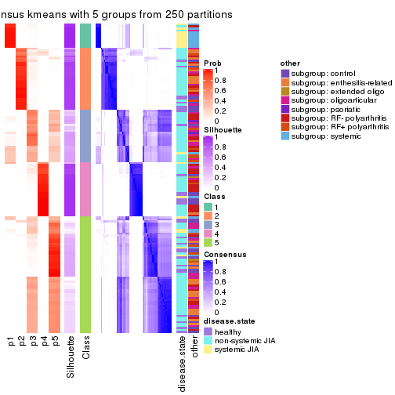</p>

</div>
<div id='tab-CV-kmeans-consensus-heatmap-5'>
<pre><code class="r">consensus_heatmap(res, k = 6)
</code></pre>

<p></p>

</div>
</div>

Heatmaps for the membership of samples in all partitions to see how consistent they are:


<script>
$( function() {
	$( '#tabs-CV-kmeans-membership-heatmap' ).tabs();
} );
</script>
<div id='tabs-CV-kmeans-membership-heatmap'>
<ul>
<li><a href='#tab-CV-kmeans-membership-heatmap-1'>k = 2</a></li>
<li><a href='#tab-CV-kmeans-membership-heatmap-2'>k = 3</a></li>
<li><a href='#tab-CV-kmeans-membership-heatmap-3'>k = 4</a></li>
<li><a href='#tab-CV-kmeans-membership-heatmap-4'>k = 5</a></li>
<li><a href='#tab-CV-kmeans-membership-heatmap-5'>k = 6</a></li>
</ul>
<div id='tab-CV-kmeans-membership-heatmap-1'>
<pre><code class="r">membership_heatmap(res, k = 2)
</code></pre>

<p>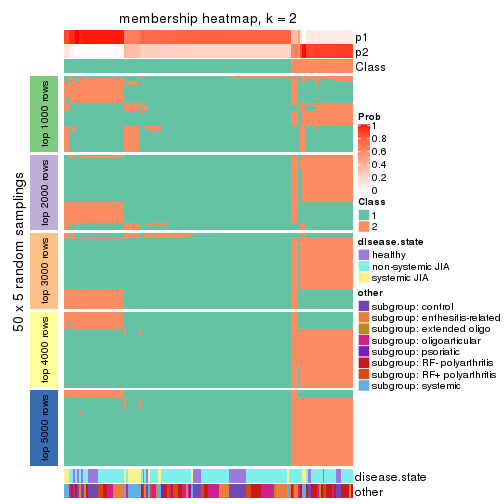</p>

</div>
<div id='tab-CV-kmeans-membership-heatmap-2'>
<pre><code class="r">membership_heatmap(res, k = 3)
</code></pre>

<p></p>

</div>
<div id='tab-CV-kmeans-membership-heatmap-3'>
<pre><code class="r">membership_heatmap(res, k = 4)
</code></pre>

<p></p>

</div>
<div id='tab-CV-kmeans-membership-heatmap-4'>
<pre><code class="r">membership_heatmap(res, k = 5)
</code></pre>

<p></p>

</div>
<div id='tab-CV-kmeans-membership-heatmap-5'>
<pre><code class="r">membership_heatmap(res, k = 6)
</code></pre>

<p></p>

</div>
</div>

As soon as we have had the classes for columns, we can look for signatures
which are significantly different between classes which can be candidate marks
for certain classes. Following are the heatmaps for signatures.


Signature heatmaps where rows are scaled:


<script>
$( function() {
	$( '#tabs-CV-kmeans-get-signatures' ).tabs();
} );
</script>
<div id='tabs-CV-kmeans-get-signatures'>
<ul>
<li><a href='#tab-CV-kmeans-get-signatures-1'>k = 2</a></li>
<li><a href='#tab-CV-kmeans-get-signatures-2'>k = 3</a></li>
<li><a href='#tab-CV-kmeans-get-signatures-3'>k = 4</a></li>
<li><a href='#tab-CV-kmeans-get-signatures-4'>k = 5</a></li>
<li><a href='#tab-CV-kmeans-get-signatures-5'>k = 6</a></li>
</ul>
<div id='tab-CV-kmeans-get-signatures-1'>
<pre><code class="r">get_signatures(res, k = 2)
</code></pre>

<p></p>

</div>
<div id='tab-CV-kmeans-get-signatures-2'>
<pre><code class="r">get_signatures(res, k = 3)
</code></pre>

<p></p>

</div>
<div id='tab-CV-kmeans-get-signatures-3'>
<pre><code class="r">get_signatures(res, k = 4)
</code></pre>

<p></p>

</div>
<div id='tab-CV-kmeans-get-signatures-4'>
<pre><code class="r">get_signatures(res, k = 5)
</code></pre>

<p></p>

</div>
<div id='tab-CV-kmeans-get-signatures-5'>
<pre><code class="r">get_signatures(res, k = 6)
</code></pre>

<p>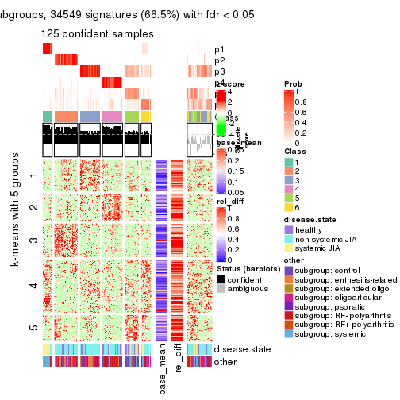</p>

</div>
</div>


Signature heatmaps where rows are not scaled:


<script>
$( function() {
	$( '#tabs-CV-kmeans-get-signatures-no-scale' ).tabs();
} );
</script>
<div id='tabs-CV-kmeans-get-signatures-no-scale'>
<ul>
<li><a href='#tab-CV-kmeans-get-signatures-no-scale-1'>k = 2</a></li>
<li><a href='#tab-CV-kmeans-get-signatures-no-scale-2'>k = 3</a></li>
<li><a href='#tab-CV-kmeans-get-signatures-no-scale-3'>k = 4</a></li>
<li><a href='#tab-CV-kmeans-get-signatures-no-scale-4'>k = 5</a></li>
<li><a href='#tab-CV-kmeans-get-signatures-no-scale-5'>k = 6</a></li>
</ul>
<div id='tab-CV-kmeans-get-signatures-no-scale-1'>
<pre><code class="r">get_signatures(res, k = 2, scale_rows = FALSE)
</code></pre>

<p></p>

</div>
<div id='tab-CV-kmeans-get-signatures-no-scale-2'>
<pre><code class="r">get_signatures(res, k = 3, scale_rows = FALSE)
</code></pre>

<p></p>

</div>
<div id='tab-CV-kmeans-get-signatures-no-scale-3'>
<pre><code class="r">get_signatures(res, k = 4, scale_rows = FALSE)
</code></pre>

<p></p>

</div>
<div id='tab-CV-kmeans-get-signatures-no-scale-4'>
<pre><code class="r">get_signatures(res, k = 5, scale_rows = FALSE)
</code></pre>

<p></p>

</div>
<div id='tab-CV-kmeans-get-signatures-no-scale-5'>
<pre><code class="r">get_signatures(res, k = 6, scale_rows = FALSE)
</code></pre>

<p></p>

</div>
</div>


Compare the overlap of signatures from different k:

```r
compare_signatures(res)
```


`get_signature()` returns a data frame invisibly. TO get the list of signatures, the function
call should be assigned to a variable explicitly. In following code, if `plot` argument is set
to `FALSE`, no heatmap is plotted while only the differential analysis is performed.

```r
# code only for demonstration
tb = get_signature(res, k = ..., plot = FALSE)
```

An example of the output of `tb` is:

```
#>   which_row         fdr    mean_1    mean_2 scaled_mean_1 scaled_mean_2 km
#> 1        38 0.042760348  8.373488  9.131774    -0.5533452     0.5164555  1
#> 2        40 0.018707592  7.106213  8.469186    -0.6173731     0.5762149  1
#> 3        55 0.019134737 10.221463 11.207825    -0.6159697     0.5749050  1
#> 4        59 0.006059896  5.921854  7.869574    -0.6899429     0.6439467  1
#> 5        60 0.018055526  8.928898 10.211722    -0.6204761     0.5791110  1
#> 6        98 0.009384629 15.714769 14.887706     0.6635654    -0.6193277  2
...
```

The columns in `tb` are:

1. `which_row`: row indices corresponding to the input matrix.
2. `fdr`: FDR for the differential test. 
3. `mean_x`: The mean value in group x.
4. `scaled_mean_x`: The mean value in group x after rows are scaled.
5. `km`: Row groups if k-means clustering is applied to rows.


UMAP plot which shows how samples are separated.


<script>
$( function() {
	$( '#tabs-CV-kmeans-dimension-reduction' ).tabs();
} );
</script>
<div id='tabs-CV-kmeans-dimension-reduction'>
<ul>
<li><a href='#tab-CV-kmeans-dimension-reduction-1'>k = 2</a></li>
<li><a href='#tab-CV-kmeans-dimension-reduction-2'>k = 3</a></li>
<li><a href='#tab-CV-kmeans-dimension-reduction-3'>k = 4</a></li>
<li><a href='#tab-CV-kmeans-dimension-reduction-4'>k = 5</a></li>
<li><a href='#tab-CV-kmeans-dimension-reduction-5'>k = 6</a></li>
</ul>
<div id='tab-CV-kmeans-dimension-reduction-1'>
<pre><code class="r">dimension_reduction(res, k = 2, method = &quot;UMAP&quot;)
</code></pre>

<p></p>

</div>
<div id='tab-CV-kmeans-dimension-reduction-2'>
<pre><code class="r">dimension_reduction(res, k = 3, method = &quot;UMAP&quot;)
</code></pre>

<p></p>

</div>
<div id='tab-CV-kmeans-dimension-reduction-3'>
<pre><code class="r">dimension_reduction(res, k = 4, method = &quot;UMAP&quot;)
</code></pre>

<p></p>

</div>
<div id='tab-CV-kmeans-dimension-reduction-4'>
<pre><code class="r">dimension_reduction(res, k = 5, method = &quot;UMAP&quot;)
</code></pre>

<p></p>

</div>
<div id='tab-CV-kmeans-dimension-reduction-5'>
<pre><code class="r">dimension_reduction(res, k = 6, method = &quot;UMAP&quot;)
</code></pre>

<p></p>

</div>
</div>


Following heatmap shows how subgroups are split when increasing `k`:

```r
collect_classes(res)
```


Test correlation between subgroups and known annotations. If the known
annotation is numeric, one-way ANOVA test is applied, and if the known
annotation is discrete, chi-squared contingency table test is applied.

```r
test_to_known_factors(res)
```

```
#>             n disease.state(p) other(p) k
#> CV:kmeans 153         5.39e-01 3.06e-03 2
#> CV:kmeans 138         9.11e-01 4.81e-02 3
#> CV:kmeans 142         4.96e-14 1.05e-12 4
#> CV:kmeans  71         1.73e-09 1.14e-08 5
#> CV:kmeans 125         3.47e-12 9.34e-14 6
```


If matrix rows can be associated to genes, consider to use `GO_Enrichment(res,
...)` to perform function enrichment for the signature genes.


 

---------------------------------------------------


### CV:skmeans


The object with results only for a single top-value method and a single partition method 
can be extracted as:

```r
res = res_list["CV", "skmeans"]
# you can also extract it by
# res = res_list["CV:skmeans"]
```

A summary of `res` and all the functions that can be applied to it:

```r
res
```

```
#> A 'ConsensusPartition' object with k = 2, 3, 4, 5, 6.
#>   On a matrix with 51941 rows and 154 columns.
#>   Top rows (1000, 2000, 3000, 4000, 5000) are extracted by 'CV' method.
#>   Subgroups are detected by 'skmeans' method.
#>   Performed in total 1250 partitions by row resampling.
#>   Best k for subgroups seems to be 4.
#> 
#> Following methods can be applied to this 'ConsensusPartition' object:
#>  [1] "cola_report"             "collect_classes"         "collect_plots"          
#>  [4] "collect_stats"           "colnames"                "compare_signatures"     
#>  [7] "consensus_heatmap"       "dimension_reduction"     "functional_enrichment"  
#> [10] "get_anno_col"            "get_anno"                "get_classes"            
#> [13] "get_consensus"           "get_matrix"              "get_membership"         
#> [16] "get_param"               "get_signatures"          "get_stats"              
#> [19] "is_best_k"               "is_stable_k"             "membership_heatmap"     
#> [22] "ncol"                    "nrow"                    "plot_ecdf"              
#> [25] "rownames"                "select_partition_number" "show"                   
#> [28] "suggest_best_k"          "test_to_known_factors"
```

`collect_plots()` function collects all the plots made from `res` for all `k` (number of partitions)
into one single page to provide an easy and fast comparison between different `k`.

```r
collect_plots(res)
```


The plots are:

- The first row: a plot of the ECDF (Empirical cumulative distribution
  function) curves of the consensus matrix for each `k` and the heatmap of
  predicted classes for each `k`.
- The second row: heatmaps of the consensus matrix for each `k`.
- The third row: heatmaps of the membership matrix for each `k`.
- The fouth row: heatmaps of the signatures for each `k`.

All the plots in panels can be made by individual functions and they are
plotted later in this section.

`select_partition_number()` produces several plots showing different
statistics for choosing "optimized" `k`. There are following statistics:

- ECDF curves of the consensus matrix for each `k`;
- 1-PAC. [The PAC
  score](https://en.wikipedia.org/wiki/Consensus_clustering#Over-interpretation_potential_of_consensus_clustering)
  measures the proportion of the ambiguous subgrouping.
- Mean silhouette score.
- Concordance. The mean probability of fiting the consensus class ids in all
  partitions.
- Area increased. Denote $A_k$ as the area under the ECDF curve for current
  `k`, the area increased is defined as $A_k - A_{k-1}$.
- Rand index. The percent of pairs of samples that are both in a same cluster
  or both are not in a same cluster in the partition of k and k-1.
- Jaccard index. The ratio of pairs of samples are both in a same cluster in
  the partition of k and k-1 and the pairs of samples are both in a same
  cluster in the partition k or k-1.

The detailed explanations of these statistics can be found in [the cola
vignette](http://bioconductor.org/packages/devel/bioc/vignettes/cola/inst/doc/cola.html#toc_13).

Generally speaking, lower PAC score, higher mean silhouette score or higher
concordance corresponds to better partition. Rand index and Jaccard index
measure how similar the current partition is compared to partition with `k-1`.
If they are too similar, we won't accept `k` is better than `k-1`.

```r
select_partition_number(res)
```


The numeric values for all these statistics can be obtained by `get_stats()`.

```r
get_stats(res)
```

```
#>   k 1-PAC mean_silhouette concordance area_increased  Rand Jaccard
#> 2 2 0.348           0.708       0.828         0.4785 0.513   0.513
#> 3 3 0.785           0.857       0.919         0.3259 0.637   0.418
#> 4 4 0.873           0.887       0.949         0.1712 0.829   0.573
#> 5 5 0.776           0.728       0.849         0.0771 0.871   0.557
#> 6 6 0.775           0.640       0.811         0.0383 0.934   0.690
```

`suggest_best_k()` suggests the best $k$ based on these statistics. The rules are as follows:

- All $k$ with Jaccard index larger than 0.95 are removed because the increase of
  the partition number does not provides enough extra information. If all $k$ are removed,
  the best $k$ is assigned by `NA`.
- For $k$ with 1-PAC larger than 0.9, the maximal $k$ is taken as the "best k". Other $k$ is called "optional k".
- If it does not fit the second rule. The $k$ with the highest vote of highest
  1-PAC, mean silhouette and concordance is taken as the "best k".

```r
suggest_best_k(res)
```

```
#> [1] 4
```


Following shows the table of the partitions (You need to click the **show/hide
code output** link to see it). The membership matrix (columns with name `p*`)
is inferred by
[`clue::cl_consensus()`](https://www.rdocumentation.org/link/cl_consensus?package=clue)
function with the `SE` method. Basically the value in the membership matrix
represents the probability to belong to a certain group. The finall class
label for an item is determined with the group with highest probability it
belongs to.

In `get_classes()` function, the entropy is calculated from the membership
matrix and the silhouette score is calculated from the consensus matrix.


<script>
$( function() {
	$( '#tabs-CV-skmeans-get-classes' ).tabs();
} );
</script>
<div id='tabs-CV-skmeans-get-classes'>
<ul>
<li><a href='#tab-CV-skmeans-get-classes-1'>k = 2</a></li>
<li><a href='#tab-CV-skmeans-get-classes-2'>k = 3</a></li>
<li><a href='#tab-CV-skmeans-get-classes-3'>k = 4</a></li>
<li><a href='#tab-CV-skmeans-get-classes-4'>k = 5</a></li>
<li><a href='#tab-CV-skmeans-get-classes-5'>k = 6</a></li>
</ul>

<div id='tab-CV-skmeans-get-classes-1'>
<p><a id='tab-CV-skmeans-get-classes-1-a' style='color:#0366d6' href='#'>show/hide code output</a></p>
<pre><code class="r">cbind(get_classes(res, k = 2), get_membership(res, k = 2))
</code></pre>

<pre><code>#&gt;           class entropy silhouette    p1    p2
#&gt; GSM340358     2  0.7219      0.628 0.200 0.800
#&gt; GSM340359     1  0.7602      0.757 0.780 0.220
#&gt; GSM340361     1  0.9608      0.818 0.616 0.384
#&gt; GSM340362     1  0.9635      0.818 0.612 0.388
#&gt; GSM340363     2  0.0376      0.699 0.004 0.996
#&gt; GSM340364     1  0.7602      0.757 0.780 0.220
#&gt; GSM340365     1  0.9608      0.818 0.616 0.384
#&gt; GSM340366     1  0.9522      0.816 0.628 0.372
#&gt; GSM340367     1  0.7602      0.757 0.780 0.220
#&gt; GSM340368     2  0.9635      0.695 0.388 0.612
#&gt; GSM340369     2  0.9580      0.698 0.380 0.620
#&gt; GSM340370     1  0.7602      0.757 0.780 0.220
#&gt; GSM340371     1  0.9710      0.808 0.600 0.400
#&gt; GSM340372     1  0.7602      0.757 0.780 0.220
#&gt; GSM340373     1  0.7602      0.757 0.780 0.220
#&gt; GSM340375     1  0.7602      0.757 0.780 0.220
#&gt; GSM340376     1  0.7602      0.757 0.780 0.220
#&gt; GSM340378     1  0.7602      0.757 0.780 0.220
#&gt; GSM340243     1  0.9580      0.814 0.620 0.380
#&gt; GSM340244     1  0.5408      0.382 0.876 0.124
#&gt; GSM340246     1  0.0000      0.596 1.000 0.000
#&gt; GSM340247     2  0.7602      0.783 0.220 0.780
#&gt; GSM340248     1  0.0000      0.596 1.000 0.000
#&gt; GSM340249     2  0.9635      0.695 0.388 0.612
#&gt; GSM340250     1  0.9358      0.809 0.648 0.352
#&gt; GSM340251     2  0.9635      0.695 0.388 0.612
#&gt; GSM340252     2  0.9635      0.695 0.388 0.612
#&gt; GSM340253     1  0.0000      0.596 1.000 0.000
#&gt; GSM340254     1  0.0000      0.596 1.000 0.000
#&gt; GSM340256     1  0.0000      0.596 1.000 0.000
#&gt; GSM340258     1  0.9635      0.818 0.612 0.388
#&gt; GSM340259     1  0.9635      0.818 0.612 0.388
#&gt; GSM340260     1  0.9635      0.818 0.612 0.388
#&gt; GSM340261     1  0.9635      0.818 0.612 0.388
#&gt; GSM340262     1  0.9635      0.818 0.612 0.388
#&gt; GSM340263     1  0.8861     -0.184 0.696 0.304
#&gt; GSM340264     1  0.9909      0.757 0.556 0.444
#&gt; GSM340265     1  0.9635      0.818 0.612 0.388
#&gt; GSM340266     2  0.0000      0.696 0.000 1.000
#&gt; GSM340267     1  0.9635      0.818 0.612 0.388
#&gt; GSM340268     2  0.0000      0.696 0.000 1.000
#&gt; GSM340269     1  0.9635      0.818 0.612 0.388
#&gt; GSM340270     2  0.8861     -0.139 0.304 0.696
#&gt; GSM537574     1  0.9522      0.816 0.628 0.372
#&gt; GSM537580     2  0.3733      0.599 0.072 0.928
#&gt; GSM537581     2  0.8386      0.762 0.268 0.732
#&gt; GSM340272     1  0.9635      0.818 0.612 0.388
#&gt; GSM340273     1  0.0000      0.596 1.000 0.000
#&gt; GSM340275     2  0.9635      0.695 0.388 0.612
#&gt; GSM340276     2  0.4298      0.569 0.088 0.912
#&gt; GSM340277     1  0.0000      0.596 1.000 0.000
#&gt; GSM340278     2  0.0000      0.696 0.000 1.000
#&gt; GSM340279     2  0.0000      0.696 0.000 1.000
#&gt; GSM340282     1  0.9635      0.818 0.612 0.388
#&gt; GSM340284     2  0.9635      0.695 0.388 0.612
#&gt; GSM340285     2  0.0000      0.696 0.000 1.000
#&gt; GSM340286     1  0.9710      0.808 0.600 0.400
#&gt; GSM340287     1  0.9635      0.818 0.612 0.388
#&gt; GSM340288     1  0.9635      0.818 0.612 0.388
#&gt; GSM340289     1  0.9635      0.818 0.612 0.388
#&gt; GSM340290     2  0.0000      0.696 0.000 1.000
#&gt; GSM340291     1  0.0000      0.596 1.000 0.000
#&gt; GSM340293     2  0.6973      0.776 0.188 0.812
#&gt; GSM340294     1  0.9635      0.818 0.612 0.388
#&gt; GSM340296     1  0.9522      0.816 0.628 0.372
#&gt; GSM340297     2  0.0000      0.696 0.000 1.000
#&gt; GSM340298     1  0.9522      0.816 0.628 0.372
#&gt; GSM340299     1  0.9635      0.818 0.612 0.388
#&gt; GSM340301     1  0.9635      0.818 0.612 0.388
#&gt; GSM340303     1  0.9608      0.818 0.616 0.384
#&gt; GSM340304     2  0.4161      0.576 0.084 0.916
#&gt; GSM340306     2  0.7602      0.783 0.220 0.780
#&gt; GSM340307     1  0.0000      0.596 1.000 0.000
#&gt; GSM340310     1  0.7602      0.757 0.780 0.220
#&gt; GSM340314     2  0.3584      0.732 0.068 0.932
#&gt; GSM340315     1  0.9775      0.796 0.588 0.412
#&gt; GSM340317     2  0.9635      0.695 0.388 0.612
#&gt; GSM340318     2  0.7602      0.783 0.220 0.780
#&gt; GSM340319     2  0.7602      0.783 0.220 0.780
#&gt; GSM340320     2  0.7528      0.783 0.216 0.784
#&gt; GSM340321     1  0.0000      0.596 1.000 0.000
#&gt; GSM340322     2  0.7602      0.783 0.220 0.780
#&gt; GSM340324     1  0.0000      0.596 1.000 0.000
#&gt; GSM340328     2  0.6531      0.663 0.168 0.832
#&gt; GSM340330     2  0.0000      0.696 0.000 1.000
#&gt; GSM340332     2  0.7602      0.783 0.220 0.780
#&gt; GSM340333     1  0.0000      0.596 1.000 0.000
#&gt; GSM340336     2  0.9608      0.697 0.384 0.616
#&gt; GSM340337     2  0.7602      0.783 0.220 0.780
#&gt; GSM340338     2  0.3114      0.626 0.056 0.944
#&gt; GSM340339     2  0.7602      0.783 0.220 0.780
#&gt; GSM340340     2  0.9635      0.695 0.388 0.612
#&gt; GSM340341     2  0.9580      0.700 0.380 0.620
#&gt; GSM340343     2  0.7602      0.783 0.220 0.780
#&gt; GSM340344     1  0.7453      0.753 0.788 0.212
#&gt; GSM340346     1  0.9635      0.818 0.612 0.388
#&gt; GSM340347     2  0.7602      0.783 0.220 0.780
#&gt; GSM340348     2  0.7602      0.783 0.220 0.780
#&gt; GSM340349     1  0.9608      0.818 0.616 0.384
#&gt; GSM340350     1  0.9608      0.818 0.616 0.384
#&gt; GSM340351     1  0.9635      0.818 0.612 0.388
#&gt; GSM340354     1  0.9635      0.818 0.612 0.388
#&gt; GSM340356     1  0.0000      0.596 1.000 0.000
#&gt; GSM340357     1  0.9635      0.818 0.612 0.388
#&gt; GSM348183     2  0.0376      0.699 0.004 0.996
#&gt; GSM348191     2  0.0000      0.696 0.000 1.000
#&gt; GSM348193     2  0.7602      0.783 0.220 0.780
#&gt; GSM537578     1  0.9635      0.818 0.612 0.388
#&gt; GSM348181     2  0.0376      0.692 0.004 0.996
#&gt; GSM348182     1  0.9866      0.772 0.568 0.432
#&gt; GSM348184     2  0.9661      0.693 0.392 0.608
#&gt; GSM348185     2  0.9635      0.695 0.388 0.612
#&gt; GSM348186     1  0.0000      0.596 1.000 0.000
#&gt; GSM348187     1  0.9635      0.818 0.612 0.388
#&gt; GSM348188     2  0.7602      0.783 0.220 0.780
#&gt; GSM348189     1  0.9710      0.808 0.600 0.400
#&gt; GSM348190     1  0.9635      0.818 0.612 0.388
#&gt; GSM348194     1  0.9635      0.818 0.612 0.388
#&gt; GSM348195     1  0.9608      0.818 0.616 0.384
#&gt; GSM348196     2  0.9248     -0.265 0.340 0.660
#&gt; GSM537585     1  0.9635      0.818 0.612 0.388
#&gt; GSM537594     1  0.0000      0.596 1.000 0.000
#&gt; GSM537596     2  0.9944     -0.586 0.456 0.544
#&gt; GSM537597     1  0.9608      0.818 0.616 0.384
#&gt; GSM537602     1  0.9608      0.818 0.616 0.384
#&gt; GSM340184     2  0.0376      0.692 0.004 0.996
#&gt; GSM340185     1  0.4022      0.472 0.920 0.080
#&gt; GSM340186     1  0.5629      0.364 0.868 0.132
#&gt; GSM340187     2  0.7602      0.783 0.220 0.780
#&gt; GSM340189     2  0.7602      0.783 0.220 0.780
#&gt; GSM340190     2  0.9635      0.695 0.388 0.612
#&gt; GSM340191     2  0.0000      0.696 0.000 1.000
#&gt; GSM340192     1  0.7453      0.753 0.788 0.212
#&gt; GSM340193     1  0.9635      0.818 0.612 0.388
#&gt; GSM340194     1  0.9635      0.818 0.612 0.388
#&gt; GSM340195     1  0.9635      0.818 0.612 0.388
#&gt; GSM340196     2  0.7602      0.783 0.220 0.780
#&gt; GSM340197     1  0.9635      0.818 0.612 0.388
#&gt; GSM340198     1  0.0000      0.596 1.000 0.000
#&gt; GSM340199     2  0.0000      0.696 0.000 1.000
#&gt; GSM340200     1  0.0000      0.596 1.000 0.000
#&gt; GSM340201     2  0.7602      0.783 0.220 0.780
#&gt; GSM340202     2  0.7602      0.783 0.220 0.780
#&gt; GSM340203     2  0.7602      0.783 0.220 0.780
#&gt; GSM340204     1  0.7453      0.753 0.788 0.212
#&gt; GSM340205     1  0.8016      0.768 0.756 0.244
#&gt; GSM340206     2  0.0000      0.696 0.000 1.000
#&gt; GSM340207     1  0.9661      0.815 0.608 0.392
#&gt; GSM340237     1  0.0000      0.596 1.000 0.000
#&gt; GSM340238     2  0.0000      0.696 0.000 1.000
#&gt; GSM340239     1  0.9635      0.818 0.612 0.388
#&gt; GSM340240     1  0.9635      0.818 0.612 0.388
#&gt; GSM340241     1  0.0000      0.596 1.000 0.000
#&gt; GSM340242     1  0.9710      0.808 0.600 0.400
</code></pre>

<script>
$('#tab-CV-skmeans-get-classes-1-a').parent().next().next().hide();
$('#tab-CV-skmeans-get-classes-1-a').click(function(){
  $('#tab-CV-skmeans-get-classes-1-a').parent().next().next().toggle();
  return(false);
});
</script>
</div>

<div id='tab-CV-skmeans-get-classes-2'>
<p><a id='tab-CV-skmeans-get-classes-2-a' style='color:#0366d6' href='#'>show/hide code output</a></p>
<pre><code class="r">cbind(get_classes(res, k = 3), get_membership(res, k = 3))
</code></pre>

<pre><code>#&gt;           class entropy silhouette    p1    p2    p3
#&gt; GSM340358     2  0.3325      0.844 0.076 0.904 0.020
#&gt; GSM340359     3  0.2866      0.890 0.076 0.008 0.916
#&gt; GSM340361     1  0.0661      0.897 0.988 0.004 0.008
#&gt; GSM340362     1  0.0237      0.901 0.996 0.000 0.004
#&gt; GSM340363     2  0.2165      0.862 0.064 0.936 0.000
#&gt; GSM340364     3  0.2866      0.890 0.076 0.008 0.916
#&gt; GSM340365     1  0.0237      0.900 0.996 0.004 0.000
#&gt; GSM340366     1  0.0237      0.900 0.996 0.004 0.000
#&gt; GSM340367     1  0.7762      0.520 0.668 0.120 0.212
#&gt; GSM340368     2  0.2261      0.857 0.068 0.932 0.000
#&gt; GSM340369     2  0.2261      0.857 0.068 0.932 0.000
#&gt; GSM340370     3  0.8033      0.588 0.240 0.120 0.640
#&gt; GSM340371     1  0.2680      0.916 0.924 0.068 0.008
#&gt; GSM340372     1  0.7762      0.520 0.668 0.120 0.212
#&gt; GSM340373     1  0.7762      0.520 0.668 0.120 0.212
#&gt; GSM340375     3  0.8153      0.578 0.240 0.128 0.632
#&gt; GSM340376     3  0.8033      0.588 0.240 0.120 0.640
#&gt; GSM340378     3  0.4469      0.848 0.076 0.060 0.864
#&gt; GSM340243     1  0.0237      0.900 0.996 0.004 0.000
#&gt; GSM340244     3  0.0000      0.950 0.000 0.000 1.000
#&gt; GSM340246     3  0.0000      0.950 0.000 0.000 1.000
#&gt; GSM340247     2  0.0237      0.894 0.000 0.996 0.004
#&gt; GSM340248     3  0.0000      0.950 0.000 0.000 1.000
#&gt; GSM340249     2  0.6095      0.394 0.000 0.608 0.392
#&gt; GSM340250     1  0.3340      0.807 0.880 0.120 0.000
#&gt; GSM340251     3  0.0592      0.943 0.000 0.012 0.988
#&gt; GSM340252     2  0.6126      0.374 0.000 0.600 0.400
#&gt; GSM340253     3  0.0000      0.950 0.000 0.000 1.000
#&gt; GSM340254     3  0.0000      0.950 0.000 0.000 1.000
#&gt; GSM340256     3  0.0000      0.950 0.000 0.000 1.000
#&gt; GSM340258     1  0.2680      0.916 0.924 0.068 0.008
#&gt; GSM340259     1  0.2680      0.916 0.924 0.068 0.008
#&gt; GSM340260     1  0.0237      0.901 0.996 0.000 0.004
#&gt; GSM340261     1  0.2496      0.915 0.928 0.068 0.004
#&gt; GSM340262     1  0.2680      0.916 0.924 0.068 0.008
#&gt; GSM340263     3  0.0237      0.949 0.004 0.000 0.996
#&gt; GSM340264     1  0.2680      0.916 0.924 0.068 0.008
#&gt; GSM340265     1  0.2680      0.916 0.924 0.068 0.008
#&gt; GSM340266     1  0.5363      0.713 0.724 0.276 0.000
#&gt; GSM340267     1  0.2680      0.916 0.924 0.068 0.008
#&gt; GSM340268     1  0.5156      0.789 0.776 0.216 0.008
#&gt; GSM340269     1  0.2680      0.916 0.924 0.068 0.008
#&gt; GSM340270     1  0.2261      0.915 0.932 0.068 0.000
#&gt; GSM537574     1  0.4399      0.787 0.812 0.000 0.188
#&gt; GSM537580     1  0.2680      0.916 0.924 0.068 0.008
#&gt; GSM537581     2  0.2261      0.857 0.068 0.932 0.000
#&gt; GSM340272     1  0.0237      0.901 0.996 0.000 0.004
#&gt; GSM340273     3  0.0237      0.949 0.004 0.000 0.996
#&gt; GSM340275     2  0.2356      0.846 0.000 0.928 0.072
#&gt; GSM340276     1  0.2261      0.915 0.932 0.068 0.000
#&gt; GSM340277     3  0.0000      0.950 0.000 0.000 1.000
#&gt; GSM340278     1  0.5968      0.553 0.636 0.364 0.000
#&gt; GSM340279     1  0.5254      0.731 0.736 0.264 0.000
#&gt; GSM340282     1  0.1015      0.906 0.980 0.012 0.008
#&gt; GSM340284     3  0.0592      0.943 0.000 0.012 0.988
#&gt; GSM340285     2  0.6045      0.289 0.380 0.620 0.000
#&gt; GSM340286     1  0.2680      0.916 0.924 0.068 0.008
#&gt; GSM340287     1  0.2261      0.915 0.932 0.068 0.000
#&gt; GSM340288     1  0.0424      0.898 0.992 0.000 0.008
#&gt; GSM340289     1  0.0424      0.904 0.992 0.008 0.000
#&gt; GSM340290     1  0.5465      0.695 0.712 0.288 0.000
#&gt; GSM340291     3  0.0000      0.950 0.000 0.000 1.000
#&gt; GSM340293     2  0.2537      0.832 0.080 0.920 0.000
#&gt; GSM340294     1  0.2680      0.916 0.924 0.068 0.008
#&gt; GSM340296     1  0.0237      0.900 0.996 0.004 0.000
#&gt; GSM340297     1  0.2356      0.874 0.928 0.072 0.000
#&gt; GSM340298     1  0.0237      0.900 0.996 0.004 0.000
#&gt; GSM340299     1  0.2680      0.916 0.924 0.068 0.008
#&gt; GSM340301     1  0.2680      0.916 0.924 0.068 0.008
#&gt; GSM340303     1  0.2448      0.886 0.924 0.000 0.076
#&gt; GSM340304     2  0.6280      0.264 0.460 0.540 0.000
#&gt; GSM340306     2  0.0237      0.894 0.000 0.996 0.004
#&gt; GSM340307     3  0.0000      0.950 0.000 0.000 1.000
#&gt; GSM340310     2  0.5858      0.691 0.240 0.740 0.020
#&gt; GSM340314     2  0.5178      0.591 0.256 0.744 0.000
#&gt; GSM340315     1  0.1031      0.907 0.976 0.024 0.000
#&gt; GSM340317     3  0.1860      0.909 0.000 0.052 0.948
#&gt; GSM340318     2  0.0237      0.894 0.000 0.996 0.004
#&gt; GSM340319     2  0.0237      0.894 0.000 0.996 0.004
#&gt; GSM340320     2  0.0237      0.894 0.000 0.996 0.004
#&gt; GSM340321     3  0.0000      0.950 0.000 0.000 1.000
#&gt; GSM340322     2  0.0237      0.894 0.000 0.996 0.004
#&gt; GSM340324     3  0.0237      0.949 0.004 0.000 0.996
#&gt; GSM340328     2  0.2448      0.853 0.076 0.924 0.000
#&gt; GSM340330     1  0.3965      0.875 0.860 0.132 0.008
#&gt; GSM340332     2  0.0237      0.894 0.000 0.996 0.004
#&gt; GSM340333     3  0.0000      0.950 0.000 0.000 1.000
#&gt; GSM340336     2  0.0592      0.891 0.000 0.988 0.012
#&gt; GSM340337     2  0.0237      0.894 0.000 0.996 0.004
#&gt; GSM340338     1  0.3043      0.909 0.908 0.084 0.008
#&gt; GSM340339     2  0.0237      0.894 0.000 0.996 0.004
#&gt; GSM340340     2  0.2550      0.860 0.056 0.932 0.012
#&gt; GSM340341     2  0.2356      0.846 0.000 0.928 0.072
#&gt; GSM340343     2  0.0237      0.894 0.000 0.996 0.004
#&gt; GSM340344     3  0.3340      0.833 0.120 0.000 0.880
#&gt; GSM340346     1  0.2680      0.916 0.924 0.068 0.008
#&gt; GSM340347     2  0.0237      0.894 0.000 0.996 0.004
#&gt; GSM340348     2  0.0237      0.894 0.000 0.996 0.004
#&gt; GSM340349     1  0.0237      0.900 0.996 0.004 0.000
#&gt; GSM340350     1  0.0237      0.900 0.996 0.004 0.000
#&gt; GSM340351     1  0.0424      0.898 0.992 0.000 0.008
#&gt; GSM340354     1  0.2680      0.916 0.924 0.068 0.008
#&gt; GSM340356     3  0.0237      0.949 0.004 0.000 0.996
#&gt; GSM340357     1  0.0237      0.900 0.996 0.004 0.000
#&gt; GSM348183     2  0.1289      0.881 0.032 0.968 0.000
#&gt; GSM348191     1  0.3295      0.902 0.896 0.096 0.008
#&gt; GSM348193     2  0.0237      0.894 0.000 0.996 0.004
#&gt; GSM537578     1  0.0000      0.901 1.000 0.000 0.000
#&gt; GSM348181     1  0.2711      0.908 0.912 0.088 0.000
#&gt; GSM348182     1  0.2680      0.916 0.924 0.068 0.008
#&gt; GSM348184     3  0.0000      0.950 0.000 0.000 1.000
#&gt; GSM348185     2  0.5591      0.571 0.000 0.696 0.304
#&gt; GSM348186     3  0.0000      0.950 0.000 0.000 1.000
#&gt; GSM348187     1  0.0848      0.895 0.984 0.008 0.008
#&gt; GSM348188     2  0.0237      0.894 0.000 0.996 0.004
#&gt; GSM348189     1  0.2680      0.916 0.924 0.068 0.008
#&gt; GSM348190     1  0.2680      0.916 0.924 0.068 0.008
#&gt; GSM348194     1  0.0424      0.898 0.992 0.000 0.008
#&gt; GSM348195     1  0.0848      0.895 0.984 0.008 0.008
#&gt; GSM348196     2  0.6416      0.522 0.376 0.616 0.008
#&gt; GSM537585     1  0.0000      0.901 1.000 0.000 0.000
#&gt; GSM537594     3  0.0237      0.949 0.004 0.000 0.996
#&gt; GSM537596     1  0.2261      0.915 0.932 0.068 0.000
#&gt; GSM537597     1  0.4121      0.756 0.832 0.000 0.168
#&gt; GSM537602     1  0.0424      0.898 0.992 0.000 0.008
#&gt; GSM340184     1  0.3043      0.909 0.908 0.084 0.008
#&gt; GSM340185     3  0.0000      0.950 0.000 0.000 1.000
#&gt; GSM340186     3  0.0000      0.950 0.000 0.000 1.000
#&gt; GSM340187     2  0.0237      0.894 0.000 0.996 0.004
#&gt; GSM340189     2  0.0237      0.894 0.000 0.996 0.004
#&gt; GSM340190     3  0.0424      0.945 0.000 0.008 0.992
#&gt; GSM340191     1  0.5115      0.777 0.768 0.228 0.004
#&gt; GSM340192     3  0.0592      0.942 0.012 0.000 0.988
#&gt; GSM340193     1  0.2261      0.915 0.932 0.068 0.000
#&gt; GSM340194     1  0.2680      0.916 0.924 0.068 0.008
#&gt; GSM340195     1  0.2680      0.916 0.924 0.068 0.008
#&gt; GSM340196     2  0.0237      0.894 0.000 0.996 0.004
#&gt; GSM340197     1  0.2680      0.916 0.924 0.068 0.008
#&gt; GSM340198     3  0.0000      0.950 0.000 0.000 1.000
#&gt; GSM340199     1  0.4702      0.790 0.788 0.212 0.000
#&gt; GSM340200     3  0.0000      0.950 0.000 0.000 1.000
#&gt; GSM340201     2  0.0237      0.894 0.000 0.996 0.004
#&gt; GSM340202     2  0.0237      0.894 0.000 0.996 0.004
#&gt; GSM340203     2  0.0237      0.894 0.000 0.996 0.004
#&gt; GSM340204     3  0.1643      0.916 0.044 0.000 0.956
#&gt; GSM340205     1  0.3607      0.810 0.880 0.112 0.008
#&gt; GSM340206     1  0.5156      0.789 0.776 0.216 0.008
#&gt; GSM340207     1  0.2680      0.916 0.924 0.068 0.008
#&gt; GSM340237     3  0.0475      0.947 0.004 0.004 0.992
#&gt; GSM340238     1  0.5733      0.633 0.676 0.324 0.000
#&gt; GSM340239     1  0.2680      0.916 0.924 0.068 0.008
#&gt; GSM340240     1  0.2680      0.916 0.924 0.068 0.008
#&gt; GSM340241     3  0.0000      0.950 0.000 0.000 1.000
#&gt; GSM340242     1  0.2680      0.916 0.924 0.068 0.008
</code></pre>

<script>
$('#tab-CV-skmeans-get-classes-2-a').parent().next().next().hide();
$('#tab-CV-skmeans-get-classes-2-a').click(function(){
  $('#tab-CV-skmeans-get-classes-2-a').parent().next().next().toggle();
  return(false);
});
</script>
</div>

<div id='tab-CV-skmeans-get-classes-3'>
<p><a id='tab-CV-skmeans-get-classes-3-a' style='color:#0366d6' href='#'>show/hide code output</a></p>
<pre><code class="r">cbind(get_classes(res, k = 4), get_membership(res, k = 4))
</code></pre>

<pre><code>#&gt;           class entropy silhouette    p1    p2    p3    p4
#&gt; GSM340358     1  0.0000      0.956 1.000 0.000 0.000 0.000
#&gt; GSM340359     1  0.2760      0.835 0.872 0.128 0.000 0.000
#&gt; GSM340361     1  0.0000      0.956 1.000 0.000 0.000 0.000
#&gt; GSM340362     3  0.1637      0.893 0.060 0.000 0.940 0.000
#&gt; GSM340363     4  0.3688      0.708 0.208 0.000 0.000 0.792
#&gt; GSM340364     1  0.0000      0.956 1.000 0.000 0.000 0.000
#&gt; GSM340365     1  0.0817      0.943 0.976 0.000 0.024 0.000
#&gt; GSM340366     1  0.1792      0.907 0.932 0.000 0.068 0.000
#&gt; GSM340367     1  0.0000      0.956 1.000 0.000 0.000 0.000
#&gt; GSM340368     4  0.0000      0.926 0.000 0.000 0.000 1.000
#&gt; GSM340369     4  0.3311      0.763 0.172 0.000 0.000 0.828
#&gt; GSM340370     1  0.0000      0.956 1.000 0.000 0.000 0.000
#&gt; GSM340371     3  0.0000      0.927 0.000 0.000 1.000 0.000
#&gt; GSM340372     1  0.0000      0.956 1.000 0.000 0.000 0.000
#&gt; GSM340373     1  0.0000      0.956 1.000 0.000 0.000 0.000
#&gt; GSM340375     1  0.0000      0.956 1.000 0.000 0.000 0.000
#&gt; GSM340376     1  0.0000      0.956 1.000 0.000 0.000 0.000
#&gt; GSM340378     1  0.0000      0.956 1.000 0.000 0.000 0.000
#&gt; GSM340243     1  0.0188      0.954 0.996 0.000 0.004 0.000
#&gt; GSM340244     2  0.0000      0.987 0.000 1.000 0.000 0.000
#&gt; GSM340246     2  0.0000      0.987 0.000 1.000 0.000 0.000
#&gt; GSM340247     4  0.0000      0.926 0.000 0.000 0.000 1.000
#&gt; GSM340248     2  0.0000      0.987 0.000 1.000 0.000 0.000
#&gt; GSM340249     4  0.4933      0.289 0.000 0.432 0.000 0.568
#&gt; GSM340250     1  0.4730      0.412 0.636 0.000 0.364 0.000
#&gt; GSM340251     2  0.0000      0.987 0.000 1.000 0.000 0.000
#&gt; GSM340252     4  0.4933      0.288 0.000 0.432 0.000 0.568
#&gt; GSM340253     2  0.0000      0.987 0.000 1.000 0.000 0.000
#&gt; GSM340254     2  0.0000      0.987 0.000 1.000 0.000 0.000
#&gt; GSM340256     2  0.0000      0.987 0.000 1.000 0.000 0.000
#&gt; GSM340258     3  0.0000      0.927 0.000 0.000 1.000 0.000
#&gt; GSM340259     3  0.0592      0.922 0.016 0.000 0.984 0.000
#&gt; GSM340260     3  0.3172      0.794 0.160 0.000 0.840 0.000
#&gt; GSM340261     3  0.0188      0.926 0.004 0.000 0.996 0.000
#&gt; GSM340262     3  0.0000      0.927 0.000 0.000 1.000 0.000
#&gt; GSM340263     2  0.0000      0.987 0.000 1.000 0.000 0.000
#&gt; GSM340264     3  0.0000      0.927 0.000 0.000 1.000 0.000
#&gt; GSM340265     3  0.0000      0.927 0.000 0.000 1.000 0.000
#&gt; GSM340266     3  0.2530      0.855 0.000 0.000 0.888 0.112
#&gt; GSM340267     3  0.0000      0.927 0.000 0.000 1.000 0.000
#&gt; GSM340268     3  0.0188      0.926 0.000 0.000 0.996 0.004
#&gt; GSM340269     3  0.0000      0.927 0.000 0.000 1.000 0.000
#&gt; GSM340270     3  0.3266      0.807 0.168 0.000 0.832 0.000
#&gt; GSM537574     3  0.0469      0.922 0.000 0.012 0.988 0.000
#&gt; GSM537580     3  0.0000      0.927 0.000 0.000 1.000 0.000
#&gt; GSM537581     4  0.0336      0.921 0.008 0.000 0.000 0.992
#&gt; GSM340272     1  0.4877      0.333 0.592 0.000 0.408 0.000
#&gt; GSM340273     2  0.0000      0.987 0.000 1.000 0.000 0.000
#&gt; GSM340275     4  0.0000      0.926 0.000 0.000 0.000 1.000
#&gt; GSM340276     3  0.3172      0.814 0.160 0.000 0.840 0.000
#&gt; GSM340277     2  0.0000      0.987 0.000 1.000 0.000 0.000
#&gt; GSM340278     3  0.4422      0.668 0.008 0.000 0.736 0.256
#&gt; GSM340279     3  0.1940      0.884 0.000 0.000 0.924 0.076
#&gt; GSM340282     3  0.0336      0.925 0.008 0.000 0.992 0.000
#&gt; GSM340284     2  0.0188      0.984 0.000 0.996 0.004 0.000
#&gt; GSM340285     4  0.5417      0.206 0.016 0.000 0.412 0.572
#&gt; GSM340286     3  0.0336      0.925 0.008 0.000 0.992 0.000
#&gt; GSM340287     3  0.0817      0.918 0.024 0.000 0.976 0.000
#&gt; GSM340288     1  0.0336      0.953 0.992 0.000 0.008 0.000
#&gt; GSM340289     3  0.4967      0.255 0.452 0.000 0.548 0.000
#&gt; GSM340290     3  0.2469      0.859 0.000 0.000 0.892 0.108
#&gt; GSM340291     2  0.0000      0.987 0.000 1.000 0.000 0.000
#&gt; GSM340293     4  0.0469      0.917 0.000 0.000 0.012 0.988
#&gt; GSM340294     3  0.0000      0.927 0.000 0.000 1.000 0.000
#&gt; GSM340296     1  0.1211      0.932 0.960 0.000 0.040 0.000
#&gt; GSM340297     3  0.3547      0.823 0.144 0.000 0.840 0.016
#&gt; GSM340298     1  0.1716      0.913 0.936 0.000 0.064 0.000
#&gt; GSM340299     3  0.0336      0.925 0.008 0.000 0.992 0.000
#&gt; GSM340301     3  0.0000      0.927 0.000 0.000 1.000 0.000
#&gt; GSM340303     3  0.4655      0.689 0.032 0.208 0.760 0.000
#&gt; GSM340304     1  0.0804      0.948 0.980 0.000 0.012 0.008
#&gt; GSM340306     4  0.0000      0.926 0.000 0.000 0.000 1.000
#&gt; GSM340307     2  0.0000      0.987 0.000 1.000 0.000 0.000
#&gt; GSM340310     1  0.0000      0.956 1.000 0.000 0.000 0.000
#&gt; GSM340314     3  0.4730      0.466 0.000 0.000 0.636 0.364
#&gt; GSM340315     3  0.4877      0.359 0.408 0.000 0.592 0.000
#&gt; GSM340317     2  0.0000      0.987 0.000 1.000 0.000 0.000
#&gt; GSM340318     4  0.0000      0.926 0.000 0.000 0.000 1.000
#&gt; GSM340319     4  0.0000      0.926 0.000 0.000 0.000 1.000
#&gt; GSM340320     4  0.0000      0.926 0.000 0.000 0.000 1.000
#&gt; GSM340321     2  0.0000      0.987 0.000 1.000 0.000 0.000
#&gt; GSM340322     4  0.0000      0.926 0.000 0.000 0.000 1.000
#&gt; GSM340324     2  0.0000      0.987 0.000 1.000 0.000 0.000
#&gt; GSM340328     1  0.0336      0.951 0.992 0.000 0.000 0.008
#&gt; GSM340330     3  0.0000      0.927 0.000 0.000 1.000 0.000
#&gt; GSM340332     4  0.0000      0.926 0.000 0.000 0.000 1.000
#&gt; GSM340333     2  0.0000      0.987 0.000 1.000 0.000 0.000
#&gt; GSM340336     4  0.0000      0.926 0.000 0.000 0.000 1.000
#&gt; GSM340337     4  0.0000      0.926 0.000 0.000 0.000 1.000
#&gt; GSM340338     3  0.0000      0.927 0.000 0.000 1.000 0.000
#&gt; GSM340339     4  0.0000      0.926 0.000 0.000 0.000 1.000
#&gt; GSM340340     4  0.0000      0.926 0.000 0.000 0.000 1.000
#&gt; GSM340341     4  0.0000      0.926 0.000 0.000 0.000 1.000
#&gt; GSM340343     4  0.0000      0.926 0.000 0.000 0.000 1.000
#&gt; GSM340344     2  0.2944      0.850 0.004 0.868 0.128 0.000
#&gt; GSM340346     3  0.0000      0.927 0.000 0.000 1.000 0.000
#&gt; GSM340347     4  0.0000      0.926 0.000 0.000 0.000 1.000
#&gt; GSM340348     4  0.0000      0.926 0.000 0.000 0.000 1.000
#&gt; GSM340349     1  0.0000      0.956 1.000 0.000 0.000 0.000
#&gt; GSM340350     1  0.0000      0.956 1.000 0.000 0.000 0.000
#&gt; GSM340351     1  0.0469      0.951 0.988 0.000 0.012 0.000
#&gt; GSM340354     3  0.0000      0.927 0.000 0.000 1.000 0.000
#&gt; GSM340356     2  0.0000      0.987 0.000 1.000 0.000 0.000
#&gt; GSM340357     1  0.0000      0.956 1.000 0.000 0.000 0.000
#&gt; GSM348183     4  0.4564      0.500 0.328 0.000 0.000 0.672
#&gt; GSM348191     3  0.0000      0.927 0.000 0.000 1.000 0.000
#&gt; GSM348193     4  0.0000      0.926 0.000 0.000 0.000 1.000
#&gt; GSM537578     1  0.0592      0.949 0.984 0.000 0.016 0.000
#&gt; GSM348181     3  0.3311      0.801 0.172 0.000 0.828 0.000
#&gt; GSM348182     3  0.0592      0.922 0.016 0.000 0.984 0.000
#&gt; GSM348184     2  0.0000      0.987 0.000 1.000 0.000 0.000
#&gt; GSM348185     4  0.4431      0.569 0.000 0.304 0.000 0.696
#&gt; GSM348186     2  0.0000      0.987 0.000 1.000 0.000 0.000
#&gt; GSM348187     1  0.0000      0.956 1.000 0.000 0.000 0.000
#&gt; GSM348188     4  0.0000      0.926 0.000 0.000 0.000 1.000
#&gt; GSM348189     3  0.0000      0.927 0.000 0.000 1.000 0.000
#&gt; GSM348190     3  0.0336      0.925 0.008 0.000 0.992 0.000
#&gt; GSM348194     1  0.0336      0.953 0.992 0.000 0.008 0.000
#&gt; GSM348195     1  0.0000      0.956 1.000 0.000 0.000 0.000
#&gt; GSM348196     1  0.0336      0.953 0.992 0.000 0.008 0.000
#&gt; GSM537585     1  0.2760      0.844 0.872 0.000 0.128 0.000
#&gt; GSM537594     2  0.0000      0.987 0.000 1.000 0.000 0.000
#&gt; GSM537596     3  0.4981      0.216 0.464 0.000 0.536 0.000
#&gt; GSM537597     1  0.0779      0.947 0.980 0.004 0.016 0.000
#&gt; GSM537602     1  0.0000      0.956 1.000 0.000 0.000 0.000
#&gt; GSM340184     3  0.0000      0.927 0.000 0.000 1.000 0.000
#&gt; GSM340185     2  0.0000      0.987 0.000 1.000 0.000 0.000
#&gt; GSM340186     2  0.0000      0.987 0.000 1.000 0.000 0.000
#&gt; GSM340187     4  0.0000      0.926 0.000 0.000 0.000 1.000
#&gt; GSM340189     4  0.0000      0.926 0.000 0.000 0.000 1.000
#&gt; GSM340190     2  0.0000      0.987 0.000 1.000 0.000 0.000
#&gt; GSM340191     3  0.1474      0.901 0.000 0.000 0.948 0.052
#&gt; GSM340192     2  0.1792      0.920 0.000 0.932 0.068 0.000
#&gt; GSM340193     3  0.2469      0.863 0.108 0.000 0.892 0.000
#&gt; GSM340194     3  0.0336      0.925 0.008 0.000 0.992 0.000
#&gt; GSM340195     3  0.0336      0.925 0.008 0.000 0.992 0.000
#&gt; GSM340196     4  0.0000      0.926 0.000 0.000 0.000 1.000
#&gt; GSM340197     3  0.0336      0.925 0.008 0.000 0.992 0.000
#&gt; GSM340198     2  0.0000      0.987 0.000 1.000 0.000 0.000
#&gt; GSM340199     3  0.1557      0.898 0.000 0.000 0.944 0.056
#&gt; GSM340200     2  0.0000      0.987 0.000 1.000 0.000 0.000
#&gt; GSM340201     4  0.0000      0.926 0.000 0.000 0.000 1.000
#&gt; GSM340202     4  0.0000      0.926 0.000 0.000 0.000 1.000
#&gt; GSM340203     4  0.0000      0.926 0.000 0.000 0.000 1.000
#&gt; GSM340204     2  0.2760      0.853 0.000 0.872 0.128 0.000
#&gt; GSM340205     1  0.0000      0.956 1.000 0.000 0.000 0.000
#&gt; GSM340206     3  0.0000      0.927 0.000 0.000 1.000 0.000
#&gt; GSM340207     3  0.0000      0.927 0.000 0.000 1.000 0.000
#&gt; GSM340237     2  0.0000      0.987 0.000 1.000 0.000 0.000
#&gt; GSM340238     3  0.2149      0.875 0.000 0.000 0.912 0.088
#&gt; GSM340239     3  0.0336      0.925 0.008 0.000 0.992 0.000
#&gt; GSM340240     3  0.0000      0.927 0.000 0.000 1.000 0.000
#&gt; GSM340241     2  0.0000      0.987 0.000 1.000 0.000 0.000
#&gt; GSM340242     3  0.0000      0.927 0.000 0.000 1.000 0.000
</code></pre>

<script>
$('#tab-CV-skmeans-get-classes-3-a').parent().next().next().hide();
$('#tab-CV-skmeans-get-classes-3-a').click(function(){
  $('#tab-CV-skmeans-get-classes-3-a').parent().next().next().toggle();
  return(false);
});
</script>
</div>

<div id='tab-CV-skmeans-get-classes-4'>
<p><a id='tab-CV-skmeans-get-classes-4-a' style='color:#0366d6' href='#'>show/hide code output</a></p>
<pre><code class="r">cbind(get_classes(res, k = 5), get_membership(res, k = 5))
</code></pre>

<pre><code>#&gt;           class entropy silhouette    p1    p2    p3    p4    p5
#&gt; GSM340358     1  0.0000     0.8707 1.000 0.000 0.000 0.000 0.000
#&gt; GSM340359     1  0.0162     0.8685 0.996 0.004 0.000 0.000 0.000
#&gt; GSM340361     1  0.1270     0.8637 0.948 0.000 0.052 0.000 0.000
#&gt; GSM340362     5  0.1117     0.7192 0.020 0.000 0.016 0.000 0.964
#&gt; GSM340363     1  0.6024     0.2259 0.472 0.000 0.116 0.412 0.000
#&gt; GSM340364     1  0.0000     0.8707 1.000 0.000 0.000 0.000 0.000
#&gt; GSM340365     5  0.6244     0.3640 0.200 0.000 0.260 0.000 0.540
#&gt; GSM340366     5  0.6526     0.2487 0.256 0.000 0.260 0.000 0.484
#&gt; GSM340367     1  0.0000     0.8707 1.000 0.000 0.000 0.000 0.000
#&gt; GSM340368     4  0.0000     0.9325 0.000 0.000 0.000 1.000 0.000
#&gt; GSM340369     4  0.3305     0.7206 0.224 0.000 0.000 0.776 0.000
#&gt; GSM340370     1  0.0000     0.8707 1.000 0.000 0.000 0.000 0.000
#&gt; GSM340371     5  0.0000     0.7263 0.000 0.000 0.000 0.000 1.000
#&gt; GSM340372     1  0.0000     0.8707 1.000 0.000 0.000 0.000 0.000
#&gt; GSM340373     1  0.0000     0.8707 1.000 0.000 0.000 0.000 0.000
#&gt; GSM340375     1  0.0000     0.8707 1.000 0.000 0.000 0.000 0.000
#&gt; GSM340376     1  0.0000     0.8707 1.000 0.000 0.000 0.000 0.000
#&gt; GSM340378     1  0.0000     0.8707 1.000 0.000 0.000 0.000 0.000
#&gt; GSM340243     3  0.4475     0.3216 0.276 0.000 0.692 0.000 0.032
#&gt; GSM340244     2  0.0000     0.9769 0.000 1.000 0.000 0.000 0.000
#&gt; GSM340246     2  0.0000     0.9769 0.000 1.000 0.000 0.000 0.000
#&gt; GSM340247     4  0.0000     0.9325 0.000 0.000 0.000 1.000 0.000
#&gt; GSM340248     2  0.0000     0.9769 0.000 1.000 0.000 0.000 0.000
#&gt; GSM340249     4  0.4235     0.3103 0.000 0.424 0.000 0.576 0.000
#&gt; GSM340250     3  0.4138     0.4538 0.384 0.000 0.616 0.000 0.000
#&gt; GSM340251     2  0.0000     0.9769 0.000 1.000 0.000 0.000 0.000
#&gt; GSM340252     4  0.3661     0.6271 0.000 0.276 0.000 0.724 0.000
#&gt; GSM340253     2  0.2516     0.8245 0.000 0.860 0.000 0.000 0.140
#&gt; GSM340254     2  0.0000     0.9769 0.000 1.000 0.000 0.000 0.000
#&gt; GSM340256     2  0.0000     0.9769 0.000 1.000 0.000 0.000 0.000
#&gt; GSM340258     5  0.3876     0.2500 0.000 0.000 0.316 0.000 0.684
#&gt; GSM340259     5  0.3895     0.2616 0.000 0.000 0.320 0.000 0.680
#&gt; GSM340260     5  0.5929     0.3905 0.156 0.000 0.260 0.000 0.584
#&gt; GSM340261     3  0.2074     0.6775 0.000 0.000 0.896 0.000 0.104
#&gt; GSM340262     5  0.1608     0.6895 0.000 0.000 0.072 0.000 0.928
#&gt; GSM340263     2  0.0000     0.9769 0.000 1.000 0.000 0.000 0.000
#&gt; GSM340264     5  0.0510     0.7232 0.000 0.000 0.016 0.000 0.984
#&gt; GSM340265     5  0.1197     0.7101 0.000 0.000 0.048 0.000 0.952
#&gt; GSM340266     3  0.3895     0.6721 0.000 0.000 0.680 0.000 0.320
#&gt; GSM340267     5  0.2690     0.6383 0.000 0.000 0.156 0.000 0.844
#&gt; GSM340268     3  0.3966     0.6657 0.000 0.000 0.664 0.000 0.336
#&gt; GSM340269     3  0.4227     0.5136 0.000 0.000 0.580 0.000 0.420
#&gt; GSM340270     3  0.5976     0.4890 0.112 0.000 0.488 0.000 0.400
#&gt; GSM537574     3  0.4909     0.5271 0.000 0.028 0.560 0.000 0.412
#&gt; GSM537580     5  0.0000     0.7263 0.000 0.000 0.000 0.000 1.000
#&gt; GSM537581     4  0.2424     0.8239 0.132 0.000 0.000 0.868 0.000
#&gt; GSM340272     5  0.4563     0.5366 0.048 0.000 0.244 0.000 0.708
#&gt; GSM340273     2  0.0000     0.9769 0.000 1.000 0.000 0.000 0.000
#&gt; GSM340275     4  0.0000     0.9325 0.000 0.000 0.000 1.000 0.000
#&gt; GSM340276     3  0.2970     0.6979 0.004 0.000 0.828 0.000 0.168
#&gt; GSM340277     2  0.0000     0.9769 0.000 1.000 0.000 0.000 0.000
#&gt; GSM340278     3  0.1478     0.6370 0.000 0.000 0.936 0.000 0.064
#&gt; GSM340279     3  0.3242     0.7013 0.000 0.000 0.784 0.000 0.216
#&gt; GSM340282     5  0.2929     0.6235 0.000 0.000 0.180 0.000 0.820
#&gt; GSM340284     2  0.1043     0.9405 0.000 0.960 0.040 0.000 0.000
#&gt; GSM340285     3  0.2152     0.5965 0.004 0.000 0.920 0.044 0.032
#&gt; GSM340286     5  0.0609     0.7220 0.000 0.000 0.020 0.000 0.980
#&gt; GSM340287     3  0.3003     0.7005 0.000 0.000 0.812 0.000 0.188
#&gt; GSM340288     1  0.3452     0.7941 0.756 0.000 0.244 0.000 0.000
#&gt; GSM340289     5  0.6184     0.1331 0.380 0.000 0.140 0.000 0.480
#&gt; GSM340290     3  0.3074     0.6977 0.000 0.000 0.804 0.000 0.196
#&gt; GSM340291     2  0.0000     0.9769 0.000 1.000 0.000 0.000 0.000
#&gt; GSM340293     3  0.3910     0.4857 0.000 0.000 0.720 0.272 0.008
#&gt; GSM340294     3  0.3534     0.6951 0.000 0.000 0.744 0.000 0.256
#&gt; GSM340296     3  0.4302     0.3858 0.248 0.000 0.720 0.000 0.032
#&gt; GSM340297     3  0.5104     0.6463 0.192 0.000 0.692 0.000 0.116
#&gt; GSM340298     3  0.4276     0.3938 0.244 0.000 0.724 0.000 0.032
#&gt; GSM340299     5  0.1197     0.7102 0.000 0.000 0.048 0.000 0.952
#&gt; GSM340301     5  0.0880     0.7163 0.000 0.000 0.032 0.000 0.968
#&gt; GSM340303     5  0.3913     0.5006 0.000 0.000 0.324 0.000 0.676
#&gt; GSM340304     1  0.4949     0.6171 0.572 0.000 0.396 0.000 0.032
#&gt; GSM340306     4  0.0000     0.9325 0.000 0.000 0.000 1.000 0.000
#&gt; GSM340307     2  0.0000     0.9769 0.000 1.000 0.000 0.000 0.000
#&gt; GSM340310     1  0.0000     0.8707 1.000 0.000 0.000 0.000 0.000
#&gt; GSM340314     3  0.4777     0.6729 0.000 0.000 0.664 0.044 0.292
#&gt; GSM340315     3  0.4723     0.6726 0.128 0.000 0.736 0.000 0.136
#&gt; GSM340317     2  0.0000     0.9769 0.000 1.000 0.000 0.000 0.000
#&gt; GSM340318     4  0.0000     0.9325 0.000 0.000 0.000 1.000 0.000
#&gt; GSM340319     4  0.0000     0.9325 0.000 0.000 0.000 1.000 0.000
#&gt; GSM340320     4  0.0880     0.9106 0.000 0.000 0.032 0.968 0.000
#&gt; GSM340321     2  0.0000     0.9769 0.000 1.000 0.000 0.000 0.000
#&gt; GSM340322     4  0.0000     0.9325 0.000 0.000 0.000 1.000 0.000
#&gt; GSM340324     2  0.0000     0.9769 0.000 1.000 0.000 0.000 0.000
#&gt; GSM340328     1  0.0000     0.8707 1.000 0.000 0.000 0.000 0.000
#&gt; GSM340330     3  0.3966     0.6657 0.000 0.000 0.664 0.000 0.336
#&gt; GSM340332     4  0.0000     0.9325 0.000 0.000 0.000 1.000 0.000
#&gt; GSM340333     2  0.1043     0.9413 0.000 0.960 0.000 0.000 0.040
#&gt; GSM340336     4  0.0000     0.9325 0.000 0.000 0.000 1.000 0.000
#&gt; GSM340337     4  0.0000     0.9325 0.000 0.000 0.000 1.000 0.000
#&gt; GSM340338     5  0.4397    -0.2059 0.004 0.000 0.432 0.000 0.564
#&gt; GSM340339     4  0.0000     0.9325 0.000 0.000 0.000 1.000 0.000
#&gt; GSM340340     4  0.0290     0.9277 0.008 0.000 0.000 0.992 0.000
#&gt; GSM340341     4  0.0000     0.9325 0.000 0.000 0.000 1.000 0.000
#&gt; GSM340343     4  0.0000     0.9325 0.000 0.000 0.000 1.000 0.000
#&gt; GSM340344     5  0.4074     0.3324 0.000 0.364 0.000 0.000 0.636
#&gt; GSM340346     3  0.3074     0.5779 0.000 0.000 0.804 0.000 0.196
#&gt; GSM340347     4  0.0000     0.9325 0.000 0.000 0.000 1.000 0.000
#&gt; GSM340348     4  0.1197     0.8978 0.000 0.000 0.048 0.952 0.000
#&gt; GSM340349     1  0.4930     0.6125 0.580 0.000 0.388 0.000 0.032
#&gt; GSM340350     1  0.2654     0.8267 0.884 0.000 0.084 0.000 0.032
#&gt; GSM340351     1  0.3366     0.8008 0.768 0.000 0.232 0.000 0.000
#&gt; GSM340354     5  0.4307    -0.4039 0.000 0.000 0.500 0.000 0.500
#&gt; GSM340356     2  0.0000     0.9769 0.000 1.000 0.000 0.000 0.000
#&gt; GSM340357     1  0.2561     0.8392 0.856 0.000 0.144 0.000 0.000
#&gt; GSM348183     4  0.4294     0.0144 0.468 0.000 0.000 0.532 0.000
#&gt; GSM348191     3  0.3932     0.6695 0.000 0.000 0.672 0.000 0.328
#&gt; GSM348193     4  0.0000     0.9325 0.000 0.000 0.000 1.000 0.000
#&gt; GSM537578     3  0.3687     0.4163 0.180 0.000 0.792 0.000 0.028
#&gt; GSM348181     3  0.3932     0.6695 0.000 0.000 0.672 0.000 0.328
#&gt; GSM348182     5  0.0609     0.7220 0.000 0.000 0.020 0.000 0.980
#&gt; GSM348184     2  0.0000     0.9769 0.000 1.000 0.000 0.000 0.000
#&gt; GSM348185     4  0.3561     0.6546 0.000 0.260 0.000 0.740 0.000
#&gt; GSM348186     2  0.0000     0.9769 0.000 1.000 0.000 0.000 0.000
#&gt; GSM348187     1  0.2280     0.8433 0.880 0.000 0.120 0.000 0.000
#&gt; GSM348188     4  0.0000     0.9325 0.000 0.000 0.000 1.000 0.000
#&gt; GSM348189     5  0.0000     0.7263 0.000 0.000 0.000 0.000 1.000
#&gt; GSM348190     5  0.1608     0.7018 0.000 0.000 0.072 0.000 0.928
#&gt; GSM348194     1  0.3424     0.7965 0.760 0.000 0.240 0.000 0.000
#&gt; GSM348195     1  0.1965     0.8539 0.904 0.000 0.096 0.000 0.000
#&gt; GSM348196     1  0.3424     0.7965 0.760 0.000 0.240 0.000 0.000
#&gt; GSM537585     5  0.6023     0.3871 0.248 0.000 0.176 0.000 0.576
#&gt; GSM537594     2  0.0000     0.9769 0.000 1.000 0.000 0.000 0.000
#&gt; GSM537596     3  0.5831     0.3644 0.292 0.000 0.580 0.000 0.128
#&gt; GSM537597     1  0.3612     0.7771 0.732 0.000 0.268 0.000 0.000
#&gt; GSM537602     1  0.4822     0.6755 0.616 0.000 0.352 0.000 0.032
#&gt; GSM340184     3  0.3966     0.6657 0.000 0.000 0.664 0.000 0.336
#&gt; GSM340185     2  0.0000     0.9769 0.000 1.000 0.000 0.000 0.000
#&gt; GSM340186     2  0.0000     0.9769 0.000 1.000 0.000 0.000 0.000
#&gt; GSM340187     4  0.0000     0.9325 0.000 0.000 0.000 1.000 0.000
#&gt; GSM340189     4  0.0000     0.9325 0.000 0.000 0.000 1.000 0.000
#&gt; GSM340190     2  0.0000     0.9769 0.000 1.000 0.000 0.000 0.000
#&gt; GSM340191     3  0.3966     0.6657 0.000 0.000 0.664 0.000 0.336
#&gt; GSM340192     2  0.5140     0.5406 0.000 0.664 0.084 0.000 0.252
#&gt; GSM340193     5  0.5476    -0.0970 0.068 0.000 0.388 0.000 0.544
#&gt; GSM340194     5  0.0000     0.7263 0.000 0.000 0.000 0.000 1.000
#&gt; GSM340195     5  0.0000     0.7263 0.000 0.000 0.000 0.000 1.000
#&gt; GSM340196     4  0.0000     0.9325 0.000 0.000 0.000 1.000 0.000
#&gt; GSM340197     5  0.0794     0.7182 0.000 0.000 0.028 0.000 0.972
#&gt; GSM340198     2  0.0000     0.9769 0.000 1.000 0.000 0.000 0.000
#&gt; GSM340199     3  0.1478     0.6276 0.000 0.000 0.936 0.000 0.064
#&gt; GSM340200     2  0.1544     0.9177 0.000 0.932 0.068 0.000 0.000
#&gt; GSM340201     4  0.0000     0.9325 0.000 0.000 0.000 1.000 0.000
#&gt; GSM340202     4  0.0000     0.9325 0.000 0.000 0.000 1.000 0.000
#&gt; GSM340203     4  0.0000     0.9325 0.000 0.000 0.000 1.000 0.000
#&gt; GSM340204     5  0.4306    -0.0140 0.000 0.492 0.000 0.000 0.508
#&gt; GSM340205     1  0.0000     0.8707 1.000 0.000 0.000 0.000 0.000
#&gt; GSM340206     3  0.3966     0.6657 0.000 0.000 0.664 0.000 0.336
#&gt; GSM340207     5  0.1043     0.7121 0.000 0.000 0.040 0.000 0.960
#&gt; GSM340237     2  0.0000     0.9769 0.000 1.000 0.000 0.000 0.000
#&gt; GSM340238     3  0.3966     0.6657 0.000 0.000 0.664 0.000 0.336
#&gt; GSM340239     5  0.0880     0.7169 0.000 0.000 0.032 0.000 0.968
#&gt; GSM340240     5  0.1908     0.6843 0.000 0.000 0.092 0.000 0.908
#&gt; GSM340241     2  0.0000     0.9769 0.000 1.000 0.000 0.000 0.000
#&gt; GSM340242     5  0.0000     0.7263 0.000 0.000 0.000 0.000 1.000
</code></pre>

<script>
$('#tab-CV-skmeans-get-classes-4-a').parent().next().next().hide();
$('#tab-CV-skmeans-get-classes-4-a').click(function(){
  $('#tab-CV-skmeans-get-classes-4-a').parent().next().next().toggle();
  return(false);
});
</script>
</div>

<div id='tab-CV-skmeans-get-classes-5'>
<p><a id='tab-CV-skmeans-get-classes-5-a' style='color:#0366d6' href='#'>show/hide code output</a></p>
<pre><code class="r">cbind(get_classes(res, k = 6), get_membership(res, k = 6))
</code></pre>

<pre><code>#&gt;           class entropy silhouette    p1    p2    p3    p4    p5    p6
#&gt; GSM340358     1  0.0000     0.7851 1.000 0.000 0.000 0.000 0.000 0.000
#&gt; GSM340359     1  0.0000     0.7851 1.000 0.000 0.000 0.000 0.000 0.000
#&gt; GSM340361     1  0.2762     0.7016 0.860 0.000 0.092 0.000 0.000 0.048
#&gt; GSM340362     5  0.1218     0.7206 0.012 0.000 0.028 0.000 0.956 0.004
#&gt; GSM340363     1  0.7670     0.1362 0.312 0.000 0.204 0.236 0.000 0.248
#&gt; GSM340364     1  0.0000     0.7851 1.000 0.000 0.000 0.000 0.000 0.000
#&gt; GSM340365     6  0.4936     0.0396 0.064 0.000 0.000 0.000 0.436 0.500
#&gt; GSM340366     6  0.4972     0.3683 0.116 0.000 0.000 0.000 0.256 0.628
#&gt; GSM340367     1  0.0000     0.7851 1.000 0.000 0.000 0.000 0.000 0.000
#&gt; GSM340368     4  0.0260     0.9274 0.008 0.000 0.000 0.992 0.000 0.000
#&gt; GSM340369     4  0.3464     0.5624 0.312 0.000 0.000 0.688 0.000 0.000
#&gt; GSM340370     1  0.0000     0.7851 1.000 0.000 0.000 0.000 0.000 0.000
#&gt; GSM340371     5  0.0458     0.7287 0.000 0.000 0.016 0.000 0.984 0.000
#&gt; GSM340372     1  0.0000     0.7851 1.000 0.000 0.000 0.000 0.000 0.000
#&gt; GSM340373     1  0.0000     0.7851 1.000 0.000 0.000 0.000 0.000 0.000
#&gt; GSM340375     1  0.0000     0.7851 1.000 0.000 0.000 0.000 0.000 0.000
#&gt; GSM340376     1  0.0000     0.7851 1.000 0.000 0.000 0.000 0.000 0.000
#&gt; GSM340378     1  0.0000     0.7851 1.000 0.000 0.000 0.000 0.000 0.000
#&gt; GSM340243     6  0.4502     0.5360 0.116 0.000 0.140 0.000 0.012 0.732
#&gt; GSM340244     2  0.0000     0.9490 0.000 1.000 0.000 0.000 0.000 0.000
#&gt; GSM340246     2  0.0000     0.9490 0.000 1.000 0.000 0.000 0.000 0.000
#&gt; GSM340247     4  0.0000     0.9313 0.000 0.000 0.000 1.000 0.000 0.000
#&gt; GSM340248     2  0.0000     0.9490 0.000 1.000 0.000 0.000 0.000 0.000
#&gt; GSM340249     4  0.3864     0.1452 0.000 0.480 0.000 0.520 0.000 0.000
#&gt; GSM340250     3  0.4168     0.3369 0.400 0.000 0.584 0.000 0.000 0.016
#&gt; GSM340251     2  0.0000     0.9490 0.000 1.000 0.000 0.000 0.000 0.000
#&gt; GSM340252     4  0.3050     0.6894 0.000 0.236 0.000 0.764 0.000 0.000
#&gt; GSM340253     2  0.2092     0.8182 0.000 0.876 0.000 0.000 0.124 0.000
#&gt; GSM340254     2  0.0000     0.9490 0.000 1.000 0.000 0.000 0.000 0.000
#&gt; GSM340256     2  0.0000     0.9490 0.000 1.000 0.000 0.000 0.000 0.000
#&gt; GSM340258     5  0.3864    -0.3468 0.000 0.000 0.480 0.000 0.520 0.000
#&gt; GSM340259     5  0.5398     0.1689 0.000 0.000 0.240 0.000 0.580 0.180
#&gt; GSM340260     5  0.5982     0.4474 0.144 0.000 0.172 0.000 0.612 0.072
#&gt; GSM340261     3  0.3221     0.6467 0.000 0.000 0.828 0.000 0.076 0.096
#&gt; GSM340262     5  0.2883     0.5114 0.000 0.000 0.212 0.000 0.788 0.000
#&gt; GSM340263     2  0.0000     0.9490 0.000 1.000 0.000 0.000 0.000 0.000
#&gt; GSM340264     5  0.0865     0.7232 0.000 0.000 0.036 0.000 0.964 0.000
#&gt; GSM340265     5  0.2146     0.6803 0.000 0.000 0.004 0.000 0.880 0.116
#&gt; GSM340266     3  0.4834     0.6980 0.000 0.000 0.656 0.000 0.224 0.120
#&gt; GSM340267     3  0.5654    -0.1511 0.000 0.000 0.444 0.000 0.404 0.152
#&gt; GSM340268     3  0.3050     0.7407 0.000 0.000 0.764 0.000 0.236 0.000
#&gt; GSM340269     3  0.4453     0.5511 0.000 0.000 0.568 0.000 0.400 0.032
#&gt; GSM340270     3  0.5046     0.6700 0.100 0.000 0.620 0.000 0.276 0.004
#&gt; GSM537574     3  0.6033     0.4270 0.000 0.076 0.452 0.000 0.416 0.056
#&gt; GSM537580     5  0.0547     0.7282 0.000 0.000 0.020 0.000 0.980 0.000
#&gt; GSM537581     4  0.2631     0.7903 0.152 0.000 0.008 0.840 0.000 0.000
#&gt; GSM340272     5  0.3986     0.0972 0.000 0.000 0.004 0.000 0.532 0.464
#&gt; GSM340273     2  0.0000     0.9490 0.000 1.000 0.000 0.000 0.000 0.000
#&gt; GSM340275     4  0.0000     0.9313 0.000 0.000 0.000 1.000 0.000 0.000
#&gt; GSM340276     6  0.5327     0.1067 0.000 0.000 0.372 0.000 0.112 0.516
#&gt; GSM340277     2  0.0000     0.9490 0.000 1.000 0.000 0.000 0.000 0.000
#&gt; GSM340278     6  0.3717     0.4792 0.000 0.000 0.148 0.000 0.072 0.780
#&gt; GSM340279     3  0.2972     0.7029 0.000 0.000 0.836 0.000 0.128 0.036
#&gt; GSM340282     5  0.3838     0.1507 0.000 0.000 0.000 0.000 0.552 0.448
#&gt; GSM340284     2  0.2793     0.7196 0.000 0.800 0.200 0.000 0.000 0.000
#&gt; GSM340285     6  0.2994     0.5190 0.000 0.000 0.164 0.008 0.008 0.820
#&gt; GSM340286     5  0.0458     0.7288 0.000 0.000 0.016 0.000 0.984 0.000
#&gt; GSM340287     3  0.1921     0.5691 0.000 0.000 0.916 0.000 0.032 0.052
#&gt; GSM340288     6  0.6114    -0.1051 0.348 0.000 0.236 0.000 0.004 0.412
#&gt; GSM340289     5  0.7602    -0.0151 0.208 0.000 0.224 0.000 0.348 0.220
#&gt; GSM340290     3  0.4613     0.5206 0.000 0.000 0.660 0.000 0.080 0.260
#&gt; GSM340291     2  0.0000     0.9490 0.000 1.000 0.000 0.000 0.000 0.000
#&gt; GSM340293     6  0.5398     0.3262 0.000 0.000 0.320 0.136 0.000 0.544
#&gt; GSM340294     3  0.3290     0.7425 0.000 0.000 0.776 0.000 0.208 0.016
#&gt; GSM340296     6  0.4954     0.4982 0.100 0.000 0.208 0.000 0.016 0.676
#&gt; GSM340297     3  0.3821     0.6324 0.156 0.000 0.776 0.000 0.064 0.004
#&gt; GSM340298     6  0.5062     0.4748 0.092 0.000 0.240 0.000 0.016 0.652
#&gt; GSM340299     5  0.0865     0.7200 0.000 0.000 0.000 0.000 0.964 0.036
#&gt; GSM340301     5  0.0632     0.7210 0.000 0.000 0.024 0.000 0.976 0.000
#&gt; GSM340303     6  0.4097    -0.0787 0.000 0.000 0.008 0.000 0.492 0.500
#&gt; GSM340304     6  0.1010     0.5547 0.004 0.000 0.036 0.000 0.000 0.960
#&gt; GSM340306     4  0.0146     0.9297 0.000 0.000 0.000 0.996 0.000 0.004
#&gt; GSM340307     2  0.0146     0.9460 0.000 0.996 0.000 0.000 0.000 0.004
#&gt; GSM340310     1  0.0000     0.7851 1.000 0.000 0.000 0.000 0.000 0.000
#&gt; GSM340314     3  0.3744     0.7311 0.000 0.000 0.764 0.052 0.184 0.000
#&gt; GSM340315     3  0.1606     0.5379 0.008 0.000 0.932 0.000 0.004 0.056
#&gt; GSM340317     2  0.0000     0.9490 0.000 1.000 0.000 0.000 0.000 0.000
#&gt; GSM340318     4  0.0000     0.9313 0.000 0.000 0.000 1.000 0.000 0.000
#&gt; GSM340319     4  0.0000     0.9313 0.000 0.000 0.000 1.000 0.000 0.000
#&gt; GSM340320     4  0.2868     0.7963 0.000 0.000 0.132 0.840 0.000 0.028
#&gt; GSM340321     2  0.0000     0.9490 0.000 1.000 0.000 0.000 0.000 0.000
#&gt; GSM340322     4  0.0000     0.9313 0.000 0.000 0.000 1.000 0.000 0.000
#&gt; GSM340324     2  0.0000     0.9490 0.000 1.000 0.000 0.000 0.000 0.000
#&gt; GSM340328     1  0.0146     0.7828 0.996 0.000 0.000 0.000 0.000 0.004
#&gt; GSM340330     3  0.3050     0.7407 0.000 0.000 0.764 0.000 0.236 0.000
#&gt; GSM340332     4  0.0547     0.9189 0.000 0.000 0.020 0.980 0.000 0.000
#&gt; GSM340333     2  0.0790     0.9195 0.000 0.968 0.000 0.000 0.032 0.000
#&gt; GSM340336     4  0.0000     0.9313 0.000 0.000 0.000 1.000 0.000 0.000
#&gt; GSM340337     4  0.0000     0.9313 0.000 0.000 0.000 1.000 0.000 0.000
#&gt; GSM340338     3  0.4015     0.6153 0.012 0.000 0.616 0.000 0.372 0.000
#&gt; GSM340339     4  0.0000     0.9313 0.000 0.000 0.000 1.000 0.000 0.000
#&gt; GSM340340     4  0.0547     0.9197 0.020 0.000 0.000 0.980 0.000 0.000
#&gt; GSM340341     4  0.0146     0.9297 0.000 0.000 0.000 0.996 0.000 0.004
#&gt; GSM340343     4  0.0000     0.9313 0.000 0.000 0.000 1.000 0.000 0.000
#&gt; GSM340344     5  0.3380     0.5044 0.000 0.244 0.004 0.000 0.748 0.004
#&gt; GSM340346     6  0.4683     0.3774 0.000 0.000 0.320 0.000 0.064 0.616
#&gt; GSM340347     4  0.0000     0.9313 0.000 0.000 0.000 1.000 0.000 0.000
#&gt; GSM340348     4  0.1616     0.8832 0.000 0.000 0.020 0.932 0.000 0.048
#&gt; GSM340349     6  0.2763     0.5576 0.072 0.000 0.024 0.000 0.028 0.876
#&gt; GSM340350     1  0.4631     0.0452 0.536 0.000 0.004 0.000 0.032 0.428
#&gt; GSM340351     1  0.5932     0.3613 0.532 0.000 0.232 0.000 0.012 0.224
#&gt; GSM340354     3  0.4264     0.3830 0.000 0.000 0.492 0.000 0.492 0.016
#&gt; GSM340356     2  0.0000     0.9490 0.000 1.000 0.000 0.000 0.000 0.000
#&gt; GSM340357     1  0.5595     0.3248 0.516 0.000 0.164 0.000 0.000 0.320
#&gt; GSM348183     1  0.4787     0.1038 0.484 0.000 0.012 0.476 0.000 0.028
#&gt; GSM348191     3  0.4478     0.7269 0.000 0.000 0.680 0.000 0.244 0.076
#&gt; GSM348193     4  0.0146     0.9297 0.000 0.000 0.000 0.996 0.000 0.004
#&gt; GSM537578     6  0.2313     0.5675 0.012 0.000 0.100 0.000 0.004 0.884
#&gt; GSM348181     3  0.4643     0.7337 0.028 0.000 0.704 0.000 0.216 0.052
#&gt; GSM348182     5  0.0632     0.7271 0.000 0.000 0.024 0.000 0.976 0.000
#&gt; GSM348184     2  0.0000     0.9490 0.000 1.000 0.000 0.000 0.000 0.000
#&gt; GSM348185     4  0.3608     0.6354 0.000 0.272 0.000 0.716 0.000 0.012
#&gt; GSM348186     2  0.0000     0.9490 0.000 1.000 0.000 0.000 0.000 0.000
#&gt; GSM348187     1  0.5979     0.1595 0.416 0.000 0.232 0.000 0.000 0.352
#&gt; GSM348188     4  0.0000     0.9313 0.000 0.000 0.000 1.000 0.000 0.000
#&gt; GSM348189     5  0.0547     0.7282 0.000 0.000 0.020 0.000 0.980 0.000
#&gt; GSM348190     5  0.2852     0.6643 0.000 0.000 0.064 0.000 0.856 0.080
#&gt; GSM348194     6  0.6128    -0.1517 0.372 0.000 0.236 0.000 0.004 0.388
#&gt; GSM348195     1  0.4809     0.5282 0.664 0.000 0.208 0.000 0.000 0.128
#&gt; GSM348196     6  0.6125    -0.1353 0.364 0.000 0.236 0.000 0.004 0.396
#&gt; GSM537585     5  0.7252     0.0594 0.160 0.000 0.236 0.000 0.432 0.172
#&gt; GSM537594     2  0.0000     0.9490 0.000 1.000 0.000 0.000 0.000 0.000
#&gt; GSM537596     3  0.6064    -0.2429 0.124 0.000 0.428 0.000 0.028 0.420
#&gt; GSM537597     6  0.6199    -0.0584 0.320 0.000 0.244 0.000 0.008 0.428
#&gt; GSM537602     6  0.0964     0.5583 0.016 0.000 0.012 0.000 0.004 0.968
#&gt; GSM340184     3  0.3050     0.7407 0.000 0.000 0.764 0.000 0.236 0.000
#&gt; GSM340185     2  0.0000     0.9490 0.000 1.000 0.000 0.000 0.000 0.000
#&gt; GSM340186     2  0.0000     0.9490 0.000 1.000 0.000 0.000 0.000 0.000
#&gt; GSM340187     4  0.0146     0.9295 0.000 0.000 0.004 0.996 0.000 0.000
#&gt; GSM340189     4  0.0000     0.9313 0.000 0.000 0.000 1.000 0.000 0.000
#&gt; GSM340190     2  0.0260     0.9423 0.000 0.992 0.008 0.000 0.000 0.000
#&gt; GSM340191     3  0.3189     0.7404 0.000 0.000 0.760 0.000 0.236 0.004
#&gt; GSM340192     2  0.5980    -0.0763 0.000 0.400 0.000 0.000 0.228 0.372
#&gt; GSM340193     5  0.6454    -0.0999 0.016 0.000 0.276 0.000 0.364 0.344
#&gt; GSM340194     5  0.0291     0.7278 0.000 0.000 0.004 0.000 0.992 0.004
#&gt; GSM340195     5  0.0291     0.7278 0.000 0.000 0.004 0.000 0.992 0.004
#&gt; GSM340196     4  0.0000     0.9313 0.000 0.000 0.000 1.000 0.000 0.000
#&gt; GSM340197     5  0.0547     0.7273 0.000 0.000 0.020 0.000 0.980 0.000
#&gt; GSM340198     2  0.0000     0.9490 0.000 1.000 0.000 0.000 0.000 0.000
#&gt; GSM340199     6  0.4026     0.3622 0.000 0.000 0.348 0.000 0.016 0.636
#&gt; GSM340200     2  0.3634     0.4483 0.000 0.644 0.000 0.000 0.000 0.356
#&gt; GSM340201     4  0.0000     0.9313 0.000 0.000 0.000 1.000 0.000 0.000
#&gt; GSM340202     4  0.0000     0.9313 0.000 0.000 0.000 1.000 0.000 0.000
#&gt; GSM340203     4  0.0000     0.9313 0.000 0.000 0.000 1.000 0.000 0.000
#&gt; GSM340204     5  0.4836     0.2963 0.000 0.380 0.004 0.000 0.564 0.052
#&gt; GSM340205     1  0.0146     0.7831 0.996 0.000 0.000 0.000 0.000 0.004
#&gt; GSM340206     3  0.3050     0.7407 0.000 0.000 0.764 0.000 0.236 0.000
#&gt; GSM340207     5  0.1814     0.6625 0.000 0.000 0.100 0.000 0.900 0.000
#&gt; GSM340237     2  0.0000     0.9490 0.000 1.000 0.000 0.000 0.000 0.000
#&gt; GSM340238     3  0.3050     0.7407 0.000 0.000 0.764 0.000 0.236 0.000
#&gt; GSM340239     5  0.0547     0.7261 0.000 0.000 0.020 0.000 0.980 0.000
#&gt; GSM340240     5  0.3076     0.5336 0.000 0.000 0.000 0.000 0.760 0.240
#&gt; GSM340241     2  0.0000     0.9490 0.000 1.000 0.000 0.000 0.000 0.000
#&gt; GSM340242     5  0.0547     0.7282 0.000 0.000 0.020 0.000 0.980 0.000
</code></pre>

<script>
$('#tab-CV-skmeans-get-classes-5-a').parent().next().next().hide();
$('#tab-CV-skmeans-get-classes-5-a').click(function(){
  $('#tab-CV-skmeans-get-classes-5-a').parent().next().next().toggle();
  return(false);
});
</script>
</div>
</div>

Heatmaps for the consensus matrix. It visualizes the probability of two
samples to be in a same group.


<script>
$( function() {
	$( '#tabs-CV-skmeans-consensus-heatmap' ).tabs();
} );
</script>
<div id='tabs-CV-skmeans-consensus-heatmap'>
<ul>
<li><a href='#tab-CV-skmeans-consensus-heatmap-1'>k = 2</a></li>
<li><a href='#tab-CV-skmeans-consensus-heatmap-2'>k = 3</a></li>
<li><a href='#tab-CV-skmeans-consensus-heatmap-3'>k = 4</a></li>
<li><a href='#tab-CV-skmeans-consensus-heatmap-4'>k = 5</a></li>
<li><a href='#tab-CV-skmeans-consensus-heatmap-5'>k = 6</a></li>
</ul>
<div id='tab-CV-skmeans-consensus-heatmap-1'>
<pre><code class="r">consensus_heatmap(res, k = 2)
</code></pre>

<p></p>

</div>
<div id='tab-CV-skmeans-consensus-heatmap-2'>
<pre><code class="r">consensus_heatmap(res, k = 3)
</code></pre>

<p></p>

</div>
<div id='tab-CV-skmeans-consensus-heatmap-3'>
<pre><code class="r">consensus_heatmap(res, k = 4)
</code></pre>

<p></p>

</div>
<div id='tab-CV-skmeans-consensus-heatmap-4'>
<pre><code class="r">consensus_heatmap(res, k = 5)
</code></pre>

<p></p>

</div>
<div id='tab-CV-skmeans-consensus-heatmap-5'>
<pre><code class="r">consensus_heatmap(res, k = 6)
</code></pre>

<p></p>

</div>
</div>

Heatmaps for the membership of samples in all partitions to see how consistent they are:


<script>
$( function() {
	$( '#tabs-CV-skmeans-membership-heatmap' ).tabs();
} );
</script>
<div id='tabs-CV-skmeans-membership-heatmap'>
<ul>
<li><a href='#tab-CV-skmeans-membership-heatmap-1'>k = 2</a></li>
<li><a href='#tab-CV-skmeans-membership-heatmap-2'>k = 3</a></li>
<li><a href='#tab-CV-skmeans-membership-heatmap-3'>k = 4</a></li>
<li><a href='#tab-CV-skmeans-membership-heatmap-4'>k = 5</a></li>
<li><a href='#tab-CV-skmeans-membership-heatmap-5'>k = 6</a></li>
</ul>
<div id='tab-CV-skmeans-membership-heatmap-1'>
<pre><code class="r">membership_heatmap(res, k = 2)
</code></pre>

<p>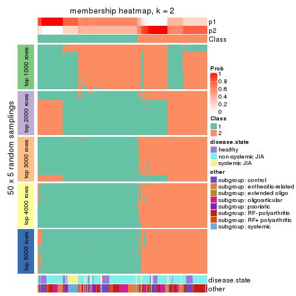</p>

</div>
<div id='tab-CV-skmeans-membership-heatmap-2'>
<pre><code class="r">membership_heatmap(res, k = 3)
</code></pre>

<p></p>

</div>
<div id='tab-CV-skmeans-membership-heatmap-3'>
<pre><code class="r">membership_heatmap(res, k = 4)
</code></pre>

<p></p>

</div>
<div id='tab-CV-skmeans-membership-heatmap-4'>
<pre><code class="r">membership_heatmap(res, k = 5)
</code></pre>

<p></p>

</div>
<div id='tab-CV-skmeans-membership-heatmap-5'>
<pre><code class="r">membership_heatmap(res, k = 6)
</code></pre>

<p></p>

</div>
</div>

As soon as we have had the classes for columns, we can look for signatures
which are significantly different between classes which can be candidate marks
for certain classes. Following are the heatmaps for signatures.


Signature heatmaps where rows are scaled:


<script>
$( function() {
	$( '#tabs-CV-skmeans-get-signatures' ).tabs();
} );
</script>
<div id='tabs-CV-skmeans-get-signatures'>
<ul>
<li><a href='#tab-CV-skmeans-get-signatures-1'>k = 2</a></li>
<li><a href='#tab-CV-skmeans-get-signatures-2'>k = 3</a></li>
<li><a href='#tab-CV-skmeans-get-signatures-3'>k = 4</a></li>
<li><a href='#tab-CV-skmeans-get-signatures-4'>k = 5</a></li>
<li><a href='#tab-CV-skmeans-get-signatures-5'>k = 6</a></li>
</ul>
<div id='tab-CV-skmeans-get-signatures-1'>
<pre><code class="r">get_signatures(res, k = 2)
</code></pre>

<p></p>

</div>
<div id='tab-CV-skmeans-get-signatures-2'>
<pre><code class="r">get_signatures(res, k = 3)
</code></pre>

<p></p>

</div>
<div id='tab-CV-skmeans-get-signatures-3'>
<pre><code class="r">get_signatures(res, k = 4)
</code></pre>

<p></p>

</div>
<div id='tab-CV-skmeans-get-signatures-4'>
<pre><code class="r">get_signatures(res, k = 5)
</code></pre>

<p></p>

</div>
<div id='tab-CV-skmeans-get-signatures-5'>
<pre><code class="r">get_signatures(res, k = 6)
</code></pre>

<p></p>

</div>
</div>


Signature heatmaps where rows are not scaled:


<script>
$( function() {
	$( '#tabs-CV-skmeans-get-signatures-no-scale' ).tabs();
} );
</script>
<div id='tabs-CV-skmeans-get-signatures-no-scale'>
<ul>
<li><a href='#tab-CV-skmeans-get-signatures-no-scale-1'>k = 2</a></li>
<li><a href='#tab-CV-skmeans-get-signatures-no-scale-2'>k = 3</a></li>
<li><a href='#tab-CV-skmeans-get-signatures-no-scale-3'>k = 4</a></li>
<li><a href='#tab-CV-skmeans-get-signatures-no-scale-4'>k = 5</a></li>
<li><a href='#tab-CV-skmeans-get-signatures-no-scale-5'>k = 6</a></li>
</ul>
<div id='tab-CV-skmeans-get-signatures-no-scale-1'>
<pre><code class="r">get_signatures(res, k = 2, scale_rows = FALSE)
</code></pre>

<p></p>

</div>
<div id='tab-CV-skmeans-get-signatures-no-scale-2'>
<pre><code class="r">get_signatures(res, k = 3, scale_rows = FALSE)
</code></pre>

<p></p>

</div>
<div id='tab-CV-skmeans-get-signatures-no-scale-3'>
<pre><code class="r">get_signatures(res, k = 4, scale_rows = FALSE)
</code></pre>

<p></p>

</div>
<div id='tab-CV-skmeans-get-signatures-no-scale-4'>
<pre><code class="r">get_signatures(res, k = 5, scale_rows = FALSE)
</code></pre>

<p></p>

</div>
<div id='tab-CV-skmeans-get-signatures-no-scale-5'>
<pre><code class="r">get_signatures(res, k = 6, scale_rows = FALSE)
</code></pre>

<p></p>

</div>
</div>


Compare the overlap of signatures from different k:

```r
compare_signatures(res)
```


`get_signature()` returns a data frame invisibly. TO get the list of signatures, the function
call should be assigned to a variable explicitly. In following code, if `plot` argument is set
to `FALSE`, no heatmap is plotted while only the differential analysis is performed.

```r
# code only for demonstration
tb = get_signature(res, k = ..., plot = FALSE)
```

An example of the output of `tb` is:

```
#>   which_row         fdr    mean_1    mean_2 scaled_mean_1 scaled_mean_2 km
#> 1        38 0.042760348  8.373488  9.131774    -0.5533452     0.5164555  1
#> 2        40 0.018707592  7.106213  8.469186    -0.6173731     0.5762149  1
#> 3        55 0.019134737 10.221463 11.207825    -0.6159697     0.5749050  1
#> 4        59 0.006059896  5.921854  7.869574    -0.6899429     0.6439467  1
#> 5        60 0.018055526  8.928898 10.211722    -0.6204761     0.5791110  1
#> 6        98 0.009384629 15.714769 14.887706     0.6635654    -0.6193277  2
...
```

The columns in `tb` are:

1. `which_row`: row indices corresponding to the input matrix.
2. `fdr`: FDR for the differential test. 
3. `mean_x`: The mean value in group x.
4. `scaled_mean_x`: The mean value in group x after rows are scaled.
5. `km`: Row groups if k-means clustering is applied to rows.


UMAP plot which shows how samples are separated.


<script>
$( function() {
	$( '#tabs-CV-skmeans-dimension-reduction' ).tabs();
} );
</script>
<div id='tabs-CV-skmeans-dimension-reduction'>
<ul>
<li><a href='#tab-CV-skmeans-dimension-reduction-1'>k = 2</a></li>
<li><a href='#tab-CV-skmeans-dimension-reduction-2'>k = 3</a></li>
<li><a href='#tab-CV-skmeans-dimension-reduction-3'>k = 4</a></li>
<li><a href='#tab-CV-skmeans-dimension-reduction-4'>k = 5</a></li>
<li><a href='#tab-CV-skmeans-dimension-reduction-5'>k = 6</a></li>
</ul>
<div id='tab-CV-skmeans-dimension-reduction-1'>
<pre><code class="r">dimension_reduction(res, k = 2, method = &quot;UMAP&quot;)
</code></pre>

<p></p>

</div>
<div id='tab-CV-skmeans-dimension-reduction-2'>
<pre><code class="r">dimension_reduction(res, k = 3, method = &quot;UMAP&quot;)
</code></pre>

<p></p>

</div>
<div id='tab-CV-skmeans-dimension-reduction-3'>
<pre><code class="r">dimension_reduction(res, k = 4, method = &quot;UMAP&quot;)
</code></pre>

<p></p>

</div>
<div id='tab-CV-skmeans-dimension-reduction-4'>
<pre><code class="r">dimension_reduction(res, k = 5, method = &quot;UMAP&quot;)
</code></pre>

<p></p>

</div>
<div id='tab-CV-skmeans-dimension-reduction-5'>
<pre><code class="r">dimension_reduction(res, k = 6, method = &quot;UMAP&quot;)
</code></pre>

<p></p>

</div>
</div>


Following heatmap shows how subgroups are split when increasing `k`:

```r
collect_classes(res)
```


Test correlation between subgroups and known annotations. If the known
annotation is numeric, one-way ANOVA test is applied, and if the known
annotation is discrete, chi-squared contingency table test is applied.

```r
test_to_known_factors(res)
```

```
#>              n disease.state(p) other(p) k
#> CV:skmeans 147         2.29e-01 2.69e-02 2
#> CV:skmeans 150         7.34e-01 3.65e-02 3
#> CV:skmeans 145         7.36e-06 2.64e-07 4
#> CV:skmeans 131         2.44e-05 1.85e-06 5
#> CV:skmeans 117         1.08e-09 8.66e-09 6
```


If matrix rows can be associated to genes, consider to use `GO_Enrichment(res,
...)` to perform function enrichment for the signature genes.


 

---------------------------------------------------


### CV:pam


The object with results only for a single top-value method and a single partition method 
can be extracted as:

```r
res = res_list["CV", "pam"]
# you can also extract it by
# res = res_list["CV:pam"]
```

A summary of `res` and all the functions that can be applied to it:

```r
res
```

```
#> A 'ConsensusPartition' object with k = 2, 3, 4, 5, 6.
#>   On a matrix with 51941 rows and 154 columns.
#>   Top rows (1000, 2000, 3000, 4000, 5000) are extracted by 'CV' method.
#>   Subgroups are detected by 'pam' method.
#>   Performed in total 1250 partitions by row resampling.
#>   Best k for subgroups seems to be 5.
#> 
#> Following methods can be applied to this 'ConsensusPartition' object:
#>  [1] "cola_report"             "collect_classes"         "collect_plots"          
#>  [4] "collect_stats"           "colnames"                "compare_signatures"     
#>  [7] "consensus_heatmap"       "dimension_reduction"     "functional_enrichment"  
#> [10] "get_anno_col"            "get_anno"                "get_classes"            
#> [13] "get_consensus"           "get_matrix"              "get_membership"         
#> [16] "get_param"               "get_signatures"          "get_stats"              
#> [19] "is_best_k"               "is_stable_k"             "membership_heatmap"     
#> [22] "ncol"                    "nrow"                    "plot_ecdf"              
#> [25] "rownames"                "select_partition_number" "show"                   
#> [28] "suggest_best_k"          "test_to_known_factors"
```

`collect_plots()` function collects all the plots made from `res` for all `k` (number of partitions)
into one single page to provide an easy and fast comparison between different `k`.

```r
collect_plots(res)
```


The plots are:

- The first row: a plot of the ECDF (Empirical cumulative distribution
  function) curves of the consensus matrix for each `k` and the heatmap of
  predicted classes for each `k`.
- The second row: heatmaps of the consensus matrix for each `k`.
- The third row: heatmaps of the membership matrix for each `k`.
- The fouth row: heatmaps of the signatures for each `k`.

All the plots in panels can be made by individual functions and they are
plotted later in this section.

`select_partition_number()` produces several plots showing different
statistics for choosing "optimized" `k`. There are following statistics:

- ECDF curves of the consensus matrix for each `k`;
- 1-PAC. [The PAC
  score](https://en.wikipedia.org/wiki/Consensus_clustering#Over-interpretation_potential_of_consensus_clustering)
  measures the proportion of the ambiguous subgrouping.
- Mean silhouette score.
- Concordance. The mean probability of fiting the consensus class ids in all
  partitions.
- Area increased. Denote $A_k$ as the area under the ECDF curve for current
  `k`, the area increased is defined as $A_k - A_{k-1}$.
- Rand index. The percent of pairs of samples that are both in a same cluster
  or both are not in a same cluster in the partition of k and k-1.
- Jaccard index. The ratio of pairs of samples are both in a same cluster in
  the partition of k and k-1 and the pairs of samples are both in a same
  cluster in the partition k or k-1.

The detailed explanations of these statistics can be found in [the cola
vignette](http://bioconductor.org/packages/devel/bioc/vignettes/cola/inst/doc/cola.html#toc_13).

Generally speaking, lower PAC score, higher mean silhouette score or higher
concordance corresponds to better partition. Rand index and Jaccard index
measure how similar the current partition is compared to partition with `k-1`.
If they are too similar, we won't accept `k` is better than `k-1`.

```r
select_partition_number(res)
```


The numeric values for all these statistics can be obtained by `get_stats()`.

```r
get_stats(res)
```

```
#>   k 1-PAC mean_silhouette concordance area_increased  Rand Jaccard
#> 2 2 0.578           0.877       0.922          0.308 0.684   0.684
#> 3 3 0.487           0.348       0.697          0.751 0.653   0.505
#> 4 4 0.548           0.705       0.831          0.214 0.674   0.393
#> 5 5 0.660           0.685       0.854          0.177 0.805   0.512
#> 6 6 0.715           0.678       0.829          0.051 0.899   0.602
```

`suggest_best_k()` suggests the best $k$ based on these statistics. The rules are as follows:

- All $k$ with Jaccard index larger than 0.95 are removed because the increase of
  the partition number does not provides enough extra information. If all $k$ are removed,
  the best $k$ is assigned by `NA`.
- For $k$ with 1-PAC larger than 0.9, the maximal $k$ is taken as the "best k". Other $k$ is called "optional k".
- If it does not fit the second rule. The $k$ with the highest vote of highest
  1-PAC, mean silhouette and concordance is taken as the "best k".

```r
suggest_best_k(res)
```

```
#> [1] 5
```


Following shows the table of the partitions (You need to click the **show/hide
code output** link to see it). The membership matrix (columns with name `p*`)
is inferred by
[`clue::cl_consensus()`](https://www.rdocumentation.org/link/cl_consensus?package=clue)
function with the `SE` method. Basically the value in the membership matrix
represents the probability to belong to a certain group. The finall class
label for an item is determined with the group with highest probability it
belongs to.

In `get_classes()` function, the entropy is calculated from the membership
matrix and the silhouette score is calculated from the consensus matrix.


<script>
$( function() {
	$( '#tabs-CV-pam-get-classes' ).tabs();
} );
</script>
<div id='tabs-CV-pam-get-classes'>
<ul>
<li><a href='#tab-CV-pam-get-classes-1'>k = 2</a></li>
<li><a href='#tab-CV-pam-get-classes-2'>k = 3</a></li>
<li><a href='#tab-CV-pam-get-classes-3'>k = 4</a></li>
<li><a href='#tab-CV-pam-get-classes-4'>k = 5</a></li>
<li><a href='#tab-CV-pam-get-classes-5'>k = 6</a></li>
</ul>

<div id='tab-CV-pam-get-classes-1'>
<p><a id='tab-CV-pam-get-classes-1-a' style='color:#0366d6' href='#'>show/hide code output</a></p>
<pre><code class="r">cbind(get_classes(res, k = 2), get_membership(res, k = 2))
</code></pre>

<pre><code>#&gt;           class entropy silhouette    p1    p2
#&gt; GSM340358     1  0.7139     0.7352 0.804 0.196
#&gt; GSM340359     1  0.7219     0.7324 0.800 0.200
#&gt; GSM340361     1  0.0000     0.9389 1.000 0.000
#&gt; GSM340362     1  0.0000     0.9389 1.000 0.000
#&gt; GSM340363     1  0.0000     0.9389 1.000 0.000
#&gt; GSM340364     1  0.7139     0.7352 0.804 0.196
#&gt; GSM340365     1  0.0000     0.9389 1.000 0.000
#&gt; GSM340366     1  0.0000     0.9389 1.000 0.000
#&gt; GSM340367     1  0.7139     0.7352 0.804 0.196
#&gt; GSM340368     2  0.0376     0.7613 0.004 0.996
#&gt; GSM340369     2  0.0376     0.7613 0.004 0.996
#&gt; GSM340370     1  0.7139     0.7352 0.804 0.196
#&gt; GSM340371     1  0.0000     0.9389 1.000 0.000
#&gt; GSM340372     1  0.7139     0.7352 0.804 0.196
#&gt; GSM340373     1  0.7139     0.7352 0.804 0.196
#&gt; GSM340375     1  0.7139     0.7352 0.804 0.196
#&gt; GSM340376     1  0.7139     0.7352 0.804 0.196
#&gt; GSM340378     1  0.7139     0.7352 0.804 0.196
#&gt; GSM340243     1  0.0000     0.9389 1.000 0.000
#&gt; GSM340244     1  0.0376     0.9370 0.996 0.004
#&gt; GSM340246     1  0.0376     0.9370 0.996 0.004
#&gt; GSM340247     2  0.7219     0.9545 0.200 0.800
#&gt; GSM340248     1  0.0376     0.9370 0.996 0.004
#&gt; GSM340249     2  0.7139     0.9519 0.196 0.804
#&gt; GSM340250     1  0.1184     0.9268 0.984 0.016
#&gt; GSM340251     2  0.7950     0.9194 0.240 0.760
#&gt; GSM340252     2  0.7139     0.9519 0.196 0.804
#&gt; GSM340253     1  0.0376     0.9370 0.996 0.004
#&gt; GSM340254     1  0.0376     0.9370 0.996 0.004
#&gt; GSM340256     1  0.0376     0.9370 0.996 0.004
#&gt; GSM340258     1  0.0000     0.9389 1.000 0.000
#&gt; GSM340259     1  0.0000     0.9389 1.000 0.000
#&gt; GSM340260     1  0.0000     0.9389 1.000 0.000
#&gt; GSM340261     1  0.0000     0.9389 1.000 0.000
#&gt; GSM340262     1  0.0000     0.9389 1.000 0.000
#&gt; GSM340263     1  0.0376     0.9370 0.996 0.004
#&gt; GSM340264     1  0.0000     0.9389 1.000 0.000
#&gt; GSM340265     1  0.0000     0.9389 1.000 0.000
#&gt; GSM340266     1  0.0000     0.9389 1.000 0.000
#&gt; GSM340267     1  0.0000     0.9389 1.000 0.000
#&gt; GSM340268     1  0.2423     0.9020 0.960 0.040
#&gt; GSM340269     1  0.0000     0.9389 1.000 0.000
#&gt; GSM340270     1  0.0000     0.9389 1.000 0.000
#&gt; GSM537574     1  0.0000     0.9389 1.000 0.000
#&gt; GSM537580     1  0.0000     0.9389 1.000 0.000
#&gt; GSM537581     2  0.8386     0.8894 0.268 0.732
#&gt; GSM340272     1  0.0000     0.9389 1.000 0.000
#&gt; GSM340273     1  0.0376     0.9370 0.996 0.004
#&gt; GSM340275     2  0.7139     0.9519 0.196 0.804
#&gt; GSM340276     1  0.0000     0.9389 1.000 0.000
#&gt; GSM340277     1  0.0376     0.9370 0.996 0.004
#&gt; GSM340278     1  0.1414     0.9222 0.980 0.020
#&gt; GSM340279     1  0.0000     0.9389 1.000 0.000
#&gt; GSM340282     1  0.0000     0.9389 1.000 0.000
#&gt; GSM340284     1  0.8267     0.5364 0.740 0.260
#&gt; GSM340285     1  0.0000     0.9389 1.000 0.000
#&gt; GSM340286     1  0.0000     0.9389 1.000 0.000
#&gt; GSM340287     1  0.0000     0.9389 1.000 0.000
#&gt; GSM340288     1  0.0000     0.9389 1.000 0.000
#&gt; GSM340289     1  0.0000     0.9389 1.000 0.000
#&gt; GSM340290     1  0.8207     0.5382 0.744 0.256
#&gt; GSM340291     1  0.0376     0.9370 0.996 0.004
#&gt; GSM340293     2  0.8081     0.9140 0.248 0.752
#&gt; GSM340294     1  0.0000     0.9389 1.000 0.000
#&gt; GSM340296     1  0.0672     0.9335 0.992 0.008
#&gt; GSM340297     1  0.0000     0.9389 1.000 0.000
#&gt; GSM340298     1  0.0000     0.9389 1.000 0.000
#&gt; GSM340299     1  0.0000     0.9389 1.000 0.000
#&gt; GSM340301     1  0.0000     0.9389 1.000 0.000
#&gt; GSM340303     1  0.0000     0.9389 1.000 0.000
#&gt; GSM340304     1  0.0000     0.9389 1.000 0.000
#&gt; GSM340306     2  0.7950     0.9226 0.240 0.760
#&gt; GSM340307     1  0.0376     0.9370 0.996 0.004
#&gt; GSM340310     1  0.7139     0.7352 0.804 0.196
#&gt; GSM340314     1  0.9686     0.0640 0.604 0.396
#&gt; GSM340315     1  0.0000     0.9389 1.000 0.000
#&gt; GSM340317     1  0.8813     0.4302 0.700 0.300
#&gt; GSM340318     2  0.7219     0.9545 0.200 0.800
#&gt; GSM340319     2  0.7219     0.9545 0.200 0.800
#&gt; GSM340320     1  0.9896    -0.1440 0.560 0.440
#&gt; GSM340321     1  0.0376     0.9370 0.996 0.004
#&gt; GSM340322     2  0.7219     0.9545 0.200 0.800
#&gt; GSM340324     1  0.0672     0.9348 0.992 0.008
#&gt; GSM340328     1  0.7139     0.7352 0.804 0.196
#&gt; GSM340330     1  0.1414     0.9222 0.980 0.020
#&gt; GSM340332     2  0.7219     0.9545 0.200 0.800
#&gt; GSM340333     1  0.0376     0.9370 0.996 0.004
#&gt; GSM340336     2  0.7139     0.9519 0.196 0.804
#&gt; GSM340337     2  0.7219     0.9545 0.200 0.800
#&gt; GSM340338     1  0.0000     0.9389 1.000 0.000
#&gt; GSM340339     2  0.7219     0.9545 0.200 0.800
#&gt; GSM340340     2  0.7219     0.9545 0.200 0.800
#&gt; GSM340341     2  0.8267     0.8966 0.260 0.740
#&gt; GSM340343     2  0.7219     0.9545 0.200 0.800
#&gt; GSM340344     1  0.0000     0.9389 1.000 0.000
#&gt; GSM340346     1  0.0000     0.9389 1.000 0.000
#&gt; GSM340347     2  0.7219     0.9545 0.200 0.800
#&gt; GSM340348     2  0.7453     0.9466 0.212 0.788
#&gt; GSM340349     1  0.0000     0.9389 1.000 0.000
#&gt; GSM340350     1  0.0000     0.9389 1.000 0.000
#&gt; GSM340351     1  0.0000     0.9389 1.000 0.000
#&gt; GSM340354     1  0.0000     0.9389 1.000 0.000
#&gt; GSM340356     1  0.0376     0.9370 0.996 0.004
#&gt; GSM340357     1  0.0000     0.9389 1.000 0.000
#&gt; GSM348183     1  0.0000     0.9389 1.000 0.000
#&gt; GSM348191     1  0.0000     0.9389 1.000 0.000
#&gt; GSM348193     1  0.0000     0.9389 1.000 0.000
#&gt; GSM537578     1  0.0000     0.9389 1.000 0.000
#&gt; GSM348181     1  0.0000     0.9389 1.000 0.000
#&gt; GSM348182     1  0.0000     0.9389 1.000 0.000
#&gt; GSM348184     1  0.9993    -0.3096 0.516 0.484
#&gt; GSM348185     1  0.9661     0.0941 0.608 0.392
#&gt; GSM348186     1  0.0376     0.9370 0.996 0.004
#&gt; GSM348187     1  0.0000     0.9389 1.000 0.000
#&gt; GSM348188     2  0.8499     0.8762 0.276 0.724
#&gt; GSM348189     1  0.0000     0.9389 1.000 0.000
#&gt; GSM348190     1  0.0000     0.9389 1.000 0.000
#&gt; GSM348194     1  0.0000     0.9389 1.000 0.000
#&gt; GSM348195     1  0.0000     0.9389 1.000 0.000
#&gt; GSM348196     1  0.0000     0.9389 1.000 0.000
#&gt; GSM537585     1  0.0000     0.9389 1.000 0.000
#&gt; GSM537594     1  0.0376     0.9370 0.996 0.004
#&gt; GSM537596     1  0.0000     0.9389 1.000 0.000
#&gt; GSM537597     1  0.0000     0.9389 1.000 0.000
#&gt; GSM537602     1  0.0000     0.9389 1.000 0.000
#&gt; GSM340184     1  0.0000     0.9389 1.000 0.000
#&gt; GSM340185     1  0.6712     0.7144 0.824 0.176
#&gt; GSM340186     1  0.4022     0.8594 0.920 0.080
#&gt; GSM340187     2  0.7219     0.9545 0.200 0.800
#&gt; GSM340189     2  0.7219     0.9545 0.200 0.800
#&gt; GSM340190     2  0.9833     0.5752 0.424 0.576
#&gt; GSM340191     1  0.0672     0.9329 0.992 0.008
#&gt; GSM340192     1  0.0000     0.9389 1.000 0.000
#&gt; GSM340193     1  0.0000     0.9389 1.000 0.000
#&gt; GSM340194     1  0.0000     0.9389 1.000 0.000
#&gt; GSM340195     1  0.0000     0.9389 1.000 0.000
#&gt; GSM340196     2  0.7219     0.9545 0.200 0.800
#&gt; GSM340197     1  0.0000     0.9389 1.000 0.000
#&gt; GSM340198     1  0.0376     0.9370 0.996 0.004
#&gt; GSM340199     1  0.2778     0.8933 0.952 0.048
#&gt; GSM340200     1  0.0376     0.9370 0.996 0.004
#&gt; GSM340201     2  0.7219     0.9545 0.200 0.800
#&gt; GSM340202     2  0.7219     0.9545 0.200 0.800
#&gt; GSM340203     2  0.7219     0.9545 0.200 0.800
#&gt; GSM340204     1  0.0000     0.9389 1.000 0.000
#&gt; GSM340205     1  0.2043     0.9121 0.968 0.032
#&gt; GSM340206     1  0.2236     0.9062 0.964 0.036
#&gt; GSM340207     1  0.0000     0.9389 1.000 0.000
#&gt; GSM340237     1  0.5842     0.8018 0.860 0.140
#&gt; GSM340238     1  0.7815     0.5961 0.768 0.232
#&gt; GSM340239     1  0.0000     0.9389 1.000 0.000
#&gt; GSM340240     1  0.0000     0.9389 1.000 0.000
#&gt; GSM340241     1  0.0376     0.9370 0.996 0.004
#&gt; GSM340242     1  0.0000     0.9389 1.000 0.000
</code></pre>

<script>
$('#tab-CV-pam-get-classes-1-a').parent().next().next().hide();
$('#tab-CV-pam-get-classes-1-a').click(function(){
  $('#tab-CV-pam-get-classes-1-a').parent().next().next().toggle();
  return(false);
});
</script>
</div>

<div id='tab-CV-pam-get-classes-2'>
<p><a id='tab-CV-pam-get-classes-2-a' style='color:#0366d6' href='#'>show/hide code output</a></p>
<pre><code class="r">cbind(get_classes(res, k = 3), get_membership(res, k = 3))
</code></pre>

<pre><code>#&gt;           class entropy silhouette    p1    p2    p3
#&gt; GSM340358     1  0.8599     0.5620 0.584 0.140 0.276
#&gt; GSM340359     3  0.8969     0.1292 0.348 0.140 0.512
#&gt; GSM340361     1  0.6299     0.7323 0.524 0.000 0.476
#&gt; GSM340362     3  0.0592     0.1984 0.012 0.000 0.988
#&gt; GSM340363     1  0.6302     0.7337 0.520 0.000 0.480
#&gt; GSM340364     1  0.7797     0.4586 0.672 0.140 0.188
#&gt; GSM340365     1  0.6302     0.7337 0.520 0.000 0.480
#&gt; GSM340366     1  0.6309     0.7124 0.500 0.000 0.500
#&gt; GSM340367     1  0.8599     0.5620 0.584 0.140 0.276
#&gt; GSM340368     2  0.0000     0.7929 0.000 1.000 0.000
#&gt; GSM340369     2  0.2165     0.7649 0.064 0.936 0.000
#&gt; GSM340370     1  0.8599     0.5620 0.584 0.140 0.276
#&gt; GSM340371     3  0.0000     0.2007 0.000 0.000 1.000
#&gt; GSM340372     1  0.8599     0.5620 0.584 0.140 0.276
#&gt; GSM340373     1  0.8599     0.5620 0.584 0.140 0.276
#&gt; GSM340375     1  0.8599     0.5620 0.584 0.140 0.276
#&gt; GSM340376     1  0.8599     0.5620 0.584 0.140 0.276
#&gt; GSM340378     1  0.7932     0.4746 0.660 0.140 0.200
#&gt; GSM340243     1  0.6305     0.7313 0.516 0.000 0.484
#&gt; GSM340244     1  0.4842    -0.1086 0.776 0.000 0.224
#&gt; GSM340246     3  0.6180     0.2538 0.416 0.000 0.584
#&gt; GSM340247     2  0.3686     0.9363 0.000 0.860 0.140
#&gt; GSM340248     1  0.2625     0.1736 0.916 0.000 0.084
#&gt; GSM340249     2  0.6081     0.6110 0.344 0.652 0.004
#&gt; GSM340250     1  0.6286     0.7205 0.536 0.000 0.464
#&gt; GSM340251     1  0.9914    -0.4454 0.392 0.328 0.280
#&gt; GSM340252     3  0.8731    -0.2387 0.120 0.352 0.528
#&gt; GSM340253     3  0.6168     0.2581 0.412 0.000 0.588
#&gt; GSM340254     3  0.6180     0.2538 0.416 0.000 0.584
#&gt; GSM340256     3  0.6192     0.2539 0.420 0.000 0.580
#&gt; GSM340258     3  0.6309    -0.7161 0.496 0.000 0.504
#&gt; GSM340259     1  0.6302     0.7337 0.520 0.000 0.480
#&gt; GSM340260     1  0.6308     0.7220 0.508 0.000 0.492
#&gt; GSM340261     1  0.6309     0.7200 0.504 0.000 0.496
#&gt; GSM340262     3  0.6309    -0.7161 0.496 0.000 0.504
#&gt; GSM340263     1  0.3619     0.2741 0.864 0.000 0.136
#&gt; GSM340264     3  0.6309    -0.7214 0.500 0.000 0.500
#&gt; GSM340265     3  0.6126    -0.5877 0.400 0.000 0.600
#&gt; GSM340266     1  0.6308     0.7249 0.508 0.000 0.492
#&gt; GSM340267     3  0.6309    -0.7161 0.496 0.000 0.504
#&gt; GSM340268     3  0.6309    -0.7161 0.496 0.000 0.504
#&gt; GSM340269     1  0.6309     0.7200 0.504 0.000 0.496
#&gt; GSM340270     1  0.6302     0.7337 0.520 0.000 0.480
#&gt; GSM537574     3  0.6307    -0.6954 0.488 0.000 0.512
#&gt; GSM537580     3  0.6307    -0.7114 0.488 0.000 0.512
#&gt; GSM537581     2  0.6096     0.8093 0.040 0.752 0.208
#&gt; GSM340272     1  0.6308     0.7220 0.508 0.000 0.492
#&gt; GSM340273     1  0.2165     0.1665 0.936 0.000 0.064
#&gt; GSM340275     2  0.4556     0.8778 0.060 0.860 0.080
#&gt; GSM340276     1  0.6309     0.7188 0.504 0.000 0.496
#&gt; GSM340277     3  0.6180     0.2538 0.416 0.000 0.584
#&gt; GSM340278     3  0.6309    -0.7214 0.500 0.000 0.500
#&gt; GSM340279     3  0.6309    -0.7161 0.496 0.000 0.504
#&gt; GSM340282     3  0.6309    -0.7161 0.496 0.000 0.504
#&gt; GSM340284     1  0.5455     0.2867 0.776 0.020 0.204
#&gt; GSM340285     1  0.6307     0.7283 0.512 0.000 0.488
#&gt; GSM340286     1  0.6302     0.7337 0.520 0.000 0.480
#&gt; GSM340287     1  0.6308     0.7249 0.508 0.000 0.492
#&gt; GSM340288     1  0.6302     0.7337 0.520 0.000 0.480
#&gt; GSM340289     1  0.6302     0.7337 0.520 0.000 0.480
#&gt; GSM340290     3  0.9378    -0.2357 0.184 0.336 0.480
#&gt; GSM340291     3  0.6225     0.2505 0.432 0.000 0.568
#&gt; GSM340293     2  0.6388     0.7142 0.024 0.692 0.284
#&gt; GSM340294     3  0.6309    -0.7161 0.496 0.000 0.504
#&gt; GSM340296     1  0.6682     0.7131 0.504 0.008 0.488
#&gt; GSM340297     1  0.6308     0.7249 0.508 0.000 0.492
#&gt; GSM340298     3  0.6309    -0.7161 0.496 0.000 0.504
#&gt; GSM340299     3  0.0592     0.1984 0.012 0.000 0.988
#&gt; GSM340301     3  0.2796     0.0570 0.092 0.000 0.908
#&gt; GSM340303     3  0.2165     0.1151 0.064 0.000 0.936
#&gt; GSM340304     1  0.6307     0.7283 0.512 0.000 0.488
#&gt; GSM340306     2  0.4291     0.9203 0.008 0.840 0.152
#&gt; GSM340307     3  0.6180     0.2538 0.416 0.000 0.584
#&gt; GSM340310     1  0.8599     0.5620 0.584 0.140 0.276
#&gt; GSM340314     3  0.9291    -0.2177 0.168 0.356 0.476
#&gt; GSM340315     1  0.6308     0.7249 0.508 0.000 0.492
#&gt; GSM340317     1  0.3272     0.0931 0.904 0.080 0.016
#&gt; GSM340318     2  0.3686     0.9363 0.000 0.860 0.140
#&gt; GSM340319     2  0.3686     0.9363 0.000 0.860 0.140
#&gt; GSM340320     1  0.9717     0.4635 0.392 0.220 0.388
#&gt; GSM340321     3  0.6180     0.2538 0.416 0.000 0.584
#&gt; GSM340322     2  0.3686     0.9363 0.000 0.860 0.140
#&gt; GSM340324     3  0.6244     0.2480 0.440 0.000 0.560
#&gt; GSM340328     1  0.8599     0.5620 0.584 0.140 0.276
#&gt; GSM340330     3  0.6309    -0.7161 0.496 0.000 0.504
#&gt; GSM340332     2  0.3686     0.9363 0.000 0.860 0.140
#&gt; GSM340333     3  0.6168     0.2581 0.412 0.000 0.588
#&gt; GSM340336     2  0.4209     0.9202 0.020 0.860 0.120
#&gt; GSM340337     2  0.3686     0.9363 0.000 0.860 0.140
#&gt; GSM340338     3  0.6309    -0.7161 0.496 0.000 0.504
#&gt; GSM340339     2  0.3686     0.9363 0.000 0.860 0.140
#&gt; GSM340340     2  0.3686     0.9363 0.000 0.860 0.140
#&gt; GSM340341     2  0.6458     0.8257 0.072 0.752 0.176
#&gt; GSM340343     2  0.3686     0.9363 0.000 0.860 0.140
#&gt; GSM340344     3  0.1411     0.2154 0.036 0.000 0.964
#&gt; GSM340346     3  0.6309    -0.7161 0.496 0.000 0.504
#&gt; GSM340347     2  0.3686     0.9363 0.000 0.860 0.140
#&gt; GSM340348     2  0.4629     0.8869 0.004 0.808 0.188
#&gt; GSM340349     1  0.6307     0.7282 0.512 0.000 0.488
#&gt; GSM340350     1  0.6308     0.7220 0.508 0.000 0.492
#&gt; GSM340351     1  0.6302     0.7337 0.520 0.000 0.480
#&gt; GSM340354     3  0.6308    -0.7142 0.492 0.000 0.508
#&gt; GSM340356     1  0.3686     0.0452 0.860 0.000 0.140
#&gt; GSM340357     1  0.6302     0.7337 0.520 0.000 0.480
#&gt; GSM348183     1  0.6302     0.7337 0.520 0.000 0.480
#&gt; GSM348191     3  0.6309    -0.7161 0.496 0.000 0.504
#&gt; GSM348193     1  0.8018     0.6671 0.520 0.064 0.416
#&gt; GSM537578     3  0.6309    -0.7161 0.496 0.000 0.504
#&gt; GSM348181     1  0.6302     0.7337 0.520 0.000 0.480
#&gt; GSM348182     1  0.6302     0.7337 0.520 0.000 0.480
#&gt; GSM348184     3  0.6180     0.2538 0.416 0.000 0.584
#&gt; GSM348185     1  0.7447     0.2160 0.696 0.120 0.184
#&gt; GSM348186     3  0.6192     0.2539 0.420 0.000 0.580
#&gt; GSM348187     1  0.6299     0.7323 0.524 0.000 0.476
#&gt; GSM348188     2  0.3686     0.9363 0.000 0.860 0.140
#&gt; GSM348189     3  0.5016    -0.2721 0.240 0.000 0.760
#&gt; GSM348190     1  0.6302     0.7337 0.520 0.000 0.480
#&gt; GSM348194     1  0.6302     0.7337 0.520 0.000 0.480
#&gt; GSM348195     1  0.6299     0.7323 0.524 0.000 0.476
#&gt; GSM348196     1  0.6302     0.7337 0.520 0.000 0.480
#&gt; GSM537585     1  0.6302     0.7337 0.520 0.000 0.480
#&gt; GSM537594     3  0.6244     0.2480 0.440 0.000 0.560
#&gt; GSM537596     1  0.6302     0.7337 0.520 0.000 0.480
#&gt; GSM537597     1  0.6302     0.7337 0.520 0.000 0.480
#&gt; GSM537602     1  0.6302     0.7337 0.520 0.000 0.480
#&gt; GSM340184     3  0.6309    -0.7161 0.496 0.000 0.504
#&gt; GSM340185     3  0.6180     0.2538 0.416 0.000 0.584
#&gt; GSM340186     3  0.6180     0.2538 0.416 0.000 0.584
#&gt; GSM340187     2  0.3965     0.9305 0.008 0.860 0.132
#&gt; GSM340189     2  0.3686     0.9363 0.000 0.860 0.140
#&gt; GSM340190     3  0.7156     0.2287 0.400 0.028 0.572
#&gt; GSM340191     3  0.6309    -0.7161 0.496 0.000 0.504
#&gt; GSM340192     3  0.5216     0.2529 0.260 0.000 0.740
#&gt; GSM340193     1  0.6302     0.7337 0.520 0.000 0.480
#&gt; GSM340194     3  0.0237     0.2001 0.004 0.000 0.996
#&gt; GSM340195     3  0.2165     0.1371 0.064 0.000 0.936
#&gt; GSM340196     2  0.3686     0.9363 0.000 0.860 0.140
#&gt; GSM340197     1  0.6305     0.7309 0.516 0.000 0.484
#&gt; GSM340198     3  0.6192     0.2539 0.420 0.000 0.580
#&gt; GSM340199     3  0.6521    -0.7164 0.496 0.004 0.500
#&gt; GSM340200     3  0.6180     0.2538 0.416 0.000 0.584
#&gt; GSM340201     2  0.3686     0.9363 0.000 0.860 0.140
#&gt; GSM340202     2  0.3686     0.9363 0.000 0.860 0.140
#&gt; GSM340203     2  0.4399     0.8882 0.000 0.812 0.188
#&gt; GSM340204     3  0.1031     0.2076 0.024 0.000 0.976
#&gt; GSM340205     1  0.6495     0.7215 0.536 0.004 0.460
#&gt; GSM340206     1  0.6307     0.7022 0.512 0.000 0.488
#&gt; GSM340207     3  0.6126    -0.5859 0.400 0.000 0.600
#&gt; GSM340237     1  0.4235    -0.0594 0.824 0.000 0.176
#&gt; GSM340238     1  0.6955     0.7025 0.496 0.016 0.488
#&gt; GSM340239     1  0.6307     0.7286 0.512 0.000 0.488
#&gt; GSM340240     3  0.0000     0.2007 0.000 0.000 1.000
#&gt; GSM340241     3  0.6180     0.2538 0.416 0.000 0.584
#&gt; GSM340242     3  0.6309    -0.7161 0.496 0.000 0.504
</code></pre>

<script>
$('#tab-CV-pam-get-classes-2-a').parent().next().next().hide();
$('#tab-CV-pam-get-classes-2-a').click(function(){
  $('#tab-CV-pam-get-classes-2-a').parent().next().next().toggle();
  return(false);
});
</script>
</div>

<div id='tab-CV-pam-get-classes-3'>
<p><a id='tab-CV-pam-get-classes-3-a' style='color:#0366d6' href='#'>show/hide code output</a></p>
<pre><code class="r">cbind(get_classes(res, k = 4), get_membership(res, k = 4))
</code></pre>

<pre><code>#&gt;           class entropy silhouette    p1    p2    p3    p4
#&gt; GSM340358     1  0.0000    0.96569 1.000 0.000 0.000 0.000
#&gt; GSM340359     1  0.3801    0.57893 0.780 0.220 0.000 0.000
#&gt; GSM340361     3  0.4134    0.76573 0.260 0.000 0.740 0.000
#&gt; GSM340362     3  0.5581    0.36596 0.020 0.448 0.532 0.000
#&gt; GSM340363     3  0.3975    0.77580 0.240 0.000 0.760 0.000
#&gt; GSM340364     1  0.0000    0.96569 1.000 0.000 0.000 0.000
#&gt; GSM340365     3  0.4134    0.76573 0.260 0.000 0.740 0.000
#&gt; GSM340366     3  0.5250    0.45021 0.316 0.024 0.660 0.000
#&gt; GSM340367     1  0.0000    0.96569 1.000 0.000 0.000 0.000
#&gt; GSM340368     4  0.0000    0.88614 0.000 0.000 0.000 1.000
#&gt; GSM340369     4  0.4454    0.57122 0.308 0.000 0.000 0.692
#&gt; GSM340370     1  0.0000    0.96569 1.000 0.000 0.000 0.000
#&gt; GSM340371     3  0.4477    0.49606 0.000 0.312 0.688 0.000
#&gt; GSM340372     1  0.0000    0.96569 1.000 0.000 0.000 0.000
#&gt; GSM340373     1  0.0000    0.96569 1.000 0.000 0.000 0.000
#&gt; GSM340375     1  0.0000    0.96569 1.000 0.000 0.000 0.000
#&gt; GSM340376     1  0.0000    0.96569 1.000 0.000 0.000 0.000
#&gt; GSM340378     1  0.0000    0.96569 1.000 0.000 0.000 0.000
#&gt; GSM340243     3  0.3668    0.78641 0.188 0.004 0.808 0.000
#&gt; GSM340244     2  0.6404    0.43394 0.220 0.644 0.136 0.000
#&gt; GSM340246     2  0.0592    0.73470 0.000 0.984 0.016 0.000
#&gt; GSM340247     4  0.0000    0.88614 0.000 0.000 0.000 1.000
#&gt; GSM340248     2  0.7362    0.29772 0.220 0.524 0.256 0.000
#&gt; GSM340249     4  0.4655    0.47381 0.000 0.312 0.004 0.684
#&gt; GSM340250     3  0.2814    0.78729 0.132 0.000 0.868 0.000
#&gt; GSM340251     2  0.6672    0.52464 0.000 0.620 0.212 0.168
#&gt; GSM340252     2  0.5383    0.00961 0.000 0.536 0.012 0.452
#&gt; GSM340253     2  0.0707    0.72800 0.020 0.980 0.000 0.000
#&gt; GSM340254     2  0.0000    0.73834 0.000 1.000 0.000 0.000
#&gt; GSM340256     2  0.0000    0.73834 0.000 1.000 0.000 0.000
#&gt; GSM340258     3  0.3015    0.78688 0.092 0.024 0.884 0.000
#&gt; GSM340259     3  0.4535    0.78045 0.240 0.016 0.744 0.000
#&gt; GSM340260     3  0.3205    0.78886 0.104 0.024 0.872 0.000
#&gt; GSM340261     3  0.2408    0.79035 0.104 0.000 0.896 0.000
#&gt; GSM340262     3  0.2909    0.78764 0.092 0.020 0.888 0.000
#&gt; GSM340263     2  0.7647    0.14595 0.220 0.444 0.336 0.000
#&gt; GSM340264     3  0.4574    0.78823 0.220 0.024 0.756 0.000
#&gt; GSM340265     3  0.1867    0.73264 0.000 0.072 0.928 0.000
#&gt; GSM340266     3  0.4436    0.78850 0.216 0.020 0.764 0.000
#&gt; GSM340267     3  0.3401    0.79516 0.152 0.008 0.840 0.000
#&gt; GSM340268     3  0.0817    0.76184 0.000 0.024 0.976 0.000
#&gt; GSM340269     3  0.3790    0.79477 0.164 0.016 0.820 0.000
#&gt; GSM340270     3  0.4155    0.77719 0.240 0.004 0.756 0.000
#&gt; GSM537574     3  0.4679    0.79276 0.184 0.044 0.772 0.000
#&gt; GSM537580     3  0.2949    0.78644 0.088 0.024 0.888 0.000
#&gt; GSM537581     4  0.4040    0.60662 0.000 0.000 0.248 0.752
#&gt; GSM340272     3  0.1520    0.76813 0.020 0.024 0.956 0.000
#&gt; GSM340273     2  0.7200    0.32914 0.220 0.552 0.228 0.000
#&gt; GSM340275     4  0.0000    0.88614 0.000 0.000 0.000 1.000
#&gt; GSM340276     3  0.4542    0.78574 0.228 0.020 0.752 0.000
#&gt; GSM340277     2  0.0000    0.73834 0.000 1.000 0.000 0.000
#&gt; GSM340278     3  0.3552    0.79049 0.128 0.024 0.848 0.000
#&gt; GSM340279     3  0.0817    0.76184 0.000 0.024 0.976 0.000
#&gt; GSM340282     3  0.0817    0.76184 0.000 0.024 0.976 0.000
#&gt; GSM340284     3  0.5372   -0.19273 0.000 0.444 0.544 0.012
#&gt; GSM340285     3  0.3074    0.78665 0.152 0.000 0.848 0.000
#&gt; GSM340286     3  0.4642    0.78171 0.240 0.020 0.740 0.000
#&gt; GSM340287     3  0.3801    0.78091 0.220 0.000 0.780 0.000
#&gt; GSM340288     3  0.4072    0.77030 0.252 0.000 0.748 0.000
#&gt; GSM340289     3  0.3975    0.77580 0.240 0.000 0.760 0.000
#&gt; GSM340290     3  0.3552    0.66638 0.000 0.024 0.848 0.128
#&gt; GSM340291     2  0.0000    0.73834 0.000 1.000 0.000 0.000
#&gt; GSM340293     4  0.5650    0.31480 0.000 0.024 0.432 0.544
#&gt; GSM340294     3  0.0592    0.76368 0.000 0.016 0.984 0.000
#&gt; GSM340296     3  0.5695   -0.18217 0.476 0.024 0.500 0.000
#&gt; GSM340297     3  0.0707    0.77274 0.020 0.000 0.980 0.000
#&gt; GSM340298     3  0.5560    0.11751 0.392 0.024 0.584 0.000
#&gt; GSM340299     3  0.5581    0.36596 0.020 0.448 0.532 0.000
#&gt; GSM340301     3  0.4677    0.52673 0.004 0.316 0.680 0.000
#&gt; GSM340303     3  0.5476    0.44667 0.020 0.396 0.584 0.000
#&gt; GSM340304     3  0.4088    0.78048 0.232 0.004 0.764 0.000
#&gt; GSM340306     4  0.2530    0.79779 0.000 0.000 0.112 0.888
#&gt; GSM340307     2  0.4040    0.62263 0.000 0.752 0.248 0.000
#&gt; GSM340310     1  0.0336    0.95355 0.992 0.000 0.008 0.000
#&gt; GSM340314     3  0.3606    0.66424 0.000 0.024 0.844 0.132
#&gt; GSM340315     3  0.3801    0.78091 0.220 0.000 0.780 0.000
#&gt; GSM340317     2  0.8183    0.33733 0.216 0.540 0.192 0.052
#&gt; GSM340318     4  0.0000    0.88614 0.000 0.000 0.000 1.000
#&gt; GSM340319     4  0.0000    0.88614 0.000 0.000 0.000 1.000
#&gt; GSM340320     3  0.6626    0.61700 0.160 0.000 0.624 0.216
#&gt; GSM340321     2  0.0000    0.73834 0.000 1.000 0.000 0.000
#&gt; GSM340322     4  0.0000    0.88614 0.000 0.000 0.000 1.000
#&gt; GSM340324     2  0.0592    0.72752 0.000 0.984 0.016 0.000
#&gt; GSM340328     1  0.0000    0.96569 1.000 0.000 0.000 0.000
#&gt; GSM340330     3  0.0817    0.76184 0.000 0.024 0.976 0.000
#&gt; GSM340332     4  0.1716    0.83930 0.000 0.000 0.064 0.936
#&gt; GSM340333     2  0.0707    0.72800 0.020 0.980 0.000 0.000
#&gt; GSM340336     4  0.0000    0.88614 0.000 0.000 0.000 1.000
#&gt; GSM340337     4  0.0000    0.88614 0.000 0.000 0.000 1.000
#&gt; GSM340338     3  0.0817    0.76184 0.000 0.024 0.976 0.000
#&gt; GSM340339     4  0.0000    0.88614 0.000 0.000 0.000 1.000
#&gt; GSM340340     4  0.0000    0.88614 0.000 0.000 0.000 1.000
#&gt; GSM340341     4  0.5091    0.65930 0.000 0.068 0.180 0.752
#&gt; GSM340343     4  0.0000    0.88614 0.000 0.000 0.000 1.000
#&gt; GSM340344     3  0.5607    0.26156 0.020 0.488 0.492 0.000
#&gt; GSM340346     3  0.1004    0.76068 0.004 0.024 0.972 0.000
#&gt; GSM340347     4  0.0000    0.88614 0.000 0.000 0.000 1.000
#&gt; GSM340348     4  0.3528    0.69964 0.000 0.000 0.192 0.808
#&gt; GSM340349     3  0.3172    0.78122 0.160 0.000 0.840 0.000
#&gt; GSM340350     3  0.3443    0.78673 0.136 0.016 0.848 0.000
#&gt; GSM340351     3  0.3975    0.77580 0.240 0.000 0.760 0.000
#&gt; GSM340354     3  0.0817    0.76184 0.000 0.024 0.976 0.000
#&gt; GSM340356     2  0.6973    0.37047 0.220 0.584 0.196 0.000
#&gt; GSM340357     3  0.3975    0.77580 0.240 0.000 0.760 0.000
#&gt; GSM348183     3  0.3975    0.77580 0.240 0.000 0.760 0.000
#&gt; GSM348191     3  0.0817    0.76184 0.000 0.024 0.976 0.000
#&gt; GSM348193     3  0.5881    0.71215 0.240 0.000 0.676 0.084
#&gt; GSM537578     3  0.2737    0.78770 0.104 0.008 0.888 0.000
#&gt; GSM348181     3  0.3975    0.77580 0.240 0.000 0.760 0.000
#&gt; GSM348182     3  0.4642    0.78121 0.240 0.020 0.740 0.000
#&gt; GSM348184     2  0.3649    0.64615 0.000 0.796 0.204 0.000
#&gt; GSM348185     3  0.9248   -0.02085 0.192 0.344 0.364 0.100
#&gt; GSM348186     2  0.0000    0.73834 0.000 1.000 0.000 0.000
#&gt; GSM348187     3  0.4134    0.76573 0.260 0.000 0.740 0.000
#&gt; GSM348188     4  0.1302    0.85637 0.000 0.000 0.044 0.956
#&gt; GSM348189     3  0.4019    0.69224 0.012 0.196 0.792 0.000
#&gt; GSM348190     3  0.4542    0.78615 0.228 0.020 0.752 0.000
#&gt; GSM348194     3  0.3975    0.77580 0.240 0.000 0.760 0.000
#&gt; GSM348195     3  0.4134    0.76573 0.260 0.000 0.740 0.000
#&gt; GSM348196     3  0.4134    0.76573 0.260 0.000 0.740 0.000
#&gt; GSM537585     3  0.3975    0.77580 0.240 0.000 0.760 0.000
#&gt; GSM537594     2  0.0188    0.73625 0.000 0.996 0.004 0.000
#&gt; GSM537596     3  0.3975    0.77580 0.240 0.000 0.760 0.000
#&gt; GSM537597     3  0.3975    0.77580 0.240 0.000 0.760 0.000
#&gt; GSM537602     3  0.3975    0.77580 0.240 0.000 0.760 0.000
#&gt; GSM340184     3  0.0817    0.76184 0.000 0.024 0.976 0.000
#&gt; GSM340185     2  0.0000    0.73834 0.000 1.000 0.000 0.000
#&gt; GSM340186     2  0.0188    0.73789 0.000 0.996 0.004 0.000
#&gt; GSM340187     4  0.0000    0.88614 0.000 0.000 0.000 1.000
#&gt; GSM340189     4  0.0000    0.88614 0.000 0.000 0.000 1.000
#&gt; GSM340190     2  0.4993    0.60140 0.000 0.712 0.260 0.028
#&gt; GSM340191     3  0.1151    0.76575 0.008 0.024 0.968 0.000
#&gt; GSM340192     2  0.4103    0.51482 0.000 0.744 0.256 0.000
#&gt; GSM340193     3  0.4535    0.78066 0.240 0.016 0.744 0.000
#&gt; GSM340194     3  0.5132    0.36420 0.004 0.448 0.548 0.000
#&gt; GSM340195     3  0.5564    0.39253 0.020 0.436 0.544 0.000
#&gt; GSM340196     4  0.0000    0.88614 0.000 0.000 0.000 1.000
#&gt; GSM340197     3  0.4163    0.79363 0.188 0.020 0.792 0.000
#&gt; GSM340198     2  0.0000    0.73834 0.000 1.000 0.000 0.000
#&gt; GSM340199     3  0.0817    0.76184 0.000 0.024 0.976 0.000
#&gt; GSM340200     2  0.4123    0.64035 0.008 0.772 0.220 0.000
#&gt; GSM340201     4  0.0000    0.88614 0.000 0.000 0.000 1.000
#&gt; GSM340202     4  0.0000    0.88614 0.000 0.000 0.000 1.000
#&gt; GSM340203     4  0.3597    0.73413 0.000 0.016 0.148 0.836
#&gt; GSM340204     3  0.5600    0.31684 0.020 0.468 0.512 0.000
#&gt; GSM340205     3  0.4008    0.77413 0.244 0.000 0.756 0.000
#&gt; GSM340206     3  0.0817    0.76184 0.000 0.024 0.976 0.000
#&gt; GSM340207     3  0.1022    0.75819 0.000 0.032 0.968 0.000
#&gt; GSM340237     2  0.6651    0.40454 0.236 0.616 0.148 0.000
#&gt; GSM340238     3  0.0817    0.76184 0.000 0.024 0.976 0.000
#&gt; GSM340239     3  0.3266    0.78965 0.108 0.024 0.868 0.000
#&gt; GSM340240     3  0.3907    0.54674 0.000 0.232 0.768 0.000
#&gt; GSM340241     2  0.0000    0.73834 0.000 1.000 0.000 0.000
#&gt; GSM340242     3  0.3325    0.79123 0.112 0.024 0.864 0.000
</code></pre>

<script>
$('#tab-CV-pam-get-classes-3-a').parent().next().next().hide();
$('#tab-CV-pam-get-classes-3-a').click(function(){
  $('#tab-CV-pam-get-classes-3-a').parent().next().next().toggle();
  return(false);
});
</script>
</div>

<div id='tab-CV-pam-get-classes-4'>
<p><a id='tab-CV-pam-get-classes-4-a' style='color:#0366d6' href='#'>show/hide code output</a></p>
<pre><code class="r">cbind(get_classes(res, k = 5), get_membership(res, k = 5))
</code></pre>

<pre><code>#&gt;           class entropy silhouette    p1    p2    p3    p4    p5
#&gt; GSM340358     1  0.0000    0.94794 1.000 0.000 0.000 0.000 0.000
#&gt; GSM340359     1  0.0000    0.94794 1.000 0.000 0.000 0.000 0.000
#&gt; GSM340361     3  0.0000    0.84224 0.000 0.000 1.000 0.000 0.000
#&gt; GSM340362     5  0.4908    0.46035 0.000 0.356 0.036 0.000 0.608
#&gt; GSM340363     3  0.0000    0.84224 0.000 0.000 1.000 0.000 0.000
#&gt; GSM340364     1  0.0000    0.94794 1.000 0.000 0.000 0.000 0.000
#&gt; GSM340365     3  0.0162    0.84229 0.000 0.000 0.996 0.000 0.004
#&gt; GSM340366     1  0.6451   -0.04963 0.452 0.000 0.184 0.000 0.364
#&gt; GSM340367     1  0.0000    0.94794 1.000 0.000 0.000 0.000 0.000
#&gt; GSM340368     4  0.0000    0.89535 0.000 0.000 0.000 1.000 0.000
#&gt; GSM340369     4  0.3774    0.59470 0.296 0.000 0.000 0.704 0.000
#&gt; GSM340370     1  0.0000    0.94794 1.000 0.000 0.000 0.000 0.000
#&gt; GSM340371     5  0.1671    0.73113 0.000 0.076 0.000 0.000 0.924
#&gt; GSM340372     1  0.0000    0.94794 1.000 0.000 0.000 0.000 0.000
#&gt; GSM340373     1  0.0000    0.94794 1.000 0.000 0.000 0.000 0.000
#&gt; GSM340375     1  0.0000    0.94794 1.000 0.000 0.000 0.000 0.000
#&gt; GSM340376     1  0.0000    0.94794 1.000 0.000 0.000 0.000 0.000
#&gt; GSM340378     1  0.0000    0.94794 1.000 0.000 0.000 0.000 0.000
#&gt; GSM340243     3  0.3800    0.75368 0.080 0.000 0.812 0.000 0.108
#&gt; GSM340244     2  0.3661    0.58355 0.000 0.724 0.276 0.000 0.000
#&gt; GSM340246     2  0.0404    0.76631 0.000 0.988 0.000 0.000 0.012
#&gt; GSM340247     4  0.0000    0.89535 0.000 0.000 0.000 1.000 0.000
#&gt; GSM340248     2  0.5645    0.32515 0.000 0.540 0.376 0.000 0.084
#&gt; GSM340249     4  0.4768    0.29340 0.000 0.384 0.000 0.592 0.024
#&gt; GSM340250     5  0.4440    0.18909 0.004 0.000 0.468 0.000 0.528
#&gt; GSM340251     2  0.4794    0.44307 0.000 0.624 0.000 0.032 0.344
#&gt; GSM340252     4  0.4906    0.16690 0.000 0.480 0.000 0.496 0.024
#&gt; GSM340253     2  0.1012    0.75643 0.000 0.968 0.012 0.000 0.020
#&gt; GSM340254     2  0.0609    0.76136 0.000 0.980 0.000 0.000 0.020
#&gt; GSM340256     2  0.0000    0.76938 0.000 1.000 0.000 0.000 0.000
#&gt; GSM340258     5  0.2280    0.73516 0.000 0.000 0.120 0.000 0.880
#&gt; GSM340259     3  0.2561    0.77372 0.000 0.000 0.856 0.000 0.144
#&gt; GSM340260     5  0.3160    0.69868 0.004 0.000 0.188 0.000 0.808
#&gt; GSM340261     3  0.2813    0.74746 0.000 0.000 0.832 0.000 0.168
#&gt; GSM340262     5  0.3109    0.68702 0.000 0.000 0.200 0.000 0.800
#&gt; GSM340263     3  0.4517    0.09329 0.000 0.436 0.556 0.000 0.008
#&gt; GSM340264     3  0.4045    0.44044 0.000 0.000 0.644 0.000 0.356
#&gt; GSM340265     5  0.0404    0.75805 0.000 0.000 0.012 0.000 0.988
#&gt; GSM340266     3  0.3857    0.56602 0.000 0.000 0.688 0.000 0.312
#&gt; GSM340267     3  0.3586    0.60853 0.000 0.000 0.736 0.000 0.264
#&gt; GSM340268     5  0.0609    0.75979 0.000 0.000 0.020 0.000 0.980
#&gt; GSM340269     3  0.3336    0.70285 0.000 0.000 0.772 0.000 0.228
#&gt; GSM340270     3  0.1544    0.82452 0.000 0.000 0.932 0.000 0.068
#&gt; GSM537574     5  0.4451   -0.07058 0.000 0.004 0.492 0.000 0.504
#&gt; GSM537580     5  0.2389    0.73840 0.000 0.004 0.116 0.000 0.880
#&gt; GSM537581     4  0.4067    0.60558 0.000 0.000 0.300 0.692 0.008
#&gt; GSM340272     5  0.3730    0.55542 0.000 0.000 0.288 0.000 0.712
#&gt; GSM340273     2  0.4074    0.44256 0.000 0.636 0.364 0.000 0.000
#&gt; GSM340275     4  0.0000    0.89535 0.000 0.000 0.000 1.000 0.000
#&gt; GSM340276     3  0.3534    0.64736 0.000 0.000 0.744 0.000 0.256
#&gt; GSM340277     2  0.0000    0.76938 0.000 1.000 0.000 0.000 0.000
#&gt; GSM340278     3  0.4294    0.21154 0.000 0.000 0.532 0.000 0.468
#&gt; GSM340279     5  0.2732    0.70498 0.000 0.000 0.160 0.000 0.840
#&gt; GSM340282     5  0.2127    0.74567 0.000 0.000 0.108 0.000 0.892
#&gt; GSM340284     5  0.4126    0.24109 0.000 0.380 0.000 0.000 0.620
#&gt; GSM340285     3  0.2648    0.77450 0.000 0.000 0.848 0.000 0.152
#&gt; GSM340286     3  0.3395    0.68461 0.000 0.000 0.764 0.000 0.236
#&gt; GSM340287     3  0.0510    0.83986 0.000 0.000 0.984 0.000 0.016
#&gt; GSM340288     3  0.0000    0.84224 0.000 0.000 1.000 0.000 0.000
#&gt; GSM340289     3  0.0162    0.84229 0.000 0.000 0.996 0.000 0.004
#&gt; GSM340290     5  0.0693    0.75798 0.000 0.000 0.012 0.008 0.980
#&gt; GSM340291     2  0.0000    0.76938 0.000 1.000 0.000 0.000 0.000
#&gt; GSM340293     5  0.3274    0.62280 0.000 0.000 0.000 0.220 0.780
#&gt; GSM340294     5  0.2852    0.69339 0.000 0.000 0.172 0.000 0.828
#&gt; GSM340296     5  0.4758    0.50930 0.276 0.000 0.048 0.000 0.676
#&gt; GSM340297     5  0.4045    0.41822 0.000 0.000 0.356 0.000 0.644
#&gt; GSM340298     5  0.5188    0.41403 0.328 0.000 0.060 0.000 0.612
#&gt; GSM340299     5  0.5783    0.40605 0.000 0.360 0.100 0.000 0.540
#&gt; GSM340301     5  0.3327    0.69259 0.000 0.144 0.028 0.000 0.828
#&gt; GSM340303     5  0.6275    0.42202 0.000 0.308 0.176 0.000 0.516
#&gt; GSM340304     3  0.1671    0.81968 0.000 0.000 0.924 0.000 0.076
#&gt; GSM340306     4  0.2690    0.78034 0.000 0.000 0.156 0.844 0.000
#&gt; GSM340307     2  0.4235    0.31549 0.000 0.576 0.000 0.000 0.424
#&gt; GSM340310     1  0.0162    0.94335 0.996 0.000 0.004 0.000 0.000
#&gt; GSM340314     5  0.0807    0.75768 0.000 0.000 0.012 0.012 0.976
#&gt; GSM340315     3  0.0510    0.83946 0.000 0.000 0.984 0.000 0.016
#&gt; GSM340317     2  0.5071    0.45793 0.000 0.616 0.340 0.040 0.004
#&gt; GSM340318     4  0.0000    0.89535 0.000 0.000 0.000 1.000 0.000
#&gt; GSM340319     4  0.0000    0.89535 0.000 0.000 0.000 1.000 0.000
#&gt; GSM340320     3  0.2329    0.76215 0.000 0.000 0.876 0.124 0.000
#&gt; GSM340321     2  0.0000    0.76938 0.000 1.000 0.000 0.000 0.000
#&gt; GSM340322     4  0.0000    0.89535 0.000 0.000 0.000 1.000 0.000
#&gt; GSM340324     2  0.0000    0.76938 0.000 1.000 0.000 0.000 0.000
#&gt; GSM340328     1  0.0000    0.94794 1.000 0.000 0.000 0.000 0.000
#&gt; GSM340330     5  0.0609    0.75979 0.000 0.000 0.020 0.000 0.980
#&gt; GSM340332     4  0.1270    0.86096 0.000 0.000 0.000 0.948 0.052
#&gt; GSM340333     2  0.1106    0.75452 0.000 0.964 0.012 0.000 0.024
#&gt; GSM340336     4  0.0000    0.89535 0.000 0.000 0.000 1.000 0.000
#&gt; GSM340337     4  0.0000    0.89535 0.000 0.000 0.000 1.000 0.000
#&gt; GSM340338     5  0.0404    0.75810 0.000 0.000 0.012 0.000 0.988
#&gt; GSM340339     4  0.0000    0.89535 0.000 0.000 0.000 1.000 0.000
#&gt; GSM340340     4  0.0000    0.89535 0.000 0.000 0.000 1.000 0.000
#&gt; GSM340341     4  0.5307    0.70438 0.000 0.052 0.096 0.736 0.116
#&gt; GSM340343     4  0.0000    0.89535 0.000 0.000 0.000 1.000 0.000
#&gt; GSM340344     5  0.6118    0.29853 0.000 0.404 0.128 0.000 0.468
#&gt; GSM340346     5  0.0609    0.75979 0.000 0.000 0.020 0.000 0.980
#&gt; GSM340347     4  0.0000    0.89535 0.000 0.000 0.000 1.000 0.000
#&gt; GSM340348     4  0.3919    0.72668 0.000 0.000 0.188 0.776 0.036
#&gt; GSM340349     3  0.3476    0.74997 0.076 0.000 0.836 0.000 0.088
#&gt; GSM340350     3  0.3895    0.54896 0.000 0.000 0.680 0.000 0.320
#&gt; GSM340351     3  0.0000    0.84224 0.000 0.000 1.000 0.000 0.000
#&gt; GSM340354     5  0.0404    0.75810 0.000 0.000 0.012 0.000 0.988
#&gt; GSM340356     2  0.3949    0.50283 0.000 0.668 0.332 0.000 0.000
#&gt; GSM340357     3  0.0000    0.84224 0.000 0.000 1.000 0.000 0.000
#&gt; GSM348183     3  0.0162    0.84229 0.000 0.000 0.996 0.000 0.004
#&gt; GSM348191     5  0.0703    0.76050 0.000 0.000 0.024 0.000 0.976
#&gt; GSM348193     3  0.0000    0.84224 0.000 0.000 1.000 0.000 0.000
#&gt; GSM537578     3  0.5475    0.41127 0.084 0.000 0.596 0.000 0.320
#&gt; GSM348181     3  0.0794    0.83619 0.000 0.000 0.972 0.000 0.028
#&gt; GSM348182     3  0.3210    0.70269 0.000 0.000 0.788 0.000 0.212
#&gt; GSM348184     2  0.3857    0.50596 0.000 0.688 0.000 0.000 0.312
#&gt; GSM348185     3  0.6078    0.01255 0.000 0.400 0.508 0.072 0.020
#&gt; GSM348186     2  0.0000    0.76938 0.000 1.000 0.000 0.000 0.000
#&gt; GSM348187     3  0.0404    0.83855 0.012 0.000 0.988 0.000 0.000
#&gt; GSM348188     4  0.1364    0.87056 0.000 0.000 0.036 0.952 0.012
#&gt; GSM348189     5  0.4221    0.69474 0.000 0.112 0.108 0.000 0.780
#&gt; GSM348190     3  0.3480    0.67728 0.000 0.000 0.752 0.000 0.248
#&gt; GSM348194     3  0.0000    0.84224 0.000 0.000 1.000 0.000 0.000
#&gt; GSM348195     3  0.0000    0.84224 0.000 0.000 1.000 0.000 0.000
#&gt; GSM348196     3  0.0000    0.84224 0.000 0.000 1.000 0.000 0.000
#&gt; GSM537585     3  0.0000    0.84224 0.000 0.000 1.000 0.000 0.000
#&gt; GSM537594     2  0.0000    0.76938 0.000 1.000 0.000 0.000 0.000
#&gt; GSM537596     3  0.0880    0.83513 0.000 0.000 0.968 0.000 0.032
#&gt; GSM537597     3  0.0000    0.84224 0.000 0.000 1.000 0.000 0.000
#&gt; GSM537602     3  0.0000    0.84224 0.000 0.000 1.000 0.000 0.000
#&gt; GSM340184     5  0.0963    0.76109 0.000 0.000 0.036 0.000 0.964
#&gt; GSM340185     2  0.0000    0.76938 0.000 1.000 0.000 0.000 0.000
#&gt; GSM340186     2  0.0162    0.76856 0.000 0.996 0.000 0.000 0.004
#&gt; GSM340187     4  0.0000    0.89535 0.000 0.000 0.000 1.000 0.000
#&gt; GSM340189     4  0.0000    0.89535 0.000 0.000 0.000 1.000 0.000
#&gt; GSM340190     2  0.4278    0.25365 0.000 0.548 0.000 0.000 0.452
#&gt; GSM340191     5  0.1671    0.75752 0.000 0.000 0.076 0.000 0.924
#&gt; GSM340192     5  0.4138    0.43595 0.000 0.384 0.000 0.000 0.616
#&gt; GSM340193     3  0.2966    0.73285 0.000 0.000 0.816 0.000 0.184
#&gt; GSM340194     5  0.4774    0.45979 0.000 0.360 0.028 0.000 0.612
#&gt; GSM340195     5  0.6798    0.21891 0.000 0.340 0.292 0.000 0.368
#&gt; GSM340196     4  0.0000    0.89535 0.000 0.000 0.000 1.000 0.000
#&gt; GSM340197     5  0.4307    0.00197 0.000 0.000 0.496 0.000 0.504
#&gt; GSM340198     2  0.0510    0.76323 0.000 0.984 0.000 0.000 0.016
#&gt; GSM340199     5  0.0880    0.75946 0.000 0.000 0.032 0.000 0.968
#&gt; GSM340200     5  0.4450   -0.03131 0.004 0.488 0.000 0.000 0.508
#&gt; GSM340201     4  0.0000    0.89535 0.000 0.000 0.000 1.000 0.000
#&gt; GSM340202     4  0.0000    0.89535 0.000 0.000 0.000 1.000 0.000
#&gt; GSM340203     4  0.3442    0.77527 0.000 0.000 0.060 0.836 0.104
#&gt; GSM340204     2  0.6756   -0.23943 0.000 0.368 0.264 0.000 0.368
#&gt; GSM340205     3  0.0162    0.84229 0.000 0.000 0.996 0.000 0.004
#&gt; GSM340206     5  0.0609    0.75979 0.000 0.000 0.020 0.000 0.980
#&gt; GSM340207     5  0.0000    0.75331 0.000 0.000 0.000 0.000 1.000
#&gt; GSM340237     2  0.3949    0.54895 0.004 0.696 0.300 0.000 0.000
#&gt; GSM340238     5  0.0609    0.75979 0.000 0.000 0.020 0.000 0.980
#&gt; GSM340239     5  0.2773    0.71242 0.000 0.000 0.164 0.000 0.836
#&gt; GSM340240     5  0.0404    0.75281 0.000 0.012 0.000 0.000 0.988
#&gt; GSM340241     2  0.0000    0.76938 0.000 1.000 0.000 0.000 0.000
#&gt; GSM340242     5  0.3612    0.57188 0.000 0.000 0.268 0.000 0.732
</code></pre>

<script>
$('#tab-CV-pam-get-classes-4-a').parent().next().next().hide();
$('#tab-CV-pam-get-classes-4-a').click(function(){
  $('#tab-CV-pam-get-classes-4-a').parent().next().next().toggle();
  return(false);
});
</script>
</div>

<div id='tab-CV-pam-get-classes-5'>
<p><a id='tab-CV-pam-get-classes-5-a' style='color:#0366d6' href='#'>show/hide code output</a></p>
<pre><code class="r">cbind(get_classes(res, k = 6), get_membership(res, k = 6))
</code></pre>

<pre><code>#&gt;           class entropy silhouette    p1    p2    p3    p4    p5    p6
#&gt; GSM340358     1  0.0000     0.9589 1.000 0.000 0.000 0.000 0.000 0.000
#&gt; GSM340359     1  0.0000     0.9589 1.000 0.000 0.000 0.000 0.000 0.000
#&gt; GSM340361     6  0.0146     0.7919 0.004 0.000 0.000 0.000 0.000 0.996
#&gt; GSM340362     5  0.4304     0.6969 0.000 0.020 0.248 0.000 0.704 0.028
#&gt; GSM340363     6  0.0000     0.7921 0.000 0.000 0.000 0.000 0.000 1.000
#&gt; GSM340364     1  0.0000     0.9589 1.000 0.000 0.000 0.000 0.000 0.000
#&gt; GSM340365     6  0.2941     0.6920 0.000 0.000 0.000 0.000 0.220 0.780
#&gt; GSM340366     1  0.7063     0.3352 0.460 0.000 0.172 0.000 0.240 0.128
#&gt; GSM340367     1  0.0000     0.9589 1.000 0.000 0.000 0.000 0.000 0.000
#&gt; GSM340368     4  0.0000     0.9233 0.000 0.000 0.000 1.000 0.000 0.000
#&gt; GSM340369     4  0.3428     0.5950 0.304 0.000 0.000 0.696 0.000 0.000
#&gt; GSM340370     1  0.0000     0.9589 1.000 0.000 0.000 0.000 0.000 0.000
#&gt; GSM340371     3  0.3765     0.0966 0.000 0.000 0.596 0.000 0.404 0.000
#&gt; GSM340372     1  0.0000     0.9589 1.000 0.000 0.000 0.000 0.000 0.000
#&gt; GSM340373     1  0.0000     0.9589 1.000 0.000 0.000 0.000 0.000 0.000
#&gt; GSM340375     1  0.0000     0.9589 1.000 0.000 0.000 0.000 0.000 0.000
#&gt; GSM340376     1  0.0000     0.9589 1.000 0.000 0.000 0.000 0.000 0.000
#&gt; GSM340378     1  0.0000     0.9589 1.000 0.000 0.000 0.000 0.000 0.000
#&gt; GSM340243     6  0.6495     0.3576 0.048 0.000 0.240 0.000 0.212 0.500
#&gt; GSM340244     2  0.0146     0.8663 0.000 0.996 0.000 0.000 0.000 0.004
#&gt; GSM340246     2  0.0260     0.8656 0.000 0.992 0.008 0.000 0.000 0.000
#&gt; GSM340247     4  0.0000     0.9233 0.000 0.000 0.000 1.000 0.000 0.000
#&gt; GSM340248     2  0.2375     0.8075 0.000 0.896 0.060 0.000 0.008 0.036
#&gt; GSM340249     2  0.3309     0.6056 0.000 0.720 0.000 0.280 0.000 0.000
#&gt; GSM340250     6  0.4517     0.1385 0.004 0.000 0.444 0.000 0.024 0.528
#&gt; GSM340251     2  0.1434     0.8399 0.000 0.940 0.048 0.000 0.012 0.000
#&gt; GSM340252     5  0.5230     0.5444 0.000 0.132 0.012 0.216 0.640 0.000
#&gt; GSM340253     5  0.3515     0.4958 0.000 0.324 0.000 0.000 0.676 0.000
#&gt; GSM340254     5  0.3515     0.4958 0.000 0.324 0.000 0.000 0.676 0.000
#&gt; GSM340256     2  0.1327     0.8366 0.000 0.936 0.000 0.000 0.064 0.000
#&gt; GSM340258     3  0.4151     0.4546 0.000 0.000 0.684 0.000 0.040 0.276
#&gt; GSM340259     6  0.3345     0.6958 0.000 0.000 0.184 0.000 0.028 0.788
#&gt; GSM340260     3  0.5012     0.2459 0.000 0.000 0.600 0.000 0.300 0.100
#&gt; GSM340261     6  0.3695     0.4018 0.000 0.000 0.376 0.000 0.000 0.624
#&gt; GSM340262     3  0.4332     0.3270 0.000 0.000 0.616 0.000 0.032 0.352
#&gt; GSM340263     6  0.3860     0.1054 0.000 0.472 0.000 0.000 0.000 0.528
#&gt; GSM340264     6  0.3907     0.5820 0.000 0.000 0.268 0.000 0.028 0.704
#&gt; GSM340265     5  0.3950     0.4615 0.000 0.000 0.432 0.000 0.564 0.004
#&gt; GSM340266     6  0.4283     0.3974 0.000 0.000 0.384 0.000 0.024 0.592
#&gt; GSM340267     6  0.2841     0.6998 0.000 0.000 0.164 0.000 0.012 0.824
#&gt; GSM340268     3  0.0458     0.6857 0.000 0.000 0.984 0.000 0.016 0.000
#&gt; GSM340269     6  0.3619     0.6577 0.000 0.000 0.232 0.000 0.024 0.744
#&gt; GSM340270     6  0.2358     0.7550 0.000 0.000 0.108 0.000 0.016 0.876
#&gt; GSM537574     6  0.5602     0.1118 0.000 0.000 0.400 0.000 0.144 0.456
#&gt; GSM537580     5  0.4294     0.3970 0.000 0.000 0.428 0.000 0.552 0.020
#&gt; GSM537581     4  0.3690     0.6113 0.000 0.000 0.008 0.684 0.000 0.308
#&gt; GSM340272     3  0.4972     0.4638 0.000 0.000 0.620 0.000 0.108 0.272
#&gt; GSM340273     2  0.0858     0.8576 0.000 0.968 0.000 0.000 0.004 0.028
#&gt; GSM340275     4  0.0000     0.9233 0.000 0.000 0.000 1.000 0.000 0.000
#&gt; GSM340276     6  0.4009     0.5833 0.000 0.000 0.288 0.000 0.028 0.684
#&gt; GSM340277     2  0.1610     0.8223 0.000 0.916 0.000 0.000 0.084 0.000
#&gt; GSM340278     3  0.3967     0.2484 0.000 0.000 0.632 0.000 0.012 0.356
#&gt; GSM340279     3  0.2446     0.6493 0.000 0.000 0.864 0.000 0.012 0.124
#&gt; GSM340282     3  0.2985     0.6489 0.000 0.000 0.844 0.000 0.056 0.100
#&gt; GSM340284     2  0.4246     0.1285 0.000 0.532 0.452 0.000 0.016 0.000
#&gt; GSM340285     6  0.3907     0.3622 0.000 0.000 0.408 0.000 0.004 0.588
#&gt; GSM340286     6  0.4405     0.5927 0.000 0.000 0.240 0.000 0.072 0.688
#&gt; GSM340287     6  0.0363     0.7928 0.000 0.000 0.012 0.000 0.000 0.988
#&gt; GSM340288     6  0.0000     0.7921 0.000 0.000 0.000 0.000 0.000 1.000
#&gt; GSM340289     6  0.0458     0.7916 0.000 0.000 0.016 0.000 0.000 0.984
#&gt; GSM340290     3  0.0260     0.6868 0.000 0.000 0.992 0.000 0.008 0.000
#&gt; GSM340291     2  0.0000     0.8664 0.000 1.000 0.000 0.000 0.000 0.000
#&gt; GSM340293     3  0.2581     0.6063 0.000 0.000 0.860 0.120 0.020 0.000
#&gt; GSM340294     3  0.2932     0.6241 0.000 0.000 0.820 0.000 0.016 0.164
#&gt; GSM340296     3  0.5644     0.3854 0.168 0.000 0.580 0.000 0.240 0.012
#&gt; GSM340297     3  0.2996     0.5702 0.000 0.000 0.772 0.000 0.000 0.228
#&gt; GSM340298     3  0.5866     0.3236 0.204 0.000 0.544 0.000 0.240 0.012
#&gt; GSM340299     5  0.4436     0.6999 0.000 0.020 0.236 0.000 0.704 0.040
#&gt; GSM340301     5  0.4103     0.4337 0.000 0.004 0.448 0.000 0.544 0.004
#&gt; GSM340303     5  0.4454     0.6737 0.000 0.004 0.252 0.000 0.684 0.060
#&gt; GSM340304     6  0.2006     0.7625 0.000 0.000 0.104 0.000 0.004 0.892
#&gt; GSM340306     4  0.2562     0.7923 0.000 0.000 0.000 0.828 0.000 0.172
#&gt; GSM340307     2  0.1806     0.8083 0.000 0.908 0.088 0.000 0.004 0.000
#&gt; GSM340310     1  0.0000     0.9589 1.000 0.000 0.000 0.000 0.000 0.000
#&gt; GSM340314     3  0.0000     0.6872 0.000 0.000 1.000 0.000 0.000 0.000
#&gt; GSM340315     6  0.0458     0.7920 0.000 0.000 0.016 0.000 0.000 0.984
#&gt; GSM340317     2  0.1116     0.8555 0.000 0.960 0.004 0.028 0.000 0.008
#&gt; GSM340318     4  0.0000     0.9233 0.000 0.000 0.000 1.000 0.000 0.000
#&gt; GSM340319     4  0.0000     0.9233 0.000 0.000 0.000 1.000 0.000 0.000
#&gt; GSM340320     6  0.2003     0.7227 0.000 0.000 0.000 0.116 0.000 0.884
#&gt; GSM340321     2  0.0000     0.8664 0.000 1.000 0.000 0.000 0.000 0.000
#&gt; GSM340322     4  0.0000     0.9233 0.000 0.000 0.000 1.000 0.000 0.000
#&gt; GSM340324     2  0.1556     0.8255 0.000 0.920 0.000 0.000 0.080 0.000
#&gt; GSM340328     1  0.0000     0.9589 1.000 0.000 0.000 0.000 0.000 0.000
#&gt; GSM340330     3  0.0713     0.6861 0.000 0.000 0.972 0.000 0.028 0.000
#&gt; GSM340332     4  0.2340     0.8008 0.000 0.000 0.148 0.852 0.000 0.000
#&gt; GSM340333     5  0.3515     0.4958 0.000 0.324 0.000 0.000 0.676 0.000
#&gt; GSM340336     4  0.0000     0.9233 0.000 0.000 0.000 1.000 0.000 0.000
#&gt; GSM340337     4  0.0000     0.9233 0.000 0.000 0.000 1.000 0.000 0.000
#&gt; GSM340338     3  0.0458     0.6854 0.000 0.000 0.984 0.000 0.016 0.000
#&gt; GSM340339     4  0.0000     0.9233 0.000 0.000 0.000 1.000 0.000 0.000
#&gt; GSM340340     4  0.0000     0.9233 0.000 0.000 0.000 1.000 0.000 0.000
#&gt; GSM340341     4  0.5278     0.6847 0.000 0.052 0.152 0.708 0.020 0.068
#&gt; GSM340343     4  0.0000     0.9233 0.000 0.000 0.000 1.000 0.000 0.000
#&gt; GSM340344     5  0.4937     0.6968 0.000 0.056 0.172 0.000 0.708 0.064
#&gt; GSM340346     3  0.0935     0.6820 0.000 0.000 0.964 0.000 0.032 0.004
#&gt; GSM340347     4  0.0000     0.9233 0.000 0.000 0.000 1.000 0.000 0.000
#&gt; GSM340348     4  0.4151     0.7385 0.000 0.000 0.084 0.748 0.004 0.164
#&gt; GSM340349     6  0.6254     0.3669 0.036 0.000 0.228 0.000 0.208 0.528
#&gt; GSM340350     3  0.4493    -0.0578 0.008 0.000 0.492 0.000 0.016 0.484
#&gt; GSM340351     6  0.0000     0.7921 0.000 0.000 0.000 0.000 0.000 1.000
#&gt; GSM340354     3  0.0865     0.6825 0.000 0.000 0.964 0.000 0.036 0.000
#&gt; GSM340356     2  0.0508     0.8650 0.000 0.984 0.000 0.000 0.004 0.012
#&gt; GSM340357     6  0.0000     0.7921 0.000 0.000 0.000 0.000 0.000 1.000
#&gt; GSM348183     6  0.0508     0.7917 0.000 0.000 0.012 0.000 0.004 0.984
#&gt; GSM348191     3  0.0935     0.6818 0.000 0.000 0.964 0.000 0.032 0.004
#&gt; GSM348193     6  0.0000     0.7921 0.000 0.000 0.000 0.000 0.000 1.000
#&gt; GSM537578     6  0.4801     0.1329 0.036 0.000 0.436 0.000 0.008 0.520
#&gt; GSM348181     6  0.1890     0.7729 0.000 0.000 0.060 0.000 0.024 0.916
#&gt; GSM348182     6  0.3558     0.6619 0.000 0.000 0.212 0.000 0.028 0.760
#&gt; GSM348184     2  0.0260     0.8657 0.000 0.992 0.008 0.000 0.000 0.000
#&gt; GSM348185     2  0.4339     0.6141 0.000 0.724 0.032 0.020 0.004 0.220
#&gt; GSM348186     2  0.2454     0.7418 0.000 0.840 0.000 0.000 0.160 0.000
#&gt; GSM348187     6  0.0000     0.7921 0.000 0.000 0.000 0.000 0.000 1.000
#&gt; GSM348188     4  0.1418     0.8926 0.000 0.000 0.024 0.944 0.000 0.032
#&gt; GSM348189     5  0.4378     0.5719 0.000 0.000 0.328 0.000 0.632 0.040
#&gt; GSM348190     5  0.5270     0.5280 0.000 0.000 0.216 0.000 0.604 0.180
#&gt; GSM348194     6  0.0000     0.7921 0.000 0.000 0.000 0.000 0.000 1.000
#&gt; GSM348195     6  0.0146     0.7919 0.004 0.000 0.000 0.000 0.000 0.996
#&gt; GSM348196     6  0.0000     0.7921 0.000 0.000 0.000 0.000 0.000 1.000
#&gt; GSM537585     6  0.0000     0.7921 0.000 0.000 0.000 0.000 0.000 1.000
#&gt; GSM537594     2  0.0000     0.8664 0.000 1.000 0.000 0.000 0.000 0.000
#&gt; GSM537596     6  0.1657     0.7773 0.000 0.000 0.056 0.000 0.016 0.928
#&gt; GSM537597     6  0.0000     0.7921 0.000 0.000 0.000 0.000 0.000 1.000
#&gt; GSM537602     6  0.0260     0.7917 0.000 0.000 0.000 0.000 0.008 0.992
#&gt; GSM340184     3  0.1225     0.6798 0.000 0.000 0.952 0.000 0.036 0.012
#&gt; GSM340185     2  0.0000     0.8664 0.000 1.000 0.000 0.000 0.000 0.000
#&gt; GSM340186     2  0.0000     0.8664 0.000 1.000 0.000 0.000 0.000 0.000
#&gt; GSM340187     4  0.0000     0.9233 0.000 0.000 0.000 1.000 0.000 0.000
#&gt; GSM340189     4  0.0000     0.9233 0.000 0.000 0.000 1.000 0.000 0.000
#&gt; GSM340190     2  0.3833     0.4891 0.000 0.648 0.344 0.000 0.008 0.000
#&gt; GSM340191     3  0.2726     0.6309 0.000 0.000 0.856 0.000 0.032 0.112
#&gt; GSM340192     5  0.3385     0.6765 0.000 0.032 0.180 0.000 0.788 0.000
#&gt; GSM340193     6  0.3202     0.7036 0.000 0.000 0.176 0.000 0.024 0.800
#&gt; GSM340194     5  0.4278     0.7030 0.000 0.020 0.232 0.000 0.716 0.032
#&gt; GSM340195     5  0.3812     0.6780 0.000 0.004 0.268 0.000 0.712 0.016
#&gt; GSM340196     4  0.0000     0.9233 0.000 0.000 0.000 1.000 0.000 0.000
#&gt; GSM340197     6  0.5112     0.2218 0.000 0.000 0.400 0.000 0.084 0.516
#&gt; GSM340198     5  0.3717     0.3892 0.000 0.384 0.000 0.000 0.616 0.000
#&gt; GSM340199     3  0.1049     0.6828 0.000 0.000 0.960 0.000 0.032 0.008
#&gt; GSM340200     2  0.5859     0.3152 0.000 0.480 0.288 0.000 0.232 0.000
#&gt; GSM340201     4  0.0000     0.9233 0.000 0.000 0.000 1.000 0.000 0.000
#&gt; GSM340202     4  0.0000     0.9233 0.000 0.000 0.000 1.000 0.000 0.000
#&gt; GSM340203     4  0.3248     0.7904 0.000 0.000 0.116 0.828 0.004 0.052
#&gt; GSM340204     5  0.4225     0.6765 0.000 0.012 0.264 0.000 0.696 0.028
#&gt; GSM340205     6  0.0603     0.7916 0.004 0.000 0.016 0.000 0.000 0.980
#&gt; GSM340206     3  0.0260     0.6872 0.000 0.000 0.992 0.000 0.008 0.000
#&gt; GSM340207     3  0.3592     0.2196 0.000 0.000 0.656 0.000 0.344 0.000
#&gt; GSM340237     2  0.0146     0.8663 0.000 0.996 0.000 0.000 0.000 0.004
#&gt; GSM340238     3  0.0632     0.6858 0.000 0.000 0.976 0.000 0.024 0.000
#&gt; GSM340239     3  0.4736     0.4128 0.000 0.000 0.620 0.000 0.072 0.308
#&gt; GSM340240     3  0.3717     0.0682 0.000 0.000 0.616 0.000 0.384 0.000
#&gt; GSM340241     2  0.0260     0.8648 0.000 0.992 0.000 0.000 0.008 0.000
#&gt; GSM340242     3  0.5629    -0.0421 0.000 0.000 0.448 0.000 0.404 0.148
</code></pre>

<script>
$('#tab-CV-pam-get-classes-5-a').parent().next().next().hide();
$('#tab-CV-pam-get-classes-5-a').click(function(){
  $('#tab-CV-pam-get-classes-5-a').parent().next().next().toggle();
  return(false);
});
</script>
</div>
</div>

Heatmaps for the consensus matrix. It visualizes the probability of two
samples to be in a same group.


<script>
$( function() {
	$( '#tabs-CV-pam-consensus-heatmap' ).tabs();
} );
</script>
<div id='tabs-CV-pam-consensus-heatmap'>
<ul>
<li><a href='#tab-CV-pam-consensus-heatmap-1'>k = 2</a></li>
<li><a href='#tab-CV-pam-consensus-heatmap-2'>k = 3</a></li>
<li><a href='#tab-CV-pam-consensus-heatmap-3'>k = 4</a></li>
<li><a href='#tab-CV-pam-consensus-heatmap-4'>k = 5</a></li>
<li><a href='#tab-CV-pam-consensus-heatmap-5'>k = 6</a></li>
</ul>
<div id='tab-CV-pam-consensus-heatmap-1'>
<pre><code class="r">consensus_heatmap(res, k = 2)
</code></pre>

<p>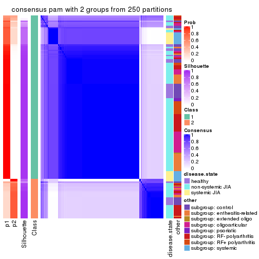</p>

</div>
<div id='tab-CV-pam-consensus-heatmap-2'>
<pre><code class="r">consensus_heatmap(res, k = 3)
</code></pre>

<p></p>

</div>
<div id='tab-CV-pam-consensus-heatmap-3'>
<pre><code class="r">consensus_heatmap(res, k = 4)
</code></pre>

<p></p>

</div>
<div id='tab-CV-pam-consensus-heatmap-4'>
<pre><code class="r">consensus_heatmap(res, k = 5)
</code></pre>

<p></p>

</div>
<div id='tab-CV-pam-consensus-heatmap-5'>
<pre><code class="r">consensus_heatmap(res, k = 6)
</code></pre>

<p></p>

</div>
</div>

Heatmaps for the membership of samples in all partitions to see how consistent they are:


<script>
$( function() {
	$( '#tabs-CV-pam-membership-heatmap' ).tabs();
} );
</script>
<div id='tabs-CV-pam-membership-heatmap'>
<ul>
<li><a href='#tab-CV-pam-membership-heatmap-1'>k = 2</a></li>
<li><a href='#tab-CV-pam-membership-heatmap-2'>k = 3</a></li>
<li><a href='#tab-CV-pam-membership-heatmap-3'>k = 4</a></li>
<li><a href='#tab-CV-pam-membership-heatmap-4'>k = 5</a></li>
<li><a href='#tab-CV-pam-membership-heatmap-5'>k = 6</a></li>
</ul>
<div id='tab-CV-pam-membership-heatmap-1'>
<pre><code class="r">membership_heatmap(res, k = 2)
</code></pre>

<p></p>

</div>
<div id='tab-CV-pam-membership-heatmap-2'>
<pre><code class="r">membership_heatmap(res, k = 3)
</code></pre>

<p></p>

</div>
<div id='tab-CV-pam-membership-heatmap-3'>
<pre><code class="r">membership_heatmap(res, k = 4)
</code></pre>

<p></p>

</div>
<div id='tab-CV-pam-membership-heatmap-4'>
<pre><code class="r">membership_heatmap(res, k = 5)
</code></pre>

<p></p>

</div>
<div id='tab-CV-pam-membership-heatmap-5'>
<pre><code class="r">membership_heatmap(res, k = 6)
</code></pre>

<p></p>

</div>
</div>

As soon as we have had the classes for columns, we can look for signatures
which are significantly different between classes which can be candidate marks
for certain classes. Following are the heatmaps for signatures.


Signature heatmaps where rows are scaled:


<script>
$( function() {
	$( '#tabs-CV-pam-get-signatures' ).tabs();
} );
</script>
<div id='tabs-CV-pam-get-signatures'>
<ul>
<li><a href='#tab-CV-pam-get-signatures-1'>k = 2</a></li>
<li><a href='#tab-CV-pam-get-signatures-2'>k = 3</a></li>
<li><a href='#tab-CV-pam-get-signatures-3'>k = 4</a></li>
<li><a href='#tab-CV-pam-get-signatures-4'>k = 5</a></li>
<li><a href='#tab-CV-pam-get-signatures-5'>k = 6</a></li>
</ul>
<div id='tab-CV-pam-get-signatures-1'>
<pre><code class="r">get_signatures(res, k = 2)
</code></pre>

<p></p>

</div>
<div id='tab-CV-pam-get-signatures-2'>
<pre><code class="r">get_signatures(res, k = 3)
</code></pre>

<p></p>

</div>
<div id='tab-CV-pam-get-signatures-3'>
<pre><code class="r">get_signatures(res, k = 4)
</code></pre>

<p></p>

</div>
<div id='tab-CV-pam-get-signatures-4'>
<pre><code class="r">get_signatures(res, k = 5)
</code></pre>

<p></p>

</div>
<div id='tab-CV-pam-get-signatures-5'>
<pre><code class="r">get_signatures(res, k = 6)
</code></pre>

<p></p>

</div>
</div>


Signature heatmaps where rows are not scaled:


<script>
$( function() {
	$( '#tabs-CV-pam-get-signatures-no-scale' ).tabs();
} );
</script>
<div id='tabs-CV-pam-get-signatures-no-scale'>
<ul>
<li><a href='#tab-CV-pam-get-signatures-no-scale-1'>k = 2</a></li>
<li><a href='#tab-CV-pam-get-signatures-no-scale-2'>k = 3</a></li>
<li><a href='#tab-CV-pam-get-signatures-no-scale-3'>k = 4</a></li>
<li><a href='#tab-CV-pam-get-signatures-no-scale-4'>k = 5</a></li>
<li><a href='#tab-CV-pam-get-signatures-no-scale-5'>k = 6</a></li>
</ul>
<div id='tab-CV-pam-get-signatures-no-scale-1'>
<pre><code class="r">get_signatures(res, k = 2, scale_rows = FALSE)
</code></pre>

<p></p>

</div>
<div id='tab-CV-pam-get-signatures-no-scale-2'>
<pre><code class="r">get_signatures(res, k = 3, scale_rows = FALSE)
</code></pre>

<p></p>

</div>
<div id='tab-CV-pam-get-signatures-no-scale-3'>
<pre><code class="r">get_signatures(res, k = 4, scale_rows = FALSE)
</code></pre>

<p></p>

</div>
<div id='tab-CV-pam-get-signatures-no-scale-4'>
<pre><code class="r">get_signatures(res, k = 5, scale_rows = FALSE)
</code></pre>

<p></p>

</div>
<div id='tab-CV-pam-get-signatures-no-scale-5'>
<pre><code class="r">get_signatures(res, k = 6, scale_rows = FALSE)
</code></pre>

<p></p>

</div>
</div>


Compare the overlap of signatures from different k:

```r
compare_signatures(res)
```


`get_signature()` returns a data frame invisibly. TO get the list of signatures, the function
call should be assigned to a variable explicitly. In following code, if `plot` argument is set
to `FALSE`, no heatmap is plotted while only the differential analysis is performed.

```r
# code only for demonstration
tb = get_signature(res, k = ..., plot = FALSE)
```

An example of the output of `tb` is:

```
#>   which_row         fdr    mean_1    mean_2 scaled_mean_1 scaled_mean_2 km
#> 1        38 0.042760348  8.373488  9.131774    -0.5533452     0.5164555  1
#> 2        40 0.018707592  7.106213  8.469186    -0.6173731     0.5762149  1
#> 3        55 0.019134737 10.221463 11.207825    -0.6159697     0.5749050  1
#> 4        59 0.006059896  5.921854  7.869574    -0.6899429     0.6439467  1
#> 5        60 0.018055526  8.928898 10.211722    -0.6204761     0.5791110  1
#> 6        98 0.009384629 15.714769 14.887706     0.6635654    -0.6193277  2
...
```

The columns in `tb` are:

1. `which_row`: row indices corresponding to the input matrix.
2. `fdr`: FDR for the differential test. 
3. `mean_x`: The mean value in group x.
4. `scaled_mean_x`: The mean value in group x after rows are scaled.
5. `km`: Row groups if k-means clustering is applied to rows.


UMAP plot which shows how samples are separated.


<script>
$( function() {
	$( '#tabs-CV-pam-dimension-reduction' ).tabs();
} );
</script>
<div id='tabs-CV-pam-dimension-reduction'>
<ul>
<li><a href='#tab-CV-pam-dimension-reduction-1'>k = 2</a></li>
<li><a href='#tab-CV-pam-dimension-reduction-2'>k = 3</a></li>
<li><a href='#tab-CV-pam-dimension-reduction-3'>k = 4</a></li>
<li><a href='#tab-CV-pam-dimension-reduction-4'>k = 5</a></li>
<li><a href='#tab-CV-pam-dimension-reduction-5'>k = 6</a></li>
</ul>
<div id='tab-CV-pam-dimension-reduction-1'>
<pre><code class="r">dimension_reduction(res, k = 2, method = &quot;UMAP&quot;)
</code></pre>

<p></p>

</div>
<div id='tab-CV-pam-dimension-reduction-2'>
<pre><code class="r">dimension_reduction(res, k = 3, method = &quot;UMAP&quot;)
</code></pre>

<p></p>

</div>
<div id='tab-CV-pam-dimension-reduction-3'>
<pre><code class="r">dimension_reduction(res, k = 4, method = &quot;UMAP&quot;)
</code></pre>

<p></p>

</div>
<div id='tab-CV-pam-dimension-reduction-4'>
<pre><code class="r">dimension_reduction(res, k = 5, method = &quot;UMAP&quot;)
</code></pre>

<p></p>

</div>
<div id='tab-CV-pam-dimension-reduction-5'>
<pre><code class="r">dimension_reduction(res, k = 6, method = &quot;UMAP&quot;)
</code></pre>

<p></p>

</div>
</div>


Following heatmap shows how subgroups are split when increasing `k`:

```r
collect_classes(res)
```


Test correlation between subgroups and known annotations. If the known
annotation is numeric, one-way ANOVA test is applied, and if the known
annotation is discrete, chi-squared contingency table test is applied.

```r
test_to_known_factors(res)
```

```
#>          n disease.state(p) other(p) k
#> CV:pam 149         5.45e-01 8.17e-02 2
#> CV:pam  82         1.83e-01 1.72e-02 3
#> CV:pam 131         2.26e-13 2.90e-10 4
#> CV:pam 125         1.18e-11 2.44e-09 5
#> CV:pam 120         3.16e-10 3.42e-08 6
```


If matrix rows can be associated to genes, consider to use `GO_Enrichment(res,
...)` to perform function enrichment for the signature genes.


 

---------------------------------------------------


### CV:mclust


The object with results only for a single top-value method and a single partition method 
can be extracted as:

```r
res = res_list["CV", "mclust"]
# you can also extract it by
# res = res_list["CV:mclust"]
```

A summary of `res` and all the functions that can be applied to it:

```r
res
```

```
#> A 'ConsensusPartition' object with k = 2, 3, 4, 5, 6.
#>   On a matrix with 51941 rows and 154 columns.
#>   Top rows (1000, 2000, 3000, 4000, 5000) are extracted by 'CV' method.
#>   Subgroups are detected by 'mclust' method.
#>   Performed in total 1250 partitions by row resampling.
#>   Best k for subgroups seems to be 2.
#> 
#> Following methods can be applied to this 'ConsensusPartition' object:
#>  [1] "cola_report"             "collect_classes"         "collect_plots"          
#>  [4] "collect_stats"           "colnames"                "compare_signatures"     
#>  [7] "consensus_heatmap"       "dimension_reduction"     "functional_enrichment"  
#> [10] "get_anno_col"            "get_anno"                "get_classes"            
#> [13] "get_consensus"           "get_matrix"              "get_membership"         
#> [16] "get_param"               "get_signatures"          "get_stats"              
#> [19] "is_best_k"               "is_stable_k"             "membership_heatmap"     
#> [22] "ncol"                    "nrow"                    "plot_ecdf"              
#> [25] "rownames"                "select_partition_number" "show"                   
#> [28] "suggest_best_k"          "test_to_known_factors"
```

`collect_plots()` function collects all the plots made from `res` for all `k` (number of partitions)
into one single page to provide an easy and fast comparison between different `k`.

```r
collect_plots(res)
```


The plots are:

- The first row: a plot of the ECDF (Empirical cumulative distribution
  function) curves of the consensus matrix for each `k` and the heatmap of
  predicted classes for each `k`.
- The second row: heatmaps of the consensus matrix for each `k`.
- The third row: heatmaps of the membership matrix for each `k`.
- The fouth row: heatmaps of the signatures for each `k`.

All the plots in panels can be made by individual functions and they are
plotted later in this section.

`select_partition_number()` produces several plots showing different
statistics for choosing "optimized" `k`. There are following statistics:

- ECDF curves of the consensus matrix for each `k`;
- 1-PAC. [The PAC
  score](https://en.wikipedia.org/wiki/Consensus_clustering#Over-interpretation_potential_of_consensus_clustering)
  measures the proportion of the ambiguous subgrouping.
- Mean silhouette score.
- Concordance. The mean probability of fiting the consensus class ids in all
  partitions.
- Area increased. Denote $A_k$ as the area under the ECDF curve for current
  `k`, the area increased is defined as $A_k - A_{k-1}$.
- Rand index. The percent of pairs of samples that are both in a same cluster
  or both are not in a same cluster in the partition of k and k-1.
- Jaccard index. The ratio of pairs of samples are both in a same cluster in
  the partition of k and k-1 and the pairs of samples are both in a same
  cluster in the partition k or k-1.

The detailed explanations of these statistics can be found in [the cola
vignette](http://bioconductor.org/packages/devel/bioc/vignettes/cola/inst/doc/cola.html#toc_13).

Generally speaking, lower PAC score, higher mean silhouette score or higher
concordance corresponds to better partition. Rand index and Jaccard index
measure how similar the current partition is compared to partition with `k-1`.
If they are too similar, we won't accept `k` is better than `k-1`.

```r
select_partition_number(res)
```


The numeric values for all these statistics can be obtained by `get_stats()`.

```r
get_stats(res)
```

```
#>   k 1-PAC mean_silhouette concordance area_increased  Rand Jaccard
#> 2 2 0.775           0.884       0.945         0.4947 0.497   0.497
#> 3 3 0.618           0.668       0.832         0.1903 0.745   0.561
#> 4 4 0.554           0.708       0.758         0.1525 0.887   0.737
#> 5 5 0.594           0.566       0.749         0.0521 0.842   0.555
#> 6 6 0.662           0.465       0.709         0.0492 0.916   0.665
```

`suggest_best_k()` suggests the best $k$ based on these statistics. The rules are as follows:

- All $k$ with Jaccard index larger than 0.95 are removed because the increase of
  the partition number does not provides enough extra information. If all $k$ are removed,
  the best $k$ is assigned by `NA`.
- For $k$ with 1-PAC larger than 0.9, the maximal $k$ is taken as the "best k". Other $k$ is called "optional k".
- If it does not fit the second rule. The $k$ with the highest vote of highest
  1-PAC, mean silhouette and concordance is taken as the "best k".

```r
suggest_best_k(res)
```

```
#> [1] 2
```


Following shows the table of the partitions (You need to click the **show/hide
code output** link to see it). The membership matrix (columns with name `p*`)
is inferred by
[`clue::cl_consensus()`](https://www.rdocumentation.org/link/cl_consensus?package=clue)
function with the `SE` method. Basically the value in the membership matrix
represents the probability to belong to a certain group. The finall class
label for an item is determined with the group with highest probability it
belongs to.

In `get_classes()` function, the entropy is calculated from the membership
matrix and the silhouette score is calculated from the consensus matrix.


<script>
$( function() {
	$( '#tabs-CV-mclust-get-classes' ).tabs();
} );
</script>
<div id='tabs-CV-mclust-get-classes'>
<ul>
<li><a href='#tab-CV-mclust-get-classes-1'>k = 2</a></li>
<li><a href='#tab-CV-mclust-get-classes-2'>k = 3</a></li>
<li><a href='#tab-CV-mclust-get-classes-3'>k = 4</a></li>
<li><a href='#tab-CV-mclust-get-classes-4'>k = 5</a></li>
<li><a href='#tab-CV-mclust-get-classes-5'>k = 6</a></li>
</ul>

<div id='tab-CV-mclust-get-classes-1'>
<p><a id='tab-CV-mclust-get-classes-1-a' style='color:#0366d6' href='#'>show/hide code output</a></p>
<pre><code class="r">cbind(get_classes(res, k = 2), get_membership(res, k = 2))
</code></pre>

<pre><code>#&gt;           class entropy silhouette    p1    p2
#&gt; GSM340358     2  0.9710      0.475 0.400 0.600
#&gt; GSM340359     2  0.0000      0.896 0.000 1.000
#&gt; GSM340361     1  0.0000      0.985 1.000 0.000
#&gt; GSM340362     1  0.0000      0.985 1.000 0.000
#&gt; GSM340363     1  0.6531      0.758 0.832 0.168
#&gt; GSM340364     2  0.0000      0.896 0.000 1.000
#&gt; GSM340365     1  0.0000      0.985 1.000 0.000
#&gt; GSM340366     1  0.0000      0.985 1.000 0.000
#&gt; GSM340367     2  0.9710      0.475 0.400 0.600
#&gt; GSM340368     2  0.0000      0.896 0.000 1.000
#&gt; GSM340369     2  0.7745      0.725 0.228 0.772
#&gt; GSM340370     2  0.0000      0.896 0.000 1.000
#&gt; GSM340371     1  0.0000      0.985 1.000 0.000
#&gt; GSM340372     2  0.9710      0.475 0.400 0.600
#&gt; GSM340373     2  0.9710      0.475 0.400 0.600
#&gt; GSM340375     2  0.0000      0.896 0.000 1.000
#&gt; GSM340376     2  0.0000      0.896 0.000 1.000
#&gt; GSM340378     2  0.0000      0.896 0.000 1.000
#&gt; GSM340243     1  0.0000      0.985 1.000 0.000
#&gt; GSM340244     2  0.0000      0.896 0.000 1.000
#&gt; GSM340246     2  0.0000      0.896 0.000 1.000
#&gt; GSM340247     2  0.0000      0.896 0.000 1.000
#&gt; GSM340248     2  0.0000      0.896 0.000 1.000
#&gt; GSM340249     2  0.0000      0.896 0.000 1.000
#&gt; GSM340250     1  0.0000      0.985 1.000 0.000
#&gt; GSM340251     2  0.0000      0.896 0.000 1.000
#&gt; GSM340252     2  0.0000      0.896 0.000 1.000
#&gt; GSM340253     2  0.0000      0.896 0.000 1.000
#&gt; GSM340254     2  0.0000      0.896 0.000 1.000
#&gt; GSM340256     2  0.0000      0.896 0.000 1.000
#&gt; GSM340258     2  0.9944      0.205 0.456 0.544
#&gt; GSM340259     1  0.0000      0.985 1.000 0.000
#&gt; GSM340260     1  0.0000      0.985 1.000 0.000
#&gt; GSM340261     1  0.0000      0.985 1.000 0.000
#&gt; GSM340262     1  0.0000      0.985 1.000 0.000
#&gt; GSM340263     2  0.0000      0.896 0.000 1.000
#&gt; GSM340264     1  0.0000      0.985 1.000 0.000
#&gt; GSM340265     1  0.8207      0.603 0.744 0.256
#&gt; GSM340266     1  0.0000      0.985 1.000 0.000
#&gt; GSM340267     1  0.8207      0.624 0.744 0.256
#&gt; GSM340268     1  0.0000      0.985 1.000 0.000
#&gt; GSM340269     1  0.0000      0.985 1.000 0.000
#&gt; GSM340270     1  0.0000      0.985 1.000 0.000
#&gt; GSM537574     2  0.2603      0.867 0.044 0.956
#&gt; GSM537580     1  0.0000      0.985 1.000 0.000
#&gt; GSM537581     2  0.8955      0.631 0.312 0.688
#&gt; GSM340272     1  0.0000      0.985 1.000 0.000
#&gt; GSM340273     2  0.0000      0.896 0.000 1.000
#&gt; GSM340275     2  0.0000      0.896 0.000 1.000
#&gt; GSM340276     1  0.0000      0.985 1.000 0.000
#&gt; GSM340277     2  0.0000      0.896 0.000 1.000
#&gt; GSM340278     1  0.0000      0.985 1.000 0.000
#&gt; GSM340279     1  0.0000      0.985 1.000 0.000
#&gt; GSM340282     1  0.0000      0.985 1.000 0.000
#&gt; GSM340284     2  0.0000      0.896 0.000 1.000
#&gt; GSM340285     1  0.0000      0.985 1.000 0.000
#&gt; GSM340286     1  0.0000      0.985 1.000 0.000
#&gt; GSM340287     1  0.0000      0.985 1.000 0.000
#&gt; GSM340288     1  0.0000      0.985 1.000 0.000
#&gt; GSM340289     1  0.0000      0.985 1.000 0.000
#&gt; GSM340290     1  0.0000      0.985 1.000 0.000
#&gt; GSM340291     2  0.0000      0.896 0.000 1.000
#&gt; GSM340293     1  0.0000      0.985 1.000 0.000
#&gt; GSM340294     1  0.0000      0.985 1.000 0.000
#&gt; GSM340296     1  0.0000      0.985 1.000 0.000
#&gt; GSM340297     1  0.0000      0.985 1.000 0.000
#&gt; GSM340298     1  0.0000      0.985 1.000 0.000
#&gt; GSM340299     1  0.0000      0.985 1.000 0.000
#&gt; GSM340301     1  0.0000      0.985 1.000 0.000
#&gt; GSM340303     2  0.9732      0.380 0.404 0.596
#&gt; GSM340304     1  0.0000      0.985 1.000 0.000
#&gt; GSM340306     2  0.0672      0.891 0.008 0.992
#&gt; GSM340307     2  0.0000      0.896 0.000 1.000
#&gt; GSM340310     2  0.9710      0.475 0.400 0.600
#&gt; GSM340314     1  0.0000      0.985 1.000 0.000
#&gt; GSM340315     1  0.0376      0.981 0.996 0.004
#&gt; GSM340317     2  0.0000      0.896 0.000 1.000
#&gt; GSM340318     2  0.0000      0.896 0.000 1.000
#&gt; GSM340319     2  0.0000      0.896 0.000 1.000
#&gt; GSM340320     2  0.9635      0.503 0.388 0.612
#&gt; GSM340321     2  0.0000      0.896 0.000 1.000
#&gt; GSM340322     2  0.8661      0.662 0.288 0.712
#&gt; GSM340324     2  0.0000      0.896 0.000 1.000
#&gt; GSM340328     2  0.9661      0.492 0.392 0.608
#&gt; GSM340330     1  0.0000      0.985 1.000 0.000
#&gt; GSM340332     2  0.8813      0.647 0.300 0.700
#&gt; GSM340333     2  0.0000      0.896 0.000 1.000
#&gt; GSM340336     2  0.0000      0.896 0.000 1.000
#&gt; GSM340337     2  0.8813      0.647 0.300 0.700
#&gt; GSM340338     1  0.0000      0.985 1.000 0.000
#&gt; GSM340339     2  0.8661      0.662 0.288 0.712
#&gt; GSM340340     2  0.0000      0.896 0.000 1.000
#&gt; GSM340341     2  0.0000      0.896 0.000 1.000
#&gt; GSM340343     2  0.8813      0.647 0.300 0.700
#&gt; GSM340344     2  0.0000      0.896 0.000 1.000
#&gt; GSM340346     1  0.0000      0.985 1.000 0.000
#&gt; GSM340347     2  0.0000      0.896 0.000 1.000
#&gt; GSM340348     2  0.9661      0.494 0.392 0.608
#&gt; GSM340349     1  0.0000      0.985 1.000 0.000
#&gt; GSM340350     1  0.0000      0.985 1.000 0.000
#&gt; GSM340351     1  0.0000      0.985 1.000 0.000
#&gt; GSM340354     1  0.8386      0.603 0.732 0.268
#&gt; GSM340356     2  0.0000      0.896 0.000 1.000
#&gt; GSM340357     1  0.0000      0.985 1.000 0.000
#&gt; GSM348183     1  0.0938      0.973 0.988 0.012
#&gt; GSM348191     1  0.0000      0.985 1.000 0.000
#&gt; GSM348193     2  0.8861      0.642 0.304 0.696
#&gt; GSM537578     1  0.0000      0.985 1.000 0.000
#&gt; GSM348181     1  0.0000      0.985 1.000 0.000
#&gt; GSM348182     1  0.0000      0.985 1.000 0.000
#&gt; GSM348184     2  0.0000      0.896 0.000 1.000
#&gt; GSM348185     2  0.0000      0.896 0.000 1.000
#&gt; GSM348186     2  0.0000      0.896 0.000 1.000
#&gt; GSM348187     1  0.0000      0.985 1.000 0.000
#&gt; GSM348188     2  0.8861      0.642 0.304 0.696
#&gt; GSM348189     1  0.0000      0.985 1.000 0.000
#&gt; GSM348190     1  0.0000      0.985 1.000 0.000
#&gt; GSM348194     1  0.0000      0.985 1.000 0.000
#&gt; GSM348195     1  0.0000      0.985 1.000 0.000
#&gt; GSM348196     1  0.0000      0.985 1.000 0.000
#&gt; GSM537585     1  0.0000      0.985 1.000 0.000
#&gt; GSM537594     2  0.0000      0.896 0.000 1.000
#&gt; GSM537596     1  0.0000      0.985 1.000 0.000
#&gt; GSM537597     2  0.5946      0.783 0.144 0.856
#&gt; GSM537602     1  0.0000      0.985 1.000 0.000
#&gt; GSM340184     1  0.0000      0.985 1.000 0.000
#&gt; GSM340185     2  0.0000      0.896 0.000 1.000
#&gt; GSM340186     2  0.0000      0.896 0.000 1.000
#&gt; GSM340187     2  0.0000      0.896 0.000 1.000
#&gt; GSM340189     2  0.8813      0.647 0.300 0.700
#&gt; GSM340190     2  0.0000      0.896 0.000 1.000
#&gt; GSM340191     1  0.0000      0.985 1.000 0.000
#&gt; GSM340192     2  0.0000      0.896 0.000 1.000
#&gt; GSM340193     1  0.0000      0.985 1.000 0.000
#&gt; GSM340194     1  0.0000      0.985 1.000 0.000
#&gt; GSM340195     1  0.0000      0.985 1.000 0.000
#&gt; GSM340196     2  0.0000      0.896 0.000 1.000
#&gt; GSM340197     1  0.0000      0.985 1.000 0.000
#&gt; GSM340198     2  0.0000      0.896 0.000 1.000
#&gt; GSM340199     1  0.0000      0.985 1.000 0.000
#&gt; GSM340200     2  0.0000      0.896 0.000 1.000
#&gt; GSM340201     2  0.0000      0.896 0.000 1.000
#&gt; GSM340202     2  0.0000      0.896 0.000 1.000
#&gt; GSM340203     2  0.9087      0.614 0.324 0.676
#&gt; GSM340204     2  0.0000      0.896 0.000 1.000
#&gt; GSM340205     1  0.1414      0.964 0.980 0.020
#&gt; GSM340206     1  0.0000      0.985 1.000 0.000
#&gt; GSM340207     1  0.0000      0.985 1.000 0.000
#&gt; GSM340237     2  0.0000      0.896 0.000 1.000
#&gt; GSM340238     1  0.0000      0.985 1.000 0.000
#&gt; GSM340239     1  0.0000      0.985 1.000 0.000
#&gt; GSM340240     1  0.0000      0.985 1.000 0.000
#&gt; GSM340241     2  0.0000      0.896 0.000 1.000
#&gt; GSM340242     1  0.0000      0.985 1.000 0.000
</code></pre>

<script>
$('#tab-CV-mclust-get-classes-1-a').parent().next().next().hide();
$('#tab-CV-mclust-get-classes-1-a').click(function(){
  $('#tab-CV-mclust-get-classes-1-a').parent().next().next().toggle();
  return(false);
});
</script>
</div>

<div id='tab-CV-mclust-get-classes-2'>
<p><a id='tab-CV-mclust-get-classes-2-a' style='color:#0366d6' href='#'>show/hide code output</a></p>
<pre><code class="r">cbind(get_classes(res, k = 3), get_membership(res, k = 3))
</code></pre>

<pre><code>#&gt;           class entropy silhouette    p1    p2    p3
#&gt; GSM340358     3  0.9030     0.4772 0.388 0.136 0.476
#&gt; GSM340359     3  0.5948     0.3251 0.000 0.360 0.640
#&gt; GSM340361     1  0.1129     0.8719 0.976 0.004 0.020
#&gt; GSM340362     1  0.1031     0.8722 0.976 0.000 0.024
#&gt; GSM340363     1  0.1453     0.8647 0.968 0.008 0.024
#&gt; GSM340364     3  0.5905     0.3415 0.000 0.352 0.648
#&gt; GSM340365     1  0.1031     0.8722 0.976 0.000 0.024
#&gt; GSM340366     1  0.1031     0.8722 0.976 0.000 0.024
#&gt; GSM340367     3  0.8951     0.4567 0.396 0.128 0.476
#&gt; GSM340368     3  0.5678     0.4866 0.000 0.316 0.684
#&gt; GSM340369     3  0.8939     0.5517 0.340 0.140 0.520
#&gt; GSM340370     3  0.4555     0.5182 0.000 0.200 0.800
#&gt; GSM340371     1  0.2066     0.8701 0.940 0.000 0.060
#&gt; GSM340372     3  0.9014     0.4920 0.380 0.136 0.484
#&gt; GSM340373     3  0.9030     0.4772 0.388 0.136 0.476
#&gt; GSM340375     3  0.4555     0.5182 0.000 0.200 0.800
#&gt; GSM340376     3  0.4555     0.5182 0.000 0.200 0.800
#&gt; GSM340378     3  0.5497     0.4394 0.000 0.292 0.708
#&gt; GSM340243     1  0.1031     0.8722 0.976 0.000 0.024
#&gt; GSM340244     2  0.0237     0.8039 0.000 0.996 0.004
#&gt; GSM340246     2  0.0000     0.8050 0.000 1.000 0.000
#&gt; GSM340247     3  0.6267     0.3685 0.000 0.452 0.548
#&gt; GSM340248     2  0.0000     0.8050 0.000 1.000 0.000
#&gt; GSM340249     2  0.5926     0.0940 0.000 0.644 0.356
#&gt; GSM340250     1  0.1031     0.8722 0.976 0.000 0.024
#&gt; GSM340251     2  0.0237     0.8030 0.000 0.996 0.004
#&gt; GSM340252     2  0.5178     0.3724 0.000 0.744 0.256
#&gt; GSM340253     2  0.2261     0.7761 0.000 0.932 0.068
#&gt; GSM340254     2  0.0000     0.8050 0.000 1.000 0.000
#&gt; GSM340256     2  0.0237     0.8039 0.000 0.996 0.004
#&gt; GSM340258     2  0.6867     0.5909 0.040 0.672 0.288
#&gt; GSM340259     1  0.1753     0.8714 0.952 0.000 0.048
#&gt; GSM340260     1  0.1031     0.8722 0.976 0.000 0.024
#&gt; GSM340261     1  0.1964     0.8715 0.944 0.000 0.056
#&gt; GSM340262     1  0.2261     0.8664 0.932 0.000 0.068
#&gt; GSM340263     2  0.0237     0.8039 0.000 0.996 0.004
#&gt; GSM340264     1  0.1753     0.8735 0.952 0.000 0.048
#&gt; GSM340265     2  0.8996     0.3303 0.196 0.560 0.244
#&gt; GSM340266     1  0.1964     0.8715 0.944 0.000 0.056
#&gt; GSM340267     2  0.7742     0.5373 0.080 0.632 0.288
#&gt; GSM340268     1  0.1860     0.8718 0.948 0.000 0.052
#&gt; GSM340269     1  0.3879     0.7859 0.848 0.000 0.152
#&gt; GSM340270     1  0.0592     0.8742 0.988 0.000 0.012
#&gt; GSM537574     2  0.5623     0.6349 0.004 0.716 0.280
#&gt; GSM537580     1  0.3482     0.8191 0.872 0.000 0.128
#&gt; GSM537581     1  0.7396    -0.2357 0.488 0.032 0.480
#&gt; GSM340272     1  0.1031     0.8722 0.976 0.000 0.024
#&gt; GSM340273     2  0.0237     0.8039 0.000 0.996 0.004
#&gt; GSM340275     3  0.6274     0.3657 0.000 0.456 0.544
#&gt; GSM340276     1  0.1964     0.8715 0.944 0.000 0.056
#&gt; GSM340277     2  0.0000     0.8050 0.000 1.000 0.000
#&gt; GSM340278     1  0.1529     0.8744 0.960 0.000 0.040
#&gt; GSM340279     1  0.1860     0.8726 0.948 0.000 0.052
#&gt; GSM340282     1  0.1411     0.8745 0.964 0.000 0.036
#&gt; GSM340284     2  0.0000     0.8050 0.000 1.000 0.000
#&gt; GSM340285     1  0.0237     0.8738 0.996 0.000 0.004
#&gt; GSM340286     1  0.2165     0.8683 0.936 0.000 0.064
#&gt; GSM340287     1  0.2066     0.8675 0.940 0.000 0.060
#&gt; GSM340288     1  0.1031     0.8722 0.976 0.000 0.024
#&gt; GSM340289     1  0.0747     0.8726 0.984 0.000 0.016
#&gt; GSM340290     1  0.0592     0.8737 0.988 0.000 0.012
#&gt; GSM340291     2  0.0237     0.8039 0.000 0.996 0.004
#&gt; GSM340293     1  0.3502     0.7871 0.896 0.084 0.020
#&gt; GSM340294     1  0.1964     0.8715 0.944 0.000 0.056
#&gt; GSM340296     1  0.1031     0.8722 0.976 0.000 0.024
#&gt; GSM340297     1  0.0747     0.8727 0.984 0.000 0.016
#&gt; GSM340298     1  0.1031     0.8722 0.976 0.000 0.024
#&gt; GSM340299     1  0.1964     0.8715 0.944 0.000 0.056
#&gt; GSM340301     1  0.1964     0.8715 0.944 0.000 0.056
#&gt; GSM340303     2  0.7188     0.5797 0.056 0.664 0.280
#&gt; GSM340304     1  0.0747     0.8727 0.984 0.000 0.016
#&gt; GSM340306     3  0.9141     0.5945 0.244 0.212 0.544
#&gt; GSM340307     2  0.2537     0.7694 0.000 0.920 0.080
#&gt; GSM340310     3  0.9030     0.4772 0.388 0.136 0.476
#&gt; GSM340314     1  0.1129     0.8738 0.976 0.004 0.020
#&gt; GSM340315     1  0.2313     0.8473 0.944 0.032 0.024
#&gt; GSM340317     2  0.5835     0.1594 0.000 0.660 0.340
#&gt; GSM340318     3  0.8948     0.6099 0.188 0.248 0.564
#&gt; GSM340319     3  0.8948     0.6099 0.188 0.248 0.564
#&gt; GSM340320     1  0.7004     0.5113 0.728 0.160 0.112
#&gt; GSM340321     2  0.0000     0.8050 0.000 1.000 0.000
#&gt; GSM340322     1  0.9213    -0.2426 0.484 0.160 0.356
#&gt; GSM340324     2  0.3816     0.6590 0.000 0.852 0.148
#&gt; GSM340328     3  0.9030     0.4772 0.388 0.136 0.476
#&gt; GSM340330     1  0.2165     0.8683 0.936 0.000 0.064
#&gt; GSM340332     1  0.9148    -0.1815 0.504 0.160 0.336
#&gt; GSM340333     2  0.2261     0.7761 0.000 0.932 0.068
#&gt; GSM340336     3  0.6274     0.3657 0.000 0.456 0.544
#&gt; GSM340337     1  0.9201    -0.2303 0.488 0.160 0.352
#&gt; GSM340338     1  0.0237     0.8733 0.996 0.000 0.004
#&gt; GSM340339     1  0.9201    -0.2303 0.488 0.160 0.352
#&gt; GSM340340     3  0.5678     0.4866 0.000 0.316 0.684
#&gt; GSM340341     2  0.6168    -0.0986 0.000 0.588 0.412
#&gt; GSM340343     1  0.9189    -0.2185 0.492 0.160 0.348
#&gt; GSM340344     2  0.4931     0.6789 0.000 0.768 0.232
#&gt; GSM340346     1  0.1964     0.8715 0.944 0.000 0.056
#&gt; GSM340347     3  0.8948     0.6099 0.188 0.248 0.564
#&gt; GSM340348     1  0.8199     0.2923 0.640 0.160 0.200
#&gt; GSM340349     1  0.1031     0.8722 0.976 0.000 0.024
#&gt; GSM340350     1  0.1031     0.8722 0.976 0.000 0.024
#&gt; GSM340351     1  0.1031     0.8722 0.976 0.000 0.024
#&gt; GSM340354     2  0.7889     0.5267 0.088 0.624 0.288
#&gt; GSM340356     2  0.0237     0.8039 0.000 0.996 0.004
#&gt; GSM340357     1  0.1031     0.8722 0.976 0.000 0.024
#&gt; GSM348183     1  0.1919     0.8587 0.956 0.024 0.020
#&gt; GSM348191     1  0.2066     0.8701 0.940 0.000 0.060
#&gt; GSM348193     1  0.9411    -0.3564 0.444 0.176 0.380
#&gt; GSM537578     1  0.1031     0.8722 0.976 0.000 0.024
#&gt; GSM348181     1  0.0592     0.8724 0.988 0.000 0.012
#&gt; GSM348182     1  0.1529     0.8744 0.960 0.000 0.040
#&gt; GSM348184     2  0.0000     0.8050 0.000 1.000 0.000
#&gt; GSM348185     2  0.6309    -0.2972 0.000 0.504 0.496
#&gt; GSM348186     2  0.0000     0.8050 0.000 1.000 0.000
#&gt; GSM348187     1  0.1031     0.8722 0.976 0.000 0.024
#&gt; GSM348188     1  0.9189    -0.2185 0.492 0.160 0.348
#&gt; GSM348189     1  0.3340     0.8268 0.880 0.000 0.120
#&gt; GSM348190     1  0.1964     0.8715 0.944 0.000 0.056
#&gt; GSM348194     1  0.1031     0.8722 0.976 0.000 0.024
#&gt; GSM348195     1  0.1031     0.8722 0.976 0.000 0.024
#&gt; GSM348196     1  0.1031     0.8722 0.976 0.000 0.024
#&gt; GSM537585     1  0.1031     0.8722 0.976 0.000 0.024
#&gt; GSM537594     2  0.0237     0.8039 0.000 0.996 0.004
#&gt; GSM537596     1  0.0424     0.8737 0.992 0.000 0.008
#&gt; GSM537597     2  0.4629     0.7059 0.004 0.808 0.188
#&gt; GSM537602     1  0.1031     0.8722 0.976 0.000 0.024
#&gt; GSM340184     1  0.2448     0.8592 0.924 0.000 0.076
#&gt; GSM340185     2  0.0000     0.8050 0.000 1.000 0.000
#&gt; GSM340186     2  0.0000     0.8050 0.000 1.000 0.000
#&gt; GSM340187     2  0.6204    -0.1302 0.000 0.576 0.424
#&gt; GSM340189     1  0.9201    -0.2303 0.488 0.160 0.352
#&gt; GSM340190     2  0.0000     0.8050 0.000 1.000 0.000
#&gt; GSM340191     1  0.1964     0.8715 0.944 0.000 0.056
#&gt; GSM340192     2  0.4887     0.6814 0.000 0.772 0.228
#&gt; GSM340193     1  0.1753     0.8714 0.952 0.000 0.048
#&gt; GSM340194     1  0.2356     0.8643 0.928 0.000 0.072
#&gt; GSM340195     1  0.1964     0.8715 0.944 0.000 0.056
#&gt; GSM340196     3  0.8948     0.6099 0.188 0.248 0.564
#&gt; GSM340197     1  0.1964     0.8715 0.944 0.000 0.056
#&gt; GSM340198     2  0.0000     0.8050 0.000 1.000 0.000
#&gt; GSM340199     1  0.0592     0.8721 0.988 0.000 0.012
#&gt; GSM340200     2  0.0237     0.8039 0.000 0.996 0.004
#&gt; GSM340201     3  0.8917     0.6120 0.188 0.244 0.568
#&gt; GSM340202     3  0.8821     0.6163 0.188 0.232 0.580
#&gt; GSM340203     1  0.8371     0.2374 0.624 0.164 0.212
#&gt; GSM340204     2  0.5254     0.6538 0.000 0.736 0.264
#&gt; GSM340205     1  0.1315     0.8706 0.972 0.008 0.020
#&gt; GSM340206     1  0.1860     0.8703 0.948 0.000 0.052
#&gt; GSM340207     1  0.2261     0.8666 0.932 0.000 0.068
#&gt; GSM340237     2  0.3941     0.6524 0.000 0.844 0.156
#&gt; GSM340238     1  0.1964     0.8715 0.944 0.000 0.056
#&gt; GSM340239     1  0.1964     0.8715 0.944 0.000 0.056
#&gt; GSM340240     1  0.1964     0.8715 0.944 0.000 0.056
#&gt; GSM340241     2  0.0000     0.8050 0.000 1.000 0.000
#&gt; GSM340242     1  0.2711     0.8540 0.912 0.000 0.088
</code></pre>

<script>
$('#tab-CV-mclust-get-classes-2-a').parent().next().next().hide();
$('#tab-CV-mclust-get-classes-2-a').click(function(){
  $('#tab-CV-mclust-get-classes-2-a').parent().next().next().toggle();
  return(false);
});
</script>
</div>

<div id='tab-CV-mclust-get-classes-3'>
<p><a id='tab-CV-mclust-get-classes-3-a' style='color:#0366d6' href='#'>show/hide code output</a></p>
<pre><code class="r">cbind(get_classes(res, k = 4), get_membership(res, k = 4))
</code></pre>

<pre><code>#&gt;           class entropy silhouette    p1    p2    p3    p4
#&gt; GSM340358     1  0.6992     0.6187 0.564 0.000 0.156 0.280
#&gt; GSM340359     1  0.5235     0.6513 0.716 0.048 0.000 0.236
#&gt; GSM340361     3  0.6457     0.7280 0.156 0.000 0.644 0.200
#&gt; GSM340362     3  0.4544     0.8160 0.048 0.000 0.788 0.164
#&gt; GSM340363     3  0.5408     0.4551 0.008 0.004 0.556 0.432
#&gt; GSM340364     1  0.5156     0.6540 0.720 0.044 0.000 0.236
#&gt; GSM340365     3  0.5637     0.7842 0.112 0.000 0.720 0.168
#&gt; GSM340366     3  0.5637     0.7842 0.112 0.000 0.720 0.168
#&gt; GSM340367     1  0.7660     0.4836 0.464 0.000 0.276 0.260
#&gt; GSM340368     4  0.7663    -0.1863 0.380 0.212 0.000 0.408
#&gt; GSM340369     4  0.6539    -0.0642 0.348 0.008 0.068 0.576
#&gt; GSM340370     1  0.4295     0.6658 0.752 0.008 0.000 0.240
#&gt; GSM340371     3  0.0524     0.8424 0.004 0.000 0.988 0.008
#&gt; GSM340372     1  0.7442     0.5653 0.504 0.000 0.212 0.284
#&gt; GSM340373     1  0.7645     0.5005 0.468 0.000 0.268 0.264
#&gt; GSM340375     1  0.4295     0.6658 0.752 0.008 0.000 0.240
#&gt; GSM340376     1  0.4295     0.6658 0.752 0.008 0.000 0.240
#&gt; GSM340378     1  0.5156     0.6540 0.720 0.044 0.000 0.236
#&gt; GSM340243     3  0.6149     0.7572 0.144 0.000 0.676 0.180
#&gt; GSM340244     2  0.0592     0.8444 0.016 0.984 0.000 0.000
#&gt; GSM340246     2  0.0000     0.8460 0.000 1.000 0.000 0.000
#&gt; GSM340247     4  0.7315     0.2139 0.216 0.252 0.000 0.532
#&gt; GSM340248     2  0.0000     0.8460 0.000 1.000 0.000 0.000
#&gt; GSM340249     2  0.6050     0.4684 0.112 0.676 0.000 0.212
#&gt; GSM340250     3  0.5690     0.7824 0.116 0.000 0.716 0.168
#&gt; GSM340251     2  0.1888     0.8244 0.044 0.940 0.000 0.016
#&gt; GSM340252     2  0.5593     0.5138 0.080 0.708 0.000 0.212
#&gt; GSM340253     2  0.1302     0.8341 0.044 0.956 0.000 0.000
#&gt; GSM340254     2  0.0000     0.8460 0.000 1.000 0.000 0.000
#&gt; GSM340256     2  0.0469     0.8452 0.012 0.988 0.000 0.000
#&gt; GSM340258     2  0.6955     0.5435 0.204 0.616 0.172 0.008
#&gt; GSM340259     3  0.0524     0.8431 0.004 0.000 0.988 0.008
#&gt; GSM340260     3  0.4944     0.8119 0.072 0.000 0.768 0.160
#&gt; GSM340261     3  0.0188     0.8440 0.000 0.000 0.996 0.004
#&gt; GSM340262     3  0.0672     0.8429 0.008 0.000 0.984 0.008
#&gt; GSM340263     2  0.1209     0.8385 0.032 0.964 0.000 0.004
#&gt; GSM340264     3  0.0188     0.8440 0.004 0.000 0.996 0.000
#&gt; GSM340265     2  0.7308     0.2456 0.124 0.496 0.372 0.008
#&gt; GSM340266     3  0.0336     0.8435 0.008 0.000 0.992 0.000
#&gt; GSM340267     2  0.7455     0.3607 0.168 0.532 0.292 0.008
#&gt; GSM340268     3  0.1256     0.8359 0.028 0.000 0.964 0.008
#&gt; GSM340269     3  0.1584     0.8239 0.036 0.000 0.952 0.012
#&gt; GSM340270     3  0.3948     0.8296 0.036 0.000 0.828 0.136
#&gt; GSM537574     2  0.5152     0.7062 0.204 0.748 0.036 0.012
#&gt; GSM537580     3  0.1059     0.8367 0.016 0.000 0.972 0.012
#&gt; GSM537581     4  0.4524     0.5618 0.052 0.012 0.120 0.816
#&gt; GSM340272     3  0.5412     0.7928 0.096 0.000 0.736 0.168
#&gt; GSM340273     2  0.1389     0.8304 0.048 0.952 0.000 0.000
#&gt; GSM340275     4  0.7385     0.2029 0.196 0.296 0.000 0.508
#&gt; GSM340276     3  0.0657     0.8417 0.004 0.000 0.984 0.012
#&gt; GSM340277     2  0.0000     0.8460 0.000 1.000 0.000 0.000
#&gt; GSM340278     3  0.1510     0.8456 0.028 0.000 0.956 0.016
#&gt; GSM340279     3  0.0672     0.8419 0.008 0.000 0.984 0.008
#&gt; GSM340282     3  0.1256     0.8468 0.008 0.000 0.964 0.028
#&gt; GSM340284     2  0.0524     0.8454 0.004 0.988 0.000 0.008
#&gt; GSM340285     3  0.4379     0.8103 0.036 0.000 0.792 0.172
#&gt; GSM340286     3  0.0804     0.8400 0.008 0.000 0.980 0.012
#&gt; GSM340287     3  0.1004     0.8352 0.024 0.000 0.972 0.004
#&gt; GSM340288     3  0.6924     0.6669 0.180 0.000 0.588 0.232
#&gt; GSM340289     3  0.4578     0.8145 0.052 0.000 0.788 0.160
#&gt; GSM340290     3  0.3015     0.8386 0.024 0.000 0.884 0.092
#&gt; GSM340291     2  0.0592     0.8444 0.016 0.984 0.000 0.000
#&gt; GSM340293     3  0.4872     0.7899 0.024 0.012 0.760 0.204
#&gt; GSM340294     3  0.0804     0.8400 0.008 0.000 0.980 0.012
#&gt; GSM340296     3  0.6245     0.7511 0.164 0.000 0.668 0.168
#&gt; GSM340297     3  0.4105     0.8197 0.032 0.000 0.812 0.156
#&gt; GSM340298     3  0.6119     0.7601 0.152 0.000 0.680 0.168
#&gt; GSM340299     3  0.0672     0.8429 0.008 0.000 0.984 0.008
#&gt; GSM340301     3  0.0804     0.8422 0.008 0.000 0.980 0.012
#&gt; GSM340303     2  0.6857     0.5338 0.204 0.616 0.176 0.004
#&gt; GSM340304     3  0.4008     0.8229 0.032 0.000 0.820 0.148
#&gt; GSM340306     4  0.5052     0.5664 0.040 0.132 0.036 0.792
#&gt; GSM340307     2  0.1389     0.8323 0.048 0.952 0.000 0.000
#&gt; GSM340310     1  0.7015     0.6229 0.568 0.000 0.168 0.264
#&gt; GSM340314     3  0.2401     0.8306 0.004 0.000 0.904 0.092
#&gt; GSM340315     3  0.5065     0.8109 0.072 0.016 0.788 0.124
#&gt; GSM340317     2  0.5964     0.4841 0.108 0.684 0.000 0.208
#&gt; GSM340318     4  0.2587     0.6149 0.028 0.040 0.012 0.920
#&gt; GSM340319     4  0.2587     0.6149 0.028 0.040 0.012 0.920
#&gt; GSM340320     4  0.4244     0.5368 0.000 0.036 0.160 0.804
#&gt; GSM340321     2  0.0000     0.8460 0.000 1.000 0.000 0.000
#&gt; GSM340322     4  0.3463     0.6309 0.000 0.040 0.096 0.864
#&gt; GSM340324     2  0.3710     0.7040 0.192 0.804 0.000 0.004
#&gt; GSM340328     1  0.7178     0.6270 0.572 0.008 0.148 0.272
#&gt; GSM340330     3  0.0804     0.8400 0.008 0.000 0.980 0.012
#&gt; GSM340332     4  0.3758     0.6270 0.000 0.048 0.104 0.848
#&gt; GSM340333     2  0.1302     0.8341 0.044 0.956 0.000 0.000
#&gt; GSM340336     4  0.7434     0.1829 0.232 0.256 0.000 0.512
#&gt; GSM340337     4  0.3399     0.6331 0.000 0.040 0.092 0.868
#&gt; GSM340338     3  0.3088     0.8340 0.008 0.000 0.864 0.128
#&gt; GSM340339     4  0.3128     0.6351 0.000 0.040 0.076 0.884
#&gt; GSM340340     4  0.7433     0.0804 0.276 0.216 0.000 0.508
#&gt; GSM340341     4  0.6906     0.2123 0.108 0.408 0.000 0.484
#&gt; GSM340343     4  0.3525     0.6278 0.000 0.040 0.100 0.860
#&gt; GSM340344     2  0.3636     0.7585 0.172 0.820 0.000 0.008
#&gt; GSM340346     3  0.0524     0.8424 0.004 0.000 0.988 0.008
#&gt; GSM340347     4  0.2376     0.6173 0.020 0.040 0.012 0.928
#&gt; GSM340348     4  0.4139     0.5652 0.000 0.040 0.144 0.816
#&gt; GSM340349     3  0.6245     0.7511 0.164 0.000 0.668 0.168
#&gt; GSM340350     3  0.5938     0.7705 0.136 0.000 0.696 0.168
#&gt; GSM340351     3  0.6719     0.7004 0.180 0.000 0.616 0.204
#&gt; GSM340354     2  0.7425     0.4215 0.192 0.552 0.248 0.008
#&gt; GSM340356     2  0.1118     0.8368 0.036 0.964 0.000 0.000
#&gt; GSM340357     3  0.5985     0.7678 0.140 0.000 0.692 0.168
#&gt; GSM348183     3  0.5133     0.7374 0.024 0.004 0.704 0.268
#&gt; GSM348191     3  0.0376     0.8434 0.004 0.000 0.992 0.004
#&gt; GSM348193     4  0.3587     0.6082 0.004 0.032 0.104 0.860
#&gt; GSM537578     3  0.6245     0.7511 0.164 0.000 0.668 0.168
#&gt; GSM348181     3  0.4008     0.8219 0.032 0.000 0.820 0.148
#&gt; GSM348182     3  0.0804     0.8450 0.008 0.000 0.980 0.012
#&gt; GSM348184     2  0.0188     0.8460 0.004 0.996 0.000 0.000
#&gt; GSM348185     2  0.6634     0.2252 0.108 0.580 0.000 0.312
#&gt; GSM348186     2  0.0000     0.8460 0.000 1.000 0.000 0.000
#&gt; GSM348187     3  0.6750     0.6957 0.180 0.000 0.612 0.208
#&gt; GSM348188     4  0.3647     0.6200 0.000 0.040 0.108 0.852
#&gt; GSM348189     3  0.0804     0.8401 0.012 0.000 0.980 0.008
#&gt; GSM348190     3  0.0804     0.8422 0.008 0.000 0.980 0.012
#&gt; GSM348194     3  0.6950     0.6614 0.180 0.000 0.584 0.236
#&gt; GSM348195     3  0.6931     0.6682 0.184 0.000 0.588 0.228
#&gt; GSM348196     3  0.6788     0.6600 0.144 0.000 0.592 0.264
#&gt; GSM537585     3  0.5096     0.8098 0.084 0.000 0.760 0.156
#&gt; GSM537594     2  0.0707     0.8433 0.020 0.980 0.000 0.000
#&gt; GSM537596     3  0.4387     0.8218 0.052 0.000 0.804 0.144
#&gt; GSM537597     2  0.5096     0.7289 0.176 0.768 0.036 0.020
#&gt; GSM537602     3  0.5938     0.7718 0.136 0.000 0.696 0.168
#&gt; GSM340184     3  0.1296     0.8335 0.028 0.004 0.964 0.004
#&gt; GSM340185     2  0.0188     0.8460 0.004 0.996 0.000 0.000
#&gt; GSM340186     2  0.0188     0.8460 0.004 0.996 0.000 0.000
#&gt; GSM340187     4  0.6850     0.2354 0.108 0.376 0.000 0.516
#&gt; GSM340189     4  0.3399     0.6332 0.000 0.040 0.092 0.868
#&gt; GSM340190     2  0.0188     0.8460 0.004 0.996 0.000 0.000
#&gt; GSM340191     3  0.0336     0.8435 0.008 0.000 0.992 0.000
#&gt; GSM340192     2  0.3591     0.7608 0.168 0.824 0.000 0.008
#&gt; GSM340193     3  0.1247     0.8457 0.016 0.004 0.968 0.012
#&gt; GSM340194     3  0.0804     0.8422 0.008 0.000 0.980 0.012
#&gt; GSM340195     3  0.0804     0.8422 0.008 0.000 0.980 0.012
#&gt; GSM340196     4  0.2587     0.6149 0.028 0.040 0.012 0.920
#&gt; GSM340197     3  0.0804     0.8422 0.008 0.000 0.980 0.012
#&gt; GSM340198     2  0.0188     0.8460 0.004 0.996 0.000 0.000
#&gt; GSM340199     3  0.3552     0.8301 0.024 0.000 0.848 0.128
#&gt; GSM340200     2  0.1118     0.8371 0.036 0.964 0.000 0.000
#&gt; GSM340201     4  0.2587     0.6149 0.028 0.040 0.012 0.920
#&gt; GSM340202     4  0.2587     0.6149 0.028 0.040 0.012 0.920
#&gt; GSM340203     4  0.5522     0.5344 0.000 0.120 0.148 0.732
#&gt; GSM340204     2  0.4255     0.7356 0.200 0.784 0.008 0.008
#&gt; GSM340205     3  0.5979     0.7713 0.136 0.000 0.692 0.172
#&gt; GSM340206     3  0.1109     0.8338 0.028 0.000 0.968 0.004
#&gt; GSM340207     3  0.0524     0.8424 0.004 0.000 0.988 0.008
#&gt; GSM340237     2  0.4011     0.6799 0.208 0.784 0.000 0.008
#&gt; GSM340238     3  0.0524     0.8428 0.008 0.000 0.988 0.004
#&gt; GSM340239     3  0.0804     0.8422 0.008 0.000 0.980 0.012
#&gt; GSM340240     3  0.0804     0.8422 0.008 0.000 0.980 0.012
#&gt; GSM340241     2  0.0000     0.8460 0.000 1.000 0.000 0.000
#&gt; GSM340242     3  0.0672     0.8416 0.008 0.000 0.984 0.008
</code></pre>

<script>
$('#tab-CV-mclust-get-classes-3-a').parent().next().next().hide();
$('#tab-CV-mclust-get-classes-3-a').click(function(){
  $('#tab-CV-mclust-get-classes-3-a').parent().next().next().toggle();
  return(false);
});
</script>
</div>

<div id='tab-CV-mclust-get-classes-4'>
<p><a id='tab-CV-mclust-get-classes-4-a' style='color:#0366d6' href='#'>show/hide code output</a></p>
<pre><code class="r">cbind(get_classes(res, k = 5), get_membership(res, k = 5))
</code></pre>

<pre><code>#&gt;           class entropy silhouette    p1    p2    p3    p4    p5
#&gt; GSM340358     1  0.4880    0.55568 0.616 0.000 0.348 0.036 0.000
#&gt; GSM340359     1  0.0404    0.64471 0.988 0.012 0.000 0.000 0.000
#&gt; GSM340361     3  0.0955    0.68143 0.000 0.000 0.968 0.028 0.004
#&gt; GSM340362     3  0.3074    0.56586 0.000 0.000 0.804 0.000 0.196
#&gt; GSM340363     3  0.4491    0.25921 0.000 0.000 0.652 0.328 0.020
#&gt; GSM340364     1  0.0290    0.64636 0.992 0.008 0.000 0.000 0.000
#&gt; GSM340365     3  0.1121    0.69402 0.000 0.000 0.956 0.000 0.044
#&gt; GSM340366     3  0.1478    0.68199 0.000 0.000 0.936 0.000 0.064
#&gt; GSM340367     1  0.4787    0.58680 0.640 0.000 0.324 0.036 0.000
#&gt; GSM340368     4  0.6588   -0.00227 0.372 0.096 0.000 0.496 0.036
#&gt; GSM340369     1  0.6881    0.35321 0.460 0.000 0.304 0.224 0.012
#&gt; GSM340370     1  0.0000    0.64656 1.000 0.000 0.000 0.000 0.000
#&gt; GSM340371     5  0.4283    0.60413 0.000 0.000 0.456 0.000 0.544
#&gt; GSM340372     1  0.4378    0.62710 0.716 0.000 0.248 0.036 0.000
#&gt; GSM340373     1  0.4503    0.62106 0.696 0.000 0.268 0.036 0.000
#&gt; GSM340375     1  0.0162    0.64620 0.996 0.000 0.000 0.000 0.004
#&gt; GSM340376     1  0.0000    0.64656 1.000 0.000 0.000 0.000 0.000
#&gt; GSM340378     1  0.0290    0.64636 0.992 0.008 0.000 0.000 0.000
#&gt; GSM340243     3  0.0451    0.69081 0.000 0.000 0.988 0.004 0.008
#&gt; GSM340244     2  0.0404    0.91864 0.000 0.988 0.000 0.012 0.000
#&gt; GSM340246     2  0.0290    0.91925 0.000 0.992 0.000 0.000 0.008
#&gt; GSM340247     4  0.3110    0.53573 0.004 0.112 0.000 0.856 0.028
#&gt; GSM340248     2  0.0290    0.91925 0.000 0.992 0.000 0.000 0.008
#&gt; GSM340249     2  0.3989    0.72724 0.012 0.784 0.000 0.180 0.024
#&gt; GSM340250     3  0.0290    0.69296 0.000 0.000 0.992 0.000 0.008
#&gt; GSM340251     2  0.1357    0.89673 0.000 0.948 0.000 0.048 0.004
#&gt; GSM340252     2  0.3365    0.74891 0.004 0.808 0.000 0.180 0.008
#&gt; GSM340253     2  0.0290    0.91925 0.000 0.992 0.000 0.000 0.008
#&gt; GSM340254     2  0.0162    0.91984 0.000 0.996 0.000 0.000 0.004
#&gt; GSM340256     2  0.0000    0.91983 0.000 1.000 0.000 0.000 0.000
#&gt; GSM340258     5  0.4526   -0.01597 0.004 0.260 0.024 0.004 0.708
#&gt; GSM340259     5  0.4242    0.61369 0.000 0.000 0.428 0.000 0.572
#&gt; GSM340260     3  0.2929    0.61805 0.000 0.000 0.820 0.000 0.180
#&gt; GSM340261     5  0.4294    0.58559 0.000 0.000 0.468 0.000 0.532
#&gt; GSM340262     5  0.4268    0.61428 0.000 0.000 0.444 0.000 0.556
#&gt; GSM340263     2  0.0609    0.91635 0.000 0.980 0.000 0.020 0.000
#&gt; GSM340264     5  0.4304    0.55798 0.000 0.000 0.484 0.000 0.516
#&gt; GSM340265     5  0.4821   -0.01594 0.000 0.272 0.044 0.004 0.680
#&gt; GSM340266     3  0.4307   -0.51762 0.000 0.000 0.500 0.000 0.500
#&gt; GSM340267     5  0.4711    0.01219 0.004 0.252 0.036 0.004 0.704
#&gt; GSM340268     5  0.4249    0.57759 0.000 0.000 0.432 0.000 0.568
#&gt; GSM340269     5  0.4161    0.57628 0.000 0.000 0.392 0.000 0.608
#&gt; GSM340270     3  0.4480    0.27846 0.004 0.000 0.592 0.004 0.400
#&gt; GSM537574     5  0.4770   -0.36597 0.004 0.412 0.004 0.008 0.572
#&gt; GSM537580     5  0.4262    0.61117 0.000 0.000 0.440 0.000 0.560
#&gt; GSM537581     4  0.5036    0.50949 0.032 0.000 0.372 0.592 0.004
#&gt; GSM340272     3  0.1851    0.68119 0.000 0.000 0.912 0.000 0.088
#&gt; GSM340273     2  0.0451    0.91833 0.000 0.988 0.000 0.008 0.004
#&gt; GSM340275     4  0.4706    0.47951 0.048 0.152 0.000 0.764 0.036
#&gt; GSM340276     5  0.4305    0.51848 0.000 0.000 0.488 0.000 0.512
#&gt; GSM340277     2  0.0162    0.91984 0.000 0.996 0.000 0.000 0.004
#&gt; GSM340278     3  0.4304   -0.48438 0.000 0.000 0.516 0.000 0.484
#&gt; GSM340279     3  0.4305   -0.49428 0.000 0.000 0.512 0.000 0.488
#&gt; GSM340282     5  0.4304    0.53555 0.000 0.000 0.484 0.000 0.516
#&gt; GSM340284     2  0.1211    0.91119 0.000 0.960 0.000 0.024 0.016
#&gt; GSM340285     3  0.4808    0.10215 0.000 0.000 0.620 0.032 0.348
#&gt; GSM340286     5  0.4273    0.61035 0.000 0.000 0.448 0.000 0.552
#&gt; GSM340287     5  0.4182    0.55781 0.000 0.000 0.400 0.000 0.600
#&gt; GSM340288     3  0.0963    0.67533 0.000 0.000 0.964 0.036 0.000
#&gt; GSM340289     3  0.2966    0.58366 0.000 0.000 0.816 0.000 0.184
#&gt; GSM340290     3  0.4138   -0.17986 0.000 0.000 0.616 0.000 0.384
#&gt; GSM340291     2  0.0290    0.91929 0.000 0.992 0.000 0.008 0.000
#&gt; GSM340293     3  0.6350    0.23956 0.000 0.000 0.524 0.236 0.240
#&gt; GSM340294     5  0.4256    0.61761 0.000 0.000 0.436 0.000 0.564
#&gt; GSM340296     3  0.1121    0.69209 0.000 0.000 0.956 0.000 0.044
#&gt; GSM340297     3  0.2230    0.64589 0.000 0.000 0.884 0.000 0.116
#&gt; GSM340298     3  0.1197    0.69012 0.000 0.000 0.952 0.000 0.048
#&gt; GSM340299     5  0.4278    0.60788 0.000 0.000 0.452 0.000 0.548
#&gt; GSM340301     5  0.4268    0.61375 0.000 0.000 0.444 0.000 0.556
#&gt; GSM340303     5  0.5188   -0.15570 0.004 0.320 0.036 0.008 0.632
#&gt; GSM340304     3  0.2848    0.62677 0.004 0.000 0.840 0.000 0.156
#&gt; GSM340306     4  0.3716    0.59852 0.000 0.012 0.152 0.812 0.024
#&gt; GSM340307     2  0.0404    0.91821 0.000 0.988 0.000 0.000 0.012
#&gt; GSM340310     1  0.4866    0.56325 0.620 0.000 0.344 0.036 0.000
#&gt; GSM340314     3  0.4743   -0.40953 0.000 0.000 0.512 0.016 0.472
#&gt; GSM340315     3  0.5140    0.26777 0.004 0.012 0.520 0.012 0.452
#&gt; GSM340317     2  0.3381    0.75089 0.000 0.808 0.000 0.176 0.016
#&gt; GSM340318     4  0.0510    0.59597 0.000 0.000 0.016 0.984 0.000
#&gt; GSM340319     4  0.0510    0.59597 0.000 0.000 0.016 0.984 0.000
#&gt; GSM340320     4  0.4264    0.51824 0.000 0.000 0.376 0.620 0.004
#&gt; GSM340321     2  0.0290    0.91925 0.000 0.992 0.000 0.000 0.008
#&gt; GSM340322     4  0.4047    0.57391 0.000 0.000 0.320 0.676 0.004
#&gt; GSM340324     2  0.2312    0.86714 0.060 0.912 0.000 0.016 0.012
#&gt; GSM340328     1  0.4880    0.55568 0.616 0.000 0.348 0.036 0.000
#&gt; GSM340330     5  0.4305    0.53062 0.000 0.000 0.488 0.000 0.512
#&gt; GSM340332     4  0.4211    0.54838 0.000 0.000 0.360 0.636 0.004
#&gt; GSM340333     2  0.0290    0.91925 0.000 0.992 0.000 0.000 0.008
#&gt; GSM340336     4  0.4559    0.49346 0.060 0.120 0.000 0.784 0.036
#&gt; GSM340337     4  0.4066    0.57299 0.000 0.000 0.324 0.672 0.004
#&gt; GSM340338     3  0.4225    0.10453 0.000 0.000 0.632 0.004 0.364
#&gt; GSM340339     4  0.3790    0.58411 0.000 0.000 0.272 0.724 0.004
#&gt; GSM340340     4  0.4729    0.48601 0.068 0.124 0.000 0.772 0.036
#&gt; GSM340341     4  0.4223    0.44250 0.000 0.248 0.000 0.724 0.028
#&gt; GSM340343     4  0.4182    0.55522 0.000 0.000 0.352 0.644 0.004
#&gt; GSM340344     2  0.4414    0.56626 0.004 0.616 0.000 0.004 0.376
#&gt; GSM340346     5  0.4273    0.61060 0.000 0.000 0.448 0.000 0.552
#&gt; GSM340347     4  0.0510    0.59597 0.000 0.000 0.016 0.984 0.000
#&gt; GSM340348     4  0.4402    0.52819 0.000 0.004 0.372 0.620 0.004
#&gt; GSM340349     3  0.1205    0.69457 0.000 0.000 0.956 0.004 0.040
#&gt; GSM340350     3  0.1197    0.69277 0.000 0.000 0.952 0.000 0.048
#&gt; GSM340351     3  0.0880    0.67726 0.000 0.000 0.968 0.032 0.000
#&gt; GSM340354     5  0.4636    0.00684 0.004 0.252 0.032 0.004 0.708
#&gt; GSM340356     2  0.0290    0.91929 0.000 0.992 0.000 0.008 0.000
#&gt; GSM340357     3  0.0162    0.69194 0.000 0.000 0.996 0.000 0.004
#&gt; GSM348183     3  0.4364    0.52711 0.000 0.000 0.736 0.216 0.048
#&gt; GSM348191     5  0.4297    0.56601 0.000 0.000 0.472 0.000 0.528
#&gt; GSM348193     4  0.4101    0.53085 0.000 0.000 0.372 0.628 0.000
#&gt; GSM537578     3  0.0963    0.69431 0.000 0.000 0.964 0.000 0.036
#&gt; GSM348181     3  0.2690    0.60517 0.000 0.000 0.844 0.000 0.156
#&gt; GSM348182     5  0.4287    0.58855 0.000 0.000 0.460 0.000 0.540
#&gt; GSM348184     2  0.0162    0.92006 0.000 0.996 0.000 0.004 0.000
#&gt; GSM348185     2  0.3829    0.71778 0.000 0.776 0.000 0.196 0.028
#&gt; GSM348186     2  0.0290    0.91925 0.000 0.992 0.000 0.000 0.008
#&gt; GSM348187     3  0.0880    0.67726 0.000 0.000 0.968 0.032 0.000
#&gt; GSM348188     4  0.4238    0.53682 0.000 0.000 0.368 0.628 0.004
#&gt; GSM348189     5  0.4256    0.61238 0.000 0.000 0.436 0.000 0.564
#&gt; GSM348190     5  0.4262    0.61666 0.000 0.000 0.440 0.000 0.560
#&gt; GSM348194     3  0.0963    0.67533 0.000 0.000 0.964 0.036 0.000
#&gt; GSM348195     3  0.0963    0.67533 0.000 0.000 0.964 0.036 0.000
#&gt; GSM348196     3  0.0963    0.67533 0.000 0.000 0.964 0.036 0.000
#&gt; GSM537585     3  0.3508    0.56774 0.000 0.000 0.748 0.000 0.252
#&gt; GSM537594     2  0.0290    0.91929 0.000 0.992 0.000 0.008 0.000
#&gt; GSM537596     3  0.3656    0.53580 0.000 0.000 0.784 0.020 0.196
#&gt; GSM537597     2  0.6836    0.28418 0.008 0.424 0.132 0.016 0.420
#&gt; GSM537602     3  0.1341    0.68874 0.000 0.000 0.944 0.000 0.056
#&gt; GSM340184     5  0.4341    0.57445 0.000 0.004 0.404 0.000 0.592
#&gt; GSM340185     2  0.0451    0.91960 0.000 0.988 0.000 0.004 0.008
#&gt; GSM340186     2  0.0324    0.92017 0.000 0.992 0.000 0.004 0.004
#&gt; GSM340187     4  0.3687    0.49474 0.000 0.180 0.000 0.792 0.028
#&gt; GSM340189     4  0.4084    0.57104 0.000 0.000 0.328 0.668 0.004
#&gt; GSM340190     2  0.0451    0.91960 0.000 0.988 0.000 0.004 0.008
#&gt; GSM340191     5  0.4302    0.55612 0.000 0.000 0.480 0.000 0.520
#&gt; GSM340192     2  0.4362    0.58666 0.004 0.632 0.000 0.004 0.360
#&gt; GSM340193     5  0.4446    0.56646 0.000 0.000 0.476 0.004 0.520
#&gt; GSM340194     5  0.4262    0.61666 0.000 0.000 0.440 0.000 0.560
#&gt; GSM340195     5  0.4268    0.61094 0.000 0.000 0.444 0.000 0.556
#&gt; GSM340196     4  0.0510    0.59597 0.000 0.000 0.016 0.984 0.000
#&gt; GSM340197     5  0.4256    0.61761 0.000 0.000 0.436 0.000 0.564
#&gt; GSM340198     2  0.0807    0.91853 0.000 0.976 0.000 0.012 0.012
#&gt; GSM340199     3  0.3895    0.16240 0.000 0.000 0.680 0.000 0.320
#&gt; GSM340200     2  0.0807    0.91415 0.000 0.976 0.000 0.012 0.012
#&gt; GSM340201     4  0.0510    0.59597 0.000 0.000 0.016 0.984 0.000
#&gt; GSM340202     4  0.0510    0.59597 0.000 0.000 0.016 0.984 0.000
#&gt; GSM340203     4  0.4457    0.53969 0.000 0.012 0.368 0.620 0.000
#&gt; GSM340204     5  0.4675   -0.42201 0.004 0.444 0.000 0.008 0.544
#&gt; GSM340205     3  0.2011    0.66630 0.004 0.000 0.908 0.000 0.088
#&gt; GSM340206     5  0.4375    0.57540 0.000 0.004 0.420 0.000 0.576
#&gt; GSM340207     5  0.4278    0.60788 0.000 0.000 0.452 0.000 0.548
#&gt; GSM340237     2  0.2312    0.86714 0.060 0.912 0.000 0.016 0.012
#&gt; GSM340238     5  0.4307    0.47936 0.000 0.000 0.500 0.000 0.500
#&gt; GSM340239     5  0.4256    0.61761 0.000 0.000 0.436 0.000 0.564
#&gt; GSM340240     5  0.4256    0.61761 0.000 0.000 0.436 0.000 0.564
#&gt; GSM340241     2  0.0290    0.91925 0.000 0.992 0.000 0.000 0.008
#&gt; GSM340242     5  0.4268    0.61516 0.000 0.000 0.444 0.000 0.556
</code></pre>

<script>
$('#tab-CV-mclust-get-classes-4-a').parent().next().next().hide();
$('#tab-CV-mclust-get-classes-4-a').click(function(){
  $('#tab-CV-mclust-get-classes-4-a').parent().next().next().toggle();
  return(false);
});
</script>
</div>

<div id='tab-CV-mclust-get-classes-5'>
<p><a id='tab-CV-mclust-get-classes-5-a' style='color:#0366d6' href='#'>show/hide code output</a></p>
<pre><code class="r">cbind(get_classes(res, k = 6), get_membership(res, k = 6))
</code></pre>

<pre><code>#&gt;           class entropy silhouette    p1    p2    p3    p4    p5    p6
#&gt; GSM340358     1  0.4246     0.3837 0.580 0.000 0.400 0.020 0.000 0.000
#&gt; GSM340359     1  0.0622     0.5065 0.980 0.012 0.000 0.000 0.000 0.008
#&gt; GSM340361     3  0.1088     0.6556 0.016 0.000 0.960 0.024 0.000 0.000
#&gt; GSM340362     3  0.3161     0.5377 0.000 0.000 0.776 0.008 0.216 0.000
#&gt; GSM340363     3  0.6073     0.2403 0.016 0.000 0.552 0.280 0.016 0.136
#&gt; GSM340364     1  0.0622     0.5065 0.980 0.012 0.000 0.000 0.000 0.008
#&gt; GSM340365     3  0.0603     0.6659 0.000 0.000 0.980 0.004 0.016 0.000
#&gt; GSM340366     3  0.0909     0.6656 0.000 0.000 0.968 0.012 0.020 0.000
#&gt; GSM340367     1  0.4116     0.3512 0.572 0.000 0.416 0.012 0.000 0.000
#&gt; GSM340368     6  0.4495     0.1120 0.388 0.028 0.000 0.004 0.000 0.580
#&gt; GSM340369     1  0.6177    -0.1705 0.448 0.000 0.056 0.404 0.000 0.092
#&gt; GSM340370     1  0.0146     0.5132 0.996 0.000 0.000 0.004 0.000 0.000
#&gt; GSM340371     5  0.3955     0.4225 0.000 0.000 0.436 0.004 0.560 0.000
#&gt; GSM340372     1  0.4176     0.3808 0.580 0.000 0.404 0.016 0.000 0.000
#&gt; GSM340373     1  0.4057     0.4116 0.600 0.000 0.388 0.012 0.000 0.000
#&gt; GSM340375     1  0.0603     0.5110 0.980 0.000 0.000 0.004 0.016 0.000
#&gt; GSM340376     1  0.0146     0.5132 0.996 0.000 0.000 0.004 0.000 0.000
#&gt; GSM340378     1  0.0622     0.5065 0.980 0.012 0.000 0.000 0.000 0.008
#&gt; GSM340243     3  0.0363     0.6668 0.000 0.000 0.988 0.012 0.000 0.000
#&gt; GSM340244     2  0.2201     0.8668 0.004 0.904 0.000 0.036 0.000 0.056
#&gt; GSM340246     2  0.0964     0.8672 0.000 0.968 0.000 0.004 0.012 0.016
#&gt; GSM340247     6  0.2221     0.4957 0.000 0.032 0.000 0.072 0.000 0.896
#&gt; GSM340248     2  0.1930     0.8727 0.000 0.924 0.000 0.036 0.012 0.028
#&gt; GSM340249     2  0.4201     0.6738 0.000 0.664 0.000 0.036 0.000 0.300
#&gt; GSM340250     3  0.0260     0.6668 0.000 0.000 0.992 0.008 0.000 0.000
#&gt; GSM340251     2  0.1501     0.8664 0.000 0.924 0.000 0.000 0.000 0.076
#&gt; GSM340252     2  0.4087     0.7014 0.000 0.688 0.000 0.036 0.000 0.276
#&gt; GSM340253     2  0.0909     0.8668 0.000 0.968 0.000 0.000 0.012 0.020
#&gt; GSM340254     2  0.0862     0.8763 0.000 0.972 0.000 0.004 0.008 0.016
#&gt; GSM340256     2  0.1370     0.8761 0.000 0.948 0.000 0.036 0.004 0.012
#&gt; GSM340258     5  0.5948    -0.1134 0.004 0.104 0.012 0.228 0.616 0.036
#&gt; GSM340259     5  0.3993     0.3671 0.000 0.000 0.476 0.004 0.520 0.000
#&gt; GSM340260     3  0.2980     0.5595 0.000 0.000 0.800 0.008 0.192 0.000
#&gt; GSM340261     5  0.3999     0.3054 0.000 0.000 0.496 0.004 0.500 0.000
#&gt; GSM340262     5  0.3955     0.4225 0.000 0.000 0.436 0.004 0.560 0.000
#&gt; GSM340263     2  0.2711     0.8590 0.000 0.872 0.000 0.036 0.008 0.084
#&gt; GSM340264     3  0.3868    -0.3304 0.000 0.000 0.504 0.000 0.496 0.000
#&gt; GSM340265     5  0.6169    -0.1246 0.004 0.128 0.012 0.228 0.592 0.036
#&gt; GSM340266     5  0.5488     0.2431 0.000 0.000 0.396 0.128 0.476 0.000
#&gt; GSM340267     5  0.5948    -0.1131 0.004 0.104 0.012 0.228 0.616 0.036
#&gt; GSM340268     3  0.4830    -0.3041 0.000 0.004 0.484 0.028 0.476 0.008
#&gt; GSM340269     5  0.4736     0.3346 0.000 0.000 0.432 0.032 0.528 0.008
#&gt; GSM340270     3  0.5270     0.3999 0.004 0.000 0.604 0.092 0.292 0.008
#&gt; GSM537574     5  0.6648    -0.2230 0.004 0.192 0.004 0.252 0.504 0.044
#&gt; GSM537580     5  0.4098     0.4133 0.000 0.000 0.444 0.004 0.548 0.004
#&gt; GSM537581     4  0.5524     0.6440 0.024 0.000 0.072 0.508 0.000 0.396
#&gt; GSM340272     3  0.2100     0.6297 0.000 0.000 0.884 0.004 0.112 0.000
#&gt; GSM340273     2  0.2217     0.8696 0.004 0.908 0.000 0.036 0.004 0.048
#&gt; GSM340275     6  0.2264     0.5226 0.012 0.096 0.000 0.004 0.000 0.888
#&gt; GSM340276     3  0.4532    -0.2902 0.000 0.000 0.500 0.032 0.468 0.000
#&gt; GSM340277     2  0.0820     0.8771 0.000 0.972 0.000 0.000 0.012 0.016
#&gt; GSM340278     5  0.5392     0.2103 0.000 0.000 0.440 0.112 0.448 0.000
#&gt; GSM340279     5  0.4722     0.3167 0.000 0.000 0.468 0.036 0.492 0.004
#&gt; GSM340282     5  0.4179     0.3034 0.000 0.000 0.472 0.012 0.516 0.000
#&gt; GSM340284     2  0.4261     0.6670 0.000 0.692 0.000 0.000 0.056 0.252
#&gt; GSM340285     3  0.4798     0.2745 0.000 0.000 0.612 0.076 0.312 0.000
#&gt; GSM340286     5  0.3989     0.3740 0.000 0.000 0.468 0.004 0.528 0.000
#&gt; GSM340287     5  0.4325     0.3187 0.000 0.000 0.456 0.020 0.524 0.000
#&gt; GSM340288     3  0.1148     0.6573 0.016 0.000 0.960 0.020 0.004 0.000
#&gt; GSM340289     3  0.2980     0.5550 0.000 0.000 0.800 0.008 0.192 0.000
#&gt; GSM340290     3  0.4955    -0.0256 0.000 0.000 0.548 0.060 0.388 0.004
#&gt; GSM340291     2  0.1860     0.8727 0.004 0.928 0.000 0.036 0.004 0.028
#&gt; GSM340293     4  0.6368     0.2509 0.000 0.000 0.168 0.532 0.244 0.056
#&gt; GSM340294     5  0.4051     0.4209 0.000 0.000 0.432 0.008 0.560 0.000
#&gt; GSM340296     3  0.0405     0.6664 0.000 0.000 0.988 0.008 0.004 0.000
#&gt; GSM340297     3  0.3023     0.5945 0.000 0.000 0.828 0.032 0.140 0.000
#&gt; GSM340298     3  0.0260     0.6668 0.000 0.000 0.992 0.008 0.000 0.000
#&gt; GSM340299     5  0.3833     0.4136 0.000 0.000 0.444 0.000 0.556 0.000
#&gt; GSM340301     5  0.3955     0.4225 0.000 0.000 0.436 0.004 0.560 0.000
#&gt; GSM340303     5  0.6655    -0.1841 0.004 0.188 0.012 0.228 0.528 0.040
#&gt; GSM340304     3  0.4574     0.4658 0.000 0.000 0.688 0.068 0.236 0.008
#&gt; GSM340306     4  0.4524     0.6827 0.000 0.000 0.040 0.584 0.000 0.376
#&gt; GSM340307     2  0.2288     0.8331 0.000 0.896 0.000 0.004 0.072 0.028
#&gt; GSM340310     1  0.4254     0.3729 0.576 0.000 0.404 0.020 0.000 0.000
#&gt; GSM340314     5  0.5961     0.0812 0.000 0.000 0.192 0.364 0.440 0.004
#&gt; GSM340315     3  0.5484     0.3556 0.004 0.008 0.556 0.072 0.352 0.008
#&gt; GSM340317     2  0.4024     0.7181 0.000 0.700 0.000 0.036 0.000 0.264
#&gt; GSM340318     6  0.3991    -0.2573 0.000 0.000 0.004 0.472 0.000 0.524
#&gt; GSM340319     6  0.3996    -0.2768 0.000 0.000 0.004 0.484 0.000 0.512
#&gt; GSM340320     4  0.4720     0.8082 0.000 0.000 0.072 0.624 0.000 0.304
#&gt; GSM340321     2  0.0405     0.8733 0.000 0.988 0.000 0.000 0.008 0.004
#&gt; GSM340322     4  0.4674     0.7933 0.000 0.000 0.060 0.608 0.000 0.332
#&gt; GSM340324     2  0.2911     0.8523 0.032 0.876 0.000 0.036 0.004 0.052
#&gt; GSM340328     1  0.4246     0.3837 0.580 0.000 0.400 0.020 0.000 0.000
#&gt; GSM340330     5  0.4093     0.4188 0.000 0.000 0.440 0.004 0.552 0.004
#&gt; GSM340332     4  0.4637     0.8130 0.000 0.000 0.064 0.628 0.000 0.308
#&gt; GSM340333     2  0.1053     0.8652 0.000 0.964 0.000 0.004 0.012 0.020
#&gt; GSM340336     6  0.1881     0.5180 0.004 0.040 0.000 0.020 0.008 0.928
#&gt; GSM340337     4  0.4601     0.8124 0.000 0.000 0.060 0.628 0.000 0.312
#&gt; GSM340338     3  0.4788     0.3401 0.000 0.000 0.636 0.072 0.288 0.004
#&gt; GSM340339     4  0.4563     0.8045 0.000 0.000 0.056 0.628 0.000 0.316
#&gt; GSM340340     6  0.2594     0.5190 0.056 0.060 0.000 0.004 0.000 0.880
#&gt; GSM340341     6  0.2848     0.4806 0.000 0.160 0.000 0.004 0.008 0.828
#&gt; GSM340343     4  0.4601     0.8124 0.000 0.000 0.060 0.628 0.000 0.312
#&gt; GSM340344     2  0.6610     0.2536 0.004 0.400 0.000 0.168 0.388 0.040
#&gt; GSM340346     5  0.3955     0.4225 0.000 0.000 0.436 0.004 0.560 0.000
#&gt; GSM340347     4  0.3997     0.2407 0.000 0.000 0.004 0.508 0.000 0.488
#&gt; GSM340348     4  0.4767     0.8048 0.000 0.000 0.076 0.620 0.000 0.304
#&gt; GSM340349     3  0.0000     0.6671 0.000 0.000 1.000 0.000 0.000 0.000
#&gt; GSM340350     3  0.0363     0.6668 0.000 0.000 0.988 0.012 0.000 0.000
#&gt; GSM340351     3  0.0964     0.6593 0.016 0.000 0.968 0.012 0.004 0.000
#&gt; GSM340354     5  0.5948    -0.1131 0.004 0.104 0.012 0.228 0.616 0.036
#&gt; GSM340356     2  0.2050     0.8724 0.004 0.920 0.000 0.036 0.008 0.032
#&gt; GSM340357     3  0.0000     0.6671 0.000 0.000 1.000 0.000 0.000 0.000
#&gt; GSM348183     3  0.5883     0.3902 0.016 0.000 0.608 0.256 0.068 0.052
#&gt; GSM348191     5  0.4127     0.3391 0.000 0.000 0.484 0.004 0.508 0.004
#&gt; GSM348193     4  0.5924     0.5807 0.016 0.000 0.160 0.520 0.000 0.304
#&gt; GSM537578     3  0.0260     0.6663 0.000 0.000 0.992 0.000 0.008 0.000
#&gt; GSM348181     3  0.3947     0.4938 0.000 0.000 0.732 0.048 0.220 0.000
#&gt; GSM348182     3  0.4797    -0.2260 0.000 0.000 0.504 0.052 0.444 0.000
#&gt; GSM348184     2  0.1007     0.8746 0.000 0.956 0.000 0.000 0.000 0.044
#&gt; GSM348185     2  0.4574     0.4661 0.000 0.524 0.000 0.036 0.000 0.440
#&gt; GSM348186     2  0.0405     0.8733 0.000 0.988 0.000 0.000 0.008 0.004
#&gt; GSM348187     3  0.1003     0.6566 0.016 0.000 0.964 0.020 0.000 0.000
#&gt; GSM348188     4  0.4652     0.8124 0.000 0.000 0.064 0.624 0.000 0.312
#&gt; GSM348189     5  0.3950     0.4212 0.000 0.000 0.432 0.004 0.564 0.000
#&gt; GSM348190     5  0.3971     0.4093 0.000 0.000 0.448 0.004 0.548 0.000
#&gt; GSM348194     3  0.1148     0.6573 0.016 0.000 0.960 0.020 0.004 0.000
#&gt; GSM348195     3  0.1003     0.6566 0.016 0.000 0.964 0.020 0.000 0.000
#&gt; GSM348196     3  0.1672     0.6398 0.016 0.000 0.932 0.048 0.004 0.000
#&gt; GSM537585     3  0.3758     0.5093 0.000 0.000 0.700 0.016 0.284 0.000
#&gt; GSM537594     2  0.1860     0.8727 0.004 0.928 0.000 0.036 0.004 0.028
#&gt; GSM537596     3  0.3884     0.4849 0.000 0.000 0.724 0.036 0.240 0.000
#&gt; GSM537597     5  0.8144    -0.2564 0.020 0.192 0.092 0.224 0.424 0.048
#&gt; GSM537602     3  0.0665     0.6679 0.008 0.000 0.980 0.004 0.008 0.000
#&gt; GSM340184     5  0.4598     0.3172 0.000 0.000 0.464 0.028 0.504 0.004
#&gt; GSM340185     2  0.0291     0.8741 0.000 0.992 0.000 0.000 0.004 0.004
#&gt; GSM340186     2  0.0865     0.8753 0.000 0.964 0.000 0.000 0.000 0.036
#&gt; GSM340187     6  0.2734     0.5232 0.000 0.104 0.000 0.024 0.008 0.864
#&gt; GSM340189     4  0.4601     0.8124 0.000 0.000 0.060 0.628 0.000 0.312
#&gt; GSM340190     2  0.1007     0.8751 0.000 0.956 0.000 0.000 0.000 0.044
#&gt; GSM340191     5  0.5188     0.2904 0.000 0.000 0.424 0.076 0.496 0.004
#&gt; GSM340192     2  0.6342     0.3246 0.004 0.452 0.000 0.124 0.380 0.040
#&gt; GSM340193     3  0.4331    -0.2712 0.000 0.000 0.516 0.020 0.464 0.000
#&gt; GSM340194     5  0.3955     0.4225 0.000 0.000 0.436 0.004 0.560 0.000
#&gt; GSM340195     5  0.3961     0.4207 0.000 0.000 0.440 0.004 0.556 0.000
#&gt; GSM340196     6  0.3996    -0.2768 0.000 0.000 0.004 0.484 0.000 0.512
#&gt; GSM340197     5  0.3961     0.4207 0.000 0.000 0.440 0.004 0.556 0.000
#&gt; GSM340198     2  0.1007     0.8733 0.000 0.956 0.000 0.000 0.000 0.044
#&gt; GSM340199     3  0.4544     0.3313 0.000 0.000 0.652 0.052 0.292 0.004
#&gt; GSM340200     2  0.1692     0.8771 0.000 0.932 0.000 0.008 0.012 0.048
#&gt; GSM340201     6  0.3997    -0.2884 0.000 0.000 0.004 0.488 0.000 0.508
#&gt; GSM340202     6  0.3996    -0.2768 0.000 0.000 0.004 0.484 0.000 0.512
#&gt; GSM340203     4  0.4751     0.8089 0.000 0.000 0.072 0.616 0.000 0.312
#&gt; GSM340204     5  0.6761    -0.3239 0.004 0.256 0.000 0.244 0.452 0.044
#&gt; GSM340205     3  0.2334     0.6311 0.012 0.000 0.908 0.032 0.040 0.008
#&gt; GSM340206     3  0.4830    -0.3045 0.000 0.004 0.484 0.028 0.476 0.008
#&gt; GSM340207     5  0.3955     0.4225 0.000 0.000 0.436 0.004 0.560 0.000
#&gt; GSM340237     2  0.2911     0.8523 0.032 0.876 0.000 0.036 0.004 0.052
#&gt; GSM340238     5  0.5097     0.3196 0.000 0.000 0.420 0.068 0.508 0.004
#&gt; GSM340239     5  0.3961     0.4207 0.000 0.000 0.440 0.004 0.556 0.000
#&gt; GSM340240     5  0.3961     0.4176 0.000 0.000 0.440 0.004 0.556 0.000
#&gt; GSM340241     2  0.0405     0.8733 0.000 0.988 0.000 0.000 0.008 0.004
#&gt; GSM340242     5  0.3955     0.4225 0.000 0.000 0.436 0.004 0.560 0.000
</code></pre>

<script>
$('#tab-CV-mclust-get-classes-5-a').parent().next().next().hide();
$('#tab-CV-mclust-get-classes-5-a').click(function(){
  $('#tab-CV-mclust-get-classes-5-a').parent().next().next().toggle();
  return(false);
});
</script>
</div>
</div>

Heatmaps for the consensus matrix. It visualizes the probability of two
samples to be in a same group.


<script>
$( function() {
	$( '#tabs-CV-mclust-consensus-heatmap' ).tabs();
} );
</script>
<div id='tabs-CV-mclust-consensus-heatmap'>
<ul>
<li><a href='#tab-CV-mclust-consensus-heatmap-1'>k = 2</a></li>
<li><a href='#tab-CV-mclust-consensus-heatmap-2'>k = 3</a></li>
<li><a href='#tab-CV-mclust-consensus-heatmap-3'>k = 4</a></li>
<li><a href='#tab-CV-mclust-consensus-heatmap-4'>k = 5</a></li>
<li><a href='#tab-CV-mclust-consensus-heatmap-5'>k = 6</a></li>
</ul>
<div id='tab-CV-mclust-consensus-heatmap-1'>
<pre><code class="r">consensus_heatmap(res, k = 2)
</code></pre>

<p></p>

</div>
<div id='tab-CV-mclust-consensus-heatmap-2'>
<pre><code class="r">consensus_heatmap(res, k = 3)
</code></pre>

<p></p>

</div>
<div id='tab-CV-mclust-consensus-heatmap-3'>
<pre><code class="r">consensus_heatmap(res, k = 4)
</code></pre>

<p></p>

</div>
<div id='tab-CV-mclust-consensus-heatmap-4'>
<pre><code class="r">consensus_heatmap(res, k = 5)
</code></pre>

<p></p>

</div>
<div id='tab-CV-mclust-consensus-heatmap-5'>
<pre><code class="r">consensus_heatmap(res, k = 6)
</code></pre>

<p></p>

</div>
</div>

Heatmaps for the membership of samples in all partitions to see how consistent they are:


<script>
$( function() {
	$( '#tabs-CV-mclust-membership-heatmap' ).tabs();
} );
</script>
<div id='tabs-CV-mclust-membership-heatmap'>
<ul>
<li><a href='#tab-CV-mclust-membership-heatmap-1'>k = 2</a></li>
<li><a href='#tab-CV-mclust-membership-heatmap-2'>k = 3</a></li>
<li><a href='#tab-CV-mclust-membership-heatmap-3'>k = 4</a></li>
<li><a href='#tab-CV-mclust-membership-heatmap-4'>k = 5</a></li>
<li><a href='#tab-CV-mclust-membership-heatmap-5'>k = 6</a></li>
</ul>
<div id='tab-CV-mclust-membership-heatmap-1'>
<pre><code class="r">membership_heatmap(res, k = 2)
</code></pre>

<p></p>

</div>
<div id='tab-CV-mclust-membership-heatmap-2'>
<pre><code class="r">membership_heatmap(res, k = 3)
</code></pre>

<p></p>

</div>
<div id='tab-CV-mclust-membership-heatmap-3'>
<pre><code class="r">membership_heatmap(res, k = 4)
</code></pre>

<p></p>

</div>
<div id='tab-CV-mclust-membership-heatmap-4'>
<pre><code class="r">membership_heatmap(res, k = 5)
</code></pre>

<p></p>

</div>
<div id='tab-CV-mclust-membership-heatmap-5'>
<pre><code class="r">membership_heatmap(res, k = 6)
</code></pre>

<p></p>

</div>
</div>

As soon as we have had the classes for columns, we can look for signatures
which are significantly different between classes which can be candidate marks
for certain classes. Following are the heatmaps for signatures.


Signature heatmaps where rows are scaled:


<script>
$( function() {
	$( '#tabs-CV-mclust-get-signatures' ).tabs();
} );
</script>
<div id='tabs-CV-mclust-get-signatures'>
<ul>
<li><a href='#tab-CV-mclust-get-signatures-1'>k = 2</a></li>
<li><a href='#tab-CV-mclust-get-signatures-2'>k = 3</a></li>
<li><a href='#tab-CV-mclust-get-signatures-3'>k = 4</a></li>
<li><a href='#tab-CV-mclust-get-signatures-4'>k = 5</a></li>
<li><a href='#tab-CV-mclust-get-signatures-5'>k = 6</a></li>
</ul>
<div id='tab-CV-mclust-get-signatures-1'>
<pre><code class="r">get_signatures(res, k = 2)
</code></pre>

<p></p>

</div>
<div id='tab-CV-mclust-get-signatures-2'>
<pre><code class="r">get_signatures(res, k = 3)
</code></pre>

<p></p>

</div>
<div id='tab-CV-mclust-get-signatures-3'>
<pre><code class="r">get_signatures(res, k = 4)
</code></pre>

<p></p>

</div>
<div id='tab-CV-mclust-get-signatures-4'>
<pre><code class="r">get_signatures(res, k = 5)
</code></pre>

<p></p>

</div>
<div id='tab-CV-mclust-get-signatures-5'>
<pre><code class="r">get_signatures(res, k = 6)
</code></pre>

<p></p>

</div>
</div>


Signature heatmaps where rows are not scaled:


<script>
$( function() {
	$( '#tabs-CV-mclust-get-signatures-no-scale' ).tabs();
} );
</script>
<div id='tabs-CV-mclust-get-signatures-no-scale'>
<ul>
<li><a href='#tab-CV-mclust-get-signatures-no-scale-1'>k = 2</a></li>
<li><a href='#tab-CV-mclust-get-signatures-no-scale-2'>k = 3</a></li>
<li><a href='#tab-CV-mclust-get-signatures-no-scale-3'>k = 4</a></li>
<li><a href='#tab-CV-mclust-get-signatures-no-scale-4'>k = 5</a></li>
<li><a href='#tab-CV-mclust-get-signatures-no-scale-5'>k = 6</a></li>
</ul>
<div id='tab-CV-mclust-get-signatures-no-scale-1'>
<pre><code class="r">get_signatures(res, k = 2, scale_rows = FALSE)
</code></pre>

<p></p>

</div>
<div id='tab-CV-mclust-get-signatures-no-scale-2'>
<pre><code class="r">get_signatures(res, k = 3, scale_rows = FALSE)
</code></pre>

<p></p>

</div>
<div id='tab-CV-mclust-get-signatures-no-scale-3'>
<pre><code class="r">get_signatures(res, k = 4, scale_rows = FALSE)
</code></pre>

<p></p>

</div>
<div id='tab-CV-mclust-get-signatures-no-scale-4'>
<pre><code class="r">get_signatures(res, k = 5, scale_rows = FALSE)
</code></pre>

<p></p>

</div>
<div id='tab-CV-mclust-get-signatures-no-scale-5'>
<pre><code class="r">get_signatures(res, k = 6, scale_rows = FALSE)
</code></pre>

<p>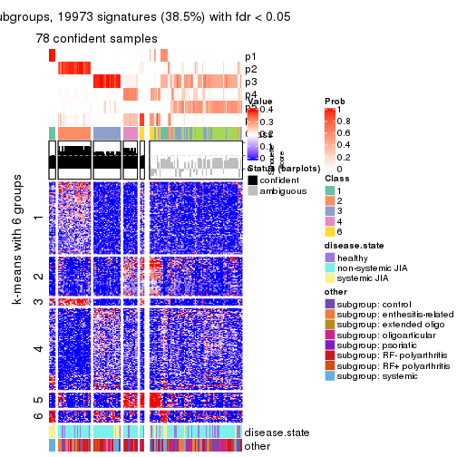</p>

</div>
</div>


Compare the overlap of signatures from different k:

```r
compare_signatures(res)
```


`get_signature()` returns a data frame invisibly. TO get the list of signatures, the function
call should be assigned to a variable explicitly. In following code, if `plot` argument is set
to `FALSE`, no heatmap is plotted while only the differential analysis is performed.

```r
# code only for demonstration
tb = get_signature(res, k = ..., plot = FALSE)
```

An example of the output of `tb` is:

```
#>   which_row         fdr    mean_1    mean_2 scaled_mean_1 scaled_mean_2 km
#> 1        38 0.042760348  8.373488  9.131774    -0.5533452     0.5164555  1
#> 2        40 0.018707592  7.106213  8.469186    -0.6173731     0.5762149  1
#> 3        55 0.019134737 10.221463 11.207825    -0.6159697     0.5749050  1
#> 4        59 0.006059896  5.921854  7.869574    -0.6899429     0.6439467  1
#> 5        60 0.018055526  8.928898 10.211722    -0.6204761     0.5791110  1
#> 6        98 0.009384629 15.714769 14.887706     0.6635654    -0.6193277  2
...
```

The columns in `tb` are:

1. `which_row`: row indices corresponding to the input matrix.
2. `fdr`: FDR for the differential test. 
3. `mean_x`: The mean value in group x.
4. `scaled_mean_x`: The mean value in group x after rows are scaled.
5. `km`: Row groups if k-means clustering is applied to rows.


UMAP plot which shows how samples are separated.


<script>
$( function() {
	$( '#tabs-CV-mclust-dimension-reduction' ).tabs();
} );
</script>
<div id='tabs-CV-mclust-dimension-reduction'>
<ul>
<li><a href='#tab-CV-mclust-dimension-reduction-1'>k = 2</a></li>
<li><a href='#tab-CV-mclust-dimension-reduction-2'>k = 3</a></li>
<li><a href='#tab-CV-mclust-dimension-reduction-3'>k = 4</a></li>
<li><a href='#tab-CV-mclust-dimension-reduction-4'>k = 5</a></li>
<li><a href='#tab-CV-mclust-dimension-reduction-5'>k = 6</a></li>
</ul>
<div id='tab-CV-mclust-dimension-reduction-1'>
<pre><code class="r">dimension_reduction(res, k = 2, method = &quot;UMAP&quot;)
</code></pre>

<p></p>

</div>
<div id='tab-CV-mclust-dimension-reduction-2'>
<pre><code class="r">dimension_reduction(res, k = 3, method = &quot;UMAP&quot;)
</code></pre>

<p></p>

</div>
<div id='tab-CV-mclust-dimension-reduction-3'>
<pre><code class="r">dimension_reduction(res, k = 4, method = &quot;UMAP&quot;)
</code></pre>

<p></p>

</div>
<div id='tab-CV-mclust-dimension-reduction-4'>
<pre><code class="r">dimension_reduction(res, k = 5, method = &quot;UMAP&quot;)
</code></pre>

<p></p>

</div>
<div id='tab-CV-mclust-dimension-reduction-5'>
<pre><code class="r">dimension_reduction(res, k = 6, method = &quot;UMAP&quot;)
</code></pre>

<p></p>

</div>
</div>


Following heatmap shows how subgroups are split when increasing `k`:

```r
collect_classes(res)
```


Test correlation between subgroups and known annotations. If the known
annotation is numeric, one-way ANOVA test is applied, and if the known
annotation is discrete, chi-squared contingency table test is applied.

```r
test_to_known_factors(res)
```

```
#>             n disease.state(p) other(p) k
#> CV:mclust 145         5.55e-01 3.18e-01 2
#> CV:mclust 122         2.68e-03 3.34e-02 3
#> CV:mclust 138         4.89e-13 2.88e-12 4
#> CV:mclust 126         2.66e-13 1.92e-11 5
#> CV:mclust  78         2.15e-08 1.05e-06 6
```


If matrix rows can be associated to genes, consider to use `GO_Enrichment(res,
...)` to perform function enrichment for the signature genes.


 

---------------------------------------------------


### CV:NMF


The object with results only for a single top-value method and a single partition method 
can be extracted as:

```r
res = res_list["CV", "NMF"]
# you can also extract it by
# res = res_list["CV:NMF"]
```

A summary of `res` and all the functions that can be applied to it:

```r
res
```

```
#> A 'ConsensusPartition' object with k = 2, 3, 4, 5, 6.
#>   On a matrix with 51941 rows and 154 columns.
#>   Top rows (1000, 2000, 3000, 4000, 5000) are extracted by 'CV' method.
#>   Subgroups are detected by 'NMF' method.
#>   Performed in total 1250 partitions by row resampling.
#>   Best k for subgroups seems to be 4.
#> 
#> Following methods can be applied to this 'ConsensusPartition' object:
#>  [1] "cola_report"             "collect_classes"         "collect_plots"          
#>  [4] "collect_stats"           "colnames"                "compare_signatures"     
#>  [7] "consensus_heatmap"       "dimension_reduction"     "functional_enrichment"  
#> [10] "get_anno_col"            "get_anno"                "get_classes"            
#> [13] "get_consensus"           "get_matrix"              "get_membership"         
#> [16] "get_param"               "get_signatures"          "get_stats"              
#> [19] "is_best_k"               "is_stable_k"             "membership_heatmap"     
#> [22] "ncol"                    "nrow"                    "plot_ecdf"              
#> [25] "rownames"                "select_partition_number" "show"                   
#> [28] "suggest_best_k"          "test_to_known_factors"
```

`collect_plots()` function collects all the plots made from `res` for all `k` (number of partitions)
into one single page to provide an easy and fast comparison between different `k`.

```r
collect_plots(res)
```


The plots are:

- The first row: a plot of the ECDF (Empirical cumulative distribution
  function) curves of the consensus matrix for each `k` and the heatmap of
  predicted classes for each `k`.
- The second row: heatmaps of the consensus matrix for each `k`.
- The third row: heatmaps of the membership matrix for each `k`.
- The fouth row: heatmaps of the signatures for each `k`.

All the plots in panels can be made by individual functions and they are
plotted later in this section.

`select_partition_number()` produces several plots showing different
statistics for choosing "optimized" `k`. There are following statistics:

- ECDF curves of the consensus matrix for each `k`;
- 1-PAC. [The PAC
  score](https://en.wikipedia.org/wiki/Consensus_clustering#Over-interpretation_potential_of_consensus_clustering)
  measures the proportion of the ambiguous subgrouping.
- Mean silhouette score.
- Concordance. The mean probability of fiting the consensus class ids in all
  partitions.
- Area increased. Denote $A_k$ as the area under the ECDF curve for current
  `k`, the area increased is defined as $A_k - A_{k-1}$.
- Rand index. The percent of pairs of samples that are both in a same cluster
  or both are not in a same cluster in the partition of k and k-1.
- Jaccard index. The ratio of pairs of samples are both in a same cluster in
  the partition of k and k-1 and the pairs of samples are both in a same
  cluster in the partition k or k-1.

The detailed explanations of these statistics can be found in [the cola
vignette](http://bioconductor.org/packages/devel/bioc/vignettes/cola/inst/doc/cola.html#toc_13).

Generally speaking, lower PAC score, higher mean silhouette score or higher
concordance corresponds to better partition. Rand index and Jaccard index
measure how similar the current partition is compared to partition with `k-1`.
If they are too similar, we won't accept `k` is better than `k-1`.

```r
select_partition_number(res)
```


The numeric values for all these statistics can be obtained by `get_stats()`.

```r
get_stats(res)
```

```
#>   k 1-PAC mean_silhouette concordance area_increased  Rand Jaccard
#> 2 2 0.383           0.829       0.893         0.4798 0.527   0.527
#> 3 3 0.418           0.703       0.819         0.3297 0.728   0.541
#> 4 4 0.810           0.835       0.926         0.1475 0.776   0.488
#> 5 5 0.739           0.750       0.845         0.0870 0.882   0.595
#> 6 6 0.793           0.779       0.873         0.0454 0.920   0.643
```

`suggest_best_k()` suggests the best $k$ based on these statistics. The rules are as follows:

- All $k$ with Jaccard index larger than 0.95 are removed because the increase of
  the partition number does not provides enough extra information. If all $k$ are removed,
  the best $k$ is assigned by `NA`.
- For $k$ with 1-PAC larger than 0.9, the maximal $k$ is taken as the "best k". Other $k$ is called "optional k".
- If it does not fit the second rule. The $k$ with the highest vote of highest
  1-PAC, mean silhouette and concordance is taken as the "best k".

```r
suggest_best_k(res)
```

```
#> [1] 4
```


Following shows the table of the partitions (You need to click the **show/hide
code output** link to see it). The membership matrix (columns with name `p*`)
is inferred by
[`clue::cl_consensus()`](https://www.rdocumentation.org/link/cl_consensus?package=clue)
function with the `SE` method. Basically the value in the membership matrix
represents the probability to belong to a certain group. The finall class
label for an item is determined with the group with highest probability it
belongs to.

In `get_classes()` function, the entropy is calculated from the membership
matrix and the silhouette score is calculated from the consensus matrix.


<script>
$( function() {
	$( '#tabs-CV-NMF-get-classes' ).tabs();
} );
</script>
<div id='tabs-CV-NMF-get-classes'>
<ul>
<li><a href='#tab-CV-NMF-get-classes-1'>k = 2</a></li>
<li><a href='#tab-CV-NMF-get-classes-2'>k = 3</a></li>
<li><a href='#tab-CV-NMF-get-classes-3'>k = 4</a></li>
<li><a href='#tab-CV-NMF-get-classes-4'>k = 5</a></li>
<li><a href='#tab-CV-NMF-get-classes-5'>k = 6</a></li>
</ul>

<div id='tab-CV-NMF-get-classes-1'>
<p><a id='tab-CV-NMF-get-classes-1-a' style='color:#0366d6' href='#'>show/hide code output</a></p>
<pre><code class="r">cbind(get_classes(res, k = 2), get_membership(res, k = 2))
</code></pre>

<pre><code>#&gt;           class entropy silhouette    p1    p2
#&gt; GSM340358     1  0.5294     0.8400 0.880 0.120
#&gt; GSM340359     1  0.2236     0.8727 0.964 0.036
#&gt; GSM340361     1  0.2778     0.8739 0.952 0.048
#&gt; GSM340362     1  0.4431     0.8695 0.908 0.092
#&gt; GSM340363     2  0.5737     0.8398 0.136 0.864
#&gt; GSM340364     1  0.2603     0.8741 0.956 0.044
#&gt; GSM340365     1  0.2423     0.8742 0.960 0.040
#&gt; GSM340366     1  0.2603     0.8741 0.956 0.044
#&gt; GSM340367     1  0.2778     0.8739 0.952 0.048
#&gt; GSM340368     2  0.2423     0.8919 0.040 0.960
#&gt; GSM340369     2  0.6247     0.8367 0.156 0.844
#&gt; GSM340370     1  0.2778     0.8739 0.952 0.048
#&gt; GSM340371     1  0.7219     0.7838 0.800 0.200
#&gt; GSM340372     1  0.2778     0.8739 0.952 0.048
#&gt; GSM340373     1  0.2778     0.8739 0.952 0.048
#&gt; GSM340375     1  0.2778     0.8739 0.952 0.048
#&gt; GSM340376     1  0.2778     0.8739 0.952 0.048
#&gt; GSM340378     1  0.2603     0.8741 0.956 0.044
#&gt; GSM340243     1  0.2778     0.8739 0.952 0.048
#&gt; GSM340244     1  0.6247     0.8086 0.844 0.156
#&gt; GSM340246     1  0.6247     0.8086 0.844 0.156
#&gt; GSM340247     2  0.0000     0.9063 0.000 1.000
#&gt; GSM340248     1  0.6247     0.8086 0.844 0.156
#&gt; GSM340249     2  0.2603     0.8830 0.044 0.956
#&gt; GSM340250     1  0.4562     0.8683 0.904 0.096
#&gt; GSM340251     2  0.4939     0.8429 0.108 0.892
#&gt; GSM340252     2  0.2948     0.8799 0.052 0.948
#&gt; GSM340253     1  0.4562     0.8454 0.904 0.096
#&gt; GSM340254     1  0.6247     0.8086 0.844 0.156
#&gt; GSM340256     1  0.6247     0.8086 0.844 0.156
#&gt; GSM340258     1  0.4815     0.8633 0.896 0.104
#&gt; GSM340259     1  0.4690     0.8641 0.900 0.100
#&gt; GSM340260     1  0.2603     0.8741 0.956 0.044
#&gt; GSM340261     1  0.9977     0.0785 0.528 0.472
#&gt; GSM340262     1  0.5059     0.8594 0.888 0.112
#&gt; GSM340263     1  0.6247     0.8086 0.844 0.156
#&gt; GSM340264     1  0.8713     0.6868 0.708 0.292
#&gt; GSM340265     1  0.3114     0.8734 0.944 0.056
#&gt; GSM340266     2  0.5737     0.8452 0.136 0.864
#&gt; GSM340267     1  0.4815     0.8633 0.896 0.104
#&gt; GSM340268     2  0.2423     0.8859 0.040 0.960
#&gt; GSM340269     1  0.5842     0.8412 0.860 0.140
#&gt; GSM340270     1  0.9775     0.3944 0.588 0.412
#&gt; GSM537574     1  0.4298     0.8687 0.912 0.088
#&gt; GSM537580     2  0.6343     0.8328 0.160 0.840
#&gt; GSM537581     2  0.3879     0.8786 0.076 0.924
#&gt; GSM340272     1  0.2423     0.8742 0.960 0.040
#&gt; GSM340273     1  0.6247     0.8086 0.844 0.156
#&gt; GSM340275     2  0.0000     0.9063 0.000 1.000
#&gt; GSM340276     2  0.9393     0.4910 0.356 0.644
#&gt; GSM340277     1  0.5629     0.8248 0.868 0.132
#&gt; GSM340278     2  0.4690     0.8619 0.100 0.900
#&gt; GSM340279     2  0.5946     0.8340 0.144 0.856
#&gt; GSM340282     1  0.0672     0.8690 0.992 0.008
#&gt; GSM340284     2  0.2948     0.8804 0.052 0.948
#&gt; GSM340285     2  0.5294     0.8508 0.120 0.880
#&gt; GSM340286     1  0.7453     0.7694 0.788 0.212
#&gt; GSM340287     1  0.4562     0.8653 0.904 0.096
#&gt; GSM340288     1  0.5408     0.8553 0.876 0.124
#&gt; GSM340289     1  0.4690     0.8666 0.900 0.100
#&gt; GSM340290     2  0.5737     0.8331 0.136 0.864
#&gt; GSM340291     1  0.6247     0.8086 0.844 0.156
#&gt; GSM340293     2  0.1184     0.9025 0.016 0.984
#&gt; GSM340294     1  0.8499     0.6694 0.724 0.276
#&gt; GSM340296     1  0.2603     0.8741 0.956 0.044
#&gt; GSM340297     2  0.6623     0.8100 0.172 0.828
#&gt; GSM340298     1  0.2778     0.8746 0.952 0.048
#&gt; GSM340299     1  0.4022     0.8673 0.920 0.080
#&gt; GSM340301     1  0.4690     0.8641 0.900 0.100
#&gt; GSM340303     1  0.0376     0.8673 0.996 0.004
#&gt; GSM340304     2  0.9491     0.4716 0.368 0.632
#&gt; GSM340306     2  0.0000     0.9063 0.000 1.000
#&gt; GSM340307     1  0.6048     0.8144 0.852 0.148
#&gt; GSM340310     1  0.2778     0.8739 0.952 0.048
#&gt; GSM340314     2  0.0000     0.9063 0.000 1.000
#&gt; GSM340315     1  0.9129     0.6175 0.672 0.328
#&gt; GSM340317     2  0.7453     0.7415 0.212 0.788
#&gt; GSM340318     2  0.0000     0.9063 0.000 1.000
#&gt; GSM340319     2  0.0000     0.9063 0.000 1.000
#&gt; GSM340320     2  0.0000     0.9063 0.000 1.000
#&gt; GSM340321     1  0.6247     0.8086 0.844 0.156
#&gt; GSM340322     2  0.0000     0.9063 0.000 1.000
#&gt; GSM340324     1  0.5842     0.8185 0.860 0.140
#&gt; GSM340328     2  0.9522     0.5594 0.372 0.628
#&gt; GSM340330     2  0.6712     0.8296 0.176 0.824
#&gt; GSM340332     2  0.0000     0.9063 0.000 1.000
#&gt; GSM340333     1  0.4562     0.8454 0.904 0.096
#&gt; GSM340336     2  0.0000     0.9063 0.000 1.000
#&gt; GSM340337     2  0.0000     0.9063 0.000 1.000
#&gt; GSM340338     2  0.8386     0.6671 0.268 0.732
#&gt; GSM340339     2  0.0000     0.9063 0.000 1.000
#&gt; GSM340340     2  0.3274     0.8642 0.060 0.940
#&gt; GSM340341     2  0.0000     0.9063 0.000 1.000
#&gt; GSM340343     2  0.0000     0.9063 0.000 1.000
#&gt; GSM340344     1  0.1414     0.8681 0.980 0.020
#&gt; GSM340346     1  0.3431     0.8721 0.936 0.064
#&gt; GSM340347     2  0.0000     0.9063 0.000 1.000
#&gt; GSM340348     2  0.0000     0.9063 0.000 1.000
#&gt; GSM340349     1  0.2778     0.8739 0.952 0.048
#&gt; GSM340350     1  0.2778     0.8739 0.952 0.048
#&gt; GSM340351     1  0.5294     0.8577 0.880 0.120
#&gt; GSM340354     1  0.4815     0.8633 0.896 0.104
#&gt; GSM340356     1  0.6247     0.8086 0.844 0.156
#&gt; GSM340357     1  0.3584     0.8736 0.932 0.068
#&gt; GSM348183     2  0.7883     0.7217 0.236 0.764
#&gt; GSM348191     2  0.5946     0.8545 0.144 0.856
#&gt; GSM348193     2  0.0000     0.9063 0.000 1.000
#&gt; GSM537578     1  0.2603     0.8741 0.956 0.044
#&gt; GSM348181     2  0.6247     0.8207 0.156 0.844
#&gt; GSM348182     1  0.9881     0.3622 0.564 0.436
#&gt; GSM348184     1  0.9661     0.4118 0.608 0.392
#&gt; GSM348185     2  0.1633     0.8950 0.024 0.976
#&gt; GSM348186     1  0.6247     0.8086 0.844 0.156
#&gt; GSM348187     1  0.4431     0.8692 0.908 0.092
#&gt; GSM348188     2  0.0000     0.9063 0.000 1.000
#&gt; GSM348189     1  0.7453     0.7691 0.788 0.212
#&gt; GSM348190     1  0.4690     0.8641 0.900 0.100
#&gt; GSM348194     1  0.5408     0.8553 0.876 0.124
#&gt; GSM348195     1  0.2778     0.8739 0.952 0.048
#&gt; GSM348196     1  0.8443     0.6958 0.728 0.272
#&gt; GSM537585     1  0.4562     0.8681 0.904 0.096
#&gt; GSM537594     1  0.6247     0.8086 0.844 0.156
#&gt; GSM537596     1  0.7602     0.7727 0.780 0.220
#&gt; GSM537597     1  0.1184     0.8712 0.984 0.016
#&gt; GSM537602     1  0.2603     0.8741 0.956 0.044
#&gt; GSM340184     2  0.6438     0.8399 0.164 0.836
#&gt; GSM340185     1  0.6247     0.8086 0.844 0.156
#&gt; GSM340186     1  0.6247     0.8086 0.844 0.156
#&gt; GSM340187     2  0.0376     0.9047 0.004 0.996
#&gt; GSM340189     2  0.0000     0.9063 0.000 1.000
#&gt; GSM340190     2  0.8861     0.5914 0.304 0.696
#&gt; GSM340191     2  0.4939     0.8760 0.108 0.892
#&gt; GSM340192     1  0.0938     0.8681 0.988 0.012
#&gt; GSM340193     1  0.5178     0.8579 0.884 0.116
#&gt; GSM340194     1  0.5059     0.8594 0.888 0.112
#&gt; GSM340195     1  0.4431     0.8654 0.908 0.092
#&gt; GSM340196     2  0.0000     0.9063 0.000 1.000
#&gt; GSM340197     1  0.4815     0.8633 0.896 0.104
#&gt; GSM340198     1  0.6247     0.8086 0.844 0.156
#&gt; GSM340199     2  0.6531     0.8127 0.168 0.832
#&gt; GSM340200     1  0.6247     0.8086 0.844 0.156
#&gt; GSM340201     2  0.0000     0.9063 0.000 1.000
#&gt; GSM340202     2  0.0000     0.9063 0.000 1.000
#&gt; GSM340203     2  0.0000     0.9063 0.000 1.000
#&gt; GSM340204     1  0.1843     0.8705 0.972 0.028
#&gt; GSM340205     1  0.2778     0.8739 0.952 0.048
#&gt; GSM340206     2  0.2423     0.8859 0.040 0.960
#&gt; GSM340207     1  0.6801     0.8057 0.820 0.180
#&gt; GSM340237     1  0.4431     0.8420 0.908 0.092
#&gt; GSM340238     2  0.2236     0.8877 0.036 0.964
#&gt; GSM340239     1  0.4815     0.8633 0.896 0.104
#&gt; GSM340240     1  0.4431     0.8665 0.908 0.092
#&gt; GSM340241     1  0.6247     0.8086 0.844 0.156
#&gt; GSM340242     1  0.6801     0.8055 0.820 0.180
</code></pre>

<script>
$('#tab-CV-NMF-get-classes-1-a').parent().next().next().hide();
$('#tab-CV-NMF-get-classes-1-a').click(function(){
  $('#tab-CV-NMF-get-classes-1-a').parent().next().next().toggle();
  return(false);
});
</script>
</div>

<div id='tab-CV-NMF-get-classes-2'>
<p><a id='tab-CV-NMF-get-classes-2-a' style='color:#0366d6' href='#'>show/hide code output</a></p>
<pre><code class="r">cbind(get_classes(res, k = 3), get_membership(res, k = 3))
</code></pre>

<pre><code>#&gt;           class entropy silhouette    p1    p2    p3
#&gt; GSM340358     1  0.6441     0.4946 0.696 0.028 0.276
#&gt; GSM340359     1  0.7030     0.3938 0.580 0.024 0.396
#&gt; GSM340361     1  0.3918     0.6812 0.868 0.012 0.120
#&gt; GSM340362     1  0.5053     0.7046 0.812 0.024 0.164
#&gt; GSM340363     2  0.5763     0.6067 0.244 0.740 0.016
#&gt; GSM340364     1  0.6441     0.4946 0.696 0.028 0.276
#&gt; GSM340365     1  0.0983     0.7298 0.980 0.004 0.016
#&gt; GSM340366     1  0.1015     0.7302 0.980 0.008 0.012
#&gt; GSM340367     1  0.6441     0.4946 0.696 0.028 0.276
#&gt; GSM340368     2  0.4345     0.7256 0.136 0.848 0.016
#&gt; GSM340369     2  0.4994     0.6877 0.160 0.816 0.024
#&gt; GSM340370     1  0.6441     0.4946 0.696 0.028 0.276
#&gt; GSM340371     1  0.8371     0.6564 0.624 0.164 0.212
#&gt; GSM340372     1  0.6441     0.4946 0.696 0.028 0.276
#&gt; GSM340373     1  0.6441     0.4946 0.696 0.028 0.276
#&gt; GSM340375     1  0.6441     0.4946 0.696 0.028 0.276
#&gt; GSM340376     1  0.6441     0.4946 0.696 0.028 0.276
#&gt; GSM340378     1  0.6441     0.4946 0.696 0.028 0.276
#&gt; GSM340243     1  0.1170     0.7292 0.976 0.008 0.016
#&gt; GSM340244     3  0.0747     0.9278 0.000 0.016 0.984
#&gt; GSM340246     3  0.0747     0.9278 0.000 0.016 0.984
#&gt; GSM340247     2  0.1163     0.8459 0.000 0.972 0.028
#&gt; GSM340248     3  0.1182     0.9214 0.012 0.012 0.976
#&gt; GSM340249     2  0.6252     0.1065 0.000 0.556 0.444
#&gt; GSM340250     1  0.1289     0.7337 0.968 0.032 0.000
#&gt; GSM340251     3  0.3941     0.8013 0.000 0.156 0.844
#&gt; GSM340252     3  0.5706     0.5487 0.000 0.320 0.680
#&gt; GSM340253     3  0.0747     0.9175 0.016 0.000 0.984
#&gt; GSM340254     3  0.0848     0.9235 0.008 0.008 0.984
#&gt; GSM340256     3  0.0747     0.9278 0.000 0.016 0.984
#&gt; GSM340258     1  0.8371     0.6564 0.624 0.164 0.212
#&gt; GSM340259     1  0.5178     0.7033 0.808 0.164 0.028
#&gt; GSM340260     1  0.0747     0.7329 0.984 0.016 0.000
#&gt; GSM340261     1  0.4002     0.7071 0.840 0.160 0.000
#&gt; GSM340262     1  0.8371     0.6564 0.624 0.164 0.212
#&gt; GSM340263     3  0.2599     0.8817 0.052 0.016 0.932
#&gt; GSM340264     1  0.8109     0.5916 0.620 0.272 0.108
#&gt; GSM340265     1  0.6934     0.5565 0.624 0.028 0.348
#&gt; GSM340266     2  0.4796     0.6524 0.220 0.780 0.000
#&gt; GSM340267     1  0.8371     0.6564 0.624 0.164 0.212
#&gt; GSM340268     2  0.3983     0.7475 0.144 0.852 0.004
#&gt; GSM340269     1  0.8206     0.6640 0.640 0.164 0.196
#&gt; GSM340270     1  0.4178     0.6995 0.828 0.172 0.000
#&gt; GSM537574     1  0.6859     0.5457 0.620 0.024 0.356
#&gt; GSM537580     1  0.8749     0.5570 0.572 0.276 0.152
#&gt; GSM537581     2  0.1620     0.8367 0.024 0.964 0.012
#&gt; GSM340272     1  0.3695     0.7270 0.880 0.012 0.108
#&gt; GSM340273     3  0.3851     0.7615 0.136 0.004 0.860
#&gt; GSM340275     2  0.1163     0.8459 0.000 0.972 0.028
#&gt; GSM340276     1  0.4293     0.7035 0.832 0.164 0.004
#&gt; GSM340277     3  0.0829     0.9259 0.004 0.012 0.984
#&gt; GSM340278     2  0.4346     0.7071 0.184 0.816 0.000
#&gt; GSM340279     2  0.5465     0.5410 0.288 0.712 0.000
#&gt; GSM340282     1  0.5486     0.6870 0.780 0.024 0.196
#&gt; GSM340284     3  0.5291     0.6449 0.000 0.268 0.732
#&gt; GSM340285     2  0.4453     0.7409 0.152 0.836 0.012
#&gt; GSM340286     1  0.8371     0.6564 0.624 0.164 0.212
#&gt; GSM340287     1  0.3941     0.7070 0.844 0.156 0.000
#&gt; GSM340288     1  0.2550     0.7267 0.932 0.012 0.056
#&gt; GSM340289     1  0.1182     0.7319 0.976 0.012 0.012
#&gt; GSM340290     2  0.6308    -0.0766 0.492 0.508 0.000
#&gt; GSM340291     3  0.0747     0.9278 0.000 0.016 0.984
#&gt; GSM340293     2  0.1182     0.8438 0.012 0.976 0.012
#&gt; GSM340294     1  0.5746     0.6951 0.780 0.180 0.040
#&gt; GSM340296     1  0.0848     0.7310 0.984 0.008 0.008
#&gt; GSM340297     1  0.4452     0.6409 0.808 0.192 0.000
#&gt; GSM340298     1  0.1015     0.7302 0.980 0.008 0.012
#&gt; GSM340299     1  0.7431     0.6764 0.688 0.100 0.212
#&gt; GSM340301     1  0.8371     0.6564 0.624 0.164 0.212
#&gt; GSM340303     1  0.6742     0.5939 0.656 0.028 0.316
#&gt; GSM340304     1  0.2998     0.7203 0.916 0.068 0.016
#&gt; GSM340306     2  0.0829     0.8454 0.004 0.984 0.012
#&gt; GSM340307     3  0.2651     0.8621 0.060 0.012 0.928
#&gt; GSM340310     1  0.6441     0.4946 0.696 0.028 0.276
#&gt; GSM340314     2  0.1643     0.8266 0.044 0.956 0.000
#&gt; GSM340315     1  0.4293     0.7043 0.832 0.164 0.004
#&gt; GSM340317     3  0.4452     0.7158 0.000 0.192 0.808
#&gt; GSM340318     2  0.1163     0.8459 0.000 0.972 0.028
#&gt; GSM340319     2  0.1163     0.8459 0.000 0.972 0.028
#&gt; GSM340320     2  0.0983     0.8457 0.004 0.980 0.016
#&gt; GSM340321     3  0.0747     0.9278 0.000 0.016 0.984
#&gt; GSM340322     2  0.1163     0.8459 0.000 0.972 0.028
#&gt; GSM340324     3  0.0592     0.9079 0.012 0.000 0.988
#&gt; GSM340328     1  0.7610     0.5199 0.688 0.168 0.144
#&gt; GSM340330     2  0.5902     0.4832 0.316 0.680 0.004
#&gt; GSM340332     2  0.1031     0.8465 0.000 0.976 0.024
#&gt; GSM340333     3  0.1170     0.9099 0.016 0.008 0.976
#&gt; GSM340336     2  0.1163     0.8459 0.000 0.972 0.028
#&gt; GSM340337     2  0.1129     0.8466 0.004 0.976 0.020
#&gt; GSM340338     1  0.8000     0.4852 0.580 0.344 0.076
#&gt; GSM340339     2  0.1031     0.8465 0.000 0.976 0.024
#&gt; GSM340340     2  0.2793     0.8213 0.028 0.928 0.044
#&gt; GSM340341     2  0.1399     0.8459 0.004 0.968 0.028
#&gt; GSM340343     2  0.1163     0.8459 0.000 0.972 0.028
#&gt; GSM340344     1  0.6985     0.4987 0.592 0.024 0.384
#&gt; GSM340346     1  0.6699     0.7093 0.744 0.092 0.164
#&gt; GSM340347     2  0.1163     0.8459 0.000 0.972 0.028
#&gt; GSM340348     2  0.1620     0.8401 0.024 0.964 0.012
#&gt; GSM340349     1  0.1170     0.7292 0.976 0.008 0.016
#&gt; GSM340350     1  0.1491     0.7274 0.968 0.016 0.016
#&gt; GSM340351     1  0.3918     0.6944 0.868 0.012 0.120
#&gt; GSM340354     1  0.8371     0.6564 0.624 0.164 0.212
#&gt; GSM340356     3  0.0747     0.9278 0.000 0.016 0.984
#&gt; GSM340357     1  0.0983     0.7298 0.980 0.004 0.016
#&gt; GSM348183     1  0.7075     0.1439 0.496 0.484 0.020
#&gt; GSM348191     2  0.6625     0.1024 0.440 0.552 0.008
#&gt; GSM348193     2  0.2318     0.8349 0.028 0.944 0.028
#&gt; GSM537578     1  0.0592     0.7310 0.988 0.000 0.012
#&gt; GSM348181     1  0.5244     0.6463 0.756 0.240 0.004
#&gt; GSM348182     1  0.6956     0.5788 0.660 0.300 0.040
#&gt; GSM348184     3  0.0747     0.9278 0.000 0.016 0.984
#&gt; GSM348185     2  0.5905     0.3993 0.000 0.648 0.352
#&gt; GSM348186     3  0.0747     0.9278 0.000 0.016 0.984
#&gt; GSM348187     1  0.3644     0.6825 0.872 0.004 0.124
#&gt; GSM348188     2  0.0892     0.8465 0.000 0.980 0.020
#&gt; GSM348189     1  0.8371     0.6564 0.624 0.164 0.212
#&gt; GSM348190     1  0.4473     0.7035 0.828 0.164 0.008
#&gt; GSM348194     1  0.3610     0.7106 0.888 0.016 0.096
#&gt; GSM348195     1  0.3272     0.6960 0.892 0.004 0.104
#&gt; GSM348196     1  0.4636     0.6993 0.852 0.044 0.104
#&gt; GSM537585     1  0.1182     0.7319 0.976 0.012 0.012
#&gt; GSM537594     3  0.0747     0.9278 0.000 0.016 0.984
#&gt; GSM537596     1  0.4634     0.7047 0.824 0.164 0.012
#&gt; GSM537597     1  0.4059     0.6889 0.860 0.012 0.128
#&gt; GSM537602     1  0.1643     0.7264 0.956 0.000 0.044
#&gt; GSM340184     2  0.7319     0.1217 0.420 0.548 0.032
#&gt; GSM340185     3  0.0747     0.9278 0.000 0.016 0.984
#&gt; GSM340186     3  0.0747     0.9278 0.000 0.016 0.984
#&gt; GSM340187     2  0.1163     0.8459 0.000 0.972 0.028
#&gt; GSM340189     2  0.1163     0.8459 0.000 0.972 0.028
#&gt; GSM340190     3  0.3412     0.8345 0.000 0.124 0.876
#&gt; GSM340191     2  0.4974     0.6323 0.236 0.764 0.000
#&gt; GSM340192     3  0.5953     0.4802 0.280 0.012 0.708
#&gt; GSM340193     1  0.4293     0.7035 0.832 0.164 0.004
#&gt; GSM340194     1  0.8371     0.6564 0.624 0.164 0.212
#&gt; GSM340195     1  0.8282     0.6613 0.632 0.160 0.208
#&gt; GSM340196     2  0.1163     0.8459 0.000 0.972 0.028
#&gt; GSM340197     1  0.8371     0.6564 0.624 0.164 0.212
#&gt; GSM340198     3  0.0747     0.9278 0.000 0.016 0.984
#&gt; GSM340199     1  0.5465     0.5773 0.712 0.288 0.000
#&gt; GSM340200     3  0.0747     0.9278 0.000 0.016 0.984
#&gt; GSM340201     2  0.1163     0.8459 0.000 0.972 0.028
#&gt; GSM340202     2  0.1163     0.8459 0.000 0.972 0.028
#&gt; GSM340203     2  0.1751     0.8384 0.028 0.960 0.012
#&gt; GSM340204     1  0.6839     0.5518 0.624 0.024 0.352
#&gt; GSM340205     1  0.5292     0.6244 0.800 0.028 0.172
#&gt; GSM340206     2  0.6126     0.5610 0.268 0.712 0.020
#&gt; GSM340207     1  0.8371     0.6564 0.624 0.164 0.212
#&gt; GSM340237     3  0.0892     0.9026 0.020 0.000 0.980
#&gt; GSM340238     2  0.2066     0.8187 0.060 0.940 0.000
#&gt; GSM340239     1  0.8371     0.6564 0.624 0.164 0.212
#&gt; GSM340240     1  0.8322     0.6590 0.628 0.160 0.212
#&gt; GSM340241     3  0.0747     0.9278 0.000 0.016 0.984
#&gt; GSM340242     1  0.8371     0.6564 0.624 0.164 0.212
</code></pre>

<script>
$('#tab-CV-NMF-get-classes-2-a').parent().next().next().hide();
$('#tab-CV-NMF-get-classes-2-a').click(function(){
  $('#tab-CV-NMF-get-classes-2-a').parent().next().next().toggle();
  return(false);
});
</script>
</div>

<div id='tab-CV-NMF-get-classes-3'>
<p><a id='tab-CV-NMF-get-classes-3-a' style='color:#0366d6' href='#'>show/hide code output</a></p>
<pre><code class="r">cbind(get_classes(res, k = 4), get_membership(res, k = 4))
</code></pre>

<pre><code>#&gt;           class entropy silhouette    p1    p2    p3    p4
#&gt; GSM340358     1  0.0188      0.848 0.996 0.004 0.000 0.000
#&gt; GSM340359     1  0.0188      0.848 0.996 0.004 0.000 0.000
#&gt; GSM340361     1  0.0000      0.848 1.000 0.000 0.000 0.000
#&gt; GSM340362     3  0.2216      0.865 0.092 0.000 0.908 0.000
#&gt; GSM340363     1  0.5630      0.429 0.608 0.000 0.032 0.360
#&gt; GSM340364     1  0.0188      0.848 0.996 0.004 0.000 0.000
#&gt; GSM340365     1  0.0592      0.844 0.984 0.000 0.016 0.000
#&gt; GSM340366     1  0.4941      0.215 0.564 0.000 0.436 0.000
#&gt; GSM340367     1  0.0188      0.848 0.996 0.004 0.000 0.000
#&gt; GSM340368     4  0.0817      0.907 0.024 0.000 0.000 0.976
#&gt; GSM340369     4  0.3610      0.734 0.200 0.000 0.000 0.800
#&gt; GSM340370     1  0.0188      0.848 0.996 0.004 0.000 0.000
#&gt; GSM340371     3  0.0188      0.903 0.004 0.000 0.996 0.000
#&gt; GSM340372     1  0.0188      0.848 0.996 0.004 0.000 0.000
#&gt; GSM340373     1  0.0188      0.848 0.996 0.004 0.000 0.000
#&gt; GSM340375     1  0.0188      0.848 0.996 0.004 0.000 0.000
#&gt; GSM340376     1  0.0188      0.848 0.996 0.004 0.000 0.000
#&gt; GSM340378     1  0.0188      0.848 0.996 0.004 0.000 0.000
#&gt; GSM340243     1  0.2149      0.799 0.912 0.000 0.088 0.000
#&gt; GSM340244     2  0.0000      0.988 0.000 1.000 0.000 0.000
#&gt; GSM340246     2  0.0000      0.988 0.000 1.000 0.000 0.000
#&gt; GSM340247     4  0.0000      0.923 0.000 0.000 0.000 1.000
#&gt; GSM340248     2  0.0188      0.984 0.000 0.996 0.004 0.000
#&gt; GSM340249     2  0.3400      0.773 0.000 0.820 0.000 0.180
#&gt; GSM340250     3  0.2647      0.808 0.120 0.000 0.880 0.000
#&gt; GSM340251     2  0.0000      0.988 0.000 1.000 0.000 0.000
#&gt; GSM340252     4  0.4985      0.135 0.000 0.468 0.000 0.532
#&gt; GSM340253     2  0.0000      0.988 0.000 1.000 0.000 0.000
#&gt; GSM340254     2  0.0000      0.988 0.000 1.000 0.000 0.000
#&gt; GSM340256     2  0.0000      0.988 0.000 1.000 0.000 0.000
#&gt; GSM340258     3  0.0000      0.904 0.000 0.000 1.000 0.000
#&gt; GSM340259     3  0.1557      0.885 0.056 0.000 0.944 0.000
#&gt; GSM340260     3  0.0469      0.902 0.012 0.000 0.988 0.000
#&gt; GSM340261     3  0.0000      0.904 0.000 0.000 1.000 0.000
#&gt; GSM340262     3  0.0000      0.904 0.000 0.000 1.000 0.000
#&gt; GSM340263     2  0.0000      0.988 0.000 1.000 0.000 0.000
#&gt; GSM340264     3  0.1474      0.888 0.052 0.000 0.948 0.000
#&gt; GSM340265     3  0.0188      0.903 0.004 0.000 0.996 0.000
#&gt; GSM340266     3  0.3726      0.702 0.000 0.000 0.788 0.212
#&gt; GSM340267     3  0.0000      0.904 0.000 0.000 1.000 0.000
#&gt; GSM340268     3  0.0336      0.901 0.000 0.000 0.992 0.008
#&gt; GSM340269     3  0.0000      0.904 0.000 0.000 1.000 0.000
#&gt; GSM340270     3  0.2589      0.820 0.116 0.000 0.884 0.000
#&gt; GSM537574     3  0.0000      0.904 0.000 0.000 1.000 0.000
#&gt; GSM537580     3  0.0188      0.903 0.004 0.000 0.996 0.000
#&gt; GSM537581     4  0.0000      0.923 0.000 0.000 0.000 1.000
#&gt; GSM340272     3  0.3311      0.796 0.172 0.000 0.828 0.000
#&gt; GSM340273     2  0.0000      0.988 0.000 1.000 0.000 0.000
#&gt; GSM340275     4  0.0000      0.923 0.000 0.000 0.000 1.000
#&gt; GSM340276     3  0.3837      0.667 0.224 0.000 0.776 0.000
#&gt; GSM340277     2  0.0000      0.988 0.000 1.000 0.000 0.000
#&gt; GSM340278     4  0.4961      0.201 0.000 0.000 0.448 0.552
#&gt; GSM340279     3  0.0921      0.891 0.000 0.000 0.972 0.028
#&gt; GSM340282     3  0.0188      0.903 0.004 0.000 0.996 0.000
#&gt; GSM340284     2  0.1940      0.908 0.000 0.924 0.076 0.000
#&gt; GSM340285     4  0.3764      0.678 0.000 0.000 0.216 0.784
#&gt; GSM340286     3  0.2216      0.865 0.092 0.000 0.908 0.000
#&gt; GSM340287     3  0.0000      0.904 0.000 0.000 1.000 0.000
#&gt; GSM340288     1  0.3649      0.741 0.796 0.000 0.204 0.000
#&gt; GSM340289     1  0.4624      0.508 0.660 0.000 0.340 0.000
#&gt; GSM340290     3  0.0469      0.900 0.000 0.000 0.988 0.012
#&gt; GSM340291     2  0.0000      0.988 0.000 1.000 0.000 0.000
#&gt; GSM340293     4  0.2216      0.844 0.000 0.000 0.092 0.908
#&gt; GSM340294     3  0.0000      0.904 0.000 0.000 1.000 0.000
#&gt; GSM340296     1  0.4877      0.346 0.592 0.000 0.408 0.000
#&gt; GSM340297     3  0.2342      0.848 0.080 0.000 0.912 0.008
#&gt; GSM340298     1  0.4661      0.486 0.652 0.000 0.348 0.000
#&gt; GSM340299     3  0.2216      0.865 0.092 0.000 0.908 0.000
#&gt; GSM340301     3  0.0188      0.903 0.004 0.000 0.996 0.000
#&gt; GSM340303     3  0.2216      0.865 0.092 0.000 0.908 0.000
#&gt; GSM340304     1  0.3610      0.745 0.800 0.000 0.200 0.000
#&gt; GSM340306     4  0.0000      0.923 0.000 0.000 0.000 1.000
#&gt; GSM340307     2  0.1022      0.957 0.000 0.968 0.032 0.000
#&gt; GSM340310     1  0.0188      0.848 0.996 0.000 0.004 0.000
#&gt; GSM340314     4  0.4564      0.520 0.000 0.000 0.328 0.672
#&gt; GSM340315     3  0.3219      0.764 0.164 0.000 0.836 0.000
#&gt; GSM340317     2  0.0000      0.988 0.000 1.000 0.000 0.000
#&gt; GSM340318     4  0.0000      0.923 0.000 0.000 0.000 1.000
#&gt; GSM340319     4  0.0000      0.923 0.000 0.000 0.000 1.000
#&gt; GSM340320     4  0.0000      0.923 0.000 0.000 0.000 1.000
#&gt; GSM340321     2  0.0000      0.988 0.000 1.000 0.000 0.000
#&gt; GSM340322     4  0.0000      0.923 0.000 0.000 0.000 1.000
#&gt; GSM340324     2  0.0000      0.988 0.000 1.000 0.000 0.000
#&gt; GSM340328     1  0.0188      0.847 0.996 0.000 0.000 0.004
#&gt; GSM340330     3  0.0000      0.904 0.000 0.000 1.000 0.000
#&gt; GSM340332     4  0.0000      0.923 0.000 0.000 0.000 1.000
#&gt; GSM340333     2  0.0000      0.988 0.000 1.000 0.000 0.000
#&gt; GSM340336     4  0.0000      0.923 0.000 0.000 0.000 1.000
#&gt; GSM340337     4  0.0000      0.923 0.000 0.000 0.000 1.000
#&gt; GSM340338     3  0.0000      0.904 0.000 0.000 1.000 0.000
#&gt; GSM340339     4  0.0000      0.923 0.000 0.000 0.000 1.000
#&gt; GSM340340     4  0.0000      0.923 0.000 0.000 0.000 1.000
#&gt; GSM340341     4  0.0000      0.923 0.000 0.000 0.000 1.000
#&gt; GSM340343     4  0.0000      0.923 0.000 0.000 0.000 1.000
#&gt; GSM340344     3  0.3015      0.854 0.092 0.024 0.884 0.000
#&gt; GSM340346     3  0.0000      0.904 0.000 0.000 1.000 0.000
#&gt; GSM340347     4  0.0000      0.923 0.000 0.000 0.000 1.000
#&gt; GSM340348     4  0.0592      0.910 0.000 0.000 0.016 0.984
#&gt; GSM340349     1  0.0592      0.842 0.984 0.000 0.016 0.000
#&gt; GSM340350     1  0.0000      0.848 1.000 0.000 0.000 0.000
#&gt; GSM340351     1  0.3610      0.745 0.800 0.000 0.200 0.000
#&gt; GSM340354     3  0.0000      0.904 0.000 0.000 1.000 0.000
#&gt; GSM340356     2  0.0000      0.988 0.000 1.000 0.000 0.000
#&gt; GSM340357     1  0.0336      0.847 0.992 0.000 0.008 0.000
#&gt; GSM348183     1  0.4855      0.355 0.600 0.000 0.000 0.400
#&gt; GSM348191     3  0.0000      0.904 0.000 0.000 1.000 0.000
#&gt; GSM348193     4  0.2760      0.792 0.128 0.000 0.000 0.872
#&gt; GSM537578     3  0.4916      0.125 0.424 0.000 0.576 0.000
#&gt; GSM348181     3  0.5420      0.333 0.352 0.000 0.624 0.024
#&gt; GSM348182     3  0.2281      0.862 0.096 0.000 0.904 0.000
#&gt; GSM348184     2  0.0000      0.988 0.000 1.000 0.000 0.000
#&gt; GSM348185     4  0.3764      0.702 0.000 0.216 0.000 0.784
#&gt; GSM348186     2  0.0000      0.988 0.000 1.000 0.000 0.000
#&gt; GSM348187     1  0.3219      0.775 0.836 0.000 0.164 0.000
#&gt; GSM348188     4  0.0000      0.923 0.000 0.000 0.000 1.000
#&gt; GSM348189     3  0.0336      0.903 0.008 0.000 0.992 0.000
#&gt; GSM348190     3  0.2149      0.866 0.088 0.000 0.912 0.000
#&gt; GSM348194     1  0.3649      0.741 0.796 0.000 0.204 0.000
#&gt; GSM348195     1  0.0000      0.848 1.000 0.000 0.000 0.000
#&gt; GSM348196     1  0.3649      0.741 0.796 0.000 0.204 0.000
#&gt; GSM537585     3  0.4543      0.515 0.324 0.000 0.676 0.000
#&gt; GSM537594     2  0.0000      0.988 0.000 1.000 0.000 0.000
#&gt; GSM537596     1  0.4877      0.344 0.592 0.000 0.408 0.000
#&gt; GSM537597     1  0.3649      0.741 0.796 0.000 0.204 0.000
#&gt; GSM537602     1  0.2530      0.808 0.888 0.000 0.112 0.000
#&gt; GSM340184     3  0.0000      0.904 0.000 0.000 1.000 0.000
#&gt; GSM340185     2  0.0000      0.988 0.000 1.000 0.000 0.000
#&gt; GSM340186     2  0.0000      0.988 0.000 1.000 0.000 0.000
#&gt; GSM340187     4  0.0000      0.923 0.000 0.000 0.000 1.000
#&gt; GSM340189     4  0.0000      0.923 0.000 0.000 0.000 1.000
#&gt; GSM340190     2  0.0817      0.966 0.000 0.976 0.024 0.000
#&gt; GSM340191     3  0.1118      0.886 0.000 0.000 0.964 0.036
#&gt; GSM340192     3  0.5105      0.208 0.004 0.432 0.564 0.000
#&gt; GSM340193     3  0.4406      0.573 0.300 0.000 0.700 0.000
#&gt; GSM340194     3  0.2216      0.865 0.092 0.000 0.908 0.000
#&gt; GSM340195     3  0.2216      0.865 0.092 0.000 0.908 0.000
#&gt; GSM340196     4  0.0000      0.923 0.000 0.000 0.000 1.000
#&gt; GSM340197     3  0.1716      0.882 0.064 0.000 0.936 0.000
#&gt; GSM340198     2  0.0000      0.988 0.000 1.000 0.000 0.000
#&gt; GSM340199     3  0.0000      0.904 0.000 0.000 1.000 0.000
#&gt; GSM340200     2  0.0000      0.988 0.000 1.000 0.000 0.000
#&gt; GSM340201     4  0.0000      0.923 0.000 0.000 0.000 1.000
#&gt; GSM340202     4  0.0000      0.923 0.000 0.000 0.000 1.000
#&gt; GSM340203     4  0.0000      0.923 0.000 0.000 0.000 1.000
#&gt; GSM340204     3  0.2216      0.865 0.092 0.000 0.908 0.000
#&gt; GSM340205     1  0.0188      0.848 0.996 0.000 0.004 0.000
#&gt; GSM340206     3  0.0000      0.904 0.000 0.000 1.000 0.000
#&gt; GSM340207     3  0.0000      0.904 0.000 0.000 1.000 0.000
#&gt; GSM340237     2  0.0000      0.988 0.000 1.000 0.000 0.000
#&gt; GSM340238     3  0.4331      0.571 0.000 0.000 0.712 0.288
#&gt; GSM340239     3  0.0592      0.901 0.016 0.000 0.984 0.000
#&gt; GSM340240     3  0.0188      0.903 0.004 0.000 0.996 0.000
#&gt; GSM340241     2  0.0000      0.988 0.000 1.000 0.000 0.000
#&gt; GSM340242     3  0.0188      0.903 0.004 0.000 0.996 0.000
</code></pre>

<script>
$('#tab-CV-NMF-get-classes-3-a').parent().next().next().hide();
$('#tab-CV-NMF-get-classes-3-a').click(function(){
  $('#tab-CV-NMF-get-classes-3-a').parent().next().next().toggle();
  return(false);
});
</script>
</div>

<div id='tab-CV-NMF-get-classes-4'>
<p><a id='tab-CV-NMF-get-classes-4-a' style='color:#0366d6' href='#'>show/hide code output</a></p>
<pre><code class="r">cbind(get_classes(res, k = 5), get_membership(res, k = 5))
</code></pre>

<pre><code>#&gt;           class entropy silhouette    p1    p2    p3    p4    p5
#&gt; GSM340358     1  0.0000     0.7958 1.000 0.000 0.000 0.000 0.000
#&gt; GSM340359     1  0.0451     0.7908 0.988 0.008 0.000 0.000 0.004
#&gt; GSM340361     1  0.1341     0.7912 0.944 0.000 0.000 0.000 0.056
#&gt; GSM340362     5  0.4706     0.7970 0.052 0.000 0.256 0.000 0.692
#&gt; GSM340363     1  0.6183     0.6586 0.584 0.000 0.020 0.112 0.284
#&gt; GSM340364     1  0.0000     0.7958 1.000 0.000 0.000 0.000 0.000
#&gt; GSM340365     5  0.4045     0.3576 0.356 0.000 0.000 0.000 0.644
#&gt; GSM340366     1  0.5786     0.0674 0.524 0.000 0.380 0.000 0.096
#&gt; GSM340367     1  0.0000     0.7958 1.000 0.000 0.000 0.000 0.000
#&gt; GSM340368     4  0.1608     0.8739 0.072 0.000 0.000 0.928 0.000
#&gt; GSM340369     4  0.3612     0.6621 0.268 0.000 0.000 0.732 0.000
#&gt; GSM340370     1  0.0000     0.7958 1.000 0.000 0.000 0.000 0.000
#&gt; GSM340371     5  0.4150     0.7750 0.000 0.000 0.388 0.000 0.612
#&gt; GSM340372     1  0.0000     0.7958 1.000 0.000 0.000 0.000 0.000
#&gt; GSM340373     1  0.0000     0.7958 1.000 0.000 0.000 0.000 0.000
#&gt; GSM340375     1  0.0000     0.7958 1.000 0.000 0.000 0.000 0.000
#&gt; GSM340376     1  0.0000     0.7958 1.000 0.000 0.000 0.000 0.000
#&gt; GSM340378     1  0.0000     0.7958 1.000 0.000 0.000 0.000 0.000
#&gt; GSM340243     1  0.2482     0.7710 0.892 0.000 0.024 0.000 0.084
#&gt; GSM340244     2  0.0000     0.9190 0.000 1.000 0.000 0.000 0.000
#&gt; GSM340246     2  0.0000     0.9190 0.000 1.000 0.000 0.000 0.000
#&gt; GSM340247     4  0.0000     0.9164 0.000 0.000 0.000 1.000 0.000
#&gt; GSM340248     2  0.1043     0.8901 0.000 0.960 0.040 0.000 0.000
#&gt; GSM340249     2  0.3143     0.7139 0.000 0.796 0.000 0.204 0.000
#&gt; GSM340250     3  0.3649     0.7285 0.152 0.000 0.808 0.000 0.040
#&gt; GSM340251     2  0.0000     0.9190 0.000 1.000 0.000 0.000 0.000
#&gt; GSM340252     4  0.3561     0.6464 0.000 0.260 0.000 0.740 0.000
#&gt; GSM340253     5  0.4415     0.1313 0.000 0.444 0.004 0.000 0.552
#&gt; GSM340254     2  0.0000     0.9190 0.000 1.000 0.000 0.000 0.000
#&gt; GSM340256     2  0.0000     0.9190 0.000 1.000 0.000 0.000 0.000
#&gt; GSM340258     3  0.0290     0.7912 0.000 0.000 0.992 0.000 0.008
#&gt; GSM340259     3  0.2966     0.7429 0.016 0.000 0.848 0.000 0.136
#&gt; GSM340260     3  0.3476     0.6999 0.176 0.000 0.804 0.000 0.020
#&gt; GSM340261     3  0.2230     0.7819 0.000 0.000 0.884 0.000 0.116
#&gt; GSM340262     3  0.0290     0.7912 0.000 0.000 0.992 0.000 0.008
#&gt; GSM340263     2  0.0162     0.9167 0.000 0.996 0.000 0.000 0.004
#&gt; GSM340264     5  0.3983     0.8141 0.000 0.000 0.340 0.000 0.660
#&gt; GSM340265     3  0.4138    -0.2389 0.000 0.000 0.616 0.000 0.384
#&gt; GSM340266     3  0.2329     0.7660 0.000 0.000 0.876 0.000 0.124
#&gt; GSM340267     3  0.2230     0.7746 0.000 0.000 0.884 0.000 0.116
#&gt; GSM340268     3  0.0324     0.7951 0.000 0.000 0.992 0.004 0.004
#&gt; GSM340269     3  0.0000     0.7951 0.000 0.000 1.000 0.000 0.000
#&gt; GSM340270     3  0.0579     0.7965 0.008 0.000 0.984 0.000 0.008
#&gt; GSM537574     3  0.0880     0.7981 0.000 0.000 0.968 0.000 0.032
#&gt; GSM537580     5  0.3949     0.8174 0.000 0.000 0.332 0.000 0.668
#&gt; GSM537581     4  0.0794     0.9021 0.028 0.000 0.000 0.972 0.000
#&gt; GSM340272     5  0.4805     0.7092 0.144 0.000 0.128 0.000 0.728
#&gt; GSM340273     2  0.3563     0.7195 0.012 0.780 0.000 0.000 0.208
#&gt; GSM340275     4  0.0000     0.9164 0.000 0.000 0.000 1.000 0.000
#&gt; GSM340276     3  0.6090     0.3592 0.136 0.000 0.516 0.000 0.348
#&gt; GSM340277     2  0.0000     0.9190 0.000 1.000 0.000 0.000 0.000
#&gt; GSM340278     3  0.4029     0.6242 0.000 0.000 0.680 0.004 0.316
#&gt; GSM340279     3  0.3086     0.7385 0.000 0.000 0.816 0.004 0.180
#&gt; GSM340282     5  0.4702     0.6313 0.016 0.000 0.432 0.000 0.552
#&gt; GSM340284     3  0.4030     0.4392 0.000 0.352 0.648 0.000 0.000
#&gt; GSM340285     4  0.5819     0.4729 0.004 0.000 0.088 0.540 0.368
#&gt; GSM340286     5  0.4084     0.8186 0.004 0.000 0.328 0.000 0.668
#&gt; GSM340287     3  0.3707     0.6450 0.000 0.000 0.716 0.000 0.284
#&gt; GSM340288     1  0.5168     0.6746 0.592 0.000 0.052 0.000 0.356
#&gt; GSM340289     1  0.5240     0.5921 0.676 0.000 0.204 0.000 0.120
#&gt; GSM340290     3  0.2011     0.7950 0.000 0.000 0.908 0.004 0.088
#&gt; GSM340291     2  0.0000     0.9190 0.000 1.000 0.000 0.000 0.000
#&gt; GSM340293     3  0.4857     0.5199 0.000 0.000 0.636 0.324 0.040
#&gt; GSM340294     3  0.0290     0.7981 0.000 0.000 0.992 0.000 0.008
#&gt; GSM340296     3  0.5589     0.3817 0.372 0.000 0.548 0.000 0.080
#&gt; GSM340297     3  0.2153     0.7957 0.040 0.000 0.916 0.000 0.044
#&gt; GSM340298     3  0.5579     0.3904 0.368 0.000 0.552 0.000 0.080
#&gt; GSM340299     5  0.4251     0.8189 0.012 0.000 0.316 0.000 0.672
#&gt; GSM340301     5  0.3966     0.8159 0.000 0.000 0.336 0.000 0.664
#&gt; GSM340303     5  0.2624     0.7019 0.012 0.000 0.116 0.000 0.872
#&gt; GSM340304     1  0.5000     0.6727 0.576 0.000 0.036 0.000 0.388
#&gt; GSM340306     4  0.2773     0.8126 0.000 0.000 0.000 0.836 0.164
#&gt; GSM340307     2  0.3612     0.6688 0.000 0.764 0.228 0.000 0.008
#&gt; GSM340310     1  0.0404     0.7964 0.988 0.000 0.000 0.000 0.012
#&gt; GSM340314     3  0.2424     0.7376 0.000 0.000 0.868 0.132 0.000
#&gt; GSM340315     3  0.3039     0.7263 0.000 0.000 0.808 0.000 0.192
#&gt; GSM340317     2  0.0000     0.9190 0.000 1.000 0.000 0.000 0.000
#&gt; GSM340318     4  0.0000     0.9164 0.000 0.000 0.000 1.000 0.000
#&gt; GSM340319     4  0.0000     0.9164 0.000 0.000 0.000 1.000 0.000
#&gt; GSM340320     4  0.3048     0.8016 0.000 0.000 0.004 0.820 0.176
#&gt; GSM340321     2  0.0000     0.9190 0.000 1.000 0.000 0.000 0.000
#&gt; GSM340322     4  0.0000     0.9164 0.000 0.000 0.000 1.000 0.000
#&gt; GSM340324     2  0.0000     0.9190 0.000 1.000 0.000 0.000 0.000
#&gt; GSM340328     1  0.0290     0.7964 0.992 0.000 0.000 0.000 0.008
#&gt; GSM340330     3  0.0162     0.7933 0.000 0.000 0.996 0.000 0.004
#&gt; GSM340332     4  0.0000     0.9164 0.000 0.000 0.000 1.000 0.000
#&gt; GSM340333     2  0.3612     0.6032 0.000 0.732 0.000 0.000 0.268
#&gt; GSM340336     4  0.0000     0.9164 0.000 0.000 0.000 1.000 0.000
#&gt; GSM340337     4  0.0000     0.9164 0.000 0.000 0.000 1.000 0.000
#&gt; GSM340338     3  0.0510     0.7854 0.000 0.000 0.984 0.000 0.016
#&gt; GSM340339     4  0.0000     0.9164 0.000 0.000 0.000 1.000 0.000
#&gt; GSM340340     4  0.0000     0.9164 0.000 0.000 0.000 1.000 0.000
#&gt; GSM340341     4  0.3266     0.7789 0.000 0.000 0.004 0.796 0.200
#&gt; GSM340343     4  0.0000     0.9164 0.000 0.000 0.000 1.000 0.000
#&gt; GSM340344     5  0.4793     0.7013 0.012 0.112 0.124 0.000 0.752
#&gt; GSM340346     3  0.1357     0.7840 0.004 0.000 0.948 0.000 0.048
#&gt; GSM340347     4  0.0000     0.9164 0.000 0.000 0.000 1.000 0.000
#&gt; GSM340348     4  0.3906     0.6827 0.000 0.000 0.004 0.704 0.292
#&gt; GSM340349     1  0.2293     0.7749 0.900 0.000 0.016 0.000 0.084
#&gt; GSM340350     1  0.0162     0.7948 0.996 0.000 0.000 0.000 0.004
#&gt; GSM340351     1  0.4779     0.6914 0.628 0.000 0.032 0.000 0.340
#&gt; GSM340354     3  0.0404     0.7897 0.000 0.000 0.988 0.000 0.012
#&gt; GSM340356     2  0.1732     0.8605 0.000 0.920 0.000 0.000 0.080
#&gt; GSM340357     1  0.2946     0.7752 0.868 0.000 0.044 0.000 0.088
#&gt; GSM348183     1  0.5601     0.1873 0.480 0.000 0.000 0.448 0.072
#&gt; GSM348191     3  0.1043     0.7974 0.000 0.000 0.960 0.000 0.040
#&gt; GSM348193     4  0.1608     0.8802 0.000 0.000 0.000 0.928 0.072
#&gt; GSM537578     3  0.5756     0.5847 0.176 0.000 0.620 0.000 0.204
#&gt; GSM348181     3  0.3454     0.7305 0.100 0.000 0.836 0.000 0.064
#&gt; GSM348182     5  0.4270     0.8194 0.012 0.000 0.320 0.000 0.668
#&gt; GSM348184     2  0.0000     0.9190 0.000 1.000 0.000 0.000 0.000
#&gt; GSM348185     4  0.6302     0.4827 0.004 0.252 0.000 0.552 0.192
#&gt; GSM348186     2  0.0000     0.9190 0.000 1.000 0.000 0.000 0.000
#&gt; GSM348187     1  0.5006     0.6929 0.624 0.000 0.048 0.000 0.328
#&gt; GSM348188     4  0.0404     0.9116 0.000 0.000 0.000 0.988 0.012
#&gt; GSM348189     5  0.3949     0.8174 0.000 0.000 0.332 0.000 0.668
#&gt; GSM348190     5  0.3636     0.6738 0.000 0.000 0.272 0.000 0.728
#&gt; GSM348194     1  0.5370     0.6654 0.584 0.000 0.068 0.000 0.348
#&gt; GSM348195     1  0.2561     0.7771 0.856 0.000 0.000 0.000 0.144
#&gt; GSM348196     1  0.5316     0.6683 0.588 0.000 0.064 0.000 0.348
#&gt; GSM537585     5  0.4649     0.1123 0.220 0.000 0.064 0.000 0.716
#&gt; GSM537594     2  0.0000     0.9190 0.000 1.000 0.000 0.000 0.000
#&gt; GSM537596     1  0.6235     0.5817 0.500 0.000 0.156 0.000 0.344
#&gt; GSM537597     1  0.5435     0.6613 0.576 0.000 0.072 0.000 0.352
#&gt; GSM537602     1  0.4074     0.7033 0.636 0.000 0.000 0.000 0.364
#&gt; GSM340184     3  0.0000     0.7951 0.000 0.000 1.000 0.000 0.000
#&gt; GSM340185     2  0.0000     0.9190 0.000 1.000 0.000 0.000 0.000
#&gt; GSM340186     2  0.0000     0.9190 0.000 1.000 0.000 0.000 0.000
#&gt; GSM340187     4  0.0000     0.9164 0.000 0.000 0.000 1.000 0.000
#&gt; GSM340189     4  0.0000     0.9164 0.000 0.000 0.000 1.000 0.000
#&gt; GSM340190     2  0.3816     0.5373 0.000 0.696 0.304 0.000 0.000
#&gt; GSM340191     3  0.0671     0.7993 0.000 0.000 0.980 0.004 0.016
#&gt; GSM340192     2  0.6338     0.0874 0.000 0.448 0.392 0.000 0.160
#&gt; GSM340193     1  0.6790     0.3198 0.384 0.000 0.316 0.000 0.300
#&gt; GSM340194     5  0.4270     0.8194 0.012 0.000 0.320 0.000 0.668
#&gt; GSM340195     5  0.4270     0.8194 0.012 0.000 0.320 0.000 0.668
#&gt; GSM340196     4  0.0000     0.9164 0.000 0.000 0.000 1.000 0.000
#&gt; GSM340197     5  0.4101     0.7923 0.000 0.000 0.372 0.000 0.628
#&gt; GSM340198     2  0.0000     0.9190 0.000 1.000 0.000 0.000 0.000
#&gt; GSM340199     3  0.1205     0.7883 0.004 0.000 0.956 0.000 0.040
#&gt; GSM340200     2  0.1270     0.8861 0.000 0.948 0.000 0.000 0.052
#&gt; GSM340201     4  0.0000     0.9164 0.000 0.000 0.000 1.000 0.000
#&gt; GSM340202     4  0.0000     0.9164 0.000 0.000 0.000 1.000 0.000
#&gt; GSM340203     4  0.0162     0.9145 0.000 0.000 0.004 0.996 0.000
#&gt; GSM340204     5  0.3086     0.7309 0.000 0.004 0.180 0.000 0.816
#&gt; GSM340205     1  0.0162     0.7961 0.996 0.000 0.000 0.000 0.004
#&gt; GSM340206     3  0.0324     0.7951 0.000 0.000 0.992 0.004 0.004
#&gt; GSM340207     3  0.1121     0.7581 0.000 0.000 0.956 0.000 0.044
#&gt; GSM340237     2  0.0000     0.9190 0.000 1.000 0.000 0.000 0.000
#&gt; GSM340238     3  0.0404     0.7965 0.000 0.000 0.988 0.012 0.000
#&gt; GSM340239     5  0.4150     0.7767 0.000 0.000 0.388 0.000 0.612
#&gt; GSM340240     5  0.4045     0.7692 0.000 0.000 0.356 0.000 0.644
#&gt; GSM340241     2  0.0000     0.9190 0.000 1.000 0.000 0.000 0.000
#&gt; GSM340242     5  0.4150     0.7750 0.000 0.000 0.388 0.000 0.612
</code></pre>

<script>
$('#tab-CV-NMF-get-classes-4-a').parent().next().next().hide();
$('#tab-CV-NMF-get-classes-4-a').click(function(){
  $('#tab-CV-NMF-get-classes-4-a').parent().next().next().toggle();
  return(false);
});
</script>
</div>

<div id='tab-CV-NMF-get-classes-5'>
<p><a id='tab-CV-NMF-get-classes-5-a' style='color:#0366d6' href='#'>show/hide code output</a></p>
<pre><code class="r">cbind(get_classes(res, k = 6), get_membership(res, k = 6))
</code></pre>

<pre><code>#&gt;           class entropy silhouette    p1    p2    p3    p4    p5    p6
#&gt; GSM340358     1  0.0000    0.90320 1.000 0.000 0.000 0.000 0.000 0.000
#&gt; GSM340359     1  0.0000    0.90320 1.000 0.000 0.000 0.000 0.000 0.000
#&gt; GSM340361     1  0.0508    0.89575 0.984 0.000 0.000 0.000 0.004 0.012
#&gt; GSM340362     5  0.2965    0.80559 0.080 0.000 0.072 0.000 0.848 0.000
#&gt; GSM340363     6  0.2651    0.83411 0.112 0.000 0.000 0.028 0.000 0.860
#&gt; GSM340364     1  0.0000    0.90320 1.000 0.000 0.000 0.000 0.000 0.000
#&gt; GSM340365     1  0.4144    0.60710 0.620 0.000 0.000 0.000 0.360 0.020
#&gt; GSM340366     1  0.4799    0.71743 0.700 0.000 0.012 0.000 0.156 0.132
#&gt; GSM340367     1  0.0000    0.90320 1.000 0.000 0.000 0.000 0.000 0.000
#&gt; GSM340368     4  0.1957    0.85401 0.112 0.000 0.000 0.888 0.000 0.000
#&gt; GSM340369     4  0.3515    0.56278 0.324 0.000 0.000 0.676 0.000 0.000
#&gt; GSM340370     1  0.0000    0.90320 1.000 0.000 0.000 0.000 0.000 0.000
#&gt; GSM340371     5  0.2454    0.85691 0.000 0.000 0.160 0.000 0.840 0.000
#&gt; GSM340372     1  0.0000    0.90320 1.000 0.000 0.000 0.000 0.000 0.000
#&gt; GSM340373     1  0.0000    0.90320 1.000 0.000 0.000 0.000 0.000 0.000
#&gt; GSM340375     1  0.0000    0.90320 1.000 0.000 0.000 0.000 0.000 0.000
#&gt; GSM340376     1  0.0000    0.90320 1.000 0.000 0.000 0.000 0.000 0.000
#&gt; GSM340378     1  0.0000    0.90320 1.000 0.000 0.000 0.000 0.000 0.000
#&gt; GSM340243     1  0.4743    0.71749 0.700 0.000 0.008 0.000 0.152 0.140
#&gt; GSM340244     2  0.0000    0.91552 0.000 1.000 0.000 0.000 0.000 0.000
#&gt; GSM340246     2  0.0000    0.91552 0.000 1.000 0.000 0.000 0.000 0.000
#&gt; GSM340247     4  0.0000    0.93465 0.000 0.000 0.000 1.000 0.000 0.000
#&gt; GSM340248     2  0.1610    0.83954 0.000 0.916 0.084 0.000 0.000 0.000
#&gt; GSM340249     2  0.3592    0.45578 0.000 0.656 0.000 0.344 0.000 0.000
#&gt; GSM340250     3  0.2362    0.76835 0.136 0.000 0.860 0.000 0.000 0.004
#&gt; GSM340251     2  0.0000    0.91552 0.000 1.000 0.000 0.000 0.000 0.000
#&gt; GSM340252     4  0.2994    0.71310 0.000 0.208 0.000 0.788 0.004 0.000
#&gt; GSM340253     5  0.3515    0.47563 0.000 0.324 0.000 0.000 0.676 0.000
#&gt; GSM340254     2  0.0000    0.91552 0.000 1.000 0.000 0.000 0.000 0.000
#&gt; GSM340256     2  0.0000    0.91552 0.000 1.000 0.000 0.000 0.000 0.000
#&gt; GSM340258     3  0.0260    0.81430 0.000 0.000 0.992 0.000 0.008 0.000
#&gt; GSM340259     3  0.4155    0.30746 0.000 0.000 0.616 0.000 0.020 0.364
#&gt; GSM340260     3  0.4923    0.60043 0.264 0.000 0.656 0.000 0.052 0.028
#&gt; GSM340261     3  0.1967    0.79678 0.000 0.000 0.904 0.000 0.084 0.012
#&gt; GSM340262     3  0.0363    0.81294 0.000 0.000 0.988 0.000 0.012 0.000
#&gt; GSM340263     2  0.0405    0.90743 0.004 0.988 0.000 0.000 0.000 0.008
#&gt; GSM340264     5  0.2378    0.85871 0.000 0.000 0.152 0.000 0.848 0.000
#&gt; GSM340265     5  0.4793    0.66595 0.000 0.000 0.288 0.000 0.628 0.084
#&gt; GSM340266     3  0.3765    0.21950 0.000 0.000 0.596 0.000 0.000 0.404
#&gt; GSM340267     3  0.2454    0.76836 0.000 0.000 0.840 0.000 0.000 0.160
#&gt; GSM340268     3  0.0000    0.81633 0.000 0.000 1.000 0.000 0.000 0.000
#&gt; GSM340269     3  0.0508    0.81417 0.000 0.000 0.984 0.000 0.012 0.004
#&gt; GSM340270     3  0.2473    0.72894 0.136 0.000 0.856 0.000 0.008 0.000
#&gt; GSM537574     3  0.1152    0.80265 0.000 0.000 0.952 0.000 0.004 0.044
#&gt; GSM537580     5  0.2378    0.85871 0.000 0.000 0.152 0.000 0.848 0.000
#&gt; GSM537581     4  0.1663    0.87442 0.088 0.000 0.000 0.912 0.000 0.000
#&gt; GSM340272     5  0.1049    0.74202 0.008 0.000 0.000 0.000 0.960 0.032
#&gt; GSM340273     6  0.2520    0.78395 0.004 0.152 0.000 0.000 0.000 0.844
#&gt; GSM340275     4  0.0000    0.93465 0.000 0.000 0.000 1.000 0.000 0.000
#&gt; GSM340276     6  0.1918    0.82672 0.000 0.000 0.088 0.000 0.008 0.904
#&gt; GSM340277     2  0.0000    0.91552 0.000 1.000 0.000 0.000 0.000 0.000
#&gt; GSM340278     6  0.2362    0.75156 0.000 0.000 0.136 0.004 0.000 0.860
#&gt; GSM340279     3  0.2092    0.77547 0.000 0.000 0.876 0.000 0.000 0.124
#&gt; GSM340282     5  0.5271   -0.02954 0.000 0.000 0.380 0.000 0.516 0.104
#&gt; GSM340284     3  0.2454    0.73211 0.000 0.160 0.840 0.000 0.000 0.000
#&gt; GSM340285     6  0.1843    0.83699 0.000 0.000 0.004 0.080 0.004 0.912
#&gt; GSM340286     5  0.2378    0.85871 0.000 0.000 0.152 0.000 0.848 0.000
#&gt; GSM340287     3  0.3151    0.64835 0.000 0.000 0.748 0.000 0.000 0.252
#&gt; GSM340288     6  0.2062    0.84183 0.088 0.000 0.004 0.000 0.008 0.900
#&gt; GSM340289     1  0.5090    0.60829 0.680 0.000 0.104 0.000 0.188 0.028
#&gt; GSM340290     3  0.0937    0.81382 0.000 0.000 0.960 0.000 0.040 0.000
#&gt; GSM340291     2  0.0000    0.91552 0.000 1.000 0.000 0.000 0.000 0.000
#&gt; GSM340293     3  0.4558    0.67994 0.000 0.000 0.720 0.008 0.148 0.124
#&gt; GSM340294     3  0.0000    0.81633 0.000 0.000 1.000 0.000 0.000 0.000
#&gt; GSM340296     3  0.7186    0.15298 0.312 0.000 0.400 0.000 0.152 0.136
#&gt; GSM340297     3  0.1285    0.80982 0.052 0.000 0.944 0.000 0.004 0.000
#&gt; GSM340298     3  0.7192    0.13872 0.316 0.000 0.396 0.000 0.152 0.136
#&gt; GSM340299     5  0.2300    0.85657 0.000 0.000 0.144 0.000 0.856 0.000
#&gt; GSM340301     5  0.2491    0.85495 0.000 0.000 0.164 0.000 0.836 0.000
#&gt; GSM340303     5  0.2613    0.65624 0.000 0.000 0.012 0.000 0.848 0.140
#&gt; GSM340304     6  0.2568    0.82133 0.068 0.000 0.000 0.000 0.056 0.876
#&gt; GSM340306     6  0.3409    0.63470 0.000 0.000 0.000 0.300 0.000 0.700
#&gt; GSM340307     2  0.5430    0.21596 0.000 0.540 0.356 0.000 0.012 0.092
#&gt; GSM340310     1  0.0000    0.90320 1.000 0.000 0.000 0.000 0.000 0.000
#&gt; GSM340314     3  0.0790    0.81305 0.000 0.000 0.968 0.032 0.000 0.000
#&gt; GSM340315     3  0.1863    0.79016 0.000 0.000 0.896 0.000 0.000 0.104
#&gt; GSM340317     2  0.0000    0.91552 0.000 1.000 0.000 0.000 0.000 0.000
#&gt; GSM340318     4  0.0000    0.93465 0.000 0.000 0.000 1.000 0.000 0.000
#&gt; GSM340319     4  0.0000    0.93465 0.000 0.000 0.000 1.000 0.000 0.000
#&gt; GSM340320     6  0.2883    0.75413 0.000 0.000 0.000 0.212 0.000 0.788
#&gt; GSM340321     2  0.0000    0.91552 0.000 1.000 0.000 0.000 0.000 0.000
#&gt; GSM340322     4  0.0000    0.93465 0.000 0.000 0.000 1.000 0.000 0.000
#&gt; GSM340324     2  0.0000    0.91552 0.000 1.000 0.000 0.000 0.000 0.000
#&gt; GSM340328     1  0.0000    0.90320 1.000 0.000 0.000 0.000 0.000 0.000
#&gt; GSM340330     3  0.0146    0.81552 0.000 0.000 0.996 0.000 0.004 0.000
#&gt; GSM340332     4  0.0865    0.90625 0.000 0.000 0.036 0.964 0.000 0.000
#&gt; GSM340333     2  0.3547    0.45231 0.000 0.668 0.000 0.000 0.332 0.000
#&gt; GSM340336     4  0.0000    0.93465 0.000 0.000 0.000 1.000 0.000 0.000
#&gt; GSM340337     4  0.0000    0.93465 0.000 0.000 0.000 1.000 0.000 0.000
#&gt; GSM340338     3  0.0717    0.81346 0.000 0.000 0.976 0.000 0.008 0.016
#&gt; GSM340339     4  0.0000    0.93465 0.000 0.000 0.000 1.000 0.000 0.000
#&gt; GSM340340     4  0.0146    0.93261 0.004 0.000 0.000 0.996 0.000 0.000
#&gt; GSM340341     6  0.3023    0.72994 0.000 0.000 0.000 0.232 0.000 0.768
#&gt; GSM340343     4  0.0000    0.93465 0.000 0.000 0.000 1.000 0.000 0.000
#&gt; GSM340344     5  0.3005    0.74134 0.000 0.036 0.008 0.000 0.848 0.108
#&gt; GSM340346     3  0.4267    0.68690 0.000 0.000 0.732 0.000 0.152 0.116
#&gt; GSM340347     4  0.0000    0.93465 0.000 0.000 0.000 1.000 0.000 0.000
#&gt; GSM340348     6  0.2092    0.82074 0.000 0.000 0.000 0.124 0.000 0.876
#&gt; GSM340349     1  0.4961    0.70754 0.688 0.000 0.016 0.000 0.152 0.144
#&gt; GSM340350     1  0.1957    0.83862 0.888 0.000 0.000 0.000 0.000 0.112
#&gt; GSM340351     6  0.3489    0.64183 0.288 0.000 0.000 0.000 0.004 0.708
#&gt; GSM340354     3  0.0632    0.81328 0.000 0.000 0.976 0.000 0.000 0.024
#&gt; GSM340356     2  0.3428    0.50332 0.000 0.696 0.000 0.000 0.000 0.304
#&gt; GSM340357     1  0.1966    0.86881 0.924 0.000 0.024 0.000 0.028 0.024
#&gt; GSM348183     4  0.5624   -0.00202 0.440 0.000 0.000 0.464 0.056 0.040
#&gt; GSM348191     3  0.0260    0.81598 0.000 0.000 0.992 0.000 0.000 0.008
#&gt; GSM348193     4  0.2070    0.86639 0.044 0.000 0.000 0.908 0.000 0.048
#&gt; GSM537578     3  0.6927    0.44346 0.148 0.000 0.496 0.000 0.152 0.204
#&gt; GSM348181     3  0.3245    0.68281 0.172 0.000 0.800 0.000 0.000 0.028
#&gt; GSM348182     5  0.2378    0.85871 0.000 0.000 0.152 0.000 0.848 0.000
#&gt; GSM348184     2  0.0000    0.91552 0.000 1.000 0.000 0.000 0.000 0.000
#&gt; GSM348185     6  0.3481    0.79339 0.000 0.124 0.000 0.072 0.000 0.804
#&gt; GSM348186     2  0.0146    0.91265 0.000 0.996 0.000 0.000 0.004 0.000
#&gt; GSM348187     6  0.2003    0.83308 0.116 0.000 0.000 0.000 0.000 0.884
#&gt; GSM348188     4  0.1257    0.90608 0.000 0.000 0.000 0.952 0.020 0.028
#&gt; GSM348189     5  0.2378    0.85871 0.000 0.000 0.152 0.000 0.848 0.000
#&gt; GSM348190     6  0.4358    0.65016 0.000 0.000 0.196 0.000 0.092 0.712
#&gt; GSM348194     6  0.2313    0.83896 0.100 0.000 0.004 0.000 0.012 0.884
#&gt; GSM348195     1  0.3542    0.72674 0.788 0.000 0.000 0.000 0.052 0.160
#&gt; GSM348196     6  0.2163    0.84021 0.096 0.000 0.004 0.000 0.008 0.892
#&gt; GSM537585     6  0.4439    0.65026 0.064 0.000 0.004 0.000 0.240 0.692
#&gt; GSM537594     2  0.0000    0.91552 0.000 1.000 0.000 0.000 0.000 0.000
#&gt; GSM537596     6  0.2247    0.83872 0.024 0.000 0.060 0.000 0.012 0.904
#&gt; GSM537597     6  0.2009    0.84213 0.084 0.000 0.004 0.000 0.008 0.904
#&gt; GSM537602     6  0.4462    0.67578 0.136 0.000 0.000 0.000 0.152 0.712
#&gt; GSM340184     3  0.0146    0.81552 0.000 0.000 0.996 0.000 0.004 0.000
#&gt; GSM340185     2  0.0000    0.91552 0.000 1.000 0.000 0.000 0.000 0.000
#&gt; GSM340186     2  0.0000    0.91552 0.000 1.000 0.000 0.000 0.000 0.000
#&gt; GSM340187     4  0.0000    0.93465 0.000 0.000 0.000 1.000 0.000 0.000
#&gt; GSM340189     4  0.0000    0.93465 0.000 0.000 0.000 1.000 0.000 0.000
#&gt; GSM340190     3  0.4718    0.47692 0.000 0.316 0.616 0.000 0.000 0.068
#&gt; GSM340191     3  0.0260    0.81430 0.000 0.000 0.992 0.000 0.008 0.000
#&gt; GSM340192     5  0.6857    0.01255 0.000 0.340 0.104 0.000 0.428 0.128
#&gt; GSM340193     6  0.2946    0.77982 0.004 0.000 0.160 0.000 0.012 0.824
#&gt; GSM340194     5  0.2378    0.85871 0.000 0.000 0.152 0.000 0.848 0.000
#&gt; GSM340195     5  0.2378    0.85871 0.000 0.000 0.152 0.000 0.848 0.000
#&gt; GSM340196     4  0.0000    0.93465 0.000 0.000 0.000 1.000 0.000 0.000
#&gt; GSM340197     5  0.2491    0.85568 0.000 0.000 0.164 0.000 0.836 0.000
#&gt; GSM340198     2  0.0000    0.91552 0.000 1.000 0.000 0.000 0.000 0.000
#&gt; GSM340199     3  0.4159    0.69598 0.000 0.000 0.744 0.000 0.140 0.116
#&gt; GSM340200     2  0.4765    0.63826 0.000 0.704 0.012 0.000 0.152 0.132
#&gt; GSM340201     4  0.0000    0.93465 0.000 0.000 0.000 1.000 0.000 0.000
#&gt; GSM340202     4  0.0000    0.93465 0.000 0.000 0.000 1.000 0.000 0.000
#&gt; GSM340203     4  0.0000    0.93465 0.000 0.000 0.000 1.000 0.000 0.000
#&gt; GSM340204     5  0.2908    0.82895 0.000 0.000 0.104 0.000 0.848 0.048
#&gt; GSM340205     1  0.0260    0.89857 0.992 0.000 0.000 0.000 0.000 0.008
#&gt; GSM340206     3  0.0000    0.81633 0.000 0.000 1.000 0.000 0.000 0.000
#&gt; GSM340207     3  0.0458    0.81163 0.000 0.000 0.984 0.000 0.016 0.000
#&gt; GSM340237     2  0.0000    0.91552 0.000 1.000 0.000 0.000 0.000 0.000
#&gt; GSM340238     3  0.0000    0.81633 0.000 0.000 1.000 0.000 0.000 0.000
#&gt; GSM340239     5  0.2941    0.81284 0.000 0.000 0.220 0.000 0.780 0.000
#&gt; GSM340240     5  0.4269    0.76341 0.000 0.000 0.184 0.000 0.724 0.092
#&gt; GSM340241     2  0.0000    0.91552 0.000 1.000 0.000 0.000 0.000 0.000
#&gt; GSM340242     5  0.2527    0.85415 0.000 0.000 0.168 0.000 0.832 0.000
</code></pre>

<script>
$('#tab-CV-NMF-get-classes-5-a').parent().next().next().hide();
$('#tab-CV-NMF-get-classes-5-a').click(function(){
  $('#tab-CV-NMF-get-classes-5-a').parent().next().next().toggle();
  return(false);
});
</script>
</div>
</div>

Heatmaps for the consensus matrix. It visualizes the probability of two
samples to be in a same group.


<script>
$( function() {
	$( '#tabs-CV-NMF-consensus-heatmap' ).tabs();
} );
</script>
<div id='tabs-CV-NMF-consensus-heatmap'>
<ul>
<li><a href='#tab-CV-NMF-consensus-heatmap-1'>k = 2</a></li>
<li><a href='#tab-CV-NMF-consensus-heatmap-2'>k = 3</a></li>
<li><a href='#tab-CV-NMF-consensus-heatmap-3'>k = 4</a></li>
<li><a href='#tab-CV-NMF-consensus-heatmap-4'>k = 5</a></li>
<li><a href='#tab-CV-NMF-consensus-heatmap-5'>k = 6</a></li>
</ul>
<div id='tab-CV-NMF-consensus-heatmap-1'>
<pre><code class="r">consensus_heatmap(res, k = 2)
</code></pre>

<p>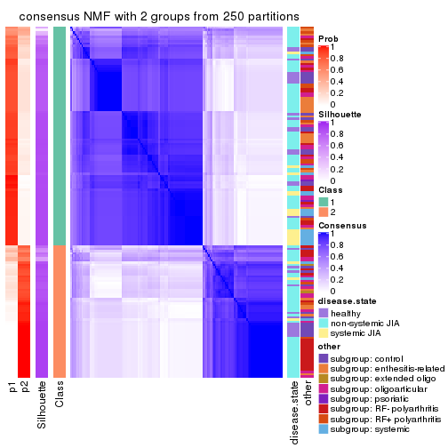</p>

</div>
<div id='tab-CV-NMF-consensus-heatmap-2'>
<pre><code class="r">consensus_heatmap(res, k = 3)
</code></pre>

<p></p>

</div>
<div id='tab-CV-NMF-consensus-heatmap-3'>
<pre><code class="r">consensus_heatmap(res, k = 4)
</code></pre>

<p></p>

</div>
<div id='tab-CV-NMF-consensus-heatmap-4'>
<pre><code class="r">consensus_heatmap(res, k = 5)
</code></pre>

<p></p>

</div>
<div id='tab-CV-NMF-consensus-heatmap-5'>
<pre><code class="r">consensus_heatmap(res, k = 6)
</code></pre>

<p></p>

</div>
</div>

Heatmaps for the membership of samples in all partitions to see how consistent they are:


<script>
$( function() {
	$( '#tabs-CV-NMF-membership-heatmap' ).tabs();
} );
</script>
<div id='tabs-CV-NMF-membership-heatmap'>
<ul>
<li><a href='#tab-CV-NMF-membership-heatmap-1'>k = 2</a></li>
<li><a href='#tab-CV-NMF-membership-heatmap-2'>k = 3</a></li>
<li><a href='#tab-CV-NMF-membership-heatmap-3'>k = 4</a></li>
<li><a href='#tab-CV-NMF-membership-heatmap-4'>k = 5</a></li>
<li><a href='#tab-CV-NMF-membership-heatmap-5'>k = 6</a></li>
</ul>
<div id='tab-CV-NMF-membership-heatmap-1'>
<pre><code class="r">membership_heatmap(res, k = 2)
</code></pre>

<p></p>

</div>
<div id='tab-CV-NMF-membership-heatmap-2'>
<pre><code class="r">membership_heatmap(res, k = 3)
</code></pre>

<p></p>

</div>
<div id='tab-CV-NMF-membership-heatmap-3'>
<pre><code class="r">membership_heatmap(res, k = 4)
</code></pre>

<p></p>

</div>
<div id='tab-CV-NMF-membership-heatmap-4'>
<pre><code class="r">membership_heatmap(res, k = 5)
</code></pre>

<p></p>

</div>
<div id='tab-CV-NMF-membership-heatmap-5'>
<pre><code class="r">membership_heatmap(res, k = 6)
</code></pre>

<p></p>

</div>
</div>

As soon as we have had the classes for columns, we can look for signatures
which are significantly different between classes which can be candidate marks
for certain classes. Following are the heatmaps for signatures.


Signature heatmaps where rows are scaled:


<script>
$( function() {
	$( '#tabs-CV-NMF-get-signatures' ).tabs();
} );
</script>
<div id='tabs-CV-NMF-get-signatures'>
<ul>
<li><a href='#tab-CV-NMF-get-signatures-1'>k = 2</a></li>
<li><a href='#tab-CV-NMF-get-signatures-2'>k = 3</a></li>
<li><a href='#tab-CV-NMF-get-signatures-3'>k = 4</a></li>
<li><a href='#tab-CV-NMF-get-signatures-4'>k = 5</a></li>
<li><a href='#tab-CV-NMF-get-signatures-5'>k = 6</a></li>
</ul>
<div id='tab-CV-NMF-get-signatures-1'>
<pre><code class="r">get_signatures(res, k = 2)
</code></pre>

<p></p>

</div>
<div id='tab-CV-NMF-get-signatures-2'>
<pre><code class="r">get_signatures(res, k = 3)
</code></pre>

<p></p>

</div>
<div id='tab-CV-NMF-get-signatures-3'>
<pre><code class="r">get_signatures(res, k = 4)
</code></pre>

<p></p>

</div>
<div id='tab-CV-NMF-get-signatures-4'>
<pre><code class="r">get_signatures(res, k = 5)
</code></pre>

<p></p>

</div>
<div id='tab-CV-NMF-get-signatures-5'>
<pre><code class="r">get_signatures(res, k = 6)
</code></pre>

<p></p>

</div>
</div>


Signature heatmaps where rows are not scaled:


<script>
$( function() {
	$( '#tabs-CV-NMF-get-signatures-no-scale' ).tabs();
} );
</script>
<div id='tabs-CV-NMF-get-signatures-no-scale'>
<ul>
<li><a href='#tab-CV-NMF-get-signatures-no-scale-1'>k = 2</a></li>
<li><a href='#tab-CV-NMF-get-signatures-no-scale-2'>k = 3</a></li>
<li><a href='#tab-CV-NMF-get-signatures-no-scale-3'>k = 4</a></li>
<li><a href='#tab-CV-NMF-get-signatures-no-scale-4'>k = 5</a></li>
<li><a href='#tab-CV-NMF-get-signatures-no-scale-5'>k = 6</a></li>
</ul>
<div id='tab-CV-NMF-get-signatures-no-scale-1'>
<pre><code class="r">get_signatures(res, k = 2, scale_rows = FALSE)
</code></pre>

<p></p>

</div>
<div id='tab-CV-NMF-get-signatures-no-scale-2'>
<pre><code class="r">get_signatures(res, k = 3, scale_rows = FALSE)
</code></pre>

<p></p>

</div>
<div id='tab-CV-NMF-get-signatures-no-scale-3'>
<pre><code class="r">get_signatures(res, k = 4, scale_rows = FALSE)
</code></pre>

<p></p>

</div>
<div id='tab-CV-NMF-get-signatures-no-scale-4'>
<pre><code class="r">get_signatures(res, k = 5, scale_rows = FALSE)
</code></pre>

<p></p>

</div>
<div id='tab-CV-NMF-get-signatures-no-scale-5'>
<pre><code class="r">get_signatures(res, k = 6, scale_rows = FALSE)
</code></pre>

<p></p>

</div>
</div>


Compare the overlap of signatures from different k:

```r
compare_signatures(res)
```


`get_signature()` returns a data frame invisibly. TO get the list of signatures, the function
call should be assigned to a variable explicitly. In following code, if `plot` argument is set
to `FALSE`, no heatmap is plotted while only the differential analysis is performed.

```r
# code only for demonstration
tb = get_signature(res, k = ..., plot = FALSE)
```

An example of the output of `tb` is:

```
#>   which_row         fdr    mean_1    mean_2 scaled_mean_1 scaled_mean_2 km
#> 1        38 0.042760348  8.373488  9.131774    -0.5533452     0.5164555  1
#> 2        40 0.018707592  7.106213  8.469186    -0.6173731     0.5762149  1
#> 3        55 0.019134737 10.221463 11.207825    -0.6159697     0.5749050  1
#> 4        59 0.006059896  5.921854  7.869574    -0.6899429     0.6439467  1
#> 5        60 0.018055526  8.928898 10.211722    -0.6204761     0.5791110  1
#> 6        98 0.009384629 15.714769 14.887706     0.6635654    -0.6193277  2
...
```

The columns in `tb` are:

1. `which_row`: row indices corresponding to the input matrix.
2. `fdr`: FDR for the differential test. 
3. `mean_x`: The mean value in group x.
4. `scaled_mean_x`: The mean value in group x after rows are scaled.
5. `km`: Row groups if k-means clustering is applied to rows.


UMAP plot which shows how samples are separated.


<script>
$( function() {
	$( '#tabs-CV-NMF-dimension-reduction' ).tabs();
} );
</script>
<div id='tabs-CV-NMF-dimension-reduction'>
<ul>
<li><a href='#tab-CV-NMF-dimension-reduction-1'>k = 2</a></li>
<li><a href='#tab-CV-NMF-dimension-reduction-2'>k = 3</a></li>
<li><a href='#tab-CV-NMF-dimension-reduction-3'>k = 4</a></li>
<li><a href='#tab-CV-NMF-dimension-reduction-4'>k = 5</a></li>
<li><a href='#tab-CV-NMF-dimension-reduction-5'>k = 6</a></li>
</ul>
<div id='tab-CV-NMF-dimension-reduction-1'>
<pre><code class="r">dimension_reduction(res, k = 2, method = &quot;UMAP&quot;)
</code></pre>

<p></p>

</div>
<div id='tab-CV-NMF-dimension-reduction-2'>
<pre><code class="r">dimension_reduction(res, k = 3, method = &quot;UMAP&quot;)
</code></pre>

<p></p>

</div>
<div id='tab-CV-NMF-dimension-reduction-3'>
<pre><code class="r">dimension_reduction(res, k = 4, method = &quot;UMAP&quot;)
</code></pre>

<p></p>

</div>
<div id='tab-CV-NMF-dimension-reduction-4'>
<pre><code class="r">dimension_reduction(res, k = 5, method = &quot;UMAP&quot;)
</code></pre>

<p></p>

</div>
<div id='tab-CV-NMF-dimension-reduction-5'>
<pre><code class="r">dimension_reduction(res, k = 6, method = &quot;UMAP&quot;)
</code></pre>

<p></p>

</div>
</div>


Following heatmap shows how subgroups are split when increasing `k`:

```r
collect_classes(res)
```


Test correlation between subgroups and known annotations. If the known
annotation is numeric, one-way ANOVA test is applied, and if the known
annotation is discrete, chi-squared contingency table test is applied.

```r
test_to_known_factors(res)
```

```
#>          n disease.state(p) other(p) k
#> CV:NMF 148         1.41e-01 7.12e-03 2
#> CV:NMF 133         5.11e-01 6.63e-02 3
#> CV:NMF 143         2.11e-06 1.85e-07 4
#> CV:NMF 140         8.07e-06 1.72e-07 5
#> CV:NMF 141         3.11e-09 1.78e-10 6
```


If matrix rows can be associated to genes, consider to use `GO_Enrichment(res,
...)` to perform function enrichment for the signature genes.


 

---------------------------------------------------


### MAD:hclust


The object with results only for a single top-value method and a single partition method 
can be extracted as:

```r
res = res_list["MAD", "hclust"]
# you can also extract it by
# res = res_list["MAD:hclust"]
```

A summary of `res` and all the functions that can be applied to it:

```r
res
```

```
#> A 'ConsensusPartition' object with k = 2, 3, 4, 5, 6.
#>   On a matrix with 51941 rows and 154 columns.
#>   Top rows (1000, 2000, 3000, 4000, 5000) are extracted by 'MAD' method.
#>   Subgroups are detected by 'hclust' method.
#>   Performed in total 1250 partitions by row resampling.
#>   Best k for subgroups seems to be 3.
#> 
#> Following methods can be applied to this 'ConsensusPartition' object:
#>  [1] "cola_report"             "collect_classes"         "collect_plots"          
#>  [4] "collect_stats"           "colnames"                "compare_signatures"     
#>  [7] "consensus_heatmap"       "dimension_reduction"     "functional_enrichment"  
#> [10] "get_anno_col"            "get_anno"                "get_classes"            
#> [13] "get_consensus"           "get_matrix"              "get_membership"         
#> [16] "get_param"               "get_signatures"          "get_stats"              
#> [19] "is_best_k"               "is_stable_k"             "membership_heatmap"     
#> [22] "ncol"                    "nrow"                    "plot_ecdf"              
#> [25] "rownames"                "select_partition_number" "show"                   
#> [28] "suggest_best_k"          "test_to_known_factors"
```

`collect_plots()` function collects all the plots made from `res` for all `k` (number of partitions)
into one single page to provide an easy and fast comparison between different `k`.

```r
collect_plots(res)
```


The plots are:

- The first row: a plot of the ECDF (Empirical cumulative distribution
  function) curves of the consensus matrix for each `k` and the heatmap of
  predicted classes for each `k`.
- The second row: heatmaps of the consensus matrix for each `k`.
- The third row: heatmaps of the membership matrix for each `k`.
- The fouth row: heatmaps of the signatures for each `k`.

All the plots in panels can be made by individual functions and they are
plotted later in this section.

`select_partition_number()` produces several plots showing different
statistics for choosing "optimized" `k`. There are following statistics:

- ECDF curves of the consensus matrix for each `k`;
- 1-PAC. [The PAC
  score](https://en.wikipedia.org/wiki/Consensus_clustering#Over-interpretation_potential_of_consensus_clustering)
  measures the proportion of the ambiguous subgrouping.
- Mean silhouette score.
- Concordance. The mean probability of fiting the consensus class ids in all
  partitions.
- Area increased. Denote $A_k$ as the area under the ECDF curve for current
  `k`, the area increased is defined as $A_k - A_{k-1}$.
- Rand index. The percent of pairs of samples that are both in a same cluster
  or both are not in a same cluster in the partition of k and k-1.
- Jaccard index. The ratio of pairs of samples are both in a same cluster in
  the partition of k and k-1 and the pairs of samples are both in a same
  cluster in the partition k or k-1.

The detailed explanations of these statistics can be found in [the cola
vignette](http://bioconductor.org/packages/devel/bioc/vignettes/cola/inst/doc/cola.html#toc_13).

Generally speaking, lower PAC score, higher mean silhouette score or higher
concordance corresponds to better partition. Rand index and Jaccard index
measure how similar the current partition is compared to partition with `k-1`.
If they are too similar, we won't accept `k` is better than `k-1`.

```r
select_partition_number(res)
```


The numeric values for all these statistics can be obtained by `get_stats()`.

```r
get_stats(res)
```

```
#>   k 1-PAC mean_silhouette concordance area_increased  Rand Jaccard
#> 2 2 0.254           0.608       0.831         0.2983 0.735   0.735
#> 3 3 0.164           0.574       0.758         0.6637 0.760   0.682
#> 4 4 0.235           0.464       0.684         0.2246 0.829   0.689
#> 5 5 0.291           0.412       0.634         0.1245 0.893   0.744
#> 6 6 0.375           0.423       0.659         0.0634 0.920   0.771
```

`suggest_best_k()` suggests the best $k$ based on these statistics. The rules are as follows:

- All $k$ with Jaccard index larger than 0.95 are removed because the increase of
  the partition number does not provides enough extra information. If all $k$ are removed,
  the best $k$ is assigned by `NA`.
- For $k$ with 1-PAC larger than 0.9, the maximal $k$ is taken as the "best k". Other $k$ is called "optional k".
- If it does not fit the second rule. The $k$ with the highest vote of highest
  1-PAC, mean silhouette and concordance is taken as the "best k".

```r
suggest_best_k(res)
```

```
#> [1] 3
```


Following shows the table of the partitions (You need to click the **show/hide
code output** link to see it). The membership matrix (columns with name `p*`)
is inferred by
[`clue::cl_consensus()`](https://www.rdocumentation.org/link/cl_consensus?package=clue)
function with the `SE` method. Basically the value in the membership matrix
represents the probability to belong to a certain group. The finall class
label for an item is determined with the group with highest probability it
belongs to.

In `get_classes()` function, the entropy is calculated from the membership
matrix and the silhouette score is calculated from the consensus matrix.


<script>
$( function() {
	$( '#tabs-MAD-hclust-get-classes' ).tabs();
} );
</script>
<div id='tabs-MAD-hclust-get-classes'>
<ul>
<li><a href='#tab-MAD-hclust-get-classes-1'>k = 2</a></li>
<li><a href='#tab-MAD-hclust-get-classes-2'>k = 3</a></li>
<li><a href='#tab-MAD-hclust-get-classes-3'>k = 4</a></li>
<li><a href='#tab-MAD-hclust-get-classes-4'>k = 5</a></li>
<li><a href='#tab-MAD-hclust-get-classes-5'>k = 6</a></li>
</ul>

<div id='tab-MAD-hclust-get-classes-1'>
<p><a id='tab-MAD-hclust-get-classes-1-a' style='color:#0366d6' href='#'>show/hide code output</a></p>
<pre><code class="r">cbind(get_classes(res, k = 2), get_membership(res, k = 2))
</code></pre>

<pre><code>#&gt;           class entropy silhouette    p1    p2
#&gt; GSM340358     1  0.6973    0.64541 0.812 0.188
#&gt; GSM340359     1  0.8661    0.35571 0.712 0.288
#&gt; GSM340361     2  0.9977    0.59374 0.472 0.528
#&gt; GSM340362     1  0.9460    0.05366 0.636 0.364
#&gt; GSM340363     1  0.6801    0.65321 0.820 0.180
#&gt; GSM340364     2  0.9996    0.54572 0.488 0.512
#&gt; GSM340365     2  0.9922    0.64183 0.448 0.552
#&gt; GSM340366     1  0.9358    0.19797 0.648 0.352
#&gt; GSM340367     2  0.7883    0.65231 0.236 0.764
#&gt; GSM340368     1  0.2948    0.78571 0.948 0.052
#&gt; GSM340369     1  0.1414    0.78710 0.980 0.020
#&gt; GSM340370     2  0.7950    0.65122 0.240 0.760
#&gt; GSM340371     1  0.9754   -0.19119 0.592 0.408
#&gt; GSM340372     2  0.7883    0.65231 0.236 0.764
#&gt; GSM340373     2  0.7883    0.65231 0.236 0.764
#&gt; GSM340375     1  0.8861    0.28991 0.696 0.304
#&gt; GSM340376     1  0.6973    0.65206 0.812 0.188
#&gt; GSM340378     1  0.9710    0.00101 0.600 0.400
#&gt; GSM340243     1  0.0938    0.79119 0.988 0.012
#&gt; GSM340244     1  0.1414    0.78947 0.980 0.020
#&gt; GSM340246     1  0.0938    0.79111 0.988 0.012
#&gt; GSM340247     1  0.0000    0.78796 1.000 0.000
#&gt; GSM340248     1  0.0000    0.78796 1.000 0.000
#&gt; GSM340249     1  0.0672    0.79079 0.992 0.008
#&gt; GSM340250     1  0.2778    0.78436 0.952 0.048
#&gt; GSM340251     1  0.0672    0.78969 0.992 0.008
#&gt; GSM340252     1  0.6623    0.63754 0.828 0.172
#&gt; GSM340253     1  0.9286    0.13765 0.656 0.344
#&gt; GSM340254     1  0.6801    0.63041 0.820 0.180
#&gt; GSM340256     1  0.4298    0.75082 0.912 0.088
#&gt; GSM340258     1  0.5408    0.71141 0.876 0.124
#&gt; GSM340259     2  0.9358    0.57994 0.352 0.648
#&gt; GSM340260     2  0.9286    0.68044 0.344 0.656
#&gt; GSM340261     1  0.4431    0.73807 0.908 0.092
#&gt; GSM340262     1  0.9170    0.18717 0.668 0.332
#&gt; GSM340263     1  0.1633    0.78913 0.976 0.024
#&gt; GSM340264     2  0.9896    0.56321 0.440 0.560
#&gt; GSM340265     2  0.9896    0.56321 0.440 0.560
#&gt; GSM340266     1  0.0938    0.79101 0.988 0.012
#&gt; GSM340267     1  0.9608   -0.11224 0.616 0.384
#&gt; GSM340268     1  0.1633    0.78607 0.976 0.024
#&gt; GSM340269     1  0.0938    0.79009 0.988 0.012
#&gt; GSM340270     1  0.7139    0.63699 0.804 0.196
#&gt; GSM537574     1  0.0938    0.79012 0.988 0.012
#&gt; GSM537580     1  0.9754   -0.19119 0.592 0.408
#&gt; GSM537581     1  0.0672    0.78944 0.992 0.008
#&gt; GSM340272     1  0.9427    0.15845 0.640 0.360
#&gt; GSM340273     1  0.1843    0.78944 0.972 0.028
#&gt; GSM340275     1  0.1414    0.78947 0.980 0.020
#&gt; GSM340276     1  0.5408    0.73166 0.876 0.124
#&gt; GSM340277     1  0.6148    0.66825 0.848 0.152
#&gt; GSM340278     1  0.3114    0.77491 0.944 0.056
#&gt; GSM340279     1  0.1184    0.79201 0.984 0.016
#&gt; GSM340282     1  0.9358    0.19797 0.648 0.352
#&gt; GSM340284     1  0.0000    0.78796 1.000 0.000
#&gt; GSM340285     1  0.6623    0.66573 0.828 0.172
#&gt; GSM340286     1  0.8955    0.26355 0.688 0.312
#&gt; GSM340287     1  0.4562    0.73394 0.904 0.096
#&gt; GSM340288     2  0.9881    0.63788 0.436 0.564
#&gt; GSM340289     2  0.2778    0.53897 0.048 0.952
#&gt; GSM340290     1  0.1414    0.79273 0.980 0.020
#&gt; GSM340291     1  0.1843    0.79085 0.972 0.028
#&gt; GSM340293     1  0.1633    0.78568 0.976 0.024
#&gt; GSM340294     1  0.4022    0.74924 0.920 0.080
#&gt; GSM340296     1  0.0938    0.79119 0.988 0.012
#&gt; GSM340297     1  0.4690    0.73015 0.900 0.100
#&gt; GSM340298     1  0.2043    0.78947 0.968 0.032
#&gt; GSM340299     1  0.9460    0.05366 0.636 0.364
#&gt; GSM340301     2  0.9983    0.55546 0.476 0.524
#&gt; GSM340303     2  0.9896    0.56321 0.440 0.560
#&gt; GSM340304     1  0.6712    0.68452 0.824 0.176
#&gt; GSM340306     1  0.7950    0.50682 0.760 0.240
#&gt; GSM340307     1  0.2236    0.78969 0.964 0.036
#&gt; GSM340310     1  0.7745    0.58452 0.772 0.228
#&gt; GSM340314     1  0.4690    0.73015 0.900 0.100
#&gt; GSM340315     1  0.2043    0.78522 0.968 0.032
#&gt; GSM340317     1  0.1633    0.78913 0.976 0.024
#&gt; GSM340318     1  0.0000    0.78796 1.000 0.000
#&gt; GSM340319     1  0.0000    0.78796 1.000 0.000
#&gt; GSM340320     1  0.4690    0.73015 0.900 0.100
#&gt; GSM340321     1  0.0000    0.78796 1.000 0.000
#&gt; GSM340322     1  0.0938    0.79009 0.988 0.012
#&gt; GSM340324     1  0.4298    0.75082 0.912 0.088
#&gt; GSM340328     1  0.6973    0.64541 0.812 0.188
#&gt; GSM340330     1  0.1633    0.79196 0.976 0.024
#&gt; GSM340332     1  0.0938    0.78899 0.988 0.012
#&gt; GSM340333     1  0.8713    0.34133 0.708 0.292
#&gt; GSM340336     1  0.0000    0.78796 1.000 0.000
#&gt; GSM340337     1  0.0938    0.79009 0.988 0.012
#&gt; GSM340338     1  0.5842    0.71687 0.860 0.140
#&gt; GSM340339     1  0.0938    0.78923 0.988 0.012
#&gt; GSM340340     1  0.2948    0.78454 0.948 0.052
#&gt; GSM340341     1  0.3733    0.76909 0.928 0.072
#&gt; GSM340343     1  0.8813    0.36518 0.700 0.300
#&gt; GSM340344     1  0.9286    0.13765 0.656 0.344
#&gt; GSM340346     1  0.3431    0.78081 0.936 0.064
#&gt; GSM340347     1  0.0000    0.78796 1.000 0.000
#&gt; GSM340348     1  0.1843    0.79158 0.972 0.028
#&gt; GSM340349     1  0.8909    0.37678 0.692 0.308
#&gt; GSM340350     1  0.8813    0.41726 0.700 0.300
#&gt; GSM340351     2  0.9850    0.64898 0.428 0.572
#&gt; GSM340354     1  0.0938    0.79120 0.988 0.012
#&gt; GSM340356     1  0.2236    0.78782 0.964 0.036
#&gt; GSM340357     1  0.9552    0.09394 0.624 0.376
#&gt; GSM348183     1  0.9896   -0.18746 0.560 0.440
#&gt; GSM348191     1  0.4161    0.75401 0.916 0.084
#&gt; GSM348193     1  0.7745    0.58452 0.772 0.228
#&gt; GSM537578     1  0.9732   -0.05314 0.596 0.404
#&gt; GSM348181     1  0.9732    0.02259 0.596 0.404
#&gt; GSM348182     2  0.9044    0.67762 0.320 0.680
#&gt; GSM348184     1  0.0000    0.78796 1.000 0.000
#&gt; GSM348185     1  0.2236    0.78861 0.964 0.036
#&gt; GSM348186     1  0.6247    0.66835 0.844 0.156
#&gt; GSM348187     1  0.6048    0.69970 0.852 0.148
#&gt; GSM348188     1  0.9248    0.29175 0.660 0.340
#&gt; GSM348189     1  0.9754   -0.19119 0.592 0.408
#&gt; GSM348190     1  0.9732   -0.14084 0.596 0.404
#&gt; GSM348194     2  0.9881    0.63788 0.436 0.564
#&gt; GSM348195     2  0.9850    0.64898 0.428 0.572
#&gt; GSM348196     1  0.6048    0.69970 0.852 0.148
#&gt; GSM537585     2  0.9427    0.68250 0.360 0.640
#&gt; GSM537594     1  0.1633    0.78901 0.976 0.024
#&gt; GSM537596     1  0.4298    0.76732 0.912 0.088
#&gt; GSM537597     1  0.3431    0.78090 0.936 0.064
#&gt; GSM537602     1  0.6712    0.68452 0.824 0.176
#&gt; GSM340184     1  0.1184    0.79002 0.984 0.016
#&gt; GSM340185     1  0.0672    0.78962 0.992 0.008
#&gt; GSM340186     1  0.0672    0.78969 0.992 0.008
#&gt; GSM340187     1  0.0000    0.78796 1.000 0.000
#&gt; GSM340189     1  0.1633    0.78568 0.976 0.024
#&gt; GSM340190     1  0.0000    0.78796 1.000 0.000
#&gt; GSM340191     1  0.1633    0.78663 0.976 0.024
#&gt; GSM340192     1  0.5294    0.71065 0.880 0.120
#&gt; GSM340193     2  0.9552    0.56064 0.376 0.624
#&gt; GSM340194     1  0.9460    0.05366 0.636 0.364
#&gt; GSM340195     2  0.9998    0.51488 0.492 0.508
#&gt; GSM340196     1  0.0000    0.78796 1.000 0.000
#&gt; GSM340197     2  0.9970    0.57343 0.468 0.532
#&gt; GSM340198     1  0.6801    0.63041 0.820 0.180
#&gt; GSM340199     1  0.1843    0.78515 0.972 0.028
#&gt; GSM340200     1  0.0938    0.79135 0.988 0.012
#&gt; GSM340201     1  0.0000    0.78796 1.000 0.000
#&gt; GSM340202     1  0.0000    0.78796 1.000 0.000
#&gt; GSM340203     1  0.0376    0.78889 0.996 0.004
#&gt; GSM340204     1  0.6531    0.65072 0.832 0.168
#&gt; GSM340205     1  0.8955    0.36498 0.688 0.312
#&gt; GSM340206     1  0.0672    0.79045 0.992 0.008
#&gt; GSM340207     1  0.6531    0.64173 0.832 0.168
#&gt; GSM340237     1  0.1843    0.79085 0.972 0.028
#&gt; GSM340238     1  0.1414    0.78759 0.980 0.020
#&gt; GSM340239     2  0.9754    0.66193 0.408 0.592
#&gt; GSM340240     1  0.6148    0.66825 0.848 0.152
#&gt; GSM340241     1  0.1843    0.78897 0.972 0.028
#&gt; GSM340242     1  0.9754   -0.19119 0.592 0.408
</code></pre>

<script>
$('#tab-MAD-hclust-get-classes-1-a').parent().next().next().hide();
$('#tab-MAD-hclust-get-classes-1-a').click(function(){
  $('#tab-MAD-hclust-get-classes-1-a').parent().next().next().toggle();
  return(false);
});
</script>
</div>

<div id='tab-MAD-hclust-get-classes-2'>
<p><a id='tab-MAD-hclust-get-classes-2-a' style='color:#0366d6' href='#'>show/hide code output</a></p>
<pre><code class="r">cbind(get_classes(res, k = 3), get_membership(res, k = 3))
</code></pre>

<pre><code>#&gt;           class entropy silhouette    p1    p2    p3
#&gt; GSM340358     2  0.7906     0.5860 0.220 0.656 0.124
#&gt; GSM340359     3  0.5812     0.5091 0.012 0.264 0.724
#&gt; GSM340361     1  0.8938     0.5328 0.528 0.144 0.328
#&gt; GSM340362     3  0.5178     0.5158 0.028 0.164 0.808
#&gt; GSM340363     2  0.7906     0.5947 0.220 0.656 0.124
#&gt; GSM340364     1  0.9553     0.4477 0.484 0.272 0.244
#&gt; GSM340365     1  0.9289     0.3868 0.444 0.160 0.396
#&gt; GSM340366     3  0.8984     0.1610 0.128 0.432 0.440
#&gt; GSM340367     1  0.5915     0.6698 0.792 0.080 0.128
#&gt; GSM340368     2  0.4914     0.7711 0.088 0.844 0.068
#&gt; GSM340369     2  0.1751     0.7938 0.012 0.960 0.028
#&gt; GSM340370     1  0.6091     0.6697 0.784 0.092 0.124
#&gt; GSM340371     3  0.7421     0.4889 0.084 0.240 0.676
#&gt; GSM340372     1  0.5915     0.6698 0.792 0.080 0.128
#&gt; GSM340373     1  0.5915     0.6698 0.792 0.080 0.128
#&gt; GSM340375     3  0.9385     0.1083 0.248 0.240 0.512
#&gt; GSM340376     2  0.7884     0.5876 0.224 0.656 0.120
#&gt; GSM340378     2  0.9398    -0.1718 0.400 0.428 0.172
#&gt; GSM340243     2  0.1919     0.7974 0.020 0.956 0.024
#&gt; GSM340244     2  0.3481     0.7835 0.044 0.904 0.052
#&gt; GSM340246     2  0.2443     0.7974 0.028 0.940 0.032
#&gt; GSM340247     2  0.0892     0.7938 0.000 0.980 0.020
#&gt; GSM340248     2  0.1585     0.7918 0.008 0.964 0.028
#&gt; GSM340249     2  0.2527     0.7961 0.020 0.936 0.044
#&gt; GSM340250     2  0.5803     0.6505 0.028 0.760 0.212
#&gt; GSM340251     2  0.1289     0.7921 0.000 0.968 0.032
#&gt; GSM340252     3  0.7069     0.2389 0.020 0.472 0.508
#&gt; GSM340253     3  0.4473     0.5244 0.008 0.164 0.828
#&gt; GSM340254     3  0.7174     0.2678 0.024 0.460 0.516
#&gt; GSM340256     2  0.5826     0.6615 0.032 0.764 0.204
#&gt; GSM340258     2  0.6651     0.4237 0.024 0.656 0.320
#&gt; GSM340259     1  0.7979     0.4903 0.640 0.248 0.112
#&gt; GSM340260     3  0.7874     0.2000 0.320 0.076 0.604
#&gt; GSM340261     2  0.3888     0.7676 0.064 0.888 0.048
#&gt; GSM340262     3  0.6954     0.4431 0.028 0.352 0.620
#&gt; GSM340263     2  0.3694     0.7811 0.052 0.896 0.052
#&gt; GSM340264     3  0.5988     0.3510 0.168 0.056 0.776
#&gt; GSM340265     3  0.5875     0.3559 0.160 0.056 0.784
#&gt; GSM340266     2  0.2947     0.7973 0.020 0.920 0.060
#&gt; GSM340267     3  0.7930     0.3948 0.168 0.168 0.664
#&gt; GSM340268     2  0.1711     0.7938 0.008 0.960 0.032
#&gt; GSM340269     2  0.2584     0.7905 0.008 0.928 0.064
#&gt; GSM340270     2  0.7317     0.6297 0.208 0.696 0.096
#&gt; GSM537574     2  0.2173     0.7953 0.008 0.944 0.048
#&gt; GSM537580     3  0.7421     0.4889 0.084 0.240 0.676
#&gt; GSM537581     2  0.3337     0.7941 0.032 0.908 0.060
#&gt; GSM340272     3  0.9070     0.1514 0.136 0.428 0.436
#&gt; GSM340273     2  0.4921     0.7643 0.072 0.844 0.084
#&gt; GSM340275     2  0.3481     0.7835 0.044 0.904 0.052
#&gt; GSM340276     2  0.5965     0.7453 0.108 0.792 0.100
#&gt; GSM340277     2  0.6819    -0.1499 0.012 0.512 0.476
#&gt; GSM340278     2  0.3042     0.7907 0.040 0.920 0.040
#&gt; GSM340279     2  0.1832     0.7953 0.008 0.956 0.036
#&gt; GSM340282     3  0.8984     0.1610 0.128 0.432 0.440
#&gt; GSM340284     2  0.1163     0.7891 0.000 0.972 0.028
#&gt; GSM340285     2  0.5875     0.7214 0.136 0.792 0.072
#&gt; GSM340286     3  0.6326     0.4928 0.020 0.292 0.688
#&gt; GSM340287     2  0.4189     0.7627 0.068 0.876 0.056
#&gt; GSM340288     1  0.8494     0.6487 0.608 0.156 0.236
#&gt; GSM340289     1  0.3995     0.4979 0.868 0.016 0.116
#&gt; GSM340290     2  0.2527     0.8007 0.020 0.936 0.044
#&gt; GSM340291     2  0.3481     0.7915 0.052 0.904 0.044
#&gt; GSM340293     2  0.1877     0.7926 0.012 0.956 0.032
#&gt; GSM340294     2  0.3583     0.7748 0.056 0.900 0.044
#&gt; GSM340296     2  0.1919     0.7974 0.020 0.956 0.024
#&gt; GSM340297     2  0.4189     0.7645 0.068 0.876 0.056
#&gt; GSM340298     2  0.3183     0.7911 0.016 0.908 0.076
#&gt; GSM340299     3  0.5178     0.5158 0.028 0.164 0.808
#&gt; GSM340301     3  0.7699     0.3152 0.212 0.116 0.672
#&gt; GSM340303     3  0.5875     0.3559 0.160 0.056 0.784
#&gt; GSM340304     2  0.7223     0.6679 0.144 0.716 0.140
#&gt; GSM340306     2  0.9213     0.2487 0.228 0.536 0.236
#&gt; GSM340307     2  0.3528     0.7849 0.016 0.892 0.092
#&gt; GSM340310     2  0.8255     0.5226 0.252 0.620 0.128
#&gt; GSM340314     2  0.3583     0.7668 0.056 0.900 0.044
#&gt; GSM340315     2  0.3896     0.7784 0.060 0.888 0.052
#&gt; GSM340317     2  0.3694     0.7811 0.052 0.896 0.052
#&gt; GSM340318     2  0.0747     0.7932 0.000 0.984 0.016
#&gt; GSM340319     2  0.0747     0.7932 0.000 0.984 0.016
#&gt; GSM340320     2  0.4189     0.7645 0.068 0.876 0.056
#&gt; GSM340321     2  0.1163     0.7891 0.000 0.972 0.028
#&gt; GSM340322     2  0.2550     0.7959 0.012 0.932 0.056
#&gt; GSM340324     2  0.5826     0.6615 0.032 0.764 0.204
#&gt; GSM340328     2  0.7844     0.5918 0.220 0.660 0.120
#&gt; GSM340330     2  0.3129     0.7851 0.008 0.904 0.088
#&gt; GSM340332     2  0.1877     0.7985 0.012 0.956 0.032
#&gt; GSM340333     3  0.5775     0.5112 0.012 0.260 0.728
#&gt; GSM340336     2  0.0747     0.7932 0.000 0.984 0.016
#&gt; GSM340337     2  0.2902     0.7931 0.016 0.920 0.064
#&gt; GSM340338     2  0.5919     0.6234 0.016 0.724 0.260
#&gt; GSM340339     2  0.2229     0.7997 0.012 0.944 0.044
#&gt; GSM340340     2  0.4544     0.7723 0.084 0.860 0.056
#&gt; GSM340341     2  0.4782     0.7356 0.016 0.820 0.164
#&gt; GSM340343     2  0.7424     0.5121 0.288 0.648 0.064
#&gt; GSM340344     3  0.4473     0.5244 0.008 0.164 0.828
#&gt; GSM340346     2  0.4209     0.7727 0.020 0.860 0.120
#&gt; GSM340347     2  0.1765     0.7961 0.004 0.956 0.040
#&gt; GSM340348     2  0.3325     0.7906 0.020 0.904 0.076
#&gt; GSM340349     2  0.8994     0.3278 0.260 0.556 0.184
#&gt; GSM340350     2  0.9181     0.3107 0.236 0.540 0.224
#&gt; GSM340351     1  0.8494     0.6497 0.608 0.156 0.236
#&gt; GSM340354     2  0.1643     0.7898 0.000 0.956 0.044
#&gt; GSM340356     2  0.6111     0.7217 0.112 0.784 0.104
#&gt; GSM340357     2  0.9621    -0.1323 0.360 0.432 0.208
#&gt; GSM348183     2  0.9576    -0.2246 0.396 0.408 0.196
#&gt; GSM348191     2  0.4179     0.7740 0.052 0.876 0.072
#&gt; GSM348193     2  0.8255     0.5226 0.252 0.620 0.128
#&gt; GSM537578     2  0.9616    -0.1704 0.376 0.420 0.204
#&gt; GSM348181     2  0.8714     0.0731 0.408 0.484 0.108
#&gt; GSM348182     3  0.7600     0.1483 0.344 0.056 0.600
#&gt; GSM348184     2  0.1163     0.7891 0.000 0.972 0.028
#&gt; GSM348185     2  0.5093     0.7587 0.088 0.836 0.076
#&gt; GSM348186     2  0.7187    -0.1797 0.024 0.496 0.480
#&gt; GSM348187     2  0.8392     0.5446 0.200 0.624 0.176
#&gt; GSM348188     2  0.9133     0.2083 0.332 0.508 0.160
#&gt; GSM348189     3  0.7421     0.4889 0.084 0.240 0.676
#&gt; GSM348190     3  0.8608     0.3235 0.204 0.192 0.604
#&gt; GSM348194     1  0.8494     0.6487 0.608 0.156 0.236
#&gt; GSM348195     1  0.8494     0.6497 0.608 0.156 0.236
#&gt; GSM348196     2  0.8392     0.5446 0.200 0.624 0.176
#&gt; GSM537585     3  0.8902    -0.1205 0.396 0.124 0.480
#&gt; GSM537594     2  0.4925     0.7618 0.076 0.844 0.080
#&gt; GSM537596     2  0.6313     0.7352 0.084 0.768 0.148
#&gt; GSM537597     2  0.6850     0.6927 0.120 0.740 0.140
#&gt; GSM537602     2  0.7223     0.6679 0.144 0.716 0.140
#&gt; GSM340184     2  0.2749     0.7902 0.012 0.924 0.064
#&gt; GSM340185     2  0.1647     0.7894 0.004 0.960 0.036
#&gt; GSM340186     2  0.1529     0.7910 0.000 0.960 0.040
#&gt; GSM340187     2  0.1031     0.7895 0.000 0.976 0.024
#&gt; GSM340189     2  0.1711     0.7924 0.008 0.960 0.032
#&gt; GSM340190     2  0.1399     0.7891 0.004 0.968 0.028
#&gt; GSM340191     2  0.2414     0.8008 0.020 0.940 0.040
#&gt; GSM340192     2  0.6745     0.0414 0.012 0.560 0.428
#&gt; GSM340193     1  0.8103     0.4913 0.632 0.248 0.120
#&gt; GSM340194     3  0.5178     0.5158 0.028 0.164 0.808
#&gt; GSM340195     3  0.7113     0.4170 0.168 0.112 0.720
#&gt; GSM340196     2  0.0892     0.7938 0.000 0.980 0.020
#&gt; GSM340197     3  0.7757     0.2934 0.224 0.112 0.664
#&gt; GSM340198     3  0.7174     0.2678 0.024 0.460 0.516
#&gt; GSM340199     2  0.2063     0.7946 0.008 0.948 0.044
#&gt; GSM340200     2  0.1989     0.7930 0.004 0.948 0.048
#&gt; GSM340201     2  0.1711     0.7963 0.008 0.960 0.032
#&gt; GSM340202     2  0.1031     0.7949 0.000 0.976 0.024
#&gt; GSM340203     2  0.1620     0.7942 0.012 0.964 0.024
#&gt; GSM340204     3  0.7584     0.2211 0.040 0.472 0.488
#&gt; GSM340205     2  0.8137     0.4193 0.316 0.592 0.092
#&gt; GSM340206     2  0.2492     0.7940 0.016 0.936 0.048
#&gt; GSM340207     2  0.6994     0.0486 0.020 0.556 0.424
#&gt; GSM340237     2  0.3481     0.7915 0.052 0.904 0.044
#&gt; GSM340238     2  0.1751     0.7950 0.012 0.960 0.028
#&gt; GSM340239     3  0.8345     0.0390 0.344 0.096 0.560
#&gt; GSM340240     2  0.6825    -0.1850 0.012 0.500 0.488
#&gt; GSM340241     2  0.3459     0.7843 0.012 0.892 0.096
#&gt; GSM340242     3  0.7421     0.4889 0.084 0.240 0.676
</code></pre>

<script>
$('#tab-MAD-hclust-get-classes-2-a').parent().next().next().hide();
$('#tab-MAD-hclust-get-classes-2-a').click(function(){
  $('#tab-MAD-hclust-get-classes-2-a').parent().next().next().toggle();
  return(false);
});
</script>
</div>

<div id='tab-MAD-hclust-get-classes-3'>
<p><a id='tab-MAD-hclust-get-classes-3-a' style='color:#0366d6' href='#'>show/hide code output</a></p>
<pre><code class="r">cbind(get_classes(res, k = 4), get_membership(res, k = 4))
</code></pre>

<pre><code>#&gt;           class entropy silhouette    p1    p2    p3    p4
#&gt; GSM340358     1  0.6655   0.271357 0.476 0.084 0.000 0.440
#&gt; GSM340359     3  0.6829   0.530009 0.256 0.004 0.604 0.136
#&gt; GSM340361     1  0.7944  -0.582029 0.436 0.412 0.112 0.040
#&gt; GSM340362     3  0.5544   0.503477 0.332 0.008 0.640 0.020
#&gt; GSM340363     1  0.6658   0.257443 0.472 0.084 0.000 0.444
#&gt; GSM340364     2  0.8818   0.373019 0.352 0.408 0.072 0.168
#&gt; GSM340365     1  0.8694  -0.507253 0.384 0.380 0.180 0.056
#&gt; GSM340366     1  0.8627  -0.005863 0.464 0.056 0.280 0.200
#&gt; GSM340367     2  0.5080   0.681535 0.216 0.744 0.012 0.028
#&gt; GSM340368     4  0.5090   0.491833 0.312 0.012 0.004 0.672
#&gt; GSM340369     4  0.1792   0.726983 0.068 0.000 0.000 0.932
#&gt; GSM340370     2  0.5242   0.675801 0.224 0.732 0.012 0.032
#&gt; GSM340371     3  0.4612   0.480478 0.020 0.012 0.780 0.188
#&gt; GSM340372     2  0.5080   0.681535 0.216 0.744 0.012 0.028
#&gt; GSM340373     2  0.5080   0.681535 0.216 0.744 0.012 0.028
#&gt; GSM340375     3  0.9250   0.000662 0.256 0.144 0.440 0.160
#&gt; GSM340376     1  0.6826   0.251228 0.460 0.084 0.004 0.452
#&gt; GSM340378     1  0.8331   0.270293 0.388 0.304 0.016 0.292
#&gt; GSM340243     4  0.1938   0.733560 0.052 0.012 0.000 0.936
#&gt; GSM340244     4  0.3764   0.631389 0.216 0.000 0.000 0.784
#&gt; GSM340246     4  0.2599   0.730238 0.064 0.020 0.004 0.912
#&gt; GSM340247     4  0.1824   0.728040 0.060 0.000 0.004 0.936
#&gt; GSM340248     4  0.2234   0.732742 0.064 0.008 0.004 0.924
#&gt; GSM340249     4  0.3024   0.694857 0.148 0.000 0.000 0.852
#&gt; GSM340250     4  0.5977   0.462461 0.192 0.000 0.120 0.688
#&gt; GSM340251     4  0.0817   0.729727 0.024 0.000 0.000 0.976
#&gt; GSM340252     3  0.7911   0.211563 0.236 0.004 0.404 0.356
#&gt; GSM340253     3  0.5471   0.521852 0.284 0.008 0.680 0.028
#&gt; GSM340254     3  0.7908   0.238276 0.240 0.004 0.416 0.340
#&gt; GSM340256     4  0.6441   0.408809 0.220 0.004 0.124 0.652
#&gt; GSM340258     4  0.7156   0.144904 0.184 0.004 0.236 0.576
#&gt; GSM340259     2  0.7193   0.338636 0.268 0.580 0.012 0.140
#&gt; GSM340260     3  0.7621   0.268997 0.200 0.252 0.536 0.012
#&gt; GSM340261     4  0.4611   0.641893 0.172 0.032 0.008 0.788
#&gt; GSM340262     3  0.7908   0.434392 0.232 0.016 0.504 0.248
#&gt; GSM340263     4  0.4194   0.607969 0.228 0.008 0.000 0.764
#&gt; GSM340264     3  0.4098   0.402406 0.024 0.104 0.844 0.028
#&gt; GSM340265     3  0.3975   0.407937 0.024 0.096 0.852 0.028
#&gt; GSM340266     4  0.3577   0.699469 0.156 0.000 0.012 0.832
#&gt; GSM340267     3  0.7524   0.377078 0.144 0.124 0.640 0.092
#&gt; GSM340268     4  0.2149   0.724703 0.088 0.000 0.000 0.912
#&gt; GSM340269     4  0.2730   0.724906 0.088 0.000 0.016 0.896
#&gt; GSM340270     4  0.7187  -0.042619 0.364 0.104 0.012 0.520
#&gt; GSM537574     4  0.2329   0.725308 0.072 0.000 0.012 0.916
#&gt; GSM537580     3  0.4612   0.480478 0.020 0.012 0.780 0.188
#&gt; GSM537581     4  0.3808   0.673606 0.184 0.004 0.004 0.808
#&gt; GSM340272     1  0.8691  -0.009905 0.456 0.060 0.288 0.196
#&gt; GSM340273     4  0.4957   0.433306 0.336 0.004 0.004 0.656
#&gt; GSM340275     4  0.3764   0.634600 0.216 0.000 0.000 0.784
#&gt; GSM340276     4  0.5646   0.497395 0.272 0.056 0.000 0.672
#&gt; GSM340277     3  0.8099   0.221386 0.256 0.008 0.380 0.356
#&gt; GSM340278     4  0.3672   0.691851 0.164 0.012 0.000 0.824
#&gt; GSM340279     4  0.2862   0.726174 0.076 0.012 0.012 0.900
#&gt; GSM340282     1  0.8627  -0.005863 0.464 0.056 0.280 0.200
#&gt; GSM340284     4  0.0707   0.727433 0.020 0.000 0.000 0.980
#&gt; GSM340285     4  0.6333   0.441057 0.272 0.088 0.004 0.636
#&gt; GSM340286     3  0.7532   0.520586 0.256 0.016 0.556 0.172
#&gt; GSM340287     4  0.4640   0.633519 0.188 0.032 0.004 0.776
#&gt; GSM340288     2  0.7588   0.603355 0.436 0.448 0.060 0.056
#&gt; GSM340289     2  0.2111   0.534490 0.024 0.932 0.044 0.000
#&gt; GSM340290     4  0.2197   0.735912 0.080 0.004 0.000 0.916
#&gt; GSM340291     4  0.4139   0.659396 0.176 0.024 0.000 0.800
#&gt; GSM340293     4  0.2053   0.725325 0.072 0.004 0.000 0.924
#&gt; GSM340294     4  0.4381   0.664172 0.152 0.032 0.008 0.808
#&gt; GSM340296     4  0.1938   0.733560 0.052 0.012 0.000 0.936
#&gt; GSM340297     4  0.4644   0.628570 0.208 0.024 0.004 0.764
#&gt; GSM340298     4  0.5118   0.561463 0.224 0.008 0.032 0.736
#&gt; GSM340299     3  0.5544   0.503477 0.332 0.008 0.640 0.020
#&gt; GSM340301     3  0.7623   0.361363 0.288 0.192 0.512 0.008
#&gt; GSM340303     3  0.3975   0.407937 0.024 0.096 0.852 0.028
#&gt; GSM340304     4  0.6863   0.040548 0.380 0.056 0.024 0.540
#&gt; GSM340306     4  0.8983  -0.235404 0.284 0.140 0.120 0.456
#&gt; GSM340307     4  0.5408   0.536953 0.228 0.008 0.044 0.720
#&gt; GSM340310     1  0.7030   0.349340 0.472 0.120 0.000 0.408
#&gt; GSM340314     4  0.4232   0.651908 0.168 0.024 0.004 0.804
#&gt; GSM340315     4  0.3845   0.691848 0.068 0.048 0.020 0.864
#&gt; GSM340317     4  0.4194   0.607969 0.228 0.008 0.000 0.764
#&gt; GSM340318     4  0.1661   0.728308 0.052 0.000 0.004 0.944
#&gt; GSM340319     4  0.1661   0.728308 0.052 0.000 0.004 0.944
#&gt; GSM340320     4  0.4785   0.621424 0.208 0.024 0.008 0.760
#&gt; GSM340321     4  0.0707   0.727433 0.020 0.000 0.000 0.980
#&gt; GSM340322     4  0.3032   0.709570 0.124 0.000 0.008 0.868
#&gt; GSM340324     4  0.6441   0.408809 0.220 0.004 0.124 0.652
#&gt; GSM340328     1  0.6658   0.253039 0.472 0.084 0.000 0.444
#&gt; GSM340330     4  0.3170   0.713988 0.056 0.008 0.044 0.892
#&gt; GSM340332     4  0.1940   0.734797 0.076 0.000 0.000 0.924
#&gt; GSM340333     3  0.6786   0.531235 0.256 0.004 0.608 0.132
#&gt; GSM340336     4  0.1661   0.728308 0.052 0.000 0.004 0.944
#&gt; GSM340337     4  0.3529   0.691728 0.152 0.000 0.012 0.836
#&gt; GSM340338     4  0.7114   0.253862 0.236 0.008 0.164 0.592
#&gt; GSM340339     4  0.2466   0.732747 0.096 0.000 0.004 0.900
#&gt; GSM340340     4  0.4826   0.547240 0.264 0.020 0.000 0.716
#&gt; GSM340341     4  0.5427   0.602307 0.148 0.004 0.100 0.748
#&gt; GSM340343     4  0.7540   0.022927 0.244 0.232 0.004 0.520
#&gt; GSM340344     3  0.5471   0.521852 0.284 0.008 0.680 0.028
#&gt; GSM340346     4  0.5778   0.469074 0.256 0.008 0.052 0.684
#&gt; GSM340347     4  0.2466   0.721713 0.096 0.000 0.004 0.900
#&gt; GSM340348     4  0.4289   0.668216 0.172 0.000 0.032 0.796
#&gt; GSM340349     1  0.8151   0.311745 0.484 0.140 0.044 0.332
#&gt; GSM340350     1  0.7957   0.344222 0.520 0.112 0.052 0.316
#&gt; GSM340351     2  0.7585   0.605569 0.428 0.456 0.060 0.056
#&gt; GSM340354     4  0.2360   0.728070 0.052 0.004 0.020 0.924
#&gt; GSM340356     4  0.5664   0.305666 0.360 0.020 0.008 0.612
#&gt; GSM340357     1  0.8347   0.076030 0.516 0.216 0.052 0.216
#&gt; GSM348183     1  0.8841   0.192110 0.416 0.296 0.056 0.232
#&gt; GSM348191     4  0.4374   0.652290 0.168 0.024 0.008 0.800
#&gt; GSM348193     1  0.7030   0.349340 0.472 0.120 0.000 0.408
#&gt; GSM537578     1  0.8421   0.026670 0.508 0.240 0.056 0.196
#&gt; GSM348181     1  0.7877   0.336220 0.388 0.300 0.000 0.312
#&gt; GSM348182     3  0.7363   0.214878 0.200 0.284 0.516 0.000
#&gt; GSM348184     4  0.0817   0.724328 0.024 0.000 0.000 0.976
#&gt; GSM348185     4  0.4978   0.449030 0.324 0.012 0.000 0.664
#&gt; GSM348186     3  0.7922   0.159035 0.236 0.004 0.384 0.376
#&gt; GSM348187     1  0.6650   0.313736 0.500 0.072 0.004 0.424
#&gt; GSM348188     1  0.8441   0.402068 0.444 0.208 0.036 0.312
#&gt; GSM348189     3  0.4612   0.480478 0.020 0.012 0.780 0.188
#&gt; GSM348190     3  0.8138   0.321509 0.384 0.144 0.436 0.036
#&gt; GSM348194     2  0.7588   0.603355 0.436 0.448 0.060 0.056
#&gt; GSM348195     2  0.7585   0.605569 0.428 0.456 0.060 0.056
#&gt; GSM348196     1  0.6650   0.313736 0.500 0.072 0.004 0.424
#&gt; GSM537585     3  0.8868  -0.112741 0.284 0.288 0.380 0.048
#&gt; GSM537594     4  0.5060   0.512114 0.288 0.016 0.004 0.692
#&gt; GSM537596     4  0.5409   0.439986 0.332 0.020 0.004 0.644
#&gt; GSM537597     4  0.5728   0.081197 0.432 0.020 0.004 0.544
#&gt; GSM537602     4  0.6863   0.040548 0.380 0.056 0.024 0.540
#&gt; GSM340184     4  0.2956   0.715776 0.036 0.012 0.048 0.904
#&gt; GSM340185     4  0.2443   0.717600 0.044 0.008 0.024 0.924
#&gt; GSM340186     4  0.1388   0.728489 0.028 0.000 0.012 0.960
#&gt; GSM340187     4  0.0592   0.728897 0.016 0.000 0.000 0.984
#&gt; GSM340189     4  0.1792   0.725173 0.068 0.000 0.000 0.932
#&gt; GSM340190     4  0.2221   0.717514 0.044 0.008 0.016 0.932
#&gt; GSM340191     4  0.2773   0.732034 0.116 0.004 0.000 0.880
#&gt; GSM340192     4  0.8013  -0.318740 0.232 0.008 0.352 0.408
#&gt; GSM340193     2  0.7206   0.347905 0.312 0.548 0.008 0.132
#&gt; GSM340194     3  0.5544   0.503477 0.332 0.008 0.640 0.020
#&gt; GSM340195     3  0.6879   0.425572 0.264 0.124 0.604 0.008
#&gt; GSM340196     4  0.1824   0.728040 0.060 0.000 0.004 0.936
#&gt; GSM340197     3  0.7688   0.347744 0.284 0.204 0.504 0.008
#&gt; GSM340198     3  0.7908   0.238276 0.240 0.004 0.416 0.340
#&gt; GSM340199     4  0.3067   0.720996 0.084 0.004 0.024 0.888
#&gt; GSM340200     4  0.2954   0.716874 0.064 0.008 0.028 0.900
#&gt; GSM340201     4  0.1902   0.735018 0.064 0.000 0.004 0.932
#&gt; GSM340202     4  0.2053   0.725985 0.072 0.000 0.004 0.924
#&gt; GSM340203     4  0.1584   0.734990 0.036 0.012 0.000 0.952
#&gt; GSM340204     3  0.8308   0.160286 0.260 0.016 0.372 0.352
#&gt; GSM340205     4  0.7661  -0.345592 0.376 0.212 0.000 0.412
#&gt; GSM340206     4  0.2761   0.712576 0.064 0.012 0.016 0.908
#&gt; GSM340207     4  0.7850  -0.193100 0.204 0.008 0.336 0.452
#&gt; GSM340237     4  0.4139   0.659396 0.176 0.024 0.000 0.800
#&gt; GSM340238     4  0.2310   0.725149 0.068 0.008 0.004 0.920
#&gt; GSM340239     3  0.8209   0.188859 0.268 0.324 0.396 0.012
#&gt; GSM340240     3  0.7993   0.238418 0.264 0.004 0.388 0.344
#&gt; GSM340241     4  0.3717   0.702158 0.080 0.004 0.056 0.860
#&gt; GSM340242     3  0.4612   0.480478 0.020 0.012 0.780 0.188
</code></pre>

<script>
$('#tab-MAD-hclust-get-classes-3-a').parent().next().next().hide();
$('#tab-MAD-hclust-get-classes-3-a').click(function(){
  $('#tab-MAD-hclust-get-classes-3-a').parent().next().next().toggle();
  return(false);
});
</script>
</div>

<div id='tab-MAD-hclust-get-classes-4'>
<p><a id='tab-MAD-hclust-get-classes-4-a' style='color:#0366d6' href='#'>show/hide code output</a></p>
<pre><code class="r">cbind(get_classes(res, k = 5), get_membership(res, k = 5))
</code></pre>

<pre><code>#&gt;           class entropy silhouette    p1    p2    p3    p4    p5
#&gt; GSM340358     2  0.4570     0.6373 0.008 0.720 0.236 0.000 0.036
#&gt; GSM340359     5  0.3912     0.3955 0.000 0.084 0.076 0.016 0.824
#&gt; GSM340361     1  0.8329     0.5049 0.376 0.292 0.016 0.084 0.232
#&gt; GSM340362     5  0.1770     0.3601 0.012 0.008 0.008 0.028 0.944
#&gt; GSM340363     2  0.4671     0.6344 0.008 0.712 0.240 0.000 0.040
#&gt; GSM340364     1  0.8864     0.4727 0.404 0.268 0.096 0.072 0.160
#&gt; GSM340365     1  0.8365     0.3901 0.368 0.192 0.016 0.100 0.324
#&gt; GSM340366     5  0.8704     0.0771 0.064 0.164 0.120 0.192 0.460
#&gt; GSM340367     1  0.4600     0.5916 0.752 0.184 0.008 0.004 0.052
#&gt; GSM340368     3  0.4796     0.0792 0.000 0.468 0.516 0.004 0.012
#&gt; GSM340369     3  0.2582     0.6617 0.004 0.080 0.892 0.024 0.000
#&gt; GSM340370     1  0.4654     0.5901 0.740 0.196 0.012 0.000 0.052
#&gt; GSM340371     5  0.6868     0.0248 0.008 0.012 0.160 0.344 0.476
#&gt; GSM340372     1  0.4600     0.5916 0.752 0.184 0.008 0.004 0.052
#&gt; GSM340373     1  0.4600     0.5916 0.752 0.184 0.008 0.004 0.052
#&gt; GSM340375     4  0.9699     0.0856 0.144 0.216 0.120 0.292 0.228
#&gt; GSM340376     2  0.4779     0.6302 0.016 0.704 0.248 0.000 0.032
#&gt; GSM340378     2  0.7229     0.2170 0.264 0.512 0.160 0.000 0.064
#&gt; GSM340243     3  0.2824     0.6718 0.016 0.068 0.888 0.028 0.000
#&gt; GSM340244     3  0.4298     0.3972 0.000 0.352 0.640 0.000 0.008
#&gt; GSM340246     3  0.3139     0.6668 0.024 0.056 0.880 0.036 0.004
#&gt; GSM340247     3  0.2488     0.6518 0.000 0.124 0.872 0.004 0.000
#&gt; GSM340248     3  0.2597     0.6718 0.004 0.060 0.900 0.032 0.004
#&gt; GSM340249     3  0.3838     0.5254 0.000 0.280 0.716 0.004 0.000
#&gt; GSM340250     3  0.6756     0.3219 0.000 0.184 0.580 0.048 0.188
#&gt; GSM340251     3  0.1117     0.6717 0.000 0.016 0.964 0.020 0.000
#&gt; GSM340252     5  0.6515     0.3329 0.000 0.132 0.280 0.028 0.560
#&gt; GSM340253     5  0.1580     0.3639 0.004 0.016 0.016 0.012 0.952
#&gt; GSM340254     5  0.6461     0.3417 0.000 0.132 0.268 0.028 0.572
#&gt; GSM340256     3  0.6543     0.2126 0.000 0.244 0.528 0.008 0.220
#&gt; GSM340258     3  0.6699     0.1252 0.004 0.108 0.496 0.028 0.364
#&gt; GSM340259     1  0.7494     0.2913 0.488 0.332 0.088 0.028 0.064
#&gt; GSM340260     5  0.7095     0.0992 0.224 0.044 0.008 0.172 0.552
#&gt; GSM340261     3  0.5808     0.4444 0.020 0.212 0.668 0.092 0.008
#&gt; GSM340262     5  0.5015     0.3826 0.012 0.040 0.220 0.012 0.716
#&gt; GSM340263     3  0.4380     0.3424 0.000 0.376 0.616 0.000 0.008
#&gt; GSM340264     4  0.4973     0.3945 0.028 0.000 0.004 0.592 0.376
#&gt; GSM340265     4  0.4835     0.3902 0.020 0.000 0.004 0.592 0.384
#&gt; GSM340266     3  0.4521     0.5562 0.000 0.248 0.716 0.012 0.024
#&gt; GSM340267     4  0.7306     0.3419 0.100 0.036 0.032 0.492 0.340
#&gt; GSM340268     3  0.2325     0.6573 0.000 0.068 0.904 0.028 0.000
#&gt; GSM340269     3  0.3604     0.6532 0.000 0.100 0.836 0.008 0.056
#&gt; GSM340270     2  0.5894     0.4783 0.044 0.568 0.356 0.004 0.028
#&gt; GSM537574     3  0.3031     0.6473 0.000 0.128 0.852 0.004 0.016
#&gt; GSM537580     5  0.6868     0.0248 0.008 0.012 0.160 0.344 0.476
#&gt; GSM537581     3  0.4667     0.5184 0.012 0.272 0.696 0.012 0.008
#&gt; GSM340272     5  0.8878     0.0560 0.072 0.164 0.120 0.208 0.436
#&gt; GSM340273     3  0.5305    -0.0804 0.008 0.480 0.484 0.004 0.024
#&gt; GSM340275     3  0.4298     0.4030 0.000 0.352 0.640 0.000 0.008
#&gt; GSM340276     3  0.6511     0.0544 0.048 0.348 0.544 0.044 0.016
#&gt; GSM340277     5  0.7273     0.3027 0.024 0.060 0.288 0.092 0.536
#&gt; GSM340278     3  0.4966     0.5660 0.020 0.192 0.732 0.052 0.004
#&gt; GSM340279     3  0.3704     0.6677 0.008 0.092 0.844 0.040 0.016
#&gt; GSM340282     5  0.8704     0.0771 0.064 0.164 0.120 0.192 0.460
#&gt; GSM340284     3  0.1012     0.6688 0.000 0.020 0.968 0.012 0.000
#&gt; GSM340285     3  0.6852    -0.0866 0.056 0.404 0.460 0.076 0.004
#&gt; GSM340286     5  0.4402     0.4038 0.008 0.052 0.140 0.012 0.788
#&gt; GSM340287     3  0.5986     0.4055 0.020 0.228 0.640 0.108 0.004
#&gt; GSM340288     1  0.8076     0.5811 0.420 0.336 0.024 0.084 0.136
#&gt; GSM340289     1  0.3758     0.4239 0.836 0.060 0.000 0.084 0.020
#&gt; GSM340290     3  0.3400     0.6664 0.012 0.104 0.852 0.028 0.004
#&gt; GSM340291     3  0.4602     0.4363 0.028 0.316 0.656 0.000 0.000
#&gt; GSM340293     3  0.2845     0.6605 0.008 0.096 0.876 0.020 0.000
#&gt; GSM340294     3  0.5669     0.4768 0.020 0.200 0.684 0.088 0.008
#&gt; GSM340296     3  0.2824     0.6718 0.016 0.068 0.888 0.028 0.000
#&gt; GSM340297     3  0.5683     0.3359 0.008 0.332 0.584 0.076 0.000
#&gt; GSM340298     3  0.6870     0.3842 0.020 0.120 0.636 0.136 0.088
#&gt; GSM340299     5  0.1770     0.3601 0.012 0.008 0.008 0.028 0.944
#&gt; GSM340301     5  0.4609     0.2756 0.172 0.016 0.000 0.056 0.756
#&gt; GSM340303     4  0.4835     0.3902 0.020 0.000 0.004 0.592 0.384
#&gt; GSM340304     2  0.7633     0.3714 0.036 0.420 0.400 0.080 0.064
#&gt; GSM340306     3  0.9002    -0.3482 0.136 0.300 0.372 0.108 0.084
#&gt; GSM340307     3  0.7132     0.3558 0.024 0.120 0.616 0.140 0.100
#&gt; GSM340310     2  0.4910     0.6241 0.032 0.724 0.208 0.000 0.036
#&gt; GSM340314     3  0.5204     0.4498 0.008 0.236 0.680 0.076 0.000
#&gt; GSM340315     3  0.4280     0.6278 0.052 0.052 0.824 0.060 0.012
#&gt; GSM340317     3  0.4380     0.3424 0.000 0.376 0.616 0.000 0.008
#&gt; GSM340318     3  0.2389     0.6541 0.000 0.116 0.880 0.004 0.000
#&gt; GSM340319     3  0.2389     0.6541 0.000 0.116 0.880 0.004 0.000
#&gt; GSM340320     3  0.5747     0.3195 0.008 0.336 0.576 0.080 0.000
#&gt; GSM340321     3  0.1012     0.6688 0.000 0.020 0.968 0.012 0.000
#&gt; GSM340322     3  0.4124     0.6054 0.000 0.180 0.776 0.008 0.036
#&gt; GSM340324     3  0.6543     0.2126 0.000 0.244 0.528 0.008 0.220
#&gt; GSM340328     2  0.4598     0.6323 0.008 0.716 0.240 0.000 0.036
#&gt; GSM340330     3  0.3067     0.6525 0.004 0.032 0.880 0.016 0.068
#&gt; GSM340332     3  0.2561     0.6721 0.000 0.096 0.884 0.020 0.000
#&gt; GSM340333     5  0.3854     0.3955 0.000 0.080 0.076 0.016 0.828
#&gt; GSM340336     3  0.2389     0.6541 0.000 0.116 0.880 0.004 0.000
#&gt; GSM340337     3  0.4539     0.5707 0.000 0.212 0.736 0.008 0.044
#&gt; GSM340338     3  0.7600     0.1522 0.016 0.108 0.504 0.088 0.284
#&gt; GSM340339     3  0.3197     0.6539 0.000 0.140 0.836 0.024 0.000
#&gt; GSM340340     3  0.4833     0.2128 0.000 0.412 0.564 0.000 0.024
#&gt; GSM340341     3  0.6394     0.4494 0.012 0.216 0.632 0.036 0.104
#&gt; GSM340343     2  0.7330     0.3525 0.180 0.408 0.368 0.044 0.000
#&gt; GSM340344     5  0.1475     0.3636 0.004 0.012 0.016 0.012 0.956
#&gt; GSM340346     3  0.7629     0.2589 0.024 0.144 0.564 0.152 0.116
#&gt; GSM340347     3  0.3243     0.6263 0.000 0.180 0.812 0.004 0.004
#&gt; GSM340348     3  0.5082     0.4991 0.004 0.260 0.684 0.016 0.036
#&gt; GSM340349     2  0.9684    -0.0670 0.156 0.276 0.204 0.256 0.108
#&gt; GSM340350     2  0.9520     0.0176 0.120 0.356 0.192 0.188 0.144
#&gt; GSM340351     1  0.8063     0.5826 0.428 0.328 0.024 0.084 0.136
#&gt; GSM340354     3  0.3096     0.6659 0.000 0.044 0.880 0.040 0.036
#&gt; GSM340356     2  0.6063     0.1602 0.032 0.472 0.456 0.012 0.028
#&gt; GSM340357     4  0.9474    -0.1058 0.272 0.248 0.104 0.272 0.104
#&gt; GSM348183     2  0.7127     0.1649 0.188 0.604 0.096 0.024 0.088
#&gt; GSM348191     3  0.5879     0.4440 0.020 0.196 0.668 0.108 0.008
#&gt; GSM348193     2  0.4910     0.6241 0.032 0.724 0.208 0.000 0.036
#&gt; GSM537578     4  0.9328    -0.0224 0.264 0.212 0.100 0.328 0.096
#&gt; GSM348181     2  0.6673     0.4387 0.196 0.580 0.196 0.012 0.016
#&gt; GSM348182     5  0.7043     0.0588 0.260 0.044 0.000 0.176 0.520
#&gt; GSM348184     3  0.0798     0.6678 0.000 0.008 0.976 0.016 0.000
#&gt; GSM348185     3  0.4913    -0.0385 0.008 0.484 0.496 0.000 0.012
#&gt; GSM348186     5  0.6629     0.3146 0.000 0.136 0.300 0.028 0.536
#&gt; GSM348187     2  0.7640     0.5522 0.084 0.528 0.272 0.060 0.056
#&gt; GSM348188     2  0.6736     0.4517 0.096 0.636 0.160 0.012 0.096
#&gt; GSM348189     5  0.6868     0.0248 0.008 0.012 0.160 0.344 0.476
#&gt; GSM348190     5  0.6215     0.2463 0.136 0.112 0.020 0.048 0.684
#&gt; GSM348194     1  0.8076     0.5811 0.420 0.336 0.024 0.084 0.136
#&gt; GSM348195     1  0.8063     0.5826 0.428 0.328 0.024 0.084 0.136
#&gt; GSM348196     2  0.7640     0.5522 0.084 0.528 0.272 0.060 0.056
#&gt; GSM537585     5  0.8822    -0.3033 0.248 0.140 0.020 0.288 0.304
#&gt; GSM537594     3  0.4870     0.1233 0.004 0.448 0.532 0.000 0.016
#&gt; GSM537596     3  0.6721     0.0691 0.020 0.340 0.536 0.068 0.036
#&gt; GSM537597     2  0.6634     0.4148 0.032 0.516 0.376 0.040 0.036
#&gt; GSM537602     2  0.7633     0.3714 0.036 0.420 0.400 0.080 0.064
#&gt; GSM340184     3  0.3318     0.6484 0.004 0.024 0.868 0.072 0.032
#&gt; GSM340185     3  0.3250     0.6427 0.008 0.032 0.876 0.060 0.024
#&gt; GSM340186     3  0.1461     0.6685 0.000 0.004 0.952 0.028 0.016
#&gt; GSM340187     3  0.0992     0.6706 0.000 0.024 0.968 0.008 0.000
#&gt; GSM340189     3  0.2582     0.6599 0.004 0.080 0.892 0.024 0.000
#&gt; GSM340190     3  0.2791     0.6504 0.008 0.028 0.900 0.044 0.020
#&gt; GSM340191     3  0.2773     0.6640 0.000 0.112 0.868 0.020 0.000
#&gt; GSM340192     5  0.7511     0.2743 0.020 0.076 0.324 0.092 0.488
#&gt; GSM340193     1  0.7786     0.2873 0.468 0.328 0.088 0.032 0.084
#&gt; GSM340194     5  0.1770     0.3601 0.012 0.008 0.008 0.028 0.944
#&gt; GSM340195     5  0.5045     0.2371 0.120 0.032 0.000 0.100 0.748
#&gt; GSM340196     3  0.2488     0.6518 0.000 0.124 0.872 0.004 0.000
#&gt; GSM340197     5  0.4774     0.2687 0.180 0.020 0.000 0.056 0.744
#&gt; GSM340198     5  0.6461     0.3417 0.000 0.132 0.268 0.028 0.572
#&gt; GSM340199     3  0.4106     0.6408 0.008 0.092 0.824 0.052 0.024
#&gt; GSM340200     3  0.3966     0.6292 0.012 0.048 0.840 0.068 0.032
#&gt; GSM340201     3  0.2488     0.6617 0.000 0.124 0.872 0.004 0.000
#&gt; GSM340202     3  0.2833     0.6427 0.000 0.140 0.852 0.004 0.004
#&gt; GSM340203     3  0.2011     0.6783 0.008 0.044 0.928 0.020 0.000
#&gt; GSM340204     5  0.7000     0.3065 0.008 0.164 0.272 0.028 0.528
#&gt; GSM340205     2  0.6096     0.5759 0.116 0.604 0.264 0.004 0.012
#&gt; GSM340206     3  0.3359     0.6374 0.012 0.040 0.868 0.068 0.012
#&gt; GSM340207     5  0.6726     0.2619 0.012 0.056 0.380 0.052 0.500
#&gt; GSM340237     3  0.4602     0.4363 0.028 0.316 0.656 0.000 0.000
#&gt; GSM340238     3  0.2427     0.6596 0.004 0.048 0.912 0.028 0.008
#&gt; GSM340239     5  0.5896     0.1916 0.292 0.028 0.004 0.060 0.616
#&gt; GSM340240     5  0.7145     0.3080 0.020 0.060 0.276 0.092 0.552
#&gt; GSM340241     3  0.4181     0.6317 0.000 0.056 0.816 0.044 0.084
#&gt; GSM340242     5  0.6868     0.0248 0.008 0.012 0.160 0.344 0.476
</code></pre>

<script>
$('#tab-MAD-hclust-get-classes-4-a').parent().next().next().hide();
$('#tab-MAD-hclust-get-classes-4-a').click(function(){
  $('#tab-MAD-hclust-get-classes-4-a').parent().next().next().toggle();
  return(false);
});
</script>
</div>

<div id='tab-MAD-hclust-get-classes-5'>
<p><a id='tab-MAD-hclust-get-classes-5-a' style='color:#0366d6' href='#'>show/hide code output</a></p>
<pre><code class="r">cbind(get_classes(res, k = 6), get_membership(res, k = 6))
</code></pre>

<pre><code>#&gt;           class entropy silhouette    p1    p2    p3    p4    p5    p6
#&gt; GSM340358     6  0.2499     0.5530 0.004 0.000 0.096 0.016 0.004 0.880
#&gt; GSM340359     2  0.4370     0.4571 0.000 0.788 0.056 0.016 0.052 0.088
#&gt; GSM340361     1  0.7714     0.4547 0.396 0.216 0.000 0.104 0.028 0.256
#&gt; GSM340362     2  0.0260     0.4500 0.000 0.992 0.000 0.000 0.000 0.008
#&gt; GSM340363     6  0.2996     0.5623 0.012 0.004 0.108 0.016 0.004 0.856
#&gt; GSM340364     1  0.7938     0.4123 0.456 0.116 0.048 0.100 0.024 0.256
#&gt; GSM340365     1  0.7631     0.3124 0.392 0.300 0.000 0.116 0.024 0.168
#&gt; GSM340366     4  0.6237     0.4998 0.028 0.424 0.052 0.456 0.004 0.036
#&gt; GSM340367     1  0.3709     0.5423 0.808 0.020 0.004 0.040 0.000 0.128
#&gt; GSM340368     6  0.3944     0.1880 0.000 0.000 0.428 0.000 0.004 0.568
#&gt; GSM340369     3  0.2706     0.6518 0.000 0.000 0.876 0.060 0.008 0.056
#&gt; GSM340370     1  0.3766     0.5411 0.796 0.020 0.004 0.032 0.000 0.148
#&gt; GSM340371     5  0.6794     0.4146 0.000 0.356 0.152 0.056 0.428 0.008
#&gt; GSM340372     1  0.3709     0.5423 0.808 0.020 0.004 0.040 0.000 0.128
#&gt; GSM340373     1  0.3709     0.5423 0.808 0.020 0.004 0.040 0.000 0.128
#&gt; GSM340375     5  0.8817     0.0719 0.172 0.096 0.088 0.044 0.380 0.220
#&gt; GSM340376     6  0.3008     0.5657 0.012 0.000 0.120 0.008 0.012 0.848
#&gt; GSM340378     6  0.6397     0.0200 0.300 0.020 0.088 0.032 0.012 0.548
#&gt; GSM340243     3  0.2803     0.6621 0.012 0.000 0.872 0.052 0.000 0.064
#&gt; GSM340244     3  0.3982     0.1246 0.000 0.000 0.536 0.004 0.000 0.460
#&gt; GSM340246     3  0.2973     0.6563 0.016 0.000 0.860 0.084 0.000 0.040
#&gt; GSM340247     3  0.2416     0.6253 0.000 0.000 0.844 0.000 0.000 0.156
#&gt; GSM340248     3  0.2376     0.6633 0.000 0.000 0.888 0.068 0.000 0.044
#&gt; GSM340249     3  0.3983     0.3915 0.000 0.000 0.640 0.008 0.004 0.348
#&gt; GSM340250     3  0.7161     0.2272 0.004 0.140 0.512 0.056 0.044 0.244
#&gt; GSM340251     3  0.1780     0.6649 0.000 0.000 0.924 0.048 0.000 0.028
#&gt; GSM340252     2  0.7047     0.3578 0.000 0.516 0.220 0.036 0.060 0.168
#&gt; GSM340253     2  0.1836     0.4480 0.000 0.928 0.008 0.004 0.048 0.012
#&gt; GSM340254     2  0.7008     0.3649 0.000 0.524 0.212 0.036 0.060 0.168
#&gt; GSM340256     3  0.6577     0.0170 0.000 0.216 0.428 0.036 0.000 0.320
#&gt; GSM340258     3  0.7032     0.0849 0.004 0.328 0.464 0.044 0.036 0.124
#&gt; GSM340259     1  0.7514     0.2536 0.472 0.052 0.064 0.072 0.032 0.308
#&gt; GSM340260     2  0.6894     0.1182 0.168 0.560 0.004 0.064 0.172 0.032
#&gt; GSM340261     3  0.6337     0.3688 0.004 0.004 0.584 0.180 0.060 0.168
#&gt; GSM340262     2  0.5149     0.4070 0.008 0.696 0.208 0.016 0.040 0.032
#&gt; GSM340263     3  0.4126     0.0424 0.004 0.000 0.512 0.004 0.000 0.480
#&gt; GSM340264     5  0.2278     0.5270 0.000 0.128 0.000 0.004 0.868 0.000
#&gt; GSM340265     5  0.2219     0.5310 0.000 0.136 0.000 0.000 0.864 0.000
#&gt; GSM340266     3  0.4499     0.4405 0.000 0.012 0.636 0.028 0.000 0.324
#&gt; GSM340267     5  0.6487     0.3977 0.056 0.136 0.028 0.172 0.604 0.004
#&gt; GSM340268     3  0.2649     0.6452 0.000 0.000 0.876 0.068 0.004 0.052
#&gt; GSM340269     3  0.3875     0.6290 0.000 0.060 0.796 0.024 0.000 0.120
#&gt; GSM340270     6  0.5333     0.5716 0.064 0.004 0.236 0.024 0.012 0.660
#&gt; GSM537574     3  0.3226     0.6091 0.000 0.012 0.808 0.012 0.000 0.168
#&gt; GSM537580     5  0.6794     0.4146 0.000 0.356 0.152 0.056 0.428 0.008
#&gt; GSM537581     3  0.4430     0.3840 0.016 0.000 0.624 0.016 0.000 0.344
#&gt; GSM340272     4  0.6483     0.5100 0.028 0.400 0.052 0.468 0.016 0.036
#&gt; GSM340273     6  0.4479     0.3569 0.012 0.004 0.372 0.012 0.000 0.600
#&gt; GSM340275     3  0.3982     0.1338 0.000 0.000 0.536 0.004 0.000 0.460
#&gt; GSM340276     3  0.6624    -0.1398 0.048 0.004 0.456 0.120 0.008 0.364
#&gt; GSM340277     2  0.7211     0.2719 0.000 0.468 0.248 0.196 0.056 0.032
#&gt; GSM340278     3  0.5216     0.5274 0.008 0.008 0.692 0.128 0.012 0.152
#&gt; GSM340279     3  0.3393     0.6604 0.004 0.008 0.840 0.076 0.004 0.068
#&gt; GSM340282     4  0.6237     0.4998 0.028 0.424 0.052 0.456 0.004 0.036
#&gt; GSM340284     3  0.0603     0.6603 0.000 0.000 0.980 0.004 0.000 0.016
#&gt; GSM340285     6  0.7643     0.1876 0.060 0.000 0.344 0.156 0.064 0.376
#&gt; GSM340286     2  0.4750     0.4552 0.000 0.752 0.128 0.016 0.052 0.052
#&gt; GSM340287     3  0.6504     0.3147 0.004 0.000 0.544 0.200 0.064 0.188
#&gt; GSM340288     1  0.7205     0.5229 0.452 0.076 0.000 0.152 0.024 0.296
#&gt; GSM340289     1  0.3755     0.3775 0.812 0.008 0.000 0.112 0.052 0.016
#&gt; GSM340290     3  0.3237     0.6524 0.008 0.000 0.836 0.056 0.000 0.100
#&gt; GSM340291     3  0.4994     0.1959 0.032 0.000 0.552 0.024 0.000 0.392
#&gt; GSM340293     3  0.3304     0.6439 0.004 0.000 0.840 0.068 0.008 0.080
#&gt; GSM340294     3  0.6120     0.4044 0.004 0.004 0.608 0.168 0.052 0.164
#&gt; GSM340296     3  0.2865     0.6620 0.012 0.000 0.868 0.056 0.000 0.064
#&gt; GSM340297     3  0.6598     0.1865 0.000 0.000 0.484 0.164 0.064 0.288
#&gt; GSM340298     3  0.4923     0.3889 0.000 0.052 0.596 0.340 0.000 0.012
#&gt; GSM340299     2  0.0260     0.4500 0.000 0.992 0.000 0.000 0.000 0.008
#&gt; GSM340301     2  0.3818     0.3589 0.132 0.804 0.000 0.020 0.032 0.012
#&gt; GSM340303     5  0.2219     0.5310 0.000 0.136 0.000 0.000 0.864 0.000
#&gt; GSM340304     6  0.7645     0.4009 0.060 0.040 0.312 0.196 0.004 0.388
#&gt; GSM340306     6  0.8198     0.3444 0.164 0.012 0.324 0.044 0.116 0.340
#&gt; GSM340307     3  0.5084     0.3582 0.000 0.060 0.568 0.360 0.000 0.012
#&gt; GSM340310     6  0.2881     0.5257 0.040 0.000 0.084 0.012 0.000 0.864
#&gt; GSM340314     3  0.6008     0.3500 0.000 0.000 0.596 0.156 0.056 0.192
#&gt; GSM340315     3  0.3783     0.6256 0.032 0.000 0.816 0.112 0.020 0.020
#&gt; GSM340317     3  0.4126     0.0424 0.004 0.000 0.512 0.004 0.000 0.480
#&gt; GSM340318     3  0.2340     0.6286 0.000 0.000 0.852 0.000 0.000 0.148
#&gt; GSM340319     3  0.2340     0.6286 0.000 0.000 0.852 0.000 0.000 0.148
#&gt; GSM340320     3  0.6739     0.1760 0.004 0.000 0.480 0.168 0.064 0.284
#&gt; GSM340321     3  0.0603     0.6603 0.000 0.000 0.980 0.004 0.000 0.016
#&gt; GSM340322     3  0.4513     0.5232 0.000 0.024 0.700 0.040 0.000 0.236
#&gt; GSM340324     3  0.6577     0.0170 0.000 0.216 0.428 0.036 0.000 0.320
#&gt; GSM340328     6  0.2548     0.5572 0.004 0.000 0.100 0.016 0.004 0.876
#&gt; GSM340330     3  0.2875     0.6533 0.004 0.060 0.880 0.028 0.004 0.024
#&gt; GSM340332     3  0.2776     0.6573 0.000 0.000 0.860 0.052 0.000 0.088
#&gt; GSM340333     2  0.4320     0.4579 0.000 0.792 0.056 0.016 0.052 0.084
#&gt; GSM340336     3  0.2340     0.6286 0.000 0.000 0.852 0.000 0.000 0.148
#&gt; GSM340337     3  0.4823     0.4583 0.000 0.028 0.652 0.040 0.000 0.280
#&gt; GSM340338     3  0.6882     0.1667 0.004 0.256 0.460 0.228 0.004 0.048
#&gt; GSM340339     3  0.3672     0.6286 0.004 0.000 0.792 0.064 0.000 0.140
#&gt; GSM340340     6  0.4443     0.0243 0.012 0.004 0.480 0.004 0.000 0.500
#&gt; GSM340341     3  0.6386     0.3448 0.008 0.080 0.568 0.044 0.024 0.276
#&gt; GSM340343     6  0.7854     0.3634 0.192 0.000 0.276 0.100 0.044 0.388
#&gt; GSM340344     2  0.1692     0.4477 0.000 0.932 0.008 0.000 0.048 0.012
#&gt; GSM340346     3  0.5425     0.2157 0.000 0.064 0.516 0.400 0.004 0.016
#&gt; GSM340347     3  0.3136     0.5805 0.000 0.000 0.768 0.000 0.004 0.228
#&gt; GSM340348     3  0.4902     0.3654 0.008 0.012 0.612 0.012 0.016 0.340
#&gt; GSM340349     4  0.7121     0.4545 0.104 0.048 0.120 0.580 0.012 0.136
#&gt; GSM340350     4  0.8005     0.3983 0.112 0.112 0.108 0.460 0.004 0.204
#&gt; GSM340351     1  0.7185     0.5241 0.460 0.076 0.000 0.152 0.024 0.288
#&gt; GSM340354     3  0.3162     0.6610 0.000 0.032 0.860 0.064 0.004 0.040
#&gt; GSM340356     6  0.5489     0.3869 0.052 0.004 0.364 0.032 0.000 0.548
#&gt; GSM340357     4  0.6119     0.3976 0.208 0.036 0.036 0.636 0.012 0.072
#&gt; GSM348183     6  0.6292     0.0712 0.216 0.040 0.048 0.056 0.016 0.624
#&gt; GSM348191     3  0.5968     0.3973 0.004 0.000 0.608 0.212 0.056 0.120
#&gt; GSM348193     6  0.2881     0.5257 0.040 0.000 0.084 0.012 0.000 0.864
#&gt; GSM537578     4  0.5742     0.4179 0.188 0.020 0.032 0.676 0.056 0.028
#&gt; GSM348181     6  0.6601     0.2958 0.200 0.000 0.124 0.064 0.032 0.580
#&gt; GSM348182     2  0.6951     0.0813 0.208 0.528 0.000 0.060 0.172 0.032
#&gt; GSM348184     3  0.1088     0.6612 0.000 0.000 0.960 0.024 0.000 0.016
#&gt; GSM348185     6  0.3841     0.3390 0.004 0.000 0.380 0.000 0.000 0.616
#&gt; GSM348186     2  0.7216     0.3331 0.000 0.488 0.240 0.040 0.060 0.172
#&gt; GSM348187     6  0.6897     0.4410 0.108 0.008 0.180 0.160 0.004 0.540
#&gt; GSM348188     6  0.6089     0.3295 0.108 0.052 0.080 0.060 0.016 0.684
#&gt; GSM348189     5  0.6794     0.4146 0.000 0.356 0.152 0.056 0.428 0.008
#&gt; GSM348190     2  0.5272     0.3319 0.100 0.728 0.008 0.036 0.024 0.104
#&gt; GSM348194     1  0.7205     0.5229 0.452 0.076 0.000 0.152 0.024 0.296
#&gt; GSM348195     1  0.7185     0.5241 0.460 0.076 0.000 0.152 0.024 0.288
#&gt; GSM348196     6  0.6897     0.4410 0.108 0.008 0.180 0.160 0.004 0.540
#&gt; GSM537585     5  0.8619    -0.2295 0.228 0.172 0.000 0.140 0.332 0.128
#&gt; GSM537594     6  0.4045     0.1945 0.008 0.000 0.428 0.000 0.000 0.564
#&gt; GSM537596     3  0.6681    -0.0792 0.028 0.008 0.460 0.164 0.008 0.332
#&gt; GSM537597     6  0.6096     0.5173 0.052 0.004 0.280 0.104 0.000 0.560
#&gt; GSM537602     6  0.7645     0.4009 0.060 0.040 0.312 0.196 0.004 0.388
#&gt; GSM340184     3  0.3211     0.6432 0.000 0.016 0.852 0.092 0.028 0.012
#&gt; GSM340185     3  0.2544     0.6392 0.000 0.012 0.864 0.120 0.000 0.004
#&gt; GSM340186     3  0.1426     0.6634 0.000 0.016 0.948 0.028 0.000 0.008
#&gt; GSM340187     3  0.1333     0.6611 0.000 0.000 0.944 0.008 0.000 0.048
#&gt; GSM340189     3  0.2744     0.6503 0.000 0.000 0.876 0.060 0.012 0.052
#&gt; GSM340190     3  0.2308     0.6456 0.000 0.008 0.880 0.108 0.000 0.004
#&gt; GSM340191     3  0.2984     0.6473 0.000 0.000 0.848 0.044 0.004 0.104
#&gt; GSM340192     2  0.7502     0.2328 0.000 0.420 0.288 0.188 0.056 0.048
#&gt; GSM340193     1  0.7748     0.2427 0.444 0.068 0.060 0.080 0.032 0.316
#&gt; GSM340194     2  0.0260     0.4500 0.000 0.992 0.000 0.000 0.000 0.008
#&gt; GSM340195     2  0.4873     0.3000 0.092 0.752 0.000 0.036 0.092 0.028
#&gt; GSM340196     3  0.2416     0.6253 0.000 0.000 0.844 0.000 0.000 0.156
#&gt; GSM340197     2  0.4009     0.3493 0.136 0.792 0.000 0.024 0.036 0.012
#&gt; GSM340198     2  0.7008     0.3649 0.000 0.524 0.212 0.036 0.060 0.168
#&gt; GSM340199     3  0.3807     0.6300 0.000 0.008 0.792 0.148 0.008 0.044
#&gt; GSM340200     3  0.3310     0.6255 0.000 0.016 0.816 0.148 0.000 0.020
#&gt; GSM340201     3  0.2595     0.6327 0.000 0.000 0.836 0.004 0.000 0.160
#&gt; GSM340202     3  0.2631     0.6108 0.000 0.000 0.820 0.000 0.000 0.180
#&gt; GSM340203     3  0.2487     0.6699 0.004 0.000 0.892 0.048 0.004 0.052
#&gt; GSM340204     2  0.7463     0.3238 0.004 0.480 0.212 0.048 0.060 0.196
#&gt; GSM340205     6  0.6019     0.4912 0.132 0.000 0.192 0.036 0.020 0.620
#&gt; GSM340206     3  0.2807     0.6386 0.004 0.000 0.864 0.104 0.012 0.016
#&gt; GSM340207     2  0.7010     0.2219 0.004 0.448 0.356 0.108 0.040 0.044
#&gt; GSM340237     3  0.4994     0.1959 0.032 0.000 0.552 0.024 0.000 0.392
#&gt; GSM340238     3  0.2321     0.6526 0.004 0.004 0.904 0.060 0.004 0.024
#&gt; GSM340239     2  0.5404     0.2529 0.232 0.664 0.004 0.036 0.044 0.020
#&gt; GSM340240     2  0.7146     0.2763 0.000 0.484 0.236 0.192 0.056 0.032
#&gt; GSM340241     3  0.4007     0.6158 0.000 0.080 0.800 0.064 0.000 0.056
#&gt; GSM340242     5  0.6794     0.4146 0.000 0.356 0.152 0.056 0.428 0.008
</code></pre>

<script>
$('#tab-MAD-hclust-get-classes-5-a').parent().next().next().hide();
$('#tab-MAD-hclust-get-classes-5-a').click(function(){
  $('#tab-MAD-hclust-get-classes-5-a').parent().next().next().toggle();
  return(false);
});
</script>
</div>
</div>

Heatmaps for the consensus matrix. It visualizes the probability of two
samples to be in a same group.


<script>
$( function() {
	$( '#tabs-MAD-hclust-consensus-heatmap' ).tabs();
} );
</script>
<div id='tabs-MAD-hclust-consensus-heatmap'>
<ul>
<li><a href='#tab-MAD-hclust-consensus-heatmap-1'>k = 2</a></li>
<li><a href='#tab-MAD-hclust-consensus-heatmap-2'>k = 3</a></li>
<li><a href='#tab-MAD-hclust-consensus-heatmap-3'>k = 4</a></li>
<li><a href='#tab-MAD-hclust-consensus-heatmap-4'>k = 5</a></li>
<li><a href='#tab-MAD-hclust-consensus-heatmap-5'>k = 6</a></li>
</ul>
<div id='tab-MAD-hclust-consensus-heatmap-1'>
<pre><code class="r">consensus_heatmap(res, k = 2)
</code></pre>

<p></p>

</div>
<div id='tab-MAD-hclust-consensus-heatmap-2'>
<pre><code class="r">consensus_heatmap(res, k = 3)
</code></pre>

<p></p>

</div>
<div id='tab-MAD-hclust-consensus-heatmap-3'>
<pre><code class="r">consensus_heatmap(res, k = 4)
</code></pre>

<p></p>

</div>
<div id='tab-MAD-hclust-consensus-heatmap-4'>
<pre><code class="r">consensus_heatmap(res, k = 5)
</code></pre>

<p></p>

</div>
<div id='tab-MAD-hclust-consensus-heatmap-5'>
<pre><code class="r">consensus_heatmap(res, k = 6)
</code></pre>

<p></p>

</div>
</div>

Heatmaps for the membership of samples in all partitions to see how consistent they are:


<script>
$( function() {
	$( '#tabs-MAD-hclust-membership-heatmap' ).tabs();
} );
</script>
<div id='tabs-MAD-hclust-membership-heatmap'>
<ul>
<li><a href='#tab-MAD-hclust-membership-heatmap-1'>k = 2</a></li>
<li><a href='#tab-MAD-hclust-membership-heatmap-2'>k = 3</a></li>
<li><a href='#tab-MAD-hclust-membership-heatmap-3'>k = 4</a></li>
<li><a href='#tab-MAD-hclust-membership-heatmap-4'>k = 5</a></li>
<li><a href='#tab-MAD-hclust-membership-heatmap-5'>k = 6</a></li>
</ul>
<div id='tab-MAD-hclust-membership-heatmap-1'>
<pre><code class="r">membership_heatmap(res, k = 2)
</code></pre>

<p></p>

</div>
<div id='tab-MAD-hclust-membership-heatmap-2'>
<pre><code class="r">membership_heatmap(res, k = 3)
</code></pre>

<p></p>

</div>
<div id='tab-MAD-hclust-membership-heatmap-3'>
<pre><code class="r">membership_heatmap(res, k = 4)
</code></pre>

<p></p>

</div>
<div id='tab-MAD-hclust-membership-heatmap-4'>
<pre><code class="r">membership_heatmap(res, k = 5)
</code></pre>

<p></p>

</div>
<div id='tab-MAD-hclust-membership-heatmap-5'>
<pre><code class="r">membership_heatmap(res, k = 6)
</code></pre>

<p></p>

</div>
</div>

As soon as we have had the classes for columns, we can look for signatures
which are significantly different between classes which can be candidate marks
for certain classes. Following are the heatmaps for signatures.


Signature heatmaps where rows are scaled:


<script>
$( function() {
	$( '#tabs-MAD-hclust-get-signatures' ).tabs();
} );
</script>
<div id='tabs-MAD-hclust-get-signatures'>
<ul>
<li><a href='#tab-MAD-hclust-get-signatures-1'>k = 2</a></li>
<li><a href='#tab-MAD-hclust-get-signatures-2'>k = 3</a></li>
<li><a href='#tab-MAD-hclust-get-signatures-3'>k = 4</a></li>
<li><a href='#tab-MAD-hclust-get-signatures-4'>k = 5</a></li>
<li><a href='#tab-MAD-hclust-get-signatures-5'>k = 6</a></li>
</ul>
<div id='tab-MAD-hclust-get-signatures-1'>
<pre><code class="r">get_signatures(res, k = 2)
</code></pre>

<p></p>

</div>
<div id='tab-MAD-hclust-get-signatures-2'>
<pre><code class="r">get_signatures(res, k = 3)
</code></pre>

<p></p>

</div>
<div id='tab-MAD-hclust-get-signatures-3'>
<pre><code class="r">get_signatures(res, k = 4)
</code></pre>

<p></p>

</div>
<div id='tab-MAD-hclust-get-signatures-4'>
<pre><code class="r">get_signatures(res, k = 5)
</code></pre>

<p></p>

</div>
<div id='tab-MAD-hclust-get-signatures-5'>
<pre><code class="r">get_signatures(res, k = 6)
</code></pre>

<p></p>

</div>
</div>


Signature heatmaps where rows are not scaled:


<script>
$( function() {
	$( '#tabs-MAD-hclust-get-signatures-no-scale' ).tabs();
} );
</script>
<div id='tabs-MAD-hclust-get-signatures-no-scale'>
<ul>
<li><a href='#tab-MAD-hclust-get-signatures-no-scale-1'>k = 2</a></li>
<li><a href='#tab-MAD-hclust-get-signatures-no-scale-2'>k = 3</a></li>
<li><a href='#tab-MAD-hclust-get-signatures-no-scale-3'>k = 4</a></li>
<li><a href='#tab-MAD-hclust-get-signatures-no-scale-4'>k = 5</a></li>
<li><a href='#tab-MAD-hclust-get-signatures-no-scale-5'>k = 6</a></li>
</ul>
<div id='tab-MAD-hclust-get-signatures-no-scale-1'>
<pre><code class="r">get_signatures(res, k = 2, scale_rows = FALSE)
</code></pre>

<p></p>

</div>
<div id='tab-MAD-hclust-get-signatures-no-scale-2'>
<pre><code class="r">get_signatures(res, k = 3, scale_rows = FALSE)
</code></pre>

<p></p>

</div>
<div id='tab-MAD-hclust-get-signatures-no-scale-3'>
<pre><code class="r">get_signatures(res, k = 4, scale_rows = FALSE)
</code></pre>

<p></p>

</div>
<div id='tab-MAD-hclust-get-signatures-no-scale-4'>
<pre><code class="r">get_signatures(res, k = 5, scale_rows = FALSE)
</code></pre>

<p></p>

</div>
<div id='tab-MAD-hclust-get-signatures-no-scale-5'>
<pre><code class="r">get_signatures(res, k = 6, scale_rows = FALSE)
</code></pre>

<p></p>

</div>
</div>


Compare the overlap of signatures from different k:

```r
compare_signatures(res)
```


`get_signature()` returns a data frame invisibly. TO get the list of signatures, the function
call should be assigned to a variable explicitly. In following code, if `plot` argument is set
to `FALSE`, no heatmap is plotted while only the differential analysis is performed.

```r
# code only for demonstration
tb = get_signature(res, k = ..., plot = FALSE)
```

An example of the output of `tb` is:

```
#>   which_row         fdr    mean_1    mean_2 scaled_mean_1 scaled_mean_2 km
#> 1        38 0.042760348  8.373488  9.131774    -0.5533452     0.5164555  1
#> 2        40 0.018707592  7.106213  8.469186    -0.6173731     0.5762149  1
#> 3        55 0.019134737 10.221463 11.207825    -0.6159697     0.5749050  1
#> 4        59 0.006059896  5.921854  7.869574    -0.6899429     0.6439467  1
#> 5        60 0.018055526  8.928898 10.211722    -0.6204761     0.5791110  1
#> 6        98 0.009384629 15.714769 14.887706     0.6635654    -0.6193277  2
...
```

The columns in `tb` are:

1. `which_row`: row indices corresponding to the input matrix.
2. `fdr`: FDR for the differential test. 
3. `mean_x`: The mean value in group x.
4. `scaled_mean_x`: The mean value in group x after rows are scaled.
5. `km`: Row groups if k-means clustering is applied to rows.


UMAP plot which shows how samples are separated.


<script>
$( function() {
	$( '#tabs-MAD-hclust-dimension-reduction' ).tabs();
} );
</script>
<div id='tabs-MAD-hclust-dimension-reduction'>
<ul>
<li><a href='#tab-MAD-hclust-dimension-reduction-1'>k = 2</a></li>
<li><a href='#tab-MAD-hclust-dimension-reduction-2'>k = 3</a></li>
<li><a href='#tab-MAD-hclust-dimension-reduction-3'>k = 4</a></li>
<li><a href='#tab-MAD-hclust-dimension-reduction-4'>k = 5</a></li>
<li><a href='#tab-MAD-hclust-dimension-reduction-5'>k = 6</a></li>
</ul>
<div id='tab-MAD-hclust-dimension-reduction-1'>
<pre><code class="r">dimension_reduction(res, k = 2, method = &quot;UMAP&quot;)
</code></pre>

<p></p>

</div>
<div id='tab-MAD-hclust-dimension-reduction-2'>
<pre><code class="r">dimension_reduction(res, k = 3, method = &quot;UMAP&quot;)
</code></pre>

<p></p>

</div>
<div id='tab-MAD-hclust-dimension-reduction-3'>
<pre><code class="r">dimension_reduction(res, k = 4, method = &quot;UMAP&quot;)
</code></pre>

<p></p>

</div>
<div id='tab-MAD-hclust-dimension-reduction-4'>
<pre><code class="r">dimension_reduction(res, k = 5, method = &quot;UMAP&quot;)
</code></pre>

<p></p>

</div>
<div id='tab-MAD-hclust-dimension-reduction-5'>
<pre><code class="r">dimension_reduction(res, k = 6, method = &quot;UMAP&quot;)
</code></pre>

<p></p>

</div>
</div>


Following heatmap shows how subgroups are split when increasing `k`:

```r
collect_classes(res)
```


Test correlation between subgroups and known annotations. If the known
annotation is numeric, one-way ANOVA test is applied, and if the known
annotation is discrete, chi-squared contingency table test is applied.

```r
test_to_known_factors(res)
```

```
#>              n disease.state(p) other(p) k
#> MAD:hclust 125         0.001426 0.008218 2
#> MAD:hclust 107         0.000106 0.011315 3
#> MAD:hclust  83         0.000107 0.001090 4
#> MAD:hclust  65         0.000116 0.000573 5
#> MAD:hclust  63         0.001345 0.000856 6
```


If matrix rows can be associated to genes, consider to use `GO_Enrichment(res,
...)` to perform function enrichment for the signature genes.


 

---------------------------------------------------


### MAD:kmeans


The object with results only for a single top-value method and a single partition method 
can be extracted as:

```r
res = res_list["MAD", "kmeans"]
# you can also extract it by
# res = res_list["MAD:kmeans"]
```

A summary of `res` and all the functions that can be applied to it:

```r
res
```

```
#> A 'ConsensusPartition' object with k = 2, 3, 4, 5, 6.
#>   On a matrix with 51941 rows and 154 columns.
#>   Top rows (1000, 2000, 3000, 4000, 5000) are extracted by 'MAD' method.
#>   Subgroups are detected by 'kmeans' method.
#>   Performed in total 1250 partitions by row resampling.
#>   Best k for subgroups seems to be 2.
#> 
#> Following methods can be applied to this 'ConsensusPartition' object:
#>  [1] "cola_report"             "collect_classes"         "collect_plots"          
#>  [4] "collect_stats"           "colnames"                "compare_signatures"     
#>  [7] "consensus_heatmap"       "dimension_reduction"     "functional_enrichment"  
#> [10] "get_anno_col"            "get_anno"                "get_classes"            
#> [13] "get_consensus"           "get_matrix"              "get_membership"         
#> [16] "get_param"               "get_signatures"          "get_stats"              
#> [19] "is_best_k"               "is_stable_k"             "membership_heatmap"     
#> [22] "ncol"                    "nrow"                    "plot_ecdf"              
#> [25] "rownames"                "select_partition_number" "show"                   
#> [28] "suggest_best_k"          "test_to_known_factors"
```

`collect_plots()` function collects all the plots made from `res` for all `k` (number of partitions)
into one single page to provide an easy and fast comparison between different `k`.

```r
collect_plots(res)
```


The plots are:

- The first row: a plot of the ECDF (Empirical cumulative distribution
  function) curves of the consensus matrix for each `k` and the heatmap of
  predicted classes for each `k`.
- The second row: heatmaps of the consensus matrix for each `k`.
- The third row: heatmaps of the membership matrix for each `k`.
- The fouth row: heatmaps of the signatures for each `k`.

All the plots in panels can be made by individual functions and they are
plotted later in this section.

`select_partition_number()` produces several plots showing different
statistics for choosing "optimized" `k`. There are following statistics:

- ECDF curves of the consensus matrix for each `k`;
- 1-PAC. [The PAC
  score](https://en.wikipedia.org/wiki/Consensus_clustering#Over-interpretation_potential_of_consensus_clustering)
  measures the proportion of the ambiguous subgrouping.
- Mean silhouette score.
- Concordance. The mean probability of fiting the consensus class ids in all
  partitions.
- Area increased. Denote $A_k$ as the area under the ECDF curve for current
  `k`, the area increased is defined as $A_k - A_{k-1}$.
- Rand index. The percent of pairs of samples that are both in a same cluster
  or both are not in a same cluster in the partition of k and k-1.
- Jaccard index. The ratio of pairs of samples are both in a same cluster in
  the partition of k and k-1 and the pairs of samples are both in a same
  cluster in the partition k or k-1.

The detailed explanations of these statistics can be found in [the cola
vignette](http://bioconductor.org/packages/devel/bioc/vignettes/cola/inst/doc/cola.html#toc_13).

Generally speaking, lower PAC score, higher mean silhouette score or higher
concordance corresponds to better partition. Rand index and Jaccard index
measure how similar the current partition is compared to partition with `k-1`.
If they are too similar, we won't accept `k` is better than `k-1`.

```r
select_partition_number(res)
```


The numeric values for all these statistics can be obtained by `get_stats()`.

```r
get_stats(res)
```

```
#>   k 1-PAC mean_silhouette concordance area_increased  Rand Jaccard
#> 2 2 0.689           0.870       0.938         0.4771 0.524   0.524
#> 3 3 0.713           0.839       0.898         0.3457 0.777   0.601
#> 4 4 0.647           0.739       0.781         0.1443 0.874   0.661
#> 5 5 0.630           0.560       0.726         0.0661 0.942   0.783
#> 6 6 0.628           0.468       0.650         0.0405 0.853   0.472
```

`suggest_best_k()` suggests the best $k$ based on these statistics. The rules are as follows:

- All $k$ with Jaccard index larger than 0.95 are removed because the increase of
  the partition number does not provides enough extra information. If all $k$ are removed,
  the best $k$ is assigned by `NA`.
- For $k$ with 1-PAC larger than 0.9, the maximal $k$ is taken as the "best k". Other $k$ is called "optional k".
- If it does not fit the second rule. The $k$ with the highest vote of highest
  1-PAC, mean silhouette and concordance is taken as the "best k".

```r
suggest_best_k(res)
```

```
#> [1] 2
```


Following shows the table of the partitions (You need to click the **show/hide
code output** link to see it). The membership matrix (columns with name `p*`)
is inferred by
[`clue::cl_consensus()`](https://www.rdocumentation.org/link/cl_consensus?package=clue)
function with the `SE` method. Basically the value in the membership matrix
represents the probability to belong to a certain group. The finall class
label for an item is determined with the group with highest probability it
belongs to.

In `get_classes()` function, the entropy is calculated from the membership
matrix and the silhouette score is calculated from the consensus matrix.


<script>
$( function() {
	$( '#tabs-MAD-kmeans-get-classes' ).tabs();
} );
</script>
<div id='tabs-MAD-kmeans-get-classes'>
<ul>
<li><a href='#tab-MAD-kmeans-get-classes-1'>k = 2</a></li>
<li><a href='#tab-MAD-kmeans-get-classes-2'>k = 3</a></li>
<li><a href='#tab-MAD-kmeans-get-classes-3'>k = 4</a></li>
<li><a href='#tab-MAD-kmeans-get-classes-4'>k = 5</a></li>
<li><a href='#tab-MAD-kmeans-get-classes-5'>k = 6</a></li>
</ul>

<div id='tab-MAD-kmeans-get-classes-1'>
<p><a id='tab-MAD-kmeans-get-classes-1-a' style='color:#0366d6' href='#'>show/hide code output</a></p>
<pre><code class="r">cbind(get_classes(res, k = 2), get_membership(res, k = 2))
</code></pre>

<pre><code>#&gt;           class entropy silhouette    p1    p2
#&gt; GSM340358     2  0.6438      0.797 0.164 0.836
#&gt; GSM340359     1  0.0000      0.917 1.000 0.000
#&gt; GSM340361     1  0.0376      0.916 0.996 0.004
#&gt; GSM340362     1  0.0000      0.917 1.000 0.000
#&gt; GSM340363     2  0.5178      0.848 0.116 0.884
#&gt; GSM340364     1  0.1414      0.915 0.980 0.020
#&gt; GSM340365     1  0.0000      0.917 1.000 0.000
#&gt; GSM340366     1  0.0000      0.917 1.000 0.000
#&gt; GSM340367     1  0.1843      0.914 0.972 0.028
#&gt; GSM340368     2  0.0000      0.941 0.000 1.000
#&gt; GSM340369     2  0.0000      0.941 0.000 1.000
#&gt; GSM340370     1  0.1843      0.914 0.972 0.028
#&gt; GSM340371     1  0.9170      0.567 0.668 0.332
#&gt; GSM340372     1  0.1843      0.914 0.972 0.028
#&gt; GSM340373     1  0.1843      0.914 0.972 0.028
#&gt; GSM340375     1  0.1843      0.914 0.972 0.028
#&gt; GSM340376     2  0.6438      0.798 0.164 0.836
#&gt; GSM340378     1  0.7883      0.687 0.764 0.236
#&gt; GSM340243     2  0.0000      0.941 0.000 1.000
#&gt; GSM340244     2  0.0000      0.941 0.000 1.000
#&gt; GSM340246     2  0.0376      0.941 0.004 0.996
#&gt; GSM340247     2  0.0000      0.941 0.000 1.000
#&gt; GSM340248     2  0.0000      0.941 0.000 1.000
#&gt; GSM340249     2  0.0000      0.941 0.000 1.000
#&gt; GSM340250     2  0.9491      0.376 0.368 0.632
#&gt; GSM340251     2  0.0376      0.941 0.004 0.996
#&gt; GSM340252     1  0.9909      0.294 0.556 0.444
#&gt; GSM340253     1  0.0000      0.917 1.000 0.000
#&gt; GSM340254     1  0.6801      0.784 0.820 0.180
#&gt; GSM340256     2  0.2043      0.924 0.032 0.968
#&gt; GSM340258     2  0.1843      0.925 0.028 0.972
#&gt; GSM340259     1  0.1843      0.914 0.972 0.028
#&gt; GSM340260     1  0.0000      0.917 1.000 0.000
#&gt; GSM340261     2  0.0000      0.941 0.000 1.000
#&gt; GSM340262     1  0.2603      0.897 0.956 0.044
#&gt; GSM340263     2  0.0000      0.941 0.000 1.000
#&gt; GSM340264     1  0.0000      0.917 1.000 0.000
#&gt; GSM340265     1  0.0000      0.917 1.000 0.000
#&gt; GSM340266     2  0.0000      0.941 0.000 1.000
#&gt; GSM340267     1  0.6148      0.811 0.848 0.152
#&gt; GSM340268     2  0.0376      0.941 0.004 0.996
#&gt; GSM340269     2  0.0376      0.941 0.004 0.996
#&gt; GSM340270     2  0.2603      0.911 0.044 0.956
#&gt; GSM537574     2  0.0376      0.941 0.004 0.996
#&gt; GSM537580     1  0.9170      0.567 0.668 0.332
#&gt; GSM537581     2  0.0000      0.941 0.000 1.000
#&gt; GSM340272     1  0.0000      0.917 1.000 0.000
#&gt; GSM340273     2  0.0000      0.941 0.000 1.000
#&gt; GSM340275     2  0.0000      0.941 0.000 1.000
#&gt; GSM340276     2  0.5408      0.841 0.124 0.876
#&gt; GSM340277     1  0.6148      0.811 0.848 0.152
#&gt; GSM340278     2  0.0000      0.941 0.000 1.000
#&gt; GSM340279     2  0.0376      0.941 0.004 0.996
#&gt; GSM340282     1  0.0000      0.917 1.000 0.000
#&gt; GSM340284     2  0.0376      0.941 0.004 0.996
#&gt; GSM340285     2  0.5946      0.819 0.144 0.856
#&gt; GSM340286     1  0.0000      0.917 1.000 0.000
#&gt; GSM340287     2  0.5408      0.841 0.124 0.876
#&gt; GSM340288     1  0.1843      0.914 0.972 0.028
#&gt; GSM340289     1  0.1843      0.914 0.972 0.028
#&gt; GSM340290     2  0.0376      0.941 0.004 0.996
#&gt; GSM340291     2  0.0000      0.941 0.000 1.000
#&gt; GSM340293     2  0.0376      0.941 0.004 0.996
#&gt; GSM340294     2  0.0376      0.941 0.004 0.996
#&gt; GSM340296     2  0.0000      0.941 0.000 1.000
#&gt; GSM340297     2  0.0000      0.941 0.000 1.000
#&gt; GSM340298     2  0.0376      0.941 0.004 0.996
#&gt; GSM340299     1  0.0000      0.917 1.000 0.000
#&gt; GSM340301     1  0.0000      0.917 1.000 0.000
#&gt; GSM340303     1  0.0000      0.917 1.000 0.000
#&gt; GSM340304     2  0.5408      0.841 0.124 0.876
#&gt; GSM340306     1  0.1843      0.914 0.972 0.028
#&gt; GSM340307     2  0.1843      0.925 0.028 0.972
#&gt; GSM340310     2  0.9686      0.384 0.396 0.604
#&gt; GSM340314     2  0.0000      0.941 0.000 1.000
#&gt; GSM340315     2  0.0000      0.941 0.000 1.000
#&gt; GSM340317     2  0.0000      0.941 0.000 1.000
#&gt; GSM340318     2  0.0376      0.941 0.004 0.996
#&gt; GSM340319     2  0.0000      0.941 0.000 1.000
#&gt; GSM340320     2  0.0000      0.941 0.000 1.000
#&gt; GSM340321     2  0.0376      0.941 0.004 0.996
#&gt; GSM340322     2  0.1843      0.925 0.028 0.972
#&gt; GSM340324     2  0.0376      0.940 0.004 0.996
#&gt; GSM340328     2  0.9661      0.394 0.392 0.608
#&gt; GSM340330     2  0.1843      0.925 0.028 0.972
#&gt; GSM340332     2  0.0000      0.941 0.000 1.000
#&gt; GSM340333     1  0.0000      0.917 1.000 0.000
#&gt; GSM340336     2  0.0376      0.941 0.004 0.996
#&gt; GSM340337     2  0.0376      0.941 0.004 0.996
#&gt; GSM340338     2  0.3274      0.903 0.060 0.940
#&gt; GSM340339     2  0.0000      0.941 0.000 1.000
#&gt; GSM340340     2  0.0000      0.941 0.000 1.000
#&gt; GSM340341     2  0.0376      0.941 0.004 0.996
#&gt; GSM340343     2  0.6148      0.811 0.152 0.848
#&gt; GSM340344     1  0.0000      0.917 1.000 0.000
#&gt; GSM340346     2  0.1843      0.925 0.028 0.972
#&gt; GSM340347     2  0.0000      0.941 0.000 1.000
#&gt; GSM340348     2  0.0000      0.941 0.000 1.000
#&gt; GSM340349     1  0.2043      0.912 0.968 0.032
#&gt; GSM340350     1  0.7883      0.687 0.764 0.236
#&gt; GSM340351     1  0.1843      0.914 0.972 0.028
#&gt; GSM340354     2  0.1843      0.925 0.028 0.972
#&gt; GSM340356     2  0.0000      0.941 0.000 1.000
#&gt; GSM340357     1  0.1843      0.914 0.972 0.028
#&gt; GSM348183     1  0.1843      0.914 0.972 0.028
#&gt; GSM348191     2  0.0376      0.941 0.004 0.996
#&gt; GSM348193     2  0.9732      0.363 0.404 0.596
#&gt; GSM537578     1  0.1843      0.914 0.972 0.028
#&gt; GSM348181     2  0.6343      0.802 0.160 0.840
#&gt; GSM348182     1  0.0000      0.917 1.000 0.000
#&gt; GSM348184     2  0.0376      0.941 0.004 0.996
#&gt; GSM348185     2  0.0000      0.941 0.000 1.000
#&gt; GSM348186     2  0.9129      0.468 0.328 0.672
#&gt; GSM348187     2  0.8386      0.649 0.268 0.732
#&gt; GSM348188     1  0.1843      0.914 0.972 0.028
#&gt; GSM348189     1  0.8955      0.603 0.688 0.312
#&gt; GSM348190     1  0.0000      0.917 1.000 0.000
#&gt; GSM348194     1  0.1843      0.914 0.972 0.028
#&gt; GSM348195     1  0.1843      0.914 0.972 0.028
#&gt; GSM348196     2  0.9661      0.394 0.392 0.608
#&gt; GSM537585     1  0.0000      0.917 1.000 0.000
#&gt; GSM537594     2  0.0000      0.941 0.000 1.000
#&gt; GSM537596     2  0.5408      0.841 0.124 0.876
#&gt; GSM537597     2  0.0000      0.941 0.000 1.000
#&gt; GSM537602     2  0.9393      0.479 0.356 0.644
#&gt; GSM340184     2  0.0376      0.941 0.004 0.996
#&gt; GSM340185     2  0.0376      0.941 0.004 0.996
#&gt; GSM340186     2  0.1843      0.925 0.028 0.972
#&gt; GSM340187     2  0.0376      0.941 0.004 0.996
#&gt; GSM340189     2  0.0000      0.941 0.000 1.000
#&gt; GSM340190     2  0.0376      0.941 0.004 0.996
#&gt; GSM340191     2  0.0000      0.941 0.000 1.000
#&gt; GSM340192     1  0.7219      0.762 0.800 0.200
#&gt; GSM340193     1  0.8267      0.645 0.740 0.260
#&gt; GSM340194     1  0.0000      0.917 1.000 0.000
#&gt; GSM340195     1  0.0000      0.917 1.000 0.000
#&gt; GSM340196     2  0.0000      0.941 0.000 1.000
#&gt; GSM340197     1  0.0000      0.917 1.000 0.000
#&gt; GSM340198     1  0.9608      0.454 0.616 0.384
#&gt; GSM340199     2  0.0376      0.941 0.004 0.996
#&gt; GSM340200     2  0.1184      0.934 0.016 0.984
#&gt; GSM340201     2  0.0000      0.941 0.000 1.000
#&gt; GSM340202     2  0.0376      0.941 0.004 0.996
#&gt; GSM340203     2  0.0376      0.941 0.004 0.996
#&gt; GSM340204     1  0.0000      0.917 1.000 0.000
#&gt; GSM340205     2  0.6148      0.811 0.152 0.848
#&gt; GSM340206     2  0.0376      0.941 0.004 0.996
#&gt; GSM340207     1  0.6148      0.811 0.848 0.152
#&gt; GSM340237     2  0.0000      0.941 0.000 1.000
#&gt; GSM340238     2  0.0376      0.941 0.004 0.996
#&gt; GSM340239     1  0.0000      0.917 1.000 0.000
#&gt; GSM340240     1  0.6148      0.811 0.848 0.152
#&gt; GSM340241     2  0.1843      0.925 0.028 0.972
#&gt; GSM340242     1  0.9170      0.567 0.668 0.332
</code></pre>

<script>
$('#tab-MAD-kmeans-get-classes-1-a').parent().next().next().hide();
$('#tab-MAD-kmeans-get-classes-1-a').click(function(){
  $('#tab-MAD-kmeans-get-classes-1-a').parent().next().next().toggle();
  return(false);
});
</script>
</div>

<div id='tab-MAD-kmeans-get-classes-2'>
<p><a id='tab-MAD-kmeans-get-classes-2-a' style='color:#0366d6' href='#'>show/hide code output</a></p>
<pre><code class="r">cbind(get_classes(res, k = 3), get_membership(res, k = 3))
</code></pre>

<pre><code>#&gt;           class entropy silhouette    p1    p2    p3
#&gt; GSM340358     1  0.2400      0.872 0.932 0.064 0.004
#&gt; GSM340359     3  0.2165      0.943 0.064 0.000 0.936
#&gt; GSM340361     1  0.2625      0.886 0.916 0.000 0.084
#&gt; GSM340362     3  0.2165      0.943 0.064 0.000 0.936
#&gt; GSM340363     1  0.2356      0.863 0.928 0.072 0.000
#&gt; GSM340364     1  0.2625      0.886 0.916 0.000 0.084
#&gt; GSM340365     3  0.2261      0.941 0.068 0.000 0.932
#&gt; GSM340366     3  0.0661      0.943 0.004 0.008 0.988
#&gt; GSM340367     1  0.2537      0.888 0.920 0.000 0.080
#&gt; GSM340368     2  0.5835      0.569 0.340 0.660 0.000
#&gt; GSM340369     2  0.1643      0.873 0.044 0.956 0.000
#&gt; GSM340370     1  0.2356      0.890 0.928 0.000 0.072
#&gt; GSM340371     3  0.2200      0.917 0.004 0.056 0.940
#&gt; GSM340372     1  0.2625      0.886 0.916 0.000 0.084
#&gt; GSM340373     1  0.2625      0.886 0.916 0.000 0.084
#&gt; GSM340375     1  0.2625      0.886 0.916 0.000 0.084
#&gt; GSM340376     1  0.2537      0.864 0.920 0.080 0.000
#&gt; GSM340378     1  0.2200      0.893 0.940 0.004 0.056
#&gt; GSM340243     2  0.4178      0.791 0.172 0.828 0.000
#&gt; GSM340244     2  0.2165      0.865 0.064 0.936 0.000
#&gt; GSM340246     2  0.2297      0.866 0.020 0.944 0.036
#&gt; GSM340247     2  0.1860      0.869 0.052 0.948 0.000
#&gt; GSM340248     2  0.1964      0.870 0.056 0.944 0.000
#&gt; GSM340249     2  0.2165      0.865 0.064 0.936 0.000
#&gt; GSM340250     2  0.7112      0.354 0.424 0.552 0.024
#&gt; GSM340251     2  0.0592      0.875 0.012 0.988 0.000
#&gt; GSM340252     3  0.4189      0.876 0.068 0.056 0.876
#&gt; GSM340253     3  0.2165      0.943 0.064 0.000 0.936
#&gt; GSM340254     3  0.2063      0.927 0.008 0.044 0.948
#&gt; GSM340256     2  0.8275      0.506 0.108 0.596 0.296
#&gt; GSM340258     2  0.1905      0.873 0.016 0.956 0.028
#&gt; GSM340259     1  0.2959      0.878 0.900 0.000 0.100
#&gt; GSM340260     3  0.1289      0.948 0.032 0.000 0.968
#&gt; GSM340261     2  0.2297      0.866 0.020 0.944 0.036
#&gt; GSM340262     3  0.1399      0.936 0.004 0.028 0.968
#&gt; GSM340263     2  0.5810      0.574 0.336 0.664 0.000
#&gt; GSM340264     3  0.1411      0.947 0.036 0.000 0.964
#&gt; GSM340265     3  0.0661      0.942 0.008 0.004 0.988
#&gt; GSM340266     2  0.2356      0.866 0.072 0.928 0.000
#&gt; GSM340267     3  0.1832      0.930 0.008 0.036 0.956
#&gt; GSM340268     2  0.0747      0.875 0.016 0.984 0.000
#&gt; GSM340269     2  0.0747      0.875 0.016 0.984 0.000
#&gt; GSM340270     1  0.5926      0.363 0.644 0.356 0.000
#&gt; GSM537574     2  0.0892      0.875 0.020 0.980 0.000
#&gt; GSM537580     3  0.2200      0.917 0.004 0.056 0.940
#&gt; GSM537581     2  0.2261      0.864 0.068 0.932 0.000
#&gt; GSM340272     3  0.1643      0.947 0.044 0.000 0.956
#&gt; GSM340273     2  0.6126      0.452 0.400 0.600 0.000
#&gt; GSM340275     2  0.2165      0.865 0.064 0.936 0.000
#&gt; GSM340276     1  0.5254      0.644 0.736 0.264 0.000
#&gt; GSM340277     3  0.1399      0.936 0.004 0.028 0.968
#&gt; GSM340278     2  0.1585      0.875 0.028 0.964 0.008
#&gt; GSM340279     2  0.2947      0.856 0.020 0.920 0.060
#&gt; GSM340282     3  0.0424      0.944 0.008 0.000 0.992
#&gt; GSM340284     2  0.0592      0.875 0.012 0.988 0.000
#&gt; GSM340285     1  0.6079      0.378 0.612 0.388 0.000
#&gt; GSM340286     3  0.1860      0.946 0.052 0.000 0.948
#&gt; GSM340287     2  0.7577      0.424 0.324 0.616 0.060
#&gt; GSM340288     1  0.2625      0.886 0.916 0.000 0.084
#&gt; GSM340289     1  0.2878      0.882 0.904 0.000 0.096
#&gt; GSM340290     2  0.2947      0.856 0.020 0.920 0.060
#&gt; GSM340291     2  0.5926      0.538 0.356 0.644 0.000
#&gt; GSM340293     2  0.1482      0.873 0.020 0.968 0.012
#&gt; GSM340294     2  0.2947      0.856 0.020 0.920 0.060
#&gt; GSM340296     2  0.2947      0.856 0.020 0.920 0.060
#&gt; GSM340297     2  0.2066      0.869 0.060 0.940 0.000
#&gt; GSM340298     2  0.2947      0.856 0.020 0.920 0.060
#&gt; GSM340299     3  0.2165      0.943 0.064 0.000 0.936
#&gt; GSM340301     3  0.1289      0.948 0.032 0.000 0.968
#&gt; GSM340303     3  0.0747      0.944 0.016 0.000 0.984
#&gt; GSM340304     1  0.3267      0.822 0.884 0.116 0.000
#&gt; GSM340306     1  0.1525      0.891 0.964 0.004 0.032
#&gt; GSM340307     2  0.2947      0.856 0.020 0.920 0.060
#&gt; GSM340310     1  0.2269      0.885 0.944 0.040 0.016
#&gt; GSM340314     2  0.0747      0.875 0.016 0.984 0.000
#&gt; GSM340315     2  0.2947      0.856 0.020 0.920 0.060
#&gt; GSM340317     2  0.5291      0.675 0.268 0.732 0.000
#&gt; GSM340318     2  0.1753      0.870 0.048 0.952 0.000
#&gt; GSM340319     2  0.1860      0.869 0.052 0.948 0.000
#&gt; GSM340320     2  0.4346      0.777 0.184 0.816 0.000
#&gt; GSM340321     2  0.0592      0.875 0.012 0.988 0.000
#&gt; GSM340322     2  0.1636      0.875 0.020 0.964 0.016
#&gt; GSM340324     2  0.6140      0.445 0.404 0.596 0.000
#&gt; GSM340328     1  0.2527      0.886 0.936 0.044 0.020
#&gt; GSM340330     2  0.3045      0.854 0.020 0.916 0.064
#&gt; GSM340332     2  0.0747      0.875 0.016 0.984 0.000
#&gt; GSM340333     3  0.2165      0.943 0.064 0.000 0.936
#&gt; GSM340336     2  0.1860      0.869 0.052 0.948 0.000
#&gt; GSM340337     2  0.2625      0.857 0.084 0.916 0.000
#&gt; GSM340338     2  0.5455      0.722 0.020 0.776 0.204
#&gt; GSM340339     2  0.1753      0.872 0.048 0.952 0.000
#&gt; GSM340340     2  0.2959      0.847 0.100 0.900 0.000
#&gt; GSM340341     2  0.2448      0.860 0.076 0.924 0.000
#&gt; GSM340343     1  0.5678      0.545 0.684 0.316 0.000
#&gt; GSM340344     3  0.2165      0.943 0.064 0.000 0.936
#&gt; GSM340346     2  0.2947      0.856 0.020 0.920 0.060
#&gt; GSM340347     2  0.2165      0.865 0.064 0.936 0.000
#&gt; GSM340348     2  0.5785      0.581 0.332 0.668 0.000
#&gt; GSM340349     1  0.4128      0.868 0.856 0.012 0.132
#&gt; GSM340350     1  0.3670      0.890 0.888 0.020 0.092
#&gt; GSM340351     1  0.2625      0.886 0.916 0.000 0.084
#&gt; GSM340354     2  0.3045      0.854 0.020 0.916 0.064
#&gt; GSM340356     2  0.6126      0.452 0.400 0.600 0.000
#&gt; GSM340357     1  0.2537      0.888 0.920 0.000 0.080
#&gt; GSM348183     1  0.2448      0.889 0.924 0.000 0.076
#&gt; GSM348191     2  0.2947      0.856 0.020 0.920 0.060
#&gt; GSM348193     1  0.1765      0.883 0.956 0.040 0.004
#&gt; GSM537578     1  0.3965      0.857 0.860 0.008 0.132
#&gt; GSM348181     1  0.2448      0.874 0.924 0.076 0.000
#&gt; GSM348182     3  0.2165      0.942 0.064 0.000 0.936
#&gt; GSM348184     2  0.0592      0.876 0.000 0.988 0.012
#&gt; GSM348185     2  0.6192      0.405 0.420 0.580 0.000
#&gt; GSM348186     3  0.3805      0.884 0.024 0.092 0.884
#&gt; GSM348187     1  0.2356      0.875 0.928 0.072 0.000
#&gt; GSM348188     1  0.2165      0.892 0.936 0.000 0.064
#&gt; GSM348189     3  0.2200      0.917 0.004 0.056 0.940
#&gt; GSM348190     3  0.2165      0.943 0.064 0.000 0.936
#&gt; GSM348194     1  0.2448      0.889 0.924 0.000 0.076
#&gt; GSM348195     1  0.2625      0.886 0.916 0.000 0.084
#&gt; GSM348196     1  0.2527      0.886 0.936 0.044 0.020
#&gt; GSM537585     3  0.2165      0.942 0.064 0.000 0.936
#&gt; GSM537594     2  0.6126      0.452 0.400 0.600 0.000
#&gt; GSM537596     1  0.2625      0.868 0.916 0.084 0.000
#&gt; GSM537597     2  0.6154      0.450 0.408 0.592 0.000
#&gt; GSM537602     1  0.2947      0.881 0.920 0.060 0.020
#&gt; GSM340184     2  0.2947      0.856 0.020 0.920 0.060
#&gt; GSM340185     2  0.1774      0.873 0.016 0.960 0.024
#&gt; GSM340186     2  0.1620      0.873 0.012 0.964 0.024
#&gt; GSM340187     2  0.0592      0.875 0.012 0.988 0.000
#&gt; GSM340189     2  0.0747      0.875 0.016 0.984 0.000
#&gt; GSM340190     2  0.1999      0.867 0.012 0.952 0.036
#&gt; GSM340191     2  0.0747      0.875 0.016 0.984 0.000
#&gt; GSM340192     3  0.1950      0.928 0.008 0.040 0.952
#&gt; GSM340193     1  0.3434      0.894 0.904 0.032 0.064
#&gt; GSM340194     3  0.1529      0.947 0.040 0.000 0.960
#&gt; GSM340195     3  0.2165      0.943 0.064 0.000 0.936
#&gt; GSM340196     2  0.1860      0.869 0.052 0.948 0.000
#&gt; GSM340197     3  0.2165      0.943 0.064 0.000 0.936
#&gt; GSM340198     3  0.2846      0.912 0.020 0.056 0.924
#&gt; GSM340199     2  0.2414      0.865 0.020 0.940 0.040
#&gt; GSM340200     2  0.2804      0.860 0.016 0.924 0.060
#&gt; GSM340201     2  0.2165      0.865 0.064 0.936 0.000
#&gt; GSM340202     2  0.1860      0.869 0.052 0.948 0.000
#&gt; GSM340203     2  0.0747      0.875 0.016 0.984 0.000
#&gt; GSM340204     3  0.2261      0.941 0.068 0.000 0.932
#&gt; GSM340205     1  0.2448      0.866 0.924 0.076 0.000
#&gt; GSM340206     2  0.2947      0.856 0.020 0.920 0.060
#&gt; GSM340207     3  0.1711      0.933 0.008 0.032 0.960
#&gt; GSM340237     2  0.5785      0.581 0.332 0.668 0.000
#&gt; GSM340238     2  0.1636      0.872 0.020 0.964 0.016
#&gt; GSM340239     3  0.2261      0.941 0.068 0.000 0.932
#&gt; GSM340240     3  0.1399      0.936 0.004 0.028 0.968
#&gt; GSM340241     2  0.2031      0.872 0.016 0.952 0.032
#&gt; GSM340242     3  0.2200      0.917 0.004 0.056 0.940
</code></pre>

<script>
$('#tab-MAD-kmeans-get-classes-2-a').parent().next().next().hide();
$('#tab-MAD-kmeans-get-classes-2-a').click(function(){
  $('#tab-MAD-kmeans-get-classes-2-a').parent().next().next().toggle();
  return(false);
});
</script>
</div>

<div id='tab-MAD-kmeans-get-classes-3'>
<p><a id='tab-MAD-kmeans-get-classes-3-a' style='color:#0366d6' href='#'>show/hide code output</a></p>
<pre><code class="r">cbind(get_classes(res, k = 4), get_membership(res, k = 4))
</code></pre>

<pre><code>#&gt;           class entropy silhouette    p1    p2    p3    p4
#&gt; GSM340358     1  0.4008    0.81415 0.756 0.000 0.000 0.244
#&gt; GSM340359     2  0.1174    0.89832 0.012 0.968 0.000 0.020
#&gt; GSM340361     1  0.1411    0.82176 0.960 0.020 0.000 0.020
#&gt; GSM340362     2  0.0657    0.89902 0.012 0.984 0.000 0.004
#&gt; GSM340363     1  0.4164    0.80067 0.736 0.000 0.000 0.264
#&gt; GSM340364     1  0.0927    0.81987 0.976 0.016 0.000 0.008
#&gt; GSM340365     2  0.3893    0.77919 0.196 0.796 0.000 0.008
#&gt; GSM340366     2  0.1920    0.89439 0.004 0.944 0.028 0.024
#&gt; GSM340367     1  0.0336    0.82171 0.992 0.008 0.000 0.000
#&gt; GSM340368     4  0.4389    0.70734 0.072 0.000 0.116 0.812
#&gt; GSM340369     3  0.2868    0.77550 0.000 0.000 0.864 0.136
#&gt; GSM340370     1  0.1209    0.82953 0.964 0.004 0.000 0.032
#&gt; GSM340371     2  0.5121    0.82800 0.004 0.772 0.096 0.128
#&gt; GSM340372     1  0.0937    0.82131 0.976 0.012 0.000 0.012
#&gt; GSM340373     1  0.0592    0.81888 0.984 0.016 0.000 0.000
#&gt; GSM340375     1  0.1722    0.82055 0.944 0.008 0.000 0.048
#&gt; GSM340376     1  0.4898    0.59137 0.584 0.000 0.000 0.416
#&gt; GSM340378     1  0.3052    0.83531 0.860 0.004 0.000 0.136
#&gt; GSM340243     3  0.5905    0.32917 0.060 0.000 0.636 0.304
#&gt; GSM340244     4  0.3751    0.72887 0.004 0.000 0.196 0.800
#&gt; GSM340246     3  0.1822    0.82977 0.008 0.004 0.944 0.044
#&gt; GSM340247     4  0.4843    0.63260 0.000 0.000 0.396 0.604
#&gt; GSM340248     4  0.4866    0.62565 0.000 0.000 0.404 0.596
#&gt; GSM340249     4  0.3764    0.72906 0.000 0.000 0.216 0.784
#&gt; GSM340250     3  0.8080   -0.21448 0.324 0.004 0.340 0.332
#&gt; GSM340251     4  0.4994    0.48153 0.000 0.000 0.480 0.520
#&gt; GSM340252     2  0.5137    0.21825 0.004 0.544 0.000 0.452
#&gt; GSM340253     2  0.1174    0.89832 0.012 0.968 0.000 0.020
#&gt; GSM340254     2  0.1004    0.89914 0.004 0.972 0.000 0.024
#&gt; GSM340256     4  0.4356    0.55951 0.004 0.200 0.016 0.780
#&gt; GSM340258     4  0.6009    0.59107 0.000 0.048 0.380 0.572
#&gt; GSM340259     1  0.4010    0.82161 0.836 0.064 0.000 0.100
#&gt; GSM340260     2  0.4166    0.85813 0.008 0.836 0.052 0.104
#&gt; GSM340261     3  0.0469    0.83261 0.000 0.000 0.988 0.012
#&gt; GSM340262     2  0.0712    0.90003 0.004 0.984 0.004 0.008
#&gt; GSM340263     4  0.4948    0.69815 0.100 0.000 0.124 0.776
#&gt; GSM340264     2  0.6854    0.75204 0.144 0.680 0.048 0.128
#&gt; GSM340265     2  0.4937    0.83758 0.020 0.796 0.056 0.128
#&gt; GSM340266     4  0.4008    0.72400 0.000 0.000 0.244 0.756
#&gt; GSM340267     2  0.6838    0.75727 0.052 0.684 0.136 0.128
#&gt; GSM340268     3  0.2921    0.77444 0.000 0.000 0.860 0.140
#&gt; GSM340269     3  0.2868    0.78240 0.000 0.000 0.864 0.136
#&gt; GSM340270     1  0.6392    0.33909 0.484 0.000 0.064 0.452
#&gt; GSM537574     4  0.4866    0.62195 0.000 0.000 0.404 0.596
#&gt; GSM537580     2  0.5121    0.82800 0.004 0.772 0.096 0.128
#&gt; GSM537581     4  0.4343    0.71582 0.004 0.000 0.264 0.732
#&gt; GSM340272     2  0.1598    0.89836 0.020 0.956 0.004 0.020
#&gt; GSM340273     4  0.4969    0.63095 0.140 0.000 0.088 0.772
#&gt; GSM340275     4  0.3870    0.72896 0.004 0.000 0.208 0.788
#&gt; GSM340276     1  0.6987    0.65937 0.568 0.000 0.160 0.272
#&gt; GSM340277     2  0.1543    0.89857 0.004 0.956 0.008 0.032
#&gt; GSM340278     3  0.1174    0.83245 0.012 0.000 0.968 0.020
#&gt; GSM340279     3  0.0524    0.83025 0.000 0.008 0.988 0.004
#&gt; GSM340282     2  0.1739    0.89738 0.016 0.952 0.008 0.024
#&gt; GSM340284     4  0.4992    0.49128 0.000 0.000 0.476 0.524
#&gt; GSM340285     1  0.7822    0.27780 0.380 0.000 0.364 0.256
#&gt; GSM340286     2  0.1059    0.89856 0.012 0.972 0.000 0.016
#&gt; GSM340287     3  0.2353    0.77658 0.056 0.008 0.924 0.012
#&gt; GSM340288     1  0.1722    0.82055 0.944 0.008 0.000 0.048
#&gt; GSM340289     1  0.1733    0.80254 0.948 0.024 0.000 0.028
#&gt; GSM340290     3  0.1139    0.82337 0.012 0.008 0.972 0.008
#&gt; GSM340291     4  0.5480    0.67103 0.140 0.000 0.124 0.736
#&gt; GSM340293     3  0.1637    0.82365 0.000 0.000 0.940 0.060
#&gt; GSM340294     3  0.0336    0.83036 0.000 0.008 0.992 0.000
#&gt; GSM340296     3  0.1271    0.82040 0.012 0.008 0.968 0.012
#&gt; GSM340297     3  0.4214    0.68863 0.016 0.000 0.780 0.204
#&gt; GSM340298     3  0.1394    0.81754 0.012 0.008 0.964 0.016
#&gt; GSM340299     2  0.0804    0.89877 0.012 0.980 0.000 0.008
#&gt; GSM340301     2  0.0376    0.90004 0.004 0.992 0.000 0.004
#&gt; GSM340303     2  0.4937    0.83758 0.020 0.796 0.056 0.128
#&gt; GSM340304     1  0.5859    0.74518 0.652 0.000 0.064 0.284
#&gt; GSM340306     1  0.3726    0.82829 0.788 0.000 0.000 0.212
#&gt; GSM340307     3  0.1042    0.82237 0.000 0.008 0.972 0.020
#&gt; GSM340310     1  0.3873    0.81466 0.772 0.000 0.000 0.228
#&gt; GSM340314     3  0.2408    0.80204 0.000 0.000 0.896 0.104
#&gt; GSM340315     3  0.1516    0.81675 0.016 0.008 0.960 0.016
#&gt; GSM340317     4  0.4312    0.71411 0.056 0.000 0.132 0.812
#&gt; GSM340318     4  0.4843    0.63260 0.000 0.000 0.396 0.604
#&gt; GSM340319     4  0.4843    0.63260 0.000 0.000 0.396 0.604
#&gt; GSM340320     3  0.6840    0.00981 0.100 0.000 0.468 0.432
#&gt; GSM340321     4  0.4989    0.50855 0.000 0.000 0.472 0.528
#&gt; GSM340322     4  0.5730    0.63457 0.000 0.040 0.344 0.616
#&gt; GSM340324     4  0.5259    0.55752 0.136 0.052 0.032 0.780
#&gt; GSM340328     1  0.3942    0.81406 0.764 0.000 0.000 0.236
#&gt; GSM340330     3  0.1661    0.82922 0.000 0.004 0.944 0.052
#&gt; GSM340332     3  0.2868    0.77550 0.000 0.000 0.864 0.136
#&gt; GSM340333     2  0.1174    0.89832 0.012 0.968 0.000 0.020
#&gt; GSM340336     4  0.4843    0.63260 0.000 0.000 0.396 0.604
#&gt; GSM340337     4  0.3591    0.72658 0.008 0.000 0.168 0.824
#&gt; GSM340338     3  0.3370    0.76806 0.000 0.080 0.872 0.048
#&gt; GSM340339     3  0.3172    0.74732 0.000 0.000 0.840 0.160
#&gt; GSM340340     4  0.3978    0.72906 0.012 0.000 0.192 0.796
#&gt; GSM340341     4  0.3725    0.72562 0.008 0.000 0.180 0.812
#&gt; GSM340343     1  0.6121    0.66603 0.620 0.000 0.072 0.308
#&gt; GSM340344     2  0.1174    0.89832 0.012 0.968 0.000 0.020
#&gt; GSM340346     3  0.1936    0.79391 0.000 0.028 0.940 0.032
#&gt; GSM340347     4  0.3837    0.72819 0.000 0.000 0.224 0.776
#&gt; GSM340348     4  0.4389    0.69827 0.072 0.000 0.116 0.812
#&gt; GSM340349     1  0.5435    0.67972 0.748 0.016 0.180 0.056
#&gt; GSM340350     1  0.3486    0.82951 0.864 0.000 0.044 0.092
#&gt; GSM340351     1  0.1452    0.82114 0.956 0.008 0.000 0.036
#&gt; GSM340354     3  0.0927    0.82487 0.000 0.008 0.976 0.016
#&gt; GSM340356     4  0.4906    0.62728 0.140 0.000 0.084 0.776
#&gt; GSM340357     1  0.1339    0.81958 0.964 0.004 0.008 0.024
#&gt; GSM348183     1  0.1635    0.83045 0.948 0.008 0.000 0.044
#&gt; GSM348191     3  0.0524    0.82952 0.000 0.008 0.988 0.004
#&gt; GSM348193     1  0.3975    0.80913 0.760 0.000 0.000 0.240
#&gt; GSM537578     1  0.6140    0.56761 0.672 0.024 0.256 0.048
#&gt; GSM348181     1  0.3743    0.83077 0.824 0.000 0.016 0.160
#&gt; GSM348182     2  0.4599    0.83118 0.112 0.800 0.000 0.088
#&gt; GSM348184     3  0.3219    0.73974 0.000 0.000 0.836 0.164
#&gt; GSM348185     4  0.5066    0.62352 0.148 0.000 0.088 0.764
#&gt; GSM348186     2  0.5268    0.20059 0.000 0.540 0.008 0.452
#&gt; GSM348187     1  0.3908    0.82656 0.784 0.000 0.004 0.212
#&gt; GSM348188     1  0.4807    0.81083 0.728 0.024 0.000 0.248
#&gt; GSM348189     2  0.5121    0.82800 0.004 0.772 0.096 0.128
#&gt; GSM348190     2  0.0895    0.89798 0.020 0.976 0.000 0.004
#&gt; GSM348194     1  0.1557    0.82485 0.944 0.000 0.000 0.056
#&gt; GSM348195     1  0.1452    0.82114 0.956 0.008 0.000 0.036
#&gt; GSM348196     1  0.4040    0.81402 0.752 0.000 0.000 0.248
#&gt; GSM537585     2  0.6545    0.70531 0.216 0.652 0.008 0.124
#&gt; GSM537594     4  0.5066    0.62922 0.148 0.000 0.088 0.764
#&gt; GSM537596     1  0.5546    0.79510 0.680 0.000 0.052 0.268
#&gt; GSM537597     4  0.4920    0.63209 0.136 0.000 0.088 0.776
#&gt; GSM537602     1  0.5085    0.79515 0.708 0.000 0.032 0.260
#&gt; GSM340184     3  0.0712    0.82849 0.004 0.008 0.984 0.004
#&gt; GSM340185     4  0.4961    0.56590 0.000 0.000 0.448 0.552
#&gt; GSM340186     4  0.4994    0.48153 0.000 0.000 0.480 0.520
#&gt; GSM340187     4  0.4994    0.48153 0.000 0.000 0.480 0.520
#&gt; GSM340189     3  0.2868    0.77550 0.000 0.000 0.864 0.136
#&gt; GSM340190     3  0.1716    0.82332 0.000 0.000 0.936 0.064
#&gt; GSM340191     3  0.2814    0.77961 0.000 0.000 0.868 0.132
#&gt; GSM340192     2  0.1985    0.89722 0.004 0.940 0.016 0.040
#&gt; GSM340193     1  0.3710    0.83044 0.804 0.004 0.000 0.192
#&gt; GSM340194     2  0.0927    0.89936 0.008 0.976 0.000 0.016
#&gt; GSM340195     2  0.0804    0.89921 0.012 0.980 0.000 0.008
#&gt; GSM340196     4  0.4843    0.63260 0.000 0.000 0.396 0.604
#&gt; GSM340197     2  0.0895    0.89829 0.020 0.976 0.000 0.004
#&gt; GSM340198     2  0.1209    0.89816 0.004 0.964 0.000 0.032
#&gt; GSM340199     3  0.0817    0.83225 0.000 0.000 0.976 0.024
#&gt; GSM340200     3  0.4857    0.14775 0.000 0.008 0.668 0.324
#&gt; GSM340201     4  0.4103    0.72058 0.000 0.000 0.256 0.744
#&gt; GSM340202     4  0.4843    0.63260 0.000 0.000 0.396 0.604
#&gt; GSM340203     3  0.2921    0.77444 0.000 0.000 0.860 0.140
#&gt; GSM340204     2  0.1284    0.89813 0.012 0.964 0.000 0.024
#&gt; GSM340205     1  0.4248    0.81214 0.768 0.000 0.012 0.220
#&gt; GSM340206     3  0.0524    0.82952 0.000 0.008 0.988 0.004
#&gt; GSM340207     2  0.1297    0.89635 0.000 0.964 0.016 0.020
#&gt; GSM340237     4  0.5452    0.68367 0.108 0.000 0.156 0.736
#&gt; GSM340238     3  0.2281    0.80699 0.000 0.000 0.904 0.096
#&gt; GSM340239     2  0.2053    0.87583 0.072 0.924 0.000 0.004
#&gt; GSM340240     2  0.1339    0.89886 0.004 0.964 0.008 0.024
#&gt; GSM340241     4  0.4898    0.58976 0.000 0.000 0.416 0.584
#&gt; GSM340242     2  0.5121    0.82800 0.004 0.772 0.096 0.128
</code></pre>

<script>
$('#tab-MAD-kmeans-get-classes-3-a').parent().next().next().hide();
$('#tab-MAD-kmeans-get-classes-3-a').click(function(){
  $('#tab-MAD-kmeans-get-classes-3-a').parent().next().next().toggle();
  return(false);
});
</script>
</div>

<div id='tab-MAD-kmeans-get-classes-4'>
<p><a id='tab-MAD-kmeans-get-classes-4-a' style='color:#0366d6' href='#'>show/hide code output</a></p>
<pre><code class="r">cbind(get_classes(res, k = 5), get_membership(res, k = 5))
</code></pre>

<pre><code>#&gt;           class entropy silhouette    p1    p2    p3    p4    p5
#&gt; GSM340358     1  0.5026     0.6853 0.656 0.064 0.000 0.280 0.000
#&gt; GSM340359     5  0.0290     0.7396 0.000 0.000 0.000 0.008 0.992
#&gt; GSM340361     1  0.2026     0.6361 0.924 0.056 0.000 0.012 0.008
#&gt; GSM340362     5  0.1608     0.7252 0.000 0.072 0.000 0.000 0.928
#&gt; GSM340363     1  0.5542     0.6172 0.532 0.072 0.000 0.396 0.000
#&gt; GSM340364     1  0.2006     0.6340 0.916 0.072 0.000 0.012 0.000
#&gt; GSM340365     5  0.5507     0.3191 0.188 0.160 0.000 0.000 0.652
#&gt; GSM340366     5  0.3086     0.6812 0.004 0.180 0.000 0.000 0.816
#&gt; GSM340367     1  0.1430     0.6402 0.944 0.052 0.000 0.004 0.000
#&gt; GSM340368     4  0.0865     0.6286 0.000 0.004 0.024 0.972 0.000
#&gt; GSM340369     3  0.2411     0.6712 0.000 0.008 0.884 0.108 0.000
#&gt; GSM340370     1  0.1082     0.6658 0.964 0.008 0.000 0.028 0.000
#&gt; GSM340371     5  0.5045    -0.1752 0.000 0.464 0.024 0.004 0.508
#&gt; GSM340372     1  0.1124     0.6450 0.960 0.036 0.000 0.004 0.000
#&gt; GSM340373     1  0.1121     0.6415 0.956 0.044 0.000 0.000 0.000
#&gt; GSM340375     1  0.3023     0.6406 0.860 0.112 0.000 0.024 0.004
#&gt; GSM340376     4  0.4781    -0.3968 0.428 0.020 0.000 0.552 0.000
#&gt; GSM340378     1  0.3795     0.7042 0.780 0.028 0.000 0.192 0.000
#&gt; GSM340243     3  0.6898     0.1705 0.032 0.136 0.436 0.396 0.000
#&gt; GSM340244     4  0.1121     0.6434 0.000 0.000 0.044 0.956 0.000
#&gt; GSM340246     3  0.3807     0.7651 0.004 0.176 0.792 0.028 0.000
#&gt; GSM340247     4  0.4651     0.5863 0.000 0.020 0.372 0.608 0.000
#&gt; GSM340248     4  0.4135     0.5922 0.000 0.004 0.340 0.656 0.000
#&gt; GSM340249     4  0.3710     0.6665 0.000 0.024 0.192 0.784 0.000
#&gt; GSM340250     1  0.8391     0.3672 0.320 0.164 0.208 0.308 0.000
#&gt; GSM340251     4  0.4827     0.4463 0.000 0.020 0.476 0.504 0.000
#&gt; GSM340252     5  0.4990     0.2223 0.000 0.048 0.000 0.324 0.628
#&gt; GSM340253     5  0.0290     0.7396 0.000 0.000 0.000 0.008 0.992
#&gt; GSM340254     5  0.1331     0.7268 0.000 0.040 0.000 0.008 0.952
#&gt; GSM340256     4  0.3596     0.5077 0.000 0.016 0.000 0.784 0.200
#&gt; GSM340258     4  0.7379     0.4629 0.000 0.052 0.312 0.452 0.184
#&gt; GSM340259     1  0.6766     0.5755 0.620 0.164 0.004 0.120 0.092
#&gt; GSM340260     5  0.4865    -0.0190 0.016 0.444 0.004 0.000 0.536
#&gt; GSM340261     3  0.3300     0.7581 0.004 0.204 0.792 0.000 0.000
#&gt; GSM340262     5  0.1478     0.7366 0.000 0.064 0.000 0.000 0.936
#&gt; GSM340263     4  0.1251     0.6390 0.000 0.008 0.036 0.956 0.000
#&gt; GSM340264     2  0.6412     0.4611 0.148 0.508 0.008 0.000 0.336
#&gt; GSM340265     2  0.5057     0.3009 0.020 0.532 0.008 0.000 0.440
#&gt; GSM340266     4  0.4839     0.6411 0.004 0.040 0.288 0.668 0.000
#&gt; GSM340267     2  0.5585     0.4238 0.036 0.656 0.052 0.000 0.256
#&gt; GSM340268     3  0.2286     0.6697 0.000 0.004 0.888 0.108 0.000
#&gt; GSM340269     3  0.3839     0.6992 0.004 0.072 0.816 0.108 0.000
#&gt; GSM340270     4  0.5840    -0.2071 0.320 0.084 0.012 0.584 0.000
#&gt; GSM537574     4  0.4538     0.5786 0.000 0.016 0.364 0.620 0.000
#&gt; GSM537580     5  0.5045    -0.1752 0.000 0.464 0.024 0.004 0.508
#&gt; GSM537581     4  0.4513     0.6409 0.004 0.024 0.284 0.688 0.000
#&gt; GSM340272     5  0.3242     0.6695 0.012 0.172 0.000 0.000 0.816
#&gt; GSM340273     4  0.2727     0.5400 0.080 0.020 0.012 0.888 0.000
#&gt; GSM340275     4  0.2464     0.6700 0.000 0.016 0.096 0.888 0.000
#&gt; GSM340276     1  0.8251     0.4754 0.340 0.176 0.156 0.328 0.000
#&gt; GSM340277     5  0.2017     0.7183 0.000 0.080 0.000 0.008 0.912
#&gt; GSM340278     3  0.3616     0.7531 0.004 0.224 0.768 0.004 0.000
#&gt; GSM340279     3  0.3398     0.7567 0.000 0.216 0.780 0.004 0.000
#&gt; GSM340282     5  0.3318     0.6639 0.008 0.192 0.000 0.000 0.800
#&gt; GSM340284     4  0.4560     0.4395 0.000 0.008 0.484 0.508 0.000
#&gt; GSM340285     3  0.8499    -0.2863 0.244 0.180 0.312 0.264 0.000
#&gt; GSM340286     5  0.0162     0.7400 0.000 0.000 0.000 0.004 0.996
#&gt; GSM340287     3  0.3906     0.7360 0.016 0.240 0.744 0.000 0.000
#&gt; GSM340288     1  0.2824     0.6338 0.864 0.116 0.000 0.020 0.000
#&gt; GSM340289     1  0.3612     0.5363 0.784 0.204 0.004 0.004 0.004
#&gt; GSM340290     3  0.3607     0.7386 0.004 0.244 0.752 0.000 0.000
#&gt; GSM340291     4  0.3146     0.5698 0.056 0.028 0.040 0.876 0.000
#&gt; GSM340293     3  0.1364     0.7300 0.000 0.012 0.952 0.036 0.000
#&gt; GSM340294     3  0.3398     0.7518 0.004 0.216 0.780 0.000 0.000
#&gt; GSM340296     3  0.3741     0.7287 0.004 0.264 0.732 0.000 0.000
#&gt; GSM340297     3  0.4703     0.6289 0.016 0.072 0.756 0.156 0.000
#&gt; GSM340298     3  0.3728     0.7364 0.008 0.244 0.748 0.000 0.000
#&gt; GSM340299     5  0.1792     0.7222 0.000 0.084 0.000 0.000 0.916
#&gt; GSM340301     5  0.1792     0.7212 0.000 0.084 0.000 0.000 0.916
#&gt; GSM340303     2  0.5065     0.2868 0.020 0.524 0.008 0.000 0.448
#&gt; GSM340304     4  0.7351    -0.5320 0.396 0.132 0.068 0.404 0.000
#&gt; GSM340306     1  0.5305     0.6836 0.672 0.132 0.000 0.196 0.000
#&gt; GSM340307     3  0.3895     0.7239 0.004 0.264 0.728 0.004 0.000
#&gt; GSM340310     1  0.4622     0.6904 0.684 0.040 0.000 0.276 0.000
#&gt; GSM340314     3  0.2664     0.7225 0.004 0.040 0.892 0.064 0.000
#&gt; GSM340315     3  0.3607     0.7422 0.004 0.244 0.752 0.000 0.000
#&gt; GSM340317     4  0.0794     0.6348 0.000 0.000 0.028 0.972 0.000
#&gt; GSM340318     4  0.4651     0.5863 0.000 0.020 0.372 0.608 0.000
#&gt; GSM340319     4  0.4639     0.5900 0.000 0.020 0.368 0.612 0.000
#&gt; GSM340320     4  0.7335     0.1560 0.100 0.100 0.328 0.472 0.000
#&gt; GSM340321     4  0.4555     0.4462 0.000 0.008 0.472 0.520 0.000
#&gt; GSM340322     4  0.6820     0.5304 0.000 0.044 0.308 0.524 0.124
#&gt; GSM340324     4  0.2331     0.5466 0.064 0.004 0.000 0.908 0.024
#&gt; GSM340328     1  0.4967     0.6877 0.660 0.060 0.000 0.280 0.000
#&gt; GSM340330     3  0.3413     0.7565 0.000 0.124 0.832 0.044 0.000
#&gt; GSM340332     3  0.2389     0.6590 0.000 0.004 0.880 0.116 0.000
#&gt; GSM340333     5  0.0290     0.7396 0.000 0.000 0.000 0.008 0.992
#&gt; GSM340336     4  0.4651     0.5863 0.000 0.020 0.372 0.608 0.000
#&gt; GSM340337     4  0.3450     0.6744 0.004 0.032 0.120 0.840 0.004
#&gt; GSM340338     3  0.5091     0.7145 0.004 0.172 0.736 0.028 0.060
#&gt; GSM340339     3  0.2997     0.6231 0.000 0.012 0.840 0.148 0.000
#&gt; GSM340340     4  0.2519     0.6719 0.000 0.016 0.100 0.884 0.000
#&gt; GSM340341     4  0.2308     0.6378 0.004 0.036 0.048 0.912 0.000
#&gt; GSM340343     1  0.7352     0.5190 0.420 0.140 0.064 0.376 0.000
#&gt; GSM340344     5  0.0451     0.7403 0.000 0.008 0.000 0.004 0.988
#&gt; GSM340346     3  0.4111     0.7116 0.008 0.280 0.708 0.000 0.004
#&gt; GSM340347     4  0.4219     0.6526 0.000 0.024 0.260 0.716 0.000
#&gt; GSM340348     4  0.3201     0.5518 0.028 0.064 0.036 0.872 0.000
#&gt; GSM340349     2  0.6618    -0.2532 0.388 0.456 0.144 0.008 0.004
#&gt; GSM340350     1  0.6404     0.6244 0.628 0.176 0.052 0.144 0.000
#&gt; GSM340351     1  0.2470     0.6198 0.884 0.104 0.000 0.012 0.000
#&gt; GSM340354     3  0.3521     0.7496 0.000 0.232 0.764 0.004 0.000
#&gt; GSM340356     4  0.2429     0.5526 0.068 0.020 0.008 0.904 0.000
#&gt; GSM340357     1  0.2233     0.6476 0.892 0.104 0.000 0.004 0.000
#&gt; GSM348183     1  0.2770     0.6541 0.880 0.076 0.000 0.044 0.000
#&gt; GSM348191     3  0.3398     0.7518 0.004 0.216 0.780 0.000 0.000
#&gt; GSM348193     1  0.5260     0.6680 0.604 0.064 0.000 0.332 0.000
#&gt; GSM537578     1  0.6733     0.0172 0.416 0.368 0.212 0.000 0.004
#&gt; GSM348181     1  0.6005     0.6627 0.620 0.128 0.016 0.236 0.000
#&gt; GSM348182     2  0.6739     0.2913 0.256 0.372 0.000 0.000 0.372
#&gt; GSM348184     3  0.3194     0.5975 0.000 0.020 0.832 0.148 0.000
#&gt; GSM348185     4  0.2707     0.5255 0.080 0.024 0.008 0.888 0.000
#&gt; GSM348186     5  0.3991     0.4800 0.000 0.048 0.000 0.172 0.780
#&gt; GSM348187     1  0.5024     0.6960 0.692 0.096 0.000 0.212 0.000
#&gt; GSM348188     1  0.6085     0.6678 0.572 0.100 0.000 0.312 0.016
#&gt; GSM348189     5  0.5045    -0.1752 0.000 0.464 0.024 0.004 0.508
#&gt; GSM348190     5  0.2563     0.6929 0.008 0.120 0.000 0.000 0.872
#&gt; GSM348194     1  0.2761     0.6469 0.872 0.104 0.000 0.024 0.000
#&gt; GSM348195     1  0.2470     0.6198 0.884 0.104 0.000 0.012 0.000
#&gt; GSM348196     1  0.4960     0.6894 0.668 0.064 0.000 0.268 0.000
#&gt; GSM537585     2  0.6439     0.4501 0.260 0.504 0.000 0.000 0.236
#&gt; GSM537594     4  0.2340     0.5500 0.068 0.012 0.012 0.908 0.000
#&gt; GSM537596     1  0.7709     0.5827 0.424 0.184 0.080 0.312 0.000
#&gt; GSM537597     4  0.3900     0.4471 0.108 0.068 0.008 0.816 0.000
#&gt; GSM537602     1  0.6960     0.6110 0.480 0.128 0.044 0.348 0.000
#&gt; GSM340184     3  0.3366     0.7505 0.000 0.232 0.768 0.000 0.000
#&gt; GSM340185     4  0.5242     0.4912 0.000 0.036 0.444 0.516 0.004
#&gt; GSM340186     4  0.5491     0.4481 0.000 0.052 0.452 0.492 0.004
#&gt; GSM340187     4  0.4829     0.4391 0.000 0.020 0.480 0.500 0.000
#&gt; GSM340189     3  0.2233     0.6737 0.000 0.004 0.892 0.104 0.000
#&gt; GSM340190     3  0.1981     0.7313 0.000 0.028 0.924 0.048 0.000
#&gt; GSM340191     3  0.2470     0.6783 0.000 0.012 0.884 0.104 0.000
#&gt; GSM340192     5  0.2136     0.7142 0.000 0.088 0.000 0.008 0.904
#&gt; GSM340193     1  0.5223     0.6919 0.672 0.108 0.000 0.220 0.000
#&gt; GSM340194     5  0.0162     0.7404 0.000 0.004 0.000 0.000 0.996
#&gt; GSM340195     5  0.2377     0.6915 0.000 0.128 0.000 0.000 0.872
#&gt; GSM340196     4  0.4651     0.5863 0.000 0.020 0.372 0.608 0.000
#&gt; GSM340197     5  0.2753     0.6818 0.008 0.136 0.000 0.000 0.856
#&gt; GSM340198     5  0.1331     0.7268 0.000 0.040 0.000 0.008 0.952
#&gt; GSM340199     3  0.2771     0.7715 0.000 0.128 0.860 0.012 0.000
#&gt; GSM340200     3  0.6733     0.3323 0.004 0.224 0.492 0.276 0.004
#&gt; GSM340201     4  0.4268     0.6495 0.000 0.024 0.268 0.708 0.000
#&gt; GSM340202     4  0.4709     0.5917 0.000 0.024 0.364 0.612 0.000
#&gt; GSM340203     3  0.2179     0.6772 0.000 0.004 0.896 0.100 0.000
#&gt; GSM340204     5  0.0671     0.7368 0.000 0.004 0.000 0.016 0.980
#&gt; GSM340205     1  0.6359     0.6236 0.520 0.116 0.016 0.348 0.000
#&gt; GSM340206     3  0.3210     0.7561 0.000 0.212 0.788 0.000 0.000
#&gt; GSM340207     5  0.2338     0.7136 0.000 0.112 0.004 0.000 0.884
#&gt; GSM340237     4  0.3367     0.5865 0.016 0.040 0.088 0.856 0.000
#&gt; GSM340238     3  0.1914     0.7217 0.000 0.016 0.924 0.060 0.000
#&gt; GSM340239     5  0.4948     0.4674 0.108 0.184 0.000 0.000 0.708
#&gt; GSM340240     5  0.2077     0.7162 0.000 0.084 0.000 0.008 0.908
#&gt; GSM340241     4  0.6027     0.5161 0.000 0.048 0.388 0.528 0.036
#&gt; GSM340242     5  0.5045    -0.1752 0.000 0.464 0.024 0.004 0.508
</code></pre>

<script>
$('#tab-MAD-kmeans-get-classes-4-a').parent().next().next().hide();
$('#tab-MAD-kmeans-get-classes-4-a').click(function(){
  $('#tab-MAD-kmeans-get-classes-4-a').parent().next().next().toggle();
  return(false);
});
</script>
</div>

<div id='tab-MAD-kmeans-get-classes-5'>
<p><a id='tab-MAD-kmeans-get-classes-5-a' style='color:#0366d6' href='#'>show/hide code output</a></p>
<pre><code class="r">cbind(get_classes(res, k = 6), get_membership(res, k = 6))
</code></pre>

<pre><code>#&gt;           class entropy silhouette    p1    p2    p3    p4    p5    p6
#&gt; GSM340358     1  0.5775     0.5138 0.528 0.000 0.100 0.000 0.028 0.344
#&gt; GSM340359     2  0.0146     0.7941 0.000 0.996 0.000 0.000 0.000 0.004
#&gt; GSM340361     1  0.1408     0.6668 0.952 0.008 0.008 0.000 0.008 0.024
#&gt; GSM340362     2  0.2462     0.7714 0.000 0.876 0.028 0.000 0.096 0.000
#&gt; GSM340363     6  0.5642    -0.1014 0.308 0.000 0.112 0.000 0.020 0.560
#&gt; GSM340364     1  0.2095     0.6478 0.916 0.000 0.028 0.000 0.040 0.016
#&gt; GSM340365     2  0.5706     0.4035 0.228 0.608 0.036 0.000 0.128 0.000
#&gt; GSM340366     2  0.5433     0.6010 0.012 0.652 0.124 0.004 0.200 0.008
#&gt; GSM340367     1  0.1760     0.6587 0.928 0.000 0.048 0.000 0.020 0.004
#&gt; GSM340368     6  0.2631     0.6663 0.008 0.000 0.004 0.124 0.004 0.860
#&gt; GSM340369     4  0.1536     0.4724 0.000 0.000 0.040 0.940 0.004 0.016
#&gt; GSM340370     1  0.1780     0.6768 0.932 0.000 0.028 0.000 0.012 0.028
#&gt; GSM340371     5  0.5248     0.6744 0.000 0.308 0.076 0.012 0.600 0.004
#&gt; GSM340372     1  0.1296     0.6636 0.952 0.000 0.032 0.000 0.012 0.004
#&gt; GSM340373     1  0.1552     0.6558 0.940 0.000 0.036 0.000 0.020 0.004
#&gt; GSM340375     1  0.4295     0.6305 0.776 0.000 0.080 0.000 0.096 0.048
#&gt; GSM340376     6  0.3888     0.1675 0.312 0.000 0.016 0.000 0.000 0.672
#&gt; GSM340378     1  0.3739     0.6746 0.776 0.000 0.040 0.000 0.008 0.176
#&gt; GSM340243     3  0.6927     0.1783 0.024 0.000 0.396 0.192 0.028 0.360
#&gt; GSM340244     6  0.2566     0.6646 0.000 0.000 0.012 0.112 0.008 0.868
#&gt; GSM340246     3  0.5409     0.4375 0.000 0.000 0.468 0.448 0.020 0.064
#&gt; GSM340247     4  0.4181     0.3920 0.000 0.000 0.004 0.600 0.012 0.384
#&gt; GSM340248     6  0.5037    -0.1152 0.000 0.000 0.036 0.428 0.020 0.516
#&gt; GSM340249     6  0.4514     0.2711 0.000 0.000 0.028 0.328 0.012 0.632
#&gt; GSM340250     3  0.8205    -0.0769 0.188 0.004 0.328 0.104 0.060 0.316
#&gt; GSM340251     4  0.3483     0.5343 0.000 0.000 0.000 0.748 0.016 0.236
#&gt; GSM340252     2  0.4827     0.4201 0.000 0.712 0.024 0.024 0.036 0.204
#&gt; GSM340253     2  0.0146     0.7941 0.000 0.996 0.000 0.000 0.000 0.004
#&gt; GSM340254     2  0.1363     0.7809 0.000 0.952 0.028 0.004 0.012 0.004
#&gt; GSM340256     6  0.4593     0.5338 0.000 0.224 0.020 0.020 0.024 0.712
#&gt; GSM340258     4  0.7145     0.3183 0.000 0.224 0.052 0.480 0.032 0.212
#&gt; GSM340259     1  0.7599     0.4791 0.500 0.076 0.228 0.008 0.104 0.084
#&gt; GSM340260     5  0.5615     0.5243 0.012 0.308 0.112 0.000 0.564 0.004
#&gt; GSM340261     3  0.4450     0.4945 0.000 0.000 0.528 0.448 0.020 0.004
#&gt; GSM340262     2  0.2221     0.7887 0.000 0.896 0.032 0.000 0.072 0.000
#&gt; GSM340263     6  0.3081     0.6672 0.004 0.000 0.032 0.100 0.012 0.852
#&gt; GSM340264     5  0.5349     0.6717 0.088 0.180 0.060 0.000 0.672 0.000
#&gt; GSM340265     5  0.4738     0.6831 0.008 0.224 0.076 0.000 0.688 0.004
#&gt; GSM340266     4  0.5472     0.2457 0.000 0.000 0.048 0.524 0.040 0.388
#&gt; GSM340267     5  0.5928     0.5398 0.024 0.116 0.292 0.000 0.560 0.008
#&gt; GSM340268     4  0.1500     0.4581 0.000 0.000 0.052 0.936 0.000 0.012
#&gt; GSM340269     4  0.4584     0.1867 0.000 0.000 0.248 0.688 0.024 0.040
#&gt; GSM340270     6  0.6899     0.2906 0.208 0.000 0.148 0.064 0.036 0.544
#&gt; GSM537574     4  0.5147     0.2625 0.000 0.000 0.048 0.480 0.016 0.456
#&gt; GSM537580     5  0.5365     0.6738 0.000 0.312 0.076 0.012 0.592 0.008
#&gt; GSM537581     4  0.4631     0.2116 0.000 0.000 0.008 0.504 0.024 0.464
#&gt; GSM340272     2  0.4946     0.6417 0.020 0.688 0.080 0.000 0.208 0.004
#&gt; GSM340273     6  0.1691     0.6876 0.028 0.000 0.012 0.012 0.008 0.940
#&gt; GSM340275     6  0.4168     0.5431 0.000 0.000 0.032 0.204 0.024 0.740
#&gt; GSM340276     3  0.7478    -0.0736 0.120 0.000 0.448 0.064 0.072 0.296
#&gt; GSM340277     2  0.3140     0.7302 0.000 0.848 0.068 0.004 0.076 0.004
#&gt; GSM340278     3  0.4611     0.5017 0.000 0.000 0.584 0.380 0.020 0.016
#&gt; GSM340279     4  0.4834    -0.4528 0.000 0.000 0.472 0.480 0.044 0.004
#&gt; GSM340282     2  0.5193     0.6278 0.012 0.664 0.100 0.004 0.216 0.004
#&gt; GSM340284     4  0.3828     0.5324 0.000 0.000 0.016 0.724 0.008 0.252
#&gt; GSM340285     3  0.7707     0.1457 0.096 0.000 0.480 0.136 0.084 0.204
#&gt; GSM340286     2  0.0508     0.7969 0.000 0.984 0.000 0.000 0.012 0.004
#&gt; GSM340287     3  0.4749     0.5433 0.004 0.000 0.588 0.368 0.032 0.008
#&gt; GSM340288     1  0.3931     0.6472 0.804 0.000 0.080 0.000 0.072 0.044
#&gt; GSM340289     1  0.4141     0.5613 0.756 0.000 0.128 0.000 0.112 0.004
#&gt; GSM340290     3  0.4607     0.5452 0.000 0.000 0.604 0.356 0.028 0.012
#&gt; GSM340291     6  0.3627     0.6759 0.020 0.000 0.068 0.068 0.012 0.832
#&gt; GSM340293     4  0.2488     0.3575 0.000 0.000 0.124 0.864 0.004 0.008
#&gt; GSM340294     3  0.4555     0.5126 0.000 0.000 0.548 0.420 0.028 0.004
#&gt; GSM340296     3  0.5109     0.5400 0.008 0.000 0.592 0.336 0.056 0.008
#&gt; GSM340297     4  0.5656     0.0758 0.008 0.000 0.260 0.612 0.032 0.088
#&gt; GSM340298     3  0.4897     0.5280 0.000 0.000 0.556 0.384 0.056 0.004
#&gt; GSM340299     2  0.2412     0.7723 0.000 0.880 0.028 0.000 0.092 0.000
#&gt; GSM340301     2  0.2843     0.7598 0.000 0.848 0.036 0.000 0.116 0.000
#&gt; GSM340303     5  0.4763     0.6827 0.008 0.228 0.076 0.000 0.684 0.004
#&gt; GSM340304     6  0.6513     0.1329 0.132 0.000 0.304 0.008 0.052 0.504
#&gt; GSM340306     1  0.6429     0.5553 0.524 0.000 0.116 0.000 0.084 0.276
#&gt; GSM340307     3  0.5519     0.3923 0.000 0.000 0.456 0.436 0.100 0.008
#&gt; GSM340310     1  0.5185     0.5350 0.572 0.000 0.064 0.000 0.016 0.348
#&gt; GSM340314     4  0.3240     0.1555 0.000 0.000 0.244 0.752 0.004 0.000
#&gt; GSM340315     3  0.4808     0.5352 0.000 0.000 0.568 0.384 0.036 0.012
#&gt; GSM340317     6  0.2101     0.6749 0.004 0.000 0.000 0.100 0.004 0.892
#&gt; GSM340318     4  0.4181     0.3920 0.000 0.000 0.004 0.600 0.012 0.384
#&gt; GSM340319     4  0.4181     0.3920 0.000 0.000 0.004 0.600 0.012 0.384
#&gt; GSM340320     6  0.7555     0.2012 0.044 0.000 0.288 0.244 0.048 0.376
#&gt; GSM340321     4  0.4504     0.4945 0.000 0.000 0.032 0.648 0.012 0.308
#&gt; GSM340322     4  0.6384     0.3655 0.000 0.084 0.032 0.536 0.040 0.308
#&gt; GSM340324     6  0.2451     0.6900 0.028 0.036 0.008 0.024 0.000 0.904
#&gt; GSM340328     1  0.5770     0.5310 0.540 0.000 0.104 0.000 0.028 0.328
#&gt; GSM340330     4  0.4441    -0.1074 0.000 0.004 0.344 0.620 0.032 0.000
#&gt; GSM340332     4  0.1151     0.4707 0.000 0.000 0.032 0.956 0.000 0.012
#&gt; GSM340333     2  0.0146     0.7941 0.000 0.996 0.000 0.000 0.000 0.004
#&gt; GSM340336     4  0.4181     0.3920 0.000 0.000 0.004 0.600 0.012 0.384
#&gt; GSM340337     6  0.4725     0.3775 0.004 0.004 0.012 0.296 0.032 0.652
#&gt; GSM340338     4  0.5898    -0.2349 0.000 0.044 0.360 0.520 0.072 0.004
#&gt; GSM340339     4  0.2680     0.4780 0.000 0.000 0.048 0.880 0.012 0.060
#&gt; GSM340340     6  0.3930     0.5358 0.000 0.000 0.028 0.216 0.012 0.744
#&gt; GSM340341     6  0.3005     0.6856 0.000 0.000 0.024 0.060 0.052 0.864
#&gt; GSM340343     3  0.8174    -0.2859 0.228 0.000 0.332 0.064 0.100 0.276
#&gt; GSM340344     2  0.0405     0.7963 0.000 0.988 0.004 0.000 0.008 0.000
#&gt; GSM340346     3  0.5322     0.5037 0.000 0.000 0.524 0.376 0.096 0.004
#&gt; GSM340347     4  0.4617     0.2376 0.000 0.000 0.008 0.524 0.024 0.444
#&gt; GSM340348     6  0.3451     0.6467 0.004 0.000 0.092 0.024 0.044 0.836
#&gt; GSM340349     3  0.5427     0.1746 0.144 0.000 0.664 0.008 0.160 0.024
#&gt; GSM340350     1  0.6406     0.4931 0.504 0.000 0.312 0.000 0.092 0.092
#&gt; GSM340351     1  0.2366     0.6459 0.900 0.000 0.024 0.000 0.056 0.020
#&gt; GSM340354     3  0.4903     0.4081 0.000 0.000 0.472 0.468 0.060 0.000
#&gt; GSM340356     6  0.1691     0.6890 0.028 0.000 0.008 0.012 0.012 0.940
#&gt; GSM340357     1  0.3578     0.6559 0.800 0.000 0.152 0.000 0.032 0.016
#&gt; GSM348183     1  0.2201     0.6729 0.912 0.000 0.028 0.000 0.028 0.032
#&gt; GSM348191     3  0.4777     0.5180 0.000 0.000 0.540 0.416 0.036 0.008
#&gt; GSM348193     1  0.4980     0.3874 0.492 0.000 0.048 0.000 0.008 0.452
#&gt; GSM537578     3  0.6257     0.0837 0.264 0.000 0.536 0.028 0.164 0.008
#&gt; GSM348181     1  0.7295     0.4412 0.456 0.000 0.248 0.020 0.084 0.192
#&gt; GSM348182     5  0.6600     0.4558 0.240 0.224 0.052 0.000 0.484 0.000
#&gt; GSM348184     4  0.1666     0.4969 0.000 0.000 0.020 0.936 0.008 0.036
#&gt; GSM348185     6  0.1599     0.6789 0.028 0.000 0.024 0.008 0.000 0.940
#&gt; GSM348186     2  0.3495     0.6912 0.000 0.848 0.036 0.020 0.036 0.060
#&gt; GSM348187     1  0.6400     0.5409 0.508 0.000 0.172 0.000 0.048 0.272
#&gt; GSM348188     1  0.7074     0.4263 0.436 0.040 0.092 0.000 0.072 0.360
#&gt; GSM348189     5  0.5365     0.6738 0.000 0.312 0.076 0.012 0.592 0.008
#&gt; GSM348190     2  0.3307     0.7456 0.012 0.828 0.040 0.000 0.120 0.000
#&gt; GSM348194     1  0.4222     0.6530 0.784 0.000 0.088 0.000 0.064 0.064
#&gt; GSM348195     1  0.2279     0.6445 0.904 0.000 0.024 0.000 0.056 0.016
#&gt; GSM348196     1  0.6030     0.5013 0.508 0.000 0.116 0.000 0.036 0.340
#&gt; GSM537585     5  0.6655     0.5003 0.288 0.128 0.080 0.000 0.500 0.004
#&gt; GSM537594     6  0.1575     0.6969 0.032 0.000 0.000 0.032 0.000 0.936
#&gt; GSM537596     3  0.7560    -0.2313 0.164 0.000 0.388 0.040 0.076 0.332
#&gt; GSM537597     6  0.4201     0.5763 0.048 0.000 0.108 0.012 0.040 0.792
#&gt; GSM537602     6  0.6802    -0.1512 0.240 0.000 0.268 0.000 0.056 0.436
#&gt; GSM340184     3  0.4780     0.5191 0.000 0.000 0.544 0.408 0.044 0.004
#&gt; GSM340185     4  0.4924     0.5027 0.000 0.000 0.048 0.648 0.028 0.276
#&gt; GSM340186     4  0.4815     0.5427 0.000 0.012 0.048 0.712 0.028 0.200
#&gt; GSM340187     4  0.3596     0.5388 0.000 0.000 0.004 0.748 0.016 0.232
#&gt; GSM340189     4  0.1367     0.4668 0.000 0.000 0.044 0.944 0.000 0.012
#&gt; GSM340190     4  0.3020     0.3242 0.000 0.000 0.156 0.824 0.012 0.008
#&gt; GSM340191     4  0.2883     0.3757 0.000 0.000 0.132 0.844 0.012 0.012
#&gt; GSM340192     2  0.3195     0.7335 0.000 0.852 0.068 0.008 0.064 0.008
#&gt; GSM340193     1  0.7296     0.4999 0.432 0.000 0.200 0.008 0.104 0.256
#&gt; GSM340194     2  0.0603     0.7958 0.000 0.980 0.004 0.000 0.016 0.000
#&gt; GSM340195     2  0.3398     0.7430 0.016 0.824 0.040 0.000 0.120 0.000
#&gt; GSM340196     4  0.4181     0.3920 0.000 0.000 0.004 0.600 0.012 0.384
#&gt; GSM340197     2  0.3934     0.7181 0.036 0.792 0.044 0.000 0.128 0.000
#&gt; GSM340198     2  0.2127     0.7650 0.000 0.920 0.032 0.016 0.024 0.008
#&gt; GSM340199     4  0.4302    -0.2212 0.000 0.000 0.368 0.608 0.020 0.004
#&gt; GSM340200     4  0.7132    -0.0273 0.000 0.008 0.368 0.380 0.088 0.156
#&gt; GSM340201     4  0.4553     0.2396 0.000 0.000 0.008 0.520 0.020 0.452
#&gt; GSM340202     4  0.4181     0.3920 0.000 0.000 0.004 0.600 0.012 0.384
#&gt; GSM340203     4  0.2070     0.4167 0.000 0.000 0.100 0.892 0.000 0.008
#&gt; GSM340204     2  0.1078     0.7865 0.000 0.964 0.012 0.000 0.016 0.008
#&gt; GSM340205     1  0.7339     0.2291 0.356 0.000 0.220 0.020 0.060 0.344
#&gt; GSM340206     4  0.4642    -0.4180 0.000 0.000 0.452 0.508 0.040 0.000
#&gt; GSM340207     2  0.3998     0.7059 0.000 0.776 0.084 0.004 0.132 0.004
#&gt; GSM340237     6  0.4047     0.6553 0.012 0.000 0.092 0.076 0.020 0.800
#&gt; GSM340238     4  0.2854     0.2352 0.000 0.000 0.208 0.792 0.000 0.000
#&gt; GSM340239     2  0.5668     0.4919 0.156 0.640 0.052 0.000 0.152 0.000
#&gt; GSM340240     2  0.3296     0.7307 0.000 0.836 0.068 0.004 0.088 0.004
#&gt; GSM340241     4  0.6335     0.4469 0.000 0.076 0.052 0.568 0.032 0.272
#&gt; GSM340242     5  0.5365     0.6738 0.000 0.312 0.076 0.012 0.592 0.008
</code></pre>

<script>
$('#tab-MAD-kmeans-get-classes-5-a').parent().next().next().hide();
$('#tab-MAD-kmeans-get-classes-5-a').click(function(){
  $('#tab-MAD-kmeans-get-classes-5-a').parent().next().next().toggle();
  return(false);
});
</script>
</div>
</div>

Heatmaps for the consensus matrix. It visualizes the probability of two
samples to be in a same group.


<script>
$( function() {
	$( '#tabs-MAD-kmeans-consensus-heatmap' ).tabs();
} );
</script>
<div id='tabs-MAD-kmeans-consensus-heatmap'>
<ul>
<li><a href='#tab-MAD-kmeans-consensus-heatmap-1'>k = 2</a></li>
<li><a href='#tab-MAD-kmeans-consensus-heatmap-2'>k = 3</a></li>
<li><a href='#tab-MAD-kmeans-consensus-heatmap-3'>k = 4</a></li>
<li><a href='#tab-MAD-kmeans-consensus-heatmap-4'>k = 5</a></li>
<li><a href='#tab-MAD-kmeans-consensus-heatmap-5'>k = 6</a></li>
</ul>
<div id='tab-MAD-kmeans-consensus-heatmap-1'>
<pre><code class="r">consensus_heatmap(res, k = 2)
</code></pre>

<p></p>

</div>
<div id='tab-MAD-kmeans-consensus-heatmap-2'>
<pre><code class="r">consensus_heatmap(res, k = 3)
</code></pre>

<p></p>

</div>
<div id='tab-MAD-kmeans-consensus-heatmap-3'>
<pre><code class="r">consensus_heatmap(res, k = 4)
</code></pre>

<p></p>

</div>
<div id='tab-MAD-kmeans-consensus-heatmap-4'>
<pre><code class="r">consensus_heatmap(res, k = 5)
</code></pre>

<p></p>

</div>
<div id='tab-MAD-kmeans-consensus-heatmap-5'>
<pre><code class="r">consensus_heatmap(res, k = 6)
</code></pre>

<p></p>

</div>
</div>

Heatmaps for the membership of samples in all partitions to see how consistent they are:


<script>
$( function() {
	$( '#tabs-MAD-kmeans-membership-heatmap' ).tabs();
} );
</script>
<div id='tabs-MAD-kmeans-membership-heatmap'>
<ul>
<li><a href='#tab-MAD-kmeans-membership-heatmap-1'>k = 2</a></li>
<li><a href='#tab-MAD-kmeans-membership-heatmap-2'>k = 3</a></li>
<li><a href='#tab-MAD-kmeans-membership-heatmap-3'>k = 4</a></li>
<li><a href='#tab-MAD-kmeans-membership-heatmap-4'>k = 5</a></li>
<li><a href='#tab-MAD-kmeans-membership-heatmap-5'>k = 6</a></li>
</ul>
<div id='tab-MAD-kmeans-membership-heatmap-1'>
<pre><code class="r">membership_heatmap(res, k = 2)
</code></pre>

<p></p>

</div>
<div id='tab-MAD-kmeans-membership-heatmap-2'>
<pre><code class="r">membership_heatmap(res, k = 3)
</code></pre>

<p></p>

</div>
<div id='tab-MAD-kmeans-membership-heatmap-3'>
<pre><code class="r">membership_heatmap(res, k = 4)
</code></pre>

<p></p>

</div>
<div id='tab-MAD-kmeans-membership-heatmap-4'>
<pre><code class="r">membership_heatmap(res, k = 5)
</code></pre>

<p></p>

</div>
<div id='tab-MAD-kmeans-membership-heatmap-5'>
<pre><code class="r">membership_heatmap(res, k = 6)
</code></pre>

<p></p>

</div>
</div>

As soon as we have had the classes for columns, we can look for signatures
which are significantly different between classes which can be candidate marks
for certain classes. Following are the heatmaps for signatures.


Signature heatmaps where rows are scaled:


<script>
$( function() {
	$( '#tabs-MAD-kmeans-get-signatures' ).tabs();
} );
</script>
<div id='tabs-MAD-kmeans-get-signatures'>
<ul>
<li><a href='#tab-MAD-kmeans-get-signatures-1'>k = 2</a></li>
<li><a href='#tab-MAD-kmeans-get-signatures-2'>k = 3</a></li>
<li><a href='#tab-MAD-kmeans-get-signatures-3'>k = 4</a></li>
<li><a href='#tab-MAD-kmeans-get-signatures-4'>k = 5</a></li>
<li><a href='#tab-MAD-kmeans-get-signatures-5'>k = 6</a></li>
</ul>
<div id='tab-MAD-kmeans-get-signatures-1'>
<pre><code class="r">get_signatures(res, k = 2)
</code></pre>

<p></p>

</div>
<div id='tab-MAD-kmeans-get-signatures-2'>
<pre><code class="r">get_signatures(res, k = 3)
</code></pre>

<p></p>

</div>
<div id='tab-MAD-kmeans-get-signatures-3'>
<pre><code class="r">get_signatures(res, k = 4)
</code></pre>

<p></p>

</div>
<div id='tab-MAD-kmeans-get-signatures-4'>
<pre><code class="r">get_signatures(res, k = 5)
</code></pre>

<p></p>

</div>
<div id='tab-MAD-kmeans-get-signatures-5'>
<pre><code class="r">get_signatures(res, k = 6)
</code></pre>

<p></p>

</div>
</div>


Signature heatmaps where rows are not scaled:


<script>
$( function() {
	$( '#tabs-MAD-kmeans-get-signatures-no-scale' ).tabs();
} );
</script>
<div id='tabs-MAD-kmeans-get-signatures-no-scale'>
<ul>
<li><a href='#tab-MAD-kmeans-get-signatures-no-scale-1'>k = 2</a></li>
<li><a href='#tab-MAD-kmeans-get-signatures-no-scale-2'>k = 3</a></li>
<li><a href='#tab-MAD-kmeans-get-signatures-no-scale-3'>k = 4</a></li>
<li><a href='#tab-MAD-kmeans-get-signatures-no-scale-4'>k = 5</a></li>
<li><a href='#tab-MAD-kmeans-get-signatures-no-scale-5'>k = 6</a></li>
</ul>
<div id='tab-MAD-kmeans-get-signatures-no-scale-1'>
<pre><code class="r">get_signatures(res, k = 2, scale_rows = FALSE)
</code></pre>

<p></p>

</div>
<div id='tab-MAD-kmeans-get-signatures-no-scale-2'>
<pre><code class="r">get_signatures(res, k = 3, scale_rows = FALSE)
</code></pre>

<p></p>

</div>
<div id='tab-MAD-kmeans-get-signatures-no-scale-3'>
<pre><code class="r">get_signatures(res, k = 4, scale_rows = FALSE)
</code></pre>

<p></p>

</div>
<div id='tab-MAD-kmeans-get-signatures-no-scale-4'>
<pre><code class="r">get_signatures(res, k = 5, scale_rows = FALSE)
</code></pre>

<p></p>

</div>
<div id='tab-MAD-kmeans-get-signatures-no-scale-5'>
<pre><code class="r">get_signatures(res, k = 6, scale_rows = FALSE)
</code></pre>

<p></p>

</div>
</div>


Compare the overlap of signatures from different k:

```r
compare_signatures(res)
```


`get_signature()` returns a data frame invisibly. TO get the list of signatures, the function
call should be assigned to a variable explicitly. In following code, if `plot` argument is set
to `FALSE`, no heatmap is plotted while only the differential analysis is performed.

```r
# code only for demonstration
tb = get_signature(res, k = ..., plot = FALSE)
```

An example of the output of `tb` is:

```
#>   which_row         fdr    mean_1    mean_2 scaled_mean_1 scaled_mean_2 km
#> 1        38 0.042760348  8.373488  9.131774    -0.5533452     0.5164555  1
#> 2        40 0.018707592  7.106213  8.469186    -0.6173731     0.5762149  1
#> 3        55 0.019134737 10.221463 11.207825    -0.6159697     0.5749050  1
#> 4        59 0.006059896  5.921854  7.869574    -0.6899429     0.6439467  1
#> 5        60 0.018055526  8.928898 10.211722    -0.6204761     0.5791110  1
#> 6        98 0.009384629 15.714769 14.887706     0.6635654    -0.6193277  2
...
```

The columns in `tb` are:

1. `which_row`: row indices corresponding to the input matrix.
2. `fdr`: FDR for the differential test. 
3. `mean_x`: The mean value in group x.
4. `scaled_mean_x`: The mean value in group x after rows are scaled.
5. `km`: Row groups if k-means clustering is applied to rows.


UMAP plot which shows how samples are separated.


<script>
$( function() {
	$( '#tabs-MAD-kmeans-dimension-reduction' ).tabs();
} );
</script>
<div id='tabs-MAD-kmeans-dimension-reduction'>
<ul>
<li><a href='#tab-MAD-kmeans-dimension-reduction-1'>k = 2</a></li>
<li><a href='#tab-MAD-kmeans-dimension-reduction-2'>k = 3</a></li>
<li><a href='#tab-MAD-kmeans-dimension-reduction-3'>k = 4</a></li>
<li><a href='#tab-MAD-kmeans-dimension-reduction-4'>k = 5</a></li>
<li><a href='#tab-MAD-kmeans-dimension-reduction-5'>k = 6</a></li>
</ul>
<div id='tab-MAD-kmeans-dimension-reduction-1'>
<pre><code class="r">dimension_reduction(res, k = 2, method = &quot;UMAP&quot;)
</code></pre>

<p></p>

</div>
<div id='tab-MAD-kmeans-dimension-reduction-2'>
<pre><code class="r">dimension_reduction(res, k = 3, method = &quot;UMAP&quot;)
</code></pre>

<p></p>

</div>
<div id='tab-MAD-kmeans-dimension-reduction-3'>
<pre><code class="r">dimension_reduction(res, k = 4, method = &quot;UMAP&quot;)
</code></pre>

<p></p>

</div>
<div id='tab-MAD-kmeans-dimension-reduction-4'>
<pre><code class="r">dimension_reduction(res, k = 5, method = &quot;UMAP&quot;)
</code></pre>

<p></p>

</div>
<div id='tab-MAD-kmeans-dimension-reduction-5'>
<pre><code class="r">dimension_reduction(res, k = 6, method = &quot;UMAP&quot;)
</code></pre>

<p></p>

</div>
</div>


Following heatmap shows how subgroups are split when increasing `k`:

```r
collect_classes(res)
```


Test correlation between subgroups and known annotations. If the known
annotation is numeric, one-way ANOVA test is applied, and if the known
annotation is discrete, chi-squared contingency table test is applied.

```r
test_to_known_factors(res)
```

```
#>              n disease.state(p) other(p) k
#> MAD:kmeans 145         0.009335 6.33e-02 2
#> MAD:kmeans 144         0.000533 3.77e-05 3
#> MAD:kmeans 142         0.001836 6.96e-04 4
#> MAD:kmeans 120         0.001262 5.25e-04 5
#> MAD:kmeans  87         0.000367 5.17e-04 6
```


If matrix rows can be associated to genes, consider to use `GO_Enrichment(res,
...)` to perform function enrichment for the signature genes.


 

---------------------------------------------------


### MAD:skmeans


The object with results only for a single top-value method and a single partition method 
can be extracted as:

```r
res = res_list["MAD", "skmeans"]
# you can also extract it by
# res = res_list["MAD:skmeans"]
```

A summary of `res` and all the functions that can be applied to it:

```r
res
```

```
#> A 'ConsensusPartition' object with k = 2, 3, 4, 5, 6.
#>   On a matrix with 51941 rows and 154 columns.
#>   Top rows (1000, 2000, 3000, 4000, 5000) are extracted by 'MAD' method.
#>   Subgroups are detected by 'skmeans' method.
#>   Performed in total 1250 partitions by row resampling.
#>   Best k for subgroups seems to be 2.
#> 
#> Following methods can be applied to this 'ConsensusPartition' object:
#>  [1] "cola_report"             "collect_classes"         "collect_plots"          
#>  [4] "collect_stats"           "colnames"                "compare_signatures"     
#>  [7] "consensus_heatmap"       "dimension_reduction"     "functional_enrichment"  
#> [10] "get_anno_col"            "get_anno"                "get_classes"            
#> [13] "get_consensus"           "get_matrix"              "get_membership"         
#> [16] "get_param"               "get_signatures"          "get_stats"              
#> [19] "is_best_k"               "is_stable_k"             "membership_heatmap"     
#> [22] "ncol"                    "nrow"                    "plot_ecdf"              
#> [25] "rownames"                "select_partition_number" "show"                   
#> [28] "suggest_best_k"          "test_to_known_factors"
```

`collect_plots()` function collects all the plots made from `res` for all `k` (number of partitions)
into one single page to provide an easy and fast comparison between different `k`.

```r
collect_plots(res)
```


The plots are:

- The first row: a plot of the ECDF (Empirical cumulative distribution
  function) curves of the consensus matrix for each `k` and the heatmap of
  predicted classes for each `k`.
- The second row: heatmaps of the consensus matrix for each `k`.
- The third row: heatmaps of the membership matrix for each `k`.
- The fouth row: heatmaps of the signatures for each `k`.

All the plots in panels can be made by individual functions and they are
plotted later in this section.

`select_partition_number()` produces several plots showing different
statistics for choosing "optimized" `k`. There are following statistics:

- ECDF curves of the consensus matrix for each `k`;
- 1-PAC. [The PAC
  score](https://en.wikipedia.org/wiki/Consensus_clustering#Over-interpretation_potential_of_consensus_clustering)
  measures the proportion of the ambiguous subgrouping.
- Mean silhouette score.
- Concordance. The mean probability of fiting the consensus class ids in all
  partitions.
- Area increased. Denote $A_k$ as the area under the ECDF curve for current
  `k`, the area increased is defined as $A_k - A_{k-1}$.
- Rand index. The percent of pairs of samples that are both in a same cluster
  or both are not in a same cluster in the partition of k and k-1.
- Jaccard index. The ratio of pairs of samples are both in a same cluster in
  the partition of k and k-1 and the pairs of samples are both in a same
  cluster in the partition k or k-1.

The detailed explanations of these statistics can be found in [the cola
vignette](http://bioconductor.org/packages/devel/bioc/vignettes/cola/inst/doc/cola.html#toc_13).

Generally speaking, lower PAC score, higher mean silhouette score or higher
concordance corresponds to better partition. Rand index and Jaccard index
measure how similar the current partition is compared to partition with `k-1`.
If they are too similar, we won't accept `k` is better than `k-1`.

```r
select_partition_number(res)
```


The numeric values for all these statistics can be obtained by `get_stats()`.

```r
get_stats(res)
```

```
#>   k 1-PAC mean_silhouette concordance area_increased  Rand Jaccard
#> 2 2 0.760           0.933       0.966         0.4983 0.501   0.501
#> 3 3 0.804           0.821       0.931         0.3271 0.749   0.542
#> 4 4 0.781           0.816       0.898         0.1370 0.852   0.598
#> 5 5 0.677           0.583       0.746         0.0588 0.895   0.625
#> 6 6 0.660           0.567       0.725         0.0390 0.920   0.659
```

`suggest_best_k()` suggests the best $k$ based on these statistics. The rules are as follows:

- All $k$ with Jaccard index larger than 0.95 are removed because the increase of
  the partition number does not provides enough extra information. If all $k$ are removed,
  the best $k$ is assigned by `NA`.
- For $k$ with 1-PAC larger than 0.9, the maximal $k$ is taken as the "best k". Other $k$ is called "optional k".
- If it does not fit the second rule. The $k$ with the highest vote of highest
  1-PAC, mean silhouette and concordance is taken as the "best k".

```r
suggest_best_k(res)
```

```
#> [1] 2
```


Following shows the table of the partitions (You need to click the **show/hide
code output** link to see it). The membership matrix (columns with name `p*`)
is inferred by
[`clue::cl_consensus()`](https://www.rdocumentation.org/link/cl_consensus?package=clue)
function with the `SE` method. Basically the value in the membership matrix
represents the probability to belong to a certain group. The finall class
label for an item is determined with the group with highest probability it
belongs to.

In `get_classes()` function, the entropy is calculated from the membership
matrix and the silhouette score is calculated from the consensus matrix.


<script>
$( function() {
	$( '#tabs-MAD-skmeans-get-classes' ).tabs();
} );
</script>
<div id='tabs-MAD-skmeans-get-classes'>
<ul>
<li><a href='#tab-MAD-skmeans-get-classes-1'>k = 2</a></li>
<li><a href='#tab-MAD-skmeans-get-classes-2'>k = 3</a></li>
<li><a href='#tab-MAD-skmeans-get-classes-3'>k = 4</a></li>
<li><a href='#tab-MAD-skmeans-get-classes-4'>k = 5</a></li>
<li><a href='#tab-MAD-skmeans-get-classes-5'>k = 6</a></li>
</ul>

<div id='tab-MAD-skmeans-get-classes-1'>
<p><a id='tab-MAD-skmeans-get-classes-1-a' style='color:#0366d6' href='#'>show/hide code output</a></p>
<pre><code class="r">cbind(get_classes(res, k = 2), get_membership(res, k = 2))
</code></pre>

<pre><code>#&gt;           class entropy silhouette    p1    p2
#&gt; GSM340358     2  0.6343      0.825 0.160 0.840
#&gt; GSM340359     1  0.0000      0.955 1.000 0.000
#&gt; GSM340361     1  0.0000      0.955 1.000 0.000
#&gt; GSM340362     1  0.0000      0.955 1.000 0.000
#&gt; GSM340363     2  0.1843      0.951 0.028 0.972
#&gt; GSM340364     1  0.0000      0.955 1.000 0.000
#&gt; GSM340365     1  0.0000      0.955 1.000 0.000
#&gt; GSM340366     1  0.0000      0.955 1.000 0.000
#&gt; GSM340367     1  0.0000      0.955 1.000 0.000
#&gt; GSM340368     2  0.0000      0.971 0.000 1.000
#&gt; GSM340369     2  0.0000      0.971 0.000 1.000
#&gt; GSM340370     1  0.0000      0.955 1.000 0.000
#&gt; GSM340371     1  0.5842      0.847 0.860 0.140
#&gt; GSM340372     1  0.0000      0.955 1.000 0.000
#&gt; GSM340373     1  0.0000      0.955 1.000 0.000
#&gt; GSM340375     1  0.0000      0.955 1.000 0.000
#&gt; GSM340376     1  0.7674      0.729 0.776 0.224
#&gt; GSM340378     1  0.0000      0.955 1.000 0.000
#&gt; GSM340243     2  0.0000      0.971 0.000 1.000
#&gt; GSM340244     2  0.0000      0.971 0.000 1.000
#&gt; GSM340246     2  0.0000      0.971 0.000 1.000
#&gt; GSM340247     2  0.0000      0.971 0.000 1.000
#&gt; GSM340248     2  0.0000      0.971 0.000 1.000
#&gt; GSM340249     2  0.0000      0.971 0.000 1.000
#&gt; GSM340250     1  0.0000      0.955 1.000 0.000
#&gt; GSM340251     2  0.0000      0.971 0.000 1.000
#&gt; GSM340252     1  0.6531      0.818 0.832 0.168
#&gt; GSM340253     1  0.0000      0.955 1.000 0.000
#&gt; GSM340254     1  0.5737      0.851 0.864 0.136
#&gt; GSM340256     1  0.6801      0.807 0.820 0.180
#&gt; GSM340258     2  0.7528      0.715 0.216 0.784
#&gt; GSM340259     1  0.0000      0.955 1.000 0.000
#&gt; GSM340260     1  0.0000      0.955 1.000 0.000
#&gt; GSM340261     2  0.0000      0.971 0.000 1.000
#&gt; GSM340262     1  0.0000      0.955 1.000 0.000
#&gt; GSM340263     2  0.0000      0.971 0.000 1.000
#&gt; GSM340264     1  0.0000      0.955 1.000 0.000
#&gt; GSM340265     1  0.0000      0.955 1.000 0.000
#&gt; GSM340266     2  0.0000      0.971 0.000 1.000
#&gt; GSM340267     1  0.0000      0.955 1.000 0.000
#&gt; GSM340268     2  0.0000      0.971 0.000 1.000
#&gt; GSM340269     2  0.3114      0.928 0.056 0.944
#&gt; GSM340270     2  0.6247      0.830 0.156 0.844
#&gt; GSM537574     2  0.0000      0.971 0.000 1.000
#&gt; GSM537580     1  0.5842      0.847 0.860 0.140
#&gt; GSM537581     2  0.0000      0.971 0.000 1.000
#&gt; GSM340272     1  0.0000      0.955 1.000 0.000
#&gt; GSM340273     2  0.0000      0.971 0.000 1.000
#&gt; GSM340275     2  0.0000      0.971 0.000 1.000
#&gt; GSM340276     2  0.6048      0.838 0.148 0.852
#&gt; GSM340277     1  0.0000      0.955 1.000 0.000
#&gt; GSM340278     2  0.0000      0.971 0.000 1.000
#&gt; GSM340279     2  0.0000      0.971 0.000 1.000
#&gt; GSM340282     1  0.0000      0.955 1.000 0.000
#&gt; GSM340284     2  0.0000      0.971 0.000 1.000
#&gt; GSM340285     2  0.6148      0.834 0.152 0.848
#&gt; GSM340286     1  0.0000      0.955 1.000 0.000
#&gt; GSM340287     2  0.6623      0.812 0.172 0.828
#&gt; GSM340288     1  0.0000      0.955 1.000 0.000
#&gt; GSM340289     1  0.0000      0.955 1.000 0.000
#&gt; GSM340290     2  0.0376      0.969 0.004 0.996
#&gt; GSM340291     2  0.0000      0.971 0.000 1.000
#&gt; GSM340293     2  0.0000      0.971 0.000 1.000
#&gt; GSM340294     2  0.0000      0.971 0.000 1.000
#&gt; GSM340296     2  0.0000      0.971 0.000 1.000
#&gt; GSM340297     2  0.0000      0.971 0.000 1.000
#&gt; GSM340298     2  0.0000      0.971 0.000 1.000
#&gt; GSM340299     1  0.0000      0.955 1.000 0.000
#&gt; GSM340301     1  0.0000      0.955 1.000 0.000
#&gt; GSM340303     1  0.0000      0.955 1.000 0.000
#&gt; GSM340304     2  0.6247      0.830 0.156 0.844
#&gt; GSM340306     1  0.0000      0.955 1.000 0.000
#&gt; GSM340307     2  0.0000      0.971 0.000 1.000
#&gt; GSM340310     1  0.7139      0.767 0.804 0.196
#&gt; GSM340314     2  0.0000      0.971 0.000 1.000
#&gt; GSM340315     2  0.0000      0.971 0.000 1.000
#&gt; GSM340317     2  0.0000      0.971 0.000 1.000
#&gt; GSM340318     2  0.0000      0.971 0.000 1.000
#&gt; GSM340319     2  0.0000      0.971 0.000 1.000
#&gt; GSM340320     2  0.0000      0.971 0.000 1.000
#&gt; GSM340321     2  0.0000      0.971 0.000 1.000
#&gt; GSM340322     2  0.0000      0.971 0.000 1.000
#&gt; GSM340324     1  0.7139      0.791 0.804 0.196
#&gt; GSM340328     1  0.7219      0.762 0.800 0.200
#&gt; GSM340330     2  0.0000      0.971 0.000 1.000
#&gt; GSM340332     2  0.0000      0.971 0.000 1.000
#&gt; GSM340333     1  0.0000      0.955 1.000 0.000
#&gt; GSM340336     2  0.0000      0.971 0.000 1.000
#&gt; GSM340337     2  0.0000      0.971 0.000 1.000
#&gt; GSM340338     1  0.8713      0.609 0.708 0.292
#&gt; GSM340339     2  0.0000      0.971 0.000 1.000
#&gt; GSM340340     2  0.0000      0.971 0.000 1.000
#&gt; GSM340341     2  0.0376      0.969 0.004 0.996
#&gt; GSM340343     2  0.6438      0.821 0.164 0.836
#&gt; GSM340344     1  0.0000      0.955 1.000 0.000
#&gt; GSM340346     2  0.2603      0.937 0.044 0.956
#&gt; GSM340347     2  0.0000      0.971 0.000 1.000
#&gt; GSM340348     2  0.0000      0.971 0.000 1.000
#&gt; GSM340349     1  0.0000      0.955 1.000 0.000
#&gt; GSM340350     1  0.0000      0.955 1.000 0.000
#&gt; GSM340351     1  0.0000      0.955 1.000 0.000
#&gt; GSM340354     2  0.0000      0.971 0.000 1.000
#&gt; GSM340356     2  0.0000      0.971 0.000 1.000
#&gt; GSM340357     1  0.0000      0.955 1.000 0.000
#&gt; GSM348183     1  0.0000      0.955 1.000 0.000
#&gt; GSM348191     2  0.0376      0.969 0.004 0.996
#&gt; GSM348193     1  0.2236      0.931 0.964 0.036
#&gt; GSM537578     1  0.0000      0.955 1.000 0.000
#&gt; GSM348181     2  0.6623      0.812 0.172 0.828
#&gt; GSM348182     1  0.0000      0.955 1.000 0.000
#&gt; GSM348184     2  0.0000      0.971 0.000 1.000
#&gt; GSM348185     2  0.0000      0.971 0.000 1.000
#&gt; GSM348186     1  0.6531      0.818 0.832 0.168
#&gt; GSM348187     2  0.7453      0.758 0.212 0.788
#&gt; GSM348188     1  0.0000      0.955 1.000 0.000
#&gt; GSM348189     1  0.0376      0.953 0.996 0.004
#&gt; GSM348190     1  0.0000      0.955 1.000 0.000
#&gt; GSM348194     1  0.0000      0.955 1.000 0.000
#&gt; GSM348195     1  0.0000      0.955 1.000 0.000
#&gt; GSM348196     1  0.7219      0.762 0.800 0.200
#&gt; GSM537585     1  0.0000      0.955 1.000 0.000
#&gt; GSM537594     2  0.0000      0.971 0.000 1.000
#&gt; GSM537596     2  0.6531      0.817 0.168 0.832
#&gt; GSM537597     2  0.1843      0.951 0.028 0.972
#&gt; GSM537602     1  0.7299      0.756 0.796 0.204
#&gt; GSM340184     2  0.0376      0.969 0.004 0.996
#&gt; GSM340185     2  0.0000      0.971 0.000 1.000
#&gt; GSM340186     2  0.0000      0.971 0.000 1.000
#&gt; GSM340187     2  0.0000      0.971 0.000 1.000
#&gt; GSM340189     2  0.0000      0.971 0.000 1.000
#&gt; GSM340190     2  0.0000      0.971 0.000 1.000
#&gt; GSM340191     2  0.0000      0.971 0.000 1.000
#&gt; GSM340192     1  0.2043      0.934 0.968 0.032
#&gt; GSM340193     1  0.5059      0.866 0.888 0.112
#&gt; GSM340194     1  0.0000      0.955 1.000 0.000
#&gt; GSM340195     1  0.0000      0.955 1.000 0.000
#&gt; GSM340196     2  0.0000      0.971 0.000 1.000
#&gt; GSM340197     1  0.0000      0.955 1.000 0.000
#&gt; GSM340198     1  0.6531      0.818 0.832 0.168
#&gt; GSM340199     2  0.0000      0.971 0.000 1.000
#&gt; GSM340200     2  0.0938      0.962 0.012 0.988
#&gt; GSM340201     2  0.0000      0.971 0.000 1.000
#&gt; GSM340202     2  0.0000      0.971 0.000 1.000
#&gt; GSM340203     2  0.0000      0.971 0.000 1.000
#&gt; GSM340204     1  0.0000      0.955 1.000 0.000
#&gt; GSM340205     2  0.6623      0.814 0.172 0.828
#&gt; GSM340206     2  0.0000      0.971 0.000 1.000
#&gt; GSM340207     1  0.0000      0.955 1.000 0.000
#&gt; GSM340237     2  0.0000      0.971 0.000 1.000
#&gt; GSM340238     2  0.0000      0.971 0.000 1.000
#&gt; GSM340239     1  0.0000      0.955 1.000 0.000
#&gt; GSM340240     1  0.0000      0.955 1.000 0.000
#&gt; GSM340241     2  0.0000      0.971 0.000 1.000
#&gt; GSM340242     1  0.5842      0.847 0.860 0.140
</code></pre>

<script>
$('#tab-MAD-skmeans-get-classes-1-a').parent().next().next().hide();
$('#tab-MAD-skmeans-get-classes-1-a').click(function(){
  $('#tab-MAD-skmeans-get-classes-1-a').parent().next().next().toggle();
  return(false);
});
</script>
</div>

<div id='tab-MAD-skmeans-get-classes-2'>
<p><a id='tab-MAD-skmeans-get-classes-2-a' style='color:#0366d6' href='#'>show/hide code output</a></p>
<pre><code class="r">cbind(get_classes(res, k = 3), get_membership(res, k = 3))
</code></pre>

<pre><code>#&gt;           class entropy silhouette    p1    p2    p3
#&gt; GSM340358     1  0.0000    0.89663 1.000 0.000 0.000
#&gt; GSM340359     3  0.0000    0.99320 0.000 0.000 1.000
#&gt; GSM340361     1  0.0000    0.89663 1.000 0.000 0.000
#&gt; GSM340362     3  0.0000    0.99320 0.000 0.000 1.000
#&gt; GSM340363     1  0.0000    0.89663 1.000 0.000 0.000
#&gt; GSM340364     1  0.0000    0.89663 1.000 0.000 0.000
#&gt; GSM340365     3  0.0000    0.99320 0.000 0.000 1.000
#&gt; GSM340366     3  0.0000    0.99320 0.000 0.000 1.000
#&gt; GSM340367     1  0.0000    0.89663 1.000 0.000 0.000
#&gt; GSM340368     2  0.6308    0.00209 0.492 0.508 0.000
#&gt; GSM340369     2  0.0000    0.89176 0.000 1.000 0.000
#&gt; GSM340370     1  0.0000    0.89663 1.000 0.000 0.000
#&gt; GSM340371     3  0.0000    0.99320 0.000 0.000 1.000
#&gt; GSM340372     1  0.0000    0.89663 1.000 0.000 0.000
#&gt; GSM340373     1  0.0000    0.89663 1.000 0.000 0.000
#&gt; GSM340375     1  0.0000    0.89663 1.000 0.000 0.000
#&gt; GSM340376     1  0.0000    0.89663 1.000 0.000 0.000
#&gt; GSM340378     1  0.0000    0.89663 1.000 0.000 0.000
#&gt; GSM340243     2  0.5760    0.44569 0.328 0.672 0.000
#&gt; GSM340244     2  0.0000    0.89176 0.000 1.000 0.000
#&gt; GSM340246     2  0.0000    0.89176 0.000 1.000 0.000
#&gt; GSM340247     2  0.0000    0.89176 0.000 1.000 0.000
#&gt; GSM340248     2  0.0000    0.89176 0.000 1.000 0.000
#&gt; GSM340249     2  0.0000    0.89176 0.000 1.000 0.000
#&gt; GSM340250     1  0.4002    0.76470 0.840 0.000 0.160
#&gt; GSM340251     2  0.0000    0.89176 0.000 1.000 0.000
#&gt; GSM340252     3  0.0000    0.99320 0.000 0.000 1.000
#&gt; GSM340253     3  0.0000    0.99320 0.000 0.000 1.000
#&gt; GSM340254     3  0.0000    0.99320 0.000 0.000 1.000
#&gt; GSM340256     3  0.0000    0.99320 0.000 0.000 1.000
#&gt; GSM340258     3  0.3116    0.87318 0.000 0.108 0.892
#&gt; GSM340259     1  0.4291    0.73544 0.820 0.000 0.180
#&gt; GSM340260     3  0.0000    0.99320 0.000 0.000 1.000
#&gt; GSM340261     2  0.0000    0.89176 0.000 1.000 0.000
#&gt; GSM340262     3  0.0000    0.99320 0.000 0.000 1.000
#&gt; GSM340263     2  0.6307    0.01761 0.488 0.512 0.000
#&gt; GSM340264     3  0.0000    0.99320 0.000 0.000 1.000
#&gt; GSM340265     3  0.0000    0.99320 0.000 0.000 1.000
#&gt; GSM340266     2  0.0000    0.89176 0.000 1.000 0.000
#&gt; GSM340267     3  0.0000    0.99320 0.000 0.000 1.000
#&gt; GSM340268     2  0.0000    0.89176 0.000 1.000 0.000
#&gt; GSM340269     2  0.5968    0.40357 0.000 0.636 0.364
#&gt; GSM340270     1  0.0000    0.89663 1.000 0.000 0.000
#&gt; GSM537574     2  0.0000    0.89176 0.000 1.000 0.000
#&gt; GSM537580     3  0.0000    0.99320 0.000 0.000 1.000
#&gt; GSM537581     2  0.1643    0.85656 0.044 0.956 0.000
#&gt; GSM340272     3  0.0000    0.99320 0.000 0.000 1.000
#&gt; GSM340273     1  0.6225    0.23287 0.568 0.432 0.000
#&gt; GSM340275     2  0.0000    0.89176 0.000 1.000 0.000
#&gt; GSM340276     1  0.3340    0.79415 0.880 0.120 0.000
#&gt; GSM340277     3  0.0000    0.99320 0.000 0.000 1.000
#&gt; GSM340278     2  0.0000    0.89176 0.000 1.000 0.000
#&gt; GSM340279     2  0.0000    0.89176 0.000 1.000 0.000
#&gt; GSM340282     3  0.0000    0.99320 0.000 0.000 1.000
#&gt; GSM340284     2  0.0000    0.89176 0.000 1.000 0.000
#&gt; GSM340285     1  0.5760    0.46785 0.672 0.328 0.000
#&gt; GSM340286     3  0.0000    0.99320 0.000 0.000 1.000
#&gt; GSM340287     2  0.6260    0.16179 0.448 0.552 0.000
#&gt; GSM340288     1  0.0000    0.89663 1.000 0.000 0.000
#&gt; GSM340289     1  0.2959    0.82122 0.900 0.000 0.100
#&gt; GSM340290     2  0.0000    0.89176 0.000 1.000 0.000
#&gt; GSM340291     2  0.6307    0.01761 0.488 0.512 0.000
#&gt; GSM340293     2  0.0000    0.89176 0.000 1.000 0.000
#&gt; GSM340294     2  0.0000    0.89176 0.000 1.000 0.000
#&gt; GSM340296     2  0.0000    0.89176 0.000 1.000 0.000
#&gt; GSM340297     2  0.5327    0.56079 0.272 0.728 0.000
#&gt; GSM340298     2  0.0000    0.89176 0.000 1.000 0.000
#&gt; GSM340299     3  0.0000    0.99320 0.000 0.000 1.000
#&gt; GSM340301     3  0.0000    0.99320 0.000 0.000 1.000
#&gt; GSM340303     3  0.0000    0.99320 0.000 0.000 1.000
#&gt; GSM340304     1  0.0000    0.89663 1.000 0.000 0.000
#&gt; GSM340306     1  0.0000    0.89663 1.000 0.000 0.000
#&gt; GSM340307     2  0.0237    0.88888 0.000 0.996 0.004
#&gt; GSM340310     1  0.0000    0.89663 1.000 0.000 0.000
#&gt; GSM340314     2  0.0000    0.89176 0.000 1.000 0.000
#&gt; GSM340315     2  0.0000    0.89176 0.000 1.000 0.000
#&gt; GSM340317     2  0.6299    0.05968 0.476 0.524 0.000
#&gt; GSM340318     2  0.0000    0.89176 0.000 1.000 0.000
#&gt; GSM340319     2  0.0000    0.89176 0.000 1.000 0.000
#&gt; GSM340320     2  0.6267    0.14491 0.452 0.548 0.000
#&gt; GSM340321     2  0.0000    0.89176 0.000 1.000 0.000
#&gt; GSM340322     2  0.6286    0.13681 0.000 0.536 0.464
#&gt; GSM340324     1  0.9457    0.37190 0.500 0.236 0.264
#&gt; GSM340328     1  0.0000    0.89663 1.000 0.000 0.000
#&gt; GSM340330     2  0.0237    0.88884 0.000 0.996 0.004
#&gt; GSM340332     2  0.0000    0.89176 0.000 1.000 0.000
#&gt; GSM340333     3  0.0000    0.99320 0.000 0.000 1.000
#&gt; GSM340336     2  0.0000    0.89176 0.000 1.000 0.000
#&gt; GSM340337     2  0.4346    0.70561 0.184 0.816 0.000
#&gt; GSM340338     3  0.2165    0.92440 0.000 0.064 0.936
#&gt; GSM340339     2  0.0000    0.89176 0.000 1.000 0.000
#&gt; GSM340340     2  0.3879    0.74600 0.152 0.848 0.000
#&gt; GSM340341     2  0.3554    0.81607 0.064 0.900 0.036
#&gt; GSM340343     1  0.4452    0.70643 0.808 0.192 0.000
#&gt; GSM340344     3  0.0000    0.99320 0.000 0.000 1.000
#&gt; GSM340346     2  0.6204    0.25313 0.000 0.576 0.424
#&gt; GSM340347     2  0.0000    0.89176 0.000 1.000 0.000
#&gt; GSM340348     1  0.6215    0.24424 0.572 0.428 0.000
#&gt; GSM340349     1  0.5016    0.64988 0.760 0.000 0.240
#&gt; GSM340350     1  0.0000    0.89663 1.000 0.000 0.000
#&gt; GSM340351     1  0.0000    0.89663 1.000 0.000 0.000
#&gt; GSM340354     2  0.6244    0.20799 0.000 0.560 0.440
#&gt; GSM340356     1  0.6225    0.23287 0.568 0.432 0.000
#&gt; GSM340357     1  0.0000    0.89663 1.000 0.000 0.000
#&gt; GSM348183     1  0.0000    0.89663 1.000 0.000 0.000
#&gt; GSM348191     2  0.0000    0.89176 0.000 1.000 0.000
#&gt; GSM348193     1  0.0000    0.89663 1.000 0.000 0.000
#&gt; GSM537578     1  0.5254    0.61366 0.736 0.000 0.264
#&gt; GSM348181     1  0.0000    0.89663 1.000 0.000 0.000
#&gt; GSM348182     3  0.1031    0.97062 0.024 0.000 0.976
#&gt; GSM348184     2  0.0000    0.89176 0.000 1.000 0.000
#&gt; GSM348185     1  0.6111    0.32772 0.604 0.396 0.000
#&gt; GSM348186     3  0.0000    0.99320 0.000 0.000 1.000
#&gt; GSM348187     1  0.0000    0.89663 1.000 0.000 0.000
#&gt; GSM348188     1  0.0000    0.89663 1.000 0.000 0.000
#&gt; GSM348189     3  0.0000    0.99320 0.000 0.000 1.000
#&gt; GSM348190     3  0.0000    0.99320 0.000 0.000 1.000
#&gt; GSM348194     1  0.0000    0.89663 1.000 0.000 0.000
#&gt; GSM348195     1  0.0000    0.89663 1.000 0.000 0.000
#&gt; GSM348196     1  0.0000    0.89663 1.000 0.000 0.000
#&gt; GSM537585     3  0.0237    0.98967 0.004 0.000 0.996
#&gt; GSM537594     1  0.6225    0.23287 0.568 0.432 0.000
#&gt; GSM537596     1  0.0000    0.89663 1.000 0.000 0.000
#&gt; GSM537597     1  0.2356    0.84108 0.928 0.072 0.000
#&gt; GSM537602     1  0.0000    0.89663 1.000 0.000 0.000
#&gt; GSM340184     2  0.0000    0.89176 0.000 1.000 0.000
#&gt; GSM340185     2  0.0000    0.89176 0.000 1.000 0.000
#&gt; GSM340186     2  0.0000    0.89176 0.000 1.000 0.000
#&gt; GSM340187     2  0.0000    0.89176 0.000 1.000 0.000
#&gt; GSM340189     2  0.0000    0.89176 0.000 1.000 0.000
#&gt; GSM340190     2  0.0000    0.89176 0.000 1.000 0.000
#&gt; GSM340191     2  0.0000    0.89176 0.000 1.000 0.000
#&gt; GSM340192     3  0.0000    0.99320 0.000 0.000 1.000
#&gt; GSM340193     1  0.0000    0.89663 1.000 0.000 0.000
#&gt; GSM340194     3  0.0000    0.99320 0.000 0.000 1.000
#&gt; GSM340195     3  0.0000    0.99320 0.000 0.000 1.000
#&gt; GSM340196     2  0.0000    0.89176 0.000 1.000 0.000
#&gt; GSM340197     3  0.0000    0.99320 0.000 0.000 1.000
#&gt; GSM340198     3  0.0000    0.99320 0.000 0.000 1.000
#&gt; GSM340199     2  0.0000    0.89176 0.000 1.000 0.000
#&gt; GSM340200     2  0.0000    0.89176 0.000 1.000 0.000
#&gt; GSM340201     2  0.0000    0.89176 0.000 1.000 0.000
#&gt; GSM340202     2  0.0000    0.89176 0.000 1.000 0.000
#&gt; GSM340203     2  0.0000    0.89176 0.000 1.000 0.000
#&gt; GSM340204     3  0.0000    0.99320 0.000 0.000 1.000
#&gt; GSM340205     1  0.0000    0.89663 1.000 0.000 0.000
#&gt; GSM340206     2  0.0000    0.89176 0.000 1.000 0.000
#&gt; GSM340207     3  0.0000    0.99320 0.000 0.000 1.000
#&gt; GSM340237     2  0.6307    0.01761 0.488 0.512 0.000
#&gt; GSM340238     2  0.0000    0.89176 0.000 1.000 0.000
#&gt; GSM340239     3  0.1643    0.94952 0.044 0.000 0.956
#&gt; GSM340240     3  0.0000    0.99320 0.000 0.000 1.000
#&gt; GSM340241     2  0.0000    0.89176 0.000 1.000 0.000
#&gt; GSM340242     3  0.0000    0.99320 0.000 0.000 1.000
</code></pre>

<script>
$('#tab-MAD-skmeans-get-classes-2-a').parent().next().next().hide();
$('#tab-MAD-skmeans-get-classes-2-a').click(function(){
  $('#tab-MAD-skmeans-get-classes-2-a').parent().next().next().toggle();
  return(false);
});
</script>
</div>

<div id='tab-MAD-skmeans-get-classes-3'>
<p><a id='tab-MAD-skmeans-get-classes-3-a' style='color:#0366d6' href='#'>show/hide code output</a></p>
<pre><code class="r">cbind(get_classes(res, k = 4), get_membership(res, k = 4))
</code></pre>

<pre><code>#&gt;           class entropy silhouette    p1    p2    p3    p4
#&gt; GSM340358     1  0.1557      0.903 0.944 0.000 0.000 0.056
#&gt; GSM340359     2  0.0000      0.959 0.000 1.000 0.000 0.000
#&gt; GSM340361     1  0.0000      0.917 1.000 0.000 0.000 0.000
#&gt; GSM340362     2  0.0000      0.959 0.000 1.000 0.000 0.000
#&gt; GSM340363     1  0.1716      0.900 0.936 0.000 0.000 0.064
#&gt; GSM340364     1  0.0000      0.917 1.000 0.000 0.000 0.000
#&gt; GSM340365     2  0.1302      0.934 0.044 0.956 0.000 0.000
#&gt; GSM340366     2  0.0000      0.959 0.000 1.000 0.000 0.000
#&gt; GSM340367     1  0.0000      0.917 1.000 0.000 0.000 0.000
#&gt; GSM340368     4  0.0336      0.803 0.008 0.000 0.000 0.992
#&gt; GSM340369     3  0.3975      0.757 0.000 0.000 0.760 0.240
#&gt; GSM340370     1  0.0000      0.917 1.000 0.000 0.000 0.000
#&gt; GSM340371     2  0.1474      0.935 0.000 0.948 0.052 0.000
#&gt; GSM340372     1  0.0000      0.917 1.000 0.000 0.000 0.000
#&gt; GSM340373     1  0.0000      0.917 1.000 0.000 0.000 0.000
#&gt; GSM340375     1  0.0336      0.914 0.992 0.008 0.000 0.000
#&gt; GSM340376     1  0.4072      0.686 0.748 0.000 0.000 0.252
#&gt; GSM340378     1  0.0188      0.917 0.996 0.000 0.000 0.004
#&gt; GSM340243     3  0.5292      0.657 0.088 0.000 0.744 0.168
#&gt; GSM340244     4  0.0000      0.804 0.000 0.000 0.000 1.000
#&gt; GSM340246     3  0.0524      0.859 0.004 0.000 0.988 0.008
#&gt; GSM340247     4  0.1716      0.797 0.000 0.000 0.064 0.936
#&gt; GSM340248     4  0.3907      0.646 0.000 0.000 0.232 0.768
#&gt; GSM340249     4  0.0817      0.806 0.000 0.000 0.024 0.976
#&gt; GSM340250     1  0.5169      0.579 0.696 0.272 0.032 0.000
#&gt; GSM340251     4  0.4543      0.479 0.000 0.000 0.324 0.676
#&gt; GSM340252     2  0.4624      0.445 0.000 0.660 0.000 0.340
#&gt; GSM340253     2  0.0000      0.959 0.000 1.000 0.000 0.000
#&gt; GSM340254     2  0.0000      0.959 0.000 1.000 0.000 0.000
#&gt; GSM340256     4  0.4222      0.568 0.000 0.272 0.000 0.728
#&gt; GSM340258     2  0.5482      0.345 0.000 0.608 0.024 0.368
#&gt; GSM340259     1  0.2814      0.814 0.868 0.132 0.000 0.000
#&gt; GSM340260     2  0.1118      0.944 0.000 0.964 0.036 0.000
#&gt; GSM340261     3  0.0188      0.859 0.000 0.000 0.996 0.004
#&gt; GSM340262     2  0.0000      0.959 0.000 1.000 0.000 0.000
#&gt; GSM340263     4  0.1792      0.784 0.068 0.000 0.000 0.932
#&gt; GSM340264     2  0.2926      0.902 0.056 0.896 0.048 0.000
#&gt; GSM340265     2  0.1389      0.938 0.000 0.952 0.048 0.000
#&gt; GSM340266     4  0.1557      0.802 0.000 0.000 0.056 0.944
#&gt; GSM340267     2  0.4274      0.810 0.044 0.808 0.148 0.000
#&gt; GSM340268     3  0.4040      0.748 0.000 0.000 0.752 0.248
#&gt; GSM340269     3  0.4122      0.761 0.000 0.004 0.760 0.236
#&gt; GSM340270     1  0.4585      0.579 0.668 0.000 0.000 0.332
#&gt; GSM537574     4  0.3486      0.701 0.000 0.000 0.188 0.812
#&gt; GSM537580     2  0.1474      0.935 0.000 0.948 0.052 0.000
#&gt; GSM537581     4  0.0707      0.806 0.000 0.000 0.020 0.980
#&gt; GSM340272     2  0.0000      0.959 0.000 1.000 0.000 0.000
#&gt; GSM340273     4  0.3801      0.667 0.220 0.000 0.000 0.780
#&gt; GSM340275     4  0.0336      0.806 0.000 0.000 0.008 0.992
#&gt; GSM340276     1  0.4336      0.826 0.812 0.000 0.128 0.060
#&gt; GSM340277     2  0.0000      0.959 0.000 1.000 0.000 0.000
#&gt; GSM340278     3  0.0336      0.859 0.000 0.000 0.992 0.008
#&gt; GSM340279     3  0.0000      0.859 0.000 0.000 1.000 0.000
#&gt; GSM340282     2  0.0000      0.959 0.000 1.000 0.000 0.000
#&gt; GSM340284     4  0.4454      0.516 0.000 0.000 0.308 0.692
#&gt; GSM340285     1  0.6536      0.441 0.560 0.000 0.352 0.088
#&gt; GSM340286     2  0.0000      0.959 0.000 1.000 0.000 0.000
#&gt; GSM340287     3  0.0817      0.843 0.024 0.000 0.976 0.000
#&gt; GSM340288     1  0.0000      0.917 1.000 0.000 0.000 0.000
#&gt; GSM340289     1  0.0336      0.915 0.992 0.008 0.000 0.000
#&gt; GSM340290     3  0.0000      0.859 0.000 0.000 1.000 0.000
#&gt; GSM340291     4  0.4103      0.656 0.256 0.000 0.000 0.744
#&gt; GSM340293     3  0.1867      0.849 0.000 0.000 0.928 0.072
#&gt; GSM340294     3  0.0000      0.859 0.000 0.000 1.000 0.000
#&gt; GSM340296     3  0.0188      0.856 0.004 0.000 0.996 0.000
#&gt; GSM340297     3  0.4164      0.740 0.000 0.000 0.736 0.264
#&gt; GSM340298     3  0.0000      0.859 0.000 0.000 1.000 0.000
#&gt; GSM340299     2  0.0000      0.959 0.000 1.000 0.000 0.000
#&gt; GSM340301     2  0.0000      0.959 0.000 1.000 0.000 0.000
#&gt; GSM340303     2  0.1389      0.938 0.000 0.952 0.048 0.000
#&gt; GSM340304     1  0.3239      0.881 0.880 0.000 0.052 0.068
#&gt; GSM340306     1  0.0469      0.916 0.988 0.000 0.000 0.012
#&gt; GSM340307     3  0.0000      0.859 0.000 0.000 1.000 0.000
#&gt; GSM340310     1  0.1557      0.903 0.944 0.000 0.000 0.056
#&gt; GSM340314     3  0.3649      0.785 0.000 0.000 0.796 0.204
#&gt; GSM340315     3  0.1474      0.820 0.052 0.000 0.948 0.000
#&gt; GSM340317     4  0.0000      0.804 0.000 0.000 0.000 1.000
#&gt; GSM340318     4  0.1792      0.795 0.000 0.000 0.068 0.932
#&gt; GSM340319     4  0.1637      0.799 0.000 0.000 0.060 0.940
#&gt; GSM340320     4  0.7082      0.279 0.308 0.000 0.152 0.540
#&gt; GSM340321     4  0.4522      0.496 0.000 0.000 0.320 0.680
#&gt; GSM340322     4  0.2500      0.790 0.000 0.044 0.040 0.916
#&gt; GSM340324     4  0.4387      0.675 0.200 0.024 0.000 0.776
#&gt; GSM340328     1  0.1557      0.903 0.944 0.000 0.000 0.056
#&gt; GSM340330     3  0.1716      0.850 0.000 0.000 0.936 0.064
#&gt; GSM340332     3  0.4040      0.748 0.000 0.000 0.752 0.248
#&gt; GSM340333     2  0.0000      0.959 0.000 1.000 0.000 0.000
#&gt; GSM340336     4  0.1716      0.797 0.000 0.000 0.064 0.936
#&gt; GSM340337     4  0.0000      0.804 0.000 0.000 0.000 1.000
#&gt; GSM340338     3  0.4647      0.575 0.000 0.288 0.704 0.008
#&gt; GSM340339     3  0.4454      0.669 0.000 0.000 0.692 0.308
#&gt; GSM340340     4  0.0188      0.805 0.000 0.000 0.004 0.996
#&gt; GSM340341     4  0.1631      0.796 0.008 0.016 0.020 0.956
#&gt; GSM340343     1  0.3726      0.756 0.788 0.000 0.000 0.212
#&gt; GSM340344     2  0.0000      0.959 0.000 1.000 0.000 0.000
#&gt; GSM340346     3  0.0000      0.859 0.000 0.000 1.000 0.000
#&gt; GSM340347     4  0.1118      0.805 0.000 0.000 0.036 0.964
#&gt; GSM340348     4  0.3306      0.733 0.156 0.000 0.004 0.840
#&gt; GSM340349     1  0.4040      0.705 0.752 0.000 0.248 0.000
#&gt; GSM340350     1  0.1792      0.882 0.932 0.000 0.068 0.000
#&gt; GSM340351     1  0.0000      0.917 1.000 0.000 0.000 0.000
#&gt; GSM340354     3  0.0000      0.859 0.000 0.000 1.000 0.000
#&gt; GSM340356     4  0.3726      0.676 0.212 0.000 0.000 0.788
#&gt; GSM340357     1  0.0000      0.917 1.000 0.000 0.000 0.000
#&gt; GSM348183     1  0.0000      0.917 1.000 0.000 0.000 0.000
#&gt; GSM348191     3  0.0000      0.859 0.000 0.000 1.000 0.000
#&gt; GSM348193     1  0.1716      0.900 0.936 0.000 0.000 0.064
#&gt; GSM537578     1  0.4277      0.660 0.720 0.000 0.280 0.000
#&gt; GSM348181     1  0.0336      0.917 0.992 0.000 0.000 0.008
#&gt; GSM348182     2  0.0707      0.950 0.020 0.980 0.000 0.000
#&gt; GSM348184     3  0.4040      0.748 0.000 0.000 0.752 0.248
#&gt; GSM348185     4  0.3942      0.645 0.236 0.000 0.000 0.764
#&gt; GSM348186     2  0.0921      0.940 0.000 0.972 0.000 0.028
#&gt; GSM348187     1  0.0336      0.917 0.992 0.000 0.000 0.008
#&gt; GSM348188     1  0.2179      0.898 0.924 0.012 0.000 0.064
#&gt; GSM348189     2  0.1474      0.935 0.000 0.948 0.052 0.000
#&gt; GSM348190     2  0.0000      0.959 0.000 1.000 0.000 0.000
#&gt; GSM348194     1  0.0000      0.917 1.000 0.000 0.000 0.000
#&gt; GSM348195     1  0.0000      0.917 1.000 0.000 0.000 0.000
#&gt; GSM348196     1  0.1557      0.903 0.944 0.000 0.000 0.056
#&gt; GSM537585     2  0.1824      0.921 0.060 0.936 0.004 0.000
#&gt; GSM537594     4  0.3801      0.667 0.220 0.000 0.000 0.780
#&gt; GSM537596     1  0.0817      0.914 0.976 0.000 0.000 0.024
#&gt; GSM537597     4  0.4776      0.376 0.376 0.000 0.000 0.624
#&gt; GSM537602     1  0.2300      0.898 0.920 0.000 0.016 0.064
#&gt; GSM340184     3  0.0000      0.859 0.000 0.000 1.000 0.000
#&gt; GSM340185     4  0.4250      0.607 0.000 0.000 0.276 0.724
#&gt; GSM340186     4  0.4564      0.472 0.000 0.000 0.328 0.672
#&gt; GSM340187     4  0.4661      0.424 0.000 0.000 0.348 0.652
#&gt; GSM340189     3  0.3975      0.757 0.000 0.000 0.760 0.240
#&gt; GSM340190     3  0.1940      0.848 0.000 0.000 0.924 0.076
#&gt; GSM340191     3  0.4008      0.753 0.000 0.000 0.756 0.244
#&gt; GSM340192     2  0.0000      0.959 0.000 1.000 0.000 0.000
#&gt; GSM340193     1  0.1557      0.903 0.944 0.000 0.000 0.056
#&gt; GSM340194     2  0.0000      0.959 0.000 1.000 0.000 0.000
#&gt; GSM340195     2  0.0000      0.959 0.000 1.000 0.000 0.000
#&gt; GSM340196     4  0.1716      0.797 0.000 0.000 0.064 0.936
#&gt; GSM340197     2  0.0000      0.959 0.000 1.000 0.000 0.000
#&gt; GSM340198     2  0.0000      0.959 0.000 1.000 0.000 0.000
#&gt; GSM340199     3  0.1118      0.855 0.000 0.000 0.964 0.036
#&gt; GSM340200     3  0.4250      0.492 0.000 0.000 0.724 0.276
#&gt; GSM340201     4  0.1118      0.805 0.000 0.000 0.036 0.964
#&gt; GSM340202     4  0.1716      0.797 0.000 0.000 0.064 0.936
#&gt; GSM340203     3  0.3907      0.764 0.000 0.000 0.768 0.232
#&gt; GSM340204     2  0.0000      0.959 0.000 1.000 0.000 0.000
#&gt; GSM340205     1  0.0000      0.917 1.000 0.000 0.000 0.000
#&gt; GSM340206     3  0.0000      0.859 0.000 0.000 1.000 0.000
#&gt; GSM340207     2  0.0188      0.958 0.000 0.996 0.004 0.000
#&gt; GSM340237     4  0.5033      0.708 0.168 0.000 0.072 0.760
#&gt; GSM340238     3  0.2868      0.823 0.000 0.000 0.864 0.136
#&gt; GSM340239     2  0.0592      0.951 0.016 0.984 0.000 0.000
#&gt; GSM340240     2  0.0000      0.959 0.000 1.000 0.000 0.000
#&gt; GSM340241     4  0.3400      0.706 0.000 0.000 0.180 0.820
#&gt; GSM340242     2  0.1474      0.935 0.000 0.948 0.052 0.000
</code></pre>

<script>
$('#tab-MAD-skmeans-get-classes-3-a').parent().next().next().hide();
$('#tab-MAD-skmeans-get-classes-3-a').click(function(){
  $('#tab-MAD-skmeans-get-classes-3-a').parent().next().next().toggle();
  return(false);
});
</script>
</div>

<div id='tab-MAD-skmeans-get-classes-4'>
<p><a id='tab-MAD-skmeans-get-classes-4-a' style='color:#0366d6' href='#'>show/hide code output</a></p>
<pre><code class="r">cbind(get_classes(res, k = 5), get_membership(res, k = 5))
</code></pre>

<pre><code>#&gt;           class entropy silhouette    p1    p2    p3    p4    p5
#&gt; GSM340358     1  0.4167     0.7289 0.724 0.252 0.024 0.000 0.000
#&gt; GSM340359     5  0.2179     0.8236 0.000 0.000 0.112 0.000 0.888
#&gt; GSM340361     1  0.0451     0.8097 0.988 0.008 0.004 0.000 0.000
#&gt; GSM340362     5  0.0290     0.8388 0.000 0.000 0.008 0.000 0.992
#&gt; GSM340363     1  0.4808     0.5746 0.576 0.400 0.024 0.000 0.000
#&gt; GSM340364     1  0.0566     0.8089 0.984 0.012 0.004 0.000 0.000
#&gt; GSM340365     5  0.3074     0.7370 0.196 0.000 0.000 0.000 0.804
#&gt; GSM340366     5  0.1831     0.8395 0.000 0.004 0.076 0.000 0.920
#&gt; GSM340367     1  0.0324     0.8080 0.992 0.004 0.004 0.000 0.000
#&gt; GSM340368     2  0.3010     0.6368 0.004 0.824 0.000 0.172 0.000
#&gt; GSM340369     4  0.2338     0.4448 0.000 0.004 0.112 0.884 0.000
#&gt; GSM340370     1  0.0162     0.8097 0.996 0.004 0.000 0.000 0.000
#&gt; GSM340371     5  0.4029     0.6825 0.000 0.004 0.316 0.000 0.680
#&gt; GSM340372     1  0.0000     0.8089 1.000 0.000 0.000 0.000 0.000
#&gt; GSM340373     1  0.0324     0.8080 0.992 0.004 0.004 0.000 0.000
#&gt; GSM340375     1  0.2237     0.7778 0.904 0.008 0.084 0.000 0.004
#&gt; GSM340376     2  0.4383    -0.1925 0.424 0.572 0.004 0.000 0.000
#&gt; GSM340378     1  0.1357     0.8118 0.948 0.048 0.004 0.000 0.000
#&gt; GSM340243     2  0.7345    -0.1019 0.048 0.428 0.348 0.176 0.000
#&gt; GSM340244     2  0.2011     0.6783 0.000 0.908 0.004 0.088 0.000
#&gt; GSM340246     3  0.5681     0.6998 0.004 0.072 0.532 0.392 0.000
#&gt; GSM340247     4  0.4030     0.3854 0.000 0.352 0.000 0.648 0.000
#&gt; GSM340248     2  0.5334    -0.0838 0.000 0.512 0.052 0.436 0.000
#&gt; GSM340249     2  0.4437    -0.0254 0.000 0.532 0.004 0.464 0.000
#&gt; GSM340250     1  0.6584     0.5339 0.636 0.064 0.120 0.008 0.172
#&gt; GSM340251     4  0.3790     0.4692 0.000 0.272 0.004 0.724 0.000
#&gt; GSM340252     5  0.5491     0.6814 0.000 0.092 0.120 0.064 0.724
#&gt; GSM340253     5  0.2179     0.8236 0.000 0.000 0.112 0.000 0.888
#&gt; GSM340254     5  0.2280     0.8207 0.000 0.000 0.120 0.000 0.880
#&gt; GSM340256     2  0.6027     0.3098 0.000 0.572 0.116 0.008 0.304
#&gt; GSM340258     5  0.7345     0.0429 0.000 0.076 0.120 0.384 0.420
#&gt; GSM340259     1  0.1830     0.7932 0.932 0.004 0.012 0.000 0.052
#&gt; GSM340260     5  0.4311     0.7189 0.020 0.004 0.264 0.000 0.712
#&gt; GSM340261     3  0.4074     0.7861 0.000 0.000 0.636 0.364 0.000
#&gt; GSM340262     5  0.0510     0.8400 0.000 0.000 0.016 0.000 0.984
#&gt; GSM340263     2  0.1717     0.6971 0.008 0.936 0.004 0.052 0.000
#&gt; GSM340264     5  0.6214     0.5842 0.188 0.004 0.240 0.000 0.568
#&gt; GSM340265     5  0.4365     0.6764 0.012 0.004 0.308 0.000 0.676
#&gt; GSM340266     4  0.4419     0.4098 0.000 0.312 0.020 0.668 0.000
#&gt; GSM340267     3  0.5652    -0.3811 0.064 0.004 0.468 0.000 0.464
#&gt; GSM340268     4  0.2516     0.4089 0.000 0.000 0.140 0.860 0.000
#&gt; GSM340269     4  0.4185     0.3224 0.000 0.008 0.216 0.752 0.024
#&gt; GSM340270     1  0.6378     0.3706 0.512 0.356 0.016 0.116 0.000
#&gt; GSM537574     4  0.5360     0.3126 0.000 0.384 0.060 0.556 0.000
#&gt; GSM537580     5  0.4029     0.6825 0.000 0.004 0.316 0.000 0.680
#&gt; GSM537581     4  0.4331     0.2973 0.004 0.400 0.000 0.596 0.000
#&gt; GSM340272     5  0.1872     0.8319 0.020 0.000 0.052 0.000 0.928
#&gt; GSM340273     2  0.0865     0.7040 0.024 0.972 0.004 0.000 0.000
#&gt; GSM340275     2  0.3838     0.4588 0.000 0.716 0.004 0.280 0.000
#&gt; GSM340276     1  0.6590     0.5926 0.552 0.248 0.180 0.020 0.000
#&gt; GSM340277     5  0.2280     0.8256 0.000 0.000 0.120 0.000 0.880
#&gt; GSM340278     3  0.4470     0.7538 0.000 0.012 0.616 0.372 0.000
#&gt; GSM340279     3  0.4060     0.7960 0.000 0.000 0.640 0.360 0.000
#&gt; GSM340282     5  0.1965     0.8333 0.024 0.000 0.052 0.000 0.924
#&gt; GSM340284     4  0.4086     0.5065 0.000 0.240 0.024 0.736 0.000
#&gt; GSM340285     1  0.8016     0.3490 0.416 0.176 0.280 0.128 0.000
#&gt; GSM340286     5  0.1410     0.8363 0.000 0.000 0.060 0.000 0.940
#&gt; GSM340287     3  0.4201     0.8016 0.008 0.000 0.664 0.328 0.000
#&gt; GSM340288     1  0.1106     0.8100 0.964 0.012 0.024 0.000 0.000
#&gt; GSM340289     1  0.0912     0.8066 0.972 0.012 0.016 0.000 0.000
#&gt; GSM340290     3  0.4047     0.8010 0.000 0.004 0.676 0.320 0.000
#&gt; GSM340291     2  0.3004     0.6707 0.108 0.864 0.020 0.008 0.000
#&gt; GSM340293     4  0.3814     0.0814 0.000 0.004 0.276 0.720 0.000
#&gt; GSM340294     3  0.3983     0.8016 0.000 0.000 0.660 0.340 0.000
#&gt; GSM340296     3  0.4306     0.7991 0.000 0.012 0.660 0.328 0.000
#&gt; GSM340297     4  0.4240     0.3010 0.000 0.036 0.228 0.736 0.000
#&gt; GSM340298     3  0.4135     0.8010 0.000 0.004 0.656 0.340 0.000
#&gt; GSM340299     5  0.0290     0.8394 0.000 0.000 0.008 0.000 0.992
#&gt; GSM340301     5  0.0609     0.8375 0.000 0.000 0.020 0.000 0.980
#&gt; GSM340303     5  0.4134     0.7021 0.008 0.004 0.284 0.000 0.704
#&gt; GSM340304     1  0.5793     0.3944 0.464 0.456 0.076 0.004 0.000
#&gt; GSM340306     1  0.4037     0.7793 0.812 0.084 0.092 0.012 0.000
#&gt; GSM340307     3  0.4166     0.7907 0.000 0.004 0.648 0.348 0.000
#&gt; GSM340310     1  0.3961     0.7331 0.736 0.248 0.016 0.000 0.000
#&gt; GSM340314     4  0.3661     0.1385 0.000 0.000 0.276 0.724 0.000
#&gt; GSM340315     3  0.4852     0.7942 0.016 0.016 0.644 0.324 0.000
#&gt; GSM340317     2  0.1205     0.7014 0.000 0.956 0.004 0.040 0.000
#&gt; GSM340318     4  0.4030     0.3854 0.000 0.352 0.000 0.648 0.000
#&gt; GSM340319     4  0.4030     0.3854 0.000 0.352 0.000 0.648 0.000
#&gt; GSM340320     4  0.7881    -0.1105 0.184 0.324 0.096 0.396 0.000
#&gt; GSM340321     4  0.4938     0.4444 0.000 0.312 0.048 0.640 0.000
#&gt; GSM340322     4  0.6059     0.3763 0.000 0.224 0.116 0.632 0.028
#&gt; GSM340324     2  0.3811     0.6447 0.028 0.836 0.104 0.008 0.024
#&gt; GSM340328     1  0.4141     0.7315 0.728 0.248 0.024 0.000 0.000
#&gt; GSM340330     4  0.4430    -0.4810 0.000 0.000 0.456 0.540 0.004
#&gt; GSM340332     4  0.2389     0.4417 0.000 0.004 0.116 0.880 0.000
#&gt; GSM340333     5  0.2179     0.8236 0.000 0.000 0.112 0.000 0.888
#&gt; GSM340336     4  0.4030     0.3854 0.000 0.352 0.000 0.648 0.000
#&gt; GSM340337     2  0.5026     0.0552 0.004 0.516 0.016 0.460 0.004
#&gt; GSM340338     3  0.6793     0.3134 0.000 0.000 0.376 0.292 0.332
#&gt; GSM340339     4  0.2959     0.4913 0.000 0.036 0.100 0.864 0.000
#&gt; GSM340340     2  0.4118     0.3640 0.000 0.660 0.004 0.336 0.000
#&gt; GSM340341     2  0.4012     0.6377 0.008 0.796 0.032 0.160 0.004
#&gt; GSM340343     1  0.6615     0.6166 0.592 0.244 0.080 0.084 0.000
#&gt; GSM340344     5  0.0880     0.8393 0.000 0.000 0.032 0.000 0.968
#&gt; GSM340346     3  0.4029     0.8015 0.000 0.000 0.680 0.316 0.004
#&gt; GSM340347     4  0.4313     0.3719 0.000 0.356 0.008 0.636 0.000
#&gt; GSM340348     2  0.2721     0.6912 0.012 0.892 0.028 0.068 0.000
#&gt; GSM340349     3  0.6038    -0.1626 0.392 0.012 0.520 0.004 0.072
#&gt; GSM340350     1  0.2149     0.8014 0.916 0.036 0.048 0.000 0.000
#&gt; GSM340351     1  0.0290     0.8086 0.992 0.000 0.008 0.000 0.000
#&gt; GSM340354     3  0.4182     0.7933 0.000 0.000 0.644 0.352 0.004
#&gt; GSM340356     2  0.1124     0.7033 0.036 0.960 0.000 0.004 0.000
#&gt; GSM340357     1  0.0566     0.8079 0.984 0.004 0.012 0.000 0.000
#&gt; GSM348183     1  0.0771     0.8118 0.976 0.020 0.004 0.000 0.000
#&gt; GSM348191     3  0.3966     0.8023 0.000 0.000 0.664 0.336 0.000
#&gt; GSM348193     1  0.4418     0.6604 0.652 0.332 0.016 0.000 0.000
#&gt; GSM537578     1  0.5306     0.4285 0.596 0.004 0.360 0.024 0.016
#&gt; GSM348181     1  0.2388     0.8034 0.900 0.072 0.028 0.000 0.000
#&gt; GSM348182     5  0.5435     0.6749 0.204 0.004 0.124 0.000 0.668
#&gt; GSM348184     4  0.1956     0.4787 0.000 0.008 0.076 0.916 0.000
#&gt; GSM348185     2  0.0898     0.7031 0.020 0.972 0.008 0.000 0.000
#&gt; GSM348186     5  0.3878     0.7804 0.000 0.020 0.120 0.040 0.820
#&gt; GSM348187     1  0.3292     0.7936 0.844 0.120 0.032 0.004 0.000
#&gt; GSM348188     1  0.5052     0.7392 0.724 0.200 0.024 0.004 0.048
#&gt; GSM348189     5  0.4029     0.6825 0.000 0.004 0.316 0.000 0.680
#&gt; GSM348190     5  0.1251     0.8368 0.036 0.000 0.008 0.000 0.956
#&gt; GSM348194     1  0.2171     0.8061 0.912 0.064 0.024 0.000 0.000
#&gt; GSM348195     1  0.0290     0.8086 0.992 0.000 0.008 0.000 0.000
#&gt; GSM348196     1  0.4295     0.7297 0.724 0.248 0.024 0.004 0.000
#&gt; GSM537585     5  0.6250     0.5203 0.292 0.004 0.160 0.000 0.544
#&gt; GSM537594     2  0.0898     0.7048 0.020 0.972 0.000 0.008 0.000
#&gt; GSM537596     1  0.4575     0.7589 0.744 0.184 0.068 0.004 0.000
#&gt; GSM537597     2  0.3567     0.6184 0.112 0.832 0.052 0.004 0.000
#&gt; GSM537602     1  0.5376     0.6099 0.584 0.356 0.056 0.004 0.000
#&gt; GSM340184     3  0.3861     0.7741 0.000 0.004 0.712 0.284 0.000
#&gt; GSM340185     4  0.5659     0.4111 0.000 0.280 0.116 0.604 0.000
#&gt; GSM340186     4  0.4718     0.4863 0.000 0.180 0.092 0.728 0.000
#&gt; GSM340187     4  0.3491     0.5015 0.000 0.228 0.004 0.768 0.000
#&gt; GSM340189     4  0.2329     0.4279 0.000 0.000 0.124 0.876 0.000
#&gt; GSM340190     4  0.3857    -0.0343 0.000 0.000 0.312 0.688 0.000
#&gt; GSM340191     4  0.3086     0.3577 0.000 0.004 0.180 0.816 0.000
#&gt; GSM340192     5  0.2329     0.8212 0.000 0.000 0.124 0.000 0.876
#&gt; GSM340193     1  0.3722     0.7715 0.796 0.176 0.024 0.004 0.000
#&gt; GSM340194     5  0.0880     0.8393 0.000 0.000 0.032 0.000 0.968
#&gt; GSM340195     5  0.0451     0.8391 0.004 0.000 0.008 0.000 0.988
#&gt; GSM340196     4  0.4030     0.3854 0.000 0.352 0.000 0.648 0.000
#&gt; GSM340197     5  0.1117     0.8371 0.016 0.000 0.020 0.000 0.964
#&gt; GSM340198     5  0.2563     0.8172 0.000 0.000 0.120 0.008 0.872
#&gt; GSM340199     4  0.4449    -0.5393 0.000 0.004 0.484 0.512 0.000
#&gt; GSM340200     3  0.5864     0.3795 0.000 0.128 0.572 0.300 0.000
#&gt; GSM340201     4  0.4264     0.3439 0.000 0.376 0.004 0.620 0.000
#&gt; GSM340202     4  0.4166     0.3862 0.000 0.348 0.004 0.648 0.000
#&gt; GSM340203     4  0.2732     0.3710 0.000 0.000 0.160 0.840 0.000
#&gt; GSM340204     5  0.2179     0.8236 0.000 0.000 0.112 0.000 0.888
#&gt; GSM340205     1  0.3197     0.7764 0.836 0.140 0.024 0.000 0.000
#&gt; GSM340206     3  0.4030     0.7969 0.000 0.000 0.648 0.352 0.000
#&gt; GSM340207     5  0.1851     0.8263 0.000 0.000 0.088 0.000 0.912
#&gt; GSM340237     2  0.3674     0.6590 0.064 0.844 0.068 0.024 0.000
#&gt; GSM340238     4  0.3636     0.1348 0.000 0.000 0.272 0.728 0.000
#&gt; GSM340239     5  0.2561     0.8093 0.096 0.000 0.020 0.000 0.884
#&gt; GSM340240     5  0.1908     0.8339 0.000 0.000 0.092 0.000 0.908
#&gt; GSM340241     4  0.6743     0.3147 0.000 0.264 0.128 0.560 0.048
#&gt; GSM340242     5  0.4029     0.6825 0.000 0.004 0.316 0.000 0.680
</code></pre>

<script>
$('#tab-MAD-skmeans-get-classes-4-a').parent().next().next().hide();
$('#tab-MAD-skmeans-get-classes-4-a').click(function(){
  $('#tab-MAD-skmeans-get-classes-4-a').parent().next().next().toggle();
  return(false);
});
</script>
</div>

<div id='tab-MAD-skmeans-get-classes-5'>
<p><a id='tab-MAD-skmeans-get-classes-5-a' style='color:#0366d6' href='#'>show/hide code output</a></p>
<pre><code class="r">cbind(get_classes(res, k = 6), get_membership(res, k = 6))
</code></pre>

<pre><code>#&gt;           class entropy silhouette    p1    p2    p3    p4    p5    p6
#&gt; GSM340358     1  0.4078    0.58939 0.656 0.000 0.000 0.000 0.024 0.320
#&gt; GSM340359     2  0.0291    0.75609 0.000 0.992 0.000 0.000 0.004 0.004
#&gt; GSM340361     1  0.0862    0.73476 0.972 0.004 0.000 0.000 0.008 0.016
#&gt; GSM340362     2  0.2933    0.72768 0.000 0.796 0.000 0.000 0.200 0.004
#&gt; GSM340363     6  0.4338   -0.36780 0.484 0.000 0.000 0.000 0.020 0.496
#&gt; GSM340364     1  0.2008    0.72955 0.920 0.004 0.004 0.000 0.032 0.040
#&gt; GSM340365     2  0.5372    0.43381 0.220 0.604 0.000 0.000 0.172 0.004
#&gt; GSM340366     2  0.4121    0.66853 0.004 0.716 0.020 0.000 0.248 0.012
#&gt; GSM340367     1  0.1320    0.73212 0.948 0.000 0.000 0.000 0.016 0.036
#&gt; GSM340368     6  0.3706    0.51317 0.000 0.000 0.000 0.380 0.000 0.620
#&gt; GSM340369     4  0.3101    0.61879 0.000 0.000 0.244 0.756 0.000 0.000
#&gt; GSM340370     1  0.0547    0.73676 0.980 0.000 0.000 0.000 0.000 0.020
#&gt; GSM340371     5  0.5169    0.71730 0.000 0.212 0.128 0.000 0.648 0.012
#&gt; GSM340372     1  0.0260    0.73502 0.992 0.000 0.000 0.000 0.008 0.000
#&gt; GSM340373     1  0.0922    0.73497 0.968 0.000 0.004 0.000 0.024 0.004
#&gt; GSM340375     1  0.3504    0.60122 0.776 0.000 0.004 0.000 0.196 0.024
#&gt; GSM340376     6  0.4189    0.09687 0.376 0.000 0.000 0.020 0.000 0.604
#&gt; GSM340378     1  0.1958    0.72809 0.896 0.000 0.000 0.000 0.004 0.100
#&gt; GSM340243     3  0.6747    0.00623 0.036 0.000 0.408 0.016 0.156 0.384
#&gt; GSM340244     6  0.4203    0.65814 0.000 0.000 0.000 0.216 0.068 0.716
#&gt; GSM340246     3  0.6128    0.58084 0.004 0.000 0.620 0.120 0.116 0.140
#&gt; GSM340247     4  0.1204    0.67581 0.000 0.000 0.000 0.944 0.000 0.056
#&gt; GSM340248     4  0.5914    0.20775 0.000 0.000 0.112 0.500 0.028 0.360
#&gt; GSM340249     4  0.4795    0.14915 0.000 0.000 0.000 0.604 0.072 0.324
#&gt; GSM340250     1  0.7735    0.29174 0.504 0.132 0.072 0.012 0.192 0.088
#&gt; GSM340251     4  0.1515    0.69781 0.000 0.000 0.028 0.944 0.008 0.020
#&gt; GSM340252     2  0.2245    0.69061 0.000 0.908 0.000 0.040 0.016 0.036
#&gt; GSM340253     2  0.0291    0.75609 0.000 0.992 0.000 0.000 0.004 0.004
#&gt; GSM340254     2  0.0405    0.75174 0.000 0.988 0.000 0.000 0.004 0.008
#&gt; GSM340256     2  0.4693    0.05521 0.000 0.540 0.000 0.020 0.016 0.424
#&gt; GSM340258     2  0.4424    0.41811 0.000 0.708 0.000 0.232 0.024 0.036
#&gt; GSM340259     1  0.4797    0.68097 0.756 0.068 0.016 0.000 0.100 0.060
#&gt; GSM340260     5  0.5958    0.65400 0.040 0.260 0.088 0.000 0.596 0.016
#&gt; GSM340261     3  0.1367    0.70831 0.000 0.000 0.944 0.044 0.012 0.000
#&gt; GSM340262     2  0.3052    0.72648 0.000 0.780 0.000 0.000 0.216 0.004
#&gt; GSM340263     6  0.4298    0.67919 0.004 0.000 0.000 0.176 0.088 0.732
#&gt; GSM340264     5  0.5505    0.65223 0.184 0.144 0.032 0.000 0.640 0.000
#&gt; GSM340265     5  0.5286    0.71049 0.024 0.204 0.120 0.000 0.652 0.000
#&gt; GSM340266     4  0.2818    0.67208 0.000 0.000 0.028 0.872 0.024 0.076
#&gt; GSM340267     5  0.5571    0.64272 0.056 0.088 0.200 0.004 0.652 0.000
#&gt; GSM340268     4  0.3547    0.55869 0.000 0.000 0.300 0.696 0.004 0.000
#&gt; GSM340269     4  0.7035    0.11294 0.004 0.064 0.388 0.416 0.100 0.028
#&gt; GSM340270     1  0.6785    0.22877 0.436 0.000 0.008 0.080 0.112 0.364
#&gt; GSM537574     4  0.6217    0.39873 0.000 0.028 0.104 0.564 0.028 0.276
#&gt; GSM537580     5  0.5157    0.71647 0.000 0.216 0.124 0.000 0.648 0.012
#&gt; GSM537581     4  0.2772    0.55417 0.004 0.000 0.000 0.816 0.000 0.180
#&gt; GSM340272     2  0.5150    0.49743 0.048 0.600 0.016 0.000 0.328 0.008
#&gt; GSM340273     6  0.2450    0.71228 0.016 0.000 0.000 0.116 0.000 0.868
#&gt; GSM340275     6  0.5353    0.27621 0.000 0.000 0.004 0.440 0.092 0.464
#&gt; GSM340276     1  0.7768    0.33185 0.352 0.000 0.228 0.008 0.228 0.184
#&gt; GSM340277     2  0.2162    0.74575 0.000 0.896 0.004 0.000 0.088 0.012
#&gt; GSM340278     3  0.3428    0.65405 0.000 0.000 0.820 0.032 0.128 0.020
#&gt; GSM340279     3  0.3006    0.70139 0.000 0.000 0.844 0.064 0.092 0.000
#&gt; GSM340282     2  0.4707    0.62041 0.020 0.660 0.016 0.000 0.288 0.016
#&gt; GSM340284     4  0.2806    0.69680 0.000 0.000 0.060 0.872 0.012 0.056
#&gt; GSM340285     3  0.7822   -0.12616 0.268 0.000 0.380 0.024 0.180 0.148
#&gt; GSM340286     2  0.1814    0.76895 0.000 0.900 0.000 0.000 0.100 0.000
#&gt; GSM340287     3  0.1542    0.70365 0.000 0.000 0.936 0.008 0.052 0.004
#&gt; GSM340288     1  0.2209    0.72745 0.904 0.000 0.004 0.000 0.052 0.040
#&gt; GSM340289     1  0.2392    0.72296 0.896 0.000 0.008 0.000 0.048 0.048
#&gt; GSM340290     3  0.2243    0.68908 0.000 0.000 0.880 0.004 0.112 0.004
#&gt; GSM340291     6  0.5367    0.66898 0.052 0.000 0.008 0.144 0.104 0.692
#&gt; GSM340293     4  0.4072    0.27057 0.000 0.000 0.448 0.544 0.008 0.000
#&gt; GSM340294     3  0.1682    0.70821 0.000 0.000 0.928 0.020 0.052 0.000
#&gt; GSM340296     3  0.3226    0.67888 0.000 0.000 0.836 0.020 0.116 0.028
#&gt; GSM340297     4  0.5776    0.36777 0.008 0.000 0.368 0.528 0.044 0.052
#&gt; GSM340298     3  0.1644    0.70435 0.000 0.000 0.932 0.012 0.052 0.004
#&gt; GSM340299     2  0.2632    0.74944 0.000 0.832 0.000 0.000 0.164 0.004
#&gt; GSM340301     2  0.3023    0.71841 0.000 0.784 0.000 0.000 0.212 0.004
#&gt; GSM340303     5  0.5322    0.69404 0.024 0.236 0.104 0.000 0.636 0.000
#&gt; GSM340304     6  0.7102   -0.06949 0.288 0.000 0.104 0.000 0.188 0.420
#&gt; GSM340306     1  0.5059    0.63287 0.652 0.000 0.004 0.000 0.168 0.176
#&gt; GSM340307     3  0.4688    0.66886 0.000 0.016 0.740 0.080 0.148 0.016
#&gt; GSM340310     1  0.3672    0.60336 0.688 0.000 0.000 0.000 0.008 0.304
#&gt; GSM340314     3  0.4181   -0.17328 0.000 0.000 0.512 0.476 0.012 0.000
#&gt; GSM340315     3  0.4218    0.68559 0.032 0.000 0.800 0.032 0.092 0.044
#&gt; GSM340317     6  0.3588    0.69166 0.000 0.000 0.000 0.180 0.044 0.776
#&gt; GSM340318     4  0.1204    0.67581 0.000 0.000 0.000 0.944 0.000 0.056
#&gt; GSM340319     4  0.1204    0.67581 0.000 0.000 0.000 0.944 0.000 0.056
#&gt; GSM340320     4  0.7660    0.27420 0.084 0.000 0.152 0.464 0.068 0.232
#&gt; GSM340321     4  0.5332    0.54715 0.000 0.000 0.144 0.628 0.012 0.216
#&gt; GSM340322     4  0.4254    0.62481 0.000 0.112 0.000 0.776 0.044 0.068
#&gt; GSM340324     6  0.4037    0.64325 0.012 0.168 0.000 0.048 0.004 0.768
#&gt; GSM340328     1  0.4094    0.59214 0.652 0.000 0.000 0.000 0.024 0.324
#&gt; GSM340330     3  0.5016    0.50297 0.000 0.004 0.636 0.268 0.088 0.004
#&gt; GSM340332     4  0.3221    0.60048 0.000 0.000 0.264 0.736 0.000 0.000
#&gt; GSM340333     2  0.0405    0.75722 0.000 0.988 0.000 0.000 0.008 0.004
#&gt; GSM340336     4  0.1204    0.67581 0.000 0.000 0.000 0.944 0.000 0.056
#&gt; GSM340337     4  0.5354    0.12392 0.004 0.036 0.000 0.584 0.044 0.332
#&gt; GSM340338     3  0.7468   -0.11349 0.000 0.184 0.340 0.136 0.336 0.004
#&gt; GSM340339     4  0.3329    0.63488 0.000 0.000 0.220 0.768 0.008 0.004
#&gt; GSM340340     6  0.4808    0.25383 0.000 0.000 0.000 0.472 0.052 0.476
#&gt; GSM340341     6  0.5875    0.55248 0.000 0.016 0.012 0.260 0.132 0.580
#&gt; GSM340343     1  0.7766    0.43639 0.460 0.000 0.108 0.060 0.196 0.176
#&gt; GSM340344     2  0.1663    0.76928 0.000 0.912 0.000 0.000 0.088 0.000
#&gt; GSM340346     3  0.3390    0.67914 0.000 0.000 0.808 0.032 0.152 0.008
#&gt; GSM340347     4  0.1644    0.66421 0.000 0.000 0.000 0.920 0.004 0.076
#&gt; GSM340348     6  0.5108    0.65490 0.016 0.000 0.016 0.176 0.096 0.696
#&gt; GSM340349     5  0.7027    0.07461 0.240 0.004 0.272 0.000 0.420 0.064
#&gt; GSM340350     1  0.5172    0.64724 0.692 0.000 0.068 0.000 0.168 0.072
#&gt; GSM340351     1  0.1268    0.73018 0.952 0.000 0.004 0.000 0.036 0.008
#&gt; GSM340354     3  0.3977    0.66948 0.000 0.008 0.776 0.060 0.152 0.004
#&gt; GSM340356     6  0.2790    0.70873 0.024 0.000 0.000 0.132 0.000 0.844
#&gt; GSM340357     1  0.2085    0.73178 0.912 0.000 0.008 0.000 0.056 0.024
#&gt; GSM348183     1  0.1285    0.73757 0.944 0.000 0.000 0.000 0.004 0.052
#&gt; GSM348191     3  0.1584    0.70321 0.000 0.000 0.928 0.008 0.064 0.000
#&gt; GSM348193     1  0.3923    0.45979 0.580 0.000 0.000 0.000 0.004 0.416
#&gt; GSM537578     1  0.6424    0.20982 0.460 0.004 0.356 0.000 0.140 0.040
#&gt; GSM348181     1  0.5162    0.64065 0.692 0.000 0.044 0.000 0.148 0.116
#&gt; GSM348182     5  0.6250    0.46871 0.244 0.272 0.000 0.000 0.468 0.016
#&gt; GSM348184     4  0.3394    0.62223 0.000 0.000 0.200 0.776 0.024 0.000
#&gt; GSM348185     6  0.2312    0.71256 0.012 0.000 0.000 0.112 0.000 0.876
#&gt; GSM348186     2  0.0951    0.74167 0.000 0.968 0.000 0.004 0.020 0.008
#&gt; GSM348187     1  0.4489    0.67173 0.712 0.000 0.012 0.000 0.068 0.208
#&gt; GSM348188     1  0.5601    0.57143 0.600 0.104 0.000 0.000 0.032 0.264
#&gt; GSM348189     5  0.5157    0.71647 0.000 0.216 0.124 0.000 0.648 0.012
#&gt; GSM348190     2  0.3263    0.73645 0.020 0.800 0.000 0.000 0.176 0.004
#&gt; GSM348194     1  0.2954    0.72314 0.852 0.000 0.004 0.000 0.048 0.096
#&gt; GSM348195     1  0.1340    0.72994 0.948 0.000 0.004 0.000 0.040 0.008
#&gt; GSM348196     1  0.4306    0.60147 0.656 0.000 0.004 0.000 0.032 0.308
#&gt; GSM537585     5  0.5548    0.53019 0.316 0.140 0.004 0.000 0.540 0.000
#&gt; GSM537594     6  0.2799    0.71315 0.012 0.000 0.000 0.124 0.012 0.852
#&gt; GSM537596     1  0.6604    0.58441 0.544 0.000 0.108 0.004 0.120 0.224
#&gt; GSM537597     6  0.3804    0.54173 0.152 0.004 0.000 0.020 0.032 0.792
#&gt; GSM537602     1  0.6739    0.43835 0.460 0.000 0.072 0.000 0.168 0.300
#&gt; GSM340184     3  0.3656    0.55820 0.000 0.000 0.728 0.012 0.256 0.004
#&gt; GSM340185     4  0.5795    0.59442 0.000 0.036 0.092 0.672 0.048 0.152
#&gt; GSM340186     4  0.3674    0.67713 0.000 0.060 0.056 0.836 0.028 0.020
#&gt; GSM340187     4  0.1686    0.70102 0.000 0.000 0.064 0.924 0.000 0.012
#&gt; GSM340189     4  0.3221    0.60147 0.000 0.000 0.264 0.736 0.000 0.000
#&gt; GSM340190     4  0.4760    0.14539 0.000 0.004 0.436 0.520 0.040 0.000
#&gt; GSM340191     4  0.4473    0.44261 0.000 0.000 0.380 0.584 0.036 0.000
#&gt; GSM340192     2  0.1882    0.73295 0.000 0.920 0.008 0.000 0.060 0.012
#&gt; GSM340193     1  0.4765    0.65247 0.672 0.000 0.012 0.000 0.072 0.244
#&gt; GSM340194     2  0.2135    0.76178 0.000 0.872 0.000 0.000 0.128 0.000
#&gt; GSM340195     2  0.3074    0.72693 0.004 0.792 0.000 0.000 0.200 0.004
#&gt; GSM340196     4  0.1204    0.67581 0.000 0.000 0.000 0.944 0.000 0.056
#&gt; GSM340197     2  0.3798    0.69252 0.032 0.748 0.000 0.000 0.216 0.004
#&gt; GSM340198     2  0.0717    0.74666 0.000 0.976 0.000 0.000 0.016 0.008
#&gt; GSM340199     3  0.3950    0.50344 0.000 0.000 0.720 0.240 0.040 0.000
#&gt; GSM340200     3  0.7449    0.50128 0.000 0.080 0.524 0.168 0.124 0.104
#&gt; GSM340201     4  0.2163    0.64389 0.000 0.000 0.000 0.892 0.016 0.092
#&gt; GSM340202     4  0.1349    0.67607 0.000 0.000 0.000 0.940 0.004 0.056
#&gt; GSM340203     4  0.3634    0.56336 0.000 0.000 0.296 0.696 0.008 0.000
#&gt; GSM340204     2  0.0622    0.75491 0.000 0.980 0.000 0.000 0.012 0.008
#&gt; GSM340205     1  0.5380    0.57892 0.640 0.000 0.028 0.000 0.112 0.220
#&gt; GSM340206     3  0.3268    0.70041 0.000 0.000 0.824 0.076 0.100 0.000
#&gt; GSM340207     2  0.4227    0.50943 0.000 0.632 0.020 0.000 0.344 0.004
#&gt; GSM340237     6  0.5877    0.63873 0.032 0.000 0.036 0.140 0.136 0.656
#&gt; GSM340238     3  0.3860   -0.12405 0.000 0.000 0.528 0.472 0.000 0.000
#&gt; GSM340239     2  0.4919    0.61849 0.092 0.676 0.000 0.000 0.216 0.016
#&gt; GSM340240     2  0.2573    0.75356 0.000 0.856 0.004 0.000 0.132 0.008
#&gt; GSM340241     4  0.6702    0.42184 0.000 0.260 0.032 0.532 0.044 0.132
#&gt; GSM340242     5  0.5169    0.71730 0.000 0.212 0.128 0.000 0.648 0.012
</code></pre>

<script>
$('#tab-MAD-skmeans-get-classes-5-a').parent().next().next().hide();
$('#tab-MAD-skmeans-get-classes-5-a').click(function(){
  $('#tab-MAD-skmeans-get-classes-5-a').parent().next().next().toggle();
  return(false);
});
</script>
</div>
</div>

Heatmaps for the consensus matrix. It visualizes the probability of two
samples to be in a same group.


<script>
$( function() {
	$( '#tabs-MAD-skmeans-consensus-heatmap' ).tabs();
} );
</script>
<div id='tabs-MAD-skmeans-consensus-heatmap'>
<ul>
<li><a href='#tab-MAD-skmeans-consensus-heatmap-1'>k = 2</a></li>
<li><a href='#tab-MAD-skmeans-consensus-heatmap-2'>k = 3</a></li>
<li><a href='#tab-MAD-skmeans-consensus-heatmap-3'>k = 4</a></li>
<li><a href='#tab-MAD-skmeans-consensus-heatmap-4'>k = 5</a></li>
<li><a href='#tab-MAD-skmeans-consensus-heatmap-5'>k = 6</a></li>
</ul>
<div id='tab-MAD-skmeans-consensus-heatmap-1'>
<pre><code class="r">consensus_heatmap(res, k = 2)
</code></pre>

<p></p>

</div>
<div id='tab-MAD-skmeans-consensus-heatmap-2'>
<pre><code class="r">consensus_heatmap(res, k = 3)
</code></pre>

<p></p>

</div>
<div id='tab-MAD-skmeans-consensus-heatmap-3'>
<pre><code class="r">consensus_heatmap(res, k = 4)
</code></pre>

<p></p>

</div>
<div id='tab-MAD-skmeans-consensus-heatmap-4'>
<pre><code class="r">consensus_heatmap(res, k = 5)
</code></pre>

<p></p>

</div>
<div id='tab-MAD-skmeans-consensus-heatmap-5'>
<pre><code class="r">consensus_heatmap(res, k = 6)
</code></pre>

<p></p>

</div>
</div>

Heatmaps for the membership of samples in all partitions to see how consistent they are:


<script>
$( function() {
	$( '#tabs-MAD-skmeans-membership-heatmap' ).tabs();
} );
</script>
<div id='tabs-MAD-skmeans-membership-heatmap'>
<ul>
<li><a href='#tab-MAD-skmeans-membership-heatmap-1'>k = 2</a></li>
<li><a href='#tab-MAD-skmeans-membership-heatmap-2'>k = 3</a></li>
<li><a href='#tab-MAD-skmeans-membership-heatmap-3'>k = 4</a></li>
<li><a href='#tab-MAD-skmeans-membership-heatmap-4'>k = 5</a></li>
<li><a href='#tab-MAD-skmeans-membership-heatmap-5'>k = 6</a></li>
</ul>
<div id='tab-MAD-skmeans-membership-heatmap-1'>
<pre><code class="r">membership_heatmap(res, k = 2)
</code></pre>

<p></p>

</div>
<div id='tab-MAD-skmeans-membership-heatmap-2'>
<pre><code class="r">membership_heatmap(res, k = 3)
</code></pre>

<p></p>

</div>
<div id='tab-MAD-skmeans-membership-heatmap-3'>
<pre><code class="r">membership_heatmap(res, k = 4)
</code></pre>

<p></p>

</div>
<div id='tab-MAD-skmeans-membership-heatmap-4'>
<pre><code class="r">membership_heatmap(res, k = 5)
</code></pre>

<p></p>

</div>
<div id='tab-MAD-skmeans-membership-heatmap-5'>
<pre><code class="r">membership_heatmap(res, k = 6)
</code></pre>

<p></p>

</div>
</div>

As soon as we have had the classes for columns, we can look for signatures
which are significantly different between classes which can be candidate marks
for certain classes. Following are the heatmaps for signatures.


Signature heatmaps where rows are scaled:


<script>
$( function() {
	$( '#tabs-MAD-skmeans-get-signatures' ).tabs();
} );
</script>
<div id='tabs-MAD-skmeans-get-signatures'>
<ul>
<li><a href='#tab-MAD-skmeans-get-signatures-1'>k = 2</a></li>
<li><a href='#tab-MAD-skmeans-get-signatures-2'>k = 3</a></li>
<li><a href='#tab-MAD-skmeans-get-signatures-3'>k = 4</a></li>
<li><a href='#tab-MAD-skmeans-get-signatures-4'>k = 5</a></li>
<li><a href='#tab-MAD-skmeans-get-signatures-5'>k = 6</a></li>
</ul>
<div id='tab-MAD-skmeans-get-signatures-1'>
<pre><code class="r">get_signatures(res, k = 2)
</code></pre>

<p></p>

</div>
<div id='tab-MAD-skmeans-get-signatures-2'>
<pre><code class="r">get_signatures(res, k = 3)
</code></pre>

<p></p>

</div>
<div id='tab-MAD-skmeans-get-signatures-3'>
<pre><code class="r">get_signatures(res, k = 4)
</code></pre>

<p></p>

</div>
<div id='tab-MAD-skmeans-get-signatures-4'>
<pre><code class="r">get_signatures(res, k = 5)
</code></pre>

<p></p>

</div>
<div id='tab-MAD-skmeans-get-signatures-5'>
<pre><code class="r">get_signatures(res, k = 6)
</code></pre>

<p></p>

</div>
</div>


Signature heatmaps where rows are not scaled:


<script>
$( function() {
	$( '#tabs-MAD-skmeans-get-signatures-no-scale' ).tabs();
} );
</script>
<div id='tabs-MAD-skmeans-get-signatures-no-scale'>
<ul>
<li><a href='#tab-MAD-skmeans-get-signatures-no-scale-1'>k = 2</a></li>
<li><a href='#tab-MAD-skmeans-get-signatures-no-scale-2'>k = 3</a></li>
<li><a href='#tab-MAD-skmeans-get-signatures-no-scale-3'>k = 4</a></li>
<li><a href='#tab-MAD-skmeans-get-signatures-no-scale-4'>k = 5</a></li>
<li><a href='#tab-MAD-skmeans-get-signatures-no-scale-5'>k = 6</a></li>
</ul>
<div id='tab-MAD-skmeans-get-signatures-no-scale-1'>
<pre><code class="r">get_signatures(res, k = 2, scale_rows = FALSE)
</code></pre>

<p></p>

</div>
<div id='tab-MAD-skmeans-get-signatures-no-scale-2'>
<pre><code class="r">get_signatures(res, k = 3, scale_rows = FALSE)
</code></pre>

<p></p>

</div>
<div id='tab-MAD-skmeans-get-signatures-no-scale-3'>
<pre><code class="r">get_signatures(res, k = 4, scale_rows = FALSE)
</code></pre>

<p></p>

</div>
<div id='tab-MAD-skmeans-get-signatures-no-scale-4'>
<pre><code class="r">get_signatures(res, k = 5, scale_rows = FALSE)
</code></pre>

<p></p>

</div>
<div id='tab-MAD-skmeans-get-signatures-no-scale-5'>
<pre><code class="r">get_signatures(res, k = 6, scale_rows = FALSE)
</code></pre>

<p></p>

</div>
</div>


Compare the overlap of signatures from different k:

```r
compare_signatures(res)
```


`get_signature()` returns a data frame invisibly. TO get the list of signatures, the function
call should be assigned to a variable explicitly. In following code, if `plot` argument is set
to `FALSE`, no heatmap is plotted while only the differential analysis is performed.

```r
# code only for demonstration
tb = get_signature(res, k = ..., plot = FALSE)
```

An example of the output of `tb` is:

```
#>   which_row         fdr    mean_1    mean_2 scaled_mean_1 scaled_mean_2 km
#> 1        38 0.042760348  8.373488  9.131774    -0.5533452     0.5164555  1
#> 2        40 0.018707592  7.106213  8.469186    -0.6173731     0.5762149  1
#> 3        55 0.019134737 10.221463 11.207825    -0.6159697     0.5749050  1
#> 4        59 0.006059896  5.921854  7.869574    -0.6899429     0.6439467  1
#> 5        60 0.018055526  8.928898 10.211722    -0.6204761     0.5791110  1
#> 6        98 0.009384629 15.714769 14.887706     0.6635654    -0.6193277  2
...
```

The columns in `tb` are:

1. `which_row`: row indices corresponding to the input matrix.
2. `fdr`: FDR for the differential test. 
3. `mean_x`: The mean value in group x.
4. `scaled_mean_x`: The mean value in group x after rows are scaled.
5. `km`: Row groups if k-means clustering is applied to rows.


UMAP plot which shows how samples are separated.


<script>
$( function() {
	$( '#tabs-MAD-skmeans-dimension-reduction' ).tabs();
} );
</script>
<div id='tabs-MAD-skmeans-dimension-reduction'>
<ul>
<li><a href='#tab-MAD-skmeans-dimension-reduction-1'>k = 2</a></li>
<li><a href='#tab-MAD-skmeans-dimension-reduction-2'>k = 3</a></li>
<li><a href='#tab-MAD-skmeans-dimension-reduction-3'>k = 4</a></li>
<li><a href='#tab-MAD-skmeans-dimension-reduction-4'>k = 5</a></li>
<li><a href='#tab-MAD-skmeans-dimension-reduction-5'>k = 6</a></li>
</ul>
<div id='tab-MAD-skmeans-dimension-reduction-1'>
<pre><code class="r">dimension_reduction(res, k = 2, method = &quot;UMAP&quot;)
</code></pre>

<p></p>

</div>
<div id='tab-MAD-skmeans-dimension-reduction-2'>
<pre><code class="r">dimension_reduction(res, k = 3, method = &quot;UMAP&quot;)
</code></pre>

<p></p>

</div>
<div id='tab-MAD-skmeans-dimension-reduction-3'>
<pre><code class="r">dimension_reduction(res, k = 4, method = &quot;UMAP&quot;)
</code></pre>

<p></p>

</div>
<div id='tab-MAD-skmeans-dimension-reduction-4'>
<pre><code class="r">dimension_reduction(res, k = 5, method = &quot;UMAP&quot;)
</code></pre>

<p></p>

</div>
<div id='tab-MAD-skmeans-dimension-reduction-5'>
<pre><code class="r">dimension_reduction(res, k = 6, method = &quot;UMAP&quot;)
</code></pre>

<p></p>

</div>
</div>


Following heatmap shows how subgroups are split when increasing `k`:

```r
collect_classes(res)
```


Test correlation between subgroups and known annotations. If the known
annotation is numeric, one-way ANOVA test is applied, and if the known
annotation is discrete, chi-squared contingency table test is applied.

```r
test_to_known_factors(res)
```

```
#>               n disease.state(p) other(p) k
#> MAD:skmeans 154         0.012615 0.117873 2
#> MAD:skmeans 135         0.000716 0.000317 3
#> MAD:skmeans 144         0.003175 0.004020 4
#> MAD:skmeans 103         0.027770 0.054039 5
#> MAD:skmeans 120         0.007322 0.000529 6
```


If matrix rows can be associated to genes, consider to use `GO_Enrichment(res,
...)` to perform function enrichment for the signature genes.


 

---------------------------------------------------


### MAD:pam**


The object with results only for a single top-value method and a single partition method 
can be extracted as:

```r
res = res_list["MAD", "pam"]
# you can also extract it by
# res = res_list["MAD:pam"]
```

A summary of `res` and all the functions that can be applied to it:

```r
res
```

```
#> A 'ConsensusPartition' object with k = 2, 3, 4, 5, 6.
#>   On a matrix with 51941 rows and 154 columns.
#>   Top rows (1000, 2000, 3000, 4000, 5000) are extracted by 'MAD' method.
#>   Subgroups are detected by 'pam' method.
#>   Performed in total 1250 partitions by row resampling.
#>   Best k for subgroups seems to be 2.
#> 
#> Following methods can be applied to this 'ConsensusPartition' object:
#>  [1] "cola_report"             "collect_classes"         "collect_plots"          
#>  [4] "collect_stats"           "colnames"                "compare_signatures"     
#>  [7] "consensus_heatmap"       "dimension_reduction"     "functional_enrichment"  
#> [10] "get_anno_col"            "get_anno"                "get_classes"            
#> [13] "get_consensus"           "get_matrix"              "get_membership"         
#> [16] "get_param"               "get_signatures"          "get_stats"              
#> [19] "is_best_k"               "is_stable_k"             "membership_heatmap"     
#> [22] "ncol"                    "nrow"                    "plot_ecdf"              
#> [25] "rownames"                "select_partition_number" "show"                   
#> [28] "suggest_best_k"          "test_to_known_factors"
```

`collect_plots()` function collects all the plots made from `res` for all `k` (number of partitions)
into one single page to provide an easy and fast comparison between different `k`.

```r
collect_plots(res)
```


The plots are:

- The first row: a plot of the ECDF (Empirical cumulative distribution
  function) curves of the consensus matrix for each `k` and the heatmap of
  predicted classes for each `k`.
- The second row: heatmaps of the consensus matrix for each `k`.
- The third row: heatmaps of the membership matrix for each `k`.
- The fouth row: heatmaps of the signatures for each `k`.

All the plots in panels can be made by individual functions and they are
plotted later in this section.

`select_partition_number()` produces several plots showing different
statistics for choosing "optimized" `k`. There are following statistics:

- ECDF curves of the consensus matrix for each `k`;
- 1-PAC. [The PAC
  score](https://en.wikipedia.org/wiki/Consensus_clustering#Over-interpretation_potential_of_consensus_clustering)
  measures the proportion of the ambiguous subgrouping.
- Mean silhouette score.
- Concordance. The mean probability of fiting the consensus class ids in all
  partitions.
- Area increased. Denote $A_k$ as the area under the ECDF curve for current
  `k`, the area increased is defined as $A_k - A_{k-1}$.
- Rand index. The percent of pairs of samples that are both in a same cluster
  or both are not in a same cluster in the partition of k and k-1.
- Jaccard index. The ratio of pairs of samples are both in a same cluster in
  the partition of k and k-1 and the pairs of samples are both in a same
  cluster in the partition k or k-1.

The detailed explanations of these statistics can be found in [the cola
vignette](http://bioconductor.org/packages/devel/bioc/vignettes/cola/inst/doc/cola.html#toc_13).

Generally speaking, lower PAC score, higher mean silhouette score or higher
concordance corresponds to better partition. Rand index and Jaccard index
measure how similar the current partition is compared to partition with `k-1`.
If they are too similar, we won't accept `k` is better than `k-1`.

```r
select_partition_number(res)
```


The numeric values for all these statistics can be obtained by `get_stats()`.

```r
get_stats(res)
```

```
#>   k 1-PAC mean_silhouette concordance area_increased  Rand Jaccard
#> 2 2 1.000           0.972       0.987         0.4548 0.546   0.546
#> 3 3 0.824           0.902       0.943         0.1787 0.921   0.856
#> 4 4 0.822           0.862       0.938         0.1664 0.848   0.699
#> 5 5 0.726           0.785       0.895         0.1567 0.871   0.676
#> 6 6 0.699           0.631       0.794         0.0562 0.921   0.735
```

`suggest_best_k()` suggests the best $k$ based on these statistics. The rules are as follows:

- All $k$ with Jaccard index larger than 0.95 are removed because the increase of
  the partition number does not provides enough extra information. If all $k$ are removed,
  the best $k$ is assigned by `NA`.
- For $k$ with 1-PAC larger than 0.9, the maximal $k$ is taken as the "best k". Other $k$ is called "optional k".
- If it does not fit the second rule. The $k$ with the highest vote of highest
  1-PAC, mean silhouette and concordance is taken as the "best k".

```r
suggest_best_k(res)
```

```
#> [1] 2
```


Following shows the table of the partitions (You need to click the **show/hide
code output** link to see it). The membership matrix (columns with name `p*`)
is inferred by
[`clue::cl_consensus()`](https://www.rdocumentation.org/link/cl_consensus?package=clue)
function with the `SE` method. Basically the value in the membership matrix
represents the probability to belong to a certain group. The finall class
label for an item is determined with the group with highest probability it
belongs to.

In `get_classes()` function, the entropy is calculated from the membership
matrix and the silhouette score is calculated from the consensus matrix.


<script>
$( function() {
	$( '#tabs-MAD-pam-get-classes' ).tabs();
} );
</script>
<div id='tabs-MAD-pam-get-classes'>
<ul>
<li><a href='#tab-MAD-pam-get-classes-1'>k = 2</a></li>
<li><a href='#tab-MAD-pam-get-classes-2'>k = 3</a></li>
<li><a href='#tab-MAD-pam-get-classes-3'>k = 4</a></li>
<li><a href='#tab-MAD-pam-get-classes-4'>k = 5</a></li>
<li><a href='#tab-MAD-pam-get-classes-5'>k = 6</a></li>
</ul>

<div id='tab-MAD-pam-get-classes-1'>
<p><a id='tab-MAD-pam-get-classes-1-a' style='color:#0366d6' href='#'>show/hide code output</a></p>
<pre><code class="r">cbind(get_classes(res, k = 2), get_membership(res, k = 2))
</code></pre>

<pre><code>#&gt;           class entropy silhouette    p1    p2
#&gt; GSM340358     2  0.0000      0.990 0.000 1.000
#&gt; GSM340359     1  0.0000      0.981 1.000 0.000
#&gt; GSM340361     1  0.0000      0.981 1.000 0.000
#&gt; GSM340362     1  0.0000      0.981 1.000 0.000
#&gt; GSM340363     2  0.0000      0.990 0.000 1.000
#&gt; GSM340364     1  0.0000      0.981 1.000 0.000
#&gt; GSM340365     1  0.0000      0.981 1.000 0.000
#&gt; GSM340366     1  0.0000      0.981 1.000 0.000
#&gt; GSM340367     1  0.2423      0.949 0.960 0.040
#&gt; GSM340368     2  0.0000      0.990 0.000 1.000
#&gt; GSM340369     2  0.0000      0.990 0.000 1.000
#&gt; GSM340370     1  0.2236      0.952 0.964 0.036
#&gt; GSM340371     2  0.3584      0.924 0.068 0.932
#&gt; GSM340372     1  0.0000      0.981 1.000 0.000
#&gt; GSM340373     1  0.0000      0.981 1.000 0.000
#&gt; GSM340375     1  0.0000      0.981 1.000 0.000
#&gt; GSM340376     1  0.2423      0.949 0.960 0.040
#&gt; GSM340378     1  0.2423      0.949 0.960 0.040
#&gt; GSM340243     2  0.0000      0.990 0.000 1.000
#&gt; GSM340244     2  0.0000      0.990 0.000 1.000
#&gt; GSM340246     2  0.0000      0.990 0.000 1.000
#&gt; GSM340247     2  0.0000      0.990 0.000 1.000
#&gt; GSM340248     2  0.0000      0.990 0.000 1.000
#&gt; GSM340249     2  0.0000      0.990 0.000 1.000
#&gt; GSM340250     2  0.1184      0.976 0.016 0.984
#&gt; GSM340251     2  0.0000      0.990 0.000 1.000
#&gt; GSM340252     1  0.0000      0.981 1.000 0.000
#&gt; GSM340253     1  0.0000      0.981 1.000 0.000
#&gt; GSM340254     1  0.0000      0.981 1.000 0.000
#&gt; GSM340256     1  0.0000      0.981 1.000 0.000
#&gt; GSM340258     2  0.1843      0.965 0.028 0.972
#&gt; GSM340259     1  0.0000      0.981 1.000 0.000
#&gt; GSM340260     1  0.0000      0.981 1.000 0.000
#&gt; GSM340261     2  0.0000      0.990 0.000 1.000
#&gt; GSM340262     1  0.0000      0.981 1.000 0.000
#&gt; GSM340263     2  0.0000      0.990 0.000 1.000
#&gt; GSM340264     1  0.0000      0.981 1.000 0.000
#&gt; GSM340265     1  0.0000      0.981 1.000 0.000
#&gt; GSM340266     2  0.0000      0.990 0.000 1.000
#&gt; GSM340267     2  0.2603      0.950 0.044 0.956
#&gt; GSM340268     2  0.0000      0.990 0.000 1.000
#&gt; GSM340269     2  0.0000      0.990 0.000 1.000
#&gt; GSM340270     2  0.0000      0.990 0.000 1.000
#&gt; GSM537574     2  0.0000      0.990 0.000 1.000
#&gt; GSM537580     2  0.0000      0.990 0.000 1.000
#&gt; GSM537581     2  0.0000      0.990 0.000 1.000
#&gt; GSM340272     1  0.0000      0.981 1.000 0.000
#&gt; GSM340273     2  0.0000      0.990 0.000 1.000
#&gt; GSM340275     2  0.0000      0.990 0.000 1.000
#&gt; GSM340276     2  0.0000      0.990 0.000 1.000
#&gt; GSM340277     1  0.0000      0.981 1.000 0.000
#&gt; GSM340278     2  0.0000      0.990 0.000 1.000
#&gt; GSM340279     2  0.0000      0.990 0.000 1.000
#&gt; GSM340282     1  0.0000      0.981 1.000 0.000
#&gt; GSM340284     2  0.0000      0.990 0.000 1.000
#&gt; GSM340285     2  0.0000      0.990 0.000 1.000
#&gt; GSM340286     1  0.0000      0.981 1.000 0.000
#&gt; GSM340287     2  0.0000      0.990 0.000 1.000
#&gt; GSM340288     1  0.0000      0.981 1.000 0.000
#&gt; GSM340289     1  0.0000      0.981 1.000 0.000
#&gt; GSM340290     2  0.0000      0.990 0.000 1.000
#&gt; GSM340291     2  0.0000      0.990 0.000 1.000
#&gt; GSM340293     2  0.0000      0.990 0.000 1.000
#&gt; GSM340294     2  0.0000      0.990 0.000 1.000
#&gt; GSM340296     2  0.0000      0.990 0.000 1.000
#&gt; GSM340297     2  0.0000      0.990 0.000 1.000
#&gt; GSM340298     2  0.0000      0.990 0.000 1.000
#&gt; GSM340299     1  0.0000      0.981 1.000 0.000
#&gt; GSM340301     1  0.0000      0.981 1.000 0.000
#&gt; GSM340303     1  0.0000      0.981 1.000 0.000
#&gt; GSM340304     2  0.0000      0.990 0.000 1.000
#&gt; GSM340306     2  0.7219      0.752 0.200 0.800
#&gt; GSM340307     2  0.0000      0.990 0.000 1.000
#&gt; GSM340310     2  0.2948      0.940 0.052 0.948
#&gt; GSM340314     2  0.0000      0.990 0.000 1.000
#&gt; GSM340315     2  0.0000      0.990 0.000 1.000
#&gt; GSM340317     2  0.0000      0.990 0.000 1.000
#&gt; GSM340318     2  0.0000      0.990 0.000 1.000
#&gt; GSM340319     2  0.0000      0.990 0.000 1.000
#&gt; GSM340320     2  0.0000      0.990 0.000 1.000
#&gt; GSM340321     2  0.0000      0.990 0.000 1.000
#&gt; GSM340322     2  0.0000      0.990 0.000 1.000
#&gt; GSM340324     1  0.0000      0.981 1.000 0.000
#&gt; GSM340328     2  0.0000      0.990 0.000 1.000
#&gt; GSM340330     2  0.0000      0.990 0.000 1.000
#&gt; GSM340332     2  0.0000      0.990 0.000 1.000
#&gt; GSM340333     1  0.0000      0.981 1.000 0.000
#&gt; GSM340336     2  0.0000      0.990 0.000 1.000
#&gt; GSM340337     2  0.0000      0.990 0.000 1.000
#&gt; GSM340338     2  0.0000      0.990 0.000 1.000
#&gt; GSM340339     2  0.0000      0.990 0.000 1.000
#&gt; GSM340340     2  0.0000      0.990 0.000 1.000
#&gt; GSM340341     2  0.0000      0.990 0.000 1.000
#&gt; GSM340343     2  0.0000      0.990 0.000 1.000
#&gt; GSM340344     1  0.0000      0.981 1.000 0.000
#&gt; GSM340346     2  0.0000      0.990 0.000 1.000
#&gt; GSM340347     2  0.0000      0.990 0.000 1.000
#&gt; GSM340348     2  0.0000      0.990 0.000 1.000
#&gt; GSM340349     2  0.0000      0.990 0.000 1.000
#&gt; GSM340350     2  0.0000      0.990 0.000 1.000
#&gt; GSM340351     1  0.0000      0.981 1.000 0.000
#&gt; GSM340354     2  0.0000      0.990 0.000 1.000
#&gt; GSM340356     2  0.0000      0.990 0.000 1.000
#&gt; GSM340357     2  0.0000      0.990 0.000 1.000
#&gt; GSM348183     1  0.0000      0.981 1.000 0.000
#&gt; GSM348191     2  0.0000      0.990 0.000 1.000
#&gt; GSM348193     1  0.8713      0.605 0.708 0.292
#&gt; GSM537578     2  0.7376      0.741 0.208 0.792
#&gt; GSM348181     2  0.0000      0.990 0.000 1.000
#&gt; GSM348182     1  0.0000      0.981 1.000 0.000
#&gt; GSM348184     2  0.0000      0.990 0.000 1.000
#&gt; GSM348185     2  0.0000      0.990 0.000 1.000
#&gt; GSM348186     1  0.0000      0.981 1.000 0.000
#&gt; GSM348187     2  0.0000      0.990 0.000 1.000
#&gt; GSM348188     1  0.0000      0.981 1.000 0.000
#&gt; GSM348189     2  0.8555      0.614 0.280 0.720
#&gt; GSM348190     1  0.0000      0.981 1.000 0.000
#&gt; GSM348194     1  0.0000      0.981 1.000 0.000
#&gt; GSM348195     1  0.0000      0.981 1.000 0.000
#&gt; GSM348196     2  0.0000      0.990 0.000 1.000
#&gt; GSM537585     1  0.0000      0.981 1.000 0.000
#&gt; GSM537594     2  0.0376      0.986 0.004 0.996
#&gt; GSM537596     2  0.0000      0.990 0.000 1.000
#&gt; GSM537597     2  0.0000      0.990 0.000 1.000
#&gt; GSM537602     2  0.0000      0.990 0.000 1.000
#&gt; GSM340184     2  0.0000      0.990 0.000 1.000
#&gt; GSM340185     2  0.0000      0.990 0.000 1.000
#&gt; GSM340186     2  0.0000      0.990 0.000 1.000
#&gt; GSM340187     2  0.0000      0.990 0.000 1.000
#&gt; GSM340189     2  0.0000      0.990 0.000 1.000
#&gt; GSM340190     2  0.0000      0.990 0.000 1.000
#&gt; GSM340191     2  0.0000      0.990 0.000 1.000
#&gt; GSM340192     1  0.8608      0.618 0.716 0.284
#&gt; GSM340193     2  0.0000      0.990 0.000 1.000
#&gt; GSM340194     1  0.0000      0.981 1.000 0.000
#&gt; GSM340195     1  0.0000      0.981 1.000 0.000
#&gt; GSM340196     2  0.0000      0.990 0.000 1.000
#&gt; GSM340197     1  0.0000      0.981 1.000 0.000
#&gt; GSM340198     1  0.0000      0.981 1.000 0.000
#&gt; GSM340199     2  0.0000      0.990 0.000 1.000
#&gt; GSM340200     2  0.0000      0.990 0.000 1.000
#&gt; GSM340201     2  0.0000      0.990 0.000 1.000
#&gt; GSM340202     2  0.0000      0.990 0.000 1.000
#&gt; GSM340203     2  0.0000      0.990 0.000 1.000
#&gt; GSM340204     1  0.0000      0.981 1.000 0.000
#&gt; GSM340205     2  0.0000      0.990 0.000 1.000
#&gt; GSM340206     2  0.0000      0.990 0.000 1.000
#&gt; GSM340207     1  0.7745      0.708 0.772 0.228
#&gt; GSM340237     2  0.0000      0.990 0.000 1.000
#&gt; GSM340238     2  0.0000      0.990 0.000 1.000
#&gt; GSM340239     1  0.0000      0.981 1.000 0.000
#&gt; GSM340240     1  0.0376      0.978 0.996 0.004
#&gt; GSM340241     2  0.0000      0.990 0.000 1.000
#&gt; GSM340242     2  0.4431      0.896 0.092 0.908
</code></pre>

<script>
$('#tab-MAD-pam-get-classes-1-a').parent().next().next().hide();
$('#tab-MAD-pam-get-classes-1-a').click(function(){
  $('#tab-MAD-pam-get-classes-1-a').parent().next().next().toggle();
  return(false);
});
</script>
</div>

<div id='tab-MAD-pam-get-classes-2'>
<p><a id='tab-MAD-pam-get-classes-2-a' style='color:#0366d6' href='#'>show/hide code output</a></p>
<pre><code class="r">cbind(get_classes(res, k = 3), get_membership(res, k = 3))
</code></pre>

<pre><code>#&gt;           class entropy silhouette    p1    p2    p3
#&gt; GSM340358     2  0.4295      0.864 0.104 0.864 0.032
#&gt; GSM340359     1  0.3038      0.904 0.896 0.000 0.104
#&gt; GSM340361     1  0.1289      0.869 0.968 0.000 0.032
#&gt; GSM340362     1  0.3038      0.904 0.896 0.000 0.104
#&gt; GSM340363     2  0.3213      0.899 0.092 0.900 0.008
#&gt; GSM340364     1  0.1163      0.880 0.972 0.000 0.028
#&gt; GSM340365     1  0.1529      0.891 0.960 0.000 0.040
#&gt; GSM340366     1  0.3295      0.900 0.896 0.008 0.096
#&gt; GSM340367     1  0.1289      0.869 0.968 0.000 0.032
#&gt; GSM340368     2  0.1163      0.955 0.028 0.972 0.000
#&gt; GSM340369     2  0.0000      0.968 0.000 1.000 0.000
#&gt; GSM340370     1  0.1289      0.869 0.968 0.000 0.032
#&gt; GSM340371     3  0.1399      0.853 0.004 0.028 0.968
#&gt; GSM340372     1  0.1289      0.869 0.968 0.000 0.032
#&gt; GSM340373     1  0.1289      0.869 0.968 0.000 0.032
#&gt; GSM340375     1  0.1163      0.871 0.972 0.000 0.028
#&gt; GSM340376     1  0.2486      0.841 0.932 0.060 0.008
#&gt; GSM340378     1  0.1289      0.869 0.968 0.000 0.032
#&gt; GSM340243     2  0.0000      0.968 0.000 1.000 0.000
#&gt; GSM340244     2  0.0000      0.968 0.000 1.000 0.000
#&gt; GSM340246     2  0.1289      0.949 0.000 0.968 0.032
#&gt; GSM340247     2  0.0000      0.968 0.000 1.000 0.000
#&gt; GSM340248     2  0.0000      0.968 0.000 1.000 0.000
#&gt; GSM340249     2  0.0000      0.968 0.000 1.000 0.000
#&gt; GSM340250     2  0.0592      0.962 0.012 0.988 0.000
#&gt; GSM340251     2  0.0000      0.968 0.000 1.000 0.000
#&gt; GSM340252     1  0.3038      0.904 0.896 0.000 0.104
#&gt; GSM340253     1  0.3038      0.904 0.896 0.000 0.104
#&gt; GSM340254     1  0.3038      0.904 0.896 0.000 0.104
#&gt; GSM340256     1  0.3038      0.904 0.896 0.000 0.104
#&gt; GSM340258     2  0.3590      0.883 0.028 0.896 0.076
#&gt; GSM340259     1  0.3528      0.897 0.892 0.016 0.092
#&gt; GSM340260     3  0.1289      0.844 0.032 0.000 0.968
#&gt; GSM340261     2  0.0000      0.968 0.000 1.000 0.000
#&gt; GSM340262     1  0.3038      0.904 0.896 0.000 0.104
#&gt; GSM340263     2  0.0000      0.968 0.000 1.000 0.000
#&gt; GSM340264     3  0.2448      0.832 0.076 0.000 0.924
#&gt; GSM340265     3  0.1289      0.844 0.032 0.000 0.968
#&gt; GSM340266     2  0.0000      0.968 0.000 1.000 0.000
#&gt; GSM340267     3  0.1482      0.852 0.012 0.020 0.968
#&gt; GSM340268     2  0.0000      0.968 0.000 1.000 0.000
#&gt; GSM340269     2  0.0000      0.968 0.000 1.000 0.000
#&gt; GSM340270     2  0.0000      0.968 0.000 1.000 0.000
#&gt; GSM537574     2  0.0000      0.968 0.000 1.000 0.000
#&gt; GSM537580     3  0.1529      0.846 0.000 0.040 0.960
#&gt; GSM537581     2  0.0000      0.968 0.000 1.000 0.000
#&gt; GSM340272     1  0.5291      0.628 0.732 0.000 0.268
#&gt; GSM340273     2  0.1289      0.953 0.032 0.968 0.000
#&gt; GSM340275     2  0.0000      0.968 0.000 1.000 0.000
#&gt; GSM340276     2  0.0000      0.968 0.000 1.000 0.000
#&gt; GSM340277     1  0.3038      0.904 0.896 0.000 0.104
#&gt; GSM340278     2  0.0000      0.968 0.000 1.000 0.000
#&gt; GSM340279     2  0.0000      0.968 0.000 1.000 0.000
#&gt; GSM340282     1  0.3038      0.904 0.896 0.000 0.104
#&gt; GSM340284     2  0.0000      0.968 0.000 1.000 0.000
#&gt; GSM340285     2  0.1163      0.955 0.028 0.972 0.000
#&gt; GSM340286     1  0.3038      0.904 0.896 0.000 0.104
#&gt; GSM340287     2  0.0000      0.968 0.000 1.000 0.000
#&gt; GSM340288     1  0.1289      0.869 0.968 0.000 0.032
#&gt; GSM340289     1  0.2625      0.841 0.916 0.000 0.084
#&gt; GSM340290     2  0.0000      0.968 0.000 1.000 0.000
#&gt; GSM340291     2  0.0000      0.968 0.000 1.000 0.000
#&gt; GSM340293     2  0.0000      0.968 0.000 1.000 0.000
#&gt; GSM340294     2  0.0000      0.968 0.000 1.000 0.000
#&gt; GSM340296     2  0.0000      0.968 0.000 1.000 0.000
#&gt; GSM340297     2  0.0000      0.968 0.000 1.000 0.000
#&gt; GSM340298     2  0.0000      0.968 0.000 1.000 0.000
#&gt; GSM340299     1  0.3038      0.904 0.896 0.000 0.104
#&gt; GSM340301     1  0.5706      0.627 0.680 0.000 0.320
#&gt; GSM340303     3  0.1289      0.844 0.032 0.000 0.968
#&gt; GSM340304     2  0.0424      0.965 0.008 0.992 0.000
#&gt; GSM340306     2  0.4912      0.764 0.196 0.796 0.008
#&gt; GSM340307     2  0.1163      0.951 0.000 0.972 0.028
#&gt; GSM340310     2  0.3805      0.881 0.092 0.884 0.024
#&gt; GSM340314     2  0.0000      0.968 0.000 1.000 0.000
#&gt; GSM340315     2  0.0000      0.968 0.000 1.000 0.000
#&gt; GSM340317     2  0.0000      0.968 0.000 1.000 0.000
#&gt; GSM340318     2  0.0000      0.968 0.000 1.000 0.000
#&gt; GSM340319     2  0.0000      0.968 0.000 1.000 0.000
#&gt; GSM340320     2  0.0000      0.968 0.000 1.000 0.000
#&gt; GSM340321     2  0.0000      0.968 0.000 1.000 0.000
#&gt; GSM340322     2  0.0000      0.968 0.000 1.000 0.000
#&gt; GSM340324     1  0.2947      0.857 0.920 0.060 0.020
#&gt; GSM340328     2  0.4295      0.864 0.104 0.864 0.032
#&gt; GSM340330     2  0.0000      0.968 0.000 1.000 0.000
#&gt; GSM340332     2  0.0000      0.968 0.000 1.000 0.000
#&gt; GSM340333     1  0.3038      0.904 0.896 0.000 0.104
#&gt; GSM340336     2  0.0000      0.968 0.000 1.000 0.000
#&gt; GSM340337     2  0.1163      0.955 0.028 0.972 0.000
#&gt; GSM340338     2  0.2066      0.926 0.000 0.940 0.060
#&gt; GSM340339     2  0.0000      0.968 0.000 1.000 0.000
#&gt; GSM340340     2  0.0000      0.968 0.000 1.000 0.000
#&gt; GSM340341     2  0.0892      0.959 0.020 0.980 0.000
#&gt; GSM340343     2  0.0237      0.966 0.000 0.996 0.004
#&gt; GSM340344     1  0.3038      0.904 0.896 0.000 0.104
#&gt; GSM340346     2  0.5216      0.641 0.000 0.740 0.260
#&gt; GSM340347     2  0.0000      0.968 0.000 1.000 0.000
#&gt; GSM340348     2  0.1163      0.955 0.028 0.972 0.000
#&gt; GSM340349     3  0.8457      0.277 0.092 0.396 0.512
#&gt; GSM340350     2  0.4137      0.872 0.096 0.872 0.032
#&gt; GSM340351     1  0.1289      0.869 0.968 0.000 0.032
#&gt; GSM340354     2  0.4178      0.801 0.000 0.828 0.172
#&gt; GSM340356     2  0.1289      0.953 0.032 0.968 0.000
#&gt; GSM340357     2  0.3499      0.894 0.072 0.900 0.028
#&gt; GSM348183     1  0.1289      0.869 0.968 0.000 0.032
#&gt; GSM348191     2  0.1643      0.939 0.000 0.956 0.044
#&gt; GSM348193     1  0.5502      0.464 0.744 0.248 0.008
#&gt; GSM537578     2  0.5803      0.713 0.212 0.760 0.028
#&gt; GSM348181     2  0.1015      0.960 0.012 0.980 0.008
#&gt; GSM348182     3  0.5621      0.575 0.308 0.000 0.692
#&gt; GSM348184     2  0.0000      0.968 0.000 1.000 0.000
#&gt; GSM348185     2  0.1289      0.953 0.032 0.968 0.000
#&gt; GSM348186     1  0.3038      0.904 0.896 0.000 0.104
#&gt; GSM348187     2  0.4172      0.868 0.104 0.868 0.028
#&gt; GSM348188     1  0.0424      0.881 0.992 0.008 0.000
#&gt; GSM348189     3  0.1289      0.852 0.000 0.032 0.968
#&gt; GSM348190     1  0.3038      0.904 0.896 0.000 0.104
#&gt; GSM348194     1  0.1289      0.869 0.968 0.000 0.032
#&gt; GSM348195     1  0.1289      0.869 0.968 0.000 0.032
#&gt; GSM348196     2  0.4295      0.864 0.104 0.864 0.032
#&gt; GSM537585     3  0.5178      0.703 0.256 0.000 0.744
#&gt; GSM537594     2  0.1411      0.951 0.036 0.964 0.000
#&gt; GSM537596     2  0.1289      0.953 0.032 0.968 0.000
#&gt; GSM537597     2  0.1015      0.960 0.012 0.980 0.008
#&gt; GSM537602     2  0.1711      0.948 0.032 0.960 0.008
#&gt; GSM340184     2  0.2066      0.923 0.000 0.940 0.060
#&gt; GSM340185     2  0.0000      0.968 0.000 1.000 0.000
#&gt; GSM340186     2  0.0000      0.968 0.000 1.000 0.000
#&gt; GSM340187     2  0.0000      0.968 0.000 1.000 0.000
#&gt; GSM340189     2  0.0000      0.968 0.000 1.000 0.000
#&gt; GSM340190     2  0.0000      0.968 0.000 1.000 0.000
#&gt; GSM340191     2  0.0000      0.968 0.000 1.000 0.000
#&gt; GSM340192     1  0.7228      0.587 0.708 0.188 0.104
#&gt; GSM340193     2  0.2689      0.928 0.036 0.932 0.032
#&gt; GSM340194     1  0.3038      0.904 0.896 0.000 0.104
#&gt; GSM340195     1  0.3038      0.904 0.896 0.000 0.104
#&gt; GSM340196     2  0.0000      0.968 0.000 1.000 0.000
#&gt; GSM340197     1  0.3038      0.904 0.896 0.000 0.104
#&gt; GSM340198     1  0.3038      0.904 0.896 0.000 0.104
#&gt; GSM340199     2  0.0000      0.968 0.000 1.000 0.000
#&gt; GSM340200     2  0.2878      0.889 0.000 0.904 0.096
#&gt; GSM340201     2  0.0000      0.968 0.000 1.000 0.000
#&gt; GSM340202     2  0.0000      0.968 0.000 1.000 0.000
#&gt; GSM340203     2  0.0000      0.968 0.000 1.000 0.000
#&gt; GSM340204     1  0.3038      0.904 0.896 0.000 0.104
#&gt; GSM340205     2  0.0424      0.965 0.000 0.992 0.008
#&gt; GSM340206     2  0.0000      0.968 0.000 1.000 0.000
#&gt; GSM340207     3  0.8153      0.533 0.240 0.128 0.632
#&gt; GSM340237     2  0.0000      0.968 0.000 1.000 0.000
#&gt; GSM340238     2  0.0000      0.968 0.000 1.000 0.000
#&gt; GSM340239     1  0.3038      0.902 0.896 0.000 0.104
#&gt; GSM340240     1  0.3116      0.901 0.892 0.000 0.108
#&gt; GSM340241     2  0.2878      0.889 0.000 0.904 0.096
#&gt; GSM340242     3  0.1289      0.852 0.000 0.032 0.968
</code></pre>

<script>
$('#tab-MAD-pam-get-classes-2-a').parent().next().next().hide();
$('#tab-MAD-pam-get-classes-2-a').click(function(){
  $('#tab-MAD-pam-get-classes-2-a').parent().next().next().toggle();
  return(false);
});
</script>
</div>

<div id='tab-MAD-pam-get-classes-3'>
<p><a id='tab-MAD-pam-get-classes-3-a' style='color:#0366d6' href='#'>show/hide code output</a></p>
<pre><code class="r">cbind(get_classes(res, k = 4), get_membership(res, k = 4))
</code></pre>

<pre><code>#&gt;           class entropy silhouette    p1    p2    p3    p4
#&gt; GSM340358     1  0.0000     0.8596 1.000 0.000 0.000 0.000
#&gt; GSM340359     2  0.0000     0.9255 0.000 1.000 0.000 0.000
#&gt; GSM340361     1  0.0000     0.8596 1.000 0.000 0.000 0.000
#&gt; GSM340362     2  0.0000     0.9255 0.000 1.000 0.000 0.000
#&gt; GSM340363     4  0.5432     0.5677 0.316 0.000 0.032 0.652
#&gt; GSM340364     1  0.5861     0.0275 0.492 0.476 0.032 0.000
#&gt; GSM340365     2  0.2281     0.8326 0.096 0.904 0.000 0.000
#&gt; GSM340366     2  0.0921     0.8953 0.000 0.972 0.000 0.028
#&gt; GSM340367     1  0.0000     0.8596 1.000 0.000 0.000 0.000
#&gt; GSM340368     4  0.1474     0.9227 0.052 0.000 0.000 0.948
#&gt; GSM340369     4  0.0000     0.9476 0.000 0.000 0.000 1.000
#&gt; GSM340370     1  0.0000     0.8596 1.000 0.000 0.000 0.000
#&gt; GSM340371     3  0.1022     0.9265 0.000 0.032 0.968 0.000
#&gt; GSM340372     1  0.0000     0.8596 1.000 0.000 0.000 0.000
#&gt; GSM340373     1  0.0000     0.8596 1.000 0.000 0.000 0.000
#&gt; GSM340375     1  0.2382     0.7939 0.912 0.080 0.004 0.004
#&gt; GSM340376     4  0.5453     0.5596 0.320 0.000 0.032 0.648
#&gt; GSM340378     1  0.0000     0.8596 1.000 0.000 0.000 0.000
#&gt; GSM340243     4  0.0000     0.9476 0.000 0.000 0.000 1.000
#&gt; GSM340244     4  0.1022     0.9363 0.000 0.000 0.032 0.968
#&gt; GSM340246     4  0.1833     0.9276 0.000 0.024 0.032 0.944
#&gt; GSM340247     4  0.0000     0.9476 0.000 0.000 0.000 1.000
#&gt; GSM340248     4  0.0592     0.9426 0.000 0.000 0.016 0.984
#&gt; GSM340249     4  0.0000     0.9476 0.000 0.000 0.000 1.000
#&gt; GSM340250     4  0.3400     0.8282 0.004 0.128 0.012 0.856
#&gt; GSM340251     4  0.0000     0.9476 0.000 0.000 0.000 1.000
#&gt; GSM340252     2  0.0000     0.9255 0.000 1.000 0.000 0.000
#&gt; GSM340253     2  0.0000     0.9255 0.000 1.000 0.000 0.000
#&gt; GSM340254     2  0.0000     0.9255 0.000 1.000 0.000 0.000
#&gt; GSM340256     2  0.1022     0.8993 0.000 0.968 0.032 0.000
#&gt; GSM340258     2  0.4989     0.0872 0.000 0.528 0.000 0.472
#&gt; GSM340259     1  0.5461     0.0733 0.508 0.480 0.004 0.008
#&gt; GSM340260     3  0.1022     0.9265 0.000 0.032 0.968 0.000
#&gt; GSM340261     4  0.0000     0.9476 0.000 0.000 0.000 1.000
#&gt; GSM340262     2  0.0000     0.9255 0.000 1.000 0.000 0.000
#&gt; GSM340263     4  0.1022     0.9363 0.000 0.000 0.032 0.968
#&gt; GSM340264     3  0.1022     0.9265 0.000 0.032 0.968 0.000
#&gt; GSM340265     3  0.1022     0.9265 0.000 0.032 0.968 0.000
#&gt; GSM340266     4  0.0000     0.9476 0.000 0.000 0.000 1.000
#&gt; GSM340267     3  0.3257     0.8168 0.000 0.152 0.844 0.004
#&gt; GSM340268     4  0.0000     0.9476 0.000 0.000 0.000 1.000
#&gt; GSM340269     4  0.0000     0.9476 0.000 0.000 0.000 1.000
#&gt; GSM340270     4  0.0469     0.9434 0.012 0.000 0.000 0.988
#&gt; GSM537574     4  0.1022     0.9363 0.000 0.000 0.032 0.968
#&gt; GSM537580     3  0.1182     0.9050 0.000 0.016 0.968 0.016
#&gt; GSM537581     4  0.0000     0.9476 0.000 0.000 0.000 1.000
#&gt; GSM340272     2  0.1637     0.8775 0.060 0.940 0.000 0.000
#&gt; GSM340273     4  0.3581     0.8551 0.116 0.000 0.032 0.852
#&gt; GSM340275     4  0.0000     0.9476 0.000 0.000 0.000 1.000
#&gt; GSM340276     4  0.0188     0.9463 0.004 0.000 0.000 0.996
#&gt; GSM340277     2  0.0000     0.9255 0.000 1.000 0.000 0.000
#&gt; GSM340278     4  0.0000     0.9476 0.000 0.000 0.000 1.000
#&gt; GSM340279     4  0.0000     0.9476 0.000 0.000 0.000 1.000
#&gt; GSM340282     2  0.0000     0.9255 0.000 1.000 0.000 0.000
#&gt; GSM340284     4  0.0000     0.9476 0.000 0.000 0.000 1.000
#&gt; GSM340285     4  0.1867     0.9087 0.072 0.000 0.000 0.928
#&gt; GSM340286     2  0.0000     0.9255 0.000 1.000 0.000 0.000
#&gt; GSM340287     4  0.0000     0.9476 0.000 0.000 0.000 1.000
#&gt; GSM340288     1  0.0000     0.8596 1.000 0.000 0.000 0.000
#&gt; GSM340289     1  0.2053     0.8018 0.924 0.004 0.072 0.000
#&gt; GSM340290     4  0.0000     0.9476 0.000 0.000 0.000 1.000
#&gt; GSM340291     4  0.1356     0.9333 0.008 0.000 0.032 0.960
#&gt; GSM340293     4  0.0000     0.9476 0.000 0.000 0.000 1.000
#&gt; GSM340294     4  0.0000     0.9476 0.000 0.000 0.000 1.000
#&gt; GSM340296     4  0.0000     0.9476 0.000 0.000 0.000 1.000
#&gt; GSM340297     4  0.0000     0.9476 0.000 0.000 0.000 1.000
#&gt; GSM340298     4  0.0000     0.9476 0.000 0.000 0.000 1.000
#&gt; GSM340299     2  0.0000     0.9255 0.000 1.000 0.000 0.000
#&gt; GSM340301     2  0.0000     0.9255 0.000 1.000 0.000 0.000
#&gt; GSM340303     3  0.1022     0.9265 0.000 0.032 0.968 0.000
#&gt; GSM340304     4  0.1610     0.9307 0.016 0.000 0.032 0.952
#&gt; GSM340306     4  0.4643     0.5466 0.344 0.000 0.000 0.656
#&gt; GSM340307     4  0.0000     0.9476 0.000 0.000 0.000 1.000
#&gt; GSM340310     1  0.4617     0.5906 0.764 0.000 0.032 0.204
#&gt; GSM340314     4  0.0000     0.9476 0.000 0.000 0.000 1.000
#&gt; GSM340315     4  0.0000     0.9476 0.000 0.000 0.000 1.000
#&gt; GSM340317     4  0.1022     0.9363 0.000 0.000 0.032 0.968
#&gt; GSM340318     4  0.0000     0.9476 0.000 0.000 0.000 1.000
#&gt; GSM340319     4  0.0000     0.9476 0.000 0.000 0.000 1.000
#&gt; GSM340320     4  0.0000     0.9476 0.000 0.000 0.000 1.000
#&gt; GSM340321     4  0.1022     0.9363 0.000 0.000 0.032 0.968
#&gt; GSM340322     4  0.0000     0.9476 0.000 0.000 0.000 1.000
#&gt; GSM340324     2  0.4441     0.7475 0.052 0.836 0.032 0.080
#&gt; GSM340328     1  0.0000     0.8596 1.000 0.000 0.000 0.000
#&gt; GSM340330     4  0.0336     0.9445 0.000 0.008 0.000 0.992
#&gt; GSM340332     4  0.0000     0.9476 0.000 0.000 0.000 1.000
#&gt; GSM340333     2  0.0000     0.9255 0.000 1.000 0.000 0.000
#&gt; GSM340336     4  0.0000     0.9476 0.000 0.000 0.000 1.000
#&gt; GSM340337     4  0.1792     0.9115 0.068 0.000 0.000 0.932
#&gt; GSM340338     4  0.2149     0.8900 0.000 0.088 0.000 0.912
#&gt; GSM340339     4  0.0000     0.9476 0.000 0.000 0.000 1.000
#&gt; GSM340340     4  0.1022     0.9363 0.000 0.000 0.032 0.968
#&gt; GSM340341     4  0.1474     0.9228 0.052 0.000 0.000 0.948
#&gt; GSM340343     4  0.1211     0.9287 0.040 0.000 0.000 0.960
#&gt; GSM340344     2  0.0000     0.9255 0.000 1.000 0.000 0.000
#&gt; GSM340346     4  0.1302     0.9256 0.000 0.044 0.000 0.956
#&gt; GSM340347     4  0.0000     0.9476 0.000 0.000 0.000 1.000
#&gt; GSM340348     4  0.1867     0.9087 0.072 0.000 0.000 0.928
#&gt; GSM340349     1  0.7472     0.0173 0.428 0.000 0.396 0.176
#&gt; GSM340350     1  0.1118     0.8379 0.964 0.000 0.000 0.036
#&gt; GSM340351     1  0.0000     0.8596 1.000 0.000 0.000 0.000
#&gt; GSM340354     4  0.2281     0.8832 0.000 0.096 0.000 0.904
#&gt; GSM340356     4  0.3803     0.8388 0.132 0.000 0.032 0.836
#&gt; GSM340357     1  0.3024     0.7085 0.852 0.000 0.000 0.148
#&gt; GSM348183     1  0.0707     0.8510 0.980 0.000 0.020 0.000
#&gt; GSM348191     4  0.1474     0.9200 0.000 0.052 0.000 0.948
#&gt; GSM348193     4  0.5492     0.5435 0.328 0.000 0.032 0.640
#&gt; GSM537578     1  0.2483     0.8053 0.916 0.032 0.000 0.052
#&gt; GSM348181     4  0.3649     0.7650 0.204 0.000 0.000 0.796
#&gt; GSM348182     3  0.1151     0.9188 0.008 0.024 0.968 0.000
#&gt; GSM348184     4  0.0000     0.9476 0.000 0.000 0.000 1.000
#&gt; GSM348185     4  0.3523     0.8590 0.112 0.000 0.032 0.856
#&gt; GSM348186     2  0.0000     0.9255 0.000 1.000 0.000 0.000
#&gt; GSM348187     1  0.1792     0.8020 0.932 0.000 0.000 0.068
#&gt; GSM348188     2  0.4187     0.7357 0.152 0.816 0.024 0.008
#&gt; GSM348189     3  0.1022     0.9265 0.000 0.032 0.968 0.000
#&gt; GSM348190     2  0.0336     0.9192 0.008 0.992 0.000 0.000
#&gt; GSM348194     1  0.0592     0.8533 0.984 0.000 0.016 0.000
#&gt; GSM348195     1  0.0000     0.8596 1.000 0.000 0.000 0.000
#&gt; GSM348196     1  0.0188     0.8584 0.996 0.000 0.000 0.004
#&gt; GSM537585     3  0.7314     0.1527 0.152 0.424 0.424 0.000
#&gt; GSM537594     4  0.3581     0.8551 0.116 0.000 0.032 0.852
#&gt; GSM537596     4  0.2843     0.8876 0.088 0.000 0.020 0.892
#&gt; GSM537597     4  0.3638     0.8485 0.120 0.000 0.032 0.848
#&gt; GSM537602     4  0.5113     0.6588 0.264 0.000 0.032 0.704
#&gt; GSM340184     4  0.2011     0.8987 0.000 0.000 0.080 0.920
#&gt; GSM340185     4  0.0000     0.9476 0.000 0.000 0.000 1.000
#&gt; GSM340186     4  0.0000     0.9476 0.000 0.000 0.000 1.000
#&gt; GSM340187     4  0.0000     0.9476 0.000 0.000 0.000 1.000
#&gt; GSM340189     4  0.0000     0.9476 0.000 0.000 0.000 1.000
#&gt; GSM340190     4  0.0000     0.9476 0.000 0.000 0.000 1.000
#&gt; GSM340191     4  0.0000     0.9476 0.000 0.000 0.000 1.000
#&gt; GSM340192     2  0.1557     0.8539 0.000 0.944 0.000 0.056
#&gt; GSM340193     1  0.3074     0.6953 0.848 0.000 0.000 0.152
#&gt; GSM340194     2  0.0000     0.9255 0.000 1.000 0.000 0.000
#&gt; GSM340195     2  0.0000     0.9255 0.000 1.000 0.000 0.000
#&gt; GSM340196     4  0.0000     0.9476 0.000 0.000 0.000 1.000
#&gt; GSM340197     2  0.0000     0.9255 0.000 1.000 0.000 0.000
#&gt; GSM340198     2  0.0000     0.9255 0.000 1.000 0.000 0.000
#&gt; GSM340199     4  0.0000     0.9476 0.000 0.000 0.000 1.000
#&gt; GSM340200     4  0.2647     0.8593 0.000 0.120 0.000 0.880
#&gt; GSM340201     4  0.0000     0.9476 0.000 0.000 0.000 1.000
#&gt; GSM340202     4  0.0000     0.9476 0.000 0.000 0.000 1.000
#&gt; GSM340203     4  0.0000     0.9476 0.000 0.000 0.000 1.000
#&gt; GSM340204     2  0.0000     0.9255 0.000 1.000 0.000 0.000
#&gt; GSM340205     4  0.4332     0.7722 0.176 0.000 0.032 0.792
#&gt; GSM340206     4  0.0000     0.9476 0.000 0.000 0.000 1.000
#&gt; GSM340207     2  0.0000     0.9255 0.000 1.000 0.000 0.000
#&gt; GSM340237     4  0.1022     0.9363 0.000 0.000 0.032 0.968
#&gt; GSM340238     4  0.0000     0.9476 0.000 0.000 0.000 1.000
#&gt; GSM340239     2  0.4948     0.1525 0.440 0.560 0.000 0.000
#&gt; GSM340240     2  0.0000     0.9255 0.000 1.000 0.000 0.000
#&gt; GSM340241     4  0.2647     0.8593 0.000 0.120 0.000 0.880
#&gt; GSM340242     3  0.1022     0.9265 0.000 0.032 0.968 0.000
</code></pre>

<script>
$('#tab-MAD-pam-get-classes-3-a').parent().next().next().hide();
$('#tab-MAD-pam-get-classes-3-a').click(function(){
  $('#tab-MAD-pam-get-classes-3-a').parent().next().next().toggle();
  return(false);
});
</script>
</div>

<div id='tab-MAD-pam-get-classes-4'>
<p><a id='tab-MAD-pam-get-classes-4-a' style='color:#0366d6' href='#'>show/hide code output</a></p>
<pre><code class="r">cbind(get_classes(res, k = 5), get_membership(res, k = 5))
</code></pre>

<pre><code>#&gt;           class entropy silhouette    p1    p2    p3    p4    p5
#&gt; GSM340358     1  0.2377   0.794174 0.872 0.128 0.000 0.000 0.000
#&gt; GSM340359     5  0.0000   0.891011 0.000 0.000 0.000 0.000 1.000
#&gt; GSM340361     1  0.0404   0.826904 0.988 0.000 0.000 0.000 0.012
#&gt; GSM340362     5  0.0000   0.891011 0.000 0.000 0.000 0.000 1.000
#&gt; GSM340363     2  0.2286   0.738278 0.108 0.888 0.004 0.000 0.000
#&gt; GSM340364     1  0.4744   0.065503 0.508 0.476 0.000 0.000 0.016
#&gt; GSM340365     5  0.2377   0.782366 0.128 0.000 0.000 0.000 0.872
#&gt; GSM340366     5  0.4221   0.689881 0.000 0.112 0.108 0.000 0.780
#&gt; GSM340367     1  0.0162   0.832490 0.996 0.004 0.000 0.000 0.000
#&gt; GSM340368     3  0.2464   0.844763 0.016 0.096 0.888 0.000 0.000
#&gt; GSM340369     3  0.0000   0.918392 0.000 0.000 1.000 0.000 0.000
#&gt; GSM340370     1  0.0162   0.832490 0.996 0.004 0.000 0.000 0.000
#&gt; GSM340371     4  0.0000   0.867347 0.000 0.000 0.000 1.000 0.000
#&gt; GSM340372     1  0.0162   0.832490 0.996 0.004 0.000 0.000 0.000
#&gt; GSM340373     1  0.0162   0.832490 0.996 0.004 0.000 0.000 0.000
#&gt; GSM340375     1  0.0703   0.830764 0.976 0.024 0.000 0.000 0.000
#&gt; GSM340376     2  0.2358   0.743796 0.104 0.888 0.008 0.000 0.000
#&gt; GSM340378     1  0.0162   0.832490 0.996 0.004 0.000 0.000 0.000
#&gt; GSM340243     3  0.0404   0.914198 0.000 0.012 0.988 0.000 0.000
#&gt; GSM340244     2  0.3480   0.717781 0.000 0.752 0.248 0.000 0.000
#&gt; GSM340246     2  0.2813   0.713553 0.000 0.868 0.108 0.000 0.024
#&gt; GSM340247     3  0.0000   0.918392 0.000 0.000 1.000 0.000 0.000
#&gt; GSM340248     3  0.2648   0.765012 0.000 0.152 0.848 0.000 0.000
#&gt; GSM340249     3  0.0703   0.909161 0.000 0.024 0.976 0.000 0.000
#&gt; GSM340250     3  0.3656   0.778474 0.008 0.056 0.832 0.000 0.104
#&gt; GSM340251     3  0.0162   0.917851 0.000 0.004 0.996 0.000 0.000
#&gt; GSM340252     5  0.0000   0.891011 0.000 0.000 0.000 0.000 1.000
#&gt; GSM340253     5  0.0000   0.891011 0.000 0.000 0.000 0.000 1.000
#&gt; GSM340254     5  0.0000   0.891011 0.000 0.000 0.000 0.000 1.000
#&gt; GSM340256     2  0.3684   0.544670 0.000 0.720 0.000 0.000 0.280
#&gt; GSM340258     5  0.4452   0.000254 0.000 0.004 0.496 0.000 0.500
#&gt; GSM340259     5  0.7055  -0.056953 0.328 0.260 0.012 0.000 0.400
#&gt; GSM340260     4  0.0000   0.867347 0.000 0.000 0.000 1.000 0.000
#&gt; GSM340261     3  0.0000   0.918392 0.000 0.000 1.000 0.000 0.000
#&gt; GSM340262     5  0.0000   0.891011 0.000 0.000 0.000 0.000 1.000
#&gt; GSM340263     2  0.3424   0.724289 0.000 0.760 0.240 0.000 0.000
#&gt; GSM340264     4  0.0000   0.867347 0.000 0.000 0.000 1.000 0.000
#&gt; GSM340265     4  0.0404   0.862084 0.000 0.012 0.000 0.988 0.000
#&gt; GSM340266     3  0.0000   0.918392 0.000 0.000 1.000 0.000 0.000
#&gt; GSM340267     4  0.4069   0.737227 0.000 0.112 0.000 0.792 0.096
#&gt; GSM340268     3  0.0000   0.918392 0.000 0.000 1.000 0.000 0.000
#&gt; GSM340269     3  0.0000   0.918392 0.000 0.000 1.000 0.000 0.000
#&gt; GSM340270     3  0.0290   0.916769 0.008 0.000 0.992 0.000 0.000
#&gt; GSM537574     3  0.4227   0.081179 0.000 0.420 0.580 0.000 0.000
#&gt; GSM537580     4  0.0000   0.867347 0.000 0.000 0.000 1.000 0.000
#&gt; GSM537581     3  0.0000   0.918392 0.000 0.000 1.000 0.000 0.000
#&gt; GSM340272     5  0.3132   0.739738 0.172 0.008 0.000 0.000 0.820
#&gt; GSM340273     2  0.2505   0.754351 0.092 0.888 0.020 0.000 0.000
#&gt; GSM340275     3  0.0404   0.914919 0.000 0.012 0.988 0.000 0.000
#&gt; GSM340276     3  0.0609   0.911379 0.000 0.020 0.980 0.000 0.000
#&gt; GSM340277     5  0.2074   0.828371 0.000 0.104 0.000 0.000 0.896
#&gt; GSM340278     3  0.0290   0.916013 0.000 0.008 0.992 0.000 0.000
#&gt; GSM340279     3  0.0880   0.908415 0.000 0.032 0.968 0.000 0.000
#&gt; GSM340282     5  0.2179   0.822487 0.000 0.112 0.000 0.000 0.888
#&gt; GSM340284     3  0.0000   0.918392 0.000 0.000 1.000 0.000 0.000
#&gt; GSM340285     3  0.2921   0.808902 0.020 0.124 0.856 0.000 0.000
#&gt; GSM340286     5  0.0000   0.891011 0.000 0.000 0.000 0.000 1.000
#&gt; GSM340287     3  0.0794   0.912270 0.000 0.028 0.972 0.000 0.000
#&gt; GSM340288     1  0.1197   0.826599 0.952 0.048 0.000 0.000 0.000
#&gt; GSM340289     1  0.1197   0.802188 0.952 0.000 0.000 0.048 0.000
#&gt; GSM340290     3  0.1043   0.905928 0.000 0.040 0.960 0.000 0.000
#&gt; GSM340291     2  0.3586   0.746619 0.020 0.792 0.188 0.000 0.000
#&gt; GSM340293     3  0.0162   0.918020 0.000 0.004 0.996 0.000 0.000
#&gt; GSM340294     3  0.0290   0.917726 0.000 0.008 0.992 0.000 0.000
#&gt; GSM340296     3  0.2230   0.858597 0.000 0.116 0.884 0.000 0.000
#&gt; GSM340297     3  0.0000   0.918392 0.000 0.000 1.000 0.000 0.000
#&gt; GSM340298     3  0.2127   0.861027 0.000 0.108 0.892 0.000 0.000
#&gt; GSM340299     5  0.0000   0.891011 0.000 0.000 0.000 0.000 1.000
#&gt; GSM340301     5  0.0000   0.891011 0.000 0.000 0.000 0.000 1.000
#&gt; GSM340303     4  0.2616   0.798439 0.000 0.020 0.000 0.880 0.100
#&gt; GSM340304     2  0.3487   0.724433 0.008 0.780 0.212 0.000 0.000
#&gt; GSM340306     3  0.4772   0.649465 0.108 0.164 0.728 0.000 0.000
#&gt; GSM340307     3  0.2179   0.858806 0.000 0.112 0.888 0.000 0.000
#&gt; GSM340310     2  0.2574   0.739876 0.112 0.876 0.012 0.000 0.000
#&gt; GSM340314     3  0.0000   0.918392 0.000 0.000 1.000 0.000 0.000
#&gt; GSM340315     3  0.0404   0.916217 0.000 0.012 0.988 0.000 0.000
#&gt; GSM340317     2  0.3452   0.722287 0.000 0.756 0.244 0.000 0.000
#&gt; GSM340318     3  0.0000   0.918392 0.000 0.000 1.000 0.000 0.000
#&gt; GSM340319     3  0.0000   0.918392 0.000 0.000 1.000 0.000 0.000
#&gt; GSM340320     3  0.0000   0.918392 0.000 0.000 1.000 0.000 0.000
#&gt; GSM340321     3  0.4060   0.286947 0.000 0.360 0.640 0.000 0.000
#&gt; GSM340322     3  0.0162   0.917851 0.000 0.004 0.996 0.000 0.000
#&gt; GSM340324     2  0.4087   0.735159 0.028 0.816 0.056 0.000 0.100
#&gt; GSM340328     1  0.2377   0.794174 0.872 0.128 0.000 0.000 0.000
#&gt; GSM340330     3  0.0162   0.917851 0.000 0.004 0.996 0.000 0.000
#&gt; GSM340332     3  0.0000   0.918392 0.000 0.000 1.000 0.000 0.000
#&gt; GSM340333     5  0.0000   0.891011 0.000 0.000 0.000 0.000 1.000
#&gt; GSM340336     3  0.0000   0.918392 0.000 0.000 1.000 0.000 0.000
#&gt; GSM340337     3  0.2773   0.818367 0.020 0.112 0.868 0.000 0.000
#&gt; GSM340338     3  0.1764   0.877774 0.000 0.008 0.928 0.000 0.064
#&gt; GSM340339     3  0.0000   0.918392 0.000 0.000 1.000 0.000 0.000
#&gt; GSM340340     3  0.4306  -0.220528 0.000 0.492 0.508 0.000 0.000
#&gt; GSM340341     3  0.2470   0.845260 0.012 0.104 0.884 0.000 0.000
#&gt; GSM340343     3  0.0162   0.917797 0.004 0.000 0.996 0.000 0.000
#&gt; GSM340344     5  0.0000   0.891011 0.000 0.000 0.000 0.000 1.000
#&gt; GSM340346     3  0.2773   0.844941 0.000 0.112 0.868 0.000 0.020
#&gt; GSM340347     3  0.0000   0.918392 0.000 0.000 1.000 0.000 0.000
#&gt; GSM340348     3  0.2921   0.808902 0.020 0.124 0.856 0.000 0.000
#&gt; GSM340349     4  0.8081   0.103056 0.288 0.232 0.104 0.376 0.000
#&gt; GSM340350     1  0.3430   0.745879 0.776 0.220 0.004 0.000 0.000
#&gt; GSM340351     1  0.0880   0.826482 0.968 0.032 0.000 0.000 0.000
#&gt; GSM340354     3  0.3754   0.791972 0.000 0.100 0.816 0.000 0.084
#&gt; GSM340356     2  0.2464   0.751831 0.096 0.888 0.016 0.000 0.000
#&gt; GSM340357     1  0.2304   0.744608 0.892 0.008 0.100 0.000 0.000
#&gt; GSM348183     1  0.3039   0.684742 0.808 0.192 0.000 0.000 0.000
#&gt; GSM348191     3  0.3085   0.834644 0.000 0.116 0.852 0.000 0.032
#&gt; GSM348193     2  0.2338   0.738595 0.112 0.884 0.004 0.000 0.000
#&gt; GSM537578     1  0.2179   0.750375 0.888 0.112 0.000 0.000 0.000
#&gt; GSM348181     3  0.5162   0.374370 0.064 0.308 0.628 0.000 0.000
#&gt; GSM348182     4  0.0000   0.867347 0.000 0.000 0.000 1.000 0.000
#&gt; GSM348184     3  0.0162   0.917851 0.000 0.004 0.996 0.000 0.000
#&gt; GSM348185     2  0.2505   0.754352 0.092 0.888 0.020 0.000 0.000
#&gt; GSM348186     5  0.0162   0.889075 0.000 0.004 0.000 0.000 0.996
#&gt; GSM348187     1  0.5025   0.629894 0.704 0.172 0.124 0.000 0.000
#&gt; GSM348188     5  0.4658   0.646074 0.032 0.196 0.028 0.000 0.744
#&gt; GSM348189     4  0.0000   0.867347 0.000 0.000 0.000 1.000 0.000
#&gt; GSM348190     5  0.0162   0.888733 0.004 0.000 0.000 0.000 0.996
#&gt; GSM348194     1  0.4227   0.369714 0.580 0.420 0.000 0.000 0.000
#&gt; GSM348195     1  0.0000   0.831440 1.000 0.000 0.000 0.000 0.000
#&gt; GSM348196     1  0.2707   0.791024 0.860 0.132 0.008 0.000 0.000
#&gt; GSM537585     4  0.6428   0.198594 0.176 0.000 0.000 0.440 0.384
#&gt; GSM537594     2  0.2505   0.754351 0.092 0.888 0.020 0.000 0.000
#&gt; GSM537596     2  0.5109   0.180998 0.036 0.504 0.460 0.000 0.000
#&gt; GSM537597     2  0.5441   0.580275 0.080 0.596 0.324 0.000 0.000
#&gt; GSM537602     2  0.2416   0.748320 0.100 0.888 0.012 0.000 0.000
#&gt; GSM340184     3  0.1831   0.877762 0.000 0.004 0.920 0.076 0.000
#&gt; GSM340185     3  0.1908   0.872772 0.000 0.092 0.908 0.000 0.000
#&gt; GSM340186     3  0.0162   0.917851 0.000 0.004 0.996 0.000 0.000
#&gt; GSM340187     3  0.0000   0.918392 0.000 0.000 1.000 0.000 0.000
#&gt; GSM340189     3  0.0000   0.918392 0.000 0.000 1.000 0.000 0.000
#&gt; GSM340190     3  0.2179   0.858806 0.000 0.112 0.888 0.000 0.000
#&gt; GSM340191     3  0.0162   0.917391 0.000 0.004 0.996 0.000 0.000
#&gt; GSM340192     5  0.2864   0.800597 0.000 0.112 0.024 0.000 0.864
#&gt; GSM340193     1  0.3622   0.764744 0.820 0.124 0.056 0.000 0.000
#&gt; GSM340194     5  0.0000   0.891011 0.000 0.000 0.000 0.000 1.000
#&gt; GSM340195     5  0.0000   0.891011 0.000 0.000 0.000 0.000 1.000
#&gt; GSM340196     3  0.0000   0.918392 0.000 0.000 1.000 0.000 0.000
#&gt; GSM340197     5  0.0000   0.891011 0.000 0.000 0.000 0.000 1.000
#&gt; GSM340198     5  0.0000   0.891011 0.000 0.000 0.000 0.000 1.000
#&gt; GSM340199     3  0.1544   0.889232 0.000 0.068 0.932 0.000 0.000
#&gt; GSM340200     3  0.4069   0.764498 0.000 0.112 0.792 0.000 0.096
#&gt; GSM340201     3  0.0000   0.918392 0.000 0.000 1.000 0.000 0.000
#&gt; GSM340202     3  0.0000   0.918392 0.000 0.000 1.000 0.000 0.000
#&gt; GSM340203     3  0.0162   0.917851 0.000 0.004 0.996 0.000 0.000
#&gt; GSM340204     5  0.0000   0.891011 0.000 0.000 0.000 0.000 1.000
#&gt; GSM340205     2  0.4190   0.755593 0.060 0.768 0.172 0.000 0.000
#&gt; GSM340206     3  0.2179   0.858806 0.000 0.112 0.888 0.000 0.000
#&gt; GSM340207     5  0.1851   0.841047 0.000 0.088 0.000 0.000 0.912
#&gt; GSM340237     2  0.3177   0.735572 0.000 0.792 0.208 0.000 0.000
#&gt; GSM340238     3  0.0000   0.918392 0.000 0.000 1.000 0.000 0.000
#&gt; GSM340239     1  0.4278   0.181190 0.548 0.000 0.000 0.000 0.452
#&gt; GSM340240     5  0.2020   0.832759 0.000 0.100 0.000 0.000 0.900
#&gt; GSM340241     3  0.2561   0.842046 0.000 0.020 0.884 0.000 0.096
#&gt; GSM340242     4  0.0000   0.867347 0.000 0.000 0.000 1.000 0.000
</code></pre>

<script>
$('#tab-MAD-pam-get-classes-4-a').parent().next().next().hide();
$('#tab-MAD-pam-get-classes-4-a').click(function(){
  $('#tab-MAD-pam-get-classes-4-a').parent().next().next().toggle();
  return(false);
});
</script>
</div>

<div id='tab-MAD-pam-get-classes-5'>
<p><a id='tab-MAD-pam-get-classes-5-a' style='color:#0366d6' href='#'>show/hide code output</a></p>
<pre><code class="r">cbind(get_classes(res, k = 6), get_membership(res, k = 6))
</code></pre>

<pre><code>#&gt;           class entropy silhouette    p1    p2    p3    p4    p5    p6
#&gt; GSM340358     1  0.5778    0.62035 0.464 0.000 0.352 0.000 0.000 0.184
#&gt; GSM340359     2  0.0000    0.81930 0.000 1.000 0.000 0.000 0.000 0.000
#&gt; GSM340361     1  0.1074    0.63770 0.960 0.028 0.012 0.000 0.000 0.000
#&gt; GSM340362     2  0.0146    0.81804 0.004 0.996 0.000 0.000 0.000 0.000
#&gt; GSM340363     6  0.0865    0.70606 0.000 0.000 0.036 0.000 0.000 0.964
#&gt; GSM340364     1  0.3253    0.54205 0.788 0.000 0.020 0.000 0.000 0.192
#&gt; GSM340365     2  0.4116    0.36846 0.416 0.572 0.012 0.000 0.000 0.000
#&gt; GSM340366     3  0.5150    0.49528 0.000 0.160 0.620 0.220 0.000 0.000
#&gt; GSM340367     1  0.3922    0.67612 0.664 0.000 0.320 0.000 0.000 0.016
#&gt; GSM340368     4  0.2214    0.78905 0.000 0.000 0.016 0.888 0.000 0.096
#&gt; GSM340369     4  0.0000    0.86308 0.000 0.000 0.000 1.000 0.000 0.000
#&gt; GSM340370     1  0.3922    0.67612 0.664 0.000 0.320 0.000 0.000 0.016
#&gt; GSM340371     5  0.0000    0.87599 0.000 0.000 0.000 0.000 1.000 0.000
#&gt; GSM340372     1  0.3922    0.67612 0.664 0.000 0.320 0.000 0.000 0.016
#&gt; GSM340373     1  0.3922    0.67612 0.664 0.000 0.320 0.000 0.000 0.016
#&gt; GSM340375     1  0.2039    0.66591 0.904 0.000 0.076 0.000 0.000 0.020
#&gt; GSM340376     6  0.1219    0.69706 0.004 0.000 0.048 0.000 0.000 0.948
#&gt; GSM340378     1  0.3922    0.67612 0.664 0.000 0.320 0.000 0.000 0.016
#&gt; GSM340243     4  0.0713    0.85619 0.000 0.000 0.000 0.972 0.000 0.028
#&gt; GSM340244     6  0.2730    0.70854 0.000 0.000 0.000 0.192 0.000 0.808
#&gt; GSM340246     6  0.3874    0.44288 0.000 0.000 0.356 0.008 0.000 0.636
#&gt; GSM340247     4  0.0000    0.86308 0.000 0.000 0.000 1.000 0.000 0.000
#&gt; GSM340248     4  0.2983    0.71277 0.000 0.000 0.032 0.832 0.000 0.136
#&gt; GSM340249     4  0.1327    0.83725 0.000 0.000 0.000 0.936 0.000 0.064
#&gt; GSM340250     4  0.3422    0.74515 0.000 0.032 0.036 0.832 0.000 0.100
#&gt; GSM340251     4  0.0458    0.85818 0.000 0.000 0.016 0.984 0.000 0.000
#&gt; GSM340252     2  0.0937    0.81076 0.000 0.960 0.040 0.000 0.000 0.000
#&gt; GSM340253     2  0.0000    0.81930 0.000 1.000 0.000 0.000 0.000 0.000
#&gt; GSM340254     2  0.0937    0.81076 0.000 0.960 0.040 0.000 0.000 0.000
#&gt; GSM340256     6  0.3691    0.54808 0.000 0.260 0.008 0.008 0.000 0.724
#&gt; GSM340258     4  0.5705   -0.00874 0.000 0.280 0.204 0.516 0.000 0.000
#&gt; GSM340259     1  0.6360   -0.05523 0.392 0.352 0.008 0.004 0.000 0.244
#&gt; GSM340260     5  0.0000    0.87599 0.000 0.000 0.000 0.000 1.000 0.000
#&gt; GSM340261     4  0.0717    0.85947 0.000 0.000 0.008 0.976 0.000 0.016
#&gt; GSM340262     2  0.1957    0.77350 0.000 0.888 0.112 0.000 0.000 0.000
#&gt; GSM340263     6  0.2664    0.71323 0.000 0.000 0.000 0.184 0.000 0.816
#&gt; GSM340264     5  0.0725    0.86697 0.012 0.012 0.000 0.000 0.976 0.000
#&gt; GSM340265     5  0.2872    0.77827 0.000 0.024 0.140 0.000 0.836 0.000
#&gt; GSM340266     4  0.0000    0.86308 0.000 0.000 0.000 1.000 0.000 0.000
#&gt; GSM340267     3  0.4570   -0.06143 0.008 0.028 0.588 0.000 0.376 0.000
#&gt; GSM340268     4  0.0146    0.86228 0.000 0.000 0.004 0.996 0.000 0.000
#&gt; GSM340269     4  0.0260    0.86129 0.000 0.000 0.008 0.992 0.000 0.000
#&gt; GSM340270     4  0.0000    0.86308 0.000 0.000 0.000 1.000 0.000 0.000
#&gt; GSM537574     4  0.4555    0.03758 0.000 0.000 0.036 0.540 0.000 0.424
#&gt; GSM537580     5  0.0000    0.87599 0.000 0.000 0.000 0.000 1.000 0.000
#&gt; GSM537581     4  0.0000    0.86308 0.000 0.000 0.000 1.000 0.000 0.000
#&gt; GSM340272     2  0.5393    0.45430 0.256 0.576 0.168 0.000 0.000 0.000
#&gt; GSM340273     6  0.0458    0.71392 0.000 0.000 0.016 0.000 0.000 0.984
#&gt; GSM340275     4  0.1204    0.84104 0.000 0.000 0.000 0.944 0.000 0.056
#&gt; GSM340276     4  0.1387    0.83426 0.000 0.000 0.000 0.932 0.000 0.068
#&gt; GSM340277     2  0.3864    0.22525 0.000 0.520 0.480 0.000 0.000 0.000
#&gt; GSM340278     4  0.1219    0.84299 0.000 0.000 0.004 0.948 0.000 0.048
#&gt; GSM340279     4  0.1806    0.80547 0.000 0.000 0.088 0.908 0.000 0.004
#&gt; GSM340282     3  0.3789   -0.06175 0.000 0.416 0.584 0.000 0.000 0.000
#&gt; GSM340284     4  0.0000    0.86308 0.000 0.000 0.000 1.000 0.000 0.000
#&gt; GSM340285     4  0.2778    0.72878 0.000 0.000 0.008 0.824 0.000 0.168
#&gt; GSM340286     2  0.0865    0.81221 0.000 0.964 0.036 0.000 0.000 0.000
#&gt; GSM340287     4  0.1633    0.83997 0.000 0.000 0.024 0.932 0.000 0.044
#&gt; GSM340288     1  0.2614    0.63877 0.884 0.012 0.044 0.000 0.000 0.060
#&gt; GSM340289     1  0.3446    0.67396 0.692 0.000 0.308 0.000 0.000 0.000
#&gt; GSM340290     4  0.1970    0.82165 0.000 0.000 0.060 0.912 0.000 0.028
#&gt; GSM340291     6  0.2454    0.72376 0.000 0.000 0.000 0.160 0.000 0.840
#&gt; GSM340293     4  0.0260    0.86194 0.000 0.000 0.000 0.992 0.000 0.008
#&gt; GSM340294     4  0.1480    0.84781 0.000 0.000 0.020 0.940 0.000 0.040
#&gt; GSM340296     3  0.4698    0.35578 0.000 0.000 0.504 0.452 0.000 0.044
#&gt; GSM340297     4  0.0000    0.86308 0.000 0.000 0.000 1.000 0.000 0.000
#&gt; GSM340298     4  0.3868   -0.32725 0.000 0.000 0.492 0.508 0.000 0.000
#&gt; GSM340299     2  0.0000    0.81930 0.000 1.000 0.000 0.000 0.000 0.000
#&gt; GSM340301     2  0.0260    0.81831 0.000 0.992 0.008 0.000 0.000 0.000
#&gt; GSM340303     5  0.5624    0.40265 0.000 0.296 0.180 0.000 0.524 0.000
#&gt; GSM340304     6  0.4175    0.67710 0.000 0.000 0.104 0.156 0.000 0.740
#&gt; GSM340306     4  0.5060    0.49568 0.052 0.000 0.060 0.684 0.000 0.204
#&gt; GSM340307     3  0.4090    0.51076 0.000 0.008 0.604 0.384 0.004 0.000
#&gt; GSM340310     6  0.4294    0.34142 0.280 0.000 0.048 0.000 0.000 0.672
#&gt; GSM340314     4  0.0146    0.86253 0.000 0.000 0.004 0.996 0.000 0.000
#&gt; GSM340315     4  0.1141    0.83917 0.000 0.000 0.052 0.948 0.000 0.000
#&gt; GSM340317     6  0.2941    0.69480 0.000 0.000 0.000 0.220 0.000 0.780
#&gt; GSM340318     4  0.0000    0.86308 0.000 0.000 0.000 1.000 0.000 0.000
#&gt; GSM340319     4  0.0000    0.86308 0.000 0.000 0.000 1.000 0.000 0.000
#&gt; GSM340320     4  0.0000    0.86308 0.000 0.000 0.000 1.000 0.000 0.000
#&gt; GSM340321     4  0.5005    0.37381 0.000 0.000 0.124 0.628 0.000 0.248
#&gt; GSM340322     4  0.0458    0.85818 0.000 0.000 0.016 0.984 0.000 0.000
#&gt; GSM340324     6  0.3051    0.68980 0.000 0.112 0.008 0.036 0.000 0.844
#&gt; GSM340328     1  0.5778    0.62035 0.464 0.000 0.352 0.000 0.000 0.184
#&gt; GSM340330     4  0.1556    0.81916 0.000 0.000 0.080 0.920 0.000 0.000
#&gt; GSM340332     4  0.0000    0.86308 0.000 0.000 0.000 1.000 0.000 0.000
#&gt; GSM340333     2  0.0000    0.81930 0.000 1.000 0.000 0.000 0.000 0.000
#&gt; GSM340336     4  0.0000    0.86308 0.000 0.000 0.000 1.000 0.000 0.000
#&gt; GSM340337     4  0.2494    0.75208 0.000 0.000 0.016 0.864 0.000 0.120
#&gt; GSM340338     4  0.1421    0.83966 0.000 0.028 0.028 0.944 0.000 0.000
#&gt; GSM340339     4  0.0000    0.86308 0.000 0.000 0.000 1.000 0.000 0.000
#&gt; GSM340340     6  0.3998    0.18488 0.000 0.000 0.004 0.492 0.000 0.504
#&gt; GSM340341     4  0.3351    0.72602 0.000 0.000 0.040 0.800 0.000 0.160
#&gt; GSM340343     4  0.0508    0.86041 0.004 0.000 0.000 0.984 0.000 0.012
#&gt; GSM340344     2  0.0000    0.81930 0.000 1.000 0.000 0.000 0.000 0.000
#&gt; GSM340346     3  0.4624    0.54779 0.000 0.012 0.616 0.340 0.032 0.000
#&gt; GSM340347     4  0.0000    0.86308 0.000 0.000 0.000 1.000 0.000 0.000
#&gt; GSM340348     4  0.2814    0.72105 0.000 0.000 0.008 0.820 0.000 0.172
#&gt; GSM340349     3  0.6421   -0.07148 0.068 0.000 0.524 0.032 0.324 0.052
#&gt; GSM340350     3  0.4721   -0.53787 0.420 0.000 0.540 0.008 0.000 0.032
#&gt; GSM340351     1  0.1995    0.64205 0.912 0.000 0.036 0.000 0.000 0.052
#&gt; GSM340354     3  0.4833    0.49159 0.000 0.028 0.568 0.388 0.008 0.008
#&gt; GSM340356     6  0.0790    0.70813 0.000 0.000 0.032 0.000 0.000 0.968
#&gt; GSM340357     1  0.1575    0.64800 0.936 0.000 0.032 0.032 0.000 0.000
#&gt; GSM348183     1  0.1983    0.62783 0.908 0.000 0.020 0.000 0.000 0.072
#&gt; GSM348191     4  0.4731   -0.18489 0.000 0.000 0.428 0.524 0.000 0.048
#&gt; GSM348193     6  0.1649    0.69680 0.032 0.000 0.036 0.000 0.000 0.932
#&gt; GSM537578     3  0.3445   -0.22206 0.260 0.000 0.732 0.000 0.000 0.008
#&gt; GSM348181     4  0.3862    0.34381 0.004 0.000 0.000 0.608 0.000 0.388
#&gt; GSM348182     5  0.3351    0.57086 0.288 0.000 0.000 0.000 0.712 0.000
#&gt; GSM348184     4  0.1765    0.80210 0.000 0.000 0.096 0.904 0.000 0.000
#&gt; GSM348185     6  0.0000    0.71741 0.000 0.000 0.000 0.000 0.000 1.000
#&gt; GSM348186     2  0.1007    0.80958 0.000 0.956 0.044 0.000 0.000 0.000
#&gt; GSM348187     1  0.7228    0.51494 0.348 0.000 0.336 0.100 0.000 0.216
#&gt; GSM348188     2  0.7411    0.12138 0.280 0.388 0.024 0.060 0.000 0.248
#&gt; GSM348189     5  0.0000    0.87599 0.000 0.000 0.000 0.000 1.000 0.000
#&gt; GSM348190     2  0.0458    0.81315 0.016 0.984 0.000 0.000 0.000 0.000
#&gt; GSM348194     1  0.4481    0.49262 0.656 0.000 0.060 0.000 0.000 0.284
#&gt; GSM348195     1  0.0713    0.64195 0.972 0.000 0.028 0.000 0.000 0.000
#&gt; GSM348196     1  0.5932    0.61426 0.452 0.000 0.356 0.004 0.000 0.188
#&gt; GSM537585     1  0.6094    0.03781 0.536 0.180 0.028 0.000 0.256 0.000
#&gt; GSM537594     6  0.0146    0.71933 0.000 0.000 0.000 0.004 0.000 0.996
#&gt; GSM537596     6  0.5208    0.16724 0.020 0.000 0.048 0.432 0.000 0.500
#&gt; GSM537597     6  0.4331    0.49736 0.004 0.000 0.028 0.332 0.000 0.636
#&gt; GSM537602     6  0.0260    0.71744 0.000 0.000 0.008 0.000 0.000 0.992
#&gt; GSM340184     4  0.2136    0.82025 0.000 0.000 0.012 0.908 0.064 0.016
#&gt; GSM340185     4  0.3854   -0.19625 0.000 0.000 0.464 0.536 0.000 0.000
#&gt; GSM340186     4  0.2553    0.74102 0.000 0.008 0.144 0.848 0.000 0.000
#&gt; GSM340187     4  0.0000    0.86308 0.000 0.000 0.000 1.000 0.000 0.000
#&gt; GSM340189     4  0.0000    0.86308 0.000 0.000 0.000 1.000 0.000 0.000
#&gt; GSM340190     3  0.3866    0.32128 0.000 0.000 0.516 0.484 0.000 0.000
#&gt; GSM340191     4  0.0260    0.86169 0.000 0.000 0.000 0.992 0.000 0.008
#&gt; GSM340192     3  0.3737   -0.00328 0.000 0.392 0.608 0.000 0.000 0.000
#&gt; GSM340193     1  0.6588    0.59758 0.432 0.000 0.352 0.052 0.000 0.164
#&gt; GSM340194     2  0.0000    0.81930 0.000 1.000 0.000 0.000 0.000 0.000
#&gt; GSM340195     2  0.0260    0.81635 0.008 0.992 0.000 0.000 0.000 0.000
#&gt; GSM340196     4  0.0000    0.86308 0.000 0.000 0.000 1.000 0.000 0.000
#&gt; GSM340197     2  0.3288    0.57647 0.276 0.724 0.000 0.000 0.000 0.000
#&gt; GSM340198     2  0.1007    0.80951 0.000 0.956 0.044 0.000 0.000 0.000
#&gt; GSM340199     4  0.2996    0.56425 0.000 0.000 0.228 0.772 0.000 0.000
#&gt; GSM340200     3  0.4289    0.44542 0.000 0.020 0.556 0.424 0.000 0.000
#&gt; GSM340201     4  0.0000    0.86308 0.000 0.000 0.000 1.000 0.000 0.000
#&gt; GSM340202     4  0.0000    0.86308 0.000 0.000 0.000 1.000 0.000 0.000
#&gt; GSM340203     4  0.0458    0.85818 0.000 0.000 0.016 0.984 0.000 0.000
#&gt; GSM340204     2  0.0146    0.81909 0.000 0.996 0.004 0.000 0.000 0.000
#&gt; GSM340205     6  0.2300    0.72694 0.000 0.000 0.000 0.144 0.000 0.856
#&gt; GSM340206     3  0.4141    0.42450 0.000 0.000 0.556 0.432 0.000 0.012
#&gt; GSM340207     2  0.4356    0.44896 0.000 0.608 0.360 0.000 0.032 0.000
#&gt; GSM340237     6  0.2805    0.71298 0.000 0.000 0.004 0.184 0.000 0.812
#&gt; GSM340238     4  0.0146    0.86228 0.000 0.000 0.004 0.996 0.000 0.000
#&gt; GSM340239     2  0.5961   -0.08412 0.244 0.444 0.312 0.000 0.000 0.000
#&gt; GSM340240     2  0.3607    0.50259 0.000 0.652 0.348 0.000 0.000 0.000
#&gt; GSM340241     4  0.3773    0.59949 0.000 0.044 0.204 0.752 0.000 0.000
#&gt; GSM340242     5  0.0000    0.87599 0.000 0.000 0.000 0.000 1.000 0.000
</code></pre>

<script>
$('#tab-MAD-pam-get-classes-5-a').parent().next().next().hide();
$('#tab-MAD-pam-get-classes-5-a').click(function(){
  $('#tab-MAD-pam-get-classes-5-a').parent().next().next().toggle();
  return(false);
});
</script>
</div>
</div>

Heatmaps for the consensus matrix. It visualizes the probability of two
samples to be in a same group.


<script>
$( function() {
	$( '#tabs-MAD-pam-consensus-heatmap' ).tabs();
} );
</script>
<div id='tabs-MAD-pam-consensus-heatmap'>
<ul>
<li><a href='#tab-MAD-pam-consensus-heatmap-1'>k = 2</a></li>
<li><a href='#tab-MAD-pam-consensus-heatmap-2'>k = 3</a></li>
<li><a href='#tab-MAD-pam-consensus-heatmap-3'>k = 4</a></li>
<li><a href='#tab-MAD-pam-consensus-heatmap-4'>k = 5</a></li>
<li><a href='#tab-MAD-pam-consensus-heatmap-5'>k = 6</a></li>
</ul>
<div id='tab-MAD-pam-consensus-heatmap-1'>
<pre><code class="r">consensus_heatmap(res, k = 2)
</code></pre>

<p></p>

</div>
<div id='tab-MAD-pam-consensus-heatmap-2'>
<pre><code class="r">consensus_heatmap(res, k = 3)
</code></pre>

<p></p>

</div>
<div id='tab-MAD-pam-consensus-heatmap-3'>
<pre><code class="r">consensus_heatmap(res, k = 4)
</code></pre>

<p></p>

</div>
<div id='tab-MAD-pam-consensus-heatmap-4'>
<pre><code class="r">consensus_heatmap(res, k = 5)
</code></pre>

<p></p>

</div>
<div id='tab-MAD-pam-consensus-heatmap-5'>
<pre><code class="r">consensus_heatmap(res, k = 6)
</code></pre>

<p></p>

</div>
</div>

Heatmaps for the membership of samples in all partitions to see how consistent they are:


<script>
$( function() {
	$( '#tabs-MAD-pam-membership-heatmap' ).tabs();
} );
</script>
<div id='tabs-MAD-pam-membership-heatmap'>
<ul>
<li><a href='#tab-MAD-pam-membership-heatmap-1'>k = 2</a></li>
<li><a href='#tab-MAD-pam-membership-heatmap-2'>k = 3</a></li>
<li><a href='#tab-MAD-pam-membership-heatmap-3'>k = 4</a></li>
<li><a href='#tab-MAD-pam-membership-heatmap-4'>k = 5</a></li>
<li><a href='#tab-MAD-pam-membership-heatmap-5'>k = 6</a></li>
</ul>
<div id='tab-MAD-pam-membership-heatmap-1'>
<pre><code class="r">membership_heatmap(res, k = 2)
</code></pre>

<p></p>

</div>
<div id='tab-MAD-pam-membership-heatmap-2'>
<pre><code class="r">membership_heatmap(res, k = 3)
</code></pre>

<p></p>

</div>
<div id='tab-MAD-pam-membership-heatmap-3'>
<pre><code class="r">membership_heatmap(res, k = 4)
</code></pre>

<p></p>

</div>
<div id='tab-MAD-pam-membership-heatmap-4'>
<pre><code class="r">membership_heatmap(res, k = 5)
</code></pre>

<p></p>

</div>
<div id='tab-MAD-pam-membership-heatmap-5'>
<pre><code class="r">membership_heatmap(res, k = 6)
</code></pre>

<p></p>

</div>
</div>

As soon as we have had the classes for columns, we can look for signatures
which are significantly different between classes which can be candidate marks
for certain classes. Following are the heatmaps for signatures.


Signature heatmaps where rows are scaled:


<script>
$( function() {
	$( '#tabs-MAD-pam-get-signatures' ).tabs();
} );
</script>
<div id='tabs-MAD-pam-get-signatures'>
<ul>
<li><a href='#tab-MAD-pam-get-signatures-1'>k = 2</a></li>
<li><a href='#tab-MAD-pam-get-signatures-2'>k = 3</a></li>
<li><a href='#tab-MAD-pam-get-signatures-3'>k = 4</a></li>
<li><a href='#tab-MAD-pam-get-signatures-4'>k = 5</a></li>
<li><a href='#tab-MAD-pam-get-signatures-5'>k = 6</a></li>
</ul>
<div id='tab-MAD-pam-get-signatures-1'>
<pre><code class="r">get_signatures(res, k = 2)
</code></pre>

<p></p>

</div>
<div id='tab-MAD-pam-get-signatures-2'>
<pre><code class="r">get_signatures(res, k = 3)
</code></pre>

<p></p>

</div>
<div id='tab-MAD-pam-get-signatures-3'>
<pre><code class="r">get_signatures(res, k = 4)
</code></pre>

<p></p>

</div>
<div id='tab-MAD-pam-get-signatures-4'>
<pre><code class="r">get_signatures(res, k = 5)
</code></pre>

<p></p>

</div>
<div id='tab-MAD-pam-get-signatures-5'>
<pre><code class="r">get_signatures(res, k = 6)
</code></pre>

<p></p>

</div>
</div>


Signature heatmaps where rows are not scaled:


<script>
$( function() {
	$( '#tabs-MAD-pam-get-signatures-no-scale' ).tabs();
} );
</script>
<div id='tabs-MAD-pam-get-signatures-no-scale'>
<ul>
<li><a href='#tab-MAD-pam-get-signatures-no-scale-1'>k = 2</a></li>
<li><a href='#tab-MAD-pam-get-signatures-no-scale-2'>k = 3</a></li>
<li><a href='#tab-MAD-pam-get-signatures-no-scale-3'>k = 4</a></li>
<li><a href='#tab-MAD-pam-get-signatures-no-scale-4'>k = 5</a></li>
<li><a href='#tab-MAD-pam-get-signatures-no-scale-5'>k = 6</a></li>
</ul>
<div id='tab-MAD-pam-get-signatures-no-scale-1'>
<pre><code class="r">get_signatures(res, k = 2, scale_rows = FALSE)
</code></pre>

<p></p>

</div>
<div id='tab-MAD-pam-get-signatures-no-scale-2'>
<pre><code class="r">get_signatures(res, k = 3, scale_rows = FALSE)
</code></pre>

<p></p>

</div>
<div id='tab-MAD-pam-get-signatures-no-scale-3'>
<pre><code class="r">get_signatures(res, k = 4, scale_rows = FALSE)
</code></pre>

<p></p>

</div>
<div id='tab-MAD-pam-get-signatures-no-scale-4'>
<pre><code class="r">get_signatures(res, k = 5, scale_rows = FALSE)
</code></pre>

<p></p>

</div>
<div id='tab-MAD-pam-get-signatures-no-scale-5'>
<pre><code class="r">get_signatures(res, k = 6, scale_rows = FALSE)
</code></pre>

<p>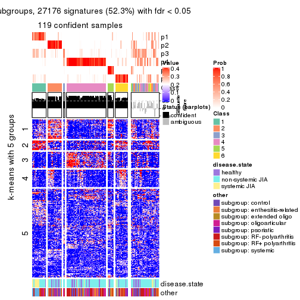</p>

</div>
</div>


Compare the overlap of signatures from different k:

```r
compare_signatures(res)
```


`get_signature()` returns a data frame invisibly. TO get the list of signatures, the function
call should be assigned to a variable explicitly. In following code, if `plot` argument is set
to `FALSE`, no heatmap is plotted while only the differential analysis is performed.

```r
# code only for demonstration
tb = get_signature(res, k = ..., plot = FALSE)
```

An example of the output of `tb` is:

```
#>   which_row         fdr    mean_1    mean_2 scaled_mean_1 scaled_mean_2 km
#> 1        38 0.042760348  8.373488  9.131774    -0.5533452     0.5164555  1
#> 2        40 0.018707592  7.106213  8.469186    -0.6173731     0.5762149  1
#> 3        55 0.019134737 10.221463 11.207825    -0.6159697     0.5749050  1
#> 4        59 0.006059896  5.921854  7.869574    -0.6899429     0.6439467  1
#> 5        60 0.018055526  8.928898 10.211722    -0.6204761     0.5791110  1
#> 6        98 0.009384629 15.714769 14.887706     0.6635654    -0.6193277  2
...
```

The columns in `tb` are:

1. `which_row`: row indices corresponding to the input matrix.
2. `fdr`: FDR for the differential test. 
3. `mean_x`: The mean value in group x.
4. `scaled_mean_x`: The mean value in group x after rows are scaled.
5. `km`: Row groups if k-means clustering is applied to rows.


UMAP plot which shows how samples are separated.


<script>
$( function() {
	$( '#tabs-MAD-pam-dimension-reduction' ).tabs();
} );
</script>
<div id='tabs-MAD-pam-dimension-reduction'>
<ul>
<li><a href='#tab-MAD-pam-dimension-reduction-1'>k = 2</a></li>
<li><a href='#tab-MAD-pam-dimension-reduction-2'>k = 3</a></li>
<li><a href='#tab-MAD-pam-dimension-reduction-3'>k = 4</a></li>
<li><a href='#tab-MAD-pam-dimension-reduction-4'>k = 5</a></li>
<li><a href='#tab-MAD-pam-dimension-reduction-5'>k = 6</a></li>
</ul>
<div id='tab-MAD-pam-dimension-reduction-1'>
<pre><code class="r">dimension_reduction(res, k = 2, method = &quot;UMAP&quot;)
</code></pre>

<p></p>

</div>
<div id='tab-MAD-pam-dimension-reduction-2'>
<pre><code class="r">dimension_reduction(res, k = 3, method = &quot;UMAP&quot;)
</code></pre>

<p></p>

</div>
<div id='tab-MAD-pam-dimension-reduction-3'>
<pre><code class="r">dimension_reduction(res, k = 4, method = &quot;UMAP&quot;)
</code></pre>

<p></p>

</div>
<div id='tab-MAD-pam-dimension-reduction-4'>
<pre><code class="r">dimension_reduction(res, k = 5, method = &quot;UMAP&quot;)
</code></pre>

<p></p>

</div>
<div id='tab-MAD-pam-dimension-reduction-5'>
<pre><code class="r">dimension_reduction(res, k = 6, method = &quot;UMAP&quot;)
</code></pre>

<p></p>

</div>
</div>


Following heatmap shows how subgroups are split when increasing `k`:

```r
collect_classes(res)
```


Test correlation between subgroups and known annotations. If the known
annotation is numeric, one-way ANOVA test is applied, and if the known
annotation is discrete, chi-squared contingency table test is applied.

```r
test_to_known_factors(res)
```

```
#>           n disease.state(p) other(p) k
#> MAD:pam 154          0.00154 8.37e-03 2
#> MAD:pam 152          0.00110 1.09e-03 3
#> MAD:pam 148          0.00179 1.68e-03 4
#> MAD:pam 142          0.00134 9.55e-05 5
#> MAD:pam 119          0.00201 6.29e-03 6
```


If matrix rows can be associated to genes, consider to use `GO_Enrichment(res,
...)` to perform function enrichment for the signature genes.


 

---------------------------------------------------


### MAD:mclust


The object with results only for a single top-value method and a single partition method 
can be extracted as:

```r
res = res_list["MAD", "mclust"]
# you can also extract it by
# res = res_list["MAD:mclust"]
```

A summary of `res` and all the functions that can be applied to it:

```r
res
```

```
#> A 'ConsensusPartition' object with k = 2, 3, 4, 5, 6.
#>   On a matrix with 51941 rows and 154 columns.
#>   Top rows (1000, 2000, 3000, 4000, 5000) are extracted by 'MAD' method.
#>   Subgroups are detected by 'mclust' method.
#>   Performed in total 1250 partitions by row resampling.
#>   Best k for subgroups seems to be 4.
#> 
#> Following methods can be applied to this 'ConsensusPartition' object:
#>  [1] "cola_report"             "collect_classes"         "collect_plots"          
#>  [4] "collect_stats"           "colnames"                "compare_signatures"     
#>  [7] "consensus_heatmap"       "dimension_reduction"     "functional_enrichment"  
#> [10] "get_anno_col"            "get_anno"                "get_classes"            
#> [13] "get_consensus"           "get_matrix"              "get_membership"         
#> [16] "get_param"               "get_signatures"          "get_stats"              
#> [19] "is_best_k"               "is_stable_k"             "membership_heatmap"     
#> [22] "ncol"                    "nrow"                    "plot_ecdf"              
#> [25] "rownames"                "select_partition_number" "show"                   
#> [28] "suggest_best_k"          "test_to_known_factors"
```

`collect_plots()` function collects all the plots made from `res` for all `k` (number of partitions)
into one single page to provide an easy and fast comparison between different `k`.

```r
collect_plots(res)
```


The plots are:

- The first row: a plot of the ECDF (Empirical cumulative distribution
  function) curves of the consensus matrix for each `k` and the heatmap of
  predicted classes for each `k`.
- The second row: heatmaps of the consensus matrix for each `k`.
- The third row: heatmaps of the membership matrix for each `k`.
- The fouth row: heatmaps of the signatures for each `k`.

All the plots in panels can be made by individual functions and they are
plotted later in this section.

`select_partition_number()` produces several plots showing different
statistics for choosing "optimized" `k`. There are following statistics:

- ECDF curves of the consensus matrix for each `k`;
- 1-PAC. [The PAC
  score](https://en.wikipedia.org/wiki/Consensus_clustering#Over-interpretation_potential_of_consensus_clustering)
  measures the proportion of the ambiguous subgrouping.
- Mean silhouette score.
- Concordance. The mean probability of fiting the consensus class ids in all
  partitions.
- Area increased. Denote $A_k$ as the area under the ECDF curve for current
  `k`, the area increased is defined as $A_k - A_{k-1}$.
- Rand index. The percent of pairs of samples that are both in a same cluster
  or both are not in a same cluster in the partition of k and k-1.
- Jaccard index. The ratio of pairs of samples are both in a same cluster in
  the partition of k and k-1 and the pairs of samples are both in a same
  cluster in the partition k or k-1.

The detailed explanations of these statistics can be found in [the cola
vignette](http://bioconductor.org/packages/devel/bioc/vignettes/cola/inst/doc/cola.html#toc_13).

Generally speaking, lower PAC score, higher mean silhouette score or higher
concordance corresponds to better partition. Rand index and Jaccard index
measure how similar the current partition is compared to partition with `k-1`.
If they are too similar, we won't accept `k` is better than `k-1`.

```r
select_partition_number(res)
```


The numeric values for all these statistics can be obtained by `get_stats()`.

```r
get_stats(res)
```

```
#>   k 1-PAC mean_silhouette concordance area_increased  Rand Jaccard
#> 2 2 0.462           0.783       0.829         0.4097 0.607   0.607
#> 3 3 0.417           0.715       0.816         0.4881 0.733   0.565
#> 4 4 0.689           0.728       0.822         0.2033 0.813   0.527
#> 5 5 0.603           0.614       0.738         0.0499 0.903   0.676
#> 6 6 0.713           0.647       0.797         0.0528 0.877   0.559
```

`suggest_best_k()` suggests the best $k$ based on these statistics. The rules are as follows:

- All $k$ with Jaccard index larger than 0.95 are removed because the increase of
  the partition number does not provides enough extra information. If all $k$ are removed,
  the best $k$ is assigned by `NA`.
- For $k$ with 1-PAC larger than 0.9, the maximal $k$ is taken as the "best k". Other $k$ is called "optional k".
- If it does not fit the second rule. The $k$ with the highest vote of highest
  1-PAC, mean silhouette and concordance is taken as the "best k".

```r
suggest_best_k(res)
```

```
#> [1] 4
```


Following shows the table of the partitions (You need to click the **show/hide
code output** link to see it). The membership matrix (columns with name `p*`)
is inferred by
[`clue::cl_consensus()`](https://www.rdocumentation.org/link/cl_consensus?package=clue)
function with the `SE` method. Basically the value in the membership matrix
represents the probability to belong to a certain group. The finall class
label for an item is determined with the group with highest probability it
belongs to.

In `get_classes()` function, the entropy is calculated from the membership
matrix and the silhouette score is calculated from the consensus matrix.


<script>
$( function() {
	$( '#tabs-MAD-mclust-get-classes' ).tabs();
} );
</script>
<div id='tabs-MAD-mclust-get-classes'>
<ul>
<li><a href='#tab-MAD-mclust-get-classes-1'>k = 2</a></li>
<li><a href='#tab-MAD-mclust-get-classes-2'>k = 3</a></li>
<li><a href='#tab-MAD-mclust-get-classes-3'>k = 4</a></li>
<li><a href='#tab-MAD-mclust-get-classes-4'>k = 5</a></li>
<li><a href='#tab-MAD-mclust-get-classes-5'>k = 6</a></li>
</ul>

<div id='tab-MAD-mclust-get-classes-1'>
<p><a id='tab-MAD-mclust-get-classes-1-a' style='color:#0366d6' href='#'>show/hide code output</a></p>
<pre><code class="r">cbind(get_classes(res, k = 2), get_membership(res, k = 2))
</code></pre>

<pre><code>#&gt;           class entropy silhouette    p1    p2
#&gt; GSM340358     2  0.0672     0.7895 0.008 0.992
#&gt; GSM340359     1  0.9000     0.9925 0.684 0.316
#&gt; GSM340361     1  0.9775     0.8392 0.588 0.412
#&gt; GSM340362     1  0.9000     0.9925 0.684 0.316
#&gt; GSM340363     2  0.0376     0.7909 0.004 0.996
#&gt; GSM340364     2  0.1633     0.7782 0.024 0.976
#&gt; GSM340365     1  0.9000     0.9925 0.684 0.316
#&gt; GSM340366     1  0.9087     0.9876 0.676 0.324
#&gt; GSM340367     2  0.0938     0.7881 0.012 0.988
#&gt; GSM340368     2  0.2778     0.7927 0.048 0.952
#&gt; GSM340369     2  0.9000     0.7215 0.316 0.684
#&gt; GSM340370     2  0.0938     0.7881 0.012 0.988
#&gt; GSM340371     1  0.9044     0.9921 0.680 0.320
#&gt; GSM340372     2  0.1184     0.7854 0.016 0.984
#&gt; GSM340373     2  0.1184     0.7854 0.016 0.984
#&gt; GSM340375     2  0.1184     0.7854 0.016 0.984
#&gt; GSM340376     2  0.0672     0.7895 0.008 0.992
#&gt; GSM340378     2  0.0672     0.7895 0.008 0.992
#&gt; GSM340243     2  0.1414     0.7949 0.020 0.980
#&gt; GSM340244     2  0.9000     0.7215 0.316 0.684
#&gt; GSM340246     2  0.8763     0.7289 0.296 0.704
#&gt; GSM340247     2  0.9000     0.7215 0.316 0.684
#&gt; GSM340248     2  0.9000     0.7215 0.316 0.684
#&gt; GSM340249     2  0.9000     0.7215 0.316 0.684
#&gt; GSM340250     2  0.0672     0.7895 0.008 0.992
#&gt; GSM340251     2  0.9000     0.7215 0.316 0.684
#&gt; GSM340252     1  0.9044     0.9921 0.680 0.320
#&gt; GSM340253     1  0.9000     0.9925 0.684 0.316
#&gt; GSM340254     1  0.9044     0.9921 0.680 0.320
#&gt; GSM340256     1  0.9044     0.9921 0.680 0.320
#&gt; GSM340258     2  0.9933    -0.5031 0.452 0.548
#&gt; GSM340259     2  0.2778     0.7511 0.048 0.952
#&gt; GSM340260     1  0.9000     0.9925 0.684 0.316
#&gt; GSM340261     2  0.0376     0.7934 0.004 0.996
#&gt; GSM340262     1  0.9044     0.9921 0.680 0.320
#&gt; GSM340263     2  0.3114     0.7921 0.056 0.944
#&gt; GSM340264     1  0.9000     0.9925 0.684 0.316
#&gt; GSM340265     1  0.9000     0.9925 0.684 0.316
#&gt; GSM340266     2  0.9000     0.7215 0.316 0.684
#&gt; GSM340267     2  0.9909    -0.4849 0.444 0.556
#&gt; GSM340268     2  0.9000     0.7215 0.316 0.684
#&gt; GSM340269     2  0.0376     0.7934 0.004 0.996
#&gt; GSM340270     2  0.0000     0.7923 0.000 1.000
#&gt; GSM537574     2  0.8499     0.7304 0.276 0.724
#&gt; GSM537580     1  0.9044     0.9921 0.680 0.320
#&gt; GSM537581     2  0.9000     0.7215 0.316 0.684
#&gt; GSM340272     1  0.9000     0.9925 0.684 0.316
#&gt; GSM340273     2  0.2948     0.7925 0.052 0.948
#&gt; GSM340275     2  0.9000     0.7215 0.316 0.684
#&gt; GSM340276     2  0.0000     0.7923 0.000 1.000
#&gt; GSM340277     1  0.9044     0.9921 0.680 0.320
#&gt; GSM340278     2  0.0376     0.7934 0.004 0.996
#&gt; GSM340279     2  0.8608     0.7320 0.284 0.716
#&gt; GSM340282     1  0.9000     0.9925 0.684 0.316
#&gt; GSM340284     2  0.9000     0.7215 0.316 0.684
#&gt; GSM340285     2  0.0000     0.7923 0.000 1.000
#&gt; GSM340286     1  0.9044     0.9921 0.680 0.320
#&gt; GSM340287     2  0.0672     0.7895 0.008 0.992
#&gt; GSM340288     2  0.1184     0.7854 0.016 0.984
#&gt; GSM340289     2  0.1184     0.7854 0.016 0.984
#&gt; GSM340290     2  0.0000     0.7923 0.000 1.000
#&gt; GSM340291     2  0.9000     0.7215 0.316 0.684
#&gt; GSM340293     2  0.9000     0.7215 0.316 0.684
#&gt; GSM340294     2  0.2778     0.7927 0.048 0.952
#&gt; GSM340296     2  0.3114     0.7927 0.056 0.944
#&gt; GSM340297     2  0.0376     0.7934 0.004 0.996
#&gt; GSM340298     2  0.0938     0.7933 0.012 0.988
#&gt; GSM340299     1  0.9000     0.9925 0.684 0.316
#&gt; GSM340301     1  0.9000     0.9925 0.684 0.316
#&gt; GSM340303     1  0.9000     0.9925 0.684 0.316
#&gt; GSM340304     2  0.0000     0.7923 0.000 1.000
#&gt; GSM340306     2  0.0938     0.7869 0.012 0.988
#&gt; GSM340307     2  0.3879     0.7161 0.076 0.924
#&gt; GSM340310     2  0.0672     0.7895 0.008 0.992
#&gt; GSM340314     2  0.1184     0.7949 0.016 0.984
#&gt; GSM340315     2  0.4161     0.7892 0.084 0.916
#&gt; GSM340317     2  0.3584     0.7907 0.068 0.932
#&gt; GSM340318     2  0.9000     0.7215 0.316 0.684
#&gt; GSM340319     2  0.9000     0.7215 0.316 0.684
#&gt; GSM340320     2  0.0672     0.7941 0.008 0.992
#&gt; GSM340321     2  0.9000     0.7215 0.316 0.684
#&gt; GSM340322     1  0.9044     0.9838 0.680 0.320
#&gt; GSM340324     2  0.5946     0.5918 0.144 0.856
#&gt; GSM340328     2  0.0672     0.7895 0.008 0.992
#&gt; GSM340330     2  0.9044     0.0182 0.320 0.680
#&gt; GSM340332     2  0.9000     0.7215 0.316 0.684
#&gt; GSM340333     1  0.9000     0.9925 0.684 0.316
#&gt; GSM340336     2  0.9000     0.7215 0.316 0.684
#&gt; GSM340337     2  0.6531     0.7509 0.168 0.832
#&gt; GSM340338     2  0.9286    -0.0893 0.344 0.656
#&gt; GSM340339     2  0.9000     0.7215 0.316 0.684
#&gt; GSM340340     2  0.9000     0.7215 0.316 0.684
#&gt; GSM340341     2  0.5408     0.7780 0.124 0.876
#&gt; GSM340343     2  0.0000     0.7923 0.000 1.000
#&gt; GSM340344     1  0.9000     0.9925 0.684 0.316
#&gt; GSM340346     2  0.3584     0.7227 0.068 0.932
#&gt; GSM340347     2  0.9000     0.7215 0.316 0.684
#&gt; GSM340348     2  0.3431     0.7913 0.064 0.936
#&gt; GSM340349     2  0.0672     0.7895 0.008 0.992
#&gt; GSM340350     2  0.0672     0.7895 0.008 0.992
#&gt; GSM340351     2  0.1184     0.7854 0.016 0.984
#&gt; GSM340354     2  0.9286    -0.1050 0.344 0.656
#&gt; GSM340356     2  0.2948     0.7926 0.052 0.948
#&gt; GSM340357     2  0.0672     0.7895 0.008 0.992
#&gt; GSM348183     2  0.1184     0.7854 0.016 0.984
#&gt; GSM348191     2  0.0376     0.7909 0.004 0.996
#&gt; GSM348193     2  0.0672     0.7895 0.008 0.992
#&gt; GSM537578     2  0.1184     0.7854 0.016 0.984
#&gt; GSM348181     2  0.0672     0.7895 0.008 0.992
#&gt; GSM348182     1  0.9000     0.9925 0.684 0.316
#&gt; GSM348184     2  0.9000     0.7215 0.316 0.684
#&gt; GSM348185     2  0.2778     0.7930 0.048 0.952
#&gt; GSM348186     1  0.9044     0.9921 0.680 0.320
#&gt; GSM348187     2  0.0672     0.7895 0.008 0.992
#&gt; GSM348188     2  0.9286    -0.0954 0.344 0.656
#&gt; GSM348189     1  0.9044     0.9921 0.680 0.320
#&gt; GSM348190     1  0.9000     0.9925 0.684 0.316
#&gt; GSM348194     2  0.1184     0.7854 0.016 0.984
#&gt; GSM348195     2  0.1184     0.7854 0.016 0.984
#&gt; GSM348196     2  0.0672     0.7895 0.008 0.992
#&gt; GSM537585     1  0.9000     0.9925 0.684 0.316
#&gt; GSM537594     2  0.2948     0.7926 0.052 0.948
#&gt; GSM537596     2  0.0376     0.7909 0.004 0.996
#&gt; GSM537597     2  0.0000     0.7923 0.000 1.000
#&gt; GSM537602     2  0.0672     0.7895 0.008 0.992
#&gt; GSM340184     2  0.0376     0.7909 0.004 0.996
#&gt; GSM340185     2  0.8443     0.7305 0.272 0.728
#&gt; GSM340186     2  0.9922     0.5501 0.448 0.552
#&gt; GSM340187     2  0.9000     0.7215 0.316 0.684
#&gt; GSM340189     2  0.9000     0.7215 0.316 0.684
#&gt; GSM340190     2  0.8763     0.7266 0.296 0.704
#&gt; GSM340191     2  0.9000     0.7215 0.316 0.684
#&gt; GSM340192     1  0.9044     0.9921 0.680 0.320
#&gt; GSM340193     2  0.0938     0.7881 0.012 0.988
#&gt; GSM340194     1  0.9000     0.9925 0.684 0.316
#&gt; GSM340195     1  0.9000     0.9925 0.684 0.316
#&gt; GSM340196     2  0.9000     0.7215 0.316 0.684
#&gt; GSM340197     1  0.9000     0.9925 0.684 0.316
#&gt; GSM340198     1  0.9044     0.9921 0.680 0.320
#&gt; GSM340199     2  0.7528     0.7539 0.216 0.784
#&gt; GSM340200     2  0.8608     0.7110 0.284 0.716
#&gt; GSM340201     2  0.9000     0.7215 0.316 0.684
#&gt; GSM340202     2  0.9000     0.7215 0.316 0.684
#&gt; GSM340203     2  0.9000     0.7215 0.316 0.684
#&gt; GSM340204     1  0.9044     0.9921 0.680 0.320
#&gt; GSM340205     2  0.0672     0.7895 0.008 0.992
#&gt; GSM340206     2  0.7299     0.7595 0.204 0.796
#&gt; GSM340207     1  0.9044     0.9921 0.680 0.320
#&gt; GSM340237     2  0.9000     0.7215 0.316 0.684
#&gt; GSM340238     2  0.8386     0.7382 0.268 0.732
#&gt; GSM340239     1  0.9000     0.9925 0.684 0.316
#&gt; GSM340240     1  0.9044     0.9921 0.680 0.320
#&gt; GSM340241     1  0.9087     0.9619 0.676 0.324
#&gt; GSM340242     1  0.9044     0.9921 0.680 0.320
</code></pre>

<script>
$('#tab-MAD-mclust-get-classes-1-a').parent().next().next().hide();
$('#tab-MAD-mclust-get-classes-1-a').click(function(){
  $('#tab-MAD-mclust-get-classes-1-a').parent().next().next().toggle();
  return(false);
});
</script>
</div>

<div id='tab-MAD-mclust-get-classes-2'>
<p><a id='tab-MAD-mclust-get-classes-2-a' style='color:#0366d6' href='#'>show/hide code output</a></p>
<pre><code class="r">cbind(get_classes(res, k = 3), get_membership(res, k = 3))
</code></pre>

<pre><code>#&gt;           class entropy silhouette    p1    p2    p3
#&gt; GSM340358     1  0.1753     0.7873 0.952 0.048 0.000
#&gt; GSM340359     3  0.4346     0.9394 0.184 0.000 0.816
#&gt; GSM340361     1  0.0237     0.7649 0.996 0.000 0.004
#&gt; GSM340362     3  0.4346     0.9394 0.184 0.000 0.816
#&gt; GSM340363     1  0.4796     0.6749 0.780 0.220 0.000
#&gt; GSM340364     1  0.0237     0.7649 0.996 0.000 0.004
#&gt; GSM340365     3  0.4346     0.9394 0.184 0.000 0.816
#&gt; GSM340366     3  0.4346     0.9394 0.184 0.000 0.816
#&gt; GSM340367     1  0.0475     0.7675 0.992 0.004 0.004
#&gt; GSM340368     2  0.9485     0.1404 0.388 0.428 0.184
#&gt; GSM340369     2  0.0000     0.7939 0.000 1.000 0.000
#&gt; GSM340370     1  0.0475     0.7675 0.992 0.004 0.004
#&gt; GSM340371     3  0.4346     0.9394 0.184 0.000 0.816
#&gt; GSM340372     1  0.0237     0.7649 0.996 0.000 0.004
#&gt; GSM340373     1  0.0237     0.7649 0.996 0.000 0.004
#&gt; GSM340375     1  0.3112     0.7511 0.900 0.096 0.004
#&gt; GSM340376     1  0.5024     0.6805 0.776 0.220 0.004
#&gt; GSM340378     1  0.1989     0.7871 0.948 0.048 0.004
#&gt; GSM340243     2  0.5138     0.6032 0.252 0.748 0.000
#&gt; GSM340244     2  0.7862     0.6617 0.148 0.668 0.184
#&gt; GSM340246     2  0.0237     0.7938 0.004 0.996 0.000
#&gt; GSM340247     2  0.4346     0.7863 0.000 0.816 0.184
#&gt; GSM340248     2  0.4346     0.7863 0.000 0.816 0.184
#&gt; GSM340249     2  0.5331     0.7769 0.024 0.792 0.184
#&gt; GSM340250     2  0.5443     0.5950 0.260 0.736 0.004
#&gt; GSM340251     2  0.3752     0.7918 0.000 0.856 0.144
#&gt; GSM340252     3  0.4915     0.9276 0.184 0.012 0.804
#&gt; GSM340253     3  0.4346     0.9394 0.184 0.000 0.816
#&gt; GSM340254     3  0.4346     0.9394 0.184 0.000 0.816
#&gt; GSM340256     3  0.8482     0.6397 0.184 0.200 0.616
#&gt; GSM340258     2  0.8746     0.3646 0.184 0.588 0.228
#&gt; GSM340259     1  0.3295     0.7683 0.896 0.096 0.008
#&gt; GSM340260     3  0.4346     0.9394 0.184 0.000 0.816
#&gt; GSM340261     2  0.0000     0.7939 0.000 1.000 0.000
#&gt; GSM340262     3  0.4346     0.9394 0.184 0.000 0.816
#&gt; GSM340263     2  0.9485     0.1404 0.388 0.428 0.184
#&gt; GSM340264     3  0.4887     0.9052 0.228 0.000 0.772
#&gt; GSM340265     3  0.4346     0.9394 0.184 0.000 0.816
#&gt; GSM340266     2  0.5428     0.7744 0.064 0.816 0.120
#&gt; GSM340267     3  0.9400     0.4968 0.228 0.264 0.508
#&gt; GSM340268     2  0.0000     0.7939 0.000 1.000 0.000
#&gt; GSM340269     2  0.4346     0.6742 0.184 0.816 0.000
#&gt; GSM340270     2  0.6295     0.0257 0.472 0.528 0.000
#&gt; GSM537574     2  0.4346     0.7863 0.000 0.816 0.184
#&gt; GSM537580     3  0.6962     0.8240 0.184 0.092 0.724
#&gt; GSM537581     2  0.5331     0.7772 0.024 0.792 0.184
#&gt; GSM340272     3  0.4346     0.9394 0.184 0.000 0.816
#&gt; GSM340273     2  0.9492     0.1068 0.400 0.416 0.184
#&gt; GSM340275     2  0.4915     0.7827 0.012 0.804 0.184
#&gt; GSM340276     1  0.6252     0.2519 0.556 0.444 0.000
#&gt; GSM340277     3  0.4346     0.9394 0.184 0.000 0.816
#&gt; GSM340278     2  0.0000     0.7939 0.000 1.000 0.000
#&gt; GSM340279     2  0.0000     0.7939 0.000 1.000 0.000
#&gt; GSM340282     3  0.4346     0.9394 0.184 0.000 0.816
#&gt; GSM340284     2  0.4346     0.7863 0.000 0.816 0.184
#&gt; GSM340285     1  0.6111     0.3844 0.604 0.396 0.000
#&gt; GSM340286     3  0.4346     0.9394 0.184 0.000 0.816
#&gt; GSM340287     2  0.5443     0.5855 0.260 0.736 0.004
#&gt; GSM340288     1  0.0237     0.7649 0.996 0.000 0.004
#&gt; GSM340289     1  0.0237     0.7649 0.996 0.000 0.004
#&gt; GSM340290     2  0.0000     0.7939 0.000 1.000 0.000
#&gt; GSM340291     2  0.9433     0.2358 0.356 0.460 0.184
#&gt; GSM340293     2  0.0000     0.7939 0.000 1.000 0.000
#&gt; GSM340294     2  0.0000     0.7939 0.000 1.000 0.000
#&gt; GSM340296     2  0.0237     0.7928 0.000 0.996 0.004
#&gt; GSM340297     2  0.5882     0.4430 0.348 0.652 0.000
#&gt; GSM340298     2  0.0237     0.7928 0.000 0.996 0.004
#&gt; GSM340299     3  0.4346     0.9394 0.184 0.000 0.816
#&gt; GSM340301     3  0.4346     0.9394 0.184 0.000 0.816
#&gt; GSM340303     3  0.4346     0.9394 0.184 0.000 0.816
#&gt; GSM340304     2  0.6308    -0.0452 0.492 0.508 0.000
#&gt; GSM340306     1  0.3425     0.7529 0.884 0.112 0.004
#&gt; GSM340307     2  0.4413     0.7202 0.124 0.852 0.024
#&gt; GSM340310     1  0.1753     0.7873 0.952 0.048 0.000
#&gt; GSM340314     2  0.0000     0.7939 0.000 1.000 0.000
#&gt; GSM340315     2  0.0237     0.7928 0.000 0.996 0.004
#&gt; GSM340317     2  0.9485     0.1404 0.388 0.428 0.184
#&gt; GSM340318     2  0.4346     0.7863 0.000 0.816 0.184
#&gt; GSM340319     2  0.4346     0.7863 0.000 0.816 0.184
#&gt; GSM340320     1  0.6215     0.2951 0.572 0.428 0.000
#&gt; GSM340321     2  0.4346     0.7863 0.000 0.816 0.184
#&gt; GSM340322     3  0.8659     0.5799 0.176 0.228 0.596
#&gt; GSM340324     1  0.6713     0.3070 0.572 0.416 0.012
#&gt; GSM340328     1  0.1753     0.7873 0.952 0.048 0.000
#&gt; GSM340330     2  0.6192     0.6181 0.060 0.764 0.176
#&gt; GSM340332     2  0.0000     0.7939 0.000 1.000 0.000
#&gt; GSM340333     3  0.4346     0.9394 0.184 0.000 0.816
#&gt; GSM340336     2  0.4346     0.7863 0.000 0.816 0.184
#&gt; GSM340337     2  0.4629     0.7853 0.004 0.808 0.188
#&gt; GSM340338     2  0.8953     0.3283 0.180 0.560 0.260
#&gt; GSM340339     2  0.0000     0.7939 0.000 1.000 0.000
#&gt; GSM340340     2  0.4346     0.7863 0.000 0.816 0.184
#&gt; GSM340341     2  0.5235     0.7827 0.036 0.812 0.152
#&gt; GSM340343     1  0.5650     0.5607 0.688 0.312 0.000
#&gt; GSM340344     3  0.4346     0.9394 0.184 0.000 0.816
#&gt; GSM340346     2  0.6388     0.6153 0.184 0.752 0.064
#&gt; GSM340347     2  0.4575     0.7854 0.004 0.812 0.184
#&gt; GSM340348     2  0.8007     0.5805 0.244 0.640 0.116
#&gt; GSM340349     2  0.6033     0.4483 0.336 0.660 0.004
#&gt; GSM340350     1  0.5365     0.6268 0.744 0.252 0.004
#&gt; GSM340351     1  0.0237     0.7649 0.996 0.000 0.004
#&gt; GSM340354     2  0.7875     0.5012 0.176 0.668 0.156
#&gt; GSM340356     1  0.8039     0.1517 0.508 0.428 0.064
#&gt; GSM340357     1  0.1989     0.7871 0.948 0.048 0.004
#&gt; GSM348183     1  0.0237     0.7649 0.996 0.000 0.004
#&gt; GSM348191     2  0.0237     0.7928 0.000 0.996 0.004
#&gt; GSM348193     1  0.1989     0.7871 0.948 0.048 0.004
#&gt; GSM537578     1  0.6264     0.2964 0.616 0.380 0.004
#&gt; GSM348181     1  0.1860     0.7873 0.948 0.052 0.000
#&gt; GSM348182     3  0.5529     0.8169 0.296 0.000 0.704
#&gt; GSM348184     2  0.0000     0.7939 0.000 1.000 0.000
#&gt; GSM348185     1  0.8527     0.1570 0.504 0.400 0.096
#&gt; GSM348186     3  0.7316     0.7933 0.184 0.112 0.704
#&gt; GSM348187     1  0.1989     0.7871 0.948 0.048 0.004
#&gt; GSM348188     1  0.3193     0.6934 0.896 0.004 0.100
#&gt; GSM348189     3  0.4346     0.9394 0.184 0.000 0.816
#&gt; GSM348190     3  0.4346     0.9394 0.184 0.000 0.816
#&gt; GSM348194     1  0.0237     0.7649 0.996 0.000 0.004
#&gt; GSM348195     1  0.0237     0.7649 0.996 0.000 0.004
#&gt; GSM348196     1  0.1753     0.7873 0.952 0.048 0.000
#&gt; GSM537585     3  0.4931     0.9017 0.232 0.000 0.768
#&gt; GSM537594     1  0.6565     0.2962 0.576 0.416 0.008
#&gt; GSM537596     1  0.6451     0.2601 0.560 0.436 0.004
#&gt; GSM537597     1  0.6305     0.1038 0.516 0.484 0.000
#&gt; GSM537602     1  0.3349     0.7703 0.888 0.108 0.004
#&gt; GSM340184     2  0.0237     0.7928 0.000 0.996 0.004
#&gt; GSM340185     2  0.4346     0.7863 0.000 0.816 0.184
#&gt; GSM340186     2  0.4953     0.6779 0.176 0.808 0.016
#&gt; GSM340187     2  0.4346     0.7863 0.000 0.816 0.184
#&gt; GSM340189     2  0.0000     0.7939 0.000 1.000 0.000
#&gt; GSM340190     2  0.0000     0.7939 0.000 1.000 0.000
#&gt; GSM340191     2  0.0000     0.7939 0.000 1.000 0.000
#&gt; GSM340192     3  0.4346     0.9394 0.184 0.000 0.816
#&gt; GSM340193     1  0.1989     0.7871 0.948 0.048 0.004
#&gt; GSM340194     3  0.4346     0.9394 0.184 0.000 0.816
#&gt; GSM340195     3  0.4346     0.9394 0.184 0.000 0.816
#&gt; GSM340196     2  0.4346     0.7863 0.000 0.816 0.184
#&gt; GSM340197     3  0.4346     0.9394 0.184 0.000 0.816
#&gt; GSM340198     3  0.4346     0.9394 0.184 0.000 0.816
#&gt; GSM340199     2  0.0000     0.7939 0.000 1.000 0.000
#&gt; GSM340200     2  0.4953     0.6712 0.176 0.808 0.016
#&gt; GSM340201     2  0.4755     0.7842 0.008 0.808 0.184
#&gt; GSM340202     2  0.4346     0.7863 0.000 0.816 0.184
#&gt; GSM340203     2  0.0000     0.7939 0.000 1.000 0.000
#&gt; GSM340204     3  0.4346     0.9394 0.184 0.000 0.816
#&gt; GSM340205     1  0.4733     0.7037 0.800 0.196 0.004
#&gt; GSM340206     2  0.0000     0.7939 0.000 1.000 0.000
#&gt; GSM340207     3  0.4346     0.9394 0.184 0.000 0.816
#&gt; GSM340237     2  0.9145     0.4198 0.284 0.532 0.184
#&gt; GSM340238     2  0.0000     0.7939 0.000 1.000 0.000
#&gt; GSM340239     3  0.5529     0.8158 0.296 0.000 0.704
#&gt; GSM340240     3  0.4346     0.9394 0.184 0.000 0.816
#&gt; GSM340241     3  0.9383     0.2851 0.176 0.364 0.460
#&gt; GSM340242     3  0.4346     0.9394 0.184 0.000 0.816
</code></pre>

<script>
$('#tab-MAD-mclust-get-classes-2-a').parent().next().next().hide();
$('#tab-MAD-mclust-get-classes-2-a').click(function(){
  $('#tab-MAD-mclust-get-classes-2-a').parent().next().next().toggle();
  return(false);
});
</script>
</div>

<div id='tab-MAD-mclust-get-classes-3'>
<p><a id='tab-MAD-mclust-get-classes-3-a' style='color:#0366d6' href='#'>show/hide code output</a></p>
<pre><code class="r">cbind(get_classes(res, k = 4), get_membership(res, k = 4))
</code></pre>

<pre><code>#&gt;           class entropy silhouette    p1    p2    p3    p4
#&gt; GSM340358     1  0.4964     0.7582 0.616 0.000 0.004 0.380
#&gt; GSM340359     2  0.0707     0.9443 0.000 0.980 0.000 0.020
#&gt; GSM340361     1  0.0779     0.7460 0.980 0.004 0.000 0.016
#&gt; GSM340362     2  0.0707     0.9443 0.000 0.980 0.000 0.020
#&gt; GSM340363     1  0.5028     0.7399 0.596 0.000 0.004 0.400
#&gt; GSM340364     1  0.0000     0.7544 1.000 0.000 0.000 0.000
#&gt; GSM340365     2  0.2796     0.8814 0.092 0.892 0.000 0.016
#&gt; GSM340366     2  0.0000     0.9471 0.000 1.000 0.000 0.000
#&gt; GSM340367     1  0.1637     0.7674 0.940 0.000 0.000 0.060
#&gt; GSM340368     4  0.1824     0.5692 0.060 0.000 0.004 0.936
#&gt; GSM340369     3  0.1867     0.8734 0.000 0.000 0.928 0.072
#&gt; GSM340370     1  0.1557     0.7643 0.944 0.000 0.000 0.056
#&gt; GSM340371     2  0.0000     0.9471 0.000 1.000 0.000 0.000
#&gt; GSM340372     1  0.0000     0.7544 1.000 0.000 0.000 0.000
#&gt; GSM340373     1  0.0000     0.7544 1.000 0.000 0.000 0.000
#&gt; GSM340375     1  0.0707     0.7595 0.980 0.000 0.000 0.020
#&gt; GSM340376     4  0.1716     0.5646 0.064 0.000 0.000 0.936
#&gt; GSM340378     1  0.4790     0.7603 0.620 0.000 0.000 0.380
#&gt; GSM340243     3  0.4817     0.4317 0.000 0.000 0.612 0.388
#&gt; GSM340244     4  0.1118     0.6226 0.000 0.000 0.036 0.964
#&gt; GSM340246     3  0.1557     0.8796 0.000 0.000 0.944 0.056
#&gt; GSM340247     4  0.4790     0.5921 0.000 0.000 0.380 0.620
#&gt; GSM340248     4  0.4543     0.6293 0.000 0.000 0.324 0.676
#&gt; GSM340249     4  0.4164     0.6572 0.000 0.000 0.264 0.736
#&gt; GSM340250     4  0.4420     0.4559 0.012 0.000 0.240 0.748
#&gt; GSM340251     4  0.4877     0.5746 0.000 0.000 0.408 0.592
#&gt; GSM340252     4  0.4985     0.0854 0.000 0.468 0.000 0.532
#&gt; GSM340253     2  0.0707     0.9443 0.000 0.980 0.000 0.020
#&gt; GSM340254     2  0.0469     0.9458 0.000 0.988 0.000 0.012
#&gt; GSM340256     4  0.6192     0.5484 0.000 0.244 0.104 0.652
#&gt; GSM340258     4  0.6042     0.5669 0.000 0.048 0.392 0.560
#&gt; GSM340259     1  0.5247     0.7734 0.684 0.032 0.000 0.284
#&gt; GSM340260     2  0.0000     0.9471 0.000 1.000 0.000 0.000
#&gt; GSM340261     3  0.1557     0.8782 0.000 0.000 0.944 0.056
#&gt; GSM340262     2  0.0000     0.9471 0.000 1.000 0.000 0.000
#&gt; GSM340263     4  0.1890     0.5735 0.056 0.000 0.008 0.936
#&gt; GSM340264     2  0.3123     0.8235 0.156 0.844 0.000 0.000
#&gt; GSM340265     2  0.0000     0.9471 0.000 1.000 0.000 0.000
#&gt; GSM340266     4  0.4746     0.6027 0.000 0.000 0.368 0.632
#&gt; GSM340267     2  0.3088     0.8340 0.000 0.864 0.128 0.008
#&gt; GSM340268     3  0.1211     0.8790 0.000 0.000 0.960 0.040
#&gt; GSM340269     3  0.2345     0.8234 0.000 0.000 0.900 0.100
#&gt; GSM340270     4  0.3856     0.4563 0.136 0.000 0.032 0.832
#&gt; GSM537574     4  0.4830     0.5818 0.000 0.000 0.392 0.608
#&gt; GSM537580     2  0.0000     0.9471 0.000 1.000 0.000 0.000
#&gt; GSM537581     4  0.3311     0.6730 0.000 0.000 0.172 0.828
#&gt; GSM340272     2  0.0000     0.9471 0.000 1.000 0.000 0.000
#&gt; GSM340273     4  0.1824     0.5692 0.060 0.000 0.004 0.936
#&gt; GSM340275     4  0.4008     0.6605 0.000 0.000 0.244 0.756
#&gt; GSM340276     1  0.7772     0.4405 0.392 0.000 0.240 0.368
#&gt; GSM340277     2  0.0000     0.9471 0.000 1.000 0.000 0.000
#&gt; GSM340278     3  0.2647     0.8347 0.000 0.000 0.880 0.120
#&gt; GSM340279     3  0.1389     0.8784 0.000 0.000 0.952 0.048
#&gt; GSM340282     2  0.0000     0.9471 0.000 1.000 0.000 0.000
#&gt; GSM340284     4  0.4855     0.5716 0.000 0.000 0.400 0.600
#&gt; GSM340285     3  0.6508     0.3538 0.084 0.000 0.556 0.360
#&gt; GSM340286     2  0.0336     0.9463 0.000 0.992 0.000 0.008
#&gt; GSM340287     3  0.2921     0.8081 0.000 0.000 0.860 0.140
#&gt; GSM340288     1  0.0000     0.7544 1.000 0.000 0.000 0.000
#&gt; GSM340289     1  0.0000     0.7544 1.000 0.000 0.000 0.000
#&gt; GSM340290     3  0.1557     0.8795 0.000 0.000 0.944 0.056
#&gt; GSM340291     4  0.1488     0.6147 0.012 0.000 0.032 0.956
#&gt; GSM340293     3  0.1474     0.8781 0.000 0.000 0.948 0.052
#&gt; GSM340294     3  0.1302     0.8788 0.000 0.000 0.956 0.044
#&gt; GSM340296     3  0.2647     0.8328 0.000 0.000 0.880 0.120
#&gt; GSM340297     3  0.4643     0.4952 0.000 0.000 0.656 0.344
#&gt; GSM340298     3  0.0469     0.8716 0.000 0.000 0.988 0.012
#&gt; GSM340299     2  0.0707     0.9443 0.000 0.980 0.000 0.020
#&gt; GSM340301     2  0.0000     0.9471 0.000 1.000 0.000 0.000
#&gt; GSM340303     2  0.0000     0.9471 0.000 1.000 0.000 0.000
#&gt; GSM340304     4  0.4793     0.2640 0.204 0.000 0.040 0.756
#&gt; GSM340306     1  0.4522     0.7757 0.680 0.000 0.000 0.320
#&gt; GSM340307     3  0.0188     0.8640 0.000 0.000 0.996 0.004
#&gt; GSM340310     1  0.4790     0.7603 0.620 0.000 0.000 0.380
#&gt; GSM340314     3  0.1716     0.8762 0.000 0.000 0.936 0.064
#&gt; GSM340315     3  0.3400     0.7597 0.000 0.000 0.820 0.180
#&gt; GSM340317     4  0.1576     0.5806 0.048 0.000 0.004 0.948
#&gt; GSM340318     4  0.4817     0.5859 0.000 0.000 0.388 0.612
#&gt; GSM340319     4  0.4790     0.5921 0.000 0.000 0.380 0.620
#&gt; GSM340320     4  0.5000    -0.2205 0.000 0.000 0.496 0.504
#&gt; GSM340321     4  0.4830     0.5818 0.000 0.000 0.392 0.608
#&gt; GSM340322     4  0.7173     0.5318 0.000 0.228 0.216 0.556
#&gt; GSM340324     4  0.2222     0.5650 0.056 0.008 0.008 0.928
#&gt; GSM340328     1  0.4790     0.7603 0.620 0.000 0.000 0.380
#&gt; GSM340330     3  0.0188     0.8640 0.000 0.000 0.996 0.004
#&gt; GSM340332     3  0.1716     0.8762 0.000 0.000 0.936 0.064
#&gt; GSM340333     2  0.0707     0.9443 0.000 0.980 0.000 0.020
#&gt; GSM340336     4  0.4790     0.5921 0.000 0.000 0.380 0.620
#&gt; GSM340337     4  0.4739     0.6599 0.012 0.008 0.240 0.740
#&gt; GSM340338     3  0.2530     0.7797 0.000 0.100 0.896 0.004
#&gt; GSM340339     3  0.2216     0.8585 0.000 0.000 0.908 0.092
#&gt; GSM340340     4  0.3356     0.6734 0.000 0.000 0.176 0.824
#&gt; GSM340341     4  0.4643     0.6256 0.000 0.000 0.344 0.656
#&gt; GSM340343     1  0.6101     0.6871 0.560 0.000 0.052 0.388
#&gt; GSM340344     2  0.0707     0.9443 0.000 0.980 0.000 0.020
#&gt; GSM340346     3  0.0188     0.8640 0.000 0.000 0.996 0.004
#&gt; GSM340347     4  0.4543     0.6331 0.000 0.000 0.324 0.676
#&gt; GSM340348     4  0.0817     0.6151 0.000 0.000 0.024 0.976
#&gt; GSM340349     3  0.8369     0.2373 0.288 0.060 0.500 0.152
#&gt; GSM340350     1  0.6549     0.6564 0.556 0.000 0.088 0.356
#&gt; GSM340351     1  0.0000     0.7544 1.000 0.000 0.000 0.000
#&gt; GSM340354     3  0.0188     0.8640 0.000 0.000 0.996 0.004
#&gt; GSM340356     4  0.1824     0.5692 0.060 0.000 0.004 0.936
#&gt; GSM340357     1  0.4456     0.7787 0.716 0.000 0.004 0.280
#&gt; GSM348183     1  0.0707     0.7584 0.980 0.000 0.000 0.020
#&gt; GSM348191     3  0.0000     0.8662 0.000 0.000 1.000 0.000
#&gt; GSM348193     1  0.4761     0.7637 0.628 0.000 0.000 0.372
#&gt; GSM537578     1  0.5730     0.6403 0.756 0.036 0.132 0.076
#&gt; GSM348181     1  0.4964     0.7582 0.616 0.000 0.004 0.380
#&gt; GSM348182     2  0.5167     0.4364 0.340 0.644 0.000 0.016
#&gt; GSM348184     3  0.1302     0.8636 0.000 0.000 0.956 0.044
#&gt; GSM348185     4  0.1824     0.5692 0.060 0.000 0.004 0.936
#&gt; GSM348186     2  0.5080     0.2133 0.000 0.576 0.004 0.420
#&gt; GSM348187     1  0.5217     0.7544 0.608 0.000 0.012 0.380
#&gt; GSM348188     1  0.6655     0.7201 0.640 0.128 0.008 0.224
#&gt; GSM348189     2  0.0000     0.9471 0.000 1.000 0.000 0.000
#&gt; GSM348190     2  0.0592     0.9449 0.000 0.984 0.000 0.016
#&gt; GSM348194     1  0.0000     0.7544 1.000 0.000 0.000 0.000
#&gt; GSM348195     1  0.0000     0.7544 1.000 0.000 0.000 0.000
#&gt; GSM348196     1  0.4964     0.7582 0.616 0.000 0.004 0.380
#&gt; GSM537585     2  0.3219     0.8153 0.164 0.836 0.000 0.000
#&gt; GSM537594     4  0.1824     0.5692 0.060 0.000 0.004 0.936
#&gt; GSM537596     4  0.7702    -0.2533 0.224 0.000 0.360 0.416
#&gt; GSM537597     4  0.1042     0.6012 0.020 0.000 0.008 0.972
#&gt; GSM537602     1  0.4991     0.7544 0.608 0.000 0.004 0.388
#&gt; GSM340184     3  0.0000     0.8662 0.000 0.000 1.000 0.000
#&gt; GSM340185     4  0.4948     0.5628 0.000 0.000 0.440 0.560
#&gt; GSM340186     4  0.4948     0.5591 0.000 0.000 0.440 0.560
#&gt; GSM340187     4  0.4855     0.5801 0.000 0.000 0.400 0.600
#&gt; GSM340189     3  0.1716     0.8762 0.000 0.000 0.936 0.064
#&gt; GSM340190     3  0.0469     0.8684 0.000 0.000 0.988 0.012
#&gt; GSM340191     3  0.1792     0.8746 0.000 0.000 0.932 0.068
#&gt; GSM340192     2  0.0000     0.9471 0.000 1.000 0.000 0.000
#&gt; GSM340193     1  0.4585     0.7734 0.668 0.000 0.000 0.332
#&gt; GSM340194     2  0.0707     0.9443 0.000 0.980 0.000 0.020
#&gt; GSM340195     2  0.0707     0.9443 0.000 0.980 0.000 0.020
#&gt; GSM340196     4  0.4790     0.5921 0.000 0.000 0.380 0.620
#&gt; GSM340197     2  0.0592     0.9449 0.000 0.984 0.000 0.016
#&gt; GSM340198     2  0.0336     0.9463 0.000 0.992 0.000 0.008
#&gt; GSM340199     3  0.1302     0.8788 0.000 0.000 0.956 0.044
#&gt; GSM340200     3  0.3907     0.4722 0.000 0.000 0.768 0.232
#&gt; GSM340201     4  0.3688     0.6677 0.000 0.000 0.208 0.792
#&gt; GSM340202     4  0.4817     0.5859 0.000 0.000 0.388 0.612
#&gt; GSM340203     3  0.1940     0.8652 0.000 0.000 0.924 0.076
#&gt; GSM340204     2  0.0336     0.9463 0.000 0.992 0.000 0.008
#&gt; GSM340205     1  0.5217     0.7528 0.608 0.000 0.012 0.380
#&gt; GSM340206     3  0.0188     0.8640 0.000 0.000 0.996 0.004
#&gt; GSM340207     2  0.0000     0.9471 0.000 1.000 0.000 0.000
#&gt; GSM340237     4  0.1940     0.6443 0.000 0.000 0.076 0.924
#&gt; GSM340238     3  0.1389     0.8790 0.000 0.000 0.952 0.048
#&gt; GSM340239     2  0.4250     0.5825 0.276 0.724 0.000 0.000
#&gt; GSM340240     2  0.0000     0.9471 0.000 1.000 0.000 0.000
#&gt; GSM340241     4  0.6101     0.5662 0.000 0.052 0.388 0.560
#&gt; GSM340242     2  0.0000     0.9471 0.000 1.000 0.000 0.000
</code></pre>

<script>
$('#tab-MAD-mclust-get-classes-3-a').parent().next().next().hide();
$('#tab-MAD-mclust-get-classes-3-a').click(function(){
  $('#tab-MAD-mclust-get-classes-3-a').parent().next().next().toggle();
  return(false);
});
</script>
</div>

<div id='tab-MAD-mclust-get-classes-4'>
<p><a id='tab-MAD-mclust-get-classes-4-a' style='color:#0366d6' href='#'>show/hide code output</a></p>
<pre><code class="r">cbind(get_classes(res, k = 5), get_membership(res, k = 5))
</code></pre>

<pre><code>#&gt;           class entropy silhouette    p1 p2    p3    p4    p5
#&gt; GSM340358     1  0.0000    0.64845 1.000 NA 0.000 0.000 0.000
#&gt; GSM340359     5  0.5655    0.74248 0.000 NA 0.000 0.112 0.600
#&gt; GSM340361     1  0.4294    0.57564 0.532 NA 0.000 0.000 0.000
#&gt; GSM340362     5  0.2574    0.83910 0.000 NA 0.000 0.112 0.876
#&gt; GSM340363     1  0.0566    0.64256 0.984 NA 0.000 0.012 0.000
#&gt; GSM340364     1  0.4291    0.57733 0.536 NA 0.000 0.000 0.000
#&gt; GSM340365     5  0.5303    0.72175 0.000 NA 0.000 0.108 0.660
#&gt; GSM340366     5  0.1493    0.83937 0.000 NA 0.028 0.024 0.948
#&gt; GSM340367     1  0.4249    0.58722 0.568 NA 0.000 0.000 0.000
#&gt; GSM340368     1  0.6576   -0.09655 0.436 NA 0.000 0.352 0.000
#&gt; GSM340369     3  0.3561    0.70996 0.000 NA 0.740 0.260 0.000
#&gt; GSM340370     1  0.4088    0.60404 0.632 NA 0.000 0.000 0.000
#&gt; GSM340371     5  0.0404    0.84933 0.000 NA 0.000 0.012 0.988
#&gt; GSM340372     1  0.4291    0.57733 0.536 NA 0.000 0.000 0.000
#&gt; GSM340373     1  0.4291    0.57733 0.536 NA 0.000 0.000 0.000
#&gt; GSM340375     1  0.5231    0.57396 0.536 NA 0.020 0.000 0.016
#&gt; GSM340376     1  0.3838    0.31322 0.716 NA 0.000 0.280 0.000
#&gt; GSM340378     1  0.1043    0.65259 0.960 NA 0.000 0.000 0.000
#&gt; GSM340243     3  0.5509    0.28783 0.360 NA 0.564 0.076 0.000
#&gt; GSM340244     4  0.6443    0.38812 0.368 NA 0.028 0.508 0.000
#&gt; GSM340246     3  0.0609    0.75850 0.000 NA 0.980 0.020 0.000
#&gt; GSM340247     4  0.3003    0.69257 0.000 NA 0.188 0.812 0.000
#&gt; GSM340248     4  0.4078    0.70850 0.068 NA 0.148 0.784 0.000
#&gt; GSM340249     4  0.4951    0.69794 0.144 NA 0.092 0.744 0.000
#&gt; GSM340250     1  0.7062    0.17803 0.508 NA 0.284 0.032 0.172
#&gt; GSM340251     4  0.3074    0.68667 0.000 NA 0.196 0.804 0.000
#&gt; GSM340252     5  0.4485    0.73101 0.000 NA 0.000 0.028 0.680
#&gt; GSM340253     5  0.5655    0.74248 0.000 NA 0.000 0.112 0.600
#&gt; GSM340254     5  0.4003    0.74838 0.000 NA 0.000 0.008 0.704
#&gt; GSM340256     5  0.8599    0.00313 0.216 NA 0.016 0.264 0.372
#&gt; GSM340258     4  0.5066    0.40524 0.000 NA 0.048 0.608 0.344
#&gt; GSM340259     1  0.2915    0.65297 0.860 NA 0.000 0.000 0.024
#&gt; GSM340260     5  0.1568    0.84696 0.000 NA 0.000 0.020 0.944
#&gt; GSM340261     3  0.1544    0.76161 0.000 NA 0.932 0.068 0.000
#&gt; GSM340262     5  0.0290    0.84952 0.000 NA 0.000 0.008 0.992
#&gt; GSM340263     1  0.6570   -0.08448 0.440 NA 0.000 0.348 0.000
#&gt; GSM340264     5  0.5257    0.73261 0.000 NA 0.004 0.116 0.688
#&gt; GSM340265     5  0.0912    0.84915 0.000 NA 0.016 0.012 0.972
#&gt; GSM340266     4  0.4424    0.69776 0.084 NA 0.144 0.768 0.000
#&gt; GSM340267     5  0.4622    0.57747 0.000 NA 0.276 0.040 0.684
#&gt; GSM340268     3  0.3508    0.71465 0.000 NA 0.748 0.252 0.000
#&gt; GSM340269     3  0.3969    0.66122 0.004 NA 0.692 0.304 0.000
#&gt; GSM340270     1  0.4605    0.29614 0.692 NA 0.032 0.272 0.000
#&gt; GSM537574     4  0.3160    0.69227 0.000 NA 0.188 0.808 0.004
#&gt; GSM537580     5  0.1356    0.84086 0.000 NA 0.028 0.012 0.956
#&gt; GSM537581     4  0.5840    0.58741 0.280 NA 0.108 0.604 0.000
#&gt; GSM340272     5  0.2864    0.83693 0.000 NA 0.000 0.112 0.864
#&gt; GSM340273     1  0.6543   -0.05150 0.456 NA 0.000 0.332 0.000
#&gt; GSM340275     4  0.3728    0.70218 0.024 NA 0.164 0.804 0.000
#&gt; GSM340276     1  0.2540    0.60921 0.888 NA 0.088 0.024 0.000
#&gt; GSM340277     5  0.0162    0.84981 0.000 NA 0.000 0.004 0.996
#&gt; GSM340278     3  0.0703    0.75924 0.000 NA 0.976 0.024 0.000
#&gt; GSM340279     3  0.1121    0.76241 0.000 NA 0.956 0.044 0.000
#&gt; GSM340282     5  0.0451    0.85015 0.000 NA 0.000 0.008 0.988
#&gt; GSM340284     4  0.3143    0.67790 0.000 NA 0.204 0.796 0.000
#&gt; GSM340285     1  0.4555    0.29311 0.636 NA 0.344 0.020 0.000
#&gt; GSM340286     5  0.1469    0.85224 0.000 NA 0.000 0.036 0.948
#&gt; GSM340287     3  0.1117    0.75178 0.020 NA 0.964 0.016 0.000
#&gt; GSM340288     1  0.4291    0.57733 0.536 NA 0.000 0.000 0.000
#&gt; GSM340289     1  0.4291    0.57733 0.536 NA 0.000 0.000 0.000
#&gt; GSM340290     3  0.0162    0.75612 0.000 NA 0.996 0.004 0.000
#&gt; GSM340291     4  0.6255    0.34701 0.420 NA 0.044 0.484 0.000
#&gt; GSM340293     3  0.3305    0.73023 0.000 NA 0.776 0.224 0.000
#&gt; GSM340294     3  0.0703    0.76028 0.000 NA 0.976 0.024 0.000
#&gt; GSM340296     3  0.0510    0.75693 0.000 NA 0.984 0.016 0.000
#&gt; GSM340297     3  0.5541    0.39524 0.372 NA 0.552 0.076 0.000
#&gt; GSM340298     3  0.0290    0.75675 0.000 NA 0.992 0.008 0.000
#&gt; GSM340299     5  0.2574    0.83910 0.000 NA 0.000 0.112 0.876
#&gt; GSM340301     5  0.1124    0.85119 0.000 NA 0.000 0.036 0.960
#&gt; GSM340303     5  0.0566    0.85041 0.000 NA 0.004 0.012 0.984
#&gt; GSM340304     1  0.4205    0.45827 0.776 NA 0.056 0.164 0.000
#&gt; GSM340306     1  0.1478    0.65629 0.936 NA 0.000 0.000 0.000
#&gt; GSM340307     3  0.3794    0.64874 0.000 NA 0.800 0.048 0.152
#&gt; GSM340310     1  0.1965    0.65339 0.904 NA 0.000 0.000 0.000
#&gt; GSM340314     3  0.3424    0.72257 0.000 NA 0.760 0.240 0.000
#&gt; GSM340315     3  0.1211    0.74455 0.024 NA 0.960 0.016 0.000
#&gt; GSM340317     1  0.6600   -0.15610 0.408 NA 0.000 0.380 0.000
#&gt; GSM340318     4  0.3003    0.69257 0.000 NA 0.188 0.812 0.000
#&gt; GSM340319     4  0.3003    0.69257 0.000 NA 0.188 0.812 0.000
#&gt; GSM340320     1  0.5059    0.40605 0.700 NA 0.176 0.124 0.000
#&gt; GSM340321     4  0.3039    0.68940 0.000 NA 0.192 0.808 0.000
#&gt; GSM340322     4  0.4874    0.43764 0.000 NA 0.040 0.632 0.328
#&gt; GSM340324     1  0.8201   -0.21651 0.392 NA 0.052 0.320 0.204
#&gt; GSM340328     1  0.0609    0.65275 0.980 NA 0.000 0.000 0.000
#&gt; GSM340330     3  0.5810    0.61245 0.000 NA 0.604 0.244 0.152
#&gt; GSM340332     3  0.3661    0.69265 0.000 NA 0.724 0.276 0.000
#&gt; GSM340333     5  0.5655    0.74248 0.000 NA 0.000 0.112 0.600
#&gt; GSM340336     4  0.3003    0.69257 0.000 NA 0.188 0.812 0.000
#&gt; GSM340337     4  0.5509    0.52496 0.328 NA 0.064 0.600 0.000
#&gt; GSM340338     3  0.5827    0.57104 0.000 NA 0.596 0.144 0.260
#&gt; GSM340339     3  0.3857    0.64723 0.000 NA 0.688 0.312 0.000
#&gt; GSM340340     4  0.5593    0.51411 0.336 NA 0.068 0.588 0.000
#&gt; GSM340341     4  0.5872    0.55874 0.304 NA 0.088 0.596 0.008
#&gt; GSM340343     1  0.0566    0.64428 0.984 NA 0.004 0.012 0.000
#&gt; GSM340344     5  0.5493    0.76090 0.000 NA 0.000 0.112 0.632
#&gt; GSM340346     3  0.3695    0.62669 0.000 NA 0.800 0.036 0.164
#&gt; GSM340347     4  0.4796    0.69459 0.164 NA 0.088 0.740 0.000
#&gt; GSM340348     4  0.5675    0.44381 0.384 NA 0.064 0.544 0.000
#&gt; GSM340349     3  0.5328    0.16302 0.360 NA 0.596 0.012 0.008
#&gt; GSM340350     1  0.4253    0.59677 0.756 NA 0.204 0.008 0.000
#&gt; GSM340351     1  0.4291    0.57733 0.536 NA 0.000 0.000 0.000
#&gt; GSM340354     3  0.5958    0.57353 0.000 NA 0.592 0.200 0.208
#&gt; GSM340356     4  0.6374    0.38820 0.404 NA 0.048 0.500 0.008
#&gt; GSM340357     1  0.5293    0.60758 0.668 NA 0.092 0.004 0.000
#&gt; GSM348183     1  0.4283    0.58046 0.544 NA 0.000 0.000 0.000
#&gt; GSM348191     3  0.0404    0.75122 0.000 NA 0.988 0.012 0.000
#&gt; GSM348193     1  0.2020    0.65294 0.900 NA 0.000 0.000 0.000
#&gt; GSM537578     1  0.6281    0.39669 0.548 NA 0.344 0.012 0.012
#&gt; GSM348181     1  0.0162    0.64769 0.996 NA 0.000 0.004 0.000
#&gt; GSM348182     5  0.6164    0.65694 0.184 NA 0.000 0.108 0.652
#&gt; GSM348184     3  0.4074    0.56571 0.000 NA 0.636 0.364 0.000
#&gt; GSM348185     1  0.6407    0.02421 0.500 NA 0.000 0.296 0.000
#&gt; GSM348186     5  0.4541    0.73324 0.000 NA 0.000 0.032 0.680
#&gt; GSM348187     1  0.0324    0.64772 0.992 NA 0.004 0.004 0.000
#&gt; GSM348188     1  0.3051    0.65246 0.852 NA 0.000 0.028 0.000
#&gt; GSM348189     5  0.0324    0.85009 0.000 NA 0.000 0.004 0.992
#&gt; GSM348190     5  0.3425    0.83059 0.004 NA 0.000 0.112 0.840
#&gt; GSM348194     1  0.4291    0.57733 0.536 NA 0.000 0.000 0.000
#&gt; GSM348195     1  0.4291    0.57733 0.536 NA 0.000 0.000 0.000
#&gt; GSM348196     1  0.0000    0.64845 1.000 NA 0.000 0.000 0.000
#&gt; GSM537585     5  0.5442    0.70243 0.000 NA 0.000 0.116 0.644
#&gt; GSM537594     1  0.6685   -0.06654 0.452 NA 0.004 0.332 0.000
#&gt; GSM537596     1  0.3760    0.52823 0.784 NA 0.188 0.028 0.000
#&gt; GSM537597     1  0.5409    0.07494 0.600 NA 0.064 0.332 0.000
#&gt; GSM537602     1  0.0693    0.64506 0.980 NA 0.012 0.008 0.000
#&gt; GSM340184     3  0.0609    0.74757 0.000 NA 0.980 0.020 0.000
#&gt; GSM340185     4  0.5264    0.56738 0.000 NA 0.196 0.676 0.128
#&gt; GSM340186     4  0.5123    0.53645 0.000 NA 0.144 0.696 0.160
#&gt; GSM340187     4  0.3039    0.68940 0.000 NA 0.192 0.808 0.000
#&gt; GSM340189     3  0.3508    0.71475 0.000 NA 0.748 0.252 0.000
#&gt; GSM340190     3  0.3988    0.70981 0.000 NA 0.732 0.252 0.016
#&gt; GSM340191     3  0.3480    0.71860 0.000 NA 0.752 0.248 0.000
#&gt; GSM340192     5  0.0162    0.84981 0.000 NA 0.000 0.004 0.996
#&gt; GSM340193     1  0.2020    0.65517 0.900 NA 0.000 0.000 0.000
#&gt; GSM340194     5  0.2519    0.84287 0.000 NA 0.000 0.100 0.884
#&gt; GSM340195     5  0.2773    0.83869 0.000 NA 0.000 0.112 0.868
#&gt; GSM340196     4  0.3003    0.69257 0.000 NA 0.188 0.812 0.000
#&gt; GSM340197     5  0.3192    0.83183 0.000 NA 0.000 0.112 0.848
#&gt; GSM340198     5  0.4003    0.74838 0.000 NA 0.000 0.008 0.704
#&gt; GSM340199     3  0.3274    0.73172 0.000 NA 0.780 0.220 0.000
#&gt; GSM340200     3  0.5048    0.56045 0.000 NA 0.704 0.144 0.152
#&gt; GSM340201     4  0.4712    0.70193 0.100 NA 0.168 0.732 0.000
#&gt; GSM340202     4  0.3003    0.69257 0.000 NA 0.188 0.812 0.000
#&gt; GSM340203     3  0.3857    0.64744 0.000 NA 0.688 0.312 0.000
#&gt; GSM340204     5  0.5618    0.74735 0.000 NA 0.000 0.112 0.608
#&gt; GSM340205     1  0.0162    0.64769 0.996 NA 0.000 0.004 0.000
#&gt; GSM340206     3  0.0162    0.75534 0.000 NA 0.996 0.000 0.004
#&gt; GSM340207     5  0.0404    0.84933 0.000 NA 0.000 0.012 0.988
#&gt; GSM340237     4  0.6720    0.37966 0.372 NA 0.076 0.492 0.000
#&gt; GSM340238     3  0.3424    0.72254 0.000 NA 0.760 0.240 0.000
#&gt; GSM340239     5  0.5593    0.70114 0.144 NA 0.000 0.112 0.704
#&gt; GSM340240     5  0.0162    0.84981 0.000 NA 0.000 0.004 0.996
#&gt; GSM340241     4  0.4847    0.51974 0.000 NA 0.068 0.692 0.240
#&gt; GSM340242     5  0.0404    0.84920 0.000 NA 0.000 0.012 0.988
</code></pre>

<script>
$('#tab-MAD-mclust-get-classes-4-a').parent().next().next().hide();
$('#tab-MAD-mclust-get-classes-4-a').click(function(){
  $('#tab-MAD-mclust-get-classes-4-a').parent().next().next().toggle();
  return(false);
});
</script>
</div>

<div id='tab-MAD-mclust-get-classes-5'>
<p><a id='tab-MAD-mclust-get-classes-5-a' style='color:#0366d6' href='#'>show/hide code output</a></p>
<pre><code class="r">cbind(get_classes(res, k = 6), get_membership(res, k = 6))
</code></pre>

<pre><code>#&gt;           class entropy silhouette    p1    p2    p3    p4    p5    p6
#&gt; GSM340358     6  0.4921    0.36497 0.420 0.064 0.000 0.000 0.000 0.516
#&gt; GSM340359     2  0.2697    0.93514 0.000 0.812 0.000 0.000 0.188 0.000
#&gt; GSM340361     1  0.0363    0.84770 0.988 0.000 0.000 0.000 0.012 0.000
#&gt; GSM340362     5  0.2608    0.83054 0.000 0.080 0.000 0.000 0.872 0.048
#&gt; GSM340363     6  0.4621    0.47600 0.304 0.064 0.000 0.000 0.000 0.632
#&gt; GSM340364     1  0.0146    0.85218 0.996 0.000 0.000 0.000 0.004 0.000
#&gt; GSM340365     5  0.4120    0.69793 0.196 0.012 0.000 0.000 0.744 0.048
#&gt; GSM340366     5  0.1485    0.85841 0.000 0.028 0.024 0.000 0.944 0.004
#&gt; GSM340367     1  0.0363    0.85079 0.988 0.000 0.000 0.000 0.000 0.012
#&gt; GSM340368     6  0.3229    0.55948 0.000 0.044 0.000 0.140 0.000 0.816
#&gt; GSM340369     3  0.4118    0.48566 0.000 0.004 0.592 0.396 0.000 0.008
#&gt; GSM340370     1  0.0909    0.83774 0.968 0.012 0.000 0.000 0.000 0.020
#&gt; GSM340371     5  0.0858    0.86270 0.000 0.028 0.000 0.000 0.968 0.004
#&gt; GSM340372     1  0.0000    0.85483 1.000 0.000 0.000 0.000 0.000 0.000
#&gt; GSM340373     1  0.0000    0.85483 1.000 0.000 0.000 0.000 0.000 0.000
#&gt; GSM340375     1  0.1802    0.80347 0.916 0.000 0.000 0.000 0.012 0.072
#&gt; GSM340376     6  0.2451    0.56710 0.000 0.056 0.000 0.060 0.000 0.884
#&gt; GSM340378     6  0.4205    0.38131 0.420 0.016 0.000 0.000 0.000 0.564
#&gt; GSM340243     3  0.5361    0.02155 0.000 0.060 0.480 0.020 0.000 0.440
#&gt; GSM340244     6  0.3810   -0.01516 0.000 0.000 0.000 0.428 0.000 0.572
#&gt; GSM340246     3  0.1753    0.74532 0.000 0.004 0.912 0.084 0.000 0.000
#&gt; GSM340247     4  0.0520    0.84002 0.000 0.000 0.008 0.984 0.000 0.008
#&gt; GSM340248     4  0.1910    0.79044 0.000 0.000 0.000 0.892 0.000 0.108
#&gt; GSM340249     4  0.2762    0.73963 0.000 0.000 0.000 0.804 0.000 0.196
#&gt; GSM340250     6  0.5743    0.19071 0.008 0.052 0.392 0.024 0.008 0.516
#&gt; GSM340251     4  0.0603    0.83710 0.000 0.000 0.016 0.980 0.000 0.004
#&gt; GSM340252     2  0.2664    0.93409 0.000 0.816 0.000 0.000 0.184 0.000
#&gt; GSM340253     2  0.2697    0.93514 0.000 0.812 0.000 0.000 0.188 0.000
#&gt; GSM340254     2  0.2730    0.93569 0.000 0.808 0.000 0.000 0.192 0.000
#&gt; GSM340256     2  0.4742    0.74240 0.000 0.744 0.004 0.044 0.096 0.112
#&gt; GSM340258     4  0.1794    0.82371 0.000 0.016 0.028 0.932 0.024 0.000
#&gt; GSM340259     1  0.4993    0.18548 0.608 0.024 0.000 0.000 0.044 0.324
#&gt; GSM340260     5  0.1700    0.85728 0.000 0.024 0.000 0.000 0.928 0.048
#&gt; GSM340261     3  0.1462    0.77316 0.000 0.000 0.936 0.056 0.000 0.008
#&gt; GSM340262     5  0.0692    0.86379 0.000 0.020 0.000 0.000 0.976 0.004
#&gt; GSM340263     6  0.2613    0.56243 0.000 0.012 0.000 0.140 0.000 0.848
#&gt; GSM340264     5  0.4185    0.76420 0.116 0.060 0.000 0.000 0.780 0.044
#&gt; GSM340265     5  0.1760    0.84865 0.000 0.048 0.020 0.000 0.928 0.004
#&gt; GSM340266     4  0.2679    0.79833 0.000 0.000 0.040 0.864 0.000 0.096
#&gt; GSM340267     5  0.3585    0.70449 0.000 0.048 0.156 0.000 0.792 0.004
#&gt; GSM340268     3  0.3955    0.41915 0.000 0.004 0.560 0.436 0.000 0.000
#&gt; GSM340269     3  0.4221    0.46909 0.000 0.008 0.588 0.396 0.000 0.008
#&gt; GSM340270     6  0.4463    0.54817 0.192 0.016 0.000 0.068 0.000 0.724
#&gt; GSM537574     4  0.0363    0.83876 0.000 0.000 0.012 0.988 0.000 0.000
#&gt; GSM537580     5  0.1477    0.86078 0.000 0.048 0.008 0.000 0.940 0.004
#&gt; GSM537581     4  0.2793    0.68008 0.000 0.000 0.000 0.800 0.000 0.200
#&gt; GSM340272     5  0.1333    0.85846 0.000 0.008 0.000 0.000 0.944 0.048
#&gt; GSM340273     6  0.3252    0.56032 0.000 0.068 0.000 0.108 0.000 0.824
#&gt; GSM340275     4  0.2260    0.78735 0.000 0.000 0.000 0.860 0.000 0.140
#&gt; GSM340276     6  0.6712    0.39544 0.256 0.056 0.164 0.012 0.000 0.512
#&gt; GSM340277     5  0.1644    0.84202 0.000 0.076 0.000 0.000 0.920 0.004
#&gt; GSM340278     3  0.1053    0.77042 0.000 0.004 0.964 0.020 0.000 0.012
#&gt; GSM340279     3  0.1082    0.77280 0.000 0.004 0.956 0.040 0.000 0.000
#&gt; GSM340282     5  0.0665    0.86592 0.000 0.008 0.004 0.000 0.980 0.008
#&gt; GSM340284     4  0.0458    0.83579 0.000 0.000 0.016 0.984 0.000 0.000
#&gt; GSM340285     3  0.5300    0.08757 0.008 0.056 0.492 0.008 0.000 0.436
#&gt; GSM340286     5  0.3151    0.62512 0.000 0.252 0.000 0.000 0.748 0.000
#&gt; GSM340287     3  0.1231    0.75978 0.000 0.012 0.960 0.012 0.004 0.012
#&gt; GSM340288     1  0.0000    0.85483 1.000 0.000 0.000 0.000 0.000 0.000
#&gt; GSM340289     1  0.0000    0.85483 1.000 0.000 0.000 0.000 0.000 0.000
#&gt; GSM340290     3  0.0363    0.76752 0.000 0.000 0.988 0.012 0.000 0.000
#&gt; GSM340291     6  0.4423    0.46963 0.000 0.060 0.000 0.272 0.000 0.668
#&gt; GSM340293     3  0.2964    0.70983 0.000 0.004 0.792 0.204 0.000 0.000
#&gt; GSM340294     3  0.0363    0.76935 0.000 0.000 0.988 0.012 0.000 0.000
#&gt; GSM340296     3  0.0405    0.76717 0.000 0.000 0.988 0.008 0.000 0.004
#&gt; GSM340297     3  0.5288    0.52398 0.000 0.048 0.640 0.060 0.000 0.252
#&gt; GSM340298     3  0.0520    0.76615 0.000 0.000 0.984 0.008 0.000 0.008
#&gt; GSM340299     5  0.2325    0.84535 0.000 0.060 0.000 0.000 0.892 0.048
#&gt; GSM340301     5  0.1075    0.86050 0.000 0.000 0.000 0.000 0.952 0.048
#&gt; GSM340303     5  0.1075    0.85990 0.000 0.048 0.000 0.000 0.952 0.000
#&gt; GSM340304     6  0.5670    0.44897 0.336 0.064 0.008 0.032 0.000 0.560
#&gt; GSM340306     6  0.4689    0.34325 0.440 0.044 0.000 0.000 0.000 0.516
#&gt; GSM340307     3  0.0547    0.76955 0.000 0.000 0.980 0.020 0.000 0.000
#&gt; GSM340310     6  0.4921    0.36497 0.420 0.064 0.000 0.000 0.000 0.516
#&gt; GSM340314     3  0.3789    0.60271 0.000 0.004 0.668 0.324 0.000 0.004
#&gt; GSM340315     3  0.1078    0.76390 0.000 0.008 0.964 0.016 0.000 0.012
#&gt; GSM340317     6  0.3422    0.54808 0.000 0.040 0.000 0.168 0.000 0.792
#&gt; GSM340318     4  0.0520    0.84002 0.000 0.000 0.008 0.984 0.000 0.008
#&gt; GSM340319     4  0.0520    0.84002 0.000 0.000 0.008 0.984 0.000 0.008
#&gt; GSM340320     6  0.5288    0.21148 0.008 0.028 0.388 0.032 0.000 0.544
#&gt; GSM340321     4  0.0458    0.83579 0.000 0.000 0.016 0.984 0.000 0.000
#&gt; GSM340322     4  0.1767    0.81921 0.000 0.020 0.012 0.932 0.036 0.000
#&gt; GSM340324     6  0.4039    0.53638 0.000 0.116 0.000 0.104 0.008 0.772
#&gt; GSM340328     6  0.4921    0.36497 0.420 0.064 0.000 0.000 0.000 0.516
#&gt; GSM340330     3  0.3296    0.71458 0.000 0.012 0.792 0.188 0.008 0.000
#&gt; GSM340332     3  0.3996    0.29452 0.000 0.004 0.512 0.484 0.000 0.000
#&gt; GSM340333     2  0.2697    0.93514 0.000 0.812 0.000 0.000 0.188 0.000
#&gt; GSM340336     4  0.0520    0.84002 0.000 0.000 0.008 0.984 0.000 0.008
#&gt; GSM340337     4  0.4612    0.51758 0.000 0.052 0.000 0.656 0.008 0.284
#&gt; GSM340338     3  0.3676    0.72208 0.000 0.012 0.808 0.092 0.088 0.000
#&gt; GSM340339     4  0.4181   -0.22116 0.000 0.000 0.476 0.512 0.000 0.012
#&gt; GSM340340     4  0.4129    0.22473 0.000 0.012 0.000 0.564 0.000 0.424
#&gt; GSM340341     4  0.3850    0.59332 0.000 0.020 0.000 0.716 0.004 0.260
#&gt; GSM340343     6  0.4842    0.37241 0.420 0.040 0.000 0.008 0.000 0.532
#&gt; GSM340344     2  0.3601    0.75189 0.000 0.684 0.000 0.000 0.312 0.004
#&gt; GSM340346     3  0.0405    0.76417 0.000 0.000 0.988 0.008 0.000 0.004
#&gt; GSM340347     4  0.2697    0.74537 0.000 0.000 0.000 0.812 0.000 0.188
#&gt; GSM340348     6  0.4047    0.32022 0.000 0.012 0.000 0.384 0.000 0.604
#&gt; GSM340349     3  0.3853    0.63605 0.128 0.012 0.808 0.008 0.032 0.012
#&gt; GSM340350     1  0.7040    0.00877 0.448 0.052 0.180 0.008 0.008 0.304
#&gt; GSM340351     1  0.0000    0.85483 1.000 0.000 0.000 0.000 0.000 0.000
#&gt; GSM340354     3  0.2213    0.75876 0.000 0.008 0.888 0.100 0.004 0.000
#&gt; GSM340356     6  0.3213    0.56088 0.000 0.048 0.000 0.132 0.000 0.820
#&gt; GSM340357     1  0.4780    0.62690 0.744 0.052 0.044 0.000 0.016 0.144
#&gt; GSM348183     1  0.0665    0.84906 0.980 0.008 0.000 0.000 0.004 0.008
#&gt; GSM348191     3  0.0260    0.76333 0.000 0.000 0.992 0.000 0.000 0.008
#&gt; GSM348193     6  0.4443    0.47285 0.276 0.060 0.000 0.000 0.000 0.664
#&gt; GSM537578     3  0.5580    0.27852 0.308 0.040 0.600 0.008 0.032 0.012
#&gt; GSM348181     6  0.4726    0.35799 0.424 0.048 0.000 0.000 0.000 0.528
#&gt; GSM348182     5  0.5259    0.43451 0.280 0.048 0.000 0.000 0.624 0.048
#&gt; GSM348184     4  0.1663    0.76446 0.000 0.000 0.088 0.912 0.000 0.000
#&gt; GSM348185     6  0.2571    0.56444 0.000 0.064 0.000 0.060 0.000 0.876
#&gt; GSM348186     2  0.2664    0.93409 0.000 0.816 0.000 0.000 0.184 0.000
#&gt; GSM348187     6  0.4878    0.34683 0.424 0.060 0.000 0.000 0.000 0.516
#&gt; GSM348188     6  0.5197    0.35717 0.420 0.068 0.000 0.000 0.008 0.504
#&gt; GSM348189     5  0.1471    0.85573 0.000 0.064 0.000 0.000 0.932 0.004
#&gt; GSM348190     5  0.2608    0.83079 0.000 0.080 0.000 0.000 0.872 0.048
#&gt; GSM348194     1  0.0000    0.85483 1.000 0.000 0.000 0.000 0.000 0.000
#&gt; GSM348195     1  0.0000    0.85483 1.000 0.000 0.000 0.000 0.000 0.000
#&gt; GSM348196     6  0.4921    0.36497 0.420 0.064 0.000 0.000 0.000 0.516
#&gt; GSM537585     5  0.4183    0.73823 0.140 0.040 0.000 0.000 0.772 0.048
#&gt; GSM537594     6  0.3426    0.55632 0.000 0.068 0.000 0.124 0.000 0.808
#&gt; GSM537596     6  0.6526    0.37726 0.124 0.060 0.296 0.008 0.000 0.512
#&gt; GSM537597     6  0.3784    0.45352 0.000 0.012 0.000 0.308 0.000 0.680
#&gt; GSM537602     6  0.4423    0.37712 0.420 0.028 0.000 0.000 0.000 0.552
#&gt; GSM340184     3  0.0146    0.76545 0.000 0.000 0.996 0.004 0.000 0.000
#&gt; GSM340185     4  0.0937    0.83051 0.000 0.000 0.040 0.960 0.000 0.000
#&gt; GSM340186     4  0.1333    0.82867 0.000 0.008 0.048 0.944 0.000 0.000
#&gt; GSM340187     4  0.0458    0.83579 0.000 0.000 0.016 0.984 0.000 0.000
#&gt; GSM340189     3  0.3950    0.42755 0.000 0.004 0.564 0.432 0.000 0.000
#&gt; GSM340190     4  0.3528    0.41187 0.000 0.004 0.296 0.700 0.000 0.000
#&gt; GSM340191     3  0.3899    0.48538 0.000 0.004 0.592 0.404 0.000 0.000
#&gt; GSM340192     5  0.1010    0.86092 0.000 0.036 0.000 0.000 0.960 0.004
#&gt; GSM340193     1  0.4654   -0.11547 0.544 0.044 0.000 0.000 0.000 0.412
#&gt; GSM340194     5  0.3126    0.63879 0.000 0.248 0.000 0.000 0.752 0.000
#&gt; GSM340195     5  0.3776    0.69258 0.000 0.196 0.000 0.000 0.756 0.048
#&gt; GSM340196     4  0.0520    0.84002 0.000 0.000 0.008 0.984 0.000 0.008
#&gt; GSM340197     5  0.1700    0.85522 0.000 0.024 0.000 0.000 0.928 0.048
#&gt; GSM340198     2  0.2730    0.93569 0.000 0.808 0.000 0.000 0.192 0.000
#&gt; GSM340199     3  0.2838    0.71859 0.000 0.004 0.808 0.188 0.000 0.000
#&gt; GSM340200     3  0.3841    0.24203 0.000 0.004 0.616 0.380 0.000 0.000
#&gt; GSM340201     4  0.1910    0.79026 0.000 0.000 0.000 0.892 0.000 0.108
#&gt; GSM340202     4  0.0520    0.84002 0.000 0.000 0.008 0.984 0.000 0.008
#&gt; GSM340203     4  0.3847   -0.16015 0.000 0.000 0.456 0.544 0.000 0.000
#&gt; GSM340204     2  0.2664    0.93704 0.000 0.816 0.000 0.000 0.184 0.000
#&gt; GSM340205     6  0.4873    0.35410 0.420 0.060 0.000 0.000 0.000 0.520
#&gt; GSM340206     3  0.0458    0.76768 0.000 0.000 0.984 0.016 0.000 0.000
#&gt; GSM340207     5  0.0777    0.86326 0.000 0.024 0.000 0.000 0.972 0.004
#&gt; GSM340237     6  0.4649    0.49204 0.000 0.060 0.016 0.236 0.000 0.688
#&gt; GSM340238     3  0.3468    0.63888 0.000 0.004 0.712 0.284 0.000 0.000
#&gt; GSM340239     5  0.2394    0.84803 0.020 0.032 0.000 0.000 0.900 0.048
#&gt; GSM340240     5  0.0858    0.86270 0.000 0.028 0.000 0.000 0.968 0.004
#&gt; GSM340241     4  0.1585    0.82908 0.000 0.012 0.036 0.940 0.012 0.000
#&gt; GSM340242     5  0.1471    0.84993 0.000 0.064 0.000 0.000 0.932 0.004
</code></pre>

<script>
$('#tab-MAD-mclust-get-classes-5-a').parent().next().next().hide();
$('#tab-MAD-mclust-get-classes-5-a').click(function(){
  $('#tab-MAD-mclust-get-classes-5-a').parent().next().next().toggle();
  return(false);
});
</script>
</div>
</div>

Heatmaps for the consensus matrix. It visualizes the probability of two
samples to be in a same group.


<script>
$( function() {
	$( '#tabs-MAD-mclust-consensus-heatmap' ).tabs();
} );
</script>
<div id='tabs-MAD-mclust-consensus-heatmap'>
<ul>
<li><a href='#tab-MAD-mclust-consensus-heatmap-1'>k = 2</a></li>
<li><a href='#tab-MAD-mclust-consensus-heatmap-2'>k = 3</a></li>
<li><a href='#tab-MAD-mclust-consensus-heatmap-3'>k = 4</a></li>
<li><a href='#tab-MAD-mclust-consensus-heatmap-4'>k = 5</a></li>
<li><a href='#tab-MAD-mclust-consensus-heatmap-5'>k = 6</a></li>
</ul>
<div id='tab-MAD-mclust-consensus-heatmap-1'>
<pre><code class="r">consensus_heatmap(res, k = 2)
</code></pre>

<p></p>

</div>
<div id='tab-MAD-mclust-consensus-heatmap-2'>
<pre><code class="r">consensus_heatmap(res, k = 3)
</code></pre>

<p></p>

</div>
<div id='tab-MAD-mclust-consensus-heatmap-3'>
<pre><code class="r">consensus_heatmap(res, k = 4)
</code></pre>

<p></p>

</div>
<div id='tab-MAD-mclust-consensus-heatmap-4'>
<pre><code class="r">consensus_heatmap(res, k = 5)
</code></pre>

<p></p>

</div>
<div id='tab-MAD-mclust-consensus-heatmap-5'>
<pre><code class="r">consensus_heatmap(res, k = 6)
</code></pre>

<p></p>

</div>
</div>

Heatmaps for the membership of samples in all partitions to see how consistent they are:


<script>
$( function() {
	$( '#tabs-MAD-mclust-membership-heatmap' ).tabs();
} );
</script>
<div id='tabs-MAD-mclust-membership-heatmap'>
<ul>
<li><a href='#tab-MAD-mclust-membership-heatmap-1'>k = 2</a></li>
<li><a href='#tab-MAD-mclust-membership-heatmap-2'>k = 3</a></li>
<li><a href='#tab-MAD-mclust-membership-heatmap-3'>k = 4</a></li>
<li><a href='#tab-MAD-mclust-membership-heatmap-4'>k = 5</a></li>
<li><a href='#tab-MAD-mclust-membership-heatmap-5'>k = 6</a></li>
</ul>
<div id='tab-MAD-mclust-membership-heatmap-1'>
<pre><code class="r">membership_heatmap(res, k = 2)
</code></pre>

<p></p>

</div>
<div id='tab-MAD-mclust-membership-heatmap-2'>
<pre><code class="r">membership_heatmap(res, k = 3)
</code></pre>

<p></p>

</div>
<div id='tab-MAD-mclust-membership-heatmap-3'>
<pre><code class="r">membership_heatmap(res, k = 4)
</code></pre>

<p></p>

</div>
<div id='tab-MAD-mclust-membership-heatmap-4'>
<pre><code class="r">membership_heatmap(res, k = 5)
</code></pre>

<p></p>

</div>
<div id='tab-MAD-mclust-membership-heatmap-5'>
<pre><code class="r">membership_heatmap(res, k = 6)
</code></pre>

<p></p>

</div>
</div>

As soon as we have had the classes for columns, we can look for signatures
which are significantly different between classes which can be candidate marks
for certain classes. Following are the heatmaps for signatures.


Signature heatmaps where rows are scaled:


<script>
$( function() {
	$( '#tabs-MAD-mclust-get-signatures' ).tabs();
} );
</script>
<div id='tabs-MAD-mclust-get-signatures'>
<ul>
<li><a href='#tab-MAD-mclust-get-signatures-1'>k = 2</a></li>
<li><a href='#tab-MAD-mclust-get-signatures-2'>k = 3</a></li>
<li><a href='#tab-MAD-mclust-get-signatures-3'>k = 4</a></li>
<li><a href='#tab-MAD-mclust-get-signatures-4'>k = 5</a></li>
<li><a href='#tab-MAD-mclust-get-signatures-5'>k = 6</a></li>
</ul>
<div id='tab-MAD-mclust-get-signatures-1'>
<pre><code class="r">get_signatures(res, k = 2)
</code></pre>

<p></p>

</div>
<div id='tab-MAD-mclust-get-signatures-2'>
<pre><code class="r">get_signatures(res, k = 3)
</code></pre>

<p></p>

</div>
<div id='tab-MAD-mclust-get-signatures-3'>
<pre><code class="r">get_signatures(res, k = 4)
</code></pre>

<p></p>

</div>
<div id='tab-MAD-mclust-get-signatures-4'>
<pre><code class="r">get_signatures(res, k = 5)
</code></pre>

<p></p>

</div>
<div id='tab-MAD-mclust-get-signatures-5'>
<pre><code class="r">get_signatures(res, k = 6)
</code></pre>

<p></p>

</div>
</div>


Signature heatmaps where rows are not scaled:


<script>
$( function() {
	$( '#tabs-MAD-mclust-get-signatures-no-scale' ).tabs();
} );
</script>
<div id='tabs-MAD-mclust-get-signatures-no-scale'>
<ul>
<li><a href='#tab-MAD-mclust-get-signatures-no-scale-1'>k = 2</a></li>
<li><a href='#tab-MAD-mclust-get-signatures-no-scale-2'>k = 3</a></li>
<li><a href='#tab-MAD-mclust-get-signatures-no-scale-3'>k = 4</a></li>
<li><a href='#tab-MAD-mclust-get-signatures-no-scale-4'>k = 5</a></li>
<li><a href='#tab-MAD-mclust-get-signatures-no-scale-5'>k = 6</a></li>
</ul>
<div id='tab-MAD-mclust-get-signatures-no-scale-1'>
<pre><code class="r">get_signatures(res, k = 2, scale_rows = FALSE)
</code></pre>

<p></p>

</div>
<div id='tab-MAD-mclust-get-signatures-no-scale-2'>
<pre><code class="r">get_signatures(res, k = 3, scale_rows = FALSE)
</code></pre>

<p></p>

</div>
<div id='tab-MAD-mclust-get-signatures-no-scale-3'>
<pre><code class="r">get_signatures(res, k = 4, scale_rows = FALSE)
</code></pre>

<p></p>

</div>
<div id='tab-MAD-mclust-get-signatures-no-scale-4'>
<pre><code class="r">get_signatures(res, k = 5, scale_rows = FALSE)
</code></pre>

<p></p>

</div>
<div id='tab-MAD-mclust-get-signatures-no-scale-5'>
<pre><code class="r">get_signatures(res, k = 6, scale_rows = FALSE)
</code></pre>

<p></p>

</div>
</div>


Compare the overlap of signatures from different k:

```r
compare_signatures(res)
```


`get_signature()` returns a data frame invisibly. TO get the list of signatures, the function
call should be assigned to a variable explicitly. In following code, if `plot` argument is set
to `FALSE`, no heatmap is plotted while only the differential analysis is performed.

```r
# code only for demonstration
tb = get_signature(res, k = ..., plot = FALSE)
```

An example of the output of `tb` is:

```
#>   which_row         fdr    mean_1    mean_2 scaled_mean_1 scaled_mean_2 km
#> 1        38 0.042760348  8.373488  9.131774    -0.5533452     0.5164555  1
#> 2        40 0.018707592  7.106213  8.469186    -0.6173731     0.5762149  1
#> 3        55 0.019134737 10.221463 11.207825    -0.6159697     0.5749050  1
#> 4        59 0.006059896  5.921854  7.869574    -0.6899429     0.6439467  1
#> 5        60 0.018055526  8.928898 10.211722    -0.6204761     0.5791110  1
#> 6        98 0.009384629 15.714769 14.887706     0.6635654    -0.6193277  2
...
```

The columns in `tb` are:

1. `which_row`: row indices corresponding to the input matrix.
2. `fdr`: FDR for the differential test. 
3. `mean_x`: The mean value in group x.
4. `scaled_mean_x`: The mean value in group x after rows are scaled.
5. `km`: Row groups if k-means clustering is applied to rows.


UMAP plot which shows how samples are separated.


<script>
$( function() {
	$( '#tabs-MAD-mclust-dimension-reduction' ).tabs();
} );
</script>
<div id='tabs-MAD-mclust-dimension-reduction'>
<ul>
<li><a href='#tab-MAD-mclust-dimension-reduction-1'>k = 2</a></li>
<li><a href='#tab-MAD-mclust-dimension-reduction-2'>k = 3</a></li>
<li><a href='#tab-MAD-mclust-dimension-reduction-3'>k = 4</a></li>
<li><a href='#tab-MAD-mclust-dimension-reduction-4'>k = 5</a></li>
<li><a href='#tab-MAD-mclust-dimension-reduction-5'>k = 6</a></li>
</ul>
<div id='tab-MAD-mclust-dimension-reduction-1'>
<pre><code class="r">dimension_reduction(res, k = 2, method = &quot;UMAP&quot;)
</code></pre>

<p></p>

</div>
<div id='tab-MAD-mclust-dimension-reduction-2'>
<pre><code class="r">dimension_reduction(res, k = 3, method = &quot;UMAP&quot;)
</code></pre>

<p></p>

</div>
<div id='tab-MAD-mclust-dimension-reduction-3'>
<pre><code class="r">dimension_reduction(res, k = 4, method = &quot;UMAP&quot;)
</code></pre>

<p></p>

</div>
<div id='tab-MAD-mclust-dimension-reduction-4'>
<pre><code class="r">dimension_reduction(res, k = 5, method = &quot;UMAP&quot;)
</code></pre>

<p></p>

</div>
<div id='tab-MAD-mclust-dimension-reduction-5'>
<pre><code class="r">dimension_reduction(res, k = 6, method = &quot;UMAP&quot;)
</code></pre>

<p></p>

</div>
</div>


Following heatmap shows how subgroups are split when increasing `k`:

```r
collect_classes(res)
```


Test correlation between subgroups and known annotations. If the known
annotation is numeric, one-way ANOVA test is applied, and if the known
annotation is discrete, chi-squared contingency table test is applied.

```r
test_to_known_factors(res)
```

```
#>              n disease.state(p) other(p) k
#> MAD:mclust 148         0.274896 0.251061 2
#> MAD:mclust 130         0.000200 0.000093 3
#> MAD:mclust 140         0.004613 0.003050 4
#> MAD:mclust 128         0.003778 0.000596 5
#> MAD:mclust 112         0.000438 0.000257 6
```


If matrix rows can be associated to genes, consider to use `GO_Enrichment(res,
...)` to perform function enrichment for the signature genes.


 

---------------------------------------------------


### MAD:NMF


The object with results only for a single top-value method and a single partition method 
can be extracted as:

```r
res = res_list["MAD", "NMF"]
# you can also extract it by
# res = res_list["MAD:NMF"]
```

A summary of `res` and all the functions that can be applied to it:

```r
res
```

```
#> A 'ConsensusPartition' object with k = 2, 3, 4, 5, 6.
#>   On a matrix with 51941 rows and 154 columns.
#>   Top rows (1000, 2000, 3000, 4000, 5000) are extracted by 'MAD' method.
#>   Subgroups are detected by 'NMF' method.
#>   Performed in total 1250 partitions by row resampling.
#>   Best k for subgroups seems to be 3.
#> 
#> Following methods can be applied to this 'ConsensusPartition' object:
#>  [1] "cola_report"             "collect_classes"         "collect_plots"          
#>  [4] "collect_stats"           "colnames"                "compare_signatures"     
#>  [7] "consensus_heatmap"       "dimension_reduction"     "functional_enrichment"  
#> [10] "get_anno_col"            "get_anno"                "get_classes"            
#> [13] "get_consensus"           "get_matrix"              "get_membership"         
#> [16] "get_param"               "get_signatures"          "get_stats"              
#> [19] "is_best_k"               "is_stable_k"             "membership_heatmap"     
#> [22] "ncol"                    "nrow"                    "plot_ecdf"              
#> [25] "rownames"                "select_partition_number" "show"                   
#> [28] "suggest_best_k"          "test_to_known_factors"
```

`collect_plots()` function collects all the plots made from `res` for all `k` (number of partitions)
into one single page to provide an easy and fast comparison between different `k`.

```r
collect_plots(res)
```


The plots are:

- The first row: a plot of the ECDF (Empirical cumulative distribution
  function) curves of the consensus matrix for each `k` and the heatmap of
  predicted classes for each `k`.
- The second row: heatmaps of the consensus matrix for each `k`.
- The third row: heatmaps of the membership matrix for each `k`.
- The fouth row: heatmaps of the signatures for each `k`.

All the plots in panels can be made by individual functions and they are
plotted later in this section.

`select_partition_number()` produces several plots showing different
statistics for choosing "optimized" `k`. There are following statistics:

- ECDF curves of the consensus matrix for each `k`;
- 1-PAC. [The PAC
  score](https://en.wikipedia.org/wiki/Consensus_clustering#Over-interpretation_potential_of_consensus_clustering)
  measures the proportion of the ambiguous subgrouping.
- Mean silhouette score.
- Concordance. The mean probability of fiting the consensus class ids in all
  partitions.
- Area increased. Denote $A_k$ as the area under the ECDF curve for current
  `k`, the area increased is defined as $A_k - A_{k-1}$.
- Rand index. The percent of pairs of samples that are both in a same cluster
  or both are not in a same cluster in the partition of k and k-1.
- Jaccard index. The ratio of pairs of samples are both in a same cluster in
  the partition of k and k-1 and the pairs of samples are both in a same
  cluster in the partition k or k-1.

The detailed explanations of these statistics can be found in [the cola
vignette](http://bioconductor.org/packages/devel/bioc/vignettes/cola/inst/doc/cola.html#toc_13).

Generally speaking, lower PAC score, higher mean silhouette score or higher
concordance corresponds to better partition. Rand index and Jaccard index
measure how similar the current partition is compared to partition with `k-1`.
If they are too similar, we won't accept `k` is better than `k-1`.

```r
select_partition_number(res)
```


The numeric values for all these statistics can be obtained by `get_stats()`.

```r
get_stats(res)
```

```
#>   k 1-PAC mean_silhouette concordance area_increased  Rand Jaccard
#> 2 2 0.455           0.764       0.877         0.4931 0.502   0.502
#> 3 3 0.858           0.897       0.956         0.3468 0.687   0.456
#> 4 4 0.654           0.594       0.769         0.1238 0.891   0.693
#> 5 5 0.672           0.677       0.812         0.0639 0.844   0.502
#> 6 6 0.675           0.430       0.703         0.0398 0.903   0.599
```

`suggest_best_k()` suggests the best $k$ based on these statistics. The rules are as follows:

- All $k$ with Jaccard index larger than 0.95 are removed because the increase of
  the partition number does not provides enough extra information. If all $k$ are removed,
  the best $k$ is assigned by `NA`.
- For $k$ with 1-PAC larger than 0.9, the maximal $k$ is taken as the "best k". Other $k$ is called "optional k".
- If it does not fit the second rule. The $k$ with the highest vote of highest
  1-PAC, mean silhouette and concordance is taken as the "best k".

```r
suggest_best_k(res)
```

```
#> [1] 3
```


Following shows the table of the partitions (You need to click the **show/hide
code output** link to see it). The membership matrix (columns with name `p*`)
is inferred by
[`clue::cl_consensus()`](https://www.rdocumentation.org/link/cl_consensus?package=clue)
function with the `SE` method. Basically the value in the membership matrix
represents the probability to belong to a certain group. The finall class
label for an item is determined with the group with highest probability it
belongs to.

In `get_classes()` function, the entropy is calculated from the membership
matrix and the silhouette score is calculated from the consensus matrix.


<script>
$( function() {
	$( '#tabs-MAD-NMF-get-classes' ).tabs();
} );
</script>
<div id='tabs-MAD-NMF-get-classes'>
<ul>
<li><a href='#tab-MAD-NMF-get-classes-1'>k = 2</a></li>
<li><a href='#tab-MAD-NMF-get-classes-2'>k = 3</a></li>
<li><a href='#tab-MAD-NMF-get-classes-3'>k = 4</a></li>
<li><a href='#tab-MAD-NMF-get-classes-4'>k = 5</a></li>
<li><a href='#tab-MAD-NMF-get-classes-5'>k = 6</a></li>
</ul>

<div id='tab-MAD-NMF-get-classes-1'>
<p><a id='tab-MAD-NMF-get-classes-1-a' style='color:#0366d6' href='#'>show/hide code output</a></p>
<pre><code class="r">cbind(get_classes(res, k = 2), get_membership(res, k = 2))
</code></pre>

<pre><code>#&gt;           class entropy silhouette    p1    p2
#&gt; GSM340358     2  0.6623     0.7323 0.172 0.828
#&gt; GSM340359     1  0.1184     0.8419 0.984 0.016
#&gt; GSM340361     1  0.4815     0.8127 0.896 0.104
#&gt; GSM340362     1  0.0000     0.8446 1.000 0.000
#&gt; GSM340363     2  0.4562     0.8198 0.096 0.904
#&gt; GSM340364     1  0.3274     0.8304 0.940 0.060
#&gt; GSM340365     1  0.1184     0.8419 0.984 0.016
#&gt; GSM340366     1  0.1414     0.8390 0.980 0.020
#&gt; GSM340367     1  0.9608     0.5119 0.616 0.384
#&gt; GSM340368     2  0.7219     0.6901 0.200 0.800
#&gt; GSM340369     2  0.1184     0.8783 0.016 0.984
#&gt; GSM340370     1  0.8813     0.6490 0.700 0.300
#&gt; GSM340371     1  0.9000     0.4651 0.684 0.316
#&gt; GSM340372     1  0.6438     0.7820 0.836 0.164
#&gt; GSM340373     1  0.3114     0.8323 0.944 0.056
#&gt; GSM340375     1  0.5946     0.7948 0.856 0.144
#&gt; GSM340376     1  0.7883     0.7221 0.764 0.236
#&gt; GSM340378     1  0.6801     0.7711 0.820 0.180
#&gt; GSM340243     2  0.0000     0.8762 0.000 1.000
#&gt; GSM340244     2  0.1184     0.8720 0.016 0.984
#&gt; GSM340246     2  0.4690     0.8532 0.100 0.900
#&gt; GSM340247     2  0.0000     0.8762 0.000 1.000
#&gt; GSM340248     2  0.0376     0.8752 0.004 0.996
#&gt; GSM340249     2  0.0672     0.8743 0.008 0.992
#&gt; GSM340250     1  0.9996     0.2408 0.512 0.488
#&gt; GSM340251     2  0.4022     0.8639 0.080 0.920
#&gt; GSM340252     1  0.0000     0.8446 1.000 0.000
#&gt; GSM340253     1  0.0000     0.8446 1.000 0.000
#&gt; GSM340254     1  0.0672     0.8435 0.992 0.008
#&gt; GSM340256     1  0.2236     0.8379 0.964 0.036
#&gt; GSM340258     1  0.7815     0.6254 0.768 0.232
#&gt; GSM340259     1  0.3431     0.8317 0.936 0.064
#&gt; GSM340260     1  0.0376     0.8443 0.996 0.004
#&gt; GSM340261     2  0.2603     0.8751 0.044 0.956
#&gt; GSM340262     1  0.0938     0.8421 0.988 0.012
#&gt; GSM340263     2  0.5294     0.7962 0.120 0.880
#&gt; GSM340264     1  0.0672     0.8435 0.992 0.008
#&gt; GSM340265     1  0.2948     0.8205 0.948 0.052
#&gt; GSM340266     2  0.0672     0.8743 0.008 0.992
#&gt; GSM340267     2  0.8955     0.5925 0.312 0.688
#&gt; GSM340268     2  0.4431     0.8578 0.092 0.908
#&gt; GSM340269     2  0.6343     0.8133 0.160 0.840
#&gt; GSM340270     2  0.9754     0.1632 0.408 0.592
#&gt; GSM537574     2  0.1414     0.8783 0.020 0.980
#&gt; GSM537580     1  0.9993    -0.0621 0.516 0.484
#&gt; GSM537581     2  0.1414     0.8702 0.020 0.980
#&gt; GSM340272     1  0.0672     0.8435 0.992 0.008
#&gt; GSM340273     2  0.6623     0.7319 0.172 0.828
#&gt; GSM340275     2  0.0376     0.8752 0.004 0.996
#&gt; GSM340276     2  0.0000     0.8762 0.000 1.000
#&gt; GSM340277     1  0.0938     0.8421 0.988 0.012
#&gt; GSM340278     2  0.1184     0.8783 0.016 0.984
#&gt; GSM340279     2  0.2778     0.8743 0.048 0.952
#&gt; GSM340282     1  0.1414     0.8390 0.980 0.020
#&gt; GSM340284     2  0.1414     0.8783 0.020 0.980
#&gt; GSM340285     2  0.0000     0.8762 0.000 1.000
#&gt; GSM340286     1  0.0376     0.8443 0.996 0.004
#&gt; GSM340287     2  0.3879     0.8660 0.076 0.924
#&gt; GSM340288     1  0.7139     0.7590 0.804 0.196
#&gt; GSM340289     1  0.3584     0.8328 0.932 0.068
#&gt; GSM340290     2  0.4562     0.8555 0.096 0.904
#&gt; GSM340291     2  0.1184     0.8720 0.016 0.984
#&gt; GSM340293     2  0.2778     0.8743 0.048 0.952
#&gt; GSM340294     2  0.4161     0.8620 0.084 0.916
#&gt; GSM340296     2  0.3274     0.8715 0.060 0.940
#&gt; GSM340297     2  0.0000     0.8762 0.000 1.000
#&gt; GSM340298     2  0.4939     0.8478 0.108 0.892
#&gt; GSM340299     1  0.0376     0.8443 0.996 0.004
#&gt; GSM340301     1  0.0672     0.8435 0.992 0.008
#&gt; GSM340303     1  0.1414     0.8390 0.980 0.020
#&gt; GSM340304     2  0.9323     0.3594 0.348 0.652
#&gt; GSM340306     1  0.9323     0.5782 0.652 0.348
#&gt; GSM340307     2  0.6148     0.8123 0.152 0.848
#&gt; GSM340310     1  0.9608     0.5114 0.616 0.384
#&gt; GSM340314     2  0.1184     0.8783 0.016 0.984
#&gt; GSM340315     2  0.3274     0.8714 0.060 0.940
#&gt; GSM340317     2  0.4562     0.8196 0.096 0.904
#&gt; GSM340318     2  0.1184     0.8783 0.016 0.984
#&gt; GSM340319     2  0.0000     0.8762 0.000 1.000
#&gt; GSM340320     2  0.0938     0.8732 0.012 0.988
#&gt; GSM340321     2  0.1414     0.8783 0.020 0.980
#&gt; GSM340322     1  0.9608     0.2769 0.616 0.384
#&gt; GSM340324     1  0.4815     0.8127 0.896 0.104
#&gt; GSM340328     1  0.9996     0.2310 0.512 0.488
#&gt; GSM340330     2  0.7453     0.7456 0.212 0.788
#&gt; GSM340332     2  0.1184     0.8783 0.016 0.984
#&gt; GSM340333     1  0.0000     0.8446 1.000 0.000
#&gt; GSM340336     2  0.0376     0.8768 0.004 0.996
#&gt; GSM340337     2  0.8267     0.5862 0.260 0.740
#&gt; GSM340338     2  0.8267     0.6790 0.260 0.740
#&gt; GSM340339     2  0.0000     0.8762 0.000 1.000
#&gt; GSM340340     2  0.4298     0.8273 0.088 0.912
#&gt; GSM340341     2  0.8861     0.4845 0.304 0.696
#&gt; GSM340343     2  0.1184     0.8720 0.016 0.984
#&gt; GSM340344     1  0.0000     0.8446 1.000 0.000
#&gt; GSM340346     2  0.6623     0.7921 0.172 0.828
#&gt; GSM340347     2  0.1184     0.8721 0.016 0.984
#&gt; GSM340348     2  0.2948     0.8545 0.052 0.948
#&gt; GSM340349     2  0.5946     0.8342 0.144 0.856
#&gt; GSM340350     2  0.9795     0.1977 0.416 0.584
#&gt; GSM340351     1  0.7219     0.7552 0.800 0.200
#&gt; GSM340354     2  0.7219     0.7607 0.200 0.800
#&gt; GSM340356     1  0.9427     0.5576 0.640 0.360
#&gt; GSM340357     2  0.9833     0.0903 0.424 0.576
#&gt; GSM348183     1  0.6148     0.7896 0.848 0.152
#&gt; GSM348191     2  0.4939     0.8478 0.108 0.892
#&gt; GSM348193     1  0.9170     0.6034 0.668 0.332
#&gt; GSM537578     2  0.6531     0.7992 0.168 0.832
#&gt; GSM348181     2  0.2043     0.8652 0.032 0.968
#&gt; GSM348182     1  0.0672     0.8437 0.992 0.008
#&gt; GSM348184     2  0.4562     0.8555 0.096 0.904
#&gt; GSM348185     2  0.5178     0.8001 0.116 0.884
#&gt; GSM348186     1  0.0376     0.8443 0.996 0.004
#&gt; GSM348187     2  0.1633     0.8690 0.024 0.976
#&gt; GSM348188     1  0.5059     0.8095 0.888 0.112
#&gt; GSM348189     1  0.1414     0.8390 0.980 0.020
#&gt; GSM348190     1  0.0376     0.8442 0.996 0.004
#&gt; GSM348194     1  0.8661     0.6643 0.712 0.288
#&gt; GSM348195     1  0.5946     0.7944 0.856 0.144
#&gt; GSM348196     1  0.9922     0.3547 0.552 0.448
#&gt; GSM537585     1  0.0000     0.8446 1.000 0.000
#&gt; GSM537594     1  0.9661     0.4948 0.608 0.392
#&gt; GSM537596     2  0.0938     0.8732 0.012 0.988
#&gt; GSM537597     2  1.0000    -0.2089 0.500 0.500
#&gt; GSM537602     1  0.9491     0.5433 0.632 0.368
#&gt; GSM340184     2  0.6247     0.8087 0.156 0.844
#&gt; GSM340185     2  0.6048     0.8158 0.148 0.852
#&gt; GSM340186     2  0.8081     0.6964 0.248 0.752
#&gt; GSM340187     2  0.4298     0.8599 0.088 0.912
#&gt; GSM340189     2  0.2043     0.8772 0.032 0.968
#&gt; GSM340190     2  0.4939     0.8478 0.108 0.892
#&gt; GSM340191     2  0.1184     0.8783 0.016 0.984
#&gt; GSM340192     1  0.1633     0.8373 0.976 0.024
#&gt; GSM340193     1  0.9710     0.4768 0.600 0.400
#&gt; GSM340194     1  0.0376     0.8443 0.996 0.004
#&gt; GSM340195     1  0.0000     0.8446 1.000 0.000
#&gt; GSM340196     2  0.0000     0.8762 0.000 1.000
#&gt; GSM340197     1  0.0376     0.8443 0.996 0.004
#&gt; GSM340198     1  0.0672     0.8435 0.992 0.008
#&gt; GSM340199     2  0.4022     0.8640 0.080 0.920
#&gt; GSM340200     2  0.7950     0.7082 0.240 0.760
#&gt; GSM340201     2  0.0938     0.8732 0.012 0.988
#&gt; GSM340202     2  0.1184     0.8783 0.016 0.984
#&gt; GSM340203     2  0.3274     0.8715 0.060 0.940
#&gt; GSM340204     1  0.0938     0.8429 0.988 0.012
#&gt; GSM340205     2  0.5059     0.8048 0.112 0.888
#&gt; GSM340206     2  0.4815     0.8504 0.104 0.896
#&gt; GSM340207     1  0.3879     0.8022 0.924 0.076
#&gt; GSM340237     2  0.0672     0.8743 0.008 0.992
#&gt; GSM340238     2  0.4022     0.8639 0.080 0.920
#&gt; GSM340239     1  0.0000     0.8446 1.000 0.000
#&gt; GSM340240     1  0.1414     0.8390 0.980 0.020
#&gt; GSM340241     1  0.8016     0.6053 0.756 0.244
#&gt; GSM340242     1  0.6247     0.7275 0.844 0.156
</code></pre>

<script>
$('#tab-MAD-NMF-get-classes-1-a').parent().next().next().hide();
$('#tab-MAD-NMF-get-classes-1-a').click(function(){
  $('#tab-MAD-NMF-get-classes-1-a').parent().next().next().toggle();
  return(false);
});
</script>
</div>

<div id='tab-MAD-NMF-get-classes-2'>
<p><a id='tab-MAD-NMF-get-classes-2-a' style='color:#0366d6' href='#'>show/hide code output</a></p>
<pre><code class="r">cbind(get_classes(res, k = 3), get_membership(res, k = 3))
</code></pre>

<pre><code>#&gt;           class entropy silhouette    p1    p2    p3
#&gt; GSM340358     1  0.0000     0.9257 1.000 0.000 0.000
#&gt; GSM340359     3  0.0000     0.9756 0.000 0.000 1.000
#&gt; GSM340361     1  0.0000     0.9257 1.000 0.000 0.000
#&gt; GSM340362     3  0.0000     0.9756 0.000 0.000 1.000
#&gt; GSM340363     1  0.0000     0.9257 1.000 0.000 0.000
#&gt; GSM340364     1  0.0892     0.9130 0.980 0.000 0.020
#&gt; GSM340365     3  0.0000     0.9756 0.000 0.000 1.000
#&gt; GSM340366     3  0.0000     0.9756 0.000 0.000 1.000
#&gt; GSM340367     1  0.0000     0.9257 1.000 0.000 0.000
#&gt; GSM340368     1  0.0000     0.9257 1.000 0.000 0.000
#&gt; GSM340369     2  0.0000     0.9639 0.000 1.000 0.000
#&gt; GSM340370     1  0.0000     0.9257 1.000 0.000 0.000
#&gt; GSM340371     3  0.0592     0.9664 0.000 0.012 0.988
#&gt; GSM340372     1  0.0000     0.9257 1.000 0.000 0.000
#&gt; GSM340373     1  0.1411     0.9010 0.964 0.000 0.036
#&gt; GSM340375     1  0.0424     0.9210 0.992 0.000 0.008
#&gt; GSM340376     1  0.0000     0.9257 1.000 0.000 0.000
#&gt; GSM340378     1  0.0000     0.9257 1.000 0.000 0.000
#&gt; GSM340243     1  0.4452     0.7498 0.808 0.192 0.000
#&gt; GSM340244     1  0.0000     0.9257 1.000 0.000 0.000
#&gt; GSM340246     2  0.0000     0.9639 0.000 1.000 0.000
#&gt; GSM340247     2  0.0000     0.9639 0.000 1.000 0.000
#&gt; GSM340248     2  0.4887     0.6914 0.228 0.772 0.000
#&gt; GSM340249     1  0.3551     0.8166 0.868 0.132 0.000
#&gt; GSM340250     1  0.6556     0.5860 0.692 0.032 0.276
#&gt; GSM340251     2  0.0000     0.9639 0.000 1.000 0.000
#&gt; GSM340252     3  0.0000     0.9756 0.000 0.000 1.000
#&gt; GSM340253     3  0.0000     0.9756 0.000 0.000 1.000
#&gt; GSM340254     3  0.0000     0.9756 0.000 0.000 1.000
#&gt; GSM340256     3  0.0000     0.9756 0.000 0.000 1.000
#&gt; GSM340258     3  0.3551     0.8452 0.000 0.132 0.868
#&gt; GSM340259     1  0.4605     0.7221 0.796 0.000 0.204
#&gt; GSM340260     3  0.0000     0.9756 0.000 0.000 1.000
#&gt; GSM340261     2  0.0000     0.9639 0.000 1.000 0.000
#&gt; GSM340262     3  0.0000     0.9756 0.000 0.000 1.000
#&gt; GSM340263     1  0.0000     0.9257 1.000 0.000 0.000
#&gt; GSM340264     3  0.0000     0.9756 0.000 0.000 1.000
#&gt; GSM340265     3  0.0000     0.9756 0.000 0.000 1.000
#&gt; GSM340266     2  0.4291     0.7672 0.180 0.820 0.000
#&gt; GSM340267     2  0.3941     0.7949 0.000 0.844 0.156
#&gt; GSM340268     2  0.0000     0.9639 0.000 1.000 0.000
#&gt; GSM340269     2  0.1860     0.9189 0.000 0.948 0.052
#&gt; GSM340270     1  0.0000     0.9257 1.000 0.000 0.000
#&gt; GSM537574     2  0.0000     0.9639 0.000 1.000 0.000
#&gt; GSM537580     3  0.5988     0.4127 0.000 0.368 0.632
#&gt; GSM537581     2  0.5678     0.5269 0.316 0.684 0.000
#&gt; GSM340272     3  0.0000     0.9756 0.000 0.000 1.000
#&gt; GSM340273     1  0.0000     0.9257 1.000 0.000 0.000
#&gt; GSM340275     1  0.6267     0.2169 0.548 0.452 0.000
#&gt; GSM340276     1  0.3116     0.8426 0.892 0.108 0.000
#&gt; GSM340277     3  0.0000     0.9756 0.000 0.000 1.000
#&gt; GSM340278     2  0.0000     0.9639 0.000 1.000 0.000
#&gt; GSM340279     2  0.0000     0.9639 0.000 1.000 0.000
#&gt; GSM340282     3  0.0000     0.9756 0.000 0.000 1.000
#&gt; GSM340284     2  0.0000     0.9639 0.000 1.000 0.000
#&gt; GSM340285     1  0.5678     0.5555 0.684 0.316 0.000
#&gt; GSM340286     3  0.0000     0.9756 0.000 0.000 1.000
#&gt; GSM340287     2  0.0000     0.9639 0.000 1.000 0.000
#&gt; GSM340288     1  0.0000     0.9257 1.000 0.000 0.000
#&gt; GSM340289     1  0.4399     0.7440 0.812 0.000 0.188
#&gt; GSM340290     2  0.0000     0.9639 0.000 1.000 0.000
#&gt; GSM340291     1  0.0000     0.9257 1.000 0.000 0.000
#&gt; GSM340293     2  0.0000     0.9639 0.000 1.000 0.000
#&gt; GSM340294     2  0.0000     0.9639 0.000 1.000 0.000
#&gt; GSM340296     2  0.0000     0.9639 0.000 1.000 0.000
#&gt; GSM340297     2  0.0237     0.9607 0.004 0.996 0.000
#&gt; GSM340298     2  0.0000     0.9639 0.000 1.000 0.000
#&gt; GSM340299     3  0.0000     0.9756 0.000 0.000 1.000
#&gt; GSM340301     3  0.0000     0.9756 0.000 0.000 1.000
#&gt; GSM340303     3  0.0000     0.9756 0.000 0.000 1.000
#&gt; GSM340304     1  0.0000     0.9257 1.000 0.000 0.000
#&gt; GSM340306     1  0.0000     0.9257 1.000 0.000 0.000
#&gt; GSM340307     2  0.0000     0.9639 0.000 1.000 0.000
#&gt; GSM340310     1  0.0000     0.9257 1.000 0.000 0.000
#&gt; GSM340314     2  0.0000     0.9639 0.000 1.000 0.000
#&gt; GSM340315     2  0.0000     0.9639 0.000 1.000 0.000
#&gt; GSM340317     1  0.0000     0.9257 1.000 0.000 0.000
#&gt; GSM340318     2  0.0000     0.9639 0.000 1.000 0.000
#&gt; GSM340319     2  0.0000     0.9639 0.000 1.000 0.000
#&gt; GSM340320     1  0.0424     0.9211 0.992 0.008 0.000
#&gt; GSM340321     2  0.0000     0.9639 0.000 1.000 0.000
#&gt; GSM340322     3  0.5098     0.6684 0.000 0.248 0.752
#&gt; GSM340324     1  0.3412     0.8224 0.876 0.000 0.124
#&gt; GSM340328     1  0.0000     0.9257 1.000 0.000 0.000
#&gt; GSM340330     2  0.0000     0.9639 0.000 1.000 0.000
#&gt; GSM340332     2  0.0000     0.9639 0.000 1.000 0.000
#&gt; GSM340333     3  0.0000     0.9756 0.000 0.000 1.000
#&gt; GSM340336     2  0.0000     0.9639 0.000 1.000 0.000
#&gt; GSM340337     1  0.6701     0.3035 0.576 0.412 0.012
#&gt; GSM340338     2  0.1529     0.9300 0.000 0.960 0.040
#&gt; GSM340339     2  0.0000     0.9639 0.000 1.000 0.000
#&gt; GSM340340     1  0.6244     0.2368 0.560 0.440 0.000
#&gt; GSM340341     1  0.8487     0.4515 0.584 0.292 0.124
#&gt; GSM340343     1  0.0000     0.9257 1.000 0.000 0.000
#&gt; GSM340344     3  0.0000     0.9756 0.000 0.000 1.000
#&gt; GSM340346     2  0.0000     0.9639 0.000 1.000 0.000
#&gt; GSM340347     1  0.6302     0.0995 0.520 0.480 0.000
#&gt; GSM340348     1  0.0000     0.9257 1.000 0.000 0.000
#&gt; GSM340349     2  0.3551     0.8260 0.132 0.868 0.000
#&gt; GSM340350     1  0.4399     0.7547 0.812 0.188 0.000
#&gt; GSM340351     1  0.0000     0.9257 1.000 0.000 0.000
#&gt; GSM340354     2  0.0000     0.9639 0.000 1.000 0.000
#&gt; GSM340356     1  0.0000     0.9257 1.000 0.000 0.000
#&gt; GSM340357     1  0.1411     0.9029 0.964 0.036 0.000
#&gt; GSM348183     1  0.0000     0.9257 1.000 0.000 0.000
#&gt; GSM348191     2  0.0000     0.9639 0.000 1.000 0.000
#&gt; GSM348193     1  0.0000     0.9257 1.000 0.000 0.000
#&gt; GSM537578     2  0.5254     0.6157 0.264 0.736 0.000
#&gt; GSM348181     1  0.0000     0.9257 1.000 0.000 0.000
#&gt; GSM348182     3  0.2448     0.9003 0.076 0.000 0.924
#&gt; GSM348184     2  0.0000     0.9639 0.000 1.000 0.000
#&gt; GSM348185     1  0.0000     0.9257 1.000 0.000 0.000
#&gt; GSM348186     3  0.0000     0.9756 0.000 0.000 1.000
#&gt; GSM348187     1  0.0000     0.9257 1.000 0.000 0.000
#&gt; GSM348188     1  0.0000     0.9257 1.000 0.000 0.000
#&gt; GSM348189     3  0.0000     0.9756 0.000 0.000 1.000
#&gt; GSM348190     3  0.0000     0.9756 0.000 0.000 1.000
#&gt; GSM348194     1  0.0000     0.9257 1.000 0.000 0.000
#&gt; GSM348195     1  0.0000     0.9257 1.000 0.000 0.000
#&gt; GSM348196     1  0.0000     0.9257 1.000 0.000 0.000
#&gt; GSM537585     3  0.0000     0.9756 0.000 0.000 1.000
#&gt; GSM537594     1  0.0000     0.9257 1.000 0.000 0.000
#&gt; GSM537596     1  0.0000     0.9257 1.000 0.000 0.000
#&gt; GSM537597     1  0.0000     0.9257 1.000 0.000 0.000
#&gt; GSM537602     1  0.0000     0.9257 1.000 0.000 0.000
#&gt; GSM340184     2  0.0000     0.9639 0.000 1.000 0.000
#&gt; GSM340185     2  0.0000     0.9639 0.000 1.000 0.000
#&gt; GSM340186     2  0.0000     0.9639 0.000 1.000 0.000
#&gt; GSM340187     2  0.0000     0.9639 0.000 1.000 0.000
#&gt; GSM340189     2  0.0000     0.9639 0.000 1.000 0.000
#&gt; GSM340190     2  0.0000     0.9639 0.000 1.000 0.000
#&gt; GSM340191     2  0.0000     0.9639 0.000 1.000 0.000
#&gt; GSM340192     3  0.0000     0.9756 0.000 0.000 1.000
#&gt; GSM340193     1  0.0000     0.9257 1.000 0.000 0.000
#&gt; GSM340194     3  0.0000     0.9756 0.000 0.000 1.000
#&gt; GSM340195     3  0.0000     0.9756 0.000 0.000 1.000
#&gt; GSM340196     2  0.0000     0.9639 0.000 1.000 0.000
#&gt; GSM340197     3  0.0000     0.9756 0.000 0.000 1.000
#&gt; GSM340198     3  0.0000     0.9756 0.000 0.000 1.000
#&gt; GSM340199     2  0.0000     0.9639 0.000 1.000 0.000
#&gt; GSM340200     2  0.0000     0.9639 0.000 1.000 0.000
#&gt; GSM340201     2  0.6026     0.3792 0.376 0.624 0.000
#&gt; GSM340202     2  0.0000     0.9639 0.000 1.000 0.000
#&gt; GSM340203     2  0.0000     0.9639 0.000 1.000 0.000
#&gt; GSM340204     3  0.0000     0.9756 0.000 0.000 1.000
#&gt; GSM340205     1  0.0000     0.9257 1.000 0.000 0.000
#&gt; GSM340206     2  0.0000     0.9639 0.000 1.000 0.000
#&gt; GSM340207     3  0.0000     0.9756 0.000 0.000 1.000
#&gt; GSM340237     1  0.0000     0.9257 1.000 0.000 0.000
#&gt; GSM340238     2  0.0000     0.9639 0.000 1.000 0.000
#&gt; GSM340239     3  0.0237     0.9723 0.004 0.000 0.996
#&gt; GSM340240     3  0.0000     0.9756 0.000 0.000 1.000
#&gt; GSM340241     3  0.2625     0.8983 0.000 0.084 0.916
#&gt; GSM340242     3  0.0237     0.9726 0.000 0.004 0.996
</code></pre>

<script>
$('#tab-MAD-NMF-get-classes-2-a').parent().next().next().hide();
$('#tab-MAD-NMF-get-classes-2-a').click(function(){
  $('#tab-MAD-NMF-get-classes-2-a').parent().next().next().toggle();
  return(false);
});
</script>
</div>

<div id='tab-MAD-NMF-get-classes-3'>
<p><a id='tab-MAD-NMF-get-classes-3-a' style='color:#0366d6' href='#'>show/hide code output</a></p>
<pre><code class="r">cbind(get_classes(res, k = 4), get_membership(res, k = 4))
</code></pre>

<pre><code>#&gt;           class entropy silhouette    p1    p2    p3    p4
#&gt; GSM340358     1  0.0817     0.7592 0.976 0.024 0.000 0.000
#&gt; GSM340359     3  0.0000     0.9133 0.000 0.000 1.000 0.000
#&gt; GSM340361     1  0.3128     0.7423 0.884 0.076 0.040 0.000
#&gt; GSM340362     3  0.0000     0.9133 0.000 0.000 1.000 0.000
#&gt; GSM340363     1  0.0524     0.7599 0.988 0.008 0.000 0.004
#&gt; GSM340364     1  0.5964     0.5637 0.676 0.228 0.096 0.000
#&gt; GSM340365     3  0.2867     0.8248 0.012 0.104 0.884 0.000
#&gt; GSM340366     3  0.4989     0.2552 0.000 0.472 0.528 0.000
#&gt; GSM340367     2  0.4941    -0.0727 0.436 0.564 0.000 0.000
#&gt; GSM340368     1  0.1902     0.7300 0.932 0.004 0.000 0.064
#&gt; GSM340369     2  0.4907     0.1267 0.000 0.580 0.000 0.420
#&gt; GSM340370     1  0.2921     0.7278 0.860 0.140 0.000 0.000
#&gt; GSM340371     3  0.2494     0.8692 0.000 0.048 0.916 0.036
#&gt; GSM340372     1  0.4998     0.2204 0.512 0.488 0.000 0.000
#&gt; GSM340373     2  0.5311     0.1830 0.328 0.648 0.024 0.000
#&gt; GSM340375     1  0.1557     0.7471 0.944 0.000 0.056 0.000
#&gt; GSM340376     1  0.1022     0.7606 0.968 0.032 0.000 0.000
#&gt; GSM340378     1  0.3311     0.7078 0.828 0.172 0.000 0.000
#&gt; GSM340243     2  0.3760     0.5002 0.136 0.836 0.000 0.028
#&gt; GSM340244     1  0.4420     0.5645 0.748 0.012 0.000 0.240
#&gt; GSM340246     4  0.4985     0.4555 0.000 0.468 0.000 0.532
#&gt; GSM340247     4  0.1940     0.6170 0.076 0.000 0.000 0.924
#&gt; GSM340248     4  0.7093     0.4600 0.220 0.212 0.000 0.568
#&gt; GSM340249     1  0.6503     0.2768 0.480 0.072 0.000 0.448
#&gt; GSM340250     1  0.6638     0.2874 0.560 0.016 0.368 0.056
#&gt; GSM340251     4  0.0336     0.6569 0.000 0.008 0.000 0.992
#&gt; GSM340252     3  0.0336     0.9109 0.000 0.008 0.992 0.000
#&gt; GSM340253     3  0.0000     0.9133 0.000 0.000 1.000 0.000
#&gt; GSM340254     3  0.0000     0.9133 0.000 0.000 1.000 0.000
#&gt; GSM340256     3  0.0188     0.9123 0.000 0.004 0.996 0.000
#&gt; GSM340258     3  0.2647     0.8137 0.000 0.000 0.880 0.120
#&gt; GSM340259     2  0.7314     0.0397 0.348 0.488 0.164 0.000
#&gt; GSM340260     3  0.3801     0.7324 0.000 0.220 0.780 0.000
#&gt; GSM340261     2  0.4382     0.2785 0.000 0.704 0.000 0.296
#&gt; GSM340262     3  0.0000     0.9133 0.000 0.000 1.000 0.000
#&gt; GSM340263     1  0.2197     0.7499 0.916 0.080 0.000 0.004
#&gt; GSM340264     3  0.0469     0.9107 0.000 0.012 0.988 0.000
#&gt; GSM340265     3  0.4477     0.5774 0.000 0.312 0.688 0.000
#&gt; GSM340266     4  0.3367     0.5740 0.108 0.028 0.000 0.864
#&gt; GSM340267     4  0.6071     0.4165 0.000 0.452 0.044 0.504
#&gt; GSM340268     4  0.3172     0.6621 0.000 0.160 0.000 0.840
#&gt; GSM340269     2  0.5898     0.2557 0.000 0.604 0.048 0.348
#&gt; GSM340270     1  0.4817     0.4321 0.612 0.388 0.000 0.000
#&gt; GSM537574     4  0.1557     0.6505 0.000 0.056 0.000 0.944
#&gt; GSM537580     3  0.5453     0.5114 0.000 0.032 0.648 0.320
#&gt; GSM537581     4  0.3791     0.5039 0.200 0.004 0.000 0.796
#&gt; GSM340272     3  0.0817     0.9053 0.000 0.024 0.976 0.000
#&gt; GSM340273     1  0.0524     0.7561 0.988 0.004 0.000 0.008
#&gt; GSM340275     1  0.6134     0.2905 0.508 0.048 0.000 0.444
#&gt; GSM340276     2  0.7049     0.0205 0.392 0.484 0.000 0.124
#&gt; GSM340277     3  0.0000     0.9133 0.000 0.000 1.000 0.000
#&gt; GSM340278     4  0.4817     0.5469 0.000 0.388 0.000 0.612
#&gt; GSM340279     4  0.4103     0.6392 0.000 0.256 0.000 0.744
#&gt; GSM340282     3  0.4981     0.2693 0.000 0.464 0.536 0.000
#&gt; GSM340284     4  0.1118     0.6645 0.000 0.036 0.000 0.964
#&gt; GSM340285     2  0.7399     0.3466 0.208 0.512 0.000 0.280
#&gt; GSM340286     3  0.0000     0.9133 0.000 0.000 1.000 0.000
#&gt; GSM340287     2  0.3219     0.4117 0.000 0.836 0.000 0.164
#&gt; GSM340288     1  0.2704     0.7356 0.876 0.124 0.000 0.000
#&gt; GSM340289     2  0.6354    -0.0531 0.416 0.520 0.064 0.000
#&gt; GSM340290     2  0.4250     0.2136 0.000 0.724 0.000 0.276
#&gt; GSM340291     1  0.2593     0.7478 0.892 0.104 0.000 0.004
#&gt; GSM340293     4  0.2921     0.6690 0.000 0.140 0.000 0.860
#&gt; GSM340294     4  0.4713     0.5809 0.000 0.360 0.000 0.640
#&gt; GSM340296     2  0.5000    -0.4328 0.000 0.504 0.000 0.496
#&gt; GSM340297     2  0.5755     0.1277 0.028 0.528 0.000 0.444
#&gt; GSM340298     2  0.3726     0.3450 0.000 0.788 0.000 0.212
#&gt; GSM340299     3  0.0000     0.9133 0.000 0.000 1.000 0.000
#&gt; GSM340301     3  0.0000     0.9133 0.000 0.000 1.000 0.000
#&gt; GSM340303     3  0.2216     0.8635 0.000 0.092 0.908 0.000
#&gt; GSM340304     1  0.4877     0.4158 0.592 0.408 0.000 0.000
#&gt; GSM340306     1  0.1174     0.7519 0.968 0.020 0.000 0.012
#&gt; GSM340307     4  0.4992     0.4435 0.000 0.476 0.000 0.524
#&gt; GSM340310     1  0.0921     0.7614 0.972 0.028 0.000 0.000
#&gt; GSM340314     4  0.4522     0.4896 0.000 0.320 0.000 0.680
#&gt; GSM340315     4  0.4992     0.4435 0.000 0.476 0.000 0.524
#&gt; GSM340317     1  0.0779     0.7571 0.980 0.004 0.000 0.016
#&gt; GSM340318     4  0.1706     0.6335 0.016 0.036 0.000 0.948
#&gt; GSM340319     4  0.3117     0.5888 0.092 0.028 0.000 0.880
#&gt; GSM340320     1  0.6972     0.1891 0.520 0.356 0.000 0.124
#&gt; GSM340321     4  0.4164     0.6341 0.000 0.264 0.000 0.736
#&gt; GSM340322     4  0.5894    -0.0184 0.000 0.036 0.428 0.536
#&gt; GSM340324     1  0.2926     0.7466 0.896 0.056 0.048 0.000
#&gt; GSM340328     1  0.0817     0.7592 0.976 0.024 0.000 0.000
#&gt; GSM340330     4  0.4250     0.6271 0.000 0.276 0.000 0.724
#&gt; GSM340332     4  0.0817     0.6618 0.000 0.024 0.000 0.976
#&gt; GSM340333     3  0.0000     0.9133 0.000 0.000 1.000 0.000
#&gt; GSM340336     4  0.3182     0.5852 0.096 0.028 0.000 0.876
#&gt; GSM340337     4  0.5924     0.1047 0.404 0.040 0.000 0.556
#&gt; GSM340338     2  0.6875     0.0664 0.000 0.504 0.108 0.388
#&gt; GSM340339     4  0.4070     0.6613 0.044 0.132 0.000 0.824
#&gt; GSM340340     1  0.6351     0.4453 0.588 0.080 0.000 0.332
#&gt; GSM340341     1  0.6926     0.2828 0.532 0.036 0.044 0.388
#&gt; GSM340343     1  0.5168     0.2102 0.504 0.492 0.000 0.004
#&gt; GSM340344     3  0.0000     0.9133 0.000 0.000 1.000 0.000
#&gt; GSM340346     4  0.4994     0.4366 0.000 0.480 0.000 0.520
#&gt; GSM340347     4  0.4655     0.4532 0.208 0.032 0.000 0.760
#&gt; GSM340348     1  0.4677     0.5903 0.768 0.040 0.000 0.192
#&gt; GSM340349     2  0.1940     0.4816 0.000 0.924 0.000 0.076
#&gt; GSM340350     2  0.3427     0.5219 0.112 0.860 0.000 0.028
#&gt; GSM340351     1  0.2408     0.7414 0.896 0.104 0.000 0.000
#&gt; GSM340354     4  0.4331     0.6269 0.000 0.288 0.000 0.712
#&gt; GSM340356     1  0.0657     0.7554 0.984 0.004 0.000 0.012
#&gt; GSM340357     2  0.5671     0.0629 0.400 0.572 0.000 0.028
#&gt; GSM348183     1  0.2647     0.7364 0.880 0.120 0.000 0.000
#&gt; GSM348191     4  0.4605     0.5914 0.000 0.336 0.000 0.664
#&gt; GSM348193     1  0.0000     0.7588 1.000 0.000 0.000 0.000
#&gt; GSM537578     2  0.2589     0.4590 0.000 0.884 0.000 0.116
#&gt; GSM348181     1  0.4996     0.2305 0.516 0.484 0.000 0.000
#&gt; GSM348182     3  0.4203     0.7720 0.068 0.108 0.824 0.000
#&gt; GSM348184     4  0.3569     0.6534 0.000 0.196 0.000 0.804
#&gt; GSM348185     1  0.0672     0.7596 0.984 0.008 0.000 0.008
#&gt; GSM348186     3  0.0000     0.9133 0.000 0.000 1.000 0.000
#&gt; GSM348187     1  0.2814     0.7021 0.868 0.132 0.000 0.000
#&gt; GSM348188     1  0.1749     0.7591 0.952 0.024 0.012 0.012
#&gt; GSM348189     3  0.1610     0.8927 0.000 0.032 0.952 0.016
#&gt; GSM348190     3  0.0336     0.9106 0.000 0.008 0.992 0.000
#&gt; GSM348194     1  0.0188     0.7580 0.996 0.004 0.000 0.000
#&gt; GSM348195     1  0.2469     0.7403 0.892 0.108 0.000 0.000
#&gt; GSM348196     1  0.4164     0.5337 0.736 0.264 0.000 0.000
#&gt; GSM537585     3  0.1109     0.8983 0.004 0.028 0.968 0.000
#&gt; GSM537594     1  0.1389     0.7571 0.952 0.048 0.000 0.000
#&gt; GSM537596     1  0.2888     0.6835 0.872 0.004 0.000 0.124
#&gt; GSM537597     1  0.0524     0.7561 0.988 0.004 0.000 0.008
#&gt; GSM537602     1  0.4981     0.2840 0.536 0.464 0.000 0.000
#&gt; GSM340184     4  0.4761     0.5653 0.000 0.372 0.000 0.628
#&gt; GSM340185     4  0.4977     0.4634 0.000 0.460 0.000 0.540
#&gt; GSM340186     4  0.2647     0.6694 0.000 0.120 0.000 0.880
#&gt; GSM340187     4  0.0921     0.6631 0.000 0.028 0.000 0.972
#&gt; GSM340189     4  0.1474     0.6667 0.000 0.052 0.000 0.948
#&gt; GSM340190     4  0.4746     0.5693 0.000 0.368 0.000 0.632
#&gt; GSM340191     4  0.0921     0.6632 0.000 0.028 0.000 0.972
#&gt; GSM340192     3  0.0469     0.9092 0.000 0.012 0.988 0.000
#&gt; GSM340193     1  0.5543     0.2385 0.556 0.424 0.000 0.020
#&gt; GSM340194     3  0.0000     0.9133 0.000 0.000 1.000 0.000
#&gt; GSM340195     3  0.0000     0.9133 0.000 0.000 1.000 0.000
#&gt; GSM340196     4  0.1302     0.6368 0.044 0.000 0.000 0.956
#&gt; GSM340197     3  0.0000     0.9133 0.000 0.000 1.000 0.000
#&gt; GSM340198     3  0.0000     0.9133 0.000 0.000 1.000 0.000
#&gt; GSM340199     4  0.4985     0.4459 0.000 0.468 0.000 0.532
#&gt; GSM340200     4  0.4989     0.4499 0.000 0.472 0.000 0.528
#&gt; GSM340201     4  0.3870     0.4909 0.208 0.004 0.000 0.788
#&gt; GSM340202     4  0.3243     0.5865 0.088 0.036 0.000 0.876
#&gt; GSM340203     4  0.1389     0.6459 0.000 0.048 0.000 0.952
#&gt; GSM340204     3  0.1109     0.9006 0.004 0.028 0.968 0.000
#&gt; GSM340205     1  0.2589     0.7376 0.884 0.116 0.000 0.000
#&gt; GSM340206     4  0.4866     0.5334 0.000 0.404 0.000 0.596
#&gt; GSM340207     3  0.0000     0.9133 0.000 0.000 1.000 0.000
#&gt; GSM340237     1  0.4406     0.5585 0.700 0.300 0.000 0.000
#&gt; GSM340238     4  0.3688     0.6488 0.000 0.208 0.000 0.792
#&gt; GSM340239     3  0.5016     0.3682 0.004 0.396 0.600 0.000
#&gt; GSM340240     3  0.0000     0.9133 0.000 0.000 1.000 0.000
#&gt; GSM340241     3  0.2522     0.8477 0.000 0.016 0.908 0.076
#&gt; GSM340242     3  0.1356     0.8968 0.000 0.032 0.960 0.008
</code></pre>

<script>
$('#tab-MAD-NMF-get-classes-3-a').parent().next().next().hide();
$('#tab-MAD-NMF-get-classes-3-a').click(function(){
  $('#tab-MAD-NMF-get-classes-3-a').parent().next().next().toggle();
  return(false);
});
</script>
</div>

<div id='tab-MAD-NMF-get-classes-4'>
<p><a id='tab-MAD-NMF-get-classes-4-a' style='color:#0366d6' href='#'>show/hide code output</a></p>
<pre><code class="r">cbind(get_classes(res, k = 5), get_membership(res, k = 5))
</code></pre>

<pre><code>#&gt;           class entropy silhouette    p1    p2    p3    p4    p5
#&gt; GSM340358     1  0.0324     0.7602 0.992 0.000 0.004 0.004 0.000
#&gt; GSM340359     5  0.0000     0.9225 0.000 0.000 0.000 0.000 1.000
#&gt; GSM340361     1  0.4238     0.7569 0.756 0.192 0.000 0.000 0.052
#&gt; GSM340362     5  0.0000     0.9225 0.000 0.000 0.000 0.000 1.000
#&gt; GSM340363     1  0.2997     0.7857 0.840 0.148 0.000 0.012 0.000
#&gt; GSM340364     1  0.5520     0.7073 0.664 0.244 0.068 0.000 0.024
#&gt; GSM340365     5  0.2798     0.7945 0.008 0.140 0.000 0.000 0.852
#&gt; GSM340366     3  0.3508     0.5256 0.000 0.000 0.748 0.000 0.252
#&gt; GSM340367     2  0.2813     0.6806 0.084 0.876 0.040 0.000 0.000
#&gt; GSM340368     1  0.5972     0.5231 0.572 0.152 0.000 0.276 0.000
#&gt; GSM340369     4  0.6080     0.4658 0.000 0.168 0.272 0.560 0.000
#&gt; GSM340370     1  0.3816     0.7010 0.696 0.304 0.000 0.000 0.000
#&gt; GSM340371     5  0.4104     0.7804 0.000 0.088 0.000 0.124 0.788
#&gt; GSM340372     2  0.2377     0.6419 0.128 0.872 0.000 0.000 0.000
#&gt; GSM340373     2  0.4184     0.6471 0.048 0.772 0.176 0.000 0.004
#&gt; GSM340375     1  0.1443     0.7585 0.948 0.000 0.004 0.004 0.044
#&gt; GSM340376     1  0.2516     0.7882 0.860 0.140 0.000 0.000 0.000
#&gt; GSM340378     1  0.4487     0.7354 0.756 0.140 0.104 0.000 0.000
#&gt; GSM340243     3  0.6235    -0.0125 0.156 0.344 0.500 0.000 0.000
#&gt; GSM340244     1  0.4498     0.7488 0.756 0.132 0.000 0.112 0.000
#&gt; GSM340246     3  0.1124     0.7602 0.000 0.004 0.960 0.036 0.000
#&gt; GSM340247     4  0.2046     0.7635 0.016 0.000 0.068 0.916 0.000
#&gt; GSM340248     3  0.6122     0.4516 0.284 0.004 0.564 0.148 0.000
#&gt; GSM340249     4  0.4294     0.6033 0.080 0.152 0.000 0.768 0.000
#&gt; GSM340250     1  0.6326     0.3056 0.592 0.000 0.096 0.040 0.272
#&gt; GSM340251     4  0.1908     0.7580 0.000 0.000 0.092 0.908 0.000
#&gt; GSM340252     5  0.0404     0.9191 0.000 0.000 0.000 0.012 0.988
#&gt; GSM340253     5  0.0000     0.9225 0.000 0.000 0.000 0.000 1.000
#&gt; GSM340254     5  0.0000     0.9225 0.000 0.000 0.000 0.000 1.000
#&gt; GSM340256     5  0.0324     0.9207 0.000 0.004 0.000 0.004 0.992
#&gt; GSM340258     5  0.2782     0.8280 0.000 0.000 0.072 0.048 0.880
#&gt; GSM340259     2  0.2331     0.6843 0.020 0.900 0.000 0.000 0.080
#&gt; GSM340260     2  0.5490     0.1716 0.000 0.556 0.000 0.072 0.372
#&gt; GSM340261     3  0.6287     0.4682 0.000 0.276 0.528 0.196 0.000
#&gt; GSM340262     5  0.0000     0.9225 0.000 0.000 0.000 0.000 1.000
#&gt; GSM340263     1  0.3039     0.7716 0.808 0.192 0.000 0.000 0.000
#&gt; GSM340264     5  0.2588     0.8743 0.004 0.068 0.008 0.020 0.900
#&gt; GSM340265     3  0.4114     0.6128 0.000 0.044 0.776 0.004 0.176
#&gt; GSM340266     4  0.1281     0.7631 0.032 0.000 0.012 0.956 0.000
#&gt; GSM340267     3  0.0162     0.7601 0.000 0.000 0.996 0.000 0.004
#&gt; GSM340268     4  0.2848     0.7277 0.000 0.004 0.156 0.840 0.000
#&gt; GSM340269     2  0.4270     0.4396 0.000 0.668 0.012 0.320 0.000
#&gt; GSM340270     2  0.4201    -0.0841 0.408 0.592 0.000 0.000 0.000
#&gt; GSM537574     4  0.3928     0.5212 0.000 0.004 0.296 0.700 0.000
#&gt; GSM537580     4  0.5345     0.3998 0.000 0.088 0.000 0.632 0.280
#&gt; GSM537581     4  0.4928     0.5877 0.284 0.000 0.056 0.660 0.000
#&gt; GSM340272     5  0.2079     0.8783 0.000 0.020 0.064 0.000 0.916
#&gt; GSM340273     1  0.0566     0.7577 0.984 0.000 0.004 0.012 0.000
#&gt; GSM340275     4  0.5531     0.4336 0.248 0.120 0.000 0.632 0.000
#&gt; GSM340276     2  0.3073     0.6963 0.052 0.868 0.004 0.076 0.000
#&gt; GSM340277     5  0.0794     0.9099 0.000 0.000 0.028 0.000 0.972
#&gt; GSM340278     3  0.3928     0.5673 0.000 0.004 0.700 0.296 0.000
#&gt; GSM340279     3  0.4292     0.5956 0.000 0.024 0.704 0.272 0.000
#&gt; GSM340282     3  0.3461     0.5571 0.000 0.004 0.772 0.000 0.224
#&gt; GSM340284     4  0.4262     0.1963 0.000 0.000 0.440 0.560 0.000
#&gt; GSM340285     2  0.2871     0.6971 0.040 0.872 0.000 0.088 0.000
#&gt; GSM340286     5  0.0000     0.9225 0.000 0.000 0.000 0.000 1.000
#&gt; GSM340287     3  0.4866     0.5133 0.000 0.284 0.664 0.052 0.000
#&gt; GSM340288     1  0.2497     0.7735 0.880 0.112 0.004 0.004 0.000
#&gt; GSM340289     2  0.2474     0.6781 0.084 0.896 0.008 0.000 0.012
#&gt; GSM340290     3  0.4333     0.6745 0.000 0.188 0.752 0.060 0.000
#&gt; GSM340291     1  0.3622     0.7546 0.820 0.056 0.124 0.000 0.000
#&gt; GSM340293     4  0.3561     0.6253 0.000 0.000 0.260 0.740 0.000
#&gt; GSM340294     3  0.4725     0.6618 0.000 0.080 0.720 0.200 0.000
#&gt; GSM340296     3  0.0162     0.7621 0.000 0.000 0.996 0.004 0.000
#&gt; GSM340297     2  0.5708     0.3239 0.028 0.584 0.044 0.344 0.000
#&gt; GSM340298     3  0.0162     0.7621 0.000 0.000 0.996 0.004 0.000
#&gt; GSM340299     5  0.0000     0.9225 0.000 0.000 0.000 0.000 1.000
#&gt; GSM340301     5  0.0000     0.9225 0.000 0.000 0.000 0.000 1.000
#&gt; GSM340303     5  0.4474     0.7956 0.000 0.088 0.076 0.040 0.796
#&gt; GSM340304     1  0.5551     0.6314 0.600 0.304 0.096 0.000 0.000
#&gt; GSM340306     1  0.2806     0.6737 0.844 0.000 0.004 0.152 0.000
#&gt; GSM340307     3  0.0324     0.7621 0.000 0.004 0.992 0.004 0.000
#&gt; GSM340310     1  0.1282     0.7736 0.952 0.044 0.000 0.004 0.000
#&gt; GSM340314     4  0.6011     0.3313 0.000 0.344 0.128 0.528 0.000
#&gt; GSM340315     3  0.0162     0.7606 0.000 0.004 0.996 0.000 0.000
#&gt; GSM340317     1  0.3039     0.7841 0.836 0.152 0.000 0.012 0.000
#&gt; GSM340318     4  0.0566     0.7608 0.004 0.000 0.012 0.984 0.000
#&gt; GSM340319     4  0.1153     0.7640 0.008 0.004 0.024 0.964 0.000
#&gt; GSM340320     2  0.6907     0.3137 0.264 0.436 0.008 0.292 0.000
#&gt; GSM340321     3  0.3774     0.5723 0.000 0.000 0.704 0.296 0.000
#&gt; GSM340322     4  0.3226     0.6771 0.000 0.088 0.000 0.852 0.060
#&gt; GSM340324     1  0.3495     0.7807 0.812 0.160 0.000 0.000 0.028
#&gt; GSM340328     1  0.2929     0.7224 0.840 0.152 0.000 0.008 0.000
#&gt; GSM340330     3  0.4101     0.4134 0.000 0.000 0.628 0.372 0.000
#&gt; GSM340332     4  0.2471     0.7396 0.000 0.000 0.136 0.864 0.000
#&gt; GSM340333     5  0.0000     0.9225 0.000 0.000 0.000 0.000 1.000
#&gt; GSM340336     4  0.1310     0.7651 0.020 0.000 0.024 0.956 0.000
#&gt; GSM340337     4  0.2974     0.6923 0.080 0.052 0.000 0.868 0.000
#&gt; GSM340338     2  0.7144     0.2365 0.000 0.496 0.104 0.320 0.080
#&gt; GSM340339     4  0.4266     0.7292 0.104 0.000 0.120 0.776 0.000
#&gt; GSM340340     4  0.6240     0.2925 0.256 0.180 0.004 0.560 0.000
#&gt; GSM340341     4  0.5239     0.5795 0.072 0.152 0.004 0.736 0.036
#&gt; GSM340343     2  0.1908     0.6707 0.092 0.908 0.000 0.000 0.000
#&gt; GSM340344     5  0.0000     0.9225 0.000 0.000 0.000 0.000 1.000
#&gt; GSM340346     3  0.0162     0.7621 0.000 0.000 0.996 0.004 0.000
#&gt; GSM340347     4  0.0609     0.7599 0.020 0.000 0.000 0.980 0.000
#&gt; GSM340348     1  0.5976     0.1800 0.492 0.096 0.004 0.408 0.000
#&gt; GSM340349     2  0.3966     0.4381 0.000 0.664 0.336 0.000 0.000
#&gt; GSM340350     2  0.3642     0.6075 0.008 0.760 0.232 0.000 0.000
#&gt; GSM340351     1  0.3177     0.7658 0.792 0.208 0.000 0.000 0.000
#&gt; GSM340354     3  0.4616     0.5594 0.000 0.036 0.676 0.288 0.000
#&gt; GSM340356     1  0.0566     0.7577 0.984 0.000 0.004 0.012 0.000
#&gt; GSM340357     1  0.5778     0.3671 0.528 0.096 0.376 0.000 0.000
#&gt; GSM348183     1  0.3612     0.7315 0.732 0.268 0.000 0.000 0.000
#&gt; GSM348191     3  0.4114     0.5994 0.000 0.016 0.712 0.272 0.000
#&gt; GSM348193     1  0.2719     0.7862 0.852 0.144 0.000 0.004 0.000
#&gt; GSM537578     3  0.2329     0.6570 0.000 0.124 0.876 0.000 0.000
#&gt; GSM348181     2  0.2179     0.6584 0.112 0.888 0.000 0.000 0.000
#&gt; GSM348182     5  0.4677     0.5952 0.000 0.300 0.000 0.036 0.664
#&gt; GSM348184     4  0.4227     0.2711 0.000 0.000 0.420 0.580 0.000
#&gt; GSM348185     1  0.3031     0.7867 0.852 0.128 0.004 0.016 0.000
#&gt; GSM348186     5  0.0404     0.9191 0.000 0.000 0.000 0.012 0.988
#&gt; GSM348187     1  0.1059     0.7556 0.968 0.020 0.004 0.008 0.000
#&gt; GSM348188     5  0.7547     0.1871 0.144 0.272 0.000 0.100 0.484
#&gt; GSM348189     5  0.4595     0.7247 0.000 0.088 0.000 0.172 0.740
#&gt; GSM348190     5  0.0000     0.9225 0.000 0.000 0.000 0.000 1.000
#&gt; GSM348194     1  0.0451     0.7587 0.988 0.000 0.004 0.008 0.000
#&gt; GSM348195     1  0.3336     0.7557 0.772 0.228 0.000 0.000 0.000
#&gt; GSM348196     1  0.4220     0.3564 0.688 0.300 0.004 0.008 0.000
#&gt; GSM537585     5  0.1153     0.9107 0.004 0.024 0.008 0.000 0.964
#&gt; GSM537594     1  0.2806     0.7842 0.844 0.152 0.000 0.004 0.000
#&gt; GSM537596     1  0.4442     0.5095 0.676 0.016 0.004 0.304 0.000
#&gt; GSM537597     1  0.0566     0.7577 0.984 0.000 0.004 0.012 0.000
#&gt; GSM537602     1  0.4443     0.4520 0.524 0.472 0.004 0.000 0.000
#&gt; GSM340184     3  0.5322     0.6126 0.000 0.112 0.660 0.228 0.000
#&gt; GSM340185     3  0.0162     0.7621 0.000 0.000 0.996 0.004 0.000
#&gt; GSM340186     4  0.4003     0.5797 0.000 0.000 0.288 0.704 0.008
#&gt; GSM340187     4  0.2280     0.7491 0.000 0.000 0.120 0.880 0.000
#&gt; GSM340189     4  0.2389     0.7496 0.000 0.004 0.116 0.880 0.000
#&gt; GSM340190     3  0.2471     0.7239 0.000 0.000 0.864 0.136 0.000
#&gt; GSM340191     4  0.3123     0.7053 0.000 0.004 0.184 0.812 0.000
#&gt; GSM340192     5  0.0290     0.9198 0.000 0.000 0.008 0.000 0.992
#&gt; GSM340193     2  0.3670     0.6622 0.180 0.796 0.000 0.020 0.004
#&gt; GSM340194     5  0.0000     0.9225 0.000 0.000 0.000 0.000 1.000
#&gt; GSM340195     5  0.0000     0.9225 0.000 0.000 0.000 0.000 1.000
#&gt; GSM340196     4  0.2144     0.7634 0.020 0.000 0.068 0.912 0.000
#&gt; GSM340197     5  0.0290     0.9194 0.000 0.008 0.000 0.000 0.992
#&gt; GSM340198     5  0.0000     0.9225 0.000 0.000 0.000 0.000 1.000
#&gt; GSM340199     3  0.0162     0.7621 0.000 0.000 0.996 0.004 0.000
#&gt; GSM340200     3  0.0162     0.7621 0.000 0.000 0.996 0.004 0.000
#&gt; GSM340201     4  0.2628     0.7547 0.088 0.000 0.028 0.884 0.000
#&gt; GSM340202     4  0.1197     0.7405 0.000 0.048 0.000 0.952 0.000
#&gt; GSM340203     4  0.1845     0.7447 0.000 0.056 0.016 0.928 0.000
#&gt; GSM340204     5  0.2130     0.8637 0.000 0.080 0.000 0.012 0.908
#&gt; GSM340205     1  0.3796     0.7070 0.700 0.300 0.000 0.000 0.000
#&gt; GSM340206     3  0.2930     0.7066 0.000 0.004 0.832 0.164 0.000
#&gt; GSM340207     5  0.0000     0.9225 0.000 0.000 0.000 0.000 1.000
#&gt; GSM340237     1  0.5268     0.6926 0.680 0.148 0.172 0.000 0.000
#&gt; GSM340238     4  0.3684     0.5976 0.000 0.000 0.280 0.720 0.000
#&gt; GSM340239     2  0.3999     0.4443 0.000 0.656 0.000 0.000 0.344
#&gt; GSM340240     5  0.0000     0.9225 0.000 0.000 0.000 0.000 1.000
#&gt; GSM340241     5  0.2629     0.8001 0.000 0.000 0.136 0.004 0.860
#&gt; GSM340242     5  0.4149     0.7765 0.000 0.088 0.000 0.128 0.784
</code></pre>

<script>
$('#tab-MAD-NMF-get-classes-4-a').parent().next().next().hide();
$('#tab-MAD-NMF-get-classes-4-a').click(function(){
  $('#tab-MAD-NMF-get-classes-4-a').parent().next().next().toggle();
  return(false);
});
</script>
</div>

<div id='tab-MAD-NMF-get-classes-5'>
<p><a id='tab-MAD-NMF-get-classes-5-a' style='color:#0366d6' href='#'>show/hide code output</a></p>
<pre><code class="r">cbind(get_classes(res, k = 6), get_membership(res, k = 6))
</code></pre>

<pre><code>#&gt;           class entropy silhouette    p1    p2    p3    p4    p5    p6
#&gt; GSM340358     6  0.0146    0.56089 0.000 0.004 0.000 0.000 0.000 0.996
#&gt; GSM340359     5  0.0000    0.83635 0.000 0.000 0.000 0.000 1.000 0.000
#&gt; GSM340361     1  0.5525    0.08606 0.484 0.004 0.000 0.000 0.116 0.396
#&gt; GSM340362     5  0.0000    0.83635 0.000 0.000 0.000 0.000 1.000 0.000
#&gt; GSM340363     6  0.5023    0.11387 0.372 0.060 0.000 0.008 0.000 0.560
#&gt; GSM340364     1  0.4914    0.17227 0.576 0.012 0.036 0.000 0.004 0.372
#&gt; GSM340365     5  0.3163    0.56007 0.232 0.004 0.000 0.000 0.764 0.000
#&gt; GSM340366     3  0.5083    0.39025 0.000 0.164 0.632 0.000 0.204 0.000
#&gt; GSM340367     1  0.3361    0.38097 0.788 0.188 0.020 0.000 0.000 0.004
#&gt; GSM340368     1  0.7131   -0.06564 0.324 0.072 0.000 0.300 0.000 0.304
#&gt; GSM340369     4  0.4647    0.55817 0.008 0.104 0.184 0.704 0.000 0.000
#&gt; GSM340370     1  0.3984    0.17794 0.596 0.008 0.000 0.000 0.000 0.396
#&gt; GSM340371     5  0.4475    0.00584 0.000 0.448 0.016 0.008 0.528 0.000
#&gt; GSM340372     1  0.3705    0.36120 0.740 0.236 0.000 0.004 0.000 0.020
#&gt; GSM340373     1  0.6021    0.14149 0.524 0.280 0.180 0.004 0.000 0.012
#&gt; GSM340375     6  0.1010    0.55165 0.004 0.000 0.000 0.000 0.036 0.960
#&gt; GSM340376     1  0.3996    0.05112 0.512 0.004 0.000 0.000 0.000 0.484
#&gt; GSM340378     1  0.6198    0.07112 0.444 0.040 0.120 0.000 0.000 0.396
#&gt; GSM340243     3  0.6665    0.15898 0.316 0.104 0.472 0.000 0.000 0.108
#&gt; GSM340244     6  0.6478    0.15663 0.180 0.044 0.000 0.300 0.000 0.476
#&gt; GSM340246     3  0.2980    0.59971 0.040 0.024 0.864 0.072 0.000 0.000
#&gt; GSM340247     4  0.0405    0.75381 0.000 0.000 0.004 0.988 0.000 0.008
#&gt; GSM340248     3  0.6256    0.28197 0.000 0.028 0.492 0.184 0.000 0.296
#&gt; GSM340249     4  0.3490    0.50853 0.268 0.000 0.000 0.724 0.000 0.008
#&gt; GSM340250     6  0.6322   -0.05669 0.004 0.004 0.120 0.032 0.376 0.464
#&gt; GSM340251     4  0.0363    0.75399 0.000 0.000 0.012 0.988 0.000 0.000
#&gt; GSM340252     5  0.0000    0.83635 0.000 0.000 0.000 0.000 1.000 0.000
#&gt; GSM340253     5  0.0000    0.83635 0.000 0.000 0.000 0.000 1.000 0.000
#&gt; GSM340254     5  0.0000    0.83635 0.000 0.000 0.000 0.000 1.000 0.000
#&gt; GSM340256     5  0.1471    0.78729 0.000 0.064 0.000 0.004 0.932 0.000
#&gt; GSM340258     5  0.2420    0.72659 0.000 0.000 0.040 0.076 0.884 0.000
#&gt; GSM340259     1  0.3673    0.35947 0.764 0.204 0.000 0.008 0.024 0.000
#&gt; GSM340260     2  0.5223    0.39463 0.072 0.628 0.028 0.000 0.272 0.000
#&gt; GSM340261     3  0.7056    0.30046 0.148 0.196 0.476 0.180 0.000 0.000
#&gt; GSM340262     5  0.2048    0.72252 0.000 0.000 0.120 0.000 0.880 0.000
#&gt; GSM340263     1  0.3851    0.08493 0.540 0.000 0.000 0.000 0.000 0.460
#&gt; GSM340264     2  0.5855    0.06132 0.032 0.444 0.076 0.000 0.444 0.004
#&gt; GSM340265     3  0.5751   -0.09077 0.000 0.320 0.508 0.000 0.168 0.004
#&gt; GSM340266     4  0.0260    0.75316 0.000 0.000 0.000 0.992 0.000 0.008
#&gt; GSM340267     3  0.1152    0.61115 0.000 0.044 0.952 0.000 0.000 0.004
#&gt; GSM340268     4  0.2346    0.72077 0.000 0.008 0.124 0.868 0.000 0.000
#&gt; GSM340269     1  0.6449   -0.02039 0.392 0.368 0.024 0.216 0.000 0.000
#&gt; GSM340270     1  0.2320    0.33303 0.864 0.004 0.000 0.000 0.000 0.132
#&gt; GSM537574     4  0.4924    0.47843 0.000 0.092 0.268 0.636 0.004 0.000
#&gt; GSM537580     2  0.6193    0.32961 0.000 0.456 0.016 0.332 0.196 0.000
#&gt; GSM537581     6  0.3847   -0.07432 0.000 0.000 0.000 0.456 0.000 0.544
#&gt; GSM340272     5  0.4361    0.60410 0.032 0.104 0.100 0.000 0.764 0.000
#&gt; GSM340273     6  0.0146    0.56072 0.004 0.000 0.000 0.000 0.000 0.996
#&gt; GSM340275     4  0.4635    0.55337 0.088 0.068 0.000 0.752 0.000 0.092
#&gt; GSM340276     1  0.5635    0.19343 0.544 0.364 0.040 0.040 0.000 0.012
#&gt; GSM340277     5  0.2383    0.74049 0.000 0.096 0.024 0.000 0.880 0.000
#&gt; GSM340278     3  0.4480    0.47280 0.000 0.044 0.648 0.304 0.000 0.004
#&gt; GSM340279     3  0.4624    0.51330 0.000 0.096 0.692 0.208 0.000 0.004
#&gt; GSM340282     3  0.4703    0.46349 0.000 0.164 0.684 0.000 0.152 0.000
#&gt; GSM340284     4  0.3482    0.49882 0.000 0.000 0.316 0.684 0.000 0.000
#&gt; GSM340285     1  0.4997    0.21636 0.572 0.372 0.016 0.036 0.000 0.004
#&gt; GSM340286     5  0.0000    0.83635 0.000 0.000 0.000 0.000 1.000 0.000
#&gt; GSM340287     3  0.5864    0.43541 0.148 0.152 0.628 0.072 0.000 0.000
#&gt; GSM340288     6  0.2263    0.53559 0.048 0.056 0.000 0.000 0.000 0.896
#&gt; GSM340289     1  0.3373    0.35472 0.744 0.248 0.000 0.000 0.000 0.008
#&gt; GSM340290     3  0.3925    0.48859 0.024 0.220 0.744 0.008 0.000 0.004
#&gt; GSM340291     6  0.5852    0.02074 0.356 0.008 0.156 0.000 0.000 0.480
#&gt; GSM340293     4  0.1007    0.75256 0.000 0.000 0.044 0.956 0.000 0.000
#&gt; GSM340294     3  0.4530    0.52150 0.000 0.160 0.704 0.136 0.000 0.000
#&gt; GSM340296     3  0.2491    0.60169 0.000 0.164 0.836 0.000 0.000 0.000
#&gt; GSM340297     4  0.7219    0.03917 0.328 0.272 0.020 0.340 0.000 0.040
#&gt; GSM340298     3  0.2491    0.60214 0.000 0.164 0.836 0.000 0.000 0.000
#&gt; GSM340299     5  0.0000    0.83635 0.000 0.000 0.000 0.000 1.000 0.000
#&gt; GSM340301     5  0.0146    0.83462 0.000 0.000 0.004 0.000 0.996 0.000
#&gt; GSM340303     5  0.4250    0.00507 0.000 0.456 0.016 0.000 0.528 0.000
#&gt; GSM340304     6  0.6987    0.12173 0.268 0.160 0.088 0.008 0.000 0.476
#&gt; GSM340306     6  0.3342    0.35386 0.000 0.228 0.000 0.012 0.000 0.760
#&gt; GSM340307     3  0.2454    0.60298 0.000 0.160 0.840 0.000 0.000 0.000
#&gt; GSM340310     6  0.3290    0.35038 0.252 0.004 0.000 0.000 0.000 0.744
#&gt; GSM340314     4  0.5660    0.48412 0.184 0.140 0.044 0.632 0.000 0.000
#&gt; GSM340315     3  0.0935    0.60694 0.000 0.032 0.964 0.000 0.000 0.004
#&gt; GSM340317     6  0.4413   -0.06764 0.488 0.012 0.000 0.008 0.000 0.492
#&gt; GSM340318     4  0.0146    0.75289 0.000 0.000 0.000 0.996 0.000 0.004
#&gt; GSM340319     4  0.1296    0.72963 0.004 0.044 0.000 0.948 0.000 0.004
#&gt; GSM340320     6  0.5971    0.13782 0.212 0.020 0.000 0.220 0.000 0.548
#&gt; GSM340321     3  0.3725    0.46779 0.000 0.008 0.676 0.316 0.000 0.000
#&gt; GSM340322     4  0.5226   -0.20488 0.000 0.448 0.000 0.460 0.092 0.000
#&gt; GSM340324     6  0.5070   -0.04496 0.460 0.012 0.000 0.000 0.048 0.480
#&gt; GSM340328     6  0.4319    0.41798 0.136 0.136 0.000 0.000 0.000 0.728
#&gt; GSM340330     3  0.4246    0.25903 0.000 0.020 0.580 0.400 0.000 0.000
#&gt; GSM340332     4  0.1007    0.75288 0.000 0.000 0.044 0.956 0.000 0.000
#&gt; GSM340333     5  0.0000    0.83635 0.000 0.000 0.000 0.000 1.000 0.000
#&gt; GSM340336     4  0.0260    0.75316 0.000 0.000 0.000 0.992 0.000 0.008
#&gt; GSM340337     4  0.4201    0.48154 0.008 0.252 0.000 0.704 0.000 0.036
#&gt; GSM340338     4  0.8080   -0.02455 0.296 0.240 0.056 0.316 0.092 0.000
#&gt; GSM340339     4  0.3944    0.65883 0.000 0.044 0.032 0.788 0.000 0.136
#&gt; GSM340340     1  0.4471   -0.01472 0.500 0.000 0.000 0.472 0.000 0.028
#&gt; GSM340341     2  0.6465    0.28117 0.012 0.528 0.036 0.168 0.000 0.256
#&gt; GSM340343     1  0.3646    0.31734 0.700 0.292 0.000 0.004 0.000 0.004
#&gt; GSM340344     5  0.0000    0.83635 0.000 0.000 0.000 0.000 1.000 0.000
#&gt; GSM340346     3  0.2178    0.60870 0.000 0.132 0.868 0.000 0.000 0.000
#&gt; GSM340347     4  0.0363    0.75228 0.000 0.000 0.000 0.988 0.000 0.012
#&gt; GSM340348     6  0.5552   -0.09769 0.008 0.436 0.000 0.104 0.000 0.452
#&gt; GSM340349     2  0.5915    0.01711 0.156 0.508 0.324 0.008 0.000 0.004
#&gt; GSM340350     1  0.6007    0.12366 0.464 0.308 0.224 0.004 0.000 0.000
#&gt; GSM340351     1  0.3843    0.10321 0.548 0.000 0.000 0.000 0.000 0.452
#&gt; GSM340354     3  0.4065    0.46898 0.000 0.028 0.672 0.300 0.000 0.000
#&gt; GSM340356     6  0.0146    0.56046 0.004 0.000 0.000 0.000 0.000 0.996
#&gt; GSM340357     3  0.6294   -0.15637 0.076 0.068 0.432 0.004 0.000 0.420
#&gt; GSM348183     1  0.3881    0.17460 0.600 0.004 0.000 0.000 0.000 0.396
#&gt; GSM348191     3  0.4142    0.52994 0.000 0.056 0.712 0.232 0.000 0.000
#&gt; GSM348193     1  0.3860    0.06056 0.528 0.000 0.000 0.000 0.000 0.472
#&gt; GSM537578     3  0.3025    0.59678 0.008 0.164 0.820 0.004 0.000 0.004
#&gt; GSM348181     1  0.0405    0.37413 0.988 0.004 0.000 0.000 0.000 0.008
#&gt; GSM348182     1  0.5982   -0.14259 0.436 0.316 0.000 0.000 0.248 0.000
#&gt; GSM348184     4  0.3151    0.57218 0.000 0.000 0.252 0.748 0.000 0.000
#&gt; GSM348185     6  0.3615    0.45768 0.140 0.060 0.000 0.004 0.000 0.796
#&gt; GSM348186     5  0.0000    0.83635 0.000 0.000 0.000 0.000 1.000 0.000
#&gt; GSM348187     6  0.0146    0.56089 0.000 0.004 0.000 0.000 0.000 0.996
#&gt; GSM348188     1  0.6568    0.12401 0.448 0.120 0.000 0.016 0.376 0.040
#&gt; GSM348189     5  0.5080   -0.12630 0.000 0.452 0.008 0.056 0.484 0.000
#&gt; GSM348190     5  0.0000    0.83635 0.000 0.000 0.000 0.000 1.000 0.000
#&gt; GSM348194     6  0.0146    0.56115 0.000 0.004 0.000 0.000 0.000 0.996
#&gt; GSM348195     1  0.3828    0.12180 0.560 0.000 0.000 0.000 0.000 0.440
#&gt; GSM348196     6  0.2805    0.44965 0.160 0.012 0.000 0.000 0.000 0.828
#&gt; GSM537585     5  0.4097    0.43260 0.012 0.284 0.016 0.000 0.688 0.000
#&gt; GSM537594     6  0.3868   -0.06022 0.496 0.000 0.000 0.000 0.000 0.504
#&gt; GSM537596     6  0.6357    0.30350 0.004 0.080 0.140 0.200 0.000 0.576
#&gt; GSM537597     6  0.0000    0.56087 0.000 0.000 0.000 0.000 0.000 1.000
#&gt; GSM537602     1  0.5870    0.13862 0.480 0.160 0.000 0.008 0.000 0.352
#&gt; GSM340184     2  0.5916    0.02584 0.012 0.464 0.376 0.148 0.000 0.000
#&gt; GSM340185     3  0.2454    0.60339 0.000 0.160 0.840 0.000 0.000 0.000
#&gt; GSM340186     4  0.2170    0.73156 0.000 0.012 0.100 0.888 0.000 0.000
#&gt; GSM340187     4  0.1910    0.73183 0.000 0.000 0.108 0.892 0.000 0.000
#&gt; GSM340189     4  0.0547    0.75414 0.000 0.000 0.020 0.980 0.000 0.000
#&gt; GSM340190     3  0.4613    0.59146 0.000 0.128 0.692 0.180 0.000 0.000
#&gt; GSM340191     4  0.2980    0.67830 0.000 0.012 0.180 0.808 0.000 0.000
#&gt; GSM340192     5  0.0260    0.83286 0.000 0.000 0.008 0.000 0.992 0.000
#&gt; GSM340193     1  0.5476    0.21286 0.556 0.360 0.000 0.036 0.008 0.040
#&gt; GSM340194     5  0.0000    0.83635 0.000 0.000 0.000 0.000 1.000 0.000
#&gt; GSM340195     5  0.0146    0.83468 0.004 0.000 0.000 0.000 0.996 0.000
#&gt; GSM340196     4  0.0405    0.75406 0.000 0.000 0.008 0.988 0.000 0.004
#&gt; GSM340197     5  0.0363    0.83068 0.012 0.000 0.000 0.000 0.988 0.000
#&gt; GSM340198     5  0.0000    0.83635 0.000 0.000 0.000 0.000 1.000 0.000
#&gt; GSM340199     3  0.2527    0.60046 0.000 0.168 0.832 0.000 0.000 0.000
#&gt; GSM340200     3  0.2491    0.60169 0.000 0.164 0.836 0.000 0.000 0.000
#&gt; GSM340201     4  0.1327    0.73684 0.000 0.000 0.000 0.936 0.000 0.064
#&gt; GSM340202     4  0.2730    0.60917 0.000 0.192 0.000 0.808 0.000 0.000
#&gt; GSM340203     4  0.3878    0.66277 0.000 0.112 0.116 0.772 0.000 0.000
#&gt; GSM340204     5  0.1867    0.78453 0.036 0.036 0.000 0.004 0.924 0.000
#&gt; GSM340205     1  0.3830    0.19111 0.620 0.004 0.000 0.000 0.000 0.376
#&gt; GSM340206     3  0.3210    0.57714 0.000 0.028 0.804 0.168 0.000 0.000
#&gt; GSM340207     5  0.0458    0.82809 0.000 0.000 0.016 0.000 0.984 0.000
#&gt; GSM340237     1  0.6538    0.06397 0.444 0.064 0.132 0.000 0.000 0.360
#&gt; GSM340238     4  0.3564    0.58684 0.000 0.012 0.264 0.724 0.000 0.000
#&gt; GSM340239     5  0.5956   -0.05957 0.356 0.224 0.000 0.000 0.420 0.000
#&gt; GSM340240     5  0.0000    0.83635 0.000 0.000 0.000 0.000 1.000 0.000
#&gt; GSM340241     5  0.1471    0.78582 0.000 0.000 0.064 0.004 0.932 0.000
#&gt; GSM340242     5  0.4961   -0.10445 0.000 0.456 0.040 0.012 0.492 0.000
</code></pre>

<script>
$('#tab-MAD-NMF-get-classes-5-a').parent().next().next().hide();
$('#tab-MAD-NMF-get-classes-5-a').click(function(){
  $('#tab-MAD-NMF-get-classes-5-a').parent().next().next().toggle();
  return(false);
});
</script>
</div>
</div>

Heatmaps for the consensus matrix. It visualizes the probability of two
samples to be in a same group.


<script>
$( function() {
	$( '#tabs-MAD-NMF-consensus-heatmap' ).tabs();
} );
</script>
<div id='tabs-MAD-NMF-consensus-heatmap'>
<ul>
<li><a href='#tab-MAD-NMF-consensus-heatmap-1'>k = 2</a></li>
<li><a href='#tab-MAD-NMF-consensus-heatmap-2'>k = 3</a></li>
<li><a href='#tab-MAD-NMF-consensus-heatmap-3'>k = 4</a></li>
<li><a href='#tab-MAD-NMF-consensus-heatmap-4'>k = 5</a></li>
<li><a href='#tab-MAD-NMF-consensus-heatmap-5'>k = 6</a></li>
</ul>
<div id='tab-MAD-NMF-consensus-heatmap-1'>
<pre><code class="r">consensus_heatmap(res, k = 2)
</code></pre>

<p></p>

</div>
<div id='tab-MAD-NMF-consensus-heatmap-2'>
<pre><code class="r">consensus_heatmap(res, k = 3)
</code></pre>

<p></p>

</div>
<div id='tab-MAD-NMF-consensus-heatmap-3'>
<pre><code class="r">consensus_heatmap(res, k = 4)
</code></pre>

<p></p>

</div>
<div id='tab-MAD-NMF-consensus-heatmap-4'>
<pre><code class="r">consensus_heatmap(res, k = 5)
</code></pre>

<p></p>

</div>
<div id='tab-MAD-NMF-consensus-heatmap-5'>
<pre><code class="r">consensus_heatmap(res, k = 6)
</code></pre>

<p></p>

</div>
</div>

Heatmaps for the membership of samples in all partitions to see how consistent they are:


<script>
$( function() {
	$( '#tabs-MAD-NMF-membership-heatmap' ).tabs();
} );
</script>
<div id='tabs-MAD-NMF-membership-heatmap'>
<ul>
<li><a href='#tab-MAD-NMF-membership-heatmap-1'>k = 2</a></li>
<li><a href='#tab-MAD-NMF-membership-heatmap-2'>k = 3</a></li>
<li><a href='#tab-MAD-NMF-membership-heatmap-3'>k = 4</a></li>
<li><a href='#tab-MAD-NMF-membership-heatmap-4'>k = 5</a></li>
<li><a href='#tab-MAD-NMF-membership-heatmap-5'>k = 6</a></li>
</ul>
<div id='tab-MAD-NMF-membership-heatmap-1'>
<pre><code class="r">membership_heatmap(res, k = 2)
</code></pre>

<p></p>

</div>
<div id='tab-MAD-NMF-membership-heatmap-2'>
<pre><code class="r">membership_heatmap(res, k = 3)
</code></pre>

<p></p>

</div>
<div id='tab-MAD-NMF-membership-heatmap-3'>
<pre><code class="r">membership_heatmap(res, k = 4)
</code></pre>

<p></p>

</div>
<div id='tab-MAD-NMF-membership-heatmap-4'>
<pre><code class="r">membership_heatmap(res, k = 5)
</code></pre>

<p></p>

</div>
<div id='tab-MAD-NMF-membership-heatmap-5'>
<pre><code class="r">membership_heatmap(res, k = 6)
</code></pre>

<p></p>

</div>
</div>

As soon as we have had the classes for columns, we can look for signatures
which are significantly different between classes which can be candidate marks
for certain classes. Following are the heatmaps for signatures.


Signature heatmaps where rows are scaled:


<script>
$( function() {
	$( '#tabs-MAD-NMF-get-signatures' ).tabs();
} );
</script>
<div id='tabs-MAD-NMF-get-signatures'>
<ul>
<li><a href='#tab-MAD-NMF-get-signatures-1'>k = 2</a></li>
<li><a href='#tab-MAD-NMF-get-signatures-2'>k = 3</a></li>
<li><a href='#tab-MAD-NMF-get-signatures-3'>k = 4</a></li>
<li><a href='#tab-MAD-NMF-get-signatures-4'>k = 5</a></li>
<li><a href='#tab-MAD-NMF-get-signatures-5'>k = 6</a></li>
</ul>
<div id='tab-MAD-NMF-get-signatures-1'>
<pre><code class="r">get_signatures(res, k = 2)
</code></pre>

<p></p>

</div>
<div id='tab-MAD-NMF-get-signatures-2'>
<pre><code class="r">get_signatures(res, k = 3)
</code></pre>

<p></p>

</div>
<div id='tab-MAD-NMF-get-signatures-3'>
<pre><code class="r">get_signatures(res, k = 4)
</code></pre>

<p></p>

</div>
<div id='tab-MAD-NMF-get-signatures-4'>
<pre><code class="r">get_signatures(res, k = 5)
</code></pre>

<p></p>

</div>
<div id='tab-MAD-NMF-get-signatures-5'>
<pre><code class="r">get_signatures(res, k = 6)
</code></pre>

<p></p>

</div>
</div>


Signature heatmaps where rows are not scaled:


<script>
$( function() {
	$( '#tabs-MAD-NMF-get-signatures-no-scale' ).tabs();
} );
</script>
<div id='tabs-MAD-NMF-get-signatures-no-scale'>
<ul>
<li><a href='#tab-MAD-NMF-get-signatures-no-scale-1'>k = 2</a></li>
<li><a href='#tab-MAD-NMF-get-signatures-no-scale-2'>k = 3</a></li>
<li><a href='#tab-MAD-NMF-get-signatures-no-scale-3'>k = 4</a></li>
<li><a href='#tab-MAD-NMF-get-signatures-no-scale-4'>k = 5</a></li>
<li><a href='#tab-MAD-NMF-get-signatures-no-scale-5'>k = 6</a></li>
</ul>
<div id='tab-MAD-NMF-get-signatures-no-scale-1'>
<pre><code class="r">get_signatures(res, k = 2, scale_rows = FALSE)
</code></pre>

<p></p>

</div>
<div id='tab-MAD-NMF-get-signatures-no-scale-2'>
<pre><code class="r">get_signatures(res, k = 3, scale_rows = FALSE)
</code></pre>

<p></p>

</div>
<div id='tab-MAD-NMF-get-signatures-no-scale-3'>
<pre><code class="r">get_signatures(res, k = 4, scale_rows = FALSE)
</code></pre>

<p></p>

</div>
<div id='tab-MAD-NMF-get-signatures-no-scale-4'>
<pre><code class="r">get_signatures(res, k = 5, scale_rows = FALSE)
</code></pre>

<p></p>

</div>
<div id='tab-MAD-NMF-get-signatures-no-scale-5'>
<pre><code class="r">get_signatures(res, k = 6, scale_rows = FALSE)
</code></pre>

<p></p>

</div>
</div>


Compare the overlap of signatures from different k:

```r
compare_signatures(res)
```


`get_signature()` returns a data frame invisibly. TO get the list of signatures, the function
call should be assigned to a variable explicitly. In following code, if `plot` argument is set
to `FALSE`, no heatmap is plotted while only the differential analysis is performed.

```r
# code only for demonstration
tb = get_signature(res, k = ..., plot = FALSE)
```

An example of the output of `tb` is:

```
#>   which_row         fdr    mean_1    mean_2 scaled_mean_1 scaled_mean_2 km
#> 1        38 0.042760348  8.373488  9.131774    -0.5533452     0.5164555  1
#> 2        40 0.018707592  7.106213  8.469186    -0.6173731     0.5762149  1
#> 3        55 0.019134737 10.221463 11.207825    -0.6159697     0.5749050  1
#> 4        59 0.006059896  5.921854  7.869574    -0.6899429     0.6439467  1
#> 5        60 0.018055526  8.928898 10.211722    -0.6204761     0.5791110  1
#> 6        98 0.009384629 15.714769 14.887706     0.6635654    -0.6193277  2
...
```

The columns in `tb` are:

1. `which_row`: row indices corresponding to the input matrix.
2. `fdr`: FDR for the differential test. 
3. `mean_x`: The mean value in group x.
4. `scaled_mean_x`: The mean value in group x after rows are scaled.
5. `km`: Row groups if k-means clustering is applied to rows.


UMAP plot which shows how samples are separated.


<script>
$( function() {
	$( '#tabs-MAD-NMF-dimension-reduction' ).tabs();
} );
</script>
<div id='tabs-MAD-NMF-dimension-reduction'>
<ul>
<li><a href='#tab-MAD-NMF-dimension-reduction-1'>k = 2</a></li>
<li><a href='#tab-MAD-NMF-dimension-reduction-2'>k = 3</a></li>
<li><a href='#tab-MAD-NMF-dimension-reduction-3'>k = 4</a></li>
<li><a href='#tab-MAD-NMF-dimension-reduction-4'>k = 5</a></li>
<li><a href='#tab-MAD-NMF-dimension-reduction-5'>k = 6</a></li>
</ul>
<div id='tab-MAD-NMF-dimension-reduction-1'>
<pre><code class="r">dimension_reduction(res, k = 2, method = &quot;UMAP&quot;)
</code></pre>

<p></p>

</div>
<div id='tab-MAD-NMF-dimension-reduction-2'>
<pre><code class="r">dimension_reduction(res, k = 3, method = &quot;UMAP&quot;)
</code></pre>

<p></p>

</div>
<div id='tab-MAD-NMF-dimension-reduction-3'>
<pre><code class="r">dimension_reduction(res, k = 4, method = &quot;UMAP&quot;)
</code></pre>

<p></p>

</div>
<div id='tab-MAD-NMF-dimension-reduction-4'>
<pre><code class="r">dimension_reduction(res, k = 5, method = &quot;UMAP&quot;)
</code></pre>

<p></p>

</div>
<div id='tab-MAD-NMF-dimension-reduction-5'>
<pre><code class="r">dimension_reduction(res, k = 6, method = &quot;UMAP&quot;)
</code></pre>

<p></p>

</div>
</div>


Following heatmap shows how subgroups are split when increasing `k`:

```r
collect_classes(res)
```


Test correlation between subgroups and known annotations. If the known
annotation is numeric, one-way ANOVA test is applied, and if the known
annotation is discrete, chi-squared contingency table test is applied.

```r
test_to_known_factors(res)
```

```
#>           n disease.state(p) other(p) k
#> MAD:NMF 140          0.01413  0.02471 2
#> MAD:NMF 147          0.00134  0.00151 3
#> MAD:NMF 106          0.00833  0.01615 4
#> MAD:NMF 129          0.01184  0.00348 5
#> MAD:NMF  75          0.21090  0.04165 6
```


If matrix rows can be associated to genes, consider to use `GO_Enrichment(res,
...)` to perform function enrichment for the signature genes.


 

---------------------------------------------------


### ATC:hclust


The object with results only for a single top-value method and a single partition method 
can be extracted as:

```r
res = res_list["ATC", "hclust"]
# you can also extract it by
# res = res_list["ATC:hclust"]
```

A summary of `res` and all the functions that can be applied to it:

```r
res
```

```
#> A 'ConsensusPartition' object with k = 2, 3, 4, 5, 6.
#>   On a matrix with 51941 rows and 154 columns.
#>   Top rows (1000, 2000, 3000, 4000, 5000) are extracted by 'ATC' method.
#>   Subgroups are detected by 'hclust' method.
#>   Performed in total 1250 partitions by row resampling.
#>   Best k for subgroups seems to be 5.
#> 
#> Following methods can be applied to this 'ConsensusPartition' object:
#>  [1] "cola_report"             "collect_classes"         "collect_plots"          
#>  [4] "collect_stats"           "colnames"                "compare_signatures"     
#>  [7] "consensus_heatmap"       "dimension_reduction"     "functional_enrichment"  
#> [10] "get_anno_col"            "get_anno"                "get_classes"            
#> [13] "get_consensus"           "get_matrix"              "get_membership"         
#> [16] "get_param"               "get_signatures"          "get_stats"              
#> [19] "is_best_k"               "is_stable_k"             "membership_heatmap"     
#> [22] "ncol"                    "nrow"                    "plot_ecdf"              
#> [25] "rownames"                "select_partition_number" "show"                   
#> [28] "suggest_best_k"          "test_to_known_factors"
```

`collect_plots()` function collects all the plots made from `res` for all `k` (number of partitions)
into one single page to provide an easy and fast comparison between different `k`.

```r
collect_plots(res)
```


The plots are:

- The first row: a plot of the ECDF (Empirical cumulative distribution
  function) curves of the consensus matrix for each `k` and the heatmap of
  predicted classes for each `k`.
- The second row: heatmaps of the consensus matrix for each `k`.
- The third row: heatmaps of the membership matrix for each `k`.
- The fouth row: heatmaps of the signatures for each `k`.

All the plots in panels can be made by individual functions and they are
plotted later in this section.

`select_partition_number()` produces several plots showing different
statistics for choosing "optimized" `k`. There are following statistics:

- ECDF curves of the consensus matrix for each `k`;
- 1-PAC. [The PAC
  score](https://en.wikipedia.org/wiki/Consensus_clustering#Over-interpretation_potential_of_consensus_clustering)
  measures the proportion of the ambiguous subgrouping.
- Mean silhouette score.
- Concordance. The mean probability of fiting the consensus class ids in all
  partitions.
- Area increased. Denote $A_k$ as the area under the ECDF curve for current
  `k`, the area increased is defined as $A_k - A_{k-1}$.
- Rand index. The percent of pairs of samples that are both in a same cluster
  or both are not in a same cluster in the partition of k and k-1.
- Jaccard index. The ratio of pairs of samples are both in a same cluster in
  the partition of k and k-1 and the pairs of samples are both in a same
  cluster in the partition k or k-1.

The detailed explanations of these statistics can be found in [the cola
vignette](http://bioconductor.org/packages/devel/bioc/vignettes/cola/inst/doc/cola.html#toc_13).

Generally speaking, lower PAC score, higher mean silhouette score or higher
concordance corresponds to better partition. Rand index and Jaccard index
measure how similar the current partition is compared to partition with `k-1`.
If they are too similar, we won't accept `k` is better than `k-1`.

```r
select_partition_number(res)
```


The numeric values for all these statistics can be obtained by `get_stats()`.

```r
get_stats(res)
```

```
#>   k 1-PAC mean_silhouette concordance area_increased  Rand Jaccard
#> 2 2 0.890           0.937       0.969         0.3095 0.684   0.684
#> 3 3 0.410           0.514       0.751         0.7176 0.931   0.900
#> 4 4 0.426           0.598       0.751         0.0575 0.746   0.614
#> 5 5 0.476           0.560       0.763         0.1567 0.711   0.489
#> 6 6 0.474           0.552       0.740         0.0528 0.888   0.724
```

`suggest_best_k()` suggests the best $k$ based on these statistics. The rules are as follows:

- All $k$ with Jaccard index larger than 0.95 are removed because the increase of
  the partition number does not provides enough extra information. If all $k$ are removed,
  the best $k$ is assigned by `NA`.
- For $k$ with 1-PAC larger than 0.9, the maximal $k$ is taken as the "best k". Other $k$ is called "optional k".
- If it does not fit the second rule. The $k$ with the highest vote of highest
  1-PAC, mean silhouette and concordance is taken as the "best k".

```r
suggest_best_k(res)
```

```
#> [1] 5
```


Following shows the table of the partitions (You need to click the **show/hide
code output** link to see it). The membership matrix (columns with name `p*`)
is inferred by
[`clue::cl_consensus()`](https://www.rdocumentation.org/link/cl_consensus?package=clue)
function with the `SE` method. Basically the value in the membership matrix
represents the probability to belong to a certain group. The finall class
label for an item is determined with the group with highest probability it
belongs to.

In `get_classes()` function, the entropy is calculated from the membership
matrix and the silhouette score is calculated from the consensus matrix.


<script>
$( function() {
	$( '#tabs-ATC-hclust-get-classes' ).tabs();
} );
</script>
<div id='tabs-ATC-hclust-get-classes'>
<ul>
<li><a href='#tab-ATC-hclust-get-classes-1'>k = 2</a></li>
<li><a href='#tab-ATC-hclust-get-classes-2'>k = 3</a></li>
<li><a href='#tab-ATC-hclust-get-classes-3'>k = 4</a></li>
<li><a href='#tab-ATC-hclust-get-classes-4'>k = 5</a></li>
<li><a href='#tab-ATC-hclust-get-classes-5'>k = 6</a></li>
</ul>

<div id='tab-ATC-hclust-get-classes-1'>
<p><a id='tab-ATC-hclust-get-classes-1-a' style='color:#0366d6' href='#'>show/hide code output</a></p>
<pre><code class="r">cbind(get_classes(res, k = 2), get_membership(res, k = 2))
</code></pre>

<pre><code>#&gt;           class entropy silhouette    p1    p2
#&gt; GSM340358     1  0.0000      0.982 1.000 0.000
#&gt; GSM340359     2  0.0000      0.907 0.000 1.000
#&gt; GSM340361     1  0.0672      0.978 0.992 0.008
#&gt; GSM340362     1  0.0672      0.978 0.992 0.008
#&gt; GSM340363     1  0.0000      0.982 1.000 0.000
#&gt; GSM340364     1  0.4939      0.877 0.892 0.108
#&gt; GSM340365     1  0.0672      0.978 0.992 0.008
#&gt; GSM340366     1  0.0672      0.978 0.992 0.008
#&gt; GSM340367     1  0.0000      0.982 1.000 0.000
#&gt; GSM340368     1  0.2236      0.950 0.964 0.036
#&gt; GSM340369     1  0.0000      0.982 1.000 0.000
#&gt; GSM340370     1  0.1414      0.969 0.980 0.020
#&gt; GSM340371     1  0.0000      0.982 1.000 0.000
#&gt; GSM340372     1  0.0376      0.980 0.996 0.004
#&gt; GSM340373     1  0.0376      0.980 0.996 0.004
#&gt; GSM340375     1  0.0376      0.980 0.996 0.004
#&gt; GSM340376     1  0.1414      0.969 0.980 0.020
#&gt; GSM340378     1  0.4690      0.887 0.900 0.100
#&gt; GSM340243     1  0.0000      0.982 1.000 0.000
#&gt; GSM340244     2  0.0938      0.908 0.012 0.988
#&gt; GSM340246     2  0.0938      0.908 0.012 0.988
#&gt; GSM340247     1  0.0000      0.982 1.000 0.000
#&gt; GSM340248     2  0.2236      0.898 0.036 0.964
#&gt; GSM340249     2  0.8327      0.710 0.264 0.736
#&gt; GSM340250     1  0.0000      0.982 1.000 0.000
#&gt; GSM340251     2  0.8267      0.715 0.260 0.740
#&gt; GSM340252     2  0.0000      0.907 0.000 1.000
#&gt; GSM340253     2  0.0000      0.907 0.000 1.000
#&gt; GSM340254     2  0.0000      0.907 0.000 1.000
#&gt; GSM340256     2  0.0672      0.909 0.008 0.992
#&gt; GSM340258     1  0.0938      0.975 0.988 0.012
#&gt; GSM340259     1  0.0000      0.982 1.000 0.000
#&gt; GSM340260     1  0.0376      0.980 0.996 0.004
#&gt; GSM340261     1  0.0000      0.982 1.000 0.000
#&gt; GSM340262     1  0.0672      0.978 0.992 0.008
#&gt; GSM340263     2  0.9815      0.394 0.420 0.580
#&gt; GSM340264     1  0.0672      0.978 0.992 0.008
#&gt; GSM340265     1  0.0672      0.978 0.992 0.008
#&gt; GSM340266     1  0.0000      0.982 1.000 0.000
#&gt; GSM340267     1  0.0376      0.980 0.996 0.004
#&gt; GSM340268     1  0.0000      0.982 1.000 0.000
#&gt; GSM340269     1  0.0000      0.982 1.000 0.000
#&gt; GSM340270     1  0.0000      0.982 1.000 0.000
#&gt; GSM537574     1  0.0376      0.979 0.996 0.004
#&gt; GSM537580     1  0.0000      0.982 1.000 0.000
#&gt; GSM537581     1  0.0000      0.982 1.000 0.000
#&gt; GSM340272     1  0.0672      0.978 0.992 0.008
#&gt; GSM340273     2  0.0672      0.909 0.008 0.992
#&gt; GSM340275     1  0.4562      0.883 0.904 0.096
#&gt; GSM340276     1  0.0000      0.982 1.000 0.000
#&gt; GSM340277     2  0.0000      0.907 0.000 1.000
#&gt; GSM340278     1  0.0000      0.982 1.000 0.000
#&gt; GSM340279     1  0.0000      0.982 1.000 0.000
#&gt; GSM340282     1  0.0672      0.978 0.992 0.008
#&gt; GSM340284     1  0.9129      0.451 0.672 0.328
#&gt; GSM340285     1  0.0000      0.982 1.000 0.000
#&gt; GSM340286     1  0.0672      0.978 0.992 0.008
#&gt; GSM340287     1  0.0000      0.982 1.000 0.000
#&gt; GSM340288     1  0.0376      0.980 0.996 0.004
#&gt; GSM340289     1  0.0000      0.982 1.000 0.000
#&gt; GSM340290     1  0.0000      0.982 1.000 0.000
#&gt; GSM340291     2  0.0672      0.909 0.008 0.992
#&gt; GSM340293     1  0.0000      0.982 1.000 0.000
#&gt; GSM340294     1  0.0000      0.982 1.000 0.000
#&gt; GSM340296     1  0.0000      0.982 1.000 0.000
#&gt; GSM340297     1  0.0000      0.982 1.000 0.000
#&gt; GSM340298     1  0.0000      0.982 1.000 0.000
#&gt; GSM340299     1  0.0672      0.978 0.992 0.008
#&gt; GSM340301     1  0.0672      0.978 0.992 0.008
#&gt; GSM340303     1  0.0672      0.978 0.992 0.008
#&gt; GSM340304     1  0.0000      0.982 1.000 0.000
#&gt; GSM340306     1  0.0000      0.982 1.000 0.000
#&gt; GSM340307     2  0.9286      0.574 0.344 0.656
#&gt; GSM340310     1  0.0000      0.982 1.000 0.000
#&gt; GSM340314     1  0.0000      0.982 1.000 0.000
#&gt; GSM340315     1  0.0000      0.982 1.000 0.000
#&gt; GSM340317     2  0.8555      0.687 0.280 0.720
#&gt; GSM340318     1  0.0000      0.982 1.000 0.000
#&gt; GSM340319     1  0.0000      0.982 1.000 0.000
#&gt; GSM340320     1  0.0000      0.982 1.000 0.000
#&gt; GSM340321     2  0.0672      0.909 0.008 0.992
#&gt; GSM340322     1  0.0000      0.982 1.000 0.000
#&gt; GSM340324     2  0.0672      0.909 0.008 0.992
#&gt; GSM340328     1  0.0000      0.982 1.000 0.000
#&gt; GSM340330     1  0.0000      0.982 1.000 0.000
#&gt; GSM340332     1  0.0000      0.982 1.000 0.000
#&gt; GSM340333     2  0.0000      0.907 0.000 1.000
#&gt; GSM340336     1  0.4562      0.883 0.904 0.096
#&gt; GSM340337     1  0.0000      0.982 1.000 0.000
#&gt; GSM340338     1  0.0000      0.982 1.000 0.000
#&gt; GSM340339     1  0.0000      0.982 1.000 0.000
#&gt; GSM340340     1  0.3879      0.907 0.924 0.076
#&gt; GSM340341     1  0.3879      0.907 0.924 0.076
#&gt; GSM340343     1  0.0000      0.982 1.000 0.000
#&gt; GSM340344     1  0.7883      0.682 0.764 0.236
#&gt; GSM340346     1  0.0000      0.982 1.000 0.000
#&gt; GSM340347     1  0.0000      0.982 1.000 0.000
#&gt; GSM340348     1  0.0000      0.982 1.000 0.000
#&gt; GSM340349     1  0.0000      0.982 1.000 0.000
#&gt; GSM340350     1  0.0000      0.982 1.000 0.000
#&gt; GSM340351     1  0.0376      0.980 0.996 0.004
#&gt; GSM340354     1  0.0000      0.982 1.000 0.000
#&gt; GSM340356     2  0.1184      0.907 0.016 0.984
#&gt; GSM340357     1  0.0000      0.982 1.000 0.000
#&gt; GSM348183     1  0.0000      0.982 1.000 0.000
#&gt; GSM348191     1  0.0000      0.982 1.000 0.000
#&gt; GSM348193     1  0.0000      0.982 1.000 0.000
#&gt; GSM537578     1  0.0000      0.982 1.000 0.000
#&gt; GSM348181     1  0.0000      0.982 1.000 0.000
#&gt; GSM348182     1  0.0376      0.980 0.996 0.004
#&gt; GSM348184     2  0.6148      0.823 0.152 0.848
#&gt; GSM348185     2  0.8763      0.663 0.296 0.704
#&gt; GSM348186     2  0.0000      0.907 0.000 1.000
#&gt; GSM348187     1  0.0000      0.982 1.000 0.000
#&gt; GSM348188     1  0.0000      0.982 1.000 0.000
#&gt; GSM348189     1  0.0000      0.982 1.000 0.000
#&gt; GSM348190     1  0.0672      0.978 0.992 0.008
#&gt; GSM348194     1  0.0376      0.980 0.996 0.004
#&gt; GSM348195     1  0.0376      0.980 0.996 0.004
#&gt; GSM348196     1  0.0000      0.982 1.000 0.000
#&gt; GSM537585     1  0.0376      0.980 0.996 0.004
#&gt; GSM537594     2  0.0672      0.909 0.008 0.992
#&gt; GSM537596     1  0.0000      0.982 1.000 0.000
#&gt; GSM537597     1  0.0000      0.982 1.000 0.000
#&gt; GSM537602     1  0.0000      0.982 1.000 0.000
#&gt; GSM340184     1  0.0000      0.982 1.000 0.000
#&gt; GSM340185     2  0.0672      0.909 0.008 0.992
#&gt; GSM340186     2  0.5178      0.850 0.116 0.884
#&gt; GSM340187     1  0.0376      0.979 0.996 0.004
#&gt; GSM340189     1  0.0000      0.982 1.000 0.000
#&gt; GSM340190     1  0.9580      0.300 0.620 0.380
#&gt; GSM340191     1  0.0000      0.982 1.000 0.000
#&gt; GSM340192     1  0.6343      0.807 0.840 0.160
#&gt; GSM340193     1  0.0000      0.982 1.000 0.000
#&gt; GSM340194     1  0.0672      0.978 0.992 0.008
#&gt; GSM340195     1  0.0672      0.978 0.992 0.008
#&gt; GSM340196     1  0.0000      0.982 1.000 0.000
#&gt; GSM340197     1  0.0672      0.978 0.992 0.008
#&gt; GSM340198     2  0.0000      0.907 0.000 1.000
#&gt; GSM340199     1  0.0000      0.982 1.000 0.000
#&gt; GSM340200     2  0.9491      0.524 0.368 0.632
#&gt; GSM340201     1  0.0000      0.982 1.000 0.000
#&gt; GSM340202     1  0.0000      0.982 1.000 0.000
#&gt; GSM340203     1  0.0000      0.982 1.000 0.000
#&gt; GSM340204     1  0.4939      0.877 0.892 0.108
#&gt; GSM340205     1  0.0000      0.982 1.000 0.000
#&gt; GSM340206     1  0.0000      0.982 1.000 0.000
#&gt; GSM340207     1  0.0672      0.978 0.992 0.008
#&gt; GSM340237     2  0.0672      0.909 0.008 0.992
#&gt; GSM340238     1  0.0000      0.982 1.000 0.000
#&gt; GSM340239     1  0.0672      0.978 0.992 0.008
#&gt; GSM340240     1  0.0672      0.978 0.992 0.008
#&gt; GSM340241     2  0.0672      0.909 0.008 0.992
#&gt; GSM340242     1  0.0000      0.982 1.000 0.000
</code></pre>

<script>
$('#tab-ATC-hclust-get-classes-1-a').parent().next().next().hide();
$('#tab-ATC-hclust-get-classes-1-a').click(function(){
  $('#tab-ATC-hclust-get-classes-1-a').parent().next().next().toggle();
  return(false);
});
</script>
</div>

<div id='tab-ATC-hclust-get-classes-2'>
<p><a id='tab-ATC-hclust-get-classes-2-a' style='color:#0366d6' href='#'>show/hide code output</a></p>
<pre><code class="r">cbind(get_classes(res, k = 3), get_membership(res, k = 3))
</code></pre>

<pre><code>#&gt;           class entropy silhouette    p1    p2    p3
#&gt; GSM340358     1  0.3129     0.5979 0.904 0.088 0.008
#&gt; GSM340359     2  0.5988     0.8793 0.000 0.632 0.368
#&gt; GSM340361     1  0.6192     0.3557 0.580 0.000 0.420
#&gt; GSM340362     1  0.6192     0.3557 0.580 0.000 0.420
#&gt; GSM340363     1  0.0237     0.6404 0.996 0.000 0.004
#&gt; GSM340364     3  0.7276     0.1238 0.404 0.032 0.564
#&gt; GSM340365     1  0.6192     0.3557 0.580 0.000 0.420
#&gt; GSM340366     1  0.6111     0.3922 0.604 0.000 0.396
#&gt; GSM340367     1  0.4235     0.5979 0.824 0.000 0.176
#&gt; GSM340368     1  0.8705     0.0822 0.524 0.360 0.116
#&gt; GSM340369     1  0.5948     0.3170 0.640 0.360 0.000
#&gt; GSM340370     1  0.5070     0.5623 0.772 0.004 0.224
#&gt; GSM340371     1  0.3590     0.6390 0.896 0.028 0.076
#&gt; GSM340372     1  0.5760     0.4801 0.672 0.000 0.328
#&gt; GSM340373     1  0.5760     0.4801 0.672 0.000 0.328
#&gt; GSM340375     1  0.5591     0.5048 0.696 0.000 0.304
#&gt; GSM340376     1  0.5070     0.5623 0.772 0.004 0.224
#&gt; GSM340378     1  0.7181     0.1331 0.564 0.028 0.408
#&gt; GSM340243     1  0.0237     0.6404 0.996 0.000 0.004
#&gt; GSM340244     2  0.6111     0.8687 0.000 0.604 0.396
#&gt; GSM340246     2  0.6168     0.8626 0.000 0.588 0.412
#&gt; GSM340247     1  0.6169     0.3104 0.636 0.360 0.004
#&gt; GSM340248     2  0.7043     0.8244 0.020 0.532 0.448
#&gt; GSM340249     2  0.9491     0.3982 0.184 0.420 0.396
#&gt; GSM340250     1  0.3752     0.6142 0.856 0.000 0.144
#&gt; GSM340251     2  0.9492     0.4032 0.184 0.416 0.400
#&gt; GSM340252     2  0.5988     0.8793 0.000 0.632 0.368
#&gt; GSM340253     2  0.5988     0.8793 0.000 0.632 0.368
#&gt; GSM340254     2  0.5988     0.8793 0.000 0.632 0.368
#&gt; GSM340256     2  0.5948     0.8805 0.000 0.640 0.360
#&gt; GSM340258     1  0.6075     0.4837 0.676 0.008 0.316
#&gt; GSM340259     1  0.5621     0.5002 0.692 0.000 0.308
#&gt; GSM340260     1  0.5016     0.5569 0.760 0.000 0.240
#&gt; GSM340261     1  0.0892     0.6345 0.980 0.020 0.000
#&gt; GSM340262     1  0.6111     0.3922 0.604 0.000 0.396
#&gt; GSM340263     3  0.9452    -0.1676 0.220 0.284 0.496
#&gt; GSM340264     1  0.5988     0.4308 0.632 0.000 0.368
#&gt; GSM340265     1  0.5926     0.4466 0.644 0.000 0.356
#&gt; GSM340266     1  0.0892     0.6355 0.980 0.020 0.000
#&gt; GSM340267     1  0.5678     0.4931 0.684 0.000 0.316
#&gt; GSM340268     1  0.2261     0.6093 0.932 0.068 0.000
#&gt; GSM340269     1  0.0747     0.6358 0.984 0.016 0.000
#&gt; GSM340270     1  0.0892     0.6414 0.980 0.000 0.020
#&gt; GSM537574     1  0.3425     0.6252 0.884 0.004 0.112
#&gt; GSM537580     1  0.3590     0.6390 0.896 0.028 0.076
#&gt; GSM537581     1  0.5859     0.3362 0.656 0.344 0.000
#&gt; GSM340272     1  0.6180     0.3621 0.584 0.000 0.416
#&gt; GSM340273     2  0.6192     0.8620 0.000 0.580 0.420
#&gt; GSM340275     1  0.9672    -0.1469 0.424 0.360 0.216
#&gt; GSM340276     1  0.0424     0.6410 0.992 0.000 0.008
#&gt; GSM340277     2  0.5988     0.8793 0.000 0.632 0.368
#&gt; GSM340278     1  0.0475     0.6399 0.992 0.004 0.004
#&gt; GSM340279     1  0.1031     0.6330 0.976 0.024 0.000
#&gt; GSM340282     1  0.6111     0.3922 0.604 0.000 0.396
#&gt; GSM340284     3  0.9866     0.2469 0.356 0.256 0.388
#&gt; GSM340285     1  0.0237     0.6404 0.996 0.000 0.004
#&gt; GSM340286     1  0.6192     0.3557 0.580 0.000 0.420
#&gt; GSM340287     1  0.0747     0.6358 0.984 0.016 0.000
#&gt; GSM340288     1  0.5650     0.4970 0.688 0.000 0.312
#&gt; GSM340289     1  0.4452     0.5886 0.808 0.000 0.192
#&gt; GSM340290     1  0.1031     0.6330 0.976 0.024 0.000
#&gt; GSM340291     2  0.5948     0.8805 0.000 0.640 0.360
#&gt; GSM340293     1  0.5016     0.4488 0.760 0.240 0.000
#&gt; GSM340294     1  0.0892     0.6345 0.980 0.020 0.000
#&gt; GSM340296     1  0.0747     0.6362 0.984 0.016 0.000
#&gt; GSM340297     1  0.0892     0.6345 0.980 0.020 0.000
#&gt; GSM340298     1  0.0892     0.6345 0.980 0.020 0.000
#&gt; GSM340299     1  0.6192     0.3557 0.580 0.000 0.420
#&gt; GSM340301     1  0.6192     0.3557 0.580 0.000 0.420
#&gt; GSM340303     1  0.5926     0.4466 0.644 0.000 0.356
#&gt; GSM340304     1  0.1753     0.6404 0.952 0.000 0.048
#&gt; GSM340306     1  0.6155     0.3521 0.664 0.328 0.008
#&gt; GSM340307     3  0.9470    -0.3041 0.200 0.324 0.476
#&gt; GSM340310     1  0.3340     0.6227 0.880 0.000 0.120
#&gt; GSM340314     1  0.2625     0.5984 0.916 0.084 0.000
#&gt; GSM340315     1  0.2339     0.6418 0.940 0.012 0.048
#&gt; GSM340317     2  0.9544     0.3627 0.192 0.420 0.388
#&gt; GSM340318     1  0.5948     0.3170 0.640 0.360 0.000
#&gt; GSM340319     1  0.5948     0.3170 0.640 0.360 0.000
#&gt; GSM340320     1  0.5905     0.3266 0.648 0.352 0.000
#&gt; GSM340321     2  0.5948     0.8805 0.000 0.640 0.360
#&gt; GSM340322     1  0.6427     0.3308 0.640 0.348 0.012
#&gt; GSM340324     2  0.5948     0.8805 0.000 0.640 0.360
#&gt; GSM340328     1  0.3129     0.5979 0.904 0.088 0.008
#&gt; GSM340330     1  0.2564     0.6382 0.936 0.036 0.028
#&gt; GSM340332     1  0.5948     0.3170 0.640 0.360 0.000
#&gt; GSM340333     2  0.5988     0.8793 0.000 0.632 0.368
#&gt; GSM340336     1  0.9672    -0.1469 0.424 0.360 0.216
#&gt; GSM340337     1  0.6427     0.3308 0.640 0.348 0.012
#&gt; GSM340338     1  0.2564     0.6382 0.936 0.036 0.028
#&gt; GSM340339     1  0.5948     0.3170 0.640 0.360 0.000
#&gt; GSM340340     1  0.9054     0.0120 0.496 0.360 0.144
#&gt; GSM340341     1  0.6168     0.4856 0.780 0.096 0.124
#&gt; GSM340343     1  0.5882     0.3313 0.652 0.348 0.000
#&gt; GSM340344     3  0.7618     0.3250 0.304 0.068 0.628
#&gt; GSM340346     1  0.0983     0.6374 0.980 0.016 0.004
#&gt; GSM340347     1  0.5948     0.3170 0.640 0.360 0.000
#&gt; GSM340348     1  0.5706     0.3609 0.680 0.320 0.000
#&gt; GSM340349     1  0.3816     0.6119 0.852 0.000 0.148
#&gt; GSM340350     1  0.3752     0.6138 0.856 0.000 0.144
#&gt; GSM340351     1  0.5760     0.4801 0.672 0.000 0.328
#&gt; GSM340354     1  0.2860     0.6349 0.912 0.004 0.084
#&gt; GSM340356     2  0.6476     0.8429 0.004 0.548 0.448
#&gt; GSM340357     1  0.4002     0.6061 0.840 0.000 0.160
#&gt; GSM348183     1  0.5465     0.5178 0.712 0.000 0.288
#&gt; GSM348191     1  0.0747     0.6358 0.984 0.016 0.000
#&gt; GSM348193     1  0.4261     0.6189 0.848 0.012 0.140
#&gt; GSM537578     1  0.3816     0.6119 0.852 0.000 0.148
#&gt; GSM348181     1  0.0237     0.6404 0.996 0.000 0.004
#&gt; GSM348182     1  0.5327     0.5320 0.728 0.000 0.272
#&gt; GSM348184     2  0.8608     0.6781 0.104 0.512 0.384
#&gt; GSM348185     2  0.9672     0.3050 0.212 0.404 0.384
#&gt; GSM348186     2  0.5988     0.8793 0.000 0.632 0.368
#&gt; GSM348187     1  0.0424     0.6410 0.992 0.000 0.008
#&gt; GSM348188     1  0.5731     0.6096 0.804 0.088 0.108
#&gt; GSM348189     1  0.3590     0.6390 0.896 0.028 0.076
#&gt; GSM348190     1  0.6192     0.3557 0.580 0.000 0.420
#&gt; GSM348194     1  0.5650     0.4970 0.688 0.000 0.312
#&gt; GSM348195     1  0.5760     0.4801 0.672 0.000 0.328
#&gt; GSM348196     1  0.0424     0.6410 0.992 0.000 0.008
#&gt; GSM537585     1  0.5785     0.4756 0.668 0.000 0.332
#&gt; GSM537594     2  0.5948     0.8805 0.000 0.640 0.360
#&gt; GSM537596     1  0.0424     0.6410 0.992 0.000 0.008
#&gt; GSM537597     1  0.2860     0.6349 0.912 0.004 0.084
#&gt; GSM537602     1  0.3412     0.6214 0.876 0.000 0.124
#&gt; GSM340184     1  0.1999     0.6426 0.952 0.012 0.036
#&gt; GSM340185     2  0.5948     0.8805 0.000 0.640 0.360
#&gt; GSM340186     2  0.8215     0.7441 0.080 0.540 0.380
#&gt; GSM340187     1  0.7310     0.2458 0.600 0.360 0.040
#&gt; GSM340189     1  0.5948     0.3170 0.640 0.360 0.000
#&gt; GSM340190     3  0.9937     0.2107 0.328 0.288 0.384
#&gt; GSM340191     1  0.2066     0.6146 0.940 0.060 0.000
#&gt; GSM340192     3  0.7534     0.2221 0.368 0.048 0.584
#&gt; GSM340193     1  0.4346     0.5933 0.816 0.000 0.184
#&gt; GSM340194     1  0.6192     0.3557 0.580 0.000 0.420
#&gt; GSM340195     1  0.6192     0.3557 0.580 0.000 0.420
#&gt; GSM340196     1  0.5948     0.3170 0.640 0.360 0.000
#&gt; GSM340197     1  0.6192     0.3557 0.580 0.000 0.420
#&gt; GSM340198     2  0.5988     0.8793 0.000 0.632 0.368
#&gt; GSM340199     1  0.2066     0.6146 0.940 0.060 0.000
#&gt; GSM340200     3  0.9502    -0.2392 0.212 0.308 0.480
#&gt; GSM340201     1  0.5948     0.3170 0.640 0.360 0.000
#&gt; GSM340202     1  0.5948     0.3170 0.640 0.360 0.000
#&gt; GSM340203     1  0.5948     0.3170 0.640 0.360 0.000
#&gt; GSM340204     3  0.7389     0.1201 0.408 0.036 0.556
#&gt; GSM340205     1  0.0237     0.6404 0.996 0.000 0.004
#&gt; GSM340206     1  0.2165     0.6118 0.936 0.064 0.000
#&gt; GSM340207     1  0.6111     0.3922 0.604 0.000 0.396
#&gt; GSM340237     2  0.6192     0.8620 0.000 0.580 0.420
#&gt; GSM340238     1  0.2448     0.6042 0.924 0.076 0.000
#&gt; GSM340239     1  0.6192     0.3557 0.580 0.000 0.420
#&gt; GSM340240     1  0.6192     0.3557 0.580 0.000 0.420
#&gt; GSM340241     2  0.5948     0.8805 0.000 0.640 0.360
#&gt; GSM340242     1  0.3590     0.6390 0.896 0.028 0.076
</code></pre>

<script>
$('#tab-ATC-hclust-get-classes-2-a').parent().next().next().hide();
$('#tab-ATC-hclust-get-classes-2-a').click(function(){
  $('#tab-ATC-hclust-get-classes-2-a').parent().next().next().toggle();
  return(false);
});
</script>
</div>

<div id='tab-ATC-hclust-get-classes-3'>
<p><a id='tab-ATC-hclust-get-classes-3-a' style='color:#0366d6' href='#'>show/hide code output</a></p>
<pre><code class="r">cbind(get_classes(res, k = 4), get_membership(res, k = 4))
</code></pre>

<pre><code>#&gt;           class entropy silhouette    p1    p2    p3    p4
#&gt; GSM340358     3  0.4916    0.31067 0.000 0.000 0.576 0.424
#&gt; GSM340359     1  0.0188    0.95857 0.996 0.004 0.000 0.000
#&gt; GSM340361     3  0.2586    0.56560 0.004 0.004 0.900 0.092
#&gt; GSM340362     3  0.2586    0.56560 0.004 0.004 0.900 0.092
#&gt; GSM340363     3  0.4624    0.53461 0.000 0.000 0.660 0.340
#&gt; GSM340364     3  0.5751    0.30886 0.048 0.004 0.664 0.284
#&gt; GSM340365     3  0.2586    0.56560 0.004 0.004 0.900 0.092
#&gt; GSM340366     3  0.1902    0.58708 0.000 0.004 0.932 0.064
#&gt; GSM340367     3  0.3219    0.63822 0.000 0.000 0.836 0.164
#&gt; GSM340368     4  0.5361    0.63238 0.000 0.108 0.148 0.744
#&gt; GSM340369     4  0.4382    0.79887 0.000 0.000 0.296 0.704
#&gt; GSM340370     3  0.4134    0.62567 0.008 0.008 0.796 0.188
#&gt; GSM340371     3  0.4382    0.57241 0.000 0.000 0.704 0.296
#&gt; GSM340372     3  0.0188    0.62415 0.000 0.000 0.996 0.004
#&gt; GSM340373     3  0.0188    0.62415 0.000 0.000 0.996 0.004
#&gt; GSM340375     3  0.1211    0.63253 0.000 0.000 0.960 0.040
#&gt; GSM340376     3  0.4134    0.62567 0.008 0.008 0.796 0.188
#&gt; GSM340378     3  0.6185    0.33641 0.016 0.036 0.604 0.344
#&gt; GSM340243     3  0.4624    0.53461 0.000 0.000 0.660 0.340
#&gt; GSM340244     2  0.2999    0.71917 0.132 0.864 0.000 0.004
#&gt; GSM340246     2  0.2714    0.72459 0.112 0.884 0.000 0.004
#&gt; GSM340247     4  0.4356    0.79625 0.000 0.000 0.292 0.708
#&gt; GSM340248     2  0.3463    0.73489 0.096 0.868 0.004 0.032
#&gt; GSM340249     2  0.3486    0.67963 0.000 0.812 0.000 0.188
#&gt; GSM340250     3  0.3569    0.63222 0.000 0.000 0.804 0.196
#&gt; GSM340251     2  0.3444    0.68204 0.000 0.816 0.000 0.184
#&gt; GSM340252     1  0.0469    0.95901 0.988 0.012 0.000 0.000
#&gt; GSM340253     1  0.0188    0.95857 0.996 0.004 0.000 0.000
#&gt; GSM340254     1  0.0336    0.96041 0.992 0.008 0.000 0.000
#&gt; GSM340256     1  0.2814    0.83278 0.868 0.132 0.000 0.000
#&gt; GSM340258     3  0.1635    0.62767 0.008 0.000 0.948 0.044
#&gt; GSM340259     3  0.0817    0.63024 0.000 0.000 0.976 0.024
#&gt; GSM340260     3  0.2345    0.63946 0.000 0.000 0.900 0.100
#&gt; GSM340261     3  0.4730    0.49582 0.000 0.000 0.636 0.364
#&gt; GSM340262     3  0.1902    0.58708 0.000 0.004 0.932 0.064
#&gt; GSM340263     2  0.6058    0.56976 0.020 0.604 0.024 0.352
#&gt; GSM340264     3  0.1305    0.60283 0.004 0.000 0.960 0.036
#&gt; GSM340265     3  0.1474    0.61339 0.000 0.000 0.948 0.052
#&gt; GSM340266     3  0.4730    0.49610 0.000 0.000 0.636 0.364
#&gt; GSM340267     3  0.1118    0.62958 0.000 0.000 0.964 0.036
#&gt; GSM340268     3  0.4888    0.37027 0.000 0.000 0.588 0.412
#&gt; GSM340269     3  0.4713    0.50351 0.000 0.000 0.640 0.360
#&gt; GSM340270     3  0.4543    0.55315 0.000 0.000 0.676 0.324
#&gt; GSM537574     3  0.4697    0.58169 0.000 0.008 0.696 0.296
#&gt; GSM537580     3  0.4382    0.57241 0.000 0.000 0.704 0.296
#&gt; GSM537581     4  0.4477    0.77581 0.000 0.000 0.312 0.688
#&gt; GSM340272     3  0.2334    0.57132 0.000 0.004 0.908 0.088
#&gt; GSM340273     2  0.3443    0.72490 0.136 0.848 0.000 0.016
#&gt; GSM340275     4  0.4286    0.42635 0.000 0.136 0.052 0.812
#&gt; GSM340276     3  0.4605    0.54003 0.000 0.000 0.664 0.336
#&gt; GSM340277     1  0.0336    0.96041 0.992 0.008 0.000 0.000
#&gt; GSM340278     3  0.4643    0.52870 0.000 0.000 0.656 0.344
#&gt; GSM340279     3  0.4746    0.48749 0.000 0.000 0.632 0.368
#&gt; GSM340282     3  0.1978    0.58443 0.000 0.004 0.928 0.068
#&gt; GSM340284     4  0.5936   -0.12333 0.000 0.380 0.044 0.576
#&gt; GSM340285     3  0.4624    0.53461 0.000 0.000 0.660 0.340
#&gt; GSM340286     3  0.2586    0.56560 0.004 0.004 0.900 0.092
#&gt; GSM340287     3  0.4713    0.50351 0.000 0.000 0.640 0.360
#&gt; GSM340288     3  0.0707    0.62966 0.000 0.000 0.980 0.020
#&gt; GSM340289     3  0.3024    0.63926 0.000 0.000 0.852 0.148
#&gt; GSM340290     3  0.4746    0.48749 0.000 0.000 0.632 0.368
#&gt; GSM340291     2  0.4250    0.62910 0.276 0.724 0.000 0.000
#&gt; GSM340293     4  0.4898    0.44966 0.000 0.000 0.416 0.584
#&gt; GSM340294     3  0.4730    0.49582 0.000 0.000 0.636 0.364
#&gt; GSM340296     3  0.4713    0.50348 0.000 0.000 0.640 0.360
#&gt; GSM340297     3  0.4730    0.49582 0.000 0.000 0.636 0.364
#&gt; GSM340298     3  0.4730    0.49582 0.000 0.000 0.636 0.364
#&gt; GSM340299     3  0.2586    0.56560 0.004 0.004 0.900 0.092
#&gt; GSM340301     3  0.2401    0.56856 0.000 0.004 0.904 0.092
#&gt; GSM340303     3  0.1474    0.61339 0.000 0.000 0.948 0.052
#&gt; GSM340304     3  0.4382    0.57826 0.000 0.000 0.704 0.296
#&gt; GSM340306     4  0.4605    0.73941 0.000 0.000 0.336 0.664
#&gt; GSM340307     2  0.6183    0.62393 0.020 0.680 0.064 0.236
#&gt; GSM340310     3  0.3801    0.62346 0.000 0.000 0.780 0.220
#&gt; GSM340314     3  0.4925    0.31605 0.000 0.000 0.572 0.428
#&gt; GSM340315     3  0.4608    0.56724 0.000 0.004 0.692 0.304
#&gt; GSM340317     2  0.4808    0.66468 0.020 0.768 0.016 0.196
#&gt; GSM340318     4  0.4382    0.79887 0.000 0.000 0.296 0.704
#&gt; GSM340319     4  0.4382    0.79887 0.000 0.000 0.296 0.704
#&gt; GSM340320     4  0.4431    0.78910 0.000 0.000 0.304 0.696
#&gt; GSM340321     2  0.4643    0.56065 0.344 0.656 0.000 0.000
#&gt; GSM340322     4  0.4522    0.77545 0.000 0.000 0.320 0.680
#&gt; GSM340324     1  0.2814    0.83278 0.868 0.132 0.000 0.000
#&gt; GSM340328     3  0.4916    0.31067 0.000 0.000 0.576 0.424
#&gt; GSM340330     3  0.4679    0.51035 0.000 0.000 0.648 0.352
#&gt; GSM340332     4  0.4382    0.79887 0.000 0.000 0.296 0.704
#&gt; GSM340333     1  0.0188    0.95857 0.996 0.004 0.000 0.000
#&gt; GSM340336     4  0.4286    0.42635 0.000 0.136 0.052 0.812
#&gt; GSM340337     4  0.4522    0.77545 0.000 0.000 0.320 0.680
#&gt; GSM340338     3  0.4679    0.51035 0.000 0.000 0.648 0.352
#&gt; GSM340339     4  0.4382    0.79887 0.000 0.000 0.296 0.704
#&gt; GSM340340     4  0.5432    0.58443 0.000 0.136 0.124 0.740
#&gt; GSM340341     3  0.7254    0.00598 0.004 0.128 0.476 0.392
#&gt; GSM340343     4  0.4454    0.78314 0.000 0.000 0.308 0.692
#&gt; GSM340344     3  0.7387    0.05287 0.180 0.004 0.532 0.284
#&gt; GSM340346     3  0.4697    0.51085 0.000 0.000 0.644 0.356
#&gt; GSM340347     4  0.4382    0.79887 0.000 0.000 0.296 0.704
#&gt; GSM340348     4  0.4605    0.72301 0.000 0.000 0.336 0.664
#&gt; GSM340349     3  0.3528    0.63285 0.000 0.000 0.808 0.192
#&gt; GSM340350     3  0.3569    0.63180 0.000 0.000 0.804 0.196
#&gt; GSM340351     3  0.0188    0.62415 0.000 0.000 0.996 0.004
#&gt; GSM340354     3  0.4372    0.59981 0.000 0.004 0.728 0.268
#&gt; GSM340356     2  0.3367    0.73163 0.108 0.864 0.000 0.028
#&gt; GSM340357     3  0.3400    0.63535 0.000 0.000 0.820 0.180
#&gt; GSM348183     3  0.1302    0.63382 0.000 0.000 0.956 0.044
#&gt; GSM348191     3  0.4713    0.50351 0.000 0.000 0.640 0.360
#&gt; GSM348193     3  0.3726    0.62595 0.000 0.000 0.788 0.212
#&gt; GSM537578     3  0.3528    0.63285 0.000 0.000 0.808 0.192
#&gt; GSM348181     3  0.4624    0.53461 0.000 0.000 0.660 0.340
#&gt; GSM348182     3  0.1716    0.63687 0.000 0.000 0.936 0.064
#&gt; GSM348184     2  0.2596    0.72443 0.024 0.908 0.000 0.068
#&gt; GSM348185     2  0.4497    0.65225 0.008 0.776 0.016 0.200
#&gt; GSM348186     1  0.0336    0.96041 0.992 0.008 0.000 0.000
#&gt; GSM348187     3  0.4605    0.54003 0.000 0.000 0.664 0.336
#&gt; GSM348188     3  0.4522    0.49243 0.000 0.000 0.680 0.320
#&gt; GSM348189     3  0.4382    0.57241 0.000 0.000 0.704 0.296
#&gt; GSM348190     3  0.2586    0.56560 0.004 0.004 0.900 0.092
#&gt; GSM348194     3  0.0707    0.62966 0.000 0.000 0.980 0.020
#&gt; GSM348195     3  0.0188    0.62415 0.000 0.000 0.996 0.004
#&gt; GSM348196     3  0.4605    0.54003 0.000 0.000 0.664 0.336
#&gt; GSM537585     3  0.0188    0.62431 0.000 0.000 0.996 0.004
#&gt; GSM537594     2  0.4643    0.56065 0.344 0.656 0.000 0.000
#&gt; GSM537596     3  0.4605    0.54003 0.000 0.000 0.664 0.336
#&gt; GSM537597     3  0.4372    0.59981 0.000 0.004 0.728 0.268
#&gt; GSM537602     3  0.3764    0.62516 0.000 0.000 0.784 0.216
#&gt; GSM340184     3  0.4522    0.55598 0.000 0.000 0.680 0.320
#&gt; GSM340185     2  0.4643    0.56065 0.344 0.656 0.000 0.000
#&gt; GSM340186     2  0.3071    0.73402 0.068 0.888 0.000 0.044
#&gt; GSM340187     4  0.5598    0.70824 0.000 0.076 0.220 0.704
#&gt; GSM340189     4  0.4382    0.79887 0.000 0.000 0.296 0.704
#&gt; GSM340190     4  0.5982   -0.24844 0.000 0.436 0.040 0.524
#&gt; GSM340191     3  0.4866    0.39544 0.000 0.000 0.596 0.404
#&gt; GSM340192     3  0.6669    0.24713 0.108 0.004 0.604 0.284
#&gt; GSM340193     3  0.3123    0.63861 0.000 0.000 0.844 0.156
#&gt; GSM340194     3  0.2586    0.56560 0.004 0.004 0.900 0.092
#&gt; GSM340195     3  0.2586    0.56560 0.004 0.004 0.900 0.092
#&gt; GSM340196     4  0.4382    0.79887 0.000 0.000 0.296 0.704
#&gt; GSM340197     3  0.2586    0.56560 0.004 0.004 0.900 0.092
#&gt; GSM340198     1  0.0469    0.95901 0.988 0.012 0.000 0.000
#&gt; GSM340199     3  0.4866    0.39544 0.000 0.000 0.596 0.404
#&gt; GSM340200     2  0.6263    0.60740 0.016 0.664 0.068 0.252
#&gt; GSM340201     4  0.4382    0.79887 0.000 0.000 0.296 0.704
#&gt; GSM340202     4  0.4382    0.79887 0.000 0.000 0.296 0.704
#&gt; GSM340203     4  0.4382    0.79887 0.000 0.000 0.296 0.704
#&gt; GSM340204     3  0.5825    0.30774 0.052 0.004 0.660 0.284
#&gt; GSM340205     3  0.4624    0.53461 0.000 0.000 0.660 0.340
#&gt; GSM340206     3  0.4877    0.38292 0.000 0.000 0.592 0.408
#&gt; GSM340207     3  0.1902    0.58708 0.000 0.004 0.932 0.064
#&gt; GSM340237     2  0.3443    0.72490 0.136 0.848 0.000 0.016
#&gt; GSM340238     3  0.4907    0.34524 0.000 0.000 0.580 0.420
#&gt; GSM340239     3  0.2586    0.56560 0.004 0.004 0.900 0.092
#&gt; GSM340240     3  0.2586    0.56560 0.004 0.004 0.900 0.092
#&gt; GSM340241     2  0.4661    0.55582 0.348 0.652 0.000 0.000
#&gt; GSM340242     3  0.4382    0.57241 0.000 0.000 0.704 0.296
</code></pre>

<script>
$('#tab-ATC-hclust-get-classes-3-a').parent().next().next().hide();
$('#tab-ATC-hclust-get-classes-3-a').click(function(){
  $('#tab-ATC-hclust-get-classes-3-a').parent().next().next().toggle();
  return(false);
});
</script>
</div>

<div id='tab-ATC-hclust-get-classes-4'>
<p><a id='tab-ATC-hclust-get-classes-4-a' style='color:#0366d6' href='#'>show/hide code output</a></p>
<pre><code class="r">cbind(get_classes(res, k = 5), get_membership(res, k = 5))
</code></pre>

<pre><code>#&gt;           class entropy silhouette    p1    p2    p3    p4    p5
#&gt; GSM340358     3  0.2361     0.6821 0.000 0.000 0.892 0.096 0.012
#&gt; GSM340359     1  0.0162     0.9488 0.996 0.000 0.000 0.004 0.000
#&gt; GSM340361     5  0.3132     0.8117 0.000 0.000 0.172 0.008 0.820
#&gt; GSM340362     5  0.3132     0.8117 0.000 0.000 0.172 0.008 0.820
#&gt; GSM340363     3  0.0290     0.7044 0.000 0.000 0.992 0.000 0.008
#&gt; GSM340364     5  0.5406     0.5531 0.032 0.004 0.084 0.160 0.720
#&gt; GSM340365     5  0.3132     0.8117 0.000 0.000 0.172 0.008 0.820
#&gt; GSM340366     5  0.3586     0.7578 0.000 0.000 0.264 0.000 0.736
#&gt; GSM340367     3  0.3123     0.5743 0.000 0.000 0.812 0.004 0.184
#&gt; GSM340368     4  0.4564     0.6714 0.000 0.020 0.196 0.748 0.036
#&gt; GSM340369     3  0.4300     0.1156 0.000 0.000 0.524 0.476 0.000
#&gt; GSM340370     3  0.5707     0.1162 0.004 0.004 0.576 0.072 0.344
#&gt; GSM340371     3  0.2511     0.6826 0.000 0.000 0.892 0.028 0.080
#&gt; GSM340372     3  0.4397    -0.0673 0.000 0.000 0.564 0.004 0.432
#&gt; GSM340373     3  0.4397    -0.0673 0.000 0.000 0.564 0.004 0.432
#&gt; GSM340375     3  0.4030     0.2523 0.000 0.000 0.648 0.000 0.352
#&gt; GSM340376     3  0.5707     0.1184 0.004 0.004 0.576 0.072 0.344
#&gt; GSM340378     5  0.7441     0.3305 0.008 0.024 0.324 0.232 0.412
#&gt; GSM340243     3  0.0290     0.7044 0.000 0.000 0.992 0.000 0.008
#&gt; GSM340244     2  0.1996     0.7609 0.036 0.928 0.000 0.032 0.004
#&gt; GSM340246     2  0.1808     0.7662 0.020 0.936 0.000 0.040 0.004
#&gt; GSM340247     3  0.4446     0.1014 0.000 0.000 0.520 0.476 0.004
#&gt; GSM340248     2  0.2364     0.7731 0.020 0.908 0.000 0.064 0.008
#&gt; GSM340249     2  0.4533     0.6568 0.000 0.704 0.004 0.260 0.032
#&gt; GSM340250     3  0.2806     0.6142 0.000 0.000 0.844 0.004 0.152
#&gt; GSM340251     2  0.4508     0.6625 0.000 0.708 0.004 0.256 0.032
#&gt; GSM340252     1  0.0162     0.9491 0.996 0.004 0.000 0.000 0.000
#&gt; GSM340253     1  0.0162     0.9488 0.996 0.000 0.000 0.004 0.000
#&gt; GSM340254     1  0.0000     0.9496 1.000 0.000 0.000 0.000 0.000
#&gt; GSM340256     1  0.3551     0.8049 0.820 0.136 0.000 0.000 0.044
#&gt; GSM340258     5  0.4787     0.4243 0.008 0.000 0.444 0.008 0.540
#&gt; GSM340259     3  0.4211     0.1957 0.000 0.000 0.636 0.004 0.360
#&gt; GSM340260     3  0.3715     0.4635 0.000 0.000 0.736 0.004 0.260
#&gt; GSM340261     3  0.0510     0.7052 0.000 0.000 0.984 0.016 0.000
#&gt; GSM340262     5  0.3661     0.7445 0.000 0.000 0.276 0.000 0.724
#&gt; GSM340263     2  0.5590     0.4744 0.000 0.536 0.024 0.408 0.032
#&gt; GSM340264     5  0.4256     0.4437 0.000 0.000 0.436 0.000 0.564
#&gt; GSM340265     5  0.4305     0.2937 0.000 0.000 0.488 0.000 0.512
#&gt; GSM340266     3  0.0510     0.7058 0.000 0.000 0.984 0.016 0.000
#&gt; GSM340267     3  0.4210     0.0368 0.000 0.000 0.588 0.000 0.412
#&gt; GSM340268     3  0.1544     0.6938 0.000 0.000 0.932 0.068 0.000
#&gt; GSM340269     3  0.0404     0.7052 0.000 0.000 0.988 0.012 0.000
#&gt; GSM340270     3  0.0703     0.7001 0.000 0.000 0.976 0.000 0.024
#&gt; GSM537574     3  0.3749     0.6012 0.000 0.000 0.816 0.104 0.080
#&gt; GSM537580     3  0.2511     0.6826 0.000 0.000 0.892 0.028 0.080
#&gt; GSM537581     3  0.4242     0.2256 0.000 0.000 0.572 0.428 0.000
#&gt; GSM340272     5  0.3300     0.8057 0.000 0.000 0.204 0.004 0.792
#&gt; GSM340273     2  0.1251     0.7716 0.036 0.956 0.000 0.008 0.000
#&gt; GSM340275     4  0.4195     0.6803 0.000 0.056 0.096 0.812 0.036
#&gt; GSM340276     3  0.0404     0.7038 0.000 0.000 0.988 0.000 0.012
#&gt; GSM340277     1  0.0000     0.9496 1.000 0.000 0.000 0.000 0.000
#&gt; GSM340278     3  0.0451     0.7050 0.000 0.000 0.988 0.004 0.008
#&gt; GSM340279     3  0.0609     0.7048 0.000 0.000 0.980 0.020 0.000
#&gt; GSM340282     5  0.3534     0.7655 0.000 0.000 0.256 0.000 0.744
#&gt; GSM340284     4  0.5969     0.2866 0.000 0.288 0.072 0.608 0.032
#&gt; GSM340285     3  0.0290     0.7044 0.000 0.000 0.992 0.000 0.008
#&gt; GSM340286     5  0.3048     0.8135 0.000 0.000 0.176 0.004 0.820
#&gt; GSM340287     3  0.0404     0.7052 0.000 0.000 0.988 0.012 0.000
#&gt; GSM340288     3  0.4151     0.2586 0.000 0.000 0.652 0.004 0.344
#&gt; GSM340289     3  0.3231     0.5606 0.000 0.000 0.800 0.004 0.196
#&gt; GSM340290     3  0.0609     0.7048 0.000 0.000 0.980 0.020 0.000
#&gt; GSM340291     2  0.3758     0.7095 0.128 0.816 0.000 0.004 0.052
#&gt; GSM340293     3  0.3774     0.4594 0.000 0.000 0.704 0.296 0.000
#&gt; GSM340294     3  0.0510     0.7052 0.000 0.000 0.984 0.016 0.000
#&gt; GSM340296     3  0.0671     0.7056 0.000 0.000 0.980 0.016 0.004
#&gt; GSM340297     3  0.0510     0.7052 0.000 0.000 0.984 0.016 0.000
#&gt; GSM340298     3  0.0510     0.7052 0.000 0.000 0.984 0.016 0.000
#&gt; GSM340299     5  0.3132     0.8117 0.000 0.000 0.172 0.008 0.820
#&gt; GSM340301     5  0.3231     0.8100 0.000 0.000 0.196 0.004 0.800
#&gt; GSM340303     5  0.4305     0.2937 0.000 0.000 0.488 0.000 0.512
#&gt; GSM340304     3  0.1270     0.6890 0.000 0.000 0.948 0.000 0.052
#&gt; GSM340306     3  0.4403     0.3080 0.000 0.000 0.608 0.384 0.008
#&gt; GSM340307     2  0.5854     0.5695 0.004 0.596 0.060 0.320 0.020
#&gt; GSM340310     3  0.2488     0.6383 0.000 0.000 0.872 0.004 0.124
#&gt; GSM340314     3  0.1851     0.6868 0.000 0.000 0.912 0.088 0.000
#&gt; GSM340315     3  0.2153     0.6830 0.000 0.000 0.916 0.040 0.044
#&gt; GSM340317     2  0.4905     0.6377 0.000 0.692 0.016 0.256 0.036
#&gt; GSM340318     3  0.4300     0.1156 0.000 0.000 0.524 0.476 0.000
#&gt; GSM340319     3  0.4300     0.1156 0.000 0.000 0.524 0.476 0.000
#&gt; GSM340320     3  0.4235     0.2401 0.000 0.000 0.576 0.424 0.000
#&gt; GSM340321     2  0.5113     0.6519 0.176 0.728 0.000 0.032 0.064
#&gt; GSM340322     3  0.4617     0.1926 0.000 0.000 0.552 0.436 0.012
#&gt; GSM340324     1  0.3551     0.8049 0.820 0.136 0.000 0.000 0.044
#&gt; GSM340328     3  0.2361     0.6821 0.000 0.000 0.892 0.096 0.012
#&gt; GSM340330     3  0.1668     0.7041 0.000 0.000 0.940 0.032 0.028
#&gt; GSM340332     3  0.4300     0.1156 0.000 0.000 0.524 0.476 0.000
#&gt; GSM340333     1  0.0162     0.9488 0.996 0.000 0.000 0.004 0.000
#&gt; GSM340336     4  0.4195     0.6803 0.000 0.056 0.096 0.812 0.036
#&gt; GSM340337     3  0.4617     0.1926 0.000 0.000 0.552 0.436 0.012
#&gt; GSM340338     3  0.1668     0.7041 0.000 0.000 0.940 0.032 0.028
#&gt; GSM340339     3  0.4256     0.2166 0.000 0.000 0.564 0.436 0.000
#&gt; GSM340340     4  0.4993     0.6895 0.000 0.056 0.168 0.740 0.036
#&gt; GSM340341     3  0.5968     0.3541 0.000 0.072 0.636 0.248 0.044
#&gt; GSM340343     3  0.4219     0.2541 0.000 0.000 0.584 0.416 0.000
#&gt; GSM340344     5  0.5541     0.3179 0.168 0.000 0.008 0.152 0.672
#&gt; GSM340346     3  0.0566     0.7056 0.000 0.000 0.984 0.012 0.004
#&gt; GSM340347     3  0.4300     0.1156 0.000 0.000 0.524 0.476 0.000
#&gt; GSM340348     3  0.4101     0.3315 0.000 0.000 0.628 0.372 0.000
#&gt; GSM340349     3  0.2848     0.6102 0.000 0.000 0.840 0.004 0.156
#&gt; GSM340350     3  0.2763     0.6162 0.000 0.000 0.848 0.004 0.148
#&gt; GSM340351     3  0.4397    -0.0673 0.000 0.000 0.564 0.004 0.432
#&gt; GSM340354     3  0.3051     0.6426 0.000 0.000 0.864 0.060 0.076
#&gt; GSM340356     2  0.1901     0.7748 0.024 0.932 0.000 0.040 0.004
#&gt; GSM340357     3  0.3160     0.5722 0.000 0.000 0.808 0.004 0.188
#&gt; GSM348183     3  0.4299     0.0925 0.000 0.000 0.608 0.004 0.388
#&gt; GSM348191     3  0.0404     0.7052 0.000 0.000 0.988 0.012 0.000
#&gt; GSM348193     3  0.3224     0.6153 0.000 0.000 0.824 0.016 0.160
#&gt; GSM537578     3  0.2848     0.6102 0.000 0.000 0.840 0.004 0.156
#&gt; GSM348181     3  0.0290     0.7044 0.000 0.000 0.992 0.000 0.008
#&gt; GSM348182     3  0.4251     0.1709 0.000 0.000 0.624 0.004 0.372
#&gt; GSM348184     2  0.3812     0.7407 0.000 0.800 0.004 0.160 0.036
#&gt; GSM348185     2  0.5000     0.6198 0.000 0.676 0.016 0.272 0.036
#&gt; GSM348186     1  0.1357     0.9270 0.948 0.004 0.000 0.000 0.048
#&gt; GSM348187     3  0.0404     0.7038 0.000 0.000 0.988 0.000 0.012
#&gt; GSM348188     3  0.5122     0.5145 0.000 0.000 0.688 0.112 0.200
#&gt; GSM348189     3  0.2511     0.6826 0.000 0.000 0.892 0.028 0.080
#&gt; GSM348190     5  0.3086     0.8133 0.000 0.000 0.180 0.004 0.816
#&gt; GSM348194     3  0.4151     0.2586 0.000 0.000 0.652 0.004 0.344
#&gt; GSM348195     3  0.4397    -0.0673 0.000 0.000 0.564 0.004 0.432
#&gt; GSM348196     3  0.0404     0.7038 0.000 0.000 0.988 0.000 0.012
#&gt; GSM537585     3  0.4375    -0.0140 0.000 0.000 0.576 0.004 0.420
#&gt; GSM537594     2  0.5059     0.6481 0.184 0.728 0.000 0.032 0.056
#&gt; GSM537596     3  0.0404     0.7038 0.000 0.000 0.988 0.000 0.012
#&gt; GSM537597     3  0.3239     0.6330 0.000 0.000 0.852 0.068 0.080
#&gt; GSM537602     3  0.2536     0.6347 0.000 0.000 0.868 0.004 0.128
#&gt; GSM340184     3  0.1281     0.6993 0.000 0.000 0.956 0.012 0.032
#&gt; GSM340185     2  0.5113     0.6519 0.176 0.728 0.000 0.032 0.064
#&gt; GSM340186     2  0.3796     0.7618 0.028 0.824 0.004 0.128 0.016
#&gt; GSM340187     4  0.5454     0.4056 0.000 0.020 0.356 0.588 0.036
#&gt; GSM340189     3  0.4300     0.1156 0.000 0.000 0.524 0.476 0.000
#&gt; GSM340190     4  0.5922     0.1395 0.000 0.328 0.052 0.584 0.036
#&gt; GSM340191     3  0.1410     0.6969 0.000 0.000 0.940 0.060 0.000
#&gt; GSM340192     5  0.5679     0.4645 0.092 0.000 0.048 0.164 0.696
#&gt; GSM340193     3  0.3160     0.5705 0.000 0.000 0.808 0.004 0.188
#&gt; GSM340194     5  0.3132     0.8117 0.000 0.000 0.172 0.008 0.820
#&gt; GSM340195     5  0.3132     0.8117 0.000 0.000 0.172 0.008 0.820
#&gt; GSM340196     3  0.4300     0.1156 0.000 0.000 0.524 0.476 0.000
#&gt; GSM340197     5  0.3048     0.8135 0.000 0.000 0.176 0.004 0.820
#&gt; GSM340198     1  0.0162     0.9491 0.996 0.004 0.000 0.000 0.000
#&gt; GSM340199     3  0.1410     0.6969 0.000 0.000 0.940 0.060 0.000
#&gt; GSM340200     2  0.5981     0.5387 0.004 0.572 0.064 0.340 0.020
#&gt; GSM340201     3  0.4300     0.1156 0.000 0.000 0.524 0.476 0.000
#&gt; GSM340202     3  0.4300     0.1156 0.000 0.000 0.524 0.476 0.000
#&gt; GSM340203     3  0.4300     0.1156 0.000 0.000 0.524 0.476 0.000
#&gt; GSM340204     5  0.4918     0.5411 0.036 0.000 0.056 0.160 0.748
#&gt; GSM340205     3  0.0290     0.7044 0.000 0.000 0.992 0.000 0.008
#&gt; GSM340206     3  0.1478     0.6953 0.000 0.000 0.936 0.064 0.000
#&gt; GSM340207     5  0.3661     0.7445 0.000 0.000 0.276 0.000 0.724
#&gt; GSM340237     2  0.1251     0.7716 0.036 0.956 0.000 0.008 0.000
#&gt; GSM340238     3  0.1732     0.6903 0.000 0.000 0.920 0.080 0.000
#&gt; GSM340239     5  0.3048     0.8135 0.000 0.000 0.176 0.004 0.820
#&gt; GSM340240     5  0.3132     0.8117 0.000 0.000 0.172 0.008 0.820
#&gt; GSM340241     2  0.5148     0.6489 0.180 0.724 0.000 0.032 0.064
#&gt; GSM340242     3  0.2511     0.6826 0.000 0.000 0.892 0.028 0.080
</code></pre>

<script>
$('#tab-ATC-hclust-get-classes-4-a').parent().next().next().hide();
$('#tab-ATC-hclust-get-classes-4-a').click(function(){
  $('#tab-ATC-hclust-get-classes-4-a').parent().next().next().toggle();
  return(false);
});
</script>
</div>

<div id='tab-ATC-hclust-get-classes-5'>
<p><a id='tab-ATC-hclust-get-classes-5-a' style='color:#0366d6' href='#'>show/hide code output</a></p>
<pre><code class="r">cbind(get_classes(res, k = 6), get_membership(res, k = 6))
</code></pre>

<pre><code>#&gt;           class entropy silhouette    p1    p2    p3    p4    p5    p6
#&gt; GSM340358     3  0.2118     0.6229 0.000 0.000 0.888 0.104 0.008 0.000
#&gt; GSM340359     2  0.0146     0.9290 0.000 0.996 0.000 0.004 0.000 0.000
#&gt; GSM340361     5  0.2243     0.8041 0.000 0.000 0.112 0.004 0.880 0.004
#&gt; GSM340362     5  0.2243     0.8041 0.000 0.000 0.112 0.004 0.880 0.004
#&gt; GSM340363     3  0.0260     0.7143 0.000 0.000 0.992 0.000 0.008 0.000
#&gt; GSM340364     5  0.6334     0.3773 0.020 0.024 0.036 0.220 0.612 0.088
#&gt; GSM340365     5  0.2243     0.8041 0.000 0.000 0.112 0.004 0.880 0.004
#&gt; GSM340366     5  0.3341     0.7573 0.000 0.000 0.208 0.012 0.776 0.004
#&gt; GSM340367     3  0.3580     0.6693 0.000 0.000 0.808 0.036 0.136 0.020
#&gt; GSM340368     4  0.5386     0.1374 0.316 0.000 0.136 0.548 0.000 0.000
#&gt; GSM340369     4  0.3838     0.7135 0.000 0.000 0.448 0.552 0.000 0.000
#&gt; GSM340370     3  0.7034     0.2411 0.020 0.000 0.520 0.176 0.192 0.092
#&gt; GSM340371     3  0.2639     0.7026 0.000 0.000 0.876 0.032 0.084 0.008
#&gt; GSM340372     3  0.5017     0.1097 0.000 0.000 0.532 0.036 0.412 0.020
#&gt; GSM340373     3  0.5017     0.1097 0.000 0.000 0.532 0.036 0.412 0.020
#&gt; GSM340375     3  0.4928     0.4210 0.000 0.000 0.628 0.040 0.304 0.028
#&gt; GSM340376     3  0.7034     0.2412 0.020 0.000 0.520 0.176 0.192 0.092
#&gt; GSM340378     4  0.8216    -0.2334 0.056 0.004 0.264 0.312 0.272 0.092
#&gt; GSM340243     3  0.0260     0.7143 0.000 0.000 0.992 0.000 0.008 0.000
#&gt; GSM340244     6  0.4885     0.6293 0.392 0.000 0.000 0.040 0.012 0.556
#&gt; GSM340246     6  0.4991     0.5947 0.424 0.000 0.000 0.044 0.012 0.520
#&gt; GSM340247     4  0.3828     0.7108 0.000 0.000 0.440 0.560 0.000 0.000
#&gt; GSM340248     1  0.3847    -0.4772 0.544 0.000 0.000 0.000 0.000 0.456
#&gt; GSM340249     1  0.2019     0.5974 0.900 0.000 0.000 0.012 0.000 0.088
#&gt; GSM340250     3  0.3150     0.6896 0.000 0.000 0.844 0.036 0.104 0.016
#&gt; GSM340251     1  0.2214     0.5946 0.888 0.000 0.000 0.016 0.000 0.096
#&gt; GSM340252     2  0.0146     0.9283 0.004 0.996 0.000 0.000 0.000 0.000
#&gt; GSM340253     2  0.0146     0.9290 0.000 0.996 0.000 0.004 0.000 0.000
#&gt; GSM340254     2  0.0000     0.9290 0.000 1.000 0.000 0.000 0.000 0.000
#&gt; GSM340256     2  0.3509     0.7418 0.016 0.744 0.000 0.000 0.000 0.240
#&gt; GSM340258     5  0.6057     0.3678 0.004 0.004 0.384 0.076 0.492 0.040
#&gt; GSM340259     3  0.4811     0.3636 0.000 0.000 0.616 0.036 0.328 0.020
#&gt; GSM340260     3  0.4242     0.6009 0.000 0.000 0.728 0.036 0.216 0.020
#&gt; GSM340261     3  0.0508     0.7063 0.000 0.000 0.984 0.012 0.000 0.004
#&gt; GSM340262     5  0.3426     0.7439 0.000 0.000 0.220 0.012 0.764 0.004
#&gt; GSM340263     1  0.4313     0.5863 0.728 0.000 0.000 0.184 0.004 0.084
#&gt; GSM340264     5  0.4780     0.3709 0.000 0.000 0.392 0.028 0.564 0.016
#&gt; GSM340265     5  0.4916     0.2182 0.000 0.000 0.444 0.032 0.508 0.016
#&gt; GSM340266     3  0.0547     0.7044 0.000 0.000 0.980 0.020 0.000 0.000
#&gt; GSM340267     3  0.5176     0.1599 0.000 0.000 0.544 0.040 0.388 0.028
#&gt; GSM340268     3  0.1531     0.6623 0.000 0.000 0.928 0.068 0.000 0.004
#&gt; GSM340269     3  0.0405     0.7084 0.000 0.000 0.988 0.008 0.000 0.004
#&gt; GSM340270     3  0.0725     0.7164 0.000 0.000 0.976 0.012 0.012 0.000
#&gt; GSM537574     3  0.4088     0.5654 0.020 0.000 0.768 0.172 0.008 0.032
#&gt; GSM537580     3  0.2639     0.7026 0.000 0.000 0.876 0.032 0.084 0.008
#&gt; GSM537581     3  0.3867    -0.6162 0.000 0.000 0.512 0.488 0.000 0.000
#&gt; GSM340272     5  0.2442     0.8011 0.000 0.000 0.144 0.000 0.852 0.004
#&gt; GSM340273     6  0.4209     0.6241 0.428 0.004 0.000 0.004 0.004 0.560
#&gt; GSM340275     4  0.4514    -0.2066 0.372 0.000 0.040 0.588 0.000 0.000
#&gt; GSM340276     3  0.0405     0.7152 0.000 0.000 0.988 0.004 0.008 0.000
#&gt; GSM340277     2  0.0000     0.9290 0.000 1.000 0.000 0.000 0.000 0.000
#&gt; GSM340278     3  0.0405     0.7131 0.000 0.000 0.988 0.004 0.008 0.000
#&gt; GSM340279     3  0.0692     0.7027 0.000 0.000 0.976 0.020 0.000 0.004
#&gt; GSM340282     5  0.3281     0.7646 0.000 0.000 0.200 0.012 0.784 0.004
#&gt; GSM340284     1  0.4118     0.4417 0.628 0.000 0.020 0.352 0.000 0.000
#&gt; GSM340285     3  0.0260     0.7143 0.000 0.000 0.992 0.000 0.008 0.000
#&gt; GSM340286     5  0.2146     0.8060 0.000 0.000 0.116 0.000 0.880 0.004
#&gt; GSM340287     3  0.0405     0.7084 0.000 0.000 0.988 0.008 0.000 0.004
#&gt; GSM340288     3  0.4735     0.4291 0.000 0.000 0.636 0.036 0.308 0.020
#&gt; GSM340289     3  0.3696     0.6617 0.000 0.000 0.796 0.036 0.148 0.020
#&gt; GSM340290     3  0.0692     0.7027 0.000 0.000 0.976 0.020 0.000 0.004
#&gt; GSM340291     6  0.3991     0.6764 0.272 0.004 0.000 0.008 0.012 0.704
#&gt; GSM340293     3  0.3515    -0.0463 0.000 0.000 0.676 0.324 0.000 0.000
#&gt; GSM340294     3  0.0508     0.7063 0.000 0.000 0.984 0.012 0.000 0.004
#&gt; GSM340296     3  0.0653     0.7083 0.000 0.000 0.980 0.012 0.004 0.004
#&gt; GSM340297     3  0.0508     0.7063 0.000 0.000 0.984 0.012 0.000 0.004
#&gt; GSM340298     3  0.0508     0.7063 0.000 0.000 0.984 0.012 0.000 0.004
#&gt; GSM340299     5  0.2243     0.8041 0.000 0.000 0.112 0.004 0.880 0.004
#&gt; GSM340301     5  0.2362     0.8034 0.000 0.000 0.136 0.000 0.860 0.004
#&gt; GSM340303     5  0.4916     0.2182 0.000 0.000 0.444 0.032 0.508 0.016
#&gt; GSM340304     3  0.1334     0.7163 0.000 0.000 0.948 0.020 0.032 0.000
#&gt; GSM340306     3  0.4364    -0.4719 0.000 0.000 0.556 0.424 0.012 0.008
#&gt; GSM340307     1  0.5153     0.5570 0.692 0.000 0.028 0.132 0.004 0.144
#&gt; GSM340310     3  0.2797     0.6992 0.000 0.000 0.872 0.036 0.076 0.016
#&gt; GSM340314     3  0.1908     0.6315 0.000 0.000 0.900 0.096 0.000 0.004
#&gt; GSM340315     3  0.2182     0.6910 0.004 0.000 0.900 0.076 0.000 0.020
#&gt; GSM340317     1  0.2290     0.6079 0.892 0.000 0.000 0.020 0.004 0.084
#&gt; GSM340318     4  0.3838     0.7135 0.000 0.000 0.448 0.552 0.000 0.000
#&gt; GSM340319     4  0.3838     0.7135 0.000 0.000 0.448 0.552 0.000 0.000
#&gt; GSM340320     3  0.3862    -0.5838 0.000 0.000 0.524 0.476 0.000 0.000
#&gt; GSM340321     6  0.2473     0.6643 0.104 0.012 0.000 0.008 0.000 0.876
#&gt; GSM340322     4  0.4413     0.6355 0.000 0.000 0.484 0.496 0.012 0.008
#&gt; GSM340324     2  0.3606     0.7250 0.016 0.728 0.000 0.000 0.000 0.256
#&gt; GSM340328     3  0.2118     0.6229 0.000 0.000 0.888 0.104 0.008 0.000
#&gt; GSM340330     3  0.1562     0.7100 0.000 0.000 0.940 0.032 0.024 0.004
#&gt; GSM340332     4  0.3838     0.7135 0.000 0.000 0.448 0.552 0.000 0.000
#&gt; GSM340333     2  0.0146     0.9290 0.000 0.996 0.000 0.004 0.000 0.000
#&gt; GSM340336     4  0.4514    -0.2066 0.372 0.000 0.040 0.588 0.000 0.000
#&gt; GSM340337     4  0.4413     0.6355 0.000 0.000 0.484 0.496 0.012 0.008
#&gt; GSM340338     3  0.1562     0.7100 0.000 0.000 0.940 0.032 0.024 0.004
#&gt; GSM340339     4  0.3869     0.6106 0.000 0.000 0.500 0.500 0.000 0.000
#&gt; GSM340340     4  0.5319     0.0193 0.368 0.000 0.112 0.520 0.000 0.000
#&gt; GSM340341     3  0.6057     0.1272 0.220 0.000 0.568 0.180 0.004 0.028
#&gt; GSM340343     3  0.3854    -0.5548 0.000 0.000 0.536 0.464 0.000 0.000
#&gt; GSM340344     5  0.4905     0.2966 0.004 0.164 0.000 0.160 0.672 0.000
#&gt; GSM340346     3  0.0508     0.7104 0.000 0.000 0.984 0.012 0.000 0.004
#&gt; GSM340347     4  0.3838     0.7135 0.000 0.000 0.448 0.552 0.000 0.000
#&gt; GSM340348     3  0.3804    -0.4422 0.000 0.000 0.576 0.424 0.000 0.000
#&gt; GSM340349     3  0.3282     0.6851 0.000 0.000 0.836 0.036 0.108 0.020
#&gt; GSM340350     3  0.3103     0.6903 0.000 0.000 0.848 0.036 0.100 0.016
#&gt; GSM340351     3  0.5017     0.1097 0.000 0.000 0.532 0.036 0.412 0.020
#&gt; GSM340354     3  0.3461     0.6365 0.012 0.000 0.824 0.124 0.008 0.032
#&gt; GSM340356     6  0.3998     0.5140 0.492 0.004 0.000 0.000 0.000 0.504
#&gt; GSM340357     3  0.3658     0.6642 0.000 0.000 0.800 0.036 0.144 0.020
#&gt; GSM348183     3  0.4878     0.2405 0.000 0.000 0.576 0.032 0.372 0.020
#&gt; GSM348191     3  0.0405     0.7084 0.000 0.000 0.988 0.008 0.000 0.004
#&gt; GSM348193     3  0.3614     0.6814 0.000 0.000 0.812 0.048 0.120 0.020
#&gt; GSM537578     3  0.3236     0.6871 0.000 0.000 0.840 0.036 0.104 0.020
#&gt; GSM348181     3  0.0260     0.7143 0.000 0.000 0.992 0.000 0.008 0.000
#&gt; GSM348182     3  0.4888     0.3082 0.000 0.000 0.592 0.036 0.352 0.020
#&gt; GSM348184     1  0.4330     0.3084 0.708 0.000 0.000 0.044 0.012 0.236
#&gt; GSM348185     1  0.1923     0.6146 0.916 0.000 0.000 0.016 0.004 0.064
#&gt; GSM348186     2  0.2048     0.8699 0.000 0.880 0.000 0.000 0.000 0.120
#&gt; GSM348187     3  0.0405     0.7152 0.000 0.000 0.988 0.004 0.008 0.000
#&gt; GSM348188     3  0.5264     0.4751 0.000 0.000 0.636 0.136 0.216 0.012
#&gt; GSM348189     3  0.2639     0.7026 0.000 0.000 0.876 0.032 0.084 0.008
#&gt; GSM348190     5  0.2191     0.8059 0.000 0.000 0.120 0.000 0.876 0.004
#&gt; GSM348194     3  0.4735     0.4291 0.000 0.000 0.636 0.036 0.308 0.020
#&gt; GSM348195     3  0.5017     0.1097 0.000 0.000 0.532 0.036 0.412 0.020
#&gt; GSM348196     3  0.0405     0.7152 0.000 0.000 0.988 0.004 0.008 0.000
#&gt; GSM537585     3  0.5089     0.1198 0.000 0.000 0.532 0.032 0.408 0.028
#&gt; GSM537594     6  0.2917     0.6565 0.104 0.040 0.000 0.004 0.000 0.852
#&gt; GSM537596     3  0.0405     0.7152 0.000 0.000 0.988 0.004 0.008 0.000
#&gt; GSM537597     3  0.3683     0.6215 0.012 0.000 0.808 0.136 0.012 0.032
#&gt; GSM537602     3  0.2851     0.6981 0.000 0.000 0.868 0.036 0.080 0.016
#&gt; GSM340184     3  0.1320     0.7093 0.000 0.000 0.948 0.036 0.000 0.016
#&gt; GSM340185     6  0.2425     0.6622 0.100 0.012 0.000 0.008 0.000 0.880
#&gt; GSM340186     1  0.4962     0.0127 0.608 0.012 0.000 0.040 0.008 0.332
#&gt; GSM340187     4  0.5916     0.5302 0.236 0.000 0.304 0.460 0.000 0.000
#&gt; GSM340189     4  0.3838     0.7135 0.000 0.000 0.448 0.552 0.000 0.000
#&gt; GSM340190     1  0.3835     0.4757 0.684 0.000 0.016 0.300 0.000 0.000
#&gt; GSM340191     3  0.1349     0.6730 0.000 0.000 0.940 0.056 0.000 0.004
#&gt; GSM340192     5  0.5450     0.3810 0.016 0.084 0.012 0.208 0.668 0.012
#&gt; GSM340193     3  0.3620     0.6668 0.000 0.000 0.804 0.036 0.140 0.020
#&gt; GSM340194     5  0.2243     0.8041 0.000 0.000 0.112 0.004 0.880 0.004
#&gt; GSM340195     5  0.2243     0.8041 0.000 0.000 0.112 0.004 0.880 0.004
#&gt; GSM340196     4  0.3838     0.7135 0.000 0.000 0.448 0.552 0.000 0.000
#&gt; GSM340197     5  0.2146     0.8060 0.000 0.000 0.116 0.000 0.880 0.004
#&gt; GSM340198     2  0.0146     0.9283 0.004 0.996 0.000 0.000 0.000 0.000
#&gt; GSM340199     3  0.1349     0.6730 0.000 0.000 0.940 0.056 0.000 0.004
#&gt; GSM340200     1  0.5080     0.5644 0.700 0.000 0.028 0.140 0.004 0.128
#&gt; GSM340201     4  0.3838     0.7135 0.000 0.000 0.448 0.552 0.000 0.000
#&gt; GSM340202     4  0.3833     0.7124 0.000 0.000 0.444 0.556 0.000 0.000
#&gt; GSM340203     4  0.3838     0.7135 0.000 0.000 0.448 0.552 0.000 0.000
#&gt; GSM340204     5  0.5111     0.4321 0.016 0.028 0.016 0.216 0.696 0.028
#&gt; GSM340205     3  0.0260     0.7143 0.000 0.000 0.992 0.000 0.008 0.000
#&gt; GSM340206     3  0.1471     0.6672 0.000 0.000 0.932 0.064 0.000 0.004
#&gt; GSM340207     5  0.3426     0.7439 0.000 0.000 0.220 0.012 0.764 0.004
#&gt; GSM340237     6  0.4209     0.6241 0.428 0.004 0.000 0.004 0.004 0.560
#&gt; GSM340238     3  0.1806     0.6428 0.000 0.000 0.908 0.088 0.000 0.004
#&gt; GSM340239     5  0.2146     0.8060 0.000 0.000 0.116 0.000 0.880 0.004
#&gt; GSM340240     5  0.2243     0.8041 0.000 0.000 0.112 0.004 0.880 0.004
#&gt; GSM340241     6  0.2517     0.6599 0.100 0.016 0.000 0.008 0.000 0.876
#&gt; GSM340242     3  0.2639     0.7026 0.000 0.000 0.876 0.032 0.084 0.008
</code></pre>

<script>
$('#tab-ATC-hclust-get-classes-5-a').parent().next().next().hide();
$('#tab-ATC-hclust-get-classes-5-a').click(function(){
  $('#tab-ATC-hclust-get-classes-5-a').parent().next().next().toggle();
  return(false);
});
</script>
</div>
</div>

Heatmaps for the consensus matrix. It visualizes the probability of two
samples to be in a same group.


<script>
$( function() {
	$( '#tabs-ATC-hclust-consensus-heatmap' ).tabs();
} );
</script>
<div id='tabs-ATC-hclust-consensus-heatmap'>
<ul>
<li><a href='#tab-ATC-hclust-consensus-heatmap-1'>k = 2</a></li>
<li><a href='#tab-ATC-hclust-consensus-heatmap-2'>k = 3</a></li>
<li><a href='#tab-ATC-hclust-consensus-heatmap-3'>k = 4</a></li>
<li><a href='#tab-ATC-hclust-consensus-heatmap-4'>k = 5</a></li>
<li><a href='#tab-ATC-hclust-consensus-heatmap-5'>k = 6</a></li>
</ul>
<div id='tab-ATC-hclust-consensus-heatmap-1'>
<pre><code class="r">consensus_heatmap(res, k = 2)
</code></pre>

<p></p>

</div>
<div id='tab-ATC-hclust-consensus-heatmap-2'>
<pre><code class="r">consensus_heatmap(res, k = 3)
</code></pre>

<p></p>

</div>
<div id='tab-ATC-hclust-consensus-heatmap-3'>
<pre><code class="r">consensus_heatmap(res, k = 4)
</code></pre>

<p></p>

</div>
<div id='tab-ATC-hclust-consensus-heatmap-4'>
<pre><code class="r">consensus_heatmap(res, k = 5)
</code></pre>

<p></p>

</div>
<div id='tab-ATC-hclust-consensus-heatmap-5'>
<pre><code class="r">consensus_heatmap(res, k = 6)
</code></pre>

<p></p>

</div>
</div>

Heatmaps for the membership of samples in all partitions to see how consistent they are:


<script>
$( function() {
	$( '#tabs-ATC-hclust-membership-heatmap' ).tabs();
} );
</script>
<div id='tabs-ATC-hclust-membership-heatmap'>
<ul>
<li><a href='#tab-ATC-hclust-membership-heatmap-1'>k = 2</a></li>
<li><a href='#tab-ATC-hclust-membership-heatmap-2'>k = 3</a></li>
<li><a href='#tab-ATC-hclust-membership-heatmap-3'>k = 4</a></li>
<li><a href='#tab-ATC-hclust-membership-heatmap-4'>k = 5</a></li>
<li><a href='#tab-ATC-hclust-membership-heatmap-5'>k = 6</a></li>
</ul>
<div id='tab-ATC-hclust-membership-heatmap-1'>
<pre><code class="r">membership_heatmap(res, k = 2)
</code></pre>

<p></p>

</div>
<div id='tab-ATC-hclust-membership-heatmap-2'>
<pre><code class="r">membership_heatmap(res, k = 3)
</code></pre>

<p></p>

</div>
<div id='tab-ATC-hclust-membership-heatmap-3'>
<pre><code class="r">membership_heatmap(res, k = 4)
</code></pre>

<p></p>

</div>
<div id='tab-ATC-hclust-membership-heatmap-4'>
<pre><code class="r">membership_heatmap(res, k = 5)
</code></pre>

<p></p>

</div>
<div id='tab-ATC-hclust-membership-heatmap-5'>
<pre><code class="r">membership_heatmap(res, k = 6)
</code></pre>

<p></p>

</div>
</div>

As soon as we have had the classes for columns, we can look for signatures
which are significantly different between classes which can be candidate marks
for certain classes. Following are the heatmaps for signatures.


Signature heatmaps where rows are scaled:


<script>
$( function() {
	$( '#tabs-ATC-hclust-get-signatures' ).tabs();
} );
</script>
<div id='tabs-ATC-hclust-get-signatures'>
<ul>
<li><a href='#tab-ATC-hclust-get-signatures-1'>k = 2</a></li>
<li><a href='#tab-ATC-hclust-get-signatures-2'>k = 3</a></li>
<li><a href='#tab-ATC-hclust-get-signatures-3'>k = 4</a></li>
<li><a href='#tab-ATC-hclust-get-signatures-4'>k = 5</a></li>
<li><a href='#tab-ATC-hclust-get-signatures-5'>k = 6</a></li>
</ul>
<div id='tab-ATC-hclust-get-signatures-1'>
<pre><code class="r">get_signatures(res, k = 2)
</code></pre>

<p></p>

</div>
<div id='tab-ATC-hclust-get-signatures-2'>
<pre><code class="r">get_signatures(res, k = 3)
</code></pre>

<p></p>

</div>
<div id='tab-ATC-hclust-get-signatures-3'>
<pre><code class="r">get_signatures(res, k = 4)
</code></pre>

<p></p>

</div>
<div id='tab-ATC-hclust-get-signatures-4'>
<pre><code class="r">get_signatures(res, k = 5)
</code></pre>

<p></p>

</div>
<div id='tab-ATC-hclust-get-signatures-5'>
<pre><code class="r">get_signatures(res, k = 6)
</code></pre>

<p></p>

</div>
</div>


Signature heatmaps where rows are not scaled:


<script>
$( function() {
	$( '#tabs-ATC-hclust-get-signatures-no-scale' ).tabs();
} );
</script>
<div id='tabs-ATC-hclust-get-signatures-no-scale'>
<ul>
<li><a href='#tab-ATC-hclust-get-signatures-no-scale-1'>k = 2</a></li>
<li><a href='#tab-ATC-hclust-get-signatures-no-scale-2'>k = 3</a></li>
<li><a href='#tab-ATC-hclust-get-signatures-no-scale-3'>k = 4</a></li>
<li><a href='#tab-ATC-hclust-get-signatures-no-scale-4'>k = 5</a></li>
<li><a href='#tab-ATC-hclust-get-signatures-no-scale-5'>k = 6</a></li>
</ul>
<div id='tab-ATC-hclust-get-signatures-no-scale-1'>
<pre><code class="r">get_signatures(res, k = 2, scale_rows = FALSE)
</code></pre>

<p></p>

</div>
<div id='tab-ATC-hclust-get-signatures-no-scale-2'>
<pre><code class="r">get_signatures(res, k = 3, scale_rows = FALSE)
</code></pre>

<p></p>

</div>
<div id='tab-ATC-hclust-get-signatures-no-scale-3'>
<pre><code class="r">get_signatures(res, k = 4, scale_rows = FALSE)
</code></pre>

<p></p>

</div>
<div id='tab-ATC-hclust-get-signatures-no-scale-4'>
<pre><code class="r">get_signatures(res, k = 5, scale_rows = FALSE)
</code></pre>

<p></p>

</div>
<div id='tab-ATC-hclust-get-signatures-no-scale-5'>
<pre><code class="r">get_signatures(res, k = 6, scale_rows = FALSE)
</code></pre>

<p>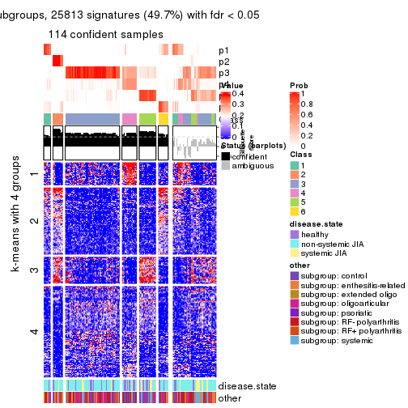</p>

</div>
</div>


Compare the overlap of signatures from different k:

```r
compare_signatures(res)
```


`get_signature()` returns a data frame invisibly. TO get the list of signatures, the function
call should be assigned to a variable explicitly. In following code, if `plot` argument is set
to `FALSE`, no heatmap is plotted while only the differential analysis is performed.

```r
# code only for demonstration
tb = get_signature(res, k = ..., plot = FALSE)
```

An example of the output of `tb` is:

```
#>   which_row         fdr    mean_1    mean_2 scaled_mean_1 scaled_mean_2 km
#> 1        38 0.042760348  8.373488  9.131774    -0.5533452     0.5164555  1
#> 2        40 0.018707592  7.106213  8.469186    -0.6173731     0.5762149  1
#> 3        55 0.019134737 10.221463 11.207825    -0.6159697     0.5749050  1
#> 4        59 0.006059896  5.921854  7.869574    -0.6899429     0.6439467  1
#> 5        60 0.018055526  8.928898 10.211722    -0.6204761     0.5791110  1
#> 6        98 0.009384629 15.714769 14.887706     0.6635654    -0.6193277  2
...
```

The columns in `tb` are:

1. `which_row`: row indices corresponding to the input matrix.
2. `fdr`: FDR for the differential test. 
3. `mean_x`: The mean value in group x.
4. `scaled_mean_x`: The mean value in group x after rows are scaled.
5. `km`: Row groups if k-means clustering is applied to rows.


UMAP plot which shows how samples are separated.


<script>
$( function() {
	$( '#tabs-ATC-hclust-dimension-reduction' ).tabs();
} );
</script>
<div id='tabs-ATC-hclust-dimension-reduction'>
<ul>
<li><a href='#tab-ATC-hclust-dimension-reduction-1'>k = 2</a></li>
<li><a href='#tab-ATC-hclust-dimension-reduction-2'>k = 3</a></li>
<li><a href='#tab-ATC-hclust-dimension-reduction-3'>k = 4</a></li>
<li><a href='#tab-ATC-hclust-dimension-reduction-4'>k = 5</a></li>
<li><a href='#tab-ATC-hclust-dimension-reduction-5'>k = 6</a></li>
</ul>
<div id='tab-ATC-hclust-dimension-reduction-1'>
<pre><code class="r">dimension_reduction(res, k = 2, method = &quot;UMAP&quot;)
</code></pre>

<p></p>

</div>
<div id='tab-ATC-hclust-dimension-reduction-2'>
<pre><code class="r">dimension_reduction(res, k = 3, method = &quot;UMAP&quot;)
</code></pre>

<p></p>

</div>
<div id='tab-ATC-hclust-dimension-reduction-3'>
<pre><code class="r">dimension_reduction(res, k = 4, method = &quot;UMAP&quot;)
</code></pre>

<p></p>

</div>
<div id='tab-ATC-hclust-dimension-reduction-4'>
<pre><code class="r">dimension_reduction(res, k = 5, method = &quot;UMAP&quot;)
</code></pre>

<p></p>

</div>
<div id='tab-ATC-hclust-dimension-reduction-5'>
<pre><code class="r">dimension_reduction(res, k = 6, method = &quot;UMAP&quot;)
</code></pre>

<p></p>

</div>
</div>


Following heatmap shows how subgroups are split when increasing `k`:

```r
collect_classes(res)
```


Test correlation between subgroups and known annotations. If the known
annotation is numeric, one-way ANOVA test is applied, and if the known
annotation is discrete, chi-squared contingency table test is applied.

```r
test_to_known_factors(res)
```

```
#>              n disease.state(p) other(p) k
#> ATC:hclust 151           0.2927    0.248 2
#> ATC:hclust  85           0.4224    0.616 3
#> ATC:hclust 127           0.3295    0.075 4
#> ATC:hclust 107           0.0299    0.279 5
#> ATC:hclust 114           0.1110    0.332 6
```


If matrix rows can be associated to genes, consider to use `GO_Enrichment(res,
...)` to perform function enrichment for the signature genes.


 

---------------------------------------------------


### ATC:kmeans


The object with results only for a single top-value method and a single partition method 
can be extracted as:

```r
res = res_list["ATC", "kmeans"]
# you can also extract it by
# res = res_list["ATC:kmeans"]
```

A summary of `res` and all the functions that can be applied to it:

```r
res
```

```
#> A 'ConsensusPartition' object with k = 2, 3, 4, 5, 6.
#>   On a matrix with 51941 rows and 154 columns.
#>   Top rows (1000, 2000, 3000, 4000, 5000) are extracted by 'ATC' method.
#>   Subgroups are detected by 'kmeans' method.
#>   Performed in total 1250 partitions by row resampling.
#>   Best k for subgroups seems to be 3.
#> 
#> Following methods can be applied to this 'ConsensusPartition' object:
#>  [1] "cola_report"             "collect_classes"         "collect_plots"          
#>  [4] "collect_stats"           "colnames"                "compare_signatures"     
#>  [7] "consensus_heatmap"       "dimension_reduction"     "functional_enrichment"  
#> [10] "get_anno_col"            "get_anno"                "get_classes"            
#> [13] "get_consensus"           "get_matrix"              "get_membership"         
#> [16] "get_param"               "get_signatures"          "get_stats"              
#> [19] "is_best_k"               "is_stable_k"             "membership_heatmap"     
#> [22] "ncol"                    "nrow"                    "plot_ecdf"              
#> [25] "rownames"                "select_partition_number" "show"                   
#> [28] "suggest_best_k"          "test_to_known_factors"
```

`collect_plots()` function collects all the plots made from `res` for all `k` (number of partitions)
into one single page to provide an easy and fast comparison between different `k`.

```r
collect_plots(res)
```


The plots are:

- The first row: a plot of the ECDF (Empirical cumulative distribution
  function) curves of the consensus matrix for each `k` and the heatmap of
  predicted classes for each `k`.
- The second row: heatmaps of the consensus matrix for each `k`.
- The third row: heatmaps of the membership matrix for each `k`.
- The fouth row: heatmaps of the signatures for each `k`.

All the plots in panels can be made by individual functions and they are
plotted later in this section.

`select_partition_number()` produces several plots showing different
statistics for choosing "optimized" `k`. There are following statistics:

- ECDF curves of the consensus matrix for each `k`;
- 1-PAC. [The PAC
  score](https://en.wikipedia.org/wiki/Consensus_clustering#Over-interpretation_potential_of_consensus_clustering)
  measures the proportion of the ambiguous subgrouping.
- Mean silhouette score.
- Concordance. The mean probability of fiting the consensus class ids in all
  partitions.
- Area increased. Denote $A_k$ as the area under the ECDF curve for current
  `k`, the area increased is defined as $A_k - A_{k-1}$.
- Rand index. The percent of pairs of samples that are both in a same cluster
  or both are not in a same cluster in the partition of k and k-1.
- Jaccard index. The ratio of pairs of samples are both in a same cluster in
  the partition of k and k-1 and the pairs of samples are both in a same
  cluster in the partition k or k-1.

The detailed explanations of these statistics can be found in [the cola
vignette](http://bioconductor.org/packages/devel/bioc/vignettes/cola/inst/doc/cola.html#toc_13).

Generally speaking, lower PAC score, higher mean silhouette score or higher
concordance corresponds to better partition. Rand index and Jaccard index
measure how similar the current partition is compared to partition with `k-1`.
If they are too similar, we won't accept `k` is better than `k-1`.

```r
select_partition_number(res)
```


The numeric values for all these statistics can be obtained by `get_stats()`.

```r
get_stats(res)
```

```
#>   k 1-PAC mean_silhouette concordance area_increased  Rand Jaccard
#> 2 2 0.616           0.922       0.938         0.3974 0.613   0.613
#> 3 3 0.629           0.859       0.900         0.5330 0.677   0.504
#> 4 4 0.714           0.741       0.839         0.1375 0.807   0.542
#> 5 5 0.681           0.737       0.830         0.0756 0.950   0.831
#> 6 6 0.681           0.541       0.761         0.0502 0.919   0.722
```

`suggest_best_k()` suggests the best $k$ based on these statistics. The rules are as follows:

- All $k$ with Jaccard index larger than 0.95 are removed because the increase of
  the partition number does not provides enough extra information. If all $k$ are removed,
  the best $k$ is assigned by `NA`.
- For $k$ with 1-PAC larger than 0.9, the maximal $k$ is taken as the "best k". Other $k$ is called "optional k".
- If it does not fit the second rule. The $k$ with the highest vote of highest
  1-PAC, mean silhouette and concordance is taken as the "best k".

```r
suggest_best_k(res)
```

```
#> [1] 3
```


Following shows the table of the partitions (You need to click the **show/hide
code output** link to see it). The membership matrix (columns with name `p*`)
is inferred by
[`clue::cl_consensus()`](https://www.rdocumentation.org/link/cl_consensus?package=clue)
function with the `SE` method. Basically the value in the membership matrix
represents the probability to belong to a certain group. The finall class
label for an item is determined with the group with highest probability it
belongs to.

In `get_classes()` function, the entropy is calculated from the membership
matrix and the silhouette score is calculated from the consensus matrix.


<script>
$( function() {
	$( '#tabs-ATC-kmeans-get-classes' ).tabs();
} );
</script>
<div id='tabs-ATC-kmeans-get-classes'>
<ul>
<li><a href='#tab-ATC-kmeans-get-classes-1'>k = 2</a></li>
<li><a href='#tab-ATC-kmeans-get-classes-2'>k = 3</a></li>
<li><a href='#tab-ATC-kmeans-get-classes-3'>k = 4</a></li>
<li><a href='#tab-ATC-kmeans-get-classes-4'>k = 5</a></li>
<li><a href='#tab-ATC-kmeans-get-classes-5'>k = 6</a></li>
</ul>

<div id='tab-ATC-kmeans-get-classes-1'>
<p><a id='tab-ATC-kmeans-get-classes-1-a' style='color:#0366d6' href='#'>show/hide code output</a></p>
<pre><code class="r">cbind(get_classes(res, k = 2), get_membership(res, k = 2))
</code></pre>

<pre><code>#&gt;           class entropy silhouette    p1    p2
#&gt; GSM340358     1  0.0376      0.944 0.996 0.004
#&gt; GSM340359     2  0.0376      0.901 0.004 0.996
#&gt; GSM340361     1  0.5946      0.899 0.856 0.144
#&gt; GSM340362     1  0.5946      0.899 0.856 0.144
#&gt; GSM340363     1  0.0376      0.944 0.996 0.004
#&gt; GSM340364     2  0.0376      0.901 0.004 0.996
#&gt; GSM340365     1  0.5946      0.899 0.856 0.144
#&gt; GSM340366     1  0.5946      0.899 0.856 0.144
#&gt; GSM340367     1  0.3879      0.929 0.924 0.076
#&gt; GSM340368     1  0.0376      0.944 0.996 0.004
#&gt; GSM340369     1  0.0376      0.944 0.996 0.004
#&gt; GSM340370     1  0.5059      0.915 0.888 0.112
#&gt; GSM340371     1  0.3431      0.931 0.936 0.064
#&gt; GSM340372     1  0.5946      0.899 0.856 0.144
#&gt; GSM340373     1  0.5946      0.899 0.856 0.144
#&gt; GSM340375     1  0.5842      0.901 0.860 0.140
#&gt; GSM340376     1  0.1843      0.937 0.972 0.028
#&gt; GSM340378     2  0.1633      0.912 0.024 0.976
#&gt; GSM340243     1  0.0376      0.944 0.996 0.004
#&gt; GSM340244     2  0.5178      0.935 0.116 0.884
#&gt; GSM340246     2  0.5178      0.935 0.116 0.884
#&gt; GSM340247     1  0.0376      0.944 0.996 0.004
#&gt; GSM340248     2  0.5178      0.935 0.116 0.884
#&gt; GSM340249     2  0.5946      0.921 0.144 0.856
#&gt; GSM340250     1  0.3431      0.931 0.936 0.064
#&gt; GSM340251     2  0.5946      0.921 0.144 0.856
#&gt; GSM340252     2  0.1414      0.914 0.020 0.980
#&gt; GSM340253     2  0.0376      0.901 0.004 0.996
#&gt; GSM340254     2  0.0376      0.901 0.004 0.996
#&gt; GSM340256     2  0.1414      0.914 0.020 0.980
#&gt; GSM340258     1  0.5946      0.899 0.856 0.144
#&gt; GSM340259     1  0.5629      0.904 0.868 0.132
#&gt; GSM340260     1  0.3879      0.929 0.924 0.076
#&gt; GSM340261     1  0.0376      0.944 0.996 0.004
#&gt; GSM340262     1  0.5946      0.899 0.856 0.144
#&gt; GSM340263     2  0.5629      0.928 0.132 0.868
#&gt; GSM340264     1  0.5946      0.899 0.856 0.144
#&gt; GSM340265     1  0.5946      0.899 0.856 0.144
#&gt; GSM340266     1  0.0376      0.944 0.996 0.004
#&gt; GSM340267     1  0.5842      0.901 0.860 0.140
#&gt; GSM340268     1  0.0376      0.944 0.996 0.004
#&gt; GSM340269     1  0.0000      0.944 1.000 0.000
#&gt; GSM340270     1  0.0000      0.944 1.000 0.000
#&gt; GSM537574     1  0.2043      0.936 0.968 0.032
#&gt; GSM537580     1  0.0000      0.944 1.000 0.000
#&gt; GSM537581     1  0.0376      0.944 0.996 0.004
#&gt; GSM340272     1  0.5946      0.899 0.856 0.144
#&gt; GSM340273     2  0.5178      0.935 0.116 0.884
#&gt; GSM340275     2  0.5946      0.921 0.144 0.856
#&gt; GSM340276     1  0.0000      0.944 1.000 0.000
#&gt; GSM340277     2  0.0376      0.901 0.004 0.996
#&gt; GSM340278     1  0.0376      0.944 0.996 0.004
#&gt; GSM340279     1  0.0376      0.944 0.996 0.004
#&gt; GSM340282     1  0.5946      0.899 0.856 0.144
#&gt; GSM340284     2  0.5946      0.921 0.144 0.856
#&gt; GSM340285     1  0.0376      0.944 0.996 0.004
#&gt; GSM340286     1  0.5946      0.899 0.856 0.144
#&gt; GSM340287     1  0.0000      0.944 1.000 0.000
#&gt; GSM340288     1  0.5178      0.912 0.884 0.116
#&gt; GSM340289     1  0.3879      0.929 0.924 0.076
#&gt; GSM340290     1  0.0376      0.944 0.996 0.004
#&gt; GSM340291     2  0.5178      0.935 0.116 0.884
#&gt; GSM340293     1  0.0376      0.944 0.996 0.004
#&gt; GSM340294     1  0.0376      0.944 0.996 0.004
#&gt; GSM340296     1  0.0376      0.944 0.996 0.004
#&gt; GSM340297     1  0.0376      0.944 0.996 0.004
#&gt; GSM340298     1  0.0376      0.944 0.996 0.004
#&gt; GSM340299     1  0.5946      0.899 0.856 0.144
#&gt; GSM340301     1  0.5946      0.899 0.856 0.144
#&gt; GSM340303     1  0.5946      0.899 0.856 0.144
#&gt; GSM340304     1  0.0000      0.944 1.000 0.000
#&gt; GSM340306     1  0.0376      0.944 0.996 0.004
#&gt; GSM340307     2  0.5178      0.935 0.116 0.884
#&gt; GSM340310     1  0.0672      0.943 0.992 0.008
#&gt; GSM340314     1  0.0376      0.944 0.996 0.004
#&gt; GSM340315     1  0.0376      0.944 0.996 0.004
#&gt; GSM340317     2  0.5629      0.928 0.132 0.868
#&gt; GSM340318     1  0.0376      0.944 0.996 0.004
#&gt; GSM340319     1  0.0376      0.944 0.996 0.004
#&gt; GSM340320     1  0.0376      0.944 0.996 0.004
#&gt; GSM340321     2  0.5178      0.935 0.116 0.884
#&gt; GSM340322     1  0.0376      0.944 0.996 0.004
#&gt; GSM340324     2  0.1414      0.914 0.020 0.980
#&gt; GSM340328     1  0.0376      0.944 0.996 0.004
#&gt; GSM340330     1  0.0000      0.944 1.000 0.000
#&gt; GSM340332     1  0.0376      0.944 0.996 0.004
#&gt; GSM340333     2  0.0376      0.901 0.004 0.996
#&gt; GSM340336     2  0.5946      0.921 0.144 0.856
#&gt; GSM340337     1  0.0376      0.944 0.996 0.004
#&gt; GSM340338     1  0.1414      0.941 0.980 0.020
#&gt; GSM340339     1  0.0376      0.944 0.996 0.004
#&gt; GSM340340     2  0.6048      0.919 0.148 0.852
#&gt; GSM340341     1  0.0376      0.944 0.996 0.004
#&gt; GSM340343     1  0.0376      0.944 0.996 0.004
#&gt; GSM340344     2  0.0376      0.901 0.004 0.996
#&gt; GSM340346     1  0.0000      0.944 1.000 0.000
#&gt; GSM340347     1  0.0376      0.944 0.996 0.004
#&gt; GSM340348     1  0.0376      0.944 0.996 0.004
#&gt; GSM340349     1  0.3431      0.931 0.936 0.064
#&gt; GSM340350     1  0.3431      0.931 0.936 0.064
#&gt; GSM340351     1  0.5946      0.899 0.856 0.144
#&gt; GSM340354     1  0.0938      0.942 0.988 0.012
#&gt; GSM340356     2  0.5178      0.935 0.116 0.884
#&gt; GSM340357     1  0.3879      0.929 0.924 0.076
#&gt; GSM348183     1  0.5059      0.914 0.888 0.112
#&gt; GSM348191     1  0.0376      0.944 0.996 0.004
#&gt; GSM348193     1  0.0000      0.944 1.000 0.000
#&gt; GSM537578     1  0.3733      0.930 0.928 0.072
#&gt; GSM348181     1  0.0000      0.944 1.000 0.000
#&gt; GSM348182     1  0.5946      0.899 0.856 0.144
#&gt; GSM348184     2  0.5629      0.928 0.132 0.868
#&gt; GSM348185     2  0.5629      0.928 0.132 0.868
#&gt; GSM348186     2  0.1414      0.914 0.020 0.980
#&gt; GSM348187     1  0.0000      0.944 1.000 0.000
#&gt; GSM348188     1  0.3879      0.928 0.924 0.076
#&gt; GSM348189     1  0.3274      0.932 0.940 0.060
#&gt; GSM348190     1  0.5946      0.899 0.856 0.144
#&gt; GSM348194     1  0.4939      0.916 0.892 0.108
#&gt; GSM348195     1  0.5946      0.899 0.856 0.144
#&gt; GSM348196     1  0.0000      0.944 1.000 0.000
#&gt; GSM537585     1  0.5946      0.899 0.856 0.144
#&gt; GSM537594     2  0.3431      0.924 0.064 0.936
#&gt; GSM537596     1  0.0000      0.944 1.000 0.000
#&gt; GSM537597     1  0.1843      0.937 0.972 0.028
#&gt; GSM537602     1  0.3879      0.929 0.924 0.076
#&gt; GSM340184     1  0.0376      0.944 0.996 0.004
#&gt; GSM340185     2  0.5178      0.935 0.116 0.884
#&gt; GSM340186     2  0.5178      0.935 0.116 0.884
#&gt; GSM340187     1  0.0376      0.944 0.996 0.004
#&gt; GSM340189     1  0.0376      0.944 0.996 0.004
#&gt; GSM340190     2  0.5946      0.921 0.144 0.856
#&gt; GSM340191     1  0.0376      0.944 0.996 0.004
#&gt; GSM340192     2  0.0376      0.901 0.004 0.996
#&gt; GSM340193     1  0.3431      0.931 0.936 0.064
#&gt; GSM340194     1  0.5946      0.899 0.856 0.144
#&gt; GSM340195     1  0.5946      0.899 0.856 0.144
#&gt; GSM340196     1  0.0376      0.944 0.996 0.004
#&gt; GSM340197     1  0.5946      0.899 0.856 0.144
#&gt; GSM340198     2  0.1414      0.914 0.020 0.980
#&gt; GSM340199     1  0.0376      0.944 0.996 0.004
#&gt; GSM340200     2  0.5178      0.935 0.116 0.884
#&gt; GSM340201     1  0.0376      0.944 0.996 0.004
#&gt; GSM340202     1  0.0376      0.944 0.996 0.004
#&gt; GSM340203     1  0.0376      0.944 0.996 0.004
#&gt; GSM340204     2  0.9635      0.224 0.388 0.612
#&gt; GSM340205     1  0.0000      0.944 1.000 0.000
#&gt; GSM340206     1  0.0376      0.944 0.996 0.004
#&gt; GSM340207     1  0.5946      0.899 0.856 0.144
#&gt; GSM340237     2  0.5178      0.935 0.116 0.884
#&gt; GSM340238     1  0.0376      0.944 0.996 0.004
#&gt; GSM340239     1  0.5946      0.899 0.856 0.144
#&gt; GSM340240     1  0.5946      0.899 0.856 0.144
#&gt; GSM340241     2  0.3431      0.924 0.064 0.936
#&gt; GSM340242     1  0.3274      0.932 0.940 0.060
</code></pre>

<script>
$('#tab-ATC-kmeans-get-classes-1-a').parent().next().next().hide();
$('#tab-ATC-kmeans-get-classes-1-a').click(function(){
  $('#tab-ATC-kmeans-get-classes-1-a').parent().next().next().toggle();
  return(false);
});
</script>
</div>

<div id='tab-ATC-kmeans-get-classes-2'>
<p><a id='tab-ATC-kmeans-get-classes-2-a' style='color:#0366d6' href='#'>show/hide code output</a></p>
<pre><code class="r">cbind(get_classes(res, k = 3), get_membership(res, k = 3))
</code></pre>

<pre><code>#&gt;           class entropy silhouette    p1    p2    p3
#&gt; GSM340358     1  0.0424     0.9234 0.992 0.000 0.008
#&gt; GSM340359     2  0.2448     0.9446 0.000 0.924 0.076
#&gt; GSM340361     3  0.3412     0.9141 0.124 0.000 0.876
#&gt; GSM340362     3  0.3412     0.9141 0.124 0.000 0.876
#&gt; GSM340363     1  0.0424     0.9234 0.992 0.000 0.008
#&gt; GSM340364     3  0.5138     0.4891 0.000 0.252 0.748
#&gt; GSM340365     3  0.3412     0.9141 0.124 0.000 0.876
#&gt; GSM340366     3  0.3412     0.9141 0.124 0.000 0.876
#&gt; GSM340367     3  0.4931     0.8253 0.232 0.000 0.768
#&gt; GSM340368     1  0.3472     0.8478 0.904 0.040 0.056
#&gt; GSM340369     1  0.0592     0.9217 0.988 0.012 0.000
#&gt; GSM340370     3  0.4702     0.8464 0.212 0.000 0.788
#&gt; GSM340371     1  0.5785     0.3745 0.668 0.000 0.332
#&gt; GSM340372     3  0.3551     0.9114 0.132 0.000 0.868
#&gt; GSM340373     3  0.3412     0.9141 0.124 0.000 0.876
#&gt; GSM340375     3  0.3619     0.9096 0.136 0.000 0.864
#&gt; GSM340376     1  0.4399     0.7892 0.812 0.000 0.188
#&gt; GSM340378     2  0.2446     0.9409 0.012 0.936 0.052
#&gt; GSM340243     1  0.0424     0.9234 0.992 0.000 0.008
#&gt; GSM340244     2  0.1182     0.9515 0.012 0.976 0.012
#&gt; GSM340246     2  0.0829     0.9517 0.012 0.984 0.004
#&gt; GSM340247     1  0.1182     0.9139 0.976 0.012 0.012
#&gt; GSM340248     2  0.2651     0.9391 0.012 0.928 0.060
#&gt; GSM340249     2  0.2301     0.9372 0.004 0.936 0.060
#&gt; GSM340250     3  0.6252     0.4517 0.444 0.000 0.556
#&gt; GSM340251     2  0.2301     0.9372 0.004 0.936 0.060
#&gt; GSM340252     2  0.2066     0.9474 0.000 0.940 0.060
#&gt; GSM340253     2  0.2448     0.9446 0.000 0.924 0.076
#&gt; GSM340254     2  0.2448     0.9446 0.000 0.924 0.076
#&gt; GSM340256     2  0.2448     0.9446 0.000 0.924 0.076
#&gt; GSM340258     3  0.3412     0.9141 0.124 0.000 0.876
#&gt; GSM340259     3  0.3619     0.9096 0.136 0.000 0.864
#&gt; GSM340260     3  0.6252     0.4517 0.444 0.000 0.556
#&gt; GSM340261     1  0.0424     0.9234 0.992 0.000 0.008
#&gt; GSM340262     3  0.3412     0.9141 0.124 0.000 0.876
#&gt; GSM340263     2  0.2651     0.9391 0.012 0.928 0.060
#&gt; GSM340264     3  0.3412     0.9141 0.124 0.000 0.876
#&gt; GSM340265     3  0.3412     0.9141 0.124 0.000 0.876
#&gt; GSM340266     1  0.0424     0.9234 0.992 0.000 0.008
#&gt; GSM340267     3  0.3619     0.9096 0.136 0.000 0.864
#&gt; GSM340268     1  0.0000     0.9228 1.000 0.000 0.000
#&gt; GSM340269     1  0.1860     0.9026 0.948 0.000 0.052
#&gt; GSM340270     1  0.1860     0.9026 0.948 0.000 0.052
#&gt; GSM537574     1  0.2878     0.8870 0.904 0.000 0.096
#&gt; GSM537580     1  0.1529     0.9099 0.960 0.000 0.040
#&gt; GSM537581     1  0.0592     0.9217 0.988 0.012 0.000
#&gt; GSM340272     3  0.3412     0.9141 0.124 0.000 0.876
#&gt; GSM340273     2  0.1182     0.9506 0.012 0.976 0.012
#&gt; GSM340275     1  0.7866     0.2243 0.552 0.388 0.060
#&gt; GSM340276     1  0.1753     0.9053 0.952 0.000 0.048
#&gt; GSM340277     2  0.2448     0.9446 0.000 0.924 0.076
#&gt; GSM340278     1  0.0424     0.9234 0.992 0.000 0.008
#&gt; GSM340279     1  0.0000     0.9228 1.000 0.000 0.000
#&gt; GSM340282     3  0.3412     0.9141 0.124 0.000 0.876
#&gt; GSM340284     1  0.6722     0.6004 0.720 0.220 0.060
#&gt; GSM340285     1  0.0424     0.9234 0.992 0.000 0.008
#&gt; GSM340286     3  0.3412     0.9141 0.124 0.000 0.876
#&gt; GSM340287     1  0.1753     0.9053 0.952 0.000 0.048
#&gt; GSM340288     3  0.3619     0.9096 0.136 0.000 0.864
#&gt; GSM340289     3  0.5835     0.6725 0.340 0.000 0.660
#&gt; GSM340290     1  0.0424     0.9234 0.992 0.000 0.008
#&gt; GSM340291     2  0.1999     0.9501 0.012 0.952 0.036
#&gt; GSM340293     1  0.0592     0.9217 0.988 0.012 0.000
#&gt; GSM340294     1  0.0424     0.9234 0.992 0.000 0.008
#&gt; GSM340296     1  0.0424     0.9234 0.992 0.000 0.008
#&gt; GSM340297     1  0.0424     0.9234 0.992 0.000 0.008
#&gt; GSM340298     1  0.0424     0.9234 0.992 0.000 0.008
#&gt; GSM340299     3  0.3412     0.9141 0.124 0.000 0.876
#&gt; GSM340301     3  0.3412     0.9141 0.124 0.000 0.876
#&gt; GSM340303     3  0.3412     0.9141 0.124 0.000 0.876
#&gt; GSM340304     1  0.1860     0.9026 0.948 0.000 0.052
#&gt; GSM340306     1  0.0592     0.9217 0.988 0.012 0.000
#&gt; GSM340307     2  0.2651     0.9391 0.012 0.928 0.060
#&gt; GSM340310     1  0.2959     0.8517 0.900 0.000 0.100
#&gt; GSM340314     1  0.0592     0.9217 0.988 0.012 0.000
#&gt; GSM340315     1  0.0424     0.9234 0.992 0.000 0.008
#&gt; GSM340317     2  0.2651     0.9391 0.012 0.928 0.060
#&gt; GSM340318     1  0.0592     0.9217 0.988 0.012 0.000
#&gt; GSM340319     1  0.0592     0.9217 0.988 0.012 0.000
#&gt; GSM340320     1  0.0592     0.9217 0.988 0.012 0.000
#&gt; GSM340321     2  0.1999     0.9501 0.012 0.952 0.036
#&gt; GSM340322     1  0.0592     0.9217 0.988 0.012 0.000
#&gt; GSM340324     2  0.2448     0.9446 0.000 0.924 0.076
#&gt; GSM340328     1  0.0424     0.9234 0.992 0.000 0.008
#&gt; GSM340330     1  0.0592     0.9223 0.988 0.000 0.012
#&gt; GSM340332     1  0.0592     0.9217 0.988 0.012 0.000
#&gt; GSM340333     2  0.2448     0.9446 0.000 0.924 0.076
#&gt; GSM340336     1  0.7839     0.2484 0.560 0.380 0.060
#&gt; GSM340337     1  0.0592     0.9217 0.988 0.012 0.000
#&gt; GSM340338     1  0.1860     0.9026 0.948 0.000 0.052
#&gt; GSM340339     1  0.0592     0.9217 0.988 0.012 0.000
#&gt; GSM340340     1  0.6633     0.6313 0.728 0.212 0.060
#&gt; GSM340341     1  0.4097     0.8120 0.880 0.060 0.060
#&gt; GSM340343     1  0.0592     0.9217 0.988 0.012 0.000
#&gt; GSM340344     3  0.1289     0.7672 0.000 0.032 0.968
#&gt; GSM340346     1  0.1860     0.9026 0.948 0.000 0.052
#&gt; GSM340347     1  0.0592     0.9217 0.988 0.012 0.000
#&gt; GSM340348     1  0.0592     0.9217 0.988 0.012 0.000
#&gt; GSM340349     3  0.6305     0.3319 0.484 0.000 0.516
#&gt; GSM340350     1  0.6252    -0.0773 0.556 0.000 0.444
#&gt; GSM340351     3  0.3551     0.9114 0.132 0.000 0.868
#&gt; GSM340354     1  0.1860     0.9026 0.948 0.000 0.052
#&gt; GSM340356     2  0.0829     0.9517 0.012 0.984 0.004
#&gt; GSM340357     3  0.4974     0.8206 0.236 0.000 0.764
#&gt; GSM348183     3  0.3619     0.9096 0.136 0.000 0.864
#&gt; GSM348191     1  0.0424     0.9234 0.992 0.000 0.008
#&gt; GSM348193     1  0.1753     0.9053 0.952 0.000 0.048
#&gt; GSM537578     3  0.6079     0.5816 0.388 0.000 0.612
#&gt; GSM348181     1  0.1753     0.9053 0.952 0.000 0.048
#&gt; GSM348182     3  0.3412     0.9141 0.124 0.000 0.876
#&gt; GSM348184     2  0.1337     0.9500 0.012 0.972 0.016
#&gt; GSM348185     2  0.2651     0.9391 0.012 0.928 0.060
#&gt; GSM348186     2  0.2448     0.9446 0.000 0.924 0.076
#&gt; GSM348187     1  0.1860     0.9026 0.948 0.000 0.052
#&gt; GSM348188     3  0.3989     0.9093 0.124 0.012 0.864
#&gt; GSM348189     1  0.4974     0.6260 0.764 0.000 0.236
#&gt; GSM348190     3  0.3412     0.9141 0.124 0.000 0.876
#&gt; GSM348194     3  0.3619     0.9096 0.136 0.000 0.864
#&gt; GSM348195     3  0.3412     0.9141 0.124 0.000 0.876
#&gt; GSM348196     1  0.1860     0.9026 0.948 0.000 0.052
#&gt; GSM537585     3  0.3412     0.9141 0.124 0.000 0.876
#&gt; GSM537594     2  0.2116     0.9498 0.012 0.948 0.040
#&gt; GSM537596     1  0.1860     0.9026 0.948 0.000 0.052
#&gt; GSM537597     1  0.3941     0.8287 0.844 0.000 0.156
#&gt; GSM537602     3  0.6286     0.3950 0.464 0.000 0.536
#&gt; GSM340184     1  0.1411     0.9120 0.964 0.000 0.036
#&gt; GSM340185     2  0.1999     0.9501 0.012 0.952 0.036
#&gt; GSM340186     2  0.1015     0.9511 0.012 0.980 0.008
#&gt; GSM340187     1  0.3472     0.8478 0.904 0.040 0.056
#&gt; GSM340189     1  0.0592     0.9217 0.988 0.012 0.000
#&gt; GSM340190     2  0.7478     0.5221 0.308 0.632 0.060
#&gt; GSM340191     1  0.0000     0.9228 1.000 0.000 0.000
#&gt; GSM340192     3  0.6260    -0.0677 0.000 0.448 0.552
#&gt; GSM340193     3  0.4702     0.8465 0.212 0.000 0.788
#&gt; GSM340194     3  0.3412     0.9141 0.124 0.000 0.876
#&gt; GSM340195     3  0.3412     0.9141 0.124 0.000 0.876
#&gt; GSM340196     1  0.0592     0.9217 0.988 0.012 0.000
#&gt; GSM340197     3  0.3412     0.9141 0.124 0.000 0.876
#&gt; GSM340198     2  0.2448     0.9446 0.000 0.924 0.076
#&gt; GSM340199     1  0.0000     0.9228 1.000 0.000 0.000
#&gt; GSM340200     2  0.2651     0.9391 0.012 0.928 0.060
#&gt; GSM340201     1  0.0592     0.9217 0.988 0.012 0.000
#&gt; GSM340202     1  0.0592     0.9217 0.988 0.012 0.000
#&gt; GSM340203     1  0.0592     0.9217 0.988 0.012 0.000
#&gt; GSM340204     3  0.2318     0.8051 0.028 0.028 0.944
#&gt; GSM340205     1  0.1753     0.9053 0.952 0.000 0.048
#&gt; GSM340206     1  0.0000     0.9228 1.000 0.000 0.000
#&gt; GSM340207     3  0.3412     0.9141 0.124 0.000 0.876
#&gt; GSM340237     2  0.0592     0.9518 0.012 0.988 0.000
#&gt; GSM340238     1  0.0592     0.9217 0.988 0.012 0.000
#&gt; GSM340239     3  0.3412     0.9141 0.124 0.000 0.876
#&gt; GSM340240     3  0.3412     0.9141 0.124 0.000 0.876
#&gt; GSM340241     2  0.2496     0.9463 0.004 0.928 0.068
#&gt; GSM340242     1  0.4974     0.6260 0.764 0.000 0.236
</code></pre>

<script>
$('#tab-ATC-kmeans-get-classes-2-a').parent().next().next().hide();
$('#tab-ATC-kmeans-get-classes-2-a').click(function(){
  $('#tab-ATC-kmeans-get-classes-2-a').parent().next().next().toggle();
  return(false);
});
</script>
</div>

<div id='tab-ATC-kmeans-get-classes-3'>
<p><a id='tab-ATC-kmeans-get-classes-3-a' style='color:#0366d6' href='#'>show/hide code output</a></p>
<pre><code class="r">cbind(get_classes(res, k = 4), get_membership(res, k = 4))
</code></pre>

<pre><code>#&gt;           class entropy silhouette    p1    p2    p3    p4
#&gt; GSM340358     1  0.0000     0.8220 1.000 0.000 0.000 0.000
#&gt; GSM340359     2  0.3196     0.8201 0.000 0.856 0.008 0.136
#&gt; GSM340361     3  0.1211     0.9252 0.040 0.000 0.960 0.000
#&gt; GSM340362     3  0.1211     0.9252 0.040 0.000 0.960 0.000
#&gt; GSM340363     1  0.0000     0.8220 1.000 0.000 0.000 0.000
#&gt; GSM340364     3  0.5478     0.5838 0.000 0.056 0.696 0.248
#&gt; GSM340365     3  0.1211     0.9252 0.040 0.000 0.960 0.000
#&gt; GSM340366     3  0.1211     0.9252 0.040 0.000 0.960 0.000
#&gt; GSM340367     1  0.4978     0.3719 0.612 0.000 0.384 0.004
#&gt; GSM340368     4  0.5022     0.6430 0.264 0.000 0.028 0.708
#&gt; GSM340369     4  0.4999     0.7398 0.492 0.000 0.000 0.508
#&gt; GSM340370     1  0.5558     0.2524 0.548 0.000 0.432 0.020
#&gt; GSM340371     1  0.2546     0.7836 0.912 0.000 0.060 0.028
#&gt; GSM340372     3  0.1398     0.9230 0.040 0.000 0.956 0.004
#&gt; GSM340373     3  0.1211     0.9252 0.040 0.000 0.960 0.000
#&gt; GSM340375     3  0.5550     0.1478 0.428 0.000 0.552 0.020
#&gt; GSM340376     1  0.5220     0.5767 0.752 0.000 0.092 0.156
#&gt; GSM340378     2  0.5161     0.7762 0.000 0.676 0.024 0.300
#&gt; GSM340243     1  0.0188     0.8243 0.996 0.000 0.004 0.000
#&gt; GSM340244     2  0.2814     0.8479 0.000 0.868 0.000 0.132
#&gt; GSM340246     2  0.2888     0.8488 0.000 0.872 0.004 0.124
#&gt; GSM340247     4  0.4994     0.7353 0.480 0.000 0.000 0.520
#&gt; GSM340248     2  0.4655     0.7868 0.000 0.684 0.004 0.312
#&gt; GSM340249     2  0.4564     0.7794 0.000 0.672 0.000 0.328
#&gt; GSM340250     1  0.3583     0.6746 0.816 0.000 0.180 0.004
#&gt; GSM340251     2  0.4500     0.7865 0.000 0.684 0.000 0.316
#&gt; GSM340252     2  0.3933     0.8310 0.000 0.792 0.008 0.200
#&gt; GSM340253     2  0.3196     0.8201 0.000 0.856 0.008 0.136
#&gt; GSM340254     2  0.3196     0.8201 0.000 0.856 0.008 0.136
#&gt; GSM340256     2  0.2868     0.8208 0.000 0.864 0.000 0.136
#&gt; GSM340258     3  0.0927     0.9000 0.016 0.000 0.976 0.008
#&gt; GSM340259     3  0.2197     0.8873 0.080 0.000 0.916 0.004
#&gt; GSM340260     1  0.3583     0.6746 0.816 0.000 0.180 0.004
#&gt; GSM340261     1  0.0188     0.8243 0.996 0.000 0.004 0.000
#&gt; GSM340262     3  0.1211     0.9252 0.040 0.000 0.960 0.000
#&gt; GSM340263     2  0.4836     0.7788 0.000 0.672 0.008 0.320
#&gt; GSM340264     3  0.1211     0.9252 0.040 0.000 0.960 0.000
#&gt; GSM340265     3  0.1209     0.9167 0.032 0.000 0.964 0.004
#&gt; GSM340266     1  0.0000     0.8220 1.000 0.000 0.000 0.000
#&gt; GSM340267     3  0.5281     0.0773 0.464 0.000 0.528 0.008
#&gt; GSM340268     1  0.0188     0.8197 0.996 0.000 0.000 0.004
#&gt; GSM340269     1  0.0592     0.8266 0.984 0.000 0.016 0.000
#&gt; GSM340270     1  0.0592     0.8266 0.984 0.000 0.016 0.000
#&gt; GSM537574     1  0.4405     0.6126 0.800 0.000 0.048 0.152
#&gt; GSM537580     1  0.1109     0.8159 0.968 0.000 0.004 0.028
#&gt; GSM537581     4  0.4999     0.7398 0.492 0.000 0.000 0.508
#&gt; GSM340272     3  0.1211     0.9252 0.040 0.000 0.960 0.000
#&gt; GSM340273     2  0.2999     0.8475 0.000 0.864 0.004 0.132
#&gt; GSM340275     4  0.3994     0.2860 0.028 0.140 0.004 0.828
#&gt; GSM340276     1  0.0592     0.8266 0.984 0.000 0.016 0.000
#&gt; GSM340277     2  0.3196     0.8201 0.000 0.856 0.008 0.136
#&gt; GSM340278     1  0.0000     0.8220 1.000 0.000 0.000 0.000
#&gt; GSM340279     1  0.0000     0.8220 1.000 0.000 0.000 0.000
#&gt; GSM340282     3  0.1211     0.9252 0.040 0.000 0.960 0.000
#&gt; GSM340284     4  0.4596     0.3002 0.028 0.140 0.024 0.808
#&gt; GSM340285     1  0.0000     0.8220 1.000 0.000 0.000 0.000
#&gt; GSM340286     3  0.1211     0.9252 0.040 0.000 0.960 0.000
#&gt; GSM340287     1  0.0592     0.8266 0.984 0.000 0.016 0.000
#&gt; GSM340288     1  0.5167     0.0352 0.508 0.000 0.488 0.004
#&gt; GSM340289     1  0.4188     0.5966 0.752 0.000 0.244 0.004
#&gt; GSM340290     1  0.0000     0.8220 1.000 0.000 0.000 0.000
#&gt; GSM340291     2  0.0817     0.8488 0.000 0.976 0.000 0.024
#&gt; GSM340293     4  0.4999     0.7398 0.492 0.000 0.000 0.508
#&gt; GSM340294     1  0.0188     0.8243 0.996 0.000 0.004 0.000
#&gt; GSM340296     1  0.0188     0.8243 0.996 0.000 0.004 0.000
#&gt; GSM340297     1  0.0000     0.8220 1.000 0.000 0.000 0.000
#&gt; GSM340298     1  0.0188     0.8243 0.996 0.000 0.004 0.000
#&gt; GSM340299     3  0.1211     0.9252 0.040 0.000 0.960 0.000
#&gt; GSM340301     3  0.1211     0.9252 0.040 0.000 0.960 0.000
#&gt; GSM340303     3  0.0779     0.9003 0.016 0.000 0.980 0.004
#&gt; GSM340304     1  0.0779     0.8257 0.980 0.000 0.016 0.004
#&gt; GSM340306     1  0.4564    -0.1821 0.672 0.000 0.000 0.328
#&gt; GSM340307     2  0.4720     0.7799 0.000 0.672 0.004 0.324
#&gt; GSM340310     1  0.1004     0.8226 0.972 0.000 0.024 0.004
#&gt; GSM340314     1  0.0188     0.8197 0.996 0.000 0.000 0.004
#&gt; GSM340315     1  0.0592     0.8174 0.984 0.000 0.016 0.000
#&gt; GSM340317     2  0.4500     0.7865 0.000 0.684 0.000 0.316
#&gt; GSM340318     4  0.4999     0.7398 0.492 0.000 0.000 0.508
#&gt; GSM340319     4  0.4999     0.7398 0.492 0.000 0.000 0.508
#&gt; GSM340320     1  0.4477    -0.0976 0.688 0.000 0.000 0.312
#&gt; GSM340321     2  0.0592     0.8483 0.000 0.984 0.000 0.016
#&gt; GSM340322     4  0.4989     0.7276 0.472 0.000 0.000 0.528
#&gt; GSM340324     2  0.2868     0.8208 0.000 0.864 0.000 0.136
#&gt; GSM340328     1  0.0000     0.8220 1.000 0.000 0.000 0.000
#&gt; GSM340330     1  0.0524     0.8261 0.988 0.000 0.008 0.004
#&gt; GSM340332     4  0.4999     0.7398 0.492 0.000 0.000 0.508
#&gt; GSM340333     2  0.3196     0.8201 0.000 0.856 0.008 0.136
#&gt; GSM340336     4  0.4113     0.3090 0.040 0.128 0.004 0.828
#&gt; GSM340337     4  0.4999     0.7398 0.492 0.000 0.000 0.508
#&gt; GSM340338     1  0.0779     0.8262 0.980 0.000 0.016 0.004
#&gt; GSM340339     4  0.4999     0.7398 0.492 0.000 0.000 0.508
#&gt; GSM340340     4  0.4846     0.3296 0.044 0.124 0.028 0.804
#&gt; GSM340341     4  0.4446     0.5596 0.196 0.000 0.028 0.776
#&gt; GSM340343     1  0.3569     0.4175 0.804 0.000 0.000 0.196
#&gt; GSM340344     3  0.4331     0.6057 0.000 0.000 0.712 0.288
#&gt; GSM340346     1  0.0592     0.8266 0.984 0.000 0.016 0.000
#&gt; GSM340347     4  0.4999     0.7398 0.492 0.000 0.000 0.508
#&gt; GSM340348     1  0.4277     0.0666 0.720 0.000 0.000 0.280
#&gt; GSM340349     1  0.3208     0.7104 0.848 0.000 0.148 0.004
#&gt; GSM340350     1  0.2888     0.7349 0.872 0.000 0.124 0.004
#&gt; GSM340351     3  0.1211     0.9252 0.040 0.000 0.960 0.000
#&gt; GSM340354     1  0.1151     0.8210 0.968 0.000 0.024 0.008
#&gt; GSM340356     2  0.2888     0.8488 0.000 0.872 0.004 0.124
#&gt; GSM340357     1  0.4936     0.4032 0.624 0.000 0.372 0.004
#&gt; GSM348183     3  0.2266     0.8831 0.084 0.000 0.912 0.004
#&gt; GSM348191     1  0.0188     0.8243 0.996 0.000 0.004 0.000
#&gt; GSM348193     1  0.1004     0.8226 0.972 0.000 0.024 0.004
#&gt; GSM537578     1  0.3982     0.6274 0.776 0.000 0.220 0.004
#&gt; GSM348181     1  0.0592     0.8266 0.984 0.000 0.016 0.000
#&gt; GSM348182     3  0.1211     0.9252 0.040 0.000 0.960 0.000
#&gt; GSM348184     2  0.3486     0.8344 0.000 0.812 0.000 0.188
#&gt; GSM348185     2  0.4564     0.7794 0.000 0.672 0.000 0.328
#&gt; GSM348186     2  0.2868     0.8208 0.000 0.864 0.000 0.136
#&gt; GSM348187     1  0.0779     0.8257 0.980 0.000 0.016 0.004
#&gt; GSM348188     3  0.1211     0.9252 0.040 0.000 0.960 0.000
#&gt; GSM348189     1  0.2032     0.8036 0.936 0.000 0.036 0.028
#&gt; GSM348190     3  0.1211     0.9252 0.040 0.000 0.960 0.000
#&gt; GSM348194     1  0.5132     0.1752 0.548 0.000 0.448 0.004
#&gt; GSM348195     3  0.1211     0.9252 0.040 0.000 0.960 0.000
#&gt; GSM348196     1  0.0592     0.8266 0.984 0.000 0.016 0.000
#&gt; GSM537585     3  0.1305     0.9212 0.036 0.000 0.960 0.004
#&gt; GSM537594     2  0.0000     0.8466 0.000 1.000 0.000 0.000
#&gt; GSM537596     1  0.0592     0.8266 0.984 0.000 0.016 0.000
#&gt; GSM537597     1  0.4849     0.5854 0.772 0.000 0.064 0.164
#&gt; GSM537602     1  0.3355     0.6973 0.836 0.000 0.160 0.004
#&gt; GSM340184     1  0.0469     0.8263 0.988 0.000 0.012 0.000
#&gt; GSM340185     2  0.0592     0.8483 0.000 0.984 0.000 0.016
#&gt; GSM340186     2  0.2814     0.8479 0.000 0.868 0.000 0.132
#&gt; GSM340187     4  0.5558     0.6889 0.364 0.000 0.028 0.608
#&gt; GSM340189     4  0.4999     0.7398 0.492 0.000 0.000 0.508
#&gt; GSM340190     4  0.4248     0.1007 0.012 0.220 0.000 0.768
#&gt; GSM340191     1  0.0188     0.8197 0.996 0.000 0.000 0.004
#&gt; GSM340192     3  0.6732     0.3287 0.000 0.108 0.556 0.336
#&gt; GSM340193     1  0.5016     0.3404 0.600 0.000 0.396 0.004
#&gt; GSM340194     3  0.1211     0.9252 0.040 0.000 0.960 0.000
#&gt; GSM340195     3  0.1211     0.9252 0.040 0.000 0.960 0.000
#&gt; GSM340196     4  0.4999     0.7398 0.492 0.000 0.000 0.508
#&gt; GSM340197     3  0.1211     0.9252 0.040 0.000 0.960 0.000
#&gt; GSM340198     2  0.3196     0.8201 0.000 0.856 0.008 0.136
#&gt; GSM340199     1  0.0188     0.8197 0.996 0.000 0.000 0.004
#&gt; GSM340200     2  0.4720     0.7799 0.000 0.672 0.004 0.324
#&gt; GSM340201     4  0.4999     0.7398 0.492 0.000 0.000 0.508
#&gt; GSM340202     4  0.4999     0.7398 0.492 0.000 0.000 0.508
#&gt; GSM340203     4  0.4999     0.7398 0.492 0.000 0.000 0.508
#&gt; GSM340204     3  0.3311     0.7394 0.000 0.000 0.828 0.172
#&gt; GSM340205     1  0.0592     0.8266 0.984 0.000 0.016 0.000
#&gt; GSM340206     1  0.0188     0.8197 0.996 0.000 0.000 0.004
#&gt; GSM340207     3  0.1211     0.9252 0.040 0.000 0.960 0.000
#&gt; GSM340237     2  0.2704     0.8488 0.000 0.876 0.000 0.124
#&gt; GSM340238     1  0.0336     0.8161 0.992 0.000 0.000 0.008
#&gt; GSM340239     3  0.1211     0.9252 0.040 0.000 0.960 0.000
#&gt; GSM340240     3  0.1211     0.9252 0.040 0.000 0.960 0.000
#&gt; GSM340241     2  0.2281     0.8311 0.000 0.904 0.000 0.096
#&gt; GSM340242     1  0.1929     0.8043 0.940 0.000 0.036 0.024
</code></pre>

<script>
$('#tab-ATC-kmeans-get-classes-3-a').parent().next().next().hide();
$('#tab-ATC-kmeans-get-classes-3-a').click(function(){
  $('#tab-ATC-kmeans-get-classes-3-a').parent().next().next().toggle();
  return(false);
});
</script>
</div>

<div id='tab-ATC-kmeans-get-classes-4'>
<p><a id='tab-ATC-kmeans-get-classes-4-a' style='color:#0366d6' href='#'>show/hide code output</a></p>
<pre><code class="r">cbind(get_classes(res, k = 5), get_membership(res, k = 5))
</code></pre>

<pre><code>#&gt;           class entropy silhouette    p1    p2    p3    p4    p5
#&gt; GSM340358     3  0.1117     0.8359 0.000 0.020 0.964 0.016 0.000
#&gt; GSM340359     1  0.0290     0.7607 0.992 0.000 0.000 0.000 0.008
#&gt; GSM340361     5  0.0162     0.8854 0.000 0.000 0.004 0.000 0.996
#&gt; GSM340362     5  0.0324     0.8844 0.004 0.000 0.004 0.000 0.992
#&gt; GSM340363     3  0.0609     0.8340 0.000 0.000 0.980 0.020 0.000
#&gt; GSM340364     5  0.7879     0.4392 0.192 0.224 0.000 0.124 0.460
#&gt; GSM340365     5  0.0162     0.8854 0.000 0.000 0.004 0.000 0.996
#&gt; GSM340366     5  0.0566     0.8843 0.000 0.012 0.004 0.000 0.984
#&gt; GSM340367     3  0.5884     0.6239 0.000 0.168 0.664 0.028 0.140
#&gt; GSM340368     4  0.2304     0.6829 0.000 0.044 0.048 0.908 0.000
#&gt; GSM340369     4  0.3274     0.8610 0.000 0.000 0.220 0.780 0.000
#&gt; GSM340370     3  0.6730     0.5707 0.000 0.172 0.604 0.152 0.072
#&gt; GSM340371     3  0.2726     0.7888 0.000 0.064 0.884 0.052 0.000
#&gt; GSM340372     5  0.3360     0.8227 0.000 0.168 0.004 0.012 0.816
#&gt; GSM340373     5  0.2970     0.8278 0.000 0.168 0.004 0.000 0.828
#&gt; GSM340375     3  0.7965     0.3157 0.000 0.180 0.456 0.152 0.212
#&gt; GSM340376     3  0.5670     0.5973 0.000 0.192 0.632 0.176 0.000
#&gt; GSM340378     2  0.5879     0.6876 0.236 0.612 0.000 0.148 0.004
#&gt; GSM340243     3  0.0162     0.8360 0.000 0.000 0.996 0.004 0.000
#&gt; GSM340244     2  0.3876     0.7843 0.316 0.684 0.000 0.000 0.000
#&gt; GSM340246     2  0.3837     0.7949 0.308 0.692 0.000 0.000 0.000
#&gt; GSM340247     4  0.3300     0.8518 0.000 0.004 0.204 0.792 0.000
#&gt; GSM340248     2  0.3579     0.8294 0.240 0.756 0.000 0.004 0.000
#&gt; GSM340249     2  0.4496     0.8113 0.216 0.728 0.000 0.056 0.000
#&gt; GSM340250     3  0.3997     0.7490 0.000 0.152 0.800 0.028 0.020
#&gt; GSM340251     2  0.4413     0.8253 0.232 0.724 0.000 0.044 0.000
#&gt; GSM340252     1  0.2763     0.6194 0.848 0.148 0.000 0.000 0.004
#&gt; GSM340253     1  0.0290     0.7607 0.992 0.000 0.000 0.000 0.008
#&gt; GSM340254     1  0.0162     0.7675 0.996 0.004 0.000 0.000 0.000
#&gt; GSM340256     1  0.0290     0.7675 0.992 0.008 0.000 0.000 0.000
#&gt; GSM340258     5  0.4468     0.8036 0.000 0.104 0.004 0.124 0.768
#&gt; GSM340259     5  0.4537     0.7724 0.000 0.168 0.060 0.012 0.760
#&gt; GSM340260     3  0.3236     0.7646 0.000 0.152 0.828 0.000 0.020
#&gt; GSM340261     3  0.0609     0.8340 0.000 0.000 0.980 0.020 0.000
#&gt; GSM340262     5  0.0162     0.8854 0.000 0.000 0.004 0.000 0.996
#&gt; GSM340263     2  0.4701     0.8127 0.236 0.704 0.000 0.060 0.000
#&gt; GSM340264     5  0.1356     0.8799 0.000 0.028 0.004 0.012 0.956
#&gt; GSM340265     5  0.1356     0.8787 0.000 0.012 0.004 0.028 0.956
#&gt; GSM340266     3  0.0771     0.8327 0.000 0.004 0.976 0.020 0.000
#&gt; GSM340267     3  0.7603     0.3522 0.000 0.156 0.496 0.112 0.236
#&gt; GSM340268     3  0.1282     0.8213 0.000 0.004 0.952 0.044 0.000
#&gt; GSM340269     3  0.0000     0.8361 0.000 0.000 1.000 0.000 0.000
#&gt; GSM340270     3  0.0880     0.8324 0.000 0.032 0.968 0.000 0.000
#&gt; GSM537574     3  0.3695     0.7010 0.000 0.036 0.800 0.164 0.000
#&gt; GSM537580     3  0.3055     0.7718 0.000 0.064 0.864 0.072 0.000
#&gt; GSM537581     4  0.3430     0.8602 0.000 0.004 0.220 0.776 0.000
#&gt; GSM340272     5  0.0162     0.8854 0.000 0.000 0.004 0.000 0.996
#&gt; GSM340273     2  0.3837     0.7949 0.308 0.692 0.000 0.000 0.000
#&gt; GSM340275     4  0.4331     0.2145 0.004 0.400 0.000 0.596 0.000
#&gt; GSM340276     3  0.0000     0.8361 0.000 0.000 1.000 0.000 0.000
#&gt; GSM340277     1  0.0162     0.7675 0.996 0.004 0.000 0.000 0.000
#&gt; GSM340278     3  0.0609     0.8340 0.000 0.000 0.980 0.020 0.000
#&gt; GSM340279     3  0.0771     0.8327 0.000 0.004 0.976 0.020 0.000
#&gt; GSM340282     5  0.0162     0.8854 0.000 0.000 0.004 0.000 0.996
#&gt; GSM340284     2  0.5289     0.4355 0.004 0.620 0.060 0.316 0.000
#&gt; GSM340285     3  0.0609     0.8340 0.000 0.000 0.980 0.020 0.000
#&gt; GSM340286     5  0.0162     0.8854 0.000 0.000 0.004 0.000 0.996
#&gt; GSM340287     3  0.0000     0.8361 0.000 0.000 1.000 0.000 0.000
#&gt; GSM340288     3  0.6702     0.1973 0.000 0.168 0.456 0.012 0.364
#&gt; GSM340289     3  0.5137     0.6895 0.000 0.168 0.728 0.028 0.076
#&gt; GSM340290     3  0.0771     0.8327 0.000 0.004 0.976 0.020 0.000
#&gt; GSM340291     1  0.4300    -0.2204 0.524 0.476 0.000 0.000 0.000
#&gt; GSM340293     4  0.4135     0.7204 0.000 0.004 0.340 0.656 0.000
#&gt; GSM340294     3  0.0609     0.8340 0.000 0.000 0.980 0.020 0.000
#&gt; GSM340296     3  0.0510     0.8348 0.000 0.000 0.984 0.016 0.000
#&gt; GSM340297     3  0.0609     0.8340 0.000 0.000 0.980 0.020 0.000
#&gt; GSM340298     3  0.0609     0.8340 0.000 0.000 0.980 0.020 0.000
#&gt; GSM340299     5  0.0324     0.8844 0.004 0.000 0.004 0.000 0.992
#&gt; GSM340301     5  0.0162     0.8854 0.000 0.000 0.004 0.000 0.996
#&gt; GSM340303     5  0.2568     0.8439 0.004 0.008 0.004 0.096 0.888
#&gt; GSM340304     3  0.1981     0.8178 0.000 0.048 0.924 0.028 0.000
#&gt; GSM340306     4  0.5042     0.4219 0.000 0.032 0.460 0.508 0.000
#&gt; GSM340307     2  0.4141     0.8309 0.236 0.736 0.000 0.028 0.000
#&gt; GSM340310     3  0.3495     0.7556 0.000 0.160 0.812 0.028 0.000
#&gt; GSM340314     3  0.1704     0.8035 0.000 0.004 0.928 0.068 0.000
#&gt; GSM340315     3  0.0609     0.8349 0.000 0.000 0.980 0.020 0.000
#&gt; GSM340317     2  0.4169     0.8317 0.240 0.732 0.000 0.028 0.000
#&gt; GSM340318     4  0.3430     0.8614 0.000 0.004 0.220 0.776 0.000
#&gt; GSM340319     4  0.3430     0.8614 0.000 0.004 0.220 0.776 0.000
#&gt; GSM340320     3  0.4118     0.2419 0.000 0.004 0.660 0.336 0.000
#&gt; GSM340321     1  0.4268    -0.0779 0.556 0.444 0.000 0.000 0.000
#&gt; GSM340322     4  0.3876     0.8336 0.000 0.032 0.192 0.776 0.000
#&gt; GSM340324     1  0.0290     0.7675 0.992 0.008 0.000 0.000 0.000
#&gt; GSM340328     3  0.0794     0.8333 0.000 0.028 0.972 0.000 0.000
#&gt; GSM340330     3  0.0771     0.8327 0.000 0.004 0.976 0.020 0.000
#&gt; GSM340332     4  0.3430     0.8602 0.000 0.004 0.220 0.776 0.000
#&gt; GSM340333     1  0.0290     0.7607 0.992 0.000 0.000 0.000 0.008
#&gt; GSM340336     4  0.4029     0.4005 0.004 0.316 0.000 0.680 0.000
#&gt; GSM340337     4  0.3877     0.8498 0.000 0.024 0.212 0.764 0.000
#&gt; GSM340338     3  0.0566     0.8364 0.000 0.004 0.984 0.012 0.000
#&gt; GSM340339     4  0.3430     0.8602 0.000 0.004 0.220 0.776 0.000
#&gt; GSM340340     4  0.3550     0.4583 0.000 0.236 0.004 0.760 0.000
#&gt; GSM340341     4  0.6282     0.3778 0.000 0.216 0.248 0.536 0.000
#&gt; GSM340343     3  0.3861     0.4020 0.000 0.004 0.712 0.284 0.000
#&gt; GSM340344     5  0.6794     0.5088 0.188 0.088 0.000 0.124 0.600
#&gt; GSM340346     3  0.0404     0.8354 0.000 0.000 0.988 0.012 0.000
#&gt; GSM340347     4  0.3430     0.8614 0.000 0.004 0.220 0.776 0.000
#&gt; GSM340348     3  0.3861     0.4020 0.000 0.004 0.712 0.284 0.000
#&gt; GSM340349     3  0.3626     0.7585 0.000 0.152 0.816 0.020 0.012
#&gt; GSM340350     3  0.3692     0.7567 0.000 0.152 0.812 0.028 0.008
#&gt; GSM340351     5  0.3360     0.8227 0.000 0.168 0.004 0.012 0.816
#&gt; GSM340354     3  0.1408     0.8245 0.000 0.008 0.948 0.044 0.000
#&gt; GSM340356     2  0.3837     0.7949 0.308 0.692 0.000 0.000 0.000
#&gt; GSM340357     3  0.5722     0.6411 0.000 0.168 0.680 0.028 0.124
#&gt; GSM348183     5  0.4473     0.7763 0.000 0.168 0.056 0.012 0.764
#&gt; GSM348191     3  0.0609     0.8340 0.000 0.000 0.980 0.020 0.000
#&gt; GSM348193     3  0.3574     0.7504 0.000 0.168 0.804 0.028 0.000
#&gt; GSM537578     3  0.4786     0.7145 0.000 0.156 0.756 0.028 0.060
#&gt; GSM348181     3  0.0671     0.8361 0.000 0.016 0.980 0.004 0.000
#&gt; GSM348182     5  0.3320     0.8250 0.000 0.164 0.004 0.012 0.820
#&gt; GSM348184     2  0.3969     0.8004 0.304 0.692 0.000 0.004 0.000
#&gt; GSM348185     2  0.4169     0.8317 0.240 0.732 0.000 0.028 0.000
#&gt; GSM348186     1  0.0290     0.7675 0.992 0.008 0.000 0.000 0.000
#&gt; GSM348187     3  0.0510     0.8355 0.000 0.016 0.984 0.000 0.000
#&gt; GSM348188     5  0.3951     0.8068 0.000 0.192 0.004 0.028 0.776
#&gt; GSM348189     3  0.2654     0.7915 0.000 0.064 0.888 0.048 0.000
#&gt; GSM348190     5  0.0162     0.8854 0.000 0.000 0.004 0.000 0.996
#&gt; GSM348194     3  0.6291     0.5664 0.000 0.168 0.616 0.028 0.188
#&gt; GSM348195     5  0.3360     0.8227 0.000 0.168 0.004 0.012 0.816
#&gt; GSM348196     3  0.0794     0.8333 0.000 0.028 0.972 0.000 0.000
#&gt; GSM537585     5  0.3569     0.8258 0.000 0.152 0.004 0.028 0.816
#&gt; GSM537594     1  0.4210     0.0551 0.588 0.412 0.000 0.000 0.000
#&gt; GSM537596     3  0.0000     0.8361 0.000 0.000 1.000 0.000 0.000
#&gt; GSM537597     3  0.5413     0.6219 0.000 0.172 0.664 0.164 0.000
#&gt; GSM537602     3  0.3883     0.7484 0.000 0.160 0.800 0.028 0.012
#&gt; GSM340184     3  0.0162     0.8361 0.000 0.000 0.996 0.004 0.000
#&gt; GSM340185     1  0.4268    -0.0779 0.556 0.444 0.000 0.000 0.000
#&gt; GSM340186     2  0.3876     0.7843 0.316 0.684 0.000 0.000 0.000
#&gt; GSM340187     4  0.1831     0.7259 0.000 0.004 0.076 0.920 0.000
#&gt; GSM340189     4  0.3274     0.8610 0.000 0.000 0.220 0.780 0.000
#&gt; GSM340190     2  0.4223     0.5430 0.028 0.724 0.000 0.248 0.000
#&gt; GSM340191     3  0.0865     0.8313 0.000 0.004 0.972 0.024 0.000
#&gt; GSM340192     5  0.7613     0.2931 0.276 0.112 0.000 0.136 0.476
#&gt; GSM340193     3  0.6101     0.5960 0.000 0.168 0.640 0.028 0.164
#&gt; GSM340194     5  0.0324     0.8844 0.004 0.000 0.004 0.000 0.992
#&gt; GSM340195     5  0.0324     0.8844 0.004 0.000 0.004 0.000 0.992
#&gt; GSM340196     4  0.3430     0.8614 0.000 0.004 0.220 0.776 0.000
#&gt; GSM340197     5  0.0162     0.8854 0.000 0.000 0.004 0.000 0.996
#&gt; GSM340198     1  0.0162     0.7675 0.996 0.004 0.000 0.000 0.000
#&gt; GSM340199     3  0.0865     0.8313 0.000 0.004 0.972 0.024 0.000
#&gt; GSM340200     2  0.4141     0.8309 0.236 0.736 0.000 0.028 0.000
#&gt; GSM340201     4  0.3430     0.8614 0.000 0.004 0.220 0.776 0.000
#&gt; GSM340202     4  0.3430     0.8614 0.000 0.004 0.220 0.776 0.000
#&gt; GSM340203     4  0.3430     0.8602 0.000 0.004 0.220 0.776 0.000
#&gt; GSM340204     5  0.5116     0.7136 0.016 0.132 0.000 0.124 0.728
#&gt; GSM340205     3  0.0510     0.8355 0.000 0.016 0.984 0.000 0.000
#&gt; GSM340206     3  0.1124     0.8261 0.000 0.004 0.960 0.036 0.000
#&gt; GSM340207     5  0.0451     0.8838 0.000 0.008 0.004 0.000 0.988
#&gt; GSM340237     2  0.3876     0.7843 0.316 0.684 0.000 0.000 0.000
#&gt; GSM340238     3  0.2389     0.7543 0.000 0.004 0.880 0.116 0.000
#&gt; GSM340239     5  0.0162     0.8854 0.000 0.000 0.004 0.000 0.996
#&gt; GSM340240     5  0.0324     0.8844 0.004 0.000 0.004 0.000 0.992
#&gt; GSM340241     1  0.3177     0.5625 0.792 0.208 0.000 0.000 0.000
#&gt; GSM340242     3  0.2654     0.7915 0.000 0.064 0.888 0.048 0.000
</code></pre>

<script>
$('#tab-ATC-kmeans-get-classes-4-a').parent().next().next().hide();
$('#tab-ATC-kmeans-get-classes-4-a').click(function(){
  $('#tab-ATC-kmeans-get-classes-4-a').parent().next().next().toggle();
  return(false);
});
</script>
</div>

<div id='tab-ATC-kmeans-get-classes-5'>
<p><a id='tab-ATC-kmeans-get-classes-5-a' style='color:#0366d6' href='#'>show/hide code output</a></p>
<pre><code class="r">cbind(get_classes(res, k = 6), get_membership(res, k = 6))
</code></pre>

<pre><code>#&gt;           class entropy silhouette    p1    p2    p3    p4    p5    p6
#&gt; GSM340358     3  0.1167    0.81723 0.020 0.000 0.960 0.008 0.012 0.000
#&gt; GSM340359     2  0.5064   -0.35831 0.372 0.552 0.000 0.004 0.000 0.072
#&gt; GSM340361     5  0.4062    0.58245 0.000 0.440 0.008 0.000 0.552 0.000
#&gt; GSM340362     5  0.4076    0.57602 0.000 0.452 0.008 0.000 0.540 0.000
#&gt; GSM340363     3  0.0692    0.81786 0.004 0.000 0.976 0.020 0.000 0.000
#&gt; GSM340364     5  0.7093   -0.04878 0.240 0.256 0.000 0.040 0.440 0.024
#&gt; GSM340365     5  0.4076    0.57602 0.000 0.452 0.008 0.000 0.540 0.000
#&gt; GSM340366     5  0.3993    0.57859 0.000 0.400 0.008 0.000 0.592 0.000
#&gt; GSM340367     3  0.3868    0.35600 0.000 0.000 0.508 0.000 0.492 0.000
#&gt; GSM340368     4  0.1750    0.71075 0.056 0.000 0.004 0.928 0.004 0.008
#&gt; GSM340369     4  0.2048    0.87488 0.000 0.000 0.120 0.880 0.000 0.000
#&gt; GSM340370     5  0.6714    0.00406 0.236 0.000 0.276 0.048 0.440 0.000
#&gt; GSM340371     3  0.3062    0.72660 0.160 0.000 0.816 0.024 0.000 0.000
#&gt; GSM340372     5  0.0260    0.49604 0.000 0.000 0.008 0.000 0.992 0.000
#&gt; GSM340373     5  0.1333    0.50451 0.000 0.048 0.008 0.000 0.944 0.000
#&gt; GSM340375     5  0.6597    0.12470 0.248 0.000 0.228 0.048 0.476 0.000
#&gt; GSM340376     5  0.6910   -0.01170 0.240 0.000 0.276 0.064 0.420 0.000
#&gt; GSM340378     6  0.4816    0.55731 0.208 0.016 0.000 0.076 0.004 0.696
#&gt; GSM340243     3  0.0000    0.81933 0.000 0.000 1.000 0.000 0.000 0.000
#&gt; GSM340244     6  0.2491    0.69233 0.164 0.000 0.000 0.000 0.000 0.836
#&gt; GSM340246     6  0.2454    0.69538 0.160 0.000 0.000 0.000 0.000 0.840
#&gt; GSM340247     4  0.2053    0.86790 0.000 0.000 0.108 0.888 0.004 0.000
#&gt; GSM340248     6  0.0865    0.73245 0.036 0.000 0.000 0.000 0.000 0.964
#&gt; GSM340249     6  0.1333    0.72567 0.008 0.000 0.000 0.048 0.000 0.944
#&gt; GSM340250     3  0.3774    0.49838 0.000 0.000 0.592 0.000 0.408 0.000
#&gt; GSM340251     6  0.1049    0.73086 0.008 0.000 0.000 0.032 0.000 0.960
#&gt; GSM340252     2  0.6317   -0.34069 0.320 0.412 0.000 0.012 0.000 0.256
#&gt; GSM340253     2  0.5064   -0.35831 0.372 0.552 0.000 0.004 0.000 0.072
#&gt; GSM340254     2  0.5310   -0.45458 0.392 0.512 0.000 0.004 0.000 0.092
#&gt; GSM340256     1  0.5221    0.58738 0.476 0.432 0.000 0.000 0.000 0.092
#&gt; GSM340258     5  0.5790    0.31554 0.232 0.128 0.000 0.040 0.600 0.000
#&gt; GSM340259     5  0.0632    0.48819 0.000 0.000 0.024 0.000 0.976 0.000
#&gt; GSM340260     3  0.3756    0.50932 0.000 0.000 0.600 0.000 0.400 0.000
#&gt; GSM340261     3  0.0547    0.81814 0.000 0.000 0.980 0.020 0.000 0.000
#&gt; GSM340262     5  0.4062    0.58245 0.000 0.440 0.008 0.000 0.552 0.000
#&gt; GSM340263     6  0.1643    0.72189 0.008 0.000 0.000 0.068 0.000 0.924
#&gt; GSM340264     5  0.4212    0.57619 0.008 0.392 0.008 0.000 0.592 0.000
#&gt; GSM340265     5  0.4666    0.54927 0.048 0.388 0.000 0.000 0.564 0.000
#&gt; GSM340266     3  0.0806    0.81724 0.008 0.000 0.972 0.020 0.000 0.000
#&gt; GSM340267     5  0.6263    0.03658 0.208 0.000 0.304 0.020 0.468 0.000
#&gt; GSM340268     3  0.1297    0.80752 0.012 0.000 0.948 0.040 0.000 0.000
#&gt; GSM340269     3  0.0146    0.81936 0.004 0.000 0.996 0.000 0.000 0.000
#&gt; GSM340270     3  0.1556    0.79416 0.000 0.000 0.920 0.000 0.080 0.000
#&gt; GSM537574     3  0.4772    0.53901 0.248 0.000 0.672 0.064 0.016 0.000
#&gt; GSM537580     3  0.3481    0.70364 0.160 0.000 0.792 0.048 0.000 0.000
#&gt; GSM537581     4  0.2760    0.86922 0.024 0.000 0.116 0.856 0.004 0.000
#&gt; GSM340272     5  0.4062    0.58245 0.000 0.440 0.008 0.000 0.552 0.000
#&gt; GSM340273     6  0.2454    0.69538 0.160 0.000 0.000 0.000 0.000 0.840
#&gt; GSM340275     6  0.4183    0.08657 0.012 0.000 0.000 0.480 0.000 0.508
#&gt; GSM340276     3  0.0000    0.81933 0.000 0.000 1.000 0.000 0.000 0.000
#&gt; GSM340277     2  0.5310   -0.45458 0.392 0.512 0.000 0.004 0.000 0.092
#&gt; GSM340278     3  0.0692    0.81786 0.004 0.000 0.976 0.020 0.000 0.000
#&gt; GSM340279     3  0.0909    0.81675 0.012 0.000 0.968 0.020 0.000 0.000
#&gt; GSM340282     5  0.4062    0.58245 0.000 0.440 0.008 0.000 0.552 0.000
#&gt; GSM340284     6  0.4240    0.62248 0.068 0.000 0.016 0.164 0.000 0.752
#&gt; GSM340285     3  0.0692    0.81786 0.004 0.000 0.976 0.020 0.000 0.000
#&gt; GSM340286     5  0.4062    0.58245 0.000 0.440 0.008 0.000 0.552 0.000
#&gt; GSM340287     3  0.0000    0.81933 0.000 0.000 1.000 0.000 0.000 0.000
#&gt; GSM340288     5  0.3428    0.16505 0.000 0.000 0.304 0.000 0.696 0.000
#&gt; GSM340289     3  0.3854    0.41500 0.000 0.000 0.536 0.000 0.464 0.000
#&gt; GSM340290     3  0.0692    0.81786 0.004 0.000 0.976 0.020 0.000 0.000
#&gt; GSM340291     6  0.5364    0.27749 0.300 0.140 0.000 0.000 0.000 0.560
#&gt; GSM340293     4  0.3923    0.53375 0.008 0.000 0.372 0.620 0.000 0.000
#&gt; GSM340294     3  0.0547    0.81814 0.000 0.000 0.980 0.020 0.000 0.000
#&gt; GSM340296     3  0.0146    0.81953 0.000 0.000 0.996 0.004 0.000 0.000
#&gt; GSM340297     3  0.0547    0.81814 0.000 0.000 0.980 0.020 0.000 0.000
#&gt; GSM340298     3  0.0547    0.81814 0.000 0.000 0.980 0.020 0.000 0.000
#&gt; GSM340299     5  0.4076    0.57602 0.000 0.452 0.008 0.000 0.540 0.000
#&gt; GSM340301     5  0.4062    0.58245 0.000 0.440 0.008 0.000 0.552 0.000
#&gt; GSM340303     5  0.6119    0.44540 0.124 0.404 0.000 0.032 0.440 0.000
#&gt; GSM340304     3  0.2219    0.76203 0.000 0.000 0.864 0.000 0.136 0.000
#&gt; GSM340306     4  0.5083    0.38068 0.060 0.000 0.404 0.528 0.008 0.000
#&gt; GSM340307     6  0.1713    0.73442 0.028 0.000 0.000 0.044 0.000 0.928
#&gt; GSM340310     3  0.3828    0.45662 0.000 0.000 0.560 0.000 0.440 0.000
#&gt; GSM340314     3  0.2302    0.73845 0.008 0.000 0.872 0.120 0.000 0.000
#&gt; GSM340315     3  0.0964    0.81179 0.012 0.000 0.968 0.016 0.004 0.000
#&gt; GSM340317     6  0.0603    0.73328 0.004 0.000 0.000 0.016 0.000 0.980
#&gt; GSM340318     4  0.2048    0.87488 0.000 0.000 0.120 0.880 0.000 0.000
#&gt; GSM340319     4  0.2048    0.87488 0.000 0.000 0.120 0.880 0.000 0.000
#&gt; GSM340320     3  0.3876    0.47670 0.024 0.000 0.700 0.276 0.000 0.000
#&gt; GSM340321     6  0.5636    0.16664 0.308 0.176 0.000 0.000 0.000 0.516
#&gt; GSM340322     4  0.3123    0.85048 0.056 0.000 0.112 0.832 0.000 0.000
#&gt; GSM340324     1  0.5209    0.62115 0.492 0.416 0.000 0.000 0.000 0.092
#&gt; GSM340328     3  0.1983    0.79272 0.020 0.000 0.908 0.000 0.072 0.000
#&gt; GSM340330     3  0.0692    0.81751 0.004 0.000 0.976 0.020 0.000 0.000
#&gt; GSM340332     4  0.2191    0.87415 0.004 0.000 0.120 0.876 0.000 0.000
#&gt; GSM340333     2  0.5064   -0.35831 0.372 0.552 0.000 0.004 0.000 0.072
#&gt; GSM340336     4  0.4076    0.18931 0.012 0.000 0.000 0.592 0.000 0.396
#&gt; GSM340337     4  0.2843    0.86125 0.036 0.000 0.116 0.848 0.000 0.000
#&gt; GSM340338     3  0.0520    0.81929 0.008 0.000 0.984 0.000 0.008 0.000
#&gt; GSM340339     4  0.2494    0.87169 0.016 0.000 0.120 0.864 0.000 0.000
#&gt; GSM340340     4  0.4945    0.24052 0.092 0.000 0.000 0.604 0.000 0.304
#&gt; GSM340341     6  0.7729   -0.00410 0.232 0.000 0.244 0.256 0.000 0.268
#&gt; GSM340343     3  0.3592    0.55580 0.020 0.000 0.740 0.240 0.000 0.000
#&gt; GSM340344     2  0.6057   -0.07461 0.176 0.612 0.000 0.036 0.160 0.016
#&gt; GSM340346     3  0.0000    0.81933 0.000 0.000 1.000 0.000 0.000 0.000
#&gt; GSM340347     4  0.2402    0.87261 0.012 0.000 0.120 0.868 0.000 0.000
#&gt; GSM340348     3  0.3409    0.64254 0.024 0.000 0.788 0.184 0.004 0.000
#&gt; GSM340349     3  0.3756    0.50816 0.000 0.000 0.600 0.000 0.400 0.000
#&gt; GSM340350     3  0.3789    0.49104 0.000 0.000 0.584 0.000 0.416 0.000
#&gt; GSM340351     5  0.0260    0.49604 0.000 0.000 0.008 0.000 0.992 0.000
#&gt; GSM340354     3  0.2698    0.75819 0.092 0.000 0.872 0.020 0.016 0.000
#&gt; GSM340356     6  0.2454    0.69538 0.160 0.000 0.000 0.000 0.000 0.840
#&gt; GSM340357     3  0.3867    0.36456 0.000 0.000 0.512 0.000 0.488 0.000
#&gt; GSM348183     5  0.0713    0.48576 0.000 0.000 0.028 0.000 0.972 0.000
#&gt; GSM348191     3  0.0547    0.81814 0.000 0.000 0.980 0.020 0.000 0.000
#&gt; GSM348193     3  0.4212    0.46390 0.016 0.000 0.560 0.000 0.424 0.000
#&gt; GSM537578     3  0.3810    0.47028 0.000 0.000 0.572 0.000 0.428 0.000
#&gt; GSM348181     3  0.0363    0.81864 0.000 0.000 0.988 0.000 0.012 0.000
#&gt; GSM348182     5  0.0520    0.49878 0.000 0.008 0.008 0.000 0.984 0.000
#&gt; GSM348184     6  0.0603    0.73419 0.016 0.000 0.000 0.004 0.000 0.980
#&gt; GSM348185     6  0.0777    0.73233 0.004 0.000 0.000 0.024 0.000 0.972
#&gt; GSM348186     2  0.5223   -0.60636 0.436 0.472 0.000 0.000 0.000 0.092
#&gt; GSM348187     3  0.0458    0.81810 0.000 0.000 0.984 0.000 0.016 0.000
#&gt; GSM348188     5  0.2107    0.48046 0.052 0.008 0.008 0.016 0.916 0.000
#&gt; GSM348189     3  0.3062    0.72660 0.160 0.000 0.816 0.024 0.000 0.000
#&gt; GSM348190     5  0.4062    0.58245 0.000 0.440 0.008 0.000 0.552 0.000
#&gt; GSM348194     5  0.3851   -0.27148 0.000 0.000 0.460 0.000 0.540 0.000
#&gt; GSM348195     5  0.0260    0.49604 0.000 0.000 0.008 0.000 0.992 0.000
#&gt; GSM348196     3  0.1327    0.80119 0.000 0.000 0.936 0.000 0.064 0.000
#&gt; GSM537585     5  0.0508    0.49810 0.000 0.012 0.004 0.000 0.984 0.000
#&gt; GSM537594     6  0.5682    0.12411 0.316 0.180 0.000 0.000 0.000 0.504
#&gt; GSM537596     3  0.0000    0.81933 0.000 0.000 1.000 0.000 0.000 0.000
#&gt; GSM537597     3  0.7119    0.13425 0.244 0.000 0.360 0.064 0.328 0.004
#&gt; GSM537602     3  0.3823    0.46271 0.000 0.000 0.564 0.000 0.436 0.000
#&gt; GSM340184     3  0.0291    0.81888 0.004 0.000 0.992 0.000 0.004 0.000
#&gt; GSM340185     6  0.5636    0.16664 0.308 0.176 0.000 0.000 0.000 0.516
#&gt; GSM340186     6  0.1957    0.71397 0.112 0.000 0.000 0.000 0.000 0.888
#&gt; GSM340187     4  0.1338    0.72942 0.032 0.000 0.004 0.952 0.004 0.008
#&gt; GSM340189     4  0.2048    0.87488 0.000 0.000 0.120 0.880 0.000 0.000
#&gt; GSM340190     6  0.2572    0.67556 0.012 0.000 0.000 0.136 0.000 0.852
#&gt; GSM340191     3  0.0806    0.81740 0.008 0.000 0.972 0.020 0.000 0.000
#&gt; GSM340192     2  0.6833    0.16932 0.316 0.492 0.000 0.056 0.100 0.036
#&gt; GSM340193     5  0.3866   -0.32763 0.000 0.000 0.484 0.000 0.516 0.000
#&gt; GSM340194     5  0.4076    0.57602 0.000 0.452 0.008 0.000 0.540 0.000
#&gt; GSM340195     5  0.4076    0.57602 0.000 0.452 0.008 0.000 0.540 0.000
#&gt; GSM340196     4  0.2048    0.87488 0.000 0.000 0.120 0.880 0.000 0.000
#&gt; GSM340197     5  0.4062    0.58245 0.000 0.440 0.008 0.000 0.552 0.000
#&gt; GSM340198     2  0.5297   -0.43846 0.384 0.520 0.000 0.004 0.000 0.092
#&gt; GSM340199     3  0.0806    0.81740 0.008 0.000 0.972 0.020 0.000 0.000
#&gt; GSM340200     6  0.1411    0.72833 0.004 0.000 0.000 0.060 0.000 0.936
#&gt; GSM340201     4  0.2048    0.87488 0.000 0.000 0.120 0.880 0.000 0.000
#&gt; GSM340202     4  0.2146    0.87284 0.000 0.000 0.116 0.880 0.004 0.000
#&gt; GSM340203     4  0.2494    0.87169 0.016 0.000 0.120 0.864 0.000 0.000
#&gt; GSM340204     2  0.7126   -0.23541 0.244 0.392 0.000 0.044 0.304 0.016
#&gt; GSM340205     3  0.0363    0.81864 0.000 0.000 0.988 0.000 0.012 0.000
#&gt; GSM340206     3  0.1297    0.80764 0.012 0.000 0.948 0.040 0.000 0.000
#&gt; GSM340207     5  0.4062    0.58245 0.000 0.440 0.008 0.000 0.552 0.000
#&gt; GSM340237     6  0.2562    0.68685 0.172 0.000 0.000 0.000 0.000 0.828
#&gt; GSM340238     3  0.2948    0.64982 0.008 0.000 0.804 0.188 0.000 0.000
#&gt; GSM340239     5  0.4062    0.58245 0.000 0.440 0.008 0.000 0.552 0.000
#&gt; GSM340240     5  0.4076    0.57602 0.000 0.452 0.008 0.000 0.540 0.000
#&gt; GSM340241     1  0.5727    0.48926 0.516 0.264 0.000 0.000 0.000 0.220
#&gt; GSM340242     3  0.3062    0.72660 0.160 0.000 0.816 0.024 0.000 0.000
</code></pre>

<script>
$('#tab-ATC-kmeans-get-classes-5-a').parent().next().next().hide();
$('#tab-ATC-kmeans-get-classes-5-a').click(function(){
  $('#tab-ATC-kmeans-get-classes-5-a').parent().next().next().toggle();
  return(false);
});
</script>
</div>
</div>

Heatmaps for the consensus matrix. It visualizes the probability of two
samples to be in a same group.


<script>
$( function() {
	$( '#tabs-ATC-kmeans-consensus-heatmap' ).tabs();
} );
</script>
<div id='tabs-ATC-kmeans-consensus-heatmap'>
<ul>
<li><a href='#tab-ATC-kmeans-consensus-heatmap-1'>k = 2</a></li>
<li><a href='#tab-ATC-kmeans-consensus-heatmap-2'>k = 3</a></li>
<li><a href='#tab-ATC-kmeans-consensus-heatmap-3'>k = 4</a></li>
<li><a href='#tab-ATC-kmeans-consensus-heatmap-4'>k = 5</a></li>
<li><a href='#tab-ATC-kmeans-consensus-heatmap-5'>k = 6</a></li>
</ul>
<div id='tab-ATC-kmeans-consensus-heatmap-1'>
<pre><code class="r">consensus_heatmap(res, k = 2)
</code></pre>

<p></p>

</div>
<div id='tab-ATC-kmeans-consensus-heatmap-2'>
<pre><code class="r">consensus_heatmap(res, k = 3)
</code></pre>

<p></p>

</div>
<div id='tab-ATC-kmeans-consensus-heatmap-3'>
<pre><code class="r">consensus_heatmap(res, k = 4)
</code></pre>

<p></p>

</div>
<div id='tab-ATC-kmeans-consensus-heatmap-4'>
<pre><code class="r">consensus_heatmap(res, k = 5)
</code></pre>

<p></p>

</div>
<div id='tab-ATC-kmeans-consensus-heatmap-5'>
<pre><code class="r">consensus_heatmap(res, k = 6)
</code></pre>

<p></p>

</div>
</div>

Heatmaps for the membership of samples in all partitions to see how consistent they are:


<script>
$( function() {
	$( '#tabs-ATC-kmeans-membership-heatmap' ).tabs();
} );
</script>
<div id='tabs-ATC-kmeans-membership-heatmap'>
<ul>
<li><a href='#tab-ATC-kmeans-membership-heatmap-1'>k = 2</a></li>
<li><a href='#tab-ATC-kmeans-membership-heatmap-2'>k = 3</a></li>
<li><a href='#tab-ATC-kmeans-membership-heatmap-3'>k = 4</a></li>
<li><a href='#tab-ATC-kmeans-membership-heatmap-4'>k = 5</a></li>
<li><a href='#tab-ATC-kmeans-membership-heatmap-5'>k = 6</a></li>
</ul>
<div id='tab-ATC-kmeans-membership-heatmap-1'>
<pre><code class="r">membership_heatmap(res, k = 2)
</code></pre>

<p></p>

</div>
<div id='tab-ATC-kmeans-membership-heatmap-2'>
<pre><code class="r">membership_heatmap(res, k = 3)
</code></pre>

<p></p>

</div>
<div id='tab-ATC-kmeans-membership-heatmap-3'>
<pre><code class="r">membership_heatmap(res, k = 4)
</code></pre>

<p></p>

</div>
<div id='tab-ATC-kmeans-membership-heatmap-4'>
<pre><code class="r">membership_heatmap(res, k = 5)
</code></pre>

<p></p>

</div>
<div id='tab-ATC-kmeans-membership-heatmap-5'>
<pre><code class="r">membership_heatmap(res, k = 6)
</code></pre>

<p></p>

</div>
</div>

As soon as we have had the classes for columns, we can look for signatures
which are significantly different between classes which can be candidate marks
for certain classes. Following are the heatmaps for signatures.


Signature heatmaps where rows are scaled:


<script>
$( function() {
	$( '#tabs-ATC-kmeans-get-signatures' ).tabs();
} );
</script>
<div id='tabs-ATC-kmeans-get-signatures'>
<ul>
<li><a href='#tab-ATC-kmeans-get-signatures-1'>k = 2</a></li>
<li><a href='#tab-ATC-kmeans-get-signatures-2'>k = 3</a></li>
<li><a href='#tab-ATC-kmeans-get-signatures-3'>k = 4</a></li>
<li><a href='#tab-ATC-kmeans-get-signatures-4'>k = 5</a></li>
<li><a href='#tab-ATC-kmeans-get-signatures-5'>k = 6</a></li>
</ul>
<div id='tab-ATC-kmeans-get-signatures-1'>
<pre><code class="r">get_signatures(res, k = 2)
</code></pre>

<p></p>

</div>
<div id='tab-ATC-kmeans-get-signatures-2'>
<pre><code class="r">get_signatures(res, k = 3)
</code></pre>

<p></p>

</div>
<div id='tab-ATC-kmeans-get-signatures-3'>
<pre><code class="r">get_signatures(res, k = 4)
</code></pre>

<p></p>

</div>
<div id='tab-ATC-kmeans-get-signatures-4'>
<pre><code class="r">get_signatures(res, k = 5)
</code></pre>

<p></p>

</div>
<div id='tab-ATC-kmeans-get-signatures-5'>
<pre><code class="r">get_signatures(res, k = 6)
</code></pre>

<p></p>

</div>
</div>


Signature heatmaps where rows are not scaled:


<script>
$( function() {
	$( '#tabs-ATC-kmeans-get-signatures-no-scale' ).tabs();
} );
</script>
<div id='tabs-ATC-kmeans-get-signatures-no-scale'>
<ul>
<li><a href='#tab-ATC-kmeans-get-signatures-no-scale-1'>k = 2</a></li>
<li><a href='#tab-ATC-kmeans-get-signatures-no-scale-2'>k = 3</a></li>
<li><a href='#tab-ATC-kmeans-get-signatures-no-scale-3'>k = 4</a></li>
<li><a href='#tab-ATC-kmeans-get-signatures-no-scale-4'>k = 5</a></li>
<li><a href='#tab-ATC-kmeans-get-signatures-no-scale-5'>k = 6</a></li>
</ul>
<div id='tab-ATC-kmeans-get-signatures-no-scale-1'>
<pre><code class="r">get_signatures(res, k = 2, scale_rows = FALSE)
</code></pre>

<p></p>

</div>
<div id='tab-ATC-kmeans-get-signatures-no-scale-2'>
<pre><code class="r">get_signatures(res, k = 3, scale_rows = FALSE)
</code></pre>

<p></p>

</div>
<div id='tab-ATC-kmeans-get-signatures-no-scale-3'>
<pre><code class="r">get_signatures(res, k = 4, scale_rows = FALSE)
</code></pre>

<p></p>

</div>
<div id='tab-ATC-kmeans-get-signatures-no-scale-4'>
<pre><code class="r">get_signatures(res, k = 5, scale_rows = FALSE)
</code></pre>

<p></p>

</div>
<div id='tab-ATC-kmeans-get-signatures-no-scale-5'>
<pre><code class="r">get_signatures(res, k = 6, scale_rows = FALSE)
</code></pre>

<p></p>

</div>
</div>


Compare the overlap of signatures from different k:

```r
compare_signatures(res)
```


`get_signature()` returns a data frame invisibly. TO get the list of signatures, the function
call should be assigned to a variable explicitly. In following code, if `plot` argument is set
to `FALSE`, no heatmap is plotted while only the differential analysis is performed.

```r
# code only for demonstration
tb = get_signature(res, k = ..., plot = FALSE)
```

An example of the output of `tb` is:

```
#>   which_row         fdr    mean_1    mean_2 scaled_mean_1 scaled_mean_2 km
#> 1        38 0.042760348  8.373488  9.131774    -0.5533452     0.5164555  1
#> 2        40 0.018707592  7.106213  8.469186    -0.6173731     0.5762149  1
#> 3        55 0.019134737 10.221463 11.207825    -0.6159697     0.5749050  1
#> 4        59 0.006059896  5.921854  7.869574    -0.6899429     0.6439467  1
#> 5        60 0.018055526  8.928898 10.211722    -0.6204761     0.5791110  1
#> 6        98 0.009384629 15.714769 14.887706     0.6635654    -0.6193277  2
...
```

The columns in `tb` are:

1. `which_row`: row indices corresponding to the input matrix.
2. `fdr`: FDR for the differential test. 
3. `mean_x`: The mean value in group x.
4. `scaled_mean_x`: The mean value in group x after rows are scaled.
5. `km`: Row groups if k-means clustering is applied to rows.


UMAP plot which shows how samples are separated.


<script>
$( function() {
	$( '#tabs-ATC-kmeans-dimension-reduction' ).tabs();
} );
</script>
<div id='tabs-ATC-kmeans-dimension-reduction'>
<ul>
<li><a href='#tab-ATC-kmeans-dimension-reduction-1'>k = 2</a></li>
<li><a href='#tab-ATC-kmeans-dimension-reduction-2'>k = 3</a></li>
<li><a href='#tab-ATC-kmeans-dimension-reduction-3'>k = 4</a></li>
<li><a href='#tab-ATC-kmeans-dimension-reduction-4'>k = 5</a></li>
<li><a href='#tab-ATC-kmeans-dimension-reduction-5'>k = 6</a></li>
</ul>
<div id='tab-ATC-kmeans-dimension-reduction-1'>
<pre><code class="r">dimension_reduction(res, k = 2, method = &quot;UMAP&quot;)
</code></pre>

<p></p>

</div>
<div id='tab-ATC-kmeans-dimension-reduction-2'>
<pre><code class="r">dimension_reduction(res, k = 3, method = &quot;UMAP&quot;)
</code></pre>

<p></p>

</div>
<div id='tab-ATC-kmeans-dimension-reduction-3'>
<pre><code class="r">dimension_reduction(res, k = 4, method = &quot;UMAP&quot;)
</code></pre>

<p></p>

</div>
<div id='tab-ATC-kmeans-dimension-reduction-4'>
<pre><code class="r">dimension_reduction(res, k = 5, method = &quot;UMAP&quot;)
</code></pre>

<p></p>

</div>
<div id='tab-ATC-kmeans-dimension-reduction-5'>
<pre><code class="r">dimension_reduction(res, k = 6, method = &quot;UMAP&quot;)
</code></pre>

<p></p>

</div>
</div>


Following heatmap shows how subgroups are split when increasing `k`:

```r
collect_classes(res)
```


Test correlation between subgroups and known annotations. If the known
annotation is numeric, one-way ANOVA test is applied, and if the known
annotation is discrete, chi-squared contingency table test is applied.

```r
test_to_known_factors(res)
```

```
#>              n disease.state(p) other(p) k
#> ATC:kmeans 153            0.636   0.6755 2
#> ATC:kmeans 144            0.154   0.0912 3
#> ATC:kmeans 136            0.190   0.0679 4
#> ATC:kmeans 136            0.620   0.4182 5
#> ATC:kmeans 104            0.182   0.1797 6
```


If matrix rows can be associated to genes, consider to use `GO_Enrichment(res,
...)` to perform function enrichment for the signature genes.


 

---------------------------------------------------


### ATC:skmeans**


The object with results only for a single top-value method and a single partition method 
can be extracted as:

```r
res = res_list["ATC", "skmeans"]
# you can also extract it by
# res = res_list["ATC:skmeans"]
```

A summary of `res` and all the functions that can be applied to it:

```r
res
```

```
#> A 'ConsensusPartition' object with k = 2, 3, 4, 5, 6.
#>   On a matrix with 51941 rows and 154 columns.
#>   Top rows (1000, 2000, 3000, 4000, 5000) are extracted by 'ATC' method.
#>   Subgroups are detected by 'skmeans' method.
#>   Performed in total 1250 partitions by row resampling.
#>   Best k for subgroups seems to be 3.
#> 
#> Following methods can be applied to this 'ConsensusPartition' object:
#>  [1] "cola_report"             "collect_classes"         "collect_plots"          
#>  [4] "collect_stats"           "colnames"                "compare_signatures"     
#>  [7] "consensus_heatmap"       "dimension_reduction"     "functional_enrichment"  
#> [10] "get_anno_col"            "get_anno"                "get_classes"            
#> [13] "get_consensus"           "get_matrix"              "get_membership"         
#> [16] "get_param"               "get_signatures"          "get_stats"              
#> [19] "is_best_k"               "is_stable_k"             "membership_heatmap"     
#> [22] "ncol"                    "nrow"                    "plot_ecdf"              
#> [25] "rownames"                "select_partition_number" "show"                   
#> [28] "suggest_best_k"          "test_to_known_factors"
```

`collect_plots()` function collects all the plots made from `res` for all `k` (number of partitions)
into one single page to provide an easy and fast comparison between different `k`.

```r
collect_plots(res)
```


The plots are:

- The first row: a plot of the ECDF (Empirical cumulative distribution
  function) curves of the consensus matrix for each `k` and the heatmap of
  predicted classes for each `k`.
- The second row: heatmaps of the consensus matrix for each `k`.
- The third row: heatmaps of the membership matrix for each `k`.
- The fouth row: heatmaps of the signatures for each `k`.

All the plots in panels can be made by individual functions and they are
plotted later in this section.

`select_partition_number()` produces several plots showing different
statistics for choosing "optimized" `k`. There are following statistics:

- ECDF curves of the consensus matrix for each `k`;
- 1-PAC. [The PAC
  score](https://en.wikipedia.org/wiki/Consensus_clustering#Over-interpretation_potential_of_consensus_clustering)
  measures the proportion of the ambiguous subgrouping.
- Mean silhouette score.
- Concordance. The mean probability of fiting the consensus class ids in all
  partitions.
- Area increased. Denote $A_k$ as the area under the ECDF curve for current
  `k`, the area increased is defined as $A_k - A_{k-1}$.
- Rand index. The percent of pairs of samples that are both in a same cluster
  or both are not in a same cluster in the partition of k and k-1.
- Jaccard index. The ratio of pairs of samples are both in a same cluster in
  the partition of k and k-1 and the pairs of samples are both in a same
  cluster in the partition k or k-1.

The detailed explanations of these statistics can be found in [the cola
vignette](http://bioconductor.org/packages/devel/bioc/vignettes/cola/inst/doc/cola.html#toc_13).

Generally speaking, lower PAC score, higher mean silhouette score or higher
concordance corresponds to better partition. Rand index and Jaccard index
measure how similar the current partition is compared to partition with `k-1`.
If they are too similar, we won't accept `k` is better than `k-1`.

```r
select_partition_number(res)
```


The numeric values for all these statistics can be obtained by `get_stats()`.

```r
get_stats(res)
```

```
#>   k 1-PAC mean_silhouette concordance area_increased  Rand Jaccard
#> 2 2 1.000           0.983       0.989         0.4382 0.563   0.563
#> 3 3 0.955           0.937       0.974         0.5068 0.728   0.537
#> 4 4 0.883           0.866       0.942         0.1235 0.848   0.594
#> 5 5 0.809           0.813       0.894         0.0639 0.911   0.677
#> 6 6 0.838           0.807       0.870         0.0339 0.943   0.737
```

`suggest_best_k()` suggests the best $k$ based on these statistics. The rules are as follows:

- All $k$ with Jaccard index larger than 0.95 are removed because the increase of
  the partition number does not provides enough extra information. If all $k$ are removed,
  the best $k$ is assigned by `NA`.
- For $k$ with 1-PAC larger than 0.9, the maximal $k$ is taken as the "best k". Other $k$ is called "optional k".
- If it does not fit the second rule. The $k$ with the highest vote of highest
  1-PAC, mean silhouette and concordance is taken as the "best k".

```r
suggest_best_k(res)
```

```
#> [1] 3
#> attr(,"optional")
#> [1] 2
```

There is also optional best $k$ = 2 that is worth to check.

Following shows the table of the partitions (You need to click the **show/hide
code output** link to see it). The membership matrix (columns with name `p*`)
is inferred by
[`clue::cl_consensus()`](https://www.rdocumentation.org/link/cl_consensus?package=clue)
function with the `SE` method. Basically the value in the membership matrix
represents the probability to belong to a certain group. The finall class
label for an item is determined with the group with highest probability it
belongs to.

In `get_classes()` function, the entropy is calculated from the membership
matrix and the silhouette score is calculated from the consensus matrix.


<script>
$( function() {
	$( '#tabs-ATC-skmeans-get-classes' ).tabs();
} );
</script>
<div id='tabs-ATC-skmeans-get-classes'>
<ul>
<li><a href='#tab-ATC-skmeans-get-classes-1'>k = 2</a></li>
<li><a href='#tab-ATC-skmeans-get-classes-2'>k = 3</a></li>
<li><a href='#tab-ATC-skmeans-get-classes-3'>k = 4</a></li>
<li><a href='#tab-ATC-skmeans-get-classes-4'>k = 5</a></li>
<li><a href='#tab-ATC-skmeans-get-classes-5'>k = 6</a></li>
</ul>

<div id='tab-ATC-skmeans-get-classes-1'>
<p><a id='tab-ATC-skmeans-get-classes-1-a' style='color:#0366d6' href='#'>show/hide code output</a></p>
<pre><code class="r">cbind(get_classes(res, k = 2), get_membership(res, k = 2))
</code></pre>

<pre><code>#&gt;           class entropy silhouette    p1    p2
#&gt; GSM340358     1   0.000      0.990 1.000 0.000
#&gt; GSM340359     2   0.000      0.987 0.000 1.000
#&gt; GSM340361     1   0.163      0.983 0.976 0.024
#&gt; GSM340362     1   0.163      0.983 0.976 0.024
#&gt; GSM340363     1   0.000      0.990 1.000 0.000
#&gt; GSM340364     2   0.000      0.987 0.000 1.000
#&gt; GSM340365     1   0.163      0.983 0.976 0.024
#&gt; GSM340366     1   0.163      0.983 0.976 0.024
#&gt; GSM340367     1   0.141      0.984 0.980 0.020
#&gt; GSM340368     2   0.163      0.977 0.024 0.976
#&gt; GSM340369     1   0.000      0.990 1.000 0.000
#&gt; GSM340370     2   0.482      0.883 0.104 0.896
#&gt; GSM340371     1   0.000      0.990 1.000 0.000
#&gt; GSM340372     1   0.163      0.983 0.976 0.024
#&gt; GSM340373     1   0.163      0.983 0.976 0.024
#&gt; GSM340375     2   0.000      0.987 0.000 1.000
#&gt; GSM340376     2   0.000      0.987 0.000 1.000
#&gt; GSM340378     2   0.000      0.987 0.000 1.000
#&gt; GSM340243     1   0.000      0.990 1.000 0.000
#&gt; GSM340244     2   0.000      0.987 0.000 1.000
#&gt; GSM340246     2   0.000      0.987 0.000 1.000
#&gt; GSM340247     1   0.295      0.944 0.948 0.052
#&gt; GSM340248     2   0.000      0.987 0.000 1.000
#&gt; GSM340249     2   0.141      0.979 0.020 0.980
#&gt; GSM340250     1   0.118      0.986 0.984 0.016
#&gt; GSM340251     2   0.141      0.979 0.020 0.980
#&gt; GSM340252     2   0.000      0.987 0.000 1.000
#&gt; GSM340253     2   0.000      0.987 0.000 1.000
#&gt; GSM340254     2   0.000      0.987 0.000 1.000
#&gt; GSM340256     2   0.000      0.987 0.000 1.000
#&gt; GSM340258     2   0.689      0.773 0.184 0.816
#&gt; GSM340259     1   0.163      0.983 0.976 0.024
#&gt; GSM340260     1   0.141      0.984 0.980 0.020
#&gt; GSM340261     1   0.000      0.990 1.000 0.000
#&gt; GSM340262     1   0.163      0.983 0.976 0.024
#&gt; GSM340263     2   0.141      0.979 0.020 0.980
#&gt; GSM340264     1   0.163      0.983 0.976 0.024
#&gt; GSM340265     1   0.163      0.983 0.976 0.024
#&gt; GSM340266     1   0.000      0.990 1.000 0.000
#&gt; GSM340267     1   0.163      0.983 0.976 0.024
#&gt; GSM340268     1   0.000      0.990 1.000 0.000
#&gt; GSM340269     1   0.000      0.990 1.000 0.000
#&gt; GSM340270     1   0.000      0.990 1.000 0.000
#&gt; GSM537574     2   0.000      0.987 0.000 1.000
#&gt; GSM537580     1   0.000      0.990 1.000 0.000
#&gt; GSM537581     1   0.000      0.990 1.000 0.000
#&gt; GSM340272     1   0.163      0.983 0.976 0.024
#&gt; GSM340273     2   0.000      0.987 0.000 1.000
#&gt; GSM340275     2   0.163      0.977 0.024 0.976
#&gt; GSM340276     1   0.000      0.990 1.000 0.000
#&gt; GSM340277     2   0.000      0.987 0.000 1.000
#&gt; GSM340278     1   0.000      0.990 1.000 0.000
#&gt; GSM340279     1   0.000      0.990 1.000 0.000
#&gt; GSM340282     1   0.163      0.983 0.976 0.024
#&gt; GSM340284     2   0.163      0.977 0.024 0.976
#&gt; GSM340285     1   0.000      0.990 1.000 0.000
#&gt; GSM340286     1   0.163      0.983 0.976 0.024
#&gt; GSM340287     1   0.000      0.990 1.000 0.000
#&gt; GSM340288     1   0.141      0.984 0.980 0.020
#&gt; GSM340289     1   0.141      0.984 0.980 0.020
#&gt; GSM340290     1   0.000      0.990 1.000 0.000
#&gt; GSM340291     2   0.000      0.987 0.000 1.000
#&gt; GSM340293     1   0.000      0.990 1.000 0.000
#&gt; GSM340294     1   0.000      0.990 1.000 0.000
#&gt; GSM340296     1   0.000      0.990 1.000 0.000
#&gt; GSM340297     1   0.000      0.990 1.000 0.000
#&gt; GSM340298     1   0.000      0.990 1.000 0.000
#&gt; GSM340299     1   0.163      0.983 0.976 0.024
#&gt; GSM340301     1   0.163      0.983 0.976 0.024
#&gt; GSM340303     1   0.163      0.983 0.976 0.024
#&gt; GSM340304     1   0.000      0.990 1.000 0.000
#&gt; GSM340306     1   0.000      0.990 1.000 0.000
#&gt; GSM340307     2   0.000      0.987 0.000 1.000
#&gt; GSM340310     1   0.000      0.990 1.000 0.000
#&gt; GSM340314     1   0.000      0.990 1.000 0.000
#&gt; GSM340315     1   0.000      0.990 1.000 0.000
#&gt; GSM340317     2   0.141      0.979 0.020 0.980
#&gt; GSM340318     1   0.000      0.990 1.000 0.000
#&gt; GSM340319     1   0.000      0.990 1.000 0.000
#&gt; GSM340320     1   0.000      0.990 1.000 0.000
#&gt; GSM340321     2   0.000      0.987 0.000 1.000
#&gt; GSM340322     1   0.000      0.990 1.000 0.000
#&gt; GSM340324     2   0.000      0.987 0.000 1.000
#&gt; GSM340328     1   0.000      0.990 1.000 0.000
#&gt; GSM340330     1   0.000      0.990 1.000 0.000
#&gt; GSM340332     1   0.000      0.990 1.000 0.000
#&gt; GSM340333     2   0.000      0.987 0.000 1.000
#&gt; GSM340336     2   0.163      0.977 0.024 0.976
#&gt; GSM340337     1   0.000      0.990 1.000 0.000
#&gt; GSM340338     1   0.000      0.990 1.000 0.000
#&gt; GSM340339     1   0.000      0.990 1.000 0.000
#&gt; GSM340340     2   0.163      0.977 0.024 0.976
#&gt; GSM340341     2   0.163      0.977 0.024 0.976
#&gt; GSM340343     1   0.000      0.990 1.000 0.000
#&gt; GSM340344     2   0.000      0.987 0.000 1.000
#&gt; GSM340346     1   0.000      0.990 1.000 0.000
#&gt; GSM340347     1   0.000      0.990 1.000 0.000
#&gt; GSM340348     1   0.000      0.990 1.000 0.000
#&gt; GSM340349     1   0.000      0.990 1.000 0.000
#&gt; GSM340350     1   0.000      0.990 1.000 0.000
#&gt; GSM340351     1   0.163      0.983 0.976 0.024
#&gt; GSM340354     1   0.605      0.846 0.852 0.148
#&gt; GSM340356     2   0.000      0.987 0.000 1.000
#&gt; GSM340357     1   0.141      0.984 0.980 0.020
#&gt; GSM348183     1   0.141      0.984 0.980 0.020
#&gt; GSM348191     1   0.000      0.990 1.000 0.000
#&gt; GSM348193     1   0.000      0.990 1.000 0.000
#&gt; GSM537578     1   0.141      0.984 0.980 0.020
#&gt; GSM348181     1   0.000      0.990 1.000 0.000
#&gt; GSM348182     1   0.163      0.983 0.976 0.024
#&gt; GSM348184     2   0.141      0.979 0.020 0.980
#&gt; GSM348185     2   0.141      0.979 0.020 0.980
#&gt; GSM348186     2   0.000      0.987 0.000 1.000
#&gt; GSM348187     1   0.000      0.990 1.000 0.000
#&gt; GSM348188     1   0.000      0.990 1.000 0.000
#&gt; GSM348189     1   0.000      0.990 1.000 0.000
#&gt; GSM348190     1   0.163      0.983 0.976 0.024
#&gt; GSM348194     1   0.141      0.984 0.980 0.020
#&gt; GSM348195     1   0.163      0.983 0.976 0.024
#&gt; GSM348196     1   0.000      0.990 1.000 0.000
#&gt; GSM537585     1   0.163      0.983 0.976 0.024
#&gt; GSM537594     2   0.000      0.987 0.000 1.000
#&gt; GSM537596     1   0.000      0.990 1.000 0.000
#&gt; GSM537597     2   0.000      0.987 0.000 1.000
#&gt; GSM537602     1   0.141      0.984 0.980 0.020
#&gt; GSM340184     1   0.000      0.990 1.000 0.000
#&gt; GSM340185     2   0.000      0.987 0.000 1.000
#&gt; GSM340186     2   0.000      0.987 0.000 1.000
#&gt; GSM340187     2   0.163      0.977 0.024 0.976
#&gt; GSM340189     1   0.000      0.990 1.000 0.000
#&gt; GSM340190     2   0.163      0.977 0.024 0.976
#&gt; GSM340191     1   0.000      0.990 1.000 0.000
#&gt; GSM340192     2   0.000      0.987 0.000 1.000
#&gt; GSM340193     1   0.141      0.984 0.980 0.020
#&gt; GSM340194     1   0.163      0.983 0.976 0.024
#&gt; GSM340195     1   0.163      0.983 0.976 0.024
#&gt; GSM340196     1   0.000      0.990 1.000 0.000
#&gt; GSM340197     1   0.163      0.983 0.976 0.024
#&gt; GSM340198     2   0.000      0.987 0.000 1.000
#&gt; GSM340199     1   0.000      0.990 1.000 0.000
#&gt; GSM340200     2   0.000      0.987 0.000 1.000
#&gt; GSM340201     1   0.000      0.990 1.000 0.000
#&gt; GSM340202     1   0.000      0.990 1.000 0.000
#&gt; GSM340203     1   0.000      0.990 1.000 0.000
#&gt; GSM340204     2   0.000      0.987 0.000 1.000
#&gt; GSM340205     1   0.000      0.990 1.000 0.000
#&gt; GSM340206     1   0.000      0.990 1.000 0.000
#&gt; GSM340207     1   0.163      0.983 0.976 0.024
#&gt; GSM340237     2   0.000      0.987 0.000 1.000
#&gt; GSM340238     1   0.000      0.990 1.000 0.000
#&gt; GSM340239     1   0.163      0.983 0.976 0.024
#&gt; GSM340240     1   0.163      0.983 0.976 0.024
#&gt; GSM340241     2   0.000      0.987 0.000 1.000
#&gt; GSM340242     1   0.000      0.990 1.000 0.000
</code></pre>

<script>
$('#tab-ATC-skmeans-get-classes-1-a').parent().next().next().hide();
$('#tab-ATC-skmeans-get-classes-1-a').click(function(){
  $('#tab-ATC-skmeans-get-classes-1-a').parent().next().next().toggle();
  return(false);
});
</script>
</div>

<div id='tab-ATC-skmeans-get-classes-2'>
<p><a id='tab-ATC-skmeans-get-classes-2-a' style='color:#0366d6' href='#'>show/hide code output</a></p>
<pre><code class="r">cbind(get_classes(res, k = 3), get_membership(res, k = 3))
</code></pre>

<pre><code>#&gt;           class entropy silhouette    p1    p2    p3
#&gt; GSM340358     1  0.0000      0.960 1.000 0.000 0.000
#&gt; GSM340359     2  0.0000      0.998 0.000 1.000 0.000
#&gt; GSM340361     3  0.0000      0.963 0.000 0.000 1.000
#&gt; GSM340362     3  0.0000      0.963 0.000 0.000 1.000
#&gt; GSM340363     1  0.0000      0.960 1.000 0.000 0.000
#&gt; GSM340364     2  0.0000      0.998 0.000 1.000 0.000
#&gt; GSM340365     3  0.0000      0.963 0.000 0.000 1.000
#&gt; GSM340366     3  0.0000      0.963 0.000 0.000 1.000
#&gt; GSM340367     3  0.0000      0.963 0.000 0.000 1.000
#&gt; GSM340368     1  0.4974      0.677 0.764 0.236 0.000
#&gt; GSM340369     1  0.0000      0.960 1.000 0.000 0.000
#&gt; GSM340370     3  0.0000      0.963 0.000 0.000 1.000
#&gt; GSM340371     1  0.6286      0.107 0.536 0.000 0.464
#&gt; GSM340372     3  0.0000      0.963 0.000 0.000 1.000
#&gt; GSM340373     3  0.0000      0.963 0.000 0.000 1.000
#&gt; GSM340375     3  0.0424      0.957 0.000 0.008 0.992
#&gt; GSM340376     2  0.0000      0.998 0.000 1.000 0.000
#&gt; GSM340378     2  0.0000      0.998 0.000 1.000 0.000
#&gt; GSM340243     1  0.0000      0.960 1.000 0.000 0.000
#&gt; GSM340244     2  0.0000      0.998 0.000 1.000 0.000
#&gt; GSM340246     2  0.0000      0.998 0.000 1.000 0.000
#&gt; GSM340247     1  0.0000      0.960 1.000 0.000 0.000
#&gt; GSM340248     2  0.0000      0.998 0.000 1.000 0.000
#&gt; GSM340249     2  0.0000      0.998 0.000 1.000 0.000
#&gt; GSM340250     3  0.4291      0.785 0.180 0.000 0.820
#&gt; GSM340251     2  0.0000      0.998 0.000 1.000 0.000
#&gt; GSM340252     2  0.0000      0.998 0.000 1.000 0.000
#&gt; GSM340253     2  0.0000      0.998 0.000 1.000 0.000
#&gt; GSM340254     2  0.0000      0.998 0.000 1.000 0.000
#&gt; GSM340256     2  0.0000      0.998 0.000 1.000 0.000
#&gt; GSM340258     3  0.0000      0.963 0.000 0.000 1.000
#&gt; GSM340259     3  0.0000      0.963 0.000 0.000 1.000
#&gt; GSM340260     3  0.4702      0.740 0.212 0.000 0.788
#&gt; GSM340261     1  0.0000      0.960 1.000 0.000 0.000
#&gt; GSM340262     3  0.0000      0.963 0.000 0.000 1.000
#&gt; GSM340263     2  0.0000      0.998 0.000 1.000 0.000
#&gt; GSM340264     3  0.0000      0.963 0.000 0.000 1.000
#&gt; GSM340265     3  0.0000      0.963 0.000 0.000 1.000
#&gt; GSM340266     1  0.0000      0.960 1.000 0.000 0.000
#&gt; GSM340267     3  0.0000      0.963 0.000 0.000 1.000
#&gt; GSM340268     1  0.0000      0.960 1.000 0.000 0.000
#&gt; GSM340269     1  0.0000      0.960 1.000 0.000 0.000
#&gt; GSM340270     1  0.0000      0.960 1.000 0.000 0.000
#&gt; GSM537574     2  0.0000      0.998 0.000 1.000 0.000
#&gt; GSM537580     1  0.0000      0.960 1.000 0.000 0.000
#&gt; GSM537581     1  0.0000      0.960 1.000 0.000 0.000
#&gt; GSM340272     3  0.0000      0.963 0.000 0.000 1.000
#&gt; GSM340273     2  0.0000      0.998 0.000 1.000 0.000
#&gt; GSM340275     2  0.0000      0.998 0.000 1.000 0.000
#&gt; GSM340276     1  0.0000      0.960 1.000 0.000 0.000
#&gt; GSM340277     2  0.0000      0.998 0.000 1.000 0.000
#&gt; GSM340278     1  0.0000      0.960 1.000 0.000 0.000
#&gt; GSM340279     1  0.0000      0.960 1.000 0.000 0.000
#&gt; GSM340282     3  0.0000      0.963 0.000 0.000 1.000
#&gt; GSM340284     2  0.0000      0.998 0.000 1.000 0.000
#&gt; GSM340285     1  0.0000      0.960 1.000 0.000 0.000
#&gt; GSM340286     3  0.0000      0.963 0.000 0.000 1.000
#&gt; GSM340287     1  0.0000      0.960 1.000 0.000 0.000
#&gt; GSM340288     3  0.0000      0.963 0.000 0.000 1.000
#&gt; GSM340289     3  0.2066      0.916 0.060 0.000 0.940
#&gt; GSM340290     1  0.0000      0.960 1.000 0.000 0.000
#&gt; GSM340291     2  0.0000      0.998 0.000 1.000 0.000
#&gt; GSM340293     1  0.0000      0.960 1.000 0.000 0.000
#&gt; GSM340294     1  0.0000      0.960 1.000 0.000 0.000
#&gt; GSM340296     1  0.0000      0.960 1.000 0.000 0.000
#&gt; GSM340297     1  0.0000      0.960 1.000 0.000 0.000
#&gt; GSM340298     1  0.0000      0.960 1.000 0.000 0.000
#&gt; GSM340299     3  0.0000      0.963 0.000 0.000 1.000
#&gt; GSM340301     3  0.0000      0.963 0.000 0.000 1.000
#&gt; GSM340303     3  0.0000      0.963 0.000 0.000 1.000
#&gt; GSM340304     1  0.0000      0.960 1.000 0.000 0.000
#&gt; GSM340306     1  0.0000      0.960 1.000 0.000 0.000
#&gt; GSM340307     2  0.0000      0.998 0.000 1.000 0.000
#&gt; GSM340310     1  0.6045      0.399 0.620 0.000 0.380
#&gt; GSM340314     1  0.0000      0.960 1.000 0.000 0.000
#&gt; GSM340315     1  0.0000      0.960 1.000 0.000 0.000
#&gt; GSM340317     2  0.0000      0.998 0.000 1.000 0.000
#&gt; GSM340318     1  0.0000      0.960 1.000 0.000 0.000
#&gt; GSM340319     1  0.0000      0.960 1.000 0.000 0.000
#&gt; GSM340320     1  0.0000      0.960 1.000 0.000 0.000
#&gt; GSM340321     2  0.0000      0.998 0.000 1.000 0.000
#&gt; GSM340322     1  0.0000      0.960 1.000 0.000 0.000
#&gt; GSM340324     2  0.0000      0.998 0.000 1.000 0.000
#&gt; GSM340328     1  0.0000      0.960 1.000 0.000 0.000
#&gt; GSM340330     1  0.0000      0.960 1.000 0.000 0.000
#&gt; GSM340332     1  0.0000      0.960 1.000 0.000 0.000
#&gt; GSM340333     2  0.0000      0.998 0.000 1.000 0.000
#&gt; GSM340336     2  0.0000      0.998 0.000 1.000 0.000
#&gt; GSM340337     1  0.0000      0.960 1.000 0.000 0.000
#&gt; GSM340338     1  0.0000      0.960 1.000 0.000 0.000
#&gt; GSM340339     1  0.0000      0.960 1.000 0.000 0.000
#&gt; GSM340340     2  0.0000      0.998 0.000 1.000 0.000
#&gt; GSM340341     2  0.0000      0.998 0.000 1.000 0.000
#&gt; GSM340343     1  0.0000      0.960 1.000 0.000 0.000
#&gt; GSM340344     3  0.4654      0.736 0.000 0.208 0.792
#&gt; GSM340346     1  0.0000      0.960 1.000 0.000 0.000
#&gt; GSM340347     1  0.0000      0.960 1.000 0.000 0.000
#&gt; GSM340348     1  0.0000      0.960 1.000 0.000 0.000
#&gt; GSM340349     3  0.5529      0.597 0.296 0.000 0.704
#&gt; GSM340350     3  0.5859      0.493 0.344 0.000 0.656
#&gt; GSM340351     3  0.0000      0.963 0.000 0.000 1.000
#&gt; GSM340354     1  0.7569      0.586 0.668 0.240 0.092
#&gt; GSM340356     2  0.0000      0.998 0.000 1.000 0.000
#&gt; GSM340357     3  0.0000      0.963 0.000 0.000 1.000
#&gt; GSM348183     3  0.0000      0.963 0.000 0.000 1.000
#&gt; GSM348191     1  0.0000      0.960 1.000 0.000 0.000
#&gt; GSM348193     1  0.4346      0.760 0.816 0.000 0.184
#&gt; GSM537578     3  0.1753      0.926 0.048 0.000 0.952
#&gt; GSM348181     1  0.0000      0.960 1.000 0.000 0.000
#&gt; GSM348182     3  0.0000      0.963 0.000 0.000 1.000
#&gt; GSM348184     2  0.0000      0.998 0.000 1.000 0.000
#&gt; GSM348185     2  0.0000      0.998 0.000 1.000 0.000
#&gt; GSM348186     2  0.0000      0.998 0.000 1.000 0.000
#&gt; GSM348187     1  0.0000      0.960 1.000 0.000 0.000
#&gt; GSM348188     3  0.0000      0.963 0.000 0.000 1.000
#&gt; GSM348189     1  0.6062      0.361 0.616 0.000 0.384
#&gt; GSM348190     3  0.0000      0.963 0.000 0.000 1.000
#&gt; GSM348194     3  0.0000      0.963 0.000 0.000 1.000
#&gt; GSM348195     3  0.0000      0.963 0.000 0.000 1.000
#&gt; GSM348196     1  0.0000      0.960 1.000 0.000 0.000
#&gt; GSM537585     3  0.0000      0.963 0.000 0.000 1.000
#&gt; GSM537594     2  0.0000      0.998 0.000 1.000 0.000
#&gt; GSM537596     1  0.0000      0.960 1.000 0.000 0.000
#&gt; GSM537597     2  0.0000      0.998 0.000 1.000 0.000
#&gt; GSM537602     3  0.4062      0.806 0.164 0.000 0.836
#&gt; GSM340184     1  0.0000      0.960 1.000 0.000 0.000
#&gt; GSM340185     2  0.0000      0.998 0.000 1.000 0.000
#&gt; GSM340186     2  0.0000      0.998 0.000 1.000 0.000
#&gt; GSM340187     1  0.2711      0.875 0.912 0.088 0.000
#&gt; GSM340189     1  0.0000      0.960 1.000 0.000 0.000
#&gt; GSM340190     2  0.0000      0.998 0.000 1.000 0.000
#&gt; GSM340191     1  0.0000      0.960 1.000 0.000 0.000
#&gt; GSM340192     2  0.0000      0.998 0.000 1.000 0.000
#&gt; GSM340193     3  0.0000      0.963 0.000 0.000 1.000
#&gt; GSM340194     3  0.0000      0.963 0.000 0.000 1.000
#&gt; GSM340195     3  0.0000      0.963 0.000 0.000 1.000
#&gt; GSM340196     1  0.0000      0.960 1.000 0.000 0.000
#&gt; GSM340197     3  0.0000      0.963 0.000 0.000 1.000
#&gt; GSM340198     2  0.0000      0.998 0.000 1.000 0.000
#&gt; GSM340199     1  0.0000      0.960 1.000 0.000 0.000
#&gt; GSM340200     2  0.0000      0.998 0.000 1.000 0.000
#&gt; GSM340201     1  0.0000      0.960 1.000 0.000 0.000
#&gt; GSM340202     1  0.0000      0.960 1.000 0.000 0.000
#&gt; GSM340203     1  0.0000      0.960 1.000 0.000 0.000
#&gt; GSM340204     2  0.2537      0.909 0.000 0.920 0.080
#&gt; GSM340205     1  0.0000      0.960 1.000 0.000 0.000
#&gt; GSM340206     1  0.0000      0.960 1.000 0.000 0.000
#&gt; GSM340207     3  0.0000      0.963 0.000 0.000 1.000
#&gt; GSM340237     2  0.0000      0.998 0.000 1.000 0.000
#&gt; GSM340238     1  0.0000      0.960 1.000 0.000 0.000
#&gt; GSM340239     3  0.0000      0.963 0.000 0.000 1.000
#&gt; GSM340240     3  0.0000      0.963 0.000 0.000 1.000
#&gt; GSM340241     2  0.0000      0.998 0.000 1.000 0.000
#&gt; GSM340242     1  0.6062      0.361 0.616 0.000 0.384
</code></pre>

<script>
$('#tab-ATC-skmeans-get-classes-2-a').parent().next().next().hide();
$('#tab-ATC-skmeans-get-classes-2-a').click(function(){
  $('#tab-ATC-skmeans-get-classes-2-a').parent().next().next().toggle();
  return(false);
});
</script>
</div>

<div id='tab-ATC-skmeans-get-classes-3'>
<p><a id='tab-ATC-skmeans-get-classes-3-a' style='color:#0366d6' href='#'>show/hide code output</a></p>
<pre><code class="r">cbind(get_classes(res, k = 4), get_membership(res, k = 4))
</code></pre>

<pre><code>#&gt;           class entropy silhouette    p1    p2    p3    p4
#&gt; GSM340358     3  0.0592     0.8955 0.000 0.000 0.984 0.016
#&gt; GSM340359     2  0.0000     0.9886 0.000 1.000 0.000 0.000
#&gt; GSM340361     1  0.0000     0.9534 1.000 0.000 0.000 0.000
#&gt; GSM340362     1  0.0000     0.9534 1.000 0.000 0.000 0.000
#&gt; GSM340363     3  0.0921     0.8961 0.000 0.000 0.972 0.028
#&gt; GSM340364     2  0.0000     0.9886 0.000 1.000 0.000 0.000
#&gt; GSM340365     1  0.0000     0.9534 1.000 0.000 0.000 0.000
#&gt; GSM340366     1  0.0000     0.9534 1.000 0.000 0.000 0.000
#&gt; GSM340367     3  0.4925     0.2907 0.428 0.000 0.572 0.000
#&gt; GSM340368     4  0.1474     0.8601 0.000 0.052 0.000 0.948
#&gt; GSM340369     4  0.0000     0.8946 0.000 0.000 0.000 1.000
#&gt; GSM340370     1  0.0000     0.9534 1.000 0.000 0.000 0.000
#&gt; GSM340371     3  0.6031     0.3918 0.388 0.000 0.564 0.048
#&gt; GSM340372     1  0.0000     0.9534 1.000 0.000 0.000 0.000
#&gt; GSM340373     1  0.0000     0.9534 1.000 0.000 0.000 0.000
#&gt; GSM340375     1  0.0188     0.9498 0.996 0.004 0.000 0.000
#&gt; GSM340376     2  0.0000     0.9886 0.000 1.000 0.000 0.000
#&gt; GSM340378     2  0.0000     0.9886 0.000 1.000 0.000 0.000
#&gt; GSM340243     3  0.0707     0.8975 0.000 0.000 0.980 0.020
#&gt; GSM340244     2  0.0000     0.9886 0.000 1.000 0.000 0.000
#&gt; GSM340246     2  0.0000     0.9886 0.000 1.000 0.000 0.000
#&gt; GSM340247     4  0.0000     0.8946 0.000 0.000 0.000 1.000
#&gt; GSM340248     2  0.0000     0.9886 0.000 1.000 0.000 0.000
#&gt; GSM340249     2  0.0000     0.9886 0.000 1.000 0.000 0.000
#&gt; GSM340250     3  0.4605     0.5171 0.336 0.000 0.664 0.000
#&gt; GSM340251     2  0.0000     0.9886 0.000 1.000 0.000 0.000
#&gt; GSM340252     2  0.0000     0.9886 0.000 1.000 0.000 0.000
#&gt; GSM340253     2  0.0000     0.9886 0.000 1.000 0.000 0.000
#&gt; GSM340254     2  0.0000     0.9886 0.000 1.000 0.000 0.000
#&gt; GSM340256     2  0.0000     0.9886 0.000 1.000 0.000 0.000
#&gt; GSM340258     1  0.0000     0.9534 1.000 0.000 0.000 0.000
#&gt; GSM340259     1  0.0000     0.9534 1.000 0.000 0.000 0.000
#&gt; GSM340260     3  0.4843     0.3873 0.396 0.000 0.604 0.000
#&gt; GSM340261     3  0.0921     0.8961 0.000 0.000 0.972 0.028
#&gt; GSM340262     1  0.0000     0.9534 1.000 0.000 0.000 0.000
#&gt; GSM340263     2  0.0000     0.9886 0.000 1.000 0.000 0.000
#&gt; GSM340264     1  0.0000     0.9534 1.000 0.000 0.000 0.000
#&gt; GSM340265     1  0.0000     0.9534 1.000 0.000 0.000 0.000
#&gt; GSM340266     3  0.0921     0.8961 0.000 0.000 0.972 0.028
#&gt; GSM340267     1  0.0000     0.9534 1.000 0.000 0.000 0.000
#&gt; GSM340268     3  0.2530     0.8356 0.000 0.000 0.888 0.112
#&gt; GSM340269     3  0.0592     0.8975 0.000 0.000 0.984 0.016
#&gt; GSM340270     3  0.0000     0.8947 0.000 0.000 1.000 0.000
#&gt; GSM537574     2  0.0000     0.9886 0.000 1.000 0.000 0.000
#&gt; GSM537580     3  0.4567     0.6211 0.008 0.000 0.716 0.276
#&gt; GSM537581     4  0.0000     0.8946 0.000 0.000 0.000 1.000
#&gt; GSM340272     1  0.0000     0.9534 1.000 0.000 0.000 0.000
#&gt; GSM340273     2  0.0000     0.9886 0.000 1.000 0.000 0.000
#&gt; GSM340275     4  0.4933     0.2971 0.000 0.432 0.000 0.568
#&gt; GSM340276     3  0.0000     0.8947 0.000 0.000 1.000 0.000
#&gt; GSM340277     2  0.0000     0.9886 0.000 1.000 0.000 0.000
#&gt; GSM340278     3  0.0817     0.8972 0.000 0.000 0.976 0.024
#&gt; GSM340279     3  0.0921     0.8961 0.000 0.000 0.972 0.028
#&gt; GSM340282     1  0.0000     0.9534 1.000 0.000 0.000 0.000
#&gt; GSM340284     2  0.0000     0.9886 0.000 1.000 0.000 0.000
#&gt; GSM340285     3  0.0817     0.8972 0.000 0.000 0.976 0.024
#&gt; GSM340286     1  0.0000     0.9534 1.000 0.000 0.000 0.000
#&gt; GSM340287     3  0.0707     0.8975 0.000 0.000 0.980 0.020
#&gt; GSM340288     1  0.0707     0.9378 0.980 0.000 0.020 0.000
#&gt; GSM340289     3  0.4972     0.2160 0.456 0.000 0.544 0.000
#&gt; GSM340290     3  0.0921     0.8961 0.000 0.000 0.972 0.028
#&gt; GSM340291     2  0.0000     0.9886 0.000 1.000 0.000 0.000
#&gt; GSM340293     4  0.0707     0.8829 0.000 0.000 0.020 0.980
#&gt; GSM340294     3  0.0817     0.8972 0.000 0.000 0.976 0.024
#&gt; GSM340296     3  0.0707     0.8975 0.000 0.000 0.980 0.020
#&gt; GSM340297     3  0.0817     0.8972 0.000 0.000 0.976 0.024
#&gt; GSM340298     3  0.0817     0.8972 0.000 0.000 0.976 0.024
#&gt; GSM340299     1  0.0000     0.9534 1.000 0.000 0.000 0.000
#&gt; GSM340301     1  0.0000     0.9534 1.000 0.000 0.000 0.000
#&gt; GSM340303     1  0.0000     0.9534 1.000 0.000 0.000 0.000
#&gt; GSM340304     3  0.0000     0.8947 0.000 0.000 1.000 0.000
#&gt; GSM340306     4  0.3311     0.7721 0.000 0.000 0.172 0.828
#&gt; GSM340307     2  0.0000     0.9886 0.000 1.000 0.000 0.000
#&gt; GSM340310     3  0.0336     0.8928 0.008 0.000 0.992 0.000
#&gt; GSM340314     3  0.4543     0.5259 0.000 0.000 0.676 0.324
#&gt; GSM340315     3  0.2011     0.8628 0.000 0.000 0.920 0.080
#&gt; GSM340317     2  0.0000     0.9886 0.000 1.000 0.000 0.000
#&gt; GSM340318     4  0.0000     0.8946 0.000 0.000 0.000 1.000
#&gt; GSM340319     4  0.0000     0.8946 0.000 0.000 0.000 1.000
#&gt; GSM340320     4  0.3356     0.7544 0.000 0.000 0.176 0.824
#&gt; GSM340321     2  0.0000     0.9886 0.000 1.000 0.000 0.000
#&gt; GSM340322     4  0.0000     0.8946 0.000 0.000 0.000 1.000
#&gt; GSM340324     2  0.0000     0.9886 0.000 1.000 0.000 0.000
#&gt; GSM340328     3  0.0592     0.8906 0.000 0.000 0.984 0.016
#&gt; GSM340330     3  0.0817     0.8972 0.000 0.000 0.976 0.024
#&gt; GSM340332     4  0.0000     0.8946 0.000 0.000 0.000 1.000
#&gt; GSM340333     2  0.0000     0.9886 0.000 1.000 0.000 0.000
#&gt; GSM340336     4  0.4855     0.3809 0.000 0.400 0.000 0.600
#&gt; GSM340337     4  0.0000     0.8946 0.000 0.000 0.000 1.000
#&gt; GSM340338     3  0.0000     0.8947 0.000 0.000 1.000 0.000
#&gt; GSM340339     4  0.0000     0.8946 0.000 0.000 0.000 1.000
#&gt; GSM340340     4  0.4855     0.3809 0.000 0.400 0.000 0.600
#&gt; GSM340341     2  0.4605     0.4268 0.000 0.664 0.000 0.336
#&gt; GSM340343     4  0.4040     0.6574 0.000 0.000 0.248 0.752
#&gt; GSM340344     1  0.3610     0.7159 0.800 0.200 0.000 0.000
#&gt; GSM340346     3  0.0469     0.8970 0.000 0.000 0.988 0.012
#&gt; GSM340347     4  0.0000     0.8946 0.000 0.000 0.000 1.000
#&gt; GSM340348     4  0.3266     0.7645 0.000 0.000 0.168 0.832
#&gt; GSM340349     3  0.2921     0.7945 0.140 0.000 0.860 0.000
#&gt; GSM340350     3  0.0188     0.8938 0.004 0.000 0.996 0.000
#&gt; GSM340351     1  0.0000     0.9534 1.000 0.000 0.000 0.000
#&gt; GSM340354     3  0.0592     0.8974 0.000 0.000 0.984 0.016
#&gt; GSM340356     2  0.0000     0.9886 0.000 1.000 0.000 0.000
#&gt; GSM340357     1  0.4996    -0.0279 0.516 0.000 0.484 0.000
#&gt; GSM348183     1  0.0000     0.9534 1.000 0.000 0.000 0.000
#&gt; GSM348191     3  0.0817     0.8972 0.000 0.000 0.976 0.024
#&gt; GSM348193     4  0.5150     0.3781 0.008 0.000 0.396 0.596
#&gt; GSM537578     3  0.2469     0.8228 0.108 0.000 0.892 0.000
#&gt; GSM348181     3  0.0000     0.8947 0.000 0.000 1.000 0.000
#&gt; GSM348182     1  0.0000     0.9534 1.000 0.000 0.000 0.000
#&gt; GSM348184     2  0.0000     0.9886 0.000 1.000 0.000 0.000
#&gt; GSM348185     2  0.0000     0.9886 0.000 1.000 0.000 0.000
#&gt; GSM348186     2  0.0000     0.9886 0.000 1.000 0.000 0.000
#&gt; GSM348187     3  0.0000     0.8947 0.000 0.000 1.000 0.000
#&gt; GSM348188     1  0.4605     0.4267 0.664 0.000 0.000 0.336
#&gt; GSM348189     3  0.5219     0.6718 0.244 0.000 0.712 0.044
#&gt; GSM348190     1  0.0000     0.9534 1.000 0.000 0.000 0.000
#&gt; GSM348194     1  0.1118     0.9239 0.964 0.000 0.036 0.000
#&gt; GSM348195     1  0.0000     0.9534 1.000 0.000 0.000 0.000
#&gt; GSM348196     3  0.0000     0.8947 0.000 0.000 1.000 0.000
#&gt; GSM537585     1  0.0000     0.9534 1.000 0.000 0.000 0.000
#&gt; GSM537594     2  0.0000     0.9886 0.000 1.000 0.000 0.000
#&gt; GSM537596     3  0.0000     0.8947 0.000 0.000 1.000 0.000
#&gt; GSM537597     2  0.0000     0.9886 0.000 1.000 0.000 0.000
#&gt; GSM537602     3  0.0707     0.8868 0.020 0.000 0.980 0.000
#&gt; GSM340184     3  0.0921     0.8961 0.000 0.000 0.972 0.028
#&gt; GSM340185     2  0.0000     0.9886 0.000 1.000 0.000 0.000
#&gt; GSM340186     2  0.0000     0.9886 0.000 1.000 0.000 0.000
#&gt; GSM340187     4  0.0000     0.8946 0.000 0.000 0.000 1.000
#&gt; GSM340189     4  0.0000     0.8946 0.000 0.000 0.000 1.000
#&gt; GSM340190     2  0.0000     0.9886 0.000 1.000 0.000 0.000
#&gt; GSM340191     3  0.0921     0.8961 0.000 0.000 0.972 0.028
#&gt; GSM340192     2  0.0000     0.9886 0.000 1.000 0.000 0.000
#&gt; GSM340193     1  0.4866     0.2498 0.596 0.000 0.404 0.000
#&gt; GSM340194     1  0.0000     0.9534 1.000 0.000 0.000 0.000
#&gt; GSM340195     1  0.0000     0.9534 1.000 0.000 0.000 0.000
#&gt; GSM340196     4  0.0000     0.8946 0.000 0.000 0.000 1.000
#&gt; GSM340197     1  0.0000     0.9534 1.000 0.000 0.000 0.000
#&gt; GSM340198     2  0.0000     0.9886 0.000 1.000 0.000 0.000
#&gt; GSM340199     3  0.0921     0.8961 0.000 0.000 0.972 0.028
#&gt; GSM340200     2  0.0000     0.9886 0.000 1.000 0.000 0.000
#&gt; GSM340201     4  0.0000     0.8946 0.000 0.000 0.000 1.000
#&gt; GSM340202     4  0.0000     0.8946 0.000 0.000 0.000 1.000
#&gt; GSM340203     4  0.0000     0.8946 0.000 0.000 0.000 1.000
#&gt; GSM340204     2  0.1637     0.9186 0.060 0.940 0.000 0.000
#&gt; GSM340205     3  0.0000     0.8947 0.000 0.000 1.000 0.000
#&gt; GSM340206     3  0.2345     0.8462 0.000 0.000 0.900 0.100
#&gt; GSM340207     1  0.0000     0.9534 1.000 0.000 0.000 0.000
#&gt; GSM340237     2  0.0000     0.9886 0.000 1.000 0.000 0.000
#&gt; GSM340238     3  0.4790     0.4141 0.000 0.000 0.620 0.380
#&gt; GSM340239     1  0.0000     0.9534 1.000 0.000 0.000 0.000
#&gt; GSM340240     1  0.0000     0.9534 1.000 0.000 0.000 0.000
#&gt; GSM340241     2  0.0000     0.9886 0.000 1.000 0.000 0.000
#&gt; GSM340242     3  0.4485     0.7375 0.200 0.000 0.772 0.028
</code></pre>

<script>
$('#tab-ATC-skmeans-get-classes-3-a').parent().next().next().hide();
$('#tab-ATC-skmeans-get-classes-3-a').click(function(){
  $('#tab-ATC-skmeans-get-classes-3-a').parent().next().next().toggle();
  return(false);
});
</script>
</div>

<div id='tab-ATC-skmeans-get-classes-4'>
<p><a id='tab-ATC-skmeans-get-classes-4-a' style='color:#0366d6' href='#'>show/hide code output</a></p>
<pre><code class="r">cbind(get_classes(res, k = 5), get_membership(res, k = 5))
</code></pre>

<pre><code>#&gt;           class entropy silhouette    p1    p2    p3    p4    p5
#&gt; GSM340358     3  0.1892     0.8483 0.080 0.000 0.916 0.004 0.000
#&gt; GSM340359     2  0.2886     0.8894 0.148 0.844 0.000 0.008 0.000
#&gt; GSM340361     5  0.0000     0.9131 0.000 0.000 0.000 0.000 1.000
#&gt; GSM340362     5  0.0000     0.9131 0.000 0.000 0.000 0.000 1.000
#&gt; GSM340363     3  0.0579     0.9011 0.008 0.000 0.984 0.008 0.000
#&gt; GSM340364     2  0.3013     0.8818 0.160 0.832 0.000 0.008 0.000
#&gt; GSM340365     5  0.0000     0.9131 0.000 0.000 0.000 0.000 1.000
#&gt; GSM340366     5  0.0000     0.9131 0.000 0.000 0.000 0.000 1.000
#&gt; GSM340367     1  0.4212     0.8019 0.776 0.000 0.144 0.000 0.080
#&gt; GSM340368     4  0.2464     0.8117 0.016 0.096 0.000 0.888 0.000
#&gt; GSM340369     4  0.0290     0.8811 0.000 0.000 0.008 0.992 0.000
#&gt; GSM340370     1  0.2770     0.7550 0.864 0.000 0.008 0.004 0.124
#&gt; GSM340371     5  0.5586    -0.0763 0.012 0.000 0.464 0.044 0.480
#&gt; GSM340372     1  0.3534     0.7294 0.744 0.000 0.000 0.000 0.256
#&gt; GSM340373     1  0.3895     0.6537 0.680 0.000 0.000 0.000 0.320
#&gt; GSM340375     5  0.2722     0.8042 0.120 0.004 0.000 0.008 0.868
#&gt; GSM340376     1  0.4560    -0.1457 0.508 0.484 0.000 0.008 0.000
#&gt; GSM340378     2  0.2563     0.8996 0.120 0.872 0.000 0.008 0.000
#&gt; GSM340243     3  0.0162     0.8994 0.004 0.000 0.996 0.000 0.000
#&gt; GSM340244     2  0.0000     0.9347 0.000 1.000 0.000 0.000 0.000
#&gt; GSM340246     2  0.0000     0.9347 0.000 1.000 0.000 0.000 0.000
#&gt; GSM340247     4  0.0290     0.8811 0.000 0.000 0.008 0.992 0.000
#&gt; GSM340248     2  0.0000     0.9347 0.000 1.000 0.000 0.000 0.000
#&gt; GSM340249     2  0.0404     0.9312 0.012 0.988 0.000 0.000 0.000
#&gt; GSM340250     1  0.3727     0.7672 0.768 0.000 0.216 0.000 0.016
#&gt; GSM340251     2  0.0404     0.9312 0.012 0.988 0.000 0.000 0.000
#&gt; GSM340252     2  0.2843     0.8915 0.144 0.848 0.000 0.008 0.000
#&gt; GSM340253     2  0.2886     0.8894 0.148 0.844 0.000 0.008 0.000
#&gt; GSM340254     2  0.2843     0.8915 0.144 0.848 0.000 0.008 0.000
#&gt; GSM340256     2  0.2843     0.8915 0.144 0.848 0.000 0.008 0.000
#&gt; GSM340258     5  0.0609     0.8987 0.020 0.000 0.000 0.000 0.980
#&gt; GSM340259     1  0.3534     0.7294 0.744 0.000 0.000 0.000 0.256
#&gt; GSM340260     1  0.4181     0.6995 0.712 0.000 0.268 0.000 0.020
#&gt; GSM340261     3  0.0290     0.9023 0.000 0.000 0.992 0.008 0.000
#&gt; GSM340262     5  0.0000     0.9131 0.000 0.000 0.000 0.000 1.000
#&gt; GSM340263     2  0.0510     0.9296 0.016 0.984 0.000 0.000 0.000
#&gt; GSM340264     5  0.0000     0.9131 0.000 0.000 0.000 0.000 1.000
#&gt; GSM340265     5  0.0000     0.9131 0.000 0.000 0.000 0.000 1.000
#&gt; GSM340266     3  0.0404     0.9010 0.000 0.000 0.988 0.012 0.000
#&gt; GSM340267     5  0.0162     0.9106 0.004 0.000 0.000 0.000 0.996
#&gt; GSM340268     3  0.1732     0.8542 0.000 0.000 0.920 0.080 0.000
#&gt; GSM340269     3  0.0162     0.9017 0.000 0.000 0.996 0.004 0.000
#&gt; GSM340270     3  0.4150     0.2736 0.388 0.000 0.612 0.000 0.000
#&gt; GSM537574     2  0.0880     0.9226 0.032 0.968 0.000 0.000 0.000
#&gt; GSM537580     3  0.5372     0.6415 0.012 0.000 0.692 0.112 0.184
#&gt; GSM537581     4  0.0290     0.8811 0.000 0.000 0.008 0.992 0.000
#&gt; GSM340272     5  0.0000     0.9131 0.000 0.000 0.000 0.000 1.000
#&gt; GSM340273     2  0.0000     0.9347 0.000 1.000 0.000 0.000 0.000
#&gt; GSM340275     4  0.4702     0.3239 0.016 0.432 0.000 0.552 0.000
#&gt; GSM340276     3  0.0880     0.8855 0.032 0.000 0.968 0.000 0.000
#&gt; GSM340277     2  0.2843     0.8915 0.144 0.848 0.000 0.008 0.000
#&gt; GSM340278     3  0.0290     0.9023 0.000 0.000 0.992 0.008 0.000
#&gt; GSM340279     3  0.0290     0.9023 0.000 0.000 0.992 0.008 0.000
#&gt; GSM340282     5  0.0000     0.9131 0.000 0.000 0.000 0.000 1.000
#&gt; GSM340284     2  0.0671     0.9277 0.016 0.980 0.000 0.004 0.000
#&gt; GSM340285     3  0.0451     0.9021 0.004 0.000 0.988 0.008 0.000
#&gt; GSM340286     5  0.0000     0.9131 0.000 0.000 0.000 0.000 1.000
#&gt; GSM340287     3  0.0000     0.9004 0.000 0.000 1.000 0.000 0.000
#&gt; GSM340288     1  0.3461     0.7505 0.772 0.000 0.004 0.000 0.224
#&gt; GSM340289     1  0.4028     0.7897 0.776 0.000 0.176 0.000 0.048
#&gt; GSM340290     3  0.0290     0.9023 0.000 0.000 0.992 0.008 0.000
#&gt; GSM340291     2  0.0000     0.9347 0.000 1.000 0.000 0.000 0.000
#&gt; GSM340293     4  0.1410     0.8499 0.000 0.000 0.060 0.940 0.000
#&gt; GSM340294     3  0.0290     0.9023 0.000 0.000 0.992 0.008 0.000
#&gt; GSM340296     3  0.0162     0.9018 0.000 0.000 0.996 0.004 0.000
#&gt; GSM340297     3  0.0290     0.9023 0.000 0.000 0.992 0.008 0.000
#&gt; GSM340298     3  0.0290     0.9023 0.000 0.000 0.992 0.008 0.000
#&gt; GSM340299     5  0.0000     0.9131 0.000 0.000 0.000 0.000 1.000
#&gt; GSM340301     5  0.0000     0.9131 0.000 0.000 0.000 0.000 1.000
#&gt; GSM340303     5  0.0290     0.9081 0.008 0.000 0.000 0.000 0.992
#&gt; GSM340304     1  0.4015     0.5619 0.652 0.000 0.348 0.000 0.000
#&gt; GSM340306     4  0.3141     0.7758 0.040 0.000 0.108 0.852 0.000
#&gt; GSM340307     2  0.0000     0.9347 0.000 1.000 0.000 0.000 0.000
#&gt; GSM340310     1  0.3305     0.7585 0.776 0.000 0.224 0.000 0.000
#&gt; GSM340314     3  0.2605     0.7893 0.000 0.000 0.852 0.148 0.000
#&gt; GSM340315     3  0.1638     0.8649 0.004 0.000 0.932 0.064 0.000
#&gt; GSM340317     2  0.0290     0.9326 0.008 0.992 0.000 0.000 0.000
#&gt; GSM340318     4  0.0290     0.8811 0.000 0.000 0.008 0.992 0.000
#&gt; GSM340319     4  0.0290     0.8811 0.000 0.000 0.008 0.992 0.000
#&gt; GSM340320     4  0.3932     0.5158 0.000 0.000 0.328 0.672 0.000
#&gt; GSM340321     2  0.0000     0.9347 0.000 1.000 0.000 0.000 0.000
#&gt; GSM340322     4  0.0290     0.8811 0.000 0.000 0.008 0.992 0.000
#&gt; GSM340324     2  0.2843     0.8915 0.144 0.848 0.000 0.008 0.000
#&gt; GSM340328     3  0.4538     0.0342 0.452 0.000 0.540 0.008 0.000
#&gt; GSM340330     3  0.0693     0.8984 0.012 0.000 0.980 0.008 0.000
#&gt; GSM340332     4  0.0290     0.8811 0.000 0.000 0.008 0.992 0.000
#&gt; GSM340333     2  0.2886     0.8894 0.148 0.844 0.000 0.008 0.000
#&gt; GSM340336     4  0.4599     0.4278 0.016 0.384 0.000 0.600 0.000
#&gt; GSM340337     4  0.0290     0.8811 0.000 0.000 0.008 0.992 0.000
#&gt; GSM340338     3  0.1121     0.8849 0.044 0.000 0.956 0.000 0.000
#&gt; GSM340339     4  0.0510     0.8773 0.000 0.000 0.016 0.984 0.000
#&gt; GSM340340     4  0.4674     0.3646 0.016 0.416 0.000 0.568 0.000
#&gt; GSM340341     2  0.4451     0.3595 0.016 0.644 0.000 0.340 0.000
#&gt; GSM340343     4  0.4060     0.4546 0.000 0.000 0.360 0.640 0.000
#&gt; GSM340344     5  0.5189     0.6214 0.160 0.124 0.000 0.008 0.708
#&gt; GSM340346     3  0.0000     0.9004 0.000 0.000 1.000 0.000 0.000
#&gt; GSM340347     4  0.0290     0.8811 0.000 0.000 0.008 0.992 0.000
#&gt; GSM340348     4  0.2891     0.7473 0.000 0.000 0.176 0.824 0.000
#&gt; GSM340349     1  0.3612     0.7562 0.764 0.000 0.228 0.000 0.008
#&gt; GSM340350     1  0.3305     0.7585 0.776 0.000 0.224 0.000 0.000
#&gt; GSM340351     1  0.3561     0.7250 0.740 0.000 0.000 0.000 0.260
#&gt; GSM340354     3  0.0451     0.9005 0.008 0.000 0.988 0.004 0.000
#&gt; GSM340356     2  0.0000     0.9347 0.000 1.000 0.000 0.000 0.000
#&gt; GSM340357     1  0.4226     0.7950 0.776 0.000 0.084 0.000 0.140
#&gt; GSM348183     1  0.3534     0.7294 0.744 0.000 0.000 0.000 0.256
#&gt; GSM348191     3  0.0290     0.9023 0.000 0.000 0.992 0.008 0.000
#&gt; GSM348193     1  0.4352     0.7695 0.772 0.000 0.160 0.060 0.008
#&gt; GSM537578     1  0.3582     0.7599 0.768 0.000 0.224 0.000 0.008
#&gt; GSM348181     3  0.1478     0.8639 0.064 0.000 0.936 0.000 0.000
#&gt; GSM348182     5  0.3774     0.4680 0.296 0.000 0.000 0.000 0.704
#&gt; GSM348184     2  0.0404     0.9312 0.012 0.988 0.000 0.000 0.000
#&gt; GSM348185     2  0.0290     0.9326 0.008 0.992 0.000 0.000 0.000
#&gt; GSM348186     2  0.2843     0.8915 0.144 0.848 0.000 0.008 0.000
#&gt; GSM348187     3  0.1608     0.8575 0.072 0.000 0.928 0.000 0.000
#&gt; GSM348188     5  0.4180     0.6256 0.036 0.000 0.000 0.220 0.744
#&gt; GSM348189     3  0.4810     0.5222 0.012 0.000 0.652 0.020 0.316
#&gt; GSM348190     5  0.0000     0.9131 0.000 0.000 0.000 0.000 1.000
#&gt; GSM348194     1  0.3596     0.7580 0.776 0.000 0.012 0.000 0.212
#&gt; GSM348195     1  0.3612     0.7153 0.732 0.000 0.000 0.000 0.268
#&gt; GSM348196     3  0.4150     0.2746 0.388 0.000 0.612 0.000 0.000
#&gt; GSM537585     5  0.0000     0.9131 0.000 0.000 0.000 0.000 1.000
#&gt; GSM537594     2  0.0000     0.9347 0.000 1.000 0.000 0.000 0.000
#&gt; GSM537596     3  0.0963     0.8836 0.036 0.000 0.964 0.000 0.000
#&gt; GSM537597     2  0.0703     0.9257 0.024 0.976 0.000 0.000 0.000
#&gt; GSM537602     1  0.3305     0.7585 0.776 0.000 0.224 0.000 0.000
#&gt; GSM340184     3  0.0290     0.9023 0.000 0.000 0.992 0.008 0.000
#&gt; GSM340185     2  0.0000     0.9347 0.000 1.000 0.000 0.000 0.000
#&gt; GSM340186     2  0.0000     0.9347 0.000 1.000 0.000 0.000 0.000
#&gt; GSM340187     4  0.1018     0.8647 0.016 0.016 0.000 0.968 0.000
#&gt; GSM340189     4  0.0290     0.8811 0.000 0.000 0.008 0.992 0.000
#&gt; GSM340190     2  0.0693     0.9273 0.012 0.980 0.000 0.008 0.000
#&gt; GSM340191     3  0.0290     0.9023 0.000 0.000 0.992 0.008 0.000
#&gt; GSM340192     2  0.2886     0.8894 0.148 0.844 0.000 0.008 0.000
#&gt; GSM340193     1  0.4179     0.7912 0.776 0.000 0.072 0.000 0.152
#&gt; GSM340194     5  0.0000     0.9131 0.000 0.000 0.000 0.000 1.000
#&gt; GSM340195     5  0.0000     0.9131 0.000 0.000 0.000 0.000 1.000
#&gt; GSM340196     4  0.0290     0.8811 0.000 0.000 0.008 0.992 0.000
#&gt; GSM340197     5  0.0000     0.9131 0.000 0.000 0.000 0.000 1.000
#&gt; GSM340198     2  0.2843     0.8915 0.144 0.848 0.000 0.008 0.000
#&gt; GSM340199     3  0.0290     0.9023 0.000 0.000 0.992 0.008 0.000
#&gt; GSM340200     2  0.0000     0.9347 0.000 1.000 0.000 0.000 0.000
#&gt; GSM340201     4  0.0290     0.8811 0.000 0.000 0.008 0.992 0.000
#&gt; GSM340202     4  0.0290     0.8811 0.000 0.000 0.008 0.992 0.000
#&gt; GSM340203     4  0.0290     0.8811 0.000 0.000 0.008 0.992 0.000
#&gt; GSM340204     5  0.6347     0.3104 0.156 0.296 0.000 0.008 0.540
#&gt; GSM340205     3  0.1478     0.8639 0.064 0.000 0.936 0.000 0.000
#&gt; GSM340206     3  0.1908     0.8436 0.000 0.000 0.908 0.092 0.000
#&gt; GSM340207     5  0.0000     0.9131 0.000 0.000 0.000 0.000 1.000
#&gt; GSM340237     2  0.0000     0.9347 0.000 1.000 0.000 0.000 0.000
#&gt; GSM340238     3  0.2891     0.7559 0.000 0.000 0.824 0.176 0.000
#&gt; GSM340239     5  0.0000     0.9131 0.000 0.000 0.000 0.000 1.000
#&gt; GSM340240     5  0.0000     0.9131 0.000 0.000 0.000 0.000 1.000
#&gt; GSM340241     2  0.0162     0.9343 0.004 0.996 0.000 0.000 0.000
#&gt; GSM340242     3  0.3774     0.7005 0.012 0.000 0.780 0.008 0.200
</code></pre>

<script>
$('#tab-ATC-skmeans-get-classes-4-a').parent().next().next().hide();
$('#tab-ATC-skmeans-get-classes-4-a').click(function(){
  $('#tab-ATC-skmeans-get-classes-4-a').parent().next().next().toggle();
  return(false);
});
</script>
</div>

<div id='tab-ATC-skmeans-get-classes-5'>
<p><a id='tab-ATC-skmeans-get-classes-5-a' style='color:#0366d6' href='#'>show/hide code output</a></p>
<pre><code class="r">cbind(get_classes(res, k = 6), get_membership(res, k = 6))
</code></pre>

<pre><code>#&gt;           class entropy silhouette    p1    p2    p3    p4    p5    p6
#&gt; GSM340358     3  0.2285     0.8427 0.064 0.000 0.900 0.028 0.000 0.008
#&gt; GSM340359     2  0.0405     0.8818 0.004 0.988 0.000 0.000 0.008 0.000
#&gt; GSM340361     5  0.0000     0.9551 0.000 0.000 0.000 0.000 1.000 0.000
#&gt; GSM340362     5  0.0000     0.9551 0.000 0.000 0.000 0.000 1.000 0.000
#&gt; GSM340363     3  0.0717     0.8815 0.016 0.000 0.976 0.000 0.000 0.008
#&gt; GSM340364     2  0.0881     0.8694 0.012 0.972 0.000 0.000 0.008 0.008
#&gt; GSM340365     5  0.0000     0.9551 0.000 0.000 0.000 0.000 1.000 0.000
#&gt; GSM340366     5  0.0000     0.9551 0.000 0.000 0.000 0.000 1.000 0.000
#&gt; GSM340367     1  0.1789     0.8702 0.924 0.000 0.044 0.000 0.032 0.000
#&gt; GSM340368     4  0.2678     0.8150 0.004 0.020 0.000 0.860 0.000 0.116
#&gt; GSM340369     4  0.0363     0.9061 0.000 0.000 0.012 0.988 0.000 0.000
#&gt; GSM340370     1  0.3285     0.8131 0.844 0.008 0.000 0.012 0.040 0.096
#&gt; GSM340371     3  0.6895     0.2419 0.024 0.000 0.412 0.020 0.312 0.232
#&gt; GSM340372     1  0.2597     0.8035 0.824 0.000 0.000 0.000 0.176 0.000
#&gt; GSM340373     1  0.3351     0.6650 0.712 0.000 0.000 0.000 0.288 0.000
#&gt; GSM340375     5  0.4798     0.7272 0.044 0.116 0.000 0.012 0.748 0.080
#&gt; GSM340376     6  0.6228     0.0945 0.372 0.212 0.000 0.012 0.000 0.404
#&gt; GSM340378     2  0.2854     0.3765 0.000 0.792 0.000 0.000 0.000 0.208
#&gt; GSM340243     3  0.0603     0.8819 0.016 0.000 0.980 0.000 0.000 0.004
#&gt; GSM340244     6  0.3782     0.8441 0.000 0.412 0.000 0.000 0.000 0.588
#&gt; GSM340246     6  0.3810     0.8422 0.000 0.428 0.000 0.000 0.000 0.572
#&gt; GSM340247     4  0.0363     0.9061 0.000 0.000 0.012 0.988 0.000 0.000
#&gt; GSM340248     6  0.3804     0.8432 0.000 0.424 0.000 0.000 0.000 0.576
#&gt; GSM340249     6  0.3807     0.8313 0.004 0.368 0.000 0.000 0.000 0.628
#&gt; GSM340250     1  0.1812     0.8653 0.912 0.000 0.080 0.000 0.008 0.000
#&gt; GSM340251     6  0.3819     0.8339 0.004 0.372 0.000 0.000 0.000 0.624
#&gt; GSM340252     2  0.0000     0.8825 0.000 1.000 0.000 0.000 0.000 0.000
#&gt; GSM340253     2  0.0508     0.8793 0.004 0.984 0.000 0.000 0.012 0.000
#&gt; GSM340254     2  0.0000     0.8825 0.000 1.000 0.000 0.000 0.000 0.000
#&gt; GSM340256     2  0.0000     0.8825 0.000 1.000 0.000 0.000 0.000 0.000
#&gt; GSM340258     5  0.2376     0.8581 0.012 0.096 0.000 0.000 0.884 0.008
#&gt; GSM340259     1  0.2527     0.8101 0.832 0.000 0.000 0.000 0.168 0.000
#&gt; GSM340260     1  0.4136     0.7553 0.760 0.000 0.172 0.000 0.036 0.032
#&gt; GSM340261     3  0.0000     0.8871 0.000 0.000 1.000 0.000 0.000 0.000
#&gt; GSM340262     5  0.0000     0.9551 0.000 0.000 0.000 0.000 1.000 0.000
#&gt; GSM340263     6  0.3684     0.8356 0.000 0.372 0.000 0.000 0.000 0.628
#&gt; GSM340264     5  0.0000     0.9551 0.000 0.000 0.000 0.000 1.000 0.000
#&gt; GSM340265     5  0.0405     0.9484 0.008 0.000 0.000 0.000 0.988 0.004
#&gt; GSM340266     3  0.0000     0.8871 0.000 0.000 1.000 0.000 0.000 0.000
#&gt; GSM340267     5  0.1625     0.9081 0.012 0.000 0.000 0.000 0.928 0.060
#&gt; GSM340268     3  0.0713     0.8759 0.000 0.000 0.972 0.028 0.000 0.000
#&gt; GSM340269     3  0.0000     0.8871 0.000 0.000 1.000 0.000 0.000 0.000
#&gt; GSM340270     3  0.3937     0.2353 0.424 0.000 0.572 0.000 0.000 0.004
#&gt; GSM537574     6  0.3899     0.7938 0.008 0.364 0.000 0.000 0.000 0.628
#&gt; GSM537580     3  0.6805     0.5169 0.024 0.000 0.532 0.060 0.152 0.232
#&gt; GSM537581     4  0.0363     0.9061 0.000 0.000 0.012 0.988 0.000 0.000
#&gt; GSM340272     5  0.0000     0.9551 0.000 0.000 0.000 0.000 1.000 0.000
#&gt; GSM340273     6  0.3810     0.8422 0.000 0.428 0.000 0.000 0.000 0.572
#&gt; GSM340275     6  0.5627     0.2462 0.004 0.132 0.000 0.380 0.000 0.484
#&gt; GSM340276     3  0.1082     0.8704 0.040 0.000 0.956 0.000 0.000 0.004
#&gt; GSM340277     2  0.0000     0.8825 0.000 1.000 0.000 0.000 0.000 0.000
#&gt; GSM340278     3  0.0146     0.8867 0.000 0.000 0.996 0.000 0.000 0.004
#&gt; GSM340279     3  0.0000     0.8871 0.000 0.000 1.000 0.000 0.000 0.000
#&gt; GSM340282     5  0.0000     0.9551 0.000 0.000 0.000 0.000 1.000 0.000
#&gt; GSM340284     6  0.3714     0.8076 0.004 0.340 0.000 0.000 0.000 0.656
#&gt; GSM340285     3  0.0508     0.8834 0.012 0.000 0.984 0.000 0.000 0.004
#&gt; GSM340286     5  0.0000     0.9551 0.000 0.000 0.000 0.000 1.000 0.000
#&gt; GSM340287     3  0.0146     0.8867 0.000 0.000 0.996 0.000 0.000 0.004
#&gt; GSM340288     1  0.1501     0.8579 0.924 0.000 0.000 0.000 0.076 0.000
#&gt; GSM340289     1  0.1643     0.8681 0.924 0.000 0.068 0.000 0.008 0.000
#&gt; GSM340290     3  0.0000     0.8871 0.000 0.000 1.000 0.000 0.000 0.000
#&gt; GSM340291     6  0.3810     0.8422 0.000 0.428 0.000 0.000 0.000 0.572
#&gt; GSM340293     4  0.1863     0.8495 0.000 0.000 0.104 0.896 0.000 0.000
#&gt; GSM340294     3  0.0000     0.8871 0.000 0.000 1.000 0.000 0.000 0.000
#&gt; GSM340296     3  0.0146     0.8867 0.000 0.000 0.996 0.000 0.000 0.004
#&gt; GSM340297     3  0.0146     0.8867 0.000 0.000 0.996 0.000 0.000 0.004
#&gt; GSM340298     3  0.0000     0.8871 0.000 0.000 1.000 0.000 0.000 0.000
#&gt; GSM340299     5  0.0000     0.9551 0.000 0.000 0.000 0.000 1.000 0.000
#&gt; GSM340301     5  0.0000     0.9551 0.000 0.000 0.000 0.000 1.000 0.000
#&gt; GSM340303     5  0.0717     0.9410 0.016 0.000 0.000 0.000 0.976 0.008
#&gt; GSM340304     1  0.3636     0.5333 0.676 0.000 0.320 0.000 0.000 0.004
#&gt; GSM340306     4  0.3049     0.8151 0.104 0.000 0.048 0.844 0.000 0.004
#&gt; GSM340307     6  0.3810     0.8422 0.000 0.428 0.000 0.000 0.000 0.572
#&gt; GSM340310     1  0.1588     0.8670 0.924 0.000 0.072 0.000 0.004 0.000
#&gt; GSM340314     3  0.1444     0.8474 0.000 0.000 0.928 0.072 0.000 0.000
#&gt; GSM340315     3  0.0862     0.8790 0.004 0.000 0.972 0.016 0.000 0.008
#&gt; GSM340317     6  0.3695     0.8369 0.000 0.376 0.000 0.000 0.000 0.624
#&gt; GSM340318     4  0.0363     0.9061 0.000 0.000 0.012 0.988 0.000 0.000
#&gt; GSM340319     4  0.0363     0.9061 0.000 0.000 0.012 0.988 0.000 0.000
#&gt; GSM340320     4  0.3684     0.4435 0.000 0.000 0.372 0.628 0.000 0.000
#&gt; GSM340321     6  0.3810     0.8422 0.000 0.428 0.000 0.000 0.000 0.572
#&gt; GSM340322     4  0.0363     0.9061 0.000 0.000 0.012 0.988 0.000 0.000
#&gt; GSM340324     2  0.0000     0.8825 0.000 1.000 0.000 0.000 0.000 0.000
#&gt; GSM340328     1  0.4406     0.0765 0.516 0.000 0.464 0.012 0.000 0.008
#&gt; GSM340330     3  0.3134     0.7789 0.024 0.000 0.808 0.000 0.000 0.168
#&gt; GSM340332     4  0.0363     0.9061 0.000 0.000 0.012 0.988 0.000 0.000
#&gt; GSM340333     2  0.0405     0.8818 0.004 0.988 0.000 0.000 0.008 0.000
#&gt; GSM340336     4  0.5415     0.3073 0.004 0.128 0.000 0.564 0.000 0.304
#&gt; GSM340337     4  0.0363     0.9061 0.000 0.000 0.012 0.988 0.000 0.000
#&gt; GSM340338     3  0.5555     0.6089 0.116 0.000 0.620 0.000 0.032 0.232
#&gt; GSM340339     4  0.1007     0.8917 0.000 0.000 0.044 0.956 0.000 0.000
#&gt; GSM340340     6  0.5635     0.0894 0.004 0.128 0.000 0.428 0.000 0.440
#&gt; GSM340341     6  0.5064     0.6075 0.000 0.216 0.000 0.152 0.000 0.632
#&gt; GSM340343     4  0.3862     0.4058 0.000 0.000 0.388 0.608 0.000 0.004
#&gt; GSM340344     2  0.3973     0.4715 0.012 0.684 0.000 0.000 0.296 0.008
#&gt; GSM340346     3  0.0000     0.8871 0.000 0.000 1.000 0.000 0.000 0.000
#&gt; GSM340347     4  0.0363     0.9061 0.000 0.000 0.012 0.988 0.000 0.000
#&gt; GSM340348     4  0.2664     0.7739 0.000 0.000 0.184 0.816 0.000 0.000
#&gt; GSM340349     1  0.1556     0.8639 0.920 0.000 0.080 0.000 0.000 0.000
#&gt; GSM340350     1  0.1556     0.8639 0.920 0.000 0.080 0.000 0.000 0.000
#&gt; GSM340351     1  0.2664     0.7955 0.816 0.000 0.000 0.000 0.184 0.000
#&gt; GSM340354     3  0.2538     0.8193 0.016 0.000 0.860 0.000 0.000 0.124
#&gt; GSM340356     6  0.3810     0.8422 0.000 0.428 0.000 0.000 0.000 0.572
#&gt; GSM340357     1  0.1745     0.8659 0.924 0.000 0.020 0.000 0.056 0.000
#&gt; GSM348183     1  0.2527     0.8099 0.832 0.000 0.000 0.000 0.168 0.000
#&gt; GSM348191     3  0.0000     0.8871 0.000 0.000 1.000 0.000 0.000 0.000
#&gt; GSM348193     1  0.2118     0.8655 0.916 0.000 0.048 0.020 0.012 0.004
#&gt; GSM537578     1  0.1501     0.8653 0.924 0.000 0.076 0.000 0.000 0.000
#&gt; GSM348181     3  0.1644     0.8480 0.076 0.000 0.920 0.000 0.000 0.004
#&gt; GSM348182     5  0.3563     0.4355 0.336 0.000 0.000 0.000 0.664 0.000
#&gt; GSM348184     6  0.3684     0.8356 0.000 0.372 0.000 0.000 0.000 0.628
#&gt; GSM348185     6  0.3684     0.8356 0.000 0.372 0.000 0.000 0.000 0.628
#&gt; GSM348186     2  0.0000     0.8825 0.000 1.000 0.000 0.000 0.000 0.000
#&gt; GSM348187     3  0.1700     0.8454 0.080 0.000 0.916 0.000 0.000 0.004
#&gt; GSM348188     5  0.3784     0.6416 0.024 0.000 0.000 0.236 0.736 0.004
#&gt; GSM348189     3  0.6481     0.4864 0.024 0.000 0.520 0.016 0.208 0.232
#&gt; GSM348190     5  0.0000     0.9551 0.000 0.000 0.000 0.000 1.000 0.000
#&gt; GSM348194     1  0.1501     0.8579 0.924 0.000 0.000 0.000 0.076 0.000
#&gt; GSM348195     1  0.2854     0.7683 0.792 0.000 0.000 0.000 0.208 0.000
#&gt; GSM348196     3  0.3890     0.3089 0.400 0.000 0.596 0.000 0.000 0.004
#&gt; GSM537585     5  0.0000     0.9551 0.000 0.000 0.000 0.000 1.000 0.000
#&gt; GSM537594     6  0.3810     0.8422 0.000 0.428 0.000 0.000 0.000 0.572
#&gt; GSM537596     3  0.1700     0.8444 0.080 0.000 0.916 0.000 0.000 0.004
#&gt; GSM537597     6  0.4219     0.7535 0.012 0.360 0.000 0.008 0.000 0.620
#&gt; GSM537602     1  0.1501     0.8653 0.924 0.000 0.076 0.000 0.000 0.000
#&gt; GSM340184     3  0.0000     0.8871 0.000 0.000 1.000 0.000 0.000 0.000
#&gt; GSM340185     6  0.3810     0.8422 0.000 0.428 0.000 0.000 0.000 0.572
#&gt; GSM340186     6  0.3774     0.8438 0.000 0.408 0.000 0.000 0.000 0.592
#&gt; GSM340187     4  0.1588     0.8661 0.004 0.000 0.000 0.924 0.000 0.072
#&gt; GSM340189     4  0.0363     0.9061 0.000 0.000 0.012 0.988 0.000 0.000
#&gt; GSM340190     6  0.3795     0.8283 0.004 0.364 0.000 0.000 0.000 0.632
#&gt; GSM340191     3  0.0000     0.8871 0.000 0.000 1.000 0.000 0.000 0.000
#&gt; GSM340192     2  0.0622     0.8770 0.008 0.980 0.000 0.000 0.012 0.000
#&gt; GSM340193     1  0.1794     0.8695 0.924 0.000 0.036 0.000 0.040 0.000
#&gt; GSM340194     5  0.0000     0.9551 0.000 0.000 0.000 0.000 1.000 0.000
#&gt; GSM340195     5  0.0000     0.9551 0.000 0.000 0.000 0.000 1.000 0.000
#&gt; GSM340196     4  0.0363     0.9061 0.000 0.000 0.012 0.988 0.000 0.000
#&gt; GSM340197     5  0.0000     0.9551 0.000 0.000 0.000 0.000 1.000 0.000
#&gt; GSM340198     2  0.0000     0.8825 0.000 1.000 0.000 0.000 0.000 0.000
#&gt; GSM340199     3  0.0000     0.8871 0.000 0.000 1.000 0.000 0.000 0.000
#&gt; GSM340200     6  0.3797     0.8438 0.000 0.420 0.000 0.000 0.000 0.580
#&gt; GSM340201     4  0.0363     0.9061 0.000 0.000 0.012 0.988 0.000 0.000
#&gt; GSM340202     4  0.0363     0.9061 0.000 0.000 0.012 0.988 0.000 0.000
#&gt; GSM340203     4  0.0865     0.8962 0.000 0.000 0.036 0.964 0.000 0.000
#&gt; GSM340204     2  0.3370     0.6151 0.012 0.772 0.000 0.000 0.212 0.004
#&gt; GSM340205     3  0.1471     0.8558 0.064 0.000 0.932 0.000 0.000 0.004
#&gt; GSM340206     3  0.0713     0.8759 0.000 0.000 0.972 0.028 0.000 0.000
#&gt; GSM340207     5  0.0291     0.9506 0.004 0.000 0.000 0.000 0.992 0.004
#&gt; GSM340237     6  0.3810     0.8422 0.000 0.428 0.000 0.000 0.000 0.572
#&gt; GSM340238     3  0.1863     0.8182 0.000 0.000 0.896 0.104 0.000 0.000
#&gt; GSM340239     5  0.0000     0.9551 0.000 0.000 0.000 0.000 1.000 0.000
#&gt; GSM340240     5  0.0000     0.9551 0.000 0.000 0.000 0.000 1.000 0.000
#&gt; GSM340241     6  0.3838     0.8186 0.000 0.448 0.000 0.000 0.000 0.552
#&gt; GSM340242     3  0.5864     0.5477 0.024 0.000 0.572 0.000 0.172 0.232
</code></pre>

<script>
$('#tab-ATC-skmeans-get-classes-5-a').parent().next().next().hide();
$('#tab-ATC-skmeans-get-classes-5-a').click(function(){
  $('#tab-ATC-skmeans-get-classes-5-a').parent().next().next().toggle();
  return(false);
});
</script>
</div>
</div>

Heatmaps for the consensus matrix. It visualizes the probability of two
samples to be in a same group.


<script>
$( function() {
	$( '#tabs-ATC-skmeans-consensus-heatmap' ).tabs();
} );
</script>
<div id='tabs-ATC-skmeans-consensus-heatmap'>
<ul>
<li><a href='#tab-ATC-skmeans-consensus-heatmap-1'>k = 2</a></li>
<li><a href='#tab-ATC-skmeans-consensus-heatmap-2'>k = 3</a></li>
<li><a href='#tab-ATC-skmeans-consensus-heatmap-3'>k = 4</a></li>
<li><a href='#tab-ATC-skmeans-consensus-heatmap-4'>k = 5</a></li>
<li><a href='#tab-ATC-skmeans-consensus-heatmap-5'>k = 6</a></li>
</ul>
<div id='tab-ATC-skmeans-consensus-heatmap-1'>
<pre><code class="r">consensus_heatmap(res, k = 2)
</code></pre>

<p></p>

</div>
<div id='tab-ATC-skmeans-consensus-heatmap-2'>
<pre><code class="r">consensus_heatmap(res, k = 3)
</code></pre>

<p></p>

</div>
<div id='tab-ATC-skmeans-consensus-heatmap-3'>
<pre><code class="r">consensus_heatmap(res, k = 4)
</code></pre>

<p></p>

</div>
<div id='tab-ATC-skmeans-consensus-heatmap-4'>
<pre><code class="r">consensus_heatmap(res, k = 5)
</code></pre>

<p></p>

</div>
<div id='tab-ATC-skmeans-consensus-heatmap-5'>
<pre><code class="r">consensus_heatmap(res, k = 6)
</code></pre>

<p></p>

</div>
</div>

Heatmaps for the membership of samples in all partitions to see how consistent they are:


<script>
$( function() {
	$( '#tabs-ATC-skmeans-membership-heatmap' ).tabs();
} );
</script>
<div id='tabs-ATC-skmeans-membership-heatmap'>
<ul>
<li><a href='#tab-ATC-skmeans-membership-heatmap-1'>k = 2</a></li>
<li><a href='#tab-ATC-skmeans-membership-heatmap-2'>k = 3</a></li>
<li><a href='#tab-ATC-skmeans-membership-heatmap-3'>k = 4</a></li>
<li><a href='#tab-ATC-skmeans-membership-heatmap-4'>k = 5</a></li>
<li><a href='#tab-ATC-skmeans-membership-heatmap-5'>k = 6</a></li>
</ul>
<div id='tab-ATC-skmeans-membership-heatmap-1'>
<pre><code class="r">membership_heatmap(res, k = 2)
</code></pre>

<p></p>

</div>
<div id='tab-ATC-skmeans-membership-heatmap-2'>
<pre><code class="r">membership_heatmap(res, k = 3)
</code></pre>

<p>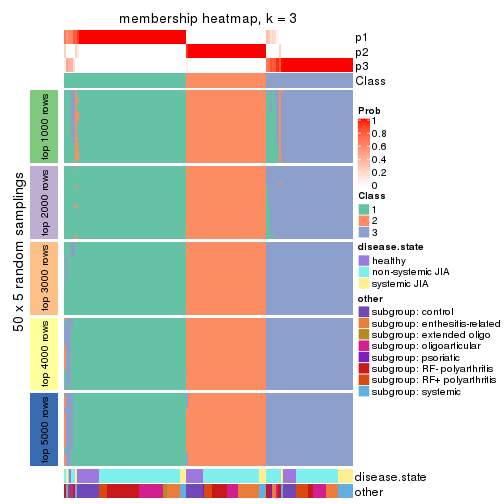</p>

</div>
<div id='tab-ATC-skmeans-membership-heatmap-3'>
<pre><code class="r">membership_heatmap(res, k = 4)
</code></pre>

<p></p>

</div>
<div id='tab-ATC-skmeans-membership-heatmap-4'>
<pre><code class="r">membership_heatmap(res, k = 5)
</code></pre>

<p></p>

</div>
<div id='tab-ATC-skmeans-membership-heatmap-5'>
<pre><code class="r">membership_heatmap(res, k = 6)
</code></pre>

<p>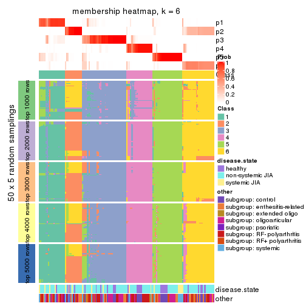</p>

</div>
</div>

As soon as we have had the classes for columns, we can look for signatures
which are significantly different between classes which can be candidate marks
for certain classes. Following are the heatmaps for signatures.


Signature heatmaps where rows are scaled:


<script>
$( function() {
	$( '#tabs-ATC-skmeans-get-signatures' ).tabs();
} );
</script>
<div id='tabs-ATC-skmeans-get-signatures'>
<ul>
<li><a href='#tab-ATC-skmeans-get-signatures-1'>k = 2</a></li>
<li><a href='#tab-ATC-skmeans-get-signatures-2'>k = 3</a></li>
<li><a href='#tab-ATC-skmeans-get-signatures-3'>k = 4</a></li>
<li><a href='#tab-ATC-skmeans-get-signatures-4'>k = 5</a></li>
<li><a href='#tab-ATC-skmeans-get-signatures-5'>k = 6</a></li>
</ul>
<div id='tab-ATC-skmeans-get-signatures-1'>
<pre><code class="r">get_signatures(res, k = 2)
</code></pre>

<p>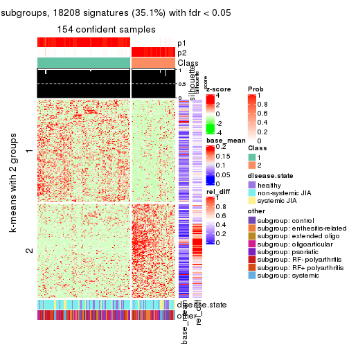</p>

</div>
<div id='tab-ATC-skmeans-get-signatures-2'>
<pre><code class="r">get_signatures(res, k = 3)
</code></pre>

<p></p>

</div>
<div id='tab-ATC-skmeans-get-signatures-3'>
<pre><code class="r">get_signatures(res, k = 4)
</code></pre>

<p></p>

</div>
<div id='tab-ATC-skmeans-get-signatures-4'>
<pre><code class="r">get_signatures(res, k = 5)
</code></pre>

<p></p>

</div>
<div id='tab-ATC-skmeans-get-signatures-5'>
<pre><code class="r">get_signatures(res, k = 6)
</code></pre>

<p></p>

</div>
</div>


Signature heatmaps where rows are not scaled:


<script>
$( function() {
	$( '#tabs-ATC-skmeans-get-signatures-no-scale' ).tabs();
} );
</script>
<div id='tabs-ATC-skmeans-get-signatures-no-scale'>
<ul>
<li><a href='#tab-ATC-skmeans-get-signatures-no-scale-1'>k = 2</a></li>
<li><a href='#tab-ATC-skmeans-get-signatures-no-scale-2'>k = 3</a></li>
<li><a href='#tab-ATC-skmeans-get-signatures-no-scale-3'>k = 4</a></li>
<li><a href='#tab-ATC-skmeans-get-signatures-no-scale-4'>k = 5</a></li>
<li><a href='#tab-ATC-skmeans-get-signatures-no-scale-5'>k = 6</a></li>
</ul>
<div id='tab-ATC-skmeans-get-signatures-no-scale-1'>
<pre><code class="r">get_signatures(res, k = 2, scale_rows = FALSE)
</code></pre>

<p></p>

</div>
<div id='tab-ATC-skmeans-get-signatures-no-scale-2'>
<pre><code class="r">get_signatures(res, k = 3, scale_rows = FALSE)
</code></pre>

<p></p>

</div>
<div id='tab-ATC-skmeans-get-signatures-no-scale-3'>
<pre><code class="r">get_signatures(res, k = 4, scale_rows = FALSE)
</code></pre>

<p></p>

</div>
<div id='tab-ATC-skmeans-get-signatures-no-scale-4'>
<pre><code class="r">get_signatures(res, k = 5, scale_rows = FALSE)
</code></pre>

<p></p>

</div>
<div id='tab-ATC-skmeans-get-signatures-no-scale-5'>
<pre><code class="r">get_signatures(res, k = 6, scale_rows = FALSE)
</code></pre>

<p></p>

</div>
</div>


Compare the overlap of signatures from different k:

```r
compare_signatures(res)
```


`get_signature()` returns a data frame invisibly. TO get the list of signatures, the function
call should be assigned to a variable explicitly. In following code, if `plot` argument is set
to `FALSE`, no heatmap is plotted while only the differential analysis is performed.

```r
# code only for demonstration
tb = get_signature(res, k = ..., plot = FALSE)
```

An example of the output of `tb` is:

```
#>   which_row         fdr    mean_1    mean_2 scaled_mean_1 scaled_mean_2 km
#> 1        38 0.042760348  8.373488  9.131774    -0.5533452     0.5164555  1
#> 2        40 0.018707592  7.106213  8.469186    -0.6173731     0.5762149  1
#> 3        55 0.019134737 10.221463 11.207825    -0.6159697     0.5749050  1
#> 4        59 0.006059896  5.921854  7.869574    -0.6899429     0.6439467  1
#> 5        60 0.018055526  8.928898 10.211722    -0.6204761     0.5791110  1
#> 6        98 0.009384629 15.714769 14.887706     0.6635654    -0.6193277  2
...
```

The columns in `tb` are:

1. `which_row`: row indices corresponding to the input matrix.
2. `fdr`: FDR for the differential test. 
3. `mean_x`: The mean value in group x.
4. `scaled_mean_x`: The mean value in group x after rows are scaled.
5. `km`: Row groups if k-means clustering is applied to rows.


UMAP plot which shows how samples are separated.


<script>
$( function() {
	$( '#tabs-ATC-skmeans-dimension-reduction' ).tabs();
} );
</script>
<div id='tabs-ATC-skmeans-dimension-reduction'>
<ul>
<li><a href='#tab-ATC-skmeans-dimension-reduction-1'>k = 2</a></li>
<li><a href='#tab-ATC-skmeans-dimension-reduction-2'>k = 3</a></li>
<li><a href='#tab-ATC-skmeans-dimension-reduction-3'>k = 4</a></li>
<li><a href='#tab-ATC-skmeans-dimension-reduction-4'>k = 5</a></li>
<li><a href='#tab-ATC-skmeans-dimension-reduction-5'>k = 6</a></li>
</ul>
<div id='tab-ATC-skmeans-dimension-reduction-1'>
<pre><code class="r">dimension_reduction(res, k = 2, method = &quot;UMAP&quot;)
</code></pre>

<p></p>

</div>
<div id='tab-ATC-skmeans-dimension-reduction-2'>
<pre><code class="r">dimension_reduction(res, k = 3, method = &quot;UMAP&quot;)
</code></pre>

<p></p>

</div>
<div id='tab-ATC-skmeans-dimension-reduction-3'>
<pre><code class="r">dimension_reduction(res, k = 4, method = &quot;UMAP&quot;)
</code></pre>

<p></p>

</div>
<div id='tab-ATC-skmeans-dimension-reduction-4'>
<pre><code class="r">dimension_reduction(res, k = 5, method = &quot;UMAP&quot;)
</code></pre>

<p></p>

</div>
<div id='tab-ATC-skmeans-dimension-reduction-5'>
<pre><code class="r">dimension_reduction(res, k = 6, method = &quot;UMAP&quot;)
</code></pre>

<p></p>

</div>
</div>


Following heatmap shows how subgroups are split when increasing `k`:

```r
collect_classes(res)
```


Test correlation between subgroups and known annotations. If the known
annotation is numeric, one-way ANOVA test is applied, and if the known
annotation is discrete, chi-squared contingency table test is applied.

```r
test_to_known_factors(res)
```

```
#>               n disease.state(p) other(p) k
#> ATC:skmeans 154            0.708   0.5125 2
#> ATC:skmeans 149            0.283   0.2092 3
#> ATC:skmeans 141            0.137   0.0384 4
#> ATC:skmeans 142            0.387   0.1403 5
#> ATC:skmeans 140            0.263   0.2418 6
```


If matrix rows can be associated to genes, consider to use `GO_Enrichment(res,
...)` to perform function enrichment for the signature genes.


 

---------------------------------------------------


### ATC:pam


The object with results only for a single top-value method and a single partition method 
can be extracted as:

```r
res = res_list["ATC", "pam"]
# you can also extract it by
# res = res_list["ATC:pam"]
```

A summary of `res` and all the functions that can be applied to it:

```r
res
```

```
#> A 'ConsensusPartition' object with k = 2, 3, 4, 5, 6.
#>   On a matrix with 51941 rows and 154 columns.
#>   Top rows (1000, 2000, 3000, 4000, 5000) are extracted by 'ATC' method.
#>   Subgroups are detected by 'pam' method.
#>   Performed in total 1250 partitions by row resampling.
#>   Best k for subgroups seems to be 3.
#> 
#> Following methods can be applied to this 'ConsensusPartition' object:
#>  [1] "cola_report"             "collect_classes"         "collect_plots"          
#>  [4] "collect_stats"           "colnames"                "compare_signatures"     
#>  [7] "consensus_heatmap"       "dimension_reduction"     "functional_enrichment"  
#> [10] "get_anno_col"            "get_anno"                "get_classes"            
#> [13] "get_consensus"           "get_matrix"              "get_membership"         
#> [16] "get_param"               "get_signatures"          "get_stats"              
#> [19] "is_best_k"               "is_stable_k"             "membership_heatmap"     
#> [22] "ncol"                    "nrow"                    "plot_ecdf"              
#> [25] "rownames"                "select_partition_number" "show"                   
#> [28] "suggest_best_k"          "test_to_known_factors"
```

`collect_plots()` function collects all the plots made from `res` for all `k` (number of partitions)
into one single page to provide an easy and fast comparison between different `k`.

```r
collect_plots(res)
```


The plots are:

- The first row: a plot of the ECDF (Empirical cumulative distribution
  function) curves of the consensus matrix for each `k` and the heatmap of
  predicted classes for each `k`.
- The second row: heatmaps of the consensus matrix for each `k`.
- The third row: heatmaps of the membership matrix for each `k`.
- The fouth row: heatmaps of the signatures for each `k`.

All the plots in panels can be made by individual functions and they are
plotted later in this section.

`select_partition_number()` produces several plots showing different
statistics for choosing "optimized" `k`. There are following statistics:

- ECDF curves of the consensus matrix for each `k`;
- 1-PAC. [The PAC
  score](https://en.wikipedia.org/wiki/Consensus_clustering#Over-interpretation_potential_of_consensus_clustering)
  measures the proportion of the ambiguous subgrouping.
- Mean silhouette score.
- Concordance. The mean probability of fiting the consensus class ids in all
  partitions.
- Area increased. Denote $A_k$ as the area under the ECDF curve for current
  `k`, the area increased is defined as $A_k - A_{k-1}$.
- Rand index. The percent of pairs of samples that are both in a same cluster
  or both are not in a same cluster in the partition of k and k-1.
- Jaccard index. The ratio of pairs of samples are both in a same cluster in
  the partition of k and k-1 and the pairs of samples are both in a same
  cluster in the partition k or k-1.

The detailed explanations of these statistics can be found in [the cola
vignette](http://bioconductor.org/packages/devel/bioc/vignettes/cola/inst/doc/cola.html#toc_13).

Generally speaking, lower PAC score, higher mean silhouette score or higher
concordance corresponds to better partition. Rand index and Jaccard index
measure how similar the current partition is compared to partition with `k-1`.
If they are too similar, we won't accept `k` is better than `k-1`.

```r
select_partition_number(res)
```


The numeric values for all these statistics can be obtained by `get_stats()`.

```r
get_stats(res)
```

```
#>   k 1-PAC mean_silhouette concordance area_increased  Rand Jaccard
#> 2 2 0.548           0.929       0.948         0.3650 0.646   0.646
#> 3 3 0.863           0.864       0.946         0.6719 0.733   0.594
#> 4 4 0.728           0.807       0.883         0.1403 0.882   0.709
#> 5 5 0.786           0.861       0.912         0.0692 0.914   0.727
#> 6 6 0.847           0.824       0.885         0.0541 0.958   0.838
```

`suggest_best_k()` suggests the best $k$ based on these statistics. The rules are as follows:

- All $k$ with Jaccard index larger than 0.95 are removed because the increase of
  the partition number does not provides enough extra information. If all $k$ are removed,
  the best $k$ is assigned by `NA`.
- For $k$ with 1-PAC larger than 0.9, the maximal $k$ is taken as the "best k". Other $k$ is called "optional k".
- If it does not fit the second rule. The $k$ with the highest vote of highest
  1-PAC, mean silhouette and concordance is taken as the "best k".

```r
suggest_best_k(res)
```

```
#> [1] 3
```


Following shows the table of the partitions (You need to click the **show/hide
code output** link to see it). The membership matrix (columns with name `p*`)
is inferred by
[`clue::cl_consensus()`](https://www.rdocumentation.org/link/cl_consensus?package=clue)
function with the `SE` method. Basically the value in the membership matrix
represents the probability to belong to a certain group. The finall class
label for an item is determined with the group with highest probability it
belongs to.

In `get_classes()` function, the entropy is calculated from the membership
matrix and the silhouette score is calculated from the consensus matrix.


<script>
$( function() {
	$( '#tabs-ATC-pam-get-classes' ).tabs();
} );
</script>
<div id='tabs-ATC-pam-get-classes'>
<ul>
<li><a href='#tab-ATC-pam-get-classes-1'>k = 2</a></li>
<li><a href='#tab-ATC-pam-get-classes-2'>k = 3</a></li>
<li><a href='#tab-ATC-pam-get-classes-3'>k = 4</a></li>
<li><a href='#tab-ATC-pam-get-classes-4'>k = 5</a></li>
<li><a href='#tab-ATC-pam-get-classes-5'>k = 6</a></li>
</ul>

<div id='tab-ATC-pam-get-classes-1'>
<p><a id='tab-ATC-pam-get-classes-1-a' style='color:#0366d6' href='#'>show/hide code output</a></p>
<pre><code class="r">cbind(get_classes(res, k = 2), get_membership(res, k = 2))
</code></pre>

<pre><code>#&gt;           class entropy silhouette    p1    p2
#&gt; GSM340358     1  0.0000      0.954 1.000 0.000
#&gt; GSM340359     2  0.0000      0.895 0.000 1.000
#&gt; GSM340361     1  0.5629      0.882 0.868 0.132
#&gt; GSM340362     1  0.5629      0.882 0.868 0.132
#&gt; GSM340363     1  0.0000      0.954 1.000 0.000
#&gt; GSM340364     2  0.2423      0.881 0.040 0.960
#&gt; GSM340365     1  0.5629      0.882 0.868 0.132
#&gt; GSM340366     1  0.5629      0.882 0.868 0.132
#&gt; GSM340367     1  0.0000      0.954 1.000 0.000
#&gt; GSM340368     1  0.0000      0.954 1.000 0.000
#&gt; GSM340369     1  0.0000      0.954 1.000 0.000
#&gt; GSM340370     1  0.0000      0.954 1.000 0.000
#&gt; GSM340371     1  0.0376      0.952 0.996 0.004
#&gt; GSM340372     1  0.5629      0.882 0.868 0.132
#&gt; GSM340373     1  0.5629      0.882 0.868 0.132
#&gt; GSM340375     1  0.0000      0.954 1.000 0.000
#&gt; GSM340376     1  0.0000      0.954 1.000 0.000
#&gt; GSM340378     2  0.5629      0.950 0.132 0.868
#&gt; GSM340243     1  0.0000      0.954 1.000 0.000
#&gt; GSM340244     2  0.5629      0.950 0.132 0.868
#&gt; GSM340246     2  0.5629      0.950 0.132 0.868
#&gt; GSM340247     1  0.0000      0.954 1.000 0.000
#&gt; GSM340248     2  0.5629      0.950 0.132 0.868
#&gt; GSM340249     2  0.5629      0.950 0.132 0.868
#&gt; GSM340250     1  0.0000      0.954 1.000 0.000
#&gt; GSM340251     2  0.5629      0.950 0.132 0.868
#&gt; GSM340252     2  0.0000      0.895 0.000 1.000
#&gt; GSM340253     2  0.0000      0.895 0.000 1.000
#&gt; GSM340254     2  0.0000      0.895 0.000 1.000
#&gt; GSM340256     2  0.0000      0.895 0.000 1.000
#&gt; GSM340258     1  0.0000      0.954 1.000 0.000
#&gt; GSM340259     1  0.3274      0.923 0.940 0.060
#&gt; GSM340260     1  0.0000      0.954 1.000 0.000
#&gt; GSM340261     1  0.0000      0.954 1.000 0.000
#&gt; GSM340262     1  0.5629      0.882 0.868 0.132
#&gt; GSM340263     2  0.5629      0.950 0.132 0.868
#&gt; GSM340264     1  0.5629      0.882 0.868 0.132
#&gt; GSM340265     1  0.5629      0.882 0.868 0.132
#&gt; GSM340266     1  0.0000      0.954 1.000 0.000
#&gt; GSM340267     1  0.0000      0.954 1.000 0.000
#&gt; GSM340268     1  0.0000      0.954 1.000 0.000
#&gt; GSM340269     1  0.0000      0.954 1.000 0.000
#&gt; GSM340270     1  0.0000      0.954 1.000 0.000
#&gt; GSM537574     1  0.0000      0.954 1.000 0.000
#&gt; GSM537580     1  0.0000      0.954 1.000 0.000
#&gt; GSM537581     1  0.0000      0.954 1.000 0.000
#&gt; GSM340272     1  0.5629      0.882 0.868 0.132
#&gt; GSM340273     2  0.5629      0.950 0.132 0.868
#&gt; GSM340275     2  0.5629      0.950 0.132 0.868
#&gt; GSM340276     1  0.0000      0.954 1.000 0.000
#&gt; GSM340277     2  0.0000      0.895 0.000 1.000
#&gt; GSM340278     1  0.0000      0.954 1.000 0.000
#&gt; GSM340279     1  0.0000      0.954 1.000 0.000
#&gt; GSM340282     1  0.5629      0.882 0.868 0.132
#&gt; GSM340284     1  0.8443      0.564 0.728 0.272
#&gt; GSM340285     1  0.0000      0.954 1.000 0.000
#&gt; GSM340286     1  0.5629      0.882 0.868 0.132
#&gt; GSM340287     1  0.0000      0.954 1.000 0.000
#&gt; GSM340288     1  0.0376      0.952 0.996 0.004
#&gt; GSM340289     1  0.0000      0.954 1.000 0.000
#&gt; GSM340290     1  0.0000      0.954 1.000 0.000
#&gt; GSM340291     2  0.5629      0.950 0.132 0.868
#&gt; GSM340293     1  0.0000      0.954 1.000 0.000
#&gt; GSM340294     1  0.0000      0.954 1.000 0.000
#&gt; GSM340296     1  0.0000      0.954 1.000 0.000
#&gt; GSM340297     1  0.0000      0.954 1.000 0.000
#&gt; GSM340298     1  0.0000      0.954 1.000 0.000
#&gt; GSM340299     1  0.5629      0.882 0.868 0.132
#&gt; GSM340301     1  0.5629      0.882 0.868 0.132
#&gt; GSM340303     1  0.5629      0.882 0.868 0.132
#&gt; GSM340304     1  0.0000      0.954 1.000 0.000
#&gt; GSM340306     1  0.0000      0.954 1.000 0.000
#&gt; GSM340307     2  0.5629      0.950 0.132 0.868
#&gt; GSM340310     1  0.0000      0.954 1.000 0.000
#&gt; GSM340314     1  0.0000      0.954 1.000 0.000
#&gt; GSM340315     1  0.0000      0.954 1.000 0.000
#&gt; GSM340317     2  0.5629      0.950 0.132 0.868
#&gt; GSM340318     1  0.0000      0.954 1.000 0.000
#&gt; GSM340319     1  0.0000      0.954 1.000 0.000
#&gt; GSM340320     1  0.0000      0.954 1.000 0.000
#&gt; GSM340321     2  0.5629      0.950 0.132 0.868
#&gt; GSM340322     1  0.0000      0.954 1.000 0.000
#&gt; GSM340324     2  0.0376      0.896 0.004 0.996
#&gt; GSM340328     1  0.0000      0.954 1.000 0.000
#&gt; GSM340330     1  0.0000      0.954 1.000 0.000
#&gt; GSM340332     1  0.0000      0.954 1.000 0.000
#&gt; GSM340333     2  0.0000      0.895 0.000 1.000
#&gt; GSM340336     2  0.5629      0.950 0.132 0.868
#&gt; GSM340337     1  0.0000      0.954 1.000 0.000
#&gt; GSM340338     1  0.0000      0.954 1.000 0.000
#&gt; GSM340339     1  0.0000      0.954 1.000 0.000
#&gt; GSM340340     1  0.6343      0.774 0.840 0.160
#&gt; GSM340341     1  0.0000      0.954 1.000 0.000
#&gt; GSM340343     1  0.0000      0.954 1.000 0.000
#&gt; GSM340344     1  0.7528      0.804 0.784 0.216
#&gt; GSM340346     1  0.0000      0.954 1.000 0.000
#&gt; GSM340347     1  0.0000      0.954 1.000 0.000
#&gt; GSM340348     1  0.0000      0.954 1.000 0.000
#&gt; GSM340349     1  0.0000      0.954 1.000 0.000
#&gt; GSM340350     1  0.0000      0.954 1.000 0.000
#&gt; GSM340351     1  0.5629      0.882 0.868 0.132
#&gt; GSM340354     1  0.0000      0.954 1.000 0.000
#&gt; GSM340356     2  0.5629      0.950 0.132 0.868
#&gt; GSM340357     1  0.0000      0.954 1.000 0.000
#&gt; GSM348183     1  0.5629      0.882 0.868 0.132
#&gt; GSM348191     1  0.0000      0.954 1.000 0.000
#&gt; GSM348193     1  0.0000      0.954 1.000 0.000
#&gt; GSM537578     1  0.0000      0.954 1.000 0.000
#&gt; GSM348181     1  0.0000      0.954 1.000 0.000
#&gt; GSM348182     1  0.5629      0.882 0.868 0.132
#&gt; GSM348184     2  0.5629      0.950 0.132 0.868
#&gt; GSM348185     2  0.5629      0.950 0.132 0.868
#&gt; GSM348186     2  0.0000      0.895 0.000 1.000
#&gt; GSM348187     1  0.0000      0.954 1.000 0.000
#&gt; GSM348188     1  0.5629      0.882 0.868 0.132
#&gt; GSM348189     1  0.0376      0.952 0.996 0.004
#&gt; GSM348190     1  0.5629      0.882 0.868 0.132
#&gt; GSM348194     1  0.3584      0.919 0.932 0.068
#&gt; GSM348195     1  0.5629      0.882 0.868 0.132
#&gt; GSM348196     1  0.0000      0.954 1.000 0.000
#&gt; GSM537585     1  0.5629      0.882 0.868 0.132
#&gt; GSM537594     2  0.5629      0.950 0.132 0.868
#&gt; GSM537596     1  0.0000      0.954 1.000 0.000
#&gt; GSM537597     1  0.0000      0.954 1.000 0.000
#&gt; GSM537602     1  0.0000      0.954 1.000 0.000
#&gt; GSM340184     1  0.0000      0.954 1.000 0.000
#&gt; GSM340185     2  0.5629      0.950 0.132 0.868
#&gt; GSM340186     2  0.5629      0.950 0.132 0.868
#&gt; GSM340187     1  0.0000      0.954 1.000 0.000
#&gt; GSM340189     1  0.0000      0.954 1.000 0.000
#&gt; GSM340190     2  0.5629      0.950 0.132 0.868
#&gt; GSM340191     1  0.0000      0.954 1.000 0.000
#&gt; GSM340192     1  0.8081      0.762 0.752 0.248
#&gt; GSM340193     1  0.0000      0.954 1.000 0.000
#&gt; GSM340194     1  0.5629      0.882 0.868 0.132
#&gt; GSM340195     1  0.5629      0.882 0.868 0.132
#&gt; GSM340196     1  0.0000      0.954 1.000 0.000
#&gt; GSM340197     1  0.5629      0.882 0.868 0.132
#&gt; GSM340198     2  0.0000      0.895 0.000 1.000
#&gt; GSM340199     1  0.0000      0.954 1.000 0.000
#&gt; GSM340200     2  0.5629      0.950 0.132 0.868
#&gt; GSM340201     1  0.0000      0.954 1.000 0.000
#&gt; GSM340202     1  0.0000      0.954 1.000 0.000
#&gt; GSM340203     1  0.0000      0.954 1.000 0.000
#&gt; GSM340204     1  0.5629      0.882 0.868 0.132
#&gt; GSM340205     1  0.0000      0.954 1.000 0.000
#&gt; GSM340206     1  0.0000      0.954 1.000 0.000
#&gt; GSM340207     1  0.5629      0.882 0.868 0.132
#&gt; GSM340237     2  0.5629      0.950 0.132 0.868
#&gt; GSM340238     1  0.0000      0.954 1.000 0.000
#&gt; GSM340239     1  0.5629      0.882 0.868 0.132
#&gt; GSM340240     1  0.5629      0.882 0.868 0.132
#&gt; GSM340241     2  0.5629      0.950 0.132 0.868
#&gt; GSM340242     1  0.0000      0.954 1.000 0.000
</code></pre>

<script>
$('#tab-ATC-pam-get-classes-1-a').parent().next().next().hide();
$('#tab-ATC-pam-get-classes-1-a').click(function(){
  $('#tab-ATC-pam-get-classes-1-a').parent().next().next().toggle();
  return(false);
});
</script>
</div>

<div id='tab-ATC-pam-get-classes-2'>
<p><a id='tab-ATC-pam-get-classes-2-a' style='color:#0366d6' href='#'>show/hide code output</a></p>
<pre><code class="r">cbind(get_classes(res, k = 3), get_membership(res, k = 3))
</code></pre>

<pre><code>#&gt;           class entropy silhouette    p1    p2    p3
#&gt; GSM340358     1  0.0237   0.930537 0.996 0.000 0.004
#&gt; GSM340359     3  0.6308   0.000767 0.000 0.492 0.508
#&gt; GSM340361     3  0.0000   0.912821 0.000 0.000 1.000
#&gt; GSM340362     3  0.0000   0.912821 0.000 0.000 1.000
#&gt; GSM340363     1  0.0237   0.930537 0.996 0.000 0.004
#&gt; GSM340364     3  0.0237   0.909518 0.000 0.004 0.996
#&gt; GSM340365     3  0.0000   0.912821 0.000 0.000 1.000
#&gt; GSM340366     3  0.0000   0.912821 0.000 0.000 1.000
#&gt; GSM340367     1  0.6168   0.389041 0.588 0.000 0.412
#&gt; GSM340368     1  0.0000   0.929197 1.000 0.000 0.000
#&gt; GSM340369     1  0.0000   0.929197 1.000 0.000 0.000
#&gt; GSM340370     1  0.6140   0.407881 0.596 0.000 0.404
#&gt; GSM340371     1  0.1289   0.910169 0.968 0.000 0.032
#&gt; GSM340372     3  0.0000   0.912821 0.000 0.000 1.000
#&gt; GSM340373     3  0.0000   0.912821 0.000 0.000 1.000
#&gt; GSM340375     1  0.6286   0.247790 0.536 0.000 0.464
#&gt; GSM340376     1  0.5098   0.684454 0.752 0.000 0.248
#&gt; GSM340378     2  0.0000   0.995703 0.000 1.000 0.000
#&gt; GSM340243     1  0.0237   0.930537 0.996 0.000 0.004
#&gt; GSM340244     2  0.0000   0.995703 0.000 1.000 0.000
#&gt; GSM340246     2  0.0000   0.995703 0.000 1.000 0.000
#&gt; GSM340247     1  0.0000   0.929197 1.000 0.000 0.000
#&gt; GSM340248     2  0.0000   0.995703 0.000 1.000 0.000
#&gt; GSM340249     2  0.0000   0.995703 0.000 1.000 0.000
#&gt; GSM340250     1  0.2261   0.882546 0.932 0.000 0.068
#&gt; GSM340251     2  0.0000   0.995703 0.000 1.000 0.000
#&gt; GSM340252     2  0.0000   0.995703 0.000 1.000 0.000
#&gt; GSM340253     3  0.6252   0.153921 0.000 0.444 0.556
#&gt; GSM340254     2  0.0000   0.995703 0.000 1.000 0.000
#&gt; GSM340256     2  0.0000   0.995703 0.000 1.000 0.000
#&gt; GSM340258     3  0.6215   0.113068 0.428 0.000 0.572
#&gt; GSM340259     3  0.5138   0.585011 0.252 0.000 0.748
#&gt; GSM340260     1  0.3038   0.849937 0.896 0.000 0.104
#&gt; GSM340261     1  0.0237   0.930537 0.996 0.000 0.004
#&gt; GSM340262     3  0.0000   0.912821 0.000 0.000 1.000
#&gt; GSM340263     2  0.0000   0.995703 0.000 1.000 0.000
#&gt; GSM340264     3  0.0000   0.912821 0.000 0.000 1.000
#&gt; GSM340265     3  0.0000   0.912821 0.000 0.000 1.000
#&gt; GSM340266     1  0.0237   0.930537 0.996 0.000 0.004
#&gt; GSM340267     1  0.5948   0.500768 0.640 0.000 0.360
#&gt; GSM340268     1  0.0237   0.930537 0.996 0.000 0.004
#&gt; GSM340269     1  0.0237   0.930537 0.996 0.000 0.004
#&gt; GSM340270     1  0.0237   0.930537 0.996 0.000 0.004
#&gt; GSM537574     1  0.0237   0.930537 0.996 0.000 0.004
#&gt; GSM537580     1  0.0237   0.930537 0.996 0.000 0.004
#&gt; GSM537581     1  0.0000   0.929197 1.000 0.000 0.000
#&gt; GSM340272     3  0.0000   0.912821 0.000 0.000 1.000
#&gt; GSM340273     2  0.0000   0.995703 0.000 1.000 0.000
#&gt; GSM340275     2  0.0237   0.992374 0.004 0.996 0.000
#&gt; GSM340276     1  0.0237   0.930537 0.996 0.000 0.004
#&gt; GSM340277     2  0.0000   0.995703 0.000 1.000 0.000
#&gt; GSM340278     1  0.0237   0.930537 0.996 0.000 0.004
#&gt; GSM340279     1  0.0237   0.930537 0.996 0.000 0.004
#&gt; GSM340282     3  0.0000   0.912821 0.000 0.000 1.000
#&gt; GSM340284     1  0.2066   0.885160 0.940 0.060 0.000
#&gt; GSM340285     1  0.0237   0.930537 0.996 0.000 0.004
#&gt; GSM340286     3  0.0000   0.912821 0.000 0.000 1.000
#&gt; GSM340287     1  0.0237   0.930537 0.996 0.000 0.004
#&gt; GSM340288     1  0.6267   0.283316 0.548 0.000 0.452
#&gt; GSM340289     1  0.6140   0.407881 0.596 0.000 0.404
#&gt; GSM340290     1  0.0237   0.930537 0.996 0.000 0.004
#&gt; GSM340291     2  0.0000   0.995703 0.000 1.000 0.000
#&gt; GSM340293     1  0.0000   0.929197 1.000 0.000 0.000
#&gt; GSM340294     1  0.0237   0.930537 0.996 0.000 0.004
#&gt; GSM340296     1  0.0237   0.930537 0.996 0.000 0.004
#&gt; GSM340297     1  0.0237   0.930537 0.996 0.000 0.004
#&gt; GSM340298     1  0.0237   0.930537 0.996 0.000 0.004
#&gt; GSM340299     3  0.0000   0.912821 0.000 0.000 1.000
#&gt; GSM340301     3  0.0000   0.912821 0.000 0.000 1.000
#&gt; GSM340303     3  0.0000   0.912821 0.000 0.000 1.000
#&gt; GSM340304     1  0.0237   0.930537 0.996 0.000 0.004
#&gt; GSM340306     1  0.0237   0.930537 0.996 0.000 0.004
#&gt; GSM340307     2  0.0000   0.995703 0.000 1.000 0.000
#&gt; GSM340310     1  0.5968   0.492387 0.636 0.000 0.364
#&gt; GSM340314     1  0.0237   0.930537 0.996 0.000 0.004
#&gt; GSM340315     1  0.0237   0.930537 0.996 0.000 0.004
#&gt; GSM340317     2  0.0000   0.995703 0.000 1.000 0.000
#&gt; GSM340318     1  0.0000   0.929197 1.000 0.000 0.000
#&gt; GSM340319     1  0.0000   0.929197 1.000 0.000 0.000
#&gt; GSM340320     1  0.0000   0.929197 1.000 0.000 0.000
#&gt; GSM340321     2  0.0000   0.995703 0.000 1.000 0.000
#&gt; GSM340322     1  0.0000   0.929197 1.000 0.000 0.000
#&gt; GSM340324     2  0.0000   0.995703 0.000 1.000 0.000
#&gt; GSM340328     1  0.0237   0.930537 0.996 0.000 0.004
#&gt; GSM340330     1  0.0237   0.930537 0.996 0.000 0.004
#&gt; GSM340332     1  0.0000   0.929197 1.000 0.000 0.000
#&gt; GSM340333     3  0.6309  -0.013312 0.000 0.496 0.504
#&gt; GSM340336     2  0.1964   0.930055 0.056 0.944 0.000
#&gt; GSM340337     1  0.0000   0.929197 1.000 0.000 0.000
#&gt; GSM340338     1  0.0237   0.930537 0.996 0.000 0.004
#&gt; GSM340339     1  0.0000   0.929197 1.000 0.000 0.000
#&gt; GSM340340     1  0.1289   0.906683 0.968 0.032 0.000
#&gt; GSM340341     1  0.0237   0.930537 0.996 0.000 0.004
#&gt; GSM340343     1  0.0000   0.929197 1.000 0.000 0.000
#&gt; GSM340344     3  0.0000   0.912821 0.000 0.000 1.000
#&gt; GSM340346     1  0.0237   0.930537 0.996 0.000 0.004
#&gt; GSM340347     1  0.0000   0.929197 1.000 0.000 0.000
#&gt; GSM340348     1  0.0237   0.930537 0.996 0.000 0.004
#&gt; GSM340349     1  0.2261   0.882648 0.932 0.000 0.068
#&gt; GSM340350     1  0.4346   0.765993 0.816 0.000 0.184
#&gt; GSM340351     3  0.0000   0.912821 0.000 0.000 1.000
#&gt; GSM340354     1  0.0237   0.930537 0.996 0.000 0.004
#&gt; GSM340356     2  0.0000   0.995703 0.000 1.000 0.000
#&gt; GSM340357     1  0.6204   0.359367 0.576 0.000 0.424
#&gt; GSM348183     3  0.0000   0.912821 0.000 0.000 1.000
#&gt; GSM348191     1  0.0237   0.930537 0.996 0.000 0.004
#&gt; GSM348193     1  0.6079   0.443011 0.612 0.000 0.388
#&gt; GSM537578     1  0.5363   0.643580 0.724 0.000 0.276
#&gt; GSM348181     1  0.0237   0.930537 0.996 0.000 0.004
#&gt; GSM348182     3  0.0000   0.912821 0.000 0.000 1.000
#&gt; GSM348184     2  0.0000   0.995703 0.000 1.000 0.000
#&gt; GSM348185     2  0.0000   0.995703 0.000 1.000 0.000
#&gt; GSM348186     2  0.0000   0.995703 0.000 1.000 0.000
#&gt; GSM348187     1  0.0237   0.930537 0.996 0.000 0.004
#&gt; GSM348188     3  0.0000   0.912821 0.000 0.000 1.000
#&gt; GSM348189     1  0.0424   0.928311 0.992 0.000 0.008
#&gt; GSM348190     3  0.0000   0.912821 0.000 0.000 1.000
#&gt; GSM348194     3  0.6295  -0.053665 0.472 0.000 0.528
#&gt; GSM348195     3  0.0000   0.912821 0.000 0.000 1.000
#&gt; GSM348196     1  0.0237   0.930537 0.996 0.000 0.004
#&gt; GSM537585     3  0.0000   0.912821 0.000 0.000 1.000
#&gt; GSM537594     2  0.0000   0.995703 0.000 1.000 0.000
#&gt; GSM537596     1  0.0237   0.930537 0.996 0.000 0.004
#&gt; GSM537597     1  0.0237   0.930537 0.996 0.000 0.004
#&gt; GSM537602     1  0.4796   0.721682 0.780 0.000 0.220
#&gt; GSM340184     1  0.0237   0.930537 0.996 0.000 0.004
#&gt; GSM340185     2  0.0000   0.995703 0.000 1.000 0.000
#&gt; GSM340186     2  0.0000   0.995703 0.000 1.000 0.000
#&gt; GSM340187     1  0.0000   0.929197 1.000 0.000 0.000
#&gt; GSM340189     1  0.0000   0.929197 1.000 0.000 0.000
#&gt; GSM340190     2  0.1643   0.945558 0.044 0.956 0.000
#&gt; GSM340191     1  0.0237   0.930537 0.996 0.000 0.004
#&gt; GSM340192     3  0.3038   0.810045 0.000 0.104 0.896
#&gt; GSM340193     1  0.6192   0.369449 0.580 0.000 0.420
#&gt; GSM340194     3  0.0000   0.912821 0.000 0.000 1.000
#&gt; GSM340195     3  0.0000   0.912821 0.000 0.000 1.000
#&gt; GSM340196     1  0.0000   0.929197 1.000 0.000 0.000
#&gt; GSM340197     3  0.0000   0.912821 0.000 0.000 1.000
#&gt; GSM340198     2  0.0000   0.995703 0.000 1.000 0.000
#&gt; GSM340199     1  0.0237   0.930537 0.996 0.000 0.004
#&gt; GSM340200     2  0.0000   0.995703 0.000 1.000 0.000
#&gt; GSM340201     1  0.0000   0.929197 1.000 0.000 0.000
#&gt; GSM340202     1  0.0000   0.929197 1.000 0.000 0.000
#&gt; GSM340203     1  0.0000   0.929197 1.000 0.000 0.000
#&gt; GSM340204     3  0.0000   0.912821 0.000 0.000 1.000
#&gt; GSM340205     1  0.0237   0.930537 0.996 0.000 0.004
#&gt; GSM340206     1  0.0237   0.930537 0.996 0.000 0.004
#&gt; GSM340207     3  0.0000   0.912821 0.000 0.000 1.000
#&gt; GSM340237     2  0.0000   0.995703 0.000 1.000 0.000
#&gt; GSM340238     1  0.0000   0.929197 1.000 0.000 0.000
#&gt; GSM340239     3  0.0000   0.912821 0.000 0.000 1.000
#&gt; GSM340240     3  0.0000   0.912821 0.000 0.000 1.000
#&gt; GSM340241     2  0.0000   0.995703 0.000 1.000 0.000
#&gt; GSM340242     1  0.0237   0.930537 0.996 0.000 0.004
</code></pre>

<script>
$('#tab-ATC-pam-get-classes-2-a').parent().next().next().hide();
$('#tab-ATC-pam-get-classes-2-a').click(function(){
  $('#tab-ATC-pam-get-classes-2-a').parent().next().next().toggle();
  return(false);
});
</script>
</div>

<div id='tab-ATC-pam-get-classes-3'>
<p><a id='tab-ATC-pam-get-classes-3-a' style='color:#0366d6' href='#'>show/hide code output</a></p>
<pre><code class="r">cbind(get_classes(res, k = 4), get_membership(res, k = 4))
</code></pre>

<pre><code>#&gt;           class entropy silhouette    p1    p2    p3    p4
#&gt; GSM340358     1  0.0000     0.8829 1.000 0.000 0.000 0.000
#&gt; GSM340359     3  0.7013     0.2415 0.000 0.356 0.516 0.128
#&gt; GSM340361     3  0.0000     0.8984 0.000 0.000 1.000 0.000
#&gt; GSM340362     3  0.0000     0.8984 0.000 0.000 1.000 0.000
#&gt; GSM340363     1  0.0000     0.8829 1.000 0.000 0.000 0.000
#&gt; GSM340364     3  0.4164     0.6651 0.000 0.000 0.736 0.264
#&gt; GSM340365     3  0.0000     0.8984 0.000 0.000 1.000 0.000
#&gt; GSM340366     3  0.0000     0.8984 0.000 0.000 1.000 0.000
#&gt; GSM340367     1  0.4817     0.4317 0.612 0.000 0.388 0.000
#&gt; GSM340368     4  0.2760     0.6997 0.128 0.000 0.000 0.872
#&gt; GSM340369     4  0.4543     0.8966 0.324 0.000 0.000 0.676
#&gt; GSM340370     1  0.4817     0.4317 0.612 0.000 0.388 0.000
#&gt; GSM340371     1  0.0921     0.8576 0.972 0.000 0.028 0.000
#&gt; GSM340372     3  0.0000     0.8984 0.000 0.000 1.000 0.000
#&gt; GSM340373     3  0.0000     0.8984 0.000 0.000 1.000 0.000
#&gt; GSM340375     1  0.4972     0.2600 0.544 0.000 0.456 0.000
#&gt; GSM340376     1  0.3219     0.7337 0.836 0.000 0.164 0.000
#&gt; GSM340378     2  0.3751     0.8626 0.004 0.800 0.000 0.196
#&gt; GSM340243     1  0.0000     0.8829 1.000 0.000 0.000 0.000
#&gt; GSM340244     2  0.0188     0.8942 0.000 0.996 0.000 0.004
#&gt; GSM340246     2  0.0000     0.8939 0.000 1.000 0.000 0.000
#&gt; GSM340247     4  0.4543     0.8966 0.324 0.000 0.000 0.676
#&gt; GSM340248     2  0.3569     0.8645 0.000 0.804 0.000 0.196
#&gt; GSM340249     2  0.3610     0.8623 0.000 0.800 0.000 0.200
#&gt; GSM340250     1  0.0469     0.8747 0.988 0.000 0.012 0.000
#&gt; GSM340251     2  0.3610     0.8623 0.000 0.800 0.000 0.200
#&gt; GSM340252     2  0.3356     0.8572 0.000 0.824 0.000 0.176
#&gt; GSM340253     3  0.6845     0.3556 0.000 0.308 0.564 0.128
#&gt; GSM340254     2  0.2760     0.8499 0.000 0.872 0.000 0.128
#&gt; GSM340256     2  0.2760     0.8499 0.000 0.872 0.000 0.128
#&gt; GSM340258     3  0.4941     0.0842 0.436 0.000 0.564 0.000
#&gt; GSM340259     3  0.4103     0.5736 0.256 0.000 0.744 0.000
#&gt; GSM340260     1  0.1302     0.8479 0.956 0.000 0.044 0.000
#&gt; GSM340261     1  0.0000     0.8829 1.000 0.000 0.000 0.000
#&gt; GSM340262     3  0.0000     0.8984 0.000 0.000 1.000 0.000
#&gt; GSM340263     2  0.3751     0.8626 0.004 0.800 0.000 0.196
#&gt; GSM340264     3  0.0000     0.8984 0.000 0.000 1.000 0.000
#&gt; GSM340265     3  0.0000     0.8984 0.000 0.000 1.000 0.000
#&gt; GSM340266     1  0.0000     0.8829 1.000 0.000 0.000 0.000
#&gt; GSM340267     1  0.4250     0.6146 0.724 0.000 0.276 0.000
#&gt; GSM340268     1  0.0000     0.8829 1.000 0.000 0.000 0.000
#&gt; GSM340269     1  0.0000     0.8829 1.000 0.000 0.000 0.000
#&gt; GSM340270     1  0.0000     0.8829 1.000 0.000 0.000 0.000
#&gt; GSM537574     1  0.0000     0.8829 1.000 0.000 0.000 0.000
#&gt; GSM537580     1  0.0000     0.8829 1.000 0.000 0.000 0.000
#&gt; GSM537581     4  0.4543     0.8966 0.324 0.000 0.000 0.676
#&gt; GSM340272     3  0.0000     0.8984 0.000 0.000 1.000 0.000
#&gt; GSM340273     2  0.2216     0.8900 0.000 0.908 0.000 0.092
#&gt; GSM340275     4  0.2760     0.4810 0.000 0.128 0.000 0.872
#&gt; GSM340276     1  0.0000     0.8829 1.000 0.000 0.000 0.000
#&gt; GSM340277     2  0.2760     0.8499 0.000 0.872 0.000 0.128
#&gt; GSM340278     1  0.0000     0.8829 1.000 0.000 0.000 0.000
#&gt; GSM340279     1  0.0000     0.8829 1.000 0.000 0.000 0.000
#&gt; GSM340282     3  0.0000     0.8984 0.000 0.000 1.000 0.000
#&gt; GSM340284     1  0.3610     0.6631 0.800 0.000 0.000 0.200
#&gt; GSM340285     1  0.0000     0.8829 1.000 0.000 0.000 0.000
#&gt; GSM340286     3  0.0000     0.8984 0.000 0.000 1.000 0.000
#&gt; GSM340287     1  0.0000     0.8829 1.000 0.000 0.000 0.000
#&gt; GSM340288     1  0.4925     0.3364 0.572 0.000 0.428 0.000
#&gt; GSM340289     1  0.4804     0.4408 0.616 0.000 0.384 0.000
#&gt; GSM340290     1  0.0000     0.8829 1.000 0.000 0.000 0.000
#&gt; GSM340291     2  0.0000     0.8939 0.000 1.000 0.000 0.000
#&gt; GSM340293     1  0.3266     0.6307 0.832 0.000 0.000 0.168
#&gt; GSM340294     1  0.0000     0.8829 1.000 0.000 0.000 0.000
#&gt; GSM340296     1  0.0000     0.8829 1.000 0.000 0.000 0.000
#&gt; GSM340297     1  0.0000     0.8829 1.000 0.000 0.000 0.000
#&gt; GSM340298     1  0.0000     0.8829 1.000 0.000 0.000 0.000
#&gt; GSM340299     3  0.0000     0.8984 0.000 0.000 1.000 0.000
#&gt; GSM340301     3  0.0000     0.8984 0.000 0.000 1.000 0.000
#&gt; GSM340303     3  0.0000     0.8984 0.000 0.000 1.000 0.000
#&gt; GSM340304     1  0.0000     0.8829 1.000 0.000 0.000 0.000
#&gt; GSM340306     4  0.4730     0.8408 0.364 0.000 0.000 0.636
#&gt; GSM340307     2  0.3751     0.8626 0.004 0.800 0.000 0.196
#&gt; GSM340310     1  0.4331     0.5998 0.712 0.000 0.288 0.000
#&gt; GSM340314     1  0.0188     0.8793 0.996 0.000 0.000 0.004
#&gt; GSM340315     1  0.0000     0.8829 1.000 0.000 0.000 0.000
#&gt; GSM340317     2  0.3569     0.8645 0.000 0.804 0.000 0.196
#&gt; GSM340318     4  0.4543     0.8966 0.324 0.000 0.000 0.676
#&gt; GSM340319     4  0.4543     0.8966 0.324 0.000 0.000 0.676
#&gt; GSM340320     1  0.0000     0.8829 1.000 0.000 0.000 0.000
#&gt; GSM340321     2  0.0000     0.8939 0.000 1.000 0.000 0.000
#&gt; GSM340322     4  0.4543     0.8966 0.324 0.000 0.000 0.676
#&gt; GSM340324     2  0.2760     0.8499 0.000 0.872 0.000 0.128
#&gt; GSM340328     1  0.0000     0.8829 1.000 0.000 0.000 0.000
#&gt; GSM340330     1  0.0000     0.8829 1.000 0.000 0.000 0.000
#&gt; GSM340332     4  0.4543     0.8966 0.324 0.000 0.000 0.676
#&gt; GSM340333     3  0.7024     0.2308 0.000 0.360 0.512 0.128
#&gt; GSM340336     4  0.2976     0.4977 0.008 0.120 0.000 0.872
#&gt; GSM340337     4  0.4543     0.8966 0.324 0.000 0.000 0.676
#&gt; GSM340338     1  0.0000     0.8829 1.000 0.000 0.000 0.000
#&gt; GSM340339     4  0.4543     0.8966 0.324 0.000 0.000 0.676
#&gt; GSM340340     4  0.2760     0.6997 0.128 0.000 0.000 0.872
#&gt; GSM340341     1  0.3569     0.6670 0.804 0.000 0.000 0.196
#&gt; GSM340343     1  0.0000     0.8829 1.000 0.000 0.000 0.000
#&gt; GSM340344     3  0.2760     0.7971 0.000 0.000 0.872 0.128
#&gt; GSM340346     1  0.0000     0.8829 1.000 0.000 0.000 0.000
#&gt; GSM340347     4  0.4543     0.8966 0.324 0.000 0.000 0.676
#&gt; GSM340348     1  0.0188     0.8797 0.996 0.000 0.000 0.004
#&gt; GSM340349     1  0.0707     0.8685 0.980 0.000 0.020 0.000
#&gt; GSM340350     1  0.2345     0.7972 0.900 0.000 0.100 0.000
#&gt; GSM340351     3  0.0000     0.8984 0.000 0.000 1.000 0.000
#&gt; GSM340354     1  0.0000     0.8829 1.000 0.000 0.000 0.000
#&gt; GSM340356     2  0.1474     0.8947 0.000 0.948 0.000 0.052
#&gt; GSM340357     1  0.4643     0.5143 0.656 0.000 0.344 0.000
#&gt; GSM348183     3  0.0000     0.8984 0.000 0.000 1.000 0.000
#&gt; GSM348191     1  0.0000     0.8829 1.000 0.000 0.000 0.000
#&gt; GSM348193     1  0.4761     0.4662 0.628 0.000 0.372 0.000
#&gt; GSM537578     1  0.3444     0.7124 0.816 0.000 0.184 0.000
#&gt; GSM348181     1  0.0000     0.8829 1.000 0.000 0.000 0.000
#&gt; GSM348182     3  0.0000     0.8984 0.000 0.000 1.000 0.000
#&gt; GSM348184     2  0.3569     0.8645 0.000 0.804 0.000 0.196
#&gt; GSM348185     2  0.3569     0.8645 0.000 0.804 0.000 0.196
#&gt; GSM348186     2  0.2760     0.8499 0.000 0.872 0.000 0.128
#&gt; GSM348187     1  0.0000     0.8829 1.000 0.000 0.000 0.000
#&gt; GSM348188     3  0.0000     0.8984 0.000 0.000 1.000 0.000
#&gt; GSM348189     1  0.0188     0.8798 0.996 0.000 0.004 0.000
#&gt; GSM348190     3  0.0000     0.8984 0.000 0.000 1.000 0.000
#&gt; GSM348194     3  0.5000    -0.1477 0.500 0.000 0.500 0.000
#&gt; GSM348195     3  0.0000     0.8984 0.000 0.000 1.000 0.000
#&gt; GSM348196     1  0.0000     0.8829 1.000 0.000 0.000 0.000
#&gt; GSM537585     3  0.0000     0.8984 0.000 0.000 1.000 0.000
#&gt; GSM537594     2  0.0000     0.8939 0.000 1.000 0.000 0.000
#&gt; GSM537596     1  0.0000     0.8829 1.000 0.000 0.000 0.000
#&gt; GSM537597     1  0.0000     0.8829 1.000 0.000 0.000 0.000
#&gt; GSM537602     1  0.2921     0.7573 0.860 0.000 0.140 0.000
#&gt; GSM340184     1  0.0000     0.8829 1.000 0.000 0.000 0.000
#&gt; GSM340185     2  0.0000     0.8939 0.000 1.000 0.000 0.000
#&gt; GSM340186     2  0.1940     0.8926 0.000 0.924 0.000 0.076
#&gt; GSM340187     4  0.4543     0.8966 0.324 0.000 0.000 0.676
#&gt; GSM340189     4  0.4543     0.8966 0.324 0.000 0.000 0.676
#&gt; GSM340190     4  0.4222     0.2044 0.000 0.272 0.000 0.728
#&gt; GSM340191     1  0.0000     0.8829 1.000 0.000 0.000 0.000
#&gt; GSM340192     3  0.4543     0.5865 0.000 0.000 0.676 0.324
#&gt; GSM340193     1  0.4804     0.4402 0.616 0.000 0.384 0.000
#&gt; GSM340194     3  0.0000     0.8984 0.000 0.000 1.000 0.000
#&gt; GSM340195     3  0.0000     0.8984 0.000 0.000 1.000 0.000
#&gt; GSM340196     4  0.4543     0.8966 0.324 0.000 0.000 0.676
#&gt; GSM340197     3  0.0000     0.8984 0.000 0.000 1.000 0.000
#&gt; GSM340198     2  0.2760     0.8499 0.000 0.872 0.000 0.128
#&gt; GSM340199     1  0.0000     0.8829 1.000 0.000 0.000 0.000
#&gt; GSM340200     2  0.3751     0.8626 0.004 0.800 0.000 0.196
#&gt; GSM340201     4  0.4543     0.8966 0.324 0.000 0.000 0.676
#&gt; GSM340202     4  0.4543     0.8966 0.324 0.000 0.000 0.676
#&gt; GSM340203     4  0.4543     0.8966 0.324 0.000 0.000 0.676
#&gt; GSM340204     3  0.0817     0.8810 0.000 0.000 0.976 0.024
#&gt; GSM340205     1  0.0000     0.8829 1.000 0.000 0.000 0.000
#&gt; GSM340206     1  0.0000     0.8829 1.000 0.000 0.000 0.000
#&gt; GSM340207     3  0.0000     0.8984 0.000 0.000 1.000 0.000
#&gt; GSM340237     2  0.0000     0.8939 0.000 1.000 0.000 0.000
#&gt; GSM340238     1  0.0188     0.8793 0.996 0.000 0.000 0.004
#&gt; GSM340239     3  0.0000     0.8984 0.000 0.000 1.000 0.000
#&gt; GSM340240     3  0.0000     0.8984 0.000 0.000 1.000 0.000
#&gt; GSM340241     2  0.0000     0.8939 0.000 1.000 0.000 0.000
#&gt; GSM340242     1  0.0000     0.8829 1.000 0.000 0.000 0.000
</code></pre>

<script>
$('#tab-ATC-pam-get-classes-3-a').parent().next().next().hide();
$('#tab-ATC-pam-get-classes-3-a').click(function(){
  $('#tab-ATC-pam-get-classes-3-a').parent().next().next().toggle();
  return(false);
});
</script>
</div>

<div id='tab-ATC-pam-get-classes-4'>
<p><a id='tab-ATC-pam-get-classes-4-a' style='color:#0366d6' href='#'>show/hide code output</a></p>
<pre><code class="r">cbind(get_classes(res, k = 5), get_membership(res, k = 5))
</code></pre>

<pre><code>#&gt;           class entropy silhouette    p1    p2    p3    p4    p5
#&gt; GSM340358     3  0.1671      0.888 0.000 0.000 0.924 0.076 0.000
#&gt; GSM340359     1  0.0000      0.898 1.000 0.000 0.000 0.000 0.000
#&gt; GSM340361     5  0.0000      0.881 0.000 0.000 0.000 0.000 1.000
#&gt; GSM340362     5  0.0000      0.881 0.000 0.000 0.000 0.000 1.000
#&gt; GSM340363     3  0.0963      0.918 0.000 0.000 0.964 0.036 0.000
#&gt; GSM340364     1  0.5889      0.655 0.668 0.116 0.000 0.036 0.180
#&gt; GSM340365     5  0.0000      0.881 0.000 0.000 0.000 0.000 1.000
#&gt; GSM340366     5  0.0000      0.881 0.000 0.000 0.000 0.000 1.000
#&gt; GSM340367     5  0.5074      0.613 0.000 0.000 0.268 0.072 0.660
#&gt; GSM340368     4  0.2144      0.859 0.000 0.020 0.068 0.912 0.000
#&gt; GSM340369     4  0.2329      0.921 0.000 0.000 0.124 0.876 0.000
#&gt; GSM340370     5  0.5051      0.618 0.000 0.000 0.264 0.072 0.664
#&gt; GSM340371     3  0.2179      0.848 0.000 0.000 0.896 0.004 0.100
#&gt; GSM340372     5  0.1608      0.868 0.000 0.000 0.000 0.072 0.928
#&gt; GSM340373     5  0.1608      0.868 0.000 0.000 0.000 0.072 0.928
#&gt; GSM340375     5  0.4010      0.756 0.000 0.000 0.136 0.072 0.792
#&gt; GSM340376     3  0.2189      0.880 0.000 0.000 0.904 0.084 0.012
#&gt; GSM340378     2  0.1270      0.878 0.000 0.948 0.000 0.052 0.000
#&gt; GSM340243     3  0.0000      0.936 0.000 0.000 1.000 0.000 0.000
#&gt; GSM340244     2  0.2561      0.879 0.144 0.856 0.000 0.000 0.000
#&gt; GSM340246     2  0.2605      0.877 0.148 0.852 0.000 0.000 0.000
#&gt; GSM340247     4  0.2179      0.913 0.000 0.000 0.112 0.888 0.000
#&gt; GSM340248     2  0.0000      0.893 0.000 1.000 0.000 0.000 0.000
#&gt; GSM340249     2  0.1043      0.884 0.000 0.960 0.000 0.040 0.000
#&gt; GSM340250     3  0.1608      0.895 0.000 0.000 0.928 0.072 0.000
#&gt; GSM340251     2  0.0880      0.887 0.000 0.968 0.000 0.032 0.000
#&gt; GSM340252     1  0.1608      0.856 0.928 0.072 0.000 0.000 0.000
#&gt; GSM340253     1  0.0000      0.898 1.000 0.000 0.000 0.000 0.000
#&gt; GSM340254     1  0.0000      0.898 1.000 0.000 0.000 0.000 0.000
#&gt; GSM340256     1  0.0290      0.894 0.992 0.008 0.000 0.000 0.000
#&gt; GSM340258     5  0.3910      0.679 0.000 0.000 0.196 0.032 0.772
#&gt; GSM340259     5  0.1768      0.867 0.000 0.000 0.004 0.072 0.924
#&gt; GSM340260     3  0.1544      0.898 0.000 0.000 0.932 0.068 0.000
#&gt; GSM340261     3  0.0000      0.936 0.000 0.000 1.000 0.000 0.000
#&gt; GSM340262     5  0.0000      0.881 0.000 0.000 0.000 0.000 1.000
#&gt; GSM340263     2  0.1270      0.878 0.000 0.948 0.000 0.052 0.000
#&gt; GSM340264     5  0.1121      0.875 0.000 0.000 0.000 0.044 0.956
#&gt; GSM340265     5  0.0000      0.881 0.000 0.000 0.000 0.000 1.000
#&gt; GSM340266     3  0.0404      0.932 0.000 0.000 0.988 0.012 0.000
#&gt; GSM340267     3  0.4054      0.760 0.000 0.000 0.788 0.072 0.140
#&gt; GSM340268     3  0.0404      0.931 0.000 0.000 0.988 0.012 0.000
#&gt; GSM340269     3  0.0000      0.936 0.000 0.000 1.000 0.000 0.000
#&gt; GSM340270     3  0.0000      0.936 0.000 0.000 1.000 0.000 0.000
#&gt; GSM537574     3  0.0162      0.935 0.000 0.000 0.996 0.004 0.000
#&gt; GSM537580     3  0.2561      0.822 0.000 0.000 0.856 0.144 0.000
#&gt; GSM537581     4  0.2377      0.917 0.000 0.000 0.128 0.872 0.000
#&gt; GSM340272     5  0.0000      0.881 0.000 0.000 0.000 0.000 1.000
#&gt; GSM340273     2  0.1851      0.896 0.088 0.912 0.000 0.000 0.000
#&gt; GSM340275     4  0.3242      0.663 0.000 0.216 0.000 0.784 0.000
#&gt; GSM340276     3  0.0000      0.936 0.000 0.000 1.000 0.000 0.000
#&gt; GSM340277     1  0.0000      0.898 1.000 0.000 0.000 0.000 0.000
#&gt; GSM340278     3  0.0000      0.936 0.000 0.000 1.000 0.000 0.000
#&gt; GSM340279     3  0.0000      0.936 0.000 0.000 1.000 0.000 0.000
#&gt; GSM340282     5  0.0000      0.881 0.000 0.000 0.000 0.000 1.000
#&gt; GSM340284     3  0.3888      0.765 0.000 0.148 0.796 0.056 0.000
#&gt; GSM340285     3  0.0000      0.936 0.000 0.000 1.000 0.000 0.000
#&gt; GSM340286     5  0.0000      0.881 0.000 0.000 0.000 0.000 1.000
#&gt; GSM340287     3  0.0000      0.936 0.000 0.000 1.000 0.000 0.000
#&gt; GSM340288     5  0.4514      0.700 0.000 0.000 0.188 0.072 0.740
#&gt; GSM340289     5  0.5237      0.571 0.000 0.000 0.300 0.072 0.628
#&gt; GSM340290     3  0.0290      0.933 0.000 0.000 0.992 0.008 0.000
#&gt; GSM340291     2  0.3039      0.862 0.192 0.808 0.000 0.000 0.000
#&gt; GSM340293     3  0.4060      0.400 0.000 0.000 0.640 0.360 0.000
#&gt; GSM340294     3  0.0000      0.936 0.000 0.000 1.000 0.000 0.000
#&gt; GSM340296     3  0.0000      0.936 0.000 0.000 1.000 0.000 0.000
#&gt; GSM340297     3  0.0000      0.936 0.000 0.000 1.000 0.000 0.000
#&gt; GSM340298     3  0.0000      0.936 0.000 0.000 1.000 0.000 0.000
#&gt; GSM340299     5  0.0000      0.881 0.000 0.000 0.000 0.000 1.000
#&gt; GSM340301     5  0.0000      0.881 0.000 0.000 0.000 0.000 1.000
#&gt; GSM340303     5  0.0000      0.881 0.000 0.000 0.000 0.000 1.000
#&gt; GSM340304     3  0.1608      0.895 0.000 0.000 0.928 0.072 0.000
#&gt; GSM340306     4  0.3109      0.823 0.000 0.000 0.200 0.800 0.000
#&gt; GSM340307     2  0.0404      0.891 0.000 0.988 0.000 0.012 0.000
#&gt; GSM340310     3  0.4645      0.649 0.000 0.000 0.724 0.072 0.204
#&gt; GSM340314     3  0.2605      0.817 0.000 0.000 0.852 0.148 0.000
#&gt; GSM340315     3  0.0000      0.936 0.000 0.000 1.000 0.000 0.000
#&gt; GSM340317     2  0.0000      0.893 0.000 1.000 0.000 0.000 0.000
#&gt; GSM340318     4  0.2329      0.921 0.000 0.000 0.124 0.876 0.000
#&gt; GSM340319     4  0.2329      0.921 0.000 0.000 0.124 0.876 0.000
#&gt; GSM340320     3  0.2424      0.835 0.000 0.000 0.868 0.132 0.000
#&gt; GSM340321     2  0.3109      0.858 0.200 0.800 0.000 0.000 0.000
#&gt; GSM340322     4  0.2329      0.921 0.000 0.000 0.124 0.876 0.000
#&gt; GSM340324     1  0.0290      0.894 0.992 0.008 0.000 0.000 0.000
#&gt; GSM340328     3  0.0162      0.935 0.000 0.000 0.996 0.004 0.000
#&gt; GSM340330     3  0.0000      0.936 0.000 0.000 1.000 0.000 0.000
#&gt; GSM340332     4  0.2329      0.921 0.000 0.000 0.124 0.876 0.000
#&gt; GSM340333     1  0.0000      0.898 1.000 0.000 0.000 0.000 0.000
#&gt; GSM340336     4  0.3366      0.670 0.000 0.212 0.004 0.784 0.000
#&gt; GSM340337     4  0.2329      0.921 0.000 0.000 0.124 0.876 0.000
#&gt; GSM340338     3  0.0162      0.935 0.000 0.000 0.996 0.004 0.000
#&gt; GSM340339     4  0.2329      0.921 0.000 0.000 0.124 0.876 0.000
#&gt; GSM340340     4  0.4078      0.754 0.000 0.148 0.068 0.784 0.000
#&gt; GSM340341     3  0.3821      0.769 0.000 0.148 0.800 0.052 0.000
#&gt; GSM340343     3  0.2329      0.843 0.000 0.000 0.876 0.124 0.000
#&gt; GSM340344     1  0.3109      0.721 0.800 0.000 0.000 0.000 0.200
#&gt; GSM340346     3  0.0000      0.936 0.000 0.000 1.000 0.000 0.000
#&gt; GSM340347     4  0.2329      0.921 0.000 0.000 0.124 0.876 0.000
#&gt; GSM340348     3  0.1043      0.916 0.000 0.000 0.960 0.040 0.000
#&gt; GSM340349     3  0.1608      0.895 0.000 0.000 0.928 0.072 0.000
#&gt; GSM340350     3  0.1768      0.892 0.000 0.000 0.924 0.072 0.004
#&gt; GSM340351     5  0.1608      0.868 0.000 0.000 0.000 0.072 0.928
#&gt; GSM340354     3  0.0000      0.936 0.000 0.000 1.000 0.000 0.000
#&gt; GSM340356     2  0.2230      0.890 0.116 0.884 0.000 0.000 0.000
#&gt; GSM340357     3  0.4409      0.696 0.000 0.000 0.752 0.072 0.176
#&gt; GSM348183     5  0.1894      0.865 0.000 0.000 0.008 0.072 0.920
#&gt; GSM348191     3  0.0000      0.936 0.000 0.000 1.000 0.000 0.000
#&gt; GSM348193     5  0.5096      0.608 0.000 0.000 0.272 0.072 0.656
#&gt; GSM537578     3  0.1894      0.890 0.000 0.000 0.920 0.072 0.008
#&gt; GSM348181     3  0.0000      0.936 0.000 0.000 1.000 0.000 0.000
#&gt; GSM348182     5  0.1608      0.868 0.000 0.000 0.000 0.072 0.928
#&gt; GSM348184     2  0.0000      0.893 0.000 1.000 0.000 0.000 0.000
#&gt; GSM348185     2  0.0609      0.890 0.000 0.980 0.000 0.020 0.000
#&gt; GSM348186     1  0.0000      0.898 1.000 0.000 0.000 0.000 0.000
#&gt; GSM348187     3  0.0404      0.931 0.000 0.000 0.988 0.012 0.000
#&gt; GSM348188     5  0.1341      0.873 0.000 0.000 0.000 0.056 0.944
#&gt; GSM348189     3  0.0703      0.924 0.000 0.000 0.976 0.000 0.024
#&gt; GSM348190     5  0.0000      0.881 0.000 0.000 0.000 0.000 1.000
#&gt; GSM348194     5  0.5028      0.622 0.000 0.000 0.260 0.072 0.668
#&gt; GSM348195     5  0.1608      0.868 0.000 0.000 0.000 0.072 0.928
#&gt; GSM348196     3  0.0880      0.921 0.000 0.000 0.968 0.032 0.000
#&gt; GSM537585     5  0.1478      0.870 0.000 0.000 0.000 0.064 0.936
#&gt; GSM537594     2  0.3109      0.858 0.200 0.800 0.000 0.000 0.000
#&gt; GSM537596     3  0.0000      0.936 0.000 0.000 1.000 0.000 0.000
#&gt; GSM537597     3  0.1270      0.912 0.000 0.000 0.948 0.052 0.000
#&gt; GSM537602     3  0.1608      0.895 0.000 0.000 0.928 0.072 0.000
#&gt; GSM340184     3  0.0000      0.936 0.000 0.000 1.000 0.000 0.000
#&gt; GSM340185     2  0.3109      0.858 0.200 0.800 0.000 0.000 0.000
#&gt; GSM340186     2  0.1965      0.895 0.096 0.904 0.000 0.000 0.000
#&gt; GSM340187     4  0.2179      0.913 0.000 0.000 0.112 0.888 0.000
#&gt; GSM340189     4  0.2329      0.921 0.000 0.000 0.124 0.876 0.000
#&gt; GSM340190     4  0.4227      0.272 0.000 0.420 0.000 0.580 0.000
#&gt; GSM340191     3  0.0000      0.936 0.000 0.000 1.000 0.000 0.000
#&gt; GSM340192     1  0.7024      0.517 0.524 0.148 0.000 0.052 0.276
#&gt; GSM340193     5  0.5159      0.593 0.000 0.000 0.284 0.072 0.644
#&gt; GSM340194     5  0.0000      0.881 0.000 0.000 0.000 0.000 1.000
#&gt; GSM340195     5  0.0000      0.881 0.000 0.000 0.000 0.000 1.000
#&gt; GSM340196     4  0.2329      0.921 0.000 0.000 0.124 0.876 0.000
#&gt; GSM340197     5  0.0000      0.881 0.000 0.000 0.000 0.000 1.000
#&gt; GSM340198     1  0.0000      0.898 1.000 0.000 0.000 0.000 0.000
#&gt; GSM340199     3  0.0000      0.936 0.000 0.000 1.000 0.000 0.000
#&gt; GSM340200     2  0.1043      0.884 0.000 0.960 0.000 0.040 0.000
#&gt; GSM340201     4  0.2329      0.921 0.000 0.000 0.124 0.876 0.000
#&gt; GSM340202     4  0.2329      0.921 0.000 0.000 0.124 0.876 0.000
#&gt; GSM340203     4  0.2329      0.921 0.000 0.000 0.124 0.876 0.000
#&gt; GSM340204     5  0.1117      0.862 0.000 0.016 0.000 0.020 0.964
#&gt; GSM340205     3  0.0000      0.936 0.000 0.000 1.000 0.000 0.000
#&gt; GSM340206     3  0.0794      0.923 0.000 0.000 0.972 0.028 0.000
#&gt; GSM340207     5  0.1270      0.849 0.000 0.000 0.052 0.000 0.948
#&gt; GSM340237     2  0.2605      0.877 0.148 0.852 0.000 0.000 0.000
#&gt; GSM340238     3  0.2648      0.812 0.000 0.000 0.848 0.152 0.000
#&gt; GSM340239     5  0.0000      0.881 0.000 0.000 0.000 0.000 1.000
#&gt; GSM340240     5  0.0000      0.881 0.000 0.000 0.000 0.000 1.000
#&gt; GSM340241     2  0.3109      0.858 0.200 0.800 0.000 0.000 0.000
#&gt; GSM340242     3  0.0000      0.936 0.000 0.000 1.000 0.000 0.000
</code></pre>

<script>
$('#tab-ATC-pam-get-classes-4-a').parent().next().next().hide();
$('#tab-ATC-pam-get-classes-4-a').click(function(){
  $('#tab-ATC-pam-get-classes-4-a').parent().next().next().toggle();
  return(false);
});
</script>
</div>

<div id='tab-ATC-pam-get-classes-5'>
<p><a id='tab-ATC-pam-get-classes-5-a' style='color:#0366d6' href='#'>show/hide code output</a></p>
<pre><code class="r">cbind(get_classes(res, k = 6), get_membership(res, k = 6))
</code></pre>

<pre><code>#&gt;           class entropy silhouette    p1    p2    p3    p4    p5    p6
#&gt; GSM340358     3  0.1556     0.8761 0.000 0.000 0.920 0.080 0.000 0.000
#&gt; GSM340359     2  0.0146     0.9181 0.000 0.996 0.000 0.000 0.004 0.000
#&gt; GSM340361     1  0.3737    -0.1768 0.608 0.000 0.000 0.000 0.392 0.000
#&gt; GSM340362     5  0.2823     0.8809 0.204 0.000 0.000 0.000 0.796 0.000
#&gt; GSM340363     3  0.0865     0.9049 0.000 0.000 0.964 0.036 0.000 0.000
#&gt; GSM340364     2  0.5178     0.6878 0.160 0.684 0.000 0.024 0.128 0.004
#&gt; GSM340365     5  0.3862     0.4650 0.476 0.000 0.000 0.000 0.524 0.000
#&gt; GSM340366     5  0.3765     0.6978 0.404 0.000 0.000 0.000 0.596 0.000
#&gt; GSM340367     1  0.1204     0.8165 0.944 0.000 0.056 0.000 0.000 0.000
#&gt; GSM340368     4  0.0547     0.8854 0.000 0.000 0.000 0.980 0.020 0.000
#&gt; GSM340369     4  0.0865     0.9304 0.000 0.000 0.036 0.964 0.000 0.000
#&gt; GSM340370     1  0.1141     0.8197 0.948 0.000 0.052 0.000 0.000 0.000
#&gt; GSM340371     3  0.3972     0.5684 0.016 0.000 0.680 0.004 0.300 0.000
#&gt; GSM340372     1  0.0458     0.8280 0.984 0.000 0.000 0.000 0.016 0.000
#&gt; GSM340373     1  0.0632     0.8244 0.976 0.000 0.000 0.000 0.024 0.000
#&gt; GSM340375     1  0.0820     0.8329 0.972 0.000 0.012 0.000 0.016 0.000
#&gt; GSM340376     3  0.1204     0.8889 0.056 0.000 0.944 0.000 0.000 0.000
#&gt; GSM340378     6  0.3283     0.8465 0.000 0.000 0.000 0.036 0.160 0.804
#&gt; GSM340243     3  0.0000     0.9201 0.000 0.000 1.000 0.000 0.000 0.000
#&gt; GSM340244     6  0.0146     0.9017 0.000 0.004 0.000 0.000 0.000 0.996
#&gt; GSM340246     6  0.0146     0.9017 0.000 0.004 0.000 0.000 0.000 0.996
#&gt; GSM340247     4  0.0865     0.9304 0.000 0.000 0.036 0.964 0.000 0.000
#&gt; GSM340248     6  0.0000     0.9019 0.000 0.000 0.000 0.000 0.000 1.000
#&gt; GSM340249     6  0.3283     0.8465 0.000 0.000 0.000 0.036 0.160 0.804
#&gt; GSM340250     3  0.0790     0.9039 0.032 0.000 0.968 0.000 0.000 0.000
#&gt; GSM340251     6  0.2983     0.8599 0.000 0.000 0.000 0.032 0.136 0.832
#&gt; GSM340252     2  0.2734     0.8078 0.000 0.840 0.000 0.004 0.008 0.148
#&gt; GSM340253     2  0.0146     0.9181 0.000 0.996 0.000 0.000 0.004 0.000
#&gt; GSM340254     2  0.0146     0.9180 0.000 0.996 0.000 0.000 0.004 0.000
#&gt; GSM340256     2  0.1010     0.8980 0.000 0.960 0.000 0.000 0.004 0.036
#&gt; GSM340258     1  0.5562     0.0641 0.532 0.000 0.168 0.000 0.300 0.000
#&gt; GSM340259     1  0.0458     0.8338 0.984 0.000 0.016 0.000 0.000 0.000
#&gt; GSM340260     3  0.0363     0.9160 0.012 0.000 0.988 0.000 0.000 0.000
#&gt; GSM340261     3  0.0000     0.9201 0.000 0.000 1.000 0.000 0.000 0.000
#&gt; GSM340262     5  0.3464     0.8212 0.312 0.000 0.000 0.000 0.688 0.000
#&gt; GSM340263     6  0.3283     0.8465 0.000 0.000 0.000 0.036 0.160 0.804
#&gt; GSM340264     1  0.0632     0.8236 0.976 0.000 0.000 0.000 0.024 0.000
#&gt; GSM340265     5  0.3515     0.8091 0.324 0.000 0.000 0.000 0.676 0.000
#&gt; GSM340266     3  0.0363     0.9166 0.000 0.000 0.988 0.012 0.000 0.000
#&gt; GSM340267     3  0.4205     0.2817 0.420 0.000 0.564 0.000 0.016 0.000
#&gt; GSM340268     3  0.0363     0.9165 0.000 0.000 0.988 0.012 0.000 0.000
#&gt; GSM340269     3  0.0000     0.9201 0.000 0.000 1.000 0.000 0.000 0.000
#&gt; GSM340270     3  0.0000     0.9201 0.000 0.000 1.000 0.000 0.000 0.000
#&gt; GSM537574     3  0.0000     0.9201 0.000 0.000 1.000 0.000 0.000 0.000
#&gt; GSM537580     3  0.3721     0.7656 0.016 0.000 0.788 0.160 0.036 0.000
#&gt; GSM537581     4  0.1007     0.9220 0.000 0.000 0.044 0.956 0.000 0.000
#&gt; GSM340272     5  0.2823     0.8809 0.204 0.000 0.000 0.000 0.796 0.000
#&gt; GSM340273     6  0.0146     0.9017 0.000 0.004 0.000 0.000 0.000 0.996
#&gt; GSM340275     4  0.2595     0.7738 0.000 0.000 0.000 0.836 0.160 0.004
#&gt; GSM340276     3  0.0000     0.9201 0.000 0.000 1.000 0.000 0.000 0.000
#&gt; GSM340277     2  0.0146     0.9180 0.000 0.996 0.000 0.000 0.004 0.000
#&gt; GSM340278     3  0.0000     0.9201 0.000 0.000 1.000 0.000 0.000 0.000
#&gt; GSM340279     3  0.0000     0.9201 0.000 0.000 1.000 0.000 0.000 0.000
#&gt; GSM340282     5  0.3482     0.8164 0.316 0.000 0.000 0.000 0.684 0.000
#&gt; GSM340284     3  0.3699     0.7597 0.000 0.000 0.788 0.040 0.160 0.012
#&gt; GSM340285     3  0.0000     0.9201 0.000 0.000 1.000 0.000 0.000 0.000
#&gt; GSM340286     5  0.2823     0.8809 0.204 0.000 0.000 0.000 0.796 0.000
#&gt; GSM340287     3  0.0000     0.9201 0.000 0.000 1.000 0.000 0.000 0.000
#&gt; GSM340288     1  0.0547     0.8331 0.980 0.000 0.020 0.000 0.000 0.000
#&gt; GSM340289     1  0.1663     0.7762 0.912 0.000 0.088 0.000 0.000 0.000
#&gt; GSM340290     3  0.0260     0.9179 0.000 0.000 0.992 0.008 0.000 0.000
#&gt; GSM340291     6  0.2668     0.8426 0.000 0.168 0.000 0.000 0.004 0.828
#&gt; GSM340293     3  0.3756     0.3820 0.000 0.000 0.600 0.400 0.000 0.000
#&gt; GSM340294     3  0.0000     0.9201 0.000 0.000 1.000 0.000 0.000 0.000
#&gt; GSM340296     3  0.0000     0.9201 0.000 0.000 1.000 0.000 0.000 0.000
#&gt; GSM340297     3  0.0000     0.9201 0.000 0.000 1.000 0.000 0.000 0.000
#&gt; GSM340298     3  0.0000     0.9201 0.000 0.000 1.000 0.000 0.000 0.000
#&gt; GSM340299     5  0.2823     0.8809 0.204 0.000 0.000 0.000 0.796 0.000
#&gt; GSM340301     5  0.2823     0.8809 0.204 0.000 0.000 0.000 0.796 0.000
#&gt; GSM340303     5  0.2883     0.8784 0.212 0.000 0.000 0.000 0.788 0.000
#&gt; GSM340304     3  0.0790     0.9038 0.032 0.000 0.968 0.000 0.000 0.000
#&gt; GSM340306     4  0.3883     0.7323 0.144 0.000 0.088 0.768 0.000 0.000
#&gt; GSM340307     6  0.1285     0.8970 0.000 0.000 0.000 0.004 0.052 0.944
#&gt; GSM340310     1  0.3851     0.0574 0.540 0.000 0.460 0.000 0.000 0.000
#&gt; GSM340314     3  0.2527     0.7967 0.000 0.000 0.832 0.168 0.000 0.000
#&gt; GSM340315     3  0.0000     0.9201 0.000 0.000 1.000 0.000 0.000 0.000
#&gt; GSM340317     6  0.0000     0.9019 0.000 0.000 0.000 0.000 0.000 1.000
#&gt; GSM340318     4  0.0865     0.9304 0.000 0.000 0.036 0.964 0.000 0.000
#&gt; GSM340319     4  0.0865     0.9304 0.000 0.000 0.036 0.964 0.000 0.000
#&gt; GSM340320     3  0.2260     0.8252 0.000 0.000 0.860 0.140 0.000 0.000
#&gt; GSM340321     6  0.2902     0.8255 0.000 0.196 0.000 0.000 0.004 0.800
#&gt; GSM340322     4  0.1010     0.9283 0.000 0.000 0.036 0.960 0.004 0.000
#&gt; GSM340324     2  0.1010     0.8980 0.000 0.960 0.000 0.000 0.004 0.036
#&gt; GSM340328     3  0.0547     0.9122 0.020 0.000 0.980 0.000 0.000 0.000
#&gt; GSM340330     3  0.0000     0.9201 0.000 0.000 1.000 0.000 0.000 0.000
#&gt; GSM340332     4  0.0865     0.9304 0.000 0.000 0.036 0.964 0.000 0.000
#&gt; GSM340333     2  0.0146     0.9181 0.000 0.996 0.000 0.000 0.004 0.000
#&gt; GSM340336     4  0.2595     0.7738 0.000 0.000 0.000 0.836 0.160 0.004
#&gt; GSM340337     4  0.0865     0.9304 0.000 0.000 0.036 0.964 0.000 0.000
#&gt; GSM340338     3  0.0146     0.9193 0.000 0.000 0.996 0.004 0.000 0.000
#&gt; GSM340339     4  0.0865     0.9304 0.000 0.000 0.036 0.964 0.000 0.000
#&gt; GSM340340     4  0.2595     0.7738 0.000 0.000 0.000 0.836 0.160 0.004
#&gt; GSM340341     3  0.3424     0.7713 0.000 0.000 0.800 0.036 0.160 0.004
#&gt; GSM340343     3  0.2135     0.8365 0.000 0.000 0.872 0.128 0.000 0.000
#&gt; GSM340344     2  0.4636     0.5529 0.160 0.692 0.000 0.000 0.148 0.000
#&gt; GSM340346     3  0.0000     0.9201 0.000 0.000 1.000 0.000 0.000 0.000
#&gt; GSM340347     4  0.0865     0.9304 0.000 0.000 0.036 0.964 0.000 0.000
#&gt; GSM340348     3  0.0865     0.9052 0.000 0.000 0.964 0.036 0.000 0.000
#&gt; GSM340349     3  0.2996     0.6993 0.228 0.000 0.772 0.000 0.000 0.000
#&gt; GSM340350     3  0.2135     0.8253 0.128 0.000 0.872 0.000 0.000 0.000
#&gt; GSM340351     1  0.0458     0.8280 0.984 0.000 0.000 0.000 0.016 0.000
#&gt; GSM340354     3  0.0000     0.9201 0.000 0.000 1.000 0.000 0.000 0.000
#&gt; GSM340356     6  0.0146     0.9017 0.000 0.004 0.000 0.000 0.000 0.996
#&gt; GSM340357     3  0.3862     0.1290 0.476 0.000 0.524 0.000 0.000 0.000
#&gt; GSM348183     1  0.0458     0.8338 0.984 0.000 0.016 0.000 0.000 0.000
#&gt; GSM348191     3  0.0000     0.9201 0.000 0.000 1.000 0.000 0.000 0.000
#&gt; GSM348193     1  0.1204     0.8168 0.944 0.000 0.056 0.000 0.000 0.000
#&gt; GSM537578     3  0.3684     0.4296 0.372 0.000 0.628 0.000 0.000 0.000
#&gt; GSM348181     3  0.0000     0.9201 0.000 0.000 1.000 0.000 0.000 0.000
#&gt; GSM348182     1  0.1075     0.8000 0.952 0.000 0.000 0.000 0.048 0.000
#&gt; GSM348184     6  0.0000     0.9019 0.000 0.000 0.000 0.000 0.000 1.000
#&gt; GSM348185     6  0.1265     0.8979 0.000 0.000 0.000 0.008 0.044 0.948
#&gt; GSM348186     2  0.0146     0.9180 0.000 0.996 0.000 0.000 0.004 0.000
#&gt; GSM348187     3  0.0000     0.9201 0.000 0.000 1.000 0.000 0.000 0.000
#&gt; GSM348188     1  0.2941     0.4777 0.780 0.000 0.000 0.000 0.220 0.000
#&gt; GSM348189     3  0.2006     0.8647 0.016 0.000 0.904 0.000 0.080 0.000
#&gt; GSM348190     5  0.2823     0.8809 0.204 0.000 0.000 0.000 0.796 0.000
#&gt; GSM348194     1  0.1075     0.8223 0.952 0.000 0.048 0.000 0.000 0.000
#&gt; GSM348195     1  0.0458     0.8280 0.984 0.000 0.000 0.000 0.016 0.000
#&gt; GSM348196     3  0.0146     0.9187 0.004 0.000 0.996 0.000 0.000 0.000
#&gt; GSM537585     1  0.0632     0.8236 0.976 0.000 0.000 0.000 0.024 0.000
#&gt; GSM537594     6  0.2902     0.8255 0.000 0.196 0.000 0.000 0.004 0.800
#&gt; GSM537596     3  0.0146     0.9187 0.004 0.000 0.996 0.000 0.000 0.000
#&gt; GSM537597     3  0.0146     0.9187 0.004 0.000 0.996 0.000 0.000 0.000
#&gt; GSM537602     3  0.2941     0.7115 0.220 0.000 0.780 0.000 0.000 0.000
#&gt; GSM340184     3  0.0000     0.9201 0.000 0.000 1.000 0.000 0.000 0.000
#&gt; GSM340185     6  0.2902     0.8255 0.000 0.196 0.000 0.000 0.004 0.800
#&gt; GSM340186     6  0.0000     0.9019 0.000 0.000 0.000 0.000 0.000 1.000
#&gt; GSM340187     4  0.0865     0.9304 0.000 0.000 0.036 0.964 0.000 0.000
#&gt; GSM340189     4  0.0865     0.9304 0.000 0.000 0.036 0.964 0.000 0.000
#&gt; GSM340190     4  0.5422     0.3349 0.000 0.000 0.000 0.564 0.160 0.276
#&gt; GSM340191     3  0.0000     0.9201 0.000 0.000 1.000 0.000 0.000 0.000
#&gt; GSM340192     5  0.3735     0.4420 0.004 0.180 0.000 0.036 0.776 0.004
#&gt; GSM340193     1  0.1444     0.7981 0.928 0.000 0.072 0.000 0.000 0.000
#&gt; GSM340194     5  0.2823     0.8809 0.204 0.000 0.000 0.000 0.796 0.000
#&gt; GSM340195     5  0.2823     0.8809 0.204 0.000 0.000 0.000 0.796 0.000
#&gt; GSM340196     4  0.0865     0.9304 0.000 0.000 0.036 0.964 0.000 0.000
#&gt; GSM340197     5  0.3050     0.8698 0.236 0.000 0.000 0.000 0.764 0.000
#&gt; GSM340198     2  0.0000     0.9182 0.000 1.000 0.000 0.000 0.000 0.000
#&gt; GSM340199     3  0.0000     0.9201 0.000 0.000 1.000 0.000 0.000 0.000
#&gt; GSM340200     6  0.3283     0.8465 0.000 0.000 0.000 0.036 0.160 0.804
#&gt; GSM340201     4  0.0865     0.9304 0.000 0.000 0.036 0.964 0.000 0.000
#&gt; GSM340202     4  0.0865     0.9304 0.000 0.000 0.036 0.964 0.000 0.000
#&gt; GSM340203     4  0.0865     0.9304 0.000 0.000 0.036 0.964 0.000 0.000
#&gt; GSM340204     5  0.3843     0.5727 0.452 0.000 0.000 0.000 0.548 0.000
#&gt; GSM340205     3  0.0000     0.9201 0.000 0.000 1.000 0.000 0.000 0.000
#&gt; GSM340206     3  0.0790     0.9076 0.000 0.000 0.968 0.032 0.000 0.000
#&gt; GSM340207     5  0.3235     0.7862 0.128 0.000 0.052 0.000 0.820 0.000
#&gt; GSM340237     6  0.0146     0.9017 0.000 0.004 0.000 0.000 0.000 0.996
#&gt; GSM340238     3  0.2527     0.7967 0.000 0.000 0.832 0.168 0.000 0.000
#&gt; GSM340239     5  0.3371     0.8365 0.292 0.000 0.000 0.000 0.708 0.000
#&gt; GSM340240     5  0.2823     0.8809 0.204 0.000 0.000 0.000 0.796 0.000
#&gt; GSM340241     6  0.2902     0.8255 0.000 0.196 0.000 0.000 0.004 0.800
#&gt; GSM340242     3  0.1320     0.8955 0.016 0.000 0.948 0.000 0.036 0.000
</code></pre>

<script>
$('#tab-ATC-pam-get-classes-5-a').parent().next().next().hide();
$('#tab-ATC-pam-get-classes-5-a').click(function(){
  $('#tab-ATC-pam-get-classes-5-a').parent().next().next().toggle();
  return(false);
});
</script>
</div>
</div>

Heatmaps for the consensus matrix. It visualizes the probability of two
samples to be in a same group.


<script>
$( function() {
	$( '#tabs-ATC-pam-consensus-heatmap' ).tabs();
} );
</script>
<div id='tabs-ATC-pam-consensus-heatmap'>
<ul>
<li><a href='#tab-ATC-pam-consensus-heatmap-1'>k = 2</a></li>
<li><a href='#tab-ATC-pam-consensus-heatmap-2'>k = 3</a></li>
<li><a href='#tab-ATC-pam-consensus-heatmap-3'>k = 4</a></li>
<li><a href='#tab-ATC-pam-consensus-heatmap-4'>k = 5</a></li>
<li><a href='#tab-ATC-pam-consensus-heatmap-5'>k = 6</a></li>
</ul>
<div id='tab-ATC-pam-consensus-heatmap-1'>
<pre><code class="r">consensus_heatmap(res, k = 2)
</code></pre>

<p></p>

</div>
<div id='tab-ATC-pam-consensus-heatmap-2'>
<pre><code class="r">consensus_heatmap(res, k = 3)
</code></pre>

<p></p>

</div>
<div id='tab-ATC-pam-consensus-heatmap-3'>
<pre><code class="r">consensus_heatmap(res, k = 4)
</code></pre>

<p></p>

</div>
<div id='tab-ATC-pam-consensus-heatmap-4'>
<pre><code class="r">consensus_heatmap(res, k = 5)
</code></pre>

<p></p>

</div>
<div id='tab-ATC-pam-consensus-heatmap-5'>
<pre><code class="r">consensus_heatmap(res, k = 6)
</code></pre>

<p></p>

</div>
</div>

Heatmaps for the membership of samples in all partitions to see how consistent they are:


<script>
$( function() {
	$( '#tabs-ATC-pam-membership-heatmap' ).tabs();
} );
</script>
<div id='tabs-ATC-pam-membership-heatmap'>
<ul>
<li><a href='#tab-ATC-pam-membership-heatmap-1'>k = 2</a></li>
<li><a href='#tab-ATC-pam-membership-heatmap-2'>k = 3</a></li>
<li><a href='#tab-ATC-pam-membership-heatmap-3'>k = 4</a></li>
<li><a href='#tab-ATC-pam-membership-heatmap-4'>k = 5</a></li>
<li><a href='#tab-ATC-pam-membership-heatmap-5'>k = 6</a></li>
</ul>
<div id='tab-ATC-pam-membership-heatmap-1'>
<pre><code class="r">membership_heatmap(res, k = 2)
</code></pre>

<p>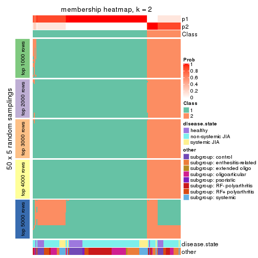</p>

</div>
<div id='tab-ATC-pam-membership-heatmap-2'>
<pre><code class="r">membership_heatmap(res, k = 3)
</code></pre>

<p></p>

</div>
<div id='tab-ATC-pam-membership-heatmap-3'>
<pre><code class="r">membership_heatmap(res, k = 4)
</code></pre>

<p></p>

</div>
<div id='tab-ATC-pam-membership-heatmap-4'>
<pre><code class="r">membership_heatmap(res, k = 5)
</code></pre>

<p>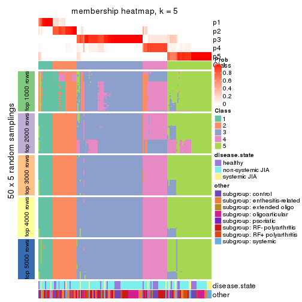</p>

</div>
<div id='tab-ATC-pam-membership-heatmap-5'>
<pre><code class="r">membership_heatmap(res, k = 6)
</code></pre>

<p>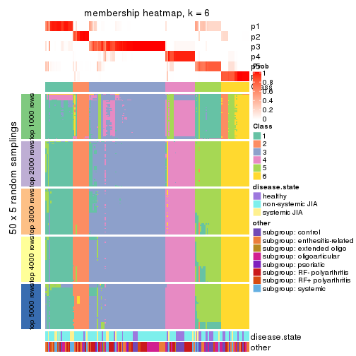</p>

</div>
</div>

As soon as we have had the classes for columns, we can look for signatures
which are significantly different between classes which can be candidate marks
for certain classes. Following are the heatmaps for signatures.


Signature heatmaps where rows are scaled:


<script>
$( function() {
	$( '#tabs-ATC-pam-get-signatures' ).tabs();
} );
</script>
<div id='tabs-ATC-pam-get-signatures'>
<ul>
<li><a href='#tab-ATC-pam-get-signatures-1'>k = 2</a></li>
<li><a href='#tab-ATC-pam-get-signatures-2'>k = 3</a></li>
<li><a href='#tab-ATC-pam-get-signatures-3'>k = 4</a></li>
<li><a href='#tab-ATC-pam-get-signatures-4'>k = 5</a></li>
<li><a href='#tab-ATC-pam-get-signatures-5'>k = 6</a></li>
</ul>
<div id='tab-ATC-pam-get-signatures-1'>
<pre><code class="r">get_signatures(res, k = 2)
</code></pre>

<p></p>

</div>
<div id='tab-ATC-pam-get-signatures-2'>
<pre><code class="r">get_signatures(res, k = 3)
</code></pre>

<p></p>

</div>
<div id='tab-ATC-pam-get-signatures-3'>
<pre><code class="r">get_signatures(res, k = 4)
</code></pre>

<p></p>

</div>
<div id='tab-ATC-pam-get-signatures-4'>
<pre><code class="r">get_signatures(res, k = 5)
</code></pre>

<p></p>

</div>
<div id='tab-ATC-pam-get-signatures-5'>
<pre><code class="r">get_signatures(res, k = 6)
</code></pre>

<p></p>

</div>
</div>


Signature heatmaps where rows are not scaled:


<script>
$( function() {
	$( '#tabs-ATC-pam-get-signatures-no-scale' ).tabs();
} );
</script>
<div id='tabs-ATC-pam-get-signatures-no-scale'>
<ul>
<li><a href='#tab-ATC-pam-get-signatures-no-scale-1'>k = 2</a></li>
<li><a href='#tab-ATC-pam-get-signatures-no-scale-2'>k = 3</a></li>
<li><a href='#tab-ATC-pam-get-signatures-no-scale-3'>k = 4</a></li>
<li><a href='#tab-ATC-pam-get-signatures-no-scale-4'>k = 5</a></li>
<li><a href='#tab-ATC-pam-get-signatures-no-scale-5'>k = 6</a></li>
</ul>
<div id='tab-ATC-pam-get-signatures-no-scale-1'>
<pre><code class="r">get_signatures(res, k = 2, scale_rows = FALSE)
</code></pre>

<p></p>

</div>
<div id='tab-ATC-pam-get-signatures-no-scale-2'>
<pre><code class="r">get_signatures(res, k = 3, scale_rows = FALSE)
</code></pre>

<p></p>

</div>
<div id='tab-ATC-pam-get-signatures-no-scale-3'>
<pre><code class="r">get_signatures(res, k = 4, scale_rows = FALSE)
</code></pre>

<p></p>

</div>
<div id='tab-ATC-pam-get-signatures-no-scale-4'>
<pre><code class="r">get_signatures(res, k = 5, scale_rows = FALSE)
</code></pre>

<p></p>

</div>
<div id='tab-ATC-pam-get-signatures-no-scale-5'>
<pre><code class="r">get_signatures(res, k = 6, scale_rows = FALSE)
</code></pre>

<p></p>

</div>
</div>


Compare the overlap of signatures from different k:

```r
compare_signatures(res)
```


`get_signature()` returns a data frame invisibly. TO get the list of signatures, the function
call should be assigned to a variable explicitly. In following code, if `plot` argument is set
to `FALSE`, no heatmap is plotted while only the differential analysis is performed.

```r
# code only for demonstration
tb = get_signature(res, k = ..., plot = FALSE)
```

An example of the output of `tb` is:

```
#>   which_row         fdr    mean_1    mean_2 scaled_mean_1 scaled_mean_2 km
#> 1        38 0.042760348  8.373488  9.131774    -0.5533452     0.5164555  1
#> 2        40 0.018707592  7.106213  8.469186    -0.6173731     0.5762149  1
#> 3        55 0.019134737 10.221463 11.207825    -0.6159697     0.5749050  1
#> 4        59 0.006059896  5.921854  7.869574    -0.6899429     0.6439467  1
#> 5        60 0.018055526  8.928898 10.211722    -0.6204761     0.5791110  1
#> 6        98 0.009384629 15.714769 14.887706     0.6635654    -0.6193277  2
...
```

The columns in `tb` are:

1. `which_row`: row indices corresponding to the input matrix.
2. `fdr`: FDR for the differential test. 
3. `mean_x`: The mean value in group x.
4. `scaled_mean_x`: The mean value in group x after rows are scaled.
5. `km`: Row groups if k-means clustering is applied to rows.


UMAP plot which shows how samples are separated.


<script>
$( function() {
	$( '#tabs-ATC-pam-dimension-reduction' ).tabs();
} );
</script>
<div id='tabs-ATC-pam-dimension-reduction'>
<ul>
<li><a href='#tab-ATC-pam-dimension-reduction-1'>k = 2</a></li>
<li><a href='#tab-ATC-pam-dimension-reduction-2'>k = 3</a></li>
<li><a href='#tab-ATC-pam-dimension-reduction-3'>k = 4</a></li>
<li><a href='#tab-ATC-pam-dimension-reduction-4'>k = 5</a></li>
<li><a href='#tab-ATC-pam-dimension-reduction-5'>k = 6</a></li>
</ul>
<div id='tab-ATC-pam-dimension-reduction-1'>
<pre><code class="r">dimension_reduction(res, k = 2, method = &quot;UMAP&quot;)
</code></pre>

<p></p>

</div>
<div id='tab-ATC-pam-dimension-reduction-2'>
<pre><code class="r">dimension_reduction(res, k = 3, method = &quot;UMAP&quot;)
</code></pre>

<p></p>

</div>
<div id='tab-ATC-pam-dimension-reduction-3'>
<pre><code class="r">dimension_reduction(res, k = 4, method = &quot;UMAP&quot;)
</code></pre>

<p></p>

</div>
<div id='tab-ATC-pam-dimension-reduction-4'>
<pre><code class="r">dimension_reduction(res, k = 5, method = &quot;UMAP&quot;)
</code></pre>

<p></p>

</div>
<div id='tab-ATC-pam-dimension-reduction-5'>
<pre><code class="r">dimension_reduction(res, k = 6, method = &quot;UMAP&quot;)
</code></pre>

<p></p>

</div>
</div>


Following heatmap shows how subgroups are split when increasing `k`:

```r
collect_classes(res)
```


Test correlation between subgroups and known annotations. If the known
annotation is numeric, one-way ANOVA test is applied, and if the known
annotation is discrete, chi-squared contingency table test is applied.

```r
test_to_known_factors(res)
```

```
#>           n disease.state(p) other(p) k
#> ATC:pam 154           0.8049   0.5096 2
#> ATC:pam 140           0.0879   0.1081 3
#> ATC:pam 139           0.0577   0.0320 4
#> ATC:pam 152           0.1671   0.1345 5
#> ATC:pam 143           0.0679   0.0783 6
```


If matrix rows can be associated to genes, consider to use `GO_Enrichment(res,
...)` to perform function enrichment for the signature genes.


 

---------------------------------------------------


### ATC:mclust


The object with results only for a single top-value method and a single partition method 
can be extracted as:

```r
res = res_list["ATC", "mclust"]
# you can also extract it by
# res = res_list["ATC:mclust"]
```

A summary of `res` and all the functions that can be applied to it:

```r
res
```

```
#> A 'ConsensusPartition' object with k = 2, 3, 4, 5, 6.
#>   On a matrix with 51941 rows and 154 columns.
#>   Top rows (1000, 2000, 3000, 4000, 5000) are extracted by 'ATC' method.
#>   Subgroups are detected by 'mclust' method.
#>   Performed in total 1250 partitions by row resampling.
#>   Best k for subgroups seems to be 2.
#> 
#> Following methods can be applied to this 'ConsensusPartition' object:
#>  [1] "cola_report"             "collect_classes"         "collect_plots"          
#>  [4] "collect_stats"           "colnames"                "compare_signatures"     
#>  [7] "consensus_heatmap"       "dimension_reduction"     "functional_enrichment"  
#> [10] "get_anno_col"            "get_anno"                "get_classes"            
#> [13] "get_consensus"           "get_matrix"              "get_membership"         
#> [16] "get_param"               "get_signatures"          "get_stats"              
#> [19] "is_best_k"               "is_stable_k"             "membership_heatmap"     
#> [22] "ncol"                    "nrow"                    "plot_ecdf"              
#> [25] "rownames"                "select_partition_number" "show"                   
#> [28] "suggest_best_k"          "test_to_known_factors"
```

`collect_plots()` function collects all the plots made from `res` for all `k` (number of partitions)
into one single page to provide an easy and fast comparison between different `k`.

```r
collect_plots(res)
```


The plots are:

- The first row: a plot of the ECDF (Empirical cumulative distribution
  function) curves of the consensus matrix for each `k` and the heatmap of
  predicted classes for each `k`.
- The second row: heatmaps of the consensus matrix for each `k`.
- The third row: heatmaps of the membership matrix for each `k`.
- The fouth row: heatmaps of the signatures for each `k`.

All the plots in panels can be made by individual functions and they are
plotted later in this section.

`select_partition_number()` produces several plots showing different
statistics for choosing "optimized" `k`. There are following statistics:

- ECDF curves of the consensus matrix for each `k`;
- 1-PAC. [The PAC
  score](https://en.wikipedia.org/wiki/Consensus_clustering#Over-interpretation_potential_of_consensus_clustering)
  measures the proportion of the ambiguous subgrouping.
- Mean silhouette score.
- Concordance. The mean probability of fiting the consensus class ids in all
  partitions.
- Area increased. Denote $A_k$ as the area under the ECDF curve for current
  `k`, the area increased is defined as $A_k - A_{k-1}$.
- Rand index. The percent of pairs of samples that are both in a same cluster
  or both are not in a same cluster in the partition of k and k-1.
- Jaccard index. The ratio of pairs of samples are both in a same cluster in
  the partition of k and k-1 and the pairs of samples are both in a same
  cluster in the partition k or k-1.

The detailed explanations of these statistics can be found in [the cola
vignette](http://bioconductor.org/packages/devel/bioc/vignettes/cola/inst/doc/cola.html#toc_13).

Generally speaking, lower PAC score, higher mean silhouette score or higher
concordance corresponds to better partition. Rand index and Jaccard index
measure how similar the current partition is compared to partition with `k-1`.
If they are too similar, we won't accept `k` is better than `k-1`.

```r
select_partition_number(res)
```


The numeric values for all these statistics can be obtained by `get_stats()`.

```r
get_stats(res)
```

```
#>   k 1-PAC mean_silhouette concordance area_increased  Rand Jaccard
#> 2 2 0.793           0.880       0.944         0.4902 0.513   0.513
#> 3 3 0.652           0.772       0.876         0.3367 0.750   0.545
#> 4 4 0.482           0.576       0.751         0.0788 0.844   0.588
#> 5 5 0.615           0.641       0.792         0.0934 0.859   0.542
#> 6 6 0.679           0.646       0.776         0.0467 0.875   0.515
```

`suggest_best_k()` suggests the best $k$ based on these statistics. The rules are as follows:

- All $k$ with Jaccard index larger than 0.95 are removed because the increase of
  the partition number does not provides enough extra information. If all $k$ are removed,
  the best $k$ is assigned by `NA`.
- For $k$ with 1-PAC larger than 0.9, the maximal $k$ is taken as the "best k". Other $k$ is called "optional k".
- If it does not fit the second rule. The $k$ with the highest vote of highest
  1-PAC, mean silhouette and concordance is taken as the "best k".

```r
suggest_best_k(res)
```

```
#> [1] 2
```


Following shows the table of the partitions (You need to click the **show/hide
code output** link to see it). The membership matrix (columns with name `p*`)
is inferred by
[`clue::cl_consensus()`](https://www.rdocumentation.org/link/cl_consensus?package=clue)
function with the `SE` method. Basically the value in the membership matrix
represents the probability to belong to a certain group. The finall class
label for an item is determined with the group with highest probability it
belongs to.

In `get_classes()` function, the entropy is calculated from the membership
matrix and the silhouette score is calculated from the consensus matrix.


<script>
$( function() {
	$( '#tabs-ATC-mclust-get-classes' ).tabs();
} );
</script>
<div id='tabs-ATC-mclust-get-classes'>
<ul>
<li><a href='#tab-ATC-mclust-get-classes-1'>k = 2</a></li>
<li><a href='#tab-ATC-mclust-get-classes-2'>k = 3</a></li>
<li><a href='#tab-ATC-mclust-get-classes-3'>k = 4</a></li>
<li><a href='#tab-ATC-mclust-get-classes-4'>k = 5</a></li>
<li><a href='#tab-ATC-mclust-get-classes-5'>k = 6</a></li>
</ul>

<div id='tab-ATC-mclust-get-classes-1'>
<p><a id='tab-ATC-mclust-get-classes-1-a' style='color:#0366d6' href='#'>show/hide code output</a></p>
<pre><code class="r">cbind(get_classes(res, k = 2), get_membership(res, k = 2))
</code></pre>

<pre><code>#&gt;           class entropy silhouette    p1    p2
#&gt; GSM340358     1  0.0000      0.917 1.000 0.000
#&gt; GSM340359     2  0.0000      0.975 0.000 1.000
#&gt; GSM340361     1  0.3274      0.899 0.940 0.060
#&gt; GSM340362     1  0.3274      0.899 0.940 0.060
#&gt; GSM340363     1  0.0000      0.917 1.000 0.000
#&gt; GSM340364     2  0.0000      0.975 0.000 1.000
#&gt; GSM340365     1  0.3274      0.899 0.940 0.060
#&gt; GSM340366     1  0.2603      0.905 0.956 0.044
#&gt; GSM340367     1  0.0000      0.917 1.000 0.000
#&gt; GSM340368     2  0.0000      0.975 0.000 1.000
#&gt; GSM340369     1  0.9833      0.395 0.576 0.424
#&gt; GSM340370     2  0.1843      0.953 0.028 0.972
#&gt; GSM340371     1  0.3274      0.899 0.940 0.060
#&gt; GSM340372     1  0.0000      0.917 1.000 0.000
#&gt; GSM340373     1  0.0000      0.917 1.000 0.000
#&gt; GSM340375     2  0.0000      0.975 0.000 1.000
#&gt; GSM340376     2  0.0000      0.975 0.000 1.000
#&gt; GSM340378     2  0.0000      0.975 0.000 1.000
#&gt; GSM340243     1  0.0000      0.917 1.000 0.000
#&gt; GSM340244     2  0.0000      0.975 0.000 1.000
#&gt; GSM340246     2  0.0000      0.975 0.000 1.000
#&gt; GSM340247     2  0.0000      0.975 0.000 1.000
#&gt; GSM340248     2  0.0000      0.975 0.000 1.000
#&gt; GSM340249     2  0.0000      0.975 0.000 1.000
#&gt; GSM340250     1  0.0000      0.917 1.000 0.000
#&gt; GSM340251     2  0.0000      0.975 0.000 1.000
#&gt; GSM340252     2  0.0000      0.975 0.000 1.000
#&gt; GSM340253     2  0.0000      0.975 0.000 1.000
#&gt; GSM340254     2  0.0000      0.975 0.000 1.000
#&gt; GSM340256     2  0.0000      0.975 0.000 1.000
#&gt; GSM340258     2  0.0000      0.975 0.000 1.000
#&gt; GSM340259     1  0.0000      0.917 1.000 0.000
#&gt; GSM340260     1  0.0000      0.917 1.000 0.000
#&gt; GSM340261     1  0.0000      0.917 1.000 0.000
#&gt; GSM340262     1  0.3274      0.899 0.940 0.060
#&gt; GSM340263     2  0.0000      0.975 0.000 1.000
#&gt; GSM340264     1  0.8443      0.659 0.728 0.272
#&gt; GSM340265     2  0.1843      0.953 0.028 0.972
#&gt; GSM340266     1  0.0000      0.917 1.000 0.000
#&gt; GSM340267     2  0.1843      0.953 0.028 0.972
#&gt; GSM340268     1  0.0000      0.917 1.000 0.000
#&gt; GSM340269     1  0.0000      0.917 1.000 0.000
#&gt; GSM340270     1  0.0672      0.914 0.992 0.008
#&gt; GSM537574     2  0.0000      0.975 0.000 1.000
#&gt; GSM537580     1  0.3274      0.899 0.940 0.060
#&gt; GSM537581     2  0.0000      0.975 0.000 1.000
#&gt; GSM340272     1  0.3274      0.899 0.940 0.060
#&gt; GSM340273     2  0.0000      0.975 0.000 1.000
#&gt; GSM340275     2  0.0000      0.975 0.000 1.000
#&gt; GSM340276     1  0.0000      0.917 1.000 0.000
#&gt; GSM340277     2  0.0000      0.975 0.000 1.000
#&gt; GSM340278     1  0.0000      0.917 1.000 0.000
#&gt; GSM340279     1  0.0000      0.917 1.000 0.000
#&gt; GSM340282     1  0.2236      0.907 0.964 0.036
#&gt; GSM340284     2  0.0000      0.975 0.000 1.000
#&gt; GSM340285     1  0.0000      0.917 1.000 0.000
#&gt; GSM340286     1  0.3274      0.899 0.940 0.060
#&gt; GSM340287     1  0.0000      0.917 1.000 0.000
#&gt; GSM340288     1  0.0000      0.917 1.000 0.000
#&gt; GSM340289     1  0.0000      0.917 1.000 0.000
#&gt; GSM340290     1  0.0000      0.917 1.000 0.000
#&gt; GSM340291     2  0.0000      0.975 0.000 1.000
#&gt; GSM340293     1  0.3274      0.899 0.940 0.060
#&gt; GSM340294     1  0.0000      0.917 1.000 0.000
#&gt; GSM340296     1  0.0000      0.917 1.000 0.000
#&gt; GSM340297     1  0.0000      0.917 1.000 0.000
#&gt; GSM340298     1  0.0000      0.917 1.000 0.000
#&gt; GSM340299     1  0.3274      0.899 0.940 0.060
#&gt; GSM340301     1  0.3274      0.899 0.940 0.060
#&gt; GSM340303     2  0.1843      0.953 0.028 0.972
#&gt; GSM340304     2  0.8861      0.565 0.304 0.696
#&gt; GSM340306     1  0.8443      0.676 0.728 0.272
#&gt; GSM340307     2  0.0000      0.975 0.000 1.000
#&gt; GSM340310     1  0.0000      0.917 1.000 0.000
#&gt; GSM340314     1  0.0000      0.917 1.000 0.000
#&gt; GSM340315     2  0.1843      0.953 0.028 0.972
#&gt; GSM340317     2  0.0000      0.975 0.000 1.000
#&gt; GSM340318     1  0.9833      0.395 0.576 0.424
#&gt; GSM340319     1  0.9833      0.395 0.576 0.424
#&gt; GSM340320     1  0.0000      0.917 1.000 0.000
#&gt; GSM340321     2  0.0000      0.975 0.000 1.000
#&gt; GSM340322     1  0.9833      0.395 0.576 0.424
#&gt; GSM340324     2  0.0000      0.975 0.000 1.000
#&gt; GSM340328     1  0.0000      0.917 1.000 0.000
#&gt; GSM340330     1  0.0938      0.914 0.988 0.012
#&gt; GSM340332     1  0.9833      0.395 0.576 0.424
#&gt; GSM340333     2  0.0000      0.975 0.000 1.000
#&gt; GSM340336     2  0.0000      0.975 0.000 1.000
#&gt; GSM340337     1  0.9833      0.395 0.576 0.424
#&gt; GSM340338     1  0.3274      0.899 0.940 0.060
#&gt; GSM340339     1  0.9833      0.395 0.576 0.424
#&gt; GSM340340     2  0.0000      0.975 0.000 1.000
#&gt; GSM340341     2  0.0000      0.975 0.000 1.000
#&gt; GSM340343     1  0.0000      0.917 1.000 0.000
#&gt; GSM340344     2  0.0000      0.975 0.000 1.000
#&gt; GSM340346     1  0.0000      0.917 1.000 0.000
#&gt; GSM340347     2  0.9552      0.285 0.376 0.624
#&gt; GSM340348     2  0.1843      0.953 0.028 0.972
#&gt; GSM340349     1  0.0000      0.917 1.000 0.000
#&gt; GSM340350     1  0.0000      0.917 1.000 0.000
#&gt; GSM340351     1  0.0000      0.917 1.000 0.000
#&gt; GSM340354     2  0.1414      0.959 0.020 0.980
#&gt; GSM340356     2  0.0000      0.975 0.000 1.000
#&gt; GSM340357     1  0.0000      0.917 1.000 0.000
#&gt; GSM348183     1  0.0000      0.917 1.000 0.000
#&gt; GSM348191     1  0.0000      0.917 1.000 0.000
#&gt; GSM348193     2  0.9909      0.163 0.444 0.556
#&gt; GSM537578     1  0.0000      0.917 1.000 0.000
#&gt; GSM348181     1  0.0000      0.917 1.000 0.000
#&gt; GSM348182     1  0.3274      0.899 0.940 0.060
#&gt; GSM348184     2  0.0000      0.975 0.000 1.000
#&gt; GSM348185     2  0.0000      0.975 0.000 1.000
#&gt; GSM348186     2  0.0000      0.975 0.000 1.000
#&gt; GSM348187     1  0.0000      0.917 1.000 0.000
#&gt; GSM348188     1  0.6623      0.803 0.828 0.172
#&gt; GSM348189     1  0.3274      0.899 0.940 0.060
#&gt; GSM348190     1  0.3274      0.899 0.940 0.060
#&gt; GSM348194     1  0.0000      0.917 1.000 0.000
#&gt; GSM348195     1  0.0000      0.917 1.000 0.000
#&gt; GSM348196     1  0.0000      0.917 1.000 0.000
#&gt; GSM537585     2  0.1843      0.953 0.028 0.972
#&gt; GSM537594     2  0.0000      0.975 0.000 1.000
#&gt; GSM537596     1  0.0000      0.917 1.000 0.000
#&gt; GSM537597     2  0.0000      0.975 0.000 1.000
#&gt; GSM537602     1  0.0938      0.912 0.988 0.012
#&gt; GSM340184     2  0.4161      0.896 0.084 0.916
#&gt; GSM340185     2  0.0000      0.975 0.000 1.000
#&gt; GSM340186     2  0.0000      0.975 0.000 1.000
#&gt; GSM340187     2  0.0000      0.975 0.000 1.000
#&gt; GSM340189     1  0.9833      0.395 0.576 0.424
#&gt; GSM340190     2  0.0000      0.975 0.000 1.000
#&gt; GSM340191     1  0.0000      0.917 1.000 0.000
#&gt; GSM340192     2  0.0000      0.975 0.000 1.000
#&gt; GSM340193     1  0.0000      0.917 1.000 0.000
#&gt; GSM340194     1  0.3274      0.899 0.940 0.060
#&gt; GSM340195     1  0.3274      0.899 0.940 0.060
#&gt; GSM340196     1  0.9833      0.395 0.576 0.424
#&gt; GSM340197     1  0.3274      0.899 0.940 0.060
#&gt; GSM340198     2  0.0000      0.975 0.000 1.000
#&gt; GSM340199     1  0.0000      0.917 1.000 0.000
#&gt; GSM340200     2  0.0000      0.975 0.000 1.000
#&gt; GSM340201     1  0.9833      0.395 0.576 0.424
#&gt; GSM340202     2  0.0672      0.968 0.008 0.992
#&gt; GSM340203     1  0.9833      0.395 0.576 0.424
#&gt; GSM340204     2  0.0000      0.975 0.000 1.000
#&gt; GSM340205     1  0.0000      0.917 1.000 0.000
#&gt; GSM340206     1  0.6973      0.757 0.812 0.188
#&gt; GSM340207     1  0.3274      0.899 0.940 0.060
#&gt; GSM340237     2  0.0000      0.975 0.000 1.000
#&gt; GSM340238     1  0.0000      0.917 1.000 0.000
#&gt; GSM340239     1  0.3274      0.899 0.940 0.060
#&gt; GSM340240     1  0.7602      0.746 0.780 0.220
#&gt; GSM340241     2  0.0000      0.975 0.000 1.000
#&gt; GSM340242     1  0.3274      0.899 0.940 0.060
</code></pre>

<script>
$('#tab-ATC-mclust-get-classes-1-a').parent().next().next().hide();
$('#tab-ATC-mclust-get-classes-1-a').click(function(){
  $('#tab-ATC-mclust-get-classes-1-a').parent().next().next().toggle();
  return(false);
});
</script>
</div>

<div id='tab-ATC-mclust-get-classes-2'>
<p><a id='tab-ATC-mclust-get-classes-2-a' style='color:#0366d6' href='#'>show/hide code output</a></p>
<pre><code class="r">cbind(get_classes(res, k = 3), get_membership(res, k = 3))
</code></pre>

<pre><code>#&gt;           class entropy silhouette    p1    p2    p3
#&gt; GSM340358     1  0.1643     0.8568 0.956 0.000 0.044
#&gt; GSM340359     2  0.0237     0.9156 0.000 0.996 0.004
#&gt; GSM340361     3  0.0237     0.7950 0.004 0.000 0.996
#&gt; GSM340362     3  0.0237     0.7950 0.004 0.000 0.996
#&gt; GSM340363     1  0.1163     0.8606 0.972 0.000 0.028
#&gt; GSM340364     2  0.0237     0.9156 0.000 0.996 0.004
#&gt; GSM340365     3  0.0237     0.7950 0.004 0.000 0.996
#&gt; GSM340366     3  0.0424     0.7957 0.008 0.000 0.992
#&gt; GSM340367     3  0.5465     0.6994 0.288 0.000 0.712
#&gt; GSM340368     2  0.0892     0.9140 0.020 0.980 0.000
#&gt; GSM340369     1  0.1989     0.8404 0.948 0.004 0.048
#&gt; GSM340370     2  0.4178     0.8164 0.000 0.828 0.172
#&gt; GSM340371     3  0.8202     0.6104 0.260 0.120 0.620
#&gt; GSM340372     3  0.3116     0.7938 0.108 0.000 0.892
#&gt; GSM340373     3  0.2878     0.7961 0.096 0.000 0.904
#&gt; GSM340375     2  0.4291     0.8125 0.000 0.820 0.180
#&gt; GSM340376     2  0.4178     0.8164 0.000 0.828 0.172
#&gt; GSM340378     2  0.0000     0.9157 0.000 1.000 0.000
#&gt; GSM340243     1  0.1289     0.8608 0.968 0.000 0.032
#&gt; GSM340244     2  0.0747     0.9146 0.016 0.984 0.000
#&gt; GSM340246     2  0.0747     0.9146 0.016 0.984 0.000
#&gt; GSM340247     2  0.1399     0.9098 0.028 0.968 0.004
#&gt; GSM340248     2  0.0747     0.9146 0.016 0.984 0.000
#&gt; GSM340249     2  0.0892     0.9139 0.020 0.980 0.000
#&gt; GSM340250     3  0.5291     0.7170 0.268 0.000 0.732
#&gt; GSM340251     2  0.1031     0.9128 0.024 0.976 0.000
#&gt; GSM340252     2  0.0237     0.9156 0.000 0.996 0.004
#&gt; GSM340253     2  0.0237     0.9156 0.000 0.996 0.004
#&gt; GSM340254     2  0.0237     0.9156 0.000 0.996 0.004
#&gt; GSM340256     2  0.0237     0.9156 0.000 0.996 0.004
#&gt; GSM340258     2  0.4235     0.8157 0.000 0.824 0.176
#&gt; GSM340259     3  0.3038     0.7938 0.104 0.000 0.896
#&gt; GSM340260     3  0.5098     0.7346 0.248 0.000 0.752
#&gt; GSM340261     1  0.1289     0.8609 0.968 0.000 0.032
#&gt; GSM340262     3  0.0424     0.7957 0.008 0.000 0.992
#&gt; GSM340263     2  0.0892     0.9139 0.020 0.980 0.000
#&gt; GSM340264     2  0.6521     0.2343 0.004 0.504 0.492
#&gt; GSM340265     2  0.4291     0.8125 0.000 0.820 0.180
#&gt; GSM340266     1  0.2682     0.8230 0.920 0.004 0.076
#&gt; GSM340267     2  0.4291     0.8125 0.000 0.820 0.180
#&gt; GSM340268     1  0.0661     0.8545 0.988 0.004 0.008
#&gt; GSM340269     1  0.6522     0.5240 0.696 0.032 0.272
#&gt; GSM340270     1  0.6803     0.5124 0.680 0.040 0.280
#&gt; GSM537574     2  0.4897     0.8154 0.016 0.812 0.172
#&gt; GSM537580     3  0.9146     0.3434 0.380 0.148 0.472
#&gt; GSM537581     2  0.6994     0.1045 0.424 0.556 0.020
#&gt; GSM340272     3  0.0237     0.7950 0.004 0.000 0.996
#&gt; GSM340273     2  0.0892     0.9139 0.020 0.980 0.000
#&gt; GSM340275     2  0.1031     0.9128 0.024 0.976 0.000
#&gt; GSM340276     1  0.2356     0.8345 0.928 0.000 0.072
#&gt; GSM340277     2  0.0237     0.9156 0.000 0.996 0.004
#&gt; GSM340278     1  0.1289     0.8609 0.968 0.000 0.032
#&gt; GSM340279     1  0.2959     0.8102 0.900 0.000 0.100
#&gt; GSM340282     3  0.0237     0.7950 0.004 0.000 0.996
#&gt; GSM340284     2  0.1031     0.9128 0.024 0.976 0.000
#&gt; GSM340285     1  0.1289     0.8609 0.968 0.000 0.032
#&gt; GSM340286     3  0.0237     0.7950 0.004 0.000 0.996
#&gt; GSM340287     1  0.4172     0.7366 0.840 0.004 0.156
#&gt; GSM340288     3  0.3116     0.7938 0.108 0.000 0.892
#&gt; GSM340289     3  0.4974     0.7427 0.236 0.000 0.764
#&gt; GSM340290     1  0.3267     0.7926 0.884 0.000 0.116
#&gt; GSM340291     2  0.0747     0.9146 0.016 0.984 0.000
#&gt; GSM340293     1  0.2261     0.8457 0.932 0.000 0.068
#&gt; GSM340294     1  0.1289     0.8609 0.968 0.000 0.032
#&gt; GSM340296     1  0.1289     0.8609 0.968 0.000 0.032
#&gt; GSM340297     1  0.1289     0.8609 0.968 0.000 0.032
#&gt; GSM340298     1  0.1289     0.8609 0.968 0.000 0.032
#&gt; GSM340299     3  0.0237     0.7950 0.004 0.000 0.996
#&gt; GSM340301     3  0.0237     0.7950 0.004 0.000 0.996
#&gt; GSM340303     2  0.4291     0.8125 0.000 0.820 0.180
#&gt; GSM340304     1  0.7911     0.4934 0.632 0.096 0.272
#&gt; GSM340306     3  0.9730     0.3051 0.228 0.352 0.420
#&gt; GSM340307     2  0.0000     0.9157 0.000 1.000 0.000
#&gt; GSM340310     3  0.5431     0.7035 0.284 0.000 0.716
#&gt; GSM340314     1  0.1163     0.8610 0.972 0.000 0.028
#&gt; GSM340315     2  0.5092     0.8110 0.020 0.804 0.176
#&gt; GSM340317     2  0.0892     0.9139 0.020 0.980 0.000
#&gt; GSM340318     1  0.1989     0.8404 0.948 0.004 0.048
#&gt; GSM340319     1  0.1989     0.8404 0.948 0.004 0.048
#&gt; GSM340320     1  0.1411     0.8604 0.964 0.000 0.036
#&gt; GSM340321     2  0.0747     0.9146 0.016 0.984 0.000
#&gt; GSM340322     2  0.4749     0.8064 0.076 0.852 0.072
#&gt; GSM340324     2  0.0237     0.9156 0.000 0.996 0.004
#&gt; GSM340328     3  0.6467     0.5723 0.388 0.008 0.604
#&gt; GSM340330     3  0.7944     0.6117 0.296 0.088 0.616
#&gt; GSM340332     1  0.2096     0.8419 0.944 0.004 0.052
#&gt; GSM340333     2  0.0237     0.9156 0.000 0.996 0.004
#&gt; GSM340336     2  0.1031     0.9128 0.024 0.976 0.000
#&gt; GSM340337     2  0.8013     0.3297 0.332 0.588 0.080
#&gt; GSM340338     3  0.8120     0.6320 0.224 0.136 0.640
#&gt; GSM340339     1  0.2590     0.8441 0.924 0.004 0.072
#&gt; GSM340340     2  0.0000     0.9157 0.000 1.000 0.000
#&gt; GSM340341     2  0.0592     0.9152 0.012 0.988 0.000
#&gt; GSM340343     1  0.1411     0.8613 0.964 0.000 0.036
#&gt; GSM340344     2  0.0237     0.9156 0.000 0.996 0.004
#&gt; GSM340346     3  0.6215     0.5009 0.428 0.000 0.572
#&gt; GSM340347     1  0.7095     0.5388 0.660 0.292 0.048
#&gt; GSM340348     1  0.6910     0.3796 0.584 0.396 0.020
#&gt; GSM340349     3  0.5098     0.7339 0.248 0.000 0.752
#&gt; GSM340350     3  0.5363     0.7098 0.276 0.000 0.724
#&gt; GSM340351     3  0.2959     0.7951 0.100 0.000 0.900
#&gt; GSM340354     2  0.4235     0.8131 0.000 0.824 0.176
#&gt; GSM340356     2  0.0000     0.9157 0.000 1.000 0.000
#&gt; GSM340357     3  0.6875     0.7187 0.244 0.056 0.700
#&gt; GSM348183     3  0.2066     0.7984 0.060 0.000 0.940
#&gt; GSM348191     1  0.1529     0.8582 0.960 0.000 0.040
#&gt; GSM348193     2  0.9211     0.2493 0.224 0.536 0.240
#&gt; GSM537578     3  0.4931     0.7440 0.232 0.000 0.768
#&gt; GSM348181     1  0.2165     0.8453 0.936 0.000 0.064
#&gt; GSM348182     3  0.0424     0.7957 0.008 0.000 0.992
#&gt; GSM348184     2  0.0747     0.9146 0.016 0.984 0.000
#&gt; GSM348185     2  0.0892     0.9139 0.020 0.980 0.000
#&gt; GSM348186     2  0.0237     0.9156 0.000 0.996 0.004
#&gt; GSM348187     1  0.1163     0.8606 0.972 0.000 0.028
#&gt; GSM348188     3  0.7913     0.1920 0.056 0.452 0.492
#&gt; GSM348189     3  0.7727     0.5567 0.336 0.064 0.600
#&gt; GSM348190     3  0.0237     0.7950 0.004 0.000 0.996
#&gt; GSM348194     3  0.4121     0.7766 0.168 0.000 0.832
#&gt; GSM348195     3  0.2537     0.7984 0.080 0.000 0.920
#&gt; GSM348196     3  0.6154     0.5404 0.408 0.000 0.592
#&gt; GSM537585     2  0.4291     0.8125 0.000 0.820 0.180
#&gt; GSM537594     2  0.0000     0.9157 0.000 1.000 0.000
#&gt; GSM537596     3  0.6154     0.5401 0.408 0.000 0.592
#&gt; GSM537597     2  0.4178     0.8164 0.000 0.828 0.172
#&gt; GSM537602     1  0.7230     0.3939 0.616 0.040 0.344
#&gt; GSM340184     1  0.9431     0.0017 0.424 0.400 0.176
#&gt; GSM340185     2  0.0000     0.9157 0.000 1.000 0.000
#&gt; GSM340186     2  0.0000     0.9157 0.000 1.000 0.000
#&gt; GSM340187     2  0.1031     0.9128 0.024 0.976 0.000
#&gt; GSM340189     1  0.1989     0.8404 0.948 0.004 0.048
#&gt; GSM340190     2  0.1031     0.9128 0.024 0.976 0.000
#&gt; GSM340191     1  0.1163     0.8606 0.972 0.000 0.028
#&gt; GSM340192     2  0.0237     0.9156 0.000 0.996 0.004
#&gt; GSM340193     3  0.4931     0.7440 0.232 0.000 0.768
#&gt; GSM340194     3  0.0237     0.7950 0.004 0.000 0.996
#&gt; GSM340195     3  0.0237     0.7950 0.004 0.000 0.996
#&gt; GSM340196     1  0.1989     0.8404 0.948 0.004 0.048
#&gt; GSM340197     3  0.0237     0.7950 0.004 0.000 0.996
#&gt; GSM340198     2  0.0237     0.9156 0.000 0.996 0.004
#&gt; GSM340199     1  0.1031     0.8602 0.976 0.000 0.024
#&gt; GSM340200     2  0.0000     0.9157 0.000 1.000 0.000
#&gt; GSM340201     1  0.1989     0.8404 0.948 0.004 0.048
#&gt; GSM340202     1  0.7292     0.1122 0.500 0.472 0.028
#&gt; GSM340203     1  0.2096     0.8419 0.944 0.004 0.052
#&gt; GSM340204     2  0.0237     0.9156 0.000 0.996 0.004
#&gt; GSM340205     1  0.1411     0.8597 0.964 0.000 0.036
#&gt; GSM340206     1  0.7053     0.5377 0.692 0.244 0.064
#&gt; GSM340207     3  0.1751     0.7848 0.012 0.028 0.960
#&gt; GSM340237     2  0.0747     0.9146 0.016 0.984 0.000
#&gt; GSM340238     1  0.1643     0.8583 0.956 0.000 0.044
#&gt; GSM340239     3  0.0237     0.7950 0.004 0.000 0.996
#&gt; GSM340240     2  0.6520     0.2359 0.004 0.508 0.488
#&gt; GSM340241     2  0.0237     0.9156 0.000 0.996 0.004
#&gt; GSM340242     3  0.6814     0.5281 0.372 0.020 0.608
</code></pre>

<script>
$('#tab-ATC-mclust-get-classes-2-a').parent().next().next().hide();
$('#tab-ATC-mclust-get-classes-2-a').click(function(){
  $('#tab-ATC-mclust-get-classes-2-a').parent().next().next().toggle();
  return(false);
});
</script>
</div>

<div id='tab-ATC-mclust-get-classes-3'>
<p><a id='tab-ATC-mclust-get-classes-3-a' style='color:#0366d6' href='#'>show/hide code output</a></p>
<pre><code class="r">cbind(get_classes(res, k = 4), get_membership(res, k = 4))
</code></pre>

<pre><code>#&gt;           class entropy silhouette    p1    p2    p3    p4
#&gt; GSM340358     1  0.3208    0.69699 0.848 0.000 0.148 0.004
#&gt; GSM340359     2  0.2830    0.71118 0.060 0.900 0.000 0.040
#&gt; GSM340361     3  0.0000    0.70705 0.000 0.000 1.000 0.000
#&gt; GSM340362     3  0.0000    0.70705 0.000 0.000 1.000 0.000
#&gt; GSM340363     1  0.2589    0.71323 0.884 0.000 0.116 0.000
#&gt; GSM340364     2  0.4467    0.73538 0.000 0.788 0.172 0.040
#&gt; GSM340365     3  0.0000    0.70705 0.000 0.000 1.000 0.000
#&gt; GSM340366     3  0.0707    0.71094 0.020 0.000 0.980 0.000
#&gt; GSM340367     3  0.5620    0.31560 0.416 0.000 0.560 0.024
#&gt; GSM340368     4  0.2081    0.75724 0.000 0.084 0.000 0.916
#&gt; GSM340369     1  0.6476    0.59155 0.616 0.000 0.112 0.272
#&gt; GSM340370     2  0.5050    0.70508 0.000 0.756 0.176 0.068
#&gt; GSM340371     3  0.7259    0.17078 0.448 0.060 0.456 0.036
#&gt; GSM340372     3  0.3810    0.70893 0.188 0.000 0.804 0.008
#&gt; GSM340373     3  0.3810    0.70893 0.188 0.000 0.804 0.008
#&gt; GSM340375     2  0.3356    0.73032 0.000 0.824 0.176 0.000
#&gt; GSM340376     2  0.5185    0.69813 0.000 0.748 0.176 0.076
#&gt; GSM340378     2  0.4507    0.73492 0.000 0.788 0.168 0.044
#&gt; GSM340243     1  0.4054    0.67459 0.796 0.000 0.188 0.016
#&gt; GSM340244     4  0.4522    0.60306 0.000 0.320 0.000 0.680
#&gt; GSM340246     2  0.4996   -0.08892 0.000 0.516 0.000 0.484
#&gt; GSM340247     4  0.1474    0.73189 0.000 0.052 0.000 0.948
#&gt; GSM340248     4  0.4500    0.60860 0.000 0.316 0.000 0.684
#&gt; GSM340249     4  0.2469    0.77405 0.000 0.108 0.000 0.892
#&gt; GSM340250     3  0.4957    0.59732 0.300 0.000 0.684 0.016
#&gt; GSM340251     4  0.2469    0.77405 0.000 0.108 0.000 0.892
#&gt; GSM340252     2  0.3706    0.70146 0.112 0.848 0.000 0.040
#&gt; GSM340253     2  0.2908    0.71071 0.064 0.896 0.000 0.040
#&gt; GSM340254     2  0.3706    0.70146 0.112 0.848 0.000 0.040
#&gt; GSM340256     2  0.3706    0.70146 0.112 0.848 0.000 0.040
#&gt; GSM340258     2  0.3356    0.73032 0.000 0.824 0.176 0.000
#&gt; GSM340259     3  0.3810    0.70893 0.188 0.000 0.804 0.008
#&gt; GSM340260     3  0.5026    0.57852 0.312 0.000 0.672 0.016
#&gt; GSM340261     1  0.2530    0.71323 0.888 0.000 0.112 0.000
#&gt; GSM340262     3  0.0188    0.70767 0.004 0.000 0.996 0.000
#&gt; GSM340263     4  0.4193    0.66811 0.000 0.268 0.000 0.732
#&gt; GSM340264     2  0.4855    0.51413 0.000 0.600 0.400 0.000
#&gt; GSM340265     2  0.3356    0.73032 0.000 0.824 0.176 0.000
#&gt; GSM340266     1  0.4462    0.69079 0.792 0.000 0.164 0.044
#&gt; GSM340267     2  0.3356    0.73032 0.000 0.824 0.176 0.000
#&gt; GSM340268     1  0.4680    0.69171 0.788 0.004 0.160 0.048
#&gt; GSM340269     1  0.7696    0.55306 0.616 0.108 0.188 0.088
#&gt; GSM340270     1  0.7936    0.52870 0.604 0.152 0.144 0.100
#&gt; GSM537574     2  0.5719    0.66869 0.000 0.712 0.176 0.112
#&gt; GSM537580     1  0.7387   -0.17649 0.452 0.040 0.444 0.064
#&gt; GSM537581     1  0.7640    0.02208 0.444 0.180 0.004 0.372
#&gt; GSM340272     3  0.0000    0.70705 0.000 0.000 1.000 0.000
#&gt; GSM340273     4  0.4522    0.60306 0.000 0.320 0.000 0.680
#&gt; GSM340275     4  0.2469    0.77405 0.000 0.108 0.000 0.892
#&gt; GSM340276     1  0.2918    0.71226 0.876 0.000 0.116 0.008
#&gt; GSM340277     2  0.3706    0.70146 0.112 0.848 0.000 0.040
#&gt; GSM340278     1  0.2530    0.71323 0.888 0.000 0.112 0.000
#&gt; GSM340279     1  0.4082    0.70347 0.820 0.008 0.152 0.020
#&gt; GSM340282     3  0.0188    0.70767 0.004 0.000 0.996 0.000
#&gt; GSM340284     4  0.2469    0.77405 0.000 0.108 0.000 0.892
#&gt; GSM340285     1  0.2589    0.71328 0.884 0.000 0.116 0.000
#&gt; GSM340286     3  0.0000    0.70705 0.000 0.000 1.000 0.000
#&gt; GSM340287     1  0.6149    0.61390 0.728 0.136 0.100 0.036
#&gt; GSM340288     3  0.3937    0.70772 0.188 0.000 0.800 0.012
#&gt; GSM340289     3  0.4327    0.69232 0.216 0.000 0.768 0.016
#&gt; GSM340290     1  0.4059    0.69607 0.832 0.040 0.124 0.004
#&gt; GSM340291     4  0.4790    0.48772 0.000 0.380 0.000 0.620
#&gt; GSM340293     1  0.4245    0.70407 0.820 0.000 0.116 0.064
#&gt; GSM340294     1  0.2714    0.71333 0.884 0.000 0.112 0.004
#&gt; GSM340296     1  0.2714    0.71333 0.884 0.000 0.112 0.004
#&gt; GSM340297     1  0.2530    0.71323 0.888 0.000 0.112 0.000
#&gt; GSM340298     1  0.2714    0.71333 0.884 0.000 0.112 0.004
#&gt; GSM340299     3  0.0000    0.70705 0.000 0.000 1.000 0.000
#&gt; GSM340301     3  0.0000    0.70705 0.000 0.000 1.000 0.000
#&gt; GSM340303     2  0.3356    0.73032 0.000 0.824 0.176 0.000
#&gt; GSM340304     1  0.8229    0.44069 0.548 0.248 0.108 0.096
#&gt; GSM340306     3  0.7075    0.28366 0.412 0.060 0.500 0.028
#&gt; GSM340307     2  0.4961    0.06388 0.000 0.552 0.000 0.448
#&gt; GSM340310     3  0.5488    0.21132 0.452 0.000 0.532 0.016
#&gt; GSM340314     1  0.2918    0.71253 0.876 0.000 0.116 0.008
#&gt; GSM340315     2  0.7039    0.44366 0.000 0.568 0.176 0.256
#&gt; GSM340317     4  0.2814    0.76810 0.000 0.132 0.000 0.868
#&gt; GSM340318     1  0.5112    0.38178 0.560 0.000 0.004 0.436
#&gt; GSM340319     1  0.4948    0.37138 0.560 0.000 0.000 0.440
#&gt; GSM340320     1  0.2918    0.71253 0.876 0.000 0.116 0.008
#&gt; GSM340321     4  0.4624    0.57235 0.000 0.340 0.000 0.660
#&gt; GSM340322     1  0.8157    0.00926 0.444 0.036 0.372 0.148
#&gt; GSM340324     2  0.3706    0.70146 0.112 0.848 0.000 0.040
#&gt; GSM340328     1  0.6586   -0.07125 0.512 0.040 0.428 0.020
#&gt; GSM340330     3  0.7079    0.18578 0.452 0.040 0.464 0.044
#&gt; GSM340332     1  0.5277    0.67628 0.752 0.000 0.116 0.132
#&gt; GSM340333     2  0.3706    0.70146 0.112 0.848 0.000 0.040
#&gt; GSM340336     4  0.2469    0.77405 0.000 0.108 0.000 0.892
#&gt; GSM340337     1  0.7922    0.02005 0.452 0.020 0.368 0.160
#&gt; GSM340338     3  0.7034    0.39824 0.364 0.064 0.544 0.028
#&gt; GSM340339     1  0.4780    0.68905 0.788 0.000 0.116 0.096
#&gt; GSM340340     4  0.4746    0.48630 0.000 0.368 0.000 0.632
#&gt; GSM340341     4  0.4804    0.45839 0.000 0.384 0.000 0.616
#&gt; GSM340343     1  0.3088    0.70876 0.864 0.000 0.128 0.008
#&gt; GSM340344     2  0.4467    0.73538 0.000 0.788 0.172 0.040
#&gt; GSM340346     1  0.5295   -0.20599 0.504 0.000 0.488 0.008
#&gt; GSM340347     4  0.6174   -0.19990 0.460 0.040 0.004 0.496
#&gt; GSM340348     1  0.7701    0.16803 0.460 0.200 0.004 0.336
#&gt; GSM340349     3  0.4933    0.61579 0.296 0.000 0.688 0.016
#&gt; GSM340350     3  0.4933    0.60229 0.296 0.000 0.688 0.016
#&gt; GSM340351     3  0.3810    0.70893 0.188 0.000 0.804 0.008
#&gt; GSM340354     2  0.5118    0.70068 0.000 0.752 0.176 0.072
#&gt; GSM340356     2  0.4713    0.34391 0.000 0.640 0.000 0.360
#&gt; GSM340357     1  0.8689    0.18175 0.408 0.264 0.288 0.040
#&gt; GSM348183     3  0.4428    0.63210 0.276 0.000 0.720 0.004
#&gt; GSM348191     1  0.3074    0.70227 0.848 0.000 0.152 0.000
#&gt; GSM348193     1  0.8802    0.36520 0.464 0.260 0.204 0.072
#&gt; GSM537578     3  0.4214    0.70006 0.204 0.000 0.780 0.016
#&gt; GSM348181     1  0.3401    0.69205 0.840 0.000 0.152 0.008
#&gt; GSM348182     3  0.2401    0.71804 0.092 0.000 0.904 0.004
#&gt; GSM348184     4  0.2589    0.77292 0.000 0.116 0.000 0.884
#&gt; GSM348185     4  0.3074    0.75949 0.000 0.152 0.000 0.848
#&gt; GSM348186     2  0.3706    0.70146 0.112 0.848 0.000 0.040
#&gt; GSM348187     1  0.3300    0.70558 0.848 0.000 0.144 0.008
#&gt; GSM348188     3  0.7007    0.48053 0.312 0.104 0.572 0.012
#&gt; GSM348189     3  0.7146    0.17808 0.452 0.040 0.460 0.048
#&gt; GSM348190     3  0.0000    0.70705 0.000 0.000 1.000 0.000
#&gt; GSM348194     3  0.3937    0.70772 0.188 0.000 0.800 0.012
#&gt; GSM348195     3  0.3810    0.70893 0.188 0.000 0.804 0.008
#&gt; GSM348196     1  0.5388   -0.10565 0.532 0.000 0.456 0.012
#&gt; GSM537585     2  0.3486    0.72655 0.000 0.812 0.188 0.000
#&gt; GSM537594     2  0.3706    0.70146 0.112 0.848 0.000 0.040
#&gt; GSM537596     1  0.5093    0.32620 0.640 0.000 0.348 0.012
#&gt; GSM537597     2  0.5250    0.69552 0.000 0.744 0.176 0.080
#&gt; GSM537602     1  0.7873    0.51677 0.584 0.100 0.232 0.084
#&gt; GSM340184     1  0.9226    0.03402 0.360 0.312 0.080 0.248
#&gt; GSM340185     2  0.4261    0.68544 0.112 0.820 0.000 0.068
#&gt; GSM340186     2  0.4843    0.66478 0.112 0.784 0.000 0.104
#&gt; GSM340187     4  0.1940    0.75277 0.000 0.076 0.000 0.924
#&gt; GSM340189     1  0.6377    0.60292 0.632 0.000 0.112 0.256
#&gt; GSM340190     4  0.2469    0.77405 0.000 0.108 0.000 0.892
#&gt; GSM340191     1  0.2589    0.71321 0.884 0.000 0.116 0.000
#&gt; GSM340192     2  0.4467    0.73538 0.000 0.788 0.172 0.040
#&gt; GSM340193     3  0.3937    0.70772 0.188 0.000 0.800 0.012
#&gt; GSM340194     3  0.0000    0.70705 0.000 0.000 1.000 0.000
#&gt; GSM340195     3  0.0000    0.70705 0.000 0.000 1.000 0.000
#&gt; GSM340196     1  0.4948    0.37138 0.560 0.000 0.000 0.440
#&gt; GSM340197     3  0.0000    0.70705 0.000 0.000 1.000 0.000
#&gt; GSM340198     2  0.3706    0.70146 0.112 0.848 0.000 0.040
#&gt; GSM340199     1  0.2918    0.71253 0.876 0.000 0.116 0.008
#&gt; GSM340200     2  0.4898    0.17217 0.000 0.584 0.000 0.416
#&gt; GSM340201     1  0.5112    0.38178 0.560 0.000 0.004 0.436
#&gt; GSM340202     4  0.6143    0.07375 0.368 0.048 0.004 0.580
#&gt; GSM340203     1  0.6965    0.57635 0.584 0.004 0.140 0.272
#&gt; GSM340204     2  0.4467    0.73538 0.000 0.788 0.172 0.040
#&gt; GSM340205     1  0.3893    0.66796 0.796 0.000 0.196 0.008
#&gt; GSM340206     1  0.7298    0.62429 0.636 0.044 0.160 0.160
#&gt; GSM340207     3  0.3271    0.71720 0.132 0.012 0.856 0.000
#&gt; GSM340237     4  0.4679    0.54966 0.000 0.352 0.000 0.648
#&gt; GSM340238     1  0.2918    0.71253 0.876 0.000 0.116 0.008
#&gt; GSM340239     3  0.0000    0.70705 0.000 0.000 1.000 0.000
#&gt; GSM340240     2  0.4898    0.50440 0.000 0.584 0.416 0.000
#&gt; GSM340241     2  0.3706    0.70146 0.112 0.848 0.000 0.040
#&gt; GSM340242     3  0.7080    0.17275 0.456 0.040 0.460 0.044
</code></pre>

<script>
$('#tab-ATC-mclust-get-classes-3-a').parent().next().next().hide();
$('#tab-ATC-mclust-get-classes-3-a').click(function(){
  $('#tab-ATC-mclust-get-classes-3-a').parent().next().next().toggle();
  return(false);
});
</script>
</div>

<div id='tab-ATC-mclust-get-classes-4'>
<p><a id='tab-ATC-mclust-get-classes-4-a' style='color:#0366d6' href='#'>show/hide code output</a></p>
<pre><code class="r">cbind(get_classes(res, k = 5), get_membership(res, k = 5))
</code></pre>

<pre><code>#&gt;           class entropy silhouette    p1    p2    p3    p4    p5
#&gt; GSM340358     3  0.3459     0.8012 0.052 0.000 0.832 0.000 0.116
#&gt; GSM340359     2  0.4057     0.7300 0.120 0.792 0.000 0.088 0.000
#&gt; GSM340361     5  0.0404     0.8047 0.012 0.000 0.000 0.000 0.988
#&gt; GSM340362     5  0.0404     0.8047 0.012 0.000 0.000 0.000 0.988
#&gt; GSM340363     3  0.3243     0.8196 0.036 0.012 0.860 0.000 0.092
#&gt; GSM340364     2  0.5559     0.5167 0.344 0.572 0.000 0.084 0.000
#&gt; GSM340365     5  0.0404     0.8047 0.012 0.000 0.000 0.000 0.988
#&gt; GSM340366     5  0.0000     0.8064 0.000 0.000 0.000 0.000 1.000
#&gt; GSM340367     1  0.6054     0.0683 0.496 0.000 0.124 0.000 0.380
#&gt; GSM340368     4  0.1484     0.7838 0.000 0.048 0.008 0.944 0.000
#&gt; GSM340369     3  0.3896     0.7663 0.028 0.048 0.828 0.096 0.000
#&gt; GSM340370     1  0.7153     0.2876 0.540 0.124 0.088 0.248 0.000
#&gt; GSM340371     5  0.5863     0.5961 0.140 0.004 0.204 0.008 0.644
#&gt; GSM340372     5  0.1205     0.8012 0.040 0.000 0.004 0.000 0.956
#&gt; GSM340373     5  0.0865     0.8043 0.024 0.000 0.004 0.000 0.972
#&gt; GSM340375     1  0.4835     0.3615 0.724 0.188 0.000 0.084 0.004
#&gt; GSM340376     1  0.5927     0.1558 0.540 0.120 0.000 0.340 0.000
#&gt; GSM340378     2  0.6724     0.3740 0.296 0.420 0.000 0.284 0.000
#&gt; GSM340243     3  0.3238     0.8173 0.124 0.004 0.848 0.004 0.020
#&gt; GSM340244     4  0.1628     0.8001 0.008 0.056 0.000 0.936 0.000
#&gt; GSM340246     4  0.3209     0.7149 0.008 0.180 0.000 0.812 0.000
#&gt; GSM340247     4  0.2747     0.7354 0.004 0.060 0.048 0.888 0.000
#&gt; GSM340248     4  0.2358     0.7790 0.008 0.104 0.000 0.888 0.000
#&gt; GSM340249     4  0.0566     0.8073 0.000 0.012 0.004 0.984 0.000
#&gt; GSM340250     1  0.5341    -0.0490 0.504 0.000 0.052 0.000 0.444
#&gt; GSM340251     4  0.0613     0.8065 0.004 0.008 0.004 0.984 0.000
#&gt; GSM340252     2  0.2471     0.7665 0.000 0.864 0.000 0.136 0.000
#&gt; GSM340253     2  0.2628     0.7780 0.028 0.884 0.000 0.088 0.000
#&gt; GSM340254     2  0.2074     0.7927 0.000 0.896 0.000 0.104 0.000
#&gt; GSM340256     2  0.2074     0.7927 0.000 0.896 0.000 0.104 0.000
#&gt; GSM340258     1  0.4835     0.3615 0.724 0.188 0.000 0.084 0.004
#&gt; GSM340259     5  0.1331     0.8011 0.040 0.000 0.008 0.000 0.952
#&gt; GSM340260     5  0.5350     0.1318 0.460 0.000 0.052 0.000 0.488
#&gt; GSM340261     3  0.3154     0.8099 0.024 0.012 0.860 0.000 0.104
#&gt; GSM340262     5  0.0000     0.8064 0.000 0.000 0.000 0.000 1.000
#&gt; GSM340263     4  0.1357     0.8041 0.004 0.048 0.000 0.948 0.000
#&gt; GSM340264     1  0.7279     0.3937 0.528 0.160 0.000 0.080 0.232
#&gt; GSM340265     1  0.5040     0.3614 0.716 0.192 0.000 0.080 0.012
#&gt; GSM340266     3  0.3483     0.8110 0.104 0.012 0.848 0.032 0.004
#&gt; GSM340267     1  0.4955     0.3638 0.720 0.188 0.000 0.084 0.008
#&gt; GSM340268     3  0.2925     0.8125 0.056 0.012 0.888 0.040 0.004
#&gt; GSM340269     1  0.5050     0.3035 0.652 0.000 0.300 0.012 0.036
#&gt; GSM340270     1  0.4336     0.3684 0.700 0.000 0.280 0.008 0.012
#&gt; GSM537574     1  0.5856     0.1186 0.504 0.100 0.000 0.396 0.000
#&gt; GSM537580     5  0.6572     0.3898 0.140 0.008 0.324 0.008 0.520
#&gt; GSM537581     4  0.6298     0.3589 0.100 0.028 0.304 0.568 0.000
#&gt; GSM340272     5  0.0000     0.8064 0.000 0.000 0.000 0.000 1.000
#&gt; GSM340273     4  0.2411     0.7767 0.008 0.108 0.000 0.884 0.000
#&gt; GSM340275     4  0.0486     0.8048 0.004 0.004 0.004 0.988 0.000
#&gt; GSM340276     3  0.3749     0.7960 0.080 0.000 0.816 0.000 0.104
#&gt; GSM340277     2  0.2074     0.7927 0.000 0.896 0.000 0.104 0.000
#&gt; GSM340278     3  0.2692     0.8251 0.016 0.008 0.884 0.000 0.092
#&gt; GSM340279     3  0.2462     0.8278 0.080 0.008 0.900 0.004 0.008
#&gt; GSM340282     5  0.0000     0.8064 0.000 0.000 0.000 0.000 1.000
#&gt; GSM340284     4  0.0613     0.8065 0.004 0.008 0.004 0.984 0.000
#&gt; GSM340285     3  0.3187     0.8205 0.036 0.012 0.864 0.000 0.088
#&gt; GSM340286     5  0.0404     0.8047 0.012 0.000 0.000 0.000 0.988
#&gt; GSM340287     3  0.4451     0.5966 0.316 0.004 0.668 0.004 0.008
#&gt; GSM340288     5  0.2017     0.7861 0.080 0.000 0.008 0.000 0.912
#&gt; GSM340289     5  0.3409     0.7511 0.112 0.000 0.052 0.000 0.836
#&gt; GSM340290     3  0.3838     0.8015 0.108 0.008 0.820 0.000 0.064
#&gt; GSM340291     4  0.3171     0.7199 0.008 0.176 0.000 0.816 0.000
#&gt; GSM340293     3  0.1988     0.8261 0.028 0.012 0.936 0.016 0.008
#&gt; GSM340294     3  0.3134     0.8159 0.028 0.012 0.864 0.000 0.096
#&gt; GSM340296     3  0.3076     0.8211 0.036 0.008 0.868 0.000 0.088
#&gt; GSM340297     3  0.2900     0.8191 0.020 0.012 0.876 0.000 0.092
#&gt; GSM340298     3  0.3593     0.8082 0.052 0.012 0.840 0.000 0.096
#&gt; GSM340299     5  0.0404     0.8047 0.012 0.000 0.000 0.000 0.988
#&gt; GSM340301     5  0.0000     0.8064 0.000 0.000 0.000 0.000 1.000
#&gt; GSM340303     1  0.5040     0.3614 0.716 0.192 0.000 0.080 0.012
#&gt; GSM340304     1  0.3666     0.4855 0.788 0.004 0.196 0.008 0.004
#&gt; GSM340306     5  0.6645     0.5229 0.124 0.004 0.236 0.044 0.592
#&gt; GSM340307     4  0.3246     0.7093 0.008 0.184 0.000 0.808 0.000
#&gt; GSM340310     1  0.6273     0.1641 0.512 0.000 0.172 0.000 0.316
#&gt; GSM340314     3  0.0290     0.8296 0.000 0.000 0.992 0.000 0.008
#&gt; GSM340315     1  0.5496     0.2978 0.624 0.064 0.012 0.300 0.000
#&gt; GSM340317     4  0.0404     0.8078 0.000 0.012 0.000 0.988 0.000
#&gt; GSM340318     3  0.4415     0.7382 0.028 0.064 0.792 0.116 0.000
#&gt; GSM340319     3  0.4415     0.7382 0.028 0.064 0.792 0.116 0.000
#&gt; GSM340320     3  0.0613     0.8292 0.004 0.000 0.984 0.004 0.008
#&gt; GSM340321     4  0.2843     0.7520 0.008 0.144 0.000 0.848 0.000
#&gt; GSM340322     5  0.7536     0.3184 0.044 0.016 0.316 0.156 0.468
#&gt; GSM340324     2  0.2074     0.7927 0.000 0.896 0.000 0.104 0.000
#&gt; GSM340328     5  0.6349     0.2714 0.168 0.000 0.360 0.000 0.472
#&gt; GSM340330     5  0.6190     0.4200 0.140 0.000 0.320 0.004 0.536
#&gt; GSM340332     3  0.3365     0.7977 0.028 0.028 0.872 0.060 0.012
#&gt; GSM340333     2  0.1851     0.7853 0.000 0.912 0.000 0.088 0.000
#&gt; GSM340336     4  0.0613     0.8039 0.004 0.004 0.008 0.984 0.000
#&gt; GSM340337     5  0.7545     0.3085 0.044 0.016 0.320 0.156 0.464
#&gt; GSM340338     5  0.5575     0.6020 0.168 0.004 0.152 0.004 0.672
#&gt; GSM340339     3  0.2739     0.8194 0.024 0.012 0.904 0.040 0.020
#&gt; GSM340340     4  0.2563     0.7715 0.000 0.120 0.008 0.872 0.000
#&gt; GSM340341     4  0.2136     0.7883 0.008 0.088 0.000 0.904 0.000
#&gt; GSM340343     3  0.2100     0.8386 0.016 0.012 0.924 0.000 0.048
#&gt; GSM340344     2  0.5719     0.5038 0.348 0.564 0.000 0.084 0.004
#&gt; GSM340346     5  0.6022     0.4258 0.136 0.000 0.324 0.000 0.540
#&gt; GSM340347     4  0.6432     0.2940 0.060 0.056 0.356 0.528 0.000
#&gt; GSM340348     4  0.6409     0.2577 0.152 0.008 0.324 0.516 0.000
#&gt; GSM340349     5  0.3888     0.7310 0.148 0.000 0.056 0.000 0.796
#&gt; GSM340350     1  0.6028    -0.0277 0.468 0.000 0.116 0.000 0.416
#&gt; GSM340351     5  0.1205     0.8012 0.040 0.000 0.004 0.000 0.956
#&gt; GSM340354     1  0.4513     0.4009 0.764 0.128 0.000 0.104 0.004
#&gt; GSM340356     4  0.4183     0.4420 0.008 0.324 0.000 0.668 0.000
#&gt; GSM340357     1  0.5606     0.3345 0.636 0.012 0.068 0.004 0.280
#&gt; GSM348183     5  0.1942     0.7862 0.068 0.000 0.012 0.000 0.920
#&gt; GSM348191     3  0.3012     0.8326 0.060 0.008 0.876 0.000 0.056
#&gt; GSM348193     1  0.6300     0.4025 0.644 0.056 0.228 0.020 0.052
#&gt; GSM537578     5  0.2984     0.7648 0.108 0.000 0.032 0.000 0.860
#&gt; GSM348181     3  0.4334     0.7493 0.092 0.000 0.768 0.000 0.140
#&gt; GSM348182     5  0.0162     0.8067 0.004 0.000 0.000 0.000 0.996
#&gt; GSM348184     4  0.0854     0.8078 0.008 0.012 0.004 0.976 0.000
#&gt; GSM348185     4  0.1557     0.8029 0.008 0.052 0.000 0.940 0.000
#&gt; GSM348186     2  0.2074     0.7927 0.000 0.896 0.000 0.104 0.000
#&gt; GSM348187     3  0.3119     0.8284 0.072 0.000 0.860 0.000 0.068
#&gt; GSM348188     5  0.4669     0.6761 0.164 0.008 0.068 0.004 0.756
#&gt; GSM348189     5  0.5922     0.5650 0.140 0.000 0.236 0.008 0.616
#&gt; GSM348190     5  0.0404     0.8047 0.012 0.000 0.000 0.000 0.988
#&gt; GSM348194     5  0.2193     0.7799 0.092 0.000 0.008 0.000 0.900
#&gt; GSM348195     5  0.1205     0.8012 0.040 0.000 0.004 0.000 0.956
#&gt; GSM348196     3  0.6752     0.0985 0.280 0.000 0.404 0.000 0.316
#&gt; GSM537585     1  0.6580     0.3864 0.620 0.188 0.000 0.084 0.108
#&gt; GSM537594     2  0.2773     0.7674 0.000 0.836 0.000 0.164 0.000
#&gt; GSM537596     3  0.5872     0.5436 0.168 0.000 0.600 0.000 0.232
#&gt; GSM537597     1  0.5868     0.1330 0.516 0.104 0.000 0.380 0.000
#&gt; GSM537602     1  0.5005     0.3116 0.660 0.004 0.296 0.008 0.032
#&gt; GSM340184     1  0.5040     0.4785 0.752 0.036 0.144 0.064 0.004
#&gt; GSM340185     2  0.4268     0.2341 0.000 0.556 0.000 0.444 0.000
#&gt; GSM340186     2  0.4403     0.2590 0.000 0.560 0.004 0.436 0.000
#&gt; GSM340187     4  0.1644     0.7715 0.004 0.048 0.008 0.940 0.000
#&gt; GSM340189     3  0.4024     0.7785 0.028 0.060 0.836 0.064 0.012
#&gt; GSM340190     4  0.0613     0.8065 0.004 0.008 0.004 0.984 0.000
#&gt; GSM340191     3  0.1952     0.8306 0.000 0.004 0.912 0.000 0.084
#&gt; GSM340192     2  0.5694     0.5158 0.340 0.572 0.000 0.084 0.004
#&gt; GSM340193     5  0.2519     0.7752 0.100 0.000 0.016 0.000 0.884
#&gt; GSM340194     5  0.0404     0.8047 0.012 0.000 0.000 0.000 0.988
#&gt; GSM340195     5  0.0404     0.8047 0.012 0.000 0.000 0.000 0.988
#&gt; GSM340196     3  0.4415     0.7382 0.028 0.064 0.792 0.116 0.000
#&gt; GSM340197     5  0.0000     0.8064 0.000 0.000 0.000 0.000 1.000
#&gt; GSM340198     2  0.2074     0.7927 0.000 0.896 0.000 0.104 0.000
#&gt; GSM340199     3  0.1205     0.8363 0.000 0.004 0.956 0.000 0.040
#&gt; GSM340200     4  0.3662     0.5973 0.000 0.252 0.004 0.744 0.000
#&gt; GSM340201     3  0.4415     0.7382 0.028 0.064 0.792 0.116 0.000
#&gt; GSM340202     4  0.6055     0.4152 0.036 0.076 0.280 0.608 0.000
#&gt; GSM340203     3  0.3507     0.7787 0.032 0.024 0.848 0.096 0.000
#&gt; GSM340204     2  0.5753     0.4804 0.360 0.552 0.000 0.084 0.004
#&gt; GSM340205     3  0.3366     0.8079 0.140 0.000 0.828 0.000 0.032
#&gt; GSM340206     3  0.4187     0.7600 0.120 0.012 0.804 0.060 0.004
#&gt; GSM340207     5  0.1243     0.7965 0.028 0.008 0.004 0.000 0.960
#&gt; GSM340237     4  0.2886     0.7491 0.008 0.148 0.000 0.844 0.000
#&gt; GSM340238     3  0.1173     0.8297 0.004 0.012 0.964 0.000 0.020
#&gt; GSM340239     5  0.0000     0.8064 0.000 0.000 0.000 0.000 1.000
#&gt; GSM340240     1  0.7377     0.3830 0.500 0.160 0.000 0.076 0.264
#&gt; GSM340241     2  0.2074     0.7927 0.000 0.896 0.000 0.104 0.000
#&gt; GSM340242     5  0.5853     0.5600 0.140 0.000 0.244 0.004 0.612
</code></pre>

<script>
$('#tab-ATC-mclust-get-classes-4-a').parent().next().next().hide();
$('#tab-ATC-mclust-get-classes-4-a').click(function(){
  $('#tab-ATC-mclust-get-classes-4-a').parent().next().next().toggle();
  return(false);
});
</script>
</div>

<div id='tab-ATC-mclust-get-classes-5'>
<p><a id='tab-ATC-mclust-get-classes-5-a' style='color:#0366d6' href='#'>show/hide code output</a></p>
<pre><code class="r">cbind(get_classes(res, k = 6), get_membership(res, k = 6))
</code></pre>

<pre><code>#&gt;           class entropy silhouette    p1    p2    p3    p4    p5    p6
#&gt; GSM340358     3  0.1666    0.66574 0.008 0.000 0.936 0.020 0.036 0.000
#&gt; GSM340359     2  0.2627    0.83533 0.064 0.884 0.000 0.016 0.000 0.036
#&gt; GSM340361     5  0.0363    0.88018 0.012 0.000 0.000 0.000 0.988 0.000
#&gt; GSM340362     5  0.0713    0.87752 0.028 0.000 0.000 0.000 0.972 0.000
#&gt; GSM340363     3  0.0665    0.66588 0.004 0.000 0.980 0.008 0.008 0.000
#&gt; GSM340364     1  0.4176    0.69412 0.720 0.232 0.000 0.012 0.000 0.036
#&gt; GSM340365     5  0.0363    0.88018 0.012 0.000 0.000 0.000 0.988 0.000
#&gt; GSM340366     5  0.0260    0.88006 0.008 0.000 0.000 0.000 0.992 0.000
#&gt; GSM340367     5  0.7566   -0.15870 0.108 0.008 0.292 0.264 0.328 0.000
#&gt; GSM340368     6  0.1958    0.86896 0.000 0.004 0.000 0.100 0.000 0.896
#&gt; GSM340369     4  0.5150    0.22509 0.000 0.004 0.436 0.496 0.004 0.060
#&gt; GSM340370     1  0.4268    0.73857 0.788 0.036 0.012 0.060 0.000 0.104
#&gt; GSM340371     4  0.6341    0.53519 0.040 0.004 0.164 0.528 0.264 0.000
#&gt; GSM340372     5  0.1965    0.86576 0.024 0.008 0.004 0.040 0.924 0.000
#&gt; GSM340373     5  0.1067    0.87582 0.004 0.004 0.004 0.024 0.964 0.000
#&gt; GSM340375     1  0.2815    0.75867 0.848 0.120 0.000 0.000 0.000 0.032
#&gt; GSM340376     1  0.3676    0.73376 0.808 0.020 0.000 0.052 0.000 0.120
#&gt; GSM340378     1  0.5419    0.68336 0.668 0.160 0.000 0.052 0.000 0.120
#&gt; GSM340243     3  0.3536    0.61655 0.056 0.004 0.812 0.124 0.004 0.000
#&gt; GSM340244     6  0.0972    0.89348 0.000 0.008 0.000 0.028 0.000 0.964
#&gt; GSM340246     6  0.3017    0.83197 0.000 0.052 0.000 0.108 0.000 0.840
#&gt; GSM340247     6  0.3376    0.79146 0.004 0.024 0.000 0.180 0.000 0.792
#&gt; GSM340248     6  0.0914    0.89088 0.000 0.016 0.000 0.016 0.000 0.968
#&gt; GSM340249     6  0.1320    0.89197 0.000 0.016 0.000 0.036 0.000 0.948
#&gt; GSM340250     5  0.5880    0.45712 0.132 0.008 0.020 0.264 0.576 0.000
#&gt; GSM340251     6  0.2006    0.87851 0.000 0.016 0.000 0.080 0.000 0.904
#&gt; GSM340252     2  0.2322    0.86471 0.004 0.896 0.000 0.064 0.000 0.036
#&gt; GSM340253     2  0.2380    0.84845 0.048 0.900 0.000 0.016 0.000 0.036
#&gt; GSM340254     2  0.1124    0.88140 0.008 0.956 0.000 0.000 0.000 0.036
#&gt; GSM340256     2  0.1124    0.88140 0.008 0.956 0.000 0.000 0.000 0.036
#&gt; GSM340258     1  0.2815    0.75867 0.848 0.120 0.000 0.000 0.000 0.032
#&gt; GSM340259     5  0.2017    0.86526 0.020 0.008 0.004 0.048 0.920 0.000
#&gt; GSM340260     5  0.5369    0.61931 0.112 0.008 0.024 0.192 0.664 0.000
#&gt; GSM340261     3  0.2510    0.61531 0.008 0.000 0.884 0.028 0.080 0.000
#&gt; GSM340262     5  0.0260    0.88006 0.008 0.000 0.000 0.000 0.992 0.000
#&gt; GSM340263     6  0.0622    0.89207 0.000 0.008 0.000 0.012 0.000 0.980
#&gt; GSM340264     1  0.5929    0.42095 0.536 0.100 0.000 0.004 0.328 0.032
#&gt; GSM340265     1  0.3024    0.75850 0.844 0.116 0.000 0.008 0.000 0.032
#&gt; GSM340266     3  0.4487    0.56559 0.056 0.004 0.732 0.192 0.004 0.012
#&gt; GSM340267     1  0.2913    0.75900 0.848 0.116 0.000 0.004 0.000 0.032
#&gt; GSM340268     3  0.4399    0.55339 0.044 0.004 0.752 0.172 0.004 0.024
#&gt; GSM340269     3  0.6534    0.20401 0.284 0.004 0.432 0.260 0.020 0.000
#&gt; GSM340270     3  0.6387    0.16476 0.324 0.000 0.408 0.252 0.016 0.000
#&gt; GSM537574     1  0.3854    0.69520 0.760 0.004 0.000 0.048 0.000 0.188
#&gt; GSM537580     4  0.6460    0.53658 0.052 0.004 0.188 0.536 0.220 0.000
#&gt; GSM537581     4  0.7309    0.33991 0.028 0.036 0.220 0.372 0.004 0.340
#&gt; GSM340272     5  0.0260    0.88006 0.008 0.000 0.000 0.000 0.992 0.000
#&gt; GSM340273     6  0.1088    0.88864 0.000 0.024 0.000 0.016 0.000 0.960
#&gt; GSM340275     6  0.2163    0.87288 0.000 0.016 0.000 0.092 0.000 0.892
#&gt; GSM340276     3  0.2307    0.65049 0.016 0.000 0.904 0.032 0.048 0.000
#&gt; GSM340277     2  0.1124    0.88140 0.008 0.956 0.000 0.000 0.000 0.036
#&gt; GSM340278     3  0.0520    0.66532 0.000 0.000 0.984 0.008 0.008 0.000
#&gt; GSM340279     3  0.3566    0.61019 0.028 0.004 0.796 0.164 0.008 0.000
#&gt; GSM340282     5  0.0260    0.88006 0.008 0.000 0.000 0.000 0.992 0.000
#&gt; GSM340284     6  0.2006    0.87851 0.000 0.016 0.000 0.080 0.000 0.904
#&gt; GSM340285     3  0.1155    0.66113 0.004 0.000 0.956 0.004 0.036 0.000
#&gt; GSM340286     5  0.0547    0.87884 0.020 0.000 0.000 0.000 0.980 0.000
#&gt; GSM340287     3  0.5976    0.29536 0.292 0.000 0.508 0.188 0.012 0.000
#&gt; GSM340288     5  0.2263    0.85863 0.036 0.008 0.004 0.044 0.908 0.000
#&gt; GSM340289     5  0.3358    0.82940 0.060 0.012 0.024 0.052 0.852 0.000
#&gt; GSM340290     3  0.2669    0.64305 0.024 0.000 0.864 0.108 0.004 0.000
#&gt; GSM340291     6  0.1700    0.87903 0.000 0.048 0.000 0.024 0.000 0.928
#&gt; GSM340293     3  0.3611    0.54859 0.000 0.004 0.780 0.188 0.008 0.020
#&gt; GSM340294     3  0.1401    0.66268 0.004 0.000 0.948 0.028 0.020 0.000
#&gt; GSM340296     3  0.0891    0.66530 0.000 0.000 0.968 0.024 0.008 0.000
#&gt; GSM340297     3  0.1321    0.66345 0.004 0.000 0.952 0.024 0.020 0.000
#&gt; GSM340298     3  0.1053    0.66680 0.004 0.000 0.964 0.020 0.012 0.000
#&gt; GSM340299     5  0.0713    0.87752 0.028 0.000 0.000 0.000 0.972 0.000
#&gt; GSM340301     5  0.0260    0.88006 0.008 0.000 0.000 0.000 0.992 0.000
#&gt; GSM340303     1  0.2957    0.75814 0.844 0.120 0.000 0.004 0.000 0.032
#&gt; GSM340304     1  0.5499    0.16461 0.616 0.000 0.244 0.120 0.016 0.004
#&gt; GSM340306     4  0.6547    0.54424 0.060 0.012 0.096 0.544 0.280 0.008
#&gt; GSM340307     6  0.3076    0.83149 0.004 0.044 0.000 0.112 0.000 0.840
#&gt; GSM340310     3  0.7678    0.06708 0.140 0.008 0.348 0.260 0.244 0.000
#&gt; GSM340314     3  0.1674    0.64622 0.000 0.000 0.924 0.068 0.004 0.004
#&gt; GSM340315     1  0.3452    0.65317 0.736 0.004 0.000 0.004 0.000 0.256
#&gt; GSM340317     6  0.1320    0.89183 0.000 0.016 0.000 0.036 0.000 0.948
#&gt; GSM340318     4  0.5693    0.32521 0.004 0.024 0.368 0.532 0.004 0.068
#&gt; GSM340319     4  0.5693    0.32521 0.004 0.024 0.368 0.532 0.004 0.068
#&gt; GSM340320     3  0.2243    0.63039 0.000 0.000 0.880 0.112 0.004 0.004
#&gt; GSM340321     6  0.2263    0.85298 0.000 0.100 0.000 0.016 0.000 0.884
#&gt; GSM340322     4  0.6521    0.55142 0.008 0.008 0.148 0.576 0.200 0.060
#&gt; GSM340324     2  0.1124    0.88140 0.008 0.956 0.000 0.000 0.000 0.036
#&gt; GSM340328     3  0.6009    0.34208 0.060 0.000 0.600 0.184 0.156 0.000
#&gt; GSM340330     4  0.6401    0.53610 0.044 0.004 0.172 0.528 0.252 0.000
#&gt; GSM340332     3  0.4952    0.10123 0.000 0.004 0.568 0.376 0.008 0.044
#&gt; GSM340333     2  0.1464    0.87808 0.004 0.944 0.000 0.016 0.000 0.036
#&gt; GSM340336     6  0.2257    0.86047 0.000 0.008 0.000 0.116 0.000 0.876
#&gt; GSM340337     4  0.6325    0.54412 0.008 0.008 0.180 0.576 0.196 0.032
#&gt; GSM340338     4  0.6443    0.52342 0.076 0.012 0.080 0.520 0.312 0.000
#&gt; GSM340339     3  0.5023    0.03324 0.000 0.000 0.560 0.372 0.008 0.060
#&gt; GSM340340     6  0.3563    0.80566 0.000 0.092 0.000 0.108 0.000 0.800
#&gt; GSM340341     6  0.2860    0.84586 0.000 0.048 0.000 0.100 0.000 0.852
#&gt; GSM340343     3  0.1390    0.66237 0.004 0.000 0.948 0.032 0.016 0.000
#&gt; GSM340344     1  0.4225    0.68301 0.712 0.240 0.000 0.012 0.000 0.036
#&gt; GSM340346     3  0.7025   -0.06868 0.064 0.000 0.364 0.268 0.304 0.000
#&gt; GSM340347     4  0.6291    0.40892 0.012 0.016 0.252 0.540 0.004 0.176
#&gt; GSM340348     4  0.7944    0.34491 0.136 0.016 0.244 0.372 0.008 0.224
#&gt; GSM340349     5  0.5554    0.55324 0.092 0.004 0.048 0.208 0.648 0.000
#&gt; GSM340350     5  0.6594    0.41205 0.108 0.008 0.112 0.216 0.556 0.000
#&gt; GSM340351     5  0.1819    0.86833 0.024 0.008 0.004 0.032 0.932 0.000
#&gt; GSM340354     1  0.2918    0.74530 0.864 0.020 0.000 0.032 0.000 0.084
#&gt; GSM340356     6  0.3196    0.82040 0.000 0.064 0.000 0.108 0.000 0.828
#&gt; GSM340357     3  0.7727    0.00439 0.260 0.004 0.296 0.276 0.164 0.000
#&gt; GSM348183     5  0.1623    0.86049 0.020 0.004 0.004 0.032 0.940 0.000
#&gt; GSM348191     3  0.1549    0.66776 0.024 0.004 0.944 0.024 0.004 0.000
#&gt; GSM348193     4  0.6873    0.29770 0.364 0.008 0.196 0.396 0.028 0.008
#&gt; GSM537578     5  0.3593    0.80518 0.060 0.008 0.016 0.088 0.828 0.000
#&gt; GSM348181     3  0.3023    0.63662 0.024 0.004 0.868 0.048 0.056 0.000
#&gt; GSM348182     5  0.0405    0.88046 0.008 0.000 0.004 0.000 0.988 0.000
#&gt; GSM348184     6  0.1461    0.89053 0.000 0.016 0.000 0.044 0.000 0.940
#&gt; GSM348185     6  0.0632    0.89136 0.000 0.024 0.000 0.000 0.000 0.976
#&gt; GSM348186     2  0.1124    0.88140 0.008 0.956 0.000 0.000 0.000 0.036
#&gt; GSM348187     3  0.2001    0.66940 0.032 0.004 0.924 0.012 0.028 0.000
#&gt; GSM348188     4  0.6216    0.41850 0.080 0.016 0.040 0.492 0.372 0.000
#&gt; GSM348189     4  0.6517    0.53905 0.056 0.004 0.168 0.524 0.248 0.000
#&gt; GSM348190     5  0.0363    0.88018 0.012 0.000 0.000 0.000 0.988 0.000
#&gt; GSM348194     5  0.2999    0.83680 0.056 0.008 0.012 0.056 0.868 0.000
#&gt; GSM348195     5  0.1893    0.86680 0.024 0.008 0.004 0.036 0.928 0.000
#&gt; GSM348196     3  0.6479    0.28308 0.068 0.004 0.548 0.160 0.220 0.000
#&gt; GSM537585     1  0.4469    0.73717 0.772 0.124 0.000 0.052 0.020 0.032
#&gt; GSM537594     2  0.4691    0.66988 0.000 0.672 0.000 0.108 0.000 0.220
#&gt; GSM537596     3  0.5767    0.41280 0.064 0.004 0.640 0.104 0.188 0.000
#&gt; GSM537597     1  0.3819    0.70207 0.768 0.004 0.000 0.052 0.000 0.176
#&gt; GSM537602     3  0.6981    0.14905 0.312 0.000 0.388 0.244 0.052 0.004
#&gt; GSM340184     1  0.5591    0.42501 0.672 0.004 0.168 0.084 0.004 0.068
#&gt; GSM340185     2  0.5283    0.58025 0.000 0.588 0.000 0.148 0.000 0.264
#&gt; GSM340186     2  0.5411    0.52707 0.000 0.560 0.000 0.152 0.000 0.288
#&gt; GSM340187     6  0.2821    0.82641 0.000 0.016 0.000 0.152 0.000 0.832
#&gt; GSM340189     4  0.5308    0.27395 0.000 0.012 0.408 0.516 0.004 0.060
#&gt; GSM340190     6  0.2006    0.87851 0.000 0.016 0.000 0.080 0.000 0.904
#&gt; GSM340191     3  0.0632    0.65808 0.000 0.000 0.976 0.024 0.000 0.000
#&gt; GSM340192     1  0.4105    0.68996 0.720 0.236 0.000 0.008 0.000 0.036
#&gt; GSM340193     5  0.2960    0.83584 0.056 0.008 0.008 0.060 0.868 0.000
#&gt; GSM340194     5  0.0858    0.87586 0.028 0.004 0.000 0.000 0.968 0.000
#&gt; GSM340195     5  0.0547    0.87917 0.020 0.000 0.000 0.000 0.980 0.000
#&gt; GSM340196     4  0.5693    0.32521 0.004 0.024 0.368 0.532 0.004 0.068
#&gt; GSM340197     5  0.0260    0.88006 0.008 0.000 0.000 0.000 0.992 0.000
#&gt; GSM340198     2  0.2322    0.86471 0.004 0.896 0.000 0.064 0.000 0.036
#&gt; GSM340199     3  0.0937    0.65604 0.000 0.000 0.960 0.040 0.000 0.000
#&gt; GSM340200     6  0.4218    0.74477 0.004 0.136 0.000 0.112 0.000 0.748
#&gt; GSM340201     4  0.5693    0.32521 0.004 0.024 0.368 0.532 0.004 0.068
#&gt; GSM340202     4  0.6759    0.22042 0.012 0.024 0.220 0.384 0.000 0.360
#&gt; GSM340203     3  0.5532   -0.14201 0.016 0.012 0.484 0.440 0.004 0.044
#&gt; GSM340204     1  0.3867    0.70795 0.744 0.216 0.000 0.004 0.000 0.036
#&gt; GSM340205     3  0.3980    0.61739 0.076 0.004 0.788 0.120 0.012 0.000
#&gt; GSM340206     3  0.5975   -0.07192 0.060 0.004 0.464 0.424 0.004 0.044
#&gt; GSM340207     5  0.2002    0.81829 0.076 0.012 0.000 0.004 0.908 0.000
#&gt; GSM340237     6  0.1245    0.88698 0.000 0.032 0.000 0.016 0.000 0.952
#&gt; GSM340238     3  0.2110    0.63303 0.000 0.000 0.900 0.084 0.004 0.012
#&gt; GSM340239     5  0.0260    0.88006 0.008 0.000 0.000 0.000 0.992 0.000
#&gt; GSM340240     1  0.5974    0.21258 0.444 0.104 0.000 0.000 0.420 0.032
#&gt; GSM340241     2  0.1692    0.87396 0.008 0.932 0.000 0.012 0.000 0.048
#&gt; GSM340242     4  0.6477    0.52354 0.040 0.004 0.192 0.508 0.256 0.000
</code></pre>

<script>
$('#tab-ATC-mclust-get-classes-5-a').parent().next().next().hide();
$('#tab-ATC-mclust-get-classes-5-a').click(function(){
  $('#tab-ATC-mclust-get-classes-5-a').parent().next().next().toggle();
  return(false);
});
</script>
</div>
</div>

Heatmaps for the consensus matrix. It visualizes the probability of two
samples to be in a same group.


<script>
$( function() {
	$( '#tabs-ATC-mclust-consensus-heatmap' ).tabs();
} );
</script>
<div id='tabs-ATC-mclust-consensus-heatmap'>
<ul>
<li><a href='#tab-ATC-mclust-consensus-heatmap-1'>k = 2</a></li>
<li><a href='#tab-ATC-mclust-consensus-heatmap-2'>k = 3</a></li>
<li><a href='#tab-ATC-mclust-consensus-heatmap-3'>k = 4</a></li>
<li><a href='#tab-ATC-mclust-consensus-heatmap-4'>k = 5</a></li>
<li><a href='#tab-ATC-mclust-consensus-heatmap-5'>k = 6</a></li>
</ul>
<div id='tab-ATC-mclust-consensus-heatmap-1'>
<pre><code class="r">consensus_heatmap(res, k = 2)
</code></pre>

<p></p>

</div>
<div id='tab-ATC-mclust-consensus-heatmap-2'>
<pre><code class="r">consensus_heatmap(res, k = 3)
</code></pre>

<p></p>

</div>
<div id='tab-ATC-mclust-consensus-heatmap-3'>
<pre><code class="r">consensus_heatmap(res, k = 4)
</code></pre>

<p></p>

</div>
<div id='tab-ATC-mclust-consensus-heatmap-4'>
<pre><code class="r">consensus_heatmap(res, k = 5)
</code></pre>

<p></p>

</div>
<div id='tab-ATC-mclust-consensus-heatmap-5'>
<pre><code class="r">consensus_heatmap(res, k = 6)
</code></pre>

<p></p>

</div>
</div>

Heatmaps for the membership of samples in all partitions to see how consistent they are:


<script>
$( function() {
	$( '#tabs-ATC-mclust-membership-heatmap' ).tabs();
} );
</script>
<div id='tabs-ATC-mclust-membership-heatmap'>
<ul>
<li><a href='#tab-ATC-mclust-membership-heatmap-1'>k = 2</a></li>
<li><a href='#tab-ATC-mclust-membership-heatmap-2'>k = 3</a></li>
<li><a href='#tab-ATC-mclust-membership-heatmap-3'>k = 4</a></li>
<li><a href='#tab-ATC-mclust-membership-heatmap-4'>k = 5</a></li>
<li><a href='#tab-ATC-mclust-membership-heatmap-5'>k = 6</a></li>
</ul>
<div id='tab-ATC-mclust-membership-heatmap-1'>
<pre><code class="r">membership_heatmap(res, k = 2)
</code></pre>

<p></p>

</div>
<div id='tab-ATC-mclust-membership-heatmap-2'>
<pre><code class="r">membership_heatmap(res, k = 3)
</code></pre>

<p></p>

</div>
<div id='tab-ATC-mclust-membership-heatmap-3'>
<pre><code class="r">membership_heatmap(res, k = 4)
</code></pre>

<p></p>

</div>
<div id='tab-ATC-mclust-membership-heatmap-4'>
<pre><code class="r">membership_heatmap(res, k = 5)
</code></pre>

<p></p>

</div>
<div id='tab-ATC-mclust-membership-heatmap-5'>
<pre><code class="r">membership_heatmap(res, k = 6)
</code></pre>

<p></p>

</div>
</div>

As soon as we have had the classes for columns, we can look for signatures
which are significantly different between classes which can be candidate marks
for certain classes. Following are the heatmaps for signatures.


Signature heatmaps where rows are scaled:


<script>
$( function() {
	$( '#tabs-ATC-mclust-get-signatures' ).tabs();
} );
</script>
<div id='tabs-ATC-mclust-get-signatures'>
<ul>
<li><a href='#tab-ATC-mclust-get-signatures-1'>k = 2</a></li>
<li><a href='#tab-ATC-mclust-get-signatures-2'>k = 3</a></li>
<li><a href='#tab-ATC-mclust-get-signatures-3'>k = 4</a></li>
<li><a href='#tab-ATC-mclust-get-signatures-4'>k = 5</a></li>
<li><a href='#tab-ATC-mclust-get-signatures-5'>k = 6</a></li>
</ul>
<div id='tab-ATC-mclust-get-signatures-1'>
<pre><code class="r">get_signatures(res, k = 2)
</code></pre>

<p></p>

</div>
<div id='tab-ATC-mclust-get-signatures-2'>
<pre><code class="r">get_signatures(res, k = 3)
</code></pre>

<p></p>

</div>
<div id='tab-ATC-mclust-get-signatures-3'>
<pre><code class="r">get_signatures(res, k = 4)
</code></pre>

<p>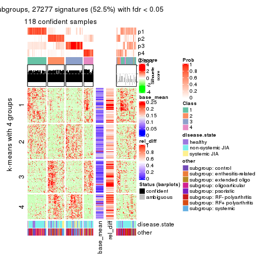</p>

</div>
<div id='tab-ATC-mclust-get-signatures-4'>
<pre><code class="r">get_signatures(res, k = 5)
</code></pre>

<p></p>

</div>
<div id='tab-ATC-mclust-get-signatures-5'>
<pre><code class="r">get_signatures(res, k = 6)
</code></pre>

<p></p>

</div>
</div>


Signature heatmaps where rows are not scaled:


<script>
$( function() {
	$( '#tabs-ATC-mclust-get-signatures-no-scale' ).tabs();
} );
</script>
<div id='tabs-ATC-mclust-get-signatures-no-scale'>
<ul>
<li><a href='#tab-ATC-mclust-get-signatures-no-scale-1'>k = 2</a></li>
<li><a href='#tab-ATC-mclust-get-signatures-no-scale-2'>k = 3</a></li>
<li><a href='#tab-ATC-mclust-get-signatures-no-scale-3'>k = 4</a></li>
<li><a href='#tab-ATC-mclust-get-signatures-no-scale-4'>k = 5</a></li>
<li><a href='#tab-ATC-mclust-get-signatures-no-scale-5'>k = 6</a></li>
</ul>
<div id='tab-ATC-mclust-get-signatures-no-scale-1'>
<pre><code class="r">get_signatures(res, k = 2, scale_rows = FALSE)
</code></pre>

<p></p>

</div>
<div id='tab-ATC-mclust-get-signatures-no-scale-2'>
<pre><code class="r">get_signatures(res, k = 3, scale_rows = FALSE)
</code></pre>

<p></p>

</div>
<div id='tab-ATC-mclust-get-signatures-no-scale-3'>
<pre><code class="r">get_signatures(res, k = 4, scale_rows = FALSE)
</code></pre>

<p></p>

</div>
<div id='tab-ATC-mclust-get-signatures-no-scale-4'>
<pre><code class="r">get_signatures(res, k = 5, scale_rows = FALSE)
</code></pre>

<p></p>

</div>
<div id='tab-ATC-mclust-get-signatures-no-scale-5'>
<pre><code class="r">get_signatures(res, k = 6, scale_rows = FALSE)
</code></pre>

<p></p>

</div>
</div>


Compare the overlap of signatures from different k:

```r
compare_signatures(res)
```


`get_signature()` returns a data frame invisibly. TO get the list of signatures, the function
call should be assigned to a variable explicitly. In following code, if `plot` argument is set
to `FALSE`, no heatmap is plotted while only the differential analysis is performed.

```r
# code only for demonstration
tb = get_signature(res, k = ..., plot = FALSE)
```

An example of the output of `tb` is:

```
#>   which_row         fdr    mean_1    mean_2 scaled_mean_1 scaled_mean_2 km
#> 1        38 0.042760348  8.373488  9.131774    -0.5533452     0.5164555  1
#> 2        40 0.018707592  7.106213  8.469186    -0.6173731     0.5762149  1
#> 3        55 0.019134737 10.221463 11.207825    -0.6159697     0.5749050  1
#> 4        59 0.006059896  5.921854  7.869574    -0.6899429     0.6439467  1
#> 5        60 0.018055526  8.928898 10.211722    -0.6204761     0.5791110  1
#> 6        98 0.009384629 15.714769 14.887706     0.6635654    -0.6193277  2
...
```

The columns in `tb` are:

1. `which_row`: row indices corresponding to the input matrix.
2. `fdr`: FDR for the differential test. 
3. `mean_x`: The mean value in group x.
4. `scaled_mean_x`: The mean value in group x after rows are scaled.
5. `km`: Row groups if k-means clustering is applied to rows.


UMAP plot which shows how samples are separated.


<script>
$( function() {
	$( '#tabs-ATC-mclust-dimension-reduction' ).tabs();
} );
</script>
<div id='tabs-ATC-mclust-dimension-reduction'>
<ul>
<li><a href='#tab-ATC-mclust-dimension-reduction-1'>k = 2</a></li>
<li><a href='#tab-ATC-mclust-dimension-reduction-2'>k = 3</a></li>
<li><a href='#tab-ATC-mclust-dimension-reduction-3'>k = 4</a></li>
<li><a href='#tab-ATC-mclust-dimension-reduction-4'>k = 5</a></li>
<li><a href='#tab-ATC-mclust-dimension-reduction-5'>k = 6</a></li>
</ul>
<div id='tab-ATC-mclust-dimension-reduction-1'>
<pre><code class="r">dimension_reduction(res, k = 2, method = &quot;UMAP&quot;)
</code></pre>

<p></p>

</div>
<div id='tab-ATC-mclust-dimension-reduction-2'>
<pre><code class="r">dimension_reduction(res, k = 3, method = &quot;UMAP&quot;)
</code></pre>

<p></p>

</div>
<div id='tab-ATC-mclust-dimension-reduction-3'>
<pre><code class="r">dimension_reduction(res, k = 4, method = &quot;UMAP&quot;)
</code></pre>

<p></p>

</div>
<div id='tab-ATC-mclust-dimension-reduction-4'>
<pre><code class="r">dimension_reduction(res, k = 5, method = &quot;UMAP&quot;)
</code></pre>

<p></p>

</div>
<div id='tab-ATC-mclust-dimension-reduction-5'>
<pre><code class="r">dimension_reduction(res, k = 6, method = &quot;UMAP&quot;)
</code></pre>

<p></p>

</div>
</div>


Following heatmap shows how subgroups are split when increasing `k`:

```r
collect_classes(res)
```


Test correlation between subgroups and known annotations. If the known
annotation is numeric, one-way ANOVA test is applied, and if the known
annotation is discrete, chi-squared contingency table test is applied.

```r
test_to_known_factors(res)
```

```
#>              n disease.state(p) other(p) k
#> ATC:mclust 141            0.866    0.576 2
#> ATC:mclust 141            0.644    0.306 3
#> ATC:mclust 118            0.696    0.698 4
#> ATC:mclust 112            0.557    0.400 5
#> ATC:mclust 121            0.424    0.109 6
```


If matrix rows can be associated to genes, consider to use `GO_Enrichment(res,
...)` to perform function enrichment for the signature genes.


 

---------------------------------------------------


### ATC:NMF


The object with results only for a single top-value method and a single partition method 
can be extracted as:

```r
res = res_list["ATC", "NMF"]
# you can also extract it by
# res = res_list["ATC:NMF"]
```

A summary of `res` and all the functions that can be applied to it:

```r
res
```

```
#> A 'ConsensusPartition' object with k = 2, 3, 4, 5, 6.
#>   On a matrix with 51941 rows and 154 columns.
#>   Top rows (1000, 2000, 3000, 4000, 5000) are extracted by 'ATC' method.
#>   Subgroups are detected by 'NMF' method.
#>   Performed in total 1250 partitions by row resampling.
#>   Best k for subgroups seems to be 3.
#> 
#> Following methods can be applied to this 'ConsensusPartition' object:
#>  [1] "cola_report"             "collect_classes"         "collect_plots"          
#>  [4] "collect_stats"           "colnames"                "compare_signatures"     
#>  [7] "consensus_heatmap"       "dimension_reduction"     "functional_enrichment"  
#> [10] "get_anno_col"            "get_anno"                "get_classes"            
#> [13] "get_consensus"           "get_matrix"              "get_membership"         
#> [16] "get_param"               "get_signatures"          "get_stats"              
#> [19] "is_best_k"               "is_stable_k"             "membership_heatmap"     
#> [22] "ncol"                    "nrow"                    "plot_ecdf"              
#> [25] "rownames"                "select_partition_number" "show"                   
#> [28] "suggest_best_k"          "test_to_known_factors"
```

`collect_plots()` function collects all the plots made from `res` for all `k` (number of partitions)
into one single page to provide an easy and fast comparison between different `k`.

```r
collect_plots(res)
```


The plots are:

- The first row: a plot of the ECDF (Empirical cumulative distribution
  function) curves of the consensus matrix for each `k` and the heatmap of
  predicted classes for each `k`.
- The second row: heatmaps of the consensus matrix for each `k`.
- The third row: heatmaps of the membership matrix for each `k`.
- The fouth row: heatmaps of the signatures for each `k`.

All the plots in panels can be made by individual functions and they are
plotted later in this section.

`select_partition_number()` produces several plots showing different
statistics for choosing "optimized" `k`. There are following statistics:

- ECDF curves of the consensus matrix for each `k`;
- 1-PAC. [The PAC
  score](https://en.wikipedia.org/wiki/Consensus_clustering#Over-interpretation_potential_of_consensus_clustering)
  measures the proportion of the ambiguous subgrouping.
- Mean silhouette score.
- Concordance. The mean probability of fiting the consensus class ids in all
  partitions.
- Area increased. Denote $A_k$ as the area under the ECDF curve for current
  `k`, the area increased is defined as $A_k - A_{k-1}$.
- Rand index. The percent of pairs of samples that are both in a same cluster
  or both are not in a same cluster in the partition of k and k-1.
- Jaccard index. The ratio of pairs of samples are both in a same cluster in
  the partition of k and k-1 and the pairs of samples are both in a same
  cluster in the partition k or k-1.

The detailed explanations of these statistics can be found in [the cola
vignette](http://bioconductor.org/packages/devel/bioc/vignettes/cola/inst/doc/cola.html#toc_13).

Generally speaking, lower PAC score, higher mean silhouette score or higher
concordance corresponds to better partition. Rand index and Jaccard index
measure how similar the current partition is compared to partition with `k-1`.
If they are too similar, we won't accept `k` is better than `k-1`.

```r
select_partition_number(res)
```


The numeric values for all these statistics can be obtained by `get_stats()`.

```r
get_stats(res)
```

```
#>   k 1-PAC mean_silhouette concordance area_increased  Rand Jaccard
#> 2 2 0.612           0.851       0.917         0.4902 0.502   0.502
#> 3 3 0.880           0.916       0.962         0.3599 0.743   0.529
#> 4 4 0.755           0.792       0.874         0.1177 0.866   0.627
#> 5 5 0.776           0.721       0.850         0.0636 0.897   0.628
#> 6 6 0.743           0.742       0.822         0.0322 0.971   0.864
```

`suggest_best_k()` suggests the best $k$ based on these statistics. The rules are as follows:

- All $k$ with Jaccard index larger than 0.95 are removed because the increase of
  the partition number does not provides enough extra information. If all $k$ are removed,
  the best $k$ is assigned by `NA`.
- For $k$ with 1-PAC larger than 0.9, the maximal $k$ is taken as the "best k". Other $k$ is called "optional k".
- If it does not fit the second rule. The $k$ with the highest vote of highest
  1-PAC, mean silhouette and concordance is taken as the "best k".

```r
suggest_best_k(res)
```

```
#> [1] 3
```


Following shows the table of the partitions (You need to click the **show/hide
code output** link to see it). The membership matrix (columns with name `p*`)
is inferred by
[`clue::cl_consensus()`](https://www.rdocumentation.org/link/cl_consensus?package=clue)
function with the `SE` method. Basically the value in the membership matrix
represents the probability to belong to a certain group. The finall class
label for an item is determined with the group with highest probability it
belongs to.

In `get_classes()` function, the entropy is calculated from the membership
matrix and the silhouette score is calculated from the consensus matrix.


<script>
$( function() {
	$( '#tabs-ATC-NMF-get-classes' ).tabs();
} );
</script>
<div id='tabs-ATC-NMF-get-classes'>
<ul>
<li><a href='#tab-ATC-NMF-get-classes-1'>k = 2</a></li>
<li><a href='#tab-ATC-NMF-get-classes-2'>k = 3</a></li>
<li><a href='#tab-ATC-NMF-get-classes-3'>k = 4</a></li>
<li><a href='#tab-ATC-NMF-get-classes-4'>k = 5</a></li>
<li><a href='#tab-ATC-NMF-get-classes-5'>k = 6</a></li>
</ul>

<div id='tab-ATC-NMF-get-classes-1'>
<p><a id='tab-ATC-NMF-get-classes-1-a' style='color:#0366d6' href='#'>show/hide code output</a></p>
<pre><code class="r">cbind(get_classes(res, k = 2), get_membership(res, k = 2))
</code></pre>

<pre><code>#&gt;           class entropy silhouette    p1    p2
#&gt; GSM340358     2  0.8763     0.6404 0.296 0.704
#&gt; GSM340359     1  0.9732     0.4190 0.596 0.404
#&gt; GSM340361     1  0.0000     0.9147 1.000 0.000
#&gt; GSM340362     1  0.0000     0.9147 1.000 0.000
#&gt; GSM340363     2  0.7528     0.7690 0.216 0.784
#&gt; GSM340364     1  0.9358     0.5277 0.648 0.352
#&gt; GSM340365     1  0.0000     0.9147 1.000 0.000
#&gt; GSM340366     1  0.0000     0.9147 1.000 0.000
#&gt; GSM340367     1  0.0000     0.9147 1.000 0.000
#&gt; GSM340368     2  0.0000     0.9063 0.000 1.000
#&gt; GSM340369     2  0.5408     0.8730 0.124 0.876
#&gt; GSM340370     1  0.9710     0.4283 0.600 0.400
#&gt; GSM340371     1  0.0938     0.9079 0.988 0.012
#&gt; GSM340372     1  0.0000     0.9147 1.000 0.000
#&gt; GSM340373     1  0.0000     0.9147 1.000 0.000
#&gt; GSM340375     1  0.8443     0.6346 0.728 0.272
#&gt; GSM340376     2  0.2603     0.9122 0.044 0.956
#&gt; GSM340378     2  0.2603     0.9122 0.044 0.956
#&gt; GSM340243     2  0.0376     0.9073 0.004 0.996
#&gt; GSM340244     2  0.2603     0.9122 0.044 0.956
#&gt; GSM340246     2  0.2603     0.9122 0.044 0.956
#&gt; GSM340247     2  0.0000     0.9063 0.000 1.000
#&gt; GSM340248     2  0.2603     0.9122 0.044 0.956
#&gt; GSM340249     2  0.0938     0.9095 0.012 0.988
#&gt; GSM340250     1  0.0000     0.9147 1.000 0.000
#&gt; GSM340251     2  0.0938     0.9095 0.012 0.988
#&gt; GSM340252     2  0.2603     0.9122 0.044 0.956
#&gt; GSM340253     1  0.9635     0.4547 0.612 0.388
#&gt; GSM340254     2  0.4161     0.8868 0.084 0.916
#&gt; GSM340256     2  0.2603     0.9122 0.044 0.956
#&gt; GSM340258     1  0.2603     0.8853 0.956 0.044
#&gt; GSM340259     1  0.0000     0.9147 1.000 0.000
#&gt; GSM340260     1  0.0000     0.9147 1.000 0.000
#&gt; GSM340261     2  0.5408     0.8730 0.124 0.876
#&gt; GSM340262     1  0.0000     0.9147 1.000 0.000
#&gt; GSM340263     2  0.2603     0.9122 0.044 0.956
#&gt; GSM340264     1  0.0000     0.9147 1.000 0.000
#&gt; GSM340265     1  0.0000     0.9147 1.000 0.000
#&gt; GSM340266     2  0.4562     0.8915 0.096 0.904
#&gt; GSM340267     1  0.6438     0.7697 0.836 0.164
#&gt; GSM340268     2  0.0376     0.9073 0.004 0.996
#&gt; GSM340269     1  0.8081     0.6526 0.752 0.248
#&gt; GSM340270     1  0.9963     0.0588 0.536 0.464
#&gt; GSM537574     2  0.2603     0.9122 0.044 0.956
#&gt; GSM537580     1  0.2603     0.8847 0.956 0.044
#&gt; GSM537581     2  0.4562     0.8915 0.096 0.904
#&gt; GSM340272     1  0.0000     0.9147 1.000 0.000
#&gt; GSM340273     2  0.2603     0.9122 0.044 0.956
#&gt; GSM340275     2  0.0000     0.9063 0.000 1.000
#&gt; GSM340276     1  0.7376     0.7317 0.792 0.208
#&gt; GSM340277     2  0.3879     0.8930 0.076 0.924
#&gt; GSM340278     2  0.4562     0.8915 0.096 0.904
#&gt; GSM340279     2  0.4815     0.8868 0.104 0.896
#&gt; GSM340282     1  0.0000     0.9147 1.000 0.000
#&gt; GSM340284     2  0.0938     0.9095 0.012 0.988
#&gt; GSM340285     2  0.8443     0.6829 0.272 0.728
#&gt; GSM340286     1  0.0000     0.9147 1.000 0.000
#&gt; GSM340287     2  0.2603     0.9122 0.044 0.956
#&gt; GSM340288     1  0.0000     0.9147 1.000 0.000
#&gt; GSM340289     1  0.0000     0.9147 1.000 0.000
#&gt; GSM340290     2  0.4690     0.8893 0.100 0.900
#&gt; GSM340291     2  0.2603     0.9122 0.044 0.956
#&gt; GSM340293     2  0.4562     0.8915 0.096 0.904
#&gt; GSM340294     2  0.4562     0.8915 0.096 0.904
#&gt; GSM340296     2  0.1184     0.9088 0.016 0.984
#&gt; GSM340297     2  0.4562     0.8915 0.096 0.904
#&gt; GSM340298     2  0.6148     0.8462 0.152 0.848
#&gt; GSM340299     1  0.0000     0.9147 1.000 0.000
#&gt; GSM340301     1  0.0000     0.9147 1.000 0.000
#&gt; GSM340303     1  0.0938     0.9080 0.988 0.012
#&gt; GSM340304     2  0.8555     0.7140 0.280 0.720
#&gt; GSM340306     1  0.9988    -0.0235 0.520 0.480
#&gt; GSM340307     2  0.2603     0.9122 0.044 0.956
#&gt; GSM340310     1  0.0000     0.9147 1.000 0.000
#&gt; GSM340314     2  0.5408     0.8730 0.124 0.876
#&gt; GSM340315     2  0.2603     0.9122 0.044 0.956
#&gt; GSM340317     2  0.2236     0.9122 0.036 0.964
#&gt; GSM340318     2  0.4562     0.8915 0.096 0.904
#&gt; GSM340319     2  0.4562     0.8915 0.096 0.904
#&gt; GSM340320     2  0.4562     0.8915 0.096 0.904
#&gt; GSM340321     2  0.2603     0.9122 0.044 0.956
#&gt; GSM340322     2  0.9608     0.4518 0.384 0.616
#&gt; GSM340324     2  0.2603     0.9122 0.044 0.956
#&gt; GSM340328     2  0.9686     0.4220 0.396 0.604
#&gt; GSM340330     1  0.2603     0.8847 0.956 0.044
#&gt; GSM340332     2  0.5408     0.8730 0.124 0.876
#&gt; GSM340333     1  0.9710     0.4283 0.600 0.400
#&gt; GSM340336     2  0.0000     0.9063 0.000 1.000
#&gt; GSM340337     2  0.8713     0.6478 0.292 0.708
#&gt; GSM340338     1  0.2603     0.8847 0.956 0.044
#&gt; GSM340339     2  0.5408     0.8730 0.124 0.876
#&gt; GSM340340     2  0.0376     0.9075 0.004 0.996
#&gt; GSM340341     2  0.1843     0.9119 0.028 0.972
#&gt; GSM340343     2  0.7674     0.7575 0.224 0.776
#&gt; GSM340344     1  0.6438     0.7696 0.836 0.164
#&gt; GSM340346     1  0.2043     0.8944 0.968 0.032
#&gt; GSM340347     2  0.4562     0.8915 0.096 0.904
#&gt; GSM340348     2  0.1184     0.9089 0.016 0.984
#&gt; GSM340349     1  0.0000     0.9147 1.000 0.000
#&gt; GSM340350     1  0.0000     0.9147 1.000 0.000
#&gt; GSM340351     1  0.0000     0.9147 1.000 0.000
#&gt; GSM340354     2  0.2603     0.9122 0.044 0.956
#&gt; GSM340356     2  0.2603     0.9122 0.044 0.956
#&gt; GSM340357     1  0.0000     0.9147 1.000 0.000
#&gt; GSM348183     1  0.0000     0.9147 1.000 0.000
#&gt; GSM348191     2  0.4562     0.8915 0.096 0.904
#&gt; GSM348193     1  0.8081     0.6234 0.752 0.248
#&gt; GSM537578     1  0.0000     0.9147 1.000 0.000
#&gt; GSM348181     1  0.3114     0.8809 0.944 0.056
#&gt; GSM348182     1  0.0000     0.9147 1.000 0.000
#&gt; GSM348184     2  0.1843     0.9119 0.028 0.972
#&gt; GSM348185     2  0.2603     0.9122 0.044 0.956
#&gt; GSM348186     2  0.2603     0.9122 0.044 0.956
#&gt; GSM348187     1  0.0376     0.9126 0.996 0.004
#&gt; GSM348188     1  0.0938     0.9080 0.988 0.012
#&gt; GSM348189     1  0.0938     0.9079 0.988 0.012
#&gt; GSM348190     1  0.0000     0.9147 1.000 0.000
#&gt; GSM348194     1  0.0000     0.9147 1.000 0.000
#&gt; GSM348195     1  0.0000     0.9147 1.000 0.000
#&gt; GSM348196     1  0.2043     0.8942 0.968 0.032
#&gt; GSM537585     1  0.0000     0.9147 1.000 0.000
#&gt; GSM537594     2  0.2603     0.9122 0.044 0.956
#&gt; GSM537596     1  0.0672     0.9104 0.992 0.008
#&gt; GSM537597     2  0.2603     0.9122 0.044 0.956
#&gt; GSM537602     1  0.0000     0.9147 1.000 0.000
#&gt; GSM340184     2  0.2603     0.9122 0.044 0.956
#&gt; GSM340185     2  0.2603     0.9122 0.044 0.956
#&gt; GSM340186     2  0.2603     0.9122 0.044 0.956
#&gt; GSM340187     2  0.0000     0.9063 0.000 1.000
#&gt; GSM340189     2  0.5408     0.8730 0.124 0.876
#&gt; GSM340190     2  0.0938     0.9095 0.012 0.988
#&gt; GSM340191     2  0.4562     0.8915 0.096 0.904
#&gt; GSM340192     1  0.9795     0.3894 0.584 0.416
#&gt; GSM340193     1  0.0000     0.9147 1.000 0.000
#&gt; GSM340194     1  0.0000     0.9147 1.000 0.000
#&gt; GSM340195     1  0.0000     0.9147 1.000 0.000
#&gt; GSM340196     2  0.4690     0.8893 0.100 0.900
#&gt; GSM340197     1  0.0000     0.9147 1.000 0.000
#&gt; GSM340198     2  0.2603     0.9122 0.044 0.956
#&gt; GSM340199     2  0.5408     0.8730 0.124 0.876
#&gt; GSM340200     2  0.2603     0.9122 0.044 0.956
#&gt; GSM340201     2  0.4562     0.8915 0.096 0.904
#&gt; GSM340202     2  0.2236     0.9076 0.036 0.964
#&gt; GSM340203     2  0.3584     0.9007 0.068 0.932
#&gt; GSM340204     1  0.8763     0.6218 0.704 0.296
#&gt; GSM340205     2  0.6048     0.8718 0.148 0.852
#&gt; GSM340206     2  0.0000     0.9063 0.000 1.000
#&gt; GSM340207     1  0.0000     0.9147 1.000 0.000
#&gt; GSM340237     2  0.2603     0.9122 0.044 0.956
#&gt; GSM340238     2  0.5408     0.8730 0.124 0.876
#&gt; GSM340239     1  0.0000     0.9147 1.000 0.000
#&gt; GSM340240     1  0.0000     0.9147 1.000 0.000
#&gt; GSM340241     2  0.2603     0.9122 0.044 0.956
#&gt; GSM340242     1  0.0938     0.9079 0.988 0.012
</code></pre>

<script>
$('#tab-ATC-NMF-get-classes-1-a').parent().next().next().hide();
$('#tab-ATC-NMF-get-classes-1-a').click(function(){
  $('#tab-ATC-NMF-get-classes-1-a').parent().next().next().toggle();
  return(false);
});
</script>
</div>

<div id='tab-ATC-NMF-get-classes-2'>
<p><a id='tab-ATC-NMF-get-classes-2-a' style='color:#0366d6' href='#'>show/hide code output</a></p>
<pre><code class="r">cbind(get_classes(res, k = 3), get_membership(res, k = 3))
</code></pre>

<pre><code>#&gt;           class entropy silhouette    p1    p2    p3
#&gt; GSM340358     1  0.0000      0.965 1.000 0.000 0.000
#&gt; GSM340359     2  0.0747      0.952 0.000 0.984 0.016
#&gt; GSM340361     3  0.0000      0.953 0.000 0.000 1.000
#&gt; GSM340362     3  0.0000      0.953 0.000 0.000 1.000
#&gt; GSM340363     1  0.0000      0.965 1.000 0.000 0.000
#&gt; GSM340364     2  0.1860      0.921 0.000 0.948 0.052
#&gt; GSM340365     3  0.0000      0.953 0.000 0.000 1.000
#&gt; GSM340366     3  0.0000      0.953 0.000 0.000 1.000
#&gt; GSM340367     3  0.0000      0.953 0.000 0.000 1.000
#&gt; GSM340368     1  0.1860      0.924 0.948 0.052 0.000
#&gt; GSM340369     1  0.0000      0.965 1.000 0.000 0.000
#&gt; GSM340370     2  0.5291      0.624 0.000 0.732 0.268
#&gt; GSM340371     3  0.4555      0.767 0.200 0.000 0.800
#&gt; GSM340372     3  0.0000      0.953 0.000 0.000 1.000
#&gt; GSM340373     3  0.0000      0.953 0.000 0.000 1.000
#&gt; GSM340375     3  0.5016      0.692 0.000 0.240 0.760
#&gt; GSM340376     2  0.0000      0.963 0.000 1.000 0.000
#&gt; GSM340378     2  0.0000      0.963 0.000 1.000 0.000
#&gt; GSM340243     1  0.2796      0.883 0.908 0.092 0.000
#&gt; GSM340244     2  0.0000      0.963 0.000 1.000 0.000
#&gt; GSM340246     2  0.0000      0.963 0.000 1.000 0.000
#&gt; GSM340247     1  0.0000      0.965 1.000 0.000 0.000
#&gt; GSM340248     2  0.0000      0.963 0.000 1.000 0.000
#&gt; GSM340249     2  0.0000      0.963 0.000 1.000 0.000
#&gt; GSM340250     3  0.0000      0.953 0.000 0.000 1.000
#&gt; GSM340251     2  0.0000      0.963 0.000 1.000 0.000
#&gt; GSM340252     2  0.0000      0.963 0.000 1.000 0.000
#&gt; GSM340253     2  0.5810      0.481 0.000 0.664 0.336
#&gt; GSM340254     2  0.0000      0.963 0.000 1.000 0.000
#&gt; GSM340256     2  0.0000      0.963 0.000 1.000 0.000
#&gt; GSM340258     3  0.1289      0.931 0.000 0.032 0.968
#&gt; GSM340259     3  0.0000      0.953 0.000 0.000 1.000
#&gt; GSM340260     3  0.0000      0.953 0.000 0.000 1.000
#&gt; GSM340261     1  0.0000      0.965 1.000 0.000 0.000
#&gt; GSM340262     3  0.0000      0.953 0.000 0.000 1.000
#&gt; GSM340263     2  0.0000      0.963 0.000 1.000 0.000
#&gt; GSM340264     3  0.0000      0.953 0.000 0.000 1.000
#&gt; GSM340265     3  0.0000      0.953 0.000 0.000 1.000
#&gt; GSM340266     1  0.0000      0.965 1.000 0.000 0.000
#&gt; GSM340267     3  0.3619      0.834 0.000 0.136 0.864
#&gt; GSM340268     1  0.0000      0.965 1.000 0.000 0.000
#&gt; GSM340269     3  0.2446      0.911 0.012 0.052 0.936
#&gt; GSM340270     3  0.4137      0.860 0.032 0.096 0.872
#&gt; GSM537574     2  0.0000      0.963 0.000 1.000 0.000
#&gt; GSM537580     1  0.0237      0.962 0.996 0.000 0.004
#&gt; GSM537581     1  0.0000      0.965 1.000 0.000 0.000
#&gt; GSM340272     3  0.0000      0.953 0.000 0.000 1.000
#&gt; GSM340273     2  0.0000      0.963 0.000 1.000 0.000
#&gt; GSM340275     2  0.4605      0.735 0.204 0.796 0.000
#&gt; GSM340276     1  0.4228      0.820 0.844 0.008 0.148
#&gt; GSM340277     2  0.0000      0.963 0.000 1.000 0.000
#&gt; GSM340278     1  0.0000      0.965 1.000 0.000 0.000
#&gt; GSM340279     1  0.0000      0.965 1.000 0.000 0.000
#&gt; GSM340282     3  0.0000      0.953 0.000 0.000 1.000
#&gt; GSM340284     2  0.0000      0.963 0.000 1.000 0.000
#&gt; GSM340285     1  0.0000      0.965 1.000 0.000 0.000
#&gt; GSM340286     3  0.0000      0.953 0.000 0.000 1.000
#&gt; GSM340287     2  0.4178      0.782 0.172 0.828 0.000
#&gt; GSM340288     3  0.0000      0.953 0.000 0.000 1.000
#&gt; GSM340289     3  0.0000      0.953 0.000 0.000 1.000
#&gt; GSM340290     1  0.0000      0.965 1.000 0.000 0.000
#&gt; GSM340291     2  0.0000      0.963 0.000 1.000 0.000
#&gt; GSM340293     1  0.0000      0.965 1.000 0.000 0.000
#&gt; GSM340294     1  0.0000      0.965 1.000 0.000 0.000
#&gt; GSM340296     1  0.2356      0.904 0.928 0.072 0.000
#&gt; GSM340297     1  0.0000      0.965 1.000 0.000 0.000
#&gt; GSM340298     1  0.0000      0.965 1.000 0.000 0.000
#&gt; GSM340299     3  0.0000      0.953 0.000 0.000 1.000
#&gt; GSM340301     3  0.0000      0.953 0.000 0.000 1.000
#&gt; GSM340303     3  0.0424      0.948 0.000 0.008 0.992
#&gt; GSM340304     3  0.4002      0.807 0.000 0.160 0.840
#&gt; GSM340306     1  0.0000      0.965 1.000 0.000 0.000
#&gt; GSM340307     2  0.0000      0.963 0.000 1.000 0.000
#&gt; GSM340310     3  0.0000      0.953 0.000 0.000 1.000
#&gt; GSM340314     1  0.0000      0.965 1.000 0.000 0.000
#&gt; GSM340315     2  0.0000      0.963 0.000 1.000 0.000
#&gt; GSM340317     2  0.0000      0.963 0.000 1.000 0.000
#&gt; GSM340318     1  0.0000      0.965 1.000 0.000 0.000
#&gt; GSM340319     1  0.0000      0.965 1.000 0.000 0.000
#&gt; GSM340320     1  0.0000      0.965 1.000 0.000 0.000
#&gt; GSM340321     2  0.0000      0.963 0.000 1.000 0.000
#&gt; GSM340322     1  0.0000      0.965 1.000 0.000 0.000
#&gt; GSM340324     2  0.0000      0.963 0.000 1.000 0.000
#&gt; GSM340328     1  0.1411      0.938 0.964 0.000 0.036
#&gt; GSM340330     1  0.1163      0.944 0.972 0.000 0.028
#&gt; GSM340332     1  0.0000      0.965 1.000 0.000 0.000
#&gt; GSM340333     2  0.0747      0.952 0.000 0.984 0.016
#&gt; GSM340336     1  0.5988      0.415 0.632 0.368 0.000
#&gt; GSM340337     1  0.0000      0.965 1.000 0.000 0.000
#&gt; GSM340338     3  0.3412      0.839 0.124 0.000 0.876
#&gt; GSM340339     1  0.0000      0.965 1.000 0.000 0.000
#&gt; GSM340340     2  0.6140      0.313 0.404 0.596 0.000
#&gt; GSM340341     2  0.0424      0.958 0.008 0.992 0.000
#&gt; GSM340343     1  0.0000      0.965 1.000 0.000 0.000
#&gt; GSM340344     3  0.4291      0.781 0.000 0.180 0.820
#&gt; GSM340346     3  0.3116      0.869 0.108 0.000 0.892
#&gt; GSM340347     1  0.0000      0.965 1.000 0.000 0.000
#&gt; GSM340348     1  0.4452      0.754 0.808 0.192 0.000
#&gt; GSM340349     3  0.0000      0.953 0.000 0.000 1.000
#&gt; GSM340350     3  0.0000      0.953 0.000 0.000 1.000
#&gt; GSM340351     3  0.0000      0.953 0.000 0.000 1.000
#&gt; GSM340354     2  0.0000      0.963 0.000 1.000 0.000
#&gt; GSM340356     2  0.0000      0.963 0.000 1.000 0.000
#&gt; GSM340357     3  0.0000      0.953 0.000 0.000 1.000
#&gt; GSM348183     3  0.0000      0.953 0.000 0.000 1.000
#&gt; GSM348191     1  0.0000      0.965 1.000 0.000 0.000
#&gt; GSM348193     3  0.5926      0.422 0.356 0.000 0.644
#&gt; GSM537578     3  0.0000      0.953 0.000 0.000 1.000
#&gt; GSM348181     1  0.5397      0.597 0.720 0.000 0.280
#&gt; GSM348182     3  0.0000      0.953 0.000 0.000 1.000
#&gt; GSM348184     2  0.0000      0.963 0.000 1.000 0.000
#&gt; GSM348185     2  0.0000      0.963 0.000 1.000 0.000
#&gt; GSM348186     2  0.0000      0.963 0.000 1.000 0.000
#&gt; GSM348187     3  0.0237      0.950 0.000 0.004 0.996
#&gt; GSM348188     3  0.0237      0.950 0.004 0.000 0.996
#&gt; GSM348189     3  0.4842      0.735 0.224 0.000 0.776
#&gt; GSM348190     3  0.0000      0.953 0.000 0.000 1.000
#&gt; GSM348194     3  0.0000      0.953 0.000 0.000 1.000
#&gt; GSM348195     3  0.0000      0.953 0.000 0.000 1.000
#&gt; GSM348196     3  0.1031      0.937 0.024 0.000 0.976
#&gt; GSM537585     3  0.0000      0.953 0.000 0.000 1.000
#&gt; GSM537594     2  0.0000      0.963 0.000 1.000 0.000
#&gt; GSM537596     3  0.0000      0.953 0.000 0.000 1.000
#&gt; GSM537597     2  0.0000      0.963 0.000 1.000 0.000
#&gt; GSM537602     3  0.0000      0.953 0.000 0.000 1.000
#&gt; GSM340184     2  0.1163      0.942 0.028 0.972 0.000
#&gt; GSM340185     2  0.0000      0.963 0.000 1.000 0.000
#&gt; GSM340186     2  0.0000      0.963 0.000 1.000 0.000
#&gt; GSM340187     1  0.1031      0.947 0.976 0.024 0.000
#&gt; GSM340189     1  0.0000      0.965 1.000 0.000 0.000
#&gt; GSM340190     2  0.1031      0.946 0.024 0.976 0.000
#&gt; GSM340191     1  0.0000      0.965 1.000 0.000 0.000
#&gt; GSM340192     2  0.1289      0.939 0.000 0.968 0.032
#&gt; GSM340193     3  0.0000      0.953 0.000 0.000 1.000
#&gt; GSM340194     3  0.0000      0.953 0.000 0.000 1.000
#&gt; GSM340195     3  0.0000      0.953 0.000 0.000 1.000
#&gt; GSM340196     1  0.0000      0.965 1.000 0.000 0.000
#&gt; GSM340197     3  0.0000      0.953 0.000 0.000 1.000
#&gt; GSM340198     2  0.0000      0.963 0.000 1.000 0.000
#&gt; GSM340199     1  0.0000      0.965 1.000 0.000 0.000
#&gt; GSM340200     2  0.0000      0.963 0.000 1.000 0.000
#&gt; GSM340201     1  0.0000      0.965 1.000 0.000 0.000
#&gt; GSM340202     1  0.0000      0.965 1.000 0.000 0.000
#&gt; GSM340203     1  0.0000      0.965 1.000 0.000 0.000
#&gt; GSM340204     3  0.6244      0.228 0.000 0.440 0.560
#&gt; GSM340205     1  0.7227      0.654 0.704 0.200 0.096
#&gt; GSM340206     1  0.0000      0.965 1.000 0.000 0.000
#&gt; GSM340207     3  0.0000      0.953 0.000 0.000 1.000
#&gt; GSM340237     2  0.0000      0.963 0.000 1.000 0.000
#&gt; GSM340238     1  0.0000      0.965 1.000 0.000 0.000
#&gt; GSM340239     3  0.0000      0.953 0.000 0.000 1.000
#&gt; GSM340240     3  0.0000      0.953 0.000 0.000 1.000
#&gt; GSM340241     2  0.0000      0.963 0.000 1.000 0.000
#&gt; GSM340242     3  0.4702      0.751 0.212 0.000 0.788
</code></pre>

<script>
$('#tab-ATC-NMF-get-classes-2-a').parent().next().next().hide();
$('#tab-ATC-NMF-get-classes-2-a').click(function(){
  $('#tab-ATC-NMF-get-classes-2-a').parent().next().next().toggle();
  return(false);
});
</script>
</div>

<div id='tab-ATC-NMF-get-classes-3'>
<p><a id='tab-ATC-NMF-get-classes-3-a' style='color:#0366d6' href='#'>show/hide code output</a></p>
<pre><code class="r">cbind(get_classes(res, k = 4), get_membership(res, k = 4))
</code></pre>

<pre><code>#&gt;           class entropy silhouette    p1    p2    p3    p4
#&gt; GSM340358     4  0.4679     0.4013 0.352 0.000 0.000 0.648
#&gt; GSM340359     2  0.0804     0.8897 0.008 0.980 0.012 0.000
#&gt; GSM340361     1  0.4356     0.4288 0.708 0.000 0.292 0.000
#&gt; GSM340362     3  0.3764     0.8850 0.216 0.000 0.784 0.000
#&gt; GSM340363     4  0.0469     0.9000 0.012 0.000 0.000 0.988
#&gt; GSM340364     2  0.4936     0.3870 0.372 0.624 0.004 0.000
#&gt; GSM340365     3  0.4008     0.8663 0.244 0.000 0.756 0.000
#&gt; GSM340366     3  0.3764     0.8850 0.216 0.000 0.784 0.000
#&gt; GSM340367     1  0.0188     0.8603 0.996 0.000 0.004 0.000
#&gt; GSM340368     4  0.2216     0.8393 0.000 0.092 0.000 0.908
#&gt; GSM340369     4  0.0000     0.9036 0.000 0.000 0.000 1.000
#&gt; GSM340370     1  0.3300     0.7497 0.848 0.144 0.008 0.000
#&gt; GSM340371     3  0.4755     0.6562 0.040 0.000 0.760 0.200
#&gt; GSM340372     1  0.0707     0.8573 0.980 0.000 0.020 0.000
#&gt; GSM340373     1  0.2216     0.8001 0.908 0.000 0.092 0.000
#&gt; GSM340375     2  0.7576     0.1596 0.308 0.472 0.220 0.000
#&gt; GSM340376     1  0.6324     0.3339 0.572 0.356 0.072 0.000
#&gt; GSM340378     2  0.0000     0.8938 0.000 1.000 0.000 0.000
#&gt; GSM340243     1  0.7198     0.1939 0.488 0.028 0.068 0.416
#&gt; GSM340244     2  0.0000     0.8938 0.000 1.000 0.000 0.000
#&gt; GSM340246     2  0.0000     0.8938 0.000 1.000 0.000 0.000
#&gt; GSM340247     4  0.0000     0.9036 0.000 0.000 0.000 1.000
#&gt; GSM340248     2  0.0921     0.8907 0.000 0.972 0.028 0.000
#&gt; GSM340249     2  0.0000     0.8938 0.000 1.000 0.000 0.000
#&gt; GSM340250     3  0.4250     0.8398 0.276 0.000 0.724 0.000
#&gt; GSM340251     2  0.0707     0.8923 0.000 0.980 0.020 0.000
#&gt; GSM340252     2  0.0469     0.8933 0.000 0.988 0.012 0.000
#&gt; GSM340253     2  0.6434     0.0681 0.068 0.500 0.432 0.000
#&gt; GSM340254     2  0.0336     0.8931 0.000 0.992 0.008 0.000
#&gt; GSM340256     2  0.0336     0.8931 0.000 0.992 0.008 0.000
#&gt; GSM340258     3  0.2944     0.8241 0.128 0.004 0.868 0.000
#&gt; GSM340259     1  0.2081     0.8097 0.916 0.000 0.084 0.000
#&gt; GSM340260     3  0.4746     0.7147 0.368 0.000 0.632 0.000
#&gt; GSM340261     4  0.2081     0.8940 0.000 0.000 0.084 0.916
#&gt; GSM340262     3  0.3726     0.8844 0.212 0.000 0.788 0.000
#&gt; GSM340263     2  0.0000     0.8938 0.000 1.000 0.000 0.000
#&gt; GSM340264     3  0.3873     0.8799 0.228 0.000 0.772 0.000
#&gt; GSM340265     3  0.3610     0.8811 0.200 0.000 0.800 0.000
#&gt; GSM340266     4  0.2473     0.8937 0.012 0.000 0.080 0.908
#&gt; GSM340267     3  0.4362     0.7766 0.088 0.096 0.816 0.000
#&gt; GSM340268     4  0.2216     0.8929 0.000 0.000 0.092 0.908
#&gt; GSM340269     3  0.3940     0.6235 0.012 0.028 0.844 0.116
#&gt; GSM340270     1  0.1854     0.8498 0.948 0.024 0.020 0.008
#&gt; GSM537574     2  0.0921     0.8883 0.000 0.972 0.028 0.000
#&gt; GSM537580     4  0.4713     0.5397 0.000 0.000 0.360 0.640
#&gt; GSM537581     4  0.0188     0.9030 0.000 0.000 0.004 0.996
#&gt; GSM340272     3  0.3764     0.8850 0.216 0.000 0.784 0.000
#&gt; GSM340273     2  0.0000     0.8938 0.000 1.000 0.000 0.000
#&gt; GSM340275     2  0.3649     0.7249 0.000 0.796 0.000 0.204
#&gt; GSM340276     1  0.4322     0.7347 0.804 0.000 0.044 0.152
#&gt; GSM340277     2  0.0336     0.8931 0.000 0.992 0.008 0.000
#&gt; GSM340278     4  0.2053     0.8974 0.004 0.000 0.072 0.924
#&gt; GSM340279     4  0.3160     0.8821 0.020 0.000 0.108 0.872
#&gt; GSM340282     3  0.3837     0.8815 0.224 0.000 0.776 0.000
#&gt; GSM340284     2  0.1022     0.8896 0.000 0.968 0.032 0.000
#&gt; GSM340285     4  0.0524     0.9028 0.008 0.000 0.004 0.988
#&gt; GSM340286     3  0.3764     0.8850 0.216 0.000 0.784 0.000
#&gt; GSM340287     2  0.6779     0.3893 0.324 0.560 0.116 0.000
#&gt; GSM340288     1  0.0592     0.8589 0.984 0.000 0.016 0.000
#&gt; GSM340289     1  0.0469     0.8598 0.988 0.000 0.012 0.000
#&gt; GSM340290     4  0.2546     0.8922 0.008 0.000 0.092 0.900
#&gt; GSM340291     2  0.0000     0.8938 0.000 1.000 0.000 0.000
#&gt; GSM340293     4  0.2011     0.8952 0.000 0.000 0.080 0.920
#&gt; GSM340294     4  0.2530     0.8886 0.004 0.000 0.100 0.896
#&gt; GSM340296     4  0.5835     0.7813 0.088 0.024 0.148 0.740
#&gt; GSM340297     4  0.2266     0.8945 0.004 0.000 0.084 0.912
#&gt; GSM340298     4  0.2081     0.8940 0.000 0.000 0.084 0.916
#&gt; GSM340299     3  0.3764     0.8850 0.216 0.000 0.784 0.000
#&gt; GSM340301     3  0.3764     0.8850 0.216 0.000 0.784 0.000
#&gt; GSM340303     3  0.4663     0.8393 0.148 0.064 0.788 0.000
#&gt; GSM340304     1  0.3084     0.8158 0.896 0.028 0.064 0.012
#&gt; GSM340306     4  0.0000     0.9036 0.000 0.000 0.000 1.000
#&gt; GSM340307     2  0.1118     0.8894 0.000 0.964 0.036 0.000
#&gt; GSM340310     1  0.0000     0.8599 1.000 0.000 0.000 0.000
#&gt; GSM340314     4  0.2011     0.8952 0.000 0.000 0.080 0.920
#&gt; GSM340315     2  0.3577     0.8098 0.012 0.832 0.156 0.000
#&gt; GSM340317     2  0.0000     0.8938 0.000 1.000 0.000 0.000
#&gt; GSM340318     4  0.0000     0.9036 0.000 0.000 0.000 1.000
#&gt; GSM340319     4  0.0000     0.9036 0.000 0.000 0.000 1.000
#&gt; GSM340320     4  0.0000     0.9036 0.000 0.000 0.000 1.000
#&gt; GSM340321     2  0.0000     0.8938 0.000 1.000 0.000 0.000
#&gt; GSM340322     4  0.0817     0.8989 0.000 0.000 0.024 0.976
#&gt; GSM340324     2  0.0000     0.8938 0.000 1.000 0.000 0.000
#&gt; GSM340328     1  0.3801     0.6962 0.780 0.000 0.000 0.220
#&gt; GSM340330     4  0.5147     0.3045 0.004 0.000 0.460 0.536
#&gt; GSM340332     4  0.1118     0.9025 0.000 0.000 0.036 0.964
#&gt; GSM340333     2  0.4086     0.6864 0.008 0.776 0.216 0.000
#&gt; GSM340336     4  0.4905     0.3644 0.000 0.364 0.004 0.632
#&gt; GSM340337     4  0.0000     0.9036 0.000 0.000 0.000 1.000
#&gt; GSM340338     3  0.4245     0.7829 0.116 0.000 0.820 0.064
#&gt; GSM340339     4  0.0000     0.9036 0.000 0.000 0.000 1.000
#&gt; GSM340340     2  0.4981     0.1602 0.000 0.536 0.000 0.464
#&gt; GSM340341     2  0.1042     0.8921 0.000 0.972 0.020 0.008
#&gt; GSM340343     4  0.0000     0.9036 0.000 0.000 0.000 1.000
#&gt; GSM340344     3  0.6204     0.7380 0.168 0.160 0.672 0.000
#&gt; GSM340346     3  0.4824     0.7126 0.076 0.000 0.780 0.144
#&gt; GSM340347     4  0.0000     0.9036 0.000 0.000 0.000 1.000
#&gt; GSM340348     4  0.4939     0.7573 0.020 0.112 0.068 0.800
#&gt; GSM340349     1  0.0469     0.8598 0.988 0.000 0.012 0.000
#&gt; GSM340350     1  0.0000     0.8599 1.000 0.000 0.000 0.000
#&gt; GSM340351     1  0.0707     0.8573 0.980 0.000 0.020 0.000
#&gt; GSM340354     2  0.3249     0.8340 0.008 0.852 0.140 0.000
#&gt; GSM340356     2  0.0000     0.8938 0.000 1.000 0.000 0.000
#&gt; GSM340357     1  0.0188     0.8603 0.996 0.000 0.004 0.000
#&gt; GSM348183     1  0.0469     0.8598 0.988 0.000 0.012 0.000
#&gt; GSM348191     4  0.2973     0.8868 0.020 0.000 0.096 0.884
#&gt; GSM348193     1  0.2611     0.8039 0.896 0.000 0.008 0.096
#&gt; GSM537578     1  0.2011     0.8142 0.920 0.000 0.080 0.000
#&gt; GSM348181     1  0.4039     0.7480 0.836 0.000 0.080 0.084
#&gt; GSM348182     1  0.0707     0.8573 0.980 0.000 0.020 0.000
#&gt; GSM348184     2  0.0921     0.8908 0.000 0.972 0.028 0.000
#&gt; GSM348185     2  0.0000     0.8938 0.000 1.000 0.000 0.000
#&gt; GSM348186     2  0.1022     0.8911 0.000 0.968 0.032 0.000
#&gt; GSM348187     1  0.1389     0.8450 0.952 0.000 0.048 0.000
#&gt; GSM348188     4  0.7554    -0.1993 0.192 0.000 0.376 0.432
#&gt; GSM348189     3  0.4839     0.6614 0.044 0.000 0.756 0.200
#&gt; GSM348190     3  0.3764     0.8850 0.216 0.000 0.784 0.000
#&gt; GSM348194     1  0.0469     0.8598 0.988 0.000 0.012 0.000
#&gt; GSM348195     1  0.1389     0.8399 0.952 0.000 0.048 0.000
#&gt; GSM348196     1  0.0927     0.8590 0.976 0.000 0.008 0.016
#&gt; GSM537585     1  0.4877    -0.1434 0.592 0.000 0.408 0.000
#&gt; GSM537594     2  0.0000     0.8938 0.000 1.000 0.000 0.000
#&gt; GSM537596     1  0.1716     0.8389 0.936 0.000 0.064 0.000
#&gt; GSM537597     2  0.2255     0.8534 0.012 0.920 0.068 0.000
#&gt; GSM537602     1  0.1118     0.8507 0.964 0.000 0.036 0.000
#&gt; GSM340184     2  0.4303     0.7811 0.020 0.792 0.184 0.004
#&gt; GSM340185     2  0.1118     0.8894 0.000 0.964 0.036 0.000
#&gt; GSM340186     2  0.1118     0.8894 0.000 0.964 0.036 0.000
#&gt; GSM340187     4  0.2796     0.8603 0.000 0.016 0.092 0.892
#&gt; GSM340189     4  0.0000     0.9036 0.000 0.000 0.000 1.000
#&gt; GSM340190     2  0.2222     0.8700 0.000 0.924 0.060 0.016
#&gt; GSM340191     4  0.2011     0.8952 0.000 0.000 0.080 0.920
#&gt; GSM340192     2  0.5407     0.1570 0.012 0.504 0.484 0.000
#&gt; GSM340193     1  0.0592     0.8589 0.984 0.000 0.016 0.000
#&gt; GSM340194     3  0.3726     0.8844 0.212 0.000 0.788 0.000
#&gt; GSM340195     3  0.3801     0.8835 0.220 0.000 0.780 0.000
#&gt; GSM340196     4  0.0000     0.9036 0.000 0.000 0.000 1.000
#&gt; GSM340197     3  0.3837     0.8811 0.224 0.000 0.776 0.000
#&gt; GSM340198     2  0.1211     0.8888 0.000 0.960 0.040 0.000
#&gt; GSM340199     4  0.2011     0.8952 0.000 0.000 0.080 0.920
#&gt; GSM340200     2  0.1211     0.8888 0.000 0.960 0.040 0.000
#&gt; GSM340201     4  0.0000     0.9036 0.000 0.000 0.000 1.000
#&gt; GSM340202     4  0.0188     0.9031 0.000 0.000 0.004 0.996
#&gt; GSM340203     4  0.0000     0.9036 0.000 0.000 0.000 1.000
#&gt; GSM340204     2  0.6716     0.1042 0.092 0.504 0.404 0.000
#&gt; GSM340205     1  0.4664     0.7503 0.808 0.020 0.132 0.040
#&gt; GSM340206     4  0.2773     0.8834 0.004 0.000 0.116 0.880
#&gt; GSM340207     3  0.3528     0.8774 0.192 0.000 0.808 0.000
#&gt; GSM340237     2  0.0000     0.8938 0.000 1.000 0.000 0.000
#&gt; GSM340238     4  0.2011     0.8952 0.000 0.000 0.080 0.920
#&gt; GSM340239     3  0.3907     0.8756 0.232 0.000 0.768 0.000
#&gt; GSM340240     3  0.3764     0.8850 0.216 0.000 0.784 0.000
#&gt; GSM340241     2  0.1211     0.8888 0.000 0.960 0.040 0.000
#&gt; GSM340242     3  0.4755     0.6562 0.040 0.000 0.760 0.200
</code></pre>

<script>
$('#tab-ATC-NMF-get-classes-3-a').parent().next().next().hide();
$('#tab-ATC-NMF-get-classes-3-a').click(function(){
  $('#tab-ATC-NMF-get-classes-3-a').parent().next().next().toggle();
  return(false);
});
</script>
</div>

<div id='tab-ATC-NMF-get-classes-4'>
<p><a id='tab-ATC-NMF-get-classes-4-a' style='color:#0366d6' href='#'>show/hide code output</a></p>
<pre><code class="r">cbind(get_classes(res, k = 5), get_membership(res, k = 5))
</code></pre>

<pre><code>#&gt;           class entropy silhouette    p1    p2    p3    p4    p5
#&gt; GSM340358     4  0.3752     0.4636 0.292 0.000 0.000 0.708 0.000
#&gt; GSM340359     2  0.2448     0.8707 0.000 0.892 0.088 0.000 0.020
#&gt; GSM340361     1  0.4307     0.0846 0.504 0.000 0.000 0.000 0.496
#&gt; GSM340362     5  0.0162     0.8618 0.004 0.000 0.000 0.000 0.996
#&gt; GSM340363     4  0.0880     0.7562 0.032 0.000 0.000 0.968 0.000
#&gt; GSM340364     2  0.5644     0.4095 0.328 0.576 0.096 0.000 0.000
#&gt; GSM340365     5  0.0703     0.8578 0.024 0.000 0.000 0.000 0.976
#&gt; GSM340366     5  0.0290     0.8627 0.008 0.000 0.000 0.000 0.992
#&gt; GSM340367     1  0.0000     0.9236 1.000 0.000 0.000 0.000 0.000
#&gt; GSM340368     4  0.3081     0.6013 0.000 0.156 0.012 0.832 0.000
#&gt; GSM340369     4  0.0000     0.7770 0.000 0.000 0.000 1.000 0.000
#&gt; GSM340370     1  0.1106     0.9169 0.964 0.012 0.024 0.000 0.000
#&gt; GSM340371     3  0.6363     0.5578 0.000 0.000 0.504 0.192 0.304
#&gt; GSM340372     1  0.0510     0.9240 0.984 0.000 0.000 0.000 0.016
#&gt; GSM340373     1  0.1608     0.8936 0.928 0.000 0.000 0.000 0.072
#&gt; GSM340375     2  0.5635     0.4596 0.128 0.620 0.000 0.000 0.252
#&gt; GSM340376     1  0.6222     0.4739 0.548 0.216 0.236 0.000 0.000
#&gt; GSM340378     2  0.1282     0.9017 0.004 0.952 0.044 0.000 0.000
#&gt; GSM340243     1  0.6098     0.4542 0.568 0.000 0.196 0.236 0.000
#&gt; GSM340244     2  0.0510     0.9091 0.000 0.984 0.016 0.000 0.000
#&gt; GSM340246     2  0.0162     0.9089 0.000 0.996 0.004 0.000 0.000
#&gt; GSM340247     4  0.0000     0.7770 0.000 0.000 0.000 1.000 0.000
#&gt; GSM340248     2  0.0794     0.9058 0.000 0.972 0.028 0.000 0.000
#&gt; GSM340249     2  0.0510     0.9095 0.000 0.984 0.016 0.000 0.000
#&gt; GSM340250     5  0.1608     0.8281 0.072 0.000 0.000 0.000 0.928
#&gt; GSM340251     2  0.0880     0.9059 0.000 0.968 0.032 0.000 0.000
#&gt; GSM340252     2  0.1892     0.8913 0.000 0.916 0.080 0.000 0.004
#&gt; GSM340253     5  0.5504     0.0902 0.000 0.448 0.064 0.000 0.488
#&gt; GSM340254     2  0.1502     0.8959 0.000 0.940 0.056 0.000 0.004
#&gt; GSM340256     2  0.1544     0.8934 0.000 0.932 0.068 0.000 0.000
#&gt; GSM340258     5  0.4400     0.6385 0.020 0.000 0.308 0.000 0.672
#&gt; GSM340259     1  0.2516     0.8308 0.860 0.000 0.000 0.000 0.140
#&gt; GSM340260     5  0.5013     0.6211 0.232 0.000 0.084 0.000 0.684
#&gt; GSM340261     3  0.4101     0.6606 0.000 0.000 0.628 0.372 0.000
#&gt; GSM340262     5  0.0290     0.8627 0.008 0.000 0.000 0.000 0.992
#&gt; GSM340263     2  0.0510     0.9091 0.000 0.984 0.016 0.000 0.000
#&gt; GSM340264     5  0.0898     0.8585 0.020 0.000 0.008 0.000 0.972
#&gt; GSM340265     5  0.0613     0.8584 0.004 0.008 0.004 0.000 0.984
#&gt; GSM340266     3  0.4455     0.6348 0.008 0.000 0.588 0.404 0.000
#&gt; GSM340267     5  0.4588     0.6889 0.000 0.116 0.136 0.000 0.748
#&gt; GSM340268     3  0.4210     0.6333 0.000 0.000 0.588 0.412 0.000
#&gt; GSM340269     3  0.3211     0.5725 0.008 0.012 0.848 0.004 0.128
#&gt; GSM340270     1  0.1121     0.9151 0.956 0.000 0.044 0.000 0.000
#&gt; GSM537574     2  0.0703     0.9064 0.000 0.976 0.024 0.000 0.000
#&gt; GSM537580     3  0.5523     0.6608 0.000 0.000 0.592 0.320 0.088
#&gt; GSM537581     4  0.0451     0.7716 0.000 0.000 0.008 0.988 0.004
#&gt; GSM340272     5  0.0290     0.8624 0.008 0.000 0.000 0.000 0.992
#&gt; GSM340273     2  0.0290     0.9091 0.000 0.992 0.008 0.000 0.000
#&gt; GSM340275     2  0.4565     0.3172 0.000 0.580 0.012 0.408 0.000
#&gt; GSM340276     1  0.0510     0.9212 0.984 0.000 0.016 0.000 0.000
#&gt; GSM340277     2  0.1410     0.8950 0.000 0.940 0.060 0.000 0.000
#&gt; GSM340278     4  0.4450    -0.5125 0.004 0.000 0.488 0.508 0.000
#&gt; GSM340279     3  0.3932     0.6735 0.000 0.000 0.672 0.328 0.000
#&gt; GSM340282     5  0.0290     0.8627 0.008 0.000 0.000 0.000 0.992
#&gt; GSM340284     2  0.1608     0.8884 0.000 0.928 0.072 0.000 0.000
#&gt; GSM340285     4  0.1195     0.7508 0.028 0.000 0.012 0.960 0.000
#&gt; GSM340286     5  0.0404     0.8626 0.012 0.000 0.000 0.000 0.988
#&gt; GSM340287     3  0.4269     0.4413 0.016 0.300 0.684 0.000 0.000
#&gt; GSM340288     1  0.0510     0.9240 0.984 0.000 0.000 0.000 0.016
#&gt; GSM340289     1  0.0510     0.9240 0.984 0.000 0.000 0.000 0.016
#&gt; GSM340290     3  0.4649     0.6325 0.016 0.000 0.580 0.404 0.000
#&gt; GSM340291     2  0.0162     0.9085 0.000 0.996 0.004 0.000 0.000
#&gt; GSM340293     4  0.4305    -0.5087 0.000 0.000 0.488 0.512 0.000
#&gt; GSM340294     3  0.4015     0.6708 0.000 0.000 0.652 0.348 0.000
#&gt; GSM340296     3  0.3531     0.5911 0.036 0.000 0.816 0.148 0.000
#&gt; GSM340297     3  0.4533     0.5869 0.008 0.000 0.544 0.448 0.000
#&gt; GSM340298     3  0.4225     0.6645 0.004 0.000 0.632 0.364 0.000
#&gt; GSM340299     5  0.0290     0.8627 0.008 0.000 0.000 0.000 0.992
#&gt; GSM340301     5  0.0162     0.8618 0.004 0.000 0.000 0.000 0.996
#&gt; GSM340303     5  0.1124     0.8403 0.000 0.036 0.004 0.000 0.960
#&gt; GSM340304     1  0.2329     0.8716 0.876 0.000 0.124 0.000 0.000
#&gt; GSM340306     4  0.0000     0.7770 0.000 0.000 0.000 1.000 0.000
#&gt; GSM340307     2  0.1121     0.9012 0.000 0.956 0.044 0.000 0.000
#&gt; GSM340310     1  0.0162     0.9236 0.996 0.000 0.004 0.000 0.000
#&gt; GSM340314     4  0.4291    -0.4559 0.000 0.000 0.464 0.536 0.000
#&gt; GSM340315     3  0.4630     0.0211 0.016 0.396 0.588 0.000 0.000
#&gt; GSM340317     2  0.0290     0.9091 0.000 0.992 0.008 0.000 0.000
#&gt; GSM340318     4  0.0000     0.7770 0.000 0.000 0.000 1.000 0.000
#&gt; GSM340319     4  0.0000     0.7770 0.000 0.000 0.000 1.000 0.000
#&gt; GSM340320     4  0.0000     0.7770 0.000 0.000 0.000 1.000 0.000
#&gt; GSM340321     2  0.0290     0.9093 0.000 0.992 0.008 0.000 0.000
#&gt; GSM340322     4  0.1544     0.7160 0.000 0.000 0.068 0.932 0.000
#&gt; GSM340324     2  0.1608     0.8922 0.000 0.928 0.072 0.000 0.000
#&gt; GSM340328     1  0.1831     0.8786 0.920 0.000 0.000 0.076 0.004
#&gt; GSM340330     3  0.5703     0.6479 0.000 0.000 0.628 0.188 0.184
#&gt; GSM340332     4  0.3143     0.4272 0.000 0.000 0.204 0.796 0.000
#&gt; GSM340333     2  0.5218     0.4504 0.000 0.624 0.068 0.000 0.308
#&gt; GSM340336     4  0.4173     0.4259 0.000 0.300 0.012 0.688 0.000
#&gt; GSM340337     4  0.0162     0.7747 0.000 0.000 0.004 0.996 0.000
#&gt; GSM340338     3  0.4562     0.1380 0.008 0.000 0.500 0.000 0.492
#&gt; GSM340339     4  0.0000     0.7770 0.000 0.000 0.000 1.000 0.000
#&gt; GSM340340     4  0.4798     0.0709 0.000 0.440 0.020 0.540 0.000
#&gt; GSM340341     2  0.1670     0.8859 0.000 0.936 0.012 0.052 0.000
#&gt; GSM340343     4  0.0162     0.7750 0.004 0.000 0.000 0.996 0.000
#&gt; GSM340344     5  0.4151     0.7110 0.004 0.152 0.060 0.000 0.784
#&gt; GSM340346     3  0.6170     0.6176 0.036 0.000 0.632 0.120 0.212
#&gt; GSM340347     4  0.0000     0.7770 0.000 0.000 0.000 1.000 0.000
#&gt; GSM340348     4  0.3648     0.6023 0.016 0.004 0.188 0.792 0.000
#&gt; GSM340349     1  0.0992     0.9215 0.968 0.000 0.008 0.000 0.024
#&gt; GSM340350     1  0.0162     0.9242 0.996 0.000 0.000 0.000 0.004
#&gt; GSM340351     1  0.0609     0.9233 0.980 0.000 0.000 0.000 0.020
#&gt; GSM340354     2  0.4196     0.5844 0.000 0.640 0.356 0.000 0.004
#&gt; GSM340356     2  0.0609     0.9092 0.000 0.980 0.020 0.000 0.000
#&gt; GSM340357     1  0.0451     0.9252 0.988 0.000 0.004 0.000 0.008
#&gt; GSM348183     1  0.0771     0.9238 0.976 0.000 0.004 0.000 0.020
#&gt; GSM348191     3  0.4348     0.6741 0.016 0.000 0.668 0.316 0.000
#&gt; GSM348193     1  0.0955     0.9201 0.968 0.000 0.028 0.000 0.004
#&gt; GSM537578     1  0.2763     0.8205 0.848 0.000 0.004 0.000 0.148
#&gt; GSM348181     1  0.0404     0.9228 0.988 0.000 0.012 0.000 0.000
#&gt; GSM348182     1  0.1043     0.9162 0.960 0.000 0.000 0.000 0.040
#&gt; GSM348184     2  0.0794     0.9058 0.000 0.972 0.028 0.000 0.000
#&gt; GSM348185     2  0.0510     0.9091 0.000 0.984 0.016 0.000 0.000
#&gt; GSM348186     2  0.1270     0.9013 0.000 0.948 0.052 0.000 0.000
#&gt; GSM348187     1  0.0510     0.9215 0.984 0.000 0.016 0.000 0.000
#&gt; GSM348188     4  0.5014     0.1378 0.032 0.000 0.000 0.536 0.432
#&gt; GSM348189     3  0.6530     0.4634 0.000 0.000 0.440 0.200 0.360
#&gt; GSM348190     5  0.0404     0.8626 0.012 0.000 0.000 0.000 0.988
#&gt; GSM348194     1  0.0404     0.9243 0.988 0.000 0.000 0.000 0.012
#&gt; GSM348195     1  0.0880     0.9190 0.968 0.000 0.000 0.000 0.032
#&gt; GSM348196     1  0.0000     0.9236 1.000 0.000 0.000 0.000 0.000
#&gt; GSM537585     5  0.5928     0.3720 0.328 0.000 0.124 0.000 0.548
#&gt; GSM537594     2  0.0404     0.9097 0.000 0.988 0.012 0.000 0.000
#&gt; GSM537596     1  0.0693     0.9245 0.980 0.000 0.008 0.000 0.012
#&gt; GSM537597     2  0.3783     0.7260 0.012 0.768 0.216 0.000 0.004
#&gt; GSM537602     1  0.1197     0.9148 0.952 0.000 0.048 0.000 0.000
#&gt; GSM340184     3  0.2625     0.5400 0.016 0.108 0.876 0.000 0.000
#&gt; GSM340185     2  0.0963     0.9054 0.000 0.964 0.036 0.000 0.000
#&gt; GSM340186     2  0.0794     0.9058 0.000 0.972 0.028 0.000 0.000
#&gt; GSM340187     4  0.3246     0.6247 0.000 0.008 0.184 0.808 0.000
#&gt; GSM340189     4  0.0000     0.7770 0.000 0.000 0.000 1.000 0.000
#&gt; GSM340190     2  0.3366     0.7034 0.000 0.768 0.232 0.000 0.000
#&gt; GSM340191     3  0.4300     0.5476 0.000 0.000 0.524 0.476 0.000
#&gt; GSM340192     5  0.5236     0.0467 0.000 0.464 0.044 0.000 0.492
#&gt; GSM340193     1  0.0609     0.9233 0.980 0.000 0.000 0.000 0.020
#&gt; GSM340194     5  0.0162     0.8618 0.004 0.000 0.000 0.000 0.996
#&gt; GSM340195     5  0.0404     0.8626 0.012 0.000 0.000 0.000 0.988
#&gt; GSM340196     4  0.0000     0.7770 0.000 0.000 0.000 1.000 0.000
#&gt; GSM340197     5  0.0404     0.8626 0.012 0.000 0.000 0.000 0.988
#&gt; GSM340198     2  0.1704     0.8957 0.000 0.928 0.068 0.000 0.004
#&gt; GSM340199     3  0.4291     0.5702 0.000 0.000 0.536 0.464 0.000
#&gt; GSM340200     2  0.0794     0.9058 0.000 0.972 0.028 0.000 0.000
#&gt; GSM340201     4  0.0000     0.7770 0.000 0.000 0.000 1.000 0.000
#&gt; GSM340202     4  0.0000     0.7770 0.000 0.000 0.000 1.000 0.000
#&gt; GSM340203     4  0.0000     0.7770 0.000 0.000 0.000 1.000 0.000
#&gt; GSM340204     5  0.6405     0.2042 0.000 0.364 0.176 0.000 0.460
#&gt; GSM340205     1  0.2230     0.8715 0.884 0.000 0.116 0.000 0.000
#&gt; GSM340206     3  0.4161     0.6356 0.000 0.000 0.608 0.392 0.000
#&gt; GSM340207     5  0.0865     0.8495 0.004 0.000 0.024 0.000 0.972
#&gt; GSM340237     2  0.0162     0.9089 0.000 0.996 0.004 0.000 0.000
#&gt; GSM340238     3  0.4300     0.5507 0.000 0.000 0.524 0.476 0.000
#&gt; GSM340239     5  0.0510     0.8615 0.016 0.000 0.000 0.000 0.984
#&gt; GSM340240     5  0.0162     0.8618 0.004 0.000 0.000 0.000 0.996
#&gt; GSM340241     2  0.1121     0.9068 0.000 0.956 0.044 0.000 0.000
#&gt; GSM340242     3  0.5848     0.6408 0.000 0.000 0.608 0.200 0.192
</code></pre>

<script>
$('#tab-ATC-NMF-get-classes-4-a').parent().next().next().hide();
$('#tab-ATC-NMF-get-classes-4-a').click(function(){
  $('#tab-ATC-NMF-get-classes-4-a').parent().next().next().toggle();
  return(false);
});
</script>
</div>

<div id='tab-ATC-NMF-get-classes-5'>
<p><a id='tab-ATC-NMF-get-classes-5-a' style='color:#0366d6' href='#'>show/hide code output</a></p>
<pre><code class="r">cbind(get_classes(res, k = 6), get_membership(res, k = 6))
</code></pre>

<pre><code>#&gt;           class entropy silhouette    p1    p2    p3    p4    p5 p6
#&gt; GSM340358     4  0.3629     0.5774 0.260 0.000 0.000 0.724 0.000 NA
#&gt; GSM340359     2  0.3023     0.8184 0.000 0.828 0.000 0.000 0.032 NA
#&gt; GSM340361     5  0.4435     0.5257 0.264 0.000 0.000 0.000 0.672 NA
#&gt; GSM340362     5  0.0405     0.8685 0.004 0.000 0.000 0.000 0.988 NA
#&gt; GSM340363     4  0.1341     0.8075 0.028 0.000 0.000 0.948 0.000 NA
#&gt; GSM340364     2  0.4715     0.6822 0.060 0.656 0.004 0.000 0.004 NA
#&gt; GSM340365     5  0.1168     0.8588 0.028 0.000 0.000 0.000 0.956 NA
#&gt; GSM340366     5  0.0291     0.8685 0.004 0.000 0.000 0.000 0.992 NA
#&gt; GSM340367     1  0.0547     0.8921 0.980 0.000 0.000 0.000 0.000 NA
#&gt; GSM340368     4  0.2402     0.7203 0.000 0.120 0.000 0.868 0.000 NA
#&gt; GSM340369     4  0.0000     0.8285 0.000 0.000 0.000 1.000 0.000 NA
#&gt; GSM340370     1  0.2544     0.8767 0.864 0.004 0.012 0.000 0.000 NA
#&gt; GSM340371     3  0.7480     0.4707 0.000 0.000 0.384 0.180 0.216 NA
#&gt; GSM340372     1  0.1124     0.8910 0.956 0.000 0.000 0.000 0.008 NA
#&gt; GSM340373     1  0.1643     0.8703 0.924 0.000 0.000 0.000 0.068 NA
#&gt; GSM340375     2  0.4906     0.6978 0.088 0.720 0.008 0.000 0.156 NA
#&gt; GSM340376     1  0.7264     0.4281 0.400 0.164 0.144 0.000 0.000 NA
#&gt; GSM340378     2  0.1610     0.8509 0.000 0.916 0.000 0.000 0.000 NA
#&gt; GSM340243     1  0.6842     0.5275 0.512 0.000 0.184 0.140 0.000 NA
#&gt; GSM340244     2  0.0935     0.8593 0.000 0.964 0.004 0.000 0.000 NA
#&gt; GSM340246     2  0.1610     0.8579 0.000 0.916 0.000 0.000 0.000 NA
#&gt; GSM340247     4  0.0146     0.8277 0.000 0.000 0.004 0.996 0.000 NA
#&gt; GSM340248     2  0.2320     0.8413 0.000 0.864 0.004 0.000 0.000 NA
#&gt; GSM340249     2  0.0777     0.8584 0.000 0.972 0.004 0.000 0.000 NA
#&gt; GSM340250     5  0.2195     0.8362 0.068 0.000 0.012 0.000 0.904 NA
#&gt; GSM340251     2  0.2442     0.8382 0.000 0.852 0.004 0.000 0.000 NA
#&gt; GSM340252     2  0.2003     0.8398 0.000 0.884 0.000 0.000 0.000 NA
#&gt; GSM340253     2  0.5221     0.4045 0.000 0.560 0.000 0.000 0.328 NA
#&gt; GSM340254     2  0.2346     0.8438 0.000 0.868 0.000 0.000 0.008 NA
#&gt; GSM340256     2  0.1957     0.8416 0.000 0.888 0.000 0.000 0.000 NA
#&gt; GSM340258     5  0.5880     0.4236 0.000 0.012 0.140 0.000 0.456 NA
#&gt; GSM340259     1  0.2595     0.7888 0.836 0.000 0.000 0.000 0.160 NA
#&gt; GSM340260     5  0.7470     0.2438 0.244 0.000 0.144 0.000 0.360 NA
#&gt; GSM340261     3  0.2854     0.7428 0.000 0.000 0.792 0.208 0.000 NA
#&gt; GSM340262     5  0.0146     0.8686 0.004 0.000 0.000 0.000 0.996 NA
#&gt; GSM340263     2  0.0603     0.8576 0.000 0.980 0.004 0.000 0.000 NA
#&gt; GSM340264     5  0.1448     0.8597 0.016 0.000 0.012 0.000 0.948 NA
#&gt; GSM340265     5  0.1442     0.8568 0.000 0.004 0.012 0.000 0.944 NA
#&gt; GSM340266     3  0.4428     0.7285 0.000 0.000 0.696 0.220 0.000 NA
#&gt; GSM340267     5  0.5268     0.6745 0.004 0.080 0.088 0.000 0.704 NA
#&gt; GSM340268     3  0.3586     0.7455 0.000 0.000 0.756 0.216 0.000 NA
#&gt; GSM340269     3  0.3655     0.6608 0.012 0.000 0.796 0.000 0.044 NA
#&gt; GSM340270     1  0.2730     0.8676 0.836 0.000 0.012 0.000 0.000 NA
#&gt; GSM537574     2  0.2888     0.8227 0.000 0.852 0.056 0.000 0.000 NA
#&gt; GSM537580     3  0.6700     0.5930 0.000 0.000 0.504 0.204 0.080 NA
#&gt; GSM537581     4  0.1950     0.7887 0.000 0.000 0.024 0.912 0.000 NA
#&gt; GSM340272     5  0.0508     0.8677 0.004 0.000 0.000 0.000 0.984 NA
#&gt; GSM340273     2  0.0000     0.8551 0.000 1.000 0.000 0.000 0.000 NA
#&gt; GSM340275     2  0.4002     0.3128 0.000 0.588 0.000 0.404 0.000 NA
#&gt; GSM340276     1  0.2070     0.8776 0.908 0.000 0.048 0.000 0.000 NA
#&gt; GSM340277     2  0.1714     0.8450 0.000 0.908 0.000 0.000 0.000 NA
#&gt; GSM340278     3  0.4559     0.4399 0.008 0.000 0.512 0.460 0.000 NA
#&gt; GSM340279     3  0.2658     0.7432 0.000 0.000 0.864 0.100 0.000 NA
#&gt; GSM340282     5  0.0603     0.8665 0.016 0.000 0.000 0.000 0.980 NA
#&gt; GSM340284     2  0.3213     0.8243 0.000 0.808 0.032 0.000 0.000 NA
#&gt; GSM340285     4  0.2627     0.7488 0.064 0.000 0.016 0.884 0.000 NA
#&gt; GSM340286     5  0.0405     0.8683 0.004 0.000 0.000 0.000 0.988 NA
#&gt; GSM340287     3  0.5119     0.6144 0.048 0.132 0.700 0.000 0.000 NA
#&gt; GSM340288     1  0.0717     0.8885 0.976 0.000 0.000 0.000 0.008 NA
#&gt; GSM340289     1  0.0692     0.8880 0.976 0.000 0.000 0.000 0.004 NA
#&gt; GSM340290     3  0.3445     0.7209 0.000 0.000 0.744 0.244 0.000 NA
#&gt; GSM340291     2  0.0260     0.8560 0.000 0.992 0.000 0.000 0.000 NA
#&gt; GSM340293     3  0.3695     0.6385 0.000 0.000 0.624 0.376 0.000 NA
#&gt; GSM340294     3  0.2527     0.7507 0.000 0.000 0.832 0.168 0.000 NA
#&gt; GSM340296     3  0.2685     0.7014 0.016 0.000 0.880 0.036 0.000 NA
#&gt; GSM340297     3  0.3330     0.7191 0.000 0.000 0.716 0.284 0.000 NA
#&gt; GSM340298     3  0.2980     0.7476 0.000 0.000 0.800 0.192 0.000 NA
#&gt; GSM340299     5  0.0146     0.8686 0.004 0.000 0.000 0.000 0.996 NA
#&gt; GSM340301     5  0.0405     0.8684 0.004 0.000 0.000 0.000 0.988 NA
#&gt; GSM340303     5  0.2186     0.8328 0.000 0.048 0.008 0.000 0.908 NA
#&gt; GSM340304     1  0.4969     0.6613 0.616 0.000 0.104 0.000 0.000 NA
#&gt; GSM340306     4  0.0363     0.8245 0.000 0.000 0.000 0.988 0.000 NA
#&gt; GSM340307     2  0.2738     0.8349 0.000 0.820 0.004 0.000 0.000 NA
#&gt; GSM340310     1  0.1910     0.8823 0.892 0.000 0.000 0.000 0.000 NA
#&gt; GSM340314     3  0.3684     0.6417 0.000 0.000 0.628 0.372 0.000 NA
#&gt; GSM340315     3  0.6002    -0.0972 0.000 0.368 0.396 0.000 0.000 NA
#&gt; GSM340317     2  0.0363     0.8570 0.000 0.988 0.000 0.000 0.000 NA
#&gt; GSM340318     4  0.0000     0.8285 0.000 0.000 0.000 1.000 0.000 NA
#&gt; GSM340319     4  0.0000     0.8285 0.000 0.000 0.000 1.000 0.000 NA
#&gt; GSM340320     4  0.0260     0.8261 0.000 0.000 0.000 0.992 0.000 NA
#&gt; GSM340321     2  0.1411     0.8592 0.000 0.936 0.004 0.000 0.000 NA
#&gt; GSM340322     4  0.3894     0.6123 0.000 0.000 0.072 0.760 0.000 NA
#&gt; GSM340324     2  0.2300     0.8302 0.000 0.856 0.000 0.000 0.000 NA
#&gt; GSM340328     1  0.2653     0.8090 0.844 0.000 0.000 0.144 0.000 NA
#&gt; GSM340330     3  0.3799     0.7326 0.000 0.000 0.788 0.104 0.104 NA
#&gt; GSM340332     4  0.3847    -0.3217 0.000 0.000 0.456 0.544 0.000 NA
#&gt; GSM340333     2  0.4466     0.6838 0.000 0.708 0.000 0.000 0.176 NA
#&gt; GSM340336     4  0.5104     0.4574 0.000 0.248 0.004 0.628 0.000 NA
#&gt; GSM340337     4  0.0146     0.8274 0.000 0.000 0.000 0.996 0.000 NA
#&gt; GSM340338     3  0.4217     0.1556 0.004 0.000 0.524 0.000 0.464 NA
#&gt; GSM340339     4  0.0000     0.8285 0.000 0.000 0.000 1.000 0.000 NA
#&gt; GSM340340     4  0.4521     0.1947 0.000 0.400 0.004 0.568 0.000 NA
#&gt; GSM340341     2  0.2923     0.8456 0.000 0.868 0.020 0.052 0.000 NA
#&gt; GSM340343     4  0.0622     0.8225 0.008 0.000 0.000 0.980 0.000 NA
#&gt; GSM340344     5  0.3701     0.7302 0.000 0.100 0.000 0.000 0.788 NA
#&gt; GSM340346     3  0.4111     0.7354 0.008 0.000 0.788 0.100 0.088 NA
#&gt; GSM340347     4  0.0000     0.8285 0.000 0.000 0.000 1.000 0.000 NA
#&gt; GSM340348     4  0.3821     0.6792 0.000 0.000 0.156 0.776 0.004 NA
#&gt; GSM340349     1  0.1334     0.8869 0.948 0.000 0.000 0.000 0.020 NA
#&gt; GSM340350     1  0.0632     0.8874 0.976 0.000 0.000 0.000 0.000 NA
#&gt; GSM340351     1  0.1643     0.8873 0.924 0.000 0.000 0.000 0.008 NA
#&gt; GSM340354     2  0.5722     0.5235 0.000 0.500 0.156 0.000 0.004 NA
#&gt; GSM340356     2  0.0777     0.8575 0.000 0.972 0.004 0.000 0.000 NA
#&gt; GSM340357     1  0.1882     0.8843 0.920 0.000 0.008 0.000 0.012 NA
#&gt; GSM348183     1  0.1700     0.8858 0.916 0.000 0.000 0.000 0.004 NA
#&gt; GSM348191     3  0.2060     0.7366 0.000 0.000 0.900 0.084 0.000 NA
#&gt; GSM348193     1  0.2527     0.8676 0.832 0.000 0.000 0.000 0.000 NA
#&gt; GSM537578     1  0.3053     0.7991 0.828 0.000 0.004 0.000 0.144 NA
#&gt; GSM348181     1  0.1913     0.8884 0.908 0.000 0.012 0.000 0.000 NA
#&gt; GSM348182     1  0.2795     0.8438 0.856 0.000 0.000 0.000 0.100 NA
#&gt; GSM348184     2  0.2402     0.8390 0.000 0.856 0.004 0.000 0.000 NA
#&gt; GSM348185     2  0.0508     0.8571 0.000 0.984 0.004 0.000 0.000 NA
#&gt; GSM348186     2  0.2527     0.8517 0.000 0.832 0.000 0.000 0.000 NA
#&gt; GSM348187     1  0.1341     0.8871 0.948 0.000 0.024 0.000 0.000 NA
#&gt; GSM348188     4  0.4662     0.3695 0.032 0.000 0.000 0.604 0.352 NA
#&gt; GSM348189     3  0.7552     0.4508 0.000 0.000 0.364 0.196 0.228 NA
#&gt; GSM348190     5  0.0291     0.8685 0.004 0.000 0.000 0.000 0.992 NA
#&gt; GSM348194     1  0.1267     0.8883 0.940 0.000 0.000 0.000 0.000 NA
#&gt; GSM348195     1  0.2237     0.8833 0.896 0.000 0.000 0.000 0.036 NA
#&gt; GSM348196     1  0.0865     0.8865 0.964 0.000 0.000 0.000 0.000 NA
#&gt; GSM537585     5  0.6707     0.4345 0.236 0.000 0.104 0.000 0.512 NA
#&gt; GSM537594     2  0.0458     0.8575 0.000 0.984 0.000 0.000 0.000 NA
#&gt; GSM537596     1  0.1478     0.8853 0.944 0.000 0.020 0.000 0.004 NA
#&gt; GSM537597     2  0.4957     0.6334 0.000 0.648 0.148 0.000 0.000 NA
#&gt; GSM537602     1  0.4067     0.8264 0.752 0.000 0.072 0.000 0.004 NA
#&gt; GSM340184     3  0.3476     0.6016 0.000 0.004 0.732 0.000 0.004 NA
#&gt; GSM340185     2  0.2778     0.8346 0.000 0.824 0.008 0.000 0.000 NA
#&gt; GSM340186     2  0.2595     0.8370 0.000 0.836 0.004 0.000 0.000 NA
#&gt; GSM340187     4  0.5895     0.3910 0.000 0.012 0.172 0.520 0.000 NA
#&gt; GSM340189     4  0.0000     0.8285 0.000 0.000 0.000 1.000 0.000 NA
#&gt; GSM340190     2  0.4801     0.6648 0.000 0.668 0.196 0.000 0.000 NA
#&gt; GSM340191     3  0.3409     0.7105 0.000 0.000 0.700 0.300 0.000 NA
#&gt; GSM340192     2  0.6057     0.4949 0.000 0.484 0.008 0.000 0.268 NA
#&gt; GSM340193     1  0.0777     0.8875 0.972 0.000 0.000 0.000 0.004 NA
#&gt; GSM340194     5  0.0603     0.8673 0.004 0.000 0.000 0.000 0.980 NA
#&gt; GSM340195     5  0.0291     0.8684 0.004 0.000 0.000 0.000 0.992 NA
#&gt; GSM340196     4  0.0000     0.8285 0.000 0.000 0.000 1.000 0.000 NA
#&gt; GSM340197     5  0.0146     0.8686 0.004 0.000 0.000 0.000 0.996 NA
#&gt; GSM340198     2  0.3023     0.8356 0.000 0.768 0.000 0.000 0.000 NA
#&gt; GSM340199     3  0.3464     0.7021 0.000 0.000 0.688 0.312 0.000 NA
#&gt; GSM340200     2  0.2883     0.8382 0.000 0.788 0.000 0.000 0.000 NA
#&gt; GSM340201     4  0.0000     0.8285 0.000 0.000 0.000 1.000 0.000 NA
#&gt; GSM340202     4  0.0000     0.8285 0.000 0.000 0.000 1.000 0.000 NA
#&gt; GSM340203     4  0.0000     0.8285 0.000 0.000 0.000 1.000 0.000 NA
#&gt; GSM340204     5  0.6895     0.0819 0.000 0.308 0.048 0.000 0.352 NA
#&gt; GSM340205     1  0.4389     0.7996 0.712 0.000 0.100 0.000 0.000 NA
#&gt; GSM340206     3  0.3558     0.7447 0.000 0.000 0.760 0.212 0.000 NA
#&gt; GSM340207     5  0.1148     0.8609 0.004 0.000 0.020 0.000 0.960 NA
#&gt; GSM340237     2  0.0000     0.8551 0.000 1.000 0.000 0.000 0.000 NA
#&gt; GSM340238     3  0.3464     0.7021 0.000 0.000 0.688 0.312 0.000 NA
#&gt; GSM340239     5  0.0865     0.8599 0.036 0.000 0.000 0.000 0.964 NA
#&gt; GSM340240     5  0.0363     0.8668 0.000 0.000 0.000 0.000 0.988 NA
#&gt; GSM340241     2  0.3136     0.8335 0.000 0.768 0.004 0.000 0.000 NA
#&gt; GSM340242     3  0.6312     0.6246 0.000 0.000 0.544 0.196 0.052 NA
</code></pre>

<script>
$('#tab-ATC-NMF-get-classes-5-a').parent().next().next().hide();
$('#tab-ATC-NMF-get-classes-5-a').click(function(){
  $('#tab-ATC-NMF-get-classes-5-a').parent().next().next().toggle();
  return(false);
});
</script>
</div>
</div>

Heatmaps for the consensus matrix. It visualizes the probability of two
samples to be in a same group.


<script>
$( function() {
	$( '#tabs-ATC-NMF-consensus-heatmap' ).tabs();
} );
</script>
<div id='tabs-ATC-NMF-consensus-heatmap'>
<ul>
<li><a href='#tab-ATC-NMF-consensus-heatmap-1'>k = 2</a></li>
<li><a href='#tab-ATC-NMF-consensus-heatmap-2'>k = 3</a></li>
<li><a href='#tab-ATC-NMF-consensus-heatmap-3'>k = 4</a></li>
<li><a href='#tab-ATC-NMF-consensus-heatmap-4'>k = 5</a></li>
<li><a href='#tab-ATC-NMF-consensus-heatmap-5'>k = 6</a></li>
</ul>
<div id='tab-ATC-NMF-consensus-heatmap-1'>
<pre><code class="r">consensus_heatmap(res, k = 2)
</code></pre>

<p></p>

</div>
<div id='tab-ATC-NMF-consensus-heatmap-2'>
<pre><code class="r">consensus_heatmap(res, k = 3)
</code></pre>

<p></p>

</div>
<div id='tab-ATC-NMF-consensus-heatmap-3'>
<pre><code class="r">consensus_heatmap(res, k = 4)
</code></pre>

<p></p>

</div>
<div id='tab-ATC-NMF-consensus-heatmap-4'>
<pre><code class="r">consensus_heatmap(res, k = 5)
</code></pre>

<p></p>

</div>
<div id='tab-ATC-NMF-consensus-heatmap-5'>
<pre><code class="r">consensus_heatmap(res, k = 6)
</code></pre>

<p></p>

</div>
</div>

Heatmaps for the membership of samples in all partitions to see how consistent they are:


<script>
$( function() {
	$( '#tabs-ATC-NMF-membership-heatmap' ).tabs();
} );
</script>
<div id='tabs-ATC-NMF-membership-heatmap'>
<ul>
<li><a href='#tab-ATC-NMF-membership-heatmap-1'>k = 2</a></li>
<li><a href='#tab-ATC-NMF-membership-heatmap-2'>k = 3</a></li>
<li><a href='#tab-ATC-NMF-membership-heatmap-3'>k = 4</a></li>
<li><a href='#tab-ATC-NMF-membership-heatmap-4'>k = 5</a></li>
<li><a href='#tab-ATC-NMF-membership-heatmap-5'>k = 6</a></li>
</ul>
<div id='tab-ATC-NMF-membership-heatmap-1'>
<pre><code class="r">membership_heatmap(res, k = 2)
</code></pre>

<p></p>

</div>
<div id='tab-ATC-NMF-membership-heatmap-2'>
<pre><code class="r">membership_heatmap(res, k = 3)
</code></pre>

<p></p>

</div>
<div id='tab-ATC-NMF-membership-heatmap-3'>
<pre><code class="r">membership_heatmap(res, k = 4)
</code></pre>

<p></p>

</div>
<div id='tab-ATC-NMF-membership-heatmap-4'>
<pre><code class="r">membership_heatmap(res, k = 5)
</code></pre>

<p></p>

</div>
<div id='tab-ATC-NMF-membership-heatmap-5'>
<pre><code class="r">membership_heatmap(res, k = 6)
</code></pre>

<p></p>

</div>
</div>

As soon as we have had the classes for columns, we can look for signatures
which are significantly different between classes which can be candidate marks
for certain classes. Following are the heatmaps for signatures.


Signature heatmaps where rows are scaled:


<script>
$( function() {
	$( '#tabs-ATC-NMF-get-signatures' ).tabs();
} );
</script>
<div id='tabs-ATC-NMF-get-signatures'>
<ul>
<li><a href='#tab-ATC-NMF-get-signatures-1'>k = 2</a></li>
<li><a href='#tab-ATC-NMF-get-signatures-2'>k = 3</a></li>
<li><a href='#tab-ATC-NMF-get-signatures-3'>k = 4</a></li>
<li><a href='#tab-ATC-NMF-get-signatures-4'>k = 5</a></li>
<li><a href='#tab-ATC-NMF-get-signatures-5'>k = 6</a></li>
</ul>
<div id='tab-ATC-NMF-get-signatures-1'>
<pre><code class="r">get_signatures(res, k = 2)
</code></pre>

<p></p>

</div>
<div id='tab-ATC-NMF-get-signatures-2'>
<pre><code class="r">get_signatures(res, k = 3)
</code></pre>

<p></p>

</div>
<div id='tab-ATC-NMF-get-signatures-3'>
<pre><code class="r">get_signatures(res, k = 4)
</code></pre>

<p></p>

</div>
<div id='tab-ATC-NMF-get-signatures-4'>
<pre><code class="r">get_signatures(res, k = 5)
</code></pre>

<p></p>

</div>
<div id='tab-ATC-NMF-get-signatures-5'>
<pre><code class="r">get_signatures(res, k = 6)
</code></pre>

<p></p>

</div>
</div>


Signature heatmaps where rows are not scaled:


<script>
$( function() {
	$( '#tabs-ATC-NMF-get-signatures-no-scale' ).tabs();
} );
</script>
<div id='tabs-ATC-NMF-get-signatures-no-scale'>
<ul>
<li><a href='#tab-ATC-NMF-get-signatures-no-scale-1'>k = 2</a></li>
<li><a href='#tab-ATC-NMF-get-signatures-no-scale-2'>k = 3</a></li>
<li><a href='#tab-ATC-NMF-get-signatures-no-scale-3'>k = 4</a></li>
<li><a href='#tab-ATC-NMF-get-signatures-no-scale-4'>k = 5</a></li>
<li><a href='#tab-ATC-NMF-get-signatures-no-scale-5'>k = 6</a></li>
</ul>
<div id='tab-ATC-NMF-get-signatures-no-scale-1'>
<pre><code class="r">get_signatures(res, k = 2, scale_rows = FALSE)
</code></pre>

<p></p>

</div>
<div id='tab-ATC-NMF-get-signatures-no-scale-2'>
<pre><code class="r">get_signatures(res, k = 3, scale_rows = FALSE)
</code></pre>

<p></p>

</div>
<div id='tab-ATC-NMF-get-signatures-no-scale-3'>
<pre><code class="r">get_signatures(res, k = 4, scale_rows = FALSE)
</code></pre>

<p></p>

</div>
<div id='tab-ATC-NMF-get-signatures-no-scale-4'>
<pre><code class="r">get_signatures(res, k = 5, scale_rows = FALSE)
</code></pre>

<p></p>

</div>
<div id='tab-ATC-NMF-get-signatures-no-scale-5'>
<pre><code class="r">get_signatures(res, k = 6, scale_rows = FALSE)
</code></pre>

<p></p>

</div>
</div>


Compare the overlap of signatures from different k:

```r
compare_signatures(res)
```


`get_signature()` returns a data frame invisibly. TO get the list of signatures, the function
call should be assigned to a variable explicitly. In following code, if `plot` argument is set
to `FALSE`, no heatmap is plotted while only the differential analysis is performed.

```r
# code only for demonstration
tb = get_signature(res, k = ..., plot = FALSE)
```

An example of the output of `tb` is:

```
#>   which_row         fdr    mean_1    mean_2 scaled_mean_1 scaled_mean_2 km
#> 1        38 0.042760348  8.373488  9.131774    -0.5533452     0.5164555  1
#> 2        40 0.018707592  7.106213  8.469186    -0.6173731     0.5762149  1
#> 3        55 0.019134737 10.221463 11.207825    -0.6159697     0.5749050  1
#> 4        59 0.006059896  5.921854  7.869574    -0.6899429     0.6439467  1
#> 5        60 0.018055526  8.928898 10.211722    -0.6204761     0.5791110  1
#> 6        98 0.009384629 15.714769 14.887706     0.6635654    -0.6193277  2
...
```

The columns in `tb` are:

1. `which_row`: row indices corresponding to the input matrix.
2. `fdr`: FDR for the differential test. 
3. `mean_x`: The mean value in group x.
4. `scaled_mean_x`: The mean value in group x after rows are scaled.
5. `km`: Row groups if k-means clustering is applied to rows.


UMAP plot which shows how samples are separated.


<script>
$( function() {
	$( '#tabs-ATC-NMF-dimension-reduction' ).tabs();
} );
</script>
<div id='tabs-ATC-NMF-dimension-reduction'>
<ul>
<li><a href='#tab-ATC-NMF-dimension-reduction-1'>k = 2</a></li>
<li><a href='#tab-ATC-NMF-dimension-reduction-2'>k = 3</a></li>
<li><a href='#tab-ATC-NMF-dimension-reduction-3'>k = 4</a></li>
<li><a href='#tab-ATC-NMF-dimension-reduction-4'>k = 5</a></li>
<li><a href='#tab-ATC-NMF-dimension-reduction-5'>k = 6</a></li>
</ul>
<div id='tab-ATC-NMF-dimension-reduction-1'>
<pre><code class="r">dimension_reduction(res, k = 2, method = &quot;UMAP&quot;)
</code></pre>

<p></p>

</div>
<div id='tab-ATC-NMF-dimension-reduction-2'>
<pre><code class="r">dimension_reduction(res, k = 3, method = &quot;UMAP&quot;)
</code></pre>

<p></p>

</div>
<div id='tab-ATC-NMF-dimension-reduction-3'>
<pre><code class="r">dimension_reduction(res, k = 4, method = &quot;UMAP&quot;)
</code></pre>

<p></p>

</div>
<div id='tab-ATC-NMF-dimension-reduction-4'>
<pre><code class="r">dimension_reduction(res, k = 5, method = &quot;UMAP&quot;)
</code></pre>

<p></p>

</div>
<div id='tab-ATC-NMF-dimension-reduction-5'>
<pre><code class="r">dimension_reduction(res, k = 6, method = &quot;UMAP&quot;)
</code></pre>

<p></p>

</div>
</div>


Following heatmap shows how subgroups are split when increasing `k`:

```r
collect_classes(res)
```


Test correlation between subgroups and known annotations. If the known
annotation is numeric, one-way ANOVA test is applied, and if the known
annotation is discrete, chi-squared contingency table test is applied.

```r
test_to_known_factors(res)
```

```
#>           n disease.state(p) other(p) k
#> ATC:NMF 145            0.147   0.1406 2
#> ATC:NMF 149            0.658   0.1613 3
#> ATC:NMF 139            0.446   0.0405 4
#> ATC:NMF 131            0.521   0.0272 5
#> ATC:NMF 136            0.308   0.0261 6
```


If matrix rows can be associated to genes, consider to use `GO_Enrichment(res,
...)` to perform function enrichment for the signature genes.


 

## Session info


```r
sessionInfo()
```

```
#> R version 3.6.0 (2019-04-26)
#> Platform: x86_64-pc-linux-gnu (64-bit)
#> Running under: CentOS Linux 7 (Core)
#> 
#> Matrix products: default
#> BLAS:   /usr/lib64/libblas.so.3.4.2
#> LAPACK: /usr/lib64/liblapack.so.3.4.2
#> 
#> locale:
#>  [1] LC_CTYPE=en_GB.UTF-8       LC_NUMERIC=C               LC_TIME=en_GB.UTF-8       
#>  [4] LC_COLLATE=en_GB.UTF-8     LC_MONETARY=en_GB.UTF-8    LC_MESSAGES=en_GB.UTF-8   
#>  [7] LC_PAPER=en_GB.UTF-8       LC_NAME=C                  LC_ADDRESS=C              
#> [10] LC_TELEPHONE=C             LC_MEASUREMENT=en_GB.UTF-8 LC_IDENTIFICATION=C       
#> 
#> attached base packages:
#> [1] grid      parallel  stats     graphics  grDevices utils     datasets  methods   base     
#> 
#> other attached packages:
#>  [1] genefilter_1.66.0     ComplexHeatmap_2.1.1  markdown_1.1          knitr_1.26           
#>  [5] preprocessCore_1.46.0 cola_1.3.2            GEOquery_2.52.0       Biobase_2.44.0       
#>  [9] BiocGenerics_0.30.0   GetoptLong_0.1.7     
#> 
#> loaded via a namespace (and not attached):
#>  [1] bitops_1.0-6         matrixStats_0.55.0   bit64_0.9-7          doParallel_1.0.15   
#>  [5] RColorBrewer_1.1-2   httr_1.4.1           tools_3.6.0          backports_1.1.5     
#>  [9] R6_2.4.1             DBI_1.0.0            lazyeval_0.2.2       colorspace_1.4-1    
#> [13] withr_2.1.2          tidyselect_0.2.5     gridExtra_2.3        bit_1.1-14          
#> [17] compiler_3.6.0       xml2_1.2.2           microbenchmark_1.4-7 pkgmaker_0.28       
#> [21] slam_0.1-46          scales_1.1.0         readr_1.3.1          NMF_0.23.6          
#> [25] stringr_1.4.0        digest_0.6.23        pkgconfig_2.0.3      bibtex_0.4.2        
#> [29] highr_0.8            limma_3.40.6         rlang_0.4.2          GlobalOptions_0.1.1 
#> [33] RSQLite_2.1.2        impute_1.58.0        shape_1.4.4          mclust_5.4.5        
#> [37] dendextend_1.12.0    dplyr_0.8.3          RCurl_1.95-4.12      magrittr_1.5        
#> [41] Matrix_1.2-17        Rcpp_1.0.3           munsell_0.5.0        S4Vectors_0.22.1    
#> [45] viridis_0.5.1        lifecycle_0.1.0      stringi_1.4.3        plyr_1.8.4          
#> [49] blob_1.2.0           crayon_1.3.4         lattice_0.20-38      splines_3.6.0       
#> [53] annotate_1.62.0      circlize_0.4.9       hms_0.5.2            zeallot_0.1.0       
#> [57] pillar_1.4.2         rjson_0.2.20         rngtools_1.4         reshape2_1.4.3      
#> [61] codetools_0.2-16     stats4_3.6.0         XML_3.98-1.20        glue_1.3.1          
#> [65] evaluate_0.14        png_0.1-7            vctrs_0.2.0          foreach_1.4.7       
#> [69] polyclip_1.10-0      gtable_0.3.0         purrr_0.3.3          tidyr_1.0.0         
#> [73] clue_0.3-57          assertthat_0.2.1     ggplot2_3.2.1        xfun_0.11           
#> [77] gridBase_0.4-7       eulerr_6.0.0         xtable_1.8-4         skmeans_0.2-11      
#> [81] survival_2.44-1.1    viridisLite_0.3.0    tibble_2.1.3         iterators_1.0.12    
#> [85] AnnotationDbi_1.46.1 registry_0.5-1       memoise_1.1.0        IRanges_2.18.3      
#> [89] cluster_2.1.0        brew_1.0-6
```


